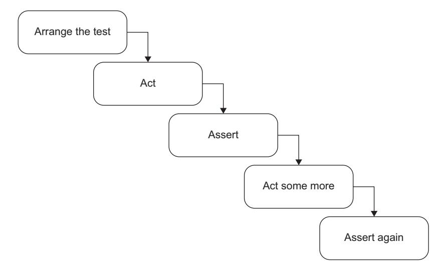
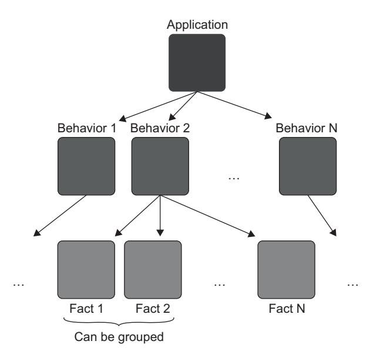

# Chapter 3: The anatomy of a unit test

<span id="page-62-1"></span>
<span id="page-62-0"></span>
## This chapter covers

- The structure of a unit test
- Unit test naming best practices
- Working with parameterized tests
- Working with fluent assertions

In this remaining chapter of part 1, I'll give you a refresher on some basic topics. I'll go over the structure of a typical unit test, which is usually represented by the *arrange, act, and assert* (AAA) pattern. I'll also show the unit testing framework of my choice—xUnit—and explain why I'm using it and not one of its competitors.

 Along the way, we'll talk about naming unit tests. There are quite a few competing pieces of advice on this topic, and unfortunately, most of them don't do a good enough job improving your unit tests. In this chapter, I describe those less-useful naming practices and show why they usually aren't the best choice. Instead of those practices, I give you an alternative—a simple, easy-to-follow guideline for naming tests in a way that makes them readable not only to the programmer who wrote them, but also to any other person familiar with the problem domain.

 Finally, I'll talk about some features of the framework that help streamline the process of unit testing. Don't worry about this information being too specific to C# and .NET; most unit testing frameworks exhibit similar functionality, regardless of the programming language. If you learn one of them, you won't have problems working with another.

<span id="page-63-0"></span>
## 3.1 How to structure a unit test

<span id="page-63-2"></span>This section shows how to structure unit tests using the arrange, act, and assert pattern, what pitfalls to avoid, and how to make your tests as readable as possible.

<span id="page-63-1"></span>
### 3.1.1 Using the AAA pattern

<span id="page-63-3"></span>The AAA pattern advocates for splitting each test into three parts: *arrange*, *act*, and *assert*. (This pattern is sometimes also called the *3A pattern*.) Let's take a Calculator class with a single method that calculates a sum of two numbers:

```
public class Calculator
{
    public double Sum(double first, double second)
    {
        return first + second;
    }
}
```

The following listing shows a test that verifies the class's behavior. This test follows the AAA pattern.

#### Listing 3.1 A test covering the **Sum** method in **calculator**

```
public class CalculatorTests 
           {
               [Fact] 
               public void Sum_of_two_numbers() 
               {
                    // Arrange
                    double first = 10; 
                    double second = 20; 
                    var calculator = new Calculator(); 
                    // Act
                    double result = calculator.Sum(first, second); 
                    // Assert
                    Assert.Equal(30, result); 
               }
           }
                                                          Class-container for a 
                                                          cohesive set of tests
                                                       xUnit's attribute 
                                                       indicating a test
Name of the
  unit test
                                                              Arrange 
                                                              section
                                                                               Act section
                                                      Assert section
```

The AAA pattern provides a simple, uniform structure for all tests in the suite. This uniformity is one of the biggest advantages of this pattern: once you get used to it, you can easily read and understand any test. That, in turn, reduces maintenance costs for your entire test suite. The structure is as follows:

- <span id="page-64-4"></span> In the *arrange section*, you bring the system under test (SUT) and its dependencies to a desired state.
- In the *act section*, you call methods on the SUT, pass the prepared dependencies, and capture the output value (if any).
- In the *assert section*, you verify the outcome. The outcome may be represented by the return value, the final state of the SUT and its collaborators, or the methods the SUT called on those collaborators.

### Given-When-Then pattern

You might have heard of the *Given-When-Then* pattern, which is similar to AAA. This pattern also advocates for breaking the test down into three parts:

- <span id="page-64-3"></span>*Given*—Corresponds to the arrange section
- *When*—Corresponds to the act section
- *Then*—Corresponds to the assert section

There's no difference between the two patterns in terms of the test composition. The only distinction is that the Given-When-Then structure is more readable to nonprogrammers. Thus, Given-When-Then is more suitable for tests that are shared with non-technical people.

<span id="page-64-5"></span>The natural inclination is to start writing a test with the *arrange* section. After all, it comes before the other two. This approach works well in the vast majority of cases, but starting with the *assert* section is a viable option too. When you practice Test-Driven Development (TDD)—that is, when you create a failing test before developing a feature—you don't know enough about the feature's behavior yet. So, it becomes advantageous to first outline what you expect from the behavior and then figure out how to develop the system to meet this expectation.

 Such a technique may look counterintuitive, but it's how we approach problem solving. We start by thinking about the objective: what a particular behavior should to do for us. The actual solving of the problem comes after that. Writing down the assertions before everything else is merely a formalization of this thinking process. But again, this guideline is only applicable when you follow TDD—when you write a test before the production code. If you write the production code before the test, by the time you move on to the test, you already know what to expect from the behavior, so starting with the *arrange* section is a better option.

<span id="page-64-0"></span>
### 3.1.2 Avoid multiple arrange, act, and assert sections

<span id="page-64-2"></span><span id="page-64-1"></span>Occasionally, you may encounter a test with multiple *arrange*, *act*, or *assert* sections. It usually works as shown in figure 3.1.

 When you see multiple *act* sections separated by *assert* and, possibly, *arrange* sections, it means the test verifies multiple units of behavior. And, as we discussed in chapter 2, such a test is no longer a unit test but rather is an integration test. It's best



Figure 3.1 Multiple arrange, act, and assert sections are a hint that the test verifies too many things at once. Such a test needs to be split into several tests to fix the problem.

to avoid such a test structure. A single action ensures that your tests remain within the realm of unit testing, which means they are simple, fast, and easy to understand. If you see a test containing a sequence of actions and assertions, refactor it. Extract each act into a test of its own.

 It's sometimes fine to have multiple *act* sections in integration tests. As you may remember from the previous chapter, integration tests can be slow. One way to speed them up is to group several integration tests together into a single test with multiple *acts* and *assertions*. It's especially helpful when system states naturally flow from one another: that is, when an *act* simultaneously serves as an *arrange* for the subsequent *act*.

<span id="page-65-2"></span> But again, this optimization technique is only applicable to integration tests—and not all of them, but rather those that are already slow and that you don't want to become even slower. There's no need for such an optimization in unit tests or integration tests that are fast enough. It's always better to split a multistep unit test into several tests.

<span id="page-65-0"></span>
## 3.1.3 Avoid if statements in tests

<span id="page-65-1"></span>Similar to multiple occurrences of the *arrange*, *act*, and *assert* sections, you may sometimes encounter a unit test with an if statement. This is also an anti-pattern. A test whether a unit test or an integration test—should be a simple sequence of steps with no branching.

 An if statement indicates that the test verifies too many things at once. Such a test, therefore, should be split into several tests. But unlike the situation with multiple AAA <span id="page-66-1"></span>sections, there's no exception for integration tests. There are no benefits in branching within a test. You only gain additional maintenance costs: if statements make the tests harder to read and understand.

<span id="page-66-0"></span>
### 3.1.4 How large should each section be?

<span id="page-66-2"></span>A common question people ask when starting out with the AAA pattern is, how large should each section be? And what about the teardown section—the section that cleans up after the test? There are different guidelines regarding the size for each of the test sections.

<span id="page-66-3"></span>
#### THE ARRANGE SECTION IS THE LARGEST

The *arrange* section is usually the largest of the three. It can be as large as the *act* and *assert* sections combined. But if it becomes significantly larger than that, it's better to extract the arrangements either into private methods within the same test class or to a separate factory class. Two popular patterns can help you reuse the code in the *arrange* sections: *Object Mother* and *Test Data Builder*.

<span id="page-66-6"></span>
<span id="page-66-4"></span>
#### WATCH OUT FOR ACT SECTIONS THAT ARE LARGER THAN A SINGLE LINE

The *act* section is normally just a single line of code. If the *act* consists of two or more lines, it could indicate a problem with the SUT's public API.

 It's best to express this point with an example, so let's take one from chapter 2, which I repeat in the following listing. In this example, the customer makes a purchase from a store.

<span id="page-66-5"></span>
#### Listing 3.2 A single-line *act* section

```
[Fact]
public void Purchase_succeeds_when_enough_inventory()
{
    // Arrange
    var store = new Store();
    store.AddInventory(Product.Shampoo, 10);
    var customer = new Customer();
    // Act
    bool success = customer.Purchase(store, Product.Shampoo, 5);
    // Assert
    Assert.True(success);
    Assert.Equal(5, store.GetInventory(Product.Shampoo));
}
```

Notice that the *act* section in this test is a single method call, which is a sign of a welldesigned class's API. Now compare it to the version in listing 3.3: this *act* section contains two lines. And that's a sign of a problem with the SUT: it requires the client to remember to make the second method call to finish the purchase and thus lacks encapsulation.

<span id="page-67-2"></span>
#### Listing 3.3 A two-line *act* section

```
[Fact]
public void Purchase_succeeds_when_enough_inventory()
{
    // Arrange
    var store = new Store();
    store.AddInventory(Product.Shampoo, 10);
    var customer = new Customer();
    // Act
    bool success = customer.Purchase(store, Product.Shampoo, 5);
    store.RemoveInventory(success, Product.Shampoo, 5);
    // Assert
    Assert.True(success);
    Assert.Equal(5, store.GetInventory(Product.Shampoo));
}
```

Here's what you can read from listing 3.3's *act* section:

- In the first line, the customer tries to acquire five units of shampoo from the store.
- In the second line, the inventory is removed from the store. The removal takes place only if the preceding call to Purchase() returns a success.

The issue with the new version is that it requires two method calls to perform a single operation. Note that this is not an issue with the test itself. The test still verifies the same unit of behavior: the process of making a purchase. The issue lies in the API surface of the Customer class. It shouldn't require the client to make an additional method call.

 From a business perspective, a successful purchase has two outcomes: the acquisition of a product by the customer and the reduction of the inventory in the store. Both of these outcomes must be achieved together, which means there should be a single public method that does both things. Otherwise, there's a room for inconsistency if the client code calls the first method but not the second, in which case the customer will acquire the product but its available amount won't be reduced in the store.

<span id="page-67-1"></span><span id="page-67-0"></span> Such an inconsistency is called an *invariant violation*. The act of protecting your code against potential inconsistencies is called *encapsulation*. When an inconsistency penetrates into the database, it becomes a big problem: now it's impossible to reset the state of your application by simply restarting it. You'll have to deal with the corrupted data in the database and, potentially, contact customers and handle the situation on a case-by-case basis. Just imagine what would happen if the application generated confirmation receipts without actually reserving the inventory. It might issue claims to, and even charge for, more inventory than you could feasibly acquire in the near future.

 The remedy is to maintain code encapsulation at all times. In the previous example, the customer should remove the acquired inventory from the store as part of its Purchase method and not rely on the client code to do so. When it comes to maintaining invariants, you should eliminate any potential course of action that could lead to an invariant violation.

<span id="page-68-6"></span> This guideline of keeping the *act* section down to a single line holds true for the vast majority of code that contains business logic, but less so for utility or infrastructure code. Thus, I won't say "never do it." Be sure to examine each such case for a potential breach in encapsulation, though.

<span id="page-68-0"></span>
#### 3.1.5 How many assertions should the assert section hold?

<span id="page-68-5"></span>Finally, there's the *assert* section. You may have heard about the guideline of having one assertion per test. It takes root in the premise discussed in the previous chapter: the premise of targeting the smallest piece of code possible.

<span id="page-68-9"></span> As you already know, this premise is incorrect. A *unit* in unit testing is a unit of *behavior*, *not* a unit of *code*. A single unit of behavior can exhibit multiple outcomes, and it's fine to evaluate them all in one test.

<span id="page-68-8"></span> Having that said, you need to watch out for assertion sections that grow too large: it could be a sign of a missing abstraction in the production code. For example, instead of asserting all properties inside an object returned by the SUT, it may be better to define proper equality members in the object's class. You can then compare the object to an expected value using a single assertion.

<span id="page-68-1"></span>
#### 3.1.6 What about the teardown phase?

<span id="page-68-7"></span>Some people also distinguish a fourth section, *teardown*, which comes after *arrange*, *act*, and *assert*. For example, you can use this section to remove any files created by the test, close a database connection, and so on. The teardown is usually represented by a separate method, which is reused across all tests in the class. Thus, I don't include this phase in the AAA pattern.

<span id="page-68-4"></span> Note that most unit tests don't need teardown. Unit tests don't talk to out-of-process dependencies and thus don't leave side effects that need to be disposed of. That's a realm of integration testing. We'll talk more about how to properly clean up after integration tests in part 3.

<span id="page-68-2"></span>
#### 3.1.7 Differentiating the system under test

<span id="page-68-3"></span>The SUT plays a significant role in tests. It provides an entry point for the behavior you want to invoke in the application. As we discussed in the previous chapter, this behavior can span across as many as several classes or as little as a single method. But there can be only one entry point: one class that triggers that behavior.

 Thus it's important to differentiate the SUT from its dependencies, especially when there are quite a few of them, so that you don't need to spend too much time figuring out who is who in the test. To do that, always name the SUT in tests sut. The following listing shows how CalculatorTests would look after renaming the Calculator instance.

<span id="page-69-1"></span>
#### Listing 3.4 Differentiating the SUT from its dependencies

```
public class CalculatorTests
{
    [Fact]
    public void Sum_of_two_numbers()
    {
        // Arrange
        double first = 10;
        double second = 20;
        var sut = new Calculator(); 
        // Act
        double result = sut.Sum(first, second);
        // Assert
        Assert.Equal(30, result);
    }
}
                                               The calculator is 
                                               now called sut.
```

<span id="page-69-0"></span>
#### 3.1.8 Dropping the arrange, act, and assert comments from tests

<span id="page-69-3"></span><span id="page-69-2"></span>Just as it's important to set the SUT apart from its dependencies, it's also important to differentiate the three sections from each other, so that you don't spend too much time figuring out what section a particular line in the test belongs to. One way to do that is to put // Arrange, // Act, and // Assert comments before the beginning of each section. Another way is to separate the sections with empty lines, as shown next.

#### Listing 3.5 Calculator with sections separated by empty lines

```
public class CalculatorTests
{
    [Fact]
    public void Sum_of_two_numbers()
    {
        double first = 10; 
        double second = 20; 
        var sut = new Calculator(); 
        double result = sut.Sum(first, second); 
        Assert.Equal(30, result); 
    }
}
                                        Arrange
                                                         Act
                                          Assert
```

Separating sections with empty lines works great in most unit tests. It allows you to keep a balance between brevity and readability. It doesn't work as well in large tests, though, where you may want to put additional empty lines inside the *arrange* section to differentiate between configuration stages. This is often the case in integration tests—they frequently contain complicated setup logic. Therefore,

- Drop the section comments in tests that follow the AAA pattern and where you can avoid additional empty lines inside the *arrange* and *assert* sections.
- <span id="page-70-1"></span>Keep the section comments otherwise.

<span id="page-70-0"></span>
## 3.2 Exploring the xUnit testing framework

<span id="page-70-5"></span><span id="page-70-3"></span>In this section, I give a brief overview of unit testing tools available in .NET, and their features. I'm using xUnit (<https://github.com/xunit/xunit>) as the unit testing framework (note that you need to install the xunit.runner.visualstudio NuGet package in order to run xUnit tests from Visual Studio). Although this framework works in .NET only, every object-oriented language (Java, C++, JavaScript, and so on) has unit testing frameworks, and all those frameworks look quite similar to each other. If you've worked with one of them, you won't have any issues working with another.

<span id="page-70-4"></span><span id="page-70-2"></span> In .NET alone, there are several alternatives to choose from, such as NUnit [\(https://github.com/nunit/nunit\)](https://github.com/nunit/nunit) and the built-in Microsoft MSTest. I personally prefer xUnit for the reasons I'll describe shortly, but you can also use NUnit; these two frameworks are pretty much on par in terms of functionality. I don't recommend MSTest, though; it doesn't provide the same level of flexibility as xUnit and NUnit. And don't take my word for it—even people inside Microsoft refrain from using MSTest. For example, the ASP.NET Core team uses xUnit.

 I prefer xUnit because it's a cleaner, more concise version of NUnit. For example, you may have noticed that in the tests I've brought up so far, there are no frameworkrelated attributes other than [Fact], which marks the method as a unit test so the unit testing framework knows to run it. There are no [TestFixture] attributes; any public class can contain a unit test. There's also no [SetUp] or [TearDown]. If you need to share configuration logic between tests, you can put it inside the constructor. And if you need to clean something up, you can implement the IDisposable interface, as shown in this listing.

Listing 3.6 Arrangement and teardown logic, shared by all tests

```
public class CalculatorTests : IDisposable
{
   private readonly Calculator _sut;
   public CalculatorTests() 
   { 
       _sut = new Calculator(); 
   } 
   [Fact]
   public void Sum_of_two_numbers()
   {
       /* ... */
   }
                                Called before 
                                each test in 
                                the class
```

```
public void Dispose() 
   { 
      _sut.CleanUp(); 
   } 
}
                       Called after 
                       each test in 
                       the class
```

As you can see, the xUnit authors took significant steps toward simplifying the framework. A lot of notions that previously required additional configuration (like [TestFixture] or [SetUp] attributes) now rely on conventions or built-in language constructs.

 I particularly like the [Fact] attribute, specifically because it's called Fact and not Test. It emphasizes the rule of thumb I mentioned in the previous chapter: *each test should tell a story*. This story is an individual, atomic scenario or fact about the problem domain, and the passing test is a proof that this scenario or fact holds true. If the test fails, it means either the story is no longer valid and you need to rewrite it, or the system itself has to be fixed.

<span id="page-71-4"></span> I encourage you to adopt this way of thinking when you write unit tests. Your tests shouldn't be a dull enumeration of what the production code does. Rather, they should provide a higher-level description of the application's behavior. Ideally, this description should be meaningful not just to programmers but also to business people.

<span id="page-71-0"></span>
## 3.3 Reusing test fixtures between tests

<span id="page-71-3"></span>It's important to know how and when to reuse code between tests. Reusing code between *arrange* sections is a good way to shorten and simplify your tests, and this section shows how to do that properly.

 I mentioned earlier that often, fixture arrangements take up too much space. It makes sense to extract these arrangements into separate methods or classes that you then reuse between tests. There are two ways you can perform such reuse, but only one of them is beneficial; the other leads to increased maintenance costs.

### Test fixture

The term *test fixture* has two common meanings:

- <span id="page-71-2"></span><span id="page-71-1"></span>1 A *test fixture* is an object the test runs against. This object can be a regular dependency—an argument that is passed to the SUT. It can also be data in the database or a file on the hard disk. Such an object needs to remain in a known, *fixed* state before each test run, so it produces the same result. Hence the word *fixture*.
- 2 The other definition comes from the NUnit testing framework. In NUnit, Test-Fixture is an attribute that marks a class containing tests.

I use the first definition throughout this book.

The first—incorrect—way to reuse test fixtures is to initialize them in the test's constructor (or the method marked with a [SetUp] attribute if you are using NUnit), as shown next.

<span id="page-72-0"></span>Listing 3.7 Extracting the initialization code into the test constructor

```
public class CustomerTests
{
   private readonly Store _store; 
   private readonly Customer _sut;
   public CustomerTests() 
   { 
      _store = new Store(); 
      _store.AddInventory(Product.Shampoo, 10); 
      _sut = new Customer(); 
   } 
   [Fact]
   public void Purchase_succeeds_when_enough_inventory()
   {
      bool success = _sut.Purchase(_store, Product.Shampoo, 5);
      Assert.True(success);
      Assert.Equal(5, _store.GetInventory(Product.Shampoo));
   }
   [Fact]
   public void Purchase_fails_when_not_enough_inventory()
   {
      bool success = _sut.Purchase(_store, Product.Shampoo, 15);
      Assert.False(success);
      Assert.Equal(10, _store.GetInventory(Product.Shampoo));
   }
}
                                      Common test 
                                      fixture
                                                Runs before 
                                                each test in 
                                                the class
```

The two tests in listing 3.7 have common configuration logic. In fact, their *arrange* sections are the same and thus can be fully extracted into CustomerTests's constructor which is precisely what I did here. The tests themselves no longer contain arrangements.

 With this approach, you can significantly reduce the amount of test code—you can get rid of most or even all test fixture configurations in tests. But this technique has two significant drawbacks:

- It introduces high coupling between tests.
- It diminishes test readability.

Let's discuss these drawbacks in more detail.

<span id="page-73-0"></span>
#### 3.3.1 High coupling between tests is an anti-pattern

<span id="page-73-4"></span>In the new version, shown in listing 3.7, all tests are coupled to each other: a modification of one test's arrangement logic will affect all tests in the class. For example, changing this line

```
_store.AddInventory(Product.Shampoo, 10);
to this
_store.AddInventory(Product.Shampoo, 15);
```

would invalidate the assumption the tests make about the store's initial state and therefore would lead to unnecessary test failures.

 That's a violation of an important guideline: *a modification of one test should not affect other tests*. This guideline is similar to what we discussed in chapter 2—that tests should run in isolation from each other. It's not the same, though. Here, we are talking about independent modification of tests, not independent execution. Both are important attributes of a well-designed test.

 To follow this guideline, you need to avoid introducing shared state in test classes. These two private fields are examples of such a shared state:

```
private readonly Store _store;
private readonly Customer _sut;
```

<span id="page-73-1"></span>
#### 3.3.2 The use of constructors in tests diminishes test readability

<span id="page-73-3"></span>The other drawback to extracting the arrangement code into the constructor is diminished test readability. You no longer see the full picture just by looking at the test itself. You have to examine different places in the class to understand what the test method does.

 Even if there's not much arrangement logic—say, only instantiation of the fixtures you are still better off moving it directly to the test method. Otherwise, you'll wonder if it's really just instantiation or something else being configured there, too. A self-contained test doesn't leave you with such uncertainties.

<span id="page-73-2"></span>
#### 3.3.3 A better way to reuse test fixtures

<span id="page-73-5"></span>The use of the constructor is not the best approach when it comes to reusing test fixtures. The second way—the beneficial one—is to introduce private factory methods in the test class, as shown in the following listing.

#### Listing 3.8 Extracting the common initialization code into private factory methods

```
public class CustomerTests
{
    [Fact]
    public void Purchase_succeeds_when_enough_inventory()
    {
```

```
Store store = CreateStoreWithInventory(Product.Shampoo, 10);
        Customer sut = CreateCustomer();
        bool success = sut.Purchase(store, Product.Shampoo, 5);
        Assert.True(success);
        Assert.Equal(5, store.GetInventory(Product.Shampoo));
    }
    [Fact]
    public void Purchase_fails_when_not_enough_inventory()
    {
        Store store = CreateStoreWithInventory(Product.Shampoo, 10);
        Customer sut = CreateCustomer();
        bool success = sut.Purchase(store, Product.Shampoo, 15);
        Assert.False(success);
        Assert.Equal(10, store.GetInventory(Product.Shampoo));
    }
    private Store CreateStoreWithInventory(
        Product product, int quantity)
    {
        Store store = new Store();
        store.AddInventory(product, quantity);
        return store;
    }
    private static Customer CreateCustomer()
    {
        return new Customer();
    }
}
```

By extracting the common initialization code into private factory methods, you can also shorten the test code, but at the same time keep the full context of what's going on in the tests. Moreover, the private methods don't couple tests to each other as long as you make them generic enough. That is, allow the tests to specify how they want the fixtures to be created.

<span id="page-74-1"></span><span id="page-74-0"></span>Look at this line, for example:

```
Store store = CreateStoreWithInventory(Product.Shampoo, 10);
```

The test explicitly states that it wants the factory method to add 10 units of shampoo to the store. This is both highly readable and reusable. It's *readable* because you don't need to examine the internals of the factory method to understand the attributes of the created store. It's *reusable* because you can use this method in other tests, too.

 Note that in this particular example, there's no need to introduce factory methods, as the arrangement logic is quite simple. View it merely as a demonstration.

 There's one exception to this rule of reusing test fixtures. You can instantiate a fixture in the constructor if it's used by all or almost all tests. This is often the case for integration tests that work with a database. All such tests require a database connection, which you can initialize once and then reuse everywhere. But even then, it would make more sense to introduce a base class and initialize the database connection in that class's constructor, not in individual test classes. See the following listing for an example of common initialization code in a base class.

#### Listing 3.9 Common initialization code in a base class

```
public class CustomerTests : IntegrationTests
{
    [Fact]
    public void Purchase_succeeds_when_enough_inventory()
    {
        /* use _database here */
    }
}
public abstract class IntegrationTests : IDisposable
{
    protected readonly Database _database;
    protected IntegrationTests()
    {
        _database = new Database();
    }
    public void Dispose()
    {
        _database.Dispose();
    }
}
```

<span id="page-75-2"></span>Notice how CustomerTests remains constructor-less. It gets access to the \_database instance by inheriting from the IntegrationTests base class.

<span id="page-75-0"></span>
## 3.4 Naming a unit test

<span id="page-75-1"></span>It's important to give expressive names to your tests. Proper naming helps you understand what the test verifies and how the underlying system behaves.

 So, how should you name a unit test? I've seen and tried a lot of naming conventions over the past decade. One of the most prominent, and probably least helpful, is the following convention:

```
[MethodUnderTest]_[Scenario]_[ExpectedResult]
```

### where

- MethodUnderTest is the name of the method you are testing.
- Scenario is the condition under which you test the method.

 ExpectedResult is what you expect the method under test to do in the current scenario.

It's unhelpful specifically because it encourages you to focus on implementation details instead of the behavior.

 Simple phrases in plain English do a much better job: they are more expressive and don't box you in a rigid naming structure. With simple phrases, you can describe the system behavior in a way that's meaningful to a customer or a domain expert. To give you an example of a test titled in plain English, here's the test from listing 3.5 once again:

```
public class CalculatorTests
{
    [Fact]
    public void Sum_of_two_numbers()
    {
        double first = 10;
        double second = 20;
        var sut = new Calculator();
        double result = sut.Sum(first, second);
        Assert.Equal(30, result);
    }
}
```

How could the test's name (Sum\_of\_two\_numbers) be rewritten using the [MethodUnder-Test]\_[Scenario]\_[ExpectedResult] convention? Probably something like this:

```
public void Sum_TwoNumbers_ReturnsSum()
```

The method under test is Sum, the scenario includes two numbers, and the expected result is a sum of those two numbers. The new name looks logical to a programmer's eye, but does it really help with test readability? Not at all. It's Greek to an uninformed person. Think about it: Why does Sum appear twice in the name of the test? And what is this Returns phrasing all about? Where is the sum returned to? You can't know.

 Some might argue that it doesn't really matter what a non-programmer would think of this name. After all, unit tests are written by programmers for programmers, not domain experts. And programmers are good at deciphering cryptic names—it's their job!

 This is true, but only to a degree. Cryptic names impose a cognitive tax on everyone, programmers or not. They require additional brain capacity to figure out what exactly the test verifies and how it relates to business requirements. This may not seem like much, but the mental burden adds up over time. It slowly but surely increases the maintenance cost for the entire test suite. It's especially noticeable if you return to the test after you've forgotten about the feature's specifics, or try to understand a test written by a colleague. Reading someone else's code is already difficult enough—any help understanding it is of considerable use.

Here are the two versions again:

```
public void Sum_of_two_numbers()
public void Sum_TwoNumbers_ReturnsSum()
```

The initial name written in plain English is much simpler to read. It is a down-to-earth description of the behavior under test.

<span id="page-77-0"></span>
### 3.4.1 Unit test naming guidelines

<span id="page-77-2"></span>Adhere to the following guidelines to write expressive, easily readable test names:

- *Don't follow a rigid naming policy*. You simply can't fit a high-level description of a complex behavior into the narrow box of such a policy. Allow freedom of expression.
- *Name the test as if you were describing the scenario to a non-programmer who is familiar with the problem domain*. A domain expert or a business analyst is a good example.
- <span id="page-77-4"></span> *Separate words with underscores*. Doing so helps improve readability, especially in long names.

Notice that I didn't use underscores when naming the test class, CalculatorTests. Normally, the names of classes are not as long, so they read fine without underscores.

 Also notice that although I use the pattern [ClassName]Tests when naming test classes, it doesn't mean the tests are limited to verifying only that class. Remember, the *unit* in unit testing is a *unit of behavior*, not a class. This unit can span across one or several classes; the actual size is irrelevant. Still, you have to start somewhere. View the class in [ClassName]Tests as just that: an entry point, an API, using which you can verify a unit of behavior.

<span id="page-77-1"></span>
#### 3.4.2 Example: Renaming a test toward the guidelines

<span id="page-77-3"></span>Let's take a test as an example and try to gradually improve its name using the guidelines I just outlined. In the following listing, you can see a test verifying that a delivery with a past date is invalid. The test's name is written using the rigid naming policy that doesn't help with the test readability.

#### Listing 3.10 A test named using the rigid naming policy

```
[Fact]
public void IsDeliveryValid_InvalidDate_ReturnsFalse()
{
    DeliveryService sut = new DeliveryService();
    DateTime pastDate = DateTime.Now.AddDays(-1);
    Delivery delivery = new Delivery
    {
        Date = pastDate
    };
```

```
bool isValid = sut.IsDeliveryValid(delivery);
    Assert.False(isValid);
}
```

This test checks that DeliveryService properly identifies a delivery with an incorrect date as invalid. How would you rewrite the test's name in plain English? The following would be a good first try:

```
public void Delivery_with_invalid_date_should_be_considered_invalid()
```

Notice two things in the new version:

- The name now makes sense to a non-programmer, which means programmers will have an easier time understanding it, too.
- The name of the SUT's method—IsDeliveryValid—is no longer part of the test's name.

The second point is a natural consequence of rewriting the test's name in plain English and thus can be easily overlooked. However, this consequence is important and can be elevated into a guideline of its own.

#### Method under test in the test's name

<span id="page-78-1"></span><span id="page-78-0"></span>Don't include the name of the SUT's method in the test's name.

Remember, you don't test *code*, you test *application behavior*. Therefore, it doesn't matter what the name of the method under test is. As I mentioned previously, the SUT is just an entry point: a means to invoke a behavior. You can decide to rename the method under test to, say, IsDeliveryCorrect, and it will have no effect on the SUT's behavior. On the other hand, if you follow the original naming convention, you'll have to rename the test. This once again shows that targeting *code* instead of *behavior* couples tests to that code's implementation details, which negatively affects the test suite's maintainability. More on this issue in chapter 5.

The only exception to this guideline is when you work on utility code. Such code doesn't contain business logic—its behavior doesn't go much beyond simple auxiliary functionality and thus doesn't mean anything to business people. It's fine to use the SUT's method names there.

But let's get back to the example. The new version of the test's name is a good start, but it can be improved further. What does it mean for a delivery date to be invalid, exactly? From the test in listing 3.10, we can see that an invalid date is any date in the past. This makes sense—you should only be allowed to choose a delivery date in the future.

So let's be specific and reflect this knowledge in the test's name:

```
public void Delivery_with_past_date_should_be_considered_invalid()
```

This is better but still not ideal. It's too verbose. We can get rid of the word considered without any loss of meaning:

```
public void Delivery_with_past_date_should_be_invalid()
```

The wording *should be* is another common anti-pattern. Earlier in this chapter, I mentioned that a test is a single, atomic fact about a unit of behavior. There's no place for a wish or a desire when stating a fact. Name the test accordingly—replace *should be* with *is*:

```
public void Delivery_with_past_date_is_invalid()
```

And finally, there's no need to avoid basic English grammar. Articles help the test read flawlessly. Add the article *a* to the test's name:

```
public void Delivery_with_a_past_date_is_invalid()
```

There you go. This final version is a straight-to-the-point statement of a fact, which itself describes one of the aspects of the application behavior under test: in this particular case, the aspect of determining whether a delivery can be done.

<span id="page-79-0"></span>
## 3.5 Refactoring to parameterized tests

<span id="page-79-2"></span>One test usually is not enough to fully describe a unit of behavior. Such a unit normally consists of multiple components, each of which should be captured with its own test. If the behavior is complex enough, the number of tests describing it can grow dramatically and may become unmanageable. Luckily, most unit testing frameworks provide functionality that allows you to group similar tests using parameterized tests (see figure 3.2).



<span id="page-79-1"></span>Figure 3.2 A typical application exhibits multiple behaviors. The greater the complexity of the behavior, the more facts are required to fully describe it. Each fact is represented by a test. Similar facts can be grouped into a single test method using parameterized tests.

In this section, I'll first show each such behavior component described by a separate test and then demonstrate how these tests can be grouped together.

 Let's say that our delivery functionality works in such a way that the soonest allowed delivery date is two days from now. Clearly, the one test we have isn't enough. In addition to the test that checks for a past delivery date, we'll also need tests that check for today's date, tomorrow's date, and the date after that.

 The existing test is called Delivery\_with\_a\_past\_date\_is\_invalid. We could add three more:

```
public void Delivery_for_today_is_invalid()
public void Delivery_for_tomorrow_is_invalid()
public void The_soonest_delivery_date_is_two_days_from_now()
```

But that would result in four test methods, with the only difference between them being the delivery date.

<span id="page-80-0"></span> A better approach is to group these tests into one in order to reduce the amount of test code. xUnit (like most other test frameworks) has a feature called *parameterized tests* that allows you to do exactly that. The next listing shows how such grouping looks. Each InlineData attribute represents a separate fact about the system; it's a test case in its own right.

### Listing 3.11 A test that encompasses several facts

```
public class DeliveryServiceTests
{
    [InlineData(-1, false)] 
    [InlineData(0, false)] 
    [InlineData(1, false)] 
    [InlineData(2, true)] 
    [Theory]
    public void Can_detect_an_invalid_delivery_date(
         int daysFromNow, 
         bool expected) 
    {
         DeliveryService sut = new DeliveryService();
         DateTime deliveryDate = DateTime.Now
             .AddDays(daysFromNow); 
         Delivery delivery = new Delivery
         {
             Date = deliveryDate
         };
         bool isValid = sut.IsDeliveryValid(delivery);
         Assert.Equal(expected, isValid); 
    }
}
                                    The InlineData attribute sends a 
                                    set of input values to the test 
                                    method. Each line represents a 
                                    separate fact about the behavior.
                                       Parameters to which the attributes 
                                       attach the input values
                                                                Uses the 
                                                                parameters
```

TIP Notice the use of the [Theory] attribute instead of [Fact]. A theory is a bunch of facts about the behavior.

Each fact is now represented by an [InlineData] line rather than a separate test. I also renamed the test method something more generic: it no longer mentions what constitutes a valid or invalid date.

 Using parameterized tests, you can significantly reduce the amount of test code, but this benefit comes at a cost. It's now hard to figure out what facts the test method represents. And the more parameters there are, the harder it becomes. As a compromise, you can extract the positive test case into its own test and benefit from the descriptive naming where it matters the most—in determining what differentiates valid and invalid delivery dates, as shown in the following listing.

Listing 3.12 Two tests verifying the positive and negative scenarios

```
public class DeliveryServiceTests
{
    [InlineData(-1)]
    [InlineData(0)]
    [InlineData(1)]
    [Theory]
    public void Detects_an_invalid_delivery_date(int daysFromNow)
    {
        /* ... */
    }
    [Fact]
    public void The_soonest_delivery_date_is_two_days_from_now()
    {
        /* ... */
    }
}
```

This approach also simplifies the negative test cases, since you can remove the expected Boolean parameter from the test method. And, of course, you can transform the positive test method into a parameterized test as well, to test multiple dates.

 As you can see, there's a trade-off between the amount of test code and the readability of that code. As a rule of thumb, keep both positive and negative test cases together in a single method only when it's self-evident from the input parameters which case stands for what. Otherwise, extract the positive test cases. And if the behavior is too complicated, don't use the parameterized tests at all. Represent each negative and positive test case with its own test method.

<span id="page-81-0"></span>
#### 3.5.1 Generating data for parameterized tests

<span id="page-81-2"></span><span id="page-81-1"></span>There are some caveats in using parameterized tests (at least, in .NET) that you need to be aware of. Notice that in listing 3.11, I used the daysFromNow parameter as an input to the test method. Why not the actual date and time, you might ask? Unfortunately, the following code won't work:

```
[InlineData(DateTime.Now.AddDays(-1), false)]
[InlineData(DateTime.Now, false)]
```

```
[InlineData(DateTime.Now.AddDays(1), false)]
[InlineData(DateTime.Now.AddDays(2), true)]
[Theory]
public void Can_detect_an_invalid_delivery_date(
    DateTime deliveryDate,
    bool expected)
{
    DeliveryService sut = new DeliveryService();
    Delivery delivery = new Delivery
    {
        Date = deliveryDate
    };
    bool isValid = sut.IsDeliveryValid(delivery);
    Assert.Equal(expected, isValid);
}
```

In C#, the content of all attributes is evaluated at compile time. You have to use only those values that the compiler can understand, which are as follows:

- Constants
- Literals
- typeof() expressions

The call to DateTime.Now relies on the .NET runtime and thus is not allowed.

 There is a way to overcome this problem. xUnit has another feature that you can use to generate custom data to feed into the test method: [MemberData]. The next listing shows how we can rewrite the previous test using this feature.

<span id="page-82-0"></span>
#### Listing 3.13 Generating complex data for the parameterized test

```
[Theory]
[MemberData(nameof(Data))]
public void Can_detect_an_invalid_delivery_date(
    DateTime deliveryDate,
    bool expected)
{
    /* ... */
}
public static List<object[]> Data()
{
    return new List<object[]>
    {
        new object[] { DateTime.Now.AddDays(-1), false },
        new object[] { DateTime.Now, false },
        new object[] { DateTime.Now.AddDays(1), false },
        new object[] { DateTime.Now.AddDays(2), true }
    };
}
```

<span id="page-83-5"></span><span id="page-83-3"></span><span id="page-83-2"></span>MemberData accepts the name of a static method that generates a collection of input data (the compiler translates nameof(Data) into a "Data" literal). Each element of the collection is itself a collection that is mapped into the two input parameters: deliveryDate and expected. With this feature, you can overcome the compiler's restrictions and use parameters of any type in the parameterized tests.

<span id="page-83-0"></span>
## 3.6 Using an assertion library to further improve test readability

<span id="page-83-4"></span><span id="page-83-1"></span>One more thing you can do to improve test readability is to use an assertion library. I personally prefer Fluent Assertions [\(https://fluentassertions.com\)](https://fluentassertions.com), but .NET has several competing libraries in this area.

 The main benefit of using an assertion library is how you can restructure the assertions so that they are more readable. Here's one of our earlier tests:

```
[Fact]
public void Sum_of_two_numbers()
{
    var sut = new Calculator();
    double result = sut.Sum(10, 20);
    Assert.Equal(30, result);
}
```

Now compare it to the following, which uses a fluent assertion:

```
[Fact]
public void Sum_of_two_numbers()
{
    var sut = new Calculator();
    double result = sut.Sum(10, 20);
    result.Should().Be(30);
}
```

The assertion from the second test reads as plain English, which is exactly how you want all your code to read. We as humans prefer to absorb information in the form of stories. All stories adhere to this specific pattern:

```
[Subject] [action] [object].
```

For example,

Bob opened the door.

Here, Bob is a subject, opened is an action, and the door is an object. The same rule applies to code. result.Should().Be(30) reads better than Assert.Equal(30, <span id="page-84-1"></span><span id="page-84-0"></span>*Summary* **63**

result) precisely because it follows the story pattern. It's a simple story in which result is a subject, should be is an action, and 30 is an object.

NOTE The paradigm of object-oriented programming (OOP) has become a success partly because of this readability benefit. With OOP, you, too, can structure the code in a way that reads like a story.

The Fluent Assertions library also provides numerous helper methods to assert against numbers, strings, collections, dates and times, and much more. The only drawback is that such a library is an additional dependency you may not want to introduce to your project (although it's for development only and won't be shipped to production).

## Summary

- All unit tests should follow the AAA pattern: *arrange*, *act*, *assert*. If a test has multiple *arrange*, *act*, or *assert* sections, that's a sign that the test verifies multiple units of behavior at once. If this test is meant to be a unit test, split it into several tests—one per each action.
- More than one line in the *act* section is a sign of a problem with the SUT's API. It requires the client to remember to always perform these actions together, which can potentially lead to inconsistencies. Such inconsistencies are called *invariant violations*. The act of protecting your code against potential invariant violations is called *encapsulation*.
- Distinguish the SUT in tests by naming it sut. Differentiate the three test sections either by putting Arrange, Act, and Assert comments before them or by introducing empty lines between these sections.
- Reuse test fixture initialization code by introducing factory methods, not by putting this initialization code to the constructor. Such reuse helps maintain a high degree of decoupling between tests and also provides better readability.
- Don't use a rigid test naming policy. Name each test as if you were describing the scenario in it to a non-programmer who is familiar with the problem domain. Separate words in the test name by underscores, and don't include the name of the method under test in the test name.
- Parameterized tests help reduce the amount of code needed for similar tests. The drawback is that the test names become less readable as you make them more generic.
- <span id="page-84-2"></span> Assertion libraries help you further improve test readability by restructuring the word order in assertions so that they read like plain English.
