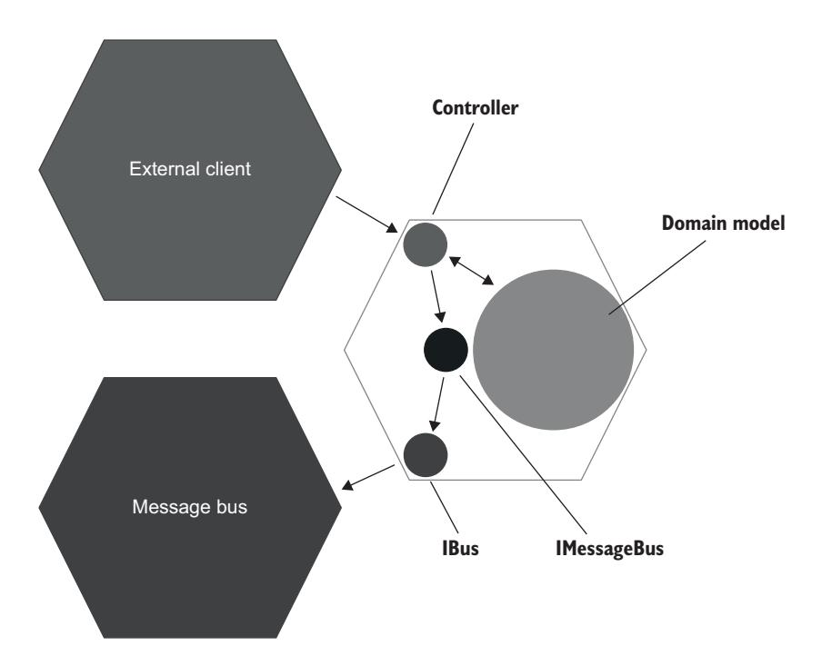

<span id="page-237-0"></span>
# Chapter 9: Mocking best practices

## This chapter covers

- Maximizing the value of mocks
- Replacing mocks with spies
- Mocking best practices

<span id="page-237-2"></span>As you might remember from chapter 5, a mock is a test double that helps to emulate and examine interactions between the system under test and its dependencies. As you might also remember from chapter 8, mocks should only be applied to *unmanaged dependencies* (interactions with such dependencies are observable by external applications). Using mocks for anything else results in *brittle tests* (tests that lack the metric of resistance to refactoring). When it comes to mocks, adhering to this one guideline will get you about two-thirds of the way to success.

<span id="page-237-1"></span> This chapter shows the remaining guidelines that will help you develop integration tests that have the greatest possible value by maxing out mocks' resistance to refactoring and protection against regressions. I'll first show a typical use of mocks, describe its drawbacks, and then demonstrate how you can overcome those drawbacks.

<span id="page-238-0"></span>
## 9.1 Maximizing mocks' value

<span id="page-238-1"></span>It's important to limit the use of mocks to unmanaged dependencies, but that's only the first step on the way to maximizing the value of mocks. This topic is best explained with an example, so I'll continue using the CRM system from earlier chapters as a sample project. I'll remind you of its functionality and show the integration test we ended up with. After that, you'll see how that test can be improved with regard to mocking.

 As you might recall, the CRM system currently supports only one use case: changing a user's email. The following listing shows where we left off with the controller.

### Listing 9.1 User controller

```
public class UserController
{
    private readonly Database _database;
    private readonly EventDispatcher _eventDispatcher;
    public UserController(
        Database database,
        IMessageBus messageBus,
        IDomainLogger domainLogger)
    {
        _database = database;
        _eventDispatcher = new EventDispatcher(
            messageBus, domainLogger);
    }
    public string ChangeEmail(int userId, string newEmail)
    {
        object[] userData = _database.GetUserById(userId);
        User user = UserFactory.Create(userData);
        string error = user.CanChangeEmail();
        if (error != null)
            return error;
        object[] companyData = _database.GetCompany();
        Company company = CompanyFactory.Create(companyData);
        user.ChangeEmail(newEmail, company);
        _database.SaveCompany(company);
        _database.SaveUser(user);
        _eventDispatcher.Dispatch(user.DomainEvents);
        return "OK";
    }
}
```

Note that there's no longer any diagnostic logging, but support logging (the IDomain-Logger interface) is still in place (see chapter 8 for more details). Also, listing 9.1 introduces a new class: the EventDispatcher. It converts domain events generated by the domain model into calls to *unmanaged* dependencies (something that the controller previously did by itself), as shown next.

<span id="page-239-0"></span>
#### Listing 9.2 Event dispatcher

```
public class EventDispatcher
{
    private readonly IMessageBus _messageBus;
    private readonly IDomainLogger _domainLogger;
    public EventDispatcher(
        IMessageBus messageBus,
        IDomainLogger domainLogger)
    {
        _domainLogger = domainLogger;
        _messageBus = messageBus;
    }
    public void Dispatch(List<IDomainEvent> events)
    {
        foreach (IDomainEvent ev in events)
        {
            Dispatch(ev);
        }
    }
    private void Dispatch(IDomainEvent ev)
    {
        switch (ev)
        {
            case EmailChangedEvent emailChangedEvent:
                _messageBus.SendEmailChangedMessage(
                     emailChangedEvent.UserId,
                     emailChangedEvent.NewEmail);
                break;
            case UserTypeChangedEvent userTypeChangedEvent:
                _domainLogger.UserTypeHasChanged(
                     userTypeChangedEvent.UserId,
                     userTypeChangedEvent.OldType,
                     userTypeChangedEvent.NewType);
                break;
        }
    }
}
```

Finally, the following listing shows the integration test. This test goes through all outof-process dependencies (both managed and unmanaged).

#### Listing 9.3 Integration test

```
[Fact]
public void Changing_email_from_corporate_to_non_corporate()
{
```

```
// Arrange
   var db = new Database(ConnectionString);
   User user = CreateUser("user@mycorp.com", UserType.Employee, db);
   CreateCompany("mycorp.com", 1, db);
   var messageBusMock = new Mock<IMessageBus>(); 
   var loggerMock = new Mock<IDomainLogger>(); 
   var sut = new UserController(
       db, messageBusMock.Object, loggerMock.Object);
   // Act
   string result = sut.ChangeEmail(user.UserId, "new@gmail.com");
   // Assert
   Assert.Equal("OK", result);
   object[] userData = db.GetUserById(user.UserId);
   User userFromDb = UserFactory.Create(userData);
   Assert.Equal("new@gmail.com", userFromDb.Email);
   Assert.Equal(UserType.Customer, userFromDb.Type);
   object[] companyData = db.GetCompany();
   Company companyFromDb = CompanyFactory.Create(companyData);
   Assert.Equal(0, companyFromDb.NumberOfEmployees);
   messageBusMock.Verify( 
       x => x.SendEmailChangedMessage( 
            user.UserId, "new@gmail.com"), 
       Times.Once); 
   loggerMock.Verify( 
       x => x.UserTypeHasChanged( 
           user.UserId, 
           UserType.Employee, 
           UserType.Customer), 
       Times.Once); 
}
                                                  Sets up the 
                                                  mocks
                                           Verifies the 
                                           interactions 
                                           with the mocks
```

This test mocks out two unmanaged dependencies: IMessageBus and IDomainLogger. I'll focus on IMessageBus first. We'll discuss IDomainLogger later in this chapter.

<span id="page-240-0"></span>
#### 9.1.1 Verifying interactions at the system edges

<span id="page-240-1"></span>Let's discuss why the mocks used by the integration test in listing 9.3 aren't ideal in terms of their protection against regressions and resistance to refactoring and how we can fix that.

TIP When mocking, always adhere to the following guideline: verify interactions with unmanaged dependencies at the very edges of your system.

The problem with messageBusMock in listing 9.3 is that the IMessageBus interface doesn't reside at the system's edge. Look at that interface's implementation.

<span id="page-241-0"></span>
#### Listing 9.4 Message bus

```
public interface IMessageBus
{
    void SendEmailChangedMessage(int userId, string newEmail);
}
public class MessageBus : IMessageBus
{
    private readonly IBus _bus;
    public void SendEmailChangedMessage(
        int userId, string newEmail)
    {
        _bus.Send("Type: USER EMAIL CHANGED; " +
            $"Id: {userId}; " +
            $"NewEmail: {newEmail}");
    }
}
public interface IBus
{
    void Send(string message);
}
```

Both the IMessageBus and IBus interfaces (and the classes implementing them) belong to our project's code base. IBus is a wrapper on top of the message bus SDK library (provided by the company that develops that message bus). This wrapper encapsulates nonessential technical details, such as connection credentials, and exposes a nice, clean interface for sending arbitrary text messages to the bus. IMessageBus is a wrapper on top of IBus; it defines messages specific to your domain. IMessageBus helps you keep all such messages in one place and reuse them across the application.

 It's possible to merge the IBus and IMessageBus interfaces together, but that would be a suboptimal solution. These two responsibilities—hiding the external library's complexity and holding all application messages in one place—are best kept separated. This is the same situation as with ILogger and IDomainLogger, which you saw in chapter 8. IDomainLogger implements specific logging functionality required by the business, and it does that by using the generic ILogger behind the scenes.

 Figure 9.1 shows where IBus and IMessageBus stand from a hexagonal architecture perspective: IBus is the last link in the chain of types between the controller and the message bus, while IMessageBus is only an intermediate step on the way.

<span id="page-241-1"></span> Mocking IBus instead of IMessageBus maximizes the mock's protection against regressions. As you might remember from chapter 4, protection against regressions is a function of the amount of code that is executed during the test. Mocking the very last type that communicates with the unmanaged dependency increases the number of classes the integration test goes through and thus improves the protection. This guideline is also the reason you don't want to mock EventDispatcher. It resides even further away from the edge of the system, compared to IMessageBus.



Figure 9.1 **IBus** resides at the system's edge; **IMessageBus** is only an intermediate link in the chain of types between the controller and the message bus. Mocking **IBus** instead of **IMessageBus** achieves the best protection against regressions.

Here's the integration test after retargeting it from IMessageBus to IBus. I'm omitting the parts that didn't change from listing 9.3.

#### Listing 9.5 Integration test targeting **IBus**

```
[Fact]
public void Changing_email_from_corporate_to_non_corporate()
{
    var busMock = new Mock<IBus>();
    var messageBus = new MessageBus(busMock.Object); 
    var loggerMock = new Mock<IDomainLogger>();
    var sut = new UserController(db, messageBus, loggerMock.Object);
    /* ... */
    busMock.Verify(
        x => x.Send(
            "Type: USER EMAIL CHANGED; " + 
            $"Id: {user.UserId}; " + 
            "NewEmail: new@gmail.com"), 
        Times.Once);
}
                                                                    Uses a concrete 
                                                                    class instead of 
                                                                    the interface
                                                  Verifies the actual 
                                                  message sent to 
                                                  the bus
```

Notice how the test now uses the concrete MessageBus class and not the corresponding IMessageBus interface. IMessageBus is an interface with a single implementation, and, as you'll remember from chapter 8, mocking is the only legitimate reason to have such interfaces. Because we no longer mock IMessageBus, this interface can be deleted and its usages replaced with MessageBus.

 Also notice how the test in listing 9.5 checks the text message sent to the bus. Compare it to the previous version:

```
messageBusMock.Verify(
    x => x.SendEmailChangedMessage(user.UserId, "new@gmail.com"),
    Times.Once);
```

There's a huge difference between verifying a call to a custom class that you wrote and the actual text sent to external systems. External systems expect text messages from your application, not calls to classes like MessageBus. In fact, text messages are the only side effect observable externally; classes that participate in producing those messages are mere implementation details. Thus, in addition to the increased protection against regressions, verifying interactions at the very edges of your system also improves resistance to refactoring. The resulting tests are less exposed to potential false positives; no matter what refactorings take place, such tests won't turn red as long as the message's structure is preserved.

<span id="page-243-1"></span> The same mechanism is at play here as the one that gives integration and end-to-end tests additional resistance to refactoring compared to unit tests. They are more detached from the code base and, therefore, aren't affected as much during low-level refactorings.

<span id="page-243-5"></span><span id="page-243-4"></span><span id="page-243-2"></span>TIP A call to an unmanaged dependency goes through several stages before it leaves your application. Pick the last such stage. It is the best way to ensure backward compatibility with external systems, which is the goal that mocks help you achieve.

<span id="page-243-0"></span>
### 9.1.2 Replacing mocks with spies

<span id="page-243-3"></span>As you may remember from chapter 5, a *spy* is a variation of a test double that serves the same purpose as a mock. The only difference is that spies are written manually, whereas mocks are created with the help of a mocking framework. Indeed, spies are often called *handwritten mocks*.

 It turns out that, when it comes to classes residing at the system edges, *spies are superior to mocks*. Spies help you reuse code in the assertion phase, thereby reducing the test's size and improving readability. The next listing shows an example of a spy that works on top of IBus.

#### Listing 9.6 A spy (also known as a handwritten mock)

```
public interface IBus
{
    void Send(string message);
}
```

```
public class BusSpy : IBus
{
    private List<string> _sentMessages = 
        new List<string>(); 
    public void Send(string message)
    {
        _sentMessages.Add(message); 
    }
    public BusSpy ShouldSendNumberOfMessages(int number)
    {
        Assert.Equal(number, _sentMessages.Count);
        return this;
    }
    public BusSpy WithEmailChangedMessage(int userId, string newEmail)
    {
        string message = "Type: USER EMAIL CHANGED; " +
            $"Id: {userId}; " +
            $"NewEmail: {newEmail}";
        Assert.Contains( 
            _sentMessages, x => x == message); 
        return this;
    }
}
                                                 Stores all sent 
                                                 messages 
                                                 locally
                                                   Asserts that the 
                                                   message has been sent
```

The following listing is a new version of the integration test. Again, I'm showing only the relevant parts.

#### Listing 9.7 Using the spy from listing 6.43

```
[Fact]
public void Changing_email_from_corporate_to_non_corporate()
{
    var busSpy = new BusSpy();
    var messageBus = new MessageBus(busSpy);
    var loggerMock = new Mock<IDomainLogger>();
    var sut = new UserController(db, messageBus, loggerMock.Object);
    /* ... */
    busSpy.ShouldSendNumberOfMessages(1)
        .WithEmailChangedMessage(user.UserId, "new@gmail.com");
}
```

Verifying the interactions with the message bus is now succinct and expressive, thanks to the fluent interface that BusSpy provides. With that fluent interface, you can chain together several assertions, thus forming cohesive, almost plain-English sentences.

TIP You can rename BusSpy into BusMock. As I mentioned earlier, the difference between a mock and a spy is an implementation detail. Most programmers aren't familiar with the term *spy*, though, so renaming the spy as BusMock can save your colleagues unnecessary confusion.

There's a reasonable question to be asked here: didn't we just make a full circle and come back to where we started? The version of the test in listing 9.7 looks a lot like the earlier version that mocked IMessageBus:

```
messageBusMock.Verify(
    x => x.SendEmailChangedMessage( 
         user.UserId, "new@gmail.com"), 
    Times.Once); 
                                                Same as WithEmailChanged-
                                                Message(user.UserId, 
                                                "new@gmail.com")
                                             Same as 
                                             ShouldSendNumberOfMessages(1)
```

These assertions are similar because both BusSpy and MessageBus are wrappers on top of IBus. But there's a crucial difference between the two: BusSpy is part of the test code, whereas MessageBus belongs to the production code. This difference is important because *you shouldn't rely on the production code when making assertions in tests*.

<span id="page-245-3"></span> Think of your tests as auditors. A good auditor wouldn't just take the auditee's words at face value; they would double-check everything. The same is true with the spy: it provides an independent checkpoint that raises an alarm when the message structure is changed. On the other hand, a mock on IMessageBus puts too much trust in the production code.

<span id="page-245-0"></span>
#### 9.1.3 What about IDomainLogger?

<span id="page-245-2"></span>The mock that previously verified interactions with IMessageBus is now targeted at IBus, which resides at the system's edge. Here are the current mock assertions in the integration test.

#### Listing 9.8 Mock assertions

```
busSpy.ShouldSendNumberOfMessages(1) 
   .WithEmailChangedMessage( 
       user.UserId, "new@gmail.com"); 
loggerMock.Verify( 
   x => x.UserTypeHasChanged( 
       user.UserId, 
       UserType.Employee, 
       UserType.Customer), 
   Times.Once); 
                                         Checks 
                                         interactions 
                                         with IBus
                                  Checks 
                                  interactions with 
                                  IDomainLogger
```

Note that just as MessageBus is a wrapper on top of IBus, DomainLogger is a wrapper on top of ILogger (see chapter 8 for more details). Shouldn't the test be retargeted at ILogger, too, because this interface also resides at the application boundary?

<span id="page-245-1"></span> In most projects, such retargeting isn't necessary. While the logger and the message bus are unmanaged dependencies and, therefore, both require maintaining backward compatibility, the accuracy of that compatibility doesn't have to be the same. With the message bus, it's important not to allow *any* changes to the structure of the messages, because you never know how external systems will react to such changes. But the exact structure of text logs is not that important for the intended audience (support staff and system administrators). What's important is the existence of those logs and the information they carry. Thus, mocking IDomainLogger alone provides the necessary level of protection.

<span id="page-246-0"></span>
## 9.2 Mocking best practices

<span id="page-246-5"></span>You've learned two major mocking best practices so far:

- <span id="page-246-8"></span>Applying mocks to unmanaged dependencies only
- Verifying the interactions with those dependencies at the very edges of your system

In this section, I explain the remaining best practices:

- Using mocks in integration tests only, not in unit tests
- Always verifying the number of calls made to the mock
- <span id="page-246-4"></span>Mocking only types that you own

<span id="page-246-1"></span>
### 9.2.1 Mocks are for integration tests only

<span id="page-246-6"></span>The guideline saying that mocks are for integration tests only, and that you shouldn't use mocks in unit tests, stems from the foundational principle described in chapter 7: the separation of business logic and orchestration. Your code should either communicate with out-of-process dependencies or be complex, but never both. This principle naturally leads to the formation of two distinct layers: the domain model (that handles complexity) and controllers (that handle the communication).

<span id="page-246-3"></span> Tests on the domain model fall into the category of unit tests; tests covering controllers are integration tests. Because mocks are for unmanaged dependencies only, and because controllers are the only code working with such dependencies, you should only apply mocking when testing controllers—in integration tests.

<span id="page-246-2"></span>
#### 9.2.2 Not just one mock per test

<span id="page-246-7"></span>You might sometimes hear the guideline of having only one mock per test. According to this guideline, if you have more than one mock, you are likely testing several things at a time.

<span id="page-246-10"></span> This is a misconception that follows from a more foundational misunderstanding covered in chapter 2: that a *unit* in a unit test refers to a *unit of code*, and all such units must be tested in isolation from each other. On the contrary: the term *unit* means a *unit of behavior*, not a unit of code. The amount of code it takes to implement such a unit of behavior is irrelevant. It could span across multiple classes, a single class, or take up just a tiny method.

<span id="page-246-9"></span> With mocks, the same principle is at play: *it's irrelevant how many mocks it takes to verify a unit of behavior*. Earlier in this chapter, it took us two mocks to check the scenario of changing the user email from corporate to non-corporate: one for the logger and <span id="page-247-1"></span>the other for the message bus. That number could have been larger. In fact, you don't have control over how many mocks to use in an integration test. The number of mocks depends solely on the number of unmanaged dependencies participating in the operation.

<span id="page-247-0"></span>
### 9.2.3 Verifying the number of calls

<span id="page-247-2"></span>When it comes to communications with unmanaged dependencies, it's important to ensure both of the following:

- The existence of expected calls
- <span id="page-247-4"></span>The absence of unexpected calls

This requirement, once again, stems from the need to maintain backward compatibility with unmanaged dependencies. The compatibility must go both ways: your application shouldn't omit messages that external systems expect, and it also shouldn't produce unexpected messages. It's not enough to check that the system under test sends a message like this:

```
messageBusMock.Verify(
    x => x.SendEmailChangedMessage(user.UserId, "new@gmail.com"));
```

You also need to ensure that this message is sent exactly once:

```
messageBusMock.Verify(
    x => x.SendEmailChangedMessage(user.UserId, "new@gmail.com"),
    Times.Once); 
                             Ensures that the method 
                             is called only once
```

<span id="page-247-3"></span>With most mocking libraries, you can also explicitly verify that no other calls are made on the mock. In Moq (the mocking library of my choice), this verification looks as follows:

```
messageBusMock.Verify(
    x => x.SendEmailChangedMessage(user.UserId, "new@gmail.com"),
    Times.Once);
messageBusMock.VerifyNoOtherCalls(); 
                                                  The additional 
                                                  check
```

BusSpy implements this functionality, too:

```
busSpy
    .ShouldSendNumberOfMessages(1)
    .WithEmailChangedMessage(user.UserId, "new@gmail.com");
```

The spy's check ShouldSendNumberOfMessages(1) encompasses both Times.Once and VerifyNoOtherCalls() verifications from the mock.

*Summary* **227**

<span id="page-248-0"></span>
#### 9.2.4 Only mock types that you own

<span id="page-248-4"></span>The last guideline I'd like to talk about is mocking only types that you own. It was first introduced by Steve Freeman and Nat Pryce.<sup>1</sup> The guideline states that you should always write your own adapters on top of third-party libraries and mock those adapters instead of the underlying types. A few of their arguments are as follows:

- You often don't have a deep understanding of how the third-party code works.
- Even if that code already provides built-in interfaces, it's risky to mock those interfaces, because you have to be sure the behavior you mock matches what the external library actually does.
- <span id="page-248-1"></span> Adapters abstract non-essential technical details of the third-party code and define the relationship with the library in your application's terms.

I fully agree with this analysis. Adapters, in effect, act as an anti-corruption layer between your code and the external world.2 These help you to

- Abstract the underlying library's complexity
- Only expose features you need from the library
- Do that using your project's domain language

The IBus interface in our sample CRM project serves exactly that purpose. Even if the underlying message bus's library provides as nice and clean an interface as IBus, you are still better off introducing your own wrapper on top of it. You never know how the third-party code will change when you upgrade the library. Such an upgrade could cause a ripple effect across the whole code base! The additional abstraction layer restricts that ripple effect to just one class: the adapter itself.

<span id="page-248-5"></span><span id="page-248-2"></span> Note that the "mock your own types" guideline *doesn't* apply to in-process dependencies. As I explained previously, mocks are for unmanaged dependencies only. Thus, there's no need to abstract in-memory or managed dependencies. For instance, if a library provides a date and time API, you can use that API as-is, because it doesn't reach out to unmanaged dependencies. Similarly, there's no need to abstract an ORM as long as it's used for accessing a database that isn't visible to external applications. Of course, you can introduce your own wrapper on top of any library, but it's rarely worth the effort for anything other than unmanaged dependencies.

## Summary

<span id="page-248-3"></span> Verify interactions with an unmanaged dependency at the very edges of your system. Mock the last type in the chain of types between the controller and the unmanaged dependency. This helps you increase both protection against regressions (due to more code being validated by the integration test) and

<sup>1</sup> See page 69 in *Growing Object-Oriented Software, Guided by Tests* by Steve Freeman and Nat Pryce (Addison-Wesley Professional, 2009).

<sup>2</sup> See *Domain-Driven Design: Tackling Complexity in the Heart of Software* by Eric Evans (Addison-Wesley, 2003).

- resistance to refactoring (due to detaching the mock from the code's implementation details).
- *Spies* are handwritten mocks. When it comes to classes residing at the system's edges, spies are superior to mocks. They help you reuse code in the assertion phase, thereby reducing the test's size and improving readability.
- Don't rely on production code when making assertions. Use a separate set of literals and constants in tests. Duplicate those literals and constants from the production code if necessary. Tests should provide a checkpoint independent of the production code. Otherwise, you risk producing *tautology tests* (tests that don't verify anything and contain semantically meaningless assertions).
- Not all unmanaged dependencies require the same level of backward compatibility. If the exact structure of the message isn't important, and you only want to verify the existence of that message and the information it carries, you can ignore the guideline of verifying interactions with unmanaged dependencies at the very edges of your system. The typical example is logging.
- Because mocks are for unmanaged dependencies only, and because controllers are the only code working with such dependencies, you should only apply mocking when testing controllers—in integration tests. Don't use mocks in unit tests.
- The number of mocks used in a test is irrelevant. That number depends solely on the number of unmanaged dependencies participating in the operation.
- Ensure both the existence of *expected* calls and the absence of *unexpected* calls to mocks.
- Only mock types that you own. Write your own adapters on top of third-party libraries that provide access to unmanaged dependencies. Mock those adapters instead of the underlying types.
