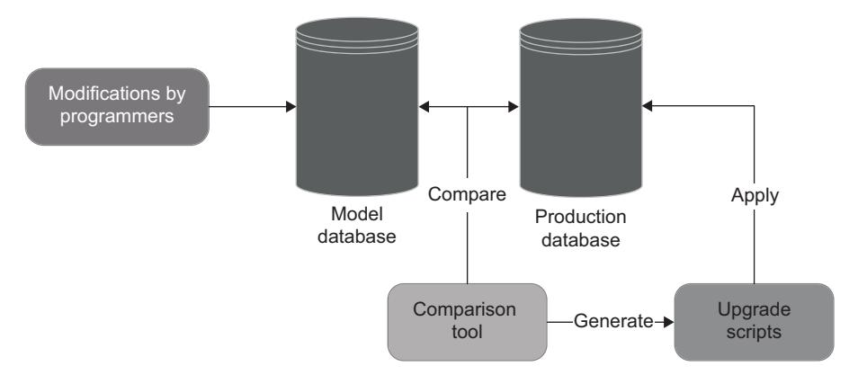
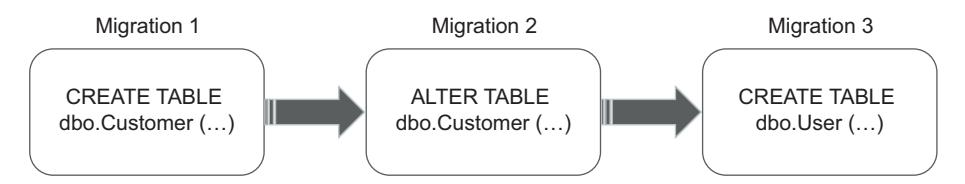
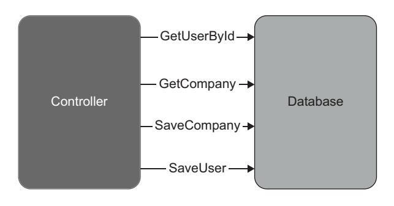
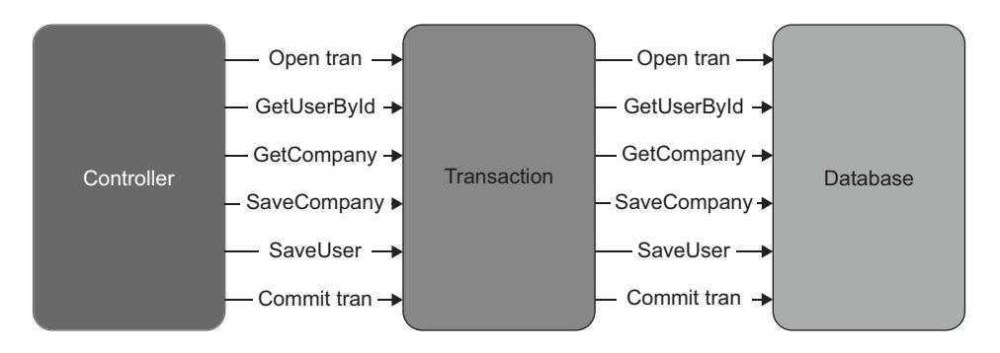
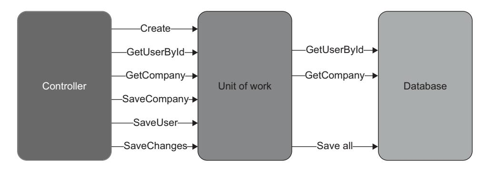
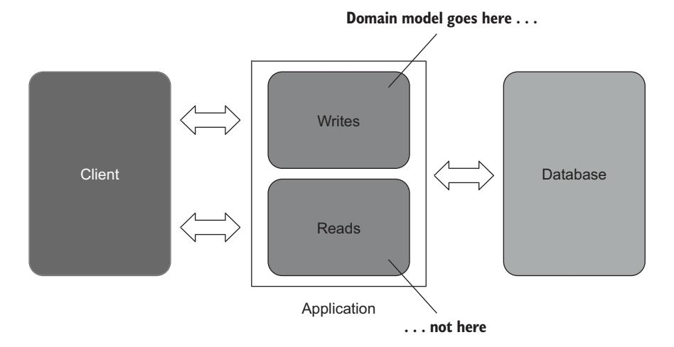
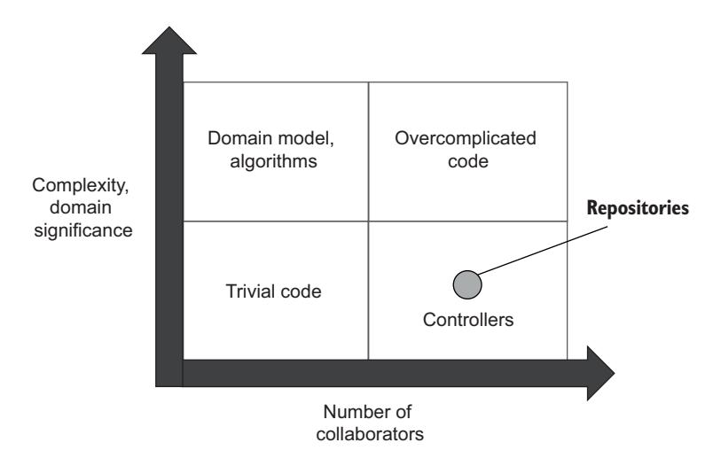

# Chapter 10: Testing the database

<span id="page-250-0"></span>
## This chapter covers

- Prerequisites for testing the database
- Database testing best practices
- Test data life cycle
- Managing database transactions in tests

<span id="page-250-1"></span>The last piece of the puzzle in integration testing is *managed* out-of-process dependencies. The most common example of a managed dependency is an application database—a database no other application has access to.

<span id="page-250-2"></span> Running tests against a real database provides bulletproof protection against regressions, but those tests aren't easy to set up. This chapter shows the preliminary steps you need to take before you can start testing your database: it covers keeping track of the database schema, explains the difference between the state-based and migration-based database delivery approaches, and demonstrates why you should choose the latter over the former.

 After learning the basics, you'll see how to manage transactions during the test, clean up leftover data, and keep tests small by eliminating insignificant parts and amplifying the essentials. This chapter focuses on relational databases, but many of the same principles are applicable to other types of data stores such as document-oriented databases or even plain text file storages.

<span id="page-251-0"></span>
## 10.1 Prerequisites for testing the database

<span id="page-251-2"></span>As you might recall from chapter 8, managed dependencies should be included *as-is* in integration tests. That makes working with those dependencies more laborious than unmanaged ones because using a mock is out of the question. But even before you start writing tests, you must take preparatory steps to enable integration testing. In this section, you'll see these prerequisites:

- Keeping the database in the source control system
- Using a separate database instance for every developer
- Applying the migration-based approach to database delivery

Like almost everything in testing, though, practices that facilitate testing also improve the health of your database in general. You'll get value out of those practices even if you don't write integration tests.

<span id="page-251-1"></span>
### 10.1.1 Keeping the database in the source control system

<span id="page-251-4"></span><span id="page-251-3"></span>The first step on the way to testing the database is treating the database schema as regular code. Just as with regular code, a database schema is best stored in a source control system such as Git.

<span id="page-251-5"></span> I've worked on projects where programmers maintained a dedicated database instance, which served as a reference point (a *model database*). During development, all schema changes accumulated in that instance. Upon production deployments, the team compared the production and model databases, used a special tool to generate upgrade scripts, and ran those scripts in production (figure 10.1).



Figure 10.1 Having a dedicated instance as a model database is an anti-pattern. The database schema is best stored in a source control system.

Using a model database is a horrible way to maintain database schema. That's because there's

- <span id="page-252-6"></span> *No change history*—You can't trace the database schema back to some point in the past, which might be important when reproducing bugs in production.
- <span id="page-252-3"></span><span id="page-252-1"></span> *No single source of truth*—The model database becomes a competing source of truth about the state of development. Maintaining two such sources (Git and the model database) creates an additional burden.

On the other hand, keeping all the database schema updates in the source control system helps you to maintain a single source of truth and also to track database changes along with the changes of regular code. No modifications to the database structure should be made outside of the source control.

<span id="page-252-0"></span>
#### 10.1.2 Reference data is part of the database schema

<span id="page-252-2"></span>When it comes to the database schema, the usual suspects are tables, views, indexes, stored procedures, and anything else that forms a blueprint of how the database is constructed. The schema itself is represented in the form of SQL scripts. You should be able to use those scripts to create a fully functional, up-to-date database instance of your own at any time during development. However, there's another part of the database that belongs to the database schema but is rarely viewed as such: reference data.

<span id="page-252-7"></span>DEFINITION *Reference data* is data that must be prepopulated in order for the application to operate properly.

Take the CRM system from the earlier chapters, for example. Its users can be either of type Customer or type Employee. Let's say that you want to create a table with all user types and introduce a foreign key constraint from User to that table. Such a constraint would provide an additional guarantee that the application won't ever assign a user a nonexistent type. In this scenario, the content of the UserType table would be reference data because the application relies on its existence in order to persist users in the database.

TIP There's a simple way to differentiate reference data from regular data. If your application can modify the data, it's regular data; if not, it's reference data.

<span id="page-252-4"></span>Because reference data is essential for your application, you should keep it in the source control system along with tables, views, and other parts of the database schema, in the form of SQL INSERT statements.

<span id="page-252-5"></span> Note that although reference data is normally stored separately from regular data, the two can sometimes coexist in the same table. To make this work, you need to introduce a flag differentiating data that can be modified (regular data) from data that can't be modified (reference data) and forbid your application from changing the latter.

<span id="page-253-0"></span>
#### 10.1.3 Separate instance for every developer

<span id="page-253-2"></span>It's difficult enough to run tests against a real database. It becomes even more difficult if you have to share that database with other developers. The use of a shared database hinders the development process because

- Tests run by different developers interfere with each other.
- Non-backward-compatible changes can block the work of other developers.

Keep a separate database instance for every developer, preferably on that developer's own machine in order to maximize test execution speed.

<span id="page-253-1"></span>
#### 10.1.4 State-based vs. migration-based database delivery

<span id="page-253-3"></span>There are two major approaches to database delivery: *state-based* and *migration-based*. The migration-based approach is more difficult to implement and maintain initially, but it works much better than the state-based approach in the long run.

<span id="page-253-6"></span>
#### THE STATE-BASED APPROACH

The state-based approach to database delivery is similar to what I described in figure 10.1. You also have a model database that you maintain throughout development. During deployments, a comparison tool generates scripts for the production database to bring it up to date with the model database. The difference is that with the statebased approach, you don't actually have a physical model database as a source of truth. Instead, you have SQL scripts that you can use to create that database. The scripts are stored in the source control.

<span id="page-253-5"></span> In the state-based approach, the comparison tool does all the hard lifting. Whatever the state of the production database, the tool does everything needed to get it in sync with the model database: delete unnecessary tables, create new ones, rename columns, and so on.

<span id="page-253-4"></span>
#### THE MIGRATION-BASED APPROACH

On the other hand, the migration-based approach emphasizes the use of explicit migrations that transition the database from one version to another (figure 10.2). With this approach, you don't use tools to automatically synchronize the production and development databases; you come up with upgrade scripts yourself. However, a database comparison tool can still be useful when detecting undocumented changes in the production database schema.



Figure 10.2 The migration-based approach to database delivery emphasizes the use of explicit migrations that transition the database from one version to another.

In the migration-based approach, migrations and not the database state become the artifacts you store in the source control. Migrations are usually represented with plain SQL scripts (popular tools include Flyway [\[https://flywaydb.org](https://flywaydb.org)] and Liquibase [\[https://liquibase.org\]](https://liquibase.org)), but they can also be written using a DSL-like language that gets translated into SQL. The following example shows a C# class that represents a database migration with the help of the FluentMigrator library ([https://github.com/](https://github.com/fluentmigrator/fluentmigrator) [fluentmigrator/fluentmigrator](https://github.com/fluentmigrator/fluentmigrator)):

```
[Migration(1)] 
public class CreateUserTable : Migration
{
    public override void Up() 
    {
        Create.Table("Users");
    }
    public override void Down() 
    {
        Delete.Table("Users");
    }
}
                                                    Migration 
                                                    number
                                         Forward 
                                         migration
                                            Backward migration (helpful 
                                            when downgrading to an 
                                            earlier database version to 
                                            reproduce a bug)
```

#### PREFER THE MIGRATION-BASED APPROACH OVER THE STATE-BASED ONE

The difference between the state-based and migration-based approaches to database delivery comes down to (as their names imply) *state* versus *migrations* (see figure 10.3):

- <span id="page-254-0"></span> The state-based approach makes the state explicit (by virtue of storing that state in the source control) and lets the comparison tool implicitly control the migrations.
- The migration-based approach makes the migrations explicit but leaves the state implicit. It's impossible to view the database state directly; you have to assemble it from the migrations.

|                             | State of the database | Migration mechanism |
|-----------------------------|-----------------------|---------------------|
| State-based<br>approach     | Explicit              | Implicit            |
| Migration-based<br>approach | Implicit              | Explicit            |

Figure 10.3 The state-based approach makes the state explicit and migrations implicit; the migration-based approach makes the opposite choice.

Such a distinction leads to different sets of trade-offs. The explicitness of the database state makes it easier to handle merge conflicts, while explicit migrations help to tackle data motion.

<span id="page-255-1"></span>DEFINITION *Data motion* is the process of changing the shape of existing data so that it conforms to the new database schema.

Although the alleviation of merge conflicts and the ease of data motion might look like equally important benefits, in the vast majority of projects, *data motion is much more important than merge conflicts*. Unless you haven't yet released your application to production, you always have data that you can't simply discard.

 For example, when splitting a Name column into FirstName and LastName, you not only have to drop the Name column and create the new FirstName and LastName columns, but you also have to write a script to split all existing names into two pieces. There is no easy way to implement this change using the state-driven approach; comparison tools are awful when it comes to managing data. The reason is that while the database schema itself is objective, meaning there is only one way to interpret it, data is context-dependent. No tool can make reliable assumptions about data when generating upgrade scripts. You have to apply domain-specific rules in order to implement proper transformations.

 As a result, the state-based approach is impractical in the vast majority of projects. You can use it temporarily, though, while the project still has not been released to production. After all, test data isn't that important, and you can re-create it every time you change the database. But once you release the first version, you will have to switch to the migration-based approach in order to handle data motion properly.

<span id="page-255-4"></span><span id="page-255-3"></span>TIP Apply every modification to the database schema (including reference data) through migrations. Don't modify migrations once they are committed to the source control. If a migration is incorrect, create a new migration instead of fixing the old one. Make exceptions to this rule only when the incorrect migration can lead to data loss.

<span id="page-255-0"></span>
## 10.2 Database transaction management

<span id="page-255-2"></span>Database transaction management is a topic that's important for both production and test code. Proper transaction management in production code helps you avoid data inconsistencies. In tests, it helps you verify integration with the database in a close-toproduction setting.

 In this section, I'll first show how to handle transactions in the production code (the controller) and then demonstrate how to use them in integration tests. I'll continue using the same CRM project you saw in the earlier chapters as an example.

<span id="page-256-0"></span>
### 10.2.1 Managing database transactions in production code

<span id="page-256-1"></span>Our sample CRM project uses the Database class to work with User and Company. Database creates a separate SQL connection on each method call. Every such connection implicitly opens an independent transaction behind the scenes, as the following listing shows.

#### Listing 10.1 Class that enables access to the database

```
public class Database
        {
            private readonly string _connectionString;
            public Database(string connectionString)
            {
                 _connectionString = connectionString;
            }
            public void SaveUser(User user)
            {
                 bool isNewUser = user.UserId == 0;
                 using (var connection =
                     new SqlConnection(_connectionString)) 
                 {
                     /* Insert or update the user depending on isNewUser */
                 }
            }
            public void SaveCompany(Company company)
            {
                 using (var connection =
                     new SqlConnection(_connectionString)) 
                 {
                     /* Update only; there's only one company */
                 }
            }
        }
  Opens a
 database
transaction
```

As a result, the user controller creates a total of four database transactions during a single business operation, as shown in the following listing.

#### Listing 10.2 User controller

```
public string ChangeEmail(int userId, string newEmail)
{
    object[] userData = _database.GetUserById(userId); 
     User user = UserFactory.Create(userData);
    string error = user.CanChangeEmail();
    if (error != null)
        return error;
                                                                   Opens a new 
                                                                   database 
                                                                   transaction
```

```
object[] companyData = _database.GetCompany(); 
    Company company = CompanyFactory.Create(companyData);
    user.ChangeEmail(newEmail, company);
    _database.SaveCompany(company); 
    _database.SaveUser(user); 
    _eventDispatcher.Dispatch(user.DomainEvents);
    return "OK";
}
                                                                 Opens a new 
                                                                 database 
                                                                 transaction
```

It's fine to open multiple transactions during read-only operations: for example, when returning user information to the external client. But if the business operation involves data mutation, all updates taking place during that operation should be atomic in order to avoid inconsistencies. For example, the controller can successfully persist the company but then fail when saving the user due to a database connectivity issue. As a result, the company's NumberOfEmployees can become inconsistent with the total number of Employee users in the database.

<span id="page-257-0"></span>DEFINITION *Atomic updates* are executed in an all-or-nothing manner. Each update in the set of atomic updates must either be complete in its entirety or have no effect whatsoever.

<span id="page-257-1"></span>
#### SEPARATING DATABASE CONNECTIONS FROM DATABASE TRANSACTIONS

To avoid potential inconsistencies, you need to introduce a separation between two types of decisions:

- What data to update
- Whether to keep the updates or roll them back

Such a separation is important because the controller can't make these decisions simultaneously. It only knows whether the updates can be kept when all the steps in the business operation have succeeded. And it can only take those steps by accessing the database and trying to make the updates. You can implement the separation between these responsibilities by splitting the Database class into repositories and a transaction:

- <span id="page-257-2"></span> *Repositories* are classes that enable access to and modification of the data in the database. There will be two repositories in our sample project: one for User and the other for Company.
- A *transaction* is a class that either commits or rolls back data updates in full. This will be a custom class relying on the underlying database's transactions to provide atomicity of data modification.

Not only do repositories and transactions have different responsibilities, but they also have different lifespans. A transaction lives during the whole business operation and is disposed of at the very end of it. A repository, on the other hand, is short-lived. You <span id="page-258-0"></span>can dispose of a repository as soon as the call to the database is completed. As a result, repositories always work on top of the current transaction. When connecting to the database, a repository enlists itself into the transaction so that any data modifications made during that connection can later be rolled back by the transaction.

 Figure 10.4 shows how the communication between the controller and the database looks in listing 10.2. Each database call is wrapped into its own transaction; updates are not atomic.



Figure 10.4 Wrapping each database call into a separate transaction introduces a risk of inconsistencies due to hardware or software failures. For example, the application can update the number of employees in the company but not the employees themselves.

Figure 10.5 shows the application after the introduction of explicit transactions. The transaction mediates interactions between the controller and the database. All four database calls are still there, but now data modifications are either committed or rolled back in full.



Figure 10.5 The transaction mediates interactions between the controller and the database and thus enables atomic data modification.

The following listing shows the controller after introducing a transaction and repositories.

#### Listing 10.3 User controller, repositories, and a transaction

```
public class UserController
{
    private readonly Transaction _transaction;
    private readonly UserRepository _userRepository;
```

```
private readonly CompanyRepository _companyRepository;
             private readonly EventDispatcher _eventDispatcher;
             public UserController(
                 Transaction transaction, 
                 MessageBus messageBus,
                 IDomainLogger domainLogger)
             {
                 _transaction = transaction;
                 _userRepository = new UserRepository(transaction);
                 _companyRepository = new CompanyRepository(transaction);
                 _eventDispatcher = new EventDispatcher(
                     messageBus, domainLogger);
             }
             public string ChangeEmail(int userId, string newEmail)
             {
                 object[] userData = _userRepository 
                     .GetUserById(userId); 
                 User user = UserFactory.Create(userData);
                 string error = user.CanChangeEmail();
                 if (error != null)
                     return error;
                 object[] companyData = _companyRepository 
                     .GetCompany(); 
                 Company company = CompanyFactory.Create(companyData);
                 user.ChangeEmail(newEmail, company);
                 _companyRepository.SaveCompany(company); 
                 _userRepository.SaveUser(user); 
                 _eventDispatcher.Dispatch(user.DomainEvents);
                 _transaction.Commit(); 
                 return "OK";
             }
         }
         public class UserRepository
         {
             private readonly Transaction _transaction;
             public UserRepository(Transaction transaction) 
             {
                 _transaction = transaction;
             }
             /* ... */
         }
         public class Transaction : IDisposable
         {
                                                    Accepts a 
                                                    transaction
  Uses the
repositories
   instead
    of the
  Database
     class
                                                    Commits the 
                                                    transaction 
                                                    on success
                                                                        Injects a 
                                                                        transaction into 
                                                                        a repository
```

```
public void Commit() { /* ... */ }
    public void Dispose() { /* ... */ }
}
```

The internals of the Transaction class aren't important, but if you're curious, I'm using .NET's standard TransactionScope behind the scenes. The important part about Transaction is that it contains two methods:

- Commit()*marks the transaction as successful.* This is only called when the business operation itself has succeeded and all data modifications are ready to be persisted.
- Dispose()*ends the transaction.* This is called indiscriminately at the end of the business operation. If Commit() was previously invoked, Dispose() persists all data updates; otherwise, it rolls them back.

<span id="page-260-2"></span>Such a combination of Commit() and Dispose() guarantees that the database is altered only during *happy paths* (the successful execution of the business scenario). That's why Commit() resides at the very end of the ChangeEmail() method. In the event of any error, be it a validation error or an unhandled exception, the execution flow returns early and thereby prevents the transaction from being committed.

Commit() is invoked by the controller because this method call requires decisionmaking. There's no decision-making involved in calling Dispose(), though, so you can delegate that method call to a class from the infrastructure layer. The same class that instantiates the controller and provides it with the necessary dependencies should also dispose of the transaction once the controller is done working.

<span id="page-260-0"></span> Notice how UserRepository requires Transaction as a constructor parameter. This explicitly shows that repositories always work on top of transactions; a repository can't call the database on its own.

<span id="page-260-1"></span>
#### UPGRADING THE TRANSACTION TO A UNIT OF WORK

The introduction of repositories and a transaction is a good way to avoid potential data inconsistencies, but there's an even better approach. You can upgrade the Transaction class to a unit of work.

<span id="page-260-3"></span>DEFINITION A *unit of work* maintains a list of objects affected by a business operation. Once the operation is completed, the unit of work figures out all updates that need to be done to alter the database and executes those updates as a single unit (hence the pattern name).

The main advantage of a unit of work over a plain transaction is the deferral of updates. Unlike a transaction, a unit of work executes all updates at the end of the business operation, thus minimizing the duration of the underlying database transaction and reducing data congestion (see figure 10.6). Often, this pattern also helps to reduce the number of database calls.

NOTE Database transactions also implement the unit-of-work pattern.



Figure 10.6 A unit of work executes all updates at the end of the business operation. The updates are still wrapped in a database transaction, but that transaction lives for a shorter period of time, thus reducing data congestion.

<span id="page-261-3"></span><span id="page-261-2"></span>Maintaining a list of modified objects and then figuring out what SQL script to generate can look like a lot of work. In reality, though, you don't need to do that work yourself. Most object-relational mapping (ORM) libraries implement the unit-of-work pattern for you. In .NET, for example, you can use NHibernate or Entity Framework, both of which provide classes that do all the hard lifting (those classes are ISession and DbContext, respectively). The following listing shows how UserController looks in combination with Entity Framework.

<span id="page-261-1"></span>
<span id="page-261-0"></span>
#### Listing 10.4 User controller with Entity Framework

```
public class UserController
          {
              private readonly CrmContext _context;
              private readonly UserRepository _userRepository;
              private readonly CompanyRepository _companyRepository;
              private readonly EventDispatcher _eventDispatcher;
              public UserController(
                  CrmContext context, 
                  MessageBus messageBus,
                  IDomainLogger domainLogger)
              {
                  _context = context;
                  _userRepository = new UserRepository(
                      context); 
                  _companyRepository = new CompanyRepository(
                      context); 
                  _eventDispatcher = new EventDispatcher(
                      messageBus, domainLogger);
              }
              public string ChangeEmail(int userId, string newEmail)
              {
                  User user = _userRepository.GetUserById(userId);
CrmContext
   replaces
Transaction.
```

```
string error = user.CanChangeEmail();
        if (error != null)
            return error;
        Company company = _companyRepository.GetCompany();
        user.ChangeEmail(newEmail, company);
        _companyRepository.SaveCompany(company);
        _userRepository.SaveUser(user);
        _eventDispatcher.Dispatch(user.DomainEvents);
        _context.SaveChanges(); 
        return "OK";
    }
}
                                        CrmContext 
                                        replaces 
                                        Transaction.
```

CrmContext is a custom class that contains mapping between the domain model and the database (it inherits from Entity Framework's DbContext). The controller in listing 10.4 uses CrmContext instead of Transaction. As a result,

- <span id="page-262-1"></span> Both repositories now work on top of CrmContext, just as they worked on top of Transaction in the previous version.
- The controller commits changes to the database via context.SaveChanges() instead of transaction.Commit().

Notice that there's no need for UserFactory and CompanyFactory anymore because Entity Framework now serves as a mapper between the raw database data and domain objects.

<span id="page-262-0"></span>
#### Data inconsistencies in non-relational databases

It's easy to avoid data inconsistencies when using a relational database: all major relational databases provide atomic updates that can span as many rows as needed. But how do you achieve the same level of protection with a non-relational database such as MongoDB?

The problem with most non-relational databases is the lack of transactions in the classical sense; atomic updates are guaranteed only within a single document. If a business operation affects multiple documents, it becomes prone to inconsistencies. (In non-relational databases, a *document* is the equivalent of a *row*.)

Non-relational databases approach inconsistencies from a different angle: they require you to design your documents such that no business operation modifies more than one of those documents at a time. This is possible because documents are more flexible than rows in relational databases. A single document can store data of any shape and complexity and thus capture side effects of even the most sophisticated business operations.

#### (continued)

<span id="page-263-2"></span>In domain-driven design, there's a guideline saying that you shouldn't modify more than one aggregate per business operation. This guideline serves the same goal: protecting you from data inconsistencies. The guideline is only applicable to systems that work with document databases, though, where each document corresponds to one aggregate.

<span id="page-263-0"></span>
#### 10.2.2 Managing database transactions in integration tests

<span id="page-263-4"></span><span id="page-263-1"></span>When it comes to managing database transactions in integration tests, adhere to the following guideline: *don't reuse database transactions or units of work between sections of the test*. The following listing shows an example of reusing CrmContext in the integration test after switching that test to Entity Framework.

<span id="page-263-3"></span>
#### Listing 10.5 Integration test reusing **CrmContext**

```
[Fact]
public void Changing_email_from_corporate_to_non_corporate()
{
    using (var context = 
        new CrmContext(ConnectionString)) 
    {
        // Arrange
        var userRepository = 
            new UserRepository(context); 
        var companyRepository = 
            new CompanyRepository(context); 
        var user = new User(0, "user@mycorp.com",
            UserType.Employee, false);
        userRepository.SaveUser(user);
        var company = new Company("mycorp.com", 1);
        companyRepository.SaveCompany(company);
        context.SaveChanges(); 
        var busSpy = new BusSpy();
        var messageBus = new MessageBus(busSpy);
        var loggerMock = new Mock<IDomainLogger>();
        var sut = new UserController(
            context, 
            messageBus,
            loggerMock.Object);
        // Act
        string result = sut.ChangeEmail(user.UserId, "new@gmail.com");
        // Assert
        Assert.Equal("OK", result);
        User userFromDb = userRepository 
            .GetUserById(user.UserId); 
                                                 Creates a 
                                                 context
                                                       Uses the context 
                                                       in the arrange 
                                                       section . . .
                                           . . . in act . . .
                                                 . . . and in assert
```

```
Assert.Equal("new@gmail.com", userFromDb.Email);
       Assert.Equal(UserType.Customer, userFromDb.Type);
       Company companyFromDb = companyRepository 
           .GetCompany(); 
       Assert.Equal(0, companyFromDb.NumberOfEmployees);
       busSpy.ShouldSendNumberOfMessages(1)
           .WithEmailChangedMessage(user.UserId, "new@gmail.com");
       loggerMock.Verify(
           x => x.UserTypeHasChanged(
               user.UserId, UserType.Employee, UserType.Customer),
           Times.Once);
   }
}
                                                        . . . and in assert
```

This test uses the same instance of CrmContext in all three sections: arrange, act, and assert. This is a problem because such reuse of the unit of work creates an environment that doesn't match what the controller experiences in production. In production, each business operation has an exclusive instance of CrmContext. That instance is created right before the controller method invocation and is disposed of immediately after.

 To avoid the risk of inconsistent behavior, integration tests should replicate the production environment as closely as possible, which means the act section must not share CrmContext with anyone else. The arrange and assert sections must get their own instances of CrmContext too, because, as you might remember from chapter 8, it's important to check the state of the database independently of the data used as input parameters. And although the assert section does query the user and the company independently of the arrange section, these sections still share the same database context. That context can (and many ORMs do) cache the requested data for performance improvements.

<span id="page-264-5"></span><span id="page-264-2"></span>TIP Use at least three transactions or units of work in an integration test: one per each arrange, act, and assert section.

<span id="page-264-0"></span>
## 10.3 Test data life cycle

<span id="page-264-3"></span>The shared database raises the problem of isolating integration tests from each other. To solve this problem, you need to

- Execute integration tests sequentially.
- Remove leftover data between test runs.

Overall, your tests shouldn't depend on the state of the database. Your tests should bring that state to the required condition on their own.

<span id="page-264-1"></span>
### 10.3.1 Parallel vs. sequential test execution

<span id="page-264-4"></span>Parallel execution of integration tests involves significant effort. You have to ensure that all test data is unique so no database constraints are violated and tests don't accidentally pick up input data after each other. Cleaning up leftover data also becomes trickier. It's more practical to run integration tests sequentially rather than spend time trying to squeeze additional performance out of them.

 Most unit testing frameworks allow you to define separate test collections and selectively disable parallelization in them. Create two such collections (for unit and integration tests), and then disable test parallelization in the collection with the integration tests.

 As an alternative, you could parallelize tests using containers. For example, you could put the model database on a Docker image and instantiate a new container from that image for each integration test. In practice, though, this approach creates too much of an additional maintenance burden. With Docker, you not only have to keep track of the database itself, but you also need to

- <span id="page-265-2"></span>Maintain Docker images
- Make sure each test gets its own container instance
- Batch integration tests (because you most likely won't be able to create all container instances at once)
- <span id="page-265-5"></span>Dispose of used-up containers

I don't recommend using containers unless you absolutely need to minimize your integration tests' execution time. Again, it's more practical to have just one database instance per developer. You *can* run that single instance in Docker, though. I advocate against premature parallelization, not the use of Docker per se.

<span id="page-265-0"></span>
#### 10.3.2 Clearing data between test runs

<span id="page-265-4"></span>There are four options to clean up leftover data between test runs:

- <span id="page-265-3"></span> *Restoring a database backup before each test*—This approach addresses the problem of data cleanup but is much slower than the other three options. Even with containers, the removal of a container instance and creation of a new one usually takes several seconds, which quickly adds to the total test suite execution time.
- <span id="page-265-1"></span> *Cleaning up data at the end of a test*—This method is fast but susceptible to skipping the cleanup phase. If the build server crashes in the middle of the test, or you shut down the test in the debugger, the input data remains in the database and affects further test runs.
- <span id="page-265-7"></span><span id="page-265-6"></span> *Wrapping each test in a database transaction and never committing it*—In this case, all changes made by the test and the SUT are rolled back automatically. This approach solves the problem of skipping the cleanup phase but poses another issue: the introduction of an overarching transaction can lead to inconsistent behavior between the production and test environments. It's the same problem as with reusing a unit of work: the additional transaction creates a setup that's different than that in production.
- *Cleaning up data at the beginning of a test*—This is the best option. It works fast, doesn't result in inconsistent behavior, and isn't prone to accidentally skipping the cleanup phase.

TIP There's no need for a separate teardown phase; implement that phase as part of the arrange section.

The data removal itself must be done in a particular order, to honor the database's foreign key constraints. I sometimes see people use sophisticated algorithms to figure out relationships between tables and automatically generate the deletion script or even disable all integrity constraints and re-enable them afterward. This is unnecessary. Write the SQL script manually: it's simpler and gives you more granular control over the deletion process.

<span id="page-266-2"></span> Introduce a base class for all integration tests, and put the deletion script there. With such a base class, you will have the script run automatically at the start of each test, as shown in the following listing.

#### Listing 10.6 Base class for integration tests

```
public abstract class IntegrationTests
{
    private const string ConnectionString = "...";
    protected IntegrationTests()
    {
        ClearDatabase();
    }
    private void ClearDatabase()
    {
        string query =
            "DELETE FROM dbo.[User];" + 
            "DELETE FROM dbo.Company;"; 
        using (var connection = new SqlConnection(ConnectionString))
        {
            var command = new SqlCommand(query, connection)
            {
                 CommandType = CommandType.Text
            };
            connection.Open();
            command.ExecuteNonQuery();
        }
    }
}
                                                 Deletion 
                                                 script
```

<span id="page-266-1"></span><span id="page-266-0"></span>TIP The deletion script must remove all regular data but none of the reference data. Reference data, along with the rest of the database schema, should be controlled solely by migrations.

<span id="page-267-0"></span>
### 10.3.3 Avoid in-memory databases

<span id="page-267-7"></span>Another way to isolate integration tests from each other is by replacing the database with an in-memory analog, such as SQLite. In-memory databases can seem beneficial because they

- <span id="page-267-11"></span>Don't require removal of test data
- <span id="page-267-10"></span><span id="page-267-9"></span>Work faster
- <span id="page-267-8"></span>Can be instantiated for each test run

Because in-memory databases aren't shared dependencies, integration tests in effect become unit tests (assuming the database is the only managed dependency in the project), similar to the approach with containers described in section 10.3.1.

 In spite of all these benefits, I don't recommend using in-memory databases because they aren't consistent functionality-wise with regular databases. This is, once again, the problem of a mismatch between production and test environments. Your tests can easily run into false positives or (worse!) false negatives due to the differences between the regular and in-memory databases. You'll never gain good protection with such tests and will have to do a lot of regression testing manually anyway.

<span id="page-267-6"></span><span id="page-267-5"></span>TIP Use the same database management system (DBMS) in tests as in production. It's usually fine for the version or edition to differ, but the vendor must remain the same.

<span id="page-267-1"></span>
## 10.4 Reusing code in test sections

<span id="page-267-3"></span>Integration tests can quickly grow too large and thus lose ground on the maintainability metric. It's important to keep integration tests as short as possible but without coupling them to each other or affecting readability. Even the shortest tests shouldn't depend on one another. They also should preserve the full context of the test scenario and shouldn't require you to examine different parts of the test class to understand what's going on.

 The best way to shorten integration is by extracting technical, non-business-related bits into private methods or helper classes. As a side bonus, you'll get to reuse those bits. In this section, I'll show how to shorten all three sections of the test: arrange, act, and assert.

<span id="page-267-2"></span>
### 10.4.1 Reusing code in arrange sections

<span id="page-267-4"></span>The following listing shows how our integration test looks after providing a separate database context (unit of work) for each of its sections.

#### Listing 10.7 Integration test with three database contexts

```
[Fact]
public void Changing_email_from_corporate_to_non_corporate()
{
    // Arrange
    User user;
```

```
using (var context = new CrmContext(ConnectionString))
    {
        var userRepository = new UserRepository(context);
        var companyRepository = new CompanyRepository(context);
        user = new User(0, "user@mycorp.com",
            UserType.Employee, false);
        userRepository.SaveUser(user);
        var company = new Company("mycorp.com", 1);
        companyRepository.SaveCompany(company);
        context.SaveChanges();
    }
    var busSpy = new BusSpy();
    var messageBus = new MessageBus(busSpy);
    var loggerMock = new Mock<IDomainLogger>();
    string result;
    using (var context = new CrmContext(ConnectionString))
    {
        var sut = new UserController(
            context, messageBus, loggerMock.Object);
        // Act
        result = sut.ChangeEmail(user.UserId, "new@gmail.com");
    }
    // Assert
    Assert.Equal("OK", result);
    using (var context = new CrmContext(ConnectionString))
    {
        var userRepository = new UserRepository(context);
        var companyRepository = new CompanyRepository(context);
        User userFromDb = userRepository.GetUserById(user.UserId);
        Assert.Equal("new@gmail.com", userFromDb.Email);
        Assert.Equal(UserType.Customer, userFromDb.Type);
        Company companyFromDb = companyRepository.GetCompany();
        Assert.Equal(0, companyFromDb.NumberOfEmployees);
        busSpy.ShouldSendNumberOfMessages(1)
            .WithEmailChangedMessage(user.UserId, "new@gmail.com");
        loggerMock.Verify(
            x => x.UserTypeHasChanged(
                user.UserId, UserType.Employee, UserType.Customer),
            Times.Once);
    }
}
```

As you might remember from chapter 3, the best way to reuse code between the tests' arrange sections is to introduce private factory methods. For example, the following listing creates a user.

#### Listing 10.8 A separate method that creates a user

```
private User CreateUser(
    string email, UserType type, bool isEmailConfirmed)
{
    using (var context = new CrmContext(ConnectionString))
    {
        var user = new User(0, email, type, isEmailConfirmed);
        var repository = new UserRepository(context);
        repository.SaveUser(user);
        context.SaveChanges();
        return user;
    }
}
```

You can also define default values for the method's arguments, as shown next.

#### Listing 10.9 Adding default values to the factory

```
private User CreateUser(
    string email = "user@mycorp.com",
    UserType type = UserType.Employee,
    bool isEmailConfirmed = false)
{
    /* ... */
}
```

With default values, you can specify arguments selectively and thus shorten the test even further. The selective use of arguments also emphasizes which of those arguments are relevant to the test scenario.

#### Listing 10.10 Using the factory method

```
User user = CreateUser(
    email: "user@mycorp.com",
    type: UserType.Employee);
```

<span id="page-269-2"></span>
#### Object Mother vs. Test Data Builder

The pattern shown in listings 10.9 and 10.10 is called the *Object Mother*. The *Object Mother* is a class or method that helps create *test fixtures* (objects the test runs against).

<span id="page-269-1"></span><span id="page-269-0"></span>There's another pattern that helps achieve the same goal of reusing code in arrange sections: *Test Data Builder*. It works similarly to Object Mother but exposes a fluent interface instead of plain methods. Here's a Test Data Builder usage example:

```
User user = new UserBuilder()
    .WithEmail("user@mycorp.com")
    .WithType(UserType.Employee)
    .Build();
```

Test Data Builder slightly improves test readability but requires too much boilerplate. For that reason, I recommend sticking to the Object Mother (at least in C#, where you have optional arguments as a language feature).

#### WHERE TO PUT FACTORY METHODS

When you start distilling the tests' essentials and move the technicalities out to factory methods, you face the question of where to put those methods. Should they reside in the same class as the tests? The base IntegrationTests class? Or in a separate helper class?

<span id="page-270-2"></span> Start simple. Place the factory methods in the same class by default. Move them into separate helper classes only when code duplication becomes a significant issue. Don't put the factory methods in the base class; reserve that class for code that has to run in every test, such as data cleanup.

<span id="page-270-0"></span>
#### 10.4.2 Reusing code in act sections

<span id="page-270-1"></span>Every act section in integration tests involves the creation of a database transaction or a unit of work. This is how the act section currently looks in listing 10.7:

```
string result;
using (var context = new CrmContext(ConnectionString))
{
    var sut = new UserController(
        context, messageBus, loggerMock.Object);
    // Act
    result = sut.ChangeEmail(user.UserId, "new@gmail.com");
}
```

This section can also be reduced. You can introduce a method accepting a delegate with the information of what controller function needs to be invoked. The method will then decorate the controller invocation with the creation of a database context, as shown in the following listing.

#### Listing 10.11 Decorator method

```
private string Execute(
    Func<UserController, string> func, 
    MessageBus messageBus,
    IDomainLogger logger)
{
    using (var context = new CrmContext(ConnectionString))
    {
        var controller = new UserController(
                                                Delegate defines 
                                                a controller 
                                                function.
```

```
context, messageBus, logger);
        return func(controller);
    }
}
```

<span id="page-271-1"></span>With this decorator method, you can boil down the test's act section to just a couple of lines:

```
string result = Execute(
    x => x.ChangeEmail(user.UserId, "new@gmail.com"),
    messageBus, loggerMock.Object);
```

<span id="page-271-0"></span>
#### 10.4.3 Reusing code in assert sections

<span id="page-271-2"></span>Finally, the assert section can be shortened, too. The easiest way to do that is to introduce helper methods similar to CreateUser and CreateCompany, as shown in the following listing.

#### Listing 10.12 Data assertions after extracting the querying logic

```
User userFromDb = QueryUser(user.UserId); 
Assert.Equal("new@gmail.com", userFromDb.Email);
Assert.Equal(UserType.Customer, userFromDb.Type);
Company companyFromDb = QueryCompany(); 
Assert.Equal(0, companyFromDb.NumberOfEmployees);
                                                        New helper 
                                                        methods
```

You can take a step further and create a fluent interface for these data assertions, similar to what you saw in chapter 9 with BusSpy. In C#, a fluent interface on top of existing domain classes can be implemented using extension methods, as shown in the following listing.

#### Listing 10.13 Fluent interface for data assertions

```
public static class UserExternsions
{
    public static User ShouldExist(this User user)
    {
        Assert.NotNull(user);
        return user;
    }
    public static User WithEmail(this User user, string email)
    {
        Assert.Equal(email, user.Email);
        return user;
    }
}
```

With this fluent interface, the assertions become much easier to read:

```
User userFromDb = QueryUser(user.UserId);
userFromDb
    .ShouldExist()
```

```
.WithEmail("new@gmail.com")
    .WithType(UserType.Customer);
Company companyFromDb = QueryCompany();
companyFromDb
    .ShouldExist()
    .WithNumberOfEmployees(0);
```

<span id="page-272-0"></span>
#### 10.4.4 Does the test create too many database transactions?

<span id="page-272-1"></span>After all the simplifications made earlier, the integration test has become more readable and, therefore, more maintainable. There's one drawback, though: the test now uses a total of five database transactions (units of work), where before it used only three, as shown in the following listing.

Listing 10.14 Integration test after moving all technicalities out of it

```
public class UserControllerTests : IntegrationTests
        {
             [Fact]
             public void Changing_email_from_corporate_to_non_corporate()
             {
                 // Arrange
                 User user = CreateUser( 
                     email: "user@mycorp.com",
                     type: UserType.Employee);
                 CreateCompany("mycorp.com", 1); 
                 var busSpy = new BusSpy();
                 var messageBus = new MessageBus(busSpy);
                 var loggerMock = new Mock<IDomainLogger>();
                 // Act
                 string result = Execute( 
                     x => x.ChangeEmail(user.UserId, "new@gmail.com"),
                     messageBus, loggerMock.Object);
                 // Assert
                 Assert.Equal("OK", result);
                 User userFromDb = QueryUser(user.UserId); 
                 userFromDb
                     .ShouldExist()
                     .WithEmail("new@gmail.com")
                     .WithType(UserType.Customer);
                 Company companyFromDb = QueryCompany(); 
                 companyFromDb
                     .ShouldExist()
                     .WithNumberOfEmployees(0);
                 busSpy.ShouldSendNumberOfMessages(1)
                     .WithEmailChangedMessage(user.UserId, "new@gmail.com");
                 loggerMock.Verify(
Instantiates a
new database
    context
  behind the
     scenes
```

```
x => x.UserTypeHasChanged(
                user.UserId, UserType.Employee, UserType.Customer),
            Times.Once);
    }
}
```

<span id="page-273-7"></span><span id="page-273-6"></span>Is the increased number of database transactions a problem? And, if so, what can you do about it? The additional database contexts are a problem to some degree because they make the test slower, but there's not much that can be done about it. It's another example of a trade-off between different aspects of a valuable test: this time between fast feedback and maintainability. It's worth it to make that trade-off and exchange performance for maintainability in this particular case. The performance degradation shouldn't be that significant, especially when the database is located on the developer's machine. At the same time, the gains in maintainability are quite substantial.

<span id="page-273-0"></span>
## 10.5 Common database testing questions

<span id="page-273-3"></span><span id="page-273-2"></span>In this last section of the chapter, I'd like to answer common questions related to database testing, as well as briefly reiterate some important points made in chapters 8 and 9.

<span id="page-273-1"></span>
### 10.5.1 Should you test reads?

<span id="page-273-9"></span><span id="page-273-8"></span><span id="page-273-4"></span>Throughout the last several chapters, we've worked with a sample scenario of changing a user email. This scenario is an example of a *write* operation (an operation that leaves a side effect in the database and other out-of-process dependencies). Most applications contain both write and read operations. An example of a *read* operation would be returning the user information to the external client. Should you test both writes and reads?

 It's crucial to thoroughly test writes, because the stakes are high. Mistakes in write operations often lead to data corruption, which can affect not only your database but also external applications. Tests that cover writes are highly valuable due to the protection they provide against such mistakes.

 This is not the case for reads: a bug in a read operation usually doesn't have consequences that are as detrimental. Therefore, the threshold for testing reads should be higher than that for writes. Test only the most complex or important read operations; disregard the rest.

<span id="page-273-5"></span> Note that there's also no need for a domain model in reads. One of the main goals of domain modeling is encapsulation. And, as you might remember from chapters 5 and 6, encapsulation is about preserving data consistency in light of any changes. The lack of data changes makes encapsulation of reads pointless. In fact, you don't need a fully fledged ORM such as NHibernate or Entity Framework in reads, either. You are better off using plain SQL, which is superior to an ORM performance-wise, thanks to bypassing unnecessary layers of abstraction (figure 10.7).



Figure 10.7 There's no need for a domain model in reads. And because the cost of a mistake in reads is lower than it is in writes, there's also not as much need for integration testing.

<span id="page-274-1"></span>Because there are hardly any abstraction layers in reads (the domain model is one such layer), unit tests aren't of any use there. If you decide to test your reads, do so using integration tests on a real database.

<span id="page-274-0"></span>
#### 10.5.2 Should you test repositories?

<span id="page-274-2"></span>Repositories provide a useful abstraction on top of the database. Here's a usage example from our sample CRM project:

```
User user = _userRepository.GetUserById(userId);
_userRepository.SaveUser(user);
```

<span id="page-274-3"></span>Should you test repositories independently of other integration tests? It might seem beneficial to test how repositories map domain objects to the database. After all, there's significant room for a mistake in this functionality. Still, such tests are a net loss to your test suite due to high maintenance costs and inferior protection against regressions. Let's discuss these two drawbacks in more detail.

### HIGH MAINTENANCE COSTS

Repositories fall into the controllers quadrant on the types-of-code diagram from chapter 7 (figure 10.8). They exhibit little complexity and communicate with an outof-process dependency: the database. The presence of that out-of-process dependency is what inflates the tests' maintenance costs.

 When it comes to maintenance costs, testing repositories carries the same burden as regular integration tests. But does such testing provide an equal amount of benefits in return? Unfortunately, it doesn't.



Figure 10.8 Repositories exhibit little complexity and communicate with the out-of-process dependency, thus falling into the controllers quadrant on the types-of-code diagram.

#### INFERIOR PROTECTION AGAINST REGRESSIONS

Repositories don't carry that much complexity, and a lot of the gains in protection against regressions overlap with the gains provided by regular integration tests. Thus, tests on repositories don't add significant enough value.

 The best course of action in testing a repository is to extract the little complexity it has into a self-contained algorithm and test that algorithm exclusively. That's what UserFactory and CompanyFactory were for in earlier chapters. These two classes performed all the mappings without taking on any collaborators, out-of-process or otherwise. The repositories (the Database class) only contained simple SQL queries.

<span id="page-275-4"></span><span id="page-275-1"></span> Unfortunately, such a separation between data mapping (formerly performed by the factories) and interactions with the database (formerly performed by Database) is impossible when using an ORM. You can't test your ORM mappings without calling the database, at least not without compromising resistance to refactoring. Therefore, adhere to the following guideline: *don't test repositories directly, only as part of the overarching integration test suite*.

<span id="page-275-5"></span><span id="page-275-3"></span><span id="page-275-2"></span> Don't test EventDispatcher separately, either (this class converts domain events into calls to unmanaged dependencies). There are too few gains in protection against regressions in exchange for the too-high costs required to maintain the complicated mock machinery.

<span id="page-275-0"></span>
## 10.6 Conclusion

Well-crafted tests against the database provide bulletproof protection from bugs. In my experience, they are one of the most effective tools, without which it's impossible <span id="page-276-2"></span><span id="page-276-1"></span><span id="page-276-0"></span>*Summary* **255**

to gain full confidence in your software. Such tests help enormously when you refactor the database, switch the ORM, or change the database vendor.

 In fact, our sample project transitioned to the Entity Framework ORM earlier in this chapter, and I only needed to modify a couple of lines of code in the integration test to make sure the transition was successful. Integration tests working directly with managed dependencies are the most efficient way to protect against bugs resulting from large-scale refactorings.

## Summary

- Store database schema in a source control system, along with your source code. *Database schema* consists of tables, views, indexes, stored procedures, and anything else that forms a blueprint of how the database is constructed.
- Reference data is also part of the database schema. It is data that must be prepopulated in order for the application to operate properly. To differentiate between reference and regular data, look at whether your application can modify that data. If so, it's regular data; otherwise, it's reference data.
- Have a separate database instance for every developer. Better yet, host that instance on the developer's own machine for maximum test execution speed.
- The *state-based* approach to database delivery makes the state explicit and lets a comparison tool implicitly control migrations. The *migration-based* approach emphasizes the use of explicit migrations that transition the database from one state to another. The explicitness of the database state makes it easier to handle *merge conflicts*, while explicit migrations help tackle *data motion*.
- Prefer the migration-based approach over state-based, because handling data motion is much more important than merge conflicts. Apply every modification to the database schema (including reference data) through migrations.
- Business operations must update data atomically. To achieve atomicity, rely on the underlying database's transaction mechanism.
- Use the unit of work pattern when possible. A unit of work relies on the underlying database's transactions; it also defers all updates to the end of the business operation, thus improving performance.
- Don't reuse database transactions or units of work between sections of the test. Each arrange, act, and assert section should have its own transaction or unit of work.
- Execute integration tests sequentially. Parallel execution involves significant effort and usually is not worth it.
- Clean up leftover data at the start of a test. This approach works fast, doesn't result in inconsistent behavior, and isn't prone to accidentally skipping the cleanup phase. With this approach, you don't have to introduce a separate teardown phase, either.

- Avoid in-memory databases such as SQLite. You'll never gain good protection if your tests run against a database from a different vendor. Use the same database management system in tests as in production.
- Shorten tests by extracting non-essential parts into private methods or helper classes:
  - For the arrange section, choose Object Mother over Test Data Builder.
  - For act, create decorator methods.
  - For assert, introduce a fluent interface.
- The threshold for testing reads should be higher than that for writes. Test only the most complex or important read operations; disregard the rest.
- Don't test repositories directly, but only as part of the overarching integration test suite. Tests on repositories introduce too high maintenance costs for too few additional gains in protection against regressions.
