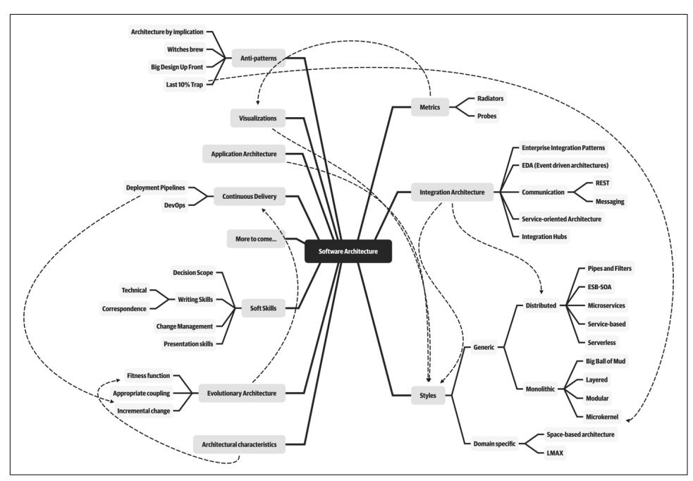
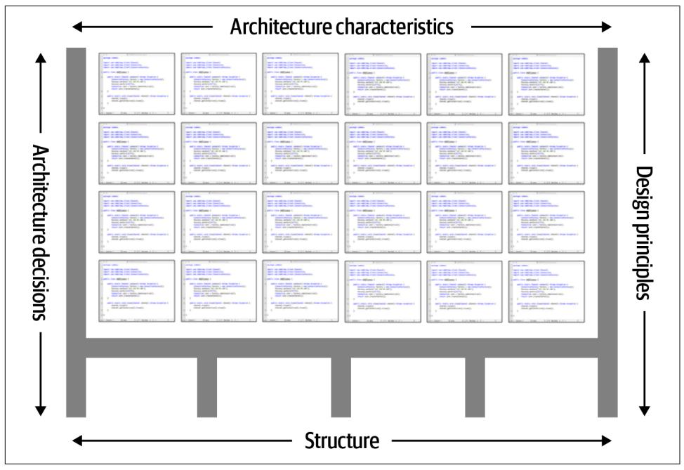
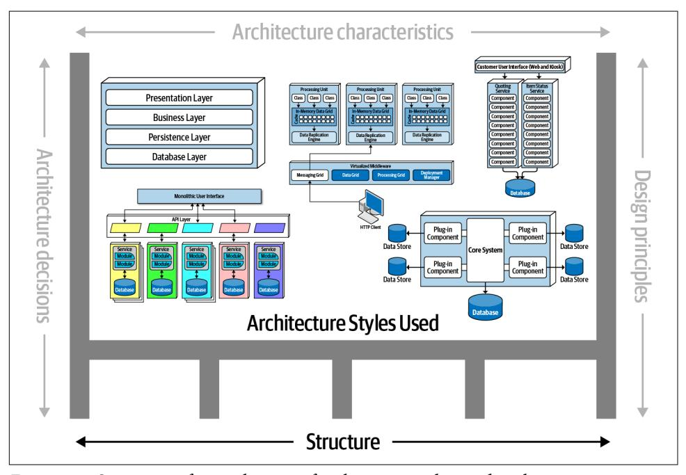
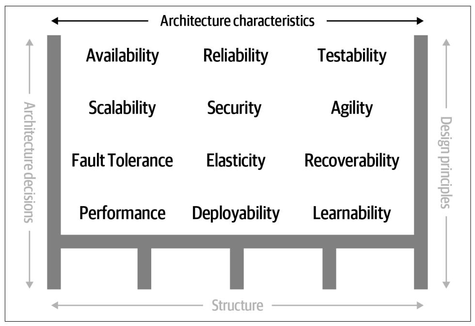
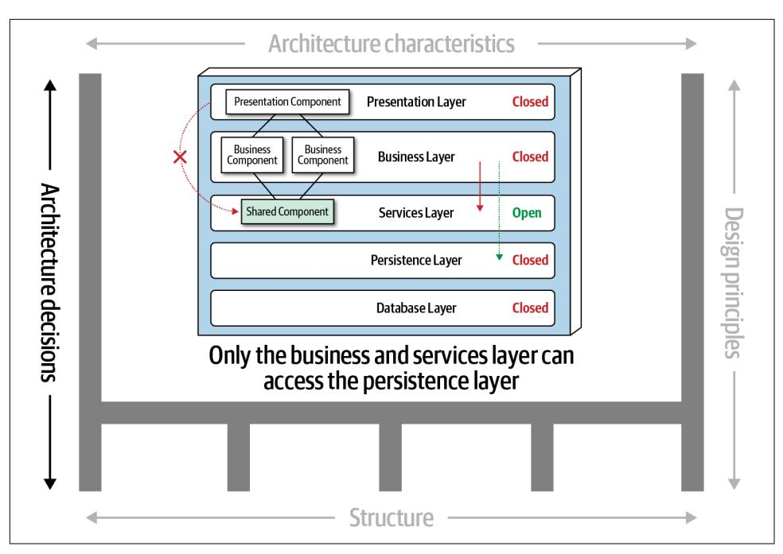
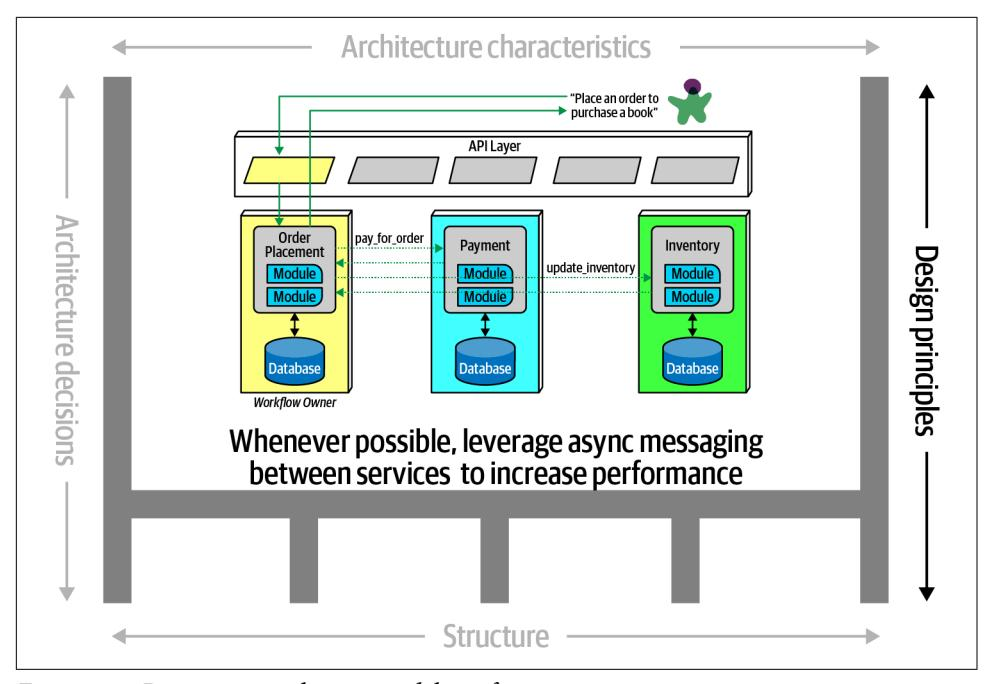
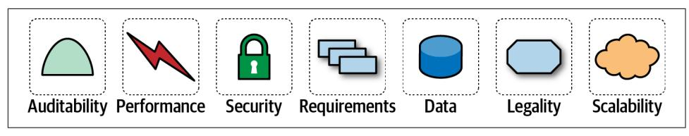

# Chapter 1: Introduction

The job "software architect" appears near the top of numerous lists of best jobs across the world. Yet when readers look at the *other* jobs on those lists (like nurse practi‐ tioner or finance manager), there's a clear career path for them. Why is there no path for software architects?

First, the industry doesn't have a good definition of software architecture itself. When we teach foundational classes, students often ask for a concise definition of what a software architect does, and we have adamantly refused to give one. And we're not the only ones. In his famous whitepaper ["Who Needs an Architect?"](https://oreil.ly/-Dbzs) Martin Fowler famously refused to try to define it, instead falling back on the famous quote:

Architecture is about the important stuff…whatever that is.

—Ralph Johnson

When pressed, we created the mindmap shown in [Figure 1-1,](#page-21-0) which is woefully incomplete but indicative of the scope of software architecture. We will, in fact, offer our definition of software architecture shortly.

Second, as illustrated in the mindmap, the role of software architect embodies a mas‐ sive amount and scope of responsibility that continues to expand. A decade ago, soft‐ ware architects dealt only with the purely technical aspects of architecture, like modularity, components, and patterns. Since then, because of new architectural styles that leverage a wider swath of capabilities (like microservices), the role of software architect has expanded. We cover the many intersections of architecture and the remainder of the organization in ["Intersection of Architecture and…" on page 13.](#page-32-0)

**1**

*Figure 1-1. The responsibilities of a soware architect encompass technical abilities, so skills, operational awareness, and a host of others*

Third, software architecture is a constantly moving target because of the rapidly evolving software development ecosystem. Any definition cast today will be hope‐ lessly outdated in a few years. The [Wikipedia definition of software architecture](https://oreil.ly/YLsY2) pro‐ vides a reasonable overview, but many statements are outdated, such as "Software architecture is about making fundamental structural choices which are costly to change once implemented." Yet architects designed modern architectural styles like microservices with the idea of incremental built in—it is no longer expensive to make structural changes in microservices. Of course, that capability means trade-offs with other concerns, such as coupling. Many books on software architecture treat it as a static problem; once solved, we can safely ignore it. However, we recognize the inher‐ ent dynamic nature of software architecture, including the definition itself, through‐ out the book.

Fourth, much of the material about software architecture has only historical rele‐ vance. Readers of the Wikipedia page won't fail to notice the bewildering array of acronyms and cross-references to an entire universe of knowledge. Yet, many of these acronyms represent outdated or failed attempts. Even solutions that were perfectly valid a few years ago cannot work now because the context has changed. The history of software architecture is littered with things architects have tried, only to realize the damaging side effects. We cover many of those lessons in this book.

Why a book on software architecture fundamentals now? The scope of software architecture isn't the only part of the development world that constantly changes. New technologies, techniques, capabilities…in fact, it's easier to find things that haven't changed over the last decade than to list all the changes. Software architects must make decisions within this constantly changing ecosystem. Because everything changes, including foundations upon which we make decisions, architects should reexamine some core axioms that informed earlier writing about software architec‐ ture. For example, earlier books about software architecture don't consider the impact of DevOps because it didn't exist when these books were written.

When studying architecture, readers must keep in mind that, like much art, it can only be understood in context. Many of the decisions architects made were based on realities of the environment they found themselves in. For example, one of the major goals of late 20th-century architecture included making the most efficient use of shared resources, because all the infrastructure at the time was expensive and com‐ mercial: operating systems, application servers, database servers, and so on. Imagine strolling into a 2002 data center and telling the head of operations "Hey, I have a great idea for a revolutionary style of architecture, where each service runs on its own iso‐ lated machinery, with its own dedicated database (describing what we now know as microservices). So, that means I'll need 50 licenses for Windows, another 30 applica‐ tion server licenses, and at least 50 database server licenses." In 2002, trying to build an architecture like microservices would be inconceivably expensive. Yet, with the advent of open source during the intervening years, coupled with updated engineer‐ ing practices via the DevOps revolution, we can reasonably build an architecture as described. Readers should keep in mind that all architectures are a product of their context.

## Defining Software Architecture

The industry as a whole has struggled to precisely define "software architecture." Some architects refer to software architecture as the *blueprint* of the system, while others define it as the *roadmap* for developing a system. The issue with these com‐ mon definitions is understanding what the blueprint or roadmap actually contains. For example, what is analyzed when an architect *analyzes* an architecture?

Figure 1-2 illustrates a way to think about software architecture. In this definition, software architecture consists of the *structure* of the system (denoted as the heavy black lines supporting the architecture), combined with *architecture characteristics* ("-ilities") the system must support, *architecture decisions*, and finally *design princi‐ ples*.

*Figure 1-2. Architecture consists of the structure combined with architecture characteris‐ tics ("-ilities"), architecture decisions, and design principles*

The *structure* of the system, as illustrated in Figure 1-3, refers to the type of architec‐ ture style (or styles) the system is implemented in (such as microservices, layered, or microkernel). Describing an architecture solely by the structure does not wholly elu‐ cidate an architecture. For example, suppose an architect is asked to describe an architecture, and that architect responds "it's a microservices architecture." Here, the architect is only talking about the *structure* of the system, but not the *architecture* of the system. Knowledge of the architecture characteristics, architecture decisions, and design principles is also needed to fully understand the architecture of the system.

*Figure 1-3. Structure refers to the type of architecture styles used in the system*

Architecture characteristics are another dimension of defining software architecture (see Figure 1-4). The architecture characteristics define the success criteria of a sys‐ tem, which is generally orthogonal to the functionality of the system. Notice that all of the characteristics listed do not require knowledge of the functionality of the sys‐ tem, yet they are required in order for the system to function properly. Architecture characteristics are so important that we've devoted several chapters in this book to understanding and defining them.

*Figure 1-4. Architecture characteristics refers to the "-ilities" that the system must support*

The next factor that defines software architecture is *architecture decisions*. Architec‐ ture decisions define the rules for how a system should be constructed. For example, an architect might make an architecture decision that only the business and services layers within a layered architecture can access the database (see [Figure 1-5](#page-26-0)), restrict‐ ing the presentation layer from making direct database calls. Architecture decisions form the constraints of the system and direct the development teams on what is and what isn't allowed.

*Figure 1-5. Architecture decisions are rules for constructing systems*

If a particular architecture decision cannot be implemented in one part of the system due to some condition or other constraint, that decision (or rule) can be broken through something called a *variance*. Most organizations have variance models that are used by an architecture review board (ARB) or chief architect. Those models for‐ malize the process for seeking a variance to a particular standard or architecture deci‐ sion. An exception to a particular architecture decision is analyzed by the ARB (or chief architect if no ARB exists) and is either approved or denied based on justifica‐ tions and trade-offs.

The last factor in the definition of architecture is *design principles*. A design principle differs from an architecture decision in that a design principle is a *guideline* rather than a hard-and-fast *rule*. For example, the design principle illustrated in [Figure 1-6](#page-27-0) states that the development teams should leverage asynchronous messaging between services within a microservices architecture to increase performance. An architecture decision (rule) could never cover every condition and option for communication between services, so a design principle can be used to provide guidance for the pre‐ ferred method (in this case, asynchronous messaging) to allow the developer to choose a more appropriate communication protocol (such as REST or gRPC) given a specific circumstance.

*Figure 1-6. Design principles are guidelines for constructing systems*

## Expectations of an Architect

Defining the role of a software architect presents as much difficulty as defining soft‐ ware architecture. It can range from expert programmer up to defining the strategic technical direction for the company. Rather than waste time on the fool's errand of defining the role, we recommend focusing on the *expectations* of an architect.

There are eight core expectations placed on a software architect, irrespective of any given role, title, or job description:

- Make architecture decisions
- Continually analyze the architecture
- Keep current with latest trends
- Ensure compliance with decisions
- Diverse exposure and experience
- Have business domain knowledge
- Possess interpersonal skills
- Understand and navigate politics

The first key to effectiveness and success in the software architect role depends on understanding and practicing each of these expectations.

## Make Architecture Decisions

*An architect is expected to dene the architecture decisions and design principles used to guide technology decisions within the team, the department, or across the enterprise*.

*Guide* is the key operative word in this first expectation. An architect should *guide* rather than *specify* technology choices. For example, an architect might make a deci‐ sion to use React.js for frontend development. In this case, the architect is making a technical decision rather than an architectural decision or design principle that will help the development team make choices. An architect should instead instruct devel‐ opment teams to use a *reactive-based framework for frontend web development*, hence guiding the development team in making the choice between Angular, Elm, React.js, Vue, or any of the other reactive-based web frameworks.

Guiding technology choices through architecture decisions and design principles is difficult. The key to making effective architectural decisions is asking whether the architecture decision is helping to *guide* teams in making the right technical choice or whether the architecture decision *makes* the technical choice for them. That said, an architect on occasion might need to make specific technology decisions in order to preserve a particular architectural characteristic such as scalability, performance, or availability. In this case it would be still considered an architectural decision, even though it specifies a particular technology. Architects often struggle with finding the correct line, so [Chapter 19](026-chapter-19-architecture-decisions.md#page-300-0) is entirely about architecture decisions.

## Continually Analyze the Architecture

*An architect is expected to continually analyze the architecture and current technology environment and then recommend solutions for improvement.*

This expectation of an architect refers to *architecture vitality*, which assesses how via‐ ble the architecture that was defined three or more years ago is *today*, given changes in both business and technology. In our experience, not enough architects focus their energies on continually analyzing existing architectures. As a result, most architec‐ tures experience elements of structural decay, which occurs when developers make coding or design changes that impact the required architectural characteristics, such as performance, availability, and scalability.

Other forgotten aspects of this expectation that architects frequently forget are testing and release environments. Agility for code modification has obvious benefits, but if it takes teams weeks to test changes and months for releases, then architects cannot achieve agility in the overall architecture.

An architect must holistically analyze changes in technology and problem domains to determine the soundness of the architecture. While this kind of consideration rarely appears in a job posting, architects must meet this expectation to keep applications relevant.

## Keep Current with Latest Trends

*An architect is expected to keep current with the latest technology and industry trends.*

Developers must keep up to date on the latest technologies they use on a daily basis to remain relevant (and to retain a job!). An architect has an even more critical require‐ ment to keep current on the latest technical and industry trends. The decisions an architect makes tend to be long-lasting and difficult to change. Understanding and following key trends helps the architect prepare for the future and make the correct decision.

Tracking trends and keeping current with those trends is hard, particularly for a soft‐ ware architect. In [Chapter 24](031-chapter-24-developing-a-career-path.md#page-384-0) we discuss various techniques and resources on how to do this.

## Ensure Compliance with Decisions

*An architect is expected to ensure compliance with architecture decisions and design principles.*

Ensuring compliance means that the architect is continually verifying that develop‐ ment teams are following the architecture decisions and design principles defined, documented, and communicated by the architect. Consider the scenario where an architect makes a decision to restrict access to the database in a layered architecture to only the business and services layers (and not the presentation layer). This means that the presentation layer must go through all layers of the architecture to make even the simplest of database calls. A user interface developer might disagree with this decision and access the database (or the persistence layer) directly for performance reasons. However, the architect made that architecture decision for a specific reason: to control change. By closing the layers, database changes can be made without impacting the presentation layer. By not ensuring compliance with architecture deci‐ sions, violations like this can occur, the architecture will not meet the required archi‐ tectural characteristics ("-ilities"), and the application or system will not work as expected.

In [Chapter 6](011-chapter-6-measuring-and-governing-architecture-characteristics.md#page-96-0) we talk more about measuring compliance using automated fitness functions and automated tools.

## Diverse Exposure and Experience

*An architect is expected to have exposure to multiple and diverse technologies, frame‐ works, platforms, and environments.*

This expectation does not mean an architect must be an expert in every framework, platform, and language, but rather that an architect must at least be familiar with a variety of technologies. Most environments these days are heterogeneous, and at a minimum an architect should know how to interface with multiple systems and serv‐ ices, irrespective of the language, platform, and technology those systems or services are written in.

One of the best ways of mastering this expectation is for the architect to stretch their comfort zone. Focusing only on a single technology or platform is a safe haven. An effective software architect should be aggressive in seeking out opportunities to gain experience in multiple languages, platforms, and technologies. A good way of master‐ ing this expectation is to focus on technical breadth rather than technical depth. Technical breadth includes the stuff you know about, but not at a detailed level, com‐ bined with the stuff you know a lot about. For example, it is far more valuable for an architect to be familiar with 10 different caching products and the associated pros and cons of each rather than to be an expert in only one of them.

## Have Business Domain Knowledge

*An architect is expected to have a certain level of business domain expertise.*

Effective software architects understand not only technology but also the business domain of a problem space. Without business domain knowledge, it is difficult to understand the business problem, goals, and requirements, making it difficult to design an effective architecture to meet the requirements of the business. Imagine being an architect at a large financial institution and not understanding common financial terms such as an average directional index, aleatory contracts, rates rally, or even nonpriority debt. Without this knowledge, an architect cannot communicate with stakeholders and business users and will quickly lose credibility.

The most successful architects we know are those who have broad, hands-on techni‐ cal knowledge coupled with a strong knowledge of a particular domain. These soft‐ ware architects are able to effectively communicate with C-level executives and business users using the domain knowledge and language that these stakeholders know and understand. This in turn creates a strong level of confidence that the soft‐ ware architect knows what they are doing and is competent to create an effective and correct architecture.

## Possess Interpersonal Skills

*An architect is expected to possess exceptional interpersonal skills, including teamwork, facilitation, and leadership.*

Having exceptional leadership and interpersonal skills is a difficult expectation for most developers and architects. As technologists, developers and architects like to solve technical problems, not people problems. However, as [Gerald Weinberg](https://oreil.ly/wyDB8) was famous for saying, "no matter what they tell you, it's always a people problem." An architect is not only expected to provide technical guidance to the team, but is also expected to lead the development teams through the implementation of the architec‐ ture. Leadership skills are at least half of what it takes to become an effective software architect, regardless of the role or title the architect has.

The industry is flooded with software architects, all competing for a limited number of architecture positions. Having strong leadership and interpersonal skills is a good way for an architect to differentiate themselves from other architects and stand out from the crowd. We've known many software architects who are excellent technolo‐ gists but are ineffective architects due to the inability to lead teams, coach and mentor developers, and effectively communicate ideas and architecture decisions and princi‐ ples. Needless to say, those architects have difficulties holding a position or job.

## Understand and Navigate Politics

*An architect is expected to understand the political climate of the enterprise and be able to navigate the politics.*

It might seem rather strange talk about negotiation and navigating office politics in a book about software architecture. To illustrate how important and necessary negotia‐ tion skills are, consider the scenario where a developer makes the decision to leverage the [strategy pattern](https://oreil.ly/QG3RQ) to reduce the overall cyclomatic complexity of a particular piece of complex code. Who really cares? One might applaud the developer for using such a pattern, but in almost all cases the developer does not need to seek approval for such a decision.

Now consider the scenario where an architect, responsible for a large customer rela‐ tionship management system, is having issues controlling database access from other systems, securing certain customer data, and making any database schema change because too many other systems are using the CRM database. The architect therefore makes the decision to create what are called *application silos*, where each application database is only accessible from the application owning that database. Making this decision will give the architect better control over the customer data, security, and change control. However, unlike the previous developer scenario, this decision will also be challenged by almost everyone in the company (with the possible exception of the CRM application team, of course). Other applications need the customer manage‐

ment data. If those applications are no longer able to access the database directly, they must now ask the CRM system for the data, requiring remote access calls through REST, SOAP, or some other remote access protocol.

The main point is that *almost every decision an architect makes will be challenged*. Architectural decisions will be challenged by product owners, project managers, and business stakeholders due to increased costs or increased effort (time) involved. Architectural decisions will also be challenged by developers who feel their approach is better. In either case, the architect must navigate the politics of the company and apply basic negotiation skills to get most decisions approved. This fact can be very frustrating to a software architect, because most decisions made as a developer did not require approval or even a review. Programming aspects such as code structure, class design, design pattern selection, and sometimes even language choice are all part of the art of programming. However, an architect, now able to finally be able to make broad and important decisions, must justify and fight for almost every one of those decisions. Negotiation skills, like leadership skills, are so critical and necessary that we've dedicated an entire chapter in the book to understanding them (see [Chapter 23\)](030-chapter-23-negotiation-and-leadership-skills.md#page-366-0).

## Intersection of Architecture and…

The scope of software architecture has grown over the last decade to encompass more and more responsibility and perspective. A decade ago, the typical relationship between architecture and operations was contractual and formal, with lots of bureaucracy. Most companies, trying to avoid the complexity of hosting their own operations, frequently outsourced operations to a third-party company, with contrac‐ tual obligations for service-level agreements, such as uptime, scale, responsiveness, and a host of other important architectural characteristics. Now, architectures such as microservices freely leverage former solely operational concerns. For example, elastic scale was once painfully built into architectures (see [Chapter 15](021-chapter-15-space-based-architecture-style.md#page-230-0)), while microservices handled it less painfully via a liaison between architects and DevOps.

## History: Pets.com and Why We Have Elastic Scale

The history of software development contains rich lessons, both good and bad. We assume that current capabilities (like elastic scale) just appeared one day because of some clever developer, but those ideas were often born of hard lessons. Pets.com rep‐ resents an early example of hard lessons learned. Pets.com appeared in the early days of the internet, hoping to become the Amazon.com of pet supplies. Fortunately, they had a brilliant marketing department, which invented a compelling mascot: a sock puppet with a microphone that said irreverent things. The mascot became a superstar, appearing in public at parades and national sporting events.

Unfortunately, management at Pets.com apparently spent all the money on the mas‐ cot, not on infrastructure. Once orders started pouring in, they weren't prepared. The website was slow, transactions were lost, deliveries delayed, and so on…pretty much the worst-case scenario. So bad, in fact, that the business closed shortly after its disas‐ trous Christmas rush, selling the only remaining valuable asset (the mascot) to a competitor.

What the company needed was elastic scale: the ability to spin up more instances of resources, as needed. Cloud providers offer this feature as a commodity, but in the early days of the internet, companies had to manage their own infrastructure, and many fell victim to a previously unheard of phenomenon: too much success can kill the business. Pets.com and other similar horror stories led engineers to develop the frameworks that architects enjoy now.

The following sections delve into some of the newer intersections between the role of architect and other parts of an organization, highlighting new capabilities and responsibilities for architects.

## Engineering Practices

Traditionally, software architecture was separate from the development process used to create software. Dozens of popular methodologies exist to build software, includ‐ ing Waterfall and many flavors of Agile (such as Scrum, Extreme Programming, Lean, and Crystal), which mostly don't impact software architecture.

However, over the last few years, engineering advances have thrust process concerns upon software architecture. It is useful to separate software development *process* from *engineering practices*. By *process*, we mean how teams are formed and managed, how meetings are conducted, and workflow organization; it refers to the mechanics of how people organize and interact. Software *engineering* practices, on the other hand, refer to process-agnostic practices that have illustrated, repeatable benefit. For exam‐ ple, continuous integration is a proven engineering practice that doesn't rely on a par‐ ticular process.

## The Path from Extreme Programming to Continuous Delivery

The origins of [Extreme Programming \(XP\)](http://www.extremeprogramming.org) nicely illustrate the difference between *process* and *engineering*. In the early 1990s, a group of experienced software develop‐ ers, led by Kent Beck, started questioning the dozens of different development pro‐ cesses popular at the time. In their experience, it seemed that none of them created repeatably good outcomes. One of the XP founders said that choosing one of the extant processes was "no more guarantee of project success than flipping a coin." They decided to rethink how to build software, and they started the XP project in March of 1996. To inform their process, they rejected the conventional wisdom and focused on the *practices* that led to project success in the past, pushed to the extreme. Their reasoning was that they'd seen a correlation on previous projects between more tests and higher quality. Thus, the XP approach to testing took the practice to the extreme: do test-first development, ensuring that all code is tested before it enters the code base.

XP was lumped into other popular Agile processes that shared similar perspectives, but it was one of the few methodologies that included engineering practices such as automation, testing, continuous integration, and other concrete, experienced-based techniques. The efforts to continue advancing the engineering side of software development continued with the book *Continuous Delivery* (Addison-Wesley Profes‐ sional)—an updated version of many XP practices—and came to fruition in the DevOps movement. In many ways, the DevOps revolution occurred when operations adopted engineering practices originally espoused by XP: automation, testing, declar‐ ative single source of truth, and others.

We strongly support these advances, which form the incremental steps that will even‐ tually graduate software development into a proper engineering discipline.

Focusing on engineering practices is important. First, software development lacks many of the features of more mature engineering disciplines. For example, civil engi‐ neers can predict structural change with much more accuracy than similarly impor‐ tant aspects of software structure. Second, one of the Achilles heels of software development is estimation—how much time, how many resources, how much money? Part of this difficulty lies with antiquated accounting practices that cannot accommodate the exploratory nature of software development, but another part is because we're traditionally bad at estimation, at least in part because of *unknown unknowns*.

…because as we know, there are known knowns; there are things we know we know. We also know there are known unknowns; that is to say we know there are some things we do not know. But there are also unknown unknowns—the ones we don't know we don't know.

—Former United States Secretary of Defense Donald Rumsfeld

Unknown unknowns are the nemesis of software systems. Many projects start with a list of *known unknowns*: things developers must learn about the domain and technol‐ ogy they know are upcoming. However, projects also fall victim to *unknown unknowns*: things no one knew were going to crop up yet have appeared unexpect‐ edly. This is why all "Big Design Up Front" software efforts suffer: architects cannot design for unknown unknowns. To quote Mark (one of your authors):

All architectures become iterative because of *unknown unknowns*, Agile just recognizes this and does it sooner.

Thus, while process is mostly separate from architecture, an iterative process fits the nature of software architecture better. Teams trying to build a modern system such as microservices using an antiquated process like Waterfall will find a great deal of fric‐ tion from an antiquated process that ignores the reality of how software comes together.

Often, the architect is also the technical leader on projects and therefore determines the engineering practices the team uses. Just as architects must carefully consider the problem domain before choosing an architecture, they must also ensure that the architectural style and engineering practices form a symbiotic mesh. For example, a microservices architecture assumes automated machine provisioning, automated testing and deployment, and a raft of other assumptions. Trying to build one of these architectures with an antiquated operations group, manual processes, and little test‐ ing creates tremendous friction and challenges to success. Just as different problem domains lend themselves toward certain architectural styles, engineering practices have the same kind of symbiotic relationship.

The evolution of thought leading from Extreme Programming to Continuous Deliv‐ ery continues. Recent advances in engineering practices allow new capabilities within architecture. Neal's most recent book, *[Building Evolutionary Architectures](http://shop.oreilly.com/product/0636920080237.do)* (O'Reilly), highlights new ways to think about the intersection of engineering practices and architecture, allowing better automation of architectural governance. While we won't summarize that book here, it gives an important new nomenclature and way of think‐ ing about architectural characteristics that will infuse much of the remainder of this book. Neal's book covers techniques for building architectures that change gracefully over time. In [Chapter 4](009-chapter-4-architecture-characteristics-defined.md#page-74-0), we describe architecture as the combination of requirements and additional concerns, as illustrated in Figure 1-7.

*Figure 1-7. The architecture for a soware system consists of both requirements and all the other architectural characteristics*

As any experience in the software development world illustrates, nothing remains static. Thus, architects may design a system to meet certain criteria, but that design must survive both implementation (how can architects make sure that their design is implemented correctly) and the inevitable change driven by the software develop‐ ment ecosystem. What we need is an *evolutionary architecture*.

*Building Evolutionary Architectures* introduces the concept of using *tness functions* to protect (and govern) architectural characteristics as change occurs over time. The concept comes from evolutionary computing. When designing a genetic algorithm, developers have a variety of techniques to mutate the solution, evolving new solutions iteratively. When designing such an algorithm for a specific goal, developers must measure the outcome to see if it is closer or further away from an optimal solution; that measure is a fitness function. For example, if developers designed a genetic algo‐ rithm to solve the traveling salesperson problem (whose goal is the shortest route between various cities), the fitness function would look at the path length.

*Building Evolutionary Architectures* co-opts this idea to create *architectural tness functions*: an objective integrity assessment of some architectural characteristic(s). This assessment may include a variety of mechanisms, such as metrics, unit tests, monitors, and chaos engineering. For example, an architect may identify page load time as an importance characteristic of the architecture. To allow the system to change without degrading performance, the architecture builds a fitness function as a test that measures page load time for each page and then runs the test as part of the continuous integration for the project. Thus, architects always know the status of crit‐ ical parts of the architecture because they have a verification mechanism in the form of fitness functions for each part.

We won't go into the full details of fitness functions here. However, we will point out opportunities and examples of the approach where applicable. Note the correlation between how often fitness functions execute and the feedback they provide. You'll see that adopting Agile engineering practices such as continuous integration, automated machine provisioning, and similar practices makes building resilient architectures easier. It also illustrates how intertwined architecture has become with engineering practices.

## Operations/DevOps

The most obvious recent intersection between architecture and related fields occur‐ red with the advent of DevOps, driven by some rethinking of architectural axioms. For many years, many companies considered operations as a separate function from software development; they often outsource operations to another company as a costsaving measure. Many architectures designed during the 1990s and 2000s assumed that architects couldn't control operations and were built defensively around that restriction (for a good example of this, see Space-Based Architecture in [Chapter 15\)](021-chapter-15-space-based-architecture-style.md#page-230-0).

However, a few years ago, several companies started experimenting with new forms of architecture that combine many operational concerns with the architecture. For example, in older-style architectures, such as ESB-driven SOA, the architecture was designed to handle things like elastic scale, greatly complicating the architecture in the process. Basically, architects were forced to defensively design around the limita‐

tions introduced because of the cost-saving measure of outsourcing operations. Thus, they built architectures that could handle scale, performance, elasticity, and a host of other capabilities internally. The side effect of that design was vastly more complex architecture.

The builders of the microservices style of architecture realized that these operational concerns are better handled by operations. By creating a liaison between architecture and operations, the architects can simplify the design and rely on operations for the things they handle best. Thus, realizing a misappropriation of resources led to acci‐ dental complexity, and architects and operations teamed up to create microservices, the details of which we cover in [Chapter 17.](023-chapter-17-microservices-architecture.md#page-264-0)

## Process

Another axiom is that software architecture is mostly orthogonal to the software development process; the way that you build software (*process*) has little impact on the software architecture (*structure*). Thus, while the software development process a team uses has some impact on software architecture (especially around engineering practices), historically they have been thought of as mostly separate. Most books on software architecture ignore the software development process, making specious assumptions about things like predictability. However, the process by which teams develop software has an impact on many facets of software architecture. For example, many companies over the last few decades have adopted Agile development method‐ ologies because of the nature of software. Architects in Agile projects can assume iter‐ ative development and therefore a faster feedback loop for decisions. That in turn allows architects to be more aggressive about experimentation and other knowledge that relies on feedback.

As the previous quote from Mark observes, all architecture becomes iterative; it's only a matter of time. Toward that end, we're going assume a baseline of Agile methodolo‐ gies throughout and call out exceptions where appropriate. For example, it is still common for many monolithic architectures to use older processes because of their age, politics, or other mitigating factors unrelated to software.

One critical aspect of architecture where Agile methodologies shine is restructuring. Teams often find that they need to migrate their architecture from one pattern to another. For example, a team started with a monolithic architecture because it was easy and fast to bootstrap, but now they need to move it to a more modern architec‐ ture. Agile methodologies support these kinds of changes better than planning-heavy processes because of the tight feedback loop and encouragement of techniques like the [Strangler Pattern](https://oreil.ly/ZRpCc) and [feature toggles.](https://trunkbaseddevelopment.com)

## Data

A large percentage of serious application development includes external data storage, often in the form of a relational (or, increasingly, NoSQL) database. However, many books about software architecture include only a light treatment of this important aspect of architecture. Code and data have a symbiotic relationship: one isn't useful without the other.

Database administrators often work alongside architects to build data architecture for complex systems, analyzing how relationships and reuse will affect a portfolio of applications. We won't delve into that level of specialized detail in this book. At the same time, we won't ignore the existence and dependence on external storage. In par‐ ticular, when we talk about the operational aspects of architecture and *architectural quantum* (see ["Architectural Quanta and Granularity" on page 92\)](012-chapter-7-scope-of-architecture-characteristics.md#page-111-0), we include impor‐ tant external concerns such as databases.

## Laws of Software Architecture

While the scope of software architecture is almost impossibly broad, unifying ele‐ ments do exist. The authors have first and foremost learned the *First Law of Soware Architecture* by constantly stumbling across it:

Everything in software architecture is a trade-off.

—First Law of Software Architecture

Nothing exists on a nice, clean spectrum for software architects. Every decision must take into account many opposing factors.

If an architect thinks they have discovered something that *isn't* a trade-off, more likely they just haven't *identied* the trade-off yet.

—Corollary 1

We define software architecture in terms beyond structural scaffolding, incorporating principles, characteristics, and so on. Architecture is broader than just the combina‐ tion of structural elements, reflected in our *Second Law of Soware Architecture*:

*Why* is more important than *how*.

—Second Law of Software Architecture

The authors discovered the importance of this perspective when we tried keeping the results of exercises done by students during workshop as they crafted architecture solutions. Because the exercises were timed, the only artifacts we kept were the dia‐ grams representing the topology. In other words, we captured *how* they solved the problem but not *why* the team made particular choices. An architect can look at an existing system they have no knowledge of and ascertain how the structure of the

architecture works, but will struggle explaining why certain choices were made versus others.

Throughout the book, we highlight *why* architects make certain decisions along with trade-offs. We also highlight good techniques for capturing important decisions in ["Architecture Decision Records" on page 285.](026-chapter-19-architecture-decisions.md#page-304-0)
