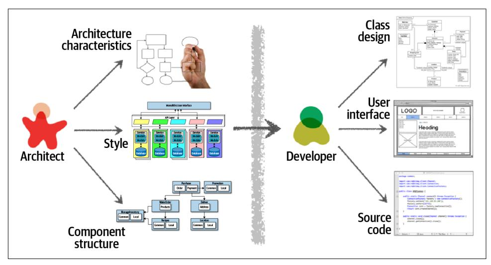
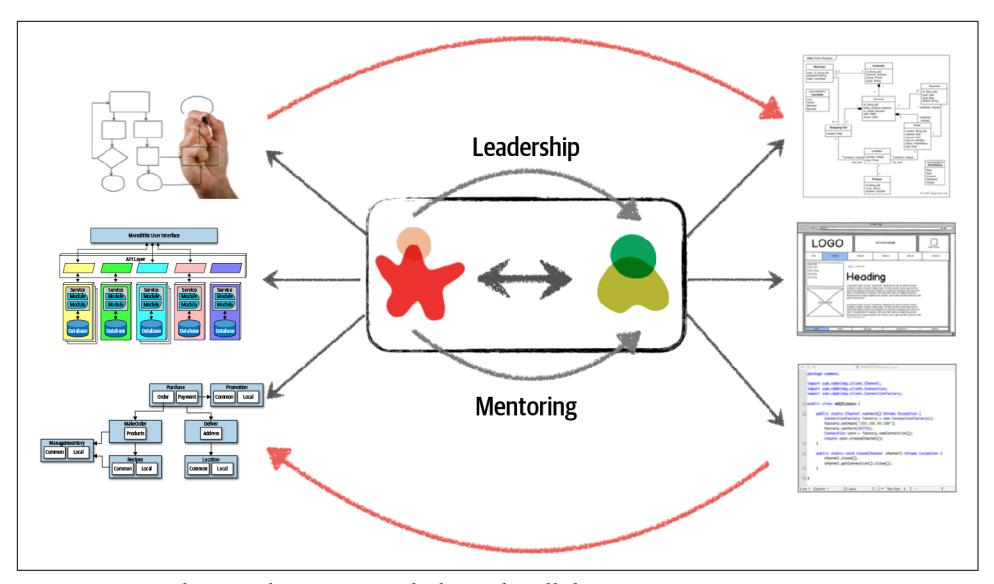
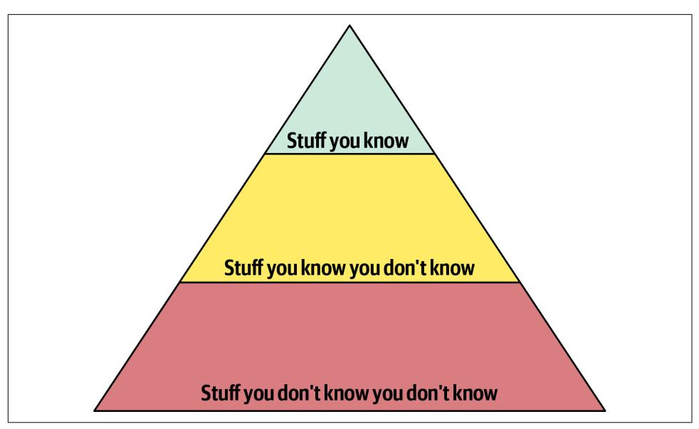
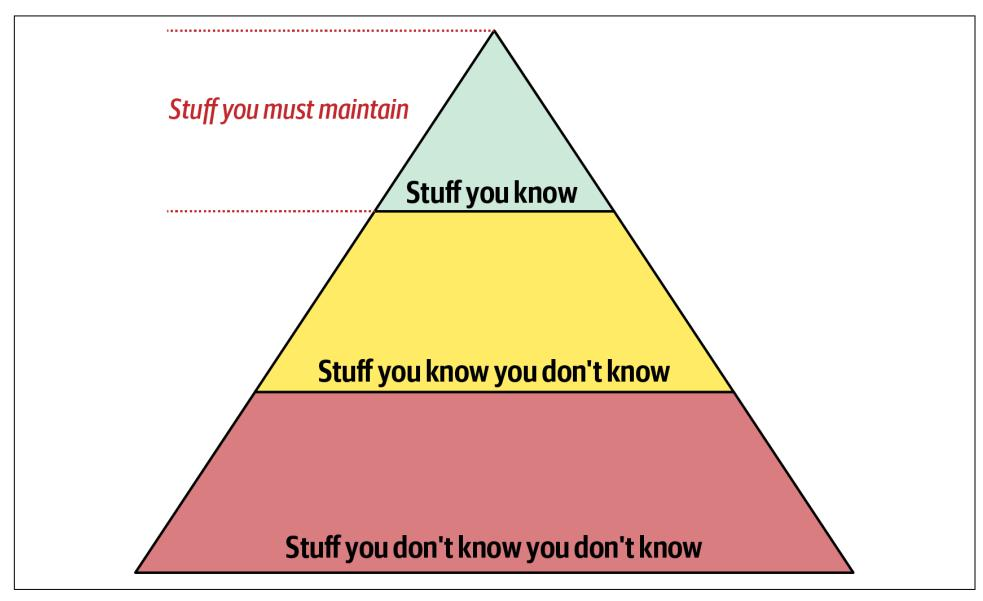
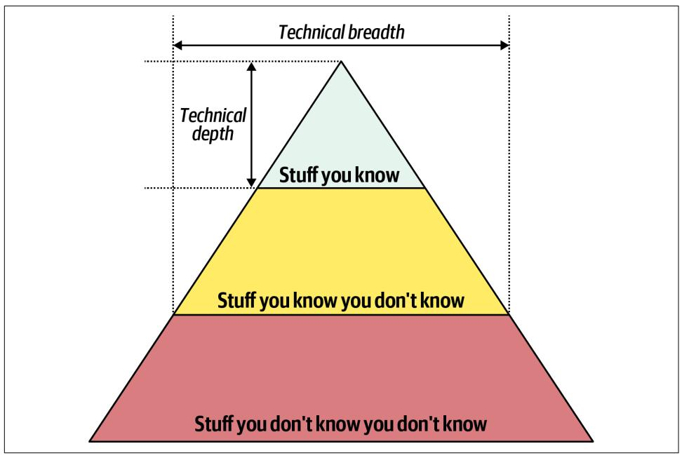
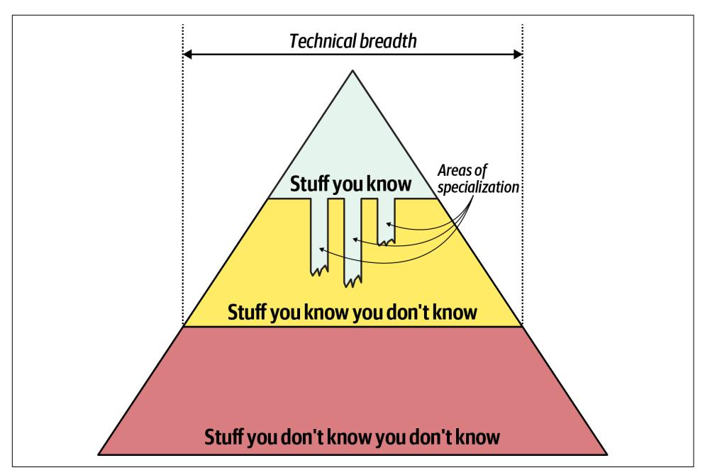
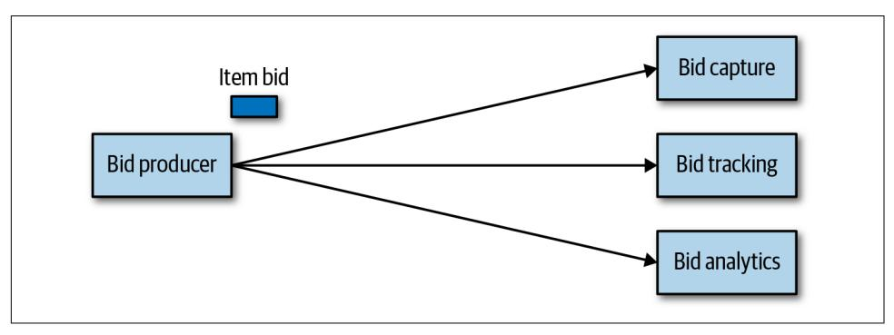
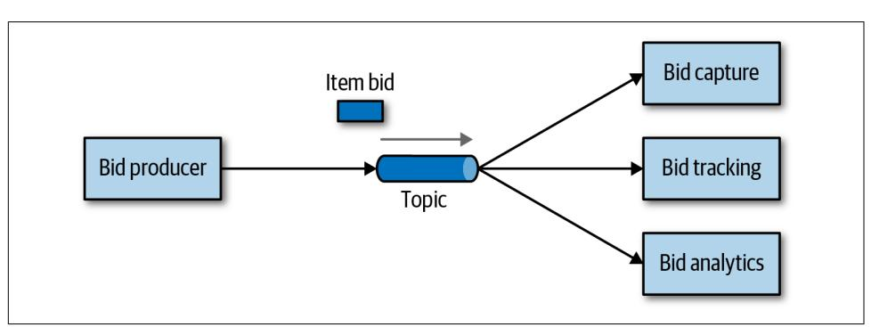
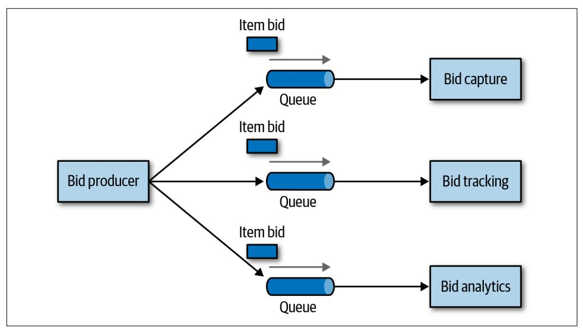

# Chapter 2: Architectural Thinking

An architect sees things differently from a developer's point of view, much in the same way a meteorologist might see clouds differently from an artist's point of view. This is called *architectural thinking*. Unfortunately, too many architects believe that architectural thinking is simply just "thinking about the architecture."

Architectural thinking is much more than that. It is seeing things with an architec‐ tural eye, or an architectural point of view. There are four main aspects of thinking like an architect. First, it's understanding the difference between architecture and design and knowing how to collaborate with development teams to make architecture work. Second, it's about having a wide breadth of technical knowledge while still maintaining a certain level of technical depth, allowing the architect to see solutions and possibilities that others do not see. Third, it's about understanding, analyzing, and reconciling trade-offs between various solutions and technologies. Finally, it's about understanding the importance of business drivers and how they translate to architectural concerns.

In this chapter we explore these four aspects of thinking like an architect and seeing things with an architectural eye.

## Architecture Versus Design

The difference between architecture and design is often a confusing one. Where does architecture end and design begin? What responsibilities does an architect have ver‐ sus those of a developer? Thinking like an architect is knowing the difference between architecture and design and seeing how the two integrate closely to form sol‐ utions to business and technical problems.

Consider [Figure 2-1](#page-43-0), which illustrates the traditional responsibilities an architect has, as compared to those of a developer. As shown in the diagram, an architect is respon‐

sible for things like analyzing business requirements to extract and define the archi‐ tectural characteristics ("-ilities"), selecting which architecture patterns and styles would fit the problem domain, and creating components (the building blocks of the system). The artifacts created from these activities are then handed off to the develop‐ ment team, which is responsible for creating class diagrams for each component, cre‐ ating user interface screens, and developing and testing source code.

*Figure 2-1. Traditional view of architecture versus design*

There are several issues with the traditional responsibility model illustrated in Figure 2-1. As a matter of fact, this illustration shows exactly why architecture rarely works. Specifically, it is the unidirectional arrow passing though the virtual and phys‐ ical barriers separating the architect from the developer that causes all of the prob‐ lems associated with architecture. Decisions an architect makes sometimes never make it to the development teams, and decisions development teams make that change the architecture rarely get back to the architect. In this model the architect is disconnected from the development teams, and as such the architecture rarely pro‐ vides what it was originally set out to do.

To make architecture work, both the physical and virtual barriers that exist between architects and developers must be broken down, thus forming a strong bidirectional relationship between architects and development teams. The architect and developer must be on the same virtual team to make this work, as depicted in [Figure 2-2](#page-44-0). Not only does this model facilitate strong bidirectional communication between architec‐ ture and development, but it also allows the architect to provide mentoring and coaching to developers on the team.

*Figure 2-2. Making architecture work through collaboration*

Unlike the old-school waterfall approaches to static and rigid software architecture, the architecture of today's systems changes and evolves every iteration or phase of a project. A tight collaboration between the architect and the development team is essential for the success of any software project. So where does architecture end and design begin? It doesn't. They are both part of the circle of life within a software project and must always be kept in synchronization with each other in order to succeed.

## Technical Breadth

The scope of technological detail differs between developers and architects. Unlike a developer, who must have a significant amount of *technical depth* to perform their job, a software architect must have a significant amount of *technical breadth* to think like an architect and see things with an architecture point of view. This is illustrated by the knowledge pyramid shown in [Figure 2-3](#page-45-0), which encapsulates all the technical knowledge in the world. It turns out that the kind of information a technologist should value differs with career stages.

*Figure 2-3. The pyramid representing all knowledge*

As shown in Figure 2-3, any individual can partition all their knowledge into three sections: *stuff you know*, *stuff you know you don't know*, and *stuff you don't know you don't know*.

*Stuff you know* includes the technologies, frameworks, languages, and tools a technol‐ ogist uses on a daily basis to perform their job, such as knowing Java as a Java pro‐ grammer. *Stuff you know you don't know* includes those things a technologist knows a little about or has heard of but has little or no expertise in. A good example of this level of knowledge is the Clojure programming language. Most technologists have *heard* of Clojure and know it's a programming language based on Lisp, but they can't code in the language. *Stuff you don't know you don't know* is the largest part of the knowledge triangle and includes the entire host of technologies, tools, frameworks, and languages that would be the perfect solution to a problem a technologist is trying to solve, but the technologist doesn't even know those things exist.

A developer's early career focuses on expanding the top of the pyramid, to build experience and expertise. This is the ideal focus early on, because developers need more perspective, working knowledge, and hands-on experience. Expanding the top incidentally expands the middle section; as developers encounter more technologies and related artifacts, it adds to their stock of *stuff you know you don't know*.

In Figure 2-4, expanding the top of the pyramid is beneficial because expertise is val‐ ued. However, the *stuff you know* is also the *stuff you must maintain*—nothing is static in the software world. If a developer becomes an expert in Ruby on Rails, that exper‐ tise won't last if they ignore Ruby on Rails for a year or two. The things at the top of the pyramid require time investment to maintain expertise. Ultimately, the size of the top of an individual's pyramid is their *technical depth*.

*Figure 2-4. Developers must maintain expertise to retain it*

However, the nature of knowledge changes as developers transition into the architect role. A large part of the value of an architect is a *broad* understanding of technology and how to use it to solve particular problems. For example, as an architect, it is more beneficial to know that five solutions exist for a particular problem than to have sin‐ gular expertise in only one. The most important parts of the pyramid for architects are the top *and* middle sections; how far the middle section penetrates into the bot‐ tom section represents an architect's technical *breadth*, as shown in Figure 2-5.

*Figure 2-5. What someone knows is technical depth, and how much someone knows is technical breadth*

As an architect, *breadth* is more important than *depth*. Because architects must make decisions that match capabilities to technical constraints, a broad understanding of a wide variety of solutions is valuable. Thus, for an architect, the wise course of action is to sacrifice some hard-won expertise and use that time to broaden their portfolio, as shown in [Figure 2-6](#page-48-0). As illustrated in the diagram, some areas of expertise will remain, probably in particularly enjoyable technology areas, while others usefully atrophy.

*Figure 2-6. Enhanced breadth and shrinking depth for the architect role*

Our knowledge pyramid illustrates how fundamentally different the role of *architect* compares to *developer*. Developers spend their whole careers honing expertise, and transitioning to the architect role means a shift in that perspective, which many indi‐ viduals find difficult. This in turn leads to two common dysfunctions: first, an archi‐ tect tries to maintain expertise in a wide variety of areas, succeeding in none of them and working themselves ragged in the process. Second, it manifests as *stale expertise* —the mistaken sensation that your outdated information is still cutting edge. We see this often in large companies where the developers who founded the company have moved into leadership roles yet still make technology decisions using ancient criteria (see ["Frozen Caveman Anti-Pattern" on page 30](#page-49-0)).

Architects should focus on technical breadth so that they have a larger quiver from which to draw arrows. Developers transitioning to the architect role may have to change the way they view knowledge acquisition. Balancing their portfolio of knowl‐ edge regarding depth versus breadth is something every developer should consider throughout their career.

## Frozen Caveman Anti-Pattern

A behavioral anti-pattern commonly observed in the wild, the *Frozen Caveman Anti-Pattern*, describes an architect who always reverts back to their pet irrational concern for every architecture. For example, one of Neal's colleagues worked on a system that featured a centralized architecture. Yet, each time they delivered the design to the cli‐ ent architects, the persistent question was "But what if we lose Italy?" Several years before, a freak communication problem had prevented headquarters from communi‐ cating with its stores in Italy, causing great inconvenience. While the chances of a reoccurrence were extremely small, the architects had become obsessed about this particular architectural characteristic.

Generally, this anti-pattern manifests in architects who have been burned in the past by a poor decision or unexpected occurrence, making them particularly cautious in the future. While risk assessment is important, it should be realistic as well. Under‐ standing the difference between genuine versus perceived technical risk is part of the ongoing learning process for architects. Thinking like an architect requires overcom‐ ing these "frozen caveman" ideas and experiences, seeing other solutions, and asking more relevant questions.

## Analyzing Trade-Offs

Thinking like an architect is all about seeing trade-offs in every solution, technical or otherwise, and analyzing those trade-offs to determine what is the best solution. To quote Mark (one of your authors):

Architecture is the stuff you can't Google.

*Everything* in architecture is a trade-off, which is why the famous answer to every architecture question in the universe is "it depends." While many people get increas‐ ingly annoyed at this answer, it is unfortunately true. You cannot Google the answer to whether REST or messaging would be better, or whether microservices is the right architecture style, because it *does* depend. It depends on the deployment environ‐ ment, business drivers, company culture, budgets, timeframes, developer skill set, and dozens of other factors. Everyone's environment, situation, and problem is different, hence why architecture is so hard. To quote Neal (another one of your authors):

There are no right or wrong answers in architecture—only trade-offs.

For example, consider an item auction system, as illustrated in Figure 2-7, where someone places a bid for an item up for auction.

*Figure 2-7. Auction system example of a trade-off—queues or topics?*

The Bid Producer service generates a bid from the bidder and then sends that bid amount to the Bid Capture, Bid Tracking, and Bid Analytics services. This could be done by using queues in a point-to-point messaging fashion or by using a topic in a publish-and-subscribe messaging fashion. Which one should the architect use? You can't Google the answer. Architectural thinking requires the architect to analyze the trade-offs associated with each option and select the best one given the specific situation.

The two messaging options for the item auction system are shown in Figures 2-8 and [2-9,](#page-51-0) with Figure 2-8 illustrating the use of a topic in a publish-and-subscribe messag‐ ing model, and [Figure 2-9](#page-51-0) illustrating the use of queues in a point-to-point messaging model.

*Figure 2-8. Use of a topic for communication between services*

*Figure 2-9. Use of queues for communication between services*

The clear advantage (and seemingly obvious solution) to this problem in [Figure 2-8](#page-50-0) is that of *architectural extensibility*. The Bid Producer service only requires a single connection to a topic, unlike the queue solution in Figure 2-9 where the Bid Pro ducer needs to connect to three different queues. If a new service called Bid History were to be added to this system due to the requirement to provide each bidder with a history of all the bids they made in each auction, no changes at all would be needed to the existing system. When the new Bid History service is created, it could simply subscribe to the topic already containing the bid information. In the queue option shown in Figure 2-9, however, a new queue would be required for the Bid History service, and the Bid Producer would need to be modified to add an additional con‐ nection to the new queue. The point here is that using queues requires significant change to the system when adding new bidding functionality, whereas with the topic approach no changes are needed at all in the existing infrastructure. Also, notice that the Bid Producer is more decoupled in the topic option—the Bid Producer doesn't know how the bidding information will be used or by which services. In the queue option the Bid Producer knows exactly how the bidding information is used (and by whom), and hence is more coupled to the system.

With this analysis it seems clear that the topic approach using the publish-andsubscribe messaging model is the obvious and best choice. However, to quote Rich Hickey, the creator of the Clojure programming language:

Programmers know the benefits of everything and the trade-offs of nothing. Architects need to understand both.

Thinking architecturally is looking at the benefits of a given solution, but also analyz‐ ing the negatives, or trade-offs, associated with a solution. Continuing with the auc‐ tion system example, a software architect would analyze the negatives of the topic solution. In analyzing the differences, notice first in [Figure 2-8](#page-50-0) that with a topic, *any‐ one* can access bidding data, which introduces a possible issue with data access and data security. In the queue model illustrated in [Figure 2-9,](#page-51-0) the data sent to the queue can *only* be accessed by the specific consumer receiving that message. If a rogue ser‐ vice did listen in on a queue, those bids would not be received by the corresponding service, and a notification would immediately be sent about the loss of data (and hence a possible security breach). In other words, it is very easy to wiretap into a topic, but not a queue.

In addition to the security issue, the topic solution in [Figure 2-8](#page-50-0) only supports homo‐ geneous contracts. All services receiving the bidding data must accept the same con‐ tract and set of bidding data. In the queue option in [Figure 2-9](#page-51-0), each consumer can have its own contract specific to the data it needs. For example, suppose the new Bid History service requires the current asking price along with the bid, but no other ser‐ vice needs that information. In this case, the contract would need to be modified, impacting all other services using that data. In the queue model, this would be a sepa‐ rate channel, hence a separate contract not impacting any other service.

Another disadvantage of the topic model illustrated in [Figure 2-8](#page-50-0) is that it does not support monitoring of the number of messages in the topic and hence auto-scaling capabilities. However, with the queue option in [Figure 2-9,](#page-51-0) each queue can be moni‐ tored individually, and programmatic load balancing applied to each bidding con‐ sumer so that each can be automatically scaled independency from one another. Note that this trade-off is technology specific in that the [Advanced Message Queuing Pro‐](https://www.amqp.org) [tocol \(AMQP\)](https://www.amqp.org) can support programmatic load balancing and monitoring because of the separation between an exchange (what the producer sends to) and a queue (what the consumer listens to).

Given this trade-off analysis, now which is the better option? And the answer? It depends! Table 2-1 summarizes these trade-offs.

*Table 2-1. Trade-offs for topics*

| Topic advantages            | Topic disadvantages                        |
|-----------------------------|--------------------------------------------|
| Architectural extensibility | Data access and data security concerns     |
| Service decoupling          | No heterogeneous contracts                 |
|                             | Monitoring and programmatic scalability |

The point here is that *everything* in software architecture has a trade-off: an advantage and disadvantage. Thinking like an architect is analyzing these trade-offs, then asking "which is more important: extensibility or security?" The decision between different solutions will always depend on the business drivers, environment, and a host of other factors.

## Understanding Business Drivers

Thinking like an architect is understanding the business drivers that are required for the success of the system and translating those requirements into architecture charac‐ teristics (such as scalability, performance, and availability). This is a challenging task that requires the architect to have some level of business domain knowledge and healthy, collaborative relationships with key business stakeholders. We've devoted several chapters in the book on this specific topic. In [Chapter 4](009-chapter-4-architecture-characteristics-defined.md#page-74-0) we define various architecture characteristics. In [Chapter 5](010-chapter-5-identifying-architectural-characteristics.md#page-84-0) we describe ways to identify and qualify architecture characteristics. And in [Chapter 6](011-chapter-6-measuring-and-governing-architecture-characteristics.md#page-96-0) we describe how to measure each of these characteristics to ensure the business needs of the system are met.

## Balancing Architecture and Hands-On Coding

One of the difficult tasks an architect faces is how to balance hands-on coding with software architecture. We firmly believe that every architect should code and be able to maintain a certain level of technical depth (see ["Technical Breadth" on page 25\)](#page-44-0). While this may seem like an easy task, it is sometimes rather difficult to accomplish.

The first tip in striving for a balance between hands-on coding and being a software architect is avoiding the bottleneck trap. The bottleneck trap occurs when the archi‐ tect has taken ownership of code within the critical path of a project (usually the underlying framework code) and becomes a bottleneck to the team. This happens because the architect is not a full-time developer and therefore must balance between playing the developer role (writing and testing source code) and the architect role (drawing diagrams, attending meetings, and well, attending more meetings).

One way to avoid the bottleneck trap as an effective software architect is to delegate the critical path and framework code to others on the development team and then focus on coding a piece of business functionality (a service or a screen) one to three iterations down the road. Three positive things happen by doing this. First, the archi‐ tect is gaining hands-on experience writing production code while no longer becom‐ ing a bottleneck on the team. Second, the critical path and framework code is distributed to the development team (where it belongs), giving them ownership and a better understanding of the harder parts of the system. Third, and perhaps most important, the architect is writing the same business-related source code as the devel‐ opment team and is therefore better able to identify with the development team in

terms of the pain they might be going through with processes, procedures, and the development environment.

Suppose, however, that the architect is not able to develop code with the development team. How can a software architect still remain hands-on and maintain some level of technical depth? There are four basic ways an architect can still remain hands-on at work without having to "practice coding from home" (although we recommend prac‐ ticing coding at home as well).

The first way is to do frequent proof-of-concepts or POCs. This practice not only requires the architect to write source code, but it also helps validate an architecture decision by taking the implementation details into account. For example, if an archi‐ tect is stuck trying to make a decision between two caching solutions, one effective way to help make this decision is to develop a working example in each caching prod‐ uct and compare the results. This allows the architect to see first-hand the implemen‐ tation details and the amount of effort required to develop the full solution. It also allows the architect to better compare architectural characteristics such as scalability, performance, or overall fault tolerance of the different caching solutions.

Our advice when doing proof-of-concept work is that, whenever possible, the archi‐ tect should write the best production-quality code they can. We recommend this practice for two reasons. First, quite often, throwaway proof-of-concept code goes into the source code repository and becomes the reference architecture or guiding example for others to follow. The last thing an architect would want is for their throwaway, sloppy code to be a representation of their typical work. The second rea‐ son is that by writing production-quality proof-of-concept code, the architect gets practice writing quality, well-structured code rather than continually developing bad coding practices.

Another way an architect can remain hands-on is to tackle some of the technical debt stories or architecture stories, freeing the development team up to work on the criti‐ cal functional user stories. These stories are usually low priority, so if the architect does not have the chance to complete a technical debt or architecture story within a given iteration, it's not the end of the world and generally does not impact the success of the iteration.

Similarly, working on bug fixes within an iteration is another way of maintaining hands-on coding while helping the development team as well. While certainly not glamorous, this technique allows the architect to identify where issues and weakness may be within the code base and possibly the architecture.

Leveraging automation by creating simple command-line tools and analyzers to help the development team with their day-to-day tasks is another great way to maintain hands-on coding skills while making the development team more effective. Look for repetitive tasks the development team performs and automate the process. The devel‐

opment team will be grateful for the automation. Some examples are automated source validators to help check for specific coding standards not found in other lint tests, automated checklists, and repetitive manual code refactoring tasks.

Automation can also be in the form of architectural analysis and fitness functions to ensure the vitality and compliance of the architecture. For example, an architect can write Java code in [ArchUnit](https://www.archunit.org) in the Java platform to automate architectural compli‐ ance, or write custom [fitness functions](https://evolutionaryarchitecture.com) to ensure architectural compliance while gain‐ ing hands-on experience. We talk about these techniques in [Chapter 6](011-chapter-6-measuring-and-governing-architecture-characteristics.md#page-96-0).

A final technique to remain hands-on as an architect is to do frequent code reviews. While the architect is not actually writing code, at least they are *involved* in the source code. Further, doing code reviews has the added benefits of being able to ensure com‐ pliance with the architecture and to seek out mentoring and coaching opportunities on the team.
