
# Chapter 8: Component-Based Thinking

In [Chapter 3](008-chapter-3-modularity.md#page-56-0), we discussed *modules* as a collection of related code. However, archi‐ tects typically think in terms of *components*, the physical manifestation of a module.

Developers physically package modules in different ways, sometimes depending on their development platform. We call physical packaging of modules *components*. Most languages support physical packaging as well: jar files in Java, dll in .NET, gem in Ruby, and so on. In this chapter, we discuss architectural considerations around com‐ ponents, ranging from scope to discovery.

## Component Scope

Developers find it useful to subdivide the concept of *component* based on a wide host of factors, a few of which appear in [Figure 8-1](#page-119-0).

Components offer a language-specific mechanism to group artifacts together, often nesting them to create stratification. As shown in [Figure 8-1,](#page-119-0) the simplest component wraps code at a higher level of modularity than classes (or functions, in nonobjectoriented languages). This simple wrapper is often called a *library*, which tends to run in the same memory address as the calling code and communicate via language func‐ tion call mechanisms. Libraries are usually compile-time dependencies (with notable exceptions like dynamic link libraries [DLLs] that were the bane of Windows users for many years).

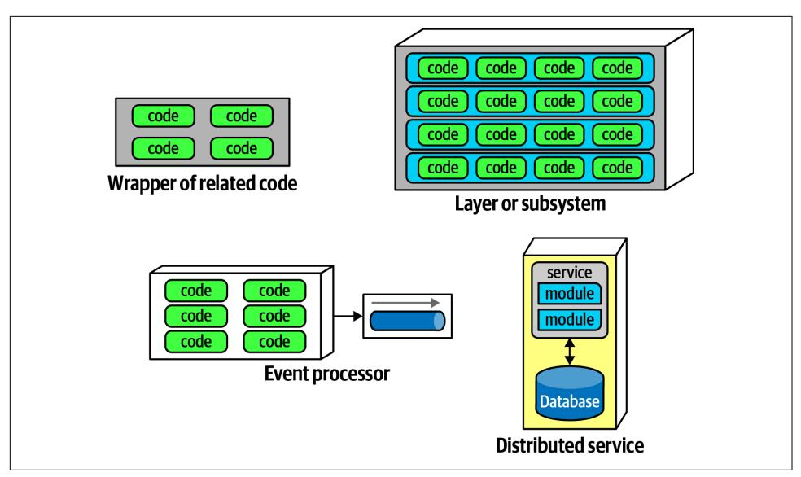

*Figure 8-1. Different varieties of components*

Components also appear as subsystems or layers in architecture, as the deployable unit of work for many event processors. Another type of component, a *service*, tends to run in its own address space and communicates via low-level networking protocols like TCP/IP or higher-level formats like REST or message queues, forming standalone, deployable units in architectures like microservices.

Nothing requires an architect to use components—it just so happens that it's often useful to have a higher level of modularity than the lowest level offered by the lan‐ guage. For example, in microservices architectures, simplicity is one of the architec‐ tural principles. Thus, a service may consist of enough code to warrant components or may be simple enough to just contain a small bit of code, as illustrated in [Figure 8-2](#page-120-0).

Components form the fundamental modular building block in architecture, making them a critical consideration for architects. In fact, one of the primary decisions an architect must make concerns the top-level partitioning of components in the architecture.

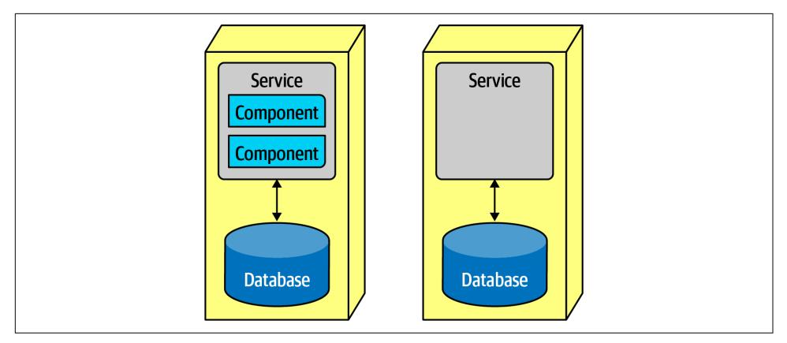

*Figure 8-2. A microservice might have so little code that components aren't necessary*

## Architect Role

Typically, the architect defines, refines, manages, and governs components within an architecture. Software architects, in collaboration with business analysts, subject mat‐ ter experts, developers, QA engineers, operations, and enterprise architects, create the initial design for software, incorporating the architecture characteristics discussed in [Chapter 4](009-chapter-4-architecture-characteristics-defined.md#page-74-0) and the requirements for the software system.

Virtually all the details we cover in this book exist independently from whatever soft‐ ware development process teams use: architecture is independent from the develop‐ ment process. The primary exception to this rule entails the engineering practices pioneered in the various flavors of Agile software development, particularly in the areas of deployment and automating governance. However, in general, software architecture exists separate from the process. Thus, architects ultimately don't care where requirements originate: a formal Joint Application Design (JAD) process, lengthy waterfall-style analysis and design, Agile story cards…or any hybrid variation of those.

Generally the component is the lowest level of the software system an architect inter‐ acts directly with, with the exception of many of the code quality metrics discussed in [Chapter 6](011-chapter-6-measuring-and-governing-architecture-characteristics.md#page-96-0) that affect code bases holistically. Components consist of classes or func‐ tions (depending on the implementation platform), whose design falls under the responsibility of tech leads or developers. It's not that architects shouldn't involve themselves in class design (particularly when discovering or applying design pat‐ terns), but they should avoid micromanaging each decision from top to bottom in the system. If architects never allow other roles to make decisions of consequence, the organization will struggle with empowering the next generation of architects.

An architect must identify components as one of the first tasks on a new project. But before an architect can identify components, they must know how to partition the architecture.

## Architecture Partitioning

The First Law of Software Architecture states that everything in software is a tradeoff, including how architects create components in an architecture. Because compo‐ nents represent a general containership mechanism, an architect can build any type of partitioning they want. Several common styles exist, with different sets of tradeoffs. We discuss architecture styles in depth in [Part II.](014-part-ii-architecture-styles.md#page-136-0) Here we discuss an important aspect of styles, the *top-level partitioning* in an architecture.

Consider the two types of architecture styles shown in Figure 8-3.

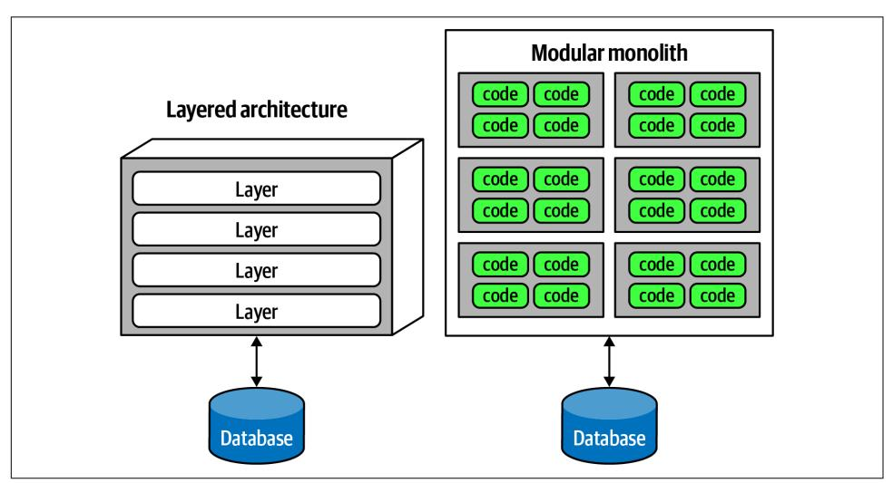

*Figure 8-3. Two types of top-level architecture partitioning: layered and modular*

In Figure 8-3, one type of architecture familiar to many is the *layered monolith* (dis‐ cussed in detail in [Chapter 10\)](016-chapter-10-layered-architecture-style.md#page-152-0). The other is an architecture style popularized by [Simon Brown](https://www.codingthearchitecture.com) called a *modular monolith*, a single deployment unit associated with a database and partitioned around domains rather than technical capabilities. These two styles represent different ways to *top-level partition* the architecture. Note that in each variation, each of the top-level components (layers or components) likely has other components embedded within. The top-level partitioning is of particular inter‐ est to architects because it defines the fundamental architecture style and way of par‐ titioning code.

Organizing architecture based on technical capabilities like the layered monolith rep‐ resents *technical top-level partitioning*. A common version of this appears in Figure 8-4.

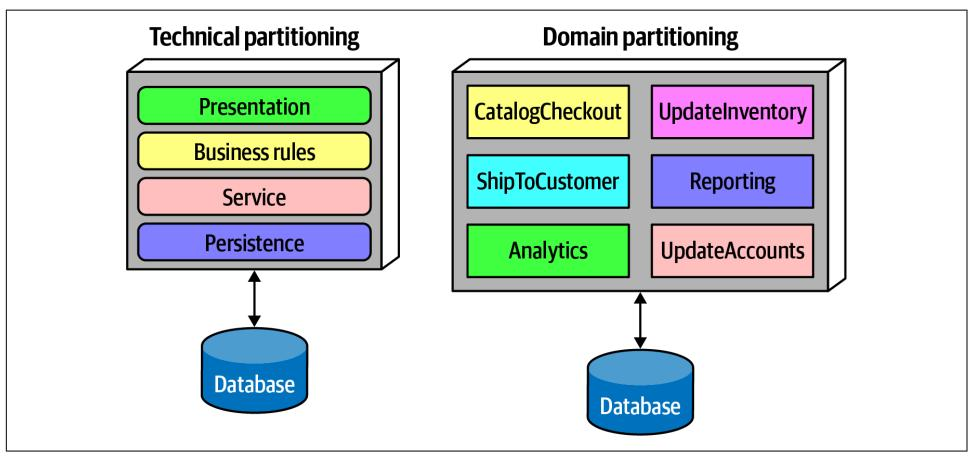

*Figure 8-4. Two types of top-level partitioning in architecture*

In Figure 8-4, the architect has partitioned the functionality of the system into *techni‐ cal* capabilities: presentation, business rules, services, persistence, and so on. This way of organizing a code base certainly makes sense. All the persistence code resides in one layer in the architecture, making it easy for developers to find persistence-related code. Even though the basic concept of layered architecture predates it by decades, the Model-View-Controller design pattern matches with this architectural pattern, making it easy for developers to understand. Thus, it is often the default architecture in many organizations.

An interesting side effect of the predominance of the layered architecture relates to how companies seat different project roles. When using a layered architecture, it makes some sense to have all the backend developers sit together in one department, the DBAs in another, the presentation team in another, and so on. Because of *Con‐ way's law*, this makes some sense in those organizations.

## Conway's Law

Back in the late 1960s, [Melvin Conway](https://oreil.ly/z2Swa) made an observation that has become known as *Conway's law*:

Organizations which design systems … are constrained to produce designs which are copies of the communication structures of these organizations.

Paraphrased, this law suggests that when a group of people designs some technical artifact, the communication structures between the people end up replicated in the design. People at all levels of organizations see this law in action, and they sometimes make decisions based on it. For example, it is common for organizations to partition workers based on technical capabilities, which makes sense from a pure organiza‐ tional sense but hampers collaboration because of artificial separation of common concerns.

A related observation coined by Jonny Leroy of ThoughtWorks is the [Inverse Conway](https://oreil.ly/9EYd6) [Maneuver,](https://oreil.ly/9EYd6) which suggests evolving team and organizational structure together to promote the desired architecture.

The other architectural variation in [Figure 8-4](#page-122-0) represents *domain partitioning*, inspired by the Eric Evan book *Domain-Driven Design*, which is a modeling techni‐ que for decomposing complex software systems. In DDD, the architect identifies domains or workflows independent and decoupled from each other. The microservi‐ ces architecture style (discussed in [Chapter 17\)](023-chapter-17-microservices-architecture.md#page-264-0) is based on this philosophy. In a mod‐ ular monolith, the architect partitions the architecture around domains or workflows rather than technical capabilities. As components often nest within one another, each of the components in [Figure 8-4](#page-122-0) in the domain partitioning (for example, *Catalog‐ Checkout*) may use a persistence library and have a separate layer for business rules, but the top-level partitioning revolves around domains.

One of the fundamental distinctions between different architecture patterns is what type of top-level partitioning each supports, which we cover for each individual pat‐ tern. It also has a huge impact on how an architect decides how to initially identify components—does the architect want to partition things technically or by domain?

Architects using technical partitioning organize the components of the system by technical capabilities: presentation, business rules, persistence, and so on. Thus, one of the organizing principles of this architecture is *separation of technical concerns*. This in turn creates useful levels of decoupling: if the service layer is only connected to the persistence layer below and business rules layer above, then changes in persis‐ tence will only potentially affect those layers. This style of partitioning provides a decoupling technique, reducing rippling side effects on dependent components. We cover more details of this architecture style in the layered architecture pattern in [Chapter 10](016-chapter-10-layered-architecture-style.md#page-152-0). It is certainly logical to organize systems using technical partitioning, but, like all things in software architecture, this offers some trade-offs.

The separation enforced by technical partitioning enables developers to find certain categories of the code base quickly, as it is organized by capabilities. However, most realistic software systems require workflows that cut across technical capabilities. Consider the common business workflow of *CatalogCheckout*. The code to handle *CatalogCheckout* in the technically layered architecture appears in all the layers, as shown in [Figure 8-5](#page-124-0).

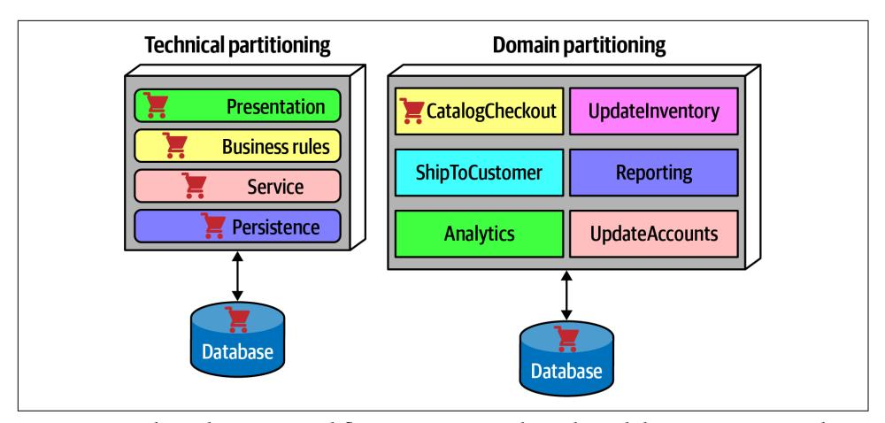

*Figure 8-5. Where domains/workflows appear in technical- and domain-partitioned architectures*

In Figure 8-5, in the technically partitioned architecture, *CatalogCheckout* appears in all the layers; the domain is smeared across the technical layers. Contrast this with domain partitioning, which uses a top-level partitioning that organizes components by domain rather than technical capabilities. In Figure 8-5, architects designing the domain-partitioned architecture build top-level components around workflows and/or domains. Each component in the domain partitioning may have subcompo‐ nents, including layers, but the top-level partitioning focuses on domains, which bet‐ ter reflects the kinds of changes that most often occur on projects.

Neither of these styles is more correct than the other—refer to the First Law of Soft‐ ware Architecture. That said, we have observed a decided industry trend over the last few years toward domain partitioning for the monolithic and distributed (for exam‐ ple, microservices) architectures. However, it is one of the first decisions an architect must make.

## Case Study: Silicon Sandwiches: Partitioning

Consider the case of one of our example katas, ["Case Study: Silicon Sandwiches" on](010-chapter-5-identifying-architectural-characteristics.md#page-88-0) [page 69.](010-chapter-5-identifying-architectural-characteristics.md#page-88-0) When deriving components, one of the fundamental decisions facing an architect is the top-level partitioning. Consider the first of two different possibilities for Silicon Sandwiches, a domain partitioning, illustrated in [Figure 8-6](#page-125-0).

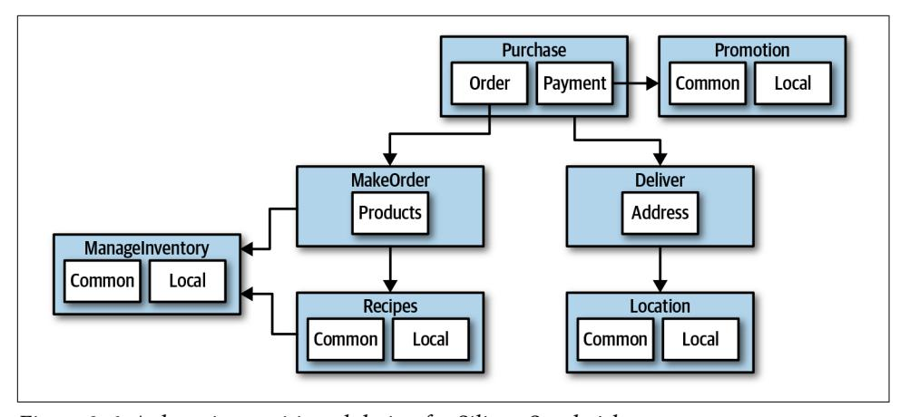

*Figure 8-6. A domain-partitioned design for Silicon Sandwiches*

In Figure 8-6, the architect has designed around domains (workflows), creating dis‐ crete components for Purchase, Promotion, MakeOrder, ManageInventory, Recipes, Delivery, and Location. Within many of these components resides a subcomponent to handle the various types of customization required, covering both common and local variations.

An alternative design isolates the common and local parts into their own partition, illustrated in Figure 8-7. Common and Local represent top-level components, with Pur chase and Delivery remaining to handle the workflow.

Which is better? It depends! Each partitioning offers different advantages and drawbacks.

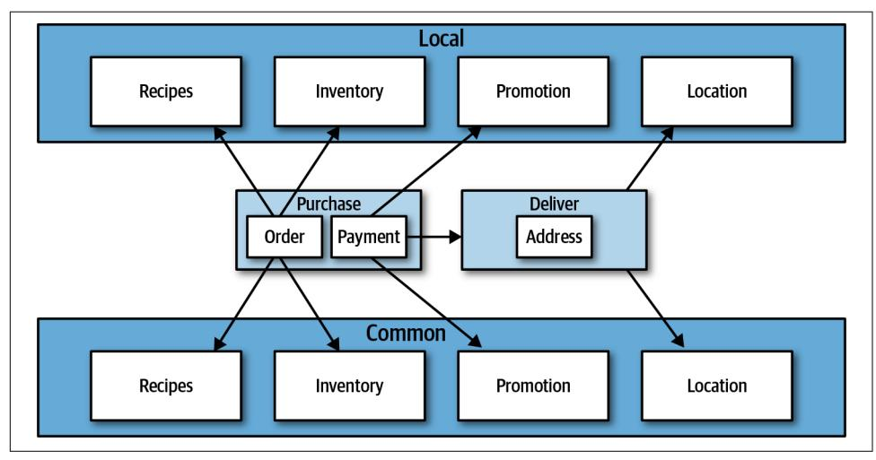

*Figure 8-7. A technically partitioned design for Silicon Sandwiches*

### Domain partitioning

Domain-partitioned architectures separate top-level components by workflows and/or domains.

#### Advantages

- Modeled more closely toward how the business functions rather than an imple‐ mentation detail
- Easier to utilize the Inverse Conway Maneuver to build cross-functional teams around domains
- Aligns more closely to the modular monolith and microservices architecture styles
- Message flow matches the problem domain
- Easy to migrate data and components to distributed architecture

#### Disadvantage

• Customization code appears in multiple places

### Technical partitioning

Technically partitioned architectures separate top-level components based on techni‐ cal capabilities rather than discrete workflows. This may manifest as layers inspired by Model-View-Controller separation or some other ad hoc technical partitioning. [Figure 8-7](#page-125-0) separates components based on customization.

#### Advantages

- Clearly separates customization code.
- Aligns more closely to the layered architecture pattern.

#### Disadvantages

- Higher degree of global coupling. Changes to either the Common or Local compo‐ nent will likely affect all the other components.
- Developers may have to duplicate domain concepts in both common and local layers.
- Typically higher coupling at the data level. In a system like this, the application and data architects would likely collaborate to create a single database, including customization and domains. That in turn creates difficulties in untangling the data relationships if the architects later want to migrate this architecture to a dis‐ tributed system.

Many other factors contribute to an architect's decision on what architecture style to base their design upon, covered in [Part II.](014-part-ii-architecture-styles.md#page-136-0)

## Developer Role

Developers typically take components, jointly designed with the architect role, and further subdivide them into classes, functions, or subcomponents. In general, class and function design is the shared responsibility of architects, tech leads, and develop‐ ers, with the lion's share going to developer roles.

Developers should never take components designed by architects as the last word; all software design benefits from iteration. Rather, that initial design should be viewed as a first draft, where implementation will reveal more details and refinements.

## Component Identification Flow

Component identification works best as an iterative process, producing candidates and refinements through feedback, illustrated in Figure 8-8.

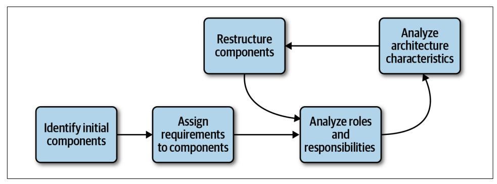

*Figure 8-8. Component identication cycle*

This cycle describes a generic architecture exposition cycle. Certain specialized domains may insert other steps in this process or change it altogether. For example, in some domains, some code must undergo security or auditing steps in this process. Descriptions of each step in Figure 8-8 appear in the following sections.

## Identifying Initial Components

Before any code exists for a software project, the architect must somehow determine what top-level components to begin with, based on what type of top-level partition‐ ing they choose. Outside that, an architect has the freedom to make up whatever components they want, then map domain functionality to them to see where behavior should reside. While this may sound arbitrary, it's hard to start with anything more concrete if an architect designs a system from scratch. The likelihood of achieving a good design from this initial set of components is disparagingly small, which is why architects must iterate on component design to improve it.

## Assign Requirements to Components

Once an architect has identified initial components, the next step aligns requirements (or user stories) to those components to see how well they fit. This may entail creat‐ ing new components, consolidating existing ones, or breaking components apart because they have too much responsibility. This mapping doesn't have to be exact the architect is attempting to find a good coarse-grained substrate to allow further design and refinement by architects, tech leads, and/or developers.

## Analyze Roles and Responsibilities

When assigning stories to components, the architect also looks at the roles and responsibilities elucidated during the requirements to make sure that the granularity matches. Thinking about both the roles and behaviors the application must support allows the architect to align the component and domain granularity. One of the great‐ est challenges for architects entails discovering the correct granularity for compo‐ nents, which encourages the iterative approach described here.

## Analyze Architecture Characteristics

When assigning requirements to components, the architect should also look at the architecture characteristics discovered earlier in order to think about how they might impact component division and granularity. For example, while two parts of a system might deal with user input, the part that deals with hundreds of concurrent users will need different architecture characteristics than another part that needs to support only a few. Thus, while a purely functional view of component design might yield a single component to handle user interaction, analyzing the architecture characteris‐ tics will lead to a subdivision.

## Restructure Components

Feedback is critical in software design. Thus, architects must continually iterate on their component design with developers. Designing software provides all kinds of unexpected difficulties—no one can anticipate all the unknown issues that usually occur during software projects. Thus, an iterative approach to component design is key. First, it's virtually impossible to account for all the different discoveries and edge cases that will arise that encourage redesign. Secondly, as the architecture and devel‐ opers delve more deeply into building the application, they gain a more nuanced understanding of where behavior and roles should lie.

## Component Granularity

Finding the proper granularity for components is one of an architect's most difficult tasks. Too fine-grained a component design leads to too much communication between components to achieve results. Too coarse-grained components encourage high internal coupling, which leads to difficulties in deployability and testability, as well as modularity-related negative side effects.

## Component Design

No accepted "correct" way exists to design components. Rather, a wide variety of techniques exist, all with various trade-offs. In all processes, an architect takes requirements and tries to determine what coarse-grained building blocks will make up the application. Lots of different techniques exist, all with varying trade-offs and coupled to the software development process used by the team and organization. Here, we talk about a few general ways to discover components and traps to avoid.

## Discovering Components

Architects, often in collaboration with other roles such as developers, business ana‐ lysts, and subject matter experts, create an initial component design based on general knowledge of the system and how they choose to decompose it, based on technical or domain partitioning. The team goal is an initial design that partitions the problem space into coarse chunks that take into account differing architecture characteristics.

## Entity trap

While there is no one true way to ascertain components, a common anti-pattern lurks: the *entity trap*. Say that an architect is working on designing components for our kata Going, Going, Gone and ends up with a design resembling Figure 8-9.

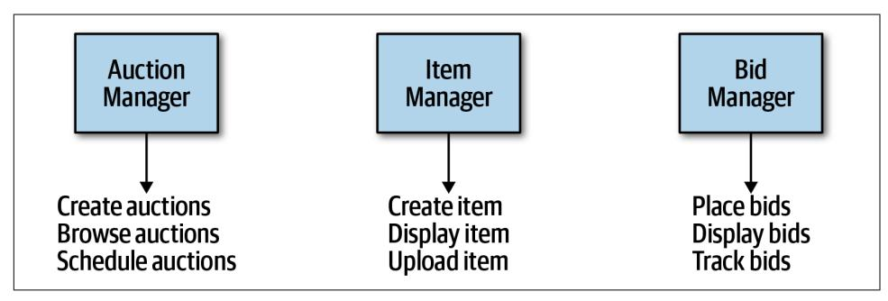

*Figure 8-9. Building an architecture as an object-relational mapping*

In [Figure 8-9](#page-129-0), the architect has basically taken each entity identified in the require‐ ments and made a Manager component based on that entity. This isn't an architecture; it's an object-relational mapping (ORM) of a framework to a database. In other words, if a system only needs simple database CRUD operations (create, read, update, delete), then the architect can download a framework to create user interfaces directly from the database. Many popular ORM frameworks exist to solve this common CRUD behavior.

## Naked Objects and Similar Frameworks

More than a decade ago, a family of frameworks appeared that makes building simple CRUD applications trivial, exemplified by Naked Objects (which has since split into two projects, a .NET version still called [NakedObjects](https://oreil.ly/RQ8XQ), and a Java version that moved to the Apache open source foundation under the name [Isis](http://isis.apache.org)). The premise behind these frameworks offers to build a user interface frontend on database entities. For example, in Naked Objects, the developer points the framework to database tables, and the framework builds a user interface based on the tables and their defined rela‐ tionships.

Several other popular frameworks exist that basically provide a default user interface based on database table structure: the scaffolding feature of the [Ruby on Rails](https://rubyonrails.org) frame‐ work provides the same kind of default mappings from website to database (with many options to extend and add sophistication to the resulting application).

If an architect's needs require merely a simple mapping from a database to a user interface, full-blown architecture isn't necessary; one of these frameworks will suffice.

The entity trap anti-pattern arises when an architect incorrectly identifies the data‐ base relationships as workflows in the application, a correspondence that rarely man‐ ifests in the real world. Rather, this anti-pattern generally indicates lack of thought about the actual workflows of the application. Components created with the entity trap also tend to be too coarse-grained, offering no guidance whatsoever to the devel‐ opment team in terms of the packaging and overall structuring of the source code.

## Actor/Actions approach

The *actor/actions* approach is a popular way that architects use to map requirements to components. In this approach, originally defined by the Rational Unified Process, architects identify actors who perform activities with the application and the actions those actors may perform. It provides a technique for discovering the typical users of the system and what kinds of things they might do with the system.

The actor/actions approach became popular in conjunction with particular software development processes, especially more formal processes that favor a significant por‐

tion of upfront design. It is still popular and works well when the requirements fea‐ ture distinct roles and the kinds of actions they can perform. This style of component decomposition works well for all types of systems, monolithic or distributed.

### Event storming

*Event storming* as a component discovery technique comes from domain-driven design (DDD) and shares popularity with microservices, also heavily influenced by DDD. In event storming, the architect assumes the project will use messages and/or events to communicate between the various components. To that end, the team tries to determine which events occur in the system based on requirements and identified roles, and build components around those event and message handlers. This works well in distributed architectures like microservices that use events and messages, because it helps architects define the messages used in the eventual system.

#### Workow approach

An alternative to event storming offers a more generic approach for architects not using DDD or messaging. The *workflow approach* models the components around workflows, much like event storming, but without the explicit constraints of building a message-based system. A workflow approach identifies the key roles, determines the kinds of workflows these roles engage in, and builds components around the identified activities.

None of these techniques is superior to the others; all offer a different set of tradeoffs. If a team uses a waterfall approach or other older software development pro‐ cesses, they might prefer the Actor/Actions approach because it is general. When using DDD and corresponding architectures like microservices, *event storming* matches the software development process exactly.

## Case Study: Going, Going, Gone: Discovering Components

If a team has no special constraints and is looking for a good general-purpose compo‐ nent decomposition, the Actor/Actions approach works well as a generic solution. It's the one we use in our case study for Going, Going, Gone.

In [Chapter 7](012-chapter-7-scope-of-architecture-characteristics.md#page-110-0), we introduced the architecture kata for Going, Going, Gone (GGG) and discovered architecture characteristics for this system. This system has three obvious roles: the *bidder*, the *auctioneer*, and a frequent participant in this modeling techni‐ que, the *system*, for internal actions. The roles interact with the application, repre‐ sented here by the system, which identifies when the application initiates an event rather than one of the roles. For example, in GGG, once the auction is complete, the system triggers the payment system to process payments.

We can also identify a starting set of actions for each of these roles:

### Bidder

View live video stream, view live bid stream, place a bid

#### Auctioneer

Enter live bids into system, receive online bids, mark item as sold

#### System

Start auction, make payment, track bidder activity

Given these actions, we can iteratively build a set of starter components for GGG; one such solution appears in Figure 8-10.

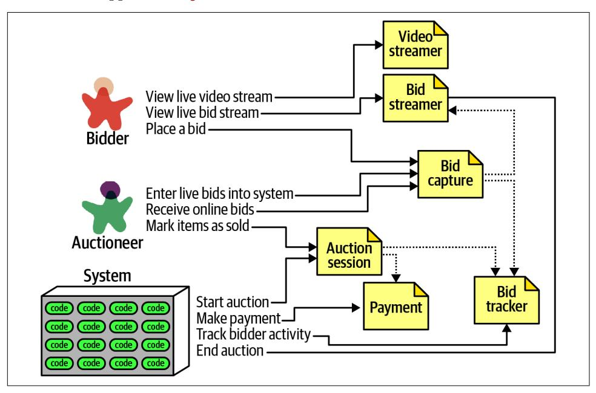

*Figure 8-10. Initial set of components for Going, Going, Gone*

In Figure 8-10, each of the roles and actions maps to a component, which in turn may need to collaborate on information. These are the components we identified for this solution:

#### VideoStreamer

Streams a live auction to users.

#### BidStreamer

Streams bids as they occur to the users. Both VideoStreamer and BidStreamer offer read-only views of the auction to the bidder.

#### BidCapture

This component captures bids from both the auctioneer and bidders.

#### BidTracker

Tracks bids and acts as the system of record.

#### AuctionSession

Starts and stops an auction. When the bidder ends the auction, performs the pay‐ ment and resolution steps, including notifying bidders of ending.

#### Payment

Third-party payment processor for credit card payments.

Referring to the component identification flow diagram in [Figure 8-8,](#page-127-0) after the initial identification of components, the architect next analyzes architecture characteristics to determine if that will change the design. For this system, the architect can defi‐ nitely identify different sets of architecture characteristics. For example, the current design features a BidCapture component to capture bids from both bidders and the auctioneer, which makes sense functionally: capturing bids from anyone can be han‐ dled the same. However, what about architecture characteristics around bid capture? The auctioneer doesn't need the same level of scalability or elasticity as potentially thousands of bidders. By the same token, an architect must ensure that architecture characteristics like reliability (connections don't drop) and availability (the system is up) for the auctioneer could be higher than other parts of the system. For example, while it's bad for business if a bidder can't log in to the site or if they suffer from a dropped connection, it's disastrous to the auction if either of those things happen to the auctioneer.

Because they have differing levels of architecture characteristics, the architect decides to split the Bid Capture component into Bid Capture and Auctioneer Capture so that each of the two components can support differing architecture characteristics. The updated design appears in [Figure 8-11](#page-134-0).

The architect creates a new component for Auctioneer Capture and updates infor‐ mation links to both Bid Streamer (so that online bidders see the live bids) and Bid Tracker, which is managing the bid streams. Note that Bid Tracker is now the com‐ ponent that will unify the two very different information streams: the single stream of information from the auctioneer and the multiple streams from bidders.

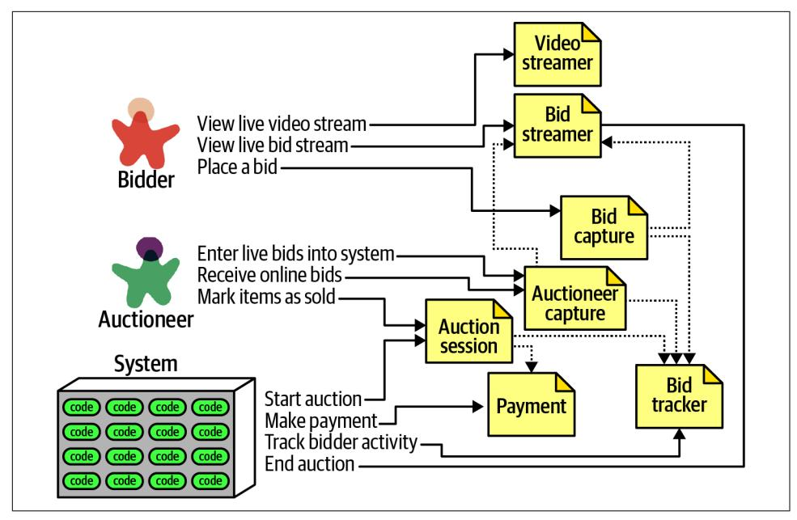

*Figure 8-11. Incorporating architecture characteristics into GGG component design*

The design shown in Figure 8-11 isn't likely the final design. More requirements must be uncovered (how do people register, administration functions around payment, and so on). However, this example provides a good starting point to start iterating further on the design.

This is one possible set of components to solve the GGG problem—but it's not neces‐ sarily correct, nor is it the only one. Few software systems have only one way that developers can implement them; every design has different sets of trade-offs. As an architect, don't obsess over finding the one true design, because many will suffice (and less likely overengineered). Rather, try to objectively assess the trade-offs between different design decisions, and choose the one that has the least worst set of trade-offs.

## Architecture Quantum Redux: Choosing Between Monolithic Versus Distributed Architectures

Recalling the discussion defining architecture quantum in ["Architectural Quanta and](012-chapter-7-scope-of-architecture-characteristics.md#page-111-0) [Granularity" on page 92,](012-chapter-7-scope-of-architecture-characteristics.md#page-111-0) the architecture quantum defines the scope of architecture characteristics. That in turn leads an architect toward an important decision as they finish their initial component design: should the architecture be monolithic or distributed?

A *monolithic* architecture typically features a single deployable unit, including all functionality of the system that runs in the process, typically connected to a single database. Types of monolithic architectures include the layered and modular mono‐ lith, discussed fully in [Chapter 10](016-chapter-10-layered-architecture-style.md#page-152-0). A *distributed* architecture is the opposite—the application consists of multiple services running in their own ecosystem, communi‐ cating via networking protocols. Distributed architectures may feature finer-grained deployment models, where each service may have its own release cadence and engi‐ neering practices, based on the development team and their priorities.

Each architecture style offers a variety of trade-offs, covered in [Part II.](014-part-ii-architecture-styles.md#page-136-0) However, the fundamental decision rests on how many quanta the architecture discovers during the design process. If the system can manage with a single quantum (in other words, one set of architecture characteristics), then a monolith architecture offers many advantages. On the other hand, differing architecture characteristics for components, as illustrated in the GGG component analysis, requires a distributed architecture to accommodate differing architecture characteristics. For example, the VideoStreamer and BidStreamer both offer read-only views of the auction to bidders. From a design standpoint, an architect would rather not deal with read-only streaming mixed with high-scale updates. Along with the aforementioned differences between bidder and auctioneer, these differing characteristics lead an architect to choose a distributed architecture.

The ability to determine a fundamental design characteristic of architecture (mono‐ lith versus distributed) early in the design process highlights one of the advantages of using the architecture quantum as a way of analyzing architecture characteristics scope and coupling.
