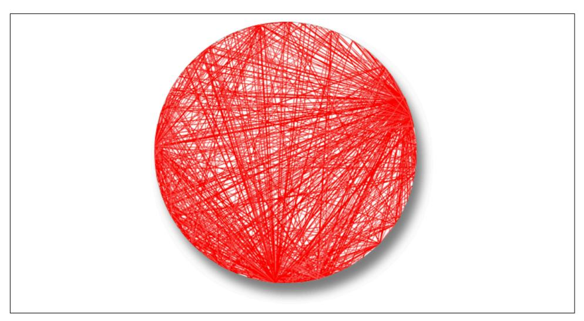
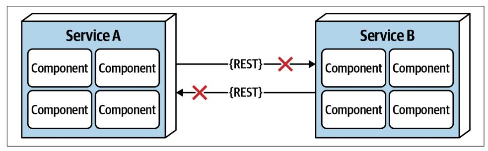
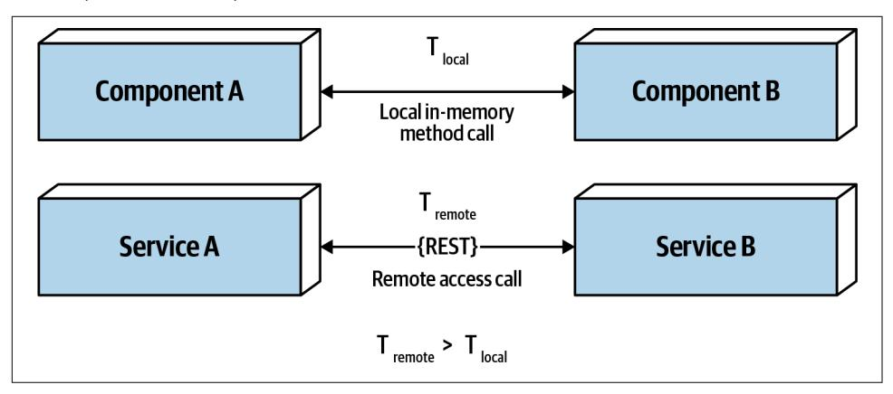
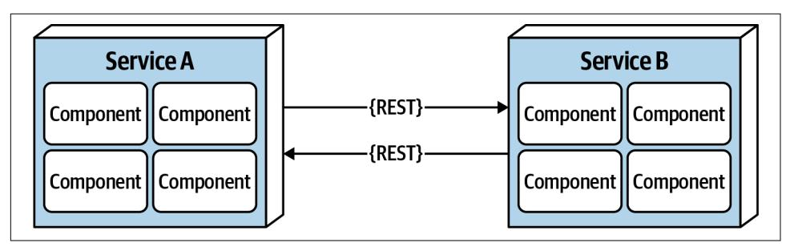
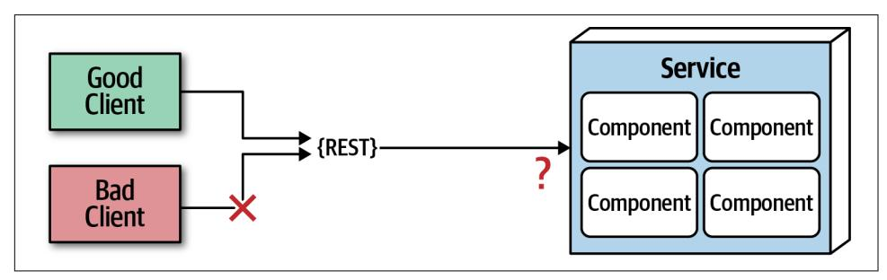
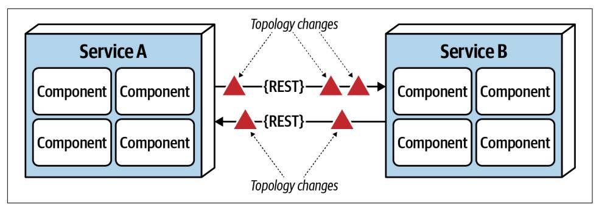
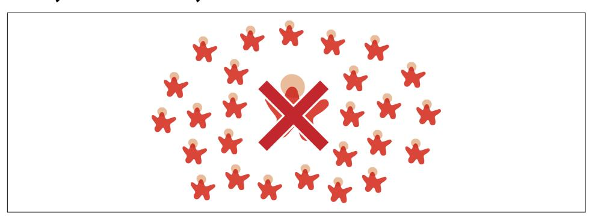
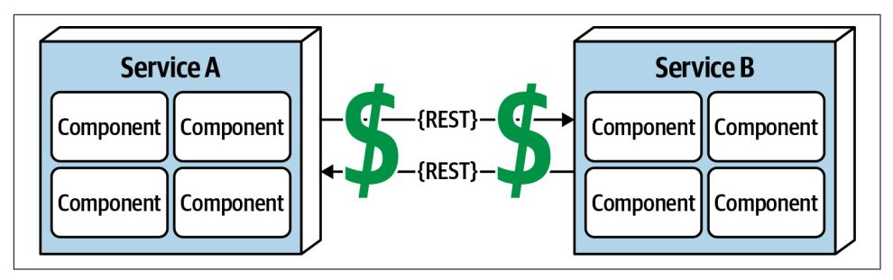
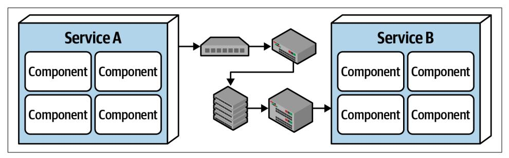

# Chapter 9: Foundations

Architecture styles, sometimes called architecture patterns, describe a named rela‐ tionship of components covering a variety of architecture characteristics. An archi‐ tecture style name, similar to design patterns, creates a single name that acts as shorthand between experienced architects. For example, when an architect talks about a layered monolith, their target in the conversation understands aspects of structure, which kinds of architecture characteristics work well (and which ones can cause problems), typical deployment models, data strategies, and a host of other information. Thus, architects should be familiar with the basic names of fundamental generic architecture styles.

Each name captures a wealth of understood detail, one of the purposes of design pat‐ terns. An architecture style describes the topology, assumed and default architecture characteristics, both beneficial and detrimental. We cover many common modern architecture patterns in the remainder of this section of the book (Part II). However, architects should be familiar with several fundamental patterns that appear embed‐ ded within the larger patterns.

## Fundamental Patterns

Several fundamental patterns appear again and again throughout the history of soft‐ ware architecture because they provide a useful perspective on organizing code, deployments, or other aspects of architecture. For example, the concept of layers in architecture, separating different concerns based on functionality, is as old as soft‐ ware itself. Yet, the layered pattern continues to manifest in different guises, including modern variants discussed in [Chapter 10.](016-chapter-10-layered-architecture-style.md#page-152-0)

## Big Ball of Mud

Architects refer to the absence of any discernible architecture structure as a *Big Ball of Mud*, named after the eponymous anti-pattern defined in a paper released in 1997 by Brian Foote and Joseph Yoder:

A *Big Ball of Mud* is a haphazardly structured, sprawling, sloppy, duct-tape-and-balingwire, spaghetti-code jungle. These systems show unmistakable signs of unregulated growth, and repeated, expedient repair. Information is shared promiscuously among distant elements of the system, often to the point where nearly all the important infor‐ mation becomes global or duplicated.

The overall structure of the system may never have been well defined.

If it was, it may have eroded beyond recognition. Programmers with a shred of archi‐ tectural sensibility shun these quagmires. Only those who are unconcerned about architecture, and, perhaps, are comfortable with the inertia of the day-to-day chore of patching the holes in these failing dikes, are content to work on such systems.

—Brian Foote and Joseph Yoder

In modern terms, a *big ball of mud* might describe a simple scripting application with event handlers wired directly to database calls, with no real internal structure. Many trivial applications start like this then become unwieldy as they continue to grow.

In general, architects want to avoid this type of architecture at all costs. The lack of structure makes change increasingly difficult. This type of architecture also suffers from problems in deployment, testability, scalability, and performance.

Unfortunately, this architecture anti-pattern occurs quite commonly in the real world. Few architects intend to create one, but many projects inadvertently manage to create a mess because of lack of governance around code quality and structure. For example, Neal worked with a client project whose structure appears in [Figure 9-1](#page-140-0).

The client (whose name is withheld for obvious reasons) created a Java-based web application as quickly as possible over several years. The technical visualization1 shows their architectural coupling: each dot on the perimeter of the circle represents a class, and each line represents connections between the classes, where bolder lines indicate stronger connections. In this code base, any change to a class makes it diffi‐ cult to predict rippling side effects to other classes, making change a terrifying affair.

1 Made with a now-retired tool called XRay, an Eclipse plug-in.

*Figure 9-1. A Big Ball of Mud architecture visualized from a real code base*

## Unitary Architecture

When software originated, there was only the computer, and software ran on it. Through the various eras of hardware and software evolution, the two started as a single entity, then split as the need for more sophisticated capabilities grew. For exam‐ ple, mainframe computers started as singular systems, then gradually separated data into its own kind of system. Similarly, when personal computers first appeared, much of the commercial development focused on single machines. As networking PCs became common, distributed systems (such as client/server) appeared.

Few unitary architectures exist outside embedded systems and other highly con‐ strained environments. Generally, software systems tend to grow in functionality over time, requiring separation of concerns to maintain operational architecture charac‐ teristics, such as performance and scale.

## Client/Server

Over time, various forces required partitioning away from a single system; how to do that forms the basis for many of these styles. Many architecture styles deal with how to efficiently separate parts of the system.

A fundamental style in architecture separates technical functionality between front‐ end and backend, called a *two-tier*, or *client/server*, architecture. Many different fla‐ vors of this architecture exist, depending on the era and computing capabilities.

### Desktop + database server

An early personal computer architecture encouraged developers to write rich desktop applications in user interfaces like Windows, separating the data into a separate data‐ base server. This architecture coincided with the appearance of standalone database servers that could connect via standard network protocols. It allowed presentation logic to reside on the desktop, while the more computationally intense action (both in volume and complexity) occurred on more robust database servers.

#### Browser + web server

Once modern web development arrived, the common split became web browser con‐ nected to web server (which in turn was connected to a database server). The separa‐ tion of responsibilities was similar to the desktop variant but with even thinner clients as browsers, allowing a wider distribution both inside and outside firewalls. Even though the database is separate from the web server, architects often still con‐ sider this a two-tier architecture because the web and database servers run on one class of machine within the operations center and the user interface runs on the user's browser.

#### Three-tier

An architecture that became quite popular during the late 1990s was a *three-tier architecture*, which provided even more layers of separation. As tools like application servers became popular in Java and .NET, companies started building even more lay‐ ers in their topology: a database tier using an industrial-strength database server, an application tier managed by an application server, frontend coded in generated HTML, and increasingly, JavaScript, as its capabilities expanded.

The three-tier architecture corresponded with network-level protocols such as [Com‐](https://www.corba.org) [mon Object Request Broker Architecture \(CORBA\)](https://www.corba.org) and [Distributed Component](https://oreil.ly/1TEqv) [Object Model \(DCOM\)](https://oreil.ly/1TEqv) that facilitated building distributed architectures.

Just as developers today don't worry about how network protocols like TCP/IP work (they just work), most architects don't have to worry about this level of plumbing in distributed architectures. The capabilities offered by such tools in that era exist today as either tools (like message queues) or architecture patterns (such as event-driven architecture, covered in [Chapter 14](020-chapter-14-event-driven-architecture-style.md#page-198-0)).

## Three-Tier, Language Design, and Long-Term Implications

During the era in which the Java language was designed, three-tier computing was all the rage. Thus, it was assumed that, in the future, all systems would be three-tier architectures. One of the common headaches with existing languages such as C++ was how cumbersome it was to move objects over the network in a consistent way between systems. Thus, the designers of Java decided to build this capability into the core of the language using a mechanism called *serialization*. Every Object in Java implements an interface that requires it to support serialization. The designers figured that since three-tiered architecture would forever be the architecture style, baking it into the language would offer a great convenience. Of course, that architectural style came and went, yet the leftovers appear in Java to this day, greatly frustrating the lan‐ guage designer who wants to add modern features that, for backward compatibility, must support serialization, which virtually no one uses today.

Understanding the long-term implications of design decisions has always eluded us, in software, as in other engineering disciplines. The perpetual advice to favor simple designs is in many ways defense against future consequences.

## Monolithic Versus Distributed Architectures

Architecture styles can be classified into two main types: *monolithic* (single deploy‐ ment unit of all code) and *distributed* (multiple deployment units connected through remote access protocols). While no classification scheme is perfect, distributed archi‐ tectures all share a common set of challenges and issues not found in the monolithic architecture styles, making this classification scheme a good separation between the various architecture styles. In this book we will describe in detail the following archi‐ tecture styles:

### Monolithic

- Layered architecture [\(Chapter 10\)](016-chapter-10-layered-architecture-style.md#page-152-0)
- Pipeline architecture [\(Chapter 11\)](017-chapter-11-pipeline-architecture-style.md#page-162-0)
- Microkernel architecture [\(Chapter 12\)](018-chapter-12-microkernel-architecture-style.md#page-168-0)

#### Distributed

- Service-based architecture ([Chapter 13](019-chapter-13-service-based-architecture-style.md#page-182-0))
- Event-driven architecture ([Chapter 14](020-chapter-14-event-driven-architecture-style.md#page-198-0))
- Space-based architecture ([Chapter 15](021-chapter-15-space-based-architecture-style.md#page-230-0))
- Service-oriented architecture [\(Chapter 16\)](022-chapter-16-orchestration-driven-service-oriented-architecture.md#page-254-0)
- Microservices architecture ([Chapter 17](023-chapter-17-microservices-architecture.md#page-264-0))

Distributed architecture styles, while being much more powerful in terms of perfor‐ mance, scalability, and availability than monolithic architecture styles, have signifi‐ cant trade-offs for this power. The first group of issues facing all distributed architectures are described in *[the fallacies of distributed computing](https://oreil.ly/fVAEY)*, first coined by L. Peter Deutsch and other colleagues from Sun Microsystems in 1994. A *fallacy* is something that is believed or assumed to be true but is not. All eight of the fallacies of distributed computing apply to distributed architectures today. The following sec‐ tions describe each fallacy.

## Fallacy #1: The Network Is Reliable

*Figure 9-2. The network is not reliable*

Developers and architects alike assume that the network is reliable, but it is not. While networks have become more reliable over time, the fact of the matter is that networks still remain generally unreliable. This is significant for all distributed archi‐ tectures because all distributed architecture styles rely on the network for communi‐ cation to and from services, as well as between services. As illustrated in Figure 9-2, Service B may be totally healthy, but Service A cannot reach it due to a network problem; or even worse, Service A made a request to Service B to process some data and does not receive a response because of a network issue. This is why things like timeouts and circuit breakers exist between services. The more a system relies on the network (such as microservices architecture), the potentially less reliable it becomes.

## Fallacy #2: Latency Is Zero

*Figure 9-3. Latency is not zero*

As Figure 9-3 shows, when a local call is made to another component via a method or function call, that time (t\_local) is measured in nanoseconds or microseconds. However, when that same call is made through a remote access protocol (such as REST, messaging, or RPC), the time measured to access that service (t\_remote) is measured in milliseconds. Therefore, t\_remote will always be greater that t\_local. Latency in any distributed architecture is not zero, yet most architects ignore this fal‐ lacy, insisting that they have fast networks. Ask yourself this question: do you know what the average round-trip latency is for a RESTful call in your production environ‐ ment? Is it 60 milliseconds? Is it 500 milliseconds?

When using any distributed architecture, architects must know this latency average. It is the only way of determining whether a distributed architecture is feasible, particu‐ larly when considering microservices (see [Chapter 17](023-chapter-17-microservices-architecture.md#page-264-0)) due to the fine-grained nature of the services and the amount of communication between those services. Assuming an average of 100 milliseconds of latency per request, chaining together 10 service calls to perform a particular business function adds 1,000 milliseconds to the request! Knowing the average latency is important, but even more important is also knowing the 95th to 99th percentile. While an average latency might yield only 60 milliseconds (which is good), the 95th percentile might be 400 milliseconds! It's usually this "long tail" latency that will kill performance in a distributed architecture. In most cases, architects can get latency values from a network administrator (see ["Fallacy #6: There](#page-148-0) [Is Only One Administrator" on page 129\)](#page-148-0).

## Fallacy #3: Bandwidth Is Infinite

*Figure 9-4. Bandwidth is not innite*

Bandwidth is usually not a concern in monolithic architectures, because once pro‐ cessing goes into a monolith, little or no bandwidth is required to process that busi‐ ness request. However, as shown in Figure 9-4, once systems are broken apart into smaller deployment units (services) in a distributed architecture such as microservi‐ ces, communication to and between these services significantly utilizes bandwidth, causing networks to slow down, thus impacting latency (fallacy #2) and reliability (fallacy #1).

To illustrate the importance of this fallacy, consider the two services shown in Figure 9-4. Let's say the lefthand service manages the wish list items for the website, and the righthand service manages the customer profile. Whenever a request for a wish list comes into the lefthand service, it must make an interservice call to the righthand customer profile service to get the customer name because that data is needed in the response contract for the wish list, but the wish list service on the left‐ hand side doesn't have the name. The customer profile service returns 45 attributes totaling 500 kb to the wish list service, which only needs the name (200 bytes). This is a form of coupling referred to as *stamp coupling*. This may not sound significant, but requests for the wish list items happen about 2,000 times a second. This means that this interservice call from the wish list service to the customer profile service happens 2,000 times a second. At 500 kb for each request, the amount of bandwidth used for that *one* interservice call (out of hundreds being made that second) is 1 Gb!

Stamp coupling in distributed architectures consumes significant amounts of band‐ width. If the customer profile service were to only pass back the data needed by the wish list service (in this case 200 bytes), the total bandwidth used to transmit the data is only 400 kb. Stamp coupling can be resolved in the following ways:

- • Create private RESTful API endpoints
- Use field selectors in the contract
- Use [GraphQL](https://graphql.org) to decouple contracts
- Use value-driven contracts with consumer-driven contracts (CDCs)
- Use internal messaging endpoints

Regardless of the technique used, ensuring that the minimal amount of data is passed between services or systems in a distributed architecture is the best way to address this fallacy.

## Fallacy #4: The Network Is Secure

*Figure 9-5. The network is not secure*

Most architects and developers get so comfortable using virtual private networks (VPNs), trusted networks, and firewalls that they tend to forget about this fallacy of distributed computing: *the network is not secure*. Security becomes much more chal‐ lenging in a distributed architecture. As shown in Figure 9-5, each and every end‐ point to each distributed deployment unit must be secured so that unknown or bad requests do not make it to that service. The surface area for threats and attacks increases by magnitudes when moving from a monolithic to a distributed architec‐ ture. Having to secure every endpoint, even when doing interservice communication, is another reason performance tends to be slower in synchronous, highly-distributed architectures such as microservices or service-based architecture.

## Fallacy #5: The Topology Never Changes

*Figure 9-6. The network topology always changes*

This fallacy refers to the overall network topology, including all of the routers, hubs, switches, firewalls, networks, and appliances used within the overall network. Archi‐ tects assume that the topology is fixed and never changes. *Of course it changes*. It changes all the time. What is the significance of this fallacy?

Suppose an architect comes into work on a Monday morning, and everyone is run‐ ning around like crazy because services keep timing out in production. The architect works with the teams, frantically trying to figure out why this is happening. No new services were deployed over the weekend. What could it be? After several hours the architect discovers that a minor network upgrade happened at 2 a.m. that morning. This supposedly "minor" network upgrade invalidated all of the latency assumptions, triggering timeouts and circuit breakers.

Architects must be in constant communication with operations and network admin‐ istrators to know what is changing and when so that they can make adjustments accordingly to reduce the type of surprise previously described. This may seem obvi‐ ous and easy, but it is not. As a matter of fact, this fallacy leads directly to the next fallacy.

## Fallacy #6: There Is Only One Administrator

*Figure 9-7. There are many network administrators, not just one*

Architects all the time fall into this fallacy, assuming they only need to collaborate and communicate with one administrator. As shown in Figure 9-7, there are dozens of network administrators in a typical large company. Who should the architect talk to with regard to latency [\("Fallacy #2: Latency Is Zero" on page 125](#page-144-0)) or topology changes (["Fallacy #5: The Topology Never Changes" on page 128\)](#page-147-0)? This fallacy points to the complexity of distributed architecture and the amount of coordination that must happen to get everything working correctly. Monolithic applications do not require this level of communication and collaboration due to the single deployment unit characteristics of those architecture styles.

## Fallacy #7: Transport Cost Is Zero

*Figure 9-8. Remote access costs money*

Many software architects confuse this fallacy for latency (["Fallacy #2: Latency Is Zero"](#page-144-0) [on page 125\)](#page-144-0). Transport cost here does not refer to latency, but rather to actual *cost* in terms of money associated with making a "simple RESTful call." Architects assume (incorrectly) that the necessary infrastructure is in place and sufficient for making a simple RESTful call or breaking apart a monolithic application. *It is usually not*. Dis‐ tributed architectures cost significantly more than monolithic architectures, primar‐ ily due to increased needs for additional hardware, servers, gateways, firewalls, new subnets, proxies, and so on.

Whenever embarking on a distributed architecture, we encourage architects to ana‐ lyze the current server and network topology with regard to capacity, bandwidth, latency, and security zones to not get caught up in the trap of surprise with this fallacy.

## Fallacy #8: The Network Is Homogeneous

*Figure 9-9. The network is not homogeneous*

Most architects and developers assume a network is homogeneous—made up by only one network hardware vendor. Nothing could be farther from the truth. Most compa‐ nies have multiple network hardware vendors in their infrastructure, if not more.

So what? The significance of this fallacy is that not all of those heterogeneous hard‐ ware vendors play together well. Most of it works, but does Juniper hardware seamlessly integrate with Cisco hardware? Networking standards have evolved over the years, making this less of an issue, but the fact remains that not all situations, load, and circumstances have been fully tested, and as such, network packets occa‐ sionally get lost. This in turn impacts network reliability [\("Fallacy #1: The Network Is](#page-143-0) [Reliable" on page 124](#page-143-0)), latency assumptions and assertions (["Fallacy #2: Latency Is](#page-144-0) [Zero" on page 125\)](#page-144-0), and assumptions made about the bandwidth (["Fallacy #3: Band‐](#page-145-0) [width Is Infinite" on page 126](#page-145-0)). In other words, this fallacy ties back into all of the other fallacies, forming an endless loop of confusion and frustration when dealing with networks (which is necessary when using distributed architectures).

## Other Distributed Considerations

In addition to the eight fallacies of distributed computing previously described, there are other issues and challenges facing distributed architecture that aren't present in monolithic architectures. Although the details of these other issues are out of scope for this book, we list and summarize them in the following sections.

## Distributed logging

Performing root-cause analysis to determine why a particular order was dropped is very difficult and time-consuming in a distributed architecture due to the distribu‐ tion of application and system logs. In a monolithic application there is typically only one log, making it easier to trace a request and determine the issue. However, dis‐ tributed architectures contain dozens to hundreds of different logs, all located in a different place and all with a different format, making it difficult to track down a problem.

Logging consolidation tools such as [Splunk](https://www.splunk.com) help to consolidate information from var‐ ious sources and systems together into one consolidated log and console, but these tools only scratch the surface of the complexities involved with distributed logging. Detailed solutions and patterns for distributed logging are outside the scope of this book.

### Distributed transactions

Architects and developers take transactions for granted in a monolithic architecture world because they are so straightforward and easy to manage. Standard commits and rollbacks executed from persistence frameworks leverage ACID (atomicity, consis‐ tency, isolation, durability) transactions to guarantee that the data is updated in a cor‐ rect way to ensure high data consistency and integrity. Such is not the case with distributed architectures.

Distributed architectures rely on what is called *eventual consistency* to ensure the data processed by separate deployment units is at some unspecified point in time all synchronized into a consistent state. This is one of the trade-offs of distributed architecture: high scalability, performance, and availability at the sacrifice of data consistency and data integrity.

*[Transactional sagas](https://oreil.ly/1lLmj)* are one way to manage distributed transactions. Sagas utilize either event sourcing for compensation or finite state machines to manage the state of transaction. In addition to sagas, *BASE* transactions are used. BASE stands for (B)asic availability, (S)oft state, and (E)ventual consistency. BASE transactions are not a piece of software, but rather a technique. *So state* in BASE refers to the transit of data from a source to a target, as well as the inconsistency between data sources. Based on the *basic availability* of the systems or services involved, the systems will *eventually* become consistent through the use of architecture patterns and messaging.

## Contract maintenance and versioning

Another particularly difficult challenge within distributed architecture is contract creation, maintenance, and versioning. A contract is behavior and data that is agreed upon by both the client and the service. Contract maintenance is particularly difficult in distributed architectures, primarily due to decoupled services and systems owned by different teams and departments. Even more complex are the communication models needed for version deprecation.
