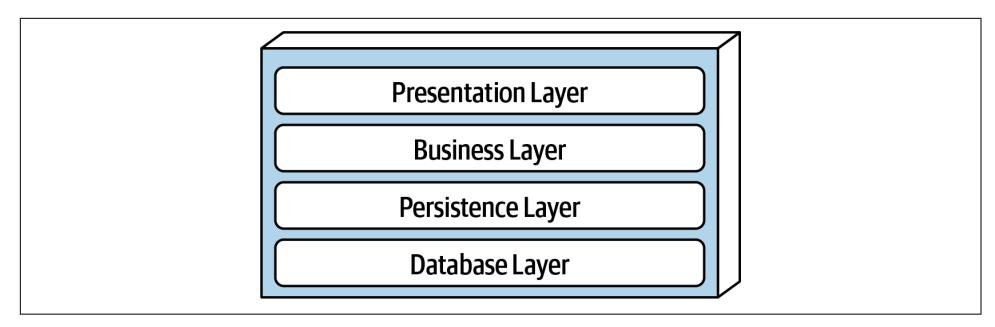
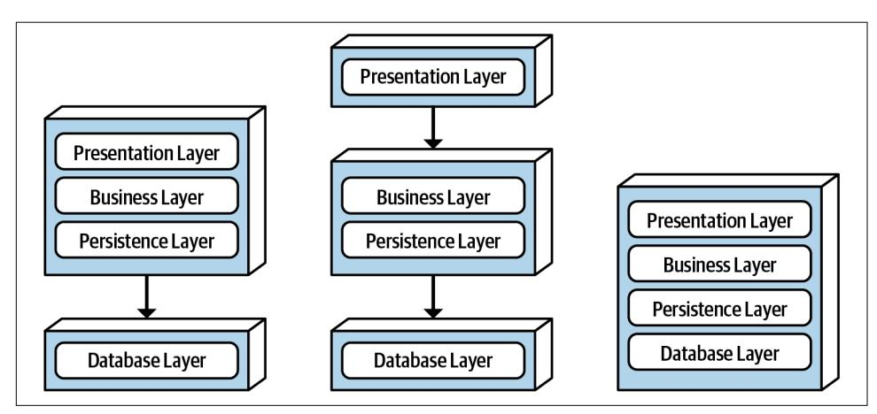
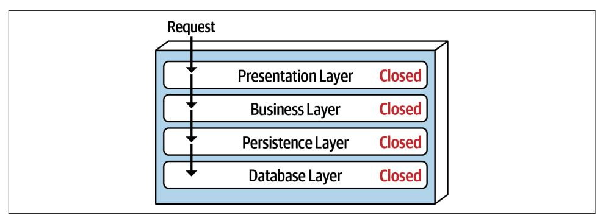
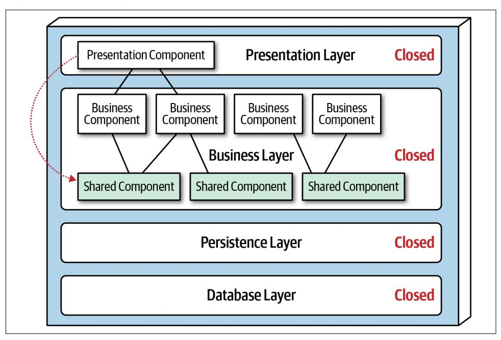
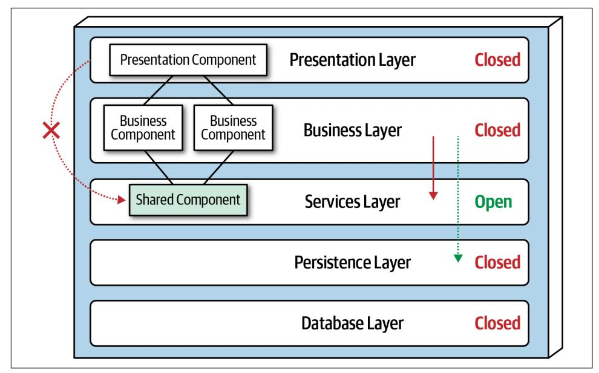

# Chapter 10: Layered Architecture Style

The *layered* architecture, also known as the *n-tiered* architecture style, is one of the most common architecture styles. This style of architecture is the de facto standard for most applications, primarily because of its simplicity, familiarity, and low cost. It is also a very natural way to develop applications due to [Conway's law,](https://oreil.ly/Rb4uN) which states that organizations that design systems are constrained to produce designs which are copies of the communication structures of these organizations. In most organizations there are user interface (UI) developers, backend developers, rules developers, and database experts (DBAs). These organizational layers fit nicely into the tiers of a tra‐ ditional layered architecture, making it a natural choice for many business applica‐ tions. The layered architecture style also falls into several architectural anti-patterns, including the *architecture by implication* anti-pattern and the *accidental architecture* anti-pattern. If a developer or architect is unsure which architecture style they are using, or if an Agile development team "just starts coding," chances are good that it is the layered architecture style they are implementing.

## Topology

Components within the layered architecture style are organized into logical horizon‐ tal layers, with each layer performing a specific role within the application (such as presentation logic or business logic). Although there are no specific restrictions in terms of the number and types of layers that must exist, most layered architectures consist of four standard layers: presentation, business, persistence, and database, as illustrated in [Figure 10-1](#page-153-0). In some cases, the business layer and persistence layer are combined into a single business layer, particularly when the persistence logic (such as SQL or HSQL) is embedded within the business layer components. Thus, smaller applications may have only three layers, whereas larger and more complex business applications may contain five or more layers.

*Figure 10-1. Standard logical layers within the layered architecture style*

Figure 10-2 illustrates the various topology variants from a physical layering (deploy‐ ment) perspective. The first variant combines the presentation, business, and persis‐ tence layers into a single deployment unit, with the database layer typically represented as a separate external physical database (or filesystem). The second var‐ iant physically separates the presentation layer into its own deployment unit, with the business and persistence layers combined into a second deployment unit. Again, with this variant, the database layer is usually physically separated through an external database or filesystem. A third variant combines all four standard layers into a single deployment, including the database layer. This variant might be useful for smaller applications with either an internally embedded database or an in-memory database. Many on-premises ("on-prem") products are built and delivered to customers using this third variant.

*Figure 10-2. Physical topology (deployment) variants*

Each layer of the layered architecture style has a specific role and responsibility within the architecture. For example, the presentation layer would be responsible for handling all user interface and browser communication logic, whereas the business layer would be responsible for executing specific business rules associated with the

request. Each layer in the architecture forms an abstraction around the work that needs to be done to satisfy a particular business request. For example, the presenta‐ tion layer doesn't need to know or worry about how to get customer data; it only needs to display that information on a screen in a particular format. Similarly, the business layer doesn't need to be concerned about how to format customer data for display on a screen or even where the customer data is coming from; it only needs to get the data from the persistence layer, perform business logic against the data (such as calculating values or aggregating data), and pass that information up to the presen‐ tation layer.

This *separation of concerns* concept within the layered architecture style makes it easy to build effective roles and responsibility models within the architecture. Compo‐ nents within a specific layer are limited in scope, dealing only with the logic that per‐ tains to that layer. For example, components in the presentation layer only handle presentation logic, whereas components residing in the business layer only handle business logic. This allows developers to leverage their particular technical expertise to focus on the technical aspects of the domain (such as presentation logic or persis‐ tence logic). The trade-off of this benefit, however, is a lack of overall agility (the abil‐ ity to respond quickly to change).

The layered architecture is a *technically partitioned* architecture (as opposed to a *domain-partitioned* architecture). Groups of components, rather than being grouped by domain (such as customer), are grouped by their technical role in the architecture (such as presentation or business). As a result, any particular business domain is spread throughout all of the layers of the architecture. For example, the domain of "customer" is contained in the presentation layer, business layer, rules layer, services layer, and database layer, making it difficult to apply changes to that domain. As a result, a domain-driven design approach does not work as well with the layered architecture style.

## Layers of Isolation

Each layer in the layered architecture style can be either *closed* or *open*. A closed layer means that as a request moves top-down from layer to layer, the request cannot skip any layers, but rather must go through the layer immediately below it to get to the next layer (see [Figure 10-3](#page-155-0)). For example, in a closed-layered architecture, a request originating from the presentation layer must first go through the business layer and then to the persistence layer before finally making it to the database layer.

*Figure 10-3. Closed layers within the layered architecture*

Notice that in Figure 10-3 it would be much faster and easier for the presentation layer to access the database directly for simple retrieval requests, bypassing any unnecessary layers (what used to be known in the early 2000s as the *fast-lane reader pattern*). For this to happen, the business and persistence layers would have to be *open*, allowing requests to bypass other layers. Which is better—open layers or closed layers? The answer to this question lies in a key concept known as *layers of isolation*.

The *layers of isolation* concept means that changes made in one layer of the architec‐ ture generally don't impact or affect components in other layers, providing the con‐ tracts between those layers remain unchanged. Each layer is independent of the other layers, thereby having little or no knowledge of the inner workings of other layers in the architecture. However, to support layers of isolation, layers involved with the major flow of the request necessarily have to be closed. If the presentation layer can directly access the persistence layer, then changes made to the persistence layer would impact both the business layer *and* the presentation layer, producing a very tightly coupled application with layer interdependencies between components. This type of architecture then becomes very brittle, as well as difficult and expensive to change.

The layers of isolation concept also allows any layer in the architecture to be replaced without impacting any other layer (again, assuming well-defined contracts and the use of the [business delegate pattern\)](https://oreil.ly/WeKWs). For example, you can leverage the layers of iso‐ lation concept within the layered architecture style to replace your older JavaServer Faces (JSF) presentation layer with React.js without impacting any other layer in the application.

## Adding Layers

While closed layers facilitate layers of isolation and therefore help isolate change within the architecture, there are times when it makes sense for certain layers to be open. For example, suppose there are shared objects within the business layer that contain common functionality for business components (such as date and string util‐ ity classes, auditing classes, logging classes, and so on). Suppose there is an architec‐ ture decision stating that the presentation layer is restricted from using these shared business objects. This constraint is illustrated in Figure 10-4, with the dotted line going from a presentation component to a shared business object in the business layer. This scenario is difficult to govern and control because *architecturally* the pre‐ sentation layer has access to the business layer, and hence has access to the shared objects within that layer.

*Figure 10-4. Shared objects within the business layer*

One way to architecturally mandate this restriction is to add to the architecture a new services layer containing all of the shared business objects. Adding this new layer now architecturally restricts the presentation layer from accessing the shared business objects because the business layer is closed (see [Figure 10-5](#page-157-0)). However, the new serv‐ ices layer must be marked as *open*; otherwise the business layer would be forced to go through the services layer to access the persistence layer. Marking the services layer as open allows the business layer to either access that layer (as indicated by the solid arrow), or bypass the layer and go to the next one down (as indicated by the dotted arrow in [Figure 10-5\)](#page-157-0).

*Figure 10-5. Adding a new services layer to the architecture*

Leveraging the concept of open and closed layers helps define the relationship between architecture layers and request flows. It also provides developers with the necessary information and guidance to understand various layer access restrictions within the architecture. Failure to document or properly communicate which layers in the architecture are open and closed (and why) usually results in tightly coupled and brittle architectures that are very difficult to test, maintain, and deploy.

## Other Considerations

The layered architecture makes for a good starting point for most applications when it is not known yet exactly which architecture style will ultimately be used. This is a common practice for many microservices efforts when architects are still determin‐ ing whether microservices is the right architecture choice, but development must begin. However, when using this technique, be sure to keep reuse at a minimum and keep object hierarchies (depth of inheritance tree) fairly shallow so as to maintain a good level of modularity. This will help facilitate the move to another architecture style later on.

One thing to watch out for with the layered architecture is the *architecture sinkhole* anti-pattern. This anti-pattern occurs when requests move from layer to layer as sim‐ ple pass-through processing with no business logic performed within each layer. For example, suppose the presentation layer responds to a simple request from the user to retrieve basic customer data (such as name and address). The presentation layer

passes the request to the business layer, which does nothing but pass the request on to the rules layer, which in turn does nothing but pass the request on to the persistence layer, which then makes a simple SQL call to the database layer to retrieve the cus‐ tomer data. The data is then passed all the way back up the stack with no additional processing or logic to aggregate, calculate, apply rules, or transform the data. This results in unnecessary object instantiation and processing, impacting both memory consumption and performance.

Every layered architecture will have at least some scenarios that fall into the architec‐ ture sinkhole anti-pattern. The key to determining whether the architecture sinkhole anti-pattern is at play is to analyze the percentage of requests that fall into this cate‐ gory. The 80-20 rule is usually a good practice to follow. For example, it is acceptable if only 20 percent of the requests are sinkholes. However, if 80 percent of the requests are sinkholes, it a good indicator that the layered architecture is not the correct archi‐ tecture style for the problem domain. Another approach to solving the architecture sinkhole anti-pattern is to make all the layers in the architecture open, realizing, of course, that the trade-off is increased difficulty in managing change within the architecture.

## Why Use This Architecture Style

The layered architecture style is a good choice for small, simple applications or web‐ sites. It is also a good architecture choice, particularly as a starting point, for situa‐ tions with very tight budget and time constraints. Because of the simplicity and familiarity among developers and architects, the layered architecture is perhaps one of the lowest-cost architecture styles, promoting ease of development for smaller applications. The layered architecture style is also a good choice when an architect is still analyzing business needs and requirements and is unsure which architecture style would be best.

As applications using the layered architecture style grow, characteristics like main‐ tainability, agility, testability, and deployability are adversely affected. For this reason, large applications and systems using the layered architecture might be better suited for other, more modular architecture styles.

## Architecture Characteristics Ratings

A one-star rating in the characteristics ratings table (shown in [Figure 10-6\)](#page-159-0) means the specific architecture characteristic isn't well supported in the architecture, whereas a five-star rating means the architecture characteristic is one of the strongest features in the architecture style. The definition for each characteristic identified in the score‐ card can be found in [Chapter 4](009-chapter-4-architecture-characteristics-defined.md#page-74-0).

| Architecture characteristic | Star rating Star rating |
|-----------------------------|-------------------------|
| Partitioning type           | Technical               |
| Number of quanta            | 1                       |
| Deployability               | $\Rightarrow$           |
| Elasticity                  | $\Rightarrow$           |
| Evolutionary                | $\Rightarrow$           |
| Fault tolerance             | <b>☆</b>                |
| Modularity                  | $\Rightarrow$           |
| Overall cost                | ****                    |
| Performance                 | <b>☆☆</b>               |
| Reliability                 | <b>☆☆☆</b>              |
| Scalability                 | <b>☆</b>                |
| Simplicity                  | <b>☆☆☆☆</b>             |
| Testability                 | ☆☆                      |

*Figure 10-6. Layered architecture characteristics ratings*

Overall cost and simplicity are the primary strengths of the layered architecture style. Being monolithic in nature, layered architectures don't have the complexities associ‐ ated with distributed architecture styles, are simple and easy to understand, and are relatively low cost to build and maintain. However, as a cautionary note, these ratings start to quickly diminish as monolithic layered architectures get bigger and conse‐ quently more complex.

Both deployability and testability rate very low for this architecture style. Deployabil‐ ity rates low due to the ceremony of deployment (effort to deploy), high risk, and lack of frequent deployments. A simple three-line change to a class file in the layered architecture style requires the entire deployment unit to be redeployed, taking in potential database changes, configuration changes, or other coding changes sneaking in alongside the original change. Furthermore, this simple three-line change is usu‐ ally bundled with dozens of other changes, thereby increasing deployment risk even further (as well as increasing the frequency of deployment). The low testability rating also reflects this scenario; with a simple three-line change, most developers are not going to spend hours executing the entire regression test suite (even if such a thing were to exist in the first place), particularly along with dozens of other changes being made to the monolithic application at the same time. We gave testability a two-star rating (rather than one star) due to the ability to mock or stub components (or even an entire layer), which eases the overall testing effort.

Overall reliability rates medium (three stars) in this architecture style, mostly due to the lack of network traffic, bandwidth, and latency found in most distributed archi‐ tectures. We only gave the layered architecture three stars for reliability because of the nature of the monolithic deployment, combined with the low ratings for testability (completeness of testing) and deployment risk.

Elasticity and scalability rate very low (one star) for the layered architecture, primar‐ ily due to monolithic deployments and the lack of architectural modularity. Although it is possible to make certain functions within a monolith scale more than others, this effort usually requires very complex design techniques such as multithreading, inter‐ nal messaging, and other parallel processing practices, techniques this architecture isn't well suited for. However, because the layered architecture is always a single sys‐ tem quantum due to the monolithic user interface, backend processing, and mono‐ lithic database, applications can only scale to a certain point based on the single quantum.

Performance is always an interesting characteristic to rate for the layered architecture. We gave it only two stars because the architecture style simply does not lend itself to high-performance systems due to the lack of parallel processing, closed layering, and the sinkhole architecture anti-pattern. Like scalability, performance can be addressed through caching, multithreading, and the like, but it is not a natural characteristic of this architecture style; architects and developers have to work hard to make all this happen.

Layered architectures don't support fault tolerance due to monolithic deployments and the lack of architectural modularity. If one small part of a layered architecture causes an out-of-memory condition to occur, the entire application unit is impacted and crashes. Furthermore, overall availability is impacted due to the high mean-timeto-recovery (MTTR) usually experienced by most monolithic applications, with startup times ranging anywhere from 2 minutes for smaller applications, up to 15 minutes or more for most large applications.
