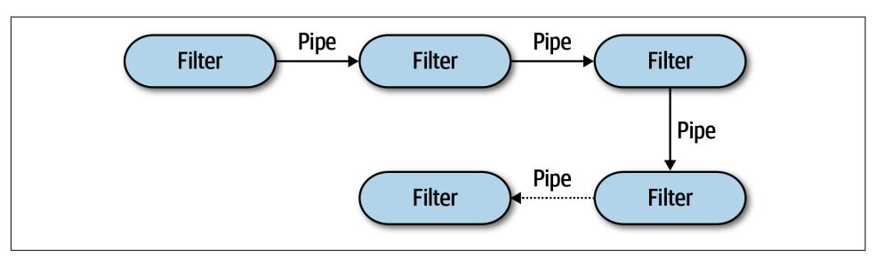
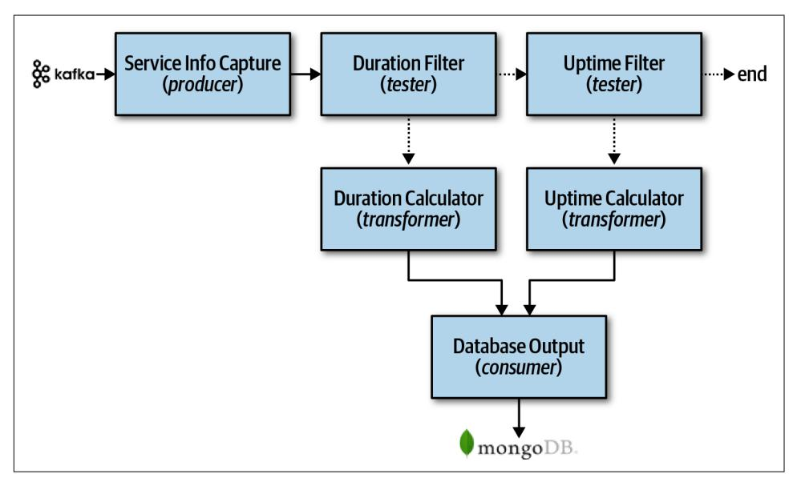

<span id="page-162-0"></span>
# Chapter 11: Pipeline Architecture Style

One of the fundamental styles in software architecture that appears again and again is the *pipeline* architecture (also known as the *pipes and lters* architecture). As soon as developers and architects decided to split functionality into discrete parts, this pat‐ tern followed. Most developers know this architecture as this underlying principle behind Unix terminal shell languages, such as [Bash](https://oreil.ly/uP2Bo) and [Zsh.](https://oreil.ly/40UyF)

Developers in many functional programming languages will see parallels between language constructs and elements of this architecture. In fact, many tools that utilize the [MapReduce](https://oreil.ly/veX6W) programming model follow this basic topology. While these exam‐ ples show a low-level implementation of the pipeline architecture style, it can also be used for higher-level business applications.

## Topology

The topology of the pipeline architecture consists of pipes and filters, illustrated in Figure 11-1.



*Figure 11-1. Basic topology for pipeline architecture*

<span id="page-163-0"></span>The pipes and filters coordinate in a specific fashion, with pipes forming one-way communication between filters, usually in a point-to-point fashion.

## Pipes

*Pipes* in this architecture form the communication channel between filters. Each pipe is typically unidirectional and point-to-point (rather than broadcast) for performance reasons, accepting input from one source and always directing output to another. The payload carried on the pipes may be any data format, but architects favor smaller amounts of data to enable high performance.

## Filters

*Filters* are self-contained, independent from other filters, and generally stateless. Fil‐ ters should perform one task only. Composite tasks should be handled by a sequence of filters rather than a single one.

Four types of filters exist within this architecture style:

### Producer

The starting point of a process, outbound only, sometimes called the *source*.

#### Transformer

Accepts input, optionally performs a transformation on some or all of the data, then forwards it to the outbound pipe. Functional advocates will recognize this feature as *map*.

#### Tester

Accepts input, tests one or more criteria, then optionally produces output, based on the test. Functional programmers will recognize this as similar to *reduce*.

## Consumer

The termination point for the pipeline flow. Consumers sometimes persist the final result of the pipeline process to a database, or they may display the final results on a user interface screen.

The unidirectional nature and simplicity of each of the pipes and filters encourages compositional reuse. Many developers have discovered this ability using shells. A famous story from the blog ["More Shell, Less Egg"](https://oreil.ly/ljeb5) illustrates just how powerful these abstractions are. Donald Knuth was asked to write a program to solve this text han‐ dling problem: read a file of text, determine the *n* most frequently used words, and print out a sorted list of those words along with their frequencies. He wrote a pro‐ gram consisting of more than 10 pages of Pascal, designing (and documenting) a new algorithm along the way. Then, Doug McIlroy demonstrated a shell script that would easily fit within a Twitter post that solved the problem more simply, elegantly, and understandably (if you understand shell commands):

```
 tr -cs A-Za-z '\n' |
 tr A-Z a-z |
 sort |
 uniq -c |
 sort -rn |
 sed ${1}q
```

Even the designers of Unix shells are often surprised at the inventive uses developers have wrought with their simple but powerfully composite abstractions.

## Example

The pipeline architecture pattern appears in a variety of applications, especially tasks that facilitate simple, one-way processing. For example, many Electronic Data Inter‐ change (EDI) tools use this pattern, building transformations from one document type to another using pipes and filters. ETL tools (extract, transform, and load) lever‐ age the pipeline architecture as well for the flow and modification of data from one database or data source to another. Orchestrators and mediators such as [Apache](https://camel.apache.org) [Camel](https://camel.apache.org) utilize the pipeline architecture to pass information from one step in a busi‐ ness process to another.

To illustrate how the pipeline architecture can be used, consider the following exam‐ ple, as illustrated in Figure 11-2, where various service telemetry information is sent from services via streaming to [Apache Kafka](https://kafka.apache.org).



*Figure 11-2. Pipeline architecture example*

<span id="page-165-0"></span>Notice in Figure 11-2 the use of the pipeline architecture style to process the different kinds of data streamed to Kafka. The Service Info Capture filter (producer filter) subscribes to the Kafka topic and receives service information. It then sends this cap‐ tured data to a tester filter called Duration Filter to determine whether the data captured from Kafka is related to the duration (in milliseconds) of the service request. Notice the separation of concerns between the filters; the Service Metrics Capture filter is only concerned about how to connect to a Kafka topic and receive streaming data, whereas the Duration Filter is only concerned about qualifying the data and optionally routing it to the next pipe. If the data is related to the duration (in milli‐ seconds) of the service request, then the Duration Filter passes the data on to the Duration Calculator transformer filter. Otherwise, it passes it on to the Uptime Filter tester filter to check if the data is related to uptime metrics. If it is not, then the pipeline ends—the data is of no interest to this particular processing flow. Other‐ wise, if it is uptime metrics, it then passes the data along to the Uptime Calculator to calculate the uptime metrics for the service. These transformers then pass the modi‐ fied data to the Database Output consumer, which then persists the data in a [Mon‐](https://www.mongodb.com) [goDB](https://www.mongodb.com) database.

This example shows the extensibility properties of the pipeline architecture. For example, in Figure 11-2, a new tester filter could easily be added after the Uptime Filter to pass the data on to another newly gathered metric, such as the database connection wait time.

## Architecture Characteristics Ratings

A one-star rating in the characteristics ratings table [Figure 11-3](#page-166-0) means the specific architecture characteristic isn't well supported in the architecture, whereas a five-star rating means the architecture characteristic is one of the strongest features in the architecture style. The definition for each characteristic identified in the scorecard can be found in [Chapter 4](009-chapter-4-architecture-characteristics-defined.md#page-74-0).

The pipeline architecture style is a technically partitioned architecture due to the par‐ titioning of application logic into filter types (producer, tester, transformer, and con‐ sumer). Also, because the pipeline architecture is usually implemented as a monolithic deployment, the architectural quantum is always one.

<span id="page-166-0"></span>

| Architecture characteristic | Star rating Star rating               |
|-----------------------------|---------------------------------------|
| Partitioning type           | Technical                             |
| Number of quanta            | 1                                     |
| Deployability               | $\Rightarrow \Rightarrow$             |
| Elasticity                  | $\Rightarrow$                         |
| Evolutionary                | $\Rightarrow \Rightarrow \Rightarrow$ |
| Fault tolerance             | $\Rightarrow$                         |
| Modularity                  | <b>☆☆☆</b>                            |
| Overall cost                | ***                                   |
| Performance                 | $\Rightarrow \Rightarrow$             |
| Reliability                 | <b>☆☆☆</b>                            |
| Scalability                 | $\Rightarrow$                         |
| Simplicity                  | ***                                   |
| Testability                 | <b>☆☆☆</b>                            |

*Figure 11-3. Pipeline architecture characteristics ratings*

Overall cost and simplicity combined with modularity are the primary strengths of the pipeline architecture style. Being monolithic in nature, pipeline architectures don't have the complexities associated with distributed architecture styles, are simple and easy to understand, and are relatively low cost to build and maintain. Architec‐ tural modularity is achieved through the separation of concerns between the various filter types and transformers. Any of these filters can be modified or replaced without impacting the other filters. For instance, in the Kafka example illustrated in Figure 11-2, the Duration Calculator can be modified to change the duration calcu‐ lation without impacting any other filter.

Deployability and testability, while only around average, rate slightly higher than the layered architecture due to the level of modularity achieved through filters. That said, this architecture style is still a monolith, and as such, ceremony, risk, frequency of deployment, and completion of testing still impact the pipeline architecture.

<span id="page-167-0"></span>Like the layered architecture, overall reliability rates medium (three stars) in this architecture style, mostly due to the lack of network traffic, bandwidth, and latency found in most distributed architectures. We only gave it three stars for reliability because of the nature of the monolithic deployment of this architecture style in con‐ junction with testability and deployability issues (such as having to test the entire monolith and deploy the entire monolith for any given change).

Elasticity and scalability rate very low (one star) for the pipeline architecture, primar‐ ily due to monolithic deployments. Although it is possible to make certain functions within a monolith scale more than others, this effort usually requires very complex design techniques such as multithreading, internal messaging, and other parallel pro‐ cessing practices, techniques this architecture isn't well suited for. However, because the pipeline architecture is always a single system quantum due to the monolithic user interface, backend processing, and monolithic database, applications can only scale to a certain point based on the single architecture quantum.

Pipeline architectures don't support fault tolerance due to monolithic deployments and the lack of architectural modularity. If one small part of a pipeline architecture causes an out-of-memory condition to occur, the entire application unit is impacted and crashes. Furthermore, overall availability is impacted due to the high mean time to recovery (MTTR) usually experienced by most monolithic applications, with startup times ranging anywhere from 2 minutes for smaller applications, up to 15 minutes or more for most large applications.
