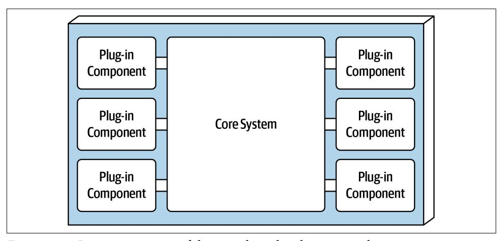
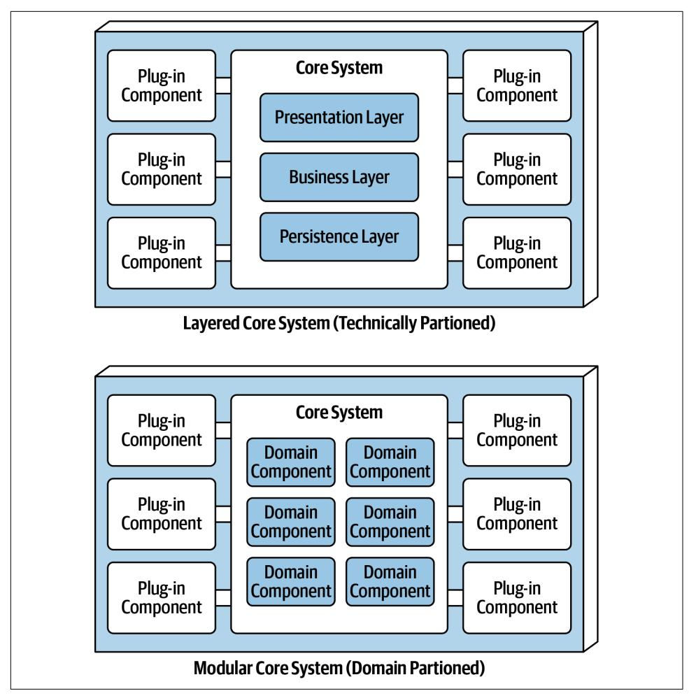
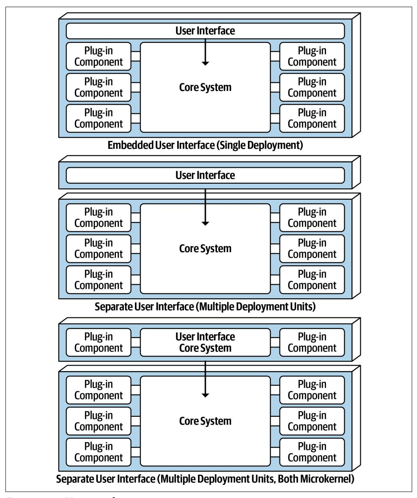
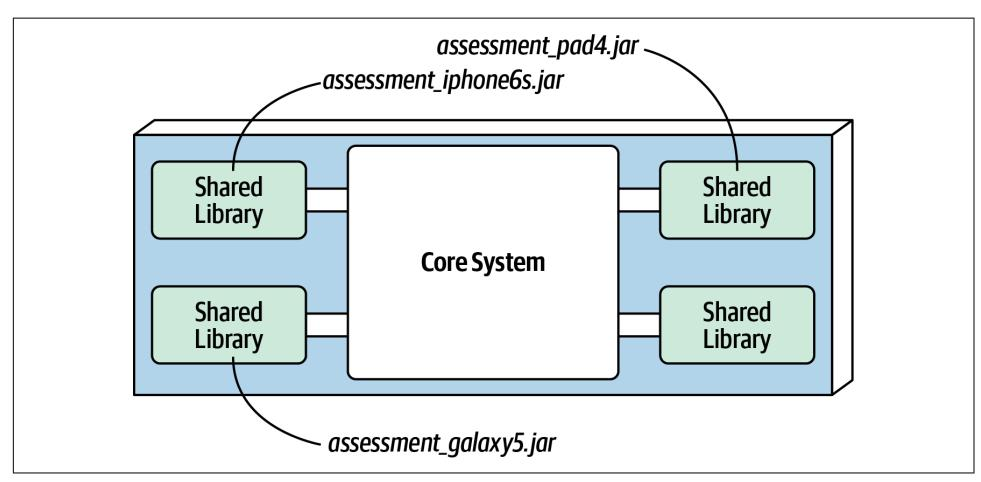
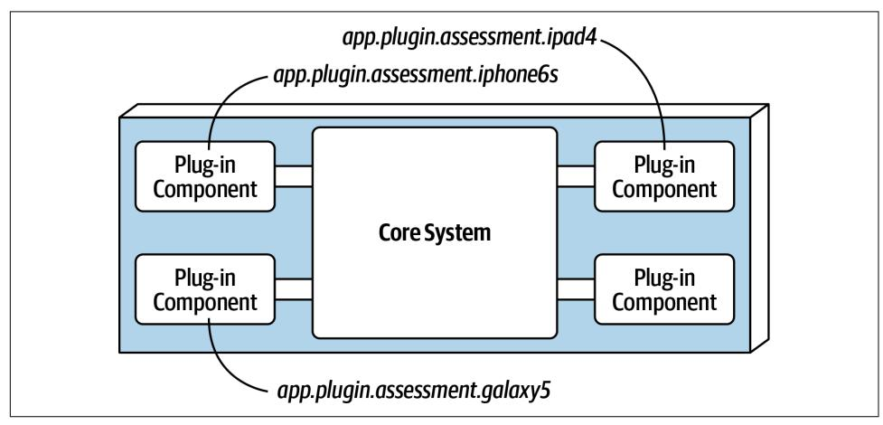
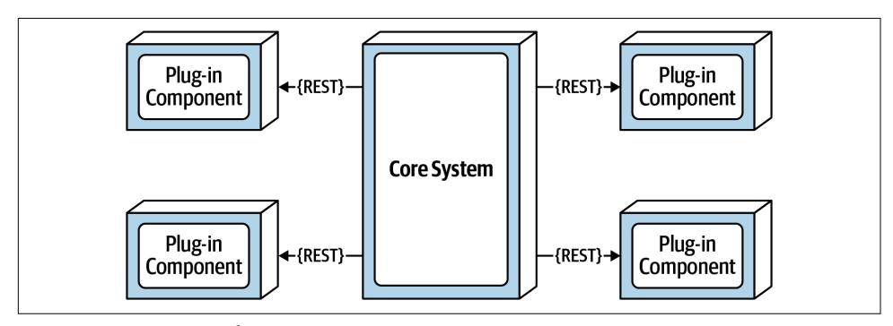
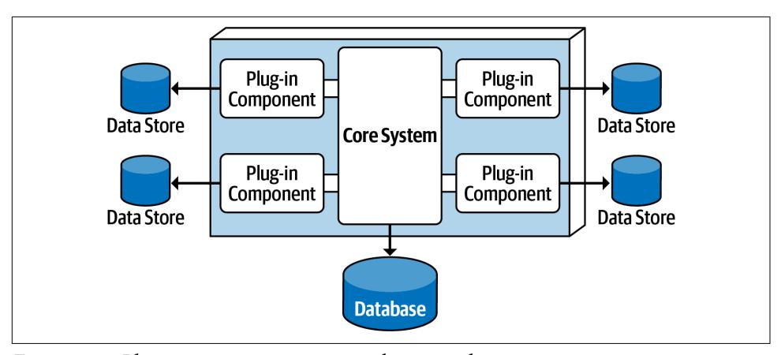

<span id="page-168-0"></span>
# Chapter 12: Microkernel Architecture Style

The *microkernel* architecture style (also referred to as the *plug-in* architecture) was coined several decades ago and is still widely used today. This architecture style is a natural fit for product-based applications (packaged and made available for download and installation as a single, monolithic deployment, typically installed on the custom‐ er's site as a third-party product) but is widely used in many nonproduct custom business applications as well.

## Topology

The microkernel architecture style is a relatively simple monolithic architecture con‐ sisting of two architecture components: a core system and plug-in components. Application logic is divided between independent plug-in components and the basic core system, providing extensibility, adaptability, and isolation of application features and custom processing logic. [Figure 12-1](#page-169-0) illustrates the basic topology of the micro‐ kernel architecture style.

<span id="page-169-0"></span>

*Figure 12-1. Basic components of the microkernel architecture style*

## Core System

The *core system* is formally defined as the minimal functionality required to run the system. The Eclipse IDE is a good example of this. The core system of Eclipse is just a basic text editor: open a file, change some text, and save the file. It's not until you add plug-ins that Eclipse starts becoming a usable product. However, another definition of the core system is the happy path (general processing flow) through the applica‐ tion, with little or no custom processing. Removing the cyclomatic complexity of the core system and placing it into separate plug-in components allows for better extensi‐ bility and maintainability, as well as increased testability. For example, suppose an electronic device recycling application must perform specific custom assessment rules for each electronic device received. The Java code for this sort of processing might look as follows:

```
public void assessDevice(String deviceID) {
 if (deviceID.equals("iPhone6s")) {
 assessiPhone6s();
 } else if (deviceID.equals("iPad1"))
 assessiPad1();
 } else if (deviceID.equals("Galaxy5"))
 assessGalaxy5();
 } else ...
 ...
 }
```

<span id="page-170-0"></span>Rather than placing all this client-specific customization in the core system with lots of cyclomatic complexity, it is much better to create a separate plug-in component for each electronic device being assessed. Not only do specific client plug-in components isolate independent device logic from the rest of the processing flow, but they also allow for expandability. Adding a new electronic device to assess is simply a matter of adding a new plug-in component and updating the registry. With the microkernel architecture style, assessing an electronic device only requires the core system to locate and invoke the corresponding device plug-ins as illustrated in this revised source code:

```
public void assessDevice(String deviceID) {
       String plugin = pluginRegistry.get(deviceID);
       Class<?> theClass = Class.forName(plugin);
       Constructor<?> constructor = theClass.getConstructor();
       DevicePlugin devicePlugin =
 (DevicePlugin)constructor.newInstance();
       DevicePlugin.assess();
```

In this example all of the complex rules and instructions for assessing a particular electronic device are self-contained in a standalone, independent plug-in component that can be generically executed from the core system.

Depending on the size and complexity, the core system can be implemented as a lay‐ ered architecture or a modular monolith (as illustrated in [Figure 12-2\)](#page-171-0). In some cases, the core system can be split into separately deployed domain services, with each domain service containing specific plug-in components specific to that domain. For example, suppose Payment Processing is the domain service representing the core system. Each payment method (credit card, PayPal, store credit, gift card, and pur‐ chase order) would be separate plug-in components specific to the payment domain. In all of these cases, it is typical for the entire monolithic application to share a single database.

<span id="page-171-0"></span>

*Figure 12-2. Variations of the microkernel architecture core system*

The presentation layer of the core system can be embedded within the core system or implemented as a separate user interface, with the core system providing backend services. As a matter of fact, a separate user interface can also be implemented as a microkernel architecture style. [Figure 12-3](#page-172-0) illustrates these presentation layer variants in relation to the core system.

<span id="page-172-0"></span>

*Figure 12-3. User interface variants*

## Plug-In Components

Plug-in components are standalone, independent components that contain special‐ ized processing, additional features, and custom code meant to enhance or extend the core system. Additionally, they can be used to isolate highly volatile code, creating <span id="page-173-0"></span>better maintainability and testability within the application. Ideally, plug-in compo‐ nents should be independent of each other and have no dependencies between them.

The communication between the plug-in components and the core system is gener‐ ally point-to-point, meaning the "pipe" that connects the plug-in to the core system is usually a method invocation or function call to the entry-point class of the plug-in component. In addition, the plug-in component can be either compile-based or runtime-based. Runtime plug-in components can be added or removed at runtime without having to redeploy the core system or other plug-ins, and they are usually managed through frameworks such as [Open Service Gateway Initiative \(OSGi\) for](https://www.osgi.org) [Java](https://www.osgi.org), [Penrose \(Java\),](https://oreil.ly/J5XZw) [Jigsaw \(Java\),](https://oreil.ly/wv9bW) or [Prism \(.NET\)](https://oreil.ly/xmrtY). Compile-based plug-in compo‐ nents are much simpler to manage but require the entire monolithic application to be redeployed when modified, added, or removed.

Point-to-point plug-in components can be implemented as shared libraries (such as a JAR, DLL, or Gem), package names in Java, or namespaces in C#. Continuing with the electronics recycling assessment application example, each electronic device plugin can be written and implemented as a JAR, DLL, or Ruby Gem (or any other shared library), with the name of the device matching the name of the independent shared library, as illustrated in Figure 12-4.



*Figure 12-4. Shared library plug-in implementation*

Alternatively, an easier approach shown in [Figure 12-5](#page-174-0) is to implement each plug-in component as a separate namespace or package name within the same code base or IDE project. When creating the namespace, we recommend the following semantics: app.plug-in.<domain>.<context>. For example, consider the namespace app.plugin.assessment.iphone6s. The second node (plugin) makes it clear this component is a plug-in and therefore should strictly adhere to the basic rules regarding plug-in components (namely, that they are self-contained and separate <span id="page-174-0"></span>from other plug-ins). The third node describes the domain (in this case, assessment), thereby allowing plug-in components to be organized and grouped by a common purpose. The fourth node (iphone6s) describes the specific context for the plug-in, making it easy to locate the specific device plug-in for modification or testing.



*Figure 12-5. Package or namespace plug-in implementation*

Plug-in components do not always have to be point-to-point communication with the core system. Other alternatives exist, including using REST or messaging as a means to invoke plug-in functionality, with each plug-in being a standalone service (or maybe even a microservice implemented using a container). Although this may sound like a good way to increase overall scalability, note that this topology (illustra‐ ted in Figure 12-6) is still only a single architecture quantum due to the monolithic core system. Every request must first go through the core system to get to the plug-in service.



*Figure 12-6. Remote plug-in access using REST*

The benefits of the remote access approach to accessing plug-in components imple‐ mented as individual services is that it provides better overall component decoupling, <span id="page-175-0"></span>allows for better scalability and throughput, and allows for runtime changes without any special frameworks like OSGi, Jigsaw, or Prism. It also allows for asynchronous communications to plug-ins, which, depending on the scenario, could significantly improve overall user responsiveness. Using the electronics recycling example, rather than having to wait for the electronic device assessment to run, the core system could make an asynchronous *request* to kick off an assessment for a particular device. When the assessment completes, the plug-in can notify the core system through another asynchronous messaging channel, which in turn would notify the user that the assessment is complete.

With these benefits comes trade-offs. Remote plug-in access turns the microkernel architecture into a distributed architecture rather than a monolithic one, making it difficult to implement and deploy for most third-party on-prem products. Further‐ more, it creates more overall complexity and cost and complicates the overall deploy‐ ment topology. If a plug-in becomes unresponsive or is not running, particularly when using REST, the request cannot be completed. This would not be the case with a monolithic deployment. The choice of whether to make the communication to plugin components from the core system point-to-point or remote should be based on specific requirements and thus requires a careful trade-off analysis of the benefits and drawbacks of such an approach.

It is not a common practice for plug-in components to connect directly to a centrally shared database. Rather, the core system takes on this responsibility, passing whatever data is needed into each plug-in. The primary reason for this practice is decoupling. Making a database change should only impact the core system, not the plug-in com‐ ponents. That said, plug-ins can have their own separate data stores only accessible to that plug-in. For example, each electronic device assessment plug-in in the electronic recycling system example can have its own simple database or rules engine containing all of the specific assessment rules for each product. The data store owned by the plug-in component can be external (as shown in [Figure 12-7](#page-176-0)), or it could be embed‐ ded as part of the plug-in component or monolithic deployment (as in the case of an in-memory or embedded database).

<span id="page-176-0"></span>

*Figure 12-7. Plug-in components can own their own data store*

## Registry

The core system needs to know about which plug-in modules are available and how to get to them. One common way of implementing this is through a plug-in registry. This registry contains information about each plug-in module, including things like its name, data contract, and remote access protocol details (depending on how the plug-in is connected to the core system). For example, a plug-in for tax software that flags high-risk tax audit items might have a registry entry that contains the name of the service (AuditChecker), the data contract (input data and output data), and the contract format (XML).

The registry can be as simple as an internal map structure owned by the core system containing a key and the plug-in component reference, or it can be as complex as a registry and discovery tool either embedded within the core system or deployed externally (such as [Apache ZooKeeper](https://zookeeper.apache.org) or [Consul\)](https://www.consul.io). Using the electronics recycling example, the following Java code implements a simple registry within the core system, showing a point-to-point entry, a messaging entry, and a RESTful entry example for assessing an iPhone 6S device:

```
Map<String, String> registry = new HashMap<String, String>();
static {
 //point-to-point access example
 registry.put("iPhone6s", "Iphone6sPlugin");
 //messaging example
 registry.put("iPhone6s", "iphone6s.queue");
 //restful example
 registry.put("iPhone6s", "https://atlas:443/assess/iphone6s");
```

<span id="page-177-0"></span>
## Contracts

The contracts between the plug-in components and the core system are usually stan‐ dard across a domain of plug-in components and include behavior, input data, and output data returned from the plug-in component. Custom contracts are typically found in situations where plug-in components are developed by a third party where you have no control over the contract used by the plug-in. In such cases, it is com‐ mon to create an adapter between the plug-in contract and your standard contract so that the core system doesn't need specialized code for each plug-in.

Plug-in contracts can be implemented in XML, JSON, or even objects passed back and forth between the plug-in and the core system. In keeping with the electronics recycling application, the following contract (implemented as a standard Java inter‐ face named AssessmentPlugin) defines the overall behavior (assess(), register(), and deregister()), along with the corresponding output data expected from the plug-in component (AssessmentOutput):

```
public interface AssessmentPlugin {
        public AssessmentOutput assess();
        public String register();
        public String deregister();
}
public class AssessmentOutput {
        public String assessmentReport;
        public Boolean resell;
        public Double value;
        public Double resellPrice;
}
```

In this contract example, the device assessment plug-in is expected to return the assessment report as a formatted string; a resell flag (true or false) indicating whether this device can be resold on a third-party market or safely disposed of; and finally, if it can be resold (another form of recycling), what the calculated value is of the item and what the recommended resell price should be.

Notice the roles and responsibility model between the core system and the plug-in component in this example, specifically with the assessmentReport field. It is not the responsibility of the core system to format and understand the details of the assess‐ ment report, only to either print it out or display it to the user.

## Examples and Use Cases

Most of the tools used for developing and releasing software are implemented using the microkernel architecture. Some examples include the [Eclipse IDE,](https://www.eclipse.org/ide) [PMD,](https://pmd.github.io) [Jira](https://www.atlassian.com/software/jira), and [Jenkins](https://jenkins.io), to name a few). Internet web browsers such as Chrome and Firefox are another common product example using the microkernel architecture: viewers and other plug-ins add additional capabilities that are not otherwise found in the basic browser representing the core system. The examples are endless for product-based software, but what about large business applications? The microkernel architecture applies to these situations as well. To illustrate this point, consider an insurance com‐ pany example involving insurance claims processing.

Claims processing is a very complicated process. Each jurisdiction has different rules and regulations for what is and isn't allowed in an insurance claim. For example, some jurisdictions (e.g., states) allow free windshield replacement if your windshield is damaged by a rock, whereas other states do not. This creates an almost infinite set of conditions for a standard claims process.

Most insurance claims applications leverage large and complex rules engines to han‐ dle much of this complexity. However, these rules engines can grow into a complex big ball of mud where changing one rule impacts other rules, or making a simple rule change requires an army of analysts, developers, and testers to make sure nothing is broken by a simple change. Using the microkernel architecture pattern can solve many of these issues.

The claims rules for each jurisdiction can be contained in separate standalone plug-in components (implemented as source code or a specific rules engine instance accessed by the plug-in component). This way, rules can be added, removed, or changed for a particular jurisdiction without impacting any other part of the system. Furthermore, new jurisdictions can be added and removed without impacting other parts of the system. The core system in this example would be the standard process for filing and processing a claim, something that doesn't change often.

Another example of a large and complex business application that can leverage the microkernel architecture is tax preparation software. For example, the United States has a basic two-page tax form called the 1040 form that contains a summary of all the information needed to calculate a person's tax liability. Each line in the 1040 tax form has a single number that requires many other forms and worksheets to arrive at that single number (such as gross income). Each of these additional forms and worksheets can be implemented as a plug-in component, with the 1040 summary tax form being the core system (the driver). This way, changes to tax law can be isolated to an inde‐ pendent plug-in component, making changes easier and less risky.

<span id="page-179-0"></span>
## Architecture Characteristics Ratings

A one-star rating in the characteristics ratings in Figure 12-8 means the specific architecture characteristic isn't well supported in the architecture, whereas a five-star rating means the architecture characteristic is one of the strongest features in the architecture style. The definition for each characteristic identified in the scorecard can be found in [Chapter 4](009-chapter-4-architecture-characteristics-defined.md#page-74-0).

| Architecture characteristic | Star rating Star rating                                       |
|-----------------------------|---------------------------------------------------------------|
| Partitioning type           | Domain and technical                                          |
| Number of quanta            | 1                                                             |
| Deployability               | <b>☆☆☆</b>                                                    |
| Elasticity                  | $\Rightarrow$                                                 |
| Evolutionary                | $\Rightarrow \Rightarrow \Rightarrow$                         |
| Fault tolerance             | $\Rightarrow$                                                 |
| Modularity                  | $\Rightarrow \Rightarrow \Rightarrow$                         |
| Overall cost                | $\Rightarrow \Rightarrow \Rightarrow \Rightarrow \Rightarrow$ |
| Performance                 | $\Rightarrow \Rightarrow \Rightarrow$                         |
| Reliability                 | $\Rightarrow \Rightarrow \Rightarrow$                         |
| Scalability                 | $\Rightarrow$                                                 |
| Simplicity                  | $\Rightarrow \Rightarrow \Rightarrow \Rightarrow$             |
| Testability                 | <b>☆☆☆</b>                                                    |

*Figure 12-8. Microkernel architecture characteristics ratings*

Similar to the layered architecture style, simplicity and overall cost are the main strengths of the microkernel architecture style, and scalability, fault tolerance, and extensibility its main weaknesses. These weaknesses are due to the typical monolithic deployments found with the microkernel architecture. Also, like the layered architec‐ ture style, the number of quanta is always singular (one) because all requests must go through the core system to get to independent plug-in components. That's where the similarities end.

<span id="page-180-0"></span>The microkernel architecture style is unique in that it is the only architecture style that can be both domain partitioned *and* technically partitioned. While most micro‐ kernel architectures are technically partitioned, the domain partitioning aspect comes about mostly through a strong domain-to-architecture isomorphism. For example, problems that require different configurations for each location or client match extremely well with this architecture style. Another example is a product or applica‐ tion that places a strong emphasis on user customization and feature extensibility (such as Jira or an IDE like Eclipse).

Testability, deployability, and reliability rate a little above average (three stars), pri‐ marily because functionality can be isolated to independent plug-in components. If done right, this reduces the overall testing scope of changes and also reduces overall risk of deployment, particularly if plug-in components are deployed in a runtime fashion.

Modularity and extensibility also rate a little above average (three stars). With the microkernel architecture style, additional functionality can be added, removed, and changed through independent, self-contained plug-in components, thereby making it relatively easy to extend and enhance applications created using this architecture style and allowing teams to respond to changes much faster. Consider the tax preparation software example from the previous section. If the US tax law changes (which it does all the time), requiring a new tax form, that new tax form can be created as a plug-in component and added to the application without much effort. Similarly, if a tax form or worksheet is no longer needed, that plug-in can simply be removed from the application.

Performance is always an interesting characteristic to rate with the microkernel archi‐ tecture style. We gave it three stars (a little above average) mostly because microker‐ nel applications are generally small and don't grow as big as most layered architectures. Also, they don't suffer as much from the architecture sinkhole antipattern discussed in [Chapter 10.](016-chapter-10-layered-architecture-style.md#page-152-0) Finally, microkernel architectures can be stream‐ lined by unplugging unneeded functionality, therefore making the application run faster. A good example of this is [Wildfly](https://wildfly.org) (previously the JBoss Application Server). By unplugging unnecessary functionality like clustering, caching, and messaging, the application server performs much faster than with these features in place.
