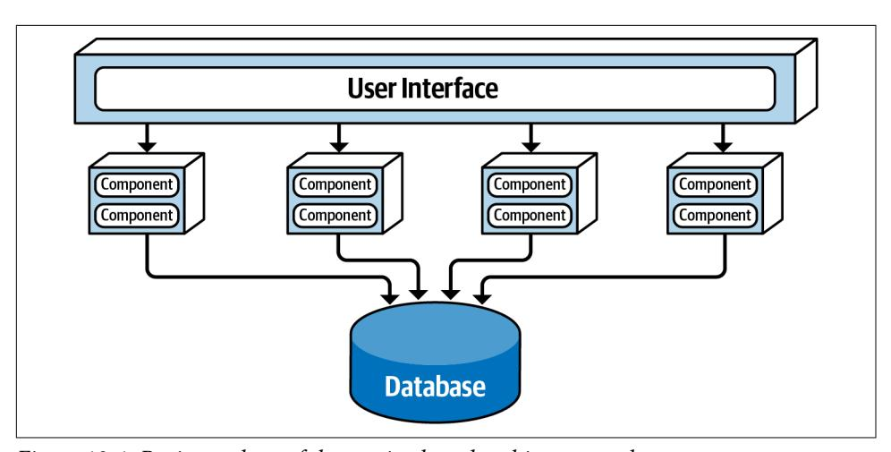
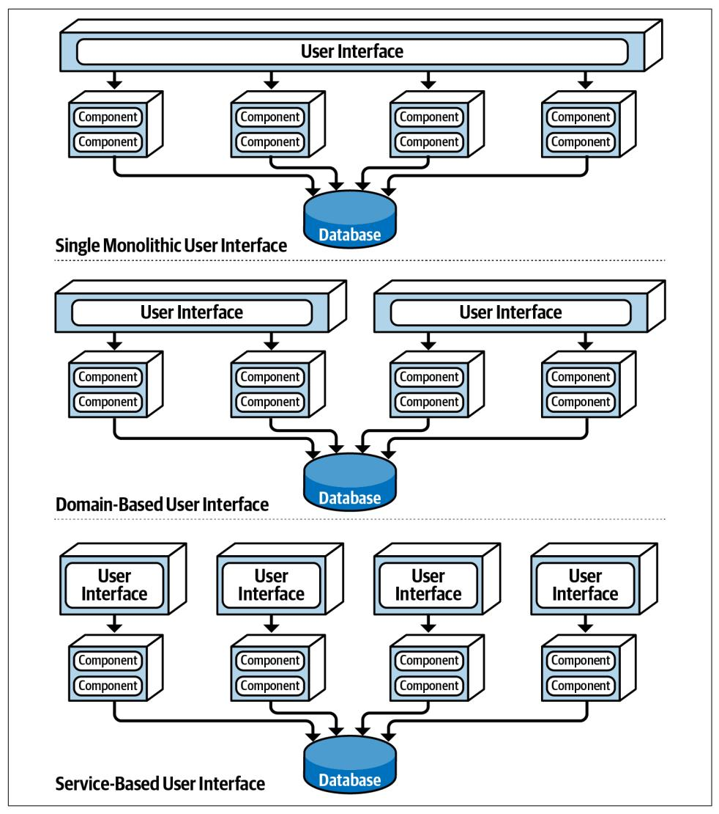
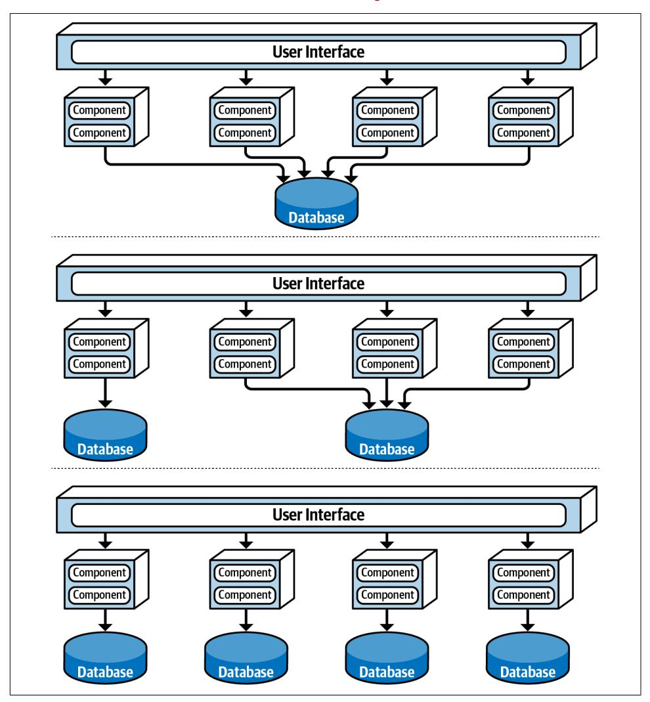
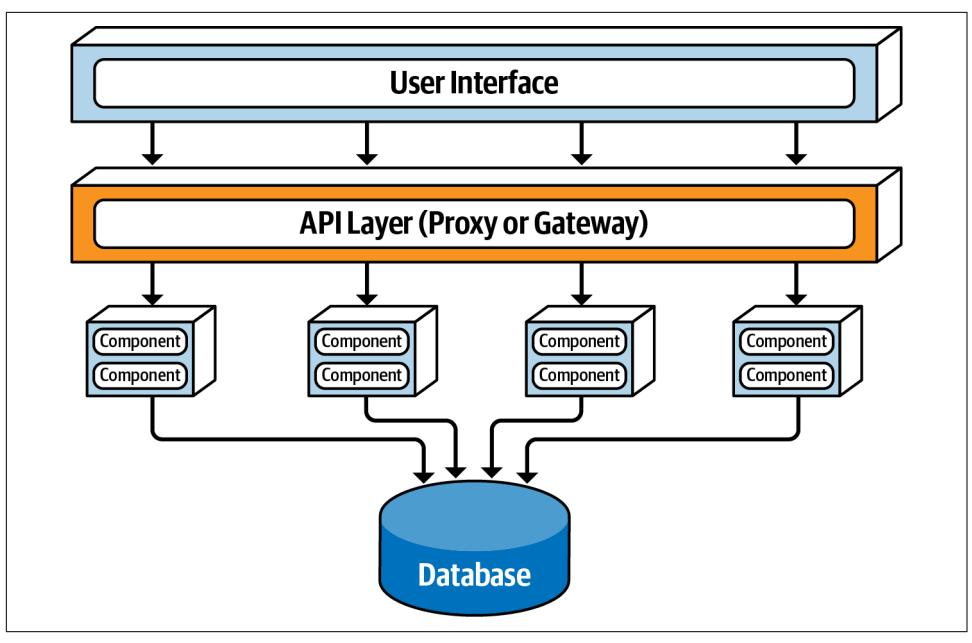
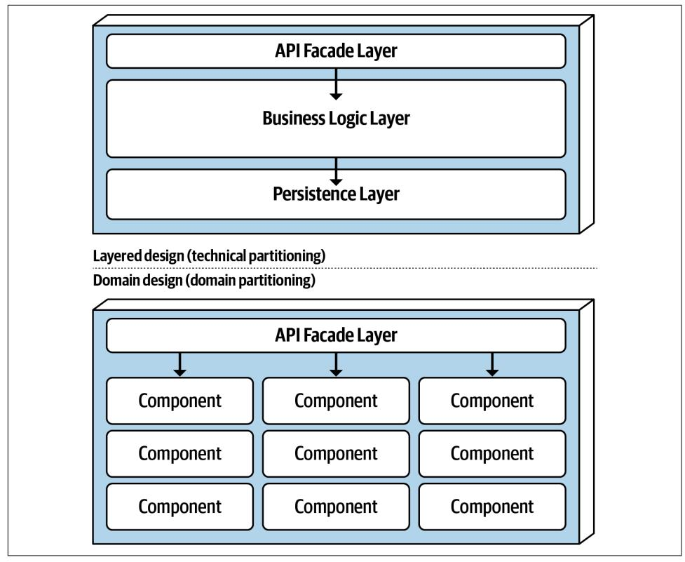
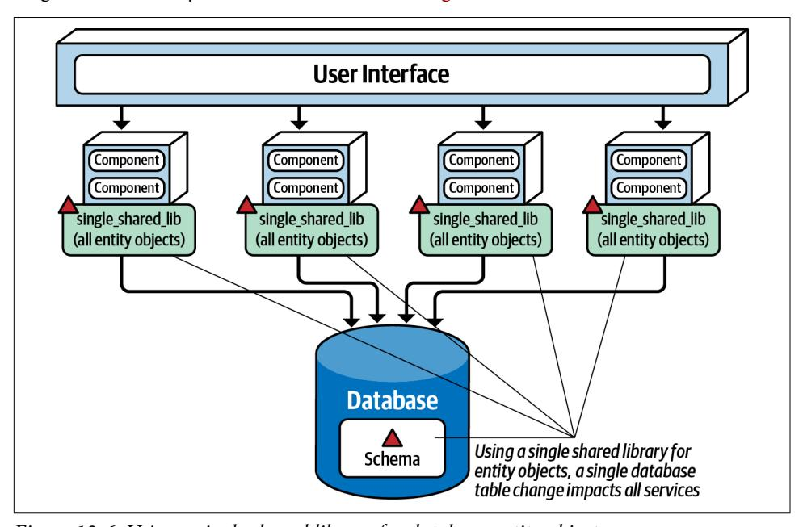
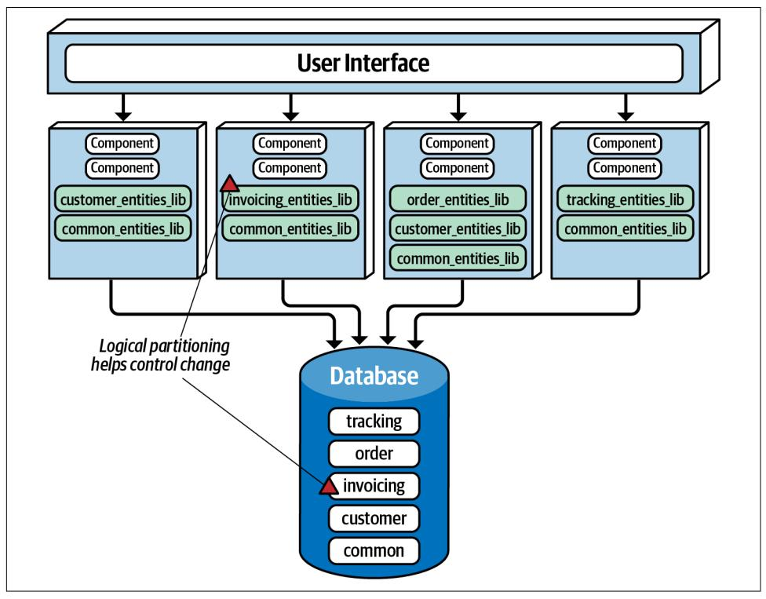
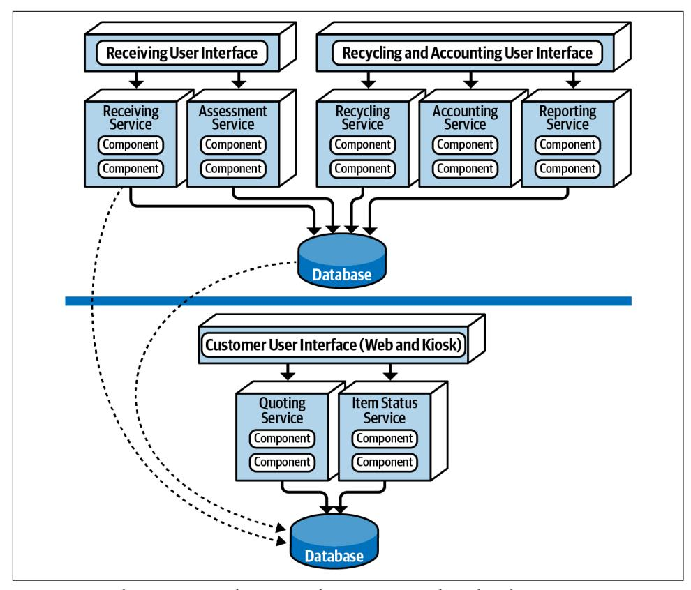
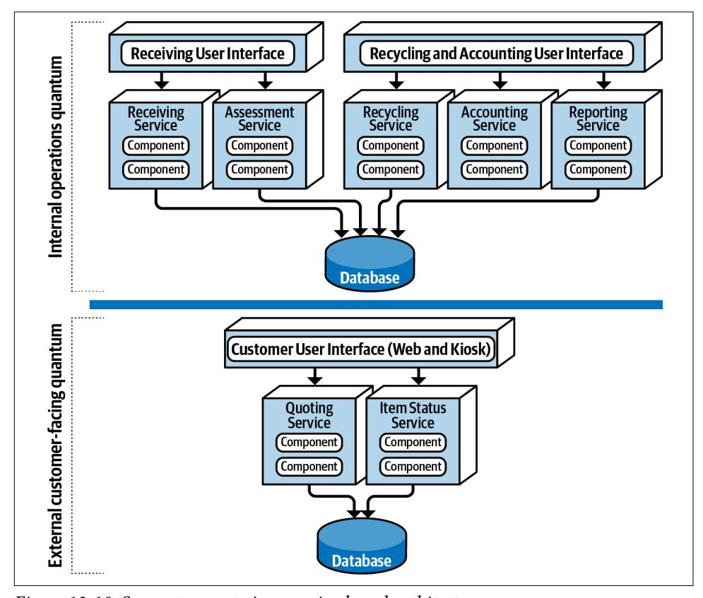

# Chapter 13: Service-Based Architecture Style

*Service-based* architecture is a hybrid of the microservices architecture style and is considered one of the most pragmatic architecture styles, mostly due to its architec‐ tural flexibility. Although service-based architecture is a distributed architecture, it doesn't have the same level of complexity and cost as other distributed architectures, such as microservices or event-driven architecture, making it a very popular choice for many business-related applications.

## Topology

The basic topology of service-based architecture follows a distributed macro layered structure consisting of a separately deployed user interface, separately deployed remote coarse-grained services, and a monolithic database. This basic topology is illustrated in [Figure 13-1](#page-183-0).

Services within this architecture style are typically coarse-grained "portions of an application" (usually called *domain services*) that are independent and separately deployed. Services are typically deployed in the same manner as any monolithic application would be (such as an EAR file, WAR file, or assembly) and as such do not require containerization (although you could deploy a domain service in a container such as Docker). Because the services typically share a single monolithic database, the number of services within an application context generally range between 4 and 12 services, with the average being about 7 services.

*Figure 13-1. Basic topology of the service-based architecture style*

In most cases there is only a single instance of each domain service within a servicebased architecture. However, based on scalability, fault tolerance, and throughput needs, multiple instances of a domain service can certainly exist. Multiple instances of a service usually require some sort of load-balancing capability between the user interface and the domain service so that the user interface can be directed to a healthy and available service instance.

Services are accessed remotely from a user interface using a remote access protocol. While REST is typically used to access services from the user interface, messaging, remote procedure call (RPC), or even SOAP could be used as well. While an API layer consisting of a proxy or gateway can be used to access services from the user interface (or other external requests), in most cases the user interface accesses the services directly using a [service locator pattern](https://oreil.ly/wYLF2) embedded within the user interface, API gateway, or proxy.

One important aspect of service-based architecture is that it typically uses a centrally shared database. This allows services to leverage SQL queries and joins in the same way a traditional monolithic layered architecture would. Because of the small number of services (4 to 12), database connections are not usually an issue in service-based architecture. Database changes, however, can be an issue. The section ["Database Par‐](#page-188-0) [titioning" on page 169](#page-188-0) describes techniques for addressing and managing database change within a service-based architecture.

## Topology Variants

Many topology variants exist within the service-based architecture style, making this perhaps one of the most flexible architecture styles. For example, the single mono‐ lithic user interface, as illustrated in [Figure 13-1](#page-183-0), can be broken apart into user inter‐ face domains, even to a level matching each domain service. These user interface variants are illustrated in Figure 13-2.

*Figure 13-2. User interface variants*

Similarly, opportunities may exist to break apart a single monolithic database into separate databases, even going as far as domain-scoped databases matching each domain service (similar to microservices). In these cases it is important to make sure the data in each separate database is not needed by another domain service. This avoids interservice communication between domain services (something to definitely avoid with service-based architecture) and also the duplication of data between data‐ bases. These database variants are illustrated in Figure 13-3.

*Figure 13-3. Database variants*

Finally, it is also possible to add an API layer consisting of a reverse proxy or gateway between the user interface and services, as shown in Figure 13-4. This is a good prac‐ tice when exposing domain service functionality to external systems or when consoli‐ dating shared cross-cutting concerns and moving them outside of the user interface (such as metrics, security, auditing requirements, and service discovery).

*Figure 13-4. Adding an API layer between the user interface and domain services*

## Service Design and Granularity

Because domain services in a service-based architecture are generally coarse-grained, each domain service is typically designed using a layered architecture style consisting of an API facade layer, a business layer, and a persistence layer. Another popular design approach is to domain partition each domain service using sub-domains simi‐ lar to the modular monolith architecture style. Each of these design approaches is illustrated in [Figure 13-5](#page-187-0).

*Figure 13-5. Domain service design variants*

Regardless of the service design, a domain service must contain some sort of API access facade that the user interface interacts with to execute some sort of business functionality. The API access facade typically takes on the responsibility of orches‐ trating the business request from the user interface. For example, consider a business request from the user interface to place an order (also known as catalog checkout). This single request, received by the API access facade within the OrderService domain service, internally orchestrates the single business request: place the order, generate an order ID, apply the payment, and update the product inventory for each product ordered. In the microservices architecture style, this would likely involve the orchestration of many separately deployed remote single-purpose services to com‐ plete the request. This difference between internal class-level orchestration and exter‐ nal service orchestration points to one of the many significant differences between service-based architecture and microservices in terms of granularity.

Because domain services are coarse-grained, regular ACID (atomicity, consistency, isolation, durability) database transactions involving database commits and rollbacks are used to ensure database integrity within a single domain service. Highly dis‐ tributed architectures like microservices, on the other hand, usually have fine-grained services and use a distributed transaction technique known as BASE transactions (basic availability, soft state, eventual consistency) that rely on eventual consistency and hence do not support the same level of database integrity as ACID transactions in a service-based architecture.

To illustrate this point, consider the example of a catalog checkout process within a service-based architecture. Suppose the customer places an order and the credit card used for payment has expired. Since this is an atomic transaction within the same ser‐ vice, everything added to the database can be removed using a rollback and a notice sent to the customer stating that the payment cannot be applied. Now consider this same process in a microservices architecture with smaller fine-grained services. First, the OrderPlacement service would accept the request, create the order, generate an order ID, and insert the order into the order tables. Once this is done, the order ser‐ vice would then make a remote call to the PaymentService, which would try to apply the payment. If the payment cannot be applied due to an expired credit card, then the order cannot be placed and the data is in an inconsistent state (the order information has already been inserted but has not been approved). In this case, what about the inventory for that order? Should it be marked as ordered and decremented? What if the inventory is low and another customer wishes to purchase the item? Should that new customer be allowed to buy it, or should the reserved inventory be reserved for the customer trying to place the order with an expired credit card? These are just a few of the questions that would need to be addressed when orchestrating a business process with multiple finer-grained services.

Domain services, being coarse-grained, allow for better data integrity and consis‐ tency, but there is a trade-off. With service-based architecture, a change made to the order placement functionality in the OrderService would require testing the entire coarse-grained service (including payment processing), whereas with microservices the same change would only impact a small OrderPlacement service (requiring no change to the PaymentService). Furthermore, because more code is being deployed, there is more risk with service-based architecture that something might break (including payment processing), whereas with microservices each service has a single responsibility, hence less chance of breaking other functionality when being changed.

## Database Partitioning

Although not required, services within a service-based architecture usually share a single, monolithic database due to the small number of services (4 to 12) within a given application context. This database coupling can present an issue with respect to database table schema changes. If not done properly, a table schema change can potentially impact every service, making database changes a very costly task in terms of effort and coordination.

Within a service-based architecture, the shared class files representing the database table schemas (usually referred to as *entity objects*) reside in a custom shared library used by all the domain services (such as a JAR file or DLL). Shared libraries might also contain SQL code. The practice of creating a single shared library of entity objects is the least effective way of implementing service-based architecture. Any change to the database table structures would also require a change to the single shared library containing all of the corresponding entity objects, thus requiring a change and redeployment to every service, regardless of whether or not the services actually access the changed table. Shared library versioning can help address this issue, but nevertheless, with a single shared library it is difficult to know which serv‐ ices are actually impacted by the table change without manual, detailed analysis. This single shared library scenario is illustrated in Figure 13-6.

*Figure 13-6. Using a single shared library for database entity objects*

One way to mitigate the impact and risk of database changes is to logically partition the database and manifest the logical partitioning through federated shared libraries. Notice in [Figure 13-7](#page-190-0) that the database is logically partitioned into five separate domains (common, customer, invoicing, order, and tracking). Also notice that there are five corresponding shared libraries used by the domain services matching the log‐ ical partitions in the database. Using this technique, changes to a table within a par‐ ticular logical domain (in this case, invoicing) match the corresponding shared library containing the entity objects (and possibly SQL as well), impacting only those

services using that shared library, which in this case is the invoicing service. No other services are impacted by this change.

*Figure 13-7. Using multiple shared libraries for database entity objects*

Notice in Figure 13-7 the use of the *common* domain and the corresponding common\_entities\_lib shared library used by all services. This is a relatively common occurrence. These tables are common to all services, and as such, changes to these tables require coordination of all services accessing the shared database. One way to mitigate changes to these tables (and corresponding entity objects) is to lock the com‐ mon entity objects in the version control system and restrict change access to only the database team. This helps control change and emphasizes the significance of changes to the common tables used by all services.

Make the logical partitioning in the database as fine-grained as possible while still maintaining well-defined data domains to better control database changes within a service-based architecture.

## Example Architecture

To illustrate the flexibility and power of the service-based architecture style, consider the real-world example of an electronic recycling system used to recycle old elec‐ tronic devices (such as an iPhone or Galaxy cell phone). The processing flow of recy‐ cling old electronic devices works as follows: first, the customer asks the company (via a website or kiosk) how much money they can get for the old electronic device (called *quoting*). If satisfied, the customer will send the electronic device to the recy‐ cling company, which in turn will receive the physical device (called *receiving*). Once received, the recycling company will then assess the device to determine if the device is in good working condition or not (called *assessment*). If the device is in good work‐ ing condition, the company will send the customer the money promised for the device (called *accounting*). Through this process, the customer can go to the website at any time to check on the status of the item (called *item status*). Based on the assess‐ ment, the device is then recycled by either safely destroying it or reselling it (called *recycling*). Finally, the company periodically runs ad hoc and scheduled financial and operational reports based on recycling activity (called *reporting*).

[Figure 13-8](#page-192-0) illustrates this system using a service-based architecture. Notice how each domain area identified in the prior description is implemented as a separately deployed independent domain service. Scalability can be achieved by only scaling those services needing higher throughput (in this case, the customer-facing Quoting service and ItemStatus service). The other services do not need to scale, and as such only require a single service instance.

Also notice in how the user interface applications are federated into their respective domains: *Customer Facing*, *Receiving*, and *Recycling and Accounting*. This federation allows for fault tolerance of the user interface, scalability, and security (external cus‐ tomers have no network path to internal functionality). Finally, notice in this example that there are two separate physical databases: one for external customer-facing oper‐ ations, and one for internal operations. This allows the internal data and operations to reside in a separate network zone from the external operations (denoted by the vertical line), providing much better security access restrictions and data protection. One-way access through the firewall allows internal services to access and update the customer-facing information, but not vice versa. Alternatively, depending on the database being used, internal table mirroring and table synchronization could also be used.

*Figure 13-8. Electronics recycling example using service-based architecture*

This example illustrates many of the benefits of the service-based architecture approach: scalability, fault tolerance, and security (data and functionality protection and access), in addition to agility, testability, and deployability. For example, the Assessment service is changed constantly to add assessment rules as new products are received. This frequent change is isolated to a single domain service, providing agility (the ability to respond quickly to change), as well as testability (the ease of and completeness of testing) and deployability (the ease, frequency, and risk of deployment).

## Architecture Characteristics Ratings

A one-star rating in the characteristics ratings table in Figure 13-9 means the specific architecture characteristic isn't well supported in the architecture, whereas a five-star rating means the architecture characteristic is one of the strongest features in the architecture style. The definition for each characteristic identified in the scorecard can be found in [Chapter 4](009-chapter-4-architecture-characteristics-defined.md#page-74-0).

| Architecture characteristic | Star rating Star rating |
|-----------------------------|-------------------------|
| Partitioning type           | Domain                  |
| Number of quanta            | 1 to many               |
| Deployability               | ***                     |
| Elasticity                  | <b>☆☆</b>               |
| Evolutionary                | <b>☆☆☆</b>              |
| Fault tolerance             | <b>☆☆☆</b>              |
| Modularity                  | <b>☆☆☆</b>              |
| Overall cost                | <b>☆☆☆</b>              |
| Performance                 | <b>☆☆☆</b>              |
| Reliability                 | <b>☆☆☆</b>              |
| Scalability                 | <b>☆☆☆</b>              |
| Simplicity                  | <b>☆☆☆</b>              |
| Testability                 | <b>☆☆☆</b>              |

*Figure 13-9. Service-based architecture characteristics ratings*

Service-based architecture is a *domain-partitioned* architecture, meaning that the structure is driven by the domain rather than a technical consideration (such as pre‐ sentation logic or persistence logic). Consider the prior example of the electronic recycling application. Each service, being a separately deployed unit of software, is scoped to a specific domain (such as item assessment). Changes made within this domain only impact the specific service, the corresponding user interface, and the corresponding database. Nothing else needs to be modified to support a specific assessment change.

Being a distributed architecture, the number of quanta can be greater than or equal to one. Even though there may be anywhere from 4 to 12 separately deployed services, if those services all share the same database or user interface, that entire system would be only a single quantum. However, as illustrated in ["Topology Variants" on page 165,](#page-184-0) both the user interface and database can be federated, resulting in multiple quanta within the overall system. In the electronics recycling example, the system contains two quanta, as illustrated in Figure 13-10: one for the customer-facing portion of the application containing a separate customer user interface, database, and set of serv‐ ices (Quoting and Item Status); and one for the internal operations of receiving, assessing, and recycling the electronic device. Notice that even though the internal operations quantum contains separately deployed services and two separate user interfaces, they all share the same database, making the internal operations portion of the application a single quantum.

*Figure 13-10. Separate quanta in a service-based architecture*

Although service-based architecture doesn't contain any five-star ratings, it neverthe‐ less rates high (four stars) in many important and vital areas. Breaking apart an appli‐ cation into separately deployed domain services using this architecture style allows for faster change (agility), better test coverage due to the limited scope of the domain (testability), and the ability for more frequent deployments carrying less risk than a large monolith (deployability). These three characteristics lead to better time-tomarket, allowing an organization to deliver new features and bug fixes at a relatively high rate.

Fault tolerance and overall application availability also rate high for service-based architecture. Even though domain services tend to be coarse-grained, the four-star rating comes from the fact that with this architecture style, services are usually selfcontained and do not leverage interservice communication due to database sharing and code sharing. As a result, if one domain service goes down (e.g., the Receiving service in the electronic recycling application example), it doesn't impact any of the other six services.

Scalability only rates three stars due to the coarse-grained nature of the services, and correspondingly, elasticity only two stars. Although programmatic scalability and elasticity are certainly possible with this architecture style, more functionality is repli‐ cated than with finer-grained services (such as microservices) and as such is not as efficient in terms of machine resources and not as cost-effective. Typically there are only single service instances with service-based architecture unless there is a need for better throughput or failover. A good example of this is the electronics recycling application example—only the Quoting and Item Status services need to scale to support high customer volumes, but the other operational services only require single instances, making it easier to support such things as single in-memory caching and database connection pooling.

Simplicity and overall cost are two other drivers that differentiate this architecture style from other, more expensive and complex distributed architectures, such as microservices, event-driven architecture, or even space-based architecture. This makes service-based one of the easiest and cost-effective distributed architectures to implement. While this is an attractive proposition, there is a trade-off to this cost sav‐ ings and simplicity in all of the characteristics containing four-star ratings. The higher the cost and complexity, the better these ratings become.

Service-based architectures tend to be more reliable than other distributed architec‐ tures due to the coarse-grained nature of the domain services. Larger services mean less network traffic to and between services, fewer distributed transactions, and less bandwidth used, therefore increasing overall reliability with respect to the network.

## When to Use This Architecture Style

The flexibility of this architecture style (see ["Topology Variants" on page 165\)](#page-184-0) com‐ bined with the number of three-star and four-star architecture characteristics ratings make service-based architecture one of the most pragmatic architecture styles avail‐ able. While there are certainly other distributed architecture styles that are much more powerful, some companies find that power comes at too steep of a price, while others find that they quite simply don't need that much power. It's like having the power, speed, and agility of a Ferrari used only for driving back and forth to work in rush-hour traffic at 50 kilometers per hour—sure it looks cool, but what a waste of resources and money!

Service-based architecture is also a natural fit when doing domain-driven design. Because services are coarse-grained and domain-scoped, each domain fits nicely into a separately deployed domain service. Each service in service-based architecture encompasses a particular domain (such as recycling in the electronic recycling appli‐ cation), therefore compartmentalizing that functionality into a single unit of software, making it easier to apply changes to that domain.

Maintaining and coordinating database transactions is always an issue with dis‐ tributed architectures in that they typically rely on eventual consistency rather than traditional ACID (atomicity, consistency, isolation, and durability) transactions. However, service-based architecture preserves ACID transactions better than any other distributed architecture due to the coarse-grained nature of the domain serv‐ ices. There are cases where the user interface or API gateway might orchestrate two or more domain services, and in these cases the transaction would need to rely on sagas and BASE transactions. However, in most cases the transaction is scoped to a particu‐ lar domain service, allowing for the traditional commit and rollback transaction functionality found in most monolithic applications.

Lastly, service-based architecture is a good choice for achieving a good level of archi‐ tectural modularity without having to get tangled up in the complexities and pitfalls of granularity. As services become more fine-grained, issues surrounding orchestra‐ tion and choreography start to appear. Both orchestration and choreography are required when multiple services must be coordinated to complete a certain business transaction. Orchestration is the coordination of multiple services through the use of a separate mediator service that controls and manages the workflow of the transac‐ tion (like a conductor in an orchestra). Choreography, on the other hand, is the coor‐ dination of multiple services by which each service talks to one another without the use of a central mediator (like dancers in a dance). As services become more finegrained, both orchestration and choreography are necessary to tie the services together to complete the business transaction. However, because services within a service-based architecture tend to be more coarse-grained, they don't require coordi‐ nation nearly as much as other distributed architectures.
