<span id="page-198-0"></span>
# Chapter 14: Event-Driven Architecture Style

The *event-driven* architecture style is a popular distributed asynchronous architecture style used to produce highly scalable and high-performance applications. It is also highly adaptable and can be used for small applications and as well as large, complex ones. Event-driven architecture is made up of decoupled event processing compo‐ nents that asynchronously receive and process events. It can be used as a standalone architecture style or embedded within other architecture styles (such as an eventdriven microservices architecture).

Most applications follow what is called a *request-based* model (illustrated in [Figure 14-1](#page-199-0)). In this model, requests made to the system to perform some sort of action are send to a *request orchestrator*. The request orchestrator is typically a user interface, but it can also be implemented through an API layer or enterprise service bus. The role of the request orchestrator is to deterministically and synchronously direct the request to various *request processors*. The request processors handle the request, either retrieving or updating information in a database.

A good example of the request-based model is a request from a customer to retrieve their order history for the past six months. Retrieving order history information is a data-driven, deterministic request made to the system for data within a specific con‐ text, not an event happening that the system must react to.

An event-based model, on the other hand, reacts to a particular situation and takes action based on that event. An example of an event-based model is submitting a bid for a particular item within an online auction. Submitting the bid is not a request made to the system, but rather an event that happens after the current asking price is announced. The system must respond to this event by comparing the bid to others received at the same time to determine who is the current highest bidder.

<span id="page-199-0"></span>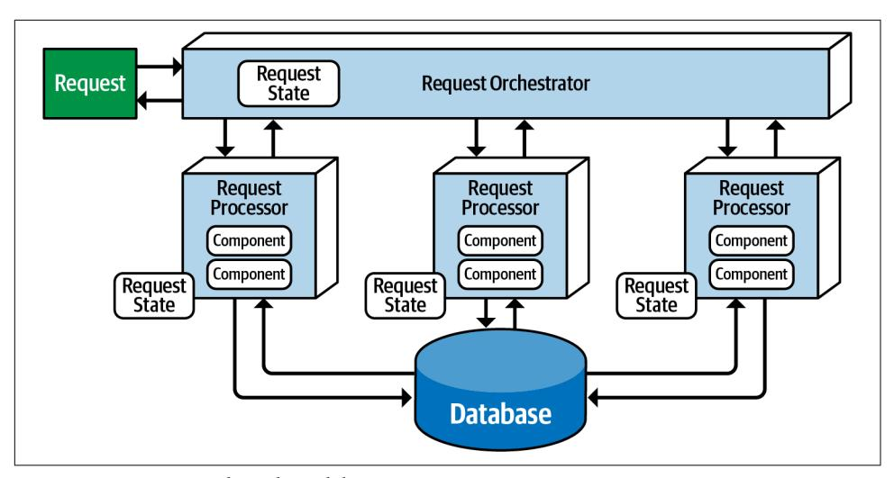

*Figure 14-1. Request-based model*

## Topology

There are two primary topologies within event-driven architecture: the *mediator top‐ ology* and the *broker topology*. The mediator topology is commonly used when you require control over the workflow of an event process, whereas the broker topology is used when you require a high degree of responsiveness and dynamic control over the processing of an event. Because the architecture characteristics and implementation strategies differ between these two topologies, it is important to understand each one to know which is best suited for a particular situation.

## Broker Topology

The broker topology differs from the mediator topology in that there is no central event mediator. Rather, the message flow is distributed across the event processor components in a chain-like broadcasting fashion through a lightweight message broker (such as RabbitMQ, ActiveMQ, HornetQ, and so on). This topology is useful when you have a relatively simple event processing flow and you do not need central event orchestration and coordination.

<span id="page-200-0"></span>There are four primary architecture components within the broker topology: an ini‐ tiating event, the event broker, an event processor, and a processing event. The *initiat‐ ing event* is the initial event that starts the entire event flow, whether it be a simple event like placing a bid in an online auction or more complex events in a health bene‐ fits system like changing a job or getting married. The initiating event is sent to an event channel in the *event broker* for processing. Since there is no mediator compo‐ nent in the broker topology managing and controlling the event, a single *event pro‐ cessor* accepts the initiating event from the event broker and begins the processing of that event. The event processor that accepted the initiating event performs a specific task associated with the processing of that event, then asynchronously advertises what it did to the rest of the system by creating what is called a *processing event*. This pro‐ cessing event is then asynchronously sent to the event broker for further processing, if needed. Other event processors listen to the processing event, react to that event by doing something, then advertise through a new processing event what they did. This process continues until no one is interested in what a final event processor did. Figure 14-2 illustrates this event processing flow.

The event broker component is usually federated (meaning multiple domain-based clustered instances), where each federated broker contains all of the event channels used within the event flow for that particular domain. Because of the decoupled asyn‐ chronous fire-and-forget broadcasting nature of the broker topology, topics (or topic exchanges in the case of AMQP) are usually used in the broker topology using a publish-and-subscribe messaging model.

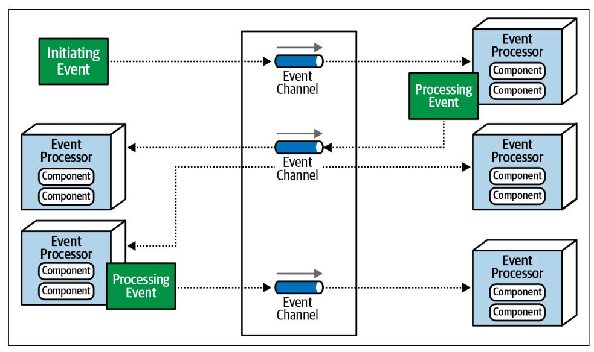

*Figure 14-2. Broker topology*

<span id="page-201-0"></span>It is always a good practice within the broker topology for each event processor to advertise what it did to the rest of the system, regardless of whether or not any other event processor cares about what that action was. This practice provides architectural extensibility if additional functionality is required for the processing of that event. For example, suppose as part of a complex event process, as illustrated in Figure 14-3, an email is generated and sent to a customer notifying them of a particular action taken. The Notification event processor would generate and send the email, then advertise that action to the rest of the system through a new processing event sent to a topic. However, in this case, no other event processors are listening for events on that topic, and as such the message simply goes away.

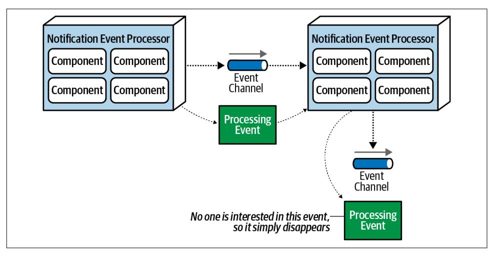

*Figure 14-3. Notication event is sent but ignored*

This is a good example of *architectural extensibility*. While it may seem like a waste of resources sending messages that are ignored, it is not. Suppose a new requirement comes along to analyze emails that have been sent to customers. This new event pro‐ cessor can be added to the overall system with minimal effort because the email information is available via the email topic to the new analyzer without having to add any additional infrastructure or apply any changes to other event processors.

To illustrate how the broker topology works, consider the processing flow in a typical retail order entry system, as illustrated in [Figure 14-4](#page-202-0), where an order is placed for an item (say, a book like this one). In this example, the OrderPlacement event processor receives the initiating event (PlaceOrder), inserts the order in a database table, and returns an order ID to the customer. It then advertises to the rest of the system that it created an order through an order-created processing event. Notice that three event processors are interested in that event: the Notification event processor, the Payment event processor, and the Inventory event processor. All three of these event processors perform their tasks in parallel.

<span id="page-202-0"></span>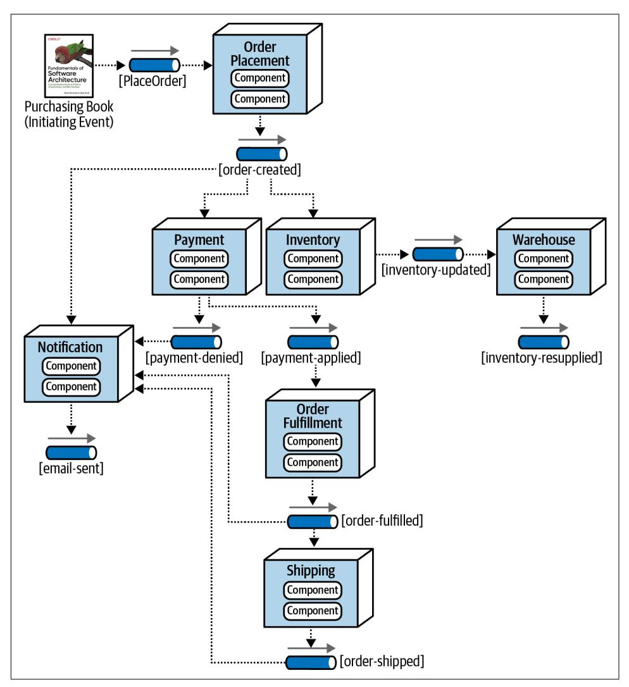

*Figure 14-4. Example of the broker topology*

The Notification event processor receives the order-created processing event and emails the customer. It then generates another processing event (email-sent). Notice that no other event processors are listening to that event. This is normal and illus‐ trates the previous example describing architectural extensibility—an in-place hook so that other event processors can eventually tap into that event feed, if needed.

The Inventory event processor also listens for the order-created processing event and decrements the corresponding inventory for that book. It then advertises this action through an inventory-updated processing event, which is in turn picked up by the Warehouse event processor to manage the corresponding inventory between warehouses, reordering items if supplies get too low.

The Payment event processor also receives the order-created processing event and charges the customer's credit card for the order that was just created. Notice in [Figure 14-4](#page-202-0) that two events are generated as a result of the actions taken by the Payment event processor: one to notify the rest of the system that the payment was applied (payment-applied) and one processing event to notify the rest of the system that the payment was denied (payment-denied). Notice that the Notification event processor is interested in the payment-denied processing event, because it must, in turn, send an email to the customer informing them that they must update their credit card information or choose a different payment method.

The OrderFulfillment event processor listens to the payment-applied processing event and does order picking and packing. Once completed, it then advertises to the rest of the system that it fulfilled the order via an order-fulfilled processing event. Notice that both the Notification processing unit and the Shipping processing unit listen to this processing event. Concurrently, the Notification event processor noti‐ fies the customer that the order has been fulfilled and is ready for shipment, and at the same time the Shipping event processor selects a shipping method. The Shipping event processor ships the order and sends out an order-shipped processing event, which the Notification event processor also listens for to notify the customer of the order status change.

In analyzing the prior example, notice that all of the event processors are highly decoupled and independent of each other. The best way to understand the broker topology is to think about it as a relay race. In a relay race, runners hold a baton (a wooden stick) and run for a certain distance (say 1.5 kilometers), then hand off the baton to the next runner, and so on down the chain until the last runner crosses the finish line. In relay races, once a runner hands off the baton, that runner is done with the race and moves on to other things. This is also true with the broker topology. Once an event processor hands off the event, it is no longer involved with the pro‐ cessing of that specific event and is available to react to other initiating or processing events. In addition, each event processor can scale independently from one other to handle varying load conditions or backups in the processing within that event. The topics provide the back pressure point if an event processor comes down or slows down due to some environment issue.

<span id="page-204-0"></span>While performance, responsiveness, and scalability are all great benefits of the broker topology, there are also some negatives about it. First of all, there is no control over the overall workflow associated with the initiating event (in this case, the PlaceOrder event). It is very dynamic based on various conditions, and no one in the system really knows when the business transaction of placing an order is actually complete. Error handling is also a big challenge with the broker topology. Because there is no mediator monitoring or controlling the business transaction, if a failure occurs (such as the Payment event processor crashing and not completing its assigned task), no one in the system is aware of that crash. The business process gets stuck and is unable to move without some sort of automated or manual intervention. Furthermore, all other processes are moving along without regard for the error. For example, the Inventory event processor still decrements the inventory, and all other event processors react as though everything is fine.

The ability to restart a business transaction (recoverability) is also something not supported with the broker topology. Because other actions have asynchronously been taken through the initial processing of the initiating event, it is not possible to resub‐ mit the initiating event. No component in the broker topology is aware of the state or even owns the state of the original business request, and therefore no one is responsi‐ ble in this topology for restarting the business transaction (the initiating event) and knowing where it left off. The advantages and disadvantages of the broker topology are summarized in Table 14-1.

*Table 14-1. Trade-offs of the broker topology*

| Advantages                        | Disadvantages        |
|-----------------------------------|----------------------|
| Highly decoupled event processors | Workflow control     |
| High scalability                  | Error handling       |
| High responsiveness               | Recoverability       |
| High performance                  | Restart capabilities |
| High fault tolerance              | Data inconsistency   |

## Mediator Topology

The mediator topology of event-driven architecture addresses some of the shortcom‐ ings of the broker topology described in the previous section. Central to this topology is an event mediator, which manages and controls the workflow for initiating events that require the coordination of multiple event processors. The architecture compo‐ nents that make up the mediator topology are an initiating event, an event queue, an event mediator, event channels, and event processors.

<span id="page-205-0"></span>Like in the broker topology, the initiating event is the event that starts the whole eventing process. Unlike the broker topology, the initiating event is sent to an initiat‐ ing event queue, which is accepted by the event mediator. The event mediator only knows the steps involved in processing the event and therefore generates correspond‐ ing processing events that are sent to dedicated event channels (usually queues) in a point-to-point messaging fashion. Event processors then listen to dedicated event channels, process the event, and usually respond back to the mediator that they have completed their work. Unlike the broker topology, event processors within the medi‐ ator topology do not advertise what they did to the rest of the system. The mediator topology is illustrated in Figure 14-5.

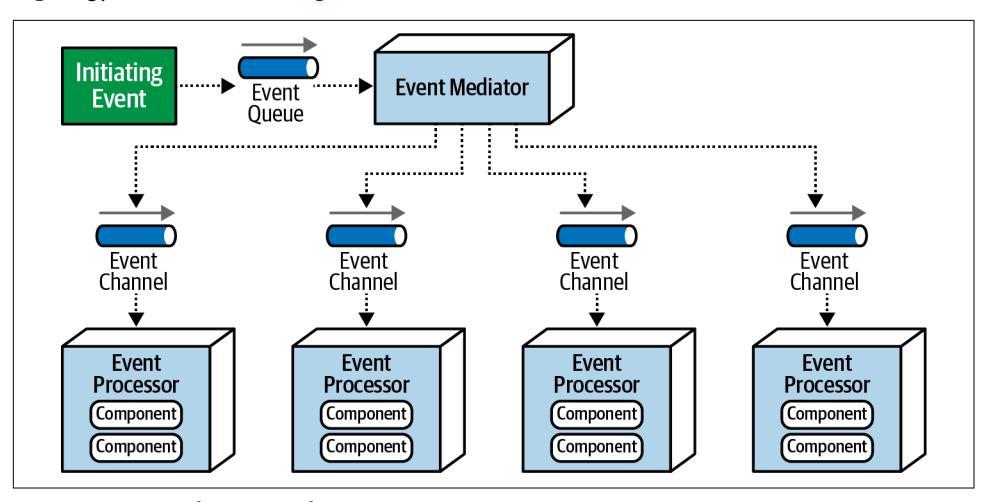

*Figure 14-5. Mediator topology*

In most implementations of the mediator topology, there are multiple mediators, usu‐ ally associated with a particular domain or grouping of events. This reduces the single point of failure issue associated with this topology and also increases overall through‐ put and performance. For example, there might be a customer mediator that handles all customer-related events (such as new customer registration and profile update), and another mediator that handles order-related activities (such as adding an item to a shopping cart and checking out).

The event mediator can be implemented in a variety of ways, depending on the nature and complexity of the events it is processing. For example, for events requiring simple error handling and orchestration, a mediator such as [Apache Camel,](https://camel.apache.org) [Mule](https://www.mulesoft.com) [ESB](https://www.mulesoft.com), or [Spring Integration](https://oreil.ly/r2e4r) will usually suffice. Message flows and message routes within these types of mediators are typically custom written in programming code (such as Java or C#) to control the workflow of the event processing.

However, if the event workflow requires lots of conditional processing and multiple dynamic paths with complex error handling directives, then a mediator such as

<span id="page-206-0"></span>[Apache ODE](https://ode.apache.org) or the [Oracle BPEL Process Manager](https://oreil.ly/jMtta) would be a good choice. These mediators are based on [Business Process Execution Language \(BPEL\),](https://oreil.ly/Uu-Fo) an XML-like structure that describes the steps involved in processing an event. BPEL artifacts also contain structured elements used for error handling, redirection, multicasting, and so on. BPEL is a powerful but relatively complex language to learn, and as such is usu‐ ally created using graphical interface tools provided in the product's BPEL engine suite.

BPEL is good for complex and dynamic workflows, but it does not work well for those event workflows requiring long-running transactions involving human inter‐ vention throughout the event process. For example, suppose a trade is being placed through a place-trade initiating event. The event mediator accepts this event, but during the processing finds that a manual approval is required because the trade is over a certain amount of shares. In this case the event mediator would have to stop the event processing, send a notification to a senior trader for the manual approval, and wait for that approval to occur. In these cases a Business Process Management (BPM) engine such as [jBPM](https://www.jbpm.org) would be required.

It is important to know the types of events that will be processed through the media‐ tor in order to make the correct choice for the implementation of the event mediator. Choosing Apache Camel for complex and long-running events involving human interaction would be extremely difficult to write and maintain. By the same token, using a BPM engine for simple event flows would take months of wasted effort when the same thing could be accomplished in Apache Camel in a matter of days.

Given that it's rare to have all events of one class of complexity, we recommend classi‐ fying events as simple, hard, or complex and having every event always go through a simple mediator (such as Apache Camel or Mule). The simple mediator can then interrogate the classification of the event, and based on that classification, handle the event itself or forward it to another, more complex, event mediator. In this manner, all types of events can be effectively processed by the type of mediator needed for that event. This mediator delegation model is illustrated in [Figure 14-6](#page-207-0).

<span id="page-207-0"></span>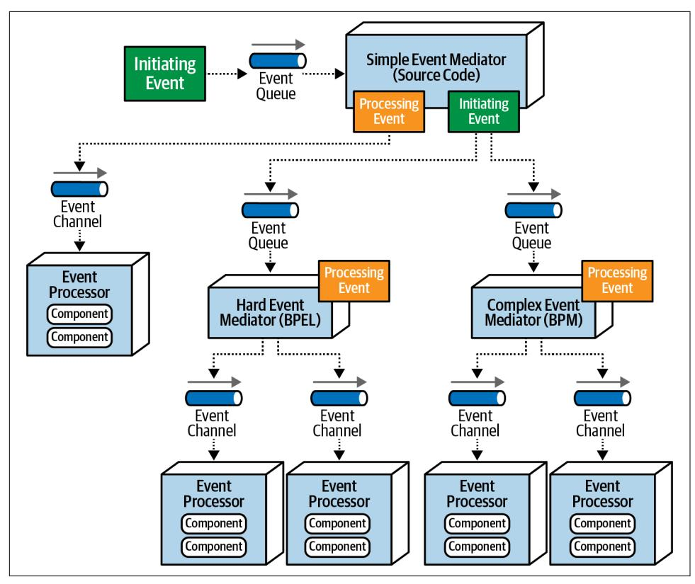

*Figure 14-6. Delegating the event to the appropriate type of event mediator*

Notice in Figure 14-6 that the Simple Event Mediator generates and sends a pro‐ cessing event when the event workflow is simple and can be handled by the simple mediator. However, notice that when the initiating event coming into the Simple Event Mediator is classified as either hard or complex, it forwards the original ini‐ tiating event to the corresponding mediators (BPEL or BMP). The Simple Event Mediator, having intercepted the original event, may still be responsible for knowing when that event is complete, or it simply delegates the entire workflow (including cli‐ ent notification) to the other mediators.

To illustrate how the mediator topology works, consider the same retail order entry system example described in the prior broker topology section, but this time using the mediator topology. In this example, the mediator knows the steps required to pro‐ cess this particular event. This event flow (internal to the mediator component) is illustrated in [Figure 14-7](#page-208-0).

<span id="page-208-0"></span>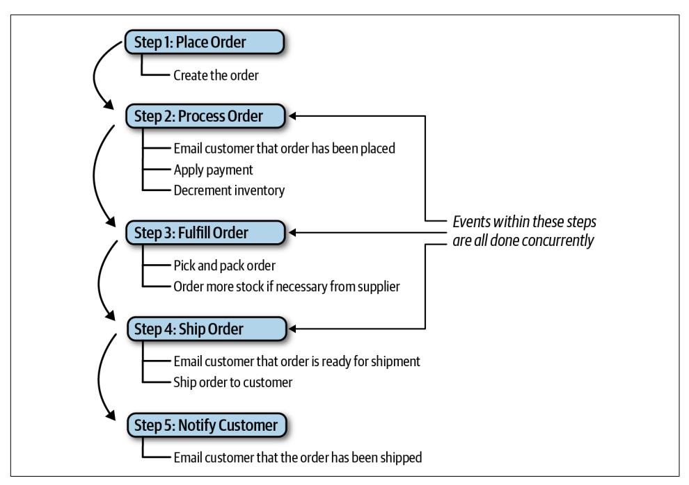

*Figure 14-7. Mediator steps for placing an order*

In keeping with the prior example, the same initiating event (PlaceOrder) is sent to the customer-event-queue for processing. The Customer mediator picks up this ini‐ tiating event and begins generating processing events based on the flow in Figure 14-7. Notice that the multiple events shown in steps 2, 3, and 4 are all done concurrently and serially between steps. In other words, step 3 (fulfill order) must be completed and acknowledged before the customer can be notified that the order is ready to be shipped in step 4 (ship order).

Once the initiating event has been received, the Customer mediator generates a create-order processing event and sends this message to the order-placementqueue (see [Figure 14-8](#page-209-0)). The OrderPlacement event processor accepts this event and validates and creates the order, returning to the mediator an acknowledgement along with the order ID. At this point the mediator might send that order ID back to the customer, indicating that the order was placed, or it might have to continue until all the steps are complete (this would be based on specific business rules about order placement).

<span id="page-209-0"></span>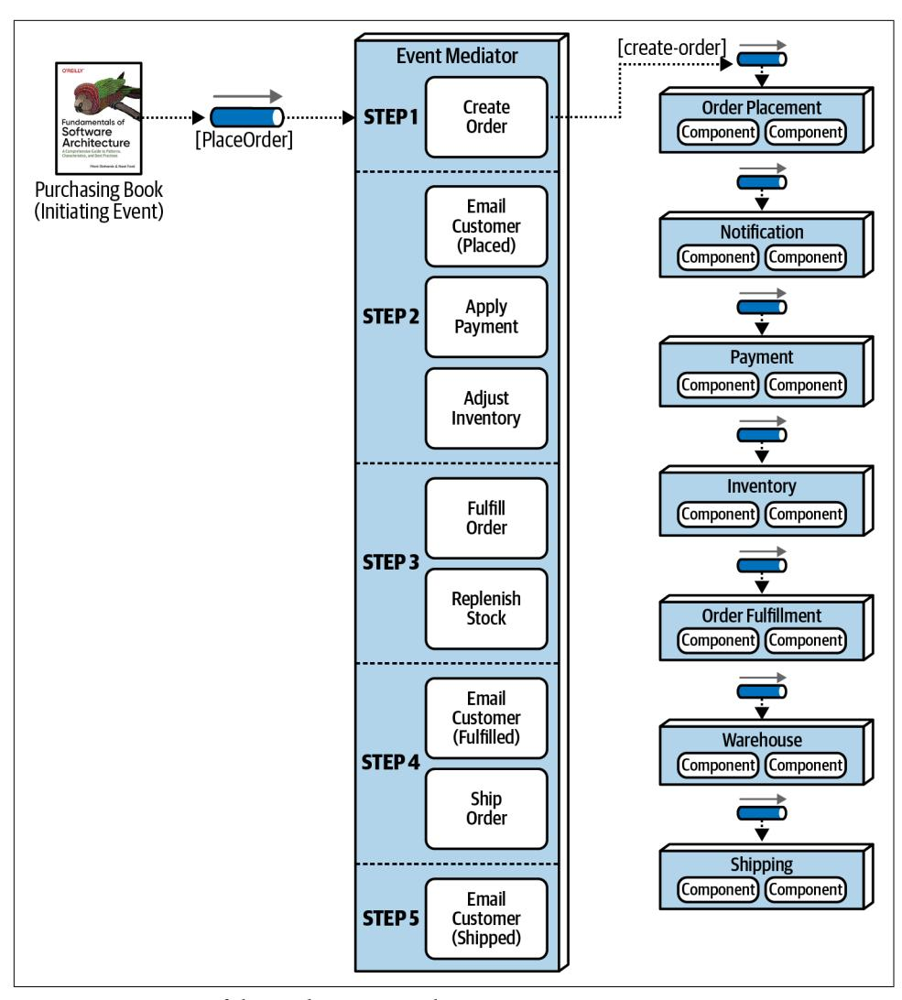

*Figure 14-8. Step 1 of the mediator example*

Now that step 1 is complete, the mediator now moves to step 2 (see [Figure 14-9\)](#page-210-0) and generates three messages at the same time: email-customer, apply-payment, and adjust-inventory. These processing events are all sent to their respective queues. All three event processors receive these messages, perform their respective tasks, and notify the mediator that the processing has been completed. Notice that the mediator must wait until it receives acknowledgement from all three parallel processes before moving on to step 3. At this point, if an error occurs in one of the parallel event pro‐ cessors, the mediator can take corrective action to fix the problem (this is discussed later in this section in more detail).

<span id="page-210-0"></span>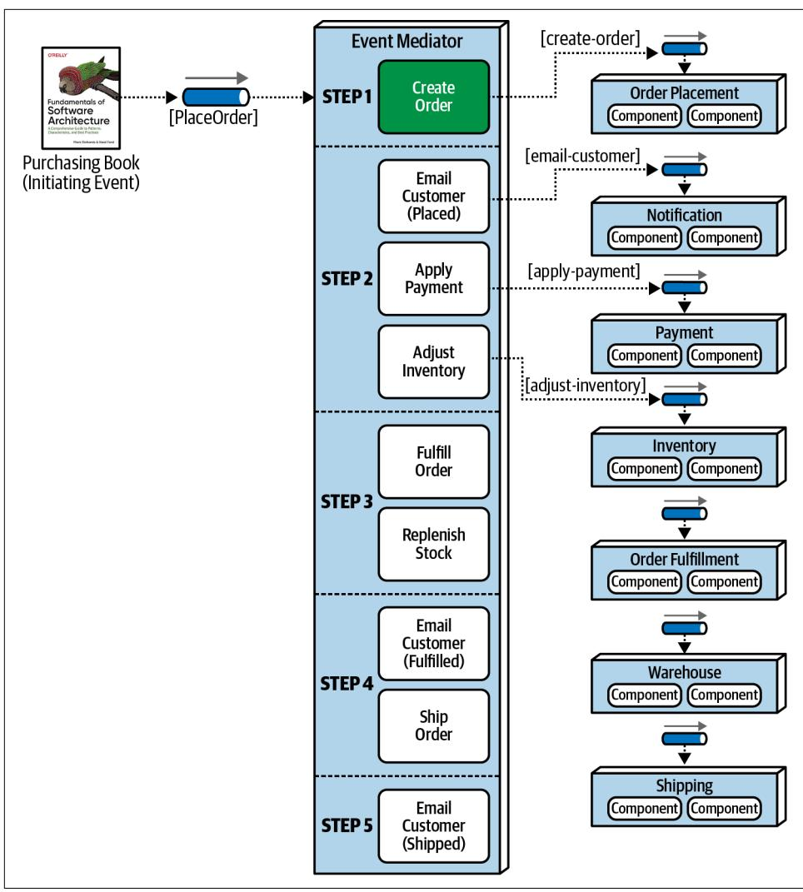

*Figure 14-9. Step 2 of the mediator example*

Once the mediator gets a successful acknowledgment from all of the event processors in step 2, it can move on to step 3 to fulfill the order (see Figure 14-10). Notice once again that both of these events (fulfill-order and order-stock) can occur simulta‐ neously. The OrderFulfillment and Warehouse event processors accept these events, perform their work, and return an acknowledgement to the mediator.

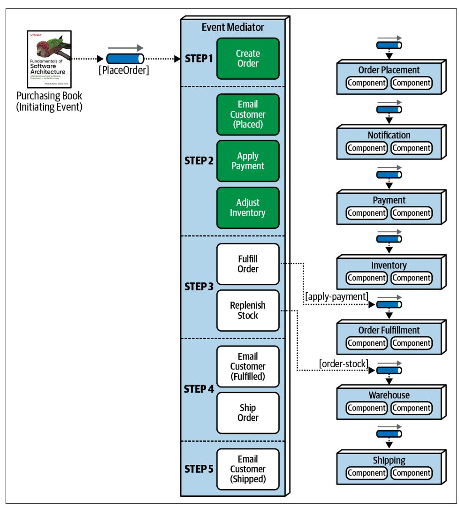

*Figure 14-10. Step 3 of the mediator example*

Once these events are complete, the mediator then moves on to step 4 (see Figure 14-11) to ship the order. This step generates another email-customer process‐ ing event with specific information about what to do (in this case, notify the customer that the order is ready to be shipped), as well as a ship-order event.

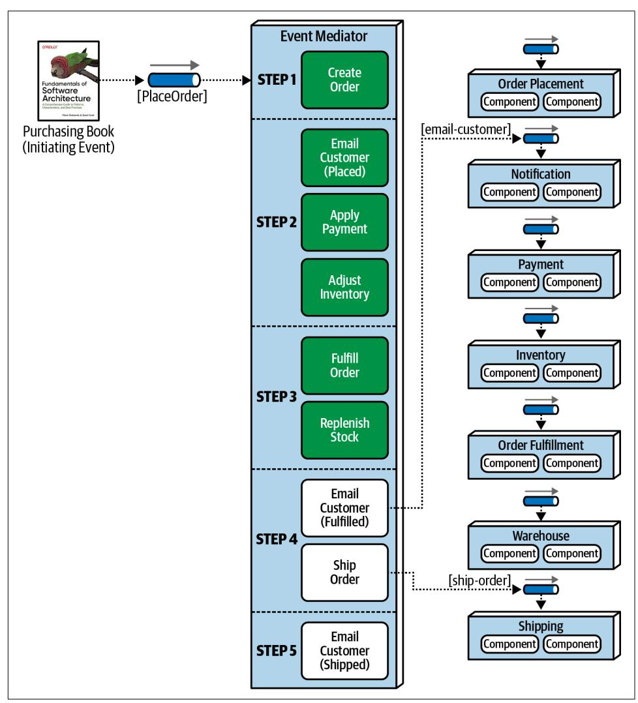

*Figure 14-11. Step 4 of the mediator example*

Finally, the mediator moves to step 5 (see [Figure 14-12](#page-213-0)) and generates another con‐ textual email-customer event to notify the customer that the order has been shipped. At this point the workflow is done, and the mediator marks the initiating event flow complete and removes all state associated with the initiating event.

<span id="page-213-0"></span>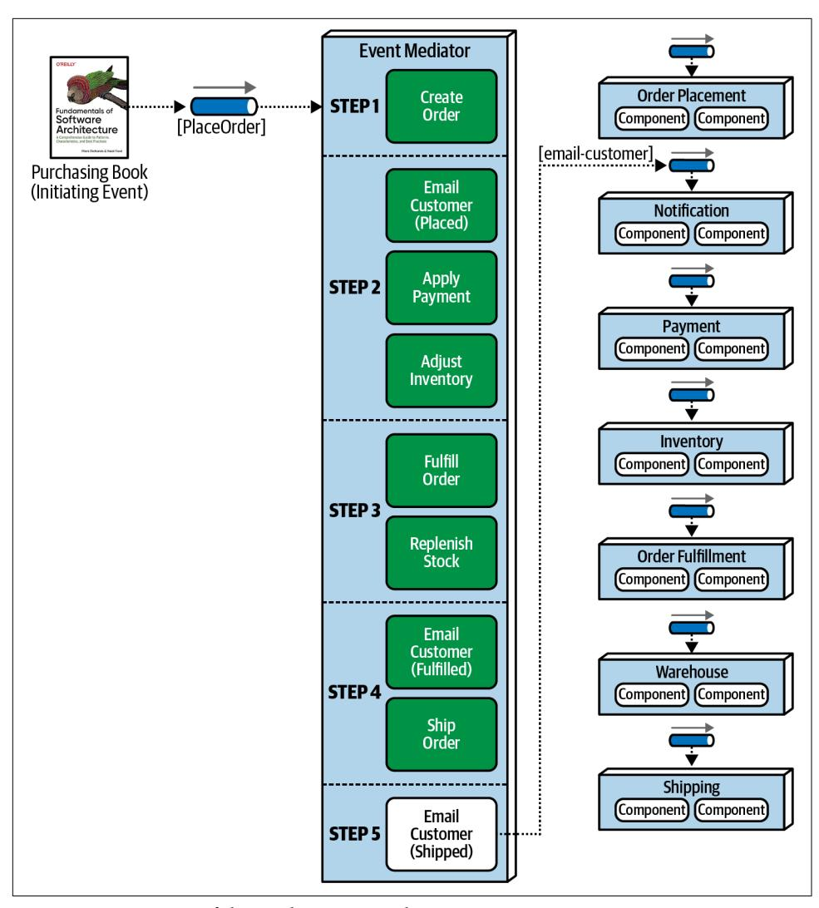

*Figure 14-12. Step 5 of the mediator example*

The mediator component has knowledge and control over the workflow, something the broker topology does not have. Because the mediator controls the workflow, it can maintain event state and manage error handling, recoverability, and restart capa‐ bilities. For example, suppose in the prior example the payment was not applied due to the credit card being expired. In this case the mediator receives this error condi‐ tion, and knowing the order cannot be fulfilled (step 3) until payment is applied, stops the workflow and records the state of the request in its own persistent datastore. Once payment is eventually applied, the workflow can be restarted from where it left off (in this case, the beginning of step 3).

<span id="page-214-0"></span>Another inherent difference between the broker and mediator topology is how the processing events differ in terms of their meaning and how they are used. In the broker topology example in the previous section, the processing events were pub‐ lished as events that had occurred in the system (such as order-created, paymentapplied, and email-sent). The event processors took some action, and other event processors react to that action. However, in the mediator topology, processing occur‐ rences such as place-order, send-email, and fulfill-order are *commands* (things that need to happen) as opposed to *events* (things that have already happened). Also, in the mediator topology, a command must be processed, whereas an event can be ignored in the broker topology.

While the mediator topology addresses the issues associated with the broker topol‐ ogy, there are some negatives associated with the mediator topology. First of all, it is very difficult to declaratively model the dynamic processing that occurs within a complex event flow. As a result, many workflows within the mediator only handle the general processing, and a hybrid model combining both the mediator and broker topologies is used to address the dynamic nature of complex event processing (such as out-of-stock conditions or other nontypical errors). Furthermore, although the event processors can easily scale in the same manner as the broker topology, the mediator must scale as well, something that occasionally produces a bottleneck in the overall event processing flow. Finally, event processors are not as highly decoupled in the mediator topology as with the broker topology, and performance is not as good due to the mediator controlling the processing of the event. These trade-offs are sum‐ marized in Table 14-2.

*Table 14-2. Trade-offs of the mediator topology*

| Advantages              | Disadvantages                     |
|-------------------------|-----------------------------------|
| Workflow control        | More coupling of event processors |
| Error handling          | Lower scalability                 |
| Recoverability          | Lower performance                 |
| Restart capabilities    | Lower fault tolerance             |
| Better data consistency | Modeling complex workflows        |

The choice between the broker and mediator topology essentially comes down to a trade-off between workflow control and error handling capability versus high perfor‐ mance and scalability. Although performance and scalability are still good within the mediator topology, they are not as high as with the broker topology.

<span id="page-215-0"></span>
## Asynchronous Capabilities

The event-driven architecture style offers a unique characteristic over other architec‐ ture styles in that it relies solely on asynchronous communication for both fire-andforget processing (no response required) as well as request/reply processing (response required from the event consumer). Asynchronous communication can be a powerful technique for increasing the overall responsiveness of a system.

Consider the example illustrated in Figure 14-13 where a user is posting a comment on a website for a particular product review. Assume the comment service in this example takes 3,000 milliseconds to post the comment because it goes through sev‐ eral parsing engines: a bad word checker to check for unacceptable words, a grammar checker to make sure that the sentence structures are not saying something abusive, and finally a context checker to make sure the comment is about a particular product and not just a political rant. Notice in Figure 14-13 that the top path utilizes a syn‐ chronous RESTful call to post the comment: 50 milliseconds in latency for the service to receive the post, 3,000 milliseconds to post the comment, and 50 milliseconds in network latency to respond back to the user that the comment was posted. This creates a response time for the user of 3,100 milliseconds to post a comment. Now look at the bottom path and notice that with the use of asynchronous messaging, the response time from the end user's perspective for posting a comment on the website is only 25 milliseconds (as opposed to 3,100 milliseconds). It still takes 3,025 milli‐ seconds to post the comment (25 milliseconds to receive the message and 3,000 milli‐ seconds to post the comment), but from the end user's perspective it's already been done.

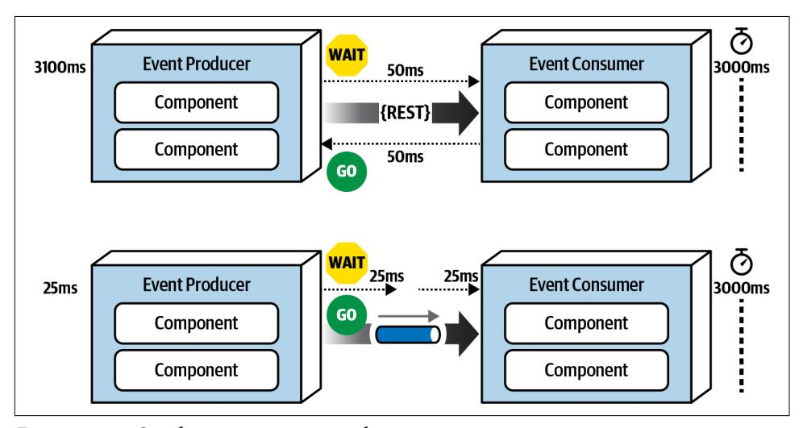

*Figure 14-13. Synchronous versus asynchronous communication*

<span id="page-216-0"></span>This is a good example of the difference between *responsiveness* and *performance*. When the user does not need any information back (other than an acknowledgement or a thank you message), why make the user wait? Responsiveness is all about notify‐ ing the user that the action has been accepted and will be processed momentarily, whereas performance is about making the end-to-end process faster. Notice that nothing was done to optimize the way the comment service processes the text—in both cases it is still taking 3,000 milliseconds. Addressing *performance* would have been optimizing the comment service to run all of the text and grammar parsing engines in parallel with the use of caching and other similar techniques. The bottom example in [Figure 14-13](#page-215-0) addresses the overall responsiveness of the system but not the performance of the system.

The difference in response time between the two examples in [Figure 14-13](#page-215-0) from 3,100 milliseconds to 25 milliseconds is staggering. There is one caveat. On the syn‐ chronous path shown on the top of the diagram, the end user is guaranteed that the comment has been posted. However, on the bottom path there is only the acknowl‐ edgement of the post, with a future promise that eventually the comment will get pos‐ ted. From the end user's perspective, the comment has been posted. But what happens if the user had typed a bad word in the comment? In this case the comment would be rejected, but there is no way to get back to the end user. Or is there? In this example, assuming the user is registered with the website (which to post a comment they would have to be), a message could be sent to the user indicating a problem with the comment and some suggestions on how to repair it. This is a simple example. What about a more complicated example where the purchase of some stock is taking place asynchronously (called a stock trade) and there is no way to get back to the user?

The main issue with asynchronous communications is error handling. While respon‐ siveness is significantly improved, it is difficult to address error conditions, adding to the complexity of the event-driven system. The next section addresses this issue with a pattern of reactive architecture called the *workflow event* pattern.

## Error Handling

The workflow event pattern of reactive architecture is one way of addressing the issues associated with error handling in an asynchronous workflow. This pattern is a reactive architecture pattern that addresses both resiliency and responsiveness. In other words, the system can be resilient in terms of error handling without an impact to responsiveness.

The workflow event pattern leverages delegation, containment, and repair through the use of a *workflow delegate*, as illustrated in [Figure 14-14.](#page-217-0) The event producer asynchronously passes data through a message channel to the event consumer. If the event consumer experiences an error while processing the data, it immediately dele‐

<span id="page-217-0"></span>gates that error to the *workflow processor* and moves on to the next message in the event queue. In this way, overall responsiveness is not impacted because the next message is immediately processed. If the event consumer were to spend the time try‐ ing to figure out the error, then it is not reading the next message in the queue, there‐ fore impacting the responsiveness not only of the next message, but all other messages waiting in the queue to be processed.

Once the workflow processor receives an error, it tries to figure out what is wrong with the message. This could be a static, deterministic error, or it could leverage some machine learning algorithms to analyze the message to see some anomaly in the data. Either way, the workflow processor programmatically (without human intervention) makes changes to the original data to try and repair it, and then sends it back to the originating queue. The event consumer sees this message as a new one and tries to process it again, hopefully this time with some success. Of course, there are many times when the workflow processor cannot determine what is wrong with the mes‐ sage. In these cases the workflow processor sends the message off to another queue, which is then received in what is usually called a "dashboard," an application that looks similar to the Microsoft's Outlook or Apple's Mail. This dashboard usually resides on the desktop of a person of importance, who then looks at the message, applies manual fixes to it, and then resubmits it to the original queue (usually through a reply-to message header variable).

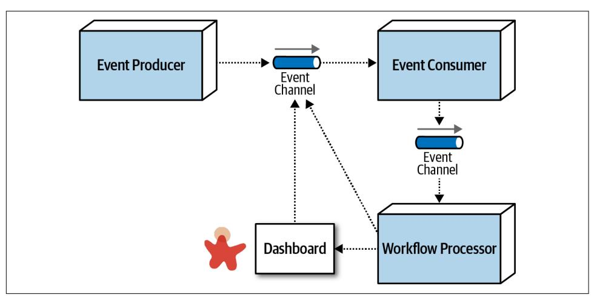

*Figure 14-14. Workflow event pattern of reactive architecture*

To illustrate the workflow event pattern, suppose a trading advisor in one part of the country accepts trade orders (instructions on what stock to buy and for how many shares) on behalf of a large trading firm in another part of the country. The advisor batches up the trade orders (what is usually called a basket) and asynchronously sends those to the large trading firm to be placed with a broker so the stock can be

purchased. To simplify the example, suppose the contract for the trade instructions must adhere to the following:

```
ACCOUNT(String),SIDE(String),SYMBOL(String),SHARES(Long)
```

Suppose the large trading firm receives the following basket of Apple (AAPL) trade orders from the trading advisor:

```
12654A87FR4,BUY,AAPL,1254
87R54E3068U,BUY,AAPL,3122
6R4NB7609JJ,BUY,AAPL,5433
2WE35HF6DHF,BUY,AAPL,8756 SHARES
764980974R2,BUY,AAPL,1211
1533G658HD8,BUY,AAPL,2654
```

Notice the forth trade instruction (2WE35HF6DHF,BUY,AAPL,8756 SHARES) has the word SHARES after the number of shares for the trade. When these asynchronous trade orders are processed by the large trading firm without any error handling capa‐ bilities, the following error occurs within the trade placement service:

```
Exception in thread "main" java.lang.NumberFormatException:
 For input string: "8756 SHARES"
 at java.lang.NumberFormatException.forInputString
 (NumberFormatException.java:65)
 at java.lang.Long.parseLong(Long.java:589)
 at java.lang.Long.<init>(Long.java:965)
 at trading.TradePlacement.execute(TradePlacement.java:23)
 at trading.TradePlacement.main(TradePlacement.java:29)
```

When this exception occurs, there is nothing that the trade placement service can do, because this was an asynchronous request, except to possibly log the error condition. In other words, there is no user to synchronously respond to and fix the error.

Applying the workflow event pattern can programmatically fix this error. Because the large trading firm has no control over the trading advisor and the corresponding trade order data it sends, it must react to fix the error itself (as illustrated in [Figure 14-15](#page-219-0)). When the same error occurs (2WE35HF6DHF,BUY,AAPL,8756 SHARES), the Trade Placement service immediately delegates the error via asynchronous mes‐ saging to the Trade Placement Error service for error handling, passing with the error information about the exception:

```
Trade Placed: 12654A87FR4,BUY,AAPL,1254
Trade Placed: 87R54E3068U,BUY,AAPL,3122
Trade Placed: 6R4NB7609JJ,BUY,AAPL,5433
Error Placing Trade: "2WE35HF6DHF,BUY,AAPL,8756 SHARES"
Sending to trade error processor <-- delegate the error fixing and move on
Trade Placed: 764980974R2,BUY,AAPL,1211
...
```

<span id="page-219-0"></span>The Trade Placement Error service (acting as the workflow delegate) receives the error and inspects the exception. Seeing that it is an issue with the word SHARES in the number of shares field, the Trade Placement Error service strips off the word SHARES and resubmits the trade for reprocessing:

```
Received Trade Order Error: 2WE35HF6DHF,BUY,AAPL,8756 SHARES
Trade fixed: 2WE35HF6DHF,BUY,AAPL,8756
Resubmitting Trade For Re-Processing
```

The fixed trade is then processed successfully by the trade placement service:

... trade placed: 1533G658HD8,BUY,AAPL,2654

trade placed: 2WE35HF6DHF,BUY,AAPL,8756 <-- this was the original trade in error

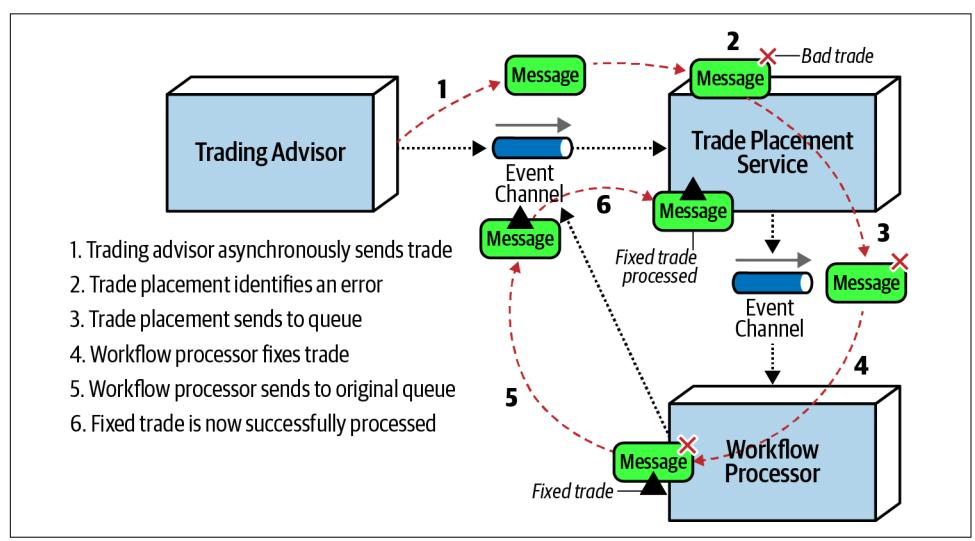

*Figure 14-15. Error handling with the workflow event pattern*

One of the consequences of the workflow event pattern is that messages in error are processed out of sequence when they are resubmitted. In our trading example, the order of messages matters, because all trades within a given account must be pro‐ cessed in order (for example, a SELL for IBM must occur before a BUY for AAPL within the same brokerage account). Although not impossible, it is a complex task to maintain message order within a given context (in this case the brokerage account number). One way this can be addressed is by the Trade Placement service queueing and storing the account number of the trade in error. Any trade with that same account number would be stored in a temporary queue for later processing (in FIFO order). Once the trade originally in error is fixed and processed, the Trade Place ment service then de-queues the remaining trades for that same account and pro‐ cesses them in order.

<span id="page-220-0"></span>
## Preventing Data Loss

Data loss is always a primary concern when dealing with asynchronous communica‐ tions. Unfortunately, there are many places for data loss to occur within an eventdriven architecture. By data loss we mean a message getting dropped or never making it to its final destination. Fortunately, there are basic out-of-the-box techniques that can be leveraged to prevent data loss when using asynchronous messaging.

To illustrate the issues associated with data loss within event-driven architecture, sup‐ pose Event Processor A asynchronously sends a message to a queue. Event Processor B accepts the message and inserts the data within the message into a data‐ base. As illustrated in Figure 14-16, three areas of data loss can occur within this typi‐ cal scenario:

- 1. The message never makes it to the queue from Event Processor A; or even if it does, the broker goes down before the next event processor can retrieve the message.
- 2. Event Processor B de-queues the next available message and crashes before it can process the event.
- 3. Event Processor B is unable to persist the message to the database due to some data error.

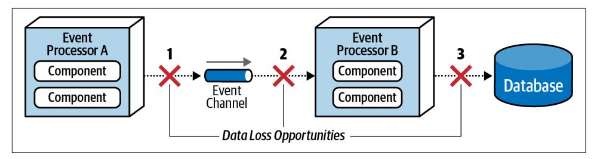

*Figure 14-16. Where data loss can happen within an event-driven architecture*

Each of these areas of data loss can be mitigated through basic messaging techniques. Issue 1 (the message never makes it to the queue) is easily solved by leveraging persis‐ tent message queues, along with something called *synchronous send*. Persisted mes‐ sage queues support what is known as guaranteed delivery. When the message broker receives the message, it not only stores it in memory for fast retrieval, but also persists the message in some sort of physical data store (such as a filesystem or database). If the message broker goes down, the message is physically stored on disk so that when the message broker comes back up, the message is available for processing. Synchro‐ nous send does a blocking wait in the message producer until the broker has acknowledged that the message has been persisted. With these two basic techniques

<span id="page-221-0"></span>there is no way to lose a message between the event producer and the queue because the message is either still with the message producer or persisted within the queue.

Issue 2 (Event Processor B de-queues the next available message and crashes before it can process the event) can also be solved using a basic technique of messaging called *client acknowledge mode*. By default, when a message is de-queued, it is imme‐ diately removed from the queue (something called *auto acknowledge* mode). Client acknowledge mode keeps the message in the queue and attaches the client ID to the message so that no other consumers can read the message. With this mode, if Event Processor B crashes, the message is still preserved in the queue, preventing message loss in this part of the message flow.

Issue 3 (Event Processor B is unable to persist the message to the database due to some data error) is addressed through leveraging ACID (atomicity, consistency, isola‐ tion, durability) transactions via a database commit. Once the database commit hap‐ pens, the data is guaranteed to be persisted in the database. Leveraging something called *last participant support* (LPS) removes the message from the persisted queue by acknowledging that processing has been completed and that the message has been persisted. This guarantees the message is not lost during the transit from Event Processor A all the way to the database. These techniques are illustrated in Figure 14-17.

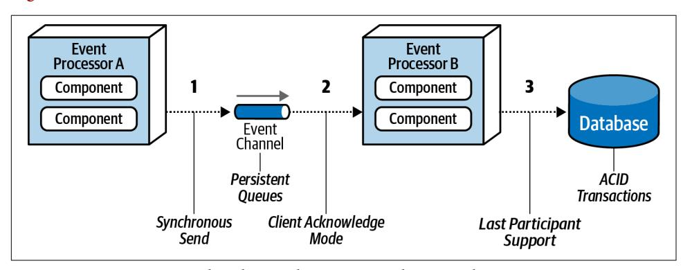

*Figure 14-17. Preventing data loss within an event-driven architecture*

<span id="page-222-0"></span>
## Broadcast Capabilities

One of the other unique characteristics of event-driven architecture is the capability to broadcast events without knowledge of who (if anyone) is receiving the message and what they do with it. This technique, which is illustrated in Figure 14-18, shows that when a producer publishes a message, that same message is received by multiple subscribers.

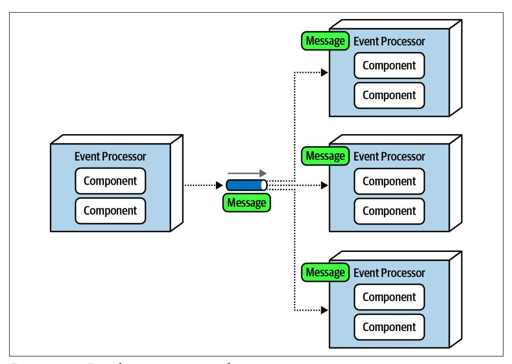

*Figure 14-18. Broadcasting events to other event processors*

Broadcasting is perhaps the highest level of decoupling between event processors because the producer of the broadcast message usually does not know which event processors will be receiving the broadcast message and more importantly, what they will do with the message. Broadcast capabilities are an essential part of patterns for eventual consistency, complex event processing (CEP), and a host of other situations. Consider frequent changes in stock prices for instruments traded on the stock mar‐ ket. Every ticker (the current price of a particular stock) might influence a number of things. However, the service publishing the latest price simply broadcasts it with no knowledge of how that information will be used.

<span id="page-223-0"></span>
## Request-Reply

So far in this chapter we've dealt with asynchronous requests that don't need an immediate response from the event consumer. But what if an order ID is needed when ordering a book? What if a confirmation number is needed when booking a flight? These are examples of communication between services or event processors that require some sort of synchronous communication.

In event-driven architecture, synchronous communication is accomplished through *request-reply* messaging (sometimes referred to as *pseudosynchronous communica‐ tions*). Each event channel within request-reply messaging consists of two queues: a request queue and a reply queue. The initial request for information is asynchro‐ nously sent to the request queue, and then control is returned to the message pro‐ ducer. The message producer then does a blocking wait on the reply queue, waiting for the response. The message consumer receives and processes the message and then sends the response to the reply queue. The event producer then receives the message with the response data. This basic flow is illustrated in Figure 14-19.

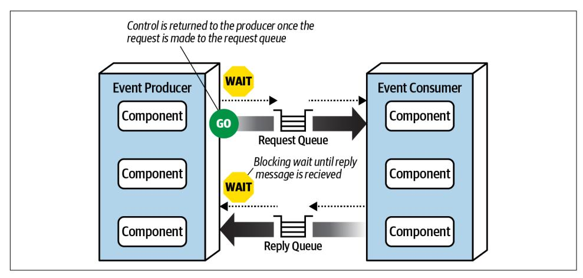

*Figure 14-19. Request-reply message processing*

There are two primary techniques for implementing request-reply messaging. The first (and most common) technique is to use a *correlation ID* contained in the mes‐ sage header. A correlation ID is a field in the reply message that is usually set to the message ID of the original request message. This technique, as illustrated in [Figure 14-20,](#page-224-0) works as follows, with the message ID indicated with ID, and the corre‐ lation ID indicated with CID:

1. The event producer sends a message to the request queue and records the unique message ID (in this case ID 124). Notice that the correlation ID (CID) in this case is null.

- <span id="page-224-0"></span>2. The event producer now does a blocking wait on the reply queue with a message filter (also called a message selector), where the correlation ID in the message header equals the original message ID (in this case 124). Notice there are two messages in the reply queue: message ID 855 with correlation ID 120, and mes‐ sage ID 856 with correlation ID 122. Neither of these messages will be picked up because the correlation ID does not match what the event consumer is looking for (CID 124).
- 3. The event consumer receives the message (ID 124) and processes the request.
- 4. The event consumer creates the reply message containing the response and sets the correlation ID (CID) in the message header to the original message ID (124).
- 5. The event consumer sends the new message (ID 857) to the reply queue.
- 6. The event producer receives the message because the correlation ID (124) matches the message selector from step 2.

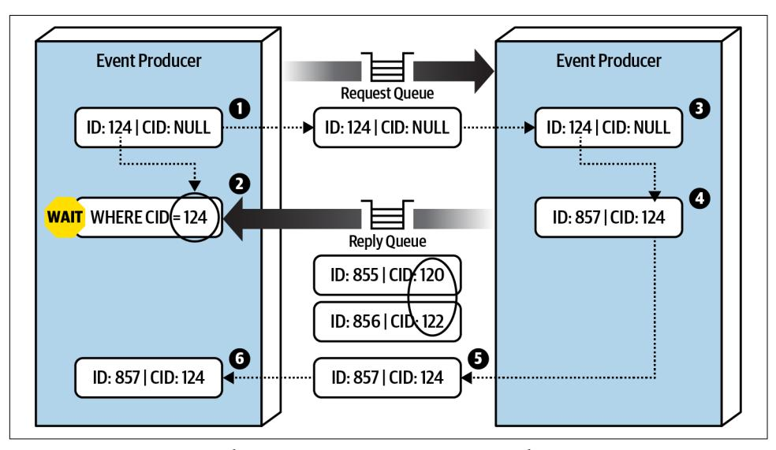

*Figure 14-20. Request-reply message processing using a correlation ID*

The other technique used to implement request-reply messaging is to use a *temporary queue* for the reply queue. A temporary queue is dedicated to the specific request, cre‐ ated when the request is made and deleted when the request ends. This technique, as illustrated in [Figure 14-21,](#page-225-0) does not require a correlation ID because the temporary queue is a dedicated queue only known to the event producer for the specific request. The temporary queue technique works as follows:

1. The event producer creates a temporary queue (or one is automatically created, depending on the message broker) and sends a message to the request queue,

- <span id="page-225-0"></span>passing the name of the temporary queue in the reply-to header (or some other agreed-upon custom attribute in the message header).
- 2. The event producer does a blocking wait on the temporary reply queue. No mes‐ sage selector is needed because any message sent to this queue belongs solely to the event producer that originally sent to the message.
- 3. The event consumer receives the message, processes the request, and sends a response message to the reply queue named in the reply-to header.
- 4. The event processor receives the message and deletes the temporary queue.

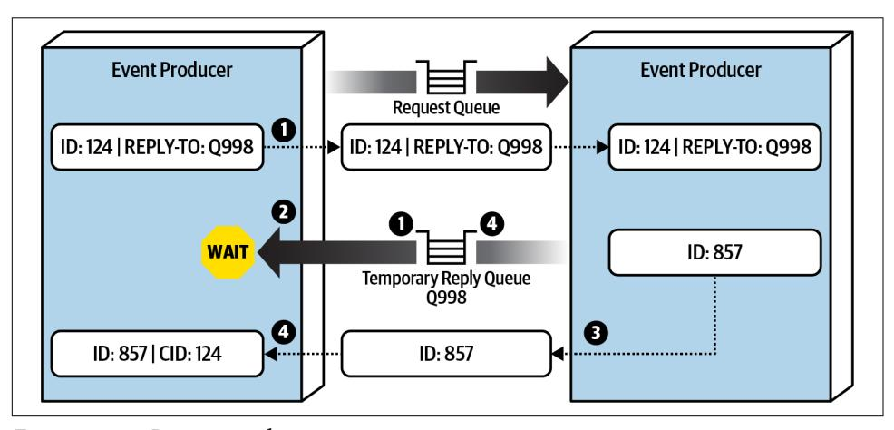

*Figure 14-21. Request-reply message processing using a temporary queue*

While the temporary queue technique is much simpler, the message broker must cre‐ ate a temporary queue for each request made and then delete it immediately after‐ ward. Large messaging volumes can significantly slow down the message broker and impact overall performance and responsiveness. For this reason we usually recom‐ mend using the correlation ID technique.

## Choosing Between Request-Based and Event-Based

The request-based model and event-based model are both viable approaches for designing software systems. However, choosing the right model is essential to the overall success of the system. We recommend choosing the request-based model for well-structured, data-driven requests (such as retrieving customer profile data) when certainty and control over the workflow is needed. We recommend choosing the event-based model for flexible, action-based events that require high levels of respon‐ siveness and scale, with complex and dynamic user processing.

<span id="page-226-0"></span>Understanding the trade-offs with the event-based model also helps decide which one is the best fit. Table 14-3 lists the advantages and disadvantages of the event-based model of event-driven architecture.

*Table 14-3. Trade-offs of the event-driven model*

| Advantages over request-based            | Trade-offs                                |
|------------------------------------------|-------------------------------------------|
| Better response to dynamic user content  | Only supports eventual consistency        |
| Better scalability and elasticity        | Less control over processing flow         |
| Better agility and change management     | Less certainty over outcome of event flow |
| Better adaptability and extensibility    | Difficult to test and debug               |
| Better responsiveness and performance    |                                           |
| Better real-time decision making         |                                           |
| Better reaction to situational awareness |                                           |

## Hybrid Event-Driven Architectures

While many applications leverage the event-driven architecture style as the primary overarching architecture, in many cases event-driven architecture is used in conjunc‐ tion with other architecture styles, forming what is known as a hybrid architecture. Some common architecture styles that leverage event-driven architecture as part of another architecture style include microservices and space-based architecture. Other hybrids that are possible include an event-driven microkernel architecture and an event-driven pipeline architecture.

Adding event-driven architecture to any architecture style helps remove bottlenecks, provides a back pressure point in the event requests get backed up, and provides a level of user responsiveness not found in other architecture styles. Both microservices and space-based architecture leverage messaging for data pumps, asynchronously sending data to another processor that in turn updates data in a database. Both also leverage event-driven architecture to provide a level of programmatic scalability to services in a microservices architecture and processing units in a space-based archi‐ tecture when using messaging for interservice communication.

## Architecture Characteristics Ratings

A one-star rating in the characteristics ratings table in [Figure 14-22](#page-227-0) means the spe‐ cific architecture characteristic isn't well supported in the architecture, whereas a fivestar rating means the architecture characteristic is one of the strongest features in the architecture style. The definition for each characteristic identified in the scorecard can be found in [Chapter 4](009-chapter-4-architecture-characteristics-defined.md#page-74-0).

<span id="page-227-0"></span>Event-driven architecture is primarily a technically partitioned architecture in that any particular domain is spread across multiple event processors and tied together through mediators, queues, and topics. Changes to a particular domain usually impact many event processors, mediators, and other messaging artifacts, hence why event-driven architecture is not domain partitioned.

| Architecture characteristic | Star rating Star rating |
|-----------------------------|-------------------------|
| Partitioning type           | Technical               |
| Number of quanta            | 1 to many               |
| Deployability               | <b>☆☆☆</b>              |
| Elasticity                  | <b>☆☆☆</b>              |
| Evolutionary                | ***                     |
| Fault tolerance             | ***                     |
| Modularity                  | <b>☆☆☆☆</b>             |
| Overall cost                | <b>☆☆☆</b>              |
| Performance                 | ****                    |
| Reliability                 | <b>☆☆☆</b>              |
| Scalability                 | ***                     |
| Simplicity                  | <b>☆</b>                |
| Testability                 | <b>☆☆</b>               |

*Figure 14-22. Event-driven architecture characteristics ratings*

The number of quanta within event-driven architecture can vary from one to many quanta, which is usually based on the database interactions within each event processor and request-reply processing. Even though all communication in an eventdriven architecture is asynchronous, if multiple event processors share a single data‐ base instance, they would all be contained within the same architectural quantum. The same is true for request-reply processing: even though the communication is still asynchronous between the event processors, if a request is needed right away from the event consumer, it ties those event processors together synchronously; hence they belong to the same quantum.

<span id="page-228-0"></span>To illustrate this point, consider the example where one event processor sends a request to another event processor to place an order. The first event processor must wait for an order ID from the other event processor to continue. If the second event processor that places the order and generates an order ID is down, the first event pro‐ cessor cannot continue. Therefore, they are part of the same architecture quantum and share the same architectural characteristics, even though they are both sending and receiving asynchronous messages.

Event-driven architecture gains five stars for performance, scalability, and fault toler‐ ance, the primary strengths of this architecture style. High performance is achieved through asynchronous communications combined with highly parallel processing. High scalability is realized through the programmatic load balancing of event pro‐ cessors (also called *competing consumers*). As the request load increases, additional event processors can be programmatically added to handle the additional requests. Fault tolerance is achieved through highly decoupled and asynchronous event pro‐ cessors that provide eventual consistency and eventual processing of event workflows. Providing the user interface or an event processor making a request does not need an immediate response, promises and futures can be leveraged to process the event at a later time if other downstream processors are not available.

Overall *simplicity* and *testability* rate relatively low with event-driven architecture, mostly due to the nondeterministic and dynamic event flows typically found within this architecture style. While deterministic flows within the request-based model are relatively easy to test because the paths and outcomes are generally known, such is not the case with the event-driven model. Sometimes it is not known how event pro‐ cessors will react to dynamic events, and what messages they might produce. These "event tree diagrams" can be extremely complex, generating hundreds to even thou‐ sands of scenarios, making it very difficult to govern and test.

Finally, event-driven architectures are highly evolutionary, hence the five-star rating. Adding new features through existing or new event processors is relatively straight‐ forward, particularly in the broker topology. By providing hooks via published mes‐ sages in the broker topology, the data is already made available, hence no changes are required in the infrastructure or existing event processors to add that new functionality.
