<span id="page-230-0"></span>
# Chapter 15: Space-Based Architecture Style

Most web-based business applications follow the same general request flow: a request from a browser hits the web server, then an application server, then finally the data‐ base server. While this pattern works great for a small set of users, bottlenecks start appearing as the user load increases, first at the web-server layer, then at the application-server layer, and finally at the database-server layer. The usual response to bottlenecks based on an increase in user load is to scale out the web servers. This is relatively easy and inexpensive, and it sometimes works to address the bottleneck issues. However, in most cases of high user load, scaling out the web-server layer just moves the bottleneck down to the application server. Scaling application servers can be more complex and expensive than web servers and usually just moves the bottle‐ neck down to the database server, which is even more difficult and expensive to scale. Even if you can scale the database, what you eventually end up with is a triangleshaped topology, with the widest part of the triangle being the web servers (easiest to scale) and the smallest part being the database (hardest to scale), as illustrated in [Figure 15-1](#page-231-0).

In any high-volume application with a large concurrent user load, the database will usually be the final limiting factor in how many transactions you can process concur‐ rently. While various caching technologies and database scaling products help to address these issues, the fact remains that scaling out a normal application for extreme loads is a very difficult proposition.

<span id="page-231-0"></span>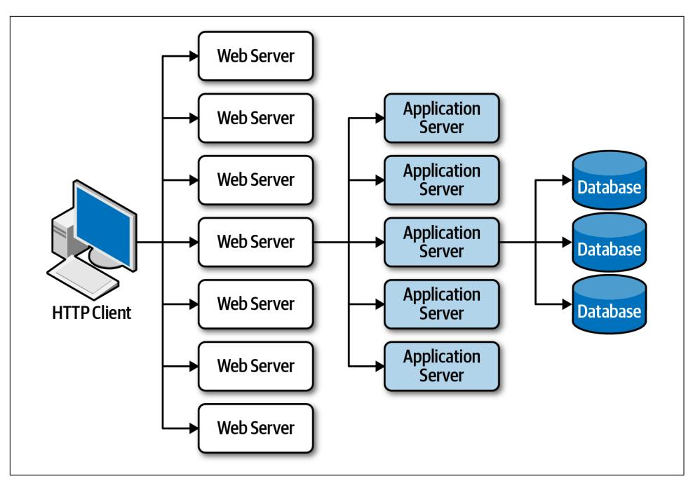

*Figure 15-1. Scalability limits within a traditional web-based topology*

The *space-based* architecture style is specifically designed to address problems involv‐ ing high scalability, elasticity, and high concurrency issues. It is also a useful architec‐ ture style for applications that have variable and unpredictable concurrent user volumes. Solving the extreme and variable scalability issue architecturally is often a better approach than trying to scale out a database or retrofit caching technologies into a nonscalable architecture.

## General Topology

Space-based architecture gets its name from the concept of *[tuple space](https://oreil.ly/XVJ_D)*, the technique of using multiple parallel processors communicating through shared memory. High scalability, high elasticity, and high performance are achieved by removing the central database as a synchronous constraint in the system and instead leveraging replicated in-memory data grids. Application data is kept in-memory and replicated among all the active processing units. When a processing unit updates data, it asynchronously sends that data to the database, usually via messaging with persistent queues. Process‐ ing units start up and shut down dynamically as user load increases and decreases, thereby addressing variable scalability. Because there is no central database involved in the standard transactional processing of the application, the database bottleneck is removed, thus providing near-infinite scalability within the application.

<span id="page-232-0"></span>There are several architecture components that make up a space-based architecture: a *processing unit* containing the application code, *virtualized middleware* used to man‐ age and coordinate the processing units, *data pumps* to asynchronously send updated data to the database, *data writers* that perform the updates from the data pumps, and *data readers* that read database data and deliver it to processing units upon startup. Figure 15-2 illustrates these primary architecture components.

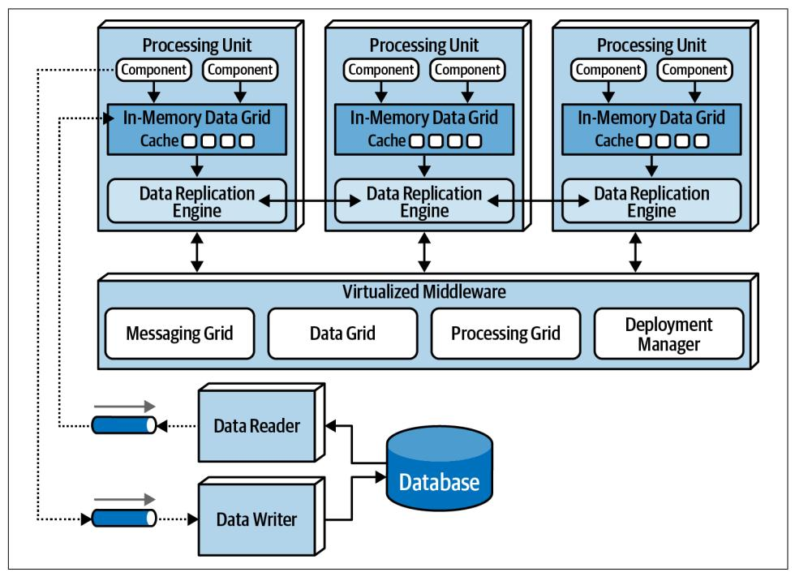

*Figure 15-2. Space-based architecture basic topology*

## Processing Unit

The processing unit (illustrated in [Figure 15-3](#page-233-0)) contains the application logic (or por‐ tions of the application logic). This usually includes web-based components as well as backend business logic. The contents of the processing unit vary based on the type of application. Smaller web-based applications would likely be deployed into a single processing unit, whereas larger applications may split the application functionality into multiple processing units based on the functional areas of the application. The processing unit can also contain small, single-purpose services (as with microservi‐ ces). In addition to the application logic, the processing unit also contains an inmemory data grid and replication engine usually implemented through such products as [Hazelcast,](https://hazelcast.com) [Apache Ignite,](https://ignite.apache.org) and [Oracle Coherence](https://oreil.ly/XOUJL).

<span id="page-233-0"></span>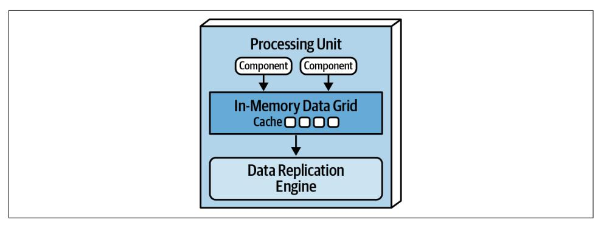

*Figure 15-3. Processing unit*

## Virtualized Middleware

The virtualized middleware handles the infrastructure concerns within the architec‐ ture that control various aspects of data synchronization and request handling. The components that make up the virtualized middleware include a *messaging grid*, *data grid*, *processing grid*, and *deployment manager*. These components, which are described in detail in the next sections, can be custom written or purchased as thirdparty products.

### Messaging grid

The messaging grid, shown in [Figure 15-4,](#page-234-0) manages input request and session state. When a request comes into the virtualized middleware, the messaging grid compo‐ nent determines which active processing components are available to receive the request and forwards the request to one of those processing units. The complexity of the messaging grid can range from a simple round-robin algorithm to a more com‐ plex next-available algorithm that keeps track of which request is being processed by which processing unit. This component is usually implemented using a typical web server with load-balancing capabilities (such as HA Proxy and Nginx).

<span id="page-234-0"></span>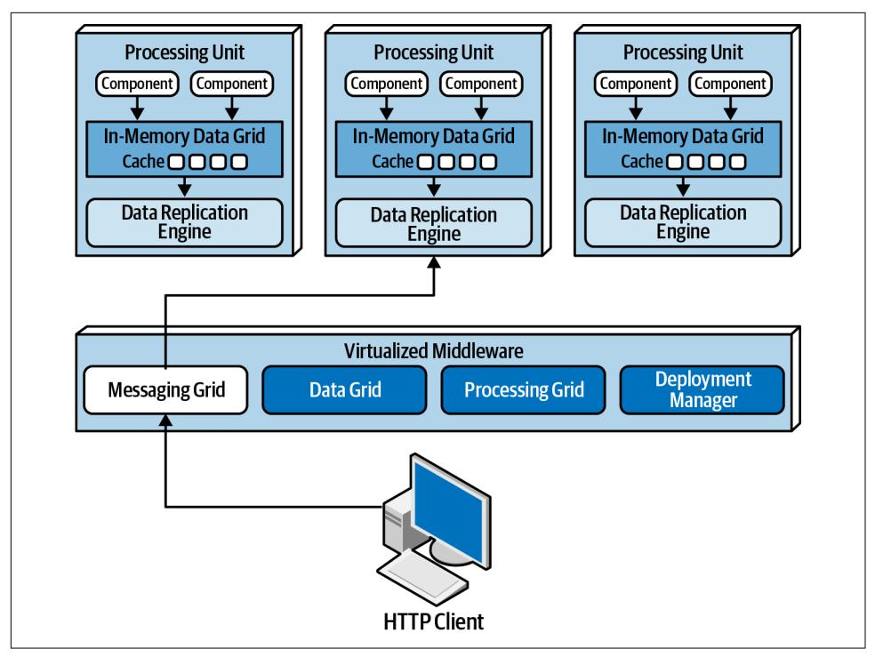

*Figure 15-4. Messaging grid*

#### Data grid

The data grid component is perhaps the most important and crucial component in this architecture style. In most modern implementations the data grid is implemented solely within the processing units as a replicated cache. However, for those replicated caching implementations that require an external controller, or when using a dis‐ tributed cache, this functionality would reside in both the processing units as well as in the data grid component within the virtualized middleware. Since the messaging grid can forward a request to any of the processing units available, it is essential that each processing unit contains exactly the same data in its in-memory data grid. Although [Figure 15-5](#page-235-0) shows a synchronous data replication between processing units, in reality this is done asynchronously and very quickly, usually completing the data synchronization in less than 100 milliseconds.

<span id="page-235-0"></span>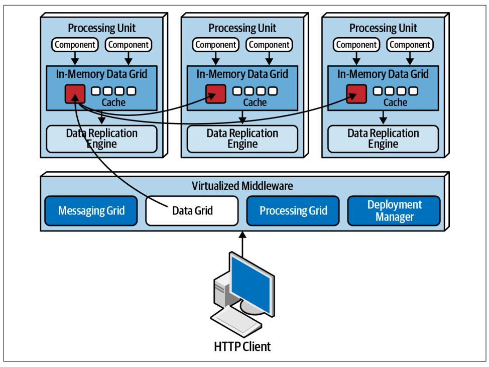

*Figure 15-5. Data grid*

Data is synchronized between processing units that contain the same named data grid. To illustrate this point, consider the following code in Java using Hazelcast that creates an internal replicated data grid for processing units containing customer pro‐ file information:

```
HazelcastInstance hz = Hazelcast.newHazelcastInstance();
Map<String, CustomerProfile> profileCache =
        hz.getReplicatedMap("CustomerProfile");
```

All processing units needing access to the customer profile information would con‐ tain this code. Changes made to the CustomerProfile named cache from any of the processing units would have that change replicated to all other processing units con‐ taining that same named cache. A processing unit can contain as many replicated caches as needed to complete its work. Alternatively, one processing unit can make a remote call to another processing unit to ask for data (choreography) or leverage the processing grid (described in the next section) to orchestrate the request.

<span id="page-236-0"></span>Data replication within the processing units also allows service instances to come up and down without having to read data from the database, providing there is at least one instance containing the named replicated cache. When a processing unit instance comes up, it connects to the cache provider (such as Hazelcast) and makes a request to get the named cache. Once the connection is made to the other processing units, the cache will be loaded from one of the other instances.

Each processing unit knows about all other processing unit instances through the use of a *member list*. The member list contains the IP address and ports of all other pro‐ cessing units using that same named cache. For example, suppose there is a single processing instance containing code and replicated cached data for the customer pro‐ file. In this case there is only one instance, so the member list for that instance only contains itself, as illustrated in the following logging statements generated using Hazelcast:

```
Instance 1:
Members {size:1, ver:1} [
 Member [172.19.248.89]:5701 - 04a6f863-dfce-41e5-9d51-9f4e356ef268 this
]
```

When another processing unit starts up with the same named cache, the member list of both services is updated to reflect the IP address and port of each processing unit:

```
Instance 1:
Members {size:2, ver:2} [
 Member [172.19.248.89]:5701 - 04a6f863-dfce-41e5-9d51-9f4e356ef268 this
 Member [172.19.248.90]:5702 - ea9e4dd5-5cb3-4b27-8fe8-db5cc62c7316
]
Instance 2:
Members {size:2, ver:2} [
 Member [172.19.248.89]:5701 - 04a6f863-dfce-41e5-9d51-9f4e356ef268
 Member [172.19.248.90]:5702 - ea9e4dd5-5cb3-4b27-8fe8-db5cc62c7316 this
]
```

When a third processing unit starts up, the member list of instance 1 and instance 2 are both updated to reflect the new third instance:

```
Instance 1:
Members {size:3, ver:3} [
 Member [172.19.248.89]:5701 - 04a6f863-dfce-41e5-9d51-9f4e356ef268 this
 Member [172.19.248.90]:5702 - ea9e4dd5-5cb3-4b27-8fe8-db5cc62c7316
 Member [172.19.248.91]:5703 - 1623eadf-9cfb-4b83-9983-d80520cef753
Instance 2:
Members {size:3, ver:3} [
 Member [172.19.248.89]:5701 - 04a6f863-dfce-41e5-9d51-9f4e356ef268
 Member [172.19.248.90]:5702 - ea9e4dd5-5cb3-4b27-8fe8-db5cc62c7316 this
 Member [172.19.248.91]:5703 - 1623eadf-9cfb-4b83-9983-d80520cef753
```

```
Instance 3:
Members {size:3, ver:3} [
 Member [172.19.248.89]:5701 - 04a6f863-dfce-41e5-9d51-9f4e356ef268
 Member [172.19.248.90]:5702 - ea9e4dd5-5cb3-4b27-8fe8-db5cc62c7316
 Member [172.19.248.91]:5703 - 1623eadf-9cfb-4b83-9983-d80520cef753 this
]
```

Notice that all three instances know about each other (including themselves). Sup‐ pose instance 1 receives a request to update the customer profile information. When instance 1 updates the cache with a cache.put() or similar cache update method, the data grid (such as Hazelcast) will asynchronously update the other replicated caches with the same update, ensuring all three customer profile caches always remain in sync with one another.

When processing unit instances go down, all other processing units are automatically updated to reflect the lost member. For example, if instance 2 goes down, the member lists of instance 1 and 3 are updated as follows:

```
Instance 1:
Members {size:2, ver:4} [
 Member [172.19.248.89]:5701 - 04a6f863-dfce-41e5-9d51-9f4e356ef268 this
 Member [172.19.248.91]:5703 - 1623eadf-9cfb-4b83-9983-d80520cef753
Instance 3:
Members {size:2, ver:4} [
 Member [172.19.248.89]:5701 - 04a6f863-dfce-41e5-9d51-9f4e356ef268
 Member [172.19.248.91]:5703 - 1623eadf-9cfb-4b83-9983-d80520cef753 this
```

## Processing grid

The processing grid, illustrated in [Figure 15-6](#page-238-0), is an optional component within the virtualized middleware that manages orchestrated request processing when there are multiple processing units involved in a single business request. If a request comes in that requires coordination between processing unit types (e.g., an order processing unit and a payment processing unit), it is the processing grid that mediates and orchestrates the request between those two processing units.

<span id="page-238-0"></span>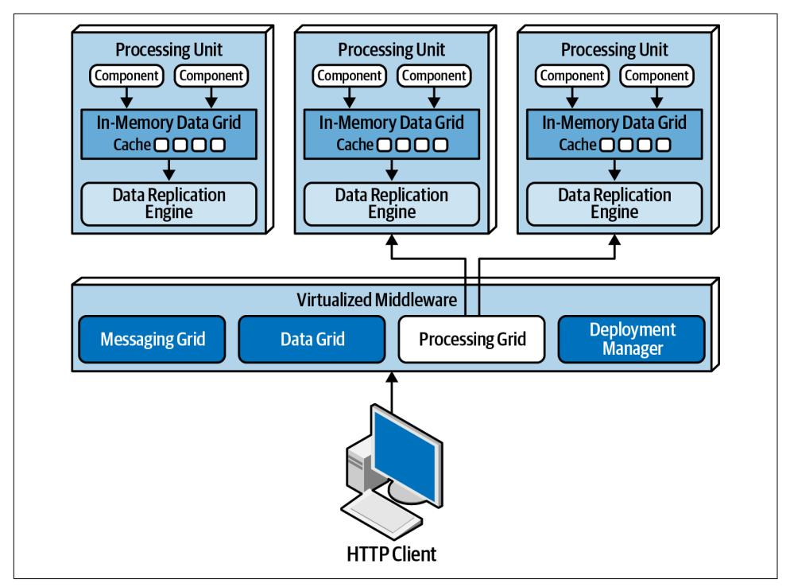

*Figure 15-6. Processing grid*

### Deployment manager

The deployment manager component manages the dynamic startup and shutdown of processing unit instances based on load conditions. This component continually monitors response times and user loads, starts up new processing units when load increases, and shuts down processing units when the load decreases. It is a critical component to achieving variable scalability (elasticity) needs within an application.

## Data Pumps

A *data pump* is a way of sending data to another processor which then updates data in a database. Data pumps are a necessary component within space-based architec‐ ture, as processing units do not directly read from and write to a database. Data pumps within a space-based architecture are always asynchronous, providing even‐ tual consistency with the in-memory cache and the database. When a processing unit instance receives a request and updates its cache, that processing unit becomes the owner of the update and is therefore responsible for sending that update through the data pump so that the database can be updated eventually.

<span id="page-239-0"></span>Data pumps are usually implemented using messaging, as shown in Figure 15-7. Mes‐ saging is a good choice for data pumps when using a space-based architecture. Not only does messaging support asynchronous communication, but it also supports guaranteed delivery and preserving message order through first-in, first-out (FIFO) queueing. Furthermore, messaging provides a decoupling between the processing unit and the data writer so that if the data writer is not available, uninterrupted pro‐ cessing can still take place within the processing units.

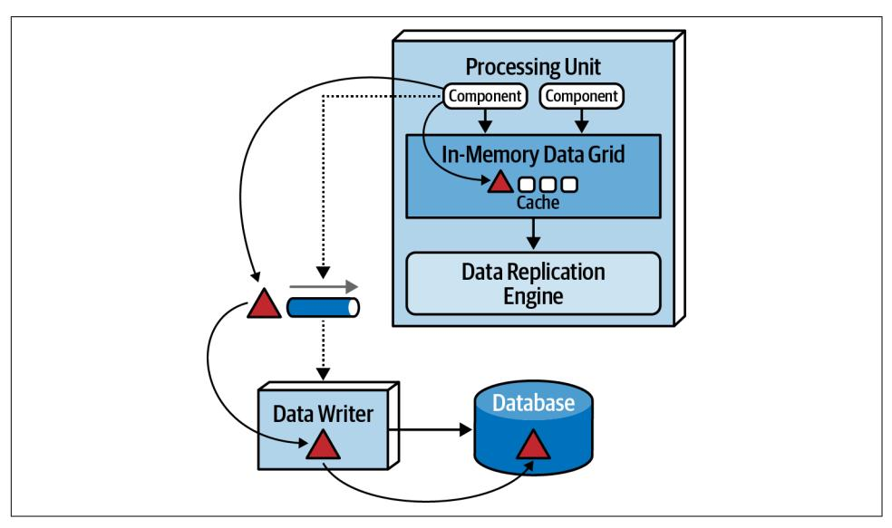

*Figure 15-7. Data pump used to send data to a database*

In most cases there are multiple data pumps, each one usually dedicated to a particu‐ lar domain or subdomain (such as customer or inventory). Data pumps can be dedi‐ cated to each type of cache (such as CustomerProfile, CustomerWishlist, and so on), or they can be dedicated to a processing unit domain (such as Customer) con‐ taining a much larger and general cache.

Data pumps usually have associated contracts, including an action associated with the contract data (add, delete, or update). The contract can be a JSON schema, XML schema, an object, or even a *value-driven message* (map message containing namevalue pairs). For updates, the data contained in the message of the data pump usually only contains the new data values. For example, if a customer changes a phone num‐ ber on their profile, only the new phone number would be sent, along with the cus‐ tomer ID and an action to update the data.

<span id="page-240-0"></span>
## Data Writers

The data writer component accepts messages from a data pump and updates the data‐ base with the information contained in the message of the data pump (see [Figure 15-7\)](#page-239-0). Data writers can be implemented as services, applications, or data hubs (such as [Ab Initio](https://www.abinitio.com/en)). The granularity of the data writers can vary based on the scope of the data pumps and processing units.

A domain-based data writer contains all of the necessary database logic to handle all the updates within a particular domain (such as customer), regardless of the number of data pumps it is accepting. Notice in Figure 15-8 that there are four different pro‐ cessing units and four different data pumps representing the customer domain (Profile, WishList, Wallet, and Preferences) but only one data writer. The single customer data writer listens to all four data pumps and contains the necessary data‐ base logic (such as SQL) to update the customer-related data in the database.

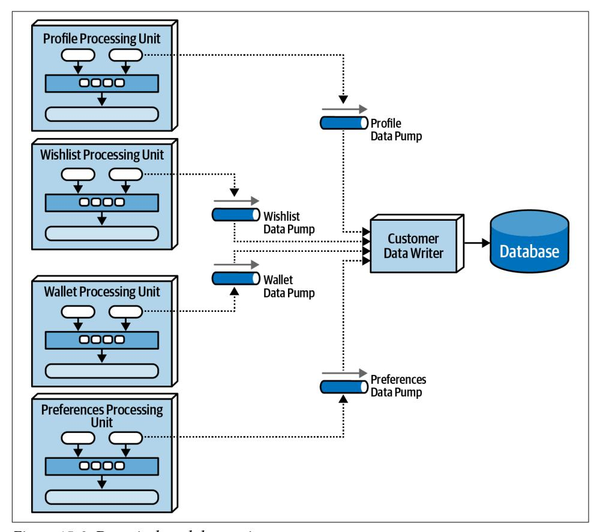

*Figure 15-8. Domain-based data writer*

<span id="page-241-0"></span>Alternatively, each class of processing unit can have its own dedicated data writer component, as illustrated in Figure 15-9. In this model the data writer is dedicated to each corresponding data pump and contains only the database processing logic for that particular processing unit (such as Wallet). While this model tends to produce too many data writer components, it does provide better scalability and agility due to the alignment of processing unit, data pump, and data writer.

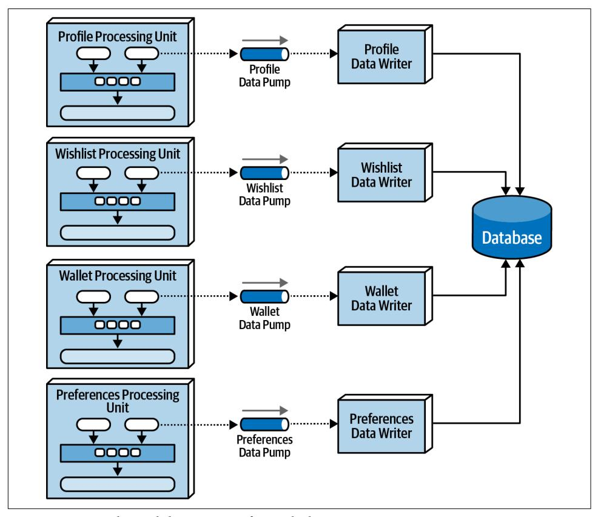

*Figure 15-9. Dedicated data writers for each data pump*

## Data Readers

Whereas data writers take on the responsibility for updating the database, data read‐ ers take on the responsibility for reading data from the database and sending it to the processing units via a reverse data pump. In space-based architecture, data readers are only invoked under one of three situations: a crash of all processing unit instances of the same named cache, a redeployment of all processing units within the same named cache, or retrieving archive data not contained in the replicated cache.

<span id="page-242-0"></span>In the event where all instances come down (due to a system-wide crash or redeploy‐ ment of all instances), data must be read from the database (something that is gener‐ ally avoided in space-based architecture). When instances of a class of processing unit start coming up, each one tries to grab a lock on the cache. The first one to get the lock becomes the temporary cache owner; the others go into a wait state until the lock is released (this might vary based on the type of cache implementation being used, but regardless, there is one primary owner of the cache in this scenario). To load the cache, the instance that gained temporary cache owner status sends a message to a queue requesting data. The data reader component accepts the read request and then performs the necessary database query logic to retrieve the data needed by the pro‐ cessing unit. As the data reader queries data from the database, it sends that data to a different queue (called a reverse data pump). The temporary cache owner processing unit receives the data from the reverse data pump and loads the cache. Once all the data is loaded, the temporary owner releases the lock on the cache, all other instances are then synchronized, and processing can begin. This processing flow is illustrated in Figure 15-10.

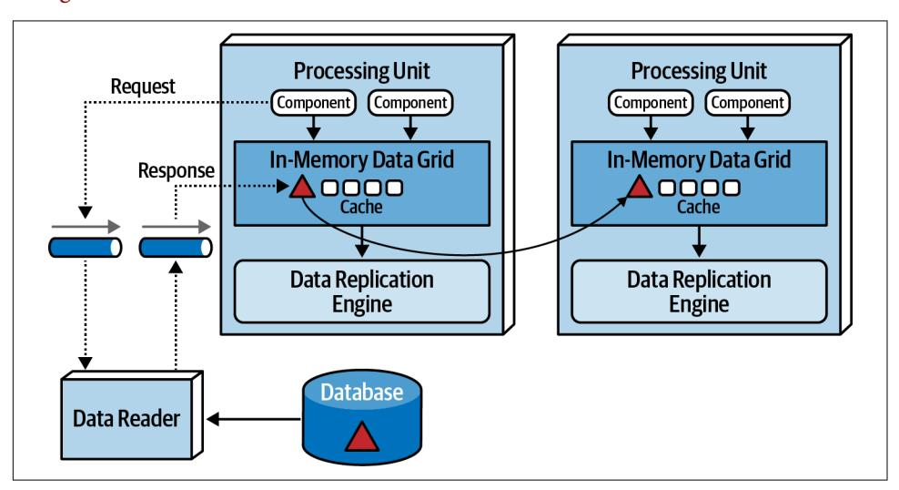

*Figure 15-10. Data reader with reverse data pump*

Like data writers, data readers can also be domain-based or dedicated to a specific class of processing unit (which is usually the case). The implementation is also the same as the data writers—either service, application, or data hub.

The data writers and data readers essentially form what is usually known as a *data abstraction layer* (or *data access layer* in some cases). The difference between the two is in the amount of detailed knowledge the processing units have with regard to the structure of the tables (or schema) in the database. A data access layer means that the processing units are coupled to the underlying data structures in the database, and <span id="page-243-0"></span>only use the data readers and writers to indirectly access the database. A data abstrac‐ tion layer, on the other hand, means that the processing unit is decoupled from the underlying database table structures through separate contracts. Space-based archi‐ tecture generally relies on a data abstraction layer model so that the replicated cache schema in each processing unit can be different than the underlying database table structures. This allows for incremental changes to the database without necessarily impacting the processing units. To facilitate this incremental change, the data writers and data readers contain transformation logic so that if a column type changes or a column or table is dropped, the data readers and data writers can buffer the database change until the necessary changes can be made to the processing unit caches.

## Data Collisions

When using replicated caching in an active/active state where updates can occur to any service instance containing the same named cache, there is the possibility of a *data collision* due to replication latency. A data collision occurs when data is updated in one cache instance (cache A), and during replication to another cache instance (cache B), the same data is updated by that cache (cache B). In this scenario, the local update to cache B will be overridden through replication by the old data from cache A, and through replication the same data in cache A will be overridden by the update from cache B.

To illustrate this problem, assume there are two service instances (Service A and Ser‐ vice B) containing a replicated cache of product inventory. The following flow dem‐ onstrates the data collision problem:

- The current inventory count for blue widgets is 500 units
- Service A updates the inventory cache for blue widgets to 490 units (10 sold)
- During replication, Service B updates the inventory cache for blue widgets to 495 units (5 sold)
- The Service B cache gets updated to 490 units due to replication from Service A update
- The Service A cache gets updates to 495 units due to replication from Service B update
- Both caches in Service A and B are incorrect and out of sync (inventory should be 485 units)

There are several factors that influence how many data collisions might occur: the number of processing unit instances containing the same cache, the update rate of the cache, the cache size, and finally the replication latency of the caching product. The formula used to determine probabilistically how many potential data collisions might occur based on these factors is as follows:

<span id="page-244-0"></span>
$$CollisionRate = N * \frac{UR^2}{S} * RL$$

where *N* represents the number of service instances using the same named cache, *UR* represents the update rate in milliseconds (squared), *S* the cache size (in terms of number of rows), and *RL* the replication latency of the caching product.

This formula is useful for determining the percentage of data collisions that will likely occur and hence the feasibility of the use of replicated caching. For example, consider the following values for the factors involved in this calculation:

Update rate (UR): 20 updates/second

Number of instances (N): 5

Cache size (S): 50,000 rows Replication latency (RL): 100 milliseconds Updates: 72,000 per hour Collision rate: 14.4 per hour Percentage: 0.02%

Applying these factors to the formula yields 72,000 updates and hour, with a high probability that 14 updates to the same data may collide. Given the low percentage (0.02%), replication would be a viable option.

Varying the replication latency has a significant impact on the consistency of data. Replication latency depends on many factors, including the type of network and the physical distance between processing units. For this reason replication latency values are rarely published and must be calculated and derived from actual measurements in a production environment. The value used in the prior example (100 milliseconds) is a good planning number if the actual replication latency, a value we frequently use to determine the number of data collisions, is not available. For example, changing the replication latency from 100 milliseconds to 1 millisecond yields the same number of updates (72,000 per hour) but produces only the probability of 0.1 collisions per hour! This scenario is shown in the following table:

Update rate (UR): 20 updates/second

Number of instances (N): 5

Cache size (S): 50,000 rows

Replication latency (RL): 1 millisecond (changed from 100)

Updates: 72,000 per hour Collision rate: 0.1 per hour Percentage: 0.0002%

<span id="page-245-0"></span>The number of processing units containing the same named cache (as represented through the *number of instances* factor) also has a direct proportional relationship to the number of data collisions possible. For example, reducing the number of process‐ ing units from 5 instances to 2 instances yields a data collision rate of only 6 per hour out of 72,000 updates per hour:

Update rate (UR): 20 updates/second Number of instances (N): 2 (changed from 5) Cache size (S): 50,000 rows Replication latency (RL): 100 milliseconds Updates: 72,000 per hour Collision rate: 5.8 per hour Percentage: 0.008%

The cache size is the only factor that is inversely proportional to the collision rate. As the cache size decreases, collision rates increase. In our example, reducing the cache size from 50,000 rows to 10,000 rows (and keeping everything the same as in the first example) yields a collision rate of 72 per hour, significantly higher than with 50,000 rows:

Update rate (UR): 20 updates/second

Number of instances (N): 5

Cache size (S): 10,000 rows (changed from 50,000)

Replication latency (RL): 100 milliseconds Updates: 72,000 per hour Collision rate: 72.0 per hour Percentage: 0.1%

Under normal circumstances, most systems do not have consistent update rates over such a long period of time. As such, when using this calculation it is helpful to under‐ stand the maximum update rate during peak usage and calculate minimum, normal, and peak collision rates.

## Cloud Versus On-Premises Implementations

Space-based architecture offers some unique options when it comes to the environ‐ ments in which it is deployed. The entire topology, including the processing units, virtualized middleware, data pumps, data readers and writers, and the database, can be deployed within cloud-based environments on-premises ("on-prem"). However, this architecture style can also be deployed between these environments, offering a unique feature not found in other architecture styles.

<span id="page-246-0"></span>A powerful feature of this architecture style (as illustrated in Figure 15-11) is to deploy applications via processing units and virtualized middleware in managed cloud-based environments while keeping the physical databases and corresponding data on-prem. This topology supports very effective cloud-based data synchroniza‐ tion due to the asynchronous data pumps and eventual consistency model of this architecture style. Transactional processing can occur on dynamic and elastic cloudbased environments while preserving physical data management, reporting, and data analytics within secure and local on-prem environments.

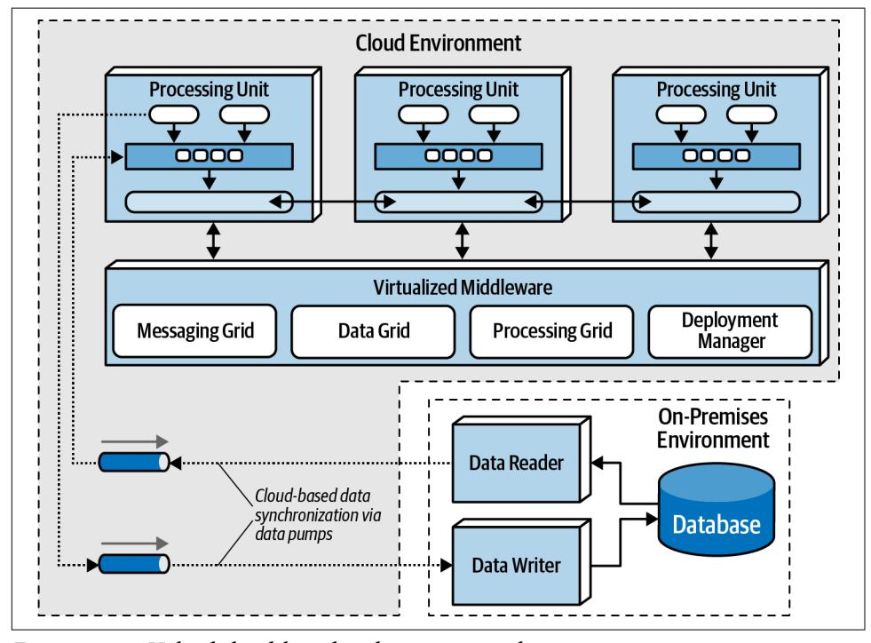

*Figure 15-11. Hybrid cloud-based and on-prem topology*

## Replicated Versus Distributed Caching

Space-based architecture relies on caching for the transactional processing of an application. Removing the need for direct reads and writes to a database is how space-based architecture is able to support high scalability, high elasticity, and high performance. Space-based architecture mostly relies on replicated caching, although distributed caching can be used as well.

With replicated caching, as illustrated in [Figure 15-12,](#page-247-0) each processing unit contains its own in-memory data grid that is synchronized between all processing units using that same named cache. When an update occurs to a cache within any of the process‐

<span id="page-247-0"></span>ing units, the other processing units are automatically updated with the new information.

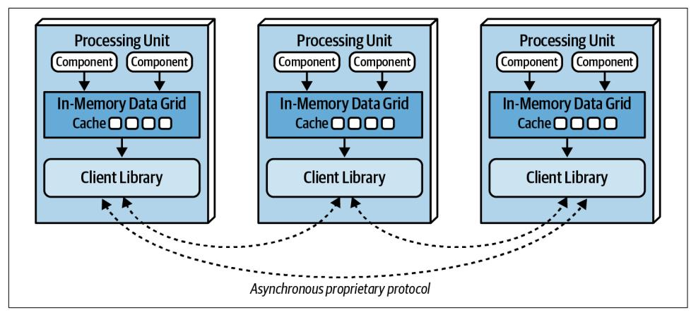

*Figure 15-12. Replicated caching between processing units*

Replicated caching is not only extremely fast, but it also supports high levels of fault tolerance. Since there is no central server holding the cache, replicated caching does not have a single point of failure. There may be exceptions to this rule, however, based on the implementation of the caching product used. Some caching products require the presence of an external controller to monitor and control the replication of data between processing units, but most product companies are moving away from this model.

While replicated caching is the standard caching model for space-based architecture, there are some cases where it is not possible to use replicated caching. These situa‐ tions include high data volumes (size of the cache) and high update rates to the cache data. Internal memory caches in excess of 100 MB might start to cause issues with regard to elasticity and high scalability due to the amount of memory used by each processing unit. Processing units are generally deployed within a virtual machine (or in some cases represent the virtual machine). Each virtual machine only has a certain amount of memory available for internal cache usage, limiting the number of pro‐ cessing unit instances that can be started to process high-throughput situations. Fur‐ thermore, as shown in ["Data Collisions" on page 224,](#page-243-0) if the update rate of the cache data is too high, the data grid might be unable to keep up with that high update rate to ensure data consistency across all processing unit instances. When these situations occur, distributed caching can be used.

Distributed caching, as illustrated in [Figure 15-13,](#page-248-0) requires an external server or ser‐ vice dedicated to holding a centralized cache. In this model the processing units do not store data in internal memory, but rather use a proprietary protocol to access the data from the central cache server. Distributed caching supports high levels of data

<span id="page-248-0"></span>consistency because the data is all in one place and does not need to be replicated. However, this model has less performance than replicated caching because the cache data must be accessed remotely, adding to the overall latency of the system. Fault tol‐ erance is also an issue with distributed caching. If the cache server containing the data goes down, no data can be accessed or updated from any of the processing units, rendering them nonoperational. Fault tolerance can be mitigated by mirroring the distributed cache, but this could present consistency issues if the primary cache server goes down unexpectedly and the data does not make it to the mirrored cache server.

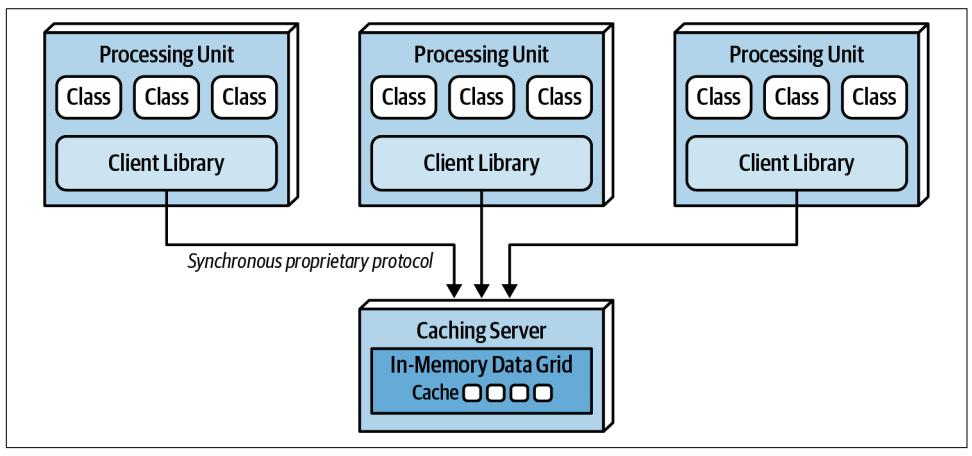

*Figure 15-13. Distributed caching between processing units*

When the size of the cache is relatively small (under 100 MB) and the update rate of the cache is low enough that the replication engine of the caching product can keep up with the cache updates, the decision between using a replicated cache and a dis‐ tributed cache becomes one of data consistency versus performance and fault toler‐ ance. A distributed cache will always offer better data consistency over a replicated cache because the cache of data is in a single place (as opposed to being spread across multiple processing units). However, performance and fault tolerance will always be better when using a replicated cache. Many times this decision comes down to the type of data being cached in the processing units. The need for highly consistent data (such as inventory counts of the available products) usually warrants a distributed cache, whereas data that does not change often (such as reference data like name/ value pairs, product codes, and product descriptions) usually warrants a replicated cache for quick lookup. Some of the selection criteria that can be used as a guide for choosing when to use a distributed cache versus a replicated cache are listed in [Table 15-1.](#page-249-0)

<span id="page-249-0"></span>*Table 15-1. Distributed versus replicated caching*

| Decision criteria | Replicated cache  | Distributed cache |
|-------------------|-------------------|-------------------|
| Optimization      | Performance       | Consistency       |
| Cache size        | Small (<100 MB)   | Large (>500 MB)   |
| Type of data      | Relatively static | Highly dynamic    |
| Update frequency  | Relatively low    | High update rate  |
| Fault tolerance   | High              | Low               |

When choosing the type of caching model to use with space-based architecture, remember that in most cases *both* models will be applicable within any given applica‐ tion context. In other words, neither replicated caching nor distributed caching solve every problem. Rather than trying to seek compromises through a single consistent caching model across the application, leverage each for its strengths. For example, for a processing unit that maintains the current inventory, choose a distributed caching model for data consistency; for a processing unit that maintains the customer profile, choose a replicated cache for performance and fault tolerance.

## Near-Cache Considerations

A *near-cache* is a type of caching hybrid model bridging in-memory data grids with a distributed cache. In this model (illustrated in [Figure 15-14](#page-250-0)) the distributed cache is referred to as the *full backing cache*, and each in-memory data grid contained within each processing unit is referred to as the *front cache*. The front cache always contains a smaller subset of the full backing cache, and it leverages an *eviction policy* to remove older items so that newer ones can be added. The front cache can be what is known as a most recently used (MRU) cache containing the most recently used items or a most frequently used (MFU) cache containing the most frequently used items. Alterna‐ tively, a *random replacement* eviction policy can be used in the front cache so that items are removed in a random manner when space is needed to add a new item. Random replacement (RR) is a good eviction policy when there is no clear analysis of the data with regard to keeping either the latest used versus the most frequently used.

<span id="page-250-0"></span>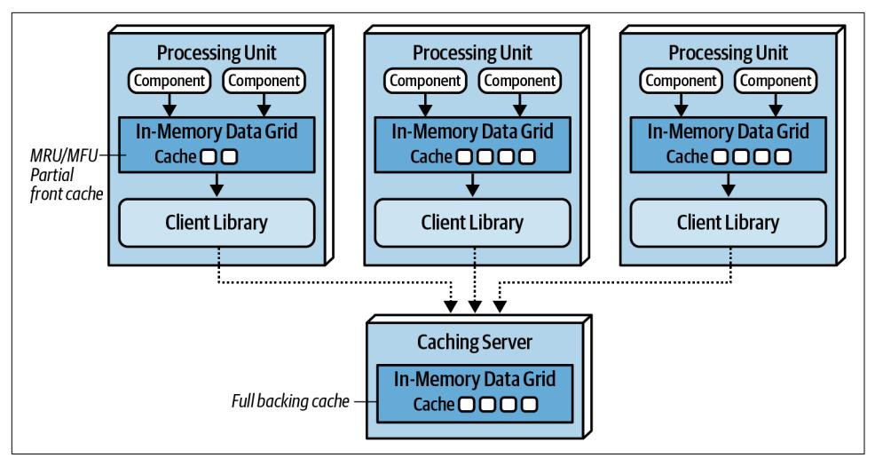

*Figure 15-14. Near-cache topology*

While the front caches are always kept in sync with the full backing cache, the front caches contained within each processing unit are not synchronized between other processing units sharing the same data. This means that multiple processing units sharing the same data context (such as a customer profile) will likely all have different data in their front cache. This creates inconsistencies in performance and responsive‐ ness between processing units because each processing unit contains different data in the front cache. For this reason we do not recommended using a near-cache model for space-based architecture.

## Implementation Examples

Space-based architecture is well suited for applications that experience high spikes in user or request volume and applications that have throughput in excess of 10,000 concurrent users. Examples of space-based architecture include applications like online concert ticketing systems and online auction systems. Both of these examples require high performance, high scalability, and high levels of elasticity.

## Concert Ticketing System

Concert ticketing systems have a unique problem domain in that concurrent user volume is relatively low until a popular concert is announced. Once concert tickets go on sale, user volumes usually spike from several hundred concurrent users to several thousand (possibly in the tens of thousands, depending on the concert), all trying to acquire a ticket for the concert (hopefully, good seats!). Tickets usually sell out in a matter of minutes, requiring the kind of architecture characteristics supported by space-based architecture.

<span id="page-251-0"></span>There are many challenges associated with this sort of system. First, there are only a certain number of tickets available, regardless of the seating preferences. Seating availability must continually be updated and made available as fast as possible given the high number of concurrent requests. Also, assuming assigned seats are an option, seating availability must also be updated as fast as possible. Continually accessing a central database synchronously for this sort of system would likely not work—it would be very difficult for a typical database to handle tens of thousands of concur‐ rent requests through standard database transactions at this level of scale and update frequency.

Space-based architecture would be a good fit for a concert ticketing system due to the high elasticity requirements required of this type of application. An instantaneous increase in the number of concurrent users wanting to purchase concert tickets would be immediately recognized by the *deployment manager*, which in turn would start up a large number of processing units to handle the large volume of requests. Optimally, the deployment manager would be configured to start up the necessary number of processing units shortly *before* the tickets went on sale, therefore having those instances on standby right before the significant increase in user load.

## Online Auction System

Online auction systems (bidding on items within an auction) share the same sort of characteristics as the online concert ticketing systems described previously—both require high levels of performance and elasticity, and both have unpredictable spikes in user and request load. When an auction starts, there is no way of determining how many people will be joining the auction, and of those people, how many concurrent bids will occur for each asking price.

Space-based architecture is well suited for this type of problem domain in that multi‐ ple processing units can be started as the load increases; and as the auction winds down, unused processing units could be destroyed. Individual processing units can be devoted to each auction, ensuring consistency with bidding data. Also, due to the asynchronous nature of the data pumps, bidding data can be sent to other processing (such as bid history, bid analytics, and auditing) without much latency, therefore increasing the overall performance of the bidding process.

<span id="page-252-0"></span>
## Architecture Characteristics Ratings

A one-star rating in the characteristics ratings table in Figure 15-15 means the spe‐ cific architecture characteristic isn't well supported in the architecture, whereas a fivestar rating means the architecture characteristic is one of the strongest features in the architecture style. The definition for each characteristic identified in the scorecard can be found in [Chapter 4](009-chapter-4-architecture-characteristics-defined.md#page-74-0).

| Architecture characteristic | Star rating          |
|-----------------------------|----------------------|
| Partitioning type           | Domain and technical |
| Number of quanta            | 1 to many            |
| Deployability               | <b>☆☆☆</b>           |
| Elasticity                  | ***                  |
| Evolutionary                | <b>☆☆☆</b>           |
| Fault tolerance             | <b>☆☆☆</b>           |
| Modularity                  | <b>☆☆☆</b>           |
| Overall cost                | <b>☆☆</b>            |
| Performance                 | ***                  |
| Reliability                 | ***                  |
| Scalability                 | ****                 |
| Simplicity                  | $\Rightarrow$        |
| Testability                 | ☆                    |

*Figure 15-15. Space-based architecture characteristics ratings*

Notice that space-based architecture maximizes elasticity, scalability, and perfor‐ mance (all five-star ratings). These are the driving attributes and main advantages of this architecture style. High levels of all three of these architecture characteristics are achieved by leveraging in-memory data caching and removing the database as a con‐ straint. As a result, processing millions of concurrent users is possible using this architecture style.

<span id="page-253-0"></span>While high levels of elasticity, scalability, and performance are advantages in this architecture style, there is a trade-off for this advantage, specifically with regard to overall simplicity and testability. Space-based architecture is a very complicated architecture style due to the use of caching and eventual consistency of the primary data store, which is the ultimate system of record. Care must be taken to ensure no data is lost in the event of a crash in any of the numerous moving parts of this archi‐ tecture style (see ["Preventing Data Loss" on page 201](020-chapter-14-event-driven-architecture-style.md#page-220-0) in [Chapter 14\)](020-chapter-14-event-driven-architecture-style.md#page-198-0).

Testing gets a one-star rating due to the complexity involved with simulating the high levels of scalability and elasticity supported in this architecture style. Testing hun‐ dreds of thousands of concurrent users at peak load is a very complicated and expen‐ sive task, and as a result most high-volume testing occurs within production environments with actual extreme load. This produces significant risk for normal operations within a production environment.

Cost is another factor when choosing this architecture style. Space-based architecture is relatively expensive, mostly due to licensing fees for caching products and high resource utilization within cloud and on-prem systems due to high scalability and elasticity.

It is difficult to identify the partitioning type of space-based architecture, and as a result we have identified it as both domain partitioned as well as technically parti‐ tioned. Space-based architecture is domain partitioned not only because it aligns itself with a specific type of domain (highly elastic and scalable systems), but also because of the flexibility of the processing units. Processing units can act as domain services in the same way services are defined in a service-based architecture or micro‐ services architecture. At the same time, space-based architecture is technically parti‐ tioned in the way it separates the concerns about transactional processing using caching from the actual storage of the data in the database via data pumps. The pro‐ cessing units, data pumps, data readers and writers, and the database all form a tech‐ nical layering in terms of how requests are processed, very similar with regard to how a monolithic n-tiered layered architecture is structured.

The number of quanta within space-based architecture can vary based on how the user interface is designed and how communication happens between processing units. Because the processing units do not communicate synchronously with the database, the database itself is not part of the quantum equation. As a result, quanta within a space-based architecture are typically delineated through the association between the various user interfaces and the processing units. Processing units that synchronously communicate with each other (or synchronously through the process‐ ing grid for orchestration) would all be part of the same architectural quantum.
