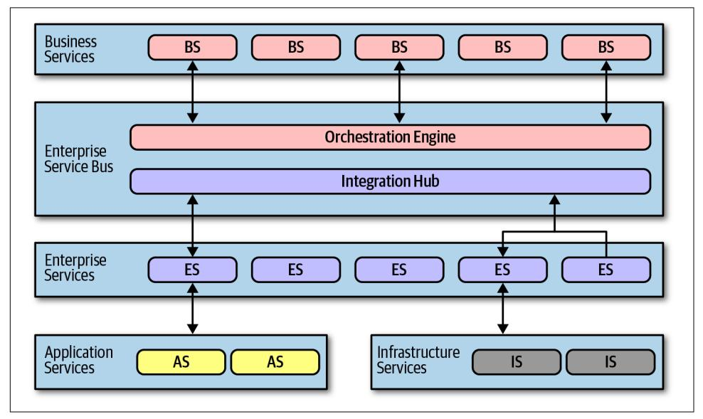
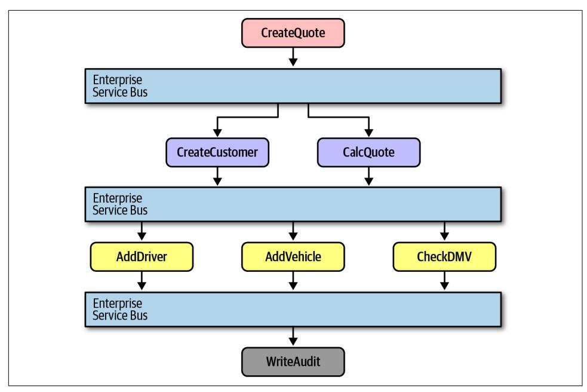
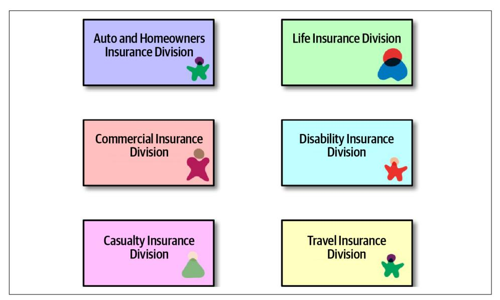
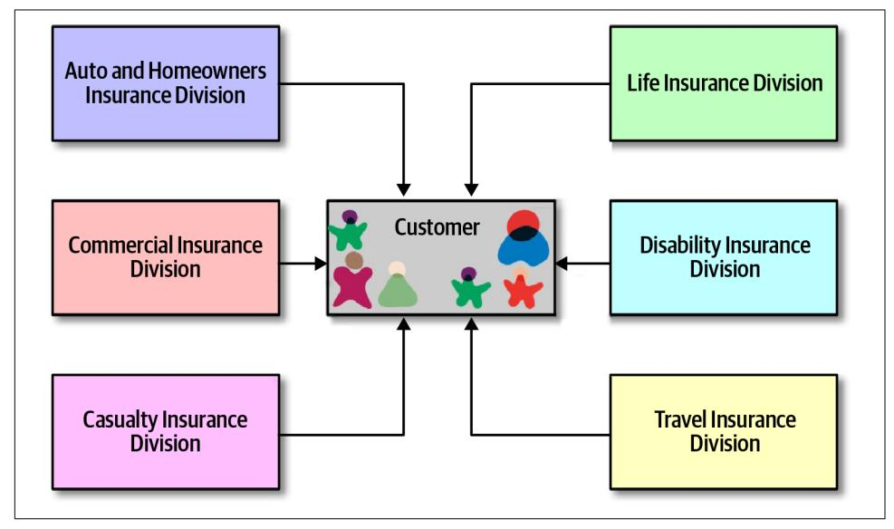

# Chapter 16: Orchestration-Driven Service-Oriented Architecture

Architecture styles, like art movements, must be understood in the context of the era in which they evolved, and this architecture exemplifies this rule more than any other. The combination of external forces that often influence architecture decisions, combined with a logical but ultimately disastrous organizational philosophy, doomed this architecture to irrelevance. However, it provides a great example of how a partic‐ ular organizational idea can make logical sense yet hinder most important parts of the development process.

## History and Philosophy

This style of service-oriented architecture appeared just as companies were becoming enterprises in the late 1990s: merging with smaller companies, growing at a breakneck pace, and requiring more sophisticated IT to accommodate this growth. How‐ ever, computing resources were scarce, precious, and commercial. Distributed computing had just become possible and necessary, and many companies needed the variable scalability and other beneficial characteristics.

Many external drivers forced architects in this era toward distributed architectures with significant constraints. Before open source operating systems were thought reli‐ able enough for serious work, operating systems were expensive and licensed per machine. Similarly, commercial database servers came with Byzantine licensing schemes, which caused application server vendors (which offered database connec‐ tion pooling) to battle with database vendors. Thus, architects were expected to reuse as much as possible. In fact, *reuse* in all forms became the dominant philosophy in this architecture, the side effects of which we cover in ["Reuse…and Coupling" on](#page-258-0) [page 239.](#page-258-0)

This style of architecture also exemplifies how far architects can push the idea of technical partitioning, which had good motivations but bad consequences.

## Topology

The topology of this type of service-oriented architecture is shown in Figure 16-1.

*Figure 16-1. Topology of orchestration-driven service-oriented architecture*

Not all examples of this style of architecture had the exact layers illustrated in Figure 16-1, but they all followed the same idea of establishing a taxonomy of services within the architecture, each layer with a specific responsibility.

Service-oriented architecture is a distributed architecture; the exact demarcation of boundaries isn't shown in Figure 16-1 because it varied based on organization.

## Taxonomy

The architect's driving philosophy in this architecture centered around enterpriselevel reuse. Many large companies were annoyed at how much they had to continue to rewrite software, and they struck on a strategy to gradually solve that problem. Each layer of the taxonomy supported this goal.

## Business Services

*Business services* sit at the top of this architecture and provide the entry point. For example, services like ExecuteTrade or PlaceOrder represent domain behavior. One litmus test common at the time—could an architect answer affirmatively to the ques‐ tion "Are we in the business of…" for each of these services?

These service definitions contained no code—just input, output, and sometimes schema information. They were usually defined by business users, hence the name business services.

## Enterprise Services

The *enterprise services* contain fine-grained, shared implementations. Typically, a team of developers is tasked with building atomic behavior around particular busi‐ ness domains: CreateCustomer, CalculateQuote, and so on. These services are the building blocks that make up the coarse-grained business services, tied together via the orchestration engine.

This separation of responsibility flows from the reuse goal in this architecture. If developers can build fine-grained enterprise services at just the correct level of granu‐ larity, the business won't have to rewrite that part of the business workflow again. Gradually, the business will build up a collection of reusable assets in the form of reusable enterprise services.

Unfortunately, the dynamic nature of reality defies these attempts. Business compo‐ nents aren't like construction materials, where solutions last decades. Markets, tech‐ nology changes, engineering practices, and a host of other factors confound attempts to impose stability on the software world.

## Application Services

Not all services in the architecture require the same level of granularity or reuse as the enterprise services. *Application services* are one-off, single-implementation services. For example, perhaps one application needs geo-location, but the organization doesn't want to take the time or effort to make that a reusable service. An application service, typically owned by a single application team, solves these problems.

## Infrastructure Services

*Infrastructure services* supply the operational concerns, such as monitoring, logging, authentication, and authorization. These services tend to be concrete implementa‐ tions, owned by a shared infrastructure team that works closely with operations.

## Orchestration Engine

The *orchestration engine* forms the heart of this distributed architecture, stitching together the business service implementations using orchestration, including features like transactional coordination and message transformation. This architecture is typi‐ cally tied to a single relational database, or a few, rather than a database per service as in microservices architectures. Thus, transactional behavior is handled declaratively in the orchestration engine rather than in the database.

The orchestration engine defines the relationship between the business and enterprise services, how they map together, and where transaction boundaries lie. It also acts as an integration hub, allowing architects to integrate custom code with package and legacy software systems.

Because this mechanism forms the heart of the architecture, Conway's law (see ["Con‐](013-chapter-8-component-based-thinking.md#page-122-0) [way's Law" on page 103\)](013-chapter-8-component-based-thinking.md#page-122-0) correctly predicts that the team of integration architects responsible for this engine become a political force within an organization, and even‐ tually a bureaucratic bottleneck.

While this approach might sound appealing, in practice it was mostly a disaster. Offloading transaction behavior to an orchestration tool sounded good, but finding the correct level of granularity of transactions became more and more difficult. While building a few services wrapped in a distributed transaction is possible, the architec‐ ture becomes increasingly complex as developers must figure out where the appropri‐ ate transaction boundaries lie between services.

## Message Flow

All requests go through the orchestration engine—it is the location within this archi‐ tecture where logic resides. Thus, message flow goes through the engine even for internal calls, as shown in [Figure 16-2.](#page-258-0)

*Figure 16-2. Message flow with service-oriented architecture*

In Figure 16-2, the CreateQuote business-level service calls the service bus, which defines the workflow that consists of calls to CreateCustomer and CalculateQuote, each of which also has calls to application services. The service bus acts as the inter‐ mediary for all calls within this architecture, serving as both an integration hub and orchestration engine.

## Reuse…and Coupling

A major goal of this architecture is reuse at the service level—the ability to gradually build business behavior that can be incrementally reused over time. Architects in this architecture were instructed to find reuse opportunities as aggressively as possible. For example, consider the situation illustrated in [Figure 16-3](#page-259-0).

*Figure 16-3. Seeking reuse opportunities in service-oriented architecture*

In Figure 16-3, an architect realizes that each of these divisions within an insurance company all contain a notion of Customer. Therefore, the proper strategy for serviceoriented architecture entails extracting the customer parts into a reusable service and allowing the original services to reference the canonical Customer service, shown in Figure 16-4.

*Figure 16-4. Building canonical representations in service-oriented architecture*

In [Figure 16-4,](#page-259-0) the architect has isolated all customer behavior into a single Customer service, achieving obvious reuse goals.

However, architects only slowly realized the negative trade-offs of this design. First, when a team builds a system primarily around reuse, they also incur a huge amount of coupling between components. For example, in [Figure 16-4](#page-259-0), a change to the Customer service ripples out to all the other services, making change risky. Thus, in service-oriented architecture, architects struggled with making incremental change each change had a potential huge ripple effect. That in turn led to the need for coor‐ dinated deployments, holistic testing, and other drags on engineering efficiency.

Another negative side effect of consolidating behavior into a single place: consider the case of auto and disability insurance in [Figure 16-4.](#page-259-0) To support a single Customer service, it must include all the details the organization knows about customers. Auto insurance requires a driver's license, which is a property of the person, not the vehi‐ cle. Therefore, the Customer service will have to include details about driver's licenses that the *disability insurance division* cares nothing about. Yet, the team that deals with disability must deal with the extra complexity of a single customer definition.

Perhaps the most damaging revelation from this architecture came with the realiza‐ tion of the impractically of building an architecture so focused on technical partition‐ ing. While it makes sense from a separation and reuse philosophy standpoint, it was a practical nightmare. Domain concepts like CatalogCheckout were spread so thinly throughout this architecture that they were virtually ground to dust. Developers com‐ monly work on tasks like "add a new address line to CatalogCheckout." In a serviceoriented architecture, that could entail dozens of services in several different tiers, plus changes to a single database schema. And, if the current enterprise services aren't defined at the correct transactional granularity, the developers will either have to change their design or build a new, near-identical service to change transactional behavior. So much for reuse.

## Architecture Characteristics Ratings

Many of the modern criteria we use to evaluate architecture now were not priorities when this architecture was popular. In fact, the Agile software movement had just started and had not penetrated into the size of organizations likely to use this architecture.

A one-star rating in the characteristics ratings table in [Figure 16-5](#page-261-0) means the specific architecture characteristic isn't well supported in the architecture, whereas a five-star rating means the architecture characteristic is one of the strongest features in the architecture style. The definition for each characteristic identified in the scorecard can be found in [Chapter 4](009-chapter-4-architecture-characteristics-defined.md#page-74-0).

Service-oriented architecture is perhaps the most technically partitioned generalpurpose architecture ever attempted! In fact, the backlash against the disadvantages of this structure lead to more modern architectures such as microservices. It has a single quantum even though it is a distributed architecture for two reasons. First, it generally uses a single database or just a few databases, creating coupling points within the architecture across many different concerns. Second, and more impor‐ tantly, the orchestration engine acts as a giant coupling point—no part of the archi‐ tecture can have different architecture characteristics than the mediator that orchestrates all behavior. Thus, this architecture manages to find the disadvantages of both monolithic *and* distributed architectures.

| A  | rchitecture characteristic | Star rating               |
|----|----------------------------|---------------------------|
| P  | artitioning type           | Technical                 |
| N  | umber of quanta            | 1                         |
| D  | eployability               | $\Rightarrow$             |
| E  | lasticity                  | <b>☆☆☆</b>                |
| E  | volutionary                | $\Rightarrow$             |
| Fa | ault tolerance             | <b>☆☆☆</b>                |
| N  | lodularity                 | $\star\star\star$         |
| 0  | verall cost                | $\Rightarrow$             |
| Р  | erformance                 | $\Rightarrow \Rightarrow$ |
| R  | eliability                 | $\Rightarrow \Rightarrow$ |
| S  | calability                 | ***                       |
| Si | implicity                  | ☆                         |
| Te | estability                 | ☆                         |

*Figure 16-5. Ratings for service-oriented architecture*

Modern engineering goals such as deployability and testability score disastrously in this architecture, both because they were poorly supported and because those were not important (or even aspirational) goals during that era.

This architecture did support some goals such as elasticity and scalability, despite the difficulties in implementing those behaviors, because tool vendors poured enormous effort into making these systems scalable by building session replication across appli‐ cation servers and other techniques. However, being a distributed architecture, per‐ formance was never a highlight of this architecture style and was extremely poor because each business request was split across so much of the architecture.

Because of all these factors, simplicity and cost have the inverse relationship most architects would prefer. This architecture was an important milestone because it taught architects how difficult distributed transactions can be in the real world and the practical limits of technical partitioning.
