
# Chapter 17: Microservices Architecture

*Microservices* is an extremely popular architecture style that has gained significant momentum in recent years. In this chapter, we provide an overview of the important characteristics that set this architecture apart, both topologically and philosophically.

## History

Most architecture styles are named after the fact by architects who notice a particular pattern that keeps reappearing—there is no secret group of architects who decide what the next big movement will be. Rather, it turns out that many architects end up making common decisions as the software development ecosystem shifts and changes. The common best ways of dealing with and profiting from those shifts become architecture styles that others emulate.

Microservices differs in this regard—it was named fairly early in its usage and popu‐ larized by a famous blog entry by Martin Fowler and James Lewis entitled ["Microser‐](https://oreil.ly/Px3Wk) [vices,"](https://oreil.ly/Px3Wk) published in March 2014. They recognized many common characteristics in this relatively new architectural style and delineated them. Their blog post helped define the architecture for curious architects and helped them understand the under‐ lying philosophy.

Microservices is heavily inspired by the ideas in domain-driven design (DDD), a logi‐ cal design process for software projects. One concept in particular from DDD, *boun‐ ded context*, decidedly inspired microservices. The concept of bounded context represents a decoupling style. When a developer defines a domain, that domain includes many entities and behaviors, identified in artifacts such as code and database schemas. For example, an application might have a domain called CatalogCheckout, which includes notions such as catalog items, customers, and payment. In a tradi‐ tional monolithic architecture, developers would share many of these concepts, building reusable classes and linked databases. Within a bounded context, the inter‐ nal parts, such as code and data schemas, are coupled together to produce work; but they are never coupled to anything outside the bounded context, such as a database or class definition from another bounded context. This allows each context to define only what it needs rather than accommodating other constituents.

While reuse is beneficial, remember the First Law of Software Architecture regarding trade-offs. The negative trade-off of reuse is coupling. When an architect designs a system that favors reuse, they also favor coupling to achieve that reuse, either by inheritance or composition.

However, if the architect's goal requires high degrees of decoupling, then they favor duplication over reuse. The primary goal of microservices is high decoupling, physi‐ cally modeling the logical notion of bounded context.

## Topology

The topology of microservices is shown in Figure 17-1.

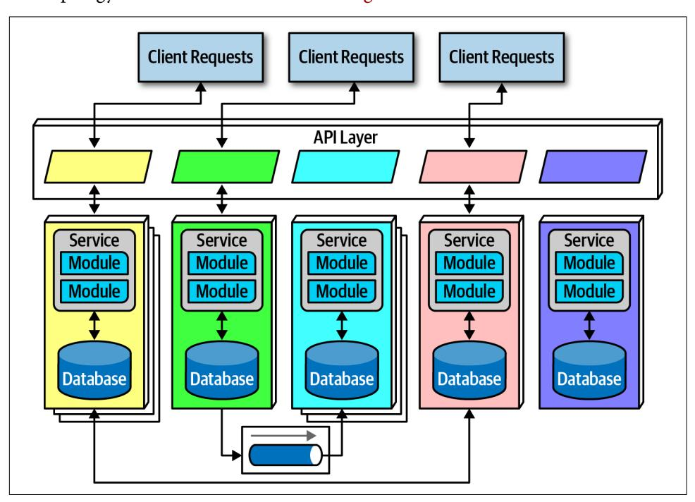

*Figure 17-1. The topology of the microservices architecture style*

As illustrated in Figure 17-1, due to its single-purpose nature, the service size in microservices is much smaller than other distributed architectures, such as the

orchestration-driven service-oriented architecture. Architects expect each service to include all necessary parts to operate independently, including databases and other dependent components. The different characteristics appear in the following sections.

## Distributed

Microservices form a *distributed architecture*: each service runs in its own process, which originally implied a physical computer but quickly evolved to virtual machines and containers. Decoupling the services to this degree allows for a simple solution to a common problem in architectures that heavily feature multitenant infrastructure for hosting applications. For example, when using an application server to manage multiple running applications, it allows operational reuse of network bandwidth, memory, disk space, and a host of other benefits. However, if all the supported appli‐ cations continue to grow, eventually some resource becomes constrained on the shared infrastructure. Another problem concerns improper isolation between shared applications.

Separating each service into its own process solves all the problems brought on by sharing. Before the evolutionary development of freely available open source operat‐ ing systems, combined with automated machine provisioning, it was impractical for each domain to have its own infrastructure. Now, however, with cloud resources and container technology, teams can reap the benefits of extreme decoupling, both at the domain and operational level.

Performance is often the negative side effect of the distributed nature of microservi‐ ces. Network calls take much longer than method calls, and security verification at every endpoint adds additional processing time, requiring architects to think care‐ fully about the implications of granularity when designing the system.

Because microservices is a distributed architecture, experienced architects advise against the use of transactions across service boundaries, making determining the granularity of services the key to success in this architecture.

## Bounded Context

The driving philosophy of microservices is the notion of *bounded context*: each ser‐ vice models a domain or workflow. Thus, each service includes everything necessary to operate within the application, including classes, other subcomponents, and data‐ base schemas. This philosophy drives many of the decisions architects make within this architecture. For example, in a monolith, it is common for developers to share common classes, such as Address, between disparate parts of the application. How‐ ever, microservices try to avoid coupling, and thus an architect building this architec‐ ture style prefers duplication to coupling.

Microservices take the concept of a domain-partitioned architecture to the extreme. Each service is meant to represent a domain or subdomain; in many ways, microser‐ vices is the physical embodiment of the logical concepts in domain-driven design.

## Granularity

Architects struggle to find the correct granularity for services in microservices, and often make the mistake of making their services too small, which requires them to build communication links back between the services to do useful work.

The term "microservice" is a *label*, not a *description*.

—Martin Fowler

In other words, the originators of the term needed to call this new style *something*, and they chose "microservices" to contrast it with the dominant architecture style at the time, service-oriented architecture, which could have been called "gigantic serv‐ ices". However, many developers take the term "microservices" as a commandment, not a description, and create services that are too fine-grained.

The purpose of service boundaries in microservices is to capture a domain or work‐ flow. In some applications, those natural boundaries might be large for some parts of the system—some business processes are more coupled than others. Here are some guidelines architects can use to help find the appropriate boundaries:

### Purpose

The most obvious boundary relies on the inspiration for the architecture style, a domain. Ideally, each microservice should be extremely functionally cohesive, contributing one significant behavior on behalf of the overall application.

#### Transactions

Bounded contexts are business workflows, and often the entities that need to cooperate in a transaction show architects a good service boundary. Because transactions cause issues in distributed architectures, if architects can design their system to avoid them, they generate better designs.

## Choreography

If an architect builds a set of services that offer excellent domain isolation yet require extensive communication to function, the architect may consider bun‐ dling these services back into a larger service to avoid the communication overhead.

Iteration is the only way to ensure good service design. Architects rarely discover the perfect granularity, data dependencies, and communication styles on their first pass. However, after iterating over the options, an architect has a good chance of refining their design.

## Data Isolation

Another requirement of microservices, driven by the bounded context concept, is data isolation. Many other architecture styles use a single database for persistence. However, microservices tries to avoid all kinds of coupling, including shared schemas and databases used as integration points.

Data isolation is another factor an architect must consider when looking at service granularity. Architects must be wary of the entity trap (discussed in ["Entity trap"](013-chapter-8-component-based-thinking.md#page-129-0) on [page 110\)](013-chapter-8-component-based-thinking.md#page-129-0) and not simply model their services to resemble single entities in a database.

Architects are accustomed to using relational databases to unify values within a sys‐ tem, creating a single source of truth, which is no longer an option when distributing data across the architecture. Thus, architects must decide how they want to handle this problem: either identifying one domain as the source of truth for some fact and coordinating with it to retrieve values or using database replication or caching to dis‐ tribute information.

While this level of data isolation creates headaches, it also provides opportunities. Now that teams aren't forced to unify around a single database, each service can choose the most appropriate tool, based on price, type of storage, or a host of other factors. Teams have the advantage in a highly decoupled system to change their mind and choose a more suitable database (or other dependency) without affecting other teams, which aren't allowed to couple to implementation details.

## API Layer

Most pictures of microservices include an API layer sitting between the consumers of the system (either user interfaces or calls from other systems), but it is optional. It is common because it offers a good location within the architecture to perform useful tasks, either via indirection as a proxy or a tie into operational facilities, such as a naming service (covered in ["Operational Reuse" on page 250](#page-269-0)).

While an API layer may be used for variety of things, it should not be used as a medi‐ ator or orchestration tool if the architect wants to stay true to the underlying philoso‐ phy of this architecture: all interesting logic in this architecture should occur inside a bounded context, and putting orchestration or other logic in a mediator violates that rule. This also illustrates the difference between technical and domain partitioning in architecture: architects typically use mediators in technically partitioned architec‐ tures, whereas microservices is firmly domain partitioned.

## Operational Reuse

Given that microservices prefers duplication to coupling, how do architects handle the parts of architecture that really do benefit from coupling, such as operational con‐ cerns like monitoring, logging, and circuit breakers? One of the philosophies in the traditional service-oriented architecture was to reuse as much functionality as possi‐ ble, domain and operational alike. In microservices, architects try to split these two concerns.

Once a team has built several microservices, they realize that each has common ele‐ ments that benefit from similarity. For example, if an organization allows each service team to implement monitoring themselves, how can they ensure that each team does so? And how do they handle concerns like upgrades? Does it become the responsibil‐ ity of each team to handle upgrading to the new version of the monitoring tool, and how long will that take?

The *sidecar* pattern offers a solution to this problem, illustrated in Figure 17-2.

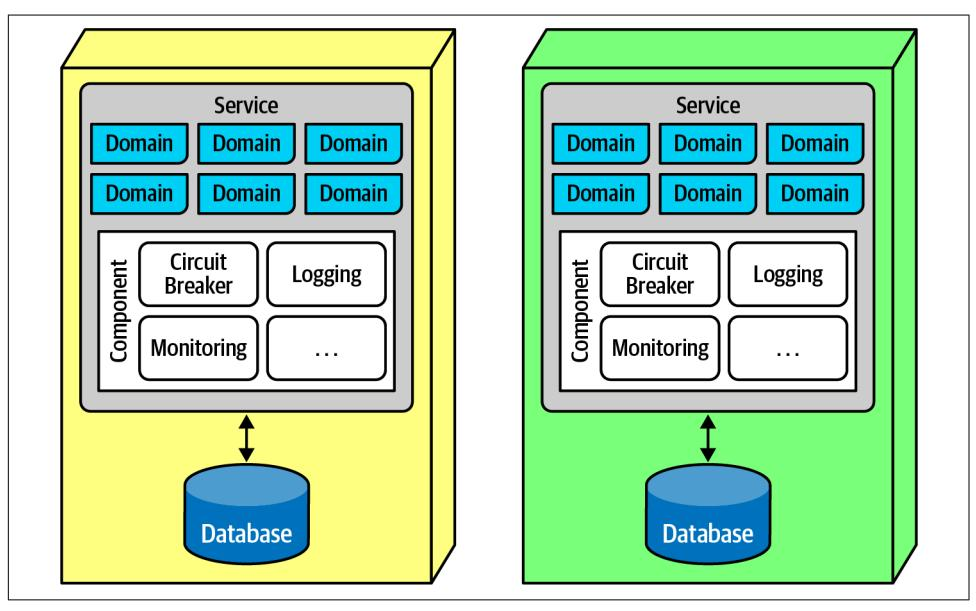

*Figure 17-2. The sidecar pattern in microservices*

In Figure 17-2, the common operational concerns appear within each service as a separate component, which can be owned by either individual teams or a shared infrastructure team. The sidecar component handles all the operational concerns that teams benefit from coupling together. Thus, when it comes time to upgrade the mon‐ itoring tool, the shared infrastructure team can update the sidecar, and each micro‐ services receives that new functionality.

Once teams know that each service includes a common sidecar, they can build a *ser‐ vice mesh*, allowing unified control across the architecture for concerns like logging and monitoring. The common sidecar components connect to form a consistent operational interface across all microservices, as shown in Figure 17-3.

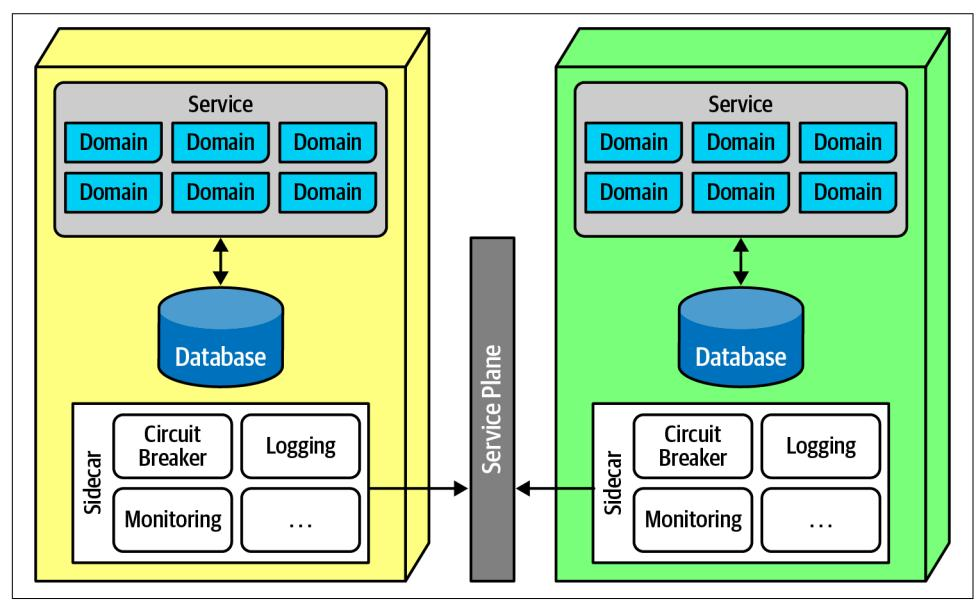

*Figure 17-3. The service plane connects the sidecars in a service mesh*

In Figure 17-3, each sidecar wires into the service plane, which forms the consistent interface to each service.

The service mesh itself forms a console that allows developers holistic access to serv‐ ices, which is shown in Figure 17-4.

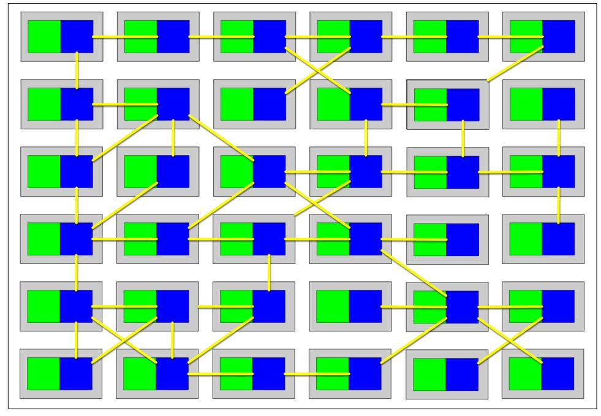

*Figure 17-4. The service mesh forms a holistic view of the operational aspect of microser‐ vices*

Each service forms a node in the overall mesh, as shown in Figure 17-4. The service mesh forms a console that allows teams to globally control operational coupling, such as monitoring levels, logging, and other cross-cutting operational concerns.

Architects use *service discovery* as a way to build elasticity into microservices archi‐ tectures. Rather than invoke a single service, a request goes through a service discov‐ ery tool, which can monitor the number and frequency of requests, as well as spin up new instances of services to handle scale or elasticity concerns. Architects often include service discovery in the service mesh, making it part of every microservice. The API layer is often used to host service discovery, allowing a single place for user interfaces or other calling systems to find and create services in an elastic, consistent way.

## Frontends

Microservices favors decoupling, which would ideally encompass the user interfaces as well as backend concerns. In fact, the original vision for microservices included the user interface as part of the bounded context, faithful to the principle in DDD. How‐ ever, practicalities of the partitioning required by web applications and other external constraints make that goal difficult. Thus, two styles of user interfaces commonly appear for microservices architectures; the first appears in Figure 17-5.

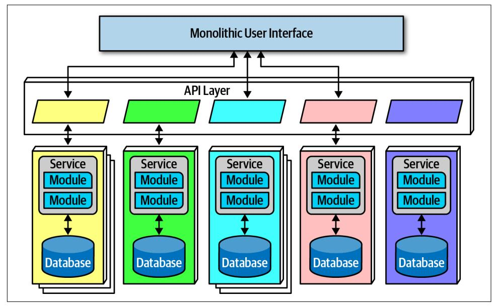

*Figure 17-5. Microservices architecture with a monolithic user interface*

In Figure 17-5, the monolithic frontend features a single user interface that calls through the API layer to satisfy user requests. The frontend could be a rich desktop, mobile, or web application. For example, many web applications now use a JavaScript web framework to build a single user interface.

The second option for user interfaces uses *microfrontends*, shown in Figure 17-6.

*Figure 17-6. Microfrontend pattern in microservices*

In Figure 17-6, this approach utilizes components at the user interface level to create a synchronous level of granularity and isolation in the user interface as the backend services. Each service emits the user interface for that service, which the frontend coordinates with the other emitted user interface components. Using this pattern, teams can isolate service boundaries from the user interface to the backend services, unifying the entire domain within a single team.

Developers can implement the microfrontend pattern in a variety of ways, either using a component-based web framework such as [React](https://reactjs.org) or using one of several open source frameworks that support this pattern.

## Communication

In microservices, architects and developers struggle with appropriate granularity, which affects both data isolation and communication. Finding the correct communi‐ cation style helps teams keep services decoupled yet still coordinated in useful ways.

Fundamentally, architects must decide on *synchronous* or *asynchronous* communica‐ tion. Synchronous communication requires the caller to wait for a response from the callee. Microservices architectures typically utilize *protocol-aware heterogeneous inter‐ operability*. We'll break down that term for you:

### Protocol-aware

Because microservices usually don't include a centralized integration hub to avoid operational coupling, each service should know how to call other services. Thus, architects commonly standardize on how particular services call each other: a certain level of REST, message queues, and so on. That means that serv‐ ices must know (or discover) which protocol to use to call other services.

#### Heterogeneous

Because microservices is a distributed architecture, each service may be written in a different technology stack. *Heterogeneous* suggests that microservices fully supports polyglot environments, where different services use different platforms.

#### Interoperability

Describes services calling one another. While architects in microservices try to discourage transactional method calls, services commonly call other services via the network to collaborate and send/receive information.

## Enforced Heterogeneity

A well-known architect who was a pioneer in the microservices style was the chief architecture at a personal information manager startup for mobile devices. Because they had a fast-moving problem domain, the architect wanted to ensure that none of the development teams accidentally created coupling points between each other, hin‐ dering the teams' ability to move independently. It turned out that this architect had a wide mix of technical skills on the teams, thus mandating that each development team use a different technology stack. If one team was using Java and the other was using .NET, it was impossible to accidentally share classes!

This approach is the polar opposite of most enterprise governance policies, which insist on standardizing on a single technology stack. The goal in the microservices world isn't to create the most complex ecosystem possible, but rather to choose the correct scale technology for the narrow scope of the problem. Not every service needs an industrial-strength relational database, and forcing it on small teams slows them rather than benefitting them. This concept leverages the highly decoupled nature of microservices.

For asynchronous communication, architects often use events and messages, thus internally utilizing an event-driven architecture, covered in [Chapter 14;](020-chapter-14-event-driven-architecture-style.md#page-198-0) the broker and mediator patterns manifest in microservices as *choreography* and *orchestration*.

## Choreography and Orchestration

*Choreography* utilizes the same communication style as a broker event-driven archi‐ tecture. In other words, no central coordinator exists in this architecture, respecting the bounded context philosophy. Thus, architects find it natural to implement decou‐ pled events between services.

*Domain/architecture isomorphism* is one key characteristic that architects should look for when assessing how appropriate an architecture style is for a particular problem. This term describes how the shape of an architecture maps to a particular architec‐ ture style. For example, in [Figure 8-7](013-chapter-8-component-based-thinking.md#page-125-0), the Silicon Sandwiches' technically partitioned architecture structurally supports customizability, and the microkernel architecture style offers the same general structure. Therefore, problems that require a high degree of customization become easier to implement in a microkernel.

Similarly, because the architect's goal in a microservices architecture favors decou‐ pling, the shape of microservices resembles the broker EDA, making these two pat‐ terns symbiotic.

In choreography, each service calls other services as needed, without a central media‐ tor. For example, consider the scenario shown in Figure 17-7.

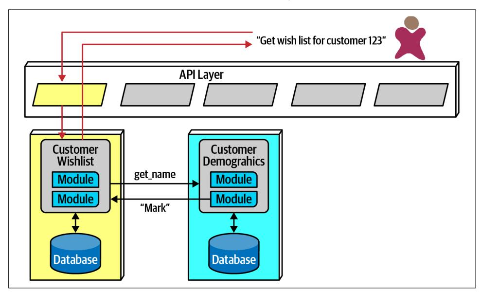

*Figure 17-7. Using choreography in microservices to manage coordination*

In [Figure 17-7,](#page-275-0) the user requests details about a user's wish list. Because the Customer WishList service doesn't contain all the necessary information, it makes a call to CustomerDemographics to retrieve the missing information, returning the result to the user.

Because microservices architectures don't include a global mediator like other service-oriented architectures, if an architect needs to coordinate across several serv‐ ices, they can create their own localized mediator, as shown in Figure 17-8.

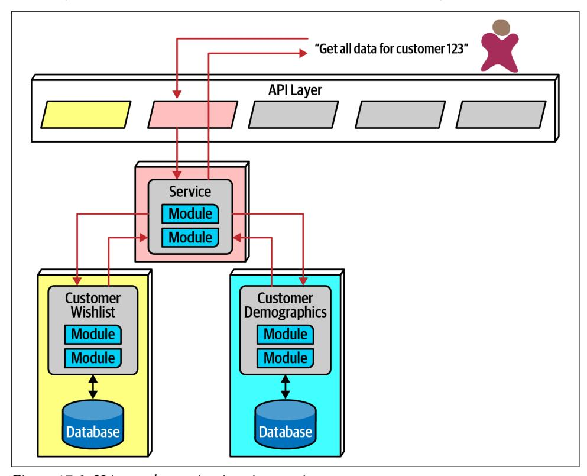

*Figure 17-8. Using orchestration in microservices*

In Figure 17-8, the developers create a service whose sole responsibility is coordinat‐ ing the call to get all information for a particular customer. The user calls the Report CustomerInformation mediator, which calls the necessary other services.

The First Law of Software Architecture suggests that neither of these solutions is per‐ fect—each has trade-offs. In choreography, the architect preserves the highly decou‐ pled philosophy of the architecture style, thus reaping maximum benefits touted by the style. However, common problems like error handling and coordination become more complex in choreographed environments.

Consider an example with a more complex workflow, shown in Figure 17-9.

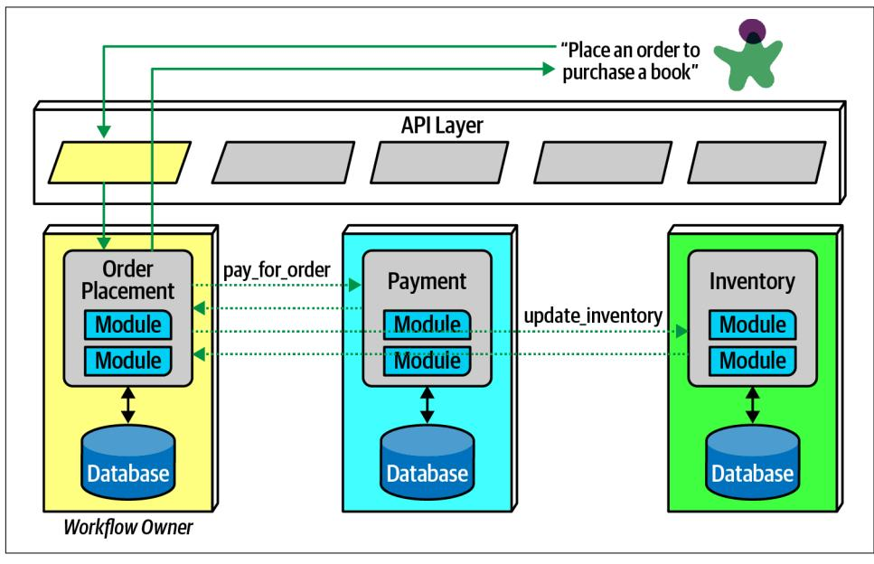

*Figure 17-9. Using choreography for a complex business process*

In Figure 17-9, the first service called must coordinate across a wide variety of other services, basically acting as a mediator in addition to its other domain responsibili‐ ties. This pattern is called the *front controller* pattern, where a nominally choreo‐ graphed service becomes a more complex mediator for some problem. The downside to this pattern is added complexity in the service.

Alternatively, an architect may choose to use orchestration for complex business pro‐ cesses, illustrated in Figure 17-10.

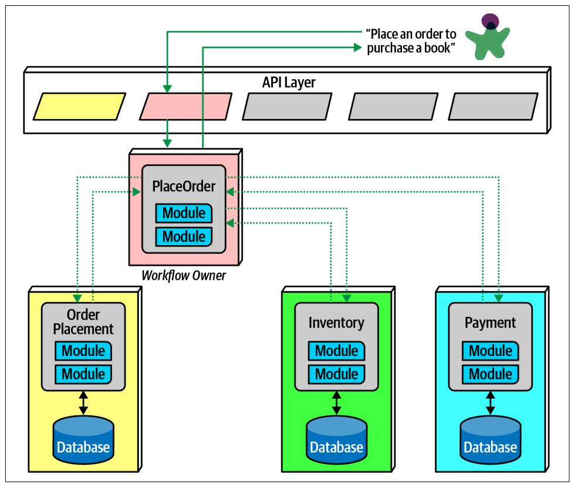

*Figure 17-10. Using orchestration for a complex business process*

In Figure 17-10, the architect builds a mediator to handle the complexity and coordi‐ nation required for the business workflow. While this creates coupling between these services, it allows the architect to focus coordination into a single service, leaving the others less affected. Often, domain workflows are inherently coupled—the architect's job entails finding the best way to represent that coupling in ways that support both the domain and architectural goals.

## Transactions and Sagas

Architects aspire to extreme decoupling in microservices, but then often encounter the problem of how to do transactional coordination across services. Because the decoupling in the architecture encourages the same level for the databases, atomicity that was trivial in monolithic applications becomes a problem in distributed ones.

Building transactions across service boundaries violates the core decoupling principle of the microservices architecture (and also creates the worst kind of dynamic connas‐ cence, connascence of value). The best advice for architects who want to do transac‐ tions across services is: *don't!* Fix the granularity components instead. Often, architects who build microservices architectures who then find a need to wire them together with transactions have gone too granular in their design. Transaction boundaries is one of the common indicators of service granularity.

Don't do transactions in microservices—fix granularity instead!

Exceptions always exist. For example, a situation may arise where two different serv‐ ices need vastly different architecture characteristics, requiring distinct service boundaries, yet still need transactional coordination. In those situations, patterns exist to handle transaction orchestration, with serious trade-offs.

A popular distributed transactional pattern in microservices is the *saga* pattern, illus‐ trated in Figure 17-11.

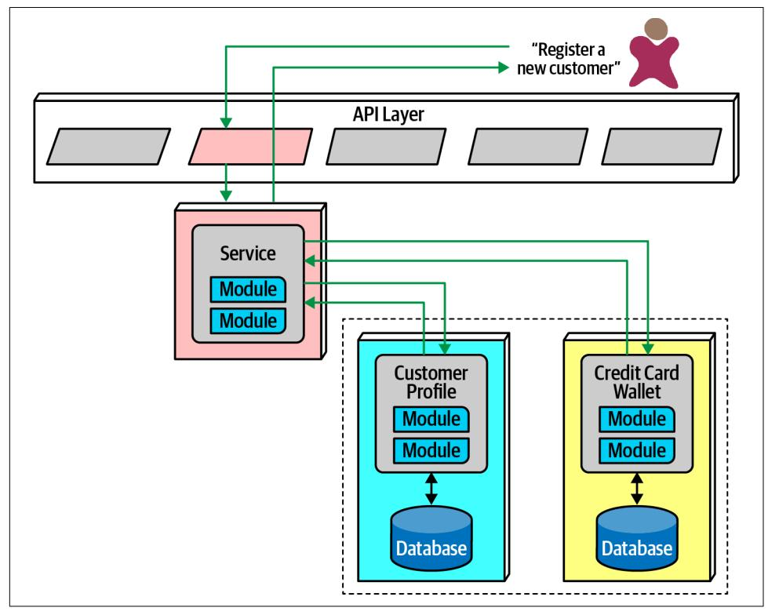

*Figure 17-11. The saga pattern in microservices architecture*

In Figure 17-11, a service acts a mediator across multiple service calls and coordi‐ nates the transaction. The mediator calls each part of the transaction, records success or failure, and coordinates results. If everything goes as planned, all the values in the services and their contained databases update synchronously.

In an error condition, the mediator must ensure that no part of the transaction suc‐ ceeds if one part fails. Consider the situation shown in Figure 17-12.

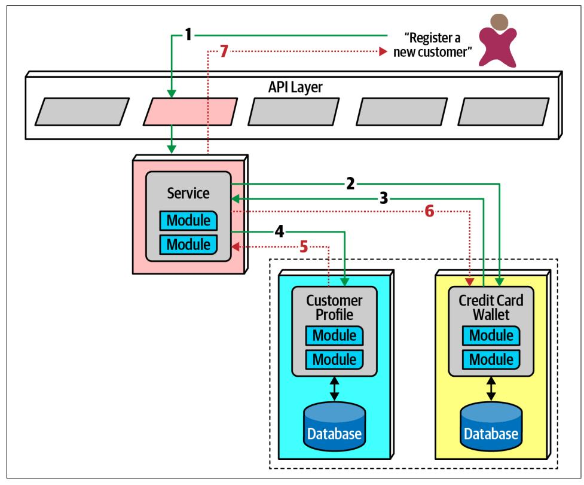

*Figure 17-12. Saga pattern compensating transactions for error conditions*

In Figure 17-12, if the first part of the transaction succeeds, yet the second part fails, the mediator must send a request to all the parts of the transaction that were success‐ ful and tell them to undo the previous request. This style of transactional coordina‐ tion is called a *compensating transaction framework*. Developers implement this pattern by usually having each request from the mediator enter a pending state until the mediator indicates overall success. However, this design becomes complex if asyn‐ chronous requests must be juggled, especially if new requests appear that are contin‐ gent on pending transactional state. This also creates a lot of coordination traffic at the network level.

Another implementation of a compensating transaction framework has developers build *do* and *undo* for each potentially transactional operation. This allows less coor‐ dination during transactions, but the *undo* operations tend to be significantly more complex than the *do* operations, more than doubling the design, implementation, and debugging work.

While it is possible for architects to build transactional behavior across services, it goes against the reason for choosing the microservices pattern. Exceptions always exist, so the best advice for architects is to use the saga pattern sparingly.

A few transactions across services is sometimes necessary; if it's the dominant feature of the architecture, mistakes were made!

## Architecture Characteristics Ratings

The microservices architecture style offers several extremes on our standard ratings scale, shown in [Figure 17-13.](#page-283-0) A one-star rating means the specific architecture char‐ acteristic isn't well supported in the architecture, whereas a five-star rating means the architecture characteristic is one of the strongest features in the architecture style. The definition for each characteristic identified in the scorecard can be found in [Chapter 4](009-chapter-4-architecture-characteristics-defined.md#page-74-0).

Notable is the high support for modern engineering practices such as automated deployment, testability, and others not listed. Microservices couldn't exist without the DevOps revolution and the relentless march toward automating operational con‐ cerns.

As microservices is a distributed architecture, it suffers from many of the deficiencies inherent in architectures made from pieces wired together at runtime. Thus, fault tol‐ erance and reliability are impacted when too much interservice communication is used. However, these ratings only point to tendencies in the architecture; developers fix many of these problems by redundancy and scaling via service discovery. Under normal circumstances, however, independent, single-purpose services generally lead to high fault tolerance, hence the high rating for this characteristic within a microser‐ vices architecture.

| Architecture characteristic | Star rating Star rating |
|-----------------------------|-------------------------|
| Partitioning type           | Domain                  |
| Number of quanta            | 1 to many               |
| Deployability               | ***                     |
| Elasticity                  | ****                    |
| Evolutionary                | ****                    |
| Fault tolerance             | ***                     |
| Modularity                  | ****                    |
| Overall cost                | $\Rightarrow$           |
| Performance                 | <b>☆☆</b>               |
| Reliability                 | ***                     |
| Scalability                 | ****                    |
| Simplicity                  | <b>☆</b>                |
| Testability                 | <b>☆☆☆☆</b>             |

*Figure 17-13. Ratings for microservices*

The high points of this architecture are scalability, elasticity, and evolutionary. Some of the most scalable systems yet written have utilized this style to great success. Simi‐ larly, because the architecture relies heavily on automation and intelligent integration with operations, developers can also build elasticity support into the architecture. Because the architecture favors high decoupling at an incremental level, it supports the modern business practice of evolutionary change, even at the architecture level. Modern business move fast, and software development has struggled to keep apace. By building an architecture that has extremely small deployment units that are highly decoupled, architects have a structure that can support a faster rate of change.

Performance is often an issue in microservices—distributed architectures must make many network calls to complete work, which has high performance overhead, and they must invoke security checks to verify identity and access for each endpoint. Many patterns exist in the microservices world to increase performance, including intelligent data caching and replication to prevent an excess of network calls.

Performance is another reason that microservices often use choreography rather than orchestration, as less coupling allows for faster communication and fewer bottlenecks.

Microservices is decidedly a domain-centered architecture, where each service boundary should correspond to domains. It also has the most distinct quanta of any modern architecture—in many ways, it exemplifies what the quantum measure evalu‐ ates. The driving philosophy of extreme decoupling creates many headaches in this architecture but yields tremendous benefits when done well. As in any architecture, architects must understand the rules to break them intelligently.

## Additional References

While our goal in this chapter was to touch on some of the significant aspects of this architecture style, many excellent resources exist to get further and more detailed about this architecture style. Additional and more detailed information can be found about microservices in the following references:

- *[Building Microservices](http://shop.oreilly.com/product/0636920033158.do)* by Sam Newman (O'Reilly)
- *[Microservices vs. Service-Oriented Architecture](https://learning.oreilly.com/library/view/microservices-vs-service-oriented/9781491975657)* by Mark Richards (O'Reilly)
- *[Microservices AntiPatterns and Pitfalls](https://learning.oreilly.com/library/view/microservices-antipatterns-and/9781492042716)* by Mark Richards (O'Reilly)
