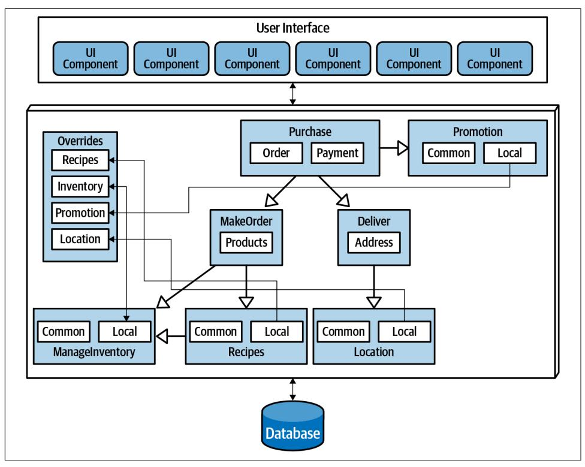
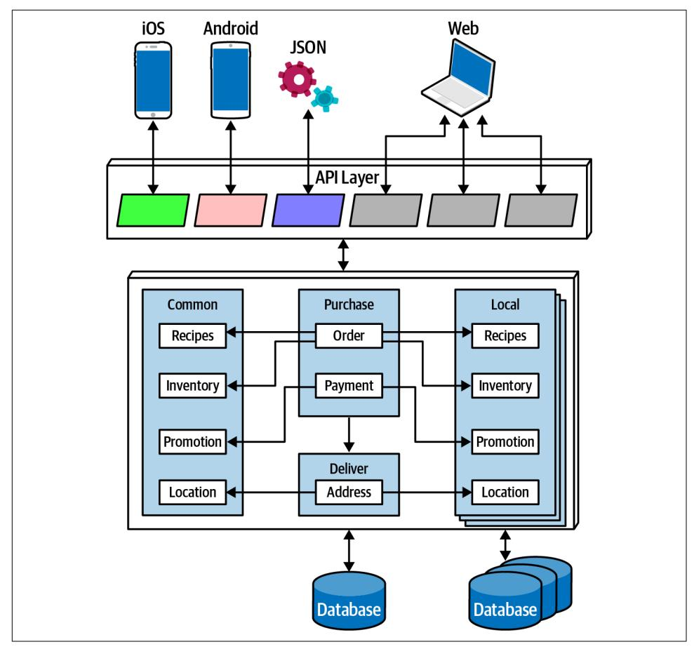
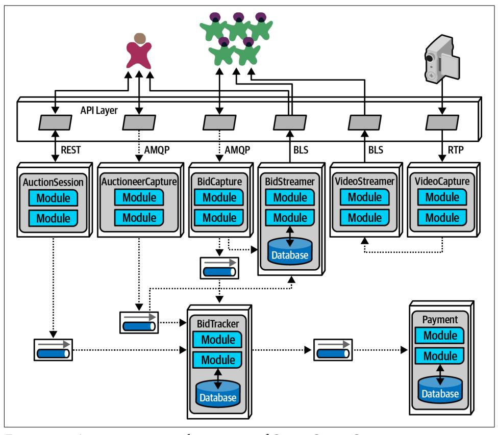
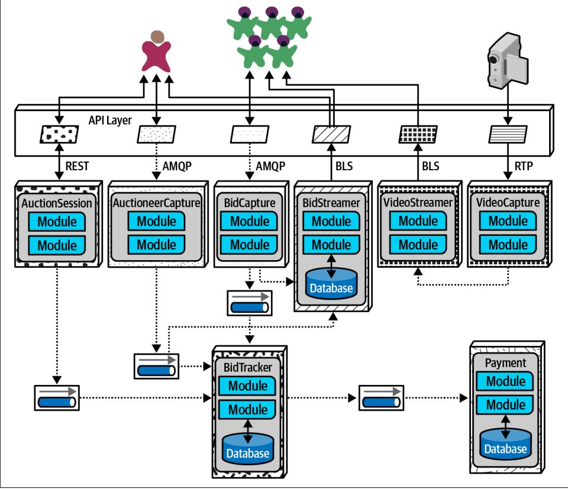

# Chapter 18: Choosing the Appropriate Architecture Style

It depends! With all the choices available (and new ones arriving almost daily), we would like to tell you which one to use—but we cannot. Nothing is more contextual to a number of factors within an organization and what software it builds. Choosing an architecture style represents the culmination of analysis and thought about tradeoffs for architecture characteristics, domain considerations, strategic goals, and a host of other things.

However contextual the decision is, some general advice exists around choosing an appropriate architecture style.

## Shifting "Fashion" in Architecture

Preferred architecture styles shift over time, driven by a number of factors:

## Observations from the past

New architecture styles generally arise from observations and pain points from past experiences. Architects have experience with systems in the past that influ‐ ence their thoughts about future systems. Architects must rely on their past expe‐ rience—it is that experience that allowed that person to become an architect in the first place. Often, new architecture designs reflect specific deficiencies from past architecture styles. For example, architects seriously rethought the implica‐ tions of code reuse after building architectures that featured it and then realizing the negative trade-offs.

## Changes in the ecosystem

Constant change is a reliable feature of the software development ecosystem everything changes all the time. The change in our ecosystem is particularly

chaotic, making even the type of change impossible to predict. For example, a few years ago, no one knew what *Kubernetes* was, and now there are multiple conferences around the world with thousands of developers. In a few more years, Kubernetes may be replaced with some other tool that hasn't been written yet.

### New capabilities

When new capabilities arise, architecture may not merely replace one tool with another but rather shift to an entirely new paradigm. For example, few architects or developers anticipated the tectonic shift caused in the software development world by the advent of containers such as Docker. While it was an evolutionary step, the impact it had on architects, tools, engineering practices, and a host of other factors astounded most in the industry. The constant change in the ecosys‐ tem also delivers a new collection of tools and capabilities on a regular basis. Architects must keep a keen eye open to not only new tools but new paradigms. Something may just look like a new one-of-something-we-already-have, but it may include nuances or other changes that make it a game changer. New capabil‐ ities don't even have to rock the entire development world—the new features may be a minor change that aligns exactly with an architect's goals.

#### Acceleration

Not only does the ecosystem constantly change, but the rate of change also con‐ tinues to rise. New tools create new engineering practices, which lead to new design and capabilities. Architects live in a constant state of flux because change is both pervasive and constant.

## Domain changes

The domain that developers write software for constantly shifts and changes, either because the business continues to evolve or because of factors like mergers with other companies.

### Technology changes

As technology continues to evolve, organizations try to keep up with at least some of these changes, especially those with obvious bottom-line benefits.

#### External factors

Many external factors only peripherally associated with software development may drive change within an organizations. For example, architects and develop‐ ers might be perfectly happy with a particular tool, but the licensing cost has become prohibitive, forcing a migration to another option.

Regardless of where an organization stands in terms of current architecture fashion, an architect should understand current industry trends to make intelligent decisions about when to follow and when to make exceptions.

## Decision Criteria

When choosing an architectural style, an architect must take into account all the vari‐ ous factors that contribute to the structure for the domain design. Fundamentally, an architect designs two things: whatever domain has been specified, and all the other structural elements required to make the system a success.

Architects should go into the design decision comfortable with the following things:

### The domain

Architects should understand many important aspects of the domain, especially those that affect operational architecture characteristics. Architects don't have to be subject matter experts, but they must have at least a good general understand‐ ing of the major aspects of the domain under design.

#### Architecture characteristics that impact structure

Architects must discover and elucidate the architecture characteristics needed to support the domain and other external factors.

#### Data architecture

Architects and DBAs must collaborate on database, schema, and other datarelated concerns. We don't cover much about data architecture in this book; it is its own specialization. However, architects must understand the impact that data design might have on their design, particularly if the new system must interact with an older and/or in-use data architecture.

#### Organizational factors

Many external factors may influence design. For example, the cost of a particular cloud vendor may prevent the ideal design. Or perhaps the company plans to engage in mergers and acquisitions, which encourages an architect to gravitate toward open solutions and integration architectures.

## Knowledge of process, teams, and operational concerns

Many specific project factors influence an architect's design, such as the software development process, interaction (or lack of) with operations, and the QA pro‐ cess. For example, if an organization lacks maturity in Agile engineering practi‐ ces, architecture styles that rely on those practices for success will present difficulties.

### Domain/architecture isomorphism

Some problem domains match the topology of the architecture. For example, the microkernel architecture style is perfectly suited to a system that requires cus‐ tomizability—the architect can design customizations as plug-ins. Another example might be genome analysis, which requires a large number of discrete

operations, and space-based architecture, which offers a large number of discrete processors.

Similarly, some problem domains may be particularly ill-suited for some archi‐ tecture styles. For example, highly scalable systems struggle with large monolithic designs because architects find it difficult to support a large number of concur‐ rent users in a highly coupled code base. A problem domain that includes a huge amount of semantic coupling matches poorly with a highly decoupled, dis‐ tributed architecture. For instance, an insurance company application consisting of multipage forms, each of which is based on the context of previous pages, would be difficult to model in microservices. This is a highly coupled problem that will present architects with design challenges in a decoupled architecture; a less coupled architecture like service-based architecture would suit this problem better.

Taking all these things into account, the architect must make several determinations:

## Monolith versus distributed

Using the quantum concepts discussed earlier, the architect must determine if a single set of architecture characteristics will suffice for the design, or do different parts of the system need differing architecture characteristics? A single set implies that a monolith is suitable (although other factors may drive an architect toward a distributed architecture), whereas different architecture characteristics imply a distributed architecture.

### Where should data live?

If the architecture is monolithic, architects commonly assume a single relational databases or a few of them. In a distributed architecture, the architect must decide which services should persist data, which also implies thinking about how data must flow throughout the architecture to build workflows. Architects must consider both structure and behavior when designing architecture and not be fearful of iterating on the design to find better combinations.

## What communication styles between services—synchronous or asynchronous?

Once the architect has determined data partitioning, their next design considera‐ tion is the communication between services—synchronous or asynchronous? Synchronous communication is more convenient in most cases, but it can lead to scalability, reliability, and other undesirable characteristics. Asynchronous com‐ munication can provide unique benefits in terms of performance and scale but can present a host of headaches: data synchronization, deadlocks, race condi‐ tions, debugging, and so on.

Because synchronous communication presents fewer design, implementation, and debugging challenges, architects should default to synchronous when possible and use asynchronous when necessary.

Use synchronous by default, asynchronous when necessary.

The output of this design process is architecture topology, taking into account what architecture style (and hybridizations) the architect chose, architecture decision records about the parts of the design which required the most effort by the architect, and architecture fitness functions to protect important principles and operational architecture characteristics.

## Monolith Case Study: Silicon Sandwiches

In the Silicon Sandwiches architecture kata, after investigating the architecture char‐ acteristics, we determined that a single quantum was sufficient to implement this sys‐ tem. Plus, this is a simple application without a huge budget, so the simplicity of a monolith appeals.

However, we created two different component designs for Silicon Sandwiches: one domain partitioned and another technically partitioned. Given the simplicity of the solution, we'll create designs for each and cover trade-offs.

## Modular Monolith

A modular monolith builds domain-centric components with a single database, deployed as a single quantum; the modular monolith design for Silicon Sandwiches appears in [Figure 18-1](#page-291-0).

This is a monolith with a single relational database, implemented with a single webbased user interface (with careful design considerations for mobile devices) to keep overall cost down. Each of the domains the architect identified earlier appear as com‐ ponents. If time and resources are sufficient, the architect should consider creating the same separation of tables and other database assets as the domain components, allowing for this architecture to migrate to a distributed architecture more easily if future requirements warrant it.

*Figure 18-1. A modular monolith implementation of Silicon Sandwiches*

Because the architecture style itself doesn't inherently handle customization, the architect must make sure that that feature becomes part of domain design. In this case, the architect designs an Override endpoint where developers can upload indi‐ vidual customizations. Correspondingly, the architect must ensure that each of the domain components references the Override component for each customizable char‐ acteristic—this would make a perfect fitness function.

## Microkernel

One of the architecture characteristics the architect identified in Silicon Sandwiches was customizability. Looking at domain/architecture isomorphism, an architect may choose to implement it using a microkernel, as illustrated in [Figure 18-2](#page-292-0).

*Figure 18-2. A microkernel implementation of Silicon Sandwiches*

In Figure 18-2, the core system consists of the domain components and a single rela‐ tional database. As in the previous design, careful synchronization between domains and data design will allow future migration of the core to a distributed architecture. Each customization appears in a plug-in, the common ones in a single set of plug-ins (with a corresponding database), and a series of local ones, each with their own data. Because none of the plug-ins need to be coupled to the other plug-ins, they can each maintain their data, leaving the plug-ins decoupled.

The other unique design element here utilizes the [Backends for Frontends \(BFF\)](https://oreil.ly/i3Hsc) pat‐ tern, making the API layer a thin microkernel adaptor. It supplies general informa‐ tion from the backend, and the BFF adaptors translate the generic information into the suitable format for the frontend device. For example, the BFF for iOS will take the generic output from the backend and customize it for what the iOS native application expects: the data format, pagination, latency, and other factors. Building each BFF adaptor allows for the richest user interfaces and the ability to expand to support other devices in the future—one of the benefits of the microkernel style.

Communication within either Silicon Sandwich architecture can be synchronous the architecture doesn't require extreme performance or elasticity requirements—and none of the operations will be lengthy.

## Distributed Case Study: Going, Going, Gone

The Going, Going, Gone (GGG) kata presents more interesting architecture chal‐ lenges. Based on the component analysis in ["Case Study: Going, Going, Gone: Dis‐](013-chapter-8-component-based-thinking.md#page-131-0) [covering Components" on page 112](013-chapter-8-component-based-thinking.md#page-131-0), this architecture needs differing architecture characteristics for different parts of the architecture. For example, architecture char‐ acteristics like availability and scalability will differ between roles like auctioneer and bidder.

The requirements for GGG also explicitly state certain ambitious levels of scale, elas‐ ticity, performance, and a host of other tricky operational architecture characteristics. The architect needs to choose a pattern that allows for a high degree of customization at a fine-grained level within the architecture. Of the candidate distributed architec‐ tures, either low-level event-driven or microservices match most of the architecture characteristics. Of the two, microservices better supports differing operational archi‐ tecture characteristics—purely event-driven architectures typically don't separate pieces because of these operational architecture characteristics but are rather based on communication style, orchestrated versus choreographed.

Achieving the stated performance will provide a challenge in microservices, but architects can often address any weak point of an architecture by designing to accom‐ modate it. For example, while microservices offers a high degrees of scalability naturally, architects commonly have to address specific performance issues caused by too much orchestration, too aggressive data separation, and so on.

An implementation of GGG using microservices is shown in Figure 18-3.

*Figure 18-3. A microservices implementation of Going, Going, Gone*

In Figure 18-3, each identified component became services in the architecture, matching component and service granularity. GGG has three distinct user interfaces:

### Bidder

The numerous bidders for the online auction.

#### Auctioneer

One per auction.

#### Streamer

Service responsible for streaming video and bid stream to the bidders. Note that this is a read-only stream, allowing optimizations not available if updates were necessary.

The following services appear in this design of the GGG architecture:

#### BidCapture

Captures online bidder entries and asynchronously sends them to Bid Tracker. This service needs no persistence because it acts as a conduit for the online bids.

#### BidStreamer

Streams the bids back to online participants in a high performance, read-only stream.

#### BidTracker

Tracks bids from both Auctioneer Capture and Bid Capture. This is the com‐ ponent that unifies the two different information streams, ordering the bids as close to real time as possible. Note that both inbound connections to this service are asynchronous, allowing the developers to use message queues as buffers to handle very different rates of message flow.

#### Auctioneer Capture

Captures bids for the auctioneer. The result of quanta analysis in ["Case Study:](013-chapter-8-component-based-thinking.md#page-131-0) [Going, Going, Gone: Discovering Components" on page 112](013-chapter-8-component-based-thinking.md#page-131-0) led the architect to separate Bid Capture and Auctioneer Capture because they have quite different architecture characteristics.

#### Auction Session

This manages the workflow of individual auctions.

#### Payment

Third-party payment provider that handles payment information after the Auction Session has completed the auction.

#### Video Capture

Captures the video stream of the live auction.

#### Video Streamer

Streams the auction video to online bidders.

The architect was careful to identify both synchronous and asynchronous communi‐ cation styles in this architecture. Their choice for asynchronous communication is primarily driven by accommodating differing operational architecture characteristics between services. For example, if the Payment service can only process a new payment every 500 ms and a large number of auctions end at the same time, synchronous communication between the services would cause time outs and other reliability headaches. By using message queues, the architect can add reliability to a critical part of the architecture that exhibits fragility.

In the final analysis, this design resolved to five quanta, identified in Figure 18-4.

*Figure 18-4. The quanta boundaries for GGG*

In Figure 18-4, the design includes quanta for Payment, Auctioneer, Bidder, Bidder Streams, and Bid Tracker, roughly corresponding to the services. Multiple instances are indicated by stacks of containers in the diagram. Using quantum analysis at the component design stage allowed the architect to more easily identify service, data, and communication boundaries.

Note that this isn't the "correct" design for GGG, and it's certainly not the only one. We don't even suggest that it's the best possible design, but it seems to have the *least worst* set of trade-offs. Choosing microservices, then intelligently using events and messages, allows the architecture to leverage the most out of a generic architecture pattern while still building a foundation for future development and expansion.
