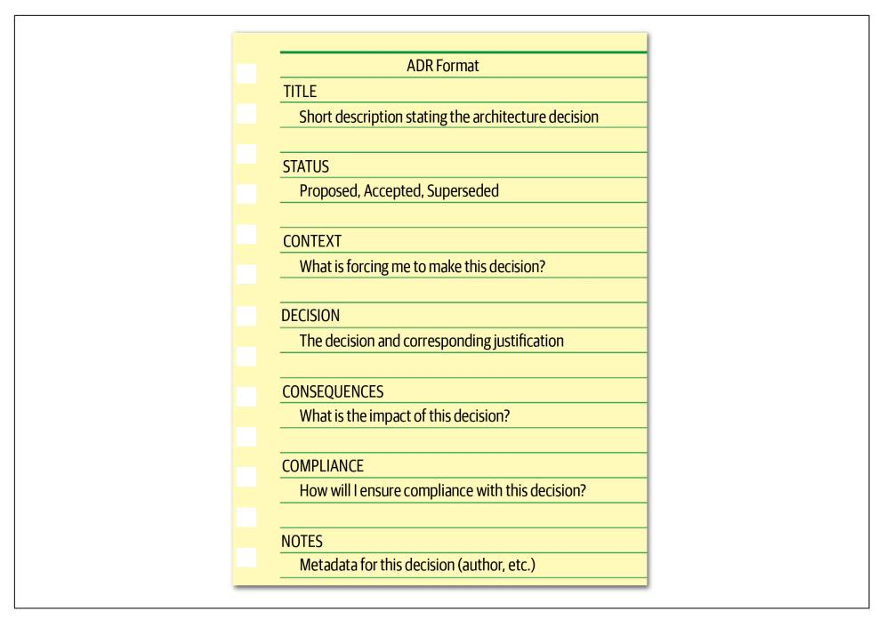
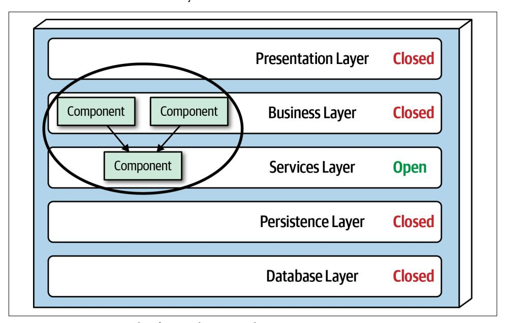
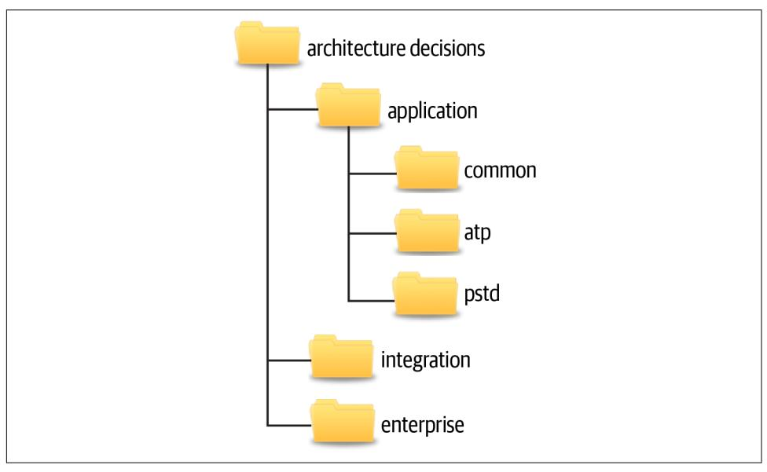
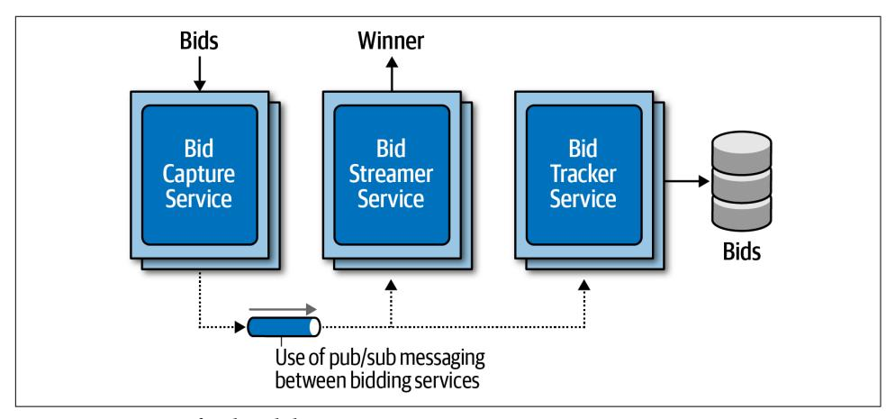

# Chapter 19: Architecture Decisions

<span id="page-300-0"></span>One of the core expectations of an architect is to make architecture decisions. Archi‐ tecture decisions usually involve the structure of the application or system, but they may involve technology decisions as well, particularly when those technology deci‐ sions impact architecture characteristics. Whatever the context, a good architecture decision is one that helps guide development teams in making the right technical choices. Making architecture decisions involves gathering enough relevant informa‐ tion, justifying the decision, documenting the decision, and effectively communicat‐ ing that decision to the right stakeholders.

## Architecture Decision Anti-Patterns

There is an art to making architecture decisions. Not surprisingly, several architecture anti-patterns emerge when making decisions as an architect. The programmer [Andrew Koenig](https://oreil.ly/p9i_Y) defines an anti-pattern as something that seems like a good idea when you begin, but leads you into trouble. Another definition of an anti-pattern is a repeatable process that produces negative results. The three major architecture antipatterns that can (and usually do) emerge when making architecture decisions are the *Covering Your Assets* anti-pattern, the *Groundhog Day* anti-pattern, and the *Email-Driven Architecture* anti-pattern. These three anti-patterns usually follow a progres‐ sive flow: overcoming the Covering Your Assets anti-pattern leads to the Groundhog Day anti-pattern, and overcoming this anti-pattern leads to the Email-Driven Archi‐ tecture anti-pattern. Making effective and accurate architecture decisions requires an architect to overcome all three of these anti-patterns.

<span id="page-301-0"></span>
## Covering Your Assets Anti-Pattern

The first anti-pattern to emerge when trying to make architecture decisions is the Covering Your Assets anti-pattern. This anti-pattern occurs when an architect avoids or defers making an architecture decision out of fear of making the wrong choice.

There are two ways to overcome this anti-pattern. The first is to wait until the *last responsible moment* to make an important architecture decision. The last responsible moment means waiting until you have enough information to justify and validate your decision, but not waiting so long that you hold up development teams or fall into the *Analysis Paralysis* anti-pattern. The second way to avoid this anti-pattern is to continually collaborate with development teams to ensure that the decision you made can be implemented as expected. This is vitally important because it is not feasible as an architect to possibly know every single detail about a particular technology and all the associated issues. By closely collaborating with development teams, the architect can respond quickly to a change in the architecture decision if issues occur.

To illustrate this point, suppose an architect makes the decision that all productrelated reference data (product description, weight, and dimensions) be cached in all service instances needing that information using a read-only replicated cache, with the primary replica owned by the catalog service. A replicated cache means that if there are any changes to product information (or a new product is added), the catalog service would update its cache, which would then be replicated to all other services requiring that data through a replicated (in-memory) cache product. A good justifi‐ cation for this decision is to reduce coupling between the services and to effectively share data without having to make an interservice call. However, the development teams implementing this architecture decision find that due to certain scalability requirements of some of the services, this decision would require more in-process memory than is available. By closely collaborating with the development teams, the architect can quickly become aware of the issue and adjust the architecture decision to accommodate these situations.

## Groundhog Day Anti-Pattern

Once an architect overcomes the Covering Your Assets anti-pattern and starts mak‐ ing decisions, a second anti-pattern emerges: the Groundhog Day anti-pattern. The Groundhog Day anti-pattern occurs when people don't know why a decision was made, so it keeps getting discussed over and over and over. The Groundhog Day antipattern gets it name from the Bill Murray movie *Groundhog Day*, where it was Febru‐ ary 2 over and over every day.

The Groundhog Day anti-pattern occurs because once an architect makes an archi‐ tecture decision, they fail to provide a justification for the decision (or a complete jus‐ tification). When justifying architecture decisions it is important to provide both technical and business justifications for your decision. For example, an architect may

<span id="page-302-0"></span>make the decision to break apart a monolithic application into separate services to decouple the functional aspects of the application so that each part of the application uses fewer virtual machine resources and can be maintained and deployed separately. While this is a good example of a technical justification, what is missing is the busi‐ ness justification—in other words, why should the business pay for this architectural refactoring? A good business justification for this decision might be to deliver new business functionality faster, therefore improving time to market. Another might be to reduce the costs associated with the development and release of new features.

Providing the business value when justifying decisions is vitally important for any architecture decision. It is also a good litmus test for determining whether the archi‐ tecture decision should be made in the first place. If a particular architecture decision does not provide any business value, then perhaps it is not a good decision and should be reconsidered.

Four of the most common business justifications include cost, time to market, user satisfaction, and strategic positioning. When focusing on these common business jus‐ tifications, it is important to take into consideration what is important to the business stakeholders. Justifying a particular decision based on cost savings alone might not be the right decision if the business stakeholders are less concerned about cost and more concerned about time to market.

## Email-Driven Architecture Anti-Pattern

Once an architect makes decisions and fully justifies those decisions, a third architec‐ ture anti-pattern emerges: *Email-Driven Architecture*. The Email-Driven Architecture anti-pattern is where people lose, forget, or don't even know an architecture decision has been made and therefore cannot possibly implement that architecture decision. This anti-pattern is all about effectively communicating your architecture decisions. Email is a great tool for communication, but it makes a poor document repository system.

There are many ways to increase the effectiveness of communicating architecture decisions, thereby avoiding the Email-Driven Architecture anti-pattern. The first rule of communicating architecture decisions is to not include the architecture decision in the body of an email. Including the architecture decision in the body of the email cre‐ ates multiple systems of record for that decision. Many times important details (including the justification) are left out of the email, therefore creating the Ground‐ hog Day anti-pattern all over again. Also, if that architecture decision is ever changed or superseded, how may people received the revised decision? A better approach is to mention only the nature and context of the decision in the body of the email and pro‐ vide a link to the single system of record for the actual architecture decision and cor‐ responding details (whether it be a link to a wiki page or a document in a filesystem).

<span id="page-303-0"></span>The second rule of effectively communicating architecture decisions is to only notify those people who really care about the architecture decision. One effective technique is to write the body of the email as follows:

"Hi Sandra, I've made an important decision regarding communication between services that directly impacts you. Please see the decision using the following link…"

Notice the phrasing in the first sentence: "important decision regarding communica‐ tion between services." Here, the context of the decision is mentioned, but not the actual decision itself. The second part of the first sentence is even more important: "that directly impacts you." If an architectural decision doesn't directly impact the person, then why bother that person with your architecture decision? This is a great litmus test for determining which stakeholders (including developers) should be noti‐ fied directly of an architecture decision. The second sentence provides a link to the location of the architecture decision so it is located in only one place, hence a single system of record for the decision.

## Architecturally Significant

Many architects believe that if the architecture decision involves any specific technol‐ ogy, then it's not an architecture decision, but rather a technical decision. This is not always true. If an architect makes a decision to use a particular technology because it directly supports a particular architecture characteristic (such as performance or scal‐ ability), then it's an architecture decision.

[Michael Nygard,](https://www.michaelnygard.com) a well-known software architect and author of *Release It!* (Pragmatic Bookshelf), addressed the problem of what decisions an architect should be responsi‐ ble for (and hence what is an architecture decision) by coining the term *architectur‐ ally signicant*. According to Michael, architecturally significant decisions are those decisions that affect the structure, nonfunctional characteristics, dependencies, inter‐ faces, or construction techniques.

The *structure* refers to decisions that impact the patterns or styles of architecture being used. An example of this is the decision to share data between a set of microser‐ vices. This decision impacts the bounded context of the microservice, and as such affects the structure of the application.

The *nonfunctional characteristics* are the architecture characteristics ("-ilities") that are important for the application or system being developed or maintained. If a choice of technology impacts performance, and performance is an important aspect of the application, then it becomes an architecture decision.

*Dependencies* refer to coupling points between components and/or services within the system, which in turn impact overall scalability, modularity, agility, testability, reliability, and so on.

<span id="page-304-0"></span>*Interfaces* refer to how services and components are accessed and orchestrated, usu‐ ally through a gateway, integration hub, service bus, or API proxy. Interfaces usually involve defining contracts, including the versioning and deprecation strategy of those contracts. Interfaces impact others using the system and hence are architecturally significant.

Finally, *construction techniques* refer to decisions about platforms, frameworks, tools, and even processes that, although technical in nature, might impact some aspect of the architecture.

## Architecture Decision Records

One of the most effective ways of documenting architecture decisions is through *Architecture Decision Records* [\(ADRs\)](https://adr.github.io). ADRs were first evangelized by Michael Nygard in a [blog post](https://oreil.ly/yDcU2) and later marked as "adopt" in the [ThoughtWorks Technology](https://oreil.ly/0nwHw) [Radar](https://oreil.ly/0nwHw). An ADR consists of a short text file (usually one to two pages long) describing a specific architecture decision. While ADRs can be written using plain text, they are usually written in some sort of text document format like [AsciiDoc](http://asciidoc.org) or [Markdown.](https://www.markdownguide.org) Alternatively, an ADR can also be written using a wiki page template.

Tooling is also available for managing ADRs. Nat Pryce, coauthor of *Growing Object-Oriented Soware Guided by Tests* (Addison-Wesley), has written an open source tool for ADRs called [ADR-tools](https://oreil.ly/6d8LN). ADR-tools provides a command-line interface to manage ADRs, including the numbering schemes, locations, and superseded logic. Micha Kops, a software engineer from Germany, has written a [blog post](https://oreil.ly/OgBZK) about using ADRtools that provides some great examples on how they can be used to manage architec‐ ture decision records.

## Basic Structure

The basic structure of an ADR consists of five main sections: *Title*, *Status*, *Context*, *Decision*, and *Consequences*. We usually add two additional sections as part of the basic structure: *Compliance* and *Notes*. This basic structure (as illustrated in [Figure 19-1\)](#page-305-0) can be extended to include any other section deemed needed, providing the template is kept both consistent and concise. A good example of this might be to add an *Alternatives* section if necessary to provide an analysis of all the other possible alternative solutions.

<span id="page-305-0"></span>

*Figure 19-1. Basic ADR structure*

### Title

The title of an ADR is usually numbered sequentially and contains a short phrase describing the architecture decisions. For example, the decision to use asynchronous messaging between the Order Service and the Payment Service might read: "42. Use of Asynchronous Messaging Between Order and Payment Services." The title should be descriptive enough to remove any ambiguity about the nature and context of the decision but at the same time be short and concise.

#### Status

The status of an ADR can be marked as *Proposed*, *Accepted*, or *Superseded*. *Proposed* status means the decision must be approved by either a higher-level decision maker or some sort of architectural governance body (such as an architecture review board). *Accepted* status means the decision has been approved and is ready for implementa‐ tion. A status of *Superseded* means the decision has been changed and superseded by another ADR. Superseded status always assumes the prior ADR status was accepted; in other words, a proposed ADR would never be superseded by another ADR, but rather continued to be modified until accepted.

<span id="page-306-0"></span>The Superseded status is a powerful way of keeping a historical record of what deci‐ sions were made, why they were made at that time, and what the new decision is and why it was changed. Usually, when an ADR has been superseded, it is marked with the decision that superseded it. Similarly, the decision that supersedes another ADR is marked with the ADR it superseded. For example, assume ADR 42 ("Use of Asyn‐ chronous Messaging Between Order and Payment Services") was previously approved, but due to later changes to the implementation and location of the Pay‐ ment Service, REST must now be used between the two services (ADR 68). The status would look as follows:

*ADR 42. Use of Asynchronous Messaging Between Order and Payment Services*

Status: Superseded by 68

*ADR 68. Use of REST Between Order and Payment Services*

Status: Accepted, supersedes 42

The link and history trail between ADRs 42 and 68 avoid the inevitable "what about using messaging?" question regarding ADR 68.

## ADRs and Request for Comments (RFC)

If an architect wishes to send out a draft ADR for comments (which is sometimes a good idea when the architect wants to validate various assumptions and assertions with a larger audience of stakeholders), we recommend creating a new status named *Request for Comments* (or *RFC*) and specify a deadline date when that review would be complete. This practice avoids the inevitable Analysis Paralysis anti-pattern where the decision is forever discussed but never actually made. Once that date is reached, the architect can analyze all the comments made on the ADR, make any necessary adjustments to the decision, make the final decision, and set the status to Proposed (unless the architect is able to approve the decision themselves, in which case the sta‐ tus would then be set to Accepted). An example of an RFC status for an ADR would look as follows:

*STATUS*

*Request For Comments, Deadline 09 JAN 2010*

Another significant aspect of the Status section of an ADR is that it forces an architect to have necessary conversations with their boss or lead architect about the criteria with which they can approve an architecture decision on their own, or whether it must be approved through a higher-level architect, an architecture review board, or some other architecture governing body.

Three criteria that form a good start for these conversations are cost, cross-team impact, and security. Cost can include software purchase or licensing fees, additional hardware costs, as well as the overall level of effort to implement the architecture <span id="page-307-0"></span>decision. Level of effort costs can be estimated by multiplying the estimated number of hours to implement the architecture decision by the company's standard *Full-Time Equivalency* (FTE) rate. The project owner or project manager usually has the FTE amount. If the cost of the architecture decision exceeds a certain amount, then it must be set to Proposed status and approved by someone else. If the architecture decision impacts other teams or systems or has any sort of security implication, then it cannot be self-approved by the architect and must be approved by a higher-level governing body or lead architect.

Once the criteria and corresponding limits have been established and agreed upon (such as "costs exceeding €5,000 must be approved by the architecture review board"), this criteria should be well documented so that all architects creating ADRs know when they can and cannot approve their own architecture decisions.

### Context

The context section of an ADR specifies the forces at play. In other words, "what sit‐ uation is forcing me to make this decision?" This section of the ADR allows the archi‐ tect to describe the specific situation or issue and concisely elaborate on the possible alternatives. If an architect is required to document the analysis of each alternative in detail, then an additional Alternatives section can be added to the ADR rather than adding that analysis to the Context section.

The Context section also provides a way to document the architecture. By describing the context, the architect is also describing the architecture. This is an effective way of documenting a specific area of the architecture in a clear and concise manner. Con‐ tinuing with the example from the prior section, the context might read as follows: "The order service must pass information to the payment service to pay for an order currently being placed. This could be done using REST or asynchronous messaging." Notice that this concise statement not only specified the scenario, but also the alternatives.

#### Decision

The Decision section of the ADR contains the architecture decision, along with a full justification for the decision. Michael Nygard introduced a great way of stating an architecture decision by using a very affirmative, commanding voice rather than a passive one. For example, the decision to use asynchronous messaging between serv‐ ices would read "*we will use* asynchronous messaging between services." This is a much better way of stating a decision as opposed to *"I think* asynchronous messaging between services would be the best choice." Notice here it is not clear what the deci‐ sion is or even if a decision has even been made—only the opinion of the architect is stated.

Perhaps one of the most powerful aspects of the Decision section of ADRs is that it allows an architect to place more emphasis on the *why* rather than the *how*. Under‐ standing why a decision was made is far more important than understanding how something works. Most architects and developers can identify how things work by looking at context diagrams, but not why a decision was made. Knowing why a deci‐ sion was made and the corresponding justification for the decision helps people bet‐ ter understand the context of the problem and avoids possible mistakes through refactoring to another solution that might produce issues.

To illustrate this point, consider an original architecture decision several years ago to use Google's Remote Procedure Call ([gRPC](https://www.grpc.io)) as a means to communicate between two services. Without understanding why that decision was made, another architect sev‐ eral years later makes the choice to override that decision and use messaging instead to better decouple the services. However, implementing this refactoring suddenly causes a significant increase in latency, which in turn ultimately causes time outs to occur in upstream systems. Understanding that the original use of gRPC was to sig‐ nificantly reduce latency (at the cost of tightly coupled services) would have preven‐ ted the refactoring from happening in the first place.

#### Consequences

The Consequences section of an ADR is another very powerful section. This section documents the overall impact of an architecture decision. Every architecture decision an architect makes has some sort of impact, both good and bad. Having to specify the impact of an architecture decision forces the architect to think about whether those impacts outweigh the benefits of the decision.

Another good use of this section is to document the trade-off analysis associated with the architecture decision. These trade-offs could be cost-based or trade-offs against other architecture characteristics ("-ilities"). For example, consider the decision to use asynchronous (fire-and-forget) messaging to post a review on a website. The justifi‐ cation for this decision is to significantly increase the responsiveness of the post review request from 3,100 milliseconds to 25 milliseconds because users would not need to wait for the actual review to be posted (only for the message to be sent to a queue). While this is a good justification, someone else might argue that this is a bad idea due to the complexity of the error handling associated with an asynchronous request ("what happens if someone posts a review with some bad words?"). Unknown to the person challenging this decision, that issue was already discussed with the busi‐ ness stakeholders and other architects, and it was decided from a trade-off perspec‐ tive that it was more important to have the increase in responsiveness and deal with the complex error handling rather than have the wait time to synchronously provide feedback to the user that the review was successfully posted. By leveraging ADRs, that trade-off analysis can be included in the Consequences section, providing a complete <span id="page-309-0"></span>picture of the context (and trade-offs) of the architecture decision and thus avoiding these situations.

#### Compliance

The compliance section of an ADR is not one of the standard sections in an ADR, but it's one we highly recommend adding. The Compliance section forces the architect to think about how the architecture decision will be measured and governed from a compliance perspective. The architect must decide whether the compliance check for this decision must be manual or if it can be automated using a fitness function. If it can be automated using a fitness function, the architect can then specify in this sec‐ tion how that fitness function would be written and whether there are any other changes to the code base are needed to measure this architecture decision for compliance.

For example, consider the following architecture decision within a traditional ntiered layered architecture as illustrated in Figure 19-2. All shared objects used by business objects in the business layer will reside in the shared services layer to isolate and contain shared functionality.



*Figure 19-2. An example of an architecture decision*

This architecture decision can be measured and governed automatically by using either [ArchUnit](https://www.archunit.org) in Java or [NetArchTest](https://oreil.ly/0J5fN) in C#. For example, using ArchUnit in Java, the automated fitness function test might look as follows:

```
@Test
public void shared_services_should_reside_in_services_layer() {
 classes().that().areAnnotatedWith(SharedService.class)
 .should().resideInAPackage("..services..")
 .because("All shared services classes used by business " +
 "objects in the business layer should reside in the services " +
 "layer to isolate and contain shared logic")
 .check(myClasses);
}
```

Notice that this automated fitness function would require new stories to be written to create a new Java annotation (@SharedService) and to then add this annotation to all shared classes. This section also specifies what the test is, where the test can be found, and how the test will be executed and when.

#### Notes

Another section that is not part of a standard ADR but that we highly recommend adding is the Notes section. This section includes various metadata about the ADR, such as the following:

- Original author
- Approval date
- Approved by
- Superseded date
- Last modified date
- Modified by
- Last modification

Even when storing ADRs in a version control system (such as Git), additional metainformation is useful beyond what the repository can support, so we recommend adding this section regardless of how and where ADRs are stored.

## Storing ADRs

Once an architect creates an ADR, it must be stored somewhere. Regardless of where ADRs are stored, each architecture decision should have its own file or wiki page. Some architects like to keep ADRs in the Git repository with the source code. Keep‐ ing ADRs in a Git repository allows the ADR to be versioned and tracked as well. However, for larger organizations we caution against this practice for several reasons. First, everyone who needs to see the architecture decision may not have access to the Git repository. Second, this is not a good place to store ADRs that have a context out‐ side of the application Git repository (such as integration architecture decisions, enterprise architecture decisions, or those decisions common to every application). <span id="page-311-0"></span>For these reasons we recommend storing ADRs either in a wiki (using a wiki tem‐ plate) or in a shared directory on a shared file server that can be accessed easily by a wiki or other document rendering software. Figure 19-3 shows an example of what this directory structure (or wiki page navigation structure) might look like.



*Figure 19-3. Example directory structure for storing ADRs*

The *application* directory contains those architecture decisions that are specific to some sort of application context. This directory is subdivided into further directories. The *common* subdirectory is for architecture decisions that apply to all applications, such as "All framework-related classes will contain an annotation (@Framework in Java) or attribute ([Framework] in C#) identifying the class as belonging to the underlying framework code." Subdirectories under the *application* directory corre‐ spond to the specific application or system context and contain the architecture deci‐ sions specific to that application or system (in this example, the ATP and PSTD applications). The *integration* directory contains those ADRs that involve the com‐ munication between application, systems, or services. Enterprise architecture ADRs are contained within the *enterprise* directory, indicating that these are global architec‐ ture decisions impacting all systems and applications. An example of an enterprise architecture ADR would be "All access to a system database will only be from the owning system," thus preventing the sharing of databases across multiple systems.

When storing ADRs in a wiki (our recommendation), the same structure previously described applies, with each directory structure representing a navigational landing page. Each ADR would be represented as a single wiki page within each navigational landing page (Application, Integration, or Enterprise).

<span id="page-312-0"></span>The directory or landing page names indicated in this section are only a recommen‐ dation. Each company can choose whatever names fit their situation, as long as those names are consistent across teams.

## ADRs as Documentation

Documenting software architecture has always been a difficult topic. While some standards are emerging for diagramming architecture (such as software architect Simon Brown's [C4 Model](https://c4model.com) or The Open Group [ArchiMate](https://oreil.ly/gbNQG) standard), no such stan‐ dard exists for documenting software architecture. That's where ADRs come in.

Architecture Decision Records can be used an an effective means to document a soft‐ ware architecture. The Context section of an ADR provides an excellent opportunity to describe the specific area of the system that requires an architecture decision to be made. This section also provides an opportunity to describe the alternatives. Perhaps more important is that the Decision section describes the reasons why a particular decision is made, which is by far the best form of architecture documentation. The Consequences section adds the final piece to the architecture documentation by describing additional aspects of a particular decision, such as the trade-off analysis of choosing performance over scalability.

## Using ADRs for Standards

Very few people like standards. Most times standards seem to be in place more for controlling people and the way they do things than anything useful. Using ADRs for standards can change this bad practice. For example, the Context section of an ADR describes the situation that is forcing the particular standard. The Decision section of an ADR can be used to not only indicate what the standard is, but more importantly why the standard needs to exist. This is a wonderful way of being able to qualify whether the particular standard should even exist in the first place. If an architect cannot justify the standard, then perhaps it is not a good standard to make and enforce. Furthermore, the more developers understand why a particular standard exists, the more likely they are to follow it (and correspondingly not challenge it). The Consequences section of an ADR is another great place an architect can qualify whether a standard is valid and should be made. In this section the architect must think about and document what the implications and consequences are of a particu‐ lar standard they are making. By analyzing the consequences, the architect might decide that the standard should not be applied after all.

<span id="page-313-0"></span>
## Example

Many architecture decisions exist within our ongoing ["Case Study: Going, Going,](012-chapter-7-scope-of-architecture-characteristics.md#page-114-0) [Gone" on page 95.](012-chapter-7-scope-of-architecture-characteristics.md#page-114-0) The use of event-driven microservices, the splitting up of the bid‐ der and auctioneer user interfaces, the use of the Real-time Transport Protocol (RTP) for video capture, the use of a single API layer, and the use of publish-and-subscribe messaging are just a few of the dozens of architecture decisions that are made for this auction system. Every architecture decision made in a system, no matter how obvi‐ ous, should be documented and justified.

Figure 19-4 illustrates one of the architecture decisions within the Going, Going, Gone auction system, which is the use of publish-and-subscribe (pub/sub) messaging between the bid capture, bid streamer, and bid tracker services.



*Figure 19-4. Use of pub/sub between services*

<span id="page-314-0"></span>
### The ADR for this architecture decision might look simliar to Figure 19-5:

#### ADR 76. Asynchronous Pub/Sub Messaging Between Bidding Services

#### STATUS

Accepted

#### CONTEXT

The Bid Capture Service, upon receiving a bid from an online bidder or from a live bidder via the auctioneer, must forward that bid onto the Bid Streamer Service and the Bidder Tracker Service. This could be done using asynchronous point-to-point (p2p) messaging, asynchronous publish-and-subscribe (pub/sub) messaging, or REST via the Online Auction API Laver.

#### DECISION

We will use asynchronous pub/sub messaging between the Bid Capture Service, Bid Streamer Service, and the Bidder Tracker Service.

The Bid Capture Service does not need any information back from the Bid Streamer Service or Bidder Tracker Service.

The Bid Streamer Service must receive bids in the exact order they were accepted by the Bid Capture Service. Using messaging and queues automatically guarantees the bid order for the stream.

Using async pub/sub messaging will increase the performance of the bidding process and allow for extensibility of bidding information.

#### CONSEQUENCES

We will require clustering and high availability of the message queues.

Internal bid events will be bypassing security checks done in the API layer.

UPDATE: Upon review at the April 14th, 2020 ARB meeting, the ARB decided that this was an acceptable trade-off and no additional security checks would be needed for bid events between these services.

#### COMPLIANCE

We will use periodic manual code and design reviews to ensure that asynchronous pub/sub messaging is being used between the Bid Capture Service, Bid Streamer Service, and the Bidder Tracker Service.

#### NOTES

Author: Subashini Nadella

Approved By: ARB Meeting Members, 14 APRIL 2020 Last Updated: 15 APRIL 2020 by Subashini Nadella

Figure 19-5. ADR 76. Asynchronous Pub/Sub Messaging Between Bidding Services
