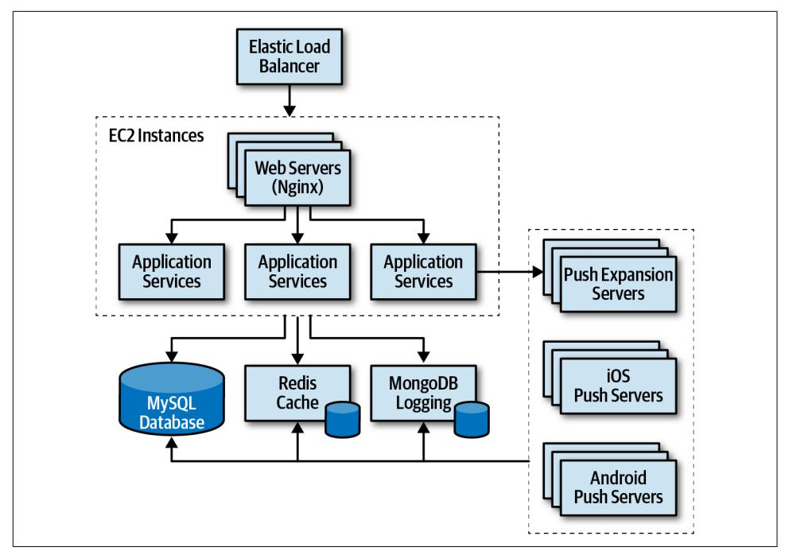
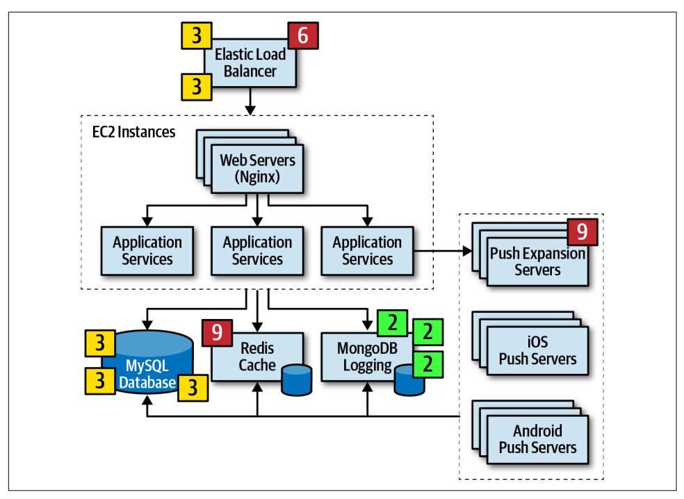
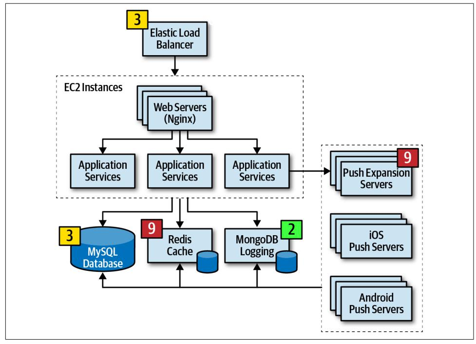
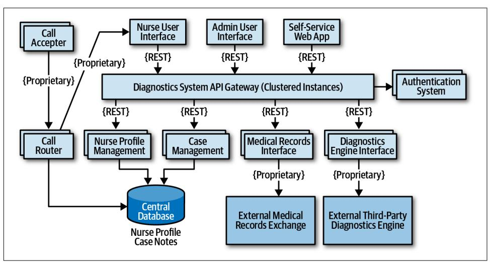
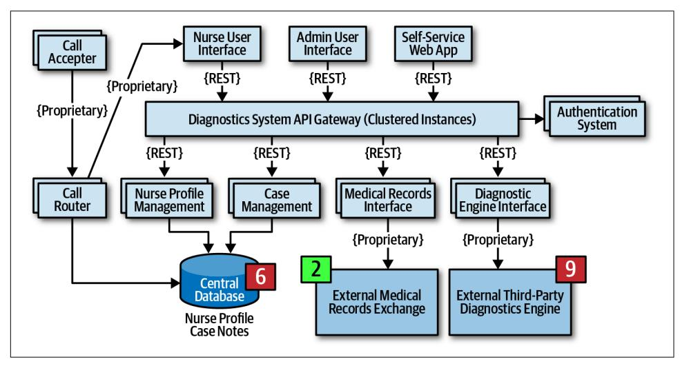
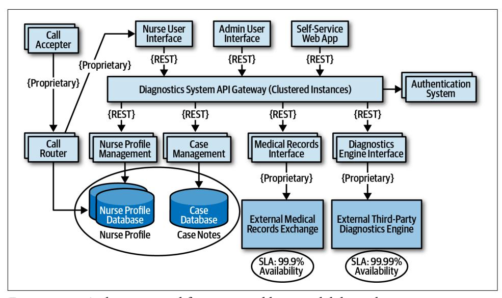
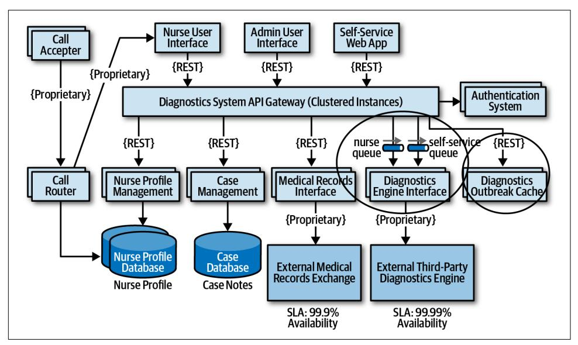
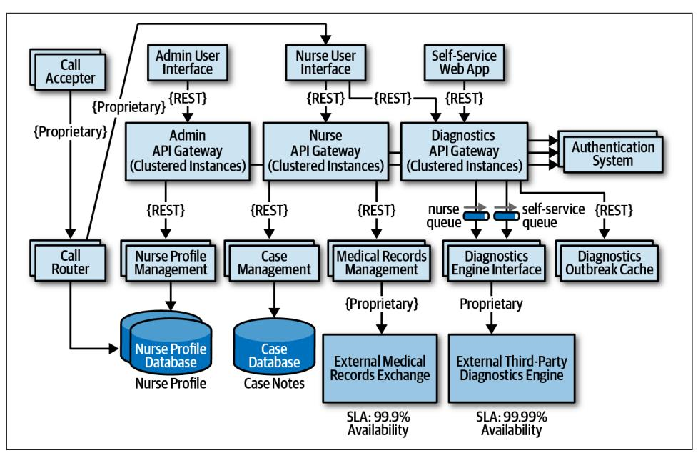

# Chapter 20: Analyzing Architecture Risk

Every architecture has risk associated with it, whether it be risk involving availability, scalability, or data integrity. Analyzing architecture risk is one of the key activities of architecture. By continually analyzing risk, the architect can address deficiencies within the architecture and take corrective action to mitigate the risk. In this chapter we introduce some of the key techniques and practices for qualifying risk, creating risk assessments, and identifying risk through an activity called *risk storming*.

## Risk Matrix

The first issue that arises when assessing architecture risk is determining whether the risk should be classified as low, medium, or high. Too much subjectiveness usually enters into this classification, creating confusion about which parts of the architecture are really high risk versus medium risk. Fortunately, there is a risk matrix architects can leverage to help reduce the level of subjectiveness and qualify the risk associated with a particular area of the architecture.

The architecture risk matrix (illustrated in [Figure 20-1](#page-317-0)) uses two dimensions to qual‐ ify risk: the overall impact of the risk and the likelihood of that risk occurring. Each dimensions has a low (1), medium (2), and high (3) rating. These numbers are multi‐ plied together within each grid of the matrix, providing an objective numerical num‐ ber representing that risk. Numbers 1 and 2 are considered low risk (green), numbers 3 and 4 are considered medium risk (yellow), and numbers 6 through 9 are consid‐ ered high risk (red).

|                        |            | Likeliho | od of risk occur | ring     |
|------------------------|------------|----------|------------------|----------|
|                        |            | Low (1)  | Medium (2)       | High (3) |
| t of risk              | Low (1)    | 1        | 2                | 3        |
| Overall impact of risk | Medium (2) | 2        | 4                | 6        |
| 00                     | High (3)   | 3        | 6                | 9        |

*Figure 20-1. Matrix for determining architecture risk*

To see how the risk matrix can be used, suppose there is a concern about availability with regard to a primary central database used in the application. First, consider the impact dimension—what is the overall impact if the database goes down or becomes unavailable? Here, an architect might deem that high risk, making that risk either a 3 (medium), 6 (high), or 9 (high). However, after applying the second dimension (like‐ lihood of risk occurring), the architect realizes that the database is on highly available servers in a clustered configuration, so the likelihood is low that the database would become unavailable. Therefore, the intersection between the high impact and low likelihood gives an overall risk rating of 3 (medium risk).

When leveraging the risk matrix to qualify the risk, consider the impact dimension first and the likelihood dimension second.

## Risk Assessments

The risk matrix described in the previous section can be used to build what is called a *risk assessment*. A risk assessment is a summarized report of the overall risk of an architecture with respect to some sort of contextual and meaningful assessment criteria.

Risk assessments can vary greatly, but in general they contain the risk (qualified from the risk matrix) of some *assessment criteria* based on services or domain areas of an application. This basic risk assessment report format is illustrated in Figure 20-2, where light gray (1-2) is low risk, medium gray (3-4) is medium risk, and dark gray (6-9) is high risk. Usually these are color-coded as green (low), yellow (medium), and red (high), but shading can be useful for black-and-white rendering and for color blindness.

| RISK CRITERIA  | Customer registration | Catalog checkout | Order fulfillment | Order shipment | TOTAL RISK |
|----------------|-----------------------|---------------------|----------------------|-------------------|---------------|
| Scalability    | 2                     | 6                   | 1                    | 2                 | 11            |
| Availability   | 3                     | 4                   | 2                    | 1                 | 10            |
| Performance    | 4                     | 2                   | 3                    | 6                 | 15            |
| Security       | 6                     | 3                   | 1                    | 1                 | 11            |
| Data integrity | 9                     | 6                   | 1                    | 1                 | 17            |
| TOTAL RISK     | 24                    | 21                  | 8                    | 11                |               |

*Figure 20-2. Example of a standard risk assessment*

The quantified risk from the risk matrix can be accumulated by the risk criteria and also by the service or domain area. For example, notice in Figure 20-2 that the accu‐ mulated risk for data integrity is the highest risk area at a total of 17, whereas the accumulated risk for Availability is only 10 (the least amount of risk). The relative risk of each domain area can also be determined by the example risk assessment. Here, customer registration carries the highest area of risk, whereas order fulfillment carries the lowest risk. These relative numbers can then be tracked to demonstrate either improvements or degradation of risk within a particular risk category or domain area.

Although the risk assessment example in Figure 20-2 contains all the risk analysis results, rarely is it presented as such. Filtering is essential for visually indicating a par‐ ticular message within a given context. For example, suppose an architect is in a meeting for the purpose of presenting areas of the system that are high risk. Rather than presenting the risk assessment as illustrated in Figure 20-2, filtering can be used to only show the high risk areas (shown in [Figure 20-3\)](#page-319-0), improving the overall signalto-noise ratio and presenting a clear picture of the state of the system (good or bad).

| RISK CRITERIA  | Customer registration | Catalog checkout | Order fulfillment | Order shipment | TOTAL RISK |
|----------------|-----------------------|---------------------|----------------------|-------------------|---------------|
| Scalability    |                       | 6                   |                      |                   | 6             |
| Availability   |                       |                     |                      |                   | 0             |
| Performance    |                       |                     |                      | 6                 | 6             |
| Security       | 6                     |                     |                      |                   | 6             |
| Data integrity | 9                     | 6                   |                      |                   | 15            |
| TOTAL RISK     | 15                    | 12                  | 0                    | 6                 |               |

*Figure 20-3. Filtering the risk assessment to only high risk*

Another issue with [Figure 20-2](#page-318-0) is that this assessment report only shows a snapshot in time; it does not show whether things are improving or getting worse. In other words, [Figure 20-2](#page-318-0) does not show the direction of risk. Rendering the direction of risk presents somewhat of an issue. If an up or down arrow were to be used to indi‐ cate direction, what would an up arrow mean? Are things getting better or worse? We've spent years asking people if an up arrow meant things were getting better or worse, and almost 50% of people asked said that the up arrow meant things were pro‐ gressively getting worse, whereas almost 50% said an up arrow indicated things were getting better. The same is true for left and right arrows. For this reason, when using arrows to indicate direction, a key must be used. However, we've also found this doesn't work either. Once the user scrolls beyond the key, confusion happens once again.

We usually use the universal direction symbol of a plus (+) and minus (-) sign next to the risk rating to indicate direction, as illustrated in [Figure 20-4](#page-320-0). Notice in [Figure 20-4](#page-320-0) that although performance for customer registration is medium (4), the direction is a minus sign (red), indicating that it is progressively getting worse and heading toward high risk. On the other hand, notice that scalability of catalog check‐ out is high (6) with a plus sign (green), showing that it is improving. Risk ratings without a plus or minus sign indicate that the risk is stable and neither getting better nor worse.

| RISK CRITERIA  | Customer registration | Catalog checkout | Order fulfillment | Order shipment | TOTAL RISK |
|----------------|-----------------------|---------------------|----------------------|-------------------|---------------|
| Scalability    | 2                     | 6 +                 | 1                    | 2                 | 11            |
| Availability   | 3                     | 4                   | 2 -                  | 1                 | 10            |
| Performance    | 4-                    | 2+                  | 3 -                  | 6+                | 15            |
| Security       | 6-                    | 3                   | 1                    | 1                 | 11            |
| Data integrity | 9+                    | 6 –                 | 1 -                  | 1                 | 17            |
| TOTAL RISK     | 24                    | 21                  | 8                    | 11                |               |

*Figure 20-4. Showing direction of risk with plus and minus signs*

Occasionally, even the plus and minus signs can be confusing to some people. Another technique for indicating direction is to leverage an arrow along with the risk rating number it is trending toward. This technique, as illustrated in Figure 20-5, does not require a key because the direction is clear. Furthermore, the use of colors (red arrow for worse, green arrow for better) makes it even more clear where the risk is heading.

| RISK CRITERIA  | Customer registration | Catalog checkout     | Order fulfillment | Order shipment       | TOTAL RISK |
|----------------|-----------------------|-------------------------|----------------------|-------------------------|---------------|
| Scalability    | 2                     | <b>6</b> 4 ↑ | 1                    | 2                       | 11            |
| Availability   | 3                     | 4                       | 2 3                  | 1                       | 10            |
| Performance    | 4 6                   | 2 1                     | 3 4                  | <b>6</b> 4 ↑ | 15            |
| Security       | 6 9                   | 3                       | 1                    | 1                       | 11            |
| Data integrity | 9 6                   | 6 9                     | 1 2                  | 1                       | 17            |
| TOTAL RISK     | 24                    | 21                      | 8                    | 11                      |               |

*Figure 20-5. Showing direction of risk with arrows and numbers*

The direction of risk can be determined by using continuous measurements through fitness functions described earlier in the book. By objectively analyzing each risk cri‐ teria, trends can be observed, providing the direction of each risk criteria.

## Risk Storming

No architect can single-handedly determine the overall risk of a system. The reason for this is two-fold. First, a single architect might miss or overlook a risk area, and very few architects have full knowledge of every part of the system. This is where *risk storming* can help.

Risk storming is a collaborative exercise used to determine architectural risk within a specific dimension. Common dimensions (areas of risk) include unproven technol‐ ogy, performance, scalability, availability (including transitive dependencies), data loss, single points of failure, and security. While most risk storming efforts involve multiple architects, it is wise to include senior developers and tech leads as well. Not only will they provide an implementation perspective to the architectural risk, but involving developers helps them gain a better understanding of the architecture.

The risk storming effort involves both an individual part and a collaborative part. In the individual part, all participants individually (without collaboration) assign risk to areas of the architecture using the risk matrix described in the previous section. This noncollaborative part of risk storming is essential so that participants don't influence or direct attention away from particular areas of the architecture. In the collaborative part of risk storming, all participants work together to gain consensus on risk areas, discuss risk, and form solutions for mitigating the risk.

An architecture diagram is used for both parts of the risk storming effort. For holistic risk assessments, usually a comprehensive architecture diagram is used, whereas risk storming within specific areas of the application would use a contextual architecture diagram. It is the responsibility of the architect conducting the risk storming effort to make sure these diagrams are up to date and available to all participants.

[Figure 20-6](#page-322-0) shows an example architecture we'll use to illustrate the risk storming process. In this architecture, an Elastic Load Balancer fronts each EC2 instance con‐ taining the web servers (Nginx) and application services. The application services make calls to a MySQL database, a Redis cache, and a MongoDB database for logging. They also make calls to the Push Expansion Servers. The expansion servers, in turn, all interface with the MySQL database, Redis cache, and MongoDB logging facility.

*Figure 20-6. Architecture diagram for risk storming example*

Risk storming is broken down into three primary activities:

- 1. Identification
- 2. Consensus
- 3. Mitigation

Identification is always an individual, noncollaborative activity, whereas consensus and mitigation are always collaborative and involve all participants working together in the same room (at least virtually). Each of these primary activities is discussed in detail in the following sections.

## Identification

The *identication* activity of risk storming involves each participant individually identifying areas of risk within the architecture. The following steps describe the identification part of the risk storming effort:

1. The architect conducting the risk storming sends out an invitation to all partici‐ pants one to two days prior to the collaborative part of the effort. The invitation contains the architecture diagram (or the location of where to find it), the risk

storming dimension (area of risk being analyzed for that particular risk storming effort), the date when the collaborative part of risk storming will take place, and the location.

- 2. Using the risk matrix described in the first section of this chapter, participants individually analyze the architecture and classify the risk as low (1-2), medium (3-4), or high (6-9).
- 3. Participants prepare small Post-it notes with corresponding colors (green, yellow, and red) and write down the corresponding risk number (found on the risk matrix).

Most risk storming efforts only involve analyzing one particular dimension (such as performance), but there might be times, due to the availability of staff or timing issues, when multiple dimensions are analyzed within a single risk storming effort (such as performance, scalability, and data loss). When multiple dimensions are ana‐ lyzed within a single risk storming effort, the participants write the dimension next to the risk number on the Post-it notes so that everyone is aware of the specific dimen‐ sion. For example, suppose three participants found risk within the central database. All three identified the risk as high (6), but one participant found risk with respect to availability, whereas two participants found risk with respect to performance. These two dimensions would be discussed separately.

Whenever possible, restrict risk storming efforts to a single dimen‐ sion. This allows participants to focus their attention to that spe‐ cific dimension and avoids confusion about multiple risk areas being identified for the same area of the architecture.

## Consensus

The *consensus* activity in the risk storming effort is highly collaborative with the goal of gaining consensus among all participants regarding the risk within the architec‐ ture. This activity is most effective when a large, printed version of the architecture diagram is available and posted on the wall. In lieu of a large printed version, an elec‐ tronic version can be displayed on a large screen.

Upon arrival at the risk storming session, participants begin placing their Post-it notes on the architecture diagram in the area where they individually found risk. If an electronic version is used, the architect conducting the risk storming session quer‐ ies every participant and electronically places the risk on the diagram in the area of the architecture where the risk was identified (see [Figure 20-7](#page-324-0)).

*Figure 20-7. Initial identication of risk areas*

Once all of the Post-it notes are in place, the collaborative part of risk storming can begin. The goal of this activity of risk storming is to analyze the risk areas as a team and gain consensus in terms of the risk qualification. Notice several areas of risk were identified in the architecture, illustrated in Figure 20-7:

- 1. Two participants individually identified the Elastic Load Balancer as medium risk (3), whereas one participant identified it as high risk (6).
- 2. One participant individually identified the Push Expansion Servers as high risk (9).
- 3. Three participants individually identified the MySQL database as medium risk (3).
- 4. One participant individually identified the Redis cache as high risk (9).
- 5. Three participants identified MongoDB logging as low risk (2).
- 6. All other areas of the architecture were not deemed to carry any risk, hence there are no Post-it notes on any other areas of the architecture.

Items 3 and 5 in the prior list do not need further discussion in this activity since all participants agreed on the level and qualification of risk. However, notice there was a difference of opinion in item 1 in the list, and items 2 and 4 only had a single partici‐ pant identifying the risk. These items need to be discussed during this activity.

Item 1 in the list showed that two participants individually identified the Elastic Load Balancer as medium risk (3), whereas one participant identified it as high risk (6). In this case the other two participants ask the third participant why they identified the risk as high. Suppose the third participant says that they assigned the risk as high because if the Elastic Load Balancer goes down, the entire system cannot be accessed. While this is true and in fact does bring the overall impact rating to high, the other two participants convince the third participant that there is low risk of this happen‐ ing. After much discussion, the third participant agrees, bringing that risk level down to a medium (3). However, the first and second participants might not have seen a particular aspect of risk in the Elastic Load Balancer that the third did, hence the need for collaboration within this activity of risk storming.

Case in point, consider item 2 in the prior list where one participant individually identified the Push Expansion Servers as high risk (9), whereas no other participant identified them as any risk at all. In this case, all other participants ask the participant who identified the risk why they rated it as high. That participant then says that they have had bad experiences with the Push Expansion Servers continually going down under high load, something this particular architecture has. This example shows the value of risk storming—without that participant's involvement, no one would have seen the high risk (until well into production of course!).

Item 4 in the list is an interesting case. One participant identified the Redis cache as high risk (9), whereas no other participant saw that cache as any risk in the architec‐ ture. The other participants ask what the rationale is for the high risk in that area, and the one participant responds with, "What is a Redis cache?" In this case, Redis was unknown to the participant, hence the high risk in that area.

For unproven or unknown technologies, always assign the highest risk rating (9) since the risk matrix cannot be used for this dimension.

The example of item 4 in the list illustrates why it is wise (and important) to bring developers into risk storming sessions. Not only can developers learn more about the architecture, but the fact that one participant (who was in this case a developer on the team) didn't know a given technology provides the architect with valuable informa‐ tion regarding overall risk.

This process continues until all participants agree on the risk areas identified. Once all the Post-it notes are consolidated, this activity ends, and the next one can begin. The final outcome of this activity is shown in Figure 20-8.

*Figure 20-8. Consensus of risk areas*

### Mitigation

Once all participants agree on the qualification of the risk areas of the architecture, the final and most important activity occurs—*risk mitigation*. Mitigating risk within an architecture usually involves changes or enhancements to certain areas of the architecture that otherwise might have been deemed perfect the way they were.

This activity, which is also usually collaborative, seeks ways to reduce or eliminate the risk identified in the first activity. There may be cases where the original architecture needs to be completely changed based on the identification of risk, whereas others might be a straightforward architecture refactoring, such as adding a queue for back pressure to reduce a throughput bottleneck issue.

Regardless of the changes required in the architecture, this activity usually incurs additional cost. For that reason, key stakeholders typically decide whether the cost outweighs the risk. For example, suppose that through a risk storming session the central database was identified as being medium risk (4) with regard to overall system availability. In this case, the participants agreed that clustering the database, com‐

bined with breaking the single database into separate physical databases, would miti‐ gate that risk. However, while risk would be significantly reduced, this solution would cost \$20,000. The architect would then conduct a meeting with the key business stakeholder to discuss this trade-off. During this negotiation, the business owner decides that the price tag is too high and that the cost does not outweigh the risk. Rather than giving up, the architect then suggests a different approach—what about skipping the clustering and splitting the database into two parts? The cost in this case is reduced to \$8,000 while still mitigating most of the risk. In this case, the stake‐ holder agrees to the solution.

The previous scenario shows the impact risk storming can have not only on the over‐ all architecture, but also with regard to negotiations between architects and business stakeholders. Risk storming, combined with the risk assessments described at the start of this chapter, provide an excellent vehicle for identifying and tracking risk, improving the architecture, and handling negotiations between key stakeholders.

## Agile Story Risk Analysis

Risk storming can be used for other aspects of software development besides just architecture. For example, we've leveraged risk storming for determining overall risk of user story completion within a given Agile iteration (and consequently the overall risk assessment of that iteration) during story grooming. Using the risk matrix, user story risk can be identified by the first dimension (the overall impact if the story is not completed within the iteration) and the second dimension (the likelihood that the story will not be completed). By utilizing the same architecture risk matrix for stories, teams can identify stories of high risk, track those carefully, and prioritize them.

## Risk Storming Examples

To illustrate the power of risk storming and how it can improve the overall architec‐ ture of a system, consider the example of a call center system to support nurses advis‐ ing patients on various health conditions. The requirements for such a system are as follows:

- The system will use a third-party diagnostics engine that serves up questions and guides the nurses or patients regarding their medical issues.
- Patients can either call in using the call center to speak to a nurse or choose to use a self-service website that accesses the diagnostic engine directly, bypassing the nurses.
- The system must support 250 concurrent nurses nationwide and up to hundreds of thousands of concurrent self-service patients nationwide.

- • Nurses can access patients' medical records through a medical records exchange, but patients cannot access their own medical records.
- The system must be HIPAA compliant with regard to the medical records. This means that it is essential that no one but nurses have access to medical records.
- Outbreaks and high volume during cold and flu season need to be addressed in the system.
- Call routing to nurses is based on the nurse's profile (such as bilingual needs).
- The third-party diagnostic engine can handle about 500 requests a second.

The architect of the system created the high-level architecture illustrated in Figure 20-9. In this architecture there are three separate web-based user interfaces: one for self-service, one for nurses receiving calls, and one for administrative staff to add and maintain the nursing profile and configuration settings. The call center por‐ tion of the system consists of a call accepter which receives calls and the call router which routes calls to the next available nurse based on their profile (notice how the call router accesses the central database to get nurse profile information). Central to this architecture is a diagnostics system API gateway, which performs security checks and directs the request to the appropriate backend service.

*Figure 20-9. High-level architecture for nurse diagnostics system example*

There are four main services in this system: a case management service, a nurse pro‐ file management service, an interface to the medical records exchange, and the exter‐ nal third-party diagnostics engine. All communications are using REST with the exception of proprietary protocols to the external systems and call center services.

The architect has reviewed this architecture numerous times and believes it is ready for implementation. As a self-assessment, study the requirements and the architec‐ ture diagram in [Figure 20-9](#page-328-0) and try to determine the level of risk within this architec‐ ture in terms of availability, elasticity, and security. After determining the level of risk, then determine what changes would be needed in the architecture to mitigate that risk. The sections that follow contain scenarios that can be used as a comparison.

## Availability

During the first risk storming exercise, the architect chose to focus on availability first since system availability is critical for the success of this system. After the risk storm‐ ing identification and collaboration activities, the participants came up with the fol‐ lowing risk areas using the risk matrix (as illustrated in Figure 20-10):

- The use of a central database was identified as high risk (6) due to high impact (3) and medium likelihood (2).
- The diagnostics engine availability was identified as high risk (9) due to high impact (3) and unknown likelihood (3).
- The medical records exchange availability was identified as low risk (2) since it is not a required component for the system to run.
- Other parts of the system were not deemed as risk for availability due to multiple instances of each service and clustering of the API gateway.

*Figure 20-10. Availability risk areas*

During the risk storming effort, all participants agreed that while nurses can man‐ ually write down case notes if the database went down, the call router could not func‐ tion if the database were not available. To mitigate the database risk, participants chose to break apart the single physical database into two separate databases: one clustered database containing the nurse profile information, and one single instance database for the case notes. Not only did this architecture change address the con‐ cerns about availability of the database, but it also helped secure the case notes from admin access. Another option to mitigate this risk would have been to cache the nurse profile information in the call router. However, because the implementation of the call router was unknown and may be a third-party product, the participants went with the database approach.

Mitigating the risk of availability of the external systems (diagnostics engine and medical records exchange) is much harder to manage due to the lack of control of these systems. One way to mitigate this sort of availability risk is to research if there is a published service-level agreement (SLA) or service-level objective (SLO) for each of these systems. An SLA is usually a contractual agreement and is legally binding, whereas an SLO is usually not. Based on research, the architect found that the SLA for the diagnostics engine is guaranteed to be 99.99% available (that's 52.60 minutes of downtime per year), and the medical records exchange is guaranteed at 99.9% availability (that's 8.77 hours of downtime per year). Based on the relative risk, this information was enough to remove the identified risk.

The corresponding changes to the architecture after this risk storming session are illustrated in Figure 20-11. Notice that two databases are now used, and also the SLAs are published on the architecture diagram.

*Figure 20-11. Architecture modications to address availability risk*

## Elasticity

On the second risk storming exercise, the architect chose to focus on elasticity spikes in user load (otherwise known as variable scalability). Although there are only 250 nurses (which provides an automatic governor for most of the services), the selfservice portion of the system can access the diagnostics engine as well as nurses, sig‐ nificantly increasing the number of requests to the diagnostics interface. Participants were concerned about outbreaks and flu season, when anticipated load on the system would significantly increase.

During the risk storming session, the participants all identified the diagnostics engine interface as high risk (9). With only 500 requests per second, the participants calcula‐ ted that there was no way the diagnostics engine interface could keep up with the anticipated throughput, particularly with the current architecture utilizing REST as the interface protocol.

One way to mitigate this risk is to leverage asynchronous queues (messaging) between the API gateway and the diagnostics engine interface to provide a backpressure point if calls to the diagnostics engine get backed up. While this is a good practice, it still doesn't mitigate the risk, because nurses (as well as self-service patients) would be waiting too long for responses from the diagnostics engine, and those requests would likely time out. Leveraging what is known as the [Ambulance](https://oreil.ly/ZfLU0) [Pattern](https://oreil.ly/ZfLU0) would give nurses a higher priority over self-service. Therefore two message channels would be needed. While this technique helps mitigate the risk, it still doesn't address the wait times. The participants decided that in addition to the queuing tech‐ nique to provide back-pressure, caching the particular diagnostics questions related to an outbreak would remove outbreak and flu calls from ever having to reach the diagnostics engine interface.

The corresponding architecture changes are illustrated in [Figure 20-12](#page-332-0). Notice that in addition to two queue channels (one for the nurses and one for self-service patients), there is a new service called the *Diagnostics Outbreak Cache Server* that handles all requests related to a particular outbreak or flu-related question. With this architec‐ ture in place, the limiting factor was removed (calls to the diagnostics engine), allow‐ ing for tens of thousands of concurrent requests. Without a risk storming effort, this risk might not have been identified until an outbreak or flu season happened.

*Figure 20-12. Architecture modications to address elasticity risk*

## Security

Encouraged by the results and success of the first two risk storming efforts, the archi‐ tect decides to hold a final risk storming session on another important architecture characteristic that must be supported in the system to ensure its success—security. Due to HIPAA regulatory requirements, access to medical records via the medical record exchange interface must be secure, allowing only nurses to access medical records if needed. The architect believes this is not a problem due to security checks in the API gateway (authentication and authorization) but is curious whether the par‐ ticipants find any other elements of security risk.

During the risk storming, the participants all identified the Diagnostics System API gateway as a high security risk (6). The rationale for this high rating was the high impact of admin staff or self-service patients accessing medical records (3) combined with medium likelihood (2). Likelihood of risk occurring was not rated high because of the security checks for each API call, but still rated medium because all calls (selfservice, admin, and nurses) are going through the same API gateway. The architect, who only rated the risk as low (2), was convinced during the risk storming consensus activity that the risk was in fact high and needed mitigation.

The participants all agreed that having separate API gateways for each type of user (admin, self-service/diagnostics, and nurses) would prevent calls from either the admin web user interface or the self-service web user interface from ever reaching the medical records exchange interface. The architect agreed, creating the final architec‐ ture, as illustrated in Figure 20-13.

*Figure 20-13. Final architecture modications to address security risk*

The prior scenario illustrates the power of risk storming. By collaborating with other architects, developers, and key stakeholders on dimensions of risk that are vital to the success of the system, risk areas are identified that would otherwise have gone unno‐ ticed. Compare figures [Figure 20-9](#page-328-0) and Figure 20-13 and notice the significant differ‐ ence in the architecture prior to risk storming and then after risk storming. Those significant changes address availability concerns, elasticity concerns, and security concerns within the architecture.

Risk storming is not a one-time process. Rather, it is a continuous process through the life of any system to catch and mitigate risk areas before they happen in produc‐ tion. How often the risk storming effort happens depends on many factors, including frequency of change, architecture refactoring efforts, and the incremental develop‐ ment of the architecture. It is typical to undergo a risk storming effort on some par‐ ticular dimension after a major feature is added or at the end of every iteration.
