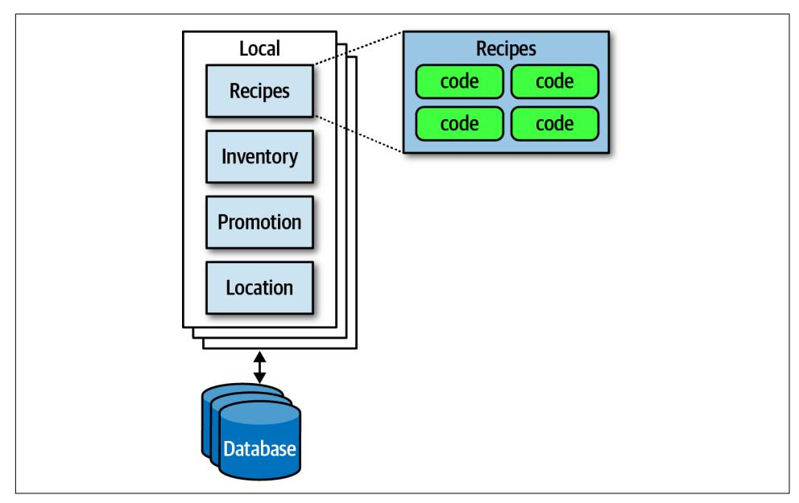
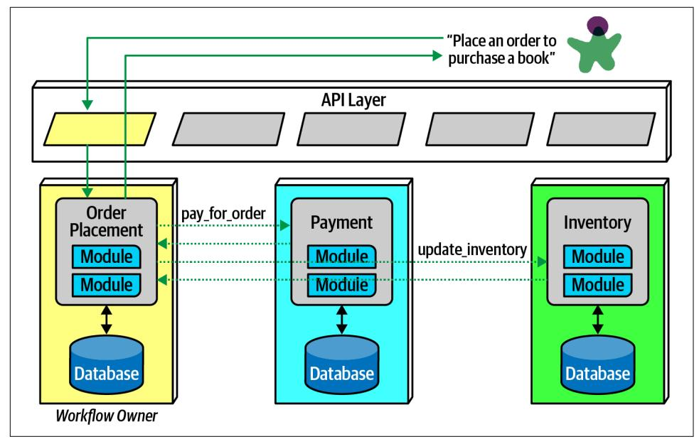
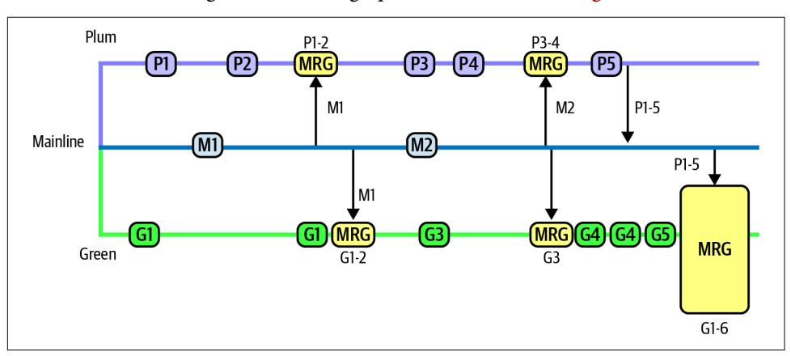
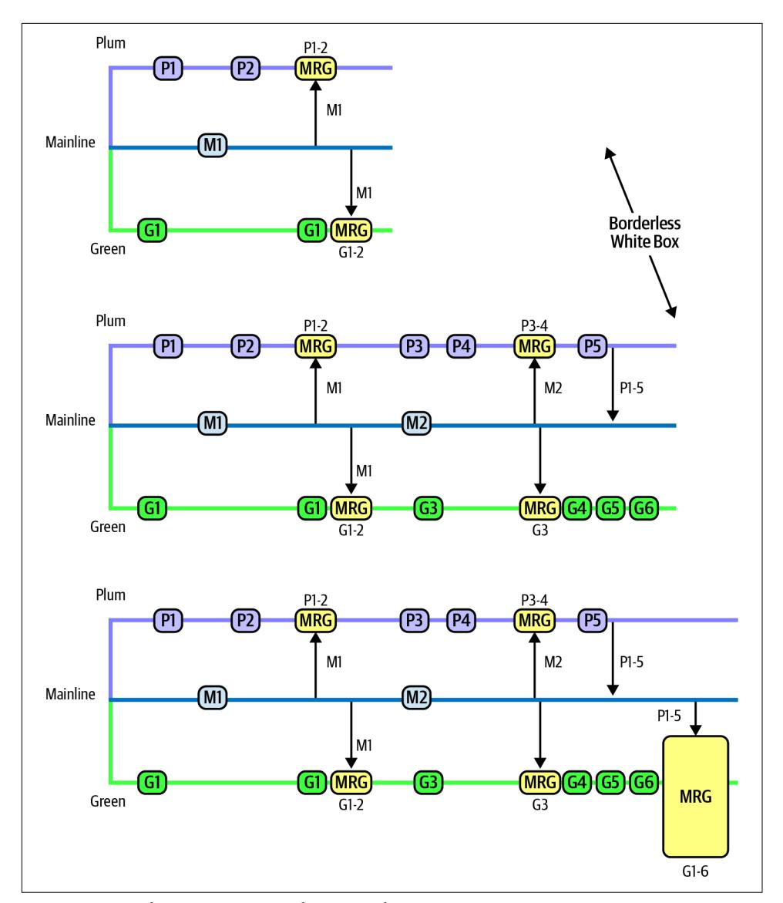

# Chapter 21: Diagramming and Presenting Architecture

Newly minted architects often comment on how surprised they are at how varied the job is outside of technical knowledge and experience, which enabled their move into the architect role to begin with. In particular, effective communication becomes criti‐ cal to an architect's success. No matter how brilliant an architect's technical ideas, if they can't convince managers to fund them and developers to build them, their brilli‐ ance will never manifest.

Diagramming and presenting architectures are two critical soft skills for architects. While entire books exist about each topic, we'll hit some particular highlights for each.

These two topics appear together because they have a few similar characteristics: each forms an important visual representation of an architecture vision, presented using different media. However, representational consistency is a concept that ties both together.

When visually describing an architecture, the creator often must show different views of the architecture. For example, the architect will likely show an overview of the entire architecture topology, then drill into individual parts to delve into design details. However, if the architect shows a portion without indicating where it lies within the overall architecture, it confuses viewers. *Representational consistency* is the practice of always showing the relationship between parts of an architecture, either in diagrams or presentations, before changing views.

For example, if an architect wanted to describe the details of how the plug-ins relate to one another in the Silicon Sandwiches solution, the architecture would show the entire topology, then drill into the plug-in structure, showing the viewers the rela‐ tionship between them; an example of this appears in [Figure 21-1](#page-335-0).

*Figure 21-1. Using representational consistency to indicate context in a larger diagram*

Careful use of representational consistency ensures that viewers understand the scope of items being presented, eliminating a common source of confusion.

## Diagramming

The topology of architecture is always of interest to architects and developers because it captures how the structure fits together and forms a valuable shared understanding across the team. Therefore, architects should hone their diagramming skills to razor sharpness.

## Tools

The current generation of diagramming tools for architects is extremely powerful, and an architect should learn their tool of choice deeply. However, before going to a nice tool, don't neglect low-fidelity artifacts, especially early in the design process. Building very ephemeral design artifacts early prevents architects from becoming overly attached to what they have created, an anti-pattern we named the *Irrational Artifact Attachment* anti-pattern.

## Irrational Artifact Attachment

…is the proportional relationship between a person's irrational attachment to some artifact and how long it took to produce. If an architect creates a beautiful diagram using some tool like Visio that takes two hours, they have an irrational attachment to that artifact that's roughly proportional to the amount of time invested, which also means they will be more attached to a four-hour diagram than a two-hour one.

One of the benefits to the low-ritual approach used in Agile software development revolves around creating just-in-time artifacts, with as little ceremony as possible (this helps explain the dedication of lots of agilists to index cards and sticky notes). Using low-tech tools lets team members throw away what's not right, freeing them to experiment and allow the true nature of the artifact emerge through revision, collabo‐ ration, and discussion.

An architect's favorite variation on the cell phone photo of a whiteboard (along with the inevitable "Do Not Erase!" imperative) uses a tablet attached to an overhead pro‐ jector rather than a whiteboard. This offers several advantages. First, the tablet has an unlimited canvas and can fit as many drawings that a team might need. Second, it allows copy/paste "what if " scenarios that obscure the original when done on a white‐ board. Third, images captured on a tablet are already digitized and don't have the inevitable glare associated with cell phone photos of whiteboards.

Eventually, an architect needs to create nice diagrams in a fancy tool, but make sure the team has iterated on the design sufficiently to invest time in capturing something.

Powerful tools exist to create diagrams on every platform. While we don't necessarily advocate one over another (we quite happily used [OmniGraffle](https://oreil.ly/fEoKR) for all the diagrams in this book), architects should look for at least this baseline of features:

### Layers

Drawing tools often support layers, which architects should learn well. A layer allows the drawer to link a group of items together logically to enable hiding/ showing individual layers. Using layers, an architect can build a comprehensive diagram but hide overwhelming details when they aren't necessary. Using layers also allows architects to incrementally build pictures for presentations later (see ["Incremental Builds" on page 322](#page-341-0)).

## Stencils/templates

Stencils allow an architect to build up a library of common visual components, often composites of other basic shapes. For example, throughout this book, read‐ ers have seen standard pictures of things like microservices, which exist as a single item in the authors' stencil. Building a stencil for common patterns and artifacts within an organization creates consistency within architecture diagrams and allows the architect to build new diagrams quickly.

### Magnets

Many drawing tools offer assistance when drawing lines between shapes. Mag‐ nets represent the places on those shapes where lines snap to connect automati‐ cally, providing automatic alignment and other visual niceties. Some tools allow the architect to add more magnets or create their own to customize how the con‐ nections look within their diagrams.

In addition to these specific helpful features, the tool should, of course, support lines, colors, and other visual artifacts, as well as the ability to export in a wide variety of formats.

## Diagramming Standards: UML, C4, and ArchiMate

Several formal standards exist for technical diagrams in software.

### UML

Unified Modeling Language (UML) was a standard that unified three competing design philosophies that coexisted in the 1980s. It was supposed to be the best of all worlds but, like many things designed by committee, failed to create much impact outside organizations that mandated its use.

Architects and developers still use UML class and sequence diagrams to communi‐ cate structure and workflow, but most of the other UML diagram types have fallen into disuse.

## C4

C4 is a diagramming technique developed by Simon Brown to address deficiencies in UML and modernize its approach. The four C's in C4 are as follows:

### Context

Represents the entire context of the system, including the roles of users and external dependencies.

#### Container

The physical (and often logical) deployment boundaries and containers within the architecture. This view forms a good meeting point for operations and architects.

#### Component

The component view of the system; this most neatly aligns with an architect's view of the system.

*Class*

C4 uses the same style of class diagrams from UML, which are effective, so there is no need to replace them.

If a company seeks to standardize on a diagramming technique, C4 offers a good alternative. However, like all technical diagramming tools, it suffers from an inability to express every kind of design an architecture might undertake. C4 is best suited for monolithic architectures where the container and component relationships may dif‐ fer, and it's less suited to distributed architectures, such as microservices.

#### ArchiMate

ArchiMate (an amalgam of Arch\*itecture-Ani\*mate) is an open source enterprise architecture modeling language to support the description, analysis, and visualization of architecture within and across business domains. ArchiMate is a technical stan‐ dard from The Open Group, and it offers a lighter-weight modeling language for enterprise ecosystems. The goal of ArchiMate is to be "as small as possible," not to cover every edge case scenario. As such, it has become a popular choice among many architects.

## Diagram Guidelines

Regardless of whether an architect uses their own modeling language or one of the formal ones, they should build their own style when creating diagrams and should feel free to borrow from representations they think are particularly effective. Here are some general guidelines to use when creating technical diagrams.

## Titles

Make sure all the elements of the diagram have titles or are well known to the audi‐ ence. Use rotation and other effects to make titles "sticky" to the thing they associate with and to make efficient use of space.

## Lines

Lines should be thick enough to see well. If lines indicate information flow, then use arrows to indicate directional or two-way traffic. Different types of arrowheads might suggest different semantics, but architects should be consistent.

Generally, one of the few standards that exists in architecture diagrams is that solid lines tend to indicate synchronous communication and dotted lines indicate asyn‐ chronous communication.

### Shapes

While the formal modeling languages described all have standard shapes, no perva‐ sive standard shapes exist across the software development world. Thus, each archi‐ tect tends to make their own standard set of shapes, sometimes spreading those across an organization to create a standard language.

We tend to use three-dimensional boxes to indicate deployable artifacts and rectan‐ gles to indicate containership, but we don't have any particular key beyond that.

#### Labels

Architects should label each item in a diagram, especially if there is any chance of ambiguity for the readers.

#### Color

Architects often don't use color enough—for many years, books were out of necessity printed in black and white, so architects and developers became accustomed to mon‐ ochrome drawings. While we still favor monochrome, we use color when it helps dis‐ tinguish one artifact from another. For example, when discussing microservices communication strategies in ["Communication" on page 254,](023-chapter-17-microservices-architecture.md#page-273-0) we used color to indi‐ cate that two difference microservices participate in the coordination, not two instan‐ ces of the same service, as reproduced in Figure 21-2.

*Figure 21-2. Reproduction of microservices communication example showing different services in unique colors*

#### Keys

If shapes are ambiguous for any reason, include a key on the diagram clearly indicat‐ ing what each shape represents. Nothing is worse than a diagram that leads to misin‐ terpretation, which is worse than no diagram.

## Presenting

The other soft skill required by modern architects is the ability to conduct effective presentations using tools like PowerPoint and Keynote. These tools are the lingua franca of modern organizations, and people throughout the organization expect com‐ petent use of these tools. Unfortunately, unlike word processors and spreadsheets, no one seems to spend much time studying how to use these tools well.

Neal, one of the coauthors of this book, wrote a book several years ago entitled *[Pre‐](https://presentationpatterns.com) [sentation Patterns](https://presentationpatterns.com)* (Addison-Wesley Professional), about taking the patterns/antipatterns approach common in the software world and applying it to technical presentations.

*Presentation Patterns* makes an important observation about the fundamental differ‐ ence between creating a document versus a presentation to make a case for some‐ thing—*time*. In a presentation, the presenter controls how quickly an idea is unfolding, whereas the reader of a document controls that. Thus, one of the most important skills an architect can learn in their presentation tool of choice is how to manipulate time.

## Manipulating Time

Presentation tools offer two ways to manipulate time on slides: transitions and ani‐ mations. Transitions move from slide to slide, and animations allow the designer to create movement within a slide. Typically, presentation tools allow just one transition per slide but a host of animations for each element: build in (appearance), build out (disappearance), and actions (such as movement, scale, and other dynamic behavior).

While tools offer a variety of splashy effects like dropping anvils, architects use transi‐ tion and animations to hide the boundaries between slides. One common antipattern called out in *Presentation Patterns* named [Cookie-Cutter](https://oreil.ly/_Wldy) states that ideas don't have a predetermined word count, and accordingly, designers shouldn't artifi‐ cially pad content to make it appear to fill a slide. Similarly, many ideas are bigger than a single slide. Using subtle combinations of transitions and animations such as dissolve allows presenters to hide individual slide boundaries, stitching together a set of slides to tell a single story. To indicate the end of a thought, presenters should use a distinctly different transition (such as door or cube) to provide a visual clue that they are moving to a different topic.

## Incremental Builds

The *Presentation Patterns* book calls out the [Bullet-Riddled Corpse](https://oreil.ly/jS7DO) as a common antipattern of corporate presentations, where every slide is essentially the speaker's notes, projected for all to see. Most readers have the excruciating experience of watching a slide full of text appear during a presentation, then reading the entire thing (because no one can resist reading it all as soon as it appears), only to sit for the next 10 minutes while the presenter slowly reads the bullets to the audience. No wonder so many corporate presentations are dull!

When presenting, the speaker has two information channels: verbal and visual. By placing too much text on the slides and then saying essentially the same words, the presenter is overloading one information channel and starving the other. The better solution to this problem is to use incremental builds for slides, building up (hopefully graphical) information as needed rather than all at once.

For example, say that an architect creates a presentation explaining the problems using feature branching and wants to talk about the negative consequences of keeping branches alive too long. Consider the graphical slide shown in Figure 21-3.

*Figure 21-3. Bad version of a slide showing a negative anti-pattern*

In Figure 21-3, if the presenter shows the entire slide right away, the audience can see that something bad happens toward the end, but they have to wait for the exposition to get to that point.

Instead, the architect should use the same image but obscure parts of it when show‐ ing the slide (using a borderless white box) and expose a portion at a time (by per‐ forming a build out on the covering box), as shown in [Figure 21-4](#page-342-0).

*Figure 21-4. A better, incremental version that maintains suspense*

In Figure 21-4, the presenter still has a fighting chance of keeping some suspense alive, making the talk inherently more interesting.

Using animations and transitions in conjunction with incremental builds allows the presenter to make more compelling, entertaining presentations.

## Infodecks Versus Presentations

Some architects build slide decks in tools like PowerPoint and Keynote but never actually present them. Rather, they are emailed around like a magazine article, and each individual reads them at their own pace. *Infodecks* are slide decks that are not meant to be projected but rather summarize information graphically, essentially using a presentation tool as a desktop publishing package.

The difference between these two media is comprehensiveness of content and use of transitions and animations. If someone is going to flip through the deck like a maga‐ zine article, the author of the slides does not need to add any time elements. The other key difference between infodecks and presentations is the amount of material. Because infodecks are meant to be standalone, they contain all the information the creator wants to convey. When doing a presentation, the slides are (purposefully) meant to be half of the presentation, the other half being the person standing there talking!

## Slides Are Half of the Story

A common mistake that presenters make is building the entire content of the presen‐ tation into the slides. However, if the slides are comprehensive, the presenter should spare everyone the time of sitting through a presentation and just email it to everyone as a deck! Presenters make the mistake of adding too much material to slides when they can make important points more powerfully. Remember, presenters have two information channels, so using them strategically can add more punch to the mes‐ sage. A great example of that is the strategic use of invisibility.

## Invisibility

*Invisibility* is a simple pattern where the presenter inserts a blank black slide within a presentation to refocus attention solely on the speaker. If someone has two informa‐ tion channels (slides and speaker) and turns one of them off (the slides), it automati‐ cally adds more emphasis to the speaker. Thus, if a presenter wants to make a point, insert a blank slide—everyone in the room will focus their attention back on the speaker because they are now the only interesting thing in the room to look at.

Learning the basics of a presentation tool and a few techniques to make presentations better is a great addition to the skill set of architects. If an architect has a great idea but can't figure out a way to present it effectively, they will never get a chance to real‐ ize that vision. Architecture requires collaboration; to get collaborators, architects must convince people to sign on to their vision. The modern corporate soapboxes are presentation tools, so it's worth learning to use them well.
