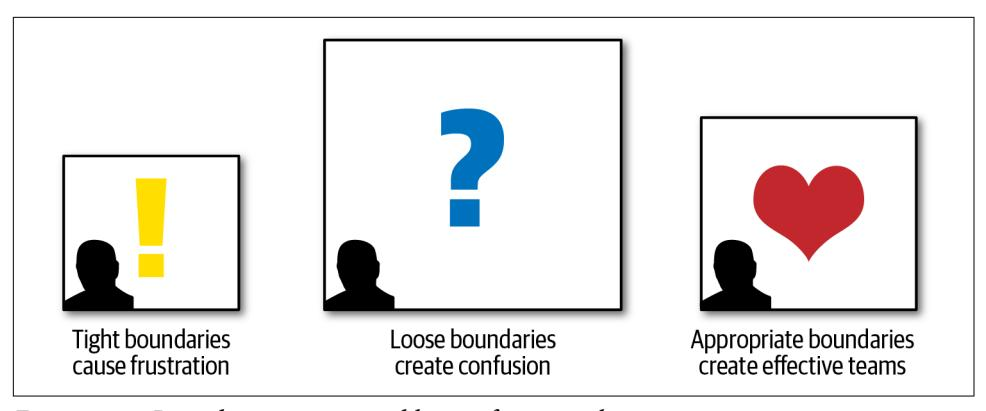
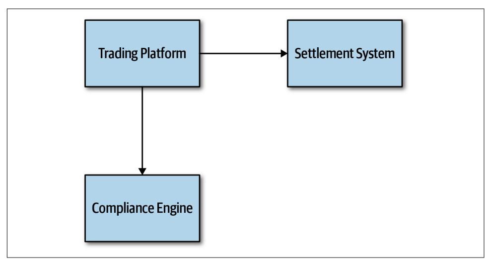
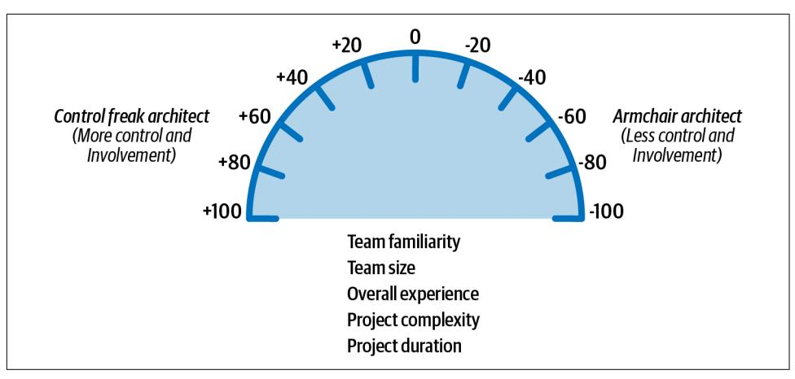
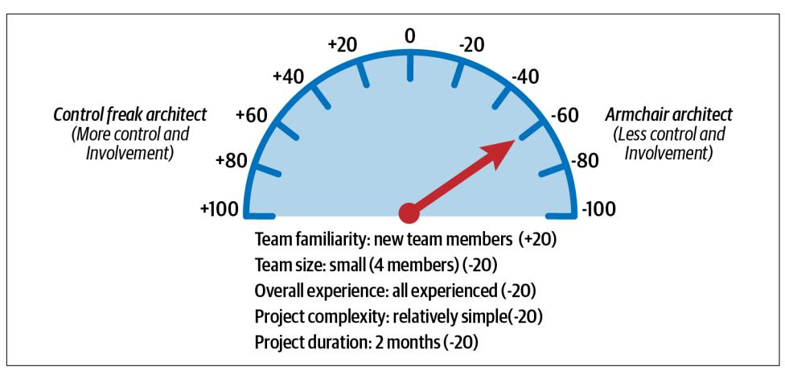
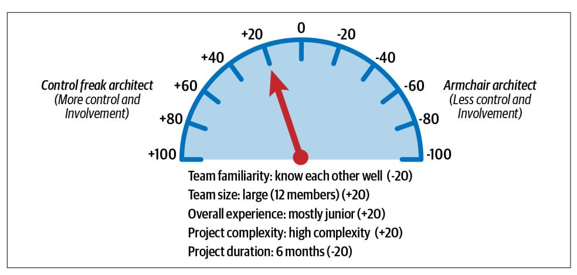
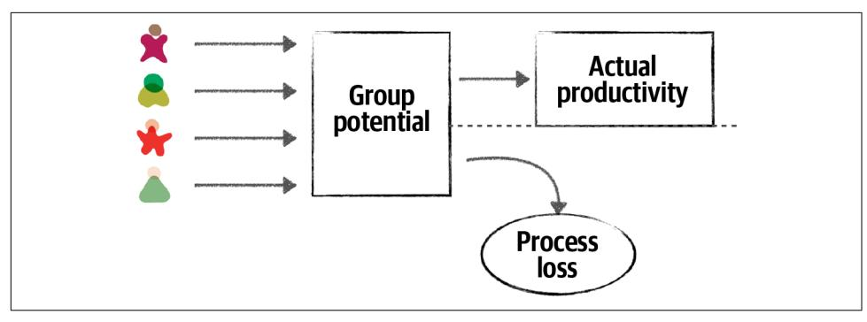
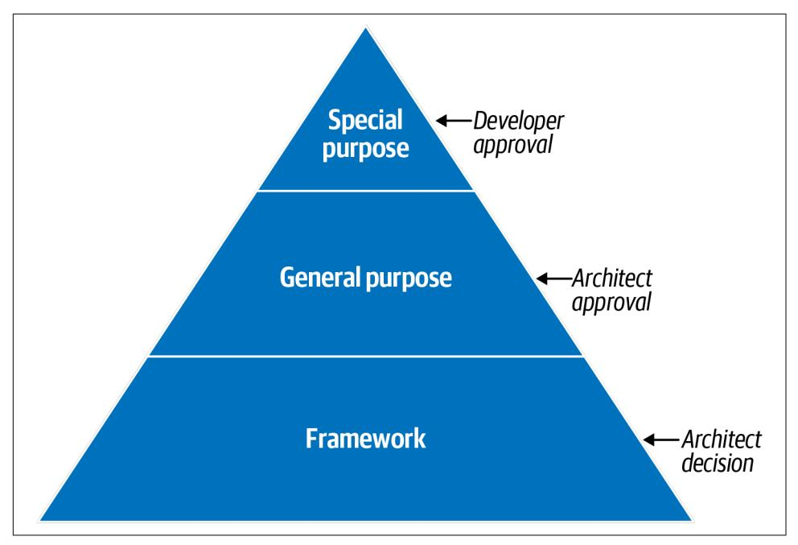

# Chapter 22: Making Teams Effective

In addition to creating a technical architecture and making architecture decisions, a software architect is also responsible for guiding the development team through the implementation of the architecture. Software architects who do this well create effec‐ tive development teams that work closely together to solve problems and create win‐ ning solutions. While this may sound obvious, too many times we've seen architects ignore development teams and work in siloed environments to create an architecture. This architecture then gets handed it off to a development team which then struggles to implement the architecture correctly. Being able to make teams productive is one of the ways effective and successful software architects differentiate themselves from other software architects. In this chapter we introduce some basic techniques an architect can leverage to make development teams effective.

## Team Boundaries

It's been our experience that a software architect can significantly influence the suc‐ cess or failure of a development team. Teams that feel left out of the loop or estranged from software architects (and also the architecture) often do not have the right level of guidance and right level of knowledge about various constraints on the system, and consequently do not implement the architecture correctly.

One of the roles of a software architect is to create and communicate the constraints, or the box, in which developers can implement the architecture. Architects can create boundaries that are too tight, too loose, or just right. These boundaries are illustrated in [Figure 22-1.](#page-345-0) The impact of having too tight or too loose of a boundary has a direct impact on the teams' ability to successfully implement the architecture.

*Figure 22-1. Boundary types created by a soware architect*

Architects that create too many constraints form a tight box around the development teams, preventing access to many of the tools, libraries, and practices that are required to implement the system effectively. This causes frustration within the team, usually resulting in developers leaving the project for happier and healthier environments.

The opposite can also happen. A software architect can create constraints that are too loose (or no constraints at all), leaving all of the important architecture decisions to the development team. In this scenario, which is just as bad as tight constraints, the team essentially takes on the role of a software architect, performing proof of con‐ cepts and battling over design decisions without the proper level of guidance, result‐ ing in unproductiveness, confusion, and frustration.

An effective software architect strives to provide the right level of guidance and con‐ straints so that the team has the correct tools and libraries in place to effectively implement the architecture. The rest of this chapter is devoted to how to create these effective boundaries.

## Architect Personalities

There are three basic types of architect personalities: a *control freak architect* ([Figure 22-2\)](#page-346-0), an *armchair architect* [\(Figure 22-3](#page-347-0)), and an *effective architect* ([Figure 22-5\)](#page-349-0). Each personality matches a particular boundary type discussed in the prior section on team boundaries: control freak architects produce tight boundaries, armchair architects produce loose boundaries, and effective architects produce just the right kinds of boundaries.

## Control Freak

*Figure 22-2. Control freak architect (iStockPhoto)*

The control freak architect tries to control every detailed aspect of the software devel‐ opment process. Every decision a control freak architect makes is usually too finegrained and too low-level, resulting in too many constraints on the development team.

Control freak architects produce the tight boundaries discussed in the prior section. A control freak architect might restrict the development team from downloading any useful open source or third-party libraries and instead insist that the teams write everything from scratch using the language API. Control freak architects might also place tight restrictions on naming conventions, class design, method length, and so on. They might even go so far as to write pseudocode for the development teams. Essentially, control freak architects steal the art of programming away from the devel‐ opers, resulting in frustration and a lack of respect for the architect.

It is very easy to become a control freak architect, particularly when transitioning from developer to architect. An architect's role is to create the building blocks of the application (the components) and determine the interactions between those compo‐ nents. The developer's role in this effort is to then take those components and deter‐ mine how they will be implemented using class diagrams and design patterns. However, in the transition from developer to architect, it is all too tempting to want to create the class diagrams and design patterns as well since that was the newly min‐ ted architect's prior role.

For example, suppose an architect creates a component (building block of the archi‐ tecture) to manage reference data within the system. Reference data consists of static name-value pair data used on the website, as well as things like product codes and warehouse codes (static data used throughout the system). The architect's role is to identify the component (in this case, Reference Manager), determine the core set of operations for that component (for example, GetData, SetData, ReloadCache, NotifyOnUpdate, and so on), and which components need to interact with the Reference Manager. The control freak architect might think that the best way to *implement* this component is through a parallel loader pattern leveraging an internal cache, with a particular data structure for that cache. While this might be an effective design, it's not the only design. More importantly, it's no longer the architect's role to come up with this internal design for the Reference Manager—it's the role of the developer.

As we'll talk about in ["How Much Control?" on page 331,](#page-350-0) sometimes an architect needs to play the role of a control freak, depending on the complexity of the project and the skill level on the team. However, in most cases a control freak architect dis‐ rupts the development team, doesn't provide the right level of guidance, gets in the way, and is ineffective at leading the team through the implementation of the architecture.

## Armchair Architect

*Figure 22-3. Armchair architect (iStockPhoto)*

The armchair architect is the type of architect who hasn't coded in a very long time (if at all) and doesn't take the implementation details into account when creating an architecture. They are typically disconnected from the development teams, never

around, or simply move from project to project once the initial architecture diagrams are completed.

In some cases the armchair architect is simply in way over their head in terms of the technology or business domain and therefore cannot possibly lead or guide teams from a technical or business problem standpoint. For example, what do developers do? Why, they code, of course. Writing program code is really hard to fake; either a developer writes software code, or they don't. However, what does an architect do? No one knows! Most architects draw lots of lines and boxes—but how detailed should an architect be in those diagrams? Here's a dirty little secret about architecture—it's really easy to fake it as an architect!

Suppose an armchair architect is in way over their head or doesn't have the time to architect an appropriate solution for a stock trading system. In that case the architec‐ ture diagram might look like the one illustrated in Figure 22-4. There's nothing wrong with this architecture—it's just too high level to be of any use to anyone.

*Figure 22-4. Trading system architecture created by an armchair architect*

Armchair architects create loose boundaries around development teams, as discussed in the prior section. In this scenario, development teams end up taking on the role of architect, essentially doing the work an architect is supposed to be doing. Team veloc‐ ity and productivity suffer as a result, and teams get confused about how the system should work.

Like the control freak architect, it is all too easy to become an armchair architect. The biggest indicator that an architect might be falling into the armchair architect person‐ ality is not having enough time to spend with the development teams implementing the architecture (or choosing not to spend time with the development teams). Devel‐ opment teams need an architect's support and guidance, and they need the architect available for answering technical or business-related questions when they arise. Other indicators of an armchair architect are following:

- Not fully understanding the business domain, business problem, or technology used
- Not enough hands-on experience developing software
- Not considering the implications associated with the implementation of the architecture solution

In some cases it is not the intention of an architect to become an armchair architect, but rather it just "happens" by being spread too thin between projects or development teams and loosing touch with technology or the business domain. An architect can avoid this personality by getting more involved in the technology being used on the project and understanding the business problem and business domain.

## Effective Architect

*Figure 22-5. Effective soware architect (iStockPhoto)*

An effective software architect produces the appropriate constraints and boundaries on the team, ensuring that the team members are working well together and have the right level of guidance on the team. The effective architect also ensures that the team has the correct and appropriate tools and technologies in place. In addition, they remove any roadblocks that may be in the way of the development teams reaching their goals.

While this sounds obvious and easy, it is not. There is an art to becoming an effective leader on the development team. Becoming an effective software architect requires working closely and collaborating with the team, and gaining the respect of the team as well. We'll be looking at other ways of becoming an effective software architect in later chapters in this part of the book. But for now, we'll introduce some guidelines for knowing how much control an effective architect should exert on a development team.

## How Much Control?

Becoming an effective software architect is knowing how much control to exert on a given development team. This concept is known as [Elastic Leadership](https://www.elasticleadership.com) and is widely evangelized by author and consultant Roy Osherove. We're going to deviate a bit from the work Osherove has done in this area and focus on specific factors for software architecture.

Knowing how much an effective software architect should be a control freak and how much they should be an armchair architect involves five main factors. These factors also determine how many teams (or projects) a software architect can manage at once:

### Team familiarity

How well do the team members know each other? Have they worked together before on a project? Generally, the better team members know each other, the less control is needed because team members start to become self-organizing. Conversely, the newer the team members, the more control needed to help facili‐ tate collaboration among team members and reduce cliques within the team.

#### Team size

How big is the team? (We consider more than 12 developers on the same team to be a big team, and 4 or fewer to be a small team.) The larger the team, the more control is needed. The smaller the team, less control is needed. This is discussed in more detail in ["Team Warning Signs" on page 335](#page-354-0).

## Overall experience

How many team members are senior? How many are junior? Is it a mixed team of junior and senior developers? How well do they know the technology and business domain? Teams with lots of junior developers require more control and mentoring, whereas teams with more senior developers require less control. In the latter cases, the architect moves from the role of a mentor to that of a facilitator.

### Project complexity

Is the project highly complex or just a simple website? Highly complex projects require the architect to be more available to the team and to assist with issues that arise, hence more control is needed on the team. Relatively simple projects are straightforward and hence do not require much control.

#### Project duration

Is the project short (two months), long (two years), or average duration (six months)? The shorter the duration, the less control is needed; conversely, the longer the project, the more control is needed.

While most of the factors make sense with regard to more or less control, the project duration factor may not appear to make sense. As indicated in the prior list, the shorter the project duration, the less control is needed; the longer the project dura‐ tion, the more control is needed. Intuitively this might seem reversed, but that is not the case. Consider a quick two-month project. Two months is not a lot of time to qualify requirements, experiment, develop code, test every scenario, and release into production. In this case the architect should act more as an armchair architect, as the development team already has a keen sense of urgency. A control freak architect would just get in the way and likely delay the project. Conversely, think of a project duration of two years. In this scenario the developers are relaxed, not thinking in terms of urgency, and likely planning vacations and taking long lunches. More con‐ trol is needed by the architect to ensure the project moves along in a timely fashion and that complex tasks are accomplished first.

It is typical within most projects that these factors are utilized to determine the level of control at the start of a project; but as the system continues to evolve, the level of control changes. Therefore, we advise that these factors continually be analyzed throughout the life cycle of a project to determine how much control to exert on the development team.

To illustrate how each of these factors can be used to determine the level of control an architect should have on a team, assume a fixed scale of 20 points for each factor. Minus values point more toward being an armchair architect (less control and involvement), whereas plus values point more toward being a control freak architect (more control and involvement). This scale is illustrated in [Figure 22-6.](#page-352-0)

*Figure 22-6. Scale for the amount of control*

Applying this sort of scaling is not exact, of course, but it does help in determining the relative control to exert on a team. For example, consider the project scenario shown in Table 22-1 and [Figure 22-7](#page-353-0). As shown in the table, the factors point to either a control freak (+20) or an armchair architect (-20). These factors add up and to an accumulated score of -60, indicating that the architect should play more of an armchair architect role and not get in the team's way.

*Table 22-1. Scenario 1 example for amount of control*

| Factor             | Value             | Rating | Personality        |
|--------------------|-------------------|--------|--------------------|
| Team familiarity   | New team members  | +20    | Control freak      |
| Team size          | Small (4 members) | -20    | Armchair architect |
| Overall experience | All experienced   | -20    | Armchair architect |
| Project complexity | Relatively simple | -20    | Armchair architect |
| Project duration   | 2 months          | -20    | Armchair architect |
| Accumulated score  |                   | -60    | Armchair architect |

*Figure 22-7. Amount of control for scenario 1*

In scenario 1, these factors are all taken into account to demonstrate that an effective software architect should initially play the role of facilitator and not get too involved in the day-to-day interactions with the team. The architect will be needed for answer‐ ing questions and to make sure the team is on track, but for the most part the archi‐ tect should be largely hands-off and let the experienced team do what they know best —develop software quickly.

Consider another type of scenario described in Table 22-2 and illustrated in [Figure 22-8,](#page-354-0) where the team members know each other well, but the team is large (12 team members) and consists mostly of junior (inexperienced) developers. The project is relatively complex with a duration of six months. In this case, the accumulated score comes out to -20, indicating that the effective architect should be involved in the day-to-day activities within the team and take on a mentoring and coaching role, but not so much as to disrupt the team.

*Table 22-2. Scenario 2 example for amount of control*

| Factor             | Value                | Rating | Personality        |
|--------------------|----------------------|--------|--------------------|
| Team familiarity   | Know each other well | -20    | Armchair architect |
| Team size          | Large (12 members)   | +20    | Control freak      |
| Overall experience | Mostly junior        | +20    | Control freak      |
| Project complexity | High complexity      | +20    | Control freak      |
| Project duration   | 6 months             | -20    | Armchair architect |
| Accumulated score  |                      | -20    | Control freak      |

*Figure 22-8. Amount of control for scenario 2*

It is difficult to objectify these factors, as some of them (such as the overall team experience) might be more weighted than others. In these cases the metrics can easily be weighted or modified to suit any particular scenario or condition. Regardless, the primary message here is that the amount of control and involvement a software architect has on the team varies by these five main factors and that by taking these factors into account, an architect can gauge what sort of control to exert on the team and what the box in which development teams can work in should look like (tight boundaries and constraints or loose ones).

## Team Warning Signs

As indicated in the prior section, team size is one of the factors that influence the amount of control an architect should exert on a development team. The larger a team, the more control needed; the smaller the team, the less control needed. Three factors come into play when considering the most effective development team size:

- Process loss
- Pluralistic ignorance
- Diffusion of responsibility

*Process loss*, otherwise known as [Brook's law](https://oreil.ly/rZt88), was originally coined by Fred Brooks in his book *The Mythical Man Month* (Addison-Wesley). The basic idea of process loss is that the more people you add to a project, the more time the project will take. As illustrated in [Figure 22-9,](#page-355-0) the *group potential* is defined by the collective efforts of everyone on the team. However, with any team, the *actual productivity* will always be less than the group potential, the difference being the *process loss* of the team.

*Figure 22-9. Team size impacts actual productivity (Brook's law)*

An effective software architect will observe the development team and look for pro‐ cess loss. Process loss is a good factor in determining the correct team size for a par‐ ticular project or effort. One indication of process loss is frequent merge conflicts when pushing code to a repository. This is an indication that team members are pos‐ sibly stepping on each other's toes and working on the same code. Looking for areas of parallelism within the team and having team members working on separate serv‐ ices or areas of the application is one way to avoid process loss. Anytime a new team member comes on board a project, if there aren't areas for creating parallel work streams, an effective architect will question the reason why a new team member was added to the team and demonstrate to the project manager the negative impact that additional person will have on the team.

*Pluralistic ignorance* also occurs as the team size gets too big. Pluralistic ignorance is when everyone agrees to (but privately rejects) a norm because they think they are missing something obvious. For example, suppose on a large team the majority agree that using messaging between two remote services is the best solution. However, one person on the team thinks this is a silly idea because of a secure firewall between the two services. However, rather than speak up, that person also agrees to the use of messaging (but privately rejects the idea) because they are afraid that they are either missing something obvious or afraid they might be seen as a fool if they were to speak up. In this case, the person rejecting the norm was correct—messaging would not work because of a secure firewall between the two remote services. Had they spoken up (and had the team size been smaller), the original solution would have been chal‐ lenged and another protocol (such as REST) used instead, which would be a better solution in this case.

The concept of pluralistic ignorance was made famous by the Danish children's story ["The Emperor's New Clothes",](https://oreil.ly/ROvce) by Hans Christian Andersen. In the story, the king is convinced that his new clothes are invisible to anyone unworthy to actually see them. He struts around totally nude, asking all of his subjects how they like his new clothes. All the subjects, afraid of being considered stupid or unworthy, respond to the king

that his new clothes are the best thing ever. This folly continues until a child finally calls out to the king that he isn't wearing any clothes at all.

An effective software architect should continually observe facial expressions and body language during any sort of collaborative meeting or discussion and act as a facilitator if they sense an occurrence of pluralistic ignorance. In this case, the effec‐ tive architect might interrupt and ask the person what they think about the proposed solution and be on their side and support them when they speak up.

The third factor that indicates appropriate team size is called *diffusion of responsibil‐ ity*. Diffusion of responsibility is based on the fact that as team size increases, it has a negative impact on communication. Confusion about who is responsible for what on the team and things getting dropped are good signs of a team that is too large.

Look at the picture in Figure 22-10. What do you observe?

*Figure 22-10. Diffusion of responsibility*

This picture shows someone standing next to a broken-down car on the side of a small country road. In this scenario, how many people might stop and ask the moto‐ rist if everything is OK? Because it's a small road in a small community, probably everyone who passes by. However, how many times have motorists been stuck on the side of a busy highway in the middle of a large city and had thousands of cars simply drive by without anyone stopping and asking if everything is OK? All the time. This is a good example of the diffusion of responsibility. As cities get busier and more crowded, people assume the motorist has already called or help is on the way due to the large number of people witnessing the event. However, in most of these cases help is not on the way, and the motorist is stuck with a dead or forgotten cell phone, unable to call for help.

An effective architect not only helps guide the development team through the imple‐ mentation of the architecture, but also ensures that the team is healthy, happy, and working together to achieve a common goal. Looking for these three warning signs and consequently helping to correct them helps to ensure an effective development team.

## Leveraging Checklists

Airline pilots use checklists on every flight—even the most experienced, seasoned veteran pilots. Pilots have checklists for takeoff, landing, and thousands of other sit‐ uations, both common and unusual edge cases. They use checklists because one missed aircraft setting (such as setting the flaps to 10 degrees) or procedure (such as gaining clearance into a terminal control area) can mean the difference between a safe flight and a disastrous one.

Dr. Atul Gawande wrote an excellent book called *[The Checklist Manifesto](https://oreil.ly/XNcV9)* (Picador), in which he describes the power of checklists for surgical procedures. Alarmed at the high rate of staph infections in hospitals, Dr. Gawande created surgical checklists to attempt to reduce this rate. In the book he demonstrates that staph infection rates in hospitals using the checklists went down to near zero, while staph infection rates in control hospitals not using the checklists continued to rise.

Checklists work. They provide an excellent vehicle for making sure everything is cov‐ ered and addressed. If checklists work so well, then why doesn't the software develop‐ ment industry leverage them? We firmly believe through personal experience that checklists make a big difference in the effectiveness of development teams. However, there are caveats to this claim. First, most software developers are not flying airliners or performing open heart surgery. In other words, software developers don't require checklists for everything. The key to making teams effective is knowing when to lev‐ erage checklists and when not to.

Consider the checklist shown in Figure 22-11 for creating a new database table.

| Done | Task description                                |
|------|-------------------------------------------------|
|      | Determine database column field names and types |
|      | Fill out database table request form            |
|      | Obtain permission for new database table        |
|      | Submit request form to database group           |
|      | Verify table once created                       |

*Figure 22-11. Example of a bad checklist*

This is not a checklist, but a set of procedural steps, and as such should not be in a checklist. For example, the database table cannot be verified if the form has not yet been submitted! Any processes that have a procedural flow of dependent tasks should not be in a checklist. Simple, well-known processes that are executed frequently without error also do not need a checklist.

Processes that are good candidates for checklists are those that don't have any proce‐ dural order or dependent tasks, as well as those that tend to be error-prone or have steps that are frequently missed or skipped. The key to making checklists effective is to not go overboard making everything a checklist. Architects find that checklists do, in fact, make development teams more effective, and as such start to make everything a checklist, invoking what is known as the *law of diminishing returns*. The more checklists an architect creates, the less chance developers will use them. Another key success factor when creating checklists is to make them as small as possible while still capturing all the necessary steps within a process. Developers generally will not fol‐ low checklists that are too big. Seek items that can be performed through automation and remove those from the checklist.

Don't worry about stating the obvious in a checklist. It's the obvious stuff that's usually skipped or missed.

Three key checklists that we've found to be most effective are a *developer code comple‐ tion* checklist, a *unit and functional testing* checklist, and a *soware release* checklist. Each checklist is discussed in the following sections.

## The Hawthorne Effect

One of the issues associated with introducing checklists to a development team is making developers actually use them. It's all too common for some developers to run out of time and simply mark all the items in a particular checklist as completed without having actually performed the tasks.

One of the ways of addressing this issue is by talking with the team about the impor‐ tance of using checklists and how checklists can make a difference in the team. Have team members read *The Checklist Manifesto* by Atul Gawande to fully understand the power of a checklist, and make sure each team member understands the reasoning behind each checklist and why it is being used. Having developers collaborate on what should and shouldn't be on a checklist also helps.

When all else fails, architects can invoke what is known as the [Hawthorne effect](https://oreil.ly/caGH_). The Hawthorne effect essentially means that if people know they are being observed or monitored, their behavior changes, and generally they will do the right thing. Exam‐ ples include highly visible cameras in and around buildings that actually don't work or aren't really recording anything (this is very common!) and website monitoring software (how many of those reports are actually viewed?).

The Hawthorne effect can be used to govern the use of checklists as well. An architect can let the team know that the use of checklists is critical to the team's effectiveness, and as a result, all checklists will be verified to make sure the task was actually per‐ formed, when in fact the architect is only occasionally spot-checking the checklists for correctness. By leveraging the Hawthorne effect, developers will be much less likely to skip items or mark them as completed when in fact the task was not done.

## Developer Code Completion Checklist

The developer code completion checklist is an effective tool to use, particularly when a software developer states that they are "done" with the code. It also is useful for defining what is known as the "definition of done." If everything in the checklist is completed, then the developer can claim they are actually done with the code.

Here are some of the things to include in a developer code completion checklist:

- Coding and formatting standards not included in automated tools
- Frequently overlooked items (such as absorbed exceptions)
- Project-specific standards
- Special team instructions or procedures

Figure 22-12 illustrates an example of a developer code completion checklist.

| Done | Task description                                         |
|------|----------------------------------------------------------|
|      | Run code cleanup and code formatting                     |
|      | Execute custom source validation tool                    |
|      | Verify the audit log is written for all updates          |
|      | Make sure there are no absorbed exceptions               |
|      | Check for hardcoded values and convert to constants      |
|      | Verify that only public methods are calling setFailure() |
|      | Include @ServiceEntrypoint on service API class          |

*Figure 22-12. Example of a developer code completion checklist*

Notice the obvious tasks "Run code cleanup and code formatting" and "Make sure there are no absorbed exceptions" in the checklist. How may times has a developer been in a hurry either at the end of the day or at the end of an iteration and forgotten to run code cleanup and formatting from the IDE? Plenty of times. In *The Checklist Manifesto*, Gawande found this same phenomenon with respect to surgical proce‐ dures—the obvious ones were often the ones that were usually missed.

Notice also the project-specific tasks in items 2, 3, 6, and 7. While these are good items to have in a checklist, an architect should always review the checklist to see if any items can be automated or written as plug-in for a code validation checker. For example, while "Include @ServiceEntrypoint on service API class" might not be able to have an automated check, the "Verify that only public methods are calling setFai‐ lure()" certainly can (this is a straightforward automated check with any sort of code crawling tool). Checking for areas of automation helps reduce both the size and the noise within a checklist, making it more effective.

## Unit and Functional Testing Checklist

Perhaps one of the most effective checklists is a unit and functional testing checklist. This checklist contains some of the more unusual and edge-case tests that software developers tend to forget to test. Whenever someone from QA finds an issue with the code based on a particular test case, that test case should be added to this checklist.

This particular checklist is usually one of the largest ones due to all the types of tests that can be run against code. The purpose of this checklist is to ensure the most com‐ plete coding possible so that when the developer is done with the checklist, the code is essentially production ready.

Here are some of the items found in a typical unit and functional testing checklist:

- Special characters in text and numeric fields
- Minimum and maximum value ranges
- Unusual and extreme test cases
- Missing fields

Like the developer code completion checklist, any items that can be written as auto‐ mated tests should be removed from the checklist. For example, suppose there is an item in the checklist for a stock trading application to test for negative shares (such as a BUY for –1,000 shares of Apple [AAPL]). If this check is automated through a unit or functional test within the test suite, then the item should be removed from the checklist.

Developers sometimes don't know where to start when writing unit tests or how many unit tests to write. This checklist provides a way of making sure general or spe‐ cific test scenarios are included in the process of developing the software. This check‐ list is also effective in bridging the gap between developers and testers in environments that have these activities performed by separate teams. The more development teams perform complete testing, the easier the job of the testing teams, allowing the testing teams to focus on certain business scenarios not covered in the checklists.

## Software Release Checklist

Releasing software into production is perhaps one of the most error-prone aspects of the software development life cycle, and as such makes for a great checklist. This checklist helps avoid failed builds and failed deployments, and it significantly reduces the amount of risk associated with releasing software.

The software release checklist is usually the most volatile of the checklists in that it continually changes to address new errors and circumstances each time a deployment fails or has issues.

Here are some of the items typically included within the software release checklist:

- Configuration changes in servers or external configuration servers
- Third-party libraries added to the project (JAR, DLL, etc.)
- Database updates and corresponding database migration scripts

Anytime a build or deployment fails, the architect should analyze the root cause of the failure and add a corresponding entry to the software release checklist. This way the item will be verified on the next build or deployment, preventing that issue from happening again.

## Providing Guidance

A software architect can also make teams effective by providing guidance through the use of design principles. This also helps form the box (constraints), as described in the first section of this chapter, that developers can work in to implement the archi‐ tecture. Effectively communicating these design principles is one of the keys to creat‐ ing a successful team.

To illustrate this point, consider providing guidance to a development team regarding the use of what is typically called the *layered stack*—the collection of third-party libra‐ ries (such as JAR files, and DLLs) that make up the application. Development teams usually have lots of questions regarding the layered stack, including whether they can make their own decisions about various libraries, which ones are OK, and which ones are not.

Using this example, an effective software architect can provide guidance to the devel‐ opment team by first having the developer answer the following questions:

- 1. Are there any overlaps between the proposed library and existing functionality within the system?
- 2. What is the justification for the proposed library?

The first question guides developers to looking at the existing libraries to see if the functionality provided by the new library can be satisfied through an existing library or existing functionality. It has been our experience that developers sometimes ignore this activity, creating lots of duplicate functionality, particularly in large projects with large teams.

The second question prompts the developer into questioning why the new library or functionality is truly needed. Here, an effective software architect will ask for both a technical justification as well as a business justification as to why the additional library is needed. This can be a powerful technique to create awareness within the development team of the need for business justifications.

## The Impact of Business Justifications

One of your authors (Mark) was the lead architect on a particularly complex Javabased project with a large development team. One of the team members was particu‐ larly obsessed with the Scala programming language and desperately wanted to use it on the project. This desire for the use of Scala ended up becoming so disruptive that several key team members informed Mark that they were planning on leaving the project and moving on to other, "less toxic," environments. Mark convinced the two key team members to hold off on their decision for a bit and had a discussion with the Scala enthusiast. Mark told the Scala enthusiast that he would support the use of Scala within the project, but the Scala enthusiast would have to provide a business justification for the use of Scala because of the training costs and rewriting effort involved. The Scala enthusiast was ecstatic and said he would get right on it, and he left the meeting yelling, "Thank you—you're the best!"

The next day the Scala enthusiast came into the office completely transformed. He immediately approached Mark and asked to speak with him. They both went into the conference room, and the Scala enthusiast immediately (and humbly) said, "Thank you." The Scala enthusiast explained to Mark that he could come up with all the tech‐ nical reasons in the world to use Scala, but none of those technical advantages had any sort of business value in terms of the architecture characteristics needed ("-ilities"): cost, budget, and timeline. In fact, the Scala enthusiast realized that the increase in cost, budget, and timeline would provide no benefit whatsoever.

Realizing what a disruption he was, the Scala enthusiast quickly transformed himself into one of the best and most helpful members on the team, all because of being asked to provide a business justification for something he wanted on the project. This increased awareness of justifications not only made him a better software developer, but also made for a stronger and healthier team.

As a postscript, the two key developers stayed on the project until the very end.

Continuing with the example of governing the layered stack, another effective techni‐ que of communicating design principles is through graphical explanations about what the development team can make decisions on and what they can't. The illustra‐ tion in [Figure 22-13](#page-364-0) is an example of what this graphic (as well as the guidance) might look like for controlling the layered stack.

*Figure 22-13. Providing guidance for the layered stack*

In Figure 22-13, an architect would provide examples of what each category of the third-party library would contain and then what the guidance is (the design princi‐ ple) in terms of what the developers can and can't do (the box described in the first section of the chapter). For example, here are the three categories defined for any third-party library:

### Special purpose

These are specific libraries used for things like PDF rendering, bar code scan‐ ning, and circumstances that do not warrant writing custom software.

#### General purpose

These libraries are wrappers on top of the language API, and they include things like Apache Commons, and Guava for Java.

#### Framework

These libraries are used for things like persistence (such as Hibernate) and inver‐ sion of control (such as Spring). In other words, these libraries make up an entire layer or structure of the application and are highly invasive.

Once categorized (the preceding categories are only an example—there can be many more defined), the architect then creates the box around this design principle. Notice in the example illustrated in Figure 22-13 that for this particular application or project, the architect has specified that for special-purpose libraries, the developer

can make the decision and does not need to consult the architect for that library. However, notice that for general purpose, the architect has indicated that the devel‐ oper can undergo overlap analysis and justification to make the recommendation, but that category of library requires architect approval. Finally, for framework libraries, that is an architect decision—in other words, the development teams shouldn't even undergo analysis for these types of libraries; the architect has decided to take on that responsibility for those types of libraries.

## Summary

Making development teams effective is hard work. It requires lots of experience and practice, as well as strong people skills (which we will discuss in subsequent chapters in this book). That said, the simple techniques described in this chapter about elastic leadership, leveraging checklists, and providing guidance through effectively commu‐ nicating design principles do, in fact, work, and have proven effective in making development teams work smarter and more effectively.

One might question the role of an architect for such activities, instead assigning the effort of making teams effective to the development manager or project manager. We strongly disagree with this premise. A software architect not only provides technical guidance to the team, but also leads the team through the implementation of the architecture. The close collaborative relationship between a software architect and a development team allows the architect to observe the team dynamics and hence facil‐ itate changes to make the team more effective. This is exactly what differentiates a technical architect from an effective software architect.
