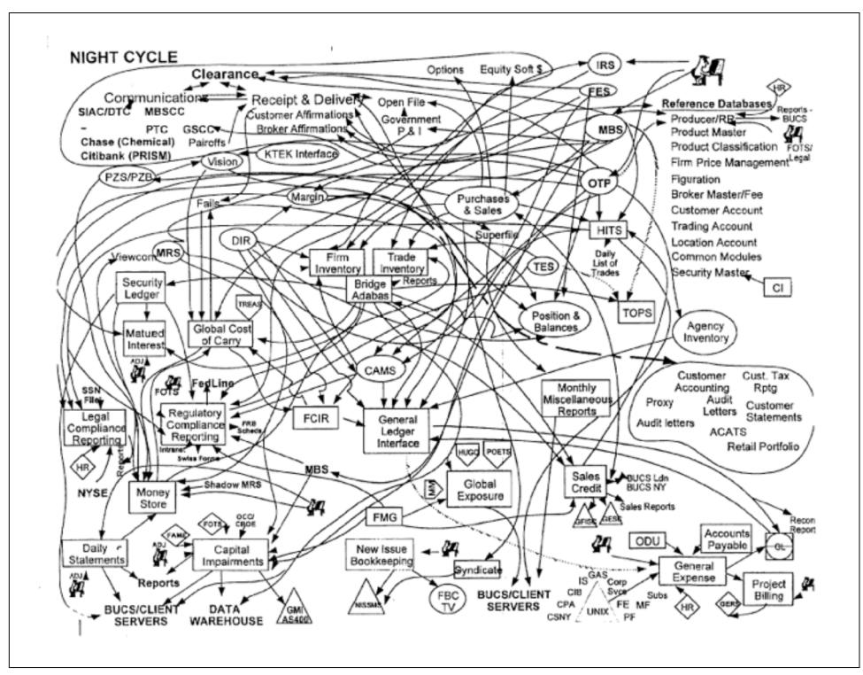
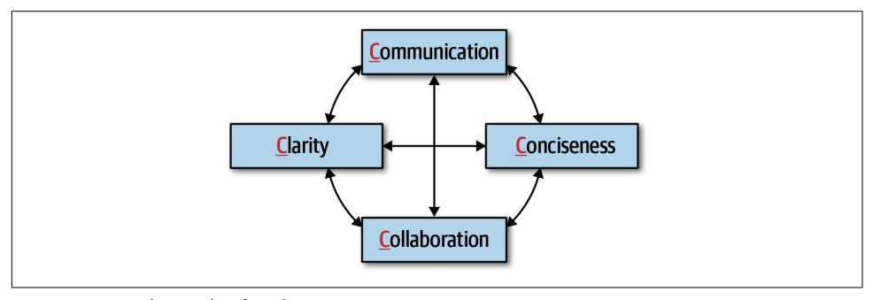
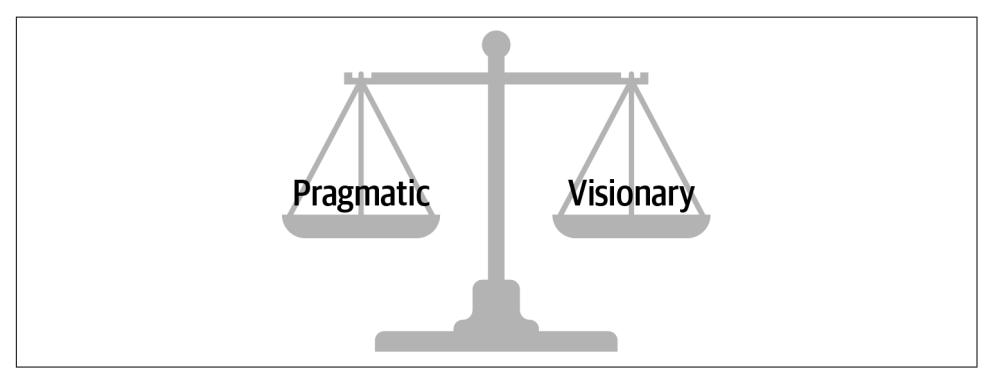
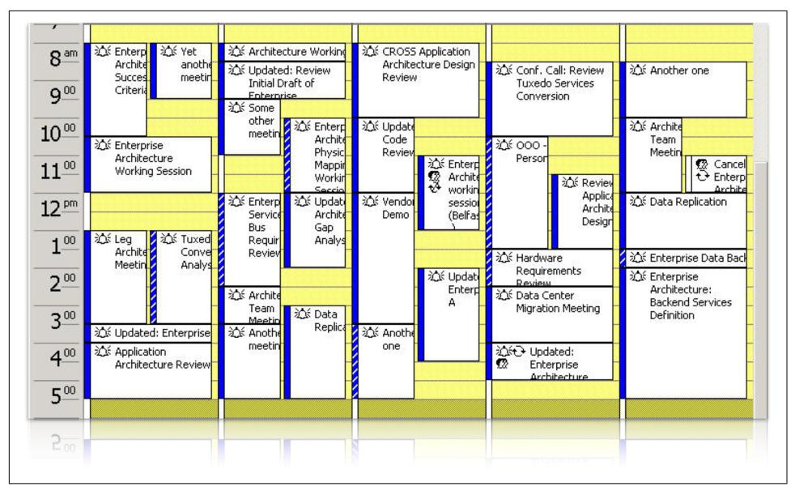
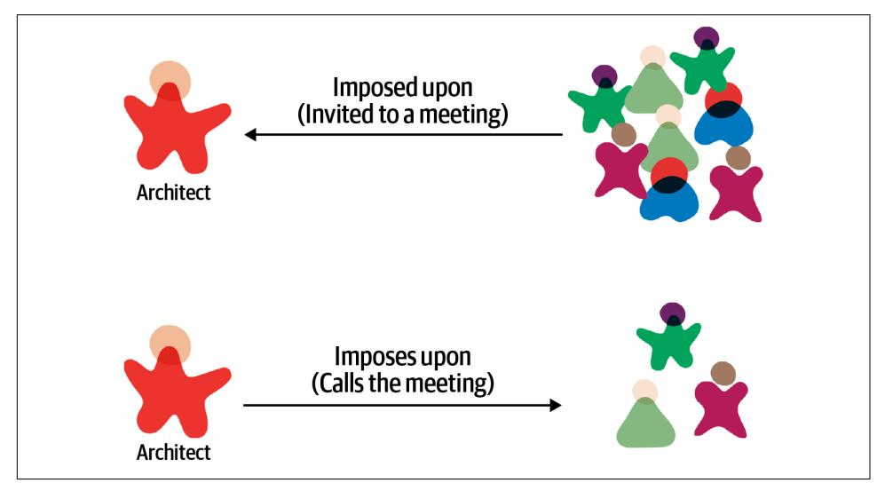

# Chapter 23: Negotiation and Leadership Skills

Negotiation and leadership skills are hard skills to obtain. It takes many years of learning, practice, and "lessons learned" experiences to gain the necessary skills to become an effective software architect. Knowing that this book cannot make an architect an expert in negotiation and leadership overnight, the techniques intro‐ duced in this chapter provide a good starting point for gaining these important skills.

## Negotiation and Facilitation

In the beginning of this book, we listed the core expectations of an architect, the last being the expectation that a software architect must understand the political climate of the enterprise and be able to navigate the politics. The reason for this key expecta‐ tion is that almost every decision a software architect makes will be challenged. Deci‐ sions will be challenged by developers who think they know more than the architect and hence have a better approach. Decisions will be challenged by other architects within the organization who think they have a better idea or way of approaching the problem. Finally, decisions will be challenged by stakeholders who will argue that the decision is too expensive or will take too much time.

Consider the decision of an architect to use database clustering and federation (using separate physical domain-scoped database instances) to mitigate risk with regard to overall availability within a system. While this is a sound solution to the issue of data‐ base availability, it is also a costly decision. In this example, the architect must negoti‐ ate with key business stakeholders (those paying for the system) to come to an agreement about the trade-off between availability and cost.

Negotiation is one of the most important skills a software architect can have. Effective software architects understand the politics of the organization, have strong negotiation and facilitation skills, and can overcome disagreements when they occur to create solutions that all stakeholders agree on.

## Negotiating with Business Stakeholders

Consider the following real-world scenario (scenario 1) involving a key business stakeholder and lead architect:

### Scenario 1

The senior vice president project sponsor is insistent that the new trading system must support five nines of availability (99.999%). However, the lead architect is convinced, based on research, calculations, and knowledge of the business domain and technology, that three nines of availability (99.9%) would be suffi‐ cient. The problem is, the project sponsor does not like to be wrong or corrected and really hates people who are condescending. The sponsor isn't overly techni‐ cal (but thinks they are) and as a result tends to get involved in the nonfunctional aspects of projects. The architect must convince the project sponsor through negotiation that three nines (99.9%) of availability would be enough.

In this sort of negotiation, the software architect must be careful to not be too egotis‐ tical and forceful in their analysis, but also make sure they are not missing anything that might prove them wrong during the negotiation. There are several key negotia‐ tion techniques an architect can use to help with this sort of stakeholder negotiation.

Leverage the use of grammar and buzzwords to better understand the situation.

Phrases such as "we must have zero downtime" and "I needed those features yester‐ day" are generally meaningless but nevertheless provide valuable information to the architect about to enter into a negotiation. For example, when the project sponsor is asked when a particular feature is needed and responds, "I needed it yesterday," that is an indication to the software architect that time to market is important to that stake‐ holder. Similarly, the phrase "this system must be lightning fast" means performance is a big concern. The phase "zero downtime" means that availability is critical in the application. An effective software architect will leverage this sort of nonsense gram‐ mar to better understand the real concerns and consequently leverage that use of grammar during a negotiation.

Consider scenario 1 described previously. Here, the key project sponsor wants five nines of availability. Leveraging this technique tells the architect that availability is very important. This leads to a second negotiation technique:

Gather as much information as possible *before* entering into a negotiation.

The phrase "five nines" is grammar that indicates high availability. However, what exactly is five nines of availability? Researching this ahead of time and gathering knowledge prior to the negotiation yields the information shown in Table 23-1.

*Table 23-1. Nines of availability*

| Percentage uptime    | Downtime per year (per day) |
|----------------------|--------------------------------|
| 90.0% (one nine)     | 36 days 12 hrs (2.4 hrs)       |
| 99.0% (two nines)    | 87 hrs 46 min (14 min)         |
| 99.9% (three nines)  | 8 hrs 46 min (86 sec)          |
| 99.99% (four nines)  | 52 min 33 sec (7 sec)          |
| 99.999% (five nines) | 5 min 35 sec (1 sec)           |
| 99.9999% (six nines) | 31.5 sec (86 ms)               |

"Five nines" of availability is 5 minutes and 35 seconds of downtime per year, or 1 second a day of unplanned downtime. Quite ambitious, but also quite costly and unnecessary for the prior example. Putting things in hours and minutes (or in this case, seconds) is a much better way to have the conversation than sticking with the nines vernacular.

Negotiating scenario 1 would include validating the stakeholder's concerns ("I under‐ stand that availability is very important for this system") and then bringing the nego‐ tiation from the nines vernacular to one of reasonable hours and minutes of unplanned downtime. Three nines (which the architect deemed good enough) aver‐ ages 86 seconds of unplanned downtime per day—certainly a reasonable number given the context of the global trading system described in the scenario. The architect can always resort to this tip:

When all else fails, state things in terms of cost and time.

We recommend saving this negotiation tactic for last. We've seen too many negotia‐ tions start off on the wrong foot due to opening statements such as, "That's going to cost a lot of money" or "We don't have time for that." Money and time (effort

involved) are certainly key factors in any negotiation but should be used as a last resort so that other justifications and rationalizations that matter more be tried first. Once an agreement is reached, then cost and time can be considered if they are important attributes to the negotiation.

Another important negotiation technique to always remember is the following, par‐ ticularly in situations as described in scenario 1:

Leverage the "divide and conquer" rule to qualify demands or requirements.

The ancient Chinese warrior Sun Tzu wrote in *The Art of War*, "If his forces are uni‐ ted, separate them." This same divide-and-conquer tactic can be applied by an archi‐ tect during negotiations as well. Consider scenario 1 previously described. In this case, the project sponsor is insisting on five nines (99.999%) of availability for the new trading system. However, does the *entire system* need five nines of availability? Qualifying the requirement to the specific area of the system actually requiring five nines of availability reduces the scope of difficult (and costly) requirements and the scope of the negotiation as well.

## Negotiating with Other Architects

Consider the following actual scenario (scenario 2) between a lead architect and another architect on the same project:

### Scenario 2

The lead architect on a project believes that asynchronous messaging would be the right approach for communication between a group of services to increase both performance and scalability. However, the other architect on the project once again strongly disagrees and insists that REST would be a better choice, because REST is always faster than messaging and can scale just as well ("see for yourself by Googling it!"). This is not the first heated debate between the two architects, nor will it be the last. The lead architect must convince the other architect that messaging is the right solution.

In this scenario, the lead architect can certainly tell the other architect that their opin‐ ion doesn't matter and ignore it based on the lead architect's seniority on the project. However, this will only lead to further animosity between the two architects and cre‐ ate an unhealthy and noncollaborative relationship, and consequently will end up having a negative impact on the development team. The following technique will help in these types of situations:

Always remember that *demonstration defeats discussion*.

Rather than arguing with another architect over the use of REST versus messaging, the lead architect should demonstrate to the other architect how messaging would be a better choice in their specific environment. Every environment is different, which is why simply Googling it will never yield the correct answer. By running a comparison between the two options in a production-like environment and showing the other architect the results, the argument would likely be avoided.

Another key negotiation technique that works in these situations is as follows:

Avoid being too argumentative or letting things get too personal in a negotiation—calm leadership combined with clear and concise reasoning will always win a negotiation.

This technique is a very powerful tool when dealing with adversarial relationships like the one described in scenario 2. Once things get too personal or argumentative, the best thing to do is stop the negotiation and reengage at a later time when both parties have calmed down. Arguments will happen between architects; however, approaching these situations with calm leadership will usually force the other person to back down when things get too heated.

## Negotiating with Developers

Effective software architects don't leverage their title as architect to tell developers what to do. Rather, they work with development teams to gain respect so that when a request is made of the development team, it doesn't end up in an argument or resent‐ ment. Working with development teams can be difficult at times. In many cases development teams feel disconnected from the architecture (and also the architect), and as a result feel left out of the loop with regard to decisions the architect makes. This is a classic example of the *Ivory Tower* architecture anti-pattern. Ivory tower architects are ones who simply dictate from on high, telling development teams what to do without regard to their opinion or concerns. This usually leads to a loss of respect for the architect and an eventual breakdown of the team dynamics. One nego‐ tiation technique that can help address this situation is to always provide a justification:

When convincing developers to adopt an architecture decision or to do a specific task, provide a justification rather than "dictating from on high."

By providing a reason why something needs to be done, developers will more likely agree with the request. For example, consider the following conversation between an architect and a developer with regard to making a simple query within a traditional n-tiered layered architecture:

**Architect**: "You must go through the business layer to make that call." **Developer**: "No. It's much faster just to call the database directly."

There are several things wrong with this conversation. First, notice the use of the words "you must." This type of commanding voice is not only demeaning, but is one of the worst ways to begin a negotiation or conversation. Also notice that the devel‐ oper responded to the architect's demand with a reason to counter the demand (going through the business layer will be slower and take more time). Now consider an alternative approach to this demand:

**Architect**: "Since change control is most important to us, we have formed a closedlayered architecture. This means all calls to the database need to come from the busi‐ ness layer."

**Developer**: "OK, I get it, but in that case, how am I going to deal with the performance issues for simple queries?"

Notice here the architect is providing the justification for the demand that all requests need to go through the business layer of the application. Providing the justification or reason first is always a good approach. Most of the time, once a person hears some‐ thing they disagree with, they stop listening. By stating the reason first, the architect is sure that the justification will be heard. Also notice the architect removed the per‐ sonal nature of this demand. By not saying "you must" or "you need to," the architect effectively turned the demand into a simple statement of fact ("this means…"). Now take a look at the developer's response. Notice the conversation shifted from disagree‐ ing with the layered architecture restrictions to a question about increasing perfor‐ mance for simple calls. Now the architect and developer can engage in a collaborative conversation to find ways to make simple queries faster while still preserving the closed layers in the architecture.

Another effective negotiation tactic when negotiating with a developer or trying to convince them to accept a particular design or architecture decision they disagree with is to have the developer arrive at the solution on their own. This creates a winwin situation where the architect cannot lose. For example, suppose an architect is choosing between two frameworks, Framework X and Framework Y. The architect sees that Framework Y doesn't satisfy the security requirements for the system and so naturally chooses Framework X. A developer on the team strongly disagrees and insists that Framework Y would still be the better choice. Rather than argue the mat‐ ter, the architect tells the developer that the team will use Framework Y if the devel‐ oper can show how to address the security requirements if Framework Y is used. One of two things will happen:

- 1. The developer will fail trying to demonstrate that Framework Y will satisfy the security requirements and will understand firsthand that the framework cannot be used. By having the developer arrive at the solution on their own, the architect automatically gets buy-in and agreement for the decision to use Framework X by essentially making it the developer's decision. This is a win.
- 2. The developer finds a way to address the security requirements with Framework Y and demonstrates this to the architect. This is a win as well. In this case the architect missed something in Framework Y, and it also ended up being a better framework over the other one.

If a developer disagrees with a decision, have them arrive at the sol‐ ution on their own.

It's really through collaboration with the development team that the architect is able to gain the respect of the team and form better solutions. The more developers respect an architect, the easier it will be for the architect to negotiate with those developers.

## The Software Architect as a Leader

A software architect is also a leader, one who can guide a development team through the implementation of the architecture. We maintain that about 50% of being an effective software architect is having good people skills, facilitation skills, and leader‐ ship skills. In this section we discuss several key leadership techniques that an effec‐ tive software architect can leverage to lead development teams.

## The 4 C's of Architecture

Each day things seem to be getting more and more complex, whether it be increased complexity in business processes or increased complexity of systems and even archi‐ tecture. Complexity exists within architecture as well as software development, and always will. Some architectures are very complex, such as ones supporting six nines of availability (99.9999%)—that's equivalent to unplanned downtime of about 86 milliseconds a day, or 31.5 seconds of downtime per year. This sort of complexity is known as *essential complexity*—in other words, "we have a hard problem."

One of the traps many architects fall into is adding unnecessary complexity to solu‐ tions, diagrams, and documentation. Architects (as well as developers) seem to love complexity. To quote Neal:

Developers are drawn to complexity like moths to a flame—frequently with the same result.

Consider the diagram in Figure 23-1 illustrating the major information flows for the backend processing systems at a very large global bank. Is this necessarily complex? No one knows the answer to this question because the architect has made it complex. This sort of complexity is called *accidental complexity*—in other words, "we have made a problem hard." Architects sometimes do this to prove their worth when things seem too simple or to guarantee that they are always kept in the loop on dis‐ cussions and decisions that are made regarding the business or architecture. Other architects do this to maintain job security. Whatever the reason, introducing acciden‐ tal complexity into something that is not complex is one of the best ways to become an ineffective leader as an architect.

*Figure 23-1. Introducing accidental complexity into a problem*

An effective way of avoiding accidental complexity is what we call the *4 C's* of archi‐ tecture: *communication*, *collaboration, clarity*, and *conciseness*. These factors (illustra‐ ted in Figure 23-2) all work together to create an effective communicator and collaborator on the team.

*Figure 23-2. The 4 C's of architecture*

As a leader, facilitator, and negotiator, is it vital that a software architect be able to effectively communicate in a clear and concise manner. It is equally important that an architect also be able to collaborate with developers, business stakeholders, and other architects to discuss and form solutions together. Focusing on the 4 C's of architec‐ ture helps an architect gain the respect of the team and become the go-to person on the project that everyone comes to not only for questions, but also for advice, men‐ toring, coaching, and leadership.

## Be Pragmatic, Yet Visionary

An effective software architect must be pragmatic, yet visionary. Doing this is not as easy as it sounds and takes a fairly high level of maturity and significant practice to accomplish. To better understand this statement, consider the definition of a visionary:

### Visionary

Thinking about or planning the future with imagination or wisdom.

Being a visionary means applying strategic thinking to a problem, which is exactly what an architect is supposed to do. Architecture is about planning for the future and making sure the architectural vitality (how valid an architecture is) remains that way for a long time. However, too many times, architects become too theoretical in their planning and designs, creating solutions that become too difficult to understand or even implement. Now consider the definition of being pragmatic:

#### Pragmatic

Dealing with things sensibly and realistically in a way that is based on practical rather than theoretical considerations.

While architects need to be visionaries, they also need to apply practical and realistic solutions. Being pragmatic is taking all of the following factors and constraints into account when creating an architectural solution:

- Budget constraints and other cost-based factors
- Time constraints and other time-based factors
- Skill set and skill level of the development team
- Trade-offs and implications associated with an architecture decision
- Technical limitations of a proposed architectural design or solution

A good software architect is one that strives to find an appropriate balance between being pragmatic while still applying imagination and wisdom to solving problems (see Figure 23-3). For example, consider the situation where an architect is faced with a difficult problem dealing with elasticity (unknown sudden and significant increases in concurrent user load). A visionary might come up with an elaborate way to deal with this through the use of a complex [data mesh](https://oreil.ly/6HmSp), which is a collection of distributed, domain-based databases. In theory this might be a good approach, but being prag‐ matic means applying reason and practicality to the solution. For example, has the company ever used a data mesh before? What are the trade-offs of using a data mesh? Would this really solve the problem?

*Figure 23-3. Good architects nd the balance between being pragmatic, yet visionary*

Maintaining a good balance between being pragmatic, yet visionary, is an excellent way of gaining respect as an architect. Business stakeholders will appreciate visionary solutions that fit within a set of constraints, and developers will appreciate having a practical (rather then theoretical) solution to implement.

A pragmatic architect would first look at what the limiting factor is when needing high levels of elasticity. Is it the database that's the bottleneck? Maybe it's a bottleneck with respect to some of the services invoked or other external sources needed. Find‐ ing and isolating the bottleneck would be a first practical approach to the problem. In fact, even if it is the database, could some of the data needed be cached so that the database need not be accessed at all?

## Leading Teams by Example

Bad software architects leverage their title to get people to do what they want them to do. Effective software architects get people to do things by not leveraging their title as architect, but rather by leading through example, not by title. This is all about gaining the respect of development teams, business stakeholders, and other people through‐ out the organization (such as the head of operations, development managers, and product owners).

The classic "lead by example, not by title" story involves a captain and a sergeant dur‐ ing a military battle. The high-ranking captain, who is largely removed from the troops, commands all of the troops to move forward during the battle to take a par‐ ticularly difficult hill. However, rather than listen to the high-ranking captain, the sol‐ diers, full of doubt, look over to the lower-ranking sergeant for whether they should take the hill or not. The sergeant looks at the situation, nods his head slightly, and the soldiers immediately move forward with confidence to take the hill.

The moral of this story is that rank and title mean very little when it comes to leading people. The computer scientist [Gerald Weinberg](https://oreil.ly/6fI2m) is famous for saying, "No matter what the problem is, it's a people problem." Most people think that solving technical issues has nothing to do with people skills—it has to do with *technical knowledge*. While having technical knowledge is certainly necessary for solving a problem, it's only a part of the overall equation for solving any problem. Suppose, for example, an architect is holding a meeting with a team of developers to solve an issue that's come up in production. One of the developers makes a suggestion, and the architect responds with, "Well, *that's* a dumb idea." Not only will that developer not make any more suggestions, but none of the other developers will dare say anything. The archi‐ tect in this case has effectively shut down the entire team from collaborating on the solution.

Gaining respect and leading teams is about basic people skills. Consider the following dialogue between an architect and a customer, client, or development team with regard to a performance issue in the application:

**Developer**: "So how are we going to solve this performance problem?"

**Architect**: "What you need to do is use a cache. That would fix the problem."

**Developer**: "Don't tell me what to do."

**Architect**: "What I'm telling you is that it would fix the problem."

By using the words "what you need to do is…" or "you must," the architect is forcing their opinion onto the developer and essentially shutting down collaboration. This is a good example of using communication, not collaboration. Now consider the revised dialogue:

**Developer**: "So how are we going to solve this performance problem?" **Architect**: "Have you considered using a cache? That might fix the problem." **Developer**: "Hmmm, no we didn't think about that. What are your thoughts?" **Architect**: "Well, if we put a cache here…"

Notice the use of the words "have you considered…" or "what about…" in the dia‐ logue. By asking the question, it puts control back on the developer or client, creating a collaborative conversation where both the architect and developer are working together to form a solution. The use of grammar is vitally important when trying to build a collaborative environment. Being a leader as an architect is not only being able to collaborate with others to create an architecture, but also to help promote col‐ laboration among the team by acting as a facilitator. As an architect, try to observe team dynamics and notice when situations like the first dialogue occurs. By taking team members aside and coaching them on the use of grammar as a means of collab‐ oration, not only will this create better team dynamics, but it will also help create respect among the team members.

Another basic people skills technique that can help build respect and healthy relation‐ ships between an architect and the development team is to always try to use the per‐ son's name during a conversation or negotiation. Not only do people like hearing their name during a conversation, it also helps breed familiarity. Practice remember‐ ing people's names, and use them frequently. Given that names are sometimes hard to pronounce, make sure to get the pronunciation correct, then practice that pronuncia‐ tion until it is perfect. Whenever we ask someone's name, we repeat it to the person and ask if that's the correct way to pronounce it. If it's not correct, we repeat this pro‐ cess until we get it right.

If an architect meets someone for the first time or only occasionally, always shake the person's hand and make eye contact. A handshake is an important people skill that goes back to medieval times. The physical bond that occurs during a simple hand‐ shake lets both people know they are friends, not foes, and forms a bond between them. However, it is sometimes hard to get a simple handshake right.

When shaking someone's hand, give a firm (but not overpowering) handshake while looking the person in the eye. Looking away while shaking someone's hand is a sign of disrespect, and most people will notice that. Also, don't hold on to the handshake too long. A simple two- to three-second, firm handshake is all that is needed to start off a conversation or to greet someone. There is also the issue of going overboard with the handshake technique and making the other person uncomfortable enough to not want to communicate or collaborate with you. For example, imagine a software architect who comes in every morning and starts shaking everyone's hand. Not only is this a little weird, it creates an uncomfortable situation. However, imagine a soft‐ ware architect who must meet with the head of operations monthly. This is the per‐ fect opportunity to stand up, say "Hello Ruth, nice seeing you again," and give a

quick, firm handshake. Knowing when to do a handshake and when not to is part of the complex art of people skills.

A software architect as a leader, facilitator, and negotiator should be careful to pre‐ serve the boundaries that exist between people at all levels. The handshake, as described previously, is an effective and professional technique of forming a physical bond with the person you are communicating or collaborating with. However, while a handshake is good, a hug in a professional setting, regardless of the environment, is not. An architect might think that it exemplifies more physical connection and bond‐ ing, but all it does is sometimes make the other person at work more uncomfortable and, more importantly, can lead to potential harassment issues within the workplace. Skip the hugs all together, regardless of the professional environment, and stick with the handshake instead (unless of course everyone in the company hugs each other, which would just be…weird).

Sometimes it's best to turn a request into a favor as a way of getting someone to do something they otherwise might not want to do. In general, people do not like to be told what to do, but for the most part, people want to help others. This is basic human nature. Consider the following conversation between an architect and devel‐ oper regarding an architecture refactoring effort during a busy iteration:

**Architect**: "I'm going to need you to split the payment service into five different serv‐ ices, with each service containing the functionality for each type of payment we accept, such as store credit, credit card, PayPal, gift card, and reward points, to provide better fault tolerance and scalability in the website. It shouldn't take too long."

**Developer**: "No way, man. Way too busy this iteration for that. Sorry, can't do it."

**Architect**: "Listen, this is important and needs to be done this iteration."

**Developer**: "Sorry, no can do. Maybe one of the other developers can do it. I'm just too busy."

Notice the developer's response. It is an immediate rejection of the task, even though the architect justified it through better fault tolerance and scalability. In this case, notice that the architect is *telling* the developer to do something they are simply too busy to do. Also notice the demand doesn't even include the person's name! Now con‐ sider the technique of turning the request into a favor:

**Architect**: "Hi, Sridhar. Listen, I'm in a real bind. I really need to have the payment service split into separate services for each payment type to get better fault tolerance and scalability, and I waited too long to do it. Is there any way you can squeeze this into this iteration? It would really help me out."

**Developer**: "(Pause)…I'm really busy this iteration, but I guess so. I'll see what I can do."

**Architect**: "Thanks, Sridhar, I really appreciate the help. I owe you one."

**Developer**: "No worries, I'll see that it gets done this iteration."

First, notice the use of the person's name repeatedly throughout the conversation. Using the person's name makes the conversation more of a personal, familiar nature

rather than an impersonal professional demand. Second, notice the architect admits they are in a "real bind" and that splitting the services would really "help them out a lot." This technique does not always work, but playing off of basic human nature of helping each other has a better probability of success over the first conversation. Try this technique the next time you face this sort of situation and see the results. In most cases, the results will be much more positive than telling someone what to do.

To lead a team and become an effective leader, a software architect should try to become the go-to person on the team—the person developers go to for their ques‐ tions and problems. An effective software architect will seize the opportunity and take the initiative to lead the team, regardless of their title or role on the team. When a software architect observes someone struggling with a technical issue, they should step in and offer help or guidance. The same is true for nontechnical situations as well. Suppose an architect observes a team member that comes into work looking sort of depressed and bothered—clearly something is up. In this circumstance, an effec‐ tive software architect would notice the situation and offer to talk—something like, "Hey, Antonio, I'm heading over to get some coffee. Why don't we head over together?" and then during the walk ask if everything is OK. This at least provides an opening for more of a personal discussion; and at it's best, a chance to mentor and coach at a more personal level. However, an effective leader will also recognize times to not be too pushy and will back off by reading various verbal signs and facial expressions.

Another technique to start gaining respect as a leader and become the go-to person on the team is to host periodic brown-bag lunches to talk about a specific technique or technology. Everyone reading this book has a particular skill or knowledge that others don't have. By hosting a periodic brown-bag lunch session, the architect not only is able to exhibit their technical prowess, but also practice speaking skills and mentoring skills. For example, host a lunch session on a review of design patterns or the latest features of the programming language release. Not only does this provide valuable information to developers, but it also starts identifying you as a leader and mentor on the team.

## Integrating with the Development Team

An architect's calendar is usually filled with meetings, with most of those meetings overlapping with other meetings, such as the calendar shown in [Figure 23-4.](#page-380-0) If this is what a software architect's calendar looks like, then when does the architect have the time to integrate with the development team, help guide and mentor them, and be available for questions or concerns when they come up? Unfortunately, meetings are a necessary evil within the information technology world. They happen frequently, and will always happen.

*Figure 23-4. A typical calendar of a soware architect*

The key to being an effective software architect is making more time for the develop‐ ment team, and this means controlling meetings. There are two types of meetings an architect can be involved in: those imposed upon (the architect is invited to a meet‐ ing), and those imposed by (the architect is calling the meeting). These meeting types are illustrated in Figure 23-5.

*Figure 23-5. Meeting types*

*Imposed upon* meetings are the hardest to control. Due to the number of stakeholders a software architect must communicate and collaborate with, architects are invited to almost every meeting that gets scheduled. When invited to a meeting, an effective software architect should always ask the meeting organizer why they are needed in that meeting. Many times architects get invited to meetings simply to keep them in the loop on the information being discussed. That's what meeting notes are for. By asking why, an architect can start to qualify which meetings they should attend and which ones they can skip. Another related technique to help reduce the number of meetings an architect is involved in is to ask for the meeting agenda before accepting a meeting invite. The meeting organizer may feel that the architect is necessary, but by looking at the agenda, the architect can qualify whether they really need to be in the meeting or not. Also, many times it is not necessary to attend the entire meeting. By reviewing the agenda, an architect can optimize their time by either showing up when relevant information is being discussed or leaving after the relevant discussion is over. Don't waste time in a meeting if you can be spending that time working with the development team.

Ask for the meeting agenda ahead of time to help qualify if you are really needed at the meeting or not.

Another effective technique to keep a development team on track and to gain their respect is to take one for the team when developers are invited to a meeting as well. Rather than having the tech lead attend the meeting, go in their place, particularly if both the tech lead and architect are invited to a meeting. This keeps a development team focused on the task at hand rather than continually attending meetings as well. While deflecting meetings away from useful team members increases the time an architect is in meetings, it does increase the development team's productivity.

Meetings that an architect imposes upon others (the architect calls the meeting) are also a necessity at times but should be kept to an absolute minimum. These are the kinds of meetings an architect has control over. An effective software architect will always ask whether the meeting they are calling is more important than the work they are pulling their team members away from. Many times an email is all that is required to communicate some important information, which saves everyone tons of wasted time. When calling a meeting as an architect, always set an agenda and stick to it. Too often, meetings an architect calls get derailed due to some other issue, and that other issue may not be relevant to everyone else in the meeting. Also, as an architect, pay close attention to developer flow and be sure not to disrupt it by calling a meeting. Flow is a state of mind developers frequently get into where the brain gets 100% engaged in a particular problem, allowing full attention and maximum creativity. For

example, a developer might be working on a particularly difficult algorithm or piece of code, and literally hours go by while it seems only minutes have passed. When call‐ ing a meeting, an architect should always try to schedule meetings either first thing in the morning, right after lunch, or toward the end of the day, but not during the day when most developers experience flow state.

Aside from managing meetings, another thing an effective software architect can do to integrate better with the development team is to sit with that team. Sitting in a cubicle away from the team sends the message that the architect is special, and those physical walls surrounding the cubicle are a distinct message that the architect is not to be bothered or disturbed. Sitting alongside a development team sends the message that the architect is an integral part of the team and is available for questions or con‐ cerns as they arise. By physically showing that they are part of the development team, the architect gains more respect and is better able to help guide and mentor the team.

Sometimes it is not possible for an architect to sit with a development team. In these cases the best thing an architect can do is continually walk around and be seen. Architects that are stuck on a different floor or always in their offices or cubicles and never seen cannot possibly help guide the development team through the implementation of the architecture. Block off time in the morning, after lunch, or late in the day and make the time to converse with the development team, help with issues, answer questions, and do basic coaching and mentoring. Development teams appreciate this type of communication and will respect you for making time for them during the day. The same holds true for other stakeholders. Stopping in to say hi to the head of operations while on the way to get more coffee is an excellent way of keeping communication open and available with business and other key stakeholders.

## Summary

The negotiation and leadership tips presented and discussed in this chapter are meant to help the software architect form a better collaborative relationship with the devel‐ opment team and other stakeholders. These are necessary skills an architect must have in order to become an effective software architect. While the tips we presented in this chapter are good tips for starting the journey into becoming more of an effec‐ tive leader, perhaps the best tip of all is from a quote from [Theodore Roosevelt](https://oreil.ly/dCN_t), the 26th US president:

The most important single ingredient in the formula of success is knowing how to get along with people.

—Theodore Roosevelt
