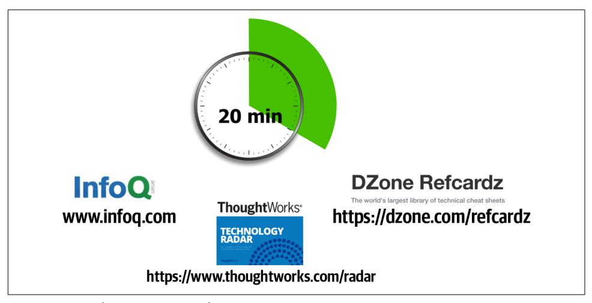
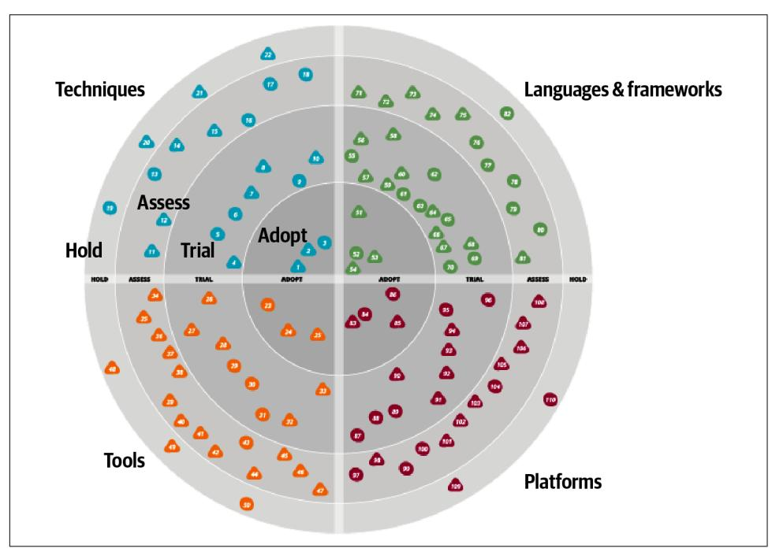
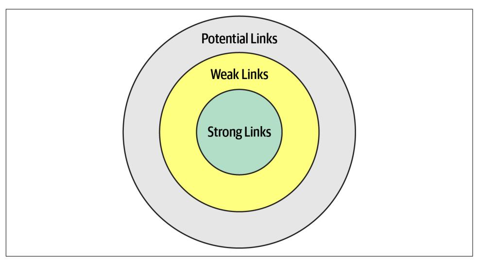

# Chapter 24: Developing a Career Path

Becoming an architect takes time and effort, but based on the many reasons we've outlined throughout this book, managing a career path after becoming an architect is equally tricky. While we can't chart a specific career path for you, we can point you to some practices that we have seen work well.

An architect must continue to learn throughout their career. The technology world changes at a dizzying pace. One of Neal's former coworkers was a world-renowned expert in Clipper. He lamented that he couldn't take the enormous body of (now use‐ less) Clipper knowledge and replace it with something else. He also speculated (and this is still an open question): has any group in history learned and thrown away so much detailed knowledge within their lifetimes as software developers?

Each architect should keep an eye out for relevant resources, both technology and business, and add them to their personal stockpile. Unfortunately, resources come and go all too quickly, which is why we don't list any in this book. Talking to collea‐ gues or experts about what resources they use to keep current is one good way of seeking out the latest newsfeeds, websites, and groups that are active in a particular area of interest. Architects should also build into their day some time to maintain breadth utilizing those resources.

## The 20-Minute Rule

As illustrated in [Figure 2-6,](007-chapter-2-architectural-thinking.md#page-48-0) technology breadth is more important to architects than depth. However, maintaining breadth takes time and effort, something architects should build into their day. But how in the world does anyone have the time to actually go to various websites to read articles, watch presentations, and listen to pod‐ casts? The answer is…not many do. Developers and architects alike struggle with the balance of working a regular job, spending time with the family, being available for

our children, carving out personal time for interests and hobbies, and trying to develop careers, while at the same time trying to keep up with the latest trends and buzzwords.

One technique we use to maintain this balance is something we call the *20-minute rule*. The idea of this technique, as illustrated in Figure 24-1, is to devote *at least* 20 minutes a day to your career as an architect by learning something new or diving deeper into a specific topic. Figure 24-1 illustrates examples of some of the types of resources to spend 20 minutes a day on, such as [InfoQ,](https://www.infoq.com) [DZone Refcardz,](https://dzone.com/refcardz) and the [ThoughtWorks Technology Radar.](https://www.thoughtworks.com/radar) Spend that minimum of 20 minutes to Google some unfamiliar buzzwords ("the things you don't know you don't know" from [Chap‐](007-chapter-2-architectural-thinking.md#page-42-0) [ter 2\)](007-chapter-2-architectural-thinking.md#page-42-0) to learn a little about them, promoting that knowledge into the "things you know you don't know." Or maybe spend the 20 minutes going deeper into a particular topic to gain a little more knowledge about it. The point of this technique is to be able to carve out some time for developing a career as an architect and continuously gain‐ ing technical breadth.

*Figure 24-1. The 20-minute rule*

Many architects embrace this concept and plan to spend 20 minutes at lunch or in the evening after work to do this. What we have experienced is that this rarely works. Lunchtime gets shorter and shorter, becoming more of a catch-up time at work rather than a time to take a break and eat. Evenings are even worse—situations change, plans get made, family time becomes more important, and the 20-minute rule never happens.

We strongly recommend leveraging the 20-minute rule first thing in the morning, as the day is starting. However, there is a caveat to this advice as well. For example, what is the first thing an architect does after getting to work in the morning? Well, the very

first thing the architect does is to get that wonderful cup of coffee or tea. OK, in that case, what is the second thing every architect does after getting that necessary coffee or tea—check email. Once an architect checks email, diversion happens, email responses are written, and the day is over. Therefore, our strong recommendation is to invoke the 20-minute rule first thing in the morning, right after grabbing that cup of coffee or tea and before checking email. Go in to work a little early. Doing this will increase an architect's technical breadth and help develop the knowledge required to become an effective software architect.

## Developing a Personal Radar

For most of the '90s and the beginning of the '00s, Neal was the CTO of a small train‐ ing and consulting company. When he started there, the primary platform was Clip‐ per, which was a rapid-application development tool for building DOS applications atop dBASE files. Until one day it vanished. The company had noticed the rise of Windows, but the business market was still DOS…until it abruptly wasn't. That les‐ son left a lasting impression: ignore the march of technology at your peril.

It also taught an important lesson about technology bubbles. When heavily invested in a technology, a developer lives in a memetic bubble, which also serves as an echo chamber. Bubbles created by vendors are particularly dangerous, because developers never hear honest appraisals from within the bubble. But the biggest danger of Bub‐ ble Living comes when it starts collapsing, which developers never notice from the inside until it's too late.

What they lacked was a technology radar: a living document to assess the risks and rewards of existing and nascent technologies. The radar concept comes from ThoughtWorks; first, we'll describe how this concept came to be and then how to use it to create a personal radar.

## The ThoughtWorks Technology Radar

The ThoughtWorks Technology Advisory Board (TAB) is a group of senior technol‐ ogy leaders within ThoughtWorks, created to assist the CTO, Dr. Rebecca Parsons, in deciding technology directions and strategies for the company and its clients. This group meets face-to-face twice a year. One of the outcomes of the face to face meeting was the Technology Radar. Over time, it gradually grew into the biannual [Technology](https://www.thoughtworks.com/radar) [Radar](https://www.thoughtworks.com/radar).

The TAB gradually settled into a twice-a-year rhythm of Radar production. Then, as often happens, unexpected side effects occurred. At some of the conferences Neal spoke at, attendees sought him out and thanked him for helping produce the Radar and said that their company had started producing their own version of it.

Neal also realized that this was the answer to a pervasive question at conference speaker panels everywhere: "How do you (the speakers) keep up with technology? How do you figure out what things to pursue next?" The answer, of course, is that they all have some form of internal radar.

### Parts

The ThoughtWorks Radar consists of four quadrants that attempt to cover most of the software development landscape:

#### Tools

Tools in the software development space, everything from developers tools like IDEs to enterprise-grade integration tools

#### Languages and frameworks

Computer languages, libraries, and frameworks, typically open source

#### Techniques

Any practice that assists software development overall; this may include software development processes, engineering practices, and advice

#### Platforms

Technology platforms, including databases, cloud vendors, and operating systems

#### Rings

The Radar has four rings, listed here from outer to inner:

#### Hold

The original intent of the hold ring was "hold off for now," to represent technolo‐ gies that were too new to reasonably assess yet—technologies that were getting lots of buzz but weren't yet proven. The hold ring has evolved into indicating "don't start anything new with this technology." There's no harm in using it on existing projects, but developers should think twice about using it for new development.

#### Assess

The assess ring indicates that a technology is worth exploring with the goal of understanding how it will affect an organization. Architects should invest some effort (such as development spikes, research projects, and conference sessions) to see if it will have an impact on the organization. For example, many large compa‐ nies visibly went through this phase when formulating a mobile strategy.

#### Trial

The trial ring is for technologies worth pursuing; it is important to understand how to build up this capability. Now is the time to pilot a low-risk project so that architects and developers can really understand the technology.

#### Adopt

For technologies in the adopt ring, ThoughtWorks feels strongly that the industry should adopt those items.

An example view of the Radar appears in Figure 24-2.

*Figure 24-2. A sample ThoughtWorks Technology Radar*

In Figure 24-2, each blip represents a different technology or technique, with associ‐ ated short write-ups. While ThoughtWorks uses the radar to broadcast their opinions about the software world, many developers and architects also use it as a way of struc‐ turing their technology assessment process. Architects can use the tool described in ["Open Source Visualization Bits" on page 371](#page-390-0) to build the same visuals used by ThoughtWorks as a way to organize their thinking about what to invest time in.

When using the radar for personal use, we suggest altering the meanings of the quad‐ rants to the following:

#### Hold

An architect can include not only technologies and techniques to avoid, but also habits they are trying to break. For example, an architect from the .NET world may be accustomed to reading the latest news/gossip on forums about team internals. While entertaining, it may be a low-value information stream. Placing that in hold forms a reminder for an architect to avoid problematic things.

#### Assess

Architects should use *assess* for promising technologies that they have heard good things about but haven't had time to assess for themselves yet—see ["Using](#page-390-0) [Social Media" on page 371](#page-390-0). This ring forms a staging area for more serious research at some time in the future.

#### Trial

The *trial* ring indicates active research and development, such as an architect performing spike experiments within a larger code base. This ring represents technologies worth spending time on to understand more deeply so that an architect can perform an effective trade-off analysis.

#### Adopt

The *adopt* ring represents the new things an architect is most excited about and best practices for solving particular problems.

It is dangerous to adopt a laissez-faire attitude toward a technology portfolio. Most technologists pick technologies on a more or less ad hoc basis, based on what's cool or what your employer is driving. Creating a technology radar helps an architect formal‐ ize their thinking about technology and balance opposing decision criteria (such as the "more cool" technology factor and being less likely to get a new job versus a huge job market but with less interesting work). Architects should treat their technology portfolio like a financial portfolio: in many ways, they are the same thing. What does a financial planner tell people about their portfolio? Diversify!

Architects should choose some technologies and/or skills that are widely in demand and track that demand. But they might also want to try some technology gambits, like open source or mobile development. Anecdotes abound about developers who freed themselves from cubicle-dwelling servitude by working late at night on open source projects that became popular, purchasable, and eventually, career destinations. This is yet another reason to focus on breadth rather than depth.

Architects should set aside time to broaden their technology portfolio, and building a radar provides a good scaffolding. However, the exercise is more important than the outcome. Creating the visualization provides an excuse to think about these things, and, for busy architects, finding an excuse to carve out time in a busy schedule is the only way this kind of thinking can occur.

## Open Source Visualization Bits

By popular demand, ThoughtWorks released a tool in November 2016 to assist tech‐ nologists in building their own radar visualization. When ThoughtWorks does this exercise for companies, they capture the output of the meeting in a spreadsheet, with a page for each quadrant. The ThoughtWorks Build Your Own Radar tool uses a Google spreadsheet as input and generates the radar visualization using an HTML 5 canvas. Thus, while the important part of the exercise is the conversations it gener‐ ates, it also generates useful visualizations.

## Using Social Media

Where can an architect find new technologies and techniques to put in the assess ring of their radar? In Andrew McAfee's book *Enterprise 2.0* (Harvard Business Review Press), he makes an interesting observation about social media and social networks in general. When thinking about a person's network of contact between people, three categories exist, as illustrated in Figure 24-3.

*Figure 24-3. Social circles of a person's relationships*

In Figure 24-3, *strong links* represent family members, coworkers, and other people whom a person regularly contacts. One litmus test for how close these connections are: they can tell you what a person in their strong links had for lunch at least one day last week. *Weak links* are casual acquaintances, distant relatives, and other people seen

only a few times a year. Before social media, it was difficult to keep up with this circle of people. Finally, *potential links* represent people you haven't met yet.

McAfee's most interesting observation about these connections was that someone's next job is more likely to come from a weak link than a strong one. Strongly linked people know everything within the strongly linked group—these are people who see each other all the time. Weak links, on the other hand, offer advice from outside someone's normal experience, including new job offers.

Using the characteristics of social networks, architects can utilize social media to enhance their technical breadth. Using social media like Twitter professionally, archi‐ tects should find technologists whose advice they respect and follow them on social media. This allows an architect to build a network on new, interesting technologies to assess and keep up with the rapid changes in the technology world.

## Parting Words of Advice

How do we get great designers? Great designers design, of course.

—Fred Brooks

So how are we supposed to get great architects, if they only get the chance to architect fewer than a half-dozen times in their career?

—Ted Neward

Practice is the proven way to build skills and become better at anything in life… including architecture. We encourage new and existing architects to keep honing their skills, both for individual technology breadth but also for the craft of designing architecture. To that end, check out the [architecture katas](https://oreil.ly/EPop7) on the companion website for the book. Modeled after the katas used as examples here, we encourage architects to use these to practice building skills in architecture.

A common question we get about katas: is there an answer guide somewhere? Unfortunately such an answer key does not exist. To quote your author, Neal:

There are not right or wrong answers in architecture—only *trade-offs*.

When we started using the architecture katas exercise during live training classes, we initially kept the drawings the students produced with the goal of creating an answer repository. We quickly gave up, though, because we realized that we had incomplete artifacts. In other words, the teams had captured the topology and explained their decisions in class but didn't have the time to create architecture decision records. While how they implemented their solutions was interesting, the why was much more interesting because it contains the trade-offs they considered in making that decision. Keeping just the how was only half of the story. So, our last parting words of advice: always learn, always practice, and *go do some architecture*!
