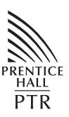

From the Library of Brian Watterson

# Working Effectively with Legacy Code

## Robert C. Martin Series

This series is directed at software developers, team-leaders, business analysts, and managers who want to increase their skills and proficiency to the level of a Master Craftsman.

The series contains books that guide software professionals in the principles, patterns, and practices of programming, software project management, requirements gathering, design, analysis, testing, and others.

## Working Effectively with Legacy Code

**Michael C. Feathers**

Prentice Hall Professional Technical Reference Upper Saddle River, NJ 07458 <www,phptr.com>

The authors and publisher have taken care in the preparation of this book, but make no expressed or implied warranty of any kind and assume no responsibility for errors or omissions. No liability is assumed for incidental or consequential damages in connection with or arising out of the use of the information or programs contained herein.

Publisher: John Wait

Editor in Chief: Don O'Hagan Acquisitions Editor: Paul Petralia Editorial Assistant: Michelle Vincenti Marketing Manager: Chris Guzikowski Publicist: Kerry Guiliano Cover Designer: Sandra Schroeder Managing Editor: Gina Kanouse Senior Project Editor: Lori Lyons Copy Editor: Krista Hansing Indexer: Lisa Stumpf Compositor: Karen Kennedy

Proofreader: Debbie Williams Manufacturing Buyer: Dan Uhrig

Prentice Hall offers excellent discounts on this book when ordered in quantity for bulk purchases or special sales, which may include electronic versions and/or custom covers and content particular to your business, training goals, marketing focus, and branding interests. For more information, please contact:

U. S. Corporate and Government Sales 1-800-382-3419 corpsales@pearsontechgroup.com

For sales outside the U. S., please contact:

International Sales 1-317-428-3341 international@pearsontechgroup.com

Visit us on the web:<www.phptr.com>

*Library of Congress Cataloging-in-Publication Data: 2004108115*

Copyright © 2005 Pearson Education, Inc.

Publishing as Prentice Hall PTR

All rights reserved. Printed in the United States of America. This publication is protected by copyright, and permission must be obtained from the publisher prior to any prohibited reproduction, storage in a retrieval system, or transmission in any form or by any means, electronic, mechanical, photocopying, recording, or likewise. For information regarding permissions, write to:

Pearson Education, Inc. Rights and Contracts Department One Lake Street Upper Saddle River, NJ 07458

Other product or company names mentioned herein are the trademarks or registered trademarks of their respective owners.

ISBN 0-13-117705-2

Text printed in the United States on recycled paper at Phoenix Book Tech. First printing, September 2004

*For Ann, Deborah, and Ryan, the bright centers of my life.*

*— Michael*

