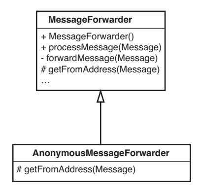
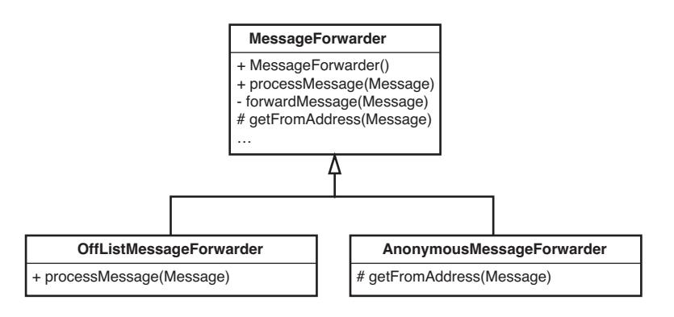
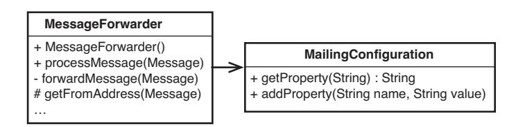
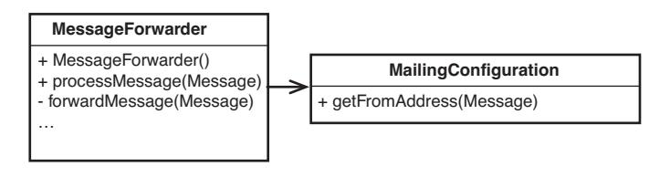
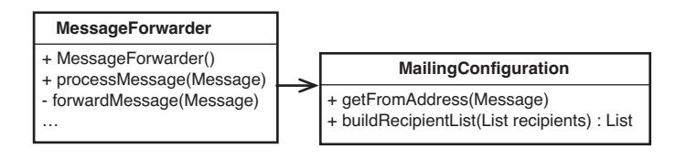
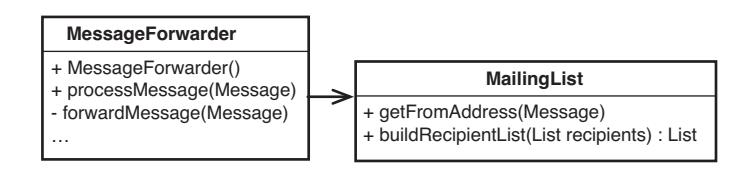
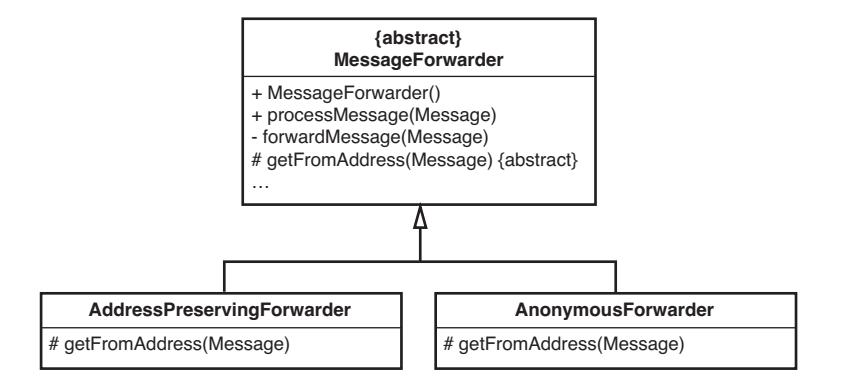

<span id="page-109-1"></span>
<span id="page-109-0"></span>
# Chapter 8: How Do I Add a Feature?


This has to be the most abstract and problem-domain-specific question in the book. I almost didn't add it because of that. But the fact is, regardless of our design approach or the particular constraints we face, there are some techniques that we can use to make the job easier.

Let's talk about context. In legacy code, one of the most important considerations is that we don't have tests around much of our code. Worse, getting them in place can be difficult. People on many teams are tempted to fall back on the techniques in Chapter 6, *I Don't Have Much Time and I Have to Change It*, because of this. We can use the techniques described there (sprouting and wrapping) to add to code without tests, but there are some hazards aside from the obvious ones. For one thing, when we sprout or wrap, we don't significantly modify the existing code, so it isn't going to get any better for a while. Duplication is another hazard. If the code that we add duplicates code that exists in the untested areas, it might just lie there and fester. Worse, we might not realize that we are going to have duplication until we get far along making our changes. The last hazards are fear and resignation: fear that we can't change a particular piece of code and make it easier to work with, and resignation because whole areas of the code just aren't getting any better. Fear gets in the way of good decision making. The sprouts and wraps left in the code are little reminders of it.

In general, it's better to confront the beast than hide from it. If we can get code under test, we can use the techniques in this chapter to move forward in a good way. If you need to find ways to get tests in place, look at Chapter 13, *I Need to Make a Change, but I Don't Know What Tests to Write*. If dependencies are getting in your way, look at Chapter 9, *I Can't Get This Class into a Test Harness*, and Chapter 10, *I Can't Run This Method in a Test Harness*.

Once we have tests in place, we are in a better position to add new features. We have a solid foundation.

**How Do I Add a Feature?**

<span id="page-110-1"></span>
<span id="page-110-0"></span>
## Test-Driven Development \(TDD\)

The most powerful feature-addition technique I know of is test-driven development (TDD). In a nutshell, it works like this: We imagine a method that will help us solve some part of a problem, and then we write a failing test case for it. The method doesn't exist yet, but if we can write a test for it, we've solidified our understanding of what the code we are about to write should do.

*Test-driven development* uses a little algorithm that goes like this:

- 1. Write a failing test case.
- 2. Get it to compile.
- 3. Make it pass.
- 4. Remove duplication.
- 5. Repeat.

Here is an example. We're working on a financial application, and we need a class that is going to use some high-powered mathematics to verify whether certain commodities should be traded. We need a Java class that calculates something called the first statistical moment about a point. We don't have a method that does that yet, but we do know that we can write a test case for the method. We know the math, so we know that the answer should be -0.5 for the data we code in the test.

## Write a Failing Test Case

Here is a test case for the functionality we need.

```
public void testFirstMoment() {
 InstrumentCalculator calculator = new InstrumentCalculator();
 calculator.addElement(1.0);
 calculator.addElement(2.0);
 assertEquals(-0.5, calculator.firstMomentAbout(2.0), TOLERANCE);
}
```

## Get It to Compile

The test we just wrote is nice, but it doesn't compile. We don't have a method named firstMomentAbout on InstrumentCalculator. But we add it as an empty method. We want the test to fail, so we have it return the double value NaN (which definitely is not the expected value of -0.5).

**Test-Driven Development (TDD)**

```
public class InstrumentCalculator
 double firstMomentAbout(double point) {
 return Double.NaN;
 }
 ...
```

### Make It Pass

With that test in place, we write the code that makes it pass.

```
public double firstMomentAbout(double point) {
 double numerator = 0.0;
 for (Iterator it = elements.iterator(); it.hasNext(); ) {
 double element = ((Double)(it.next())).doubleValue();
 numerator += element - point;
 }
 return numerator / elements.size();
```

This is an abnormally large amount of code to write in response to a test in TDD. Typically, steps are much smaller, although they can be this large if you are certain of the algorithm you need to use.

## Remove Duplication

Do we have any duplication here? Not really. We can go on to the next case.

### Write a Failing Test Case

The code we just wrote makes the test pass, but it definitely won't be good for all cases. In the return statement, we could accidentally divide by 0. What should we do in that case? What do we return when we have no elements? In this case, we want to throw an exception. The results will be meaningless for us unless we have data in our elements list.

This next test is special. It fails if an InvalidBasisException isn't thrown, and it passes if no exceptions are thrown or any other exception is thrown. When we run it, it fails because an ArithmeticException is thrown when we divide by 0 in firstMomentAbout.

```
public void testFirstMoment() {
 try {
 new InstrumentCalculator().firstMomentAbout(0.0);
 fail("expected InvalidBasisException");
 }
```

**Test-Driven Development (TDD)**

```
 catch (InvalidBasisException e) {
 }
}
```

### Get It to Compile

To do this, we have to alter the declaration of firstMomentAbout so that it throws an InvalidBasisException.

```
public double firstMomentAbout(double point) 
 throws InvalidBasisException {
 double numerator = 0.0;
 for (Iterator it = elements.iterator(); it.hasNext(); ) {
 double element = ((Double)(it.next())).doubleValue();
 numerator += element - point;
 }
 return numerator / elements.size();
}
```

But that doesn't compile. The compiler errors tell us that we have to actually throw the exception if it is listed in the declaration, so we go ahead and write the code.

```
public double firstMomentAbout(double point) 
 throws InvalidBasisException {
 if (element.size() == 0)
 throw new InvalidBasisException("no elements");
 double numerator = 0.0;
 for (Iterator it = elements.iterator(); it.hasNext(); ) {
 double element = ((Double)(it.next())).doubleValue();
 numerator += element - point;
 }
 return numerator / elements.size();
```

**Test-Driven Development (TDD)**

#### Make It Pass

}

Now our tests pass.

#### Remove Duplication

There isn't any duplication in this case.

<span id="page-113-0"></span>
#### Write a Failing Test Case

The next piece of code that we have to write is a method that calculates the second statistical moment about a point. Actually, it is just a variation of the first. Here is a test that moves us toward writing that code. In this case, the expected value is 0.5 rather than -0.5. We write a new test for a method that doesn't exist yet: secondMomentAbout.

```
public void testSecondMoment() throws Exception {
 InstrumentCalculator calculator = new InstrumentCalculator();
 calculator.addElement(1.0);
 calculator.addElement(2.0);
 assertEquals(0.5, calculator.secondMomentAbout(2.0), TOLERANCE);
```

#### Get It to Compile

To get it to compile, we have to add a definition for secondMomentAbout. We can use the same trick we used for the firstMomentAbout method, but it turns out that the code for the second moment is only a slight variation of the code for the first moment.

This line in firstMoment:

```
numerator += element - point;
```

has to become this in the case of the second moment:

```
numerator += Math.pow(element – point, 2.0);
```

And there is a general pattern for this sort of thing. The *n*th statistic moment is calculated using this expression:

```
numerator += Math.pow(element – point, N);
```

The code in firstMomentAbout works because element – point is the same as Math.pow(element – point, 1.0).

At this point, we have a couple of choices. We can notice the generality and write a general method that accepts an "about" point and a value for N. Then we can replace every use of firstMomentAbout(double) with a call to that general method. We can do that, but it would burden the callers with the need to supply an N value, and we don't want to allow clients to supply an arbitrary value for N. It seems like we are getting lost in thought here. We should put this on hold and finish what we've started so far. Our only job right now is to make it compile. We can generalize later if we find that we still want to.

To make it compile, we can make a copy of the firstMomentAbout method and rename it so that it is now called secondMomentAbout:

**Test-Driven Development (TDD)**

```
public double secondMomentAbout(double point) 
 throws InvalidBasisException {
 if (elements.size() == 0) 
 throw new InvalidBasisException("no elements");
 double numerator = 0.0;
 for (Iterator it = elements.iterator(); it.hasNext(); ) {
 double element = ((Double)(it.next())).doubleValue();
 numerator += element - point;
 }
 return numerator / elements.size();
}
```

#### Make It Pass

This code fails the test. When it fails, we can go back and make it pass by changing the code to this:

```
public double secondMomentAbout(double point)
 throws InvalidBasisException {
 if (elements.size() == 0)
 throw new InvalidBasisException("no elements");
 double numerator = 0.0;
 for (Iterator it = elements.iterator(); it.hasNext(); ) {
 double element = ((Double)(it.next())).doubleValue();
 numerator += Math.pow(element – point, 2.0);
 }
 return numerator / elements.size();
}
```

**Test-Driven Development (TDD)**

You might be shocked by the cut/copy/paste we just did, but we're going to remove duplication in a second. This code that we are writing is fresh code. But the trick of just copying the code that we need and modifying it in a new method is pretty powerful in the context of legacy code. Often when we want to add features to particularly awful code, it's easier to understand our modifications if we put them in some new place and can see them side by side with the old code. We can remove duplication later to fold the new code into the class in a nicer way, or we can just get rid of the modification and try it in a different way, knowing that we still have the old code to look at and learn from.

<span id="page-115-0"></span>
### Remove Duplication

Now that we have both tests passing, we have to do the next step: remove duplication. How do we do it?

One way to do it is to extract the entire body of secondMomentAbout, call it nthMomentAbout and give it a parameter, N:

```
public double secondMomentAbout(double point)
 throws InvalidBasisException {
 return nthMomentAbout(point, 2.0);
private double nthMomentAbout(double point, double n)
 throws InvalidBasisException {
 if (elements.size() == 0) 
 throw new InvalidBasisException("no elements");
 double numerator = 0.0;
 for (Iterator it = elements.iterator(); it.hasNext(); ) {
 double element = ((Double)(it.next())).doubleValue();
 numerator += Math.pow(element – point, n);
 }
 return numerator / elements.size();
}
```

If we run our tests now, we'll see that they pass. We can go back to first-MomentAbout and replace its body with a call to nthMomentAbout:

```
public double firstMomentAbout(double point)
 throws InvalidBasisException {
 return nthMomentAbout(point, 1.0);
```

This final step, removing duplication, is very important. We can quickly and brutally add features to code by doing things such as copy whole blocks of code, but if we don't remove the duplication afterward, we are just causing trouble and making a maintenance burden. On the other hand, if we have tests in place, we are able to remove duplication easily. We definitely saw this here, but the only reason we had tests is because we used TDD from the start. In legacy code, the tests that we write around existing code when we use TDD are very important. When we have them in place, we have a free hand to write **Test-Driven Development (TDD)**

<span id="page-116-1"></span>

whatever code we need to add a feature, and we know that we'll be able to fold it into the rest of the code without making things worse.

#### TDD and Legacy Code

One of the most valuable things about TDD is that it lets us concentrate on one thing at a time. We are either writing code or refactoring; we are never doing both at once.

That separation is particularly valuable in legacy code because it lets us write new code independently of new code.

<span id="page-116-0"></span>After we have written some new code, we can refactor to remove any duplication between it and the old code.

For legacy code, we can extend the TDD algorithm this way:

- *0. Get the class you want to change under test*.
- 1. Write a failing test case.
- 2. Get it to compile.
- 3. Make it pass. (*Try not to change existing code as you do this.*)
- 4. Remove duplication.
- 5. Repeat.

## Programming by Difference

**Programming by Difference** *Test-driven development* isn't tied to object orientation. In fact, the example in the previous section is really just a piece of procedural code wrapped up in a class. In OO, we have another option. We can use inheritance to introduce features without modifying a class directly. After we've added the feature, we can figure out exactly how we really want the feature integrated.

The key technique for doing this is something called *programming by difference*. It is a rather old technique that was discussed and used quite a bit in the 1980s, but it fell out of favor in the 1990s when many people in the OO community noticed that inheritance can be rather problematic if it is overused. But just because we use inheritance initially doesn't mean that we have to keep it in place. With the help of the tests, we can move easily to other structures if the inheritance becomes problematic.

Here's an example that shows how it works. We have a tested Java class called MailForwarder that is part of a Java program that manages mailing lists. It has a method named getFromAddress. This is what it looks like:

```
private InternetAddress getFromAddress(Message message)
 throws MessagingException {
 Address [] from = message.getFrom ();
 if (from != null && from.length > 0)
 return new InternetAddress (from [0].toString ());
 return new InternetAddress (getDefaultFrom());
```

The purpose of this method is to strip out the "from" address of a received mail message and return it so that it can be used as the "from" address of the message that is forwarded to list recipients.

It's used in only one place, these lines in a method named forwardMessage:

```
 MimeMessage forward = new MimeMessage (session);
 forward.setFrom (getFromAddress (message));
```

Now, what do we need to do if we have a new requirement? What if we need to support mailing lists that are anonymous? Members of these lists can post, but the "from" address of their messages should be set to a particular e-mail address based upon the value of domain (an instance variable of the Message-Fowarder class). Here is a failing test case for that change (when the test executes, the expectedMessage variable is set to the message that the MessageFowarder forwards):

```
public void testAnonymous () throws Exception {
 MessageForwarder forwarder = new MessageForwarder();
 forwarder.forwardMessage (makeFakeMessage());
 assertEquals ("anon-members@" + forwarder.getDomain(),
 expectedMessage.getFrom ()[0].toString());
```

Do we have to modify MessageForwarder to add this functionality? Not really—we could just subclass MessageForwarder and make a class called AnonymousMessageForwarder. We can use it in the test instead.

```
public void testAnonymous () throws Exception {
 MessageForwarder forwarder = new AnonymousMessageForwarder();
 forwarder.forwardMessage (makeFakeMessage());
 assertEquals ("anon-members@" + forwarder.getDomain(),
 expectedMessage.getFrom ()[0].toString());
```

Then we subclass (see Figure 8.1).

**Programming by Difference**

<span id="page-118-0"></span>

**Figure 8.1** *Subclassing* MessageForwarder*.*

Here we've made the getFromAddress method protected in MessageForwarder rather than private. Then we overrode it in AnonymousMessageForwarder. In that class, it looks like this:

```
protected InternetAddress getFromAddress(Message message) 
 throws MessagingException {
 String anonymousAddress = "anon-" + listAddress;
 return new InternetAddress(anonymousAddress);
}
```

What does that get us? Well, we've solved the problem, but we've added a new class to our system for some very simple behavior. Does it make sense to subclass a whole message-forwarding class just to change its "from" address? Not in the long term, but the thing that is nice is that it allows us to pass our test quickly. And when we have that test passing, we can use it to make sure that we preserve this new behavior when we decide that we want to change the design.

```
public void testAnonymous () throws Exception {
 MessageForwarder forwarder = new AnonymousMessageForwarder();
 forwarder.forwardMessage (makeFakeMessage());
 assertEquals ("anon-members@" + forwarder.getDomain(),
 expectedMessage.getFrom ()[0].toString());
}
```

That almost seemed too easy. What's the catch? Well, here it is: If we use this technique repeatedly and we don't pay attention to some key aspects of our design, it starts to degrade rapidly. To see what can happen, let's consider another change. We want to forward messages to the mailing list recipients, but

**Programming by Difference** we also want to send them via blind carbon copy (bcc) to some other people who can't be on the official mailing list. We can call them off-list recipients.

It looks easy enough; we could subclass MessageForwarder again and override its process method so that it sends messages to that destination, as in Figure 8*.*2.

That could work fine except for one thing. What if we need a MessageForwarder that does both things: send all messages to off-list recipients and do all forwarding anonymously?

This is one of the big problems with using inheritance extensively. If we put features into distinct subclasses, we can only have one of those features at a time.

How can we get out of this bind? One way is to stop before adding the offlist recipients feature and refactor so that it can go in cleanly. Luckily, we have that test in place that we wrote earlier. We can use it to verify that we preserve behavior as we move to another scheme.

For the anonymous forwarding feature, there is a way that we could've implemented it without subclassing. We could have chosen to make anonymous forwarding a configuration option. One way of doing this is to change the constructor of the class so that it accepts a collection of properties:

```
 Properties configuration = new Properties();
 configuration.setProperty("anonymous", "true");
 MessageForwarder forwarder = new MessageForwarder(configuration);
```

Can we make our test pass when we do that? Let's look at the test again:

```
public void testAnonymous () throws Exception {
 MessageForwarder forwarder = new AnonymousMessageForwarder();
   forwarder.forwardMessage (makeFakeMessage());
```



**Figure 8.2** *Subclassing for two differences.*

**Programming by Difference**

```
assertEquals ("anon-members@" + forwarder.getDomain(),
       expectedMessage.getFrom ()[0].toString());
}
```

Currently, this test passes. AnonymousMessageForwarder overrides the getFrom method from MessageForwarder. What if we alter the getFrom method in MessageForwarder like this?

```
private InternetAddress getFromAddress(Message message)
 throws MessagingException {
 String fromAddress = getDefaultFrom();
 if (configuration.getProperty("anonymous").equals("true")) {
 fromAddress = "anon-members@" + domain;
 }
 else {
 Address [] from = message.getFrom ();
 if (from != null && from.length > 0) {
 fromAddress = from [0].toString ();
 }
 }
 return new InternetAddress (fromAddress);
}
```

Now we have a getFrom method in MessageFowarder that should be able to handle the anonymous case and the regular case. We can verify this by commenting out the override of getFrom in AnonymousMessageForwarder and seeing if the tests pass:

```
public class AnonymousMessageForwarder extends MessageForwarder
{
/*
 protected InternetAddress getFromAddress(Message message)
 throws MessagingException {
 String anonymousAddress = "anon-" + listAddress;
 return new InternetAddress(anonymousAddress);
 }
*/
}
```

Sure enough, they do.

We don't need the AnonymousMessageForwarder class any longer, so we can delete it. Then we have to find each place that we create an AnonymousMessageForwarder and replace its constructor call with a call to the constructor that accepts a properties collection.

We can use the properties collection to add the new feature also. We can have a property that enables the off-list recipient feature.

**Programming by Difference**

<span id="page-121-0"></span>Are we done? Not really. We've made the getFrom method on Message-Forwarder a little messy, but because we have tests, we can very quickly do an extract method to clean it up a little. Right now it looks like this:

```
private InternetAddress getFromAddress(Message message)
 throws MessagingException {
 String fromAddress = getDefaultFrom();
 if (configuration.getProperty("anonymous").equals("true")) {
 fromAddress = "anon-members@" + domain;
 }
 else {
 Address [] from = message.getFrom ();
 if (from != null && from.length > 0)
 fromAddress = from [0].toString ();
 }
 return new InternetAddress (fromAddress);
   After some refactoring, it looks like this:
private InternetAddress getFromAddress(Message message)
 throws MessagingException {
 String fromAddress = getDefaultFrom();
 if (configuration.getProperty("anonymous").equals("true")) {
 from = getAnonymousFrom();
 }
 else {
 from = getFrom(Message);
 }
 return new InternetAddress (from);
```

That's a little cleaner but the anonymous mailing and off-list recipient features are folded into the MessageForwarder now. Is this bad in light of the *Single Responsibility Principle (246)*? It can be. It depends on how large the code related to a responsibility gets and how tangled it is with the rest of the code. In this case, determining whether the list is anonymous isn't that big of a deal. The property approach allows us to move on in a nice way. What can we do when there are many properties and the code of the MessageForwarder starts to get littered with conditional statements? One thing we can do is start to use a class rather than a properties collection. What if we created a class called Mailing-Configuration and let it hold the properties collection? (See Figure 8.3.)

**Programming by Difference**




**Figure 8.3** *Delegating to* MailingConfiguration*.*

Looks nice, but isn't this overkill? It looks like the MailingConfiguration just does the same things that a properties collection does.

What if we decided to move getFromAddress to the MailingConfiguration class? The MailingConfiguration class could accept a message and decide what "from" address to return. If the configuration is set up for anonymity, it would return the anonymous mailing "from" address. If it isn't, it could take the first address from the message and return it. Our design would be as it appears in Figure 8.4. Notice that we don't have to have method to get and set properties any longer. MailingConfiguration now supports higher-level functionality.



**Programming by Difference**

**Figure 8.4** *Moving behavior to* MailingConfiguration*.*

We could also start to add other methods to MailingConfiguration. For instance, if we want to implement that off-list recipients feature, we can add a method named buildRecipientList on the MailingConfiguration and let the MessageForwarder use it, as shown in Figure 8*.*5.



**Figure 8.5** *Moving more behavior to* MailingConfiguration*.*

<span id="page-123-0"></span>With these changes, the name of the class isn't as nice as it was. A configuration is usually a rather passive thing. This class actively builds and modifies data for MessageFowarders at their request. If there isn't another class with the same name in the system already, the name MailingList might be a good fit. MessageForwarders ask mailing lists to calculate from addresses and build recipient lists. We can say that it is the responsibility of a mailing list to determine how messages are altered. Figure 8.6 shows our design after the renaming.



**Figure 8.6** MailingConfiguration *renamed as* MailingList*.*

There are many powerful refactorings, but Rename Class is the most powerful. It changes the way people see code and lets them notice possibilities that they might not have considered before.

*Programming by Difference* is a useful technique. It allows us to make changes quickly, and we can use tests to move to a cleaner design. But to do it well, we have to look out for a couple of "gotchas." One of them is *Liskov substitution principle (LSP)* violation.

### The Liskov Substitution Principle

There are some subtle errors that we can cause when we use inheritance. Consider the following code:

```
public class Rectangle 
   ...
   public Rectangle(int x, int y, int width, int height) { … }
   public void setWidth(int width) { ... }
   public void setHeight(int height) { ... }
   public int getArea() { ... }
}
```

We have a Rectangle class. Can we create a subclass named Square?

*(continues)*

**Programming by Difference**

```
public class Square extends Rectangle 
{
 ...
 public Square(int x, int y, int width) { ... }
 ...
}
```

Square inherits the setWidth and setHeight methods of Rectangle. What should the area be when we execute this code?

```
Rectangle r = new Square();
r.setWidth(3);
r.setHeight(4);
```

If the area is 12, the Square really isn't a square is it? We could override setWidth and setHeight so that they can keep the Square "square". We could have setWidth and setHeight both modify the width variable in squares, but that could lead to some counterintuitive results. Anyone who expects that all rectangles will have an area of 12 when their width is set to 3 and their height is set to 4 is in for a surprise. They'd get 16 instead.

This is a classic example of a Liskov Substitution Principle (LSP) violation. Objects of subclasses should be substitutable for objects of their superclasses throughout our code. If they aren't we could have silent errors in our code.

The LSP implies that clients of a class should be able to use objects of a subclass without having to know that they are objects of a subclass. There aren't any mechanical ways to completely avoid LSP violations. Whether a class is LSP conformant depends upon the clients that it has and what they expect. However, some rules of thumb help:

1. Whenever possible, avoid overriding concrete methods.

2.If you do, see if you can call the method you are overriding in the overriding method.

Wait, we didn't do those things in the MessageForwarder. In fact, we did the opposite. We overrode a concrete method in a subclass (AnonymousMessage-Forwarder). What's the big deal?

Here's the issue: When we override concrete methods as we did when we overrode the getFromAddress of MessageForwarder in AnonymousMessageForwarder, we could be changing the meaning of some of the code that uses MessageFowarders. If there are references to MessageForwarder scattered throughout our application and we set one of them to an AnonymousMessageForwarder, people who are using it might think that it is a simple MessageFowarder and that it gets the "from" address from the message it's processing and uses it when it processes messages. Would it

**Programming by Difference** <span id="page-125-0"></span>matter to people who use this class whether it does that or uses another special address as the "from" address? That depends on the application. In general, code gets confusing when we override concrete methods too often. Someone can notice a MessageForwarder reference in code, take a look at the MessageFowarder class, and think that the code it has for getFromAddress is executed. They might have no idea that the reference is pointing to an AnonymousMessageForwarder and that its getFromAddress method is the one that is used. If we really wanted to keep the inheritance around, we could have made MessageForwarder abstract, given it an abstract method for getFromAddress, and let the subclasses provide concrete bodies. Figure 8.7 shows what the design would look like after these changes.

I call this sort of hierarchy a normalized hierarchy. In a normalized hierarchy, no class has more than one implementation of a method. In other words, none of the classes has a method that overrides a concrete method it inherited from a superclass. When you ask the question "How does this class do X?" you can answer it by going to class X and looking. Either the method is there or it is abstract and implemented in one of the subclasses. In a normalized hierarchy you don't have to worry about subclasses overriding behavior they inherited from their superclasses.



**Figure 8.7** *Normalized hierarchy.*

**Programming by Difference**

<span id="page-126-1"></span><span id="page-126-0"></span>

Is it worth doing this all of the time? A few concrete overrides every once in a while don't hurt, as long as it doesn't cause a *Liskov substitution principle* violation. However, it's good to think about how far classes are from normalized form every once in a while and at times to move toward it when we prepare to separate out responsibilities.

*Programming by Difference* lets us introduce variations quickly in systems. When we do, we can use our tests to pin down the new behavior and move to more appropriate structures when we need to. Tests can make the move very rapid.

### Summary

You can use the techniques in this chapter to add features to any code that you can get under test. The literature on *test-driven development* has grown in recent years. In particular, I recommend Kent Beck's book *Test-Driven Development by Example* (Addison-Wesley, 2002), and Dave Astel's *Test-Driven Development: A Practical Guide* (Prentice Hall Professional Technical Reference, 2003).

**Summary**
