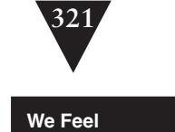

# Chapter 24: We Feel Overwhelmed. It Isn't Going to Get Any Better

Working in legacy code is difficult. There is no denying it. Although every situation is different, one thing is going to make the job worth it to you as a programmer or not: figuring out what is in it for you. For some people, it is a paycheck, and there isn't anything wrong with that—we all have to make a living. But there really ought to be some other reason why you are programming.

If you were lucky, you started out in this business writing code because you thought it was fun. You sat down with your first computer ecstatic with all of the possibilities, all of the cool things you could do by programming a computer. It was something to learn and something to master, and you thought, "Wow, this is fun. I can make a great career if I get very good at this."

Not everyone comes to programming this way, but even for people who didn't, it is still possible to connect with what is fun about programming. If you can—and some of your coworkers can, too—it really doesn't matter what kind of system you are working on. You can do neat things with it. The alternative is just dejection. It isn't any fun, and frankly, we all deserve better than that.

Often people who spend time working on legacy systems wish they could work on green-field systems. It's fun to build systems from scratch, but frankly, green-field systems have their own set of problems. Over and over again, I've seen the following scenario play out: An existing system becomes murky and hard to change over time. People in the organization get frustrated with how long it takes to make changes in it. They move their best people (and sometimes their trouble-makers!) onto a new team that is charged with the task of "creating the replacement system with a better architecture." In the beginning, everything is fine. They know what the problems were with the old architecture, and they spend some time coming up with a new design. In the meantime, the rest of

**We Feel Overwhelmed** the developers are working on the old system. The system is in service, so they receive requests for bug fixes and occasionally new features. The business looks soberly at each new feature and decides whether it needs to be in the old system or whether the client can wait for the new system. In many cases, the client can't wait, so the change goes in both. The green-field team has to do doubleduty, trying to replace a system that is constantly changing. As the months go by it becomes clearer that they are not going to be able to replace the old system, the system you're maintaining. The pressure increases. They work days, nights, and weekends. In many cases, the rest of the organization discovers that the work that you are doing is critical and that you are tending the investment that everyone will have to rely on in the future.

The grass isn't really much greener in green-field development.

The key to thriving in legacy code is finding what motivates you. Although many of us programmers are solitary creatures, there really isn't much that can replace working in a good environment with people you respect who know how to have fun at work. I've made some of my best friends at work and, to this day, they are the people I talk to when I've learned something new or fun while programming.

Another thing that helps is to connect with the larger community. These days, getting in touch with other programmers to learn and share more about the craft is easier than it ever was. You can subscribe to mailing lists on the Internet, attend conferences, and take advantage of all the resources that you can use to network, share strategies and techniques, and generally stay on top of software development.

Even when you have a bunch of people on a project who care about the work and care about making things better, another form of dejection can set in. Sometimes people are dejected because their code base is so large that they and their team mates could work on it for 10 years but still not have made it more than 10 percent better. Isn't that a good reason to be dejected? Well, I've visited teams with millions of lines of legacy code who looked at each day as a challenge and as a chance to make things better and have fun. I've also seen teams with far better code bases who are dejected. The attitude we bring to the work is important.

TDD some code outside of work. Program for fun a little bit. Start to feel the difference between the little projects you make and the big project at work. Chances are, your project at work can have the same feel if you can get the pieces you work with to run into a fast test harness.

If morale is low on your team, and it's low because of code quality, here's something that you can try: Pick the ugliest most obnoxious set of classes in the

**Overwhelmed**

project, and get them under test. When you've tackled the worst problem as a team, you'll feel in control of your situation. I've seen it again and again. As you start to take control of your code base, you'll start to develop oases of good code. Work can really be enjoyable in them.

