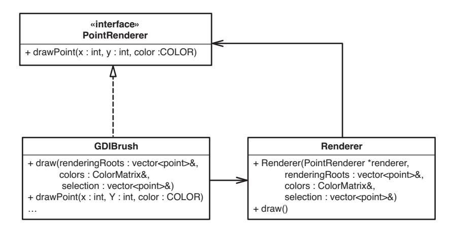
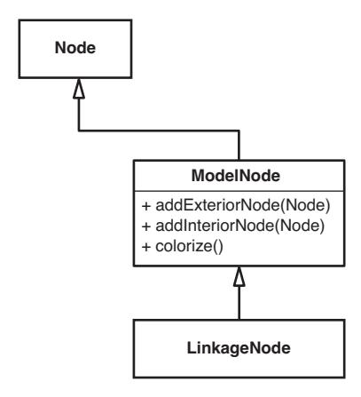
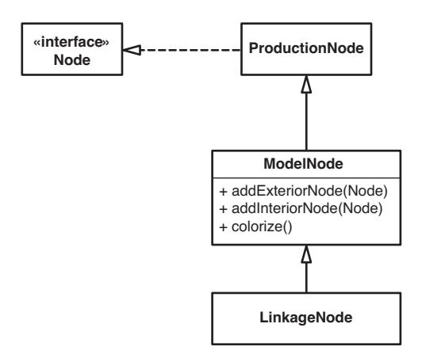
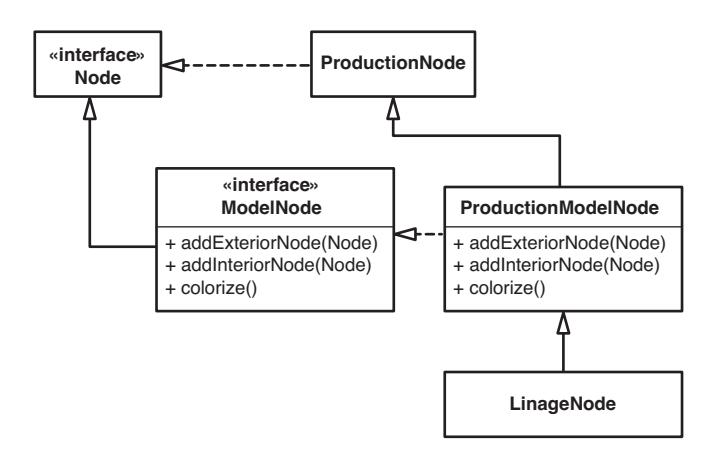
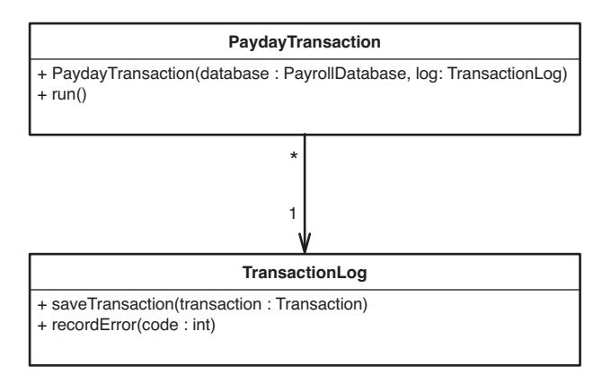

<span id="page-347-1"></span>
<span id="page-347-0"></span>
# Chapter 25: Dependency-Breaking Techniques


**Dependency-Breaking Techniques**

In this chapter, I've written up a set of dependency-breaking techniques. This list is not exhaustive; these are just some techniques that I've used with teams to decouple classes well enough to get them under test. Technically, these techniques are refactorings—each of them preserves behavior. But unlike most refactorings written up in the industry so far, these refactorings are intended to be done without tests, to get tests in place. In most cases, if you follow the steps carefully, the chance of mistakes is small. This doesn't mean that they are completely safe. It is still possible to make mistakes when you perform them, so you should exercise care when you use them. Before you use these refactorings, see Chapter 23, *How Do I Know That I'm Not Breaking Anything?* The tips in that chapter can help you use these techniques safely so that you can get tests in place. When you do, you'll be able to make more invasive changes with more confidence that you aren't breaking anything.

These techniques do not immediately make your design better. In fact, if you have good design sense, some of these techniques will make you flinch. These techniques can help you get methods, classes, and clusters of classes under test, and your system will be more maintainable because of it. At that point, you can use test-supported refactorings to make the design cleaner.

A few of the refactorings in this chapter were described by Martin Fowler in his book *Refactoring: Improving the Design of Existing Code* (Addison-Wesley, 1999)*.* I've included them here with different steps. They've been tailored so that they can be used safely without tests.

<span id="page-348-1"></span><span id="page-348-0"></span>

**Adapt Parameter**

### Adapt Parameter

When I make changes to methods, I often run into dependency headaches caused by method parameters. Sometimes I find it hard to create the parameter I need; at other times, I need to test the effect of the method on the parameter. In many cases, the class of the parameter doesn't make it easy. If the class is one that I can modify, I can use *Extract Interface (362)* to break the dependency. *Extract Interface* is often the best choice when it comes to breaking parameter dependencies.

In general, we want to do something simple to break dependencies that prevent testing, something that doesn't have possibilities for errors. However, in some cases, *Extract Interface (362)* doesn't work very well. If the parameter's type is pretty low level, or specific to some implementation technology, extracting an interface could be counterproductive or impossible.

Use *Adapt Parameter* when you can't use *Extract Interface (362)* on a parameter's class or when a parameter is difficult to fake.

```
Here is an example:
```

```
public class ARMDispatcher
{
 public void populate(HttpServletRequest request) {
 String [] values 
 = request.getParameterValues(pageStateName);
 if (values != null && values.length > 0) 
 marketBindings.put(pageStateName + getDateStamp(),
 values[0]); 
      }
      ...
 }
 ...
}
```

In this class, the populate method accepts an HttpServletRequest as a parameter. HttpServletRequest is an interface that is part of Sun's J2EE standard for Java. If we were going to test populate the way it looks now, we'd have to create a class that implements HttpServletRequest and provide some way to fill it with the parameter values it needs to return under test. The current Java SDK documentation shows that there are about 23 method declarations on HttpServletRequest, and that doesn't count the declarations from its superinterface that we'd have to implement. It would be great to use *Extract Interface (362)* to make a narrower interface that supplies only the methods we need, but we can't extract an interface from another interface. In Java, we would <span id="page-349-0"></span>need to have HttpServletRequest extend the one we are extracting, and we can't modify a standard interface that way. Fortunately, we do have other options.

Several mock object libraries are available for J2EE. If we download one of them, we can use a mock for HttpServletRequest and do the testing we need to do. This can be a real time saver; if we go this route, we won't have to spend time making a fake servlet request by hand. So, it looks like we have a solution—or do we?

When I'm breaking dependencies, I always try to look ahead and see what the result will look like. Then I can decide whether I can live with the aftermath. In this case, our production code will look pretty much the same, and we will have done a lot of work to keep HttpServletRequest, an API interface, in place. Is there a way to make the code look better and make the dependency breaking easier? Actually, there is. We can wrap the parameter that is coming in and break our dependency on the API interface entirely. When we've done that, the code will look like this:

```
public class ARMDispatcher
 public void populate(ParameterSource source) {
 String values = source.getParameterForName(pageStateName);
 if (value != null) {
 marketBindings.put(pageStateName + getDateStamp(),
 value); 
 }
 ...
 }
```

What have we done here? We've introduced a new interface named ParameterSource. At this point, the only method that it has is one named getParameterForName. Unlike the HttpServletRequest getParmeterValue method, the getParameterForName returns only one String. We wrote the method that way because we care about only the first parameter in this context.

Move toward interfaces that communicate responsibilities rather than implementation details. This makes code easier to read and easier to maintain.

Here is a fake class that implements ParameterSource. We can use it in our test:

```
class FakeParameterSource implements ParameterSource
 public String value;
 public String getParameterForName(String name) {
 return value;
 }
```

**Adapt Parameter**


**Adapt Parameter**

And the production parameter source looks like this:

```
class ServletParameterSource implements ParameterSource
{
 private HttpServletRequest request;
 public ServletParameterSource(HttpServletRequest request) {
 this.request = request;
 }
 String getParameterValue(String name) {
 String [] values = request.getParameterValues(name);
 if (values == null || values.length < 1)
 return null;
 return values[0]; 
 }
}
```

Superficially, this might look like we're making things pretty for pretty's sake, but one pervasive problem in legacy code bases is that there often aren't any layers of abstraction; the most important code in the system often sits intermingled with low-level API calls. We've already seen how this can make testing difficult, but the problems go beyond testing. Code is harder to understand when it is littered with wide interfaces containing dozens of unused methods. When you create narrow abstractions targeted toward what you need, your code communicates better and you are left with a better seam.

If we move toward using ParameterSource in the example, we end up decoupling the population logic from particular sources. We won't be tied to specific J2EE interfaces any longer.

*Adapt Parameter* is one case in which we don't *Preserve Signatures (312).* Use extra care.

*Adapt Parameter* can be risky if the simplified interface that you are creating for the parameter class is too different from the parameter's current interface. If we are not careful when we make those changes, we could end up introducing subtle bugs. As always, remember that the goal is to break dependencies well enough to get tests in place. Your bias should be toward making changes that you feel more confident in rather than changes that give you the best structure. Those can come after your tests. For instance, in this case we may want to alter ParameterSource so that clients of it don't have to check for null when they call its methods (see *Null Object Pattern (112)* for details).

Safety first. Once you have tests in place, you can make invasive changes much more confidently.

<span id="page-351-0"></span>
#### Steps

To use *Adapt Parameter*, perform the following steps:

- 1. Create the new interface that you will use in the method. Make it as simple and communicative as possible, but try not to create an interface that will require more than trivial changes in the method.
- 2. Create a production implementer for the new interface.
- 3. Create a fake implementer for the interface.
- 4. Write a simple test case, passing the fake to the method.
- 5. Make the changes you need to in the method to use the new parameter.
- 6. Run your test to verify that you are able to test the method using the fake.

**Adapt Parameter**

<span id="page-352-1"></span><span id="page-352-0"></span>

## Break Out Method Object

Long methods are very tough to work with in many applications. Often if you can instantiate the class that contains them and get them into a test harness, you can start to write tests. In some cases, the work that it takes to make a class separately instantiable is large. It may even be overkill for the changes you need to make. If the method that you need to work with is small and doesn't use instance data, use *Expose Static Method (345)* to get your changes under test. On the other hand, if your method is large or does use instance data and methods, consider using *Break Out Method Object*. In a nutshell, the idea behind this refactoring is to move a long method to a new class. Objects that you create using that new class are called method objects because they embody the code of a single method. After you've used *Break Out Method Object*, you can often write tests for the new class easier than you could for the old method. Local variables in the old method can become instance variables in the new class. Often that makes it easier to break dependencies and move the code to a better state.

Here is an example in C++ (large chunks of the class and method have been removed to preserve trees):

```
class GDIBrush
{
public:
 void draw(vector<point>& renderingRoots,
 ColorMatrix& colors,
 vector<point>& selection);
 ...
private:
 void drawPoint(int x, int y, COLOR color);
 ...
};
void GDIBrush::draw(vector<point>& renderingRoots,
 ColorMatrix& colors, 
 vector<point>& selection) 
{
 for(vector<points>::iterator it = renderingRoots.begin();
 it != renderingRoots.end(); 
 ++it) {
 point p = *it;
 ...
 drawPoint(p.x, p.y, colors[n]);
 }
 ...
}
```

<span id="page-353-0"></span>The GDIBrush class has a long method named draw. We can't easily write tests for it, and it is going to be very difficult to create an instance of GDIBrush in a test harness. Let's use *Break Out Method Object* to move draw to a new class.

The first step is to create a new class that will do the drawing work. We can call it Renderer. After we've created it, we give it a public constructor. The arguments of the constructor should be a reference to the original class, and the arguments to the original method. We need to *Preserve Signatures (312)* on the latter.

```
class Renderer
public:
 Renderer(GBIBrush *brush,
 vector<point>& renderingRoots,
 ColorMatrix &colors,
 vector<point>& selection);
 ...
};
```

After we've created the constructor, we add instance variables for each of the constructor arguments and initialize them. We do this as a set of cut/copy/paste moves, too, to *Preserve Signatures (312)*.

```
class Renderer
private:
 GDIBrush *brush;
 vector<point>& renderingRoots;
 ColorMatrix& colors;
 vector<point>& selection;
public:
 Renderer(GDIBrush *brush,
 vector<point>& renderingRoots,
 ColorMatrix& colors,
 vector<point>& selection)
 : brush(brush), renderingRoots(renderingRoots),
 colors(colors), selection(selection)
 {}
};
```

You might be looking at this and saying, "Hmmm, it looks like we are going to be in the same position. We are accepting a reference to a GDIBrush, and we can't instantiate one of those in our test harness. What good does this do us?" Wait, we are going to end up in a different place.

**Break Out Method Object**

<span id="page-354-0"></span>

After we've made the constructor, we can add another method to the class, a method that will do the work that was done in the draw() method. We can call it draw() also.

```
class Renderer
{
private:
 GDIBrush *brush;
 vector<point>& renderingRoots;
 ColorMatrix& colors;
 vector<point>& selection;
public:
 Renderer(GDIBrush *brush,
 vector<point>& renderingRoots,
 ColorMatrix& colors,
 vector<point>& selection)
 : brush(brush), renderingRoots(renderingRoots),
 colors(colors), selection(selection)
 {}
 void draw();
};
```

Now we add the body of the draw() method to Renderer. We copy the body of the old draw() method into the new one and *Lean on the Compiler (315)*.

```
void Renderer::draw()
{
 for(vector<points>::iterator it = renderingRoots.begin();
 it != renderingRoots.end(); 
 ++it) {
 point p = *it;
 ...
 drawPoint(p.x, p.y, colors[n]);
 }
 ...
}
```

If the draw() on Renderer has any references to instance variables or methods from GDIBrush, our compile will fail. To make it succeed, we can make getters for the variables and make the methods that it depends on public. In this case, there is only one dependency, a private method named drawPoint. After we make it public on GDIBrush, we can access it from a reference to the Renderer class and the code compiles.

Now we can make GDIBrush's draw method delegate to the new Renderer.

```
void GDIBrush::draw(vector<point>& renderingRoots,
 ColorMatrix &colors,
 vector<point>& selection) 
 Renderer renderer(this, renderingRoots, 
 colors, selection);
 renderer.draw();
```

Now back to the GDIBrush dependency. If we can't instantiate GDIBrush in a test harness, we can use *Extract Interface* to break the dependency on GDIBrush completely. The section on *Extract Interface (362)* has the details, but briefly, we create an empty interface class and make the GDIBrush implement it. In this case, we can call it PointRenderer because drawPoint is the method on GDIBrush that we really need access to in the Renderer. Then we change the reference that the Renderer holds from GDIBrush to PointRenderer, compile, and let the compiler tell us what methods have to be on the interface. Here is what the code looks like at the end:

```
class PointRenderer
 public:
 virtual void drawPoint(int x, int y, COLOR color) = 0;
};
class GDIBrush : public PointRenderer
public:
 void drawPoint(int x, int y, COLOR color);
 ...
};
class Renderer
private:
 PointRender *pointRenderer;
 vector<point>& renderingRoots;
 ColorMatrix& colors;
 vector<point>& selection;
public:
 Renderer(PointRenderer *renderer,
 vector<point>& renderingRoots,
 ColorMatrix& colors,
 vector<point>& selection)
 : pointRenderer(pointRenderer),
 renderingRoots(renderingRoots),
```

<span id="page-356-0"></span>

```
 colors(colors), selection(selection)
 {}
 void draw();
};
void Renderer::draw() 
{
 for(vector<points>::iterator it = renderingRoots.begin();
 it != renderingRoots.end();
 ++it) {
 point p = *it;
 ...
 pointRenderer->drawPoint(p.x,p.y,colors[n]);
 }
 ...
}
```

Figure 25.1 shows what it looks like in UML.



**Figure 25.1** GDIBrush *after Break Out Method Object.*

Our ending point is a little odd. We have a class (GDIBrush) that implements a new interface (PointRenderer), and the only use of that interface is by an object (a Renderer) that is created by the class. You might have a sick feeling in the pit of your stomach because we've made details that were private in the original class public so that we could use this technique. Now the drawPoint method that was private in GDIBrush is exposed to the world. The important thing to notice is that this isn't really the end.

Over time, you'll grow disgusted with the fact that you can't instantiate the original class in a test harness, and you will break dependencies so that you can. Then you'll look at other options. For instance, does PointRenderer need to be an interface? Can it be a class that holds a GDIBrush? If it can, maybe you can start to move to a design based on this new concept of Renderers.

That is only one of the simple refactorings we may be able to do when we get the class under test. The resulting structure might invite many more.

**Break Out Method Object**

*Break Out Method Object* has several variations. In the simplest case, the original method doesn't use any instance variables or methods from the original class. We don't need to pass it a reference to the original class.

In other cases, the method only uses data from the original class. At times, it makes sense to put this data into a new data-holding class and pass it as an argument to the method object.

The case that I show in this section is the worst case; we need to use methods on the original class, so we use *Extract Interface (362)* and start to build up some abstraction between the method object and the original class.

### Steps

You can use these steps to do *Break out Method Object* safely without tests:

- 1. Create a class that will house the method code.
- 2. Create a constructor for the class and *Preserve Signatures (312)* to give it an exact copy of the arguments used by the method. If the method uses an instance data or methods from the original class, add a reference to the original class as the first argument to the constructor.
- 3. For each argument in the constructor, declare an instance variable and give it exactly the same type as the variable. *Preserve Signatures (312)* by copying all the arguments directly into the class and formatting them as instance variable declarations. Assign all of the arguments to the instance variables in the constructor.
- 4. Create an empty execution method on the new class. Often this method is called run(). We used the name draw in the example.
- 5. Copy the body of the old method into the execution method and compile to *Lean on the Compiler (315)*.
- 6. The error messages from the compiler should indicate where the method is still using methods or variables from the old class. In each of these

<span id="page-358-0"></span>

#### **336** DEPENDENCY-BREAKING TECHNIQUES

**Break Out Method Object** cases, do what it takes to get the method to compile. In some cases, this is as simple as changing a call to use the reference to the original class. In other cases, you might have to make methods public on the original class or introduce getters so that you don't have to make instance variables public.

- 7. After the new class compiles, go back to the original method and change it so that it creates an instance of the new class and delegates its work to it.
- 8. If needed, use *Extract Interface (362)* to break the dependency on the original class.

<span id="page-359-1"></span>
<span id="page-359-0"></span>
## Definition Completion

Here is an example:

CArray<ROOTID, ROOTID& > rootids;

private:

};

In some languages, we can declare a type in one place and define it in another. The languages in which this capability is most apparent are C and C++. In both of them, we can declare a function or method in one place and define it someplace else, usually in an implementation file. When we have this capability, we can use it to break dependencies.

**Definition Completion**

```
class CLateBindingDispatchDriver : public CDispatchDriver
public:
 CLateBindingDispatchDriver ();
 virtual ~CLateBindingDispatchDriver ();
 ROOTID GetROOTID (int id) const;
 void BindName (int id,
                      OLECHAR FAR *name);
 ...
```

This is the declaration of a little class in a C++ application. Users create CLate-BindingDispatchDrivers and then use the BindName method to associate names with IDs. We want to provide a different way of binding names when we use this class in a test. In C++, we can do this using *Definition Completion*. The BindName method was declared in the class header file. How can we give it a different definition under test? We include the header containing this class declaration in the test file and provide alternate definitions for the methods before our tests.

```
#include "LateBindingDispatchDriver.h"
CLateBindingDispatchDriver::CLateBindingDispatchDriver() {}
CLateBindingDispatchDriver::~CLateBindingDispatchDriver() {}
ROOTID GetROOTID (int id) const { return ROOTID(-1); }
void BindName(int id, OLECHAR FAR *name) {}
TEST(AddOrder,BOMTreeCtrl)
```


<span id="page-360-0"></span>

}

**Definition Completion**

```
 CLateBindingDispatchDriver driver;
 CBOMTreeCtrl ctrl(&driver);
 ctrl.AddOrder(COrderFactory::makeDefault());
 LONGS_EQUAL(1, ctrl.OrderCount());
```

When we define these methods directly in the test file, we are providing the definitions that will be used in the test. We can provide null bodies for methods that we don't care about or put in sensing methods that can be used across all of our tests.

When we use *Definition Completion* in C or C++, we are pretty much obligated to create a separate executable for the tests that use the completed definitions. If we don't, they will clash with the real definitions at link time. One other downside is that we now have two different sets of definitions for the methods of a class, one in a test source file and another in a production source file. This can be a big maintenance burden. It can also confuse debuggers if we don't set up the environment correctly. For these reasons, I don't recommend using *Definition Completion* except in the worst dependency situations. Even then, I recommend doing it just to break initial dependencies. Afterwards, you should bring the class under test quickly so that the duplicate definitions can be removed.

### Steps

To use *Definition Completion* in C++, follow these steps:

- 1. Identify a class with definitions you'd like to replace.
- 2. Verify that the method definitions are in a source file, not a header.
- 3. Include the header in the test source file of the class you are testing.
- 4. Verify that the source files for the class are not part of the build.
- 5. Build to find missing methods.
- 6. Add method definitions to the test source file until you have a complete build.

<span id="page-361-1"></span>
<span id="page-361-0"></span>
## Encapsulate Global References

When you are trying to test code that has problematic dependencies on globals, you essentially have three choices. You can try to make the globals act differently under test, you can link to different globals, or you can encapsulate the globals so that you can decouple things further. The last option is called *Encapsulate Global References*. Here is an example in C++:

**Encapsulate Global References**

```
bool AGG230_activeframe[AGG230_SIZE];
bool AGG230_suspendedframe[AGG230_SIZE];
void AGGController::suspend_frame() 
 frame_copy(AGG230_suspendedframe, 
 AGG230_activeframe);
 clear(AGG230_activeframe);
 flush_frame_buffers();
void AGGController::flush_frame_buffers() 
 for (int n = 0; n < AGG230_SIZE; ++n) {
 AGG230_activeframe[n] = false;
 AGG230_suspendedframe[n] = false;
 }
```

In this example, we have some code that does work with a few global arrays. The suspend\_frame method needs to access the active and suspended frames. At first glance, it looks like we can make the frames members of the AGGController class, but some other classes (not shown) use the frames. What can we do?

One immediate thought is that we can pass them as parameters to the suspend\_frame method using *Parameterize Method (383)*, but after we do that, we'll have to pass them as parameters to any methods that suspend\_frame calls that use them as globals. In this case, flush\_frame\_buffer is an offender.

The next option is to pass both frames as constructor arguments to AGGController. We could do that, but it is worth taking a look at other places where they are used. If it seems that whenever we use one we are also using the other, we could bundle them together.

If several globals are always used or are modified near each other, they belong in the same class.

The best way to handle this situation is to look at the data, the active and suspended frames, and think about whether we can come up with a good name


### **340** DEPENDENCY-BREAKING TECHNIQUES

**Encapsulate Global References**

for a new "smart" class that would hold both of them. Sometimes this is a little tricky. We have to think about what that data means in the design and then consider why it is there. If we create a new class, eventually we'll move methods onto it, and, chances are, the code for those methods already exists someplace else where the data is used.

When naming a class, think about the methods that will eventually reside on it. The name should be good, but it doesn't have to be perfect. Remember that you can always rename the class later.

In the previous example, I'd expect that, over time, the frame\_copy and clear methods might move to the new class that we are going to create. Is there work that is common to the suspended frame and the active frame? It looks like there is, in this case. The suspend\_frame function on AGGController could probably move to a new class as long as it contains both the suspended\_frame array and the active\_frame array. What could we call this new class? We could just call it Frame and say that each frame has an active buffer and a suspended buffer. This requires us to change our concepts and rename variables a bit, but what we will get in exchange is a smarter class that hides more detail.

The class name that you find might already be in use. If so, consider whether you can rename whatever is using that name.

Here's how we do it, step by step. First, we create a class that looks like this:

```
class Frame
{
public:
 // declare AGG230_SIZE as a constant
 enum { AGG230_SIZE = 256 };
 bool AGG230_activeframe[AGG230_SIZE];
 bool AGG230_suspendedframe[AGG230_SIZE];
};
```

We've left the names of the data the same intentionally, just to make the next step easier. Next, we declare a global instance of the Frame class:

Frame frameForAGG230;

Next, we comment out the original declarations of the data and attempt to build:

```
 // bool AGG230_activeframe[AGG230_SIZE];
 // bool AGG230_suspendedframe[AGG230_SIZE];
```

<span id="page-363-0"></span>At this point, we get all sorts of compile errors telling us that AGG\_activeframe and AGG230\_suspendedframe don't exist, threatening us with terrible consequences. If the build system is sufficiently petulant, it rounds things off with an attempt at linking, leaving us with about 10 pages of unresolved link errors. We could get upset, but we expected all of that to happen, didn't we?

To get past all of those errors, we can stop at each one and place frameForAGG230. in front of each reference that is causing trouble.

```
void AGGController::suspend_frame() 
 frame_copy(frameForAGG230.AGG230_suspendedframe, 
 frameForAGG230.AGG230_activeframe);
 clear(frameForAGG20.AGG230_activeframe);
 flush_frame_buffer();
```

When we are done doing that, we have uglier code, but it will all compile and work correctly, so it is a behavior-preserving transformation. Now that we've finished it, we can pass a Frame object through the constructor of the AGGController class and get the separation we need to move forward.

Referencing a member of a class rather than a simple global is only the first step. Afterward, consider whether you should use *Introduce Static Setter (372)*, or parameterize the code using *Parameterize Constructor (379)* or *Parameterize Method (383)*.

So, we've introduced a new class by adding global variables to a new class and making them public. Why did we do it this way? After all, we spent some time thinking about what to call the new class and what sorts of methods to place on it. We could have started by creating a fake Frame object that we could delegate to in AGG\_Controller, and we could have moved all of the logic that uses those variables onto a real Frame class. We could have done that, but it is a lot to attempt all at once. Worse, when we don't have tests in place and we are trying to do the minimal work we need to get tests in place, it is best to leave logic alone as much as possible. We should avoid moving it and try to get separation by putting in seams that allow us to call one method instead of another or access one piece of data rather than another. Later, when we have more tests in place, we can move behavior from one class to another with impunity.

When we've passed the frame into the AGGController, we can do a little renaming to make things a little clearer. Here is our ending state for this refactoring:

```
class Frame
public:
 enum { BUFFER_SIZE = 256 };
 bool activebuffer[BUFFER_SIZE];
```

**Encapsulate Global References**

<span id="page-364-0"></span>
#### **342** DEPENDENCY-BREAKING TECHNIQUES

```
Encapsulate 
Global 
References
```

```
 bool suspendedbuffer[BUFFER_SIZE];
};
Frame frameForAGG230;
void AGGController::suspend_frame() 
{
 frame_copy(frame.suspendedbuffer, 
 frame.activebuffer);
 clear(frame.activeframe);
 flush_frame_buffer();
}
```

It might not seem like much of an improvement, but it is an extremely valuable first step. After we've moved the data to a class, we have separation and are poised to make the code much better over time. We might even want to have a FrameBuffer class at some point.

When you use *Encapsulate Global References*, start with data or small methods. More substantial methods can be moved to the new class when more tests are in place.

In the previous example, I showed how to do Encapsulate Global References with global data. You can do the same thing with non-member functions in C++ programs. Often when you are working with some C API, you have calls to global functions scattered throughout an area of code that you want to work with. The only seam that you have is the linkage of calls to their respective functions. You can use *Link Substitution (377)* to get separation, but you can end up with better structured code if you use *Encapsulate Global References* to build another seam. Here is an example.

In a piece of code that we want to put under test, there are calls to two functions: GetOption(const string optionName) and setOption(string name, Option option). They are just free functions, functions not attached to any class, but they are used prolifically in code like this:

```
void ColumnModel::update() 
{
 alignRows();
 Option resizeWidth = ::GetOption("ResizeWidth");
 if (resizeWidth.isTrue()) {
 resize();
 } else {
 resizeToDefault();
 }
}
```

In a case such as this, we could look at some old standbys, techniques such as *Parameterize Method (383)* and *Extract and Override Getter(352)*, but if the calls are across multiple methods and multiple classes, it would be cleaner to use *Encapsulate Global References*. To do this, create a new class like this:

```
class OptionSource
public:
 virtual ~OptionSource() = 0;
 virtual Option GetOption(const string& optionName) = 0;
 virtual void SetOption(const string& optionName,
 const Option& newOption) = 0;
};
```

**Encapsulate Global References**

The class contains abstract methods for each of the free functions that we need. Next, subclass to make a fake for the class. In this case, we could have a map or a vector in the fake that allows us to hold on to a set of options that will be used during tests. We could provide an add method to the fake or just a constructor that accepts a map—whatever is convenient for the tests. When we have the fake, we can create the real option source:

```
class ProductionOptionSource : public OptionSource
public:
 Option GetOption(const string& optionName);
 void SetOption(const string& optionName, 
 const Option& newOption) ;
};
Option ProductionOptionSource::GetOption(
 const string& optionName) 
 ::GetOption(optionName);
void ProductionOptionSource::SetOption(
 const string& optionName, 
 const Option& newOption)
 ::SetOption(optionName, newOption);
```

To encapsulate references to free functions, make an interface class with fake and production subclasses. Each of the functions in the production code should do nothing more than delegate to a global function.

This refactoring turned out well. When we introduced the seam and ended up doing a simple delegation to the API function. Now that we've done that, we can parameterize the class to accept an OptionSource object so that we can use a fake one under test and the real one in production.

<span id="page-366-0"></span>

#### **344** DEPENDENCY-BREAKING TECHNIQUES

**Encapsulate Global References**

In the previous example, we put the functions in a class and made them virtual. Could we have done it some other way? Yes, we could have made free functions that delegate to other free functions or added them to a new class as static functions, but neither of those approaches would have given us good seams. We would have had to use the *link seam (36)* or the *preprocessing seam (33)* to substitute one implementation for another. When we use the class and virtual function approach and parameterize the class, the seams that we have are explicit and easy to manage.

#### Steps

To *Encapsulate Global References*, follow these steps:

- 1. Identify the globals that you want to encapsulate.
- 2. Create a class that you want to reference them from.
- 3. Copy the globals into the class. If some of them are variables, handle their initialization in the class.
- 4. Comment out the original declarations of the globals.
- 5. Declare a global instance of the new class.
- 6. *Lean on the Compiler (315)* to find all the unresolved references to the old globals.
- 7. Precede each unresolved reference with the name of the global instance of the new class.
- 8. In places where you want to use fakes, use *Introduce Static Setter (372)*, *Parameterize Constructor (379)*, *Parameterize Method (383)* or *Replace Global Reference with Getter (399)*.

<span id="page-367-1"></span>
<span id="page-367-0"></span>
## Expose Static Method

Working with classes that can't be instantiated in a test harness is pretty tricky. Here is a technique that I use in some cases. If you have a method that doesn't use instance data or methods, you can turn it into a static method. When it is static, you can get it under test without having to instantiate the class. Here's an example in Java.

We have a class with a validate method, and we need to add a new validation condition. Unfortunately, the class it is on would be very hard to instantiate. I'll spare you the trauma of looking at the whole class, but here is the method we need to change:

```
class RSCWorkflow
 ...
 public void validate(Packet packet) 
 throws InvalidFlowException {
 if (packet.getOriginator().equals( "MIA") 
 || packet.getLength() > MAX_LENGTH 
 || !packet.hasValidCheckSum()) {
 throw new InvalidFlowException();
 }
 ...
 }
 ...
```

What can we do to get this method under test? When we look closely at it, we see that the method uses a lot of methods on the Packet class. In fact, it would really make sense to move validate onto the Packet class, but moving the method isn't the least risky thing we can do right now; we definitely won't be able to *Preserve Signatures (312)*. If you don't have automated support to move methods, often it is better to get some tests in place first. *Expose Static Method* can help you do that. With tests in place, you can make the change you need to make and have much more confidence moving the method afterward.

When you are breaking dependencies without tests, *Preserve Signatures (312)* of methods whenever possible. If you cut/copy and paste whole method signatures, you have less of a chance of introducing errors.

The code here doesn't depend on any instance variables or methods. What would it look like if the validate method was public static? Anyone anyplace in the code could write this statement and validate a packet:

RSCWorkflow.validate(packet);

**Expose Static Method**


<span id="page-368-0"></span>

**Expose Static Method**

Chances are, whoever created the class never would've imagined that someone would make that method static someday, much less public. So, is it a bad thing to do? No, not really. Encapsulation is a great thing for classes, but the static area of a class isn't really part of the class. In fact, in some languages, it is part of another class, sometimes known as the metaclass of the class.

When a method is static, you know that it doesn't access any of the private data of the class; it is just a utility method. If you make the method public, you can write tests for it. Those tests will support you if you choose to move the method to another class later.

Static methods and data really do act as if they are part of a different class. Static data lives for the life of a program, not the life of an instance, and statics are accessible without an instance.

The static portions of a class can be seen as a "staging area" for things that don't quite belong to the class. If you see a method that doesn't use any instance data, it is a good idea to make it static to make it noticeable until you figure out what class it really belongs on.

Here is the RSCWorkflow class after we've extracted a static method for validate.

```
public class RSCWorkflow {
 public void validate(Packet packet) 
 throws InvalidFlowException {
 validatePacket(packet);
 }
 public static void validatePacket(Packet packet)
 throws InvalidFlowException {
 if (packet.getOriginator() == "MIA" 
 || packet.getLength() <= MAX_LENGTH 
 || packet.hasValidCheckSum()) {
 throw new InvalidFlowException();
 }
 ...
 }
 ...
}
```

In some languages there is a simpler way of doing *Expose Static Method*. Instead of extracting a static method from your original method you can just make the original method static. If the method is being used by other classes, it can still be accessed off an instance of its class. Here is an example:

```
 RSCWorkflow workflow = new RCSWorkflow();
 ...
 // static call that looks like a non-static call
 workflow.validatePacket(packet);
```

<span id="page-369-0"></span>However, in some languages, you get a compilation warning for doing this. It's best to try to get code into a state in which there are no compile warnings.

If you are concerned that someone might start to use the static in a way that would cause dependency problems later, you can expose the static method using some non-public access mode. In languages such as Java and C#, which have package or internal visibility, you can restrict access to the static or make it protected and access it through a *testing subclass*. In C++, you have the same options: You can make the static method protected or use a namespace.

**Expose Static Method**

### Steps

To *Expose Static Method*, follow these steps:

- 1. Write a test that accesses the method that you want to expose as a public static method of the class.
- 2. Extract the body of the method to a static method. Remember to *Preserve Signatures (312)*. You'll have to use a different name for the method. Often you can use the names of parameters to help you come up with a new method name. For example, if a method named validate accepts a Packet, you can extract its body as a static method named validatePacket.
- 3. Compile.
- 4. If there are errors related to accessing instance data or methods, take a look at those features and see if they can be made static also. If they can, make them static so that the system will compile.

<span id="page-370-1"></span><span id="page-370-0"></span>

**Extract and Override Call**

## Extract and Override Call

At times, the dependencies that get in the way during testing are rather localized. We might have a single method call that we need to replace. If we can break the dependency on a method call, we can prevent odd side effects in our testing or sense values that are passed to the call.

Let's look at an example:

```
public class PageLayout
{
 private int id = 0;
 private List styles;
 private StyleTemplate template;
 ...
 protected void rebindStyles() {
 styles = StyleMaster.formStyles(template, id);
 ...
 }
 ...
}
```

PageLayout makes a call to a static function named formStyles on a class named StyleMaster. It assigns the return value to an instance variable: styles. What can we do if we want to sense through formStyles or separate our dependency on StyleMaster? One option is to extract the call to a new method and override it in a *testing subclass*. This is known as *Extract and Override Call*.

Here is the code after the extraction:

```
public class PageLayout
{
 private int id = 0;
 private List styles;
 private StyleTemplate template;
 ...
 protected void rebindStyles() {
 styles = formStyles(template, id);
 ...
 }
 protected List formStyles(StyleTemplate template, 
 int id) {
 return StyleMaster.formStyles(template, id);
 }
 ...
}
```

<span id="page-371-0"></span>Now that we have our own local formStyles method, we can override it to break the dependency. We don't need styles for the things that we are testing right now, so we can just return an empty list.

```
public class TestingPageLayout extends PageLayout {
    protected List formStyles(StyleTemplate template, 
 int id) {
 return new ArrayList();
 }
 ...
```

As we develop tests that need various styles, we can alter this method so that we can configure what will be returned.

*Extract and Override Call* is a very useful refactoring; I use it very often. It is an ideal way to break dependencies on global variables and static methods. In general, I tend to use it unless there are many different calls against the same global. If there are, I often use *Replace Global Reference with Getter (399)* instead.

If you have an automated refactoring tool, *Extract and Override Call* is trivial. You can do it using the *Extract Method (415)* refactoring. However, if you don't, use the following steps. They allow you to extract any call safely, even if you don't have tests in place.

### Steps

To *Extract and Override Call*, follow these steps:

- 1. Identify the call that you want to extract. Find the declaration of its method. Copy its method signature so that you can *Preserve Signatures (312)*.
- 2. Create a new method on the current class. Give it the signature you've copied.
- 3. Copy the call to the new method and replace the call with a call to the new method.

**Extract and Override Call** Let's look at an example:

 ... } ... }

<span id="page-372-1"></span><span id="page-372-0"></span>

**Extract and Override Factory Method**

## Extract and Override Factory Method

Object creation in constructors can be vexing when you want to get a class under test. Sometimes the work that is happening in those objects shouldn't happen in a test harness. At other times, you just want to get a sensing object in place, but you can't because that object's creation is hard-coded in a constructor.

Hard-coded initialization work in constructors can be very hard to work around in testing.

```
public class WorkflowEngine
{
 public WorkflowEngine () {
 Reader reader 
 = new ModelReader(
 AppConfig.getDryConfiguration());
 Persister persister 
 = new XMLStore(
 AppConfiguration.getDryConfiguration());
```

this.tm = new TransactionManager(reader, persister);

WorkflowEngine creates a TransactionManager in its constructor. If the creation was someplace else, we could introduce some separation more easily. One of the options we have is to use *Extract and Override Factory Method*.

*Extract and Override Factory Method* is pretty powerful, but it does have some language-specific issues. For instance, you can't do it in C++. C++ does not allow virtual function calls to resolve to functions in derived classes. Java and many other languages do allow this. In C++, *Supersede Instance Variable* and *Extract and Override Getter (352)* are good alternatives. See the example in *Supersede Instance Variable (404)* for a discussion of this problem.

```
public class WorkflowEngine
{
 public WorkflowEngine () {
 this.tm = makeTransactionManager();
 ...
 }
```

```
 protected TransactionManager makeTransactionManager() {
 Reader reader 
 = new ModelReader(
 AppConfiguration.getDryConfiguration());
 Persister persister 
 = new XMLStore(
 AppConfiguration.getDryConfiguration());
 return new TransactionManager(reader, persister);
 }
 ...
```

**Extract and Override Factory Method**

When we have that factory method, we can subclass and override it so that we can return a new transaction manager whenever we need one:

```
public class TestWorkflowEngine extends WorkflowEngine
 protected TransactionManager makeTransactionManager() {
 return new FakeTransactionManager();
 }
```

### Steps

To *Extract and Override Factory Method*, follow these steps:

- 1. Identify an object creation in a constructor.
- 2. Extract all of the work involved in the creation into a factory method.
- 3. Create a *testing subclass* and override the factory method in it to avoid dependencies on problematic types under test.

<span id="page-374-1"></span><span id="page-374-0"></span>

**Extract and Override Getter**

### Extract and Override Getter

*Extract and Override Factory Method (350)* is a powerful way of separating dependencies on types, but it doesn't work in all cases. The big "hole" in its applicability is C++. In C++, you can't call a virtual function in a derived class from a base class's constructor. Fortunately, there is a workaround for the case in which you are only creating the object in a constructor, not doing any additional work with it.

The gist of this refactoring is to introduce a getter for the instance variable that you want to replace with a fake object. You then refactor to use the getter every place in the class. You can then subclass and override the getter to provide alternate objects under test.

In this example, we create a transaction manager in a constructor. We want to set things up so that the class can use this transaction manager in production and a sensing one under test.

Here is what we start with:

```
// WorkflowEngine.h
class WorkflowEngine
{
private:
 TransactionManager *tm;
public:
 WorkflowEngine ();
 ...
}
// WorkflowEngine.cpp
WorkflowEngine::WorkflowEngine()
{ 
 Reader *reader 
 = new ModelReader(
 AppConfig.getDryConfiguration());
 Persister *persister
 = new XMLStore(
 AppConfiguration.getDryConfiguration());
 tm = new TransactionManager(reader, persister);
 ...
}
   And here is what we end up with:
// WorkflowEngine.h
class WorkflowEngine
```

```
private:
 TransactionManager *tm;
protected:
 TransactionManager *getTransaction() const;
public:
 WorkflowEngine ();
 ...
// WorkflowEngine.cpp
WorkflowEngine::WorkflowEngine()
:tm (0)
{ 
 ...
TransactionManager *getTransactionManager() const 
 if (tm == 0) {
 Reader *reader 
 = new ModelReader(
 AppConfig.getDryConfiguration());
 Persister *persister 
 = new XMLStore(
 AppConfiguration.getDryConfiguration());
 tm = new TransactionManager(reader,persister);
 }
 return tm;
...
```

**Extract and Override Getter**


<span id="page-376-0"></span>

**Extract and Override Getter**

The first thing we do is introduce a *lazy getter*, a function which creates the transaction manager on first call. Then we replace all uses of the variable with calls to the getter.

A *lazy getter* is a method that looks like a normal getter to all of its callers. The key difference is that lazy getters create the object they are supposed to return the first time they are called. To do this, they usually contain logic that looks like this. Notice how the instance variable thing is being initialized

```
Thing getThing() {
 if (thing == null) {
 thing = new Thing();
 }
 return thing;
}
Lazy getters are also used in the Singleton Design Pattern (xx).
```

When we have that getter, we can subclass and override to plug in another object:

```
class TestWorkflowEngine : public WorkflowEngine
{
public:
 TransactionManager *getTransactionManager() 
 { return &transactionManager; }
 FakeTransactionManager transactionManager;
};
```

When you use *Extract and Override Getter*, you have to be very conscious of object lifetime issues, particularly in a non-garbage-collected language such as C++. Make sure that you delete the testing instance in a way that is consistent with how the code deletes the production instance.

In a test, we can easily access the fake transaction manager if we need to:

```
TEST(transactionCount, WorkflowEngine)
{
 auto_ptr<TestWorkflowEngine> engine(new TestWorkflowEngine);
 engine.run();
 LONGS_EQUAL(0,
 engine.transactionManager.getTransactionCount());
}
```

One downside of *Extract and Override Getter* is that there is a chance that someone will use the variable before it is initialized. For this reason, it's good to make sure that all of the code in the class is using the getter.

<span id="page-377-0"></span>*Extract and Override Getter* is not a technique that I use very often. When there is just a single method on an object that is problematic, it is far easier to use *Extract and Override Call (348)*. But, *Extract and Override Getter* is a better choice when there are many problematic methods on the same object. If you can get rid of all of those problems by extracting a getter and overriding it, it is a clear win.

**Extract and Override Getter**

#### Steps

To *Extract and Override Getter*, follow these steps:

- 1. Identify the object you need a getter for.
- 2. Extract all of the logic needed to create the object into a getter.
- 3. Replace all uses of the object with calls to the getter, and initialize the reference that holds the object to null in all constructors.
- 4. Add the first-time logic to the getter so that the object is constructed and assigned to the reference whenever the reference is null.
- 5. Subclass the class and override the getter to provide an alternative object for testing.

<span id="page-378-1"></span><span id="page-378-0"></span>

**Extract Implementer**

## Extract Implementer

*Extract Interface (362)* is a handy technique, but one part of it is hard: naming. I often run into cases where I want to extract an interface but the name I want to use is already the name of the class. If I am working in an IDE that has support for renaming classes and *Extract Interface*, this is easy to take care of. When I don't, I have a few choices:

- I can make up a foolish name.
- I can look at the methods I need and see if they are a subset of the public methods on the class. If they are, they might suggest another name for the new interface.

One thing that I usually stop short of is putting an "I" prefix on the name of the class to make a name for the new interface, unless it is already the convention in the code base. There is nothing worse than working in an unfamiliar area of code in which half the type names start with *I* and half don't. Half of the time that you type the name of a type, you'll be wrong. You'll either have missed the needed *I* or not.

Naming is a key part of design. If you choose good names, you reinforce understanding in a system and make it easier to work with. If you choose poor names, you undermine understanding and make life hellish for the programmers who follow you.

When the name of a class is perfect for the name of an interface and I don't have automated refactoring tools, I use *Extract Implementer* to get the separation I need. To extract an implementer of a class, we turn the class into an interface by subclassing it and pushing all of its concrete methods down into that subclass. Here is an example in C++:

```
// ModelNode.h
class ModelNode
{
private:
 list<ModelNode *> m_interiorNodes;
 list<ModelNode *> m_exteriorNodes;
 double m_weight;
 void createSpanningLinks();
public:
 void addExteriorNode(ModelNode *newNode);
 void addInternalNode(ModelNode *newNode);
 void colorize();
 ...
};
```

<span id="page-379-0"></span>The first step is to copy the declaration of the ModelNode class completely over into another header file and change the name of the copy to ProductionModelNode. Here is a portion of the declaration for the copied class:

```
// ProductionModelNode.h
class ProductionModeNode
private:
 list<ModelNode *> m_interiorNodes;
 list<ModelNode *> m_exteriorNodes;
 double m_weight;
 void createSpanningLinks();
public:
 void addExteriorNode(ModelNode *newNode);
 void addInternalNode(ModelNode *newNode);
 void colorize();
 ...
};
```

The next step is to go back to the ModelNode header and strip out all nonpublic variable declarations and method declarations. Next, we make all of the remaining public methods pure virtual (abstract):

```
// ModelNode.h
class ModelNode
public:
virtual void addExteriorNode(ModelNode *newNode) = 0;
virtual void addInternalNode(ModelNode *newNode) = 0;
virtual void colorize() = 0;
 ...
};
```

At this point, ModelNode is a pure interface. It contains only abstract methods. We are working in C++, so we should also declare a pure virtual destructor and define it an implementation file:

```
// ModelNode.h
class ModelNode
public:
 virtual ~ModelNode () = 0;
 virtual void addExteriorNode(ModelNode *newNode) = 0;
 virtual void addInternalNode(ModelNode *newNode) = 0;
 virtual void colorize() = 0;
 ...
};
// ModelNode.cpp
ModelNode::~ModelNode()
```

**Extract Implementer**


<span id="page-380-0"></span>

{}

**Extract Implementer**

Now we go back to the ProductionModelNode class and make it inherit the new interface class:

```
#include "ModelNode.h"
class ProductionModelNode : public ModelNode
{
private:
 list<ModelNode *> m_interiorNodes;
 list<ModelNode *> m_exteriorNodes;
 double m_weight;
 void createSpanningLinks();
public:
 void addExteriorNode(ModelNode *newNode);
 void addInternalNode(ModelNode *newNode);
 void colorize();
 ...
};
```

At this point, ProductionModelNode should compile cleanly. If you build the rest of the system, you'll find the places where the people attempt to instantiate ModelNodes. You can change them so that ProductionModelNodes are created instead. In this refactoring, we're replacing the creation of objects of one concrete class with objects of another, so we aren't really making our overall dependency situation better. However, it's good to take a look at those areas of object creation and try to figure out whether a factory can be used to reduce dependencies further.

### Steps

To *Extract Implementer*, follow these steps:

- 1. Make a copy of the source class's declaration. Give it a different name. It's useful to have a naming convention for classes you've extracted. I often use the prefix Production to indicate that the new class is the production code implementer of an interface.
- 2. Turn the source class into an interface by deleting all non-public methods and all variables.
- 3. Make all of the remaining public methods abstract. If you are working in C++, make sure that none of the methods that you make abstract are overridden by non-virtual methods*.*

- 4. Examine all imports or file inclusions in the interface file, and see if they are necessary. Often you can remove many of them. You can *Lean on the Compiler (315)* to detect these. Just delete each in turn, and recompile to see if it is needed.
- 5. Make your production class implement the new interface.
- 6. Compile the production class to make sure that all method signatures in the interface are implemented.
- 7. Compile the rest of the system to find all of the places where instances of the source class were created. Replace these with creations of the new production class.
- 8. Recompile and test.

#### A More Complex Example

*Extract Implementer* is relatively simple when the source class doesn't have any parent or child classes in its inheritance hierarchy. When it does, we have to be a little cleverer. Figure 25.2 shows ModelNode again, but in Java with a superclass and a subclass:



**Figure 25.2** ModelNode *with superclass and subclass.*

In this design, Node, ModelNode, and LinkageNode are all concrete classes. ModelNode uses protected methods from Node. It also supplies methods that are used by its subclass, LinkageNode. *Extract Implementer* requires a concrete class **Extract Implementer**


**Extract Implementer** that can be converted into an interface. Afterward, you have an interface and a concrete class.

Here's what we can do in this situation. We can perform *Extract Implementer* on the Node class, placing the ProductionNode class below Node in the inheritance hierarchy. We also change the inheritance relationship so that ModelNode inherits ProductionNode rather than Node. Figure 25.3 shows what the design looks like afterward.

Next, we do *Extract Implementer* on ModelNode. Because ModelNode already has a subclass, we introduce a ProductionModelNode into the hierarchy between ModelNode and LinkageNode. When we've done that, we can make the ModelNode interface extend Node as shown in Figure 25.4.



**Figure 25.3** *After Extract Implementer on* Node.

<span id="page-383-0"></span>

**Extract Implementer**

**Figure 25.4** *Extract Implementer on* ModelNode*.*

When you have a class embedded in a hierarchy like this, you really have to consider whether you are better off using *Extract Interface (362)* and picking different names for your interfaces. It is a far more direct refactoring.

<span id="page-384-1"></span><span id="page-384-0"></span>

**Extract Interface**

## Extract Interface

In many languages, *Extract Interface* is a one of the safest dependency-breaking techniques. If you get a step wrong, the compiler tells you immediately, so there is very little chance of introducing a bug. The gist of it is that you create an interface for a class with declarations for all of the methods that you want to use in some context. When you've done that, you can implement the interface to sense or separate, passing a fake object into the class you want to test.

There are three ways of doing *Extract Interface* and a couple of little "gotchas" to pay attention to. The first way is to use automated refactoring support if you are lucky enough to have it in your environment. Tools that support this usually provide some way of selecting methods on a class and typing in the name of the new interface. Really good ones ask you if you want to have them search through the code and find places where it can change references to use the new interface. A tool like that can save you a lot of work.

If you don't have automated support for interface extraction, you can use the second way of extracting a method: You can extract it incrementally using the steps I outline in this section.

The third way of extracting an interface is to cut/copy and paste several methods from a class at once and place their declarations in an interface. It isn't as safe as the first two methods, but it still is pretty safe, and often it is the only practical way of extracting an interface when you don't have automated support and your builds take a very long time.

Let's extract an interface using the second method. Along the way, we discuss some of the things to watch out for.

We need to extract an interface to bring a PaydayTransaction class under test. Figure 25.5 shows PaydayTransaction and one of its dependencies, a class named TransactionLog.



**Figure 25.5** PaydayTransaction *depending on* TransactionLog.

```
We have our test case:
void testPayday()
 Transaction t = new PaydayTransaction(getTestingDatabase());
 t.run();
 assertEquals(getSampleCheck(12),
 getTestingDatabase().findCheck(12));
```

But we have to pass in some sort of a TransactionLog to make it compile. Let's create a call to a class that doesn't exist yet, FakeTransactionLog.

```
void testPayday()
 FakeTransactionLog aLog = new FakeTransactionLog();
 Transaction t = new PaydayTransaction(
 getTestingDatabase(), 
 aLog);
 t.run();
 assertEquals(getSampleCheck(12),
 getTestingDatabase().findCheck(12));
```

To make this code compile, we have to extract an interface for the TransactionLog class, make a class named FakeTransactionLog implement the interface, and then make it possible for PaydayTransaction to accept a FakeTransactionLog.

**Extract Interface**


<span id="page-386-0"></span>

**Extract Interface**

First things first: We extract the interface. We create a new empty class called TransactionRecorder. If you are wondering where that name came from, take a look at the following note.

### Interface Naming

Interfaces are relatively new as programming constructs. Java and many .NET languages have them. In C++, you have to mimic them by creating a class that contains nothing but pure virtual functions.

When interfaces were first introduced in languages, some people started naming interfaces by placing an *I* before the name of the class they were gleaned from. For instance, if you had an Account class and you wanted an interface, you could give it the name IAccount. The advantage to this sort of naming is that you don't really have to think about the name when you do the extraction. Naming is as simple as adding a prefix. The disadvantage is that you end up with a lot of code that has to know whether it is dealing with an interface. Ideally, it shouldn't care one way or another. You also end up with a code base in which some names have *I* prefixes and some don't. Removing the *I* if you want to go back to a regular class ends up being a pervasive change. If you don't make the change, the name stays in the code as a subtle lie.

When you are developing new classes, the easiest thing to do is create simple class names, even for big abstractions. For instance, if we are writing an accounting package, we can start with a class that is just called Account. Then we can start to write tests to add new functionality. At some point, you might want Account to be an interface. If you do, you can create a subclass underneath it, push down all of the data and methods, and make Account an interface. When you do that, you don't have to go through your code renaming the type of every reference to Account.

In cases such as the PaydayTransaction example, in which we already have a nice name for an interface (TransactionLog), we can do the same thing. The downside is that pushing down data and methods to a new subclass takes a lot of steps. But when the risk is small enough, I use it sometimes. This technique is called *Extract Implementer (356)*.

If I don't have many tests and I want to extract an interface to get more in place, I often try to come up with a new name for the interface. Sometimes it takes a little while to think of one. If you don't have tools that will rename classes for you, it pays to try to solidify the name that you want to use before the number of places that use it grows too large.

```
interface TransactionRecorder
{
}
```

Now we move back and make TransactionLog implement the new interface.

```
public class TransactionLog implements TransactionRecorder
{
 ...
}
```

<span id="page-387-0"></span>Next we create FakeTransactionLog as an empty class, too.

```
public class FakeTransactionLog implements TransactionRecorder
{
```

Everything should compile fine because all we've done is introduce a few new classes and change a class so that it implements an empty interface.

At this point, we launch into the refactoring full force. We change the type of each reference in the places where we want to use the interface. PaydayTransaction uses a TransactionLog; we need to change it so that it uses a TransactionRecorder. When we've done that, when we compile, we find a bunch of cases in which methods are being called from a TransactionRecorder, and we can get rid of the errors one by one by adding method declarations to the TransactionRecorder interface and empty method definitions to the FakeTransactionLog.

Here's an example:

```
public class PaydayTransaction extends Transaction
 public PaydayTransaction(PayrollDatabase db, 
                       TransactionRecorder log) {
 super(db, log);
 }
 public void run() {
 for(Iterator it = db.getEmployees(); it.hasNext(); ) {
 Employee e = (Employee)it.next();
 if (e.isPayday(date)) {
 e.pay();
 }
 }
 log.saveTransaction(this); 
 }
 ...
```

In this case, the only method that we are calling on TransactionRecorder is saveTransaction. Because TransactionRecorder doesn't have a saveTransaction method yet, we get a compile error. We can make our test compile just by adding that method to TransactionRecorder and FakeTransactionLog.

```
interface TransactionRecorder
 void saveTransaction(Transaction transaction);
public class FakeTransactionLog implements TransactionRecorder
```

**Extract Interface**

<span id="page-388-0"></span>

#### **366** DEPENDENCY-BREAKING TECHNIQUES

```
 void saveTransaction(Transaction transaction) {
 }
}
```

**Extract Interface**

And we are done. We no longer have to create a real TransactionLog in our tests.

You might look at this and say, "Well, it isn't really done; we haven't added the recordError method to the interface and the fake." True, the recordError method is there on TransactionLog. If we needed to extract the whole interface, we could have introduced it on the interface also, but the fact is, we didn't need it for the test. Although it's nice to have an interface that covers all of the public methods of a class, if we march down that road, we could end up doing much more work than we need to bring a piece of the application under test. If you have your sights on a design in which certain key abstractions have interfaces that completely cover a set of public methods on their classes, remember that you can get there incrementally. At times, it is better to hold off until you can get more test coverage before making a pervasive change.

When you extract an interface, you don't have to extract all of the public methods on the class you are extracting from. *Lean on the Compiler (315)* to find the ones that are being used.

The only difficult part comes when you are dealing with non-virtual methods. In Java, these could be static methods. Languages such as C# and C++ also allow non-virtual instance methods. For more details about dealing with these, see the accompanying sidebar.

#### Steps

To *Extract Interface*, follow these steps:

- 1. Create a new interface with the name you'd like to use. Don't add any methods to it yet.
- 2. Make the class that you are extracting from implement the interface. This can't break anything because the interface doesn't have any methods. But it is good to compile and run your test just to verify that.
- 3. Change the place where you want to use the object so that it uses the interface rather than the original class.
- 4. Compile the system and introduce a new method declaration on the interface for each method use that the compiler reports as an error.

<span id="page-389-0"></span>
#### Extract Interface and Non-Virtual Functions

If you have a call like this in your code: bondRegistry.newFixedYield(client) in many languages, it is hard to tell by looking at it whether the method is a static method or a virtual or non-virtual instance method. In languages that allow non-virtual instance methods, you can get into some trouble if you extract an interface and add the signature of one of the classes non-virtual methods to it. In general, if your class has no subclasses, you can make the method virtual and then extract the interface. Everything will be fine. But if your class has subclasses, pulling the method signature up into an interface can break the code. Here is an example in C++. We have a class with a non-virtual method:

```
class BondRegistry
public:
 Bond *newFixedYield(Client *client) { ... }
};
And we have a subclass that has a method with the same name and signature:
class PremiumRegistry : public BondRegistry
public:
 Bond *newFixedYield(Client *client) { ... }
};
If we extract an interface from BondRegistry:
class BondProvider 
public:
 virtual Bond *newFixedYield(Client *client) = 0;
};
and have BondRegistry implement it:
class BondRegistry : public BondProvider { … };
```

**Extract Interface**

<span id="page-390-0"></span>

#### **368** DEPENDENCY-BREAKING TECHNIQUES

**Extract Interface**

we could break code that looks like this by passing in a PremiumRegistry: void disperse(BondRegistry \*registry) { ... Bond \*bond = registry->newFixedYield(existingClient); ... }

Before we extracted the interface, BondRegistry's newFixedYield method was called because the compile-time type of the registry variable is BondRegistry. If we make new-FixedYield virtual in the process of extracting the interface, we change the behavior. The method on PremiumBondRegistry is called. In C++, when we make a method virtual in a base class, methods that override it in subclasses become virtual. Note that we don't have this problem in Java or C#. In Java, all instance methods are virtual. In C#, things are a little safer because adding an interface does not affect existing calls to non-virtual methods.

In general, creating a method in a derived class with the same signature as a nonvirtual method in the base isn't good practice in C++ because it can lead to misunderstandings. If you want to have access to a non-virtual function through an interface and it isn't on a class with no subclasses, the best thing to do is add a new virtual method with a new name. That method can delegate to a non-virtual or even a static method. You just have to make sure that the method does the right thing for all of the subclasses below the one that you are extracting from.

<span id="page-391-1"></span><span id="page-391-0"></span>**[Introduce Instance Delegator](002-contents.md#page-10-0)**

People use static methods on classes for many reasons. One of the most common reasons is to implement the *Singleton Design Pattern (372)*. Another common reason to use static methods is to create utility classes.

Utility classes are pretty easy to find in many designs. They are classes that don't have any instance variables or instance methods. Instead, they consist of a set of static methods and constants.

People create utility classes for many reasons. Most of the time, they are created when it is hard to find a common abstraction for a set of methods. The Math class in the Java JDK is an example of this. It has static methods for trigonometric functions (cos, sin, tan) and many others. When languages designers build their languages from objects "all the way down," they make sure that numeric primitives know how do these things. For instance, you should be able to call the method sin() on the object 1 or any other numeric object and get the right result. At the time of this writing, Java does not support math methods on primitive types, so the utility class is a fair solution, but it is also a special case. In nearly all cases, you can use plain old classes with instance data and methods to do your work.

If you have static methods in your project, chances are good that you won't run into any trouble with them unless they contain something that is difficult to depend on in a test. (The technical term for this is *static cling)*. In these cases, you might wish that you could use an *object seam (40)* to substitute in some other behavior when the static methods are called. What do you do in this case?

One thing that can do is start to introduce delegating instance methods on the class. When you do this, you have to find a way to replace the static calls with method calls on an object. Here is an example:

```
public class BankingServices
 public static void updateAccountBalance(int userID, 
 Money amount) {
 ...
 }
 ...
```

Here we've got a class that contains nothing but static methods. I've shown only one here, but you get the idea. We can add an instance method to the class like this and have it delegate to the static method:

```
public class BankingServices
```

**Introduce Instance Delegator**


<span id="page-392-0"></span>

**Introduce Instance Delegator**

```
 public static void updateAccountBalance(int userID, 
 Money amount) {
 ...
 }
 public void updateBalance(int userID, Money amount) {
 updateAccountBalance(userID, amount);
 }
 ...
}
```

In this case, we've added an instance method named updateBalance and made it delegate to the static method updateAccountBalance.

Now in the calling code, we can replace references like this:

```
public class SomeClass
{
 public void someMethod() { 
 ...
 BankingServices.updateAccountBalance(id, sum);
 }
}
   with this:
public class SomeClass
{
 public void someMethod(BankingServices services) {
 ...
 services.updateBalance(id,sum);
 }
 ...
}
```

Notice that we can pull this off only if we can find some way to externally create the BankingServices object that we are using. It is an additional refactoring step, but in statically typed languages, we can *Lean on the Compiler (315)* to get the object in place.

This technique is straightforward enough with many static methods, but when you start to do it with utility classes, you might start to feel uncomfortable. A class with 5 or 10 static methods and only one or two instance methods does look weird. It looks even weirder when they are just simple methods delegating to static methods. But when you use this technique, you can get an object seam in place easily and substitute different behaviors under test. Over time, you might get to the point that every call to the utility class comes through the delegating methods. At that time, you can move the bodies of the static methods into the instance methods and delete the static methods.

<span id="page-393-0"></span>
#### Steps

To *Introduce Instance Delegator*, follow these steps:

- 1. Identify a static method that is problematic to use in a test.
- 2. Create an instance method for the method on the class. Remember to *Preserve Signatures (312)*. Make the instance method delegate to the static method.
- 3. Find places where the static methods are used in the class you have under test. Use *Parameterize Method (383)* or another dependency-breaking technique to supply an instance to the location where the static method call was made.

**Introduce Instance Delegator**

<span id="page-394-1"></span><span id="page-394-0"></span>

**Introduce Static Setter**

## Introduce Static Setter

Maybe I am a purist, but I don't like global mutable data. When I visit teams, it is usually the most apparent hurdle to getting portions of their system into test harnesses. You want to pull out a set of classes into a test harness, but you discover that some of them need to be set up in particular states to be used at all. When you have your harness set up, you have to run down the list of globals to make sure that each one has the state you need for the condition you want to test. Quantum physicists didn't discover "spooky action at a distance"; in software, we've had it for years.

All griping about globals aside, many systems have them. In some systems, they are very direct and un-self-conscious; someone just declared a variable someplace. In others, they are dressed up as singletons with strict adherence to the *Singleton Design Pattern*. In any case, getting a fake in place for sensing is very straightforward. If the variable is an unabashed global, sitting outside a class or plainly out in the open as a public static variable, you can just replace the object. If the reference is const or final, you might have to remove that protection. Leave a comment in the code saying that you are doing it for test and that people shouldn't take advantage of the access in production code.

### The Singleton Design Pattern

The *Singleton Design Pattern* is a pattern that many people use to make sure that there can only be one instance of a particular class in a program. There are three properties that most singletons share:

- 1. The constructors of a singleton class are usually made private.
- 2. A static member of the class holds the only instance of the class that will ever be created in the program.
- 3. A static method is used to provide access to the instance. Usually this method is named instance.

Although singletons do prevent people from making more than one instance of a class in production code, they also prevent people from making more than one instance of a class in a test harness.

Replacing singletons is just a little more work. Add a static setter to the singleton to replace the instance, and then make the constructor protected. You can then subclass the singleton, create a fresh object, and pass it to the setter.

You might be left a little queasy by the idea that you are removing access protection when you use static setter, but remember that the purpose of access


<span id="page-395-0"></span>protection is to prevent errors. We are putting in tests to prevent errors also. It just turns out that, in this case, we need the stronger tool.

Here is an example of *Introduce Static Setter* in C++:

```
void MessageRouter::route(Message *message) {
 ...
 Dispatcher *dispatcher 
 = ExternalRouter::instance()->getDispatcher();
 if (dispatcher != NULL)
 dispatcher->sendMessage(message);
```

In the MessageRouter class, we use singletons in a couple of places to get dispatchers. The ExternalRouter class is one of those singletons. It uses a static method named instance to provide access to the one and only instance of ExternalRouter. The ExternalRouter class has a getter for a dispatcher. We can replace the dispatcher with another one by replacing the external router that serves it.

This is what the ExternalRouter class looks like before we introduce the static setter:

```
class ExternalRouter
private:
 static ExternalRouter *_instance;
public:
 static ExternalRouter *instance();
 ...
};
ExternalRouter *ExternalRouter::_instance = 0;
ExternalRouter *ExternalRouter::instance() 
 if (_instance == 0) {
 _instance = new ExternalRouter;
 }
 return _instance;
```

Notice that the router is created on the first call to the instance method. To substitute in another router, we have to change what instance returns. The first step is to introduce a new method to replace the instance.

```
void ExternalRouter::setTestingInstance(ExternalRouter *newInstance) 
 delete _instance;
 _instance = newInstance;
```

**Introduce Static Setter**


**Introduce Static Setter**

Of course, this assumes that we are able to create a new instance. When people use the singleton pattern, they often make the constructor of the class private to prevent people from creating more than one instance. If you make the constructor protected, you can subclass the singleton to sense or separate and pass the new instance to the setTestingInstance method. In the previous example, we'd make a subclass of ExternalRouter named TestingExternalRouter and override the getDispatcher method so that it returns the dispatcher we want, a fake dispatcher.

```
class TestingExternalRouter : public ExternalRouter
{
public:
 virtual void Dispatcher *getDispatcher() const {
 return new FakeDispatcher;
 }
};
```

This might look like a rather roundabout way of substituting in a new dispatcher. We end up creating a new ExternalRouter just to substitute dispatchers. We can take some shortcuts, but they have different tradeoffs. Another thing that we can do is add a boolean flag to ExternalRouter and let it return a different dispatcher when the flag is set. In C++ or C#, we can use conditional compilation to select dispatchers also. These techniques can work well, but they are invasive and can get unwieldy if you use them throughout an application. In general, I like to keep separation between production and test code.

Using a setter method and a protected constructor on a singleton is mildly invasive, but it does help you get tests in place. Could people misuse the public constructor and make more than one singleton in the production system? Yes, but in my opinion, if it is important to have only one instance of an object in a system, the best way to handle it is to make sure everyone on the team understands that constraint.

One alternative to decreasing constructor protection and subclassing is to use *Extract Interface (362)* on the singleton class and supply a setter that accepts an object with that interface. The downside of this is that you have to change the type of the reference you use to hold the singleton in the class and the type of the return value of the instance method. These changes can be quite involved, and they don't really move us to a better state. The ultimate "better state" is to reduce global references to the singleton to the point that it can just become a normal class.

In the previous example, we replaced a singleton using a static setter. The singleton was an object that served up another object, a dispatcher. Occasionally, we see a different kind of global in systems, a global factory. Rather than holding on to an instance, they serve up fresh objects every time you call one of <span id="page-397-0"></span>their static methods. Substituting in another object to return is kind of tricky, but often you can do it by having the factory delegate to another factory. Let's take a look at an example in Java:

```
public class RouterFactory
 static Router makeRouter() {
 return new EWNRouter();
 }
```

RouterFactory is a straightforward global factory. As it stands, it doesn't allow us to replace the routers it serves under test, but we can alter it so that it can.

```
interface RouterServer
 Router makeRouter();
public class RouterFactory implements RouterServer
 static Router makeRouter() {
 return server.makeRouter();
 }
 static setServer(RouterServer server) {
 this.server = server;
 }
 static RouterServer server = new RouterServer() {
 public RouterServer makeRouter() {
 return new EWNRouter();
 }
 }; 
  In a test, we can do this:
protected void setUp() {
 RouterServer.setServer(new RouterServer() {
 public RouterServer makeRouter() {
 return new FakeRouter();
 }
 });
```

But it is important to remember that in any of these static setter patterns, you are modifying state that is available to all tests. You can use the tearDown method in xUnit testing frameworks to put things back into some known state before the rest of your tests execute. In general, I do that only when using the wrong state in the next test could be misleading. If I am substituting in a fake MailSender in all of my tests, putting in another doesn't make much sense. On **Introduce Static Setter**


<span id="page-398-0"></span>

**Introduce Static Setter**

the other hand, if I have global that keeps state that affects the results of the system, often I do the same thing in the setUp and tearDown methods to make sure that I've left things in a clean state:

```
protected void setUp() {
 Node.count = 0;
 ...
}
protected void tearDown() {
 Node.count = 0;
}
```

At this point, I'm imagining you with my mind's eye. You are sitting there disgusted at the carnage that I am wreaking on the system just to be able to get some tests in place. And you are right: These patterns can uglify parts of a system considerably. Surgery is never pretty, particularly at the beginning. What can you do to get the system back to a decent state?

One thing to consider is parameter passing. Take a look at the classes that need access to your global and consider whether you can give them a common superclass. If you can, you can pass the global to them upon creation and slowly move away from having globals at all. Often people are scared that every class in the system will require some global. Often you'll be surprised. I once worked on an embedded system that encapsulated memory management and error reporting as classes, passing a memory object or error reporter to whoever needed it. Over time, there was a clean separation between classes that needed those services and classes that didn't. The ones that needed them just had a common superclass. The objects that were passed throughout the system were created at the start of the program, and it was barely noticeable.

### Steps

To *Introduce Static Setter*, follow these steps:

- 1. Decrease the protection of the constructor so that you can make a fake by subclassing the singleton.
- 2. Add a static setter to the singleton class. The setter should accept a reference to the singleton class. Make sure that the setter destroys the singleton instance properly before setting the new object.
- 3. If you need access to private or protected methods in the singleton to set it up properly for testing, consider subclassing it or extracting an interface and making the singleton hold its instance as reference whose type is the type of the interface.

<span id="page-399-1"></span>
<span id="page-399-0"></span>
## Link Substitution

Object orientation gives us wonderful opportunities to substitute one object for another. If two classes implement the same interface or have the same superclass, you can substitute one for another pretty easily. Unfortunately, people working in procedural languages such as C don't have that option. When you have a function like this, there is no way to substitute one function for another at compile time, short of using the preprocessor:

```
Link 
Substitution
```

```
void account_deposit(int amount);
```

Are there other alternatives? Yes, you can *Link Substitution* to replace one function with another. To do this, create a dummy library that has functions with the same signatures as the functions that you want to fake. If you are sensing, you need to set up some mechanism for saving notifications and querying them. You can use files, global variables, or anything that would be convenient under test.

Here is an example:

```
void account_deposit(int amount)
 struct Call *call = 
 (struct Call *)calloc(1, sizeof (struct Call));
 call->type = ACC_DEPOSIT;
 call->arg0 = amount;
 append(g_calls, call);
```

In this case, we are interested in sensing, so we create a global list of calls to record each time that this function (or any other one we are faking) is called. In a test, we could check the list after we exercise a set of objects and see if the mocked functions were called in the appropriate order.

I've never tried to use *Link Substitution* with C++ classes, but I suppose that it is possible. I'm sure that the mangled names that C++ compilers produce would make it rather difficult; however, when making calls to C functions, it is very practical. The most useful case is when faking external libraries. The best libraries to fake are those that are mostly pure data sinks: You call functions in them, but you don't often care about the return values. For example, graphics libraries are particularly useful to fake with *Link Substitution*.

*Link Substitution* can also be used in Java. Create classes with the same names and methods, and change your classpath so that calls resolve to them rather than the classes with bad dependencies.

<span id="page-400-0"></span>

### **378** DEPENDENCY-BREAKING TECHNIQUES

#### Steps

To use *Link Substitution*, follow these steps:

- 1. Identify the functions or classes that you want to fake.
- 2. Produce alternative definitions for them.
- 3. Adjust your build so that the alternative definitions are included rather than the production versions.

**Link Substitution**

From the Library of Brian Watterson

<span id="page-401-1"></span>
<span id="page-401-0"></span>
## Parameterize Constructor

If you are creating an object in a constructor, often the easiest way to replace it is to externalize its creation, create the object outside the class, and make clients pass it into the constructor as a parameter. Here is an example.

We start with this:

```
public class MailChecker
 public MailChecker (int checkPeriodSeconds) {
 this.receiver = new MailReceiver();
 this.checkPeriodSeconds = checkPeriodSeconds;
 }
 ...
  Then we introduce a new parameter like this:
public class MailChecker
 public MailChecker (MailReceiver receiver, 
 int checkPeriodSeconds) {
 this.receiver = receiver;
 this.checkPeriodSeconds = checkPeriodSeconds;
 }
 ...
```

One reason people don't often think of this technique is that they assume that it forces all clients to pass an additional argument. However, you can write a constructor that keeps the original signature around:

```
public class MailChecker
 public MailChecker (int checkPeriodSeconds) {
 this(new MailReceiver(), checkPeriodSeconds);
 }
 public MailChecker (MailReceiver receiver, 
 int checkPeriodSeconds) {
 this.receiver = receiver;
 this.checkPeriodSeconds = checkPeriodSeconds;
 }
 ...
```

If you do, you can supply different objects for testing, and the clients of the class don't have to know the difference.

**Parameterize Constructor**


**Parameterize Constructor**

```
Let's do it step by step. Here is our original code:
public class MailChecker
{
 public MailChecker (int checkPeriodSeconds) {
 this.receiver = new MailReceiver();
 this.checkPeriodSeconds = checkPeriodSeconds;
 }
 ...
}
   We make a copy of the constructor:
public class MailChecker
{
 public MailChecker (int checkPeriodSeconds) {
 this.receiver = new MailReceiver();
 this.checkPeriodSeconds = checkPeriodSeconds;
 }
 public MailChecker (int checkPeriodSeconds) {
 this.receiver = new MailReceiver();
 this.checkPeriodSeconds = checkPeriodSeconds;
 }
 ...
}
   Then we add a parameter to it for the MailReceiver:
public class MailChecker
{
 public MailChecker (int checkPeriodSeconds) {
 this.receiver = new MailReceiver();
 this.checkPeriodSeconds = checkPeriodSeconds;
 }
 public MailChecker (MailReceiver receiver, 
 int checkPeriodSeconds) {
 this.receiver = new MailReceiver();
 this.checkPeriodSeconds = checkPeriodSeconds;
 }
 ...
}
   Next we assign that parameter to the instance variable, getting rid of the new
expression.
public class MailChecker
{
 public MailChecker (int checkPeriodSeconds) {
 this.receiver = new MailReceiver();
 this.checkPeriodSeconds = checkPeriodSeconds;
```

```
Parameterize 
Constructor
```

```
 }
 public MailChecker (MailReceiver receiver, 
 int checkPeriodSeconds) {
 this.receiver = receiver;
 this.checkPeriodSeconds = checkPeriodSeconds;
 }
 ...
```

Now, we go back to the original constructor and remove its body, replacing it with a call to the new constructor. The original constructor uses new to create the parameter it needs to pass.

```
public class MailChecker
 public MailChecker (int checkPeriodSeconds) {
 this(new MailReceiver(), checkPeriodSeconds);
 }
 public MailChecker (MailReceiver receiver, 
 int checkPeriodSeconds) {
 this.receiver = receiver;
 this.checkPeriodSeconds = checkPeriodSeconds;
 }
 ...
```

Are there any downsides to this technique? Actually, yes, there is one. When we add a new parameter to a constructor, we are opening the door to further dependencies on the parameter's class. Users of the class can use the new constructor in production code and increase dependencies across the system. However, in general, that is a rather small concern. *Parameterize Constructor* is a very easy refactoring and it is one that I tend to use a lot.

In languages that allow default arguments, there is a simpler way of doing Parameterize Constructor. We can simply add a default argument to the existing constructor:


<span id="page-404-0"></span>

**Parameterize Constructor**

```
Here is a constructor that has been parameterized this way in C++:
class AssemblyPoint
{
public:
 AssemblyPoint(EquipmentDispatcher *dispatcher 
 = new EquipmentDispatcher);
 ...
};
```

There is only one downside when we do this in C++. The header file containing this class declaration has to include the header for EquipmentDispatcher. If it wasn't for the constructor call, we might have been able to use a forward declaration for Equipment-Dispatcher. For this reason, I don't use default arguments often.

### Steps

To *Parameterize Constructor*, follow these steps:

- 1. Identify the constructor that you want to parameterize and make a copy of it.
- 2. Add a parameter to the constructor for the object whose creation you are going to replace. Remove the object creation and add an assignment from the parameter to the instance variable for the object.
- 3. If you can call a constructor from a constructor in your language, remove the body of the old constructor and replace it with a call to the old constructor. Add a new expression to the call of the new constructor in the old constructor. If you can't call a constructor from another constructor in your language, you may have to extract any duplication among the constructors to a new method.

<span id="page-405-1"></span>
<span id="page-405-0"></span>
## Parameterize Method

You have a method that creates an object internally, and you want to replace the object to sense or separate. Often the easiest way to do this is to pass the object from the outside. Here is an example in C++:

```
Parameterize 
Method
```

```
void TestCase::run() {
 delete m_result;
 m_result = new TestResult;
 try {
 setUp();
 runTest(m_result);
 }
 catch (exception& e) {
 result->addFailure(e, this);
 }
 tearDown();
```

Here we have a method that creates a TestResult object whenever it is called. If we want to sense or separate, we can pass it as a parameter.

```
void TestCase::run(TestResult *result) {
 delete m_result;
 m_result = result;
 try {
 setUp();
 runTest(m_result);
 }
 catch (exception& e) {
 result->addFailure(e, this);
 }
 tearDown();
```

We can use a little forwarding method that keeps the original signature intact:

```
void TestCase::run() {
 run(new TestResult);
```

## **384** DEPENDENCY-BREAKING TECHNIQUES

<span id="page-406-0"></span>

**Parameterize Method**

In C++, Java, C#, and many other languages, you can have two methods with the same name on a class, as long as the signatures are different. In the example, we take advantage of this and use the same name for the new parameterized method and the original method. Although this saves some work, at times it can be confusing. An alternative is to use the type of the parameter in the name of the new method. For instance, in this case, we could keep run() as the name of the original method but call the new method runWithTestResult(TestResult).

As with *Parameterize Constructor (379)*, *Parameterize Method* can allow clients to become dependent on new types that were used in the class before but were not present at the interface. If I think that this will become an issue, I consider *Extract and Override Factory Method (350)* instead.

### Steps

To *Parameterize Method*, follow these steps:

- 1. Identify the method that you want to replace and make a copy of it.
- 2. Add a parameter to the method for the object whose creation you are going to replace. Remove the object creation and add an assignment from the parameter to the variable that holds the object.
- 3. Delete the body of the copied method and make a call to the parameterized method, using the object creation expression for the original object.

<span id="page-407-1"></span>
<span id="page-407-0"></span>
## Primitivize Parameter

In general, the best way to make a change to a class is to create an instance in a test harness, write a test for the change you want to make, and then make the change to satisfy the test. But sometimes the amount of work that you have to do to get a class under test is ridiculously large. One team that I visited inherited a legacy system with domain classes that transitively depended on nearly every other class in the system. As if that wasn't bad enough, they all were tied into a persistence framework as well. Getting one of those classes into a testing framework would have been doable, but the team wouldn't have been able to make progress on features for a while if they spent all of that time fighting with the domain classes. To get some separation, we used this strategy. The example has been changed to protect the innocent.

In a music-composition tool, a track contains several sequences of musical events. We need to find "dead time" in each sequence so that we can fill it with little recurring musical patterns. We need a method named bool Sequence::has-GapFor(Sequence& pattern) const. The method returns a value that indicates whether a pattern can be fit into a sequence.

Ideally, this method would be on a class named Sequence, but Sequence is one of those awful classes that would try to suck the world into our test harness when we tried to create it. To start to write that method, we have to figure out how to write a test for it. The thing that makes it possible for us is that sequences have an internal representation that can be simplified. Every sequence consists of a vector of events. Unfortunately, events have the same problem as sequences: terrible dependencies that lead to build problems. Luckily, to do this calculation, we need only the durations of each event. We can write another method that will do the calculation on ints. When we have it, we can write hasGapFor and let it do its work by delegating to the other method.

Let's start writing the first method. Here is a test for it:

```
TEST(hasGapFor, Sequence)
 vector<unsigned int> baseSequence;
 baseSequence.push_back(1);
 baseSequence.push_back(0);
 baseSequence.push_back(0);
 vector<unsigned int> pattern;
 pattern.push_back(1);
 pattern.push_back(2);
 CHECK(SequenceHasGapFor(baseSequence, pattern));
```

**Primitivize Parameter**


<span id="page-408-0"></span>

**Primitivize Parameter**

The function SequenceHasGapFor is just a free function; it is not part of any class, but it operates on a representation built of primitives—in this case, unsigned integers. If we build up the functionality for SequenceHasGapFor in a testing harness, we can write a rather simple function on Sequence that delegates to the new functionality:

```
bool Sequence::hasGapFor(Sequence& pattern) const
{
 vector<unsigned int> baseRepresentation 
 = getDurationsCopy();
 vector<unsigned int> patternRepresentation 
 = pattern.getDurationsCopy();
 return SequenceHasGapFor(baseRepresentation, 
 patternRepresentation);
}
```

This function needs another function to get an array of the durations, so we write it:

```
vector<unsigned int> Sequence::getDurationsCopy() const
{
 vector<unsigned int> result;
 for (vector<Event>::iterator it = events.begin();
 it != events.end(); ++it) {
 result.push_back(it->duration);
 }
 return result;
}
```

At this point, we've been able to get the feature in, but in a very poor way. Let's make a list of all of the horrible things we've done here:

- 1. Exposed the internal representation of Sequence.
- 2. Made the implementation of Sequence a little tougher to understand by pushing some of it off into a free function.
- 3. Written some untested code (we couldn't really write a test for getDurationsCopy()).
- 4. Duplicated data in the system.
- 5. Prolonged the problem. We haven't started to do the hard work of breaking dependencies between our domain classes and the infrastructure. (That is the one thing that will make a large difference as we move forward, and it is still ahead of us.)

<span id="page-409-0"></span>In spite of all of those downsides, we were able to add a tested feature. I don't like to do this refactoring, but I will use it if my back is against the wall. Often it is a good predecessor to *Sprout Class (63)*. To see this, imagine wrapping SequenceHasGapFor in a class called GapFinder.

*Primitivize Parameter (385)* leaves code in a rather poor state. Overall, it is better to add the new code to the original class or to use *Sprout Class (63)* to build up some new abstractions that can serve as a base for further work. The only time I use *Primitivize Parameter* is when I feel confident that I will take the time to bring the class under test later. At that point, the function can be folded into the class as a real method.

**Primitivize Parameter**

### Steps

To *Primitivize Parameter*, follow these steps:

- 1. Develop a free function that does the work you would need to do on the class. In the process, develop an intermediate representation that you can use to do the work.
- 2. Add a function to the class that builds up the representation and delegates it to the new function.

<span id="page-410-1"></span><span id="page-410-0"></span>

**Pull Up Feature**

### Pull Up Feature

{

Sometimes you have to work with a cluster of methods on a class, and the dependencies that keep you from instantiating the class are unrelated to the cluster. By "unrelated," I mean that the methods you want to work with don't directly or indirectly reference any of the bad dependencies. You could do *Expose Static Method (345)* or *Break Out Method Object (330)* repeatedly, but that wouldn't necessarily be the most direct way to deal with the dependency.

In this situation, you can pull up the cluster of methods, the feature, into an abstract superclass. When you have that abstract superclass, you can subclass it and create instances of the subclass in your tests. Here is an example:

```
public class Scheduler
 private List items;
 public void updateScheduleItem(ScheduleItem item)
 throws SchedulingException {
 try {
 validate(item);
 }
 catch (ConflictException e) {
 throw new SchedulingException(e);
 }
 ...
 }
 private void validate(ScheduleItem item) 
 throws ConflictException {
 // make calls to a database
 ...
 }
 public int getDeadtime() {
 int result = 0;
 for (Iterator it = items.iterator(); it.hasNext(); ) {
 ScheduleItem item = (ScheduleItem)it.next();
 if (item.getType() != ScheduleItem.TRANSIENT 
 && notShared(item)) {
 result += item.getSetupTime() + clockTime();
 }
 if (item.getType() != ScheduleItem.TRANSIENT) {
 result += item.finishingTime();
 }
 else {
 result += getStandardFinish(item);
 }
```

```
 }
 return result;
 }
```

Suppose that we want to make modifications to getDeadTime, but we don't care about updateScheduleItem. It would be nice not to have to deal with the dependency on the database at all. We could try to use *Expose Static Method (345)*, but we are using many non-static features of the Scheduler class. *Break Out Method Object (330)* is another possibility, but this is a rather small method, and those dependencies on other methods and fields of the class will make the work more involved than we want it to be just to get the method under test.

Another option is to pull up the method that we care about into a superclass. When we do that, we can leave the bad dependencies in this class, where they will be out of the way for our tests. Here is what the class looks like afterward:

```
public class Scheduler extends SchedulingServices
 public void updateScheduleItem(ScheduleItem item)
 throws SchedulingException {
 ...
 }
 private void validate(ScheduleItem item) 
 throws ConflictException {
 // make calls to the database
 ...
 }
 ...
```

We've pulled getDeadtime (the feature we want to test) and all of the features it uses into an abstract class.

```
public abstract class SchedulingServices
 protected List items;
 protected boolean notShared(ScheduleItem item) {
 ...
 }
 protected int getClockTime() {
 ...
 }
 protected int getStandardFinish(ScheduleItem item) {
 ...
```

**Pull Up Feature**

<span id="page-412-0"></span>

**Pull Up Feature**

```
 }
 public int getDeadtime() {
 int result = 0;
 for (Iterator it = items.iterator(); it.hasNext(); ) {
 ScheduleItem item = (ScheduleItem)it.next();
 if (item.getType() != ScheduleItem.TRANSIENT
 && notShared(item)) {
 result += item.getSetupTime() + clockTime(); 
 }
 if (item.getType() != ScheduleItem.TRANSIENT) {
 result += item.finishingTime();
 else {
 result += getStandardFinish(item);
         }
      }
 return result;
 }
 ...
}
```

Now we can make a *testing subclass* that allows us to access those methods in a test harness:

```
public class TestingSchedulingServices extends SchedulingServices
{
 public TestingSchedulingServices() {
 }
 public void addItem(ScheduleItem item) {
 items.add(item);
 }
}
import junit.framework.*;
class SchedulingServicesTest extends TestCase
{
 public void testGetDeadTime() {
 TestingSchedulingServices services 
 = new TestingSchedulingServices();
 services.addItem(new ScheduleItem("a", 
 10, 20, ScheduleItem.BASIC));
 assertEquals(2, services.getDeadtime());
 }
 ...
}
```

So, what we've done here is pull methods that we want to test up into an abstract superclass and create a concrete subclass that we can use to test them. spread a set of features across two classes just to make it easier to test. The spread can be confusing if the relationship among the features in each of the classes isn't very strong, and that is the case here. We have Scheduler, which is responsible for updating scheduling items, and SchedulingServices, which is responsible for a variety of things, including getting the default times for items and calculating the dead time. A better factoring would be to have Scheduler delegate to some validator object that knows how to talk to the database, but if that step looks too risky to do immediately or there are other bad dependencies, pulling up features is a good first step. If you *Preserve Signatures (312)* and

*Lean on the Compiler (315),* it is far less risky. We can move toward delegation

<span id="page-413-0"></span>Is this a good thing? From a design point of view, it is less than ideal. We've

**Pull Up Feature**

#### Steps

To do *Pull Up Feature*, follow these steps:

later when more tests are in place.

- 1. Identify the methods that you want to pull up.
- 2. Create an abstract superclass for the class that contains the methods.
- 3. Copy the methods to the superclass and compile.
- 4. Copy each missing reference that the compiler alerts you about to the new superclass. Remember to *Preserve Signatures (312)* as you do this, to reduce the chance of errors.
- 5. When both classes compile successfully, create a subclass for the abstract class and add whatever methods you need to be able to set it up in your tests.

You might be wondering why we make the superclass abstract. I like to make it abstract so that the code is easier to understand. It is great to be able to look at the code in an application and know that every concrete class is being used. If you search the code and find concrete classes that are not being instantiated anyplace, they could appear to be "dead code."

<span id="page-414-1"></span><span id="page-414-0"></span>

**Push Down Dependency**

## Push Down Dependency

Some classes have only a few problematic dependencies. If the dependencies are contained in only a few method calls, you can use *Subclass and Override Method (401)* to get them out of the way when you are writing tests. But if the dependencies are pervasive, *Subclass and Override Method* might not work. You might have to use *Extract Interface (362)* several times to remove dependencies on particular types. *Push Down Dependency* is another option. This technique helps you to separate problematic dependencies from the rest of the class, making it easier to work with in a test harness.

When you use *Push Down Dependency*, you make your current class abstract. Then you create a subclass that will be your new production class, and you push down all the problematic dependencies into that class. At that point you can subclass your original class to make its methods available for testing. Here is an example in C++:

```
class OffMarketTradeValidator : public TradeValidator 
{ 
private:
 Trade& trade;
 bool flag;
 void showMessage() {
 int status = AfxMessageBox(makeMessage(),
 MB_ABORTRETRYIGNORE);
 if (status == IDRETRY) {
 SubmitDialog dlg(this, 
 "Press okay if this is a valid trade");
 dlg.DoModal();
 if (dlg.wasSubmitted()) {
 g_dispatcher.undoLastSubmission();
 flag = true;
 }
 }
 else 
 if (status == IDABORT) {
 flag = false;
 }
 }
public:
 OffMarketTradeValidator(Trade& trade) 
 : trade(trade), flag(false) 
 {}
 bool isValid() const {
```

```
Push Down 
Dependency
```

```
 if (inRange(trade.getDate()) 
 && validDestination(trade.destination)
 && inHours(trade) {
 flag = true;
 }
 showMessage();
 return flag;
 }
 ...
};
```

If we need to make changes in our validation logic, we could be in trouble if we don't want to link UI-specific functions and classes into our test harness. *Push Down Dependency* is a good option in this case.

Here is what the code would look like after *Push Down Dependency:*

```
class OffMarketTradeValidator : public TradeValidator 
{ 
protected:
 Trade& trade;
 bool flag;
 virtual void showMessage() = 0; 
public:
 OffMarketTradeValidator(Trade& trade) 
 : trade(trade), flag(false) {}
 bool isValid() const {
 if (inRange(trade.getDate()) 
 && validDestination(trade.destination)
 && inHours(trade) {
 flag = true;
 }
 showMessage();
 return flag;
 }
 ...
};
class WindowsOffMarketTradeValidator 
 : public OffMarketTradeValidator
protected:
 virtual void showMessage() {
 int status = AfxMessageBox(makeMessage(), 
 MB_ABORTRETRYIGNORE);
 if (status == IDRETRY) {
 SubmitDialog dlg(this, 
 "Press okay if this is a valid trade");
 dlg.DoModal();
```


**Push Down Dependency**

```
 if (dlg.wasSubmitted()) {
 g_dispatcher.undoLastSubmission();
 flag = true;
 }
 }
 else
 if (status == IDABORT) {
 flag = false;
 }
 }
 ...
};
```

When we have the UI-specific work pushed down in a new subclass (WindowsOffMarketValidator), we can create another subclass for testing. All it has to do is null out the showMessage behavior:

```
class TestingOffMarketTradeValidator 
 : public OffMarketTradeValidator
{
protected:
 virtual void showMessage() {}
};
```

Now we have a class that we can test that doesn't have any dependencies on the UI. Is using inheritance in this way ideal? No, but it helps us get part of the logic of a class under test. When we have tests for OffMarketTradeValidator, we can start to clean up the retry logic and pull it up from the WindowsOffMarketTradeValidator. When only the UI calls are left, we can move toward delegating them to a new class. That new class ends up holding the only UI dependencies.

### Steps

To *Push Down Dependency*, follow these steps:

- 1. Attempt to build the class that has dependency problems in your test harness.
- 2. Identify which dependencies create problems in the build.
- 3. Create a new subclass with a name that communicates the specific environment of those dependencies.
- 4. Copy the instance variables and methods that contain the bad dependencies into the new subclass, taking care to preserve signatures. Make methods protected and abstract in your original class, and make your original class abstract.

#### PUSH DOWN DEPENDENCY **395**


- <span id="page-417-0"></span>5. Create a testing subclass and change your test so that you attempt to instantiate it.
- 6. Build your tests to verify that you can instantiate the new class.

**Push Down Dependency**

<span id="page-418-1"></span><span id="page-418-0"></span>

**Replace Function with Function Pointer**

### Replace Function with Function Pointer

When you need to break dependencies in procedural languages, you don't have as many options as you would in object-oriented languages. You can't use *Encapsulate Global References (339)* or *Subclass and Override Method (401).* All of those options are closed. You can use *Link Substitution (377)* or *Definition Completion (337)*, but often they are overkill for smaller bouts of dependency breaking. *Replace Function with Function Pointer* is one alternative in languages that support function pointers. The most well-known language with this support is C.

Different teams have different points of view on function pointers. On some teams, they are seen as horribly unsafe because it is possible to corrupt their contents and end up calling through some random area of memory. On other teams, they are seen as a useful tool, to be used with care. If you lean more toward the "used with care" camp, you can separate dependencies that would be difficult or impossible to otherwise.

First things first. Let's take a look at a function pointer in its natural environment. The following example shows the declaration of a few function pointers in C and a couple of calls through them:

```
struct base_operations
{
 double (*project)(double,double);
 double (*maximize)(double,double);
};
double default_projection(double first, double second) {
 return second;
}
double maximize(double first, double second) {
 return first + second;
}
void init_ops(struct base_operations *operations) {
 operations->project = default_projection;
 operations->maximize = default_maximize;
}
void run_tesselation(struct node *base,
 struct base_operations *operations) {
 double value = operations->project(base.first, base.second);
 ...
}
```

With function pointers, you can do some very simple object-based programming, but how useful are they when breaking dependencies? Consider this scenario:

You have a networking application that stores packet information in an online database. You interact with the database through calls that look like this:

```
void db_store(
 struct receive_record *record, 
 struct time_stamp receive_time);
struct receive_record * db_retrieve(time_stamp search_time);
```

We could use *Link Substitution (377)* to link to new bodies for these functions, but sometimes *Link Substitution* causes nontrivial build changes. We might have to break down libraries to separate out the functions that we want to fake. More important, the seams we get with *Link Substitution* are not the sort you'd want exploit to vary behavior in production code. If you want to get your code under test and provide flexibility to, for instance, vary the type of database that your code can talk to, *Replace Function with Function Pointer* can be useful. Let's go through the steps:

First we find the declaration of the function that we want to replace.

```
// db.h
void db_store(struct receive_record *record, 
 struct time_stamp receive_time); 
  Then we declare a function pointer with the same name.
// db.h
void db_store(struct receive_record *record, 
 struct time_stamp receive_time);
void (*db_store)(struct receive_record *record, 
 struct time_stamp receive_time);
  Now we rename the original declaration
// db.h
void db_store_production(struct receive_record *record,
 struct time_stamp receive_time);
void (*db_store)(struct receive_record *record, 
 struct time_stamp receive_time);
  Then we initialize the pointer in a C source file:
// main.c
extern void db_store_production(
 struct receive_record *record, 
 struct time_stamp receive_time);
void initializeEnvironment() {
```

**Replace Function with Function Pointer**

<span id="page-420-0"></span>

#### **398** DEPENDENCY-BREAKING TECHNIQUES

**Replace Function with Function Pointer**

```
 db_store = db_store_production;
 ...
}
int main(int ac, char **av) {
 initializeEnvironment();
 ...
}
  Now we find the definition of the db_store function and rename it
db_store_production.
```

```
// db.c
void db_store_production(
 struct receive_record *record,
 struct time_stamp receive_time) { 
 ...
}
```

We can now compile and test.

With the function pointers in place, tests can provide alternative definitions for sensing or separation.

*Replace Function with Function Pointer* is a good way to break dependencies. One of the nice things about it is that it happens completely at compile time, so it has minimal impact on your build system. However, if you are using this technique in C, consider upgrading to C++ so that you can take advantage of all of the other seams that C++ provides you. At the time of this writing, many C compilers offer switches to allow you to do mixed C and C++ compilation. When you use this feature, you can migrate your C project to C++ slowly, taking only the files that you care to break dependencies in first.

### Steps

To use *Replace Function with Function Pointer*, do the following:

- 1. Find the declarations of the functions you want to replace.
- 2. Create function pointers with the same names before each function declaration.
- 3. Rename the original function declarations so that their names are not the same as the function pointers you've just declared.
- 4. Initialize the pointers to the addresses of the old functions in a C file.
- 5. Run a build to find the bodies of the old functions. Rename them to the new function names.

<span id="page-421-1"></span>
<span id="page-421-0"></span>
## Replace Global Reference with Getter

Global variables can be a real pain when you want to work with pieces of code independently. That is all I will say about that here. I have a rather complete rant against globals in the introduction to *Introduce Static Setter (372)*. I'll spare you a repeat of it here.

One way to get past dependencies on globals in a class is to introduce getters for each of them in the class. When you have the getters, you can *Subclass and Override Method (401)* to have the getters return something appropriate. In some cases, you might go as far as using *Extract Interface (362)* to break dependencies on the class of the global. Here is an example in Java:

```
public class RegisterSale
{
 public void addItem(Barcode code) {
 Item newItem = 
 Inventory.getInventory().itemForBarcode(code);
 items.add(newItem);
 }
 ...
}
```

In this code, the Inventory class is accessed as a global. "Wait?" I hear you say. "A global? It is just a call to a static method on a class." For our purposes, that counts as a global. In Java, the class itself is a global object, and it seems that it must reference some state to be capable of doing its work (returning item objects given barcodes). Can we get past this with *Replace Global Reference with Getter*? Let's try it.

First we write the getter. Note that we make it protected so that we can override it under test.

```
public class RegisterSale
 public void addItem(Barcode code) {
 Item newItem = Inventory.getInventory().itemForBarcode(code);
 items.add(newItem);
 }
 protected Inventory getInventory() {
 return Inventory.getInventory();
 }
 ...
```

Then we replace every access of the global with the getter.

**Replace Global Reference with Getter**

<span id="page-422-0"></span>

### **400** DEPENDENCY-BREAKING TECHNIQUES

**Replace Global Reference with Getter**

```
public class RegisterSale
{
 public void addItem(Barcode code) {
 Item newItem = getInventory().itemForBarcode(code);
 items.add(newItem);
 }
 protected Inventory getInventory() {
 return Inventory.getInventory();
 }
 ...
}
```

Now we can create a subclass of Inventory that we can use in the test. Because Inventory is a singleton, we have to make its constructor protected rather than private. After we've done that, we can subclass it like this and put in whatever logic we want to use to convert barcodes to items in a test.

```
public class FakeInventory extends Inventory
{
 public Item itemForBarcode(Barcode code) {
 ...
 }
 ...
}
   Now we can write the class we'll use in the test.
class TestingRegisterSale extends RegisterSale
{
 Inventory inventory = new FakeInventory();
 protected Inventory getInventory() {
 return inventory;
 }
}
```

#### Steps

To *Replace Global Reference with Getter*, do the following:

- 1. Identify the global reference that you want to replace.
- 2. Write a getter for the global reference. Make sure that the access protection of the method is loose enough for you to be able to override the getter in a subclass.
- 3. Replace references to the global with calls to the getter.
- 4. Create a testing subclass and override the getter.


<span id="page-423-1"></span>
<span id="page-423-0"></span>
## Subclass and Override Method

*Subclass and Override Method* is a core technique for breaking dependencies in object-oriented programs. In fact, many of the other dependency-breaking techniques in this chapter are variations on it.

The central idea of *Subclass and Override Method* is that you can use inheritance in the context of a test to nullify behavior that you don't care about or get access to behavior that you do care about.

Let's take a look at a method in a little application:

```
class MessageForwarder
 private Message createForwardMessage(Session session, 
 Message message)
 throws MessagingException, IOException {
 MimeMessage forward = new MimeMessage (session);
 forward.setFrom (getFromAddress (message));
 forward.setReplyTo (
 new Address [] { 
 new InternetAddress (listAddress) });
 forward.addRecipients (Message.RecipientType.TO, 
 listAddress);
 forward.addRecipients (Message.RecipientType.BCC,
 getMailListAddresses ());
 forward.setSubject (
 transformedSubject (message.getSubject ()));
 forward.setSentDate (message.getSentDate ());
 forward.addHeader (LOOP_HEADER, listAddress);
 buildForwardContent(message, forward);
 return forward;
 }
 ...
```

MessageForwarder has a quite a few methods that aren't shown here. One of the public methods calls this private method, createForwardMessage, to build up a new message. Let's suppose that we don't want to have a dependency on the MimeMessage class when we are testing. It uses a variable named session, and we will not have a real session when we are testing. If we want to separate out the dependency on MimeMessage, we can make createForwardMessage protected and override it in a new subclass that we make just for testing:

```
class TestingMessageForwarder extends MessageForwarder
 protected Message createForwardMessage(Session session, 
 Message message) {
```

**Subclass and Override Method**


<span id="page-424-0"></span>

**Subclass and Override Method**

```
 Message forward = new FakeMessage(message);
 return forward;
 }
 ...
}
```

In this new subclass, we can do whatever we need to do to get the separation or the sensing that we need. In this case, we are essentially nulling out most of the behavior of createForwardMessage, but if we don't need it for the particular thing that we are testing right now, that can be fine.

In production code, we instantiate MessageForwarders; in tests, we instantiate TestingMessageForwarders. We were able to get separation with minimal modification of the production code. All we did was change the scope of a method from private to protected.

In general, the factoring that you have in a class determines how well you can use inheritance to separate out dependencies. Sometimes you have a dependency that you want to get rid of isolated in a small method. At other times, you have to override a larger method to separate out a dependency.

*Subclass and Override Method* is a powerful technique, but you have to be careful. In the previous example, I can return an empty message without a subject, from address, and so on, but that would make sense only if I was, say, testing the fact that I can get a message from one place in the software to another and don't care what the actual content and addressing are.

For me, programming is predominately visual. I see all sorts of pictures in my mind when I work, and they help me decide among alternatives. It is a shame that none of these pictures are really UML, but they help me nonetheless.

One image that comes to me often is what I call a *paper view*. I look at a method and start to see all of the ways that I can group statements and expressions. For just about any little snippet in a method that I can identify, I realize that if I can extract it to a method, I can replace it with something else during testing. It is as if I placed a piece of translucent paper on top of the one with the code. The new sheet can have a different piece of code for the snippet that I want to replace. The stack of paper is what I test, and the methods that I see through the top sheet are the ones that can be executed when I test. Figure 25.6 is an attempt to show this *paper view* of a class.

```
public class Acount
 public void deposit(int value) {
 balance += value:
 log.newLogMessage(date, value);
 log.flush():
 }
} public class TestingAccount extends Account
            protected void logDeposit(Date date, int value) {
            }
```

**Subclass and Override Method**

**Figure 25.6** TestingAccount *superimposed on* Account.

The *paper view* helps me see what is possible, but when I start to use *Subclass and Override Method*, I try to override methods that already exist. After all, the goal is to get tests in place, and extracting methods without tests in place can be risky at times.

### Steps

To *Subclass and Override Method*, do the following:

- 1. Identify the dependencies that you want to separate or the place where you want to sense. Try to find the smallest set of methods that you can override to achieve your goals.
- 2. Make each method overridable. The way to do this varies among programming languages. In C++, the methods have to be made virtual if they aren't already. In Java, the methods need to be made non-final. In many .NET languages, you explicitly have to make the method overridable also.
- 3. If your language requires it, adjust the visibility of the methods that you will override to so that they can be overridden in a subclass. In Java and C#, methods must at least have protected visibility to be overridden in subclasses. In C++, methods can remain private and still be overridden in subclasses.
- 4. Create a subclass that overrides the methods. Verify that you are able to build it in your test harness.

<span id="page-426-2"></span><span id="page-426-1"></span><span id="page-426-0"></span>

**Supersede Instance Variable**

## Supersede Instance Variable

Object creation in constructors can be problematic, particularly when it is hard to depend upon those objects in a test. In most cases, we can use *Extract and Override Factory Method (350)* to get past this issue. However, in languages that disallow overrides of virtual function calls in constructors, we have to look at other options. One of them is *Supersede Instance Variable*.

Here's an example that shows the virtual function problem in C++:

```
class Pager
{
public:
 Pager() {
 reset();
 formConnection();
 }
 virtual void formConnection() {
 assert(state == READY);
 // nasty code that talks to hardware here
 ...
 }
 void sendMessage(const std::string& address, 
 const std::string& message) {
 formConnection();
 ...
 }
 ...
};
```

In this example, the formConnection method is called in the constructor. There is nothing wrong with constructors that delegate work to other functions, but there is something a little misleading about this code. The formConnection method is declared to be a virtual method, so it seems that we could just *Subclass and Override Method (401)*. Not so fast. Let's try it:

```
class TestingPager : public Pager
{
public:
 virtual void formConnection() {
 }
};
TEST(messaging,Pager)
{
 TestingPager pager;
```


```
 pager.sendMessage("5551212", 
 "Hey, wanna go to a party? XXXOOO");
 LONGS_EQUAL(OKAY, pager.getStatus());
```

When we override a virtual function in C++, we are replacing the behavior of that function in derived classes just like we'd expect, but with one exception. When a call is made to a virtual function in a constructor, the language doesn't allow the override. In the example, this means that when sendMessage is called, TestingPager::formConnection is used, and that is great: We didn't really want to send a flirty page to the information operator, but, unfortunately, we already have. When we constructed the TestingPager, Page::formConnection was called during initialization because C++ did not allow the override in the constructor.

C++ has this rule because constructor calls to overridden virtual functions can be unsafe. Imagine this scenario:

```
class A
public:
 A() {
 someMethod();
 }
 virtual void someMethod() {
 }
};
class B : public A
 C *c;
public:
 B() {
 c = new C;
 }
 virtual void someMethod() {
 c.doSomething();
 }
};
```

Here we have B's someMethod overriding A's. But remember the order of constructor calls. When we create a B, A's constructor is called before B's. So A's constructor calls someMethod, and someMethod is overridden, so the one in B is used. It attempts to call doSomething on a reference of type C, but, guess what? It was never initialized because B's constructor hasn't been run yet.

**Supersede Instance Variable**


**Supersede Instance Variable**

C++ prevents this from happening. Other languages are more permissive. For instance, overridden methods can be called from constructors in Java, but I don't recommend doing it in production code.

In C++, this little protection mechanism prevents us from replacing behavior in constructors. Fortunately, we have a few other ways to do this. If the object that you are replacing is not used in the constructor, you can use *Extract and Override Getter (352)* to break the dependency. If you do use the object but you need to make sure that you can replace it before another method is called, you can use *Supersede Instance Variable*. Here is an example:

```
BlendingPen::BlendingPen() 
{
 setName("BlendingPen");
 m_param = ParameterFactory::createParameter(
 "cm", "Fade", "Aspect Alter");
 m_param->addChoice("blend");
 m_param->addChoice("add");
 m_param->addChoice("filter");
 setParamByName("cm", "blend");
}
```

In this case, a constructor is creating a parameter through a factory. We could use *Introduce Static Setter (372)* to get some control over the next object that the factory returns, but that is pretty invasive. If we don't mind adding an extra method to the class, we can supersede the parameter that we created in the constructor:

```
void BlendingPen::supersedeParameter(Parameter *newParameter) 
{
 delete m_param;
 m_param = newParameter;
}
```

In tests, we can create pens as we need them and call supersedeParameter when we need to put in a sensing object.

On the surface, *Supersede Instance Variable* looks like a poor way of getting a sensing object in place, but in C++, when *Parameterize Constructor (379)* is too awkward because of tangled logic in the constructor, *Supersede Instance Variable (404)* can be the best choice. In languages that allow virtual calls in constructors, *Extract and Override Factory Method (350)* is usually a better choice.


<span id="page-429-0"></span>Generally, it is poor practice to provide setters that change the base objects that an object uses. Those setters allow clients to drastically change the behavior of an object during its lifetime. When someone can make those changes, you have to know the history of that object to understand what happens when you call one of its methods. When you don't have setters, code is easier to understand.

**Supersede Instance Variable**

One nice thing about using the word *supersede* as the method prefix is that it is kind of fancy and uncommon. If you ever get concerned about whether people are using the superceding methods in production code, you can do a quick search to make sure they aren't.

### Steps

To *Supersede Instance Variable*, follow these steps:

- 1. Identify the instance variable that you want to supersede.
- 2. Create a method named supersedeXXX, where XXX is the name of the variable you want to supersede.
- 3. In the method, write whatever code you need to so that you destroy the previous instance of the variable and set it to the new value. If the variable is a reference, verify that there aren't any other references in the class to the object it points to. If there are, you might have additional work to do in the superceding method to make sure that replacing the object is safe and has the right effect.

<span id="page-430-1"></span><span id="page-430-0"></span>

**Template Redefinition**

### Template Redefinition

Many of the dependency-breaking techniques in this chapter rely on core object-oriented mechanisms such as interface and implementation inheritance. Some newer language features provide additional options. For instance, if a language supplies generics and a way of aliasing types, you can break dependencies using a technique called *Template Redefinition*. Here is an example in C++:

```
// AsyncReceptionPort.h
class AsyncReceptionPort
{
private:
 CSocket m_socket;
 Packet m_packet;
 int m_segmentSize;
 ...
public:
 AsyncReceptionPort();
 void Run();
 ...
};
// AsynchReceptionPort.cpp
void AsyncReceptionPort::Run() {
 for(int n = 0; n < m_segmentSize; ++n) {
 int bufferSize = m_bufferMax;
 if (n = m_segmentSize - 1)
 bufferSize = m_remainingSize;
 m_socket.receive(m_receiveBuffer, bufferSize);
 m_packet.mark();
 m_packet.append(m_receiveBuffer,bufferSize);
 m_packet.pack();
 }
 m_packet.finalize();
}
```

If we have code like this and we want to make changes to the logic in the method, we run up against the fact that we can't run the method in a test harness without sending something across a socket. In C++, we can avoid this entirely by making AsyncReceptionPort a template rather than a regular class. This is what the code looks like after the change. We'll get to the steps in a second.

```
template<typename SOCKET> class AsyncReceptionPortImpl
private:
 SOCKET m_socket;
 Packet m_packet;
 int m_segmentSize;
 ...
public:
 AsyncReceptionPortImpl();
 void Run();
 ...
};
template<typename SOCKET> 
void AsyncReceptionPortImpl<SOCKET>::Run() {
 for(int n = 0; n < m_segmentSize; ++n) {
 int bufferSize = m_bufferMax;
 if (n = m_segmentSize - 1)
 bufferSize = m_remainingSize;
 m_socket.receive(m_receiveBuffer, bufferSize);
 m_packet.mark();
 m_packet.append(m_receiveBuffer,bufferSize);
 m_packet.pack();
 }
 m_packet.finalize();
}
typedef AsyncReceptionPortImpl<CSocket> AsyncReceptionPort;
   When we have this change in place, we can instantiate the template with a
different type in the test file:
// TestAsynchReceptionPort.cpp
```

// AsynchReceptionPort.h

#include "AsyncReceptionPort.h"

TEST(Run,AsyncReceptionPort)

void receive(char \*, int size) { ... }

AsyncReceptionPortImpl<FakeSocket> port;

class FakeSocket

public:

...

};

**Template Redefinition**


<span id="page-432-0"></span>

**Template Redefinition**

The sweetest thing about this technique is the fact that we can use a typedef to avoid having to change references all through our code base. Without it, we would have to replace every reference to AsyncReceptionPort with AsyncReception-Port<CSocket>. It would be a lot of tedious work, but it is easier than it sounds. We can *Lean on the Compiler (315)* to make sure that we've changed all the proper references. In languages that have generics but no type-aliasing mechanism such as typedef, you will have to *Lean on the Compiler*.

In C++, you can use this technique to provide alternate definitions of methods rather than data, but it is a little messy. The rules of C++ oblige you to have a template parameter, so you can pick a variable and make its type a template parameter at random or introduce a new variable just to make the class parameterized on some type—but I would do that only as a last resort. I'd look very carefully to see if I could use the inheritance-based techniques first.

*Template Redefinition* in C++ has one primary disadvantage. Code that was in implementation files moves to headers when you templatize it. This can increase the dependencies in systems. Users of the template then are forced to recompile whenever the template code is changed.

In general, I bias toward using inheritance-based techniques for breaking dependencies in C++. However, *Template Redefinition* can be useful when the dependencies that you want to break are already in templatized code. Here is an example:

```
template<typename ArcContact> class CollaborationManager
{
 ...
 ContactManager<ArcContact> m_contactManager;
 ...
};
```

If we want to break the dependency on m\_contactManager, we can't easily use *Extract Interface (362)* on it because of the way that we are using templates here. We can, however, parameterize the template differently:

```
template<typename ArcContactManager> class CollaborationManager
{
 ...
 ArcContactManager m_contactManager;
 ...
};
```


<span id="page-433-0"></span>
#### Steps

Here is a description of how to do *Template Redefinition* in C++. The steps might be different in other languages that support generics, but this description gives a flavor of the technique:

- 1. Identify the features that you want to replace in the class you need to test.
- 2. Turn the class into a template, parameterizing it by the variables that you need to replace and copying the method bodies up into the header.
- 3. Give the template another name. One mechanical way of doing this is to suffix the original name with Impl.
- 4. Add a typedef statement after the template definition, defining the template with its original arguments using the original class name.
- 5. In the test file, include the template definition and instantiate the template on new types that will replace the ones you need to replace for test.

**Template Redefinition**

<span id="page-434-1"></span><span id="page-434-0"></span>

**Text Redefinition**

### Text Redefinition

Some of the newer interpreted languages give you a very nice way to break dependencies. When they are interpreted, methods can be redefined on the fly. Here is an example in the language Ruby:

```
# Account.rb
class Account
 def report_deposit(value)
 ... 
 end
 def deposit(value)
 @balance += value
 report_deposit(value)
 end
 def withdraw(value)
 @balance -= value
 end
end
```

If we don't want report\_deposit to run under test, we can redefine it in the test file and place tests after the redefinition:

```
# AccountTest.rb
require "runit/testcase"
require "Account"
class Account
 def report_deposit(value)
 end
end
# tests start here
class AccountTest < RUNIT::TestCase
 ...
end
```

It's important to note that we aren't redefining the entire Account class here just the report\_deposit method. The Ruby interpreter interprets all lines in a Ruby file as executable statements. The class Account statement opens the definition of the Account class so that additional definitions can be added to it. The def report\_deposit(value) statement starts the process of adding a definition to the open class. The Ruby interpreter doesn't care whether there already is a definition of that method, if there is one; it just replaces it.


<span id="page-435-0"></span>*Text Redefinition* in Ruby has one downside. The new method replaces the old one until the program ends. This can cause some trouble if you forget that a particular method has been redefined by a previous test.

We can do Text Redefinition in C and C++ also, using the preprocessor. To see an example of how to do this, look at the *Preprocessing Seam (33)* example in Chapter 4, *The Seam Model*.

**Text Redefinition**

#### Steps

To use *Text Redefinition* in Ruby, follow these steps:

- 1. Identify a class with definitions that you want to replace.
- 2. Add a require clause with the name of the module that contains that class to the top of the test source file.
- 3. Provide alternative definitions at the top of the test source file for each method that you want to replace.


