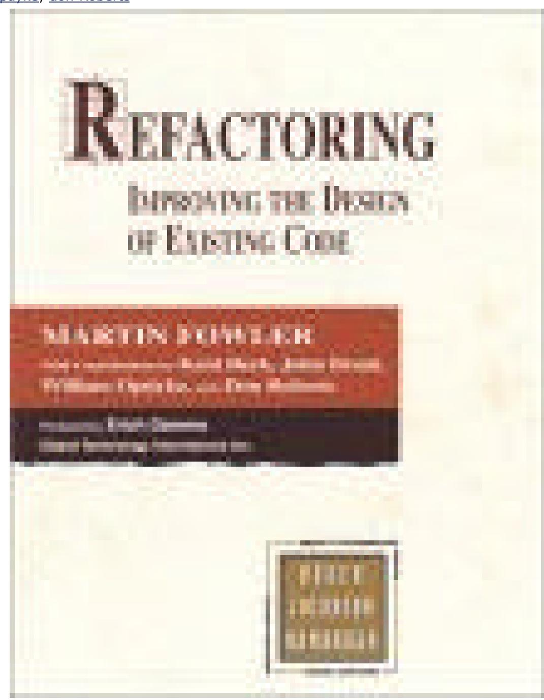

# Refactoring: Improving the Design of Existing Code

by Martin Fowler, Kent Beck (Contributor), John Brant (Contributor), William Opdyke, don Roberts

*Another stupid release 2002*J *For all the people which doesn't have money to buy a good book* Your class library works, but could it be better? *Refactoring: Improving the Design of Existing Code* shows how *refactoring* can make object-oriented code simpler and easier to maintain. Today refactoring requires considerable design know-how, but once tools become available, all programmers should be able to improve their code using refactoring techniques.

Besides an introduction to refactoring, this handbook provides a catalog of dozens of tips for improving code. The best thing about *Refactoring* is its remarkably clear presentation, along with excellent nuts-and-bolts advice, from object expert Martin Fowler. The author is also an authority on software patterns and UML, and this experience helps make this a better book, one that should be immediately accessible to any intermediate or advanced object-oriented developer. (Just like patterns, each refactoring tip is presented with a simple name, a "motivation," and examples using Java and UML.)

Early chapters stress the importance of testing in successful refactoring. (When you improve code, you have to test to verify that it still works.) After the discussion on how to detect the "smell" of bad code, readers get to the heart of the book, its catalog of over 70 "refactorings"--tips for better and simpler class design. Each tip is illustrated with "before" and "after" code, along with an explanation. Later chapters provide a quick look at refactoring research.

Like software patterns, refactoring may be an idea whose time has come. This groundbreaking title will surely help bring refactoring to the programming mainstream. With its clear advice on a hot new topic, *Refactoring* is sure to be essential reading for anyone who writes or maintains object-oriented software. *--Richard Dragan*

**Topics Covered:** Refactoring, improving software code, redesign, design tips, patterns, unit testing, refactoring research, and tools.

## Book News, Inc.

A guide to refactoring, the process of changing a software system so that it does not alter the external behavior of the code yet improves its internal structure, for professional programmers. Early chapters cover general principles, rationales, examples, and testing. The heart of the book is a catalog of refactorings, organized in chapters on composing methods, moving features between objects, organizing data, simplifying conditional expressions, and dealing with generalizations

| Foreword                                                        | 6  |
|-----------------------------------------------------------------|----|
| Preface                                                         | 8  |
| What Is Refactoring?                                            | 9  |
| What's in This Book?                                            | 9  |
| Who Should Read This Book?                                      | 10 |
| Building on the Foundations Laid by Others                      | 10 |
| Acknowledgments                                                 | 11 |
| Chapter 1. Refactoring, a First Example                         | 13 |
| The Starting Point                                              | 13 |
| The First Step in Refactoring                                   | 17 |
| Decomposing and Redistributing the Statement Method             | 18 |
| Replacing the Conditional Logic on Price Code with Polymorphism | 35 |
| Final Thoughts                                                  |    |
| Chapter 2. Principles in Refactoring                            | 46 |
| Defining Refactoring                                            | 46 |
| Why Should You Refactor?                                        | 47 |
| Refactoring Helps You Find Bugs                                 | 48 |
| When Should You Refactor?                                       | 49 |
| What Do I Tell My Manager?                                      | 52 |
| Problems with Refactoring                                       | 54 |
| Refactoring and Design                                          | 57 |
| Refactoring and Performance                                     |    |
| Where Did Refactoring Come From?                                | 60 |
| Chapter 3. Bad Smells in Code                                   | 63 |
| Duplicated Code                                                 |    |
| Long Method                                                     | 64 |
| Large Class                                                     | 65 |
| Long Parameter List                                             | 65 |
| Divergent Change                                                | 66 |
| Shotgun Surgery                                                 |    |
| Feature Envy                                                    |    |
| Data Clumps                                                     |    |
| Primitive Obsession                                             |    |
| Switch Statements                                               |    |
| Parallel Inheritance Hierarchies                                |    |
| Lazy Class                                                      |    |
| Speculative Generality                                          |    |
| Temporary Field                                                 |    |
| Message Chains                                                  |    |
| Middle Man                                                      |    |
| Inappropriate Intimacy                                          |    |
| Alternative Classes with Different Interfaces                   |    |
| Incomplete Library Class                                        |    |
| Data Class                                                      |    |
| Refused Bequest                                                 | 71 |

| Comments                                           | 71  |
|----------------------------------------------------|-----|
| Chapter 4. Building Tests                          | 73  |
| The Value of Self-testing Code                     | 73  |
| The JUnit Testing Framework                        |     |
| Adding More Tests                                  |     |
| Chapter 5. Toward a Catalog of Refactorings        |     |
| Format of the Refactorings                         |     |
| Finding References                                 |     |
| How Mature Are These Refactorings?                 |     |
| Chapter 6. Composing Methods                       |     |
| Extract Method                                     |     |
| Inline Method                                      |     |
| Inline Temp                                        | 96  |
| Replace Temp with Query                            |     |
| Introduce Explaining Variable                      |     |
| Split Temporary Variable                           |     |
| Remove Assignments to Parameters                   |     |
| Replace Method with Method Object                  |     |
| Substitute Algorithm                               |     |
| Chapter 7. Moving Features Between Objects         |     |
| Move Method                                        |     |
| Move Field                                         | 119 |
| Extract Class                                      |     |
| Inline Class                                       | 125 |
| Hide Delegate                                      |     |
| Remove Middle Man                                  |     |
| Introduce Foreign Method                           |     |
| Introduce Local Extension                          |     |
| Chapter 8. Organizing Data                         | 138 |
| Self Encapsulate Field                             |     |
| Replace Data Value with Object                     | 141 |
| Change Value to Reference                          |     |
| Change Reference to Value                          |     |
| Replace Array with Object                          |     |
| Duplicate Observed Data                            |     |
| Change Unidirectional Association to Bidirectional |     |
| Change Bidirectional Association to Unidirectional |     |
| Replace Magic Number with Symbolic Constant        |     |
| Encapsulate Field                                  |     |
| Encapsulate Collection                             | 168 |
| Replace Record with Data Class                     |     |
| Replace Type Code with Class                       |     |
| Replace Type Code with Subclasses                  |     |
| Replace Type Code with State/Strategy              |     |
| Replace Subclass with Fields                       |     |
| Chapter 9. Simplifying Conditional Expressions     |     |
|                                                    |     |

| Decompose Conditional                                                                 | 192 |
|---------------------------------------------------------------------------------------|-----|
| Consolidate Conditional Expression                                                    | 194 |
| Consolidate Duplicate Conditional Fragments                                           | 196 |
| Remove Control Flag                                                                   |     |
| Replace Nested Conditional with Guard Clauses                                         | 201 |
| Replace Conditional with Polymorphism                                                 |     |
| Introduce Null Object                                                                 | 209 |
| Introduce Assertion                                                                   |     |
| Chapter 10. Making Method Calls Simpler                                               | 220 |
| Rename Method                                                                         |     |
| Add Parameter                                                                         | 222 |
| Remove Parameter                                                                      | 223 |
| Separate Query from Modifier                                                          | 225 |
| Parameterize Method                                                                   |     |
| Replace Parameter with Explicit Methods                                               | 230 |
| Preserve Whole Object                                                                 |     |
| Replace Parameter with Method                                                         |     |
| Introduce Parameter Object                                                            |     |
| Remove Setting Method                                                                 | 242 |
| Hide Method                                                                           | 245 |
| Replace Constructor with Factory Method                                               | 246 |
| Encapsulate Downcast                                                                  | 249 |
| Replace Error Code with Exception                                                     | 251 |
| Replace Exception with Test                                                           |     |
| Chapter 11. Dealing with Generalization                                               |     |
| Pull Up Field                                                                         |     |
| Pull Up Method                                                                        |     |
| Pull Up Constructor Body                                                              |     |
| Push Down Method                                                                      |     |
| Push Down Field                                                                       |     |
| Extract Subclass                                                                      |     |
| Extract Superclass                                                                    |     |
| Extract Interface                                                                     |     |
| Collapse Hierarchy                                                                    |     |
| Form Template Method                                                                  |     |
| Replace Inheritance with Delegation                                                   |     |
| Replace Delegation with Inheritance                                                   |     |
| Chapter 12. Big Refactorings                                                          |     |
| Tease Apart Inheritance                                                               |     |
| Convert Procedural Design to Objects                                                  |     |
| Separate Domain from Presentation                                                     |     |
| Extract Hierarchy                                                                     |     |
| Chapter 13. Refactoring, Reuse, and Reality                                           |     |
| A Reality Check                                                                       |     |
| Why Are Developers Reluctant to Refactor Their Programs?  A Reality Check (Revisited) |     |
| A Reality Officer (Revisited)                                                         | 323 |
|                                                                                       |     |

| Resources and References for Refactoring                      | 323 |
|---------------------------------------------------------------|-----|
| Implications Regarding Software Reuse and Technology Transfer | 324 |
| A Final Note                                                  | 325 |
| Endnotes                                                      | 325 |
| Chapter 14. Refactoring Tools                              | 328 |
| Refactoring with a Tool                                       | 328 |
| Technical Criteria for a Refactoring Tool                     | 329 |
| Practical Criteria for a Refactoring Tool                     | 331 |
| Wrap Up                                                    | 332 |
| Chapter 15. Putting It All Together                        | 333 |
| Bibliography                                                  | 336 |
| References                                                 | 336 |
