# Chapter 1: Refactoring, a First Example

How do I begin to write about refactoring? The traditional way to begin talking about something is to outline the history, broad principles, and the like. When someone does that at a conference, I get slightly sleepy. My mind starts wandering with a low-priority background process that polls the speaker until he or she gives an example. The examples wake me up because it is with examples that I can see what is going on. With principles it is too easy to make generalizations, too hard to figure out how to apply things. An example helps make things clear.

So I'm going to start this book with an example of refactoring. During the process I'll tell you a lot about how refactoring works and give you a sense of the process of refactoring. I can then provide the usual principles-style introduction.

With an introductory example, however, I run into a big problem. If I pick a large program, describing it and how it is refactored is too complicated for any reader to work through. (I tried and even a slightly complicated example runs to more than a hundred pages.) However, if I pick a program that is small enough to be comprehensible, refactoring does not look like it is worthwhile.

Thus I'm in the classic bind of anyone who wants to describe techniques that are useful for realworld programs. Frankly it is not worth the effort to do the refactoring that I'm going to show you on a small program like the one I'm going to use. But if the code I'm showing you is part of a larger system, then the refactoring soon becomes important. So I have to ask you to look at this and imagine it in the context of a much larger system.

## The Starting Point

The sample program is very simple. It is a program to calculate and print a statement of a customer's charges at a video store. The program is told which movies a customer rented and for how long. It then calculates the charges, which depend on how long the movie is rented, and identifies the type movie. There are three kinds of movies: regular, children's, and new releases. In addition to calculating charges, the statement also computes frequent renter points, which vary depending on whether the film is a new release.

Several classes represent various video elements. Here's a class diagram to show them (Figure 1.1).

**Figure 1.1. Class diagram of the starting-point classes. Only the most important features are shown. The notation is Unified Modeling Language UML [Fowler, UML].**

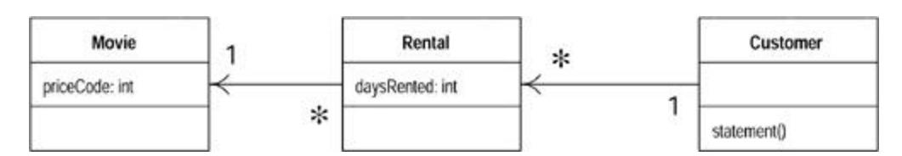

I'll show the code for each of these classes in turn.

### Movie

Movie is just a simple data class.

```
 public class Movie {
 public static final int CHILDRENS = 2;
 public static final int REGULAR = 0;
 public static final int NEW_RELEASE = 1;
 private String _title;
 private int _priceCode;
 public Movie(String title, int priceCode) {
 _title = title;
 _priceCode = priceCode;
 }
 public int getPriceCode() {
 return _priceCode;
 }
 public void setPriceCode(int arg) {
 _priceCode = arg;
 }
 public String getTitle (){
 return _title;
 };
 }
```

### Rental

The rental class represents a customer renting a movie.

```
 class Rental {
 private Movie _movie;
 private int _daysRented;
 public Rental(Movie movie, int daysRented) {
 _movie = movie;
 _daysRented = daysRented;
 }
 public int getDaysRented() {
 return _daysRented;
 }
 public Movie getMovie() {
 return _movie;
 } 
 }
```

### Customer

The customer class represents the customer of the store. Like the other classes it has data and accessors:

```
 class Customer {
 private String _name;
 private Vector _rentals = new Vector();
 public Customer (String name){
 _name = name;
 };
 public void addRental(Rental arg) {
 _rentals.addElement(arg);
 }
 public String getName (){
 return _name;
 };
```

Customer also has the method that produces a statement. Figure 1.2 shows the interactions for this method. The body for this method is on the facing page.

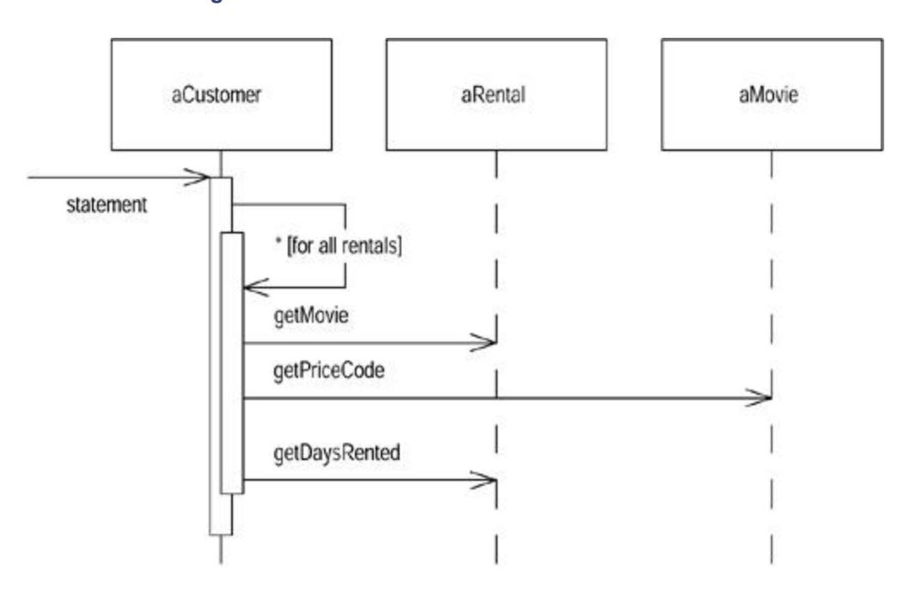

**Figure 1.2. Interactions for the statement method**

```
public String statement() {
 double totalAmount = 0;
 int frequentRenterPoints = 0;
 Enumeration rentals = _rentals.elements();
 String result = "Rental Record for " + getName() + "\n";
 while (rentals.hasMoreElements()) {
 double thisAmount = 0;
 Rental each = (Rental) rentals.nextElement();
 //determine amounts for each line
 switch (each.getMovie().getPriceCode()) {
 case Movie.REGULAR:
 thisAmount += 2;
 if (each.getDaysRented() > 2)
```

```
 thisAmount += (each.getDaysRented() - 2) * 1.5;
 break;
 case Movie.NEW_RELEASE:
 thisAmount += each.getDaysRented() * 3;
 break;
 case Movie.CHILDRENS:
 thisAmount += 1.5;
 if (each.getDaysRented() > 3)
 thisAmount += (each.getDaysRented() - 3) * 1.5;
 break;
 }
 // add frequent renter points
 frequentRenterPoints ++;
 // add bonus for a two day new release rental
 if ((each.getMovie().getPriceCode() == Movie.NEW_RELEASE) 
&&
each.getDaysRented() > 1) frequentRenterPoints ++;
 //show figures for this rental
 result += "\t" + each.getMovie().getTitle()+ "\t" +
String.valueOf(thisAmount) + "\n";
 totalAmount += thisAmount;
 }
 //add footer lines
 result += "Amount owed is " + String.valueOf(totalAmount) + 
"\n";
 result += "You earned " + String.valueOf(frequentRenterPoints) 
+
" frequent renter points";
 return result;
 }
```

### Comments on the Starting Program

What are your impressions about the design of this program? I would describe it as not well designed and certainly not object oriented. For a simple program like this, that does not really matter. There's nothing wrong with a quick and dirty *simple* program. But if this is a representative fragment of a more complex system, then I have some real problems with this program. That long statement routine in the Customer class does far too much. Many of the things that it does should really be done by the other classes.

Even so the program works. Is this not just an aesthetic judgment, a dislike of ugly code? It is until we want to change the system. The compiler doesn't care whether the code is ugly or clean. But when we change the system, there is a human involved, and humans do care. A poorly designed system is hard to change. Hard because it is hard to figure out where the changes are needed. If it is hard to figure out what to change, there is a strong chance that the programmer will make a mistake and introduce bugs.

In this case we have a change that the users would like to make. First they want a statement printed in HTML so that the statement can be Web enabled and fully buzzword compliant. Consider the impact this change would have. As you look at the code you can see that it is

impossible to reuse any of the behavior of the current statement method for an HTML statement. Your only recourse is to write a whole new method that duplicates much of the behavior of statement. Now, of course, this is not too onerous. You can just copy the statement method and make whatever changes you need.

But what happens when the charging rules change? You have to fix both statement and htmlStatement and ensure the fixes are consistent. The problem with copying and pasting code comes when you have to change it later. If you are writing a program that you don't expect to change, then cut and paste is fine. If the program is long lived and likely to change, then cut and paste is a menace.

This brings me to a second change. The users want to make changes to the way they classify movies, but they haven't yet decided on the change they are going to make. They have a number of changes in mind. These changes will affect both the way renters are charged for movies and the way that frequent renter points are calculated. As an experienced developer you are sure that whatever scheme users come up with, the only guarantee you're going to have is that they will change it again within six months.

The statement method is where the changes have to be made to deal with changes in classification and charging rules. If, however, we copy the statement to an HTML statement, we need to ensure that any changes are completely consistent. Furthermore, as the rules grow in complexity it's going to be harder to figure out where to make the changes and harder to make them without making a mistake.

You may be tempted to make the fewest possible changes to the program; after all, it works fine. Remember the old engineering adage: "if it ain't broke, don't fix it." The program may not be broken, but it does hurt. It is making your life more difficult because you find it hard to make the changes your users want. This is where refactoring comes in.

#### Tip

*When you find you have to add a feature to a program, and the program's code is not structured in a convenient way to add the feature, first refactor the program to make it easy to add the feature, then add the feature.*

## The First Step in Refactoring

Whenever I do refactoring, the first step is always the same. I need to build a solid set of tests for that section of code. The tests are essential because even though I follow refactorings structured to avoid most of the opportunities for introducing bugs, I'm still human and still make mistakes. Thus I need solid tests.

Because the statement result produces a string, I create a few customers, give each customer a few rentals of various kinds of films, and generate the statement strings. I then do a string comparison between the new string and some reference strings that I have hand checked. I set up all of these tests so I can run them from one Java command on the command line. The tests take only a few seconds to run, and as you will see, I run them often.

An important part of the tests is the way they report their results. They either say "OK," meaning that all the strings are identical to the reference strings, or they print a list of failures: lines that turned out differently. The tests are thus self-checking. It is vital to make tests self-checking. If you don't, you end up spending time hand checking some numbers from the test against some numbers of a desk pad, and that slows you down.

As we do the refactoring, we will lean on the tests. I'm going to be relying on the tests to tell me whether I introduce a bug. It is essential for refactoring that you have good tests. It's worth spending the time to build the tests, because the tests give you the security you need to change the program later. This is such an important part of refactoring that I go into more detail on testing in Chapter 4.

### Tip

*Before you start refactoring, check that you have a solid suite of tests. These tests must be self-checking.*

## Decomposing and Redistributing the Statement Method

The obvious first target of my attention is the overly long statement method. When I look at a long method like that, I am looking to decompose the method into smaller pieces. Smaller pieces of code tend to make things more manageable. They are easier to work with and move around.

The first phase of the refactorings in this chapter show how I split up the long method and move the pieces to better classes. My aim is to make it easier to write an HTML statement method with much less duplication of code.

My first step is to find a logical clump of code and use Extract Method. An obvious piece here is the switch statement. This looks like it would make a good chunk to extract into its own method.

When I extract a method, as in any refactoring, I need to know what can go wrong. If I do the extraction badly, I could introduce a bug into the program. So before I do the refactoring I need to figure out how to do it safely. I've done this refactoring a few times before, so I've written down the safe steps in the catalog.

First I need to look in the fragment for any variables that are local in scope to the method we are looking at, the local variables and parameters. This segment of code uses two: each and thisAmount. Of these each is not modified by the code but thisAmount is modified. Any nonmodified variable I can pass in as a parameter. Modified variables need more care. If there is only one, I can return it. The temp is initialized to 0 each time around the loop and is not altered until the switch gets to it. So I can just assign the result.

The next two pages show the code before and after refactoring. The before code is on the left, the resulting code on the right. The code I'm extracting from the original and any changes in the new code that I don't think are immediately obvious are in boldface type. As I continue with this chapter, I'll continue with this left-right convention.

```
 public String statement() {
 double totalAmount = 0;
 int frequentRenterPoints = 0;
 Enumeration rentals = _rentals.elements();
 String result = "Rental Record for " + getName() + "\n";
 while (rentals.hasMoreElements()) {
 double thisAmount = 0;
 Rental each = (Rental) rentals.nextElement();
 //determine amounts for each line
 switch (each.getMovie().getPriceCode()) {
```

```
 case Movie.REGULAR:
 thisAmount += 2;
 if (each.getDaysRented() > 2)
 thisAmount += (each.getDaysRented() - 2) * 1.5;
 break;
 case Movie.NEW_RELEASE:
 thisAmount += each.getDaysRented() * 3;
 break;
 case Movie.CHILDRENS:
 thisAmount += 1.5;
 if (each.getDaysRented() > 3)
 thisAmount += (each.getDaysRented() - 3) * 1.5;
 break;
 }
 // add frequent renter points
 frequentRenterPoints ++;
 // add bonus for a two day new release rental
 if ((each.getMovie().getPriceCode() == Movie.NEW_RELEASE) 
&& each.getDaysRented() >
1) frequentRenterPoints ++;
 //show figures for this rental
 result += "\t" + each.getMovie().getTitle()+ "\t" + 
String.valueOf(thisAmount) + 
"\n";
 totalAmount += thisAmount;
 }
 //add footer lines
 result += "Amount owed is " + String.valueOf(totalAmount) + 
"\n";
 result += "You earned " + String.valueOf(frequentRenterPoints) 
+ " frequent renter
points";
 return result;
 }
public String statement() {
 double totalAmount = 0;
 int frequentRenterPoints = 0;
 Enumeration rentals = _rentals.elements();
 String result = "Rental Record for " + getName() + "\n";
 while (rentals.hasMoreElements()) {
 double thisAmount = 0;
 Rental each = (Rental) rentals.nextElement();
 thisAmount = amountFor(each);
 // add frequent renter points
 frequentRenterPoints ++;
 // add bonus for a two day new release rental
 if ((each.getMovie().getPriceCode() == Movie.NEW_RELEASE) &&
 each.getDaysRented() > 1) frequentRenterPoints ++;
 //show figures for this rental
```

```
 result += "\t" + each.getMovie().getTitle()+ "\t" +
 String.valueOf(thisAmount) + "\n";
 totalAmount += thisAmount;
 }
 //add footer lines
 result += "Amount owed is " + String.valueOf(totalAmount) + 
"\n";
 result += "You earned " + String.valueOf(frequentRenterPoints) +
 " frequent renter points";
 return result;
 }
}
private int amountFor(Rental each) {
 int thisAmount = 0;
 switch (each.getMovie().getPriceCode()) {
 case Movie.REGULAR:
 thisAmount += 2;
 if (each.getDaysRented() > 2)
 thisAmount += (each.getDaysRented() - 2) * 1.5;
 break;
 case Movie.NEW_RELEASE:
 thisAmount += each.getDaysRented() * 3;
 break;
 case Movie.CHILDRENS:
 thisAmount += 1.5;
 if (each.getDaysRented() > 3)
 thisAmount += (each.getDaysRented() - 3) * 1.5;
 break;
 }
 return thisAmount;
}
```

Whenever I make a change like this, I compile and test. I didn't get off to a very good start—the tests blew up. A couple of the test figures gave me the wrong answer. I was puzzled for a few seconds then realized what I had done. Foolishly I'd made the return type amountFor int instead of double:

```
 private double amountFor(Rental each) {
 double thisAmount = 0;
 switch (each.getMovie().getPriceCode()) {
 case Movie.REGULAR:
 thisAmount += 2;
 if (each.getDaysRented() > 2)
 thisAmount += (each.getDaysRented() - 2) * 1.5;
 break;
 case Movie.NEW_RELEASE:
 thisAmount += each.getDaysRented() * 3;
 break;
 case Movie.CHILDRENS:
 thisAmount += 1.5;
 if (each.getDaysRented() > 3)
 thisAmount += (each.getDaysRented() - 3) * 1.5;
```

```
 break;
 }
 return thisAmount;
 }
```

It's the kind of silly mistake that I often make, and it can be a pain to track down. In this case Java converts doubles to ints without complaining but merrily rounding [Java Spec]. Fortunately it was easy to find in this case, because the change was so small and I had a good set of tests. Here is the essence of the refactoring process illustrated by accident. Because each change is so small, any errors are very easy to find. You don't spend a long time debugging, even if you are as careless as I am.

### Tip

*Refactoring changes the programs in small steps. If you make a mistake, it is easy to find the bug.*

Because I'm working in Java, I need to analyze the code to figure out what to do with the local variables. With a tool, however, this can be made really simple. Such a tool does exist in Smalltalk, the Refactoring Browser. With this tool refactoring is very simple. I just highlight the code, pick "Extract Method" from the menus, type in a method name, and it's done. Furthermore, the tool doesn't make silly mistakes like mine. I'm looking forward to a Java version!

Now that I've broken the original method down into chunks, I can work on them separately. I don't like some of the variable names in amountFor, and this is a good place to change them.

Here's the original code:

```
 private double amountFor(Rental each) {
 double thisAmount = 0;
 switch (each.getMovie().getPriceCode()) {
 case Movie.REGULAR:
 thisAmount += 2;
 if (each.getDaysRented() > 2)
 thisAmount += (each.getDaysRented() - 2) * 1.5;
 break;
 case Movie.NEW_RELEASE:
 thisAmount += each.getDaysRented() * 3;
 break;
 case Movie.CHILDRENS:
 thisAmount += 1.5;
 if (each.getDaysRented() > 3)
 thisAmount += (each.getDaysRented() - 3) * 1.5;
 break;
 }
 return thisAmount;
 }
```

Here is the renamed code:

```
 private double amountFor(Rental aRental) {
 double result = 0;
 switch (aRental.getMovie().getPriceCode()) {
 case Movie.REGULAR:
 result += 2;
 if (aRental.getDaysRented() > 2)
 result += (aRental.getDaysRented() - 2) * 1.5;
 break;
 case Movie.NEW_RELEASE:
 result += aRental.getDaysRented() * 3;
 break;
 case Movie.CHILDRENS:
 result += 1.5;
 if (aRental.getDaysRented() > 3)
 result += (aRental.getDaysRented() - 3) * 1.5;
 break;
 }
 return result;
 }
```

Once I've done the renaming, I compile and test to ensure I haven't broken anything.

Is renaming worth the effort? Absolutely. Good code should communicate what it is doing clearly, and variable names are a key to clear code. Never be afraid to change the names of things to improve clarity. With good find and replace tools, it is usually not difficult. Strong typing and testing will highlight anything you miss. Remember

**Tip**

*Any fool can write code that a computer can understand. Good programmers write code that humans can understand.*

Code that communicates its purpose is very important. I often refactor just when I'm reading some code. That way as I gain understanding about the program, I embed that understanding into the code for later so I don't forget what I learned.

### Moving the Amount Calculation

As I look at amountFor, I can see that it uses information from the rental, but does not use information from the customer.

```
 class Customer...
 private double amountFor(Rental aRental) {
 double result = 0;
 switch (aRental.getMovie().getPriceCode()) {
 case Movie.REGULAR:
 result += 2;
 if (aRental.getDaysRented() > 2)
 result += (aRental.getDaysRented() - 2) * 1.5;
```

```
 break;
 case Movie.NEW_RELEASE:
 result += aRental.getDaysRented() * 3;
 break;
 case Movie.CHILDRENS:
 result += 1.5;
 if (aRental.getDaysRented() > 3)
 result += (aRental.getDaysRented() - 3) * 1.5;
 break;
 }
 return result;
 }
```

This immediately raises my suspicions that the method is on the wrong object. In most cases a method should be on the object whose data it uses, thus the method should be moved to the rental. To do this I use Move Method. With this you first copy the code over to rental, adjust it to fit in its new home, and compile, as follows:

```
 class Rental...
 double getCharge() {
 double result = 0;
 switch (getMovie().getPriceCode()) {
 case Movie.REGULAR:
 result += 2;
 if (getDaysRented() > 2)
 result += (getDaysRented() - 2) * 1.5;
 break;
 case Movie.NEW_RELEASE:
 result += getDaysRented() * 3;
 break;
 case Movie.CHILDRENS:
 result += 1.5;
 if (getDaysRented() > 3)
 result += (getDaysRented() - 3) * 1.5;
 break;
 }
 return result;
 }
```

In this case fitting into its new home means removing the parameter. I also renamed the method as I did the move.

I can now test to see whether this method works. To do this I replace the body of Customer.amountFor to delegate to the new method.

```
 class Customer...
 private double amountFor(Rental aRental) {
 return aRental.getCharge();
 }
```

I can now compile and test to see whether I've broken anything.

The next step is to find every reference to the old method and adjust the reference to use the new method, as follows:

```
 class Customer...
 public String statement() {
 double totalAmount = 0;
 int frequentRenterPoints = 0;
 Enumeration rentals = _rentals.elements();
 String result = "Rental Record for " + getName() + "\n";
 while (rentals.hasMoreElements()) {
 double thisAmount = 0;
 Rental each = (Rental) rentals.nextElement();
 thisAmount = amountFor(each);
 // add frequent renter points
 frequentRenterPoints ++;
 // add bonus for a two day new release rental
 if ((each.getMovie().getPriceCode() == Movie.NEW_RELEASE) 
&&
 each.getDaysRented() > 1) frequentRenterPoints ++;
 //show figures for this rental
 result += "\t" + each.getMovie().getTitle()+ "\t" +
 String.valueOf(thisAmount) + "\n";
 totalAmount += thisAmount;
 }
 //add footer lines
 result += "Amount owed is " + String.valueOf(totalAmount) + 
"\n";
 result += "You earned " + 
String.valueOf(frequentRenterPoints) +
 " frequent renter points";
 return result;
 }
```

In this case this step is easy because we just created the method and it is in only one place. In general, however, you need to do a "find" across all the classes that might be using that method:

```
 class Customer
 public String statement() {
 double totalAmount = 0;
 int frequentRenterPoints = 0;
 Enumeration rentals = _rentals.elements();
 String result = "Rental Record for " + getName() + "\n";
 while (rentals.hasMoreElements()) {
 double thisAmount = 0;
 Rental each = (Rental) rentals.nextElement();
 thisAmount = each.getCharge();
 // add frequent renter points
```

```
 frequentRenterPoints ++;
 // add bonus for a two day new release rental
 if ((each.getMovie().getPriceCode() == Movie.NEW_RELEASE) 
&&
 each.getDaysRented() > 1) frequentRenterPoints ++;
 //show figures for this rental
 result += "\t" + each.getMovie().getTitle()+ "\t" +
 String.valueOf(thisAmount) + "\n";
 totalAmount += thisAmount;
 }
 //add footer lines
 result += "Amount owed is " + String.valueOf(totalAmount) + 
"\n";
 result += "You earned " + 
String.valueOf(frequentRenterPoints) +
 " frequent renter points";
 return result;
 }
```

When I've made the change (Figure 1.3) the next thing is to remove the old method. The compiler should tell me whether I missed anything. I then test to see if I've broken anything.

**Figure 1.3. State of classes after moving the charge method**

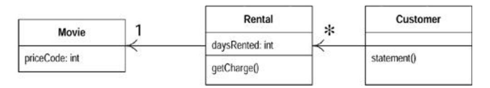

Sometimes I leave the old method to delegate to the new method. This is useful if it is a public method and I don't want to change the interface of the other class.

There is certainly some more I would like to do to Rental.getCharge but I will leave it for the moment and return to Customer.statement.

```
 public String statement() {
 double totalAmount = 0;
 int frequentRenterPoints = 0;
 Enumeration rentals = _rentals.elements();
 String result = "Rental Record for " + getName() + "\n";
 while (rentals.hasMoreElements()) {
 double thisAmount = 0;
 Rental each = (Rental) rentals.nextElement();
 thisAmount = each.getCharge();
 // add frequent renter points
 frequentRenterPoints ++;
 // add bonus for a two day new release rental
```

```
 if ((each.getMovie().getPriceCode() == Movie.NEW_RELEASE) 
&&
 each.getDaysRented() > 1) frequentRenterPoints ++;
 //show figures for this rental
 result += "\t" + each.getMovie().getTitle()+ "\t" +
 String.valueOf(thisAmount) + "\n";
 totalAmount += thisAmount;
 }
 //add footer lines
 result += "Amount owed is " + String.valueOf(totalAmount) + 
"\n";
 result += "You earned " + String.valueOf(frequentRenterPoints) 
+
 " frequent renter points";
 return result;
 }
```

The next thing that strikes me is that thisAmount is now redundant. It is set to the result of each.charge and not changed afterward. Thus I can eliminate thisAmount by using Replace Temp with Query:

```
 public String statement() {
 double totalAmount = 0;
 int frequentRenterPoints = 0;
 Enumeration rentals = _rentals.elements();
 String result = "Rental Record for " + getName() + "\n";
 while (rentals.hasMoreElements()) {
 Rental each = (Rental) rentals.nextElement();
 // add frequent renter points
 frequentRenterPoints ++;
 // add bonus for a two day new release rental
 if ((each.getMovie().getPriceCode() == Movie.NEW_RELEASE) 
&&
 each.getDaysRented() > 1) frequentRenterPoints ++;
 //show figures for this rental
 result += "\t" + each.getMovie().getTitle()+ "\t" + 
String.valueOf
 (each.getCharge()) + "\n";
 totalAmount += each.getCharge();
 }
 //add footer lines
 result += "Amount owed is " + String.valueOf(totalAmount) + 
"\n";
 result += "You earned " + String.valueOf(frequentRenterPoints)
 + " frequent renter points";
 return result;
 }
 }
```

Once I've made that change I compile and test to make sure I haven't broken anything.

I like to get rid of temporary variables such as this as much as possible. Temps are often a problem in that they cause a lot of parameters to be passed around when they don't have to be. You can easily lose track of what they are there for. They are particularly insidious in long methods. Of course there is a performance price to pay; here the charge is now calculated twice. But it is easy to optimize that in the rental class, and you can optimize much more effectively when the code is properly factored. I'll talk more about that issue later in Refactoring and Performance on page 69.

### Extracting Frequent Renter Points

The next step is to do a similar thing for the frequent renter points. The rules vary with the tape, although there is less variation than with charging. It seems reasonable to put the responsibility on the rental. First we need to use Extract Method on the frequent renter points part of the code (in boldface type):

```
 public String statement() {
 double totalAmount = 0;
 int frequentRenterPoints = 0;
 Enumeration rentals = _rentals.elements();
 String result = "Rental Record for " + getName() + "\n";
 while (rentals.hasMoreElements()) {
 Rental each = (Rental) rentals.nextElement();
 // add frequent renter points
 frequentRenterPoints ++;
 // add bonus for a two day new release rental
 if ((each.getMovie().getPriceCode() == Movie.NEW_RELEASE)
 && each.getDaysRented() > 1) frequentRenterPoints ++;
 //show figures for this rental
 result += "\t" + each.getMovie().getTitle()+ "\t" + 
String.valueOf(each.getCharge())
+ "\n";
 totalAmount += each.getCharge();
 }
 //add footer lines
 result += "Amount owed is " + String.valueOf(totalAmount) + 
"\n";
 result += "You earned " + String.valueOf(frequentRenterPoints)
 + " frequent renter points";
 return result;
 }
}
```

Again we look at the use of locally scoped variables. Again each is used and can be passed in as a parameter. The other temp used is frequentRenterPoints. In this case frequentRenterPoints does have a value beforehand. The body of the extracted method doesn't read the value, however, so we don't need to pass it in as a parameter as long as we use an appending assignment.

I did the extraction, compiled, and tested and then did a move and compiled and tested again. With refactoring, small steps are the best; that way less tends to go wrong.

```
class Customer...
 public String statement() {
 double totalAmount = 0;
 int frequentRenterPoints = 0;
 Enumeration rentals = _rentals.elements();
 String result = "Rental Record for " + getName() + "\n";
 while (rentals.hasMoreElements()) {
 Rental each = (Rental) rentals.nextElement();
 frequentRenterPoints += each.getFrequentRenterPoints();
 //show figures for this rental
 result += "\t" + each.getMovie().getTitle()+ "\t" +
 String.valueOf(each.getCharge()) + "\n";
 totalAmount += each.getCharge();
 }
 //add footer lines
 result += "Amount owed is " + String.valueOf(totalAmount) + 
"\n";
 result += "You earned " + String.valueOf(frequentRenterPoints) 
+
 " frequent renter points";
 return result;
 }
class Rental...
 int getFrequentRenterPoints() {
 if ((getMovie().getPriceCode() == Movie.NEW_RELEASE) && 
getDaysRented() > 1)
 return 2;
 else
 return 1;
 }
```

I'll summarize the changes I just made with some before-and-after Unified Modeling Language (UML) diagrams (Figures 1.4 through 1.7). Again the diagrams on the left are before the change; those on the right are after the change.

**Figure 1.4. Class diagram before extraction and movement of the frequent renter points calculation**

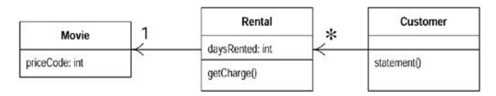

**Figure 1.5. Sequence diagrams before extraction and movement of the frequent renter points calculation**

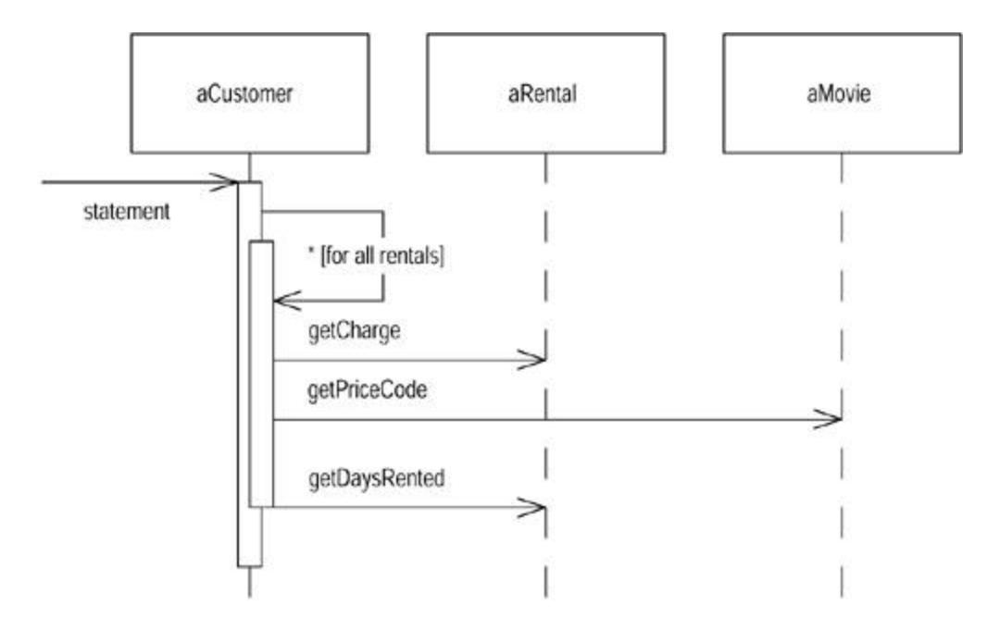

**Figure 1.6. Class diagram after extraction and movement of the frequent renter points calculation**

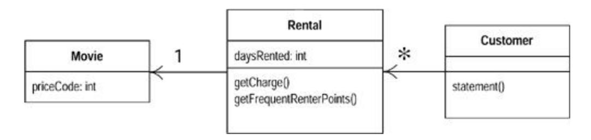

**Figure 1.7. Sequence diagram before extraction and movement of the frequent renter points calculation**

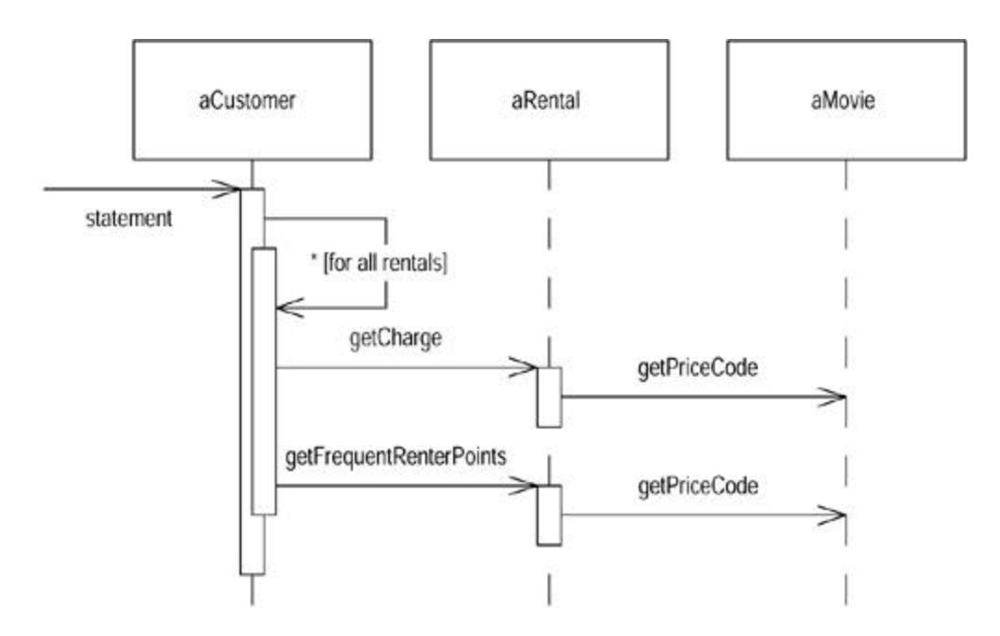

### Removing Temps

As I suggested before, temporary variables can be a problem. They are useful only within their own routine, and thus they encourage long, complex routines. In this case we have two temporary variables, both of which are being used to get a total from the rentals attached to the customer. Both the ASCII and HTML versions require these totals. I like to use Replace Temp with Query to replace totalAmount and frequentRentalPoints with query methods. Queries are accessible to any method in the class and thus encourage a cleaner design without long, complex methods:

```
 class Customer...
 public String statement() {
 double totalAmount = 0;
 int frequentRenterPoints = 0;
 Enumeration rentals = _rentals.elements();
 String result = "Rental Record for " + getName() + "\n";
 while (rentals.hasMoreElements()) {
 Rental each = (Rental) rentals.nextElement();
 frequentRenterPoints += each.getFrequentRenterPoints();
 //show figures for this rental
 result += "\t" + each.getMovie().getTitle()+ "\t" +
 String.valueOf(each.getCharge()) + "\n";
 totalAmount += each.getCharge();
 }
 //add footer lines
 result += "Amount owed is " + String.valueOf(totalAmount) + 
"\n";
 result += "You earned " + String.valueOf(frequentRenterPoints) 
+
 " frequent renter points";
 return result;
```

}

I began by replacing totalAmount with a charge method on customer:

```
 class Customer...
 public String statement() {
 int frequentRenterPoints = 0;
 Enumeration rentals = _rentals.elements();
 String result = "Rental Record for " + getName() + "\n";
 while (rentals.hasMoreElements()) {
 Rental each = (Rental) rentals.nextElement();
 frequentRenterPoints += each.getFrequentRenterPoints();
 //show figures for this rental
 result += "\t" + each.getMovie().getTitle()+ "\t" +
 String.valueOf(each.getCharge()) + "\n";
 }
 //add footer lines
 result += "Amount owed is " + 
String.valueOf(getTotalCharge()) + "\n";
 result += "You earned " + String.valueOf(frequentRenterPoints) 
+
 " frequent renter points";
 return result;
 }
 private double getTotalCharge() {
 double result = 0;
 Enumeration rentals = _rentals.elements();
 while (rentals.hasMoreElements()) {
 Rental each = (Rental) rentals.nextElement();
 result += each.getCharge();
 }
 return result;
 }
```

This isn't the simplest case of Replace Temp with Query totalAmount was assigned to within the loop, so I have to copy the loop into the query method.

After compiling and testing that refactoring, I did the same for frequentRenterPoints:

```
 class Customer...
 public String statement() {
 int frequentRenterPoints = 0;
 Enumeration rentals = _rentals.elements();
 String result = "Rental Record for " + getName() + "\n";
 while (rentals.hasMoreElements()) {
 Rental each = (Rental) rentals.nextElement();
 frequentRenterPoints += each.getFrequentRenterPoints();
 //show figures for this rental
```

```
 result += "\t" + each.getMovie().getTitle()+ "\t" +
 String.valueOf(each.getCharge()) + "\n";
 }
 //add footer lines
 result += "Amount owed is " + 
String.valueOf(getTotalCharge()) + "\n";
 result += "You earned " + String.valueOf(frequentRenterPoints) 
+
 " frequent renter points";
 return result;
 }
 public String statement() {
 Enumeration rentals = _rentals.elements();
 String result = "Rental Record for " + getName() + "\n";
 while (rentals.hasMoreElements()) {
 Rental each = (Rental) rentals.nextElement();
 //show figures for this rental
 result += "\t" + each.getMovie().getTitle()+ "\t" +
 String.valueOf(each.getCharge()) + "\n";
 }
 //add footer lines
 result += "Amount owed is " + 
String.valueOf(getTotalCharge()) + "\n";
 result += "You earned " + 
String.valueOf(getTotalFrequentRenterPoints()) +
 " frequent renter points";
 return result;
 }
 private int getTotalFrequentRenterPoints(){
 int result = 0;
 Enumeration rentals = _rentals.elements();
 while (rentals.hasMoreElements()) {
 Rental each = (Rental) rentals.nextElement();
 result += each.getFrequentRenterPoints();
 }
 return result;
 }
```

Figures 1.8 through 1.11 show the change for these refactorings in the class diagrams and the interaction diagram for the statement method.

**Figure 1.8. Class diagram before extraction of the totals**

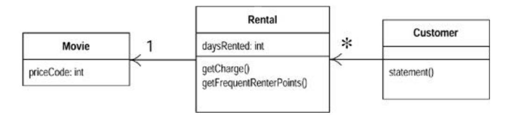

**Figure 1.9. Sequence diagram before extraction of the totals**

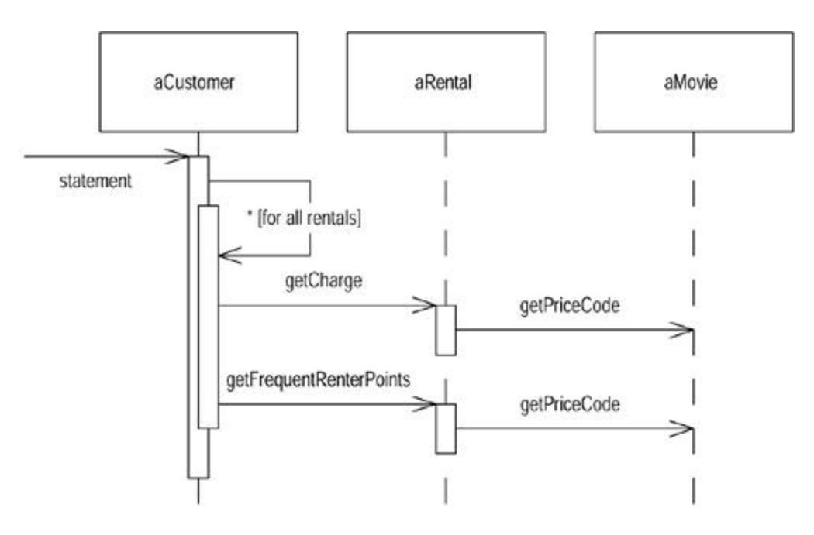

**Figure 1.10. Class diagram after extraction of the totals**

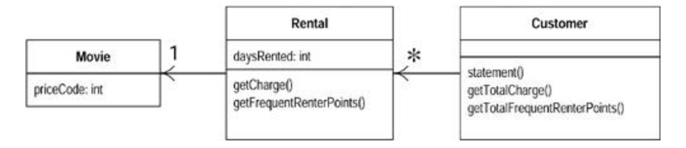

**Figure 1.11. Sequence diagram after extraction of the totals**

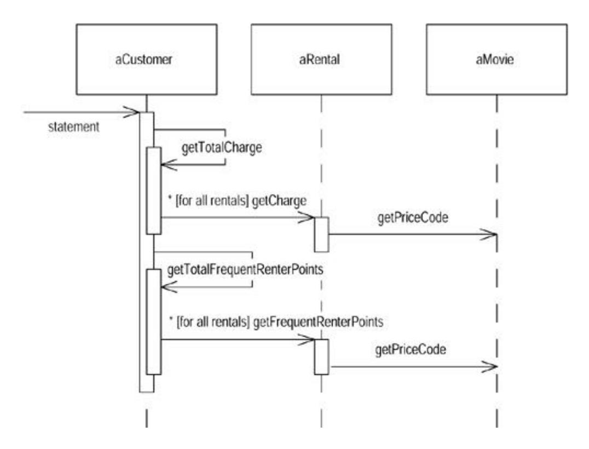

It is worth stopping to think a bit about the last refactoring. Most refactorings reduce the amount of code, but this one increases it. That's because Java 1.1 requires a lot of statements to set up a summing loop. Even a simple summing loop with one line of code per element needs six lines of support around it. It's an idiom that is obvious to any programmer but is a lot of lines all the same.

The other concern with this refactoring lies in performance. The old code executed the "while" loop once, the new code executes it three times. A while loop that takes a long time might impair performance. Many programmers would not do this refactoring simply for this reason. But note the words *if* and *might.* Until I profile I cannot tell how much time is needed for the loop to calculate or whether the loop is called often enough for it to affect the overall performance of the system. Don't worry about this while refactoring. When you optimize you will have to worry about it, but you will then be in a much better position to do something about it, and you will have more options to optimize effectively (see the discussion on page 69).

These queries are now available for any code written in the customer class. They can easily be added to the interface of the class should other parts of the system need this information. Without queries like these, other methods have to deal with knowing about the rentals and building the loops. In a complex system, that will lead to much more code to write and maintain.

You can see the difference immediately with the htmlStatement. I am now at the point where I take off my refactoring hat and put on my adding function hat. I can write htmlStatement as follows and add appropriate tests:

```
 public String htmlStatement() {
 Enumeration rentals = _rentals.elements();
 String result = "<H1>Rentals for <EM>" + getName() + "</EM></ 
H1><P>\n";
 while (rentals.hasMoreElements()) {
 Rental each = (Rental) rentals.nextElement();
```

```
 //show figures for each rental
 result += each.getMovie().getTitle()+ ": " +
 String.valueOf(each.getCharge()) + "<BR>\n";
 }
 //add footer lines
 result += "<P>You owe <EM>" + String.valueOf(getTotalCharge()) + 
"</EM><P>\n";
 result += "On this rental you earned <EM>" +
 String.valueOf(getTotalFrequentRenterPoints()) +
 "</EM> frequent renter points<P>";
 return result;
 }
```

By extracting the calculations I can create the htmlStatement method and reuse all of the calculation code that was in the original statement method. I didn't copy and paste, so if the calculation rules change I have only one place in the code to go to. Any other kind of statement will be really quick and easy to prepare. The refactoring did not take long. I spent most of the time figuring out what the code did, and I would have had to do that anyway.

Some code is copied from the ASCII version, mainly due to setting up the loop. Further refactoring could clean that up. Extracting methods for header, footer, and detail line are one route I could take. You can see how to do this in the example for Form Template Method. But now the users are clamoring again. They are getting ready to change the classification of the movies in the store. It's still not clear what changes they want to make, but it sounds like new classifications will be introduced, and the existing ones could well be changed. The charges and frequent renter point allocations for these classifications are to be decided. At the moment, making these kind of changes is awkward. I have to get into the charge and frequent renter point methods and alter the conditional code to make changes to film classifications. Back on with the refactoring hat.

## Replacing the Conditional Logic on Price Code with Polymorphism

The first part of this problem is that switch statement. It is a bad idea to do a switch based on an attribute of another object. If you must use a switch statement, it should be on your own data, not on someone else's.

```
 class Rental...
 double getCharge() {
 double result = 0;
 switch (getMovie().getPriceCode()) {
 case Movie.REGULAR:
 result += 2;
 if (getDaysRented() > 2)
 result += (getDaysRented() - 2) * 1.5;
 break;
 case Movie.NEW_RELEASE:
 result += getDaysRented() * 3;
 break;
 case Movie.CHILDRENS:
 result += 1.5;
 if (getDaysRented() > 3)
 result += (getDaysRented() - 3) * 1.5;
 break;
 }
```

```
 return result;
 }
```

This implies that getCharge should move onto movie:

```
 class Movie...
 double getCharge(int daysRented) {
 double result = 0;
 switch (getPriceCode()) {
 case Movie.REGULAR:
 result += 2;
 if (daysRented > 2)
 result += (daysRented - 2) * 1.5;
 break;
 case Movie.NEW_RELEASE:
 result += daysRented * 3;
 break;
 case Movie.CHILDRENS:
 result += 1.5;
 if (daysRented > 3)
 result += (daysRented - 3) * 1.5;
 break;
 }
 return result;
 }
```

For this to work I had to pass in the length of the rental, which of course is data from the rental. The method effectively uses two pieces of data, the length of the rental and the type of the movie. Why do I prefer to pass the length of rental to the movie rather than the movie type to the rental? It's because the proposed changes are all about adding new types. Type information generally tends to be more volatile. If I change the movie type, I want the least ripple effect, so I prefer to calculate the charge within the movie.

I compiled the method into movie and then changed the getCharge on rental to use the new method (Figures 1.12 and 1.13):

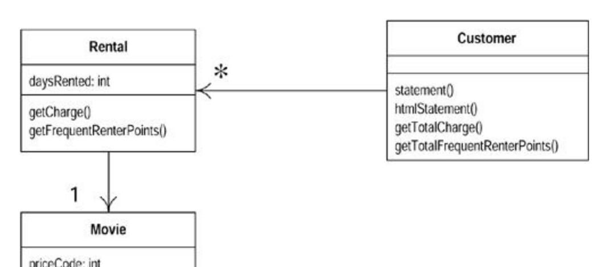

**Figure 1.12. Class diagram before moving methods to movie**

**Figure 1.13. Class diagram after moving methods to movie**

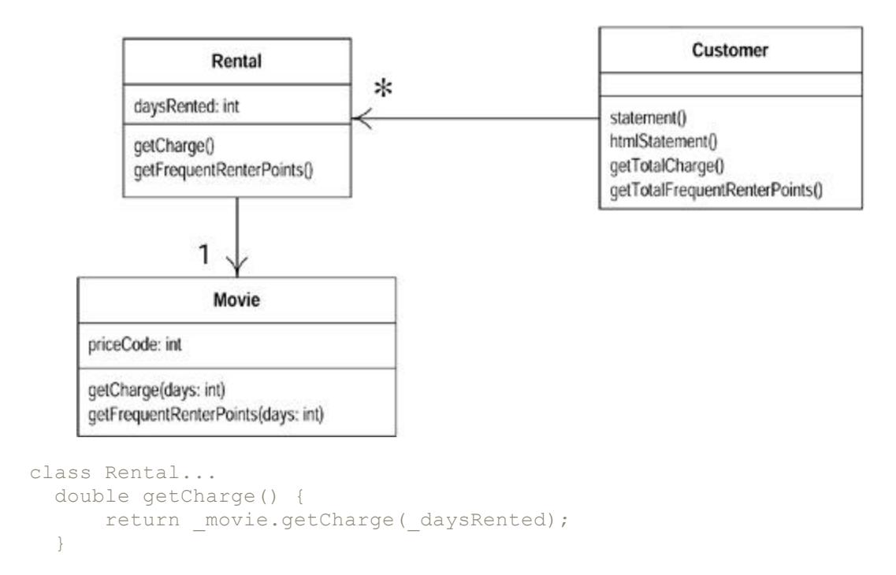

Once I've moved the getCharge method, I'll do the same with the frequent renter point calculation. That keeps both things that vary with the type together on the class that has the type:

```
 class Rental...
 int getFrequentRenterPoints() {
 if ((getMovie().getPriceCode() == Movie.NEW_RELEASE) && 
getDaysRented() > 1)
 return 2;
 else
 return 1;
 }
Class rental...
 int getFrequentRenterPoints() {
 return _movie.getFrequentRenterPoints(_daysRented);
 }
class movie...
 int getFrequentRenterPoints(int daysRented) {
 if ((getPriceCode() == Movie.NEW_RELEASE) && daysRented > 1)
 return 2;
 else
 return 1;
 }
```

### At last … Inheritance

We have several types of movie that have different ways of answering the same question. This sounds like a job for subclasses. We can have three subclasses of movie, each of which can have its own version of charge (Figure 1.14).

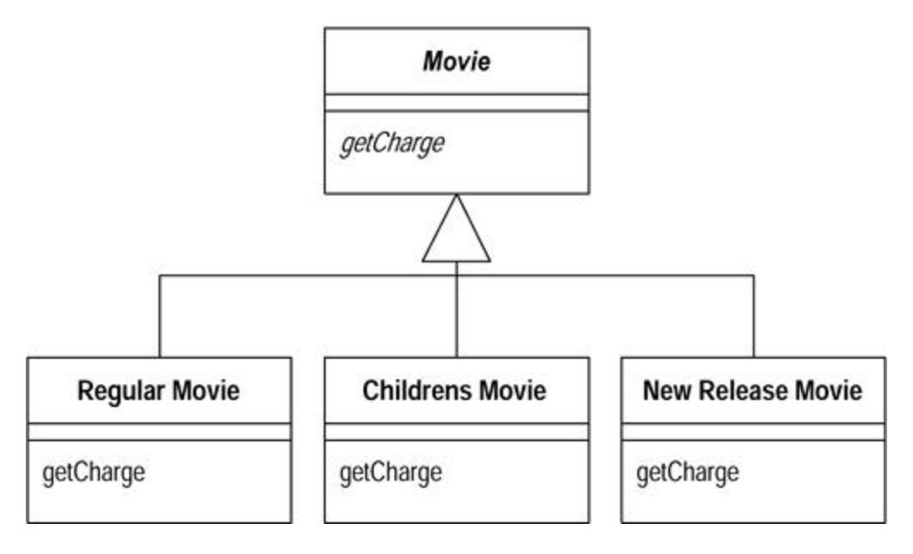

**Figure 1.14. Using inheritance on movie**

This allows me to replace the switch statement by using polymorphism. Sadly it has one slight flaw—it doesn't work. A movie can change its classification during its lifetime. An object cannot change its class during its lifetime. There is a solution, however, the State pattern [Gang of Four]. With the State pattern the classes look like Figure 1.15.

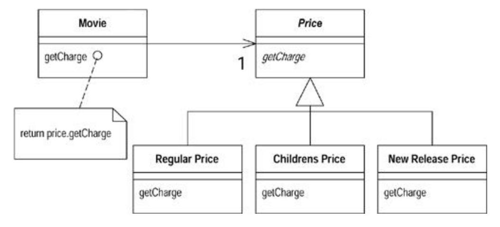

**Figure 1.15. Using the State pattern on movie**

By adding the indirection we can do the subclassing from the price code object and change the price whenever we need to.

If you are familiar with the Gang of Four patterns, you may wonder, "Is this a state, or is it a strategy?" Does the price class represent an algorithm for calculating the price (in which case I prefer to call it Pricer or PricingStrategy), or does it represent a state of the movie (*Star Trek X* is a new release). At this stage the choice of pattern (and name) reflects how you want to think about the structure. At the moment I'm thinking about this as a state of movie. If I later decide a strategy communicates my intention better, I will refactor to do this by changing the names.

To introduce the state pattern I will use three refactorings. First I'll move the type code behavior into the state pattern with Replace Type Code with State/Strategy. Then I can use Move Method to move the switch statement into the price class. Finally I'll use Replace Conditional with Polymorphism to eliminate the switch statement.

I begin with Replace Type Code with State/Strategy. This first step is to use Self Encapsulate Field on the type code to ensure that all uses of the type code go through getting and setting methods. Because most of the code came from other classes, most methods already use the getting method. However, the constructors do access the price code:

```
class Movie...
 public Movie(String name, int priceCode) {
 _name = name;
 _priceCode = priceCode;
 }
```

I can use the setting method instead.

```
class Movie
 public Movie(String name, int priceCode) {
 _name = name;
 setPriceCode(priceCode);
 }
```

I compile and test to make sure I didn't break anything. Now I add the new classes. I provide the type code behavior in the price object. I do this with an abstract method on price and concrete methods in the subclasses:

```
 abstract class Price {
 abstract int getPriceCode();
 }
 class ChildrensPrice extends Price {
 int getPriceCode() {
 return Movie.CHILDRENS;
 }
 }
 class NewReleasePrice extends Price {
 int getPriceCode() {
 return Movie.NEW_RELEASE;
 }
 }
 class RegularPrice extends Price {
 int getPriceCode() {
 return Movie.REGULAR;
 }
 }
```

I can compile the new classes at this point.

Now I need to change movie's accessors for the price code to use the new class:

```
 public int getPriceCode() {
 return _priceCode;
 }
 public setPriceCode (int arg) {
 _priceCode = arg;
 }
 private int _priceCode;
```

This means replacing the price code field with a price field, and changing the accessors:

```
 class Movie...
 public int getPriceCode() {
 return _price.getPriceCode();
 }
 public void setPriceCode(int arg) {
 switch (arg) {
 case REGULAR:
 _price = new RegularPrice();
 break;
 case CHILDRENS:
 _price = new ChildrensPrice();
 break;
 case NEW_RELEASE:
 _price = new NewReleasePrice();
 break;
 default:
 throw new IllegalArgumentException("Incorrect Price Code");
 }
 }
 private Price _price;
```

I can now compile and test, and the more complex methods don't realize the world has changed.

Now I apply Move Method to getCharge:

```
 class Movie...
 double getCharge(int daysRented) {
 double result = 0;
 switch (getPriceCode()) {
 case Movie.REGULAR:
 result += 2;
 if (daysRented > 2)
 result += (daysRented - 2) * 1.5;
 break;
 case Movie.NEW_RELEASE:
 result += daysRented * 3;
 break;
 case Movie.CHILDRENS:
```

```
 result += 1.5;
 if (daysRented > 3)
 result += (daysRented - 3) * 1.5;
 break;
 }
 return result;
 }
```

#### It is simple to move:

```
 class Movie...
 double getCharge(int daysRented) {
 return _price.getCharge(daysRented);
 }
 class Price...
 double getCharge(int daysRented) {
 double result = 0;
 switch (getPriceCode()) {
 case Movie.REGULAR:
 result += 2;
 if (daysRented > 2)
 result += (daysRented - 2) * 1.5;
 break;
 case Movie.NEW_RELEASE:
 result += daysRented * 3;
 break;
 case Movie.CHILDRENS:
 result += 1.5;
 if (daysRented > 3)
 result += (daysRented - 3) * 1.5;
 break;
 }
 return result;
 }
```

#### Once it is moved I can start using Replace Conditional with Polymorphism:

```
 class Price...
 double getCharge(int daysRented) {
 double result = 0;
 switch (getPriceCode()) {
 case Movie.REGULAR:
 result += 2;
 if (daysRented > 2)
 result += (daysRented - 2) * 1.5;
 break;
 case Movie.NEW_RELEASE:
 result += daysRented * 3;
 break;
 case Movie.CHILDRENS:
 result += 1.5;
 if (daysRented > 3)
 result += (daysRented - 3) * 1.5;
```

```
 break;
 }
 return result;
 }
```

I do this by taking one leg of the case statement at a time and creating an overriding method. I start with RegularPrice:

```
 class RegularPrice...
 double getCharge(int daysRented){
 double result = 2;
 if (daysRented > 2)
 result += (daysRented - 2) * 1.5;
 return result;
 }
```

This overrides the parent case statement, which I just leave as it is. I compile and test for this case then take the next leg, compile and test. (To make sure I'm executing the subclass code, I like to throw in a deliberate bug and run it to ensure the tests blow up. Not that I'm paranoid or anything.)

```
 class ChildrensPrice
 double getCharge(int daysRented){
 double result = 1.5;
 if (daysRented > 3)
 result += (daysRented - 3) * 1.5;
 return result;
 }
 class NewReleasePrice...
 double getCharge(int daysRented){
 return daysRented * 3;
 }
```

When I've done that with all the legs, I declare the Price.getCharge method abstract:

```
 class Price...
 abstract double getCharge(int daysRented);
```

I can now do the same procedure with getFrequentRenterPoints:

```
 class Rental...
 int getFrequentRenterPoints(int daysRented) {
 if ((getPriceCode() == Movie.NEW_RELEASE) && daysRented > 1)
 return 2;
 else
 return 1;
 }
```

First I move the method over to Price:

```
 Class Movie...
 int getFrequentRenterPoints(int daysRented) {
 return _price.getFrequentRenterPoints(daysRented);
 }
 Class Price...
 int getFrequentRenterPoints(int daysRented) {
 if ((getPriceCode() == Movie.NEW_RELEASE) && daysRented > 1)
 return 2;
 else
 return 1;
 }
```

In this case, however, I don't make the superclass method abstract. Instead I create an overriding method for new releases and leave a defined method (as the default) on the superclass:

```
 Class NewReleasePrice
 int getFrequentRenterPoints(int daysRented) {
 return (daysRented > 1) ? 2: 1;
 }
 Class Price...
 int getFrequentRenterPoints(int daysRented){
 return 1;
 }
```

Putting in the state pattern was quite an effort. Was it worth it? The gain is that if I change any of price's behavior, add new prices, or add extra price-dependent behavior, the change will be much easier to make. The rest of the application does not know about the use of the state pattern. For the tiny amount of behavior I currently have, it is not a big deal. In a more complex system with a dozen or so price-dependent methods, this would make a big difference. All these changes were small steps. It seems slow to write it this way, but not once did I have to open the debugger, so the process actually flowed quite quickly. It took me much longer to write this section of the book than it did to change the code.

I've now completed the second major refactoring. It is going to be much easier to change the classification structure of movies, and to alter the rules for charging and the frequent renter point system. Figures 1.16 and 1.17 show how the state pattern works with price information.

**Figure 1.16. Interactions using the state pattern**

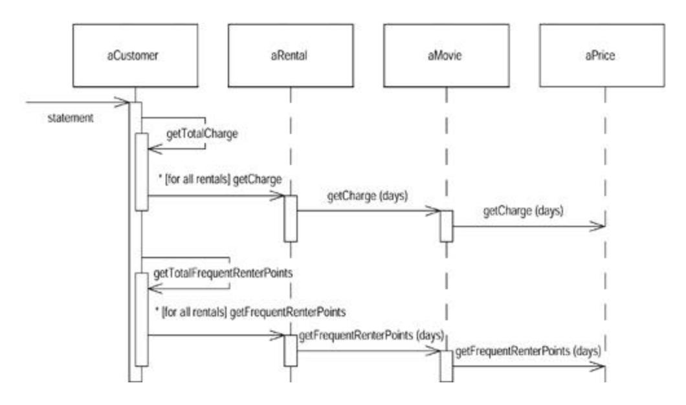

**Figure 1.17. Class diagram after addition of the state pattern**

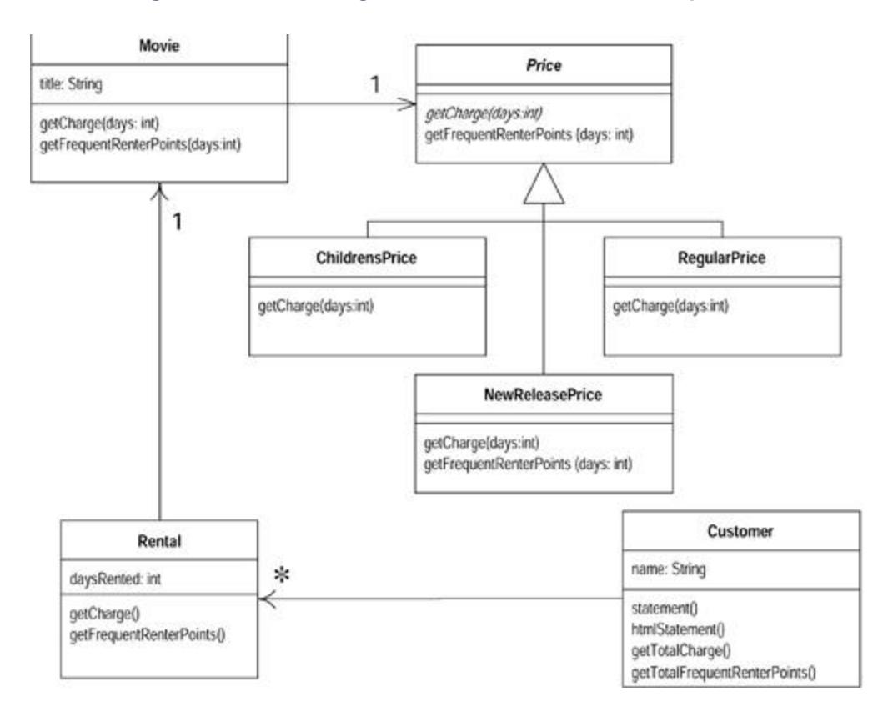

## Final Thoughts

This is a simple example, yet I hope it gives you the feeling of what refactoring is like. I've used several refactorings, including Extract Method, Move Method, and Replace Conditional with Polymorphism. All these lead to better-distributed responsibilities and code that is easier to maintain. It does look rather different from procedural style code, and that takes some getting used to. But once you are used to it, it is hard to go back to procedural programs.

The most important lesson from this example is the rhythm of refactoring: test, small change, test, small change, test, small change. It is that rhythm that allows refactoring to move quickly and safely.

If you're with me this far, you should now understand what refactoring is all about. We can now move on to some background, principles, and theory (although not too much!)
