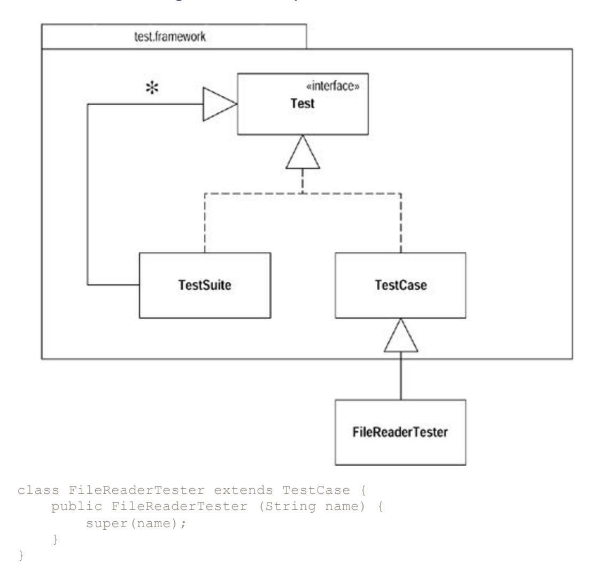
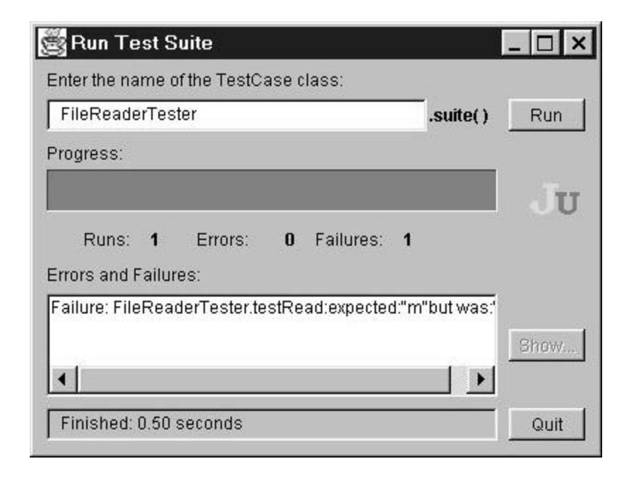

# Chapter 4: Building Tests

If you want to refactor, the essential precondition is having solid tests. Even if you are fortunate enough to have a tool that can automate the refactorings, you still need tests. It will be a long time before all possible refactorings can be automated in a refactoring tool.

I don't see this as a disadvantage. I've found that writing good tests greatly speeds my programming, even if I'm not refactoring. This was a surprise for me, and it is counterintuitive for many programmers, so it's worth explaining why.

## The Value of Self-testing Code

If you look at how most programmers spend their time, you'll find that writing code actually is quite a small fraction. Some time is spent figuring out what ought to be going on, some time is spent designing, but most time is spent debugging. I'm sure every reader can remember long hours of debugging, often long into the night. Every programmer can tell a story of a bug that took a whole day (or more) to find. Fixing the bug is usually pretty quick, but finding it is a nightmare. And then when you do fix a bug, there's always a chance that another one will appear and that you might not even notice it till much later. Then you spend ages finding that bug.

The event that started me on the road to self-testing code was a talk at OOPSLA in '92. Someone (I think it was Dave Thomas) said offhandedly, "Classes should contain their own tests." That struck me as a good way to organize tests. I interpreted that as saying that each class should have its own method (called *test*) that can be used to test itself.

At that time I was also into incremental development, so I tried adding test methods to classes as I completed each increment. The project on which I was working at that time was quite small, so we put out increments every week or so. Running the tests became fairly straightforward, but although they were easy to run, the tests were still pretty boring to do. This was because every test produced output to the console that I had to check. Now I'm a pretty lazy person and am prepared to work quite hard in order to avoid work. I realized that instead of looking at the screen to see if it printed out some information from the model, I could get the computer to make that test. All I had to do was put the output I expected in the test code and do a comparison. Now I could run each class'test method, and it would just print "OK" to the screen if all was well. The class was now self-testing.

**Tip**

*Make sure all tests are fully automatic and that they check their own results.*

Now it was easy to run a test—as easy as compiling. So I started to run tests every time I compiled. Soon I began to notice my productivity had shot upward. I realized that I wasn't spending so much time debugging. If I added a bug that was caught by a previous test, it would show up as soon as I ran that test. Because the test had worked before, I would know that the bug was in the work I had done since I last tested. Because I ran the tests frequently, only a few minutes had elapsed. I thus knew that the source of the bug was the code I had just written. Because that code was fresh in my mind and was a small amount, the bug was easy to find. Bugs that once had taken an hour or more to find now took a couple of minutes at most. Not just had I built self-testing classes, but by running them frequently I had a powerful bug detector.

As I noticed this I became more aggressive about doing the tests. Instead of waiting for the end of increment, I would add the tests immediately after writing a bit of function. Every day I would add a couple of new features and the tests to test them. These days I hardly ever spend more than a few minutes debugging.

### Tip

*A suite of tests is a powerful bug detector that decapitates the time it takes to find bugs.*

Of course, it is not so easy to persuade others to follow this route. Writing the tests is a lot of extra code to write. Unless you have actually experienced the way it speeds programming, selftesting does not seem to make sense. This is not helped by the fact that many people have never learned to write tests or even to think about tests. When tests are manual, they are gutwrenchingly boring. But when they are automatic, tests can actually be quite fun to write.

In fact, one of the most useful times to write tests is before you start programming. When you need to add a feature, begin by writing the test. This isn't as backward as it sounds. By writing the test you are asking yourself what needs to be done to add the function. Writing the test also concentrates on the interface rather than the implementation (always a good thing). It also means you have a clear point at which you are done coding—when the test works.

This notion of frequent testing is an important part of extreme programming [Beck, XP]. The name conjures up notions of programmers who are fast and loose hackers. But extreme programmers are very dedicated testers. They want to develop software as fast as possible, and they know that tests help you to go as fast as you possibly can.

That's enough of the polemic. Although I believe everyone would benefit by writing self-testing code, it is not the point of this book. This book is about refactoring. Refactoring requires tests. If you want to refactor, you have to write tests. This chapter gives you a start in doing this for Java. This is not a testing book, so I'm not going to go into much detail. But with testing I've found that a remarkably small amount can have surprisingly big benefits.

As with everything else in this book, I describe the testing approach using examples. When I develop code, I write the tests as I go. But often when I'm working with people on refactoring, we have a body of non-self-testing code to work on. So first we have to make the code self-testing before we refactor.

The standard Java idiom for testing is the testing main. The idea is that every class should have a main function that tests the class. It's a reasonable convention (although not honored much), but it can become awkward. The problem is that such a convention makes it tricky to run many tests easily. Another approach is to build separate test classes that work in a framework to make testing easier.

## The JUnit Testing Framework

The testing framework I use is JUnit, an open-source testing framework developed by Erich Gamma and Kent Beck [JUnit]. The framework is very simple, yet it allows you to do all the key things you need for testing. In this chapter I use this framework to develop tests for some io classes.

To begin I create a FileReaderTester class to test the file reader. Any class that contains tests must subclass the test-case class from the testing framework. The framework uses the composite pattern [Gang of Four] that allows you to group tests into suites (Figure 4.1) . These suites can contain the raw test-cases or other suites of test-cases. This makes it easy to build a range of large test suites and run the tests automatically.



**Figure 4.1. The composite structure of tests**

The new class has to have a constructor. After this I can start adding some test code. My first job is to set up the test fixture. A test fixture is essentially the objects that act as samples for testing. Because I'm reading a file I need to set up a test file, as follows:

| Bradman   | 99.94 | 52 | 80 | 10 | 6996 | 334  | 29 |
|-----------|-------|----|----|----|------|------|----|
| Pollock   | 60.97 | 23 | 41 | 4  | 2256 | 274  | 7  |
| Headley   | 60.83 | 22 | 40 | 4  | 2256 | 270* | 10 |
| Sutcliffe | 60.73 | 54 | 84 | 9  | 4555 | 194  | 16 |

To further use the file, I prepare the fixture. The test-case class provides two methods to manipulate the test fixture: setUp creates the objects and tearDown removes them. Both are implemented as null methods on test-case. Most of the time you don't need to do a tear down (the garbage collector can handle it), but it is wise to use it here to close the file, as follows:

```
 class FileReaderTester...
 protected void setUp() {
 try {
 _input = new FileReader("data.txt");
 } catch (FileNotFoundException e) {
 throw new RuntimeException ("unable to open test file");
 }
 }
 protected void tearDown() {
 try {
 _input.close();
 } catch (IOException e) {
 throw new RuntimeException ("error on closing test 
file");
 }
 }
```

Now that I have the test fixture in place, I can start writing tests. The first is to test the read method. To do this I read a few characters and then check that the character I read next is the right one:

```
 public void testRead() throws IOException {
 char ch = '&';
 for (int i=0; i < 4; i++)
 ch = (char) _input.read();
 assert('d' == ch);
 }
```

The automatic test is the assert method. If the value inside the assert is true, all is well. Otherwise we signal an error. I show how the framework does that later. First I describe how to run the test.

The first step is to create a test suite. To do this, create a method called *suite:*

```
 class FileReaderTester...
 public static Test suite() {
 TestSuite suite= new TestSuite();
 suite.addTest(new FileReaderTester("testRead"));
 return suite;
 }
```

This test suite contains only one test-case object, an instance of FileReaderTester. When I create a test case, I give the constructor a string argument, which is the name of the method I'm going to test. This creates one object that tests that one method. The test is bound to the object through Java's reflection capability. You can take a look at the downloaded source code to figure out how it does it. I just treat it as magic.

To run the tests, use a separate TestRunner class. There are two versions of TestRunner: one uses a cool GUI, the other a simple character interface. I can call the character interface version in the main:

```
 class FileReaderTester...
 public static void main (String[] args) {
 junit.textui.TestRunner.run (suite());
 }
```

The code creates the test runner and tells it to test the FileReaderTester class. When I run it I see

```
 .
 Time: 0.110
 OK (1 tests)
```

JUnit prints a period for each test that runs (so you can see progress). It tells you how long the tests have run. It then says "OK" if nothing goes wrong and tells you how many tests have been run. I can run a thousand tests, and if all goes well, I'll see that OK. This simple feedback is essential to self-testing code. Without it you'll never run the tests often enough. With it you can run masses of tests, go off for lunch (or a meeting), and see the results when you get back.

### Tip

*Run your tests frequently. Localize tests whenever you compile—every test at least every day.*

In refactoring you run only a few tests to exercise the code on which you are working. You can run only a few because they must be fast: otherwise they'll slow you down and you'll be tempted not to run them. Don't give in to that temptation—retribution *will* follow.

What happens if something goes wrong? I'll demonstrate by putting in a deliberate bug, as follows:

```
 public void testRead() throws IOException {
 char ch = '&';
 for (int i=0; i < 4; i++)
 ch = (char) _input.read();
 assert('2' == ch); //deliberate error
 }
```

The result looks like this:

```
 .F
 Time: 0.220
 !!!FAILURES!!!
```

```
 Test Results:
 Run: 1 Failures: 1 Errors: 0
 There was 1 failure:
 1) FileReaderTester.testRead
 test.framework.AssertionFailedError
```

The framework alerts me to the failure and tells me which test failed. The error message isn't particularly helpful, though. I can make the error message better by using another form of assert.

```
 public void testRead() throws IOException {
 char ch = '&';
 for (int i=0; i < 4; i++)
 ch = (char) _input.read();
 assertEquals('m',ch);
 }
```

Most of the asserts you do are comparing two values to see whether they are equal. So the framework includes assertEquals. This is convenient; it uses equals() on objects and == on values, which I often forget to do. It also allows a more meaningful error message:

```
 .F
 Time: 0.170
 !!!FAILURES!!!
 Test Results:
 Run: 1 Failures: 1 Errors: 0
 There was 1 failure:
 1) FileReaderTester.testRead "expected:"m"but was:"d""
```

I should mention that often when I'm writing tests, I start by making them fail. With existing code I either change it to make it fail (if I can touch the code) or put an incorrect expected value in the assert. I do this because I like to prove to myself that the test does actually run and the test is actually testing what it's supposed to (which is why I prefer changing the tested code if I can). This may be paranoia, but you can really confuse yourself when tests are testing something other than what you think they are testing.

In addition to catching failures (assertions coming out false), the framework also catches errors (unexpected exceptions). If I close the stream and then try to read from it, I should get an exception. I can test this with

```
 public void testRead() throws IOException {
 char ch = '&';
 _input.close();
 for (int i=0; i < 4; i++)
 ch = (char) _input.read(); // will throw exception
 assertEquals('m',ch);
 }
```

If I run this I get

```
 .E
 Time: 0.110
 !!!FAILURES!!!
 Test Results:
 Run: 1 Failures: 0 Errors: 1
 There was 1 error:
 1) FileReaderTester.testRead
 java.io.IOException: Stream closed
```

It is useful to differentiate failures and errors, because they tend to turn up differently and the debugging process is different.

JUnit also includes a nice GUI (Figure 4.2). The progress bar shows green if all tests pass and red if there are any failures. You can leave the GUI up all the time, and the environment automatically links in any changes to your code. This is a very convenient way to run the tests.



**Figure 4.2. The graphical use r interface of JUnit**

### Unit and Functional Tests

This framework is used for unit tests, so I should mention the difference between unit tests and functional tests. The tests I'm talking about are *unit tests.* I write them to improve my productivity as a programmer. Making the quality assurance department happy is just a side effect. Unit tests are highly localized. Each test class works within a single package. It tests the interfaces to other packages, but beyond that it assumes the rest just works.

*Functional tests* are a different animal. They are written to ensure the software as a whole works. They provide quality assurance to the customer and don't care about programmer productivity. They should be developed by a different team, one who delights in finding bugs. This team uses heavyweight tools and techniques to help them do this.

Functional tests typically treat the whole system as a black box as much as possible. In a GUIbased system, they operate through the GUI. In a file or database update program, the tests just look at how the data is changed for certain inputs.

When functional testers, or users, find a bug in the software, at least two things are needed to fix it. Of course you have to change the production code to remove the bug. But you should also add a unit test that exposes the bug. Indeed, when I get a bug report, I begin by writing a unit test that causes the bug to surface. I write more than one test if I need to narrow the scope of the bug, or if there may be related failures. I use the unit tests to help pin down the bug and to ensure that a similar bug doesn't get past my unit tests again.

#### Tip

*When you get a bug report, start by writing a unit test that exposes the bug.*

The JUnit framework is designed for writing unit tests. Functional tests often are performed with other tools. GUI-based test tools are good examples. Often, however, you'll write your own application-specific test tools that make it easier to manage test-cases than do GUI scripts alone. You can perform functional tests with JUnit, but it's usually not the most efficient way. For refactoring purposes, I count on the unit tests—the programmer's friend.

### Adding More Tests

Now we should continue adding more tests. The style I follow is to look at all the things the class should do and test each one of them for any conditions that might cause the class to fail. This is not the same as "test every public method," which some programmers advocate. Testing should be risk driven; remember, you are trying to find bugs now or in the future. So I don't test accessors that just read and write a field. Because they are so simple, I'm not likely to find a bug there.

This is important because trying to write too many tests usually leads to not writing enough. I've often read books on testing, and my reaction has been to shy away from the mountain of stuff I have to do to test. This is counterproductive, because it makes you think that to test you have to do a lot of work. You get many benefits from testing even if you do only a little testing. The key is to test the areas that you are most worried about going wrong. That way you get the most benefit for your testing effort.

#### Tip

*It is better to write and run incomplete tests than not to run complete tests.*

At the moment I'm looking at the read method. What else should it do? One thing it says is that it returns -1 at the end of the file (not a very nice protocol in my view, but I guess that makes it more natural for C programmers). Let's test it. My text editor tells me there are 141 characters in the file, so here's the test:

```
 public void testReadAtEnd() throws IOException {
 int ch = -1234;
 for (int i = 0; i < 141; i++)
 ch = _input.read();
 assertEquals(-1, ch);
 }
```

To get the test to run, I have to add it to the suite:

```
 public static Test suite() {
 TestSuite suite= new TestSuite();
 suite.addTest(new FileReaderTester("testRead"));
 suite.addTest(new FileReaderTester("testReadAtEnd"));
 return suite;
 }
```

When this suite is run, it tells each of its component tests (the two test-cases) to run. Each testcase executes setUp, the body of the test code in the testing method, and finally tearDown. It is important to run setUp and tearDown each time so that the tests are isolated from each other. That means we can run them in any order and it doesn't matter.

It's a pain to remember to add the tests to the suite method. Fortunately, Erich Gamma and Kent Beck are just as lazy as I am, so they provided a way to avoid that. A special constructor for the test suite takes a class as a parameter.

This constructor builds a test suite that contains a test-case for every method that starts with the word *test.* If I follow that convention, I can replace my main with

```
 public static void main (String[] args) {
 junit.textui.TestRunner.run (new TestSuite(FileReaderTester.class));
 }
```

That way each test I write is added to the suite.

A key trick with tests is to look for boundary conditions. For the read the boundaries would be the first character, the last character, and the character after the last character:

```
 public void testReadBoundaries()throwsIOException {
 assertEquals("read first char",'B', _input.read());
 int ch;
 for (int i = 1;i <140; i++)
 ch = _input.read();
 assertEquals("read last char",'6',_input.read());
 assertEquals("read at end",-1,_input.read());
 }
```

Notice that you can add a message to the assert that is printed if the test fails.

**Tip**

*Think of the boundary conditions under which things might go wrong and concentrate your tests there.*

Another part of looking for boundaries is looking for special conditions that can cause the test to fail. For files, empty files are always a good choice:

```
 public void testEmptyRead()throws IOException {
 File empty = new File ("empty.txt");
 FileOutputStream out = new FileOutputStream (empty);
 out.close();
 FileReader in = new FileReader (empty);
 assertEquals (-1, in.read());
 }
```

In this case I'm creating a bit of extra fixture just for this test. If I need an empty file for later, I can move it into regular fixture by moving the code to setup.

```
 protected void setUp(){
 try {
 _input = new FileReader("data.txt");
 _empty = newEmptyFile();
 } catch(IOException e){
 throw new RuntimeException(e.toString());
 }
 }
 private FileReader newEmptyFile() throws IOException {
 File empty = new File ("empty.txt");
 FileOutputStream out = new FileOutputStream(empty);
 out.close();
 return newFileReader(empty);
 }
 public void testEmptyRead() throws IOException {
 assertEquals (-1, _empty.read());
 }
```

What happens if you read after the end of the file? Again -1 should be returned, and I augment one of the other tests to probe that:

```
 public void testReadBoundaries()throwsIOException {
 assertEquals("read first char",'B', _input.read());
 int ch;
 for (int i = 1;i <140; i++)
 ch = _input.read();
 assertEquals("read last char", '6', _input.read());
 assertEquals("read at end",-1,_input.read());
 assertEquals ("readpast end", -1, _input.read());
```

}

Notice how I'm playing the part of an enemy to code. I'm actively thinking about how I can break it. I find that state of mind to be both productive and fun. It indulges the mean-spirited part of my psyche.

When you are doing tests, don't forget to check that expected errors occur properly. If you try to read a stream after it is closed, you should get an IOException. This too should be tested:

```
 public void testReadAfterClose() throwsIOException{
 _input.close();
 try {
 _input.read();
 fail ("no exception for read past end");
 } catch (IOException io) {}
}
```

Any other exception than the IOException will produce an error in the normal way.

**Tip**

*Don't forget to test that exceptions are raised when things are expected to go wrong.*

Fleshing out the tests continues along these lines. It takes a while to go through the interface to some classes to do this, but in the process you get to really understand the interface of the class. In particular, it helps to think about error conditions and boundary conditions. That's another advantage for writing tests as you write code, or even before you write the production code.

As you add more tester classes, you can create other tester classes that combine suites from multiple classes. This is easy to do because a test suite can contain other test suites. Thus you can have a master test class:

```
 class MasterTester extends TestCase {
 public static void main (String[] args) {
 junit.textui.TestRunner.run (suite());
 }
 public static Test suite() {
 TestSuite result = new TestSuite();
 result.addTest(new TestSuite(FileReaderTester.class));
 result.addTest(new TestSuite(FileWriterTester.class));
 // and so on...
 return result;
 }
 }
```

When do you stop? I'm sure you have heard many times that you cannot prove a program has no bugs by testing. That's true but does not affect the ability of testing to speed up programming. I've seen various proposals for rules to ensure you have tested every combination of everything. It's worth taking a look at these, but don't let them get to you. There is a point of diminishing returns with testing, and there is the danger that by trying to write too many tests, you become discouraged and end up not writing any. You should concentrate on where the risk is. Look at the code and see where it beomes complex. Look at the function and consider the likely areas of error. Your tests will not find every bug, but as you refactor you will understand the program better and thus find more bugs. Although I always start refactoring with a test suite, I invariably add to it as I go along.

#### Tip

*Don't let the fear that testing can't catch all bugs stop you from writing the tests that will catch most bugs.*

One of the tricky things about objects is that the inheritance and polymorphism can make testing harder, because there are many combinations to test. If you have three abstract classes that collaborate and each has three subclasses, you have nine alternatives but twenty-seven combinations. I don't always try to test all the combinations possible, but I do try to test each alternative. It boils down to the risk in the combinations. If the alternatives are reasonably independent of each other, I'm not likely to try each combination. There's always a risk that I'll miss something, but it is better to spend a reasonable time to catch most bugs than to spend ages trying to catch them all.

A difference between test code and production code is that it is okay to copy and edit test code. When dealing with combinations and alternatives, I often do that. First take "regular pay event," now take "seniority" and "disabled before the end of the year." Now do it without "seniority" and "disabled before the end of the year," and so on. With simple alternatives like that on top of a reasonable fixture, I can generate tests very quickly. I then can use refactoring to factor out truly common items later.

I hope I have given you a feel for writing tests. I can say a lot more on this topic, but that would obscure the key message. Build a good bug detector and run it frequently. It is a wonderful tool for any development and is a precondition for refactoring.
