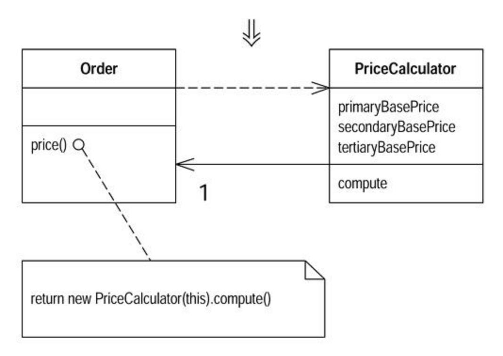

# Chapter 6: Composing Methods

A large part of my refactoring is composing methods to package code properly. Almost all the time the problems come from methods that are too long. Long methods are troublesome because they often contain lots of information, which gets buried by the complex logic that usually gets dragged in. The key refactoring is Extract Method, which takes a clump of code and turns it into its own method. Inline Method is essentially the opposite. You take a method call and replace it with the body of the code. I need Inline Method when I've done multiple extractions and realize some of the resulting methods are no longer pulling their weight or if I need to reorganize the way I've broken down methods.

The biggest problem with Extract Method is dealing with local variables, and temps are one of the main sources of this issue. When I'm working on a method, I like Replace Temp with Queryto get rid of any temporary variables that I can remove. If the temp is used for many things, I use Split Temporary Variable first to make the temp easier to replace.

Sometimes, however, the temporary variables are just too tangled to replace. I need Replace Method with Method Object. This allows me to break up even the most tangled method, at the cost of introducing a new class for the job.

Parameters are less of a problem than temps, provided you don't assign to them. If you do, you need Remove Assignments to Parameters.

Once the method is broken down, I can understand how it works much better. I may also find that the algorithm can be improved to make it clearer. I then use Substitute Algorithm to introduce the clearer algorithm.

## Extract Method

You have a code fragment that can be grouped together.

*Turn the fragment into a method whose name explains the purpose of the method.*

```
 void printOwing(double amount) {
 printBanner();
 //print details
 System.out.println ("name:" + _name);
 System.out.println ("amount" + amount);
 }
 void printOwing(double amount) {
 printBanner();
 printDetails(amount);
 }
 void printDetails (double amount) {
```

```
 System.out.println ("name:" + _name);
 System.out.println ("amount" + amount);
 }
```

### Motivation

Extract Method is one of the most common refactorings I do. I look at a method that is too long or look at code that needs a comment to understand its purpose. I then turn that fragment of code into its own method.

I prefer short, well-named methods for several reasons. First, it increases the chances that other methods can use a method when the method is finely grained. Second, it allows the higher-level methods to read more like a series of comments. Overriding also is easier when the methods are finely grained.

It does take a little getting used to if you are used to seeing larger methods. And small methods really work only when you have good names, so you need to pay attention to naming. People sometimes ask me what length I look for in a method. To me length is not the issue. The key is the semantic distance between the method name and the method body. If extracting improves clarity, do it, even if the name is longer than the code you have extracted.

### Mechanics

· Create a new method, and name it after the intention of the method (name it by what it does, not by how it does it).

> ? *If the code you want to extract is very simple, such as a single message or function call, you should extract it if the name of the new method will reveal the intention of the code in a better way. If you can't come up with a more meaningful name, don't extract the code.*

- · Copy the extracted code from the source method into the new target method.
- · Scan the extracted code for references to any variables that are local in scope to the source method. These are local variables and parameters to the method.
- · See whether any temporary variables are used only within this extracted code. If so, declare them in the target method as temporary variables.
- · Look to see whether any of these local-scope variables are modified by the extracted code. If one variable is modified, see whether you can treat the extracted code as a query and assign the result to the variable concerned. If this is awkward, or if there is more than one such variable, you can't extract the method as it stands. You may need to use Split Temporary Variable and try again. You can eliminate temporary variables with Replace Temp with Query (see the discussion in the examples).
- · Pass into the target method as parameters local-scope variables that are read from the extracted code.
- · Compile when you have dealt with all the locally-scoped variables.
- · Replace the extracted code in the source method with a call to the target method.

? *If you have moved any temporary variables over to the target method, look to see whether they were declared outside of the extracted code. If so, you can now remove the declaration.*

· Compile and test.

### Example: No Local Variables

In the simplest case, Extract Method is trivially easy. Take the following method:

```
 void printOwing() {
 Enumeration e = _orders.elements();
 double outstanding = 0.0;
 // print banner
 System.out.println ("**************************");
 System.out.println ("***** Customer Owes ******");
 System.out.println ("**************************");
 // calculate outstanding
 while (e.hasMoreElements()) {
 Order each = (Order) e.nextElement();
 outstanding += each.getAmount();
 }
 //print details
 System.out.println ("name:" + _name);
 System.out.println ("amount" + outstanding);
 }
```

It is easy to extract the code that prints the banner. I just cut, paste, and put in a call:

```
 void printOwing() {
 Enumeration e = _orders.elements();
 double outstanding = 0.0;
 printBanner();
 // calculate outstanding
 while (e.hasMoreElements()) {
 Order each = (Order) e.nextElement();
 outstanding += each.getAmount();
 }
 //print details
 System.out.println ("name:" + _name);
 System.out.println ("amount" + outstanding);
 }
 void printBanner() {
 // print banner
 System.out.println ("**************************");
 System.out.println ("***** Customer Owes ******");
```

```
 System.out.println ("**************************");
 }
```

### Example: Using Local Variables

So what's the problem? The problem is local variables: parameters passed into the original method and temporaries declared within the original method. Local variables are only in scope in that method, so when I use Extract Method, these variables cause me extra work. In some cases they even prevent me from doing the refactoring at all.

The easiest case with local variables is when the variables are read but not changed. In this case I can just pass them in as a parameter. So if I have the following method:

```
 void printOwing() {
 Enumeration e = _orders.elements();
 double outstanding = 0.0;
 printBanner();
 // calculate outstanding
 while (e.hasMoreElements()) {
 Order each = (Order) e.nextElement();
 outstanding += each.getAmount();
 }
 //print details
 System.out.println ("name:" + _name);
 System.out.println ("amount" + outstanding);
 }
```

I can extract the printing of details with a method with one parameter:

```
 void printOwing() {
 Enumeration e = _orders.elements();
 double outstanding = 0.0;
 printBanner();
 // calculate outstanding
 while (e.hasMoreElements()) {
 Order each = (Order) e.nextElement();
 outstanding += each.getAmount();
 }
 printDetails(outstanding);
 }
```

```
 void printDetails (double outstanding) {
 System.out.println ("name:" + _name);
 System.out.println ("amount" + outstanding);
 }
```

You can use this with as many local variables as you need.

The same is true if the local variable is an object and you invoke a modifying method on the variable. Again you can just pass the object in as a parameter. You only have to do something different if you actually assign to the local variable.

### Example: Reassigning a Local Variable

It's the assignment to local variables that becomes complicated. In this case we're only talking about temps. If you see an assignment to a parameter, you should immediately use Remove Assignments to Parameters.

For temps that are assigned to, there are two cases. The simpler case is that in which the variable is a temporary variable used only within the extracted code. When that happens, you can move the temp into the extracted code. The other case is use of the variable outside the code. If the variable is not used after the code is extracted, you can make the change in just the extracted code. If it is used afterward, you need to make the extracted code return the changed value of the variable. I can illustrate this with the following method:

```
 void printOwing() {
 Enumeration e = _orders.elements();
 double outstanding = 0.0;
 printBanner();
 // calculate outstanding
 while (e.hasMoreElements()) {
 Order each = (Order) e.nextElement();
 outstanding += each.getAmount();
 }
 printDetails(outstanding);
 }
```

#### Now I extract the calculation:

```
 void printOwing() {
 printBanner();
 double outstanding = getOutstanding();
 printDetails(outstanding);
 }
```

```
 double getOutstanding() {
 Enumeration e = _orders.elements();
 double outstanding = 0.0;
 while (e.hasMoreElements()) {
 Order each = (Order) e.nextElement();
 outstanding += each.getAmount();
 }
 return outstanding;
 }
```

The enumeration variable is used only in the extracted code, so I can move it entirely within the new method. The oustanding variable is used in both places, so I need to rerun it from the extracted method. Once I've compiled and tested for the extraction, I rename the returned value to follow my usual convention:

```
 double getOutstanding() {
 Enumeration e = _orders.elements();
 double result = 0.0;
 while (e.hasMoreElements()) {
 Order each = (Order) e.nextElement();
 result = each.getAmount();
 }
 return result;
 }
```

In this case the outstanding variable is initialized only to an obvious initial value, so I can initialize it only within the extracted method. If something more involved happens to the variable, I have to pass in the previous value as a parameter. The initial code for this variation might look like this:

```
 void printOwing(double previousAmount) {
 Enumeration e = _orders.elements();
 double outstanding = previousAmount * 1.2;
 printBanner();
 // calculate outstanding
 while (e.hasMoreElements()) {
 Order each = (Order) e.nextElement();
 outstanding += each.getAmount();
 }
 printDetails(outstanding);
 }
```

In this case the extraction would look like this:

```
 void printOwing(double previousAmount) {
 double outstanding = previousAmount * 1.2;
 printBanner();
 outstanding = getOutstanding(outstanding);
 printDetails(outstanding);
 }
 double getOutstanding(double initialValue) {
 double result = initialValue;
 Enumeration e = _orders.elements();
 while (e.hasMoreElements()) {
 Order each = (Order) e.nextElement();
 result += each.getAmount();
 }
 return result;
 }
```

After I compile and test this, I clear up the way the outstanding variable is initialized:

```
 void printOwing(double previousAmount) {
 printBanner();
 double outstanding = getOutstanding(previousAmount * 1.2);
 printDetails(outstanding);
 }
```

At this point you may be wondering, "What happens if more than one variable needs to be returned?"

Here you have several options. The best option usually is to pick different code to extract. I prefer a method to return one value, so I would try to arrange for multiple methods for the different values. (If your language allows output parameters, you can use those. I prefer to use single return values as much as possible.)

Temporary variables often are so plentiful that they make extraction very awkward. In these cases I try to reduce the temps by using Replace Temp with Query. If whatever I do things are still awkward, I resort to Replace Method with Method Object. This refactoring doesn't care how many temporaries you have or what you do with them.

### Inline Method

A method's body is just as clear as its name.

*Put the method's body into the body of its callers and remove the method.*

```
 int getRating() {
 return (moreThanFiveLateDeliveries()) ? 2 : 1;
 }
```

```
 boolean moreThanFiveLateDeliveries() {
 return _numberOfLateDeliveries > 5;
 }
 int getRating() {
 return (_numberOfLateDeliveries > 5) ? 2 : 1;
 }
```

### Motivation

A theme of this book is to use short methods named to show their intention, because these methods lead to clearer and easier to read code. But sometimes you do come across a method in which the body is as clear as the name. Or you refactor the body of the code into something that is just as clear as the name. When this happens, you should then get rid of the method. Indirection can be helpful, but needless indirection is irritating.

Another time to use Inline Method is when you have a group of methods that seem badly factored. You can inline them all into one big method and then reextract the methods. Kent Beck finds it is often good to do this before using Replace Method with Method Object. You inline the various calls made by the method that have behavior you want to have in the method object. It's easier to move one method than to move the method and its called methods.

I commonly use Inline Method when someone is using too much indirection and it seems that every method does simple delegation to another method, and I get lost in all the delegation. In these cases some of the indirection is worthwhile, but not all of it. By trying to inline I can flush out the useful ones and eliminate the rest.

## Mechanics

- · Check that the method is not polymorphic.
  - ? *Don't inline if subclasses override the method; they cannot override a method that isn't there.*
- · Find all calls to the method.
- · Replace each call with the method body.
- · Compile and test.
- · Remove the method definition.

Written this way, Inline Method is simple. In general it isn't. I could write pages on how to handle recursion, multiple return points, inlining into another object when you don't have accessors, and the like. The reason I don't is that if you encounter these complexities, you shouldn't do this refactoring.

## Inline Temp

You have a temp that is assigned to once with a simple expression, and the temp is getting in the way of other refactorings.

*Replace all references to that temp with the expression.*

```
 double basePrice = anOrder.basePrice();
 return (basePrice > 1000)
 return (anOrder.basePrice() > 1000)
```

### Motivation

Most of the time *Inline Temp* is used as part of Replace Temp with Query, so the real motivation is there. The only time *Inline Temp* is used on its own is when you find a temp that is assigned the value of a method call. Often this temp isn't doing any harm and you can safely leave it there. If the temp is getting in the way of other refactorings, such as Extract Method, it's time to inline it.

### Mechanics

- · Declare the temp as final if it isn't already, and compile.
  - ? *This checks that the temp is really only assigned to once.*
- · Find all references to the temp and replace them with the right-hand side of the assignment.
- · Compile and test after each change.
- · Remove the declaration and the assignment of the temp.
- · Compile and test.

## Replace Temp with Query

You are using a temporary variable to hold the result of an expression.

*Extract the expression into a method. Replace all references to the temp with the expression. The new method can then be used in other methods.*

```
 double basePrice = _quantity * _itemPrice;
 if (basePrice > 1000)
 return basePrice * 0.95;
 else
 return basePrice * 0.98;
```


```
 if (basePrice() > 1000)
 return basePrice() * 0.95;
 else
 return basePrice() * 0.98;
...
 double basePrice() {
 return _quantity * _itemPrice;
 }
```

### Motivation

The problem with temps is that they are temporary and local. Because they can be seen only in the context of the method in which they are used, temps tend to encourage longer methods, because that's the only way you can reach the temp. By replacing the temp with a query method, any method in the class can get at the information. That helps a lot in coming up with cleaner code for the class.

*Replace Temp with Query* often is a vital step before Extract Method. Local variables make it difficult to extract, so replace as many variables as you can with queries.

The straightforward cases of this refactoring are those in which temps are assigned only to once and those in which the expression that generates the assignment is free of side effects. Other cases are trickier but possible. You may need to use Split Temporary Variable or Separate Query from Modifier first to make things easier. If the temp is used to collect a result (such as summing over a loop), you need to copy some logic into the query method.

### Mechanics

Here is the simple case:

- · Look for a temporary variable that is assigned to once.
  - ? *If a temp is set more than once consider* Split Temporary Variable.
- · Declare the temp as final.
- · Compile.
  - ? *This will ensure that the temp is only assigned to once.*
- · Extract the right-hand side of the assignment into a method.
  - ? *Initially mark the method as private. You may find more use for it later, but you can easily relax the protection later.*
  - ? *Ensure the extracted method is free of side effects, that is, it does not modify any object. If it is not free of side effects, use* Separate Query from Modifier.

- · Compile and test.
- · Use Replace Temp with Query on the temp.

Temps often are used to store summary information in loops. The entire loop can be extracted into a method; this removes several lines of noisy code. Sometimes a loop may be used to sum up multiple values, as in the example on page 26. In this case, duplicate the loop for each temp so that you can replace each temp with a query. The loop should be very simple, so there is little danger in duplicating the code.

You may be concerned about performance in this case. As with other performance issues, let it slide for the moment. Nine times out of ten, it won't matter. When it does matter, you will fix the problem during optimization. With your code better factored, you will often find more powerful optimizations, which you would have missed without refactoring. If worse comes to worse, it's very easy to put the temp back.

### Example

I start with a simple method:

```
 double getPrice() {
 int basePrice = _quantity * _itemPrice;
 double discountFactor;
 if (basePrice > 1000) discountFactor = 0.95;
 else discountFactor = 0.98;
 return basePrice * discountFactor;
 }
```

I'm inclined to replace both temps, one at a time.

Although it's pretty clear in this case, I can test that they are assigned only to once by declaring them as final:

```
 double getPrice() {
 final int basePrice = _quantity * _itemPrice;
 final double discountFactor;
 if (basePrice > 1000) discountFactor = 0.95;
 else discountFactor = 0.98;
 return basePrice * discountFactor;
 }
```

Compiling will then alert me to any problems. I do this first, because if there is a problem, I shouldn't be doing this refactoring. I replace the temps one at a time. First I extract the right-hand side of the assignment:

```
 double getPrice() {
 final int basePrice = basePrice();
 final double discountFactor;
```

```
 if (basePrice > 1000) discountFactor = 0.95;
 else discountFactor = 0.98;
 return basePrice * discountFactor;
 }
 private int basePrice() {
 return _quantity * _itemPrice;
 }
```

I compile and test, then I begin with Replace Temp with Query. First I replace the first reference to the temp:

```
 double getPrice() {
 final int basePrice = basePrice();
 final double discountFactor;
 if (basePrice() > 1000) discountFactor = 0.95;
 else discountFactor = 0.98;
 return basePrice * discountFactor;
 }
```

Compile and test and do the next (sounds like a caller at a line dance). Because it's the last, I also remove the temp declaration:

```
 double getPrice() {
 final double discountFactor;
 if (basePrice() > 1000) discountFactor = 0.95;
 else discountFactor = 0.98;
 return basePrice() * discountFactor;
 }
```

With that gone I can extract discountFactor in a similar way:

```
 double getPrice() {
 final double discountFactor = discountFactor();
 return basePrice() * discountFactor;
 }
 private double discountFactor() {
 if (basePrice() > 1000) return 0.95;
 else return 0.98;
 }
```

See how it would have been difficult to extract discountFactor if I had not replaced basePrice with a query.

The getPrice method ends up as follows:

```
 double getPrice() {
 return basePrice() * discountFactor();
 }
```

## Introduce Explaining Variable

You have a complicated expression.

*Put the result of the expression, or parts of the expression, in a temporary variable with a name* that explains the purpose.

```
 if ( (platform.toUpperCase().indexOf("MAC") > -1) &&
 (browser.toUpperCase().indexOf("IE") > -1) &&
 wasInitialized() && resize > 0 )
{
 // do something
}
```

```
 final boolean isMacOs = platform.toUpperCase().indexOf("MAC") > 
-1;
 final boolean isIEBrowser = browser.toUpperCase().indexOf("IE") > 
-1;
 final boolean wasResized = resize > 0;
 if (isMacOs && isIEBrowser && wasInitialized() && wasResized) {
```

### Motivation

}

// do something

Expressions can become very complex and hard to read. In such situations temporary variables can be helpful to break down the expression into something more manageable.

*Introduce Explaining Variable* is particularly valuable with conditional logic in which it is useful to take each clause of a condition and explain what the condition means with a well-named temp. Another case is a long algorithm, in which each step in the computation can be explained with a temp.

*Introduce Explaining Variable* is a very common refactoring, but I confess I don't use it that much. I almost always prefer to use Extract Method if I can. A temp is useful only within the context of one method. A method is useable throughout the object and to other objects. There are times,

however, when local variables make it difficult to use Extract Method. That's when I use Introduce Explaining Variable.

### Mechanics

- · Declare a final temporary variable, and set it to the result of part of the complex expression.
- · Replace the result part of the expression with the value of the temp.

? *If the result part of the expression is repeated, you can replace the repeats one at a time.*

- · Compile and test.
- · Repeat for other parts of the expression.

### Example

I start with a simple calculation:

```
 double price() {
 // price is base price - quantity discount + shipping
 return _quantity * _itemPrice -
 Math.max(0, _quantity - 500) * _itemPrice * 0.05 +
 Math.min(_quantity * _itemPrice * 0.1, 100.0);
 }
```

Simple it may be, but I can make it easier to follow. First I identify the base price as the quantity times the item price. I can turn that part of the calculation into a temp:

```
 double price() {
 // price is base price - quantity discount + shipping
 final double basePrice = _quantity * _itemPrice;
 return basePrice -
 Math.max(0, _quantity - 500) * _itemPrice * 0.05 +
 Math.min(_quantity * _itemPrice * 0.1, 100.0);
 }
```

Quantity times item price is also used later, so I can substitute with the temp there as well:

```
 double price() {
 // price is base price - quantity discount + shipping
 final double basePrice = _quantity * _itemPrice;
 return basePrice -
 Math.max(0, _quantity - 500) * _itemPrice * 0.05 +
 Math.min(basePrice * 0.1, 100.0);
 }
```

Next I take the quantity discount:

```
 double price() {
 // price is base price - quantity discount + shipping
 final double basePrice = _quantity * _itemPrice;
 final double quantityDiscount = Math.max(0, _quantity - 500) * 
_itemPrice * 0.05;
 return basePrice - quantityDiscount +
 Math.min(basePrice * 0.1, 100.0);
 }
```

Finally, I finish with the shipping. As I do that, I can remove the comment, too, because now it doesn't say anything the code doesn't say:

```
 double price() {
 final double basePrice = _quantity * _itemPrice;
 final double quantityDiscount = Math.max(0, _quantity - 500) * 
_itemPrice * 0.05;
 final double shipping = Math.min(basePrice * 0.1, 100.0);
 return basePrice - quantityDiscount + shipping;
 }
```

### Example with Extract Method

For this example I usually wouldn't have done the explaining temps; I would prefer to do that with Extract Method. I start again with

```
 double price() {
 // price is base price - quantity discount + shipping
 return _quantity * _itemPrice -
 Math.max(0, _quantity - 500) * _itemPrice * 0.05 +
 Math.min(_quantity * _itemPrice * 0.1, 100.0);
 }
```

but this time I extract a method for the base price:

```
 double price() {
 // price is base price - quantity discount + shipping
 return basePrice() -
 Math.max(0, _quantity - 500) * _itemPrice * 0.05 +
 Math.min(basePrice() * 0.1, 100.0);
```

```
 }
 private double basePrice() {
 return _quantity * _itemPrice;
 }
```

I continue one at a time. When I'm finished I get

```
 double price() {
 return basePrice() - quantityDiscount() + shipping();
 }
 private double quantityDiscount() {
 return Math.max(0, _quantity - 500) * _itemPrice * 0.05;
 }
 private double shipping() {
 return Math.min(basePrice() * 0.1, 100.0);
 }
 private double basePrice() {
 return _quantity * _itemPrice;
 }
```

I prefer to use Extract Method, because now these methods are available to any other part of the object that needs them. Initially I make them private, but I can always relax that if another object needs them. I find it's usually no more effort to use Extract Method than it is to use Introduce Explaining Variable.

So when do I use Introduce Explaining Variable? The answer is when Extract Method is more effort. If I'm in an algorithm with a lot of local variables, I may not be able to easily use Extract Method. In this case I use Introduce Explaining Variable to help me understand what is going on. As the logic becomes less tangled, I can always use Replace Temp with Query later. The temp also is valuable if I end up having to use Replace Method with Method Object.

## Split Temporary Variable

You have a temporary variable assigned to more than once, but is not a loop variable nor a collecting temporary variable.

*Make a separate temporary variable for each assignment.*

```
 double temp = 2 * (_height + _width);
 System.out.println (temp);
 temp = _height * _width;
 System.out.println (temp);
```


```
 final double perimeter = 2 * (_height + _width);
 System.out.println (perimeter);
 final double area = _height * _width;
 System.out.println (area);
```

### Motivation

Temporary variables are made for various uses. Some of these uses naturally lead to the temp's being assigned to several times. Loop variables [Beck] change for each run around a loop (such as the i in for (int i=0; i<10; i++). Collecting temporary variables [Beck] collect together some value that is built up during the method.

Many other temporaries are used to hold the result of a long-winded bit of code for easy reference later. These kinds of variables should be set only once. That they are set more than once is a sign that they have more than one responsibility within the method. Any variable with more than one responsibility should be replaced with a temp for each responsibility. Using a temp for two different things is very confusing for the reader.

### Mechanics

· Change the name of a temp at its declaration and its first assignment.

? *If the later assignments are of the form i = i + some expression, that indicates that it is a collecting temporary variable, so don't split it. The operator for a collecting temporary variable usually is addition, string concatenation, writing to a stream, or adding to a collection.*

- · Declare the new temp as final.
- · Change all references of the temp up to its second assignment.
- · Declare the temp at its second assignment.
- · Compile and test.
- · Repeat in stages, each stage renaming at the declaration, and changing references until the next assignment.

### Example

For this example I compute the distance traveled by a haggis. From a standing start, a haggis experiences an initial force. After a delayed period a secondary force kicks in to further accelerate the haggis. Using the common laws of motion, I can compute the distance traveled as follows:

```
 double getDistanceTravelled (int time) {
 double result;
 double acc = _primaryForce / _mass;
 int primaryTime = Math.min(time, _delay);
 result = 0.5 * acc * primaryTime * primaryTime;
 int secondaryTime = time - _delay;
```

```
 if (secondaryTime > 0) {
 double primaryVel = acc * _delay;
 acc = (_primaryForce + _secondaryForce) / _mass;
 result += primaryVel * secondaryTime + 0.5 * acc * 
secondaryTime * secondaryTime;
 }
 return result;
 }
```

A nice awkward little function. The interesting thing for our example is the way the variable acc is set twice. It has two responsibilities: one to hold the initial acceleration caused by the first force and another later to hold the acceleration with both forces. This I want to split.

I start at the beginning by changing the name of the temp and declaring the new name as final. Then I change all references to the temp from that point up to the next assignment. At the next assignment I declare it:

```
 double getDistanceTravelled (int time) {
 double result;
 final double primaryAcc = _primaryForce / _mass;
 int primaryTime = Math.min(time, _delay);
 result = 0.5 * primaryAcc * primaryTime * primaryTime;
 int secondaryTime = time - _delay;
 if (secondaryTime > 0) {
 double primaryVel = primaryAcc * _delay;
 double acc = (_primaryForce + _secondaryForce) / _mass;
 result += primaryVel * secondaryTime + 0.5 * acc * 
secondaryTime * secondaryTime;
 }
 return result;
 }
```

I choose the new name to represent only the first use of the temp. I make it final to ensure it is only set once. I can then declare the original temp at its second assignment. Now I can compile and test, and all should work.

I continue on the second assignment of the temp. This removes the original temp name completely, replacing it with a new temp named for the second use.

```
 double getDistanceTravelled (int time) {
 double result;
 final double primaryAcc = _primaryForce / _mass;
 int primaryTime = Math.min(time, _delay);
 result = 0.5 * primaryAcc * primaryTime * primaryTime;
 int secondaryTime = time - _delay;
 if (secondaryTime > 0) {
 double primaryVel = primaryAcc * _delay;
 final double secondaryAcc = (_primaryForce + 
_secondaryForce) / _mass;
```

```
 result += primaryVel * secondaryTime + 0.5 *
 secondaryAcc * secondaryTime * secondaryTime;
 }
 return result;
 }
```

I'm sure you can think of a lot more refactoring to be done here. Enjoy it. (I'm sure it's better than eating the haggis—do you know what they put in those things?)

## Remove Assignments to Parameters

The code assigns to a parameter.

*Use a temporary variable instead.*

```
 int discount (int inputVal, int quantity, int yearToDate) {
 if (inputVal > 50) inputVal -= 2;
 int discount (int inputVal, int quantity, int yearToDate) {
 int result = inputVal;
 if (inputVal > 50) result -= 2;
```

### Motivation

First let me make sure we are clear on the phrase "assigns to a parameter." This means that if you pass in an object named *foo,* in the parameter, assigning to the parameter means to change *foo* to refer to a different object. I have no problems with doing something to the object that was passed in; I do that all the time. I just object to changing *foo* to refer to another object entirely:

```
 void aMethod(Object foo) {
 foo.modifyInSomeWay(); // that's OK
 foo = anotherObject; // trouble and despair will follow 
you
```

The reason I don't like this comes down to lack of clarity and to confusion between *pass by value* and *pass by reference.* Java uses pass by value exclusively (see later), and this discussion is based on that usage.

With pass by value, any change to the parameter is not reflected in the calling routine. Those who have used pass by reference will probably find this confusing.

The other area of confusion is within the body of the code itself. It is much clearer if you use only the parameter to represent what has been passed in, because that is a consistent usage.

In Java, don't assign to parameters, and if you see code that does, apply *Remove Assignments to Parameters.*

Of course this rule does not necessarily apply to other languages that use output parameters, although even with these languages I prefer to use output parameters as little as possible.

### Mechanics

- · Create a temporary variable for the parameter.
- · Replace all references to the parameter, made after the assignment, to the temporary variable.
- · Change the assignment to assign to the temporary variable.
- · Compile and test.

? *If the semantics are call by reference, look in the calling method to see whether the parameter is used again afterward. Also see how many call by reference parameters are assigned to and used afterward in this method. Try to pass a single value back as the return value. If there is more than one, see whether you can turn the data clump into an object, or create separate methods.*

### Example

I start with the following simple routine:

```
 int discount (int inputVal, int quantity, int yearToDate) {
 if (inputVal > 50) inputVal -= 2;
 if (quantity > 100) inputVal -= 1;
 if (yearToDate > 10000) inputVal -= 4;
 return inputVal;
 }
```

Replacing with a temp leads to

```
 int discount (int inputVal, int quantity, int yearToDate) {
 int result = inputVal;
 if (inputVal > 50) result -= 2;
 if (quantity > 100) result -= 1;
 if (yearToDate > 10000) result -= 4;
 return result;
 }
```

You can enforce this convention with the final keyword:

```
 int discount (final int inputVal, final int quantity, final int 
yearToDate) {
 int result = inputVal;
 if (inputVal > 50) result -= 2;
 if (quantity > 100) result -= 1;
 if (yearToDate > 10000) result -= 4;
 return result;
 }
```

I admit that I don't use final much, because I don't find it helps much with clarity for short methods. I use it with a long method to help me see whether anything is changing the parameter.

### Pass By Value in Java

Use of pass by value often is a source of confusion in Java. Java strictly uses pass by value in all places, thus the following program:

```
 class Param {
 public static void main(String[] args) {
 int x = 5;
 triple(x);
 System.out.println ("x after triple: " + x);
 }
 private static void triple(int arg) {
 arg = arg * 3;
 System.out.println ("arg in triple: " + arg);
 }
}
```

produces the following output:

```
 arg in triple: 15
 x after triple: 5
```

The confusion exists with objects. Say I use a date, then this program:

```
 class Param {
 public static void main(String[] args) {
 Date d1 = new Date ("1 Apr 98");
 nextDateUpdate(d1);
 System.out.println ("d1 after nextDay: " + d1);
 Date d2 = new Date ("1 Apr 98");
```

```
 nextDateReplace(d2);
 System.out.println ("d2 after nextDay: " + d2);
 }
 private static void nextDateUpdate (Date arg) {
 arg.setDate(arg.getDate() + 1);
 System.out.println ("arg in nextDay: " + arg);
 }
 private static void nextDateReplace (Date arg) {
 arg = new Date (arg.getYear(), arg.getMonth(), arg.getDate() + 
1);
 System.out.println ("arg in nextDay: " + arg);
 }
 }
```

#### It produces this output

```
 arg in nextDay: Thu Apr 02 00:00:00 EST 1998
 d1 after nextDay: Thu Apr 02 00:00:00 EST 1998
 arg in nextDay: Thu Apr 02 00:00:00 EST 1998
 d2 after nextDay: Wed Apr 01 00:00:00 EST 1998
```

Essentially the object reference is passed by value. This allows me to modify the object but does not take into account the reassigning of the parameter.

Java 1.1 and later versions allow you to mark a parameter as *final;* this prevents assignment to the variable. It still allows you to modify the object the variable refers to. I always treat my parameters as final, but I confess I rarely mark them so in the parameter list.

## Replace Method with Method Object

You have a long method that uses local variables in such a way that you cannot apply Extract Method.

*Turn the method into its own object so that all the local variables become fields on that object. You can then decompose the method into other methods on the same object.*

```
 class Order...
 double price() {
 double primaryBasePrice;
 double secondaryBasePrice;
 double tertiaryBasePrice;
 // long computation;
 ...
 }
```



### Motivation

In this book I emphasize the beauty of small methods. By extracting pieces out of a large method, you make things much more comprehensible.

The difficulty in decomposing a method lies in local variables. If they are rampant, decomposition can be difficult. Using Replace Temp with Query helps to reduce this burden, but occasionally you may find you cannot break down a method that needs breaking. In this case you reach deep into the tool bag and get out your *method object* [Beck].

Applying Replace Method with Method Object turns all these local variables into fields on the method object. You can then use Extract Method on this new object to create additional methods that break down the original method.

### Mechanics

Stolen shamelessly from Beck [Beck].

- · Create a new class, name it after the method.
- · Give the new class a final field for the object that hosted the original method (the source object) and a field for each temporary variable and each parameter in the method.
- · Give the new class a constructor that takes the source object and each parameter.
- · Give the new class a method named "compute."
- · Copy the body of the original method into compute. Use the source object field for any invocations of methods on the original object.
- · Compile.
- · Replace the old method with one that creates the new object and calls compute.

Now comes the fun part. Because all the local variables are now fields, you can freely decompose the method without having to pass any parameters.

### Example

A proper example of this requires a long chapter, so I'm showing this refactoring for a method that doesn't need it. (Don't ask what the logic of this method is, I made it up as I went along.)

```
 Class Account
 int gamma (int inputVal, int quantity, int yearToDate) {
 int importantValue1 = (inputVal * quantity) + delta();
 int importantValue2 = (inputVal * yearToDate) + 100;
 if ((yearToDate - importantValue1) > 100)
 importantValue2 -= 20;
 int importantValue3 = importantValue2 * 7;
 // and so on.
 return importantValue3 - 2 * importantValue1;
 }
```

To turn this into a method object, I begin by declaring a new class. I provide a final field for the original object and a field for each parameter and temporary variable in the method.

```
 class Gamma...
 private final Account _account;
 private int inputVal;
 private int quantity;
 private int yearToDate;
 private int importantValue1;
 private int importantValue2;
 private int importantValue3;
```

I usually use the underscore prefix convention for marking fields. But to keep small steps I'll leave the names as they are for the moment.

I add a constructor:

```
 Gamma (Account source, int inputValArg, int quantityArg, int 
yearToDateArg) {
 _account = source;
 inputVal = inputValArg;
 quantity = quantityArg;
 yearToDate = yearToDateArg;
 }
```

Now I can move the original method over. I need to modify any calls of features of account to use the \_account field

```
 int compute () {
 importantValue1 = (inputVal * quantity) + _account.delta();
 importantValue2 = (inputVal * yearToDate) + 100;
 if ((yearToDate - importantValue1) > 100)
 importantValue2 -= 20;
 int importantValue3 = importantValue2 * 7;
 // and so on.
 return importantValue3 - 2 * importantValue1;
 }
```

I then modify the old method to delegate to the method object:

```
 int gamma (int inputVal, int quantity, int yearToDate) {
 return new Gamma(this, inputVal, quantity, 
yearToDate).compute();
 }
```

That's the essential refactoring. The benefit is that I can now easily use Extract Method on the compute method without ever worrying about the argument's passing:

```
 int compute () {
 importantValue1 = (inputVal * quantity) + _account.delta();
 importantValue2 = (inputVal * yearToDate) + 100;
 importantThing();
 int importantValue3 = importantValue2 * 7;
 // and so on.
 return importantValue3 - 2 * importantValue1;
 }
 void importantThing() {
 if ((yearToDate - importantValue1) > 100)
 importantValue2 -= 20;
 }
```

## Substitute Algorithm

You want to replace an algorithm with one that is clearer.

*Replace the body of the method with the new algorithm.*

```
 String foundPerson(String[] people){
 for (int i = 0; i < people.length; i++) {
 if (people[i].equals ("Don")){
 return "Don";
 }
 if (people[i].equals ("John")){
 return "John";
```

```
 }
 if (people[i].equals ("Kent")){
 return "Kent";
 }
 }
 return "";
 }
```


```
 String foundPerson(String[] people){
 List candidates = Arrays.asList(new String[] {"Don", "John", 
"Kent"});
 for (int i=0; i<people.length; i++)
 if (candidates.contains(people[i]))
 return people[i];
 return "";
 }
```

### Motivation

I've never tried to skin a cat. I'm told there are several ways to do it. I'm sure some are easier than others. So it is with algorithms. If you find a clearer way to do something, you should replace the complicated way with the clearer way. Refactoring can break down something complex into simpler pieces, but sometimes you just reach the point at which you have to remove the whole algorithm and replace it with something simpler. This occurs as you learn more about the problem and realize that there's an easier way to do it. It also happens if you start using a library that supplies features that duplicate your code.

Sometimes when you want to change the algorithm to do something slightly different, it is easier to subtitute the algorithm first into something easier for the change you need to make.

When you have to take this step, make sure you have decomposed the method as much as you can. Substituting a large, complex algorithm is very difficult; only by making it simple can you make the substitution tractable.

### Mechanics

- · Prepare your alternative algorithm. Get it so that it compiles.
- · Run the new algorithm against your tests. If the results are the same, you're finished.
- · If the results aren't the same, use the old algorithm for comparison in testing and debugging.

? *Run each test case with old and new algorithms and watch both results. That will help you see which test cases are causing trouble, and how.*
