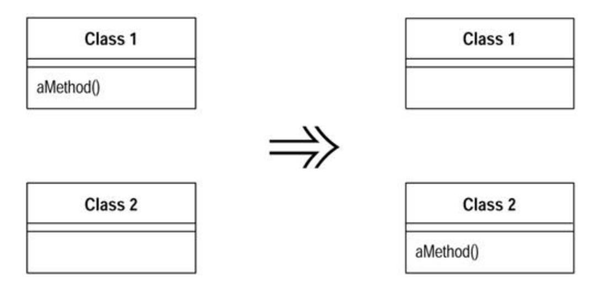
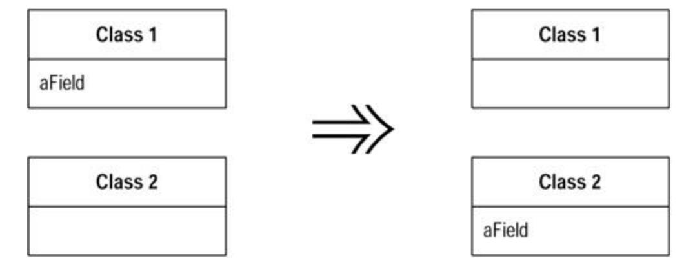
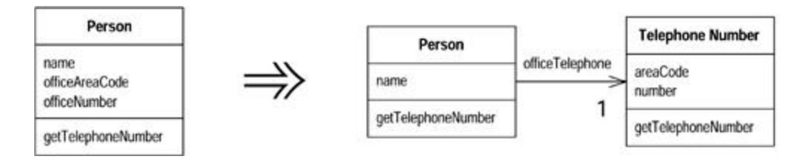
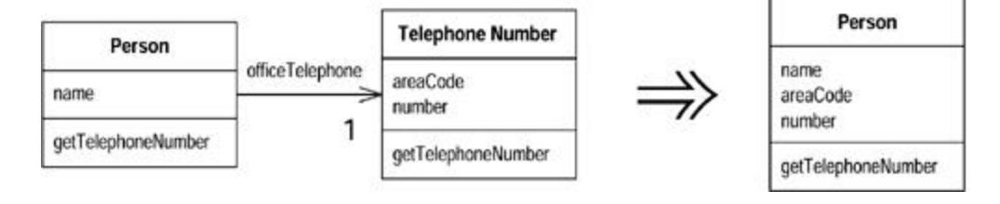
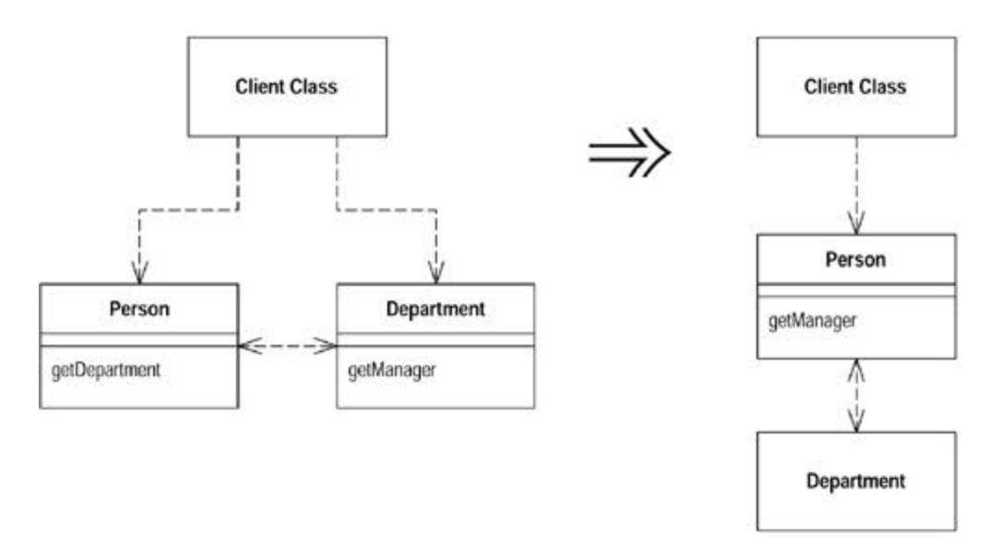
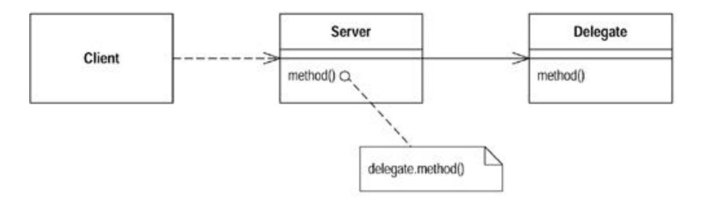
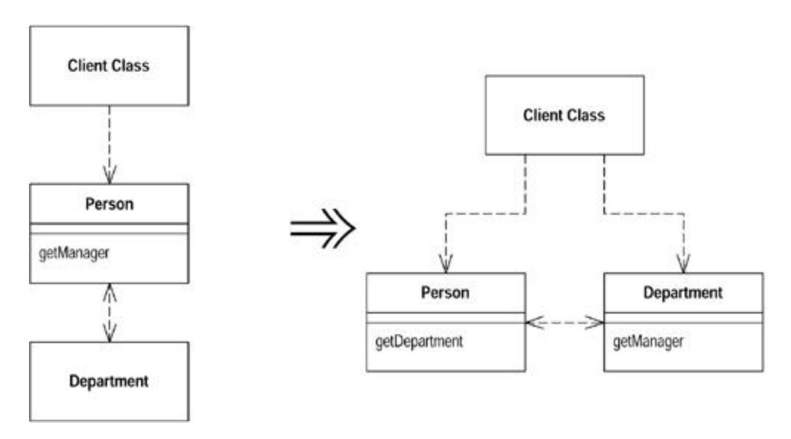
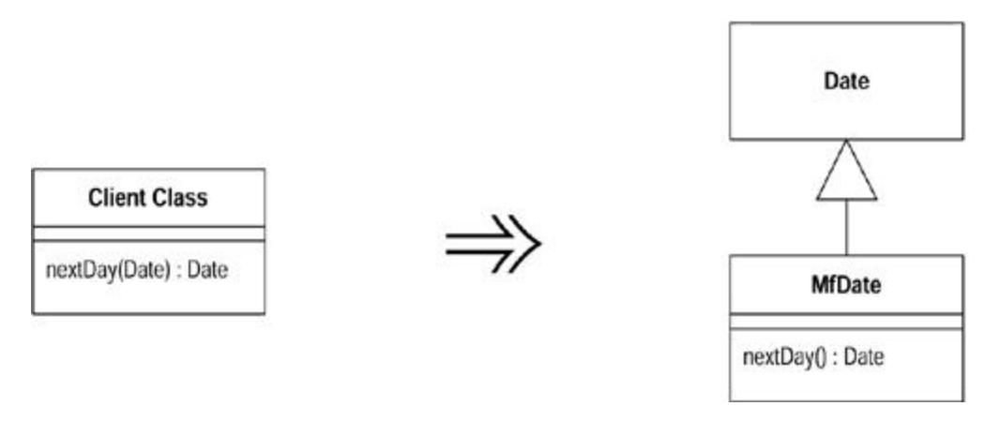

# Chapter 7: Moving Features Between Objects

One of the most fundamental, if not the fundamental, decision in object design is deciding where to put responsibilities. I've been working with objects for more than a decade, but I still never get it right the first time. That used to bother me, but now I realize that I can use refactoring to change my mind in these cases.

Often I can resolve these problems simply by using Move Method and Move Field to move the behavior around. If I need to use both, I prefer to use Move Field first and then Move Method.

Often classes become bloated with too many responsibilities. In this case I use Extract Class to separate some of these responsibilities. If a class becomes too irresponsible, I use Inline Class to merge it into another class. If another class is being used, it often is helpful to hide this fact with Hide Delegate. Sometimes hiding the delegate class results in constantly changing the owner's interface, in which case you need to use Remove Middle Man

The last two refactorings in this chapter, Introduce Foreign Method and Introduce Local Extension are special cases. I use these only when I'm not able to access the source code of a class, yet I want to move responsibilities to this unchangeable class. If it is only one or two methods, I use Introduce Foreign Method; for more than one or two methods, I use Introduce Local Extension.

## Move Method

A method is, or will be, using or used by more features of another class than the class on which it is defined.

*Create a new method with a similar body in the class it uses most. Either turn the old method into a simple delegation, or remove it altogether.*



### Motivation

Moving methods is the bread and butter of refactoring. I move methods when classes have too much behavior or when classes are collaborating too much and are too highly coupled. By

moving methods around, I can make the classes simpler and they end up being a more crisp implementation of a set of responsibilities.

I usually look through the methods on a class to find a method that seems to reference another object more than the object it lives on. A good time to do this is after I have moved some fields. Once I see a likely method to move, I take a look at the methods that call it, the methods it calls, and any redefining methods in the hierarchy. I assess whether to go ahead on the basis of the object with which the method seems to have more interaction.

It's not always an easy decision to make. If I am not sure whether to move a method, I go on to look at other methods. Moving other methods often makes the decision easier. Sometimes the decision still is hard to make. Actually it is then no big deal. If it is difficult to make the decision, it probably does not matter that much. Then I choose according to instinct; after all, I can always change it again later.

### Mechanics

· Examine all features used by the source method that are defined on the source class. Consider whether they also should be moved.

> ?rarr; *If a feature is used only by the method you are about to move, you might as well move it, too. If the feature is used by other methods, consider moving them as well. Sometimes it is easier to move a clutch of methods than to move them one at a time.*

· Check the sub- and superclasses of the source class for other declarations of the method.

> ?rarr; *If there are any other declarations, you may not be able to make the move, unless the polymorphism can also be expressed on the target.*

· Declare the method in the target class.

?rarr; *You may choose to use a different name, one that makes more sense in the target class.*

· Copy the code from the source method to the target. Adjust the method to make it work in its new home.

> ?rarr; *If the method uses its source, you need to determine how to reference the source object from the target method. If there is no mechanism in the target class, pass the source object reference to the new method as a parameter.*

?rarr; *If the method includes exception handlers, decide which class should logically handle the exception. If the source class should be responsible, leave the handlers behind.*

- · Compile the target class.
- · Determine how to reference the correct target object from the source.

?rarr; *There may be an existing field or method that will give you the target. If not, see whether you can easily create a method that will do so. Failing that, you need to create a new field in the source that can store the target. This may be a permanent change, but you can also make it temporarily until you have refactored enough to remove it.*

- · Turn the source method into a delegating method.
- · Compile and test.
- · Decide whether to remove the source method or retain it as a delegating method.

?rarr; *Leaving the source as a delegating method is easier if you have many references.*

· If you remove the source method, replace all the references with references to the target method.

> ?rarr; *You can compile and test after changing each reference, although it is usually easier to change all references with one search and replace.*

· Compile and test.

### Example

An account class illustrates this refactoring:

```
 class Account...
 double overdraftCharge() {
 if (_type.isPremium()) {
 double result = 10;
 if (_daysOverdrawn > 7) result += (_daysOverdrawn - 7) * 
0.85;
 return result;
 }
 else return _daysOverdrawn * 1.75;
 }
 double bankCharge() {
 double result = 4.5;
 if (_daysOverdrawn > 0) result += overdraftCharge();
 return result;
 }
 private AccountType _type;
 private int _daysOverdrawn;
```

Let's imagine that there are going to be several new account types, each of which has its own rule for calculating the overdraft charge. So I want to move the overdraft charge method over to the account type.

The first step is to look at the features that the overdraftCharge method uses and consider whether it is worth moving a batch of methods together. In this case I need the \_daysOverdrawn field to remain on the account class, because that will vary with individual accounts.

Next I copy the method body over to the account type and get it to fit.

```
 class AccountType...
 double overdraftCharge(int daysOverdrawn) {
 if (isPremium()) {
 double result = 10;
 if (daysOverdrawn > 7) result += (daysOverdrawn - 7) * 0.85;
 return result;
 }
 else return daysOverdrawn * 1.75;
 }
```

In this case fitting means removing the \_type from uses of features of the account type, and doing something about the features of account that I still need. When I need to use a feature of the source class I can do one of four things: (1) move this feature to the target class as well, (2) create or use a reference from the target class to the source, (3) pass the 0source object as a parameter to the method, (4) if the feature is a variable, pass it in as a parameter.

In this case I passed the variable as a parameter.

Once the method fits and compiles in the target class, I can replace the source method body with a simple delegation:

```
 class Account...
 double overdraftCharge() {
 return _type.overdraftCharge(_daysOverdrawn);
 }
```

At this point I can compile and test.

I can leave things like this, or I can remove the method in the source class. To remove the method I need to find all callers of the method and redirect them to call the method in account type:

```
 class Account...
 double bankCharge() {
 double result = 4.5;
 if (_daysOverdrawn > 0) result += 
_type.overdraftCharge(_daysOverdrawn);
 return result;
 }
```

Once I've replaced all the callers, I can remove the method declaration in account. I can compile and test after each removal, or do them in a batch. If the method isn't private, I need to look for other classes that use this method. In a strongly typed language, the compilation after removal of the source declaration finds anything I missed.

In this case the method referred only to a single field, so I could just pass this field in as a variable. If the method called another method on the account, I wouldn't have been able to do that. In those cases I need to pass in the source object:

```
 class AccountType...
 double overdraftCharge(Account account) {
 if (isPremium()) {
 double result = 10;
 if (account.getDaysOverdrawn() > 7)
 result += (account.getDaysOverdrawn() - 7) * 0.85;
 return result;
 }
 else return account.getDaysOverdrawn() * 1.75;
 }
```

I also pass in the source object if I need several features of the class, although if there are too many, further refactoring is needed. Typically I need to decompose and move some pieces back.

### Move Field

A field is, or will be, used by another class more than the class on which it is defined.

*Create a new field in the target class, and change all its users.*



### Motivation

Moving state and behavior between classes is the very essence of refactoring. As the system develops, you find the need for new classes and the need to shuffle responsibilities around. A design decision that is reasonable and correct one week can become incorrect in another. That is not a problem; the only problem is not to do something about it.

I consider moving a field if I see more methods on another class using the field than the class itself. This usage may be indirect, through getting and setting methods. I may choose to move the methods; this decision based on interface. But if the methods seem sensible where they are, I move the field.

Another reason for field moving is when doing Extract Class. In that case the fields go first and then the methods.

### Mechanics

· If the field is public, use Encapsulate Field.

?rarr; *If you are likely to be moving the methods that access it frequently or if a lot of methods access the field, you may find it useful to use* Self Encapsulate Field

- · Compile and test.
- · Create a field in the target class with getting and setting methods.
- · Compile the target class.
- · Determine how to reference the target object from the source.

?rarr; *An existing field or method may give you the target. If not, see whether you can easily create a method that will do so. Failing that, you need to create a new field in the source that can store the target. This may be a permanent change, but you can also do it temporarily until you have refactored enough to remove it.*

- · Remove the field on the source class.
- · Replace all references to the source field with references to the appropriate method on the target.

?rarr; *For accesses to the variable, replace the reference with a call to the target object's getting method; for assignments, replace the reference with a call to the setting method.*

?rarr; *If the field is not private, look in all the subclasses of the source for references.*

· Compile and test.

### Example

Here is part of an account class:

```
 class Account...
 private AccountType _type;
 private double _interestRate;
 double interestForAmount_days (double amount, int days) {
 return _interestRate * amount * days / 365;
 }
```

I want to move the interest rate field to the account type. There are several methods with that reference, of which interestForAmount\_days is one example.I next create the field and accessors in the account type:

```
 class AccountType...
 private double _interestRate;
 void setInterestRate (double arg) {
 _interestRate = arg;
 }
```

```
 double getInterestRate () {
 return _interestRate;
 }
```

I can compile the new class at this point.

Now I redirect the methods from the account class to use the account type and remove the interest rate field in the account. I must remove the field to be sure that the redirection is actually happening. This way the compiler helps spot any method I failed to redirect.

```
 private double _interestRate;
 double interestForAmount_days (double amount, int days) {
 return _type.getInterestRate() * amount * days / 365;
 }
```

### Example: Using Self-Encapsulation

If a lot of methods use the interest rate field, I might start by using Self Encapsulate Field:

```
 class Account...
 private AccountType _type;
 private double _interestRate;
 double interestForAmount_days (double amount, int days) {
 return getInterestRate() * amount * days / 365;
 }
 private void setInterestRate (double arg) {
 _interestRate = arg;
 }
 private double getInterestRate () {
 return _interestRate;
 }
```

That way I only need to do the redirection for the accessors:

```
 double interestForAmountAndDays (double amount, int days) {
 return getInterestRate() * amount * days / 365;
 }
 private void setInterestRate (double arg) {
 _type.setInterestRate(arg);
 }
 private double getInterestRate () {
 return _type.getInterestRate();
 }
```

I can redirect the clients of the accessors to use the new object later if I want. Using selfencapsulation allows me to take a smaller step. This is useful if I'm doing a lot of things with the class. In particular, it simplifies use Move Method to move methods to the target class. If they refer to the accessor, such references don't need to change.

### Extract Class

You have one class doing work that should be done by two.

*Create a new class and move the relevant fields and methods from the old class into the new class.*



### Motivation

You've probably heard that a class should be a crisp abstraction, handle a few clear responsibilities, or some similar guideline. In practice, classes grow. You add some operations here, a bit of data there. You add a responsibility to a class feeling that it's not worth a separate class, but as that responsibility grows and breeds, the class becomes too complicated. Soon your class is as crisp as a microwaved duck.

Such a class is one with many methods and quite a lot of data. A class that is too big to understand easily. You need to consider where it can be split, and you split it. A good sign is that a subset of the data and a subset of the methods seem to go together. Other good signs are subsets of data that usually change together or are particularly dependent on each other. A useful test is to ask yourself what would happen if you removed a piece of data or a method. What other fields and methods would become nonsense?

One sign that often crops up later in development is the way the class is subtyped. You may find that subtyping affects only a few features or that some features need to be subtyped one way and other features a different way.

### Mechanics

- · Decide how to split the responsibilities of the class.
- · Create a new class to express the split-off responsibilities.

?rarr; *If the responsibilities of the old class no longer match its name, rename the old class.*

· Make a link from the old to the new class.

?rarr; *You may need a two-way link. But don't make the back link until you find you need it.*

- · Use Move Field on each field you wish to move.
- · Compile and test after each move.
- · Use Move Method to move methods over from old to new. Start with lower-level methods (called rather than calling) and build to the higher level.
- · Compile and test after each move.
- · Review and reduce the interfaces of each class.

?rarr; *If you did have a two-way link, examine to see whether it can be made one way.*

· Decide whether to expose the new class. If you do expose the class, decide whether to expose it as a reference object or as an immutable value object.

### Example

I start with a simple person class:

```
 class Person...
 public String getName() {
 return _name;
 }
 public String getTelephoneNumber() {
 return ("(" + _officeAreaCode + ") " + _officeNumber);
 }
 String getOfficeAreaCode() {
 return _officeAreaCode;
 }
 void setOfficeAreaCode(String arg) {
 _officeAreaCode = arg;
 }
 String getOfficeNumber() {
 return _officeNumber;
 }
 void setOfficeNumber(String arg) {
 _officeNumber = arg;
 }
 private String _name;
 private String _officeAreaCode;
 private String _officeNumber;
```

In this case I can separate the telephone number behavior into its own class. I start by defining a telephone number class:

```
 class TelephoneNumber {
 }
```

That was easy! I next make a link from the person to the telephone number:

```
 class Person
 private TelephoneNumber _officeTelephone = new TelephoneNumber();
```

#### Now I use Move Field on one of the fields:

```
 class TelephoneNumber {
 String getAreaCode() {
 return _areaCode;
 }
 void setAreaCode(String arg) {
 _areaCode = arg;
 }
 private String _areaCode;
 }
 class Person...
 public String getTelephoneNumber() {
 return ("(" + getOfficeAreaCode() + ") " + _officeNumber);
 }
 String getOfficeAreaCode() {
 return _officeTelephone.getAreaCode();
 }
 void setOfficeAreaCode(String arg) {
 _officeTelephone.setAreaCode(arg);
 }
```

I can then move the other field and use Move Method on the telephone number:

```
 class Person...
 public String getName() {
 return _name;
 }
 public String getTelephoneNumber(){
 return _officeTelephone.getTelephoneNumber();
 }
 TelephoneNumber getOfficeTelephone() {
 return _officeTelephone;
 }
 private String _name;
 private TelephoneNumber _officeTelephone = new TelephoneNumber();
 class TelephoneNumber...
 public String getTelephoneNumber() {
 return ("(" + _areaCode + ") " + _number);
 }
 String getAreaCode() {
 return _areaCode;
 }
 void setAreaCode(String arg) {
 _areaCode = arg;
 }
 String getNumber() {
 return _number;
 }
 void setNumber(String arg) {
 _number = arg;
 }
 private String _number;
```

```
 private String _areaCode;
```

The decision then is how much to expose the new class to my clients. I can completely hide it by providing delegating methods for its interface, or I can expose it. I may choose to expose it to some clients (such as those in my package) but not to others.

If I choose to expose the class, I need to consider the dangers of aliasing. If I expose the telephone number and a client changes the area code in that object, how do I feel about it? It may not be a direct client that makes this change. It might be the client of a client of a client.

I have the following options:

- 1. I accept that any object may change any part of the telephone number. This makes the telephone number a reference object, and I should consider Change Value to Reference. In this case the person would be the access point for the telephone number.
- 2. I don't want anybody to change the value of the telephone number without going through the person. I can either make the telephone number immutable, or I can provide an immutable interface for the telephone number.
- 3. Another possibility is to clone the telephone number before passing it out. But this can lead to confusion because people think they can change the value. It also may lead to aliasing problems between clients if the telephone number is passed around a lot.

Extract Class is a common technique for improving the liveness of a concurrent program because it allows you to have separate locks on the two resulting classes. If you don't need to lock both objects you don't have to. For more on this see section 3.3 in Lea [Lea].

However, there is a danger there. If you need to ensure that both objects are locked together, you get into the area of transactions and other kinds of shared locks. As discussed in Lea by section 8.1 [Lea], this is complex territory and requires heavier machinery than it is typically worth. Transactions are very useful when you use them, but writing transaction managers is more than most programmers should attempt.

### Inline Class

A class isn't doing very much.

*Move all its features into another class and delete it.*



### Motivation

*Inline Class* is the reverse of Extract Class. I use *Inline Class* if a class is no longer pulling its weight and shouldn't be around any more. Often this is the result of refactoring that moves other responsibilities out of the class so there is little left. Then I want to fold this class into another class, picking one that seems to use the runt class the most.

### Mechanics

· Declare the public protocol of the source class onto the absorbing class. Delegate all these methods to the source class.

> ?rarr; *If a separate interface makes sense for the source class methods, use* Extract Interface *before inlining.*

· Change all references from the source class to the absorbing class.

?rarr; *Declare the source class private to remove out-of-package references. Also change the name of the source class so the compiler catches any dangling references to the source class.*

- · Compile and test.
- · Use *Move Method* and *Move Field* to move features from the source class to the absorbing class until there is nothing left.
- · Hold a short, simple funeral service.

### Example

Because I made a class out of telephone number, I now inline it back into person. I start with separate classes:

```
 class Person...
 public String getName() {
 return _name;
 }
 public String getTelephoneNumber(){
 return _officeTelephone.getTelephoneNumber();
 }
 TelephoneNumber getOfficeTelephone() {
 return _officeTelephone;
 }
 private String _name;
 private TelephoneNumber _officeTelephone = new TelephoneNumber();
 class TelephoneNumber...
 public String getTelephoneNumber() {
 return ("(" + _areaCode + ") " + _number);
 }
 String getAreaCode() {
 return _areaCode;
 }
 void setAreaCode(String arg) {
 _areaCode = arg;
 }
 String getNumber() {
 return _number;
 }
 void setNumber(String arg) {
 _number = arg;
```

```
 }
 private String _number;
 private String _areaCode;
```

I begin by declaring all the visible methods on telephone number on person:

```
 class Person...
 String getAreaCode() {
 return _officeTelephone.getAreaCode();
 }
 void setAreaCode(String arg) {
 _officeTelephone.setAreaCode(arg);
 }
 String getNumber() {
 return _officeTelephone.getNumber();
 }
 void setNumber(String arg) {
 _officeTelephone.setNumber(arg);
 }
```

Now I find clients of telephone number and switch them to use the person's interface. So

```
 Person martin = new Person();
 martin.getOfficeTelephone().setAreaCode ("781");
```

#### becomes

```
 Person martin = new Person();
 martin.setAreaCode ("781");
```

Now I can use Move Method and Move Field until the telephone class is no more.

## Hide Delegate

A client is calling a delegate class of an object.

*Create methods on the server to hide the delegate.*



### Motivation

One of the keys, if not *the* key, to objects is encapsulation. Encapsulation means that objects need to know less about other parts of the system. Then when things change, fewer objects need to be told about the change—which makes the change easier to make.

Anyone involved in objects knows that you should hide your fields, despite the fact that Java allows fields to be public. As you become more sophisticated, you realize there is more you can encapsulate.

If a client calls a method defined on one of the fields of the server object, the client needs to know about this delegate object. If the delegate changes, the client also may have to change. You can remove this dependency by placing a simple delegating method on the server, which hides the delegate (Figure 7.1). Changes become limited to the server and don't propagate to the client.



**Figure 7.1. Simple delegation**

You may find it is worthwhile to use Extract Class for some clients of the server or all clients. If you hide from all clients, you can remove all mention of the delegate from the interface of the server.

### Mechanics

· For each method on the delegate, create a simple delegating method on the server.

· Adjust the client to call the server.

?rarr; *If the client is not in the same package as the server, consider changing the delegate method's access to package visibility.*

- · Compile and test after adjusting each method.
- · If no client needs to access the delegate anymore, remove the server's accessor for the delegate.
- · Compile and test.

### Example

I start with a person and a department:

```
 class Person {
 Department _department;
 public Department getDepartment() {
 return _department;
 }
 public void setDepartment(Department arg) {
 _department = arg;
 }
 }
 class Department {
 private String _chargeCode;
 private Person _manager;
 public Department (Person manager) {
 _manager = manager;
 }
 public Person getManager() {
 return _manager;
 }
 ...
```

If a client wants to know a person's manager, it needs to get the department first:

```
 manager = john.getDepartment().getManager();
```

This reveals to the client how the department class works and that the department is responsible to tracking the manager. I can reduce this coupling by hiding the department class from the client. I do this by creating a simple delegating method on person:

```
 public Person getManager() {
 return _department.getManager();
 }
```

I now need to change all clients of person to use this new method:

```
 manager = john.getManager();
```

Once I've made the change for all methods of department and for all the clients of person, I can remove the getDepartment accessor on person.

### Remove Middle Man

A class is doing too much simple delegation.

*Get the client to call the delegate directly.*



### Motivation

In the motivation for *Hide Delegate,* I talked about the advantages of encapsulating the use of a delegated object. There is a price for this. The price is that every time the client wants to use a new feature of the delegate, you have to add a simple delegating method to the server. After adding features for a while, it becomes painful. The server class is just a middle man, and perhaps it's time for the client to call the delegate directly.

It's hard to figure out what the right amount of hiding is. Fortunately, with *Hide Delegate* and Remove Middle Man it does not matter so much. You can adjust your system as time goes on. As the system changes, the basis for how much you hide also changes. A good encapsulation six months ago may be awkward now. Refactoring means you never have to say you're sorry—you just fix it.

### Mechanics

- · Create an accessor for the delegate.
- · For each client use of a delegate method, remove the method from the server and replace the call in the client to call method on the delegate.
- · Compile and test after each method.

### Example

For an example I use person and department flipped the other way. I start with person hiding the department:

```
 class Person...
 Department _department;
 public Person getManager() {
 return _department.getManager();
 class Department...
 private Person _manager;
 public Department (Person manager) {
 _manager = manager;
 }
```

To find a person's manager, clients ask:

```
 manager = john.getManager();
```

This is simple to use and encapsulates the department. However, if lots of methods are doing this, I end up with too many of these simple delegations on the person. That's when it is good to remove the middle man. First I make an accessor for the delegate:

```
 class Person...
 public Department getDepartment() {
 return _department;
 }
```

Then I take each method at a time. I find clients that use the method on person and change it to first get the delegate. Then I use it:

```
 manager = john.getDepartment().getManager();
```

I can then remove getManager from person. A compile shows whether I missed anything.

I may want to keep some of these delegations for convenience. I also may want to hide the delegate from some clients but show it to others. That also will leave some of the simple delegations in place.

## Introduce Foreign Method

A server class you are using needs an additional method, but you can't modify the class.

*Create a method in the client class with an instance of the server class as its first argument.*

```
 Date newStart = new Date (previousEnd.getYear(),
 previousEnd.getMonth(), previousEnd.getDate() + 1);
```

```
 Date newStart = nextDay(previousEnd);
 private static Date nextDay(Date arg) {
 return new Date (arg.getYear(),arg.getMonth(), arg.getDate() + 
1);
 }
```

### Motivation

It happens often enough. You are using this really nice class that gives you all these great services. Then there is one service it doesn't give you but should. You curse the class, saying, "Why don't you do that?" If you can change the source, you can add in the method. If you can't change the source, you have to code around the lack of the method in the client.

If you use the method only once in the client class then the extra coding is no big deal and probably wasn't needed on the original class anyway. If you use the method several times, however, you have to repeat this coding around. Because repetition is the root of all software evil, this repetitive code should be factored into a single method. When you do this refactoring, you can clearly signal that this method is really a method that should be on the original by making it a foreign method.

If you find yourself creating many foreign methods on a server class, or you find many of your classes need the same foreign method, you should use Introduce Local Extension instead.

Don't forget that foreign methods are a work-around. If you can, try to get the methods moved to their proper homes. If code ownership is the issue, send the foreign method to the owner of the server class and ask the owner to implement the method for you.

### Mechanics

· Create a method in the client class that does what you need.

?rarr; *The method should not access any of the features of the client class. If it needs a value, send it in as a parameter.*

- · Make an instance of the server class the first parameter.
- · Comment the method as "foreign method; should be in *server.*"

?rarr; *This way you can use a text search to find foreign methods later if you get the chance to move the method.*

### Example

I have some code that needs to roll over a billing period. The original code looks like this:

```
 Date newStart = new Date (previousEnd.getYear(),
 previousEnd.getMonth(), previousEnd.getDate() + 1);
```

I can extract the code on the right-hand side of the assignment into a method. This method is a foreign method for date:

```
 Date newStart = nextDay(previousEnd);
 private static Date nextDay(Date arg) {
 // foreign method, should be on date
 return new Date (arg.getYear(),arg.getMonth(), arg.getDate() + 
1);
 }
```

## Introduce Local Extension

A server class you are using needs several additional methods, but you can't modify the class.

*Create a new class that contains these extra methods. Make this extension class a subclass or a wrapper of the original.*



### Motivation

Authors of classes sadly are not omniscient, and they fail to provi de useful methods for you. If you can modify the source, often the best thing is to add that method. However, you often cannot modify the source. If you need one or two methods, you can use Introduce Foreign Method. Once you get beyond a couple of these methods, however, they get out of hand. So you need to group the methods together in a sensible place for them. The standard object-oriented techniques of subclassing and wrapping are an obvious way to do this. In these circumstances I call the subclass or wrapper a local extension.

A local extension is a separate class, but it is a subtype of the class it is extending. That means it supports all the things the original can do but also adds the extra features. Instead of using the original class, you instantiate the local extension and use it.

By using the local extension you keep to the principle that methods and data should be packaged into well-formed units. If you keep putting code in other classes that should lie in the extension, you end up complicating the other classes, and making it harder to reuse these methods.

In choosing between subclass and wrapper, I usually prefer the subclass because it is less work. The biggest roadblock to a subclass is that it needs to apply at object-creation time. If I can take over the creation process that's no problem. The problem occurs if you apply the local extension later. Subclassing forces me to create a new object of that subclass. If other objects refer to the old one, I have two objects with the original's data. If the original is immutable, there is no

problem; I can safely take a copy. But if the original can change, there is a problem, because changes in one object won't change the other and I have to use a wrapper. That way changes made through the local extension affect the original object and vice versa.

### Mechanics

- · Create an extension class either as a subclass or a wrapper of the original.
- · Add converting constructors to the extension.

?rarr; *A constructor takes the original as an argument. The subclass version calls an appropriate superclass constructor; the wrapper version sets the delegate field to the argument.*

- · Add new features to the extension.
- · Replace the original with the extension where needed.
- · Move any foreign methods defined for this class onto the extension.

### Examples

I had to do this kind of thing quite a bit with Java 1.0.1 and the date class. The calendar class in 1.1 gave me a lot of the behavior I wanted, but before it arrived, it gave me quite a few opportunities to use extension. I use it as an example here.

The first thing to decide is whether to use a subclass or a wrapper. Subclassing is the more obvious way:

```
 Class mfDate extends Date {
 public nextDay()...
 public dayOfYear()...
```

A wrapper uses delegation:

```
 class mfDate {
 private Date _original;
```

### Example: Using a Subclass

First I create the new date as a subclass of the original:

```
 class MfDateSub extends Date
```

Next I deal with changing between dates and the extension. The constructors of the original need to be repeated with simple delegation:

```
 public MfDateSub (String dateString) {
 super (dateString);
 };
```

Now I add a converting constructor, one that takes an original as an argument:

```
 public MfDateSub (Date arg) {
 super (arg.getTime());
 }
```

I can now add new features to the extension and use Move Method to move any foreign methods over to the extension:

```
 client class...
 private static Date nextDay(Date arg) {
 // foreign method, should be on date
 return new Date (arg.getYear(),arg.getMonth(), arg.getDate() + 
1);
 }
```

#### becomes

```
 class MfDate...
 Date nextDay() {
 return new Date (getYear(),getMonth(), getDate() + 1);
 }
```

### Example: Using a Wrapper

I start by declaring the wrapping class:

```
 class mfDate {
 private Date _original;
 }
```

With the wrapping approach, I need to set up the constructors differently. The original constructors are implemented with simple delegation:

```
 public MfDateWrap (String dateString) {
 _original = new Date(dateString);
 };
```

The converting constructor now just sets the instance variable:

```
 public MfDateWrap (Date arg) {
 _original = arg;
 }
```

Then there is the tedious task of delegating all the methods of the original class. I show only a couple.

```
 public int getYear() {
 return _original.getYear();
 }
 public boolean equals (MfDateWrap arg) {
 return (toDate().equals(arg.toDate()));
 }
```

Once I've done this I can use Move Method to put date-specific behavior onto the new class:

```
 client class...
 private static Date nextDay(Date arg) {
 // foreign method, should be on date
 return new Date (arg.getYear(),arg.getMonth(), arg.getDate() + 
1);
 }
```

#### becomes

```
 class MfDate...
 Date nextDay() {
 return new Date (getYear(),getMonth(), getDate() + 1);
 }
```

A particular problem with using wrappers is how to deal with methods that take an original as an argument, such as

```
 public boolean after (Date arg)
```

Because I can't alter the original, I can only do after in one direction:

```
 aWrapper.after(aDate) // can be made to work
 aWrapper.after(anotherWrapper) // can be made to work
 aDate.after(aWrapper) // will not work
```

The purpose of this kind of overriding is to hide the fact I'm using a wrapper from the user of the class. This is good policy because the user of wrapper really shouldn't care about the wrapper and should be able to treat the two equally. However, I can't completely hide this information. The problem lies in certain system methods, such as equals. Ideally you would think that you could override equals on MfDateWrap like this

```
 public boolean equals (Date arg) // causes problems
```

This is dangerous because although I can make it work for my own purposes, other parts of the java system assume that equals is symmetric: that if a.equals(b) then b.equals(a). If I violate this rule I'll run into a bevy of strange bugs. The only way to avoid that would be to modify Date, and if I could do that I wouldn't be using this refactoring. So in situations like this I just have to expose the fact that I'm wrapping. For equality tests this means a new method name.

```
 public boolean equalsDate (Date arg)
```

I can avoid testing the type of unknown objects by providing versions of this method for both Date and MfDateWrap.

```
 public boolean equalsDate (MfDateWrap arg)
```

The same problem is not an issue with subclassing, if I don't override the operation. If I do override, I become completely confused with the method lookup. I usually don't do override methods with extensions; I usually just add methods.
