# Chapter 8: Organizing Data

In this chapter I discuss several refactorings that make working with data easier. For many people Self Encapsulate Field seems unnecessary. It's long been a matter of good-natured debate about whether an object should access its own data directly or through accessors. Sometimes you do need the accessors, and then you can get them with Self Encapsulate Field. I generally use direct access because I find it simple to do this refactoring when I need it.

One of the useful things about object languages is that they allow you to define new types that go beyond what can be done with the simple data types of traditional languages. It takes a while to get used to how to do this, however. Often you start with a simple data value and then realize that an object would be more useful. Replace Data Value with Object allows you to turn dumb data into articulate objects. When you realize that these objects are instances that will be needed in many parts of the program, you can use Change Value to Reference to make them into reference objects.

If you see an array acting as a data structure, you can make the data structure clearer with Replace Array with Object. In all these cases the object is but the first step. The real advantage comes when you use Move Method to add behavior to the new objects.

Magic numbers, numbers with special meaning, have long been a problem. I remember being told in my earliest programming days not to use them. They do keep appearing, however, and I use Replace Magic Number with Symbolic Constant to get rid of magic numbers whenever I figure out what they are doing.

Links between objects can be one way or two way. One-way links are easier, but sometimes you need to Change Unidirectional Association to Bidirectional to support a new function. Change Bidirectional Association to Unidirectional removes unnecessary complexity should you find you no longer need the two-way link anymore.

I've often run into cases in which GUI classes are doing business logic that they shouldn't. To move the behavior into proper domain classes, you need to have the data in the domain class and support the GUI by using Duplicate Observed Data. I normally don't like duplicating data, but this is an exception that is usually impossible to avoid.

One of the key tenets of object-oriented programming is encapsulation. If any public data is streaking around, you can use Encapsulate Field to decorously cover it up. If that data is a collection, use Encapsulate Collection instead, because that has special protocol. If an entire record is naked, use Replace Record with Data Class.

One form of data that requires particular treatment is the type code: a special value that indicates something particular about a type of instance. These often show up as enumerations, often implemented as static final integers. If the codes are for information and do not alter the behavior of the class, you can use Replace Type Code with Class, which gives you better type checking and a platform for moving behavior later. If the behavior of a class is affected by a type code, use Replace Type Code with Subclasses if possible. If you can't do that, use the more complicated (but more flexible) Replace Type Code with State/Strategy.

## Self Encapsulate Field

You are accessing a field directly, but the coupling to the field is becoming awkward.

*Create getting and setting methods for the field and use only those to access the field.*

```
 private int _low, _high;
 boolean includes (int arg) {
 return arg >= _low && arg <= _high;
 }
 private int _low, _high;
 boolean includes (int arg) {
 return arg >= getLow() && arg <= getHigh();
 }
 int getLow() {return _low;}
 int getHigh() {return _high;}
```

### Motivation

When it comes to accessing fields, there are two schools of thought. One is that within the class where the variable is defined, you should access the variable freely (direct variable access). The other school is that even within the class, you should always use accessors (indirect variable access). Debates between the two can be heated. (See also the discussion in Auer [Auer] on page 413 and Beck [Beck].)

Essentially the advantages of *indirect variable access* are that it allows a subclass to override how to get that information with a method and that it supports more flexibility in managing the data, such as lazy initialization, which initializes the value only when you need to use it.

The advantage of *direct variable access* is that the code is easier to read. You don't need to stop and say, "This is just a getting method."

I'm always of two minds with this choice. I'm usually happy to do what the rest of the team wants to do. Left to myself, though, I like to use direct variable access as a first resort, until it gets in the way. Once things start becoming awkward, I switch to indirect variable access. Refactoring gives you the freedom to change your mind.

The most important time to use *Self Encapsulate Field* is when you are accessing a field in a superclass but you want to override this variable access with a computed value in the subclass. Self-encapsulating the field is the first step. After that you can override the getting and setting methods as you need to.

### Mechanics

- · Create a getting and setting method for the field.
- · Find all references to the field and replace them with a getting or setting method.

?rarr; *Replace accesses to the field with a call to the getting method; replace assignments with a call to the setting method.*

?rarr; *You can get the compiler to help you check by temporarily renaming the field.*

- · Make the field private.
- · Double check that you have caught all references.
- · Compile and test.

### Example

This seems almost too simple for an example, but, hey, at least it is quick to write:

```
 class IntRange {
 private int _low, _high;
 boolean includes (int arg) {
 return arg >= _low && arg <= _high;
 }
 void grow(int factor) {
 _high = _high * factor;
 }
 IntRange (int low, int high) {
 _low = low;
 _high = high;
 }
```

To self-encapsulate I define getting and setting methods (if they don't already exist) and use those:

```
 class IntRange {
 boolean includes (int arg) {
 return arg >= getLow() && arg <= getHigh();
 }
 void grow(int factor) {
 setHigh (getHigh() * factor);
 }
 private int _low, _high;
 int getLow() {
 return _low;
 }
 int getHigh() {
 return _high;
 }
 void setLow(int arg) {
 _low = arg;
 }
 void setHigh(int arg) {
 _high = arg;
```

}

When you are using self-encapsulation you have to be careful about using the setting method in the constructor. Often it is assumed that you use the setting method for changes after the object is created, so you may have different behavior in the setter than you have when initializing. In cases like this I prefer using either direct access from the constructor or a separate initialization method:

```
 IntRange (int low, int high) {
 initialize (low, high);
 }
 private void initialize (int low, int high) {
 _low = low;
 _high = high;
 }
```

The value in doing all this comes when you have a subclass, as follows:

```
 class CappedRange extends IntRange {
 CappedRange (int low, int high, int cap) {
 super (low, high);
 _cap = cap;
 }
 private int _cap;
 int getCap() {
 return _cap;
 }
 int getHigh() {
 return Math.min(super.getHigh(), getCap());
 }
 }
```

I can override all of the behavior of IntRange to take into account the cap without changing any of that behavior.

## Replace Data Value with Object

You have a data item that needs additional data or behavior.

*Turn the data item into an object.*

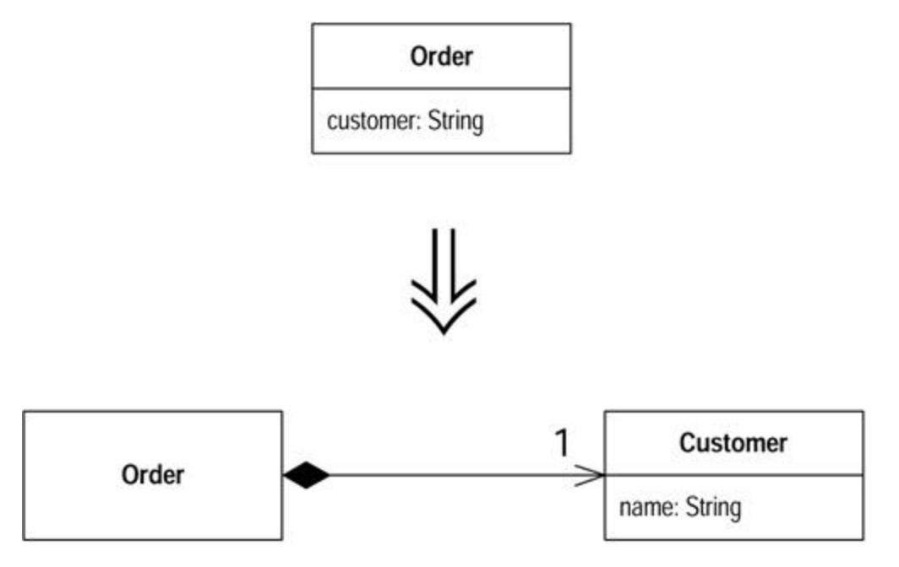

### Motivation

Often in early stages of development you make decisions about representing simple facts as simple data items. As development proceeds you realize that those simple items aren't so simple anymore. A telephone number may be represented as a string for a while, but later you realize that the telephone needs special behavior for formatting, extracting the area code, and the like. For one or two items you may put the methods in the owning object, but quickly the code smells of duplication and feature envy. When the smell begins, turn the data value into an object.

### Mechanics

- · Create the class for the value. Give it a final field of the same type as the value in the source class. Add a getter and a constructor that takes the field as an argument.
- · Compile.
- · Change the type of the field in the source class to the new class.
- · Change the getter in the source class to call the getter in the new class.
- · If the field is mentioned in the source class constructor, assign the field using the constructor of the new class.
- · Change the getting method to create a new instance of the new class.
- · Compile and test.
- · You may now need to use Change Value to Reference on the new object.

### Example

I start with an order class that has stored the customer of the order as a string and wants to turn the customer into an object. This way I have somewhere to store data, such as an address or credit rating, and useful behavior that uses this information.

```
 class Order...
 public Order (String customer) {
 _customer = customer;
```

```
 }
 public String getCustomer() {
 return _customer;
 }
 public void setCustomer(String arg) {
 _customer = arg;
 }
 private String _customer;
```

Some client code that uses this looks like

```
 private static int numberOfOrdersFor(Collection orders, String 
customer) {
 int result = 0;
 Iterator iter = orders.iterator();
 while (iter.hasNext()) {
 Order each = (Order) iter.next();
 if (each.getCustomerName().equals(customer)) result++;
 }
 return result;
 }
```

First I create the new customer class. I give it a final field for a string attribute, because that is what the order currently uses. I call it *name,* because that seems to be what the string is used for. I also add a getting method and provide a constructor that uses the attribute:

```
 class Customer {
 public Customer (String name) {
 _name = name;
 }
 public String getName() {
 return _name;
 }
 private final String _name;
 }
```

Now I change the type of the customer field and change methods that reference it to use the appropriate references on the customer class. The getter and constructor are obvious. For the setter I create a new customer:

```
 class Order...
 public Order (String customer) {
 _customer = new Customer(customer);
 }
 public String getCustomer() {
 return _customer.getName();
 }
 private Customer _customer;
 public void setCustomer(String arg) {
 _customer = new Customer(customer);
 }
```

The setter creates a new customer because the old string attribute was a value object, and thus the customer currently also is a value object. This means that each order has its own customer object. As a rule value objects should be immutable; this avoids some nasty aliasing bugs. Later on I will want customer to be a reference object, but that's another refactoring. At this point I can compile and test.

Now I look at the methods on order that manipulate customer and make some changes to make the new state of affairs clearer. With the getter I use Rename Method to make it clear that it is the name not the object that is returned:

```
 public String getCustomerName() {
 return _customer.getName();
 }
```

On the constructor and setter, I don't need to change the signature, but the name of the arguments should change:

```
 public Order (String customerName) {
 _customer = new Customer(customerName);
 }
 public void setCustomer(String customerName) {
 _customer = new Customer(customerName);
 }
```

Further refactoring may well cause me to add a new constructor and setter that takes an existing customer.

This finishes this refactoring, but in this case, as in many others, there is another step. If I want to add such things as credit ratings and addresses to our customer, I cannot do so now. This is because the customer is treated as a value object. Each order has its own customer object. To give a customer these attributes I need to apply Change Value to Reference to the customer so that all orders for the same customer share the same customer object. You'll find this example continued there.

## Change Value to Reference

You have a class with many equal instances that you want to replace with a single object.

*Turn the object into a reference object.*

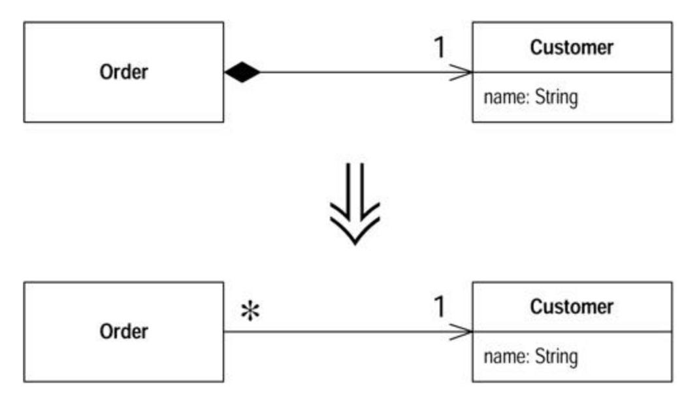

### Motivation

You can make a useful classification of objects in many systems: reference objects and value objects. *Reference object*s are things like customer or account. Each object stands for one object in the real world, and you use the object identity to test whether they are equal. *Value objects* are things like date or money. They are defined entirely through their data values. You don't mind that copies exist; you may have hundreds of "1/1/2000" objects around your system. You do need to tell whether two of the objects are equal, so you need to override the equals method (and the hashCode method too).

The decision between reference and value is not always clear. Sometimes you start with a simple value with a small amount of immutable data. Then you want to give it some changeable data and ensure that the changes ripple to everyone referring to the object. At this point you need to turn it into a reference object.

### Mechanics

- · Use Replace Constructor with Factory Method.
- · Compile and test.
- · Decide what object is responsible for providing access to the objects.

?rarr; *This may be a static dictionary or a registry object.*

?rarr; *You may have more than one object that acts as an access point for the new object.*

· Decide whether the objects are precreated or created on the fly.

?rarr; *If the objects are precreated and you are retrieving them from memory, you need to ensure they are loaded before they are needed.*

· Alter the factory method to return the reference object.

?rarr; *If the objects are precomputed, you need to decide how to handle errors if someone asks for an object that does not exist.*

?rarr; *You may want to use* Rename Method *on the factory to convey that it returns an existing object.*

· Compile and test.

### Example

I start where I left off in the example for Replace Data Value with Object. I have the following customer class:

```
 class Customer {
 public Customer (String name) {
 _name = name;
 }
 public String getName() {
 return _name;
 }
 private final String _name;
 }
```

It is used by an order class:

```
 class Order...
 public Order (String customerName) {
 _customer = new Customer(customerName);
 }
 public void setCustomer(String customerName) {
 _customer = new Customer(customerName);
 }
 public String getCustomerName() {
 return _customer.getName();
 }
 private Customer _customer;
```

and some client code:

```
 private static int numberOfOrdersFor(Collection orders, String 
customer) {
 int result = 0;
 Iterator iter = orders.iterator();
 while (iter.hasNext()) {
 Order each = (Order) iter.next();
 if (each.getCustomerName().equals(customer)) result++;
 }
 return result;
 }
```

At the moment it is a value. Each order has its own customer object even if they are for the same conceptual customer. I want to change this so that if we have several orders for the same conceptual customer, they share a single customer object. For this case this means that there should be only one customer object for each customer name.

I begin by using Replace Constructor with Factory Method. This allows me to take control of the creation process, which will become important later. I define the factory method on customer:

```
 class Customer {
 public static Customer create (String name) {
 return new Customer(name);
 }
```

Then I replace the calls to the constructor with calls to the factory:

```
 class Order {
 public Order (String customer) {
 _customer = Customer.create(customer);
 }
```

Then I make the constructor private:

```
 class Customer {
 private Customer (String name) {
 _name = name;
 }
```

Now I have to decide how to access the customers. My preference is to use another object. Such a situation works well with something like the line items on an order. The order is responsible for providing access to the line items. However, in this situation there isn't such an obvious object. In this situation I usually create a registry object to be the access point. For simplicity in this example, however, I store them using a static field on customer, making the customer class the access point:

```
 private static Dictionary _instances = new Hashtable();
```

Then I decide whether to create customers on the fly when asked or to create them in advance. I'll use the latter. In my application start-up code I load the customers that are in use. These could come from a database or from a file. For simplicity I use explicit code. I can always use Substitute Algorithm to change it later.

```
 class Customer...
 static void loadCustomers() {
 new Customer ("Lemon Car Hire").store();
 new Customer ("Associated Coffee Machines").store();
 new Customer ("Bilston Gasworks").store();
 }
 private void store() {
 _instances.put(this.getName(), this);
```

}

Now I alter the factory method to return the precreated customer:

```
 public static Customer create (String name) {
 return (Customer) _instances.get(name);
 }
```

Because the create method always returns an existing customer, I should make this clear by using Rename Method.

```
 class Customer...
 public static Customer getNamed (String name) {
 return (Customer) _instances.get(name);
 }
```

### Change Reference to Value

You have a reference object that is small, immutable, and awkward to manage.

*Turn it into a value object.*

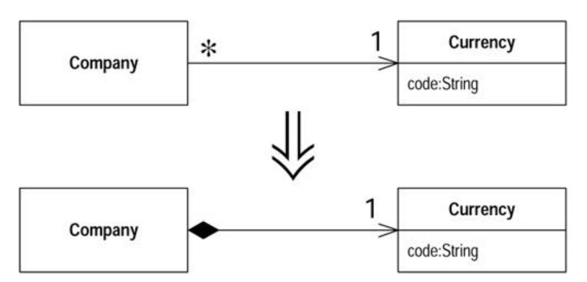

### Motivation

As with Change Value to Reference, the decision between a reference and a value object is not always clear. It is a decision that often needs reversing.

The trigger for going from a reference to a value is that working with the reference object becomes awkward. Reference objects have to be controlled in some way. You always need to ask the controller for the appropriate object. The memory links also can be awkward. Value objects are particularly useful for distributed and concurrent systems.

An important property of value objects is that they should be immutable. Any time you invoke a query on one, you should get the same result. If this is true, there is no problem having many objects represent the same thing. If the value is mutable, you have to ensure that changing any object also updates all the other objects that represent the same thing. That's so much of a pain that the easiest thing to do is to make it a reference object.

It's important to be clear on what *immutable* means. If you have a money class with a currency and a value, that's usually an immutable value object. That does not mean your salary cannot change. It means that to change your salary, you need to replace the existing money object with a new money object rather than changing the amount on an exisiting money object. Your relationship can change, but the money object itself does not.

### Mechanics

· Check that the candidate object is immutable or can become immutable.

?rarr; *If the object isn't currently immutable, use* Remove Setting Method *until it is.*

?rarr; *If the candidate cannot become immutable, you should abandon this refactoring.*

- · Create an equals method and a hash method.
- · Compile and test.
- · Consider removing any factory method and making a constructor public.

### Example

I begin with a currency class:

```
 class Currency...
 private String _code;
 public String getCode() {
 return _code;
 }
 private Currency (String code) {
 _code = code;
 }
```

All this class does is hold and return a code. It is a reference object, so to get an instance I need to use

```
 Currency usd = Currency.get("USD");
```

The currency class maintains a list of instances. I can't just use a constructor (which is why it's private).

```
 new Currency("USD").equals(new Currency("USD")) // returns false
```

To convert this to a value object, the key thing to do is verify that the object is immutable. If it isn't, I don't try to make this change, as a mutable value causes no end of painful aliasing.

In this case the object is immutable, so the next step is to define an equals method:

```
 public boolean equals(Object arg) {
 if (! (arg instanceof Currency)) return false;
 Currency other = (Currency) arg;
 return (_code.equals(other._code));
 }
```

If I define equals, I also need to define hashCode. The simple way to do this is to take the hash codes of all the fields used in the equals method and do a biwise xor (^) on them. Here it's easy because there's only one:

```
 public int hashCode() {
 return _code.hashCode();
 }
```

With both methods replaced, I can compile and test. I need to do both; otherwise any collection that relies on hashing, such as Hashtable, HashSet or HashMap, may act strangely.

Now I can create as many equal currencies as I like. I can get rid of all the controller behavior on the class and the factory method and just use the constructor, which I can now make public.

```
 new Currency("USD").equals(new Currency("USD")) // now returns true
```

## Replace Array with Object

You have an array in which certain elements mean different things.

*Replace the array with an object that has a field for each element.*

```
 String[] row = new String[3];
 row [0] = "Liverpool";
 row [1] = "15";
 Performance row = new Performance();
 row.setName("Liverpool");
 row.setWins("15");
```

### Motivation

Arrays are a common structure for organizing data. However, they should be used only to contain a collection of similar objects in some order. Sometimes, however, you see them used to contain a number of different things. Conventions such as "the first element on the array is the person's name" are hard to remember. With an object you can use names of fields and methods to convey this information so you don't have to remember it or hope the comments are up to date. You can also encapsulate the information and use Move Method to add behavior to it.

### Mechanics

- · Create a new class to represent the information in the array. Give it a public field for the array.
- · Change all users of the array to use the new class.
- · Compile and test.
- · One by one, add getters and setters for each element of the array. Name the accessors after the purpose of the array element. Change the clients to use the accessors. Compile and test after each change.
- · When all array accesses are replaced by methods, make the array private.
- · Compile.
- · For each element of the array, create a field in the class and change the accessors to use the field.
- · Compile and test after each element is changed.
- · When all elements have been replaced with fields, delete the array.

### Example

I start with an array that's used to hold the name, wins, and losses of a sports team. It would be declared as follows:

```
 String[] row = new String[3];
```

It would be used with code such as the following:

```
 row [0] = "Liverpool";
 row [1] = "15";
 String name = row[0];
 int wins = Integer.parseInt(row[1]);
```

To turn this into an object, I begin by creating a class:

```
 class Performance {}
```

For my first step I give the new class a public data member. (I know this is evil and wicked, but I'll reform in due course.)

```
 public String[] _data = new String[3];
```

Now I find the spots that create and access the array. When the array is created I use

```
 Performance row = new Performance();
```

When it is used, I change to

```
 row._data [0] = "Liverpool";
 row._data [1] = "15";
 String name = row._data[0];
 int wins = Integer.parseInt(row._data[1]);
```

One by one, I add more meaningful getters and setters. I start with the name:

```
 class Performance...
 public String getName() {
 return _data[0];
 }
 public void setName(String arg) {
 _data[0] = arg;
 }
```

I alter the users of that row to use the getters and setters instead:

```
 row.setName("Liverpool");
 row._data [1] = "15";
 String name = row.getName();
 int wins = Integer.parseInt(row._data[1]);
```

I can do the same with the second element. To make matters easier, I can encapsulate the data type conversion:

```
 class Performance...
 public int getWins() {
 return Integer.parseInt(_data[1]);
 }
 public void setWins(String arg) {
 _data[1] = arg;
 }
 ....
 client code...
 row.setName("Liverpool");
 row.setWins("15");
 String name = row.getName();
 int wins = row.getWins();
```

Once I've done this for each element, I can make the array private.

```
 private String[] _data = new String[3];
```

The most important part of this refactoring, changing the interface, is now done. It is also useful, however, to replace the array internally. I can do this by adding a field for each array element and changing the accessors to use it:

```
 class Performance...
 public String getName() {
 return _name;
 }
 public void setName(String arg) {
 _name = arg;
 }
 private String _name;
```

I do this for each element in the array. When I've done them all, I delete the array.

## Duplicate Observed Data

You have domain data available only in a GUI control, and domain methods need access.

*Copy the data to a domain object. Set up an observer to synchronize the two pieces of data.*

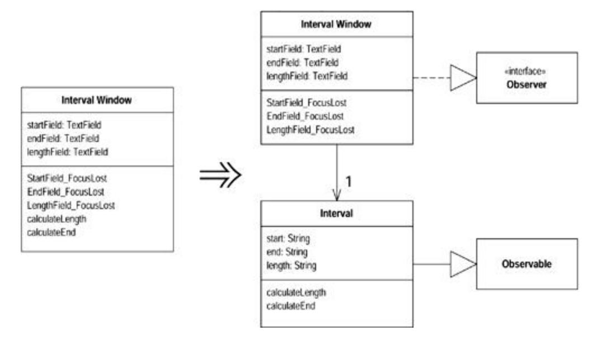

## Motivation

A well-layered system separates code that handles the user interface from code that handles the business logic. It does this for several reasons. You may want several interfaces for similar business logic; the user interface becomes too complicated if it does both; it is easier to maintain and evolve domain objects separate from the GUI; or you may have different developers handling the different pieces.

Although the behavior can be separated easily, the data often cannot. Data needs to be embedded in GUI control that has the same meaning as data that lives in the domain model. User interface frameworks, from model-view-controller (MVC) onward, used a multitiered system to provide mechanisms to allow you to provide this data and keep everything in sync.

If you come across code that has been developed with a two-tiered approach in which business logic is embedded into the user interface, you need to separate the behaviors. Much of this is about decomposing and moving methods. For the data, however, you cannot just move the data, you have to duplicate it and provide the synchronization mechanism.

### Mechanics

· Make the presentation class an observer of the domain class [Gang of Four].

?rarr; *If there is no domain class yet, create one.*

?rarr; *If there is no link from the presentation class to the domain class, put the domain class in a field of the presentation class.*

- · Use Self Encapsulate Field on the domain data within the GUI class.
- · Compile and test.
- · Add a call to the setting method in the event handler to update the component with its current value using direct access.

?rarr; *Put a method in the event handler that updates the value of the component on the basis of its current value. Of course this is completely unnecessary; you are just setting the value to its current value, but by using the setting method, you allow any behavior there to execute.*

?rarr; *When you make this change, don't use the getting method for the component; use direct access to the component. Later the getting method will pull the value from the domain, which does not change until the setting method executes.*

?rarr; *Make sure the event-handling mechanism is triggered by the test code.*

- · Compile and test.
- · Define the data and accessor methods in the domain class.

?rarr; *Make sure the setting method on the domain triggers the notify mechanism in the observer pattern.*

?rarr; *Use the same data type in the domain as is on the presentation (usually a string). Convert the data type in a later refactoring.*

- · Redirect the accessors to write to the domain field.
- · Modify the observer's update method to copy the data from the domain field to the GUI control.
- · Compile and test.

### Example

I start with the window in Figure 8.1. The behavior is very simple. Whenever you change the value in one of the text fields, the other ones update. If you change the start or end fields, the length is calculated; if you change the length field, the end is calculated.

**Figure 8.1. A simple GUI window**

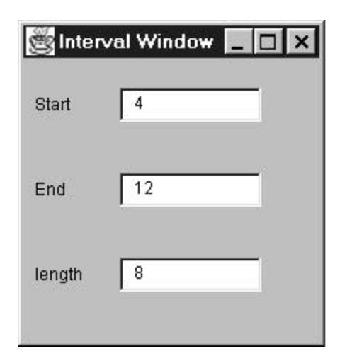

All the methods are on a single IntervalWindow class. The fields are set to respond to the loss of focus from the field.

```
 public class IntervalWindow extends Frame...
 java.awt.TextField _startField;
 java.awt.TextField _endField;
 java.awt.TextField _lengthField;
 class SymFocus extends java.awt.event.FocusAdapter
 {
 public void focusLost(java.awt.event.FocusEvent event)
 {
 Object object = event.getSource();
 if (object == _startField)
 StartField_FocusLost(event);
 else if (object == _endField)
 EndField_FocusLost(event);
 else if (object == _lengthField)
 LengthField_FocusLost(event);
 }
 }
```

The listener reacts by calling StartField\_FocusLost when focus is lost on the start field and EndField\_FocusLost and LengthField\_FocusLost for the other fields. These eventhandling methods look like this:

```
 void StartField_FocusLost(java.awt.event.FocusEvent event) {
 if (isNotInteger(_startField.getText()))
 _startField.setText("0");
 calculateLength();
 }
 void EndField_FocusLost(java.awt.event.FocusEvent event) {
 if (isNotInteger(_endField.getText()))
 _endField.setText("0");
```

```
 calculateLength();
 }
 void LengthField_FocusLost(java.awt.event.FocusEvent event) {
 if (isNotInteger(_lengthField.getText()))
 _lengthField.setText("0");
 calculateEnd();
 }
```

If you are wondering why I did the window this way, I just did it the easiest way my IDE (Cafe) encouraged me to.

All fields insert a zero if any noninteger characters appear and call the relevant calculation routine:

```
 void calculateLength(){
 try {
 int start = Integer.parseInt(_startField.getText());
 int end = Integer.parseInt(_endField.getText());
 int length = end - start;
 _lengthField.setText(String.valueOf(length));
 } catch (NumberFormatException e) {
 throw new RuntimeException ("Unexpected Number Format Error");
 }
}
void calculateEnd() {
 try {
 int start = Integer.parseInt(_startField.getText());
 int length = Integer.parseInt(_lengthField.getText());
 int end = start + length;
 _endField.setText(String.valueOf(end));
 } catch (NumberFormatException e) {
 throw new RuntimeException ("Unexpected Number Format Error");
 }
}
```

My overall task, should I choose to accept it, is to separate the non-visual logic from the GUI. Essentially this means moving calculateLength and calculateEnd to a separate domain class. To do this I need to refer to the start, end, and length data *without* referring to the window class. The only way I can do this is to duplicate this data in the domain class and synchronize the data with the GUI. This task is described by Duplicate Observed Data.

I don't currently have a domain class, so I create an (empty) one:

```
 class Interval extends Observable {}
```

The interval window needs a link to this new domain class.

```
 private Interval _subject;
```

I then need to properly initialize this field and make interval window an observer of the interval. I can do this by putting the following code in interval window's constructor:

```
 _subject = new Interval();
 _subject.addObserver(this);
 update(_subject, null);
```

I like to put this code at the end of construction process. The call to update ensures that as I duplicate the data in the domain class, the GUI is initialized from the domain class. To do this I need to declare that interval window implements Observer:

```
 public class IntervalWindow extends Frame implements Observer
```

To implement observer I need to create an update method. For the moment this can be blank:

```
 public void update(Observable observed, Object arg) {
 }
```

I can compile and test at this point. I haven't made any real changes yet, but I can make mistakes in the simplest places.

Now I can turn my attention to moving fields. As usual I make the changes one field at a time. To demonstrate my command of the English language, I'll start with the end field. The first task is to apply Self Encapsulate Field. Text fields are updated with getText and setText methods. I create accessors that call these

```
 String getEnd() {
 return _endField.getText();
 }
 void setEnd (String arg) {
 _endField.setText(arg);
 }
```

I find every reference to \_endField and replace them with the appropriate accessors:

```
 void calculateLength(){
 try {
 int start = Integer.parseInt(_startField.getText());
 int end = Integer.parseInt(getEnd());
 int length = end - start;
 _lengthField.setText(String.valueOf(length));
 } catch (NumberFormatException e) {
 throw new RuntimeException ("Unexpected Number Format Error");
 }
 }
 void calculateEnd() {
 try {
```

```
 int start = Integer.parseInt(_startField.getText());
 int length = Integer.parseInt(_lengthField.getText());
 int end = start + length;
 setEnd(String.valueOf(end));
 } catch (NumberFormatException e) {
 throw new RuntimeException ("Unexpected Number Format Error");
 }
 }
 void EndField_FocusLost(java.awt.event.FocusEvent event) {
 if (isNotInteger(getEnd()))
 setEnd("0");
 calculateLength();
 }
```

That's the normal process for Self Encapsulate Field. However, when you are working with a GUI, there is a complication. The user can change the field value directly without calling setEnd. So I need to put a call to setEnd into the event handler for the GUI. This call changes the value of the end field to the current value of the end field. Of course this does nothing at the moment, but it does ensure the user input goes through the setting method:

```
 void EndField_FocusLost(java.awt.event.FocusEvent event) {
 setEnd(_endField.getText());
 if (isNotInteger(getEnd()))
 setEnd("0");
 calculateLength();
 }
```

In this call I don't use getEnd; instead I access the field directly. I do this because later in the refactoring getEnd gets a value from the domain object, not from the field. At that point using it would mean that every time the user were to change the value of the field, this code would change it back again, so here I must use direct access. At this point I can compile and test the encapsulated behavior.

Now I add the end field to the domain class:

```
 class Interval...
 private String _end = "0";
```

I initialize it to the same value it is initialized to in the GUI. I now add getting and setting methods:

```
 class Interval...
 String getEnd() {
 return _end;
 }
 void setEnd (String arg) {
 _end = arg;
 setChanged();
 notifyObservers();
 }
```

Because I'm using the observer pattern, I have to add the notification code into the setting method. I use a string, not a (more logical) number. This is because I want to make the smallest possible change. Once I've successfully duplicated the data, I can change the internal data type to an integer.

I can now do one more compile and test before I perform the duplication. By doing all this preparatory work, I've minimized the risk in this tricky step.

The first change is updating the accessors on IntervalWindow to use Interval.

```
 class IntervalWindow...
 String getEnd() {
 return _subject.getEnd();
 }
 void setEnd (String arg) {
 _subject.setEnd(arg);
 }
```

I also need to update update to ensure the GUI reacts to the notification:

```
 class IntervalWindow...
 public void update(Observable observed, Object arg) {
 _endField.setText(_subject.getEnd());
 }
```

This is the other place where I have to use direct access. If I were to call the setting method, I would get into an infinite recursion.

I can now compile and test, and the data is properly duplicated.

I can repeat for the other two fields. Once this is done I can apply Move Method to move calculateEnd and calculateLength over to the interval class. At that point I have a domain class that contains all the domain behavior and data and separates it from the GUI code.

If I've done this, I consider getting rid of the GUI class completely. If my class is an older AWT class, I can get better looks by using Swing, and Swing does a better job with coordination. I can build the Swing GUI on top of the domain class. When I'm happy, I can remove the old GUI class.

### Using Event Listeners

*Duplicate Observed Data* also applies if you use event listeners instead of observer/observable. In this case you need to create a listener and event in the domain model (or you can use classes from AWT if you don't mind the dependency). The domain object then needs to register the listeners in the same way that observable does and send an event to them when it changes, as in the update method. The interval window can then use an inner class to implement the listener interface and call the appropriate update methods.

## Change Unidirectional Association to Bidirectional

You have two classes that need to use each other's features, but there is only a one-way link.

*Add back pointers, and change modifiers to update both sets*

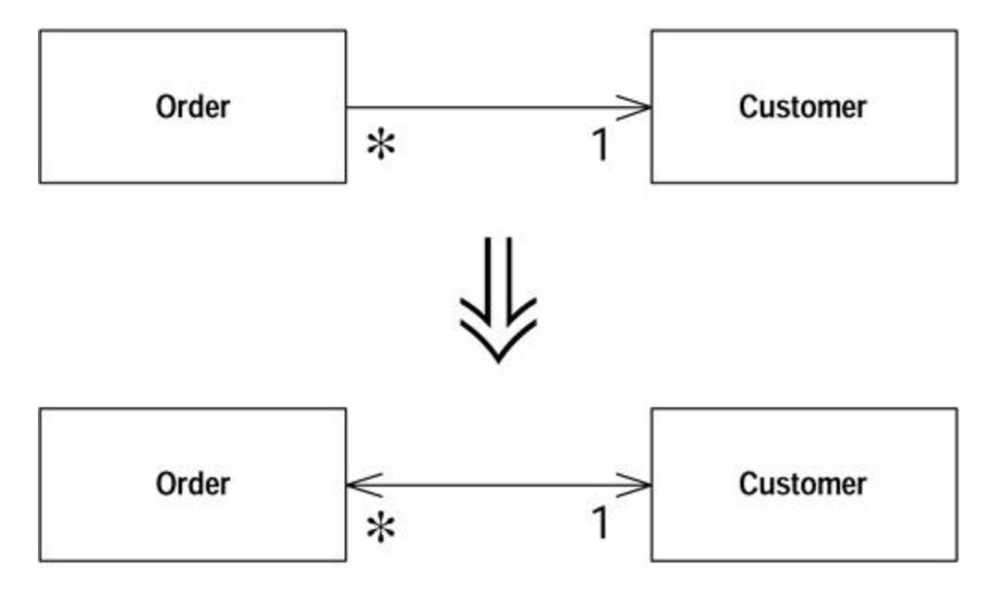

### Motivation

You may find that you have initially set up two classes so that one class refers to the other. Over time you may find that a client of the referred class needs to get to the objects that refer to it. This effectively means navigating backward along the pointer. Pointers are one-way links, so you can't do this. Often you can get around this problem by finding another route. This may cost in computation but is reasonable, and you can have a method on the referred class that uses this behavior. Sometimes, however, this is not easy, and you need to set up a two-way reference, sometimes called a *back pointer.* If you aren't used to back pointers, it's easy to become tangled up using them. Once you get used to the idiom, however, it is not too complicated.

The idiom is awkward enough that you should have tests, at least until you are comfortable with the idiom. Because I usually don't bother testing accessors (the risk is not high enough), this is the rare case of a refactoring that adds a test.

This refactoring uses back pointers to implement bidirectionality. Other techniques, such as link objects, require other refactorings.

### Mechanics

- · Add a field for the back pointer.
- · Decide which class will control the association.
- · Create a helper method on the noncontrolling side of the association. Name this method to clearly indicate its restricted use.
- · If the existing modifier is on the controlling side, modify it to update the back pointers.
- · If the existing modifier is on the controlled side, create a controlling method on the controlling side and call it from the existing modifier.

### Example

A simple program has an order that refers to a customer:

```
 class Order...
 Customer getCustomer() {
 return _customer;
 }
 void setCustomer (Customer arg) {
 _customer = arg;
 }
 Customer _customer;
```

The customer class has no reference to the order.

I start the refactoring by adding a field to the customer. As a customer can have several orders, so this field is a collection. Because I don't want a customer to have the same order more than once in its collection, the correct collection is a set:

```
 class Customer {
 private Set _orders = new HashSet();
```

Now I need to decide which class will take charge of the association. I prefer to let one class take charge because it keeps all the logic for manipulating the association in one place. My decision process runs as follows:

- 1. If both objects are reference objects and the association is one to many, then the object that has the one reference is the controller. (That is, if one customer has many orders, the order controls the association.)
- 2. If one object is a component of the other, the composite should control the association.
- 3. If both objects are reference objects and the association is many to many, it doesn't matter whether the order or the customer controls the association.

Because the order will take charge, I need to add a helper method to the customer that allows direct access to the orders collection. The order's modifier will use this to synchronize both sets of pointers. I use the name friendOrders to signal that this method is to be used only in this special case. I also minimize its visibility by making it package visibility if at all possible. I do have to make it public if the other class is in another package:

```
 class Customer...
 Set friendOrders() {
 /** should only be used by Order when modifying the association */
 return _orders;
 }
```

Now I update the modifier to update the back pointers:

```
 class Order...
 void setCustomer (Customer arg) ...
 if (_customer != null) _customer.friendOrders().remove(this);
 _customer = arg;
 if (_customer != null) _customer.friendOrders().add(this);
 }
```

The exact code in the controlling modifier varies with the multiplicity of the association. If the customer is not allowed to be null, I can forgo the null checks, but I need to check for a null argument. The basic pattern is always the same, however: first tell the other object to remove its pointer to you, set your pointer to the new object, and then tell the new object to add a pointer to you.

If you want to modify the link through the customer, let it call the controlling method:

```
 class Customer...
 void addOrder(Order arg) {
 arg.setCustomer(this);
 }
```

If an order can have many customers, you have a many-to-many case, and the methods look like this:

```
 class Order... //controlling methods
 void addCustomer (Customer arg) {
 arg.friendOrders().add(this);
 _customers.add(arg);
 }
 void removeCustomer (Customer arg) {
 arg.friendOrders().remove(this);
 _customers.remove(arg);
 }
class Customer...
 void addOrder(Order arg) {
 arg.addCustomer(this);
 }
 void removeOrder(Order arg) {
 arg.removeCustomer(this);
 }
```

## Change Bidirectional Association to Unidirectional

You have a two-way association but one class no longer needs features from the other.

*Drop the unneeded end of the association.*

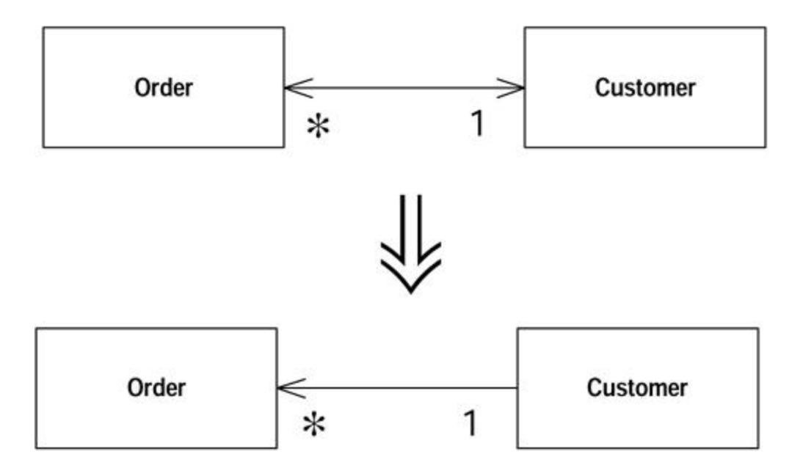

### Motivation

Bidirectional associations are useful, but they carry a price. The price is the added complexity of maintaining the two-way links and ensuring that objects are properly created and removed. Bidirectional associations are not natural for many programmers, so they often are a source of errors.

Lots of two-way links also make it easy for mistakes to lead to zombies: objects that should be dead but still hang around because of a reference that was not cleared.

Bidirectional associations force an interdependency between the two classes. Any change to one class may cause a change to another. If the classes are in separate packages, you get an interdependency between the packages. Many interdependencies lead to a highly coupled system, in which any little change leads to lots of unpredictable ramifications.

You should use bidirectional associations when you need to but not when you don't. As soon as you see a bidirectional association is no longer pulling its weight, drop the unnecessary end.

### Mechanics

· Examine all the readers of the field that holds the pointer that you wish to remove to see whether the removal is feasible.

?rarr; *Look at direct readers and further methods that call the methods.*

?rarr; *Consider whether it is possible to determine the other object without using the pointer. If so you will be able to use* Substitute Algorithm *on the getter to allow clients to use the getting method even if there is no pointer.*

?rarr; *Consider adding the object as an argument to all methods that use the field.*

- · If clients need to use the getter, use Self Encapsulate Field, carry out Substitute Algorithm on the getter, compile, and test.
- · If clients don't need the getter, change each user of the field so that it gets the object in the field another way. Compile and test after each change.
- · When no reader is left in the field, remove all updates to the field, and remove the field.

?rarr; *If there are many places that assign the field, use* Self Encapsulate Field *so that they all use a single setter. Compile and test. Change the setter to have an empty body. Compile and test. If that works, remove the field, the setter, and all calls to the setter.*

· Compile and test.

### Example

I start from where I ended up from the example in Change Unidirectional Association to Bidirectional. I have a customer and order with a bidirectional link:

```
 class Order...
 Customer getCustomer() {
 return _customer;
 }
 void setCustomer (Customer arg) {
 if (_customer != null) _customer.friendOrders().remove(this);
 _customer = arg;
 if (_customer != null) _customer.friendOrders().add(this);
 }
 private Customer _customer;
 class Customer...
 void addOrder(Order arg) {
 arg.setCustomer(this);
 }
 private Set _orders = new HashSet();
 Set friendOrders() {
 /** should only be used by Order */
 return _orders;
 }
```

I've found that in my application I don't have orders unless I already have a customer, so I want to break the link from order to customer.

The most difficult part of this refactoring is checking that I can do it. Once I know it's safe to do, it's easy. The issue is whether code relies on the customer field's being there. To remove the field, I need to provide an alternative.

My first move is to study all the readers of the field and the methods that use those readers. Can I find another way to provide the customer object? Often this means passing in the customer as an argument for an operation. Here's a simplistic example of this:

```
 class Order...
 double getDiscountedPrice() {
```

```
 return getGrossPrice() * (1 - _customer.getDiscount());
 }
```

#### changes to

```
 class Order...
 double getDiscountedPrice(Customer customer) {
 return getGrossPrice() * (1 - customer.getDiscount());
 }
```

This works particularly well when the behavior is being called by the customer, because then it's easy to pass itself in as an argument. So

```
 class Customer...
 double getPriceFor(Order order) {
 Assert.isTrue(_orders.contains(order)); // see Introduce 
Assertion (267)
 return order.getDiscountedPrice();
```

#### becomes

```
 class Customer...
 double getPriceFor(Order order) {
 Assert.isTrue(_orders.contains(order));
 return order.getDiscountedPrice(this);
 }
```

Another alternative I consider is changing the getter so that it gets the customer without using the field. If it does, I can use Substitute Algorithm on the body of Order.getCustomer. I might do something like this:

```
 Customer getCustomer() {
 Iterator iter = Customer.getInstances().iterator();
 while (iter.hasNext()) {
 Customer each = (Customer)iter.next();
 if (each.containsOrder(this)) return each;
 }
 return null;
 }
```

Slow, but it works. In a database context it may not even be that slow if I use a database query. If the order class contains methods that use the customer field, I can change them to use getCustomer by using Self Encapsulate Field.

If I retain the accessor, the association is still bidirectional in interface but is unidirectional in implementation. I remove the backpointer but retain the interdependencies between the two classes.

If I substitute the getting method, I substitute that and leave the rest till later. Otherwise I change the callers one at a time to use the customer from another source. I compile and test after each

change. In practice, this process usually is pretty rapid. If it were complicated, I would give up on this refactoring.

Once I've eliminated the readers of the field, I can work on the writers of the field. This is as simple as removing any assignments to the field and then removing the field. Because nobody is reading it any more, that shouldn't matter.

## Replace Magic Number with Symbolic Constant

You have a literal number with a particular meaning.

*Create a constant, name it after the meaning, and replace the number with it.*

```
 double potentialEnergy(double mass, double height) {
 return mass * 9.81 * height;
 }
 double potentialEnergy(double mass, double height) {
 return mass * GRAVITATIONAL_CONSTANT * height;
 }
 static final double GRAVITATIONAL_CONSTANT = 9.81;
```

### Motivation

Magic numbers are one of oldest ills in computing. They are numbers with special values that usually are not obvious. Magic numbers are really nasty when you need to reference the same logical number in more than one place. If the numbers might ever change, making the change is a nightmare. Even if you don't make a change, you have the difficulty of figuring out what is going on.

Many languages allow you to declare a constant. There is no cost in performance and there is a great improvement in readability.

Before you do this refactoring, you should always look for an alternative. Look at how the magic number is used. Often you can find a better way to use it. If the magic number is a type code, consider Replace Type Code with Class. If the magic number is the length of an array, use anArray.length instead when you are looping through the array.

### Mechanics

- · Declare a constant and set it to the value of the magic number.
- · Find all occurrences of the magic number.
- · See whether the magic number matches the usage of the constant; if it does, change the magic number to use the constant.
- · Compile.
- · When all magic numbers are changed, compile and test. At this point all should work as if nothing has been changed.

?rarr; *A good test is to see whether you can change the constant easily. This may mean altering some expected results to match the new value. This isn't always possible, but it is a good trick when it works.*

### Encapsulate Field

There is a public field.

*Make it private and provide accessors.*

```
 public String _name
 private String _name;
 public String getName() {return _name;}
 public void setName(String arg) {_name = arg;}
```

### Motivation

One of the principal tenets of object orientation is encapsulation, or data hiding. This says that you should never make your data public. When you make data public, other objects can change and access data values without the owning object's knowing about it. This separates data from behavior.

This is seen as a bad thing because it reduces the modularity of the program. When the data and behavior that uses it are clustered together, it is easier to change the code, because the changed code is in one place rather than scattered all over the program.

*Encapsulate Field* begins the process by hiding the data and adding accessors. But this is only the first step. A class with only accessors is a dumb class that doesn't really take advantage of the opportunities of objects, and an object is terrible thing to waste. Once I've done Encapsulate Field I look for methods that use the new methods to see whether they fancy packing their bags and moving to the new object with a quick Move Method.

### Mechanics

- · Create getting and setting methods for the field.
- · Find all clients outside the class that reference the field. If the client uses the value, replace the reference with a call to the getting method. If the client changes the value, replace the reference with a call to the setting method.

?rarr; *If the field is an object and the client invokes a modifier on the object, that is a use. Only use the setting method to replace an assignment.*

- · Compile and test after each change.
- · Once all clients are changed, declare the field as private.
- · Compile and test.

## Encapsulate Collection

A method returns a collection.

*Make it return a read-only view and provide add/remove methods.*

| Person                               |                           | Person                                                                       |
|--------------------------------------|---------------------------|------------------------------------------------------------------------------|
| getCourses():Set<br>setCourses(:Set) | $\Rightarrow \Rightarrow$ | getCourses():Unmodifiable Set<br>addCourse(:Course)<br>removeCourse(:Course) |

### Motivation

Often a class contains a collection of instances. This collection might be an array, list, set, or vector. Such cases often have the usual getter and setter for the collection.

However, collections should use a protocol slightly different from that for other kinds of data. The getter should not return the collection object itself, because that allows clients to manipulate the contents of the collection without the owning class's knowing what is going on. It also reveals too much to clients about the object's internal data structures. A getter for a multivalued attribute should return something that prevents manipulation of the collection and hides unnecessary details about its structure. How you do this varies depending on the version of Java you are using.

In addition there should not be a setter for collection: rather there should be operations to add and remove elements. This gives the owning object control over adding and removing elements from the collection.

With this protocol the collection is properly encapsulated, which reduces the coupling of the owning class to its clients.

### Mechanics

- · Add an add and remove method for the collection.
- · Initialize the field to an empty collection.
- · Compile.
- · Find callers of the setting method. Either modify the setting method to use the add and remove operations or have the clients call those operations instead.

?rarr; *Setters are used in two cases: when the collection is empty and when the setter is replacing a nonempty collection.*

?rarr; *You may wish to use* Rename Method *to rename the setter. Change it from set to initialize or replace.*

- · Compile and test.
- · Find all users of the getter that modify the collection. Change them to use the add and remove methods. Compile and test after each change.

· When all uses of the getter that modify have been changed, modify the getter to return a read-only view of the collection.

?rarr; *In Java 2, this is the appropriate unmodifiable collection view.*

?rarr; *In Java 1.1, you should return a copy of the collection.*

Compile and test.

· Find the users of the getter. Look for code that should be on the host object. Use Extract Method and Move Method to move the code to the host object.

For Java 2, you are done with that. For Java 1.1, however, clients may prefer to use an enumeration. To provide the enumeration:

· Change the name of the current getter and add a new getter to return an enumeration. Find users of the old getter and change them to use one of the new methods.

> ?rarr; *If this is too big a jump, use* Rename Method *on the old getter, create a new method that returns an enumeration, and change callers to use the new method.*

· Compile and test.

### Examples

Java 2 added a whole new group of classes to handle collections. It not only added new classes but also altered the style of using collections. As a result the way you encapsulate a collection is different depending on whether you use the Java 2 collections or the Java 1.1 collections. I discuss the Java 2 approach first, because I expect the more functional Java 2 collections to displace the Java 1.1 collections during the lifetime of this book.

### Example: Java 2

A person is taking courses. Our course is pretty simple:

```
 class Course...
 public Course (String name, boolean isAdvanced) {...};
 public boolean isAdvanced() {...};
```

I'm not going to bother with anything else on the course. The interesting class is the person:

```
 class Person...
 public Set getCourses() {
 return _courses;
 }
 public void setCourses(Set arg) {
 _courses = arg;
 }
 private Set _courses;
```

With this interface, clients adds courses with code such as

```
 Person kent = new Person();
 Set s = new HashSet();
 s.add(new Course ("Smalltalk Programming", false));
 s.add(new Course ("Appreciating Single Malts", true));
 kent.setCourses(s);
 Assert.equals (2, kent.getCourses().size());
 Course refact = new Course ("Refactoring", true);
 kent.getCourses().add(refact);
 kent.getCourses().add(new Course ("Brutal Sarcasm", 
false));
 Assert.equals (4, kent.getCourses().size());
 kent.getCourses().remove(refact);
 Assert.equals (3, kent.getCourses().size());
```

A client that wants to know about advanced courses might do it this way:

```
 Iterator iter = person.getCourses().iterator();
 int count = 0;
 while (iter.hasNext()) {
 Course each = (Course) iter.next();
 if (each.isAdvanced()) count ++;
 }
```

The first thing I want to do is to create the proper modifiers for the collection and compile, as follows:

```
 class Person
 public void addCourse (Course arg) {
 _courses.add(arg);
 }
 public void removeCourse (Course arg) {
 _courses.remove(arg);
 }
```

Life will be easier if I initialize the field as well:

```
 private Set _courses = new HashSet();
```

I then look at the users of the setter. If there are many clients and the setter is used heavily, I need to replace the body of the setter to use the add and remove operations. The complexity of this process depends on how the setter is used. There are two cases. In the simplest case the client uses the setter to initialize the values, that is, there are no courses before the setter is applied. In this case I replace the body of the setter to use the add method:

```
 class Person...
 public void setCourses(Set arg) {
 Assert.isTrue(_courses.isEmpty());
```

```
 Iterator iter = arg.iterator();
 while (iter.hasNext()) {
 addCourse((Course) iter.next());
 }
 }
```

After changing the body this way, it is wise to use Rename Method to make the intention clearer.

```
 public void initializeCourses(Set arg) {
 Assert.isTrue(_courses.isEmpty());
 Iterator iter = arg.iterator();
 while (iter.hasNext()) {
 addCourse((Course) iter.next());
 }
 }
```

In the more general case I have to use the remove method to remove every element first and then add the elements. But I find that occurs rarely (as general cases often do).

If I know that I don't have any additional behavior when adding elements as I initialize, I can remove the loop and use addAll.

```
 public void initializeCourses(Set arg) {
 Assert.isTrue(_courses.isEmpty());
 _courses.addAll(arg);
 }
```

I can't just assign the set, even though the previous set was empty. If the client simply create a set and use the setter, I can get them to use the add were to modify the set after passing it in, that would violate encapsulation. I have to make a copy.

If the clients simply create a set and use the setter, I can get them to use the add and remove methods directly and remove the setter completely. Code such as

```
 Person kent = new Person();
 Set s = new HashSet();
 s.add(new Course ("Smalltalk Programming", false));
 s.add(new Course ("Appreciating Single Malts", true));
 kent.initializeCourses(s);
```

#### becomes

```
 Person kent = new Person();
 kent.addCourse(new Course ("Smalltalk Programming", 
false));
 kent.addCourse(new Course ("Appreciating Single Malts", 
true));
```

Now I start looking at users of the getter. My first concern is cases in which someone uses the getter to modify the underlying collection, for example:

```
 kent.getCourses().add(new Course ("Brutal Sarcasm", false));
```

I need to replace this with a call to the new modifier:

```
 kent.addCourse(new Course ("Brutal Sarcasm", false));
```

Once I've done this for everyone, I can check that nobody is modifying through the getter by changing the getter body to return an unmodifiable view:

```
 public Set getCourses() {
 return Collections.unmodifiableSet(_courses);
 }
```

At this point I've encapsulated the collection. No one can change the elements of collection except through methods on the person.

### Moving Behavior into the Class

I have the right interface. Now I like to look at the users of the getter to find code that ought to be on person. Code such as

```
 Iterator iter = person.getCourses().iterator();
 int count = 0;
 while (iter.hasNext()) {
 Course each = (Course) iter.next();
 if (each.isAdvanced()) count ++;
 }
```

is better moved to person because it uses only person's data. First I use Extract Method on the code:

```
 int numberOfAdvancedCourses(Person person) {
 Iterator iter = person.getCourses().iterator();
 int count = 0;
 while (iter.hasNext()) {
 Course each = (Course) iter.next();
 if (each.isAdvanced()) count ++;
 }
 return count;
 }
```

And then I use Move Method to move it to person:

```
 class Person...
```

```
 int numberOfAdvancedCourses() {
 Iterator iter = getCourses().iterator();
 int count = 0;
 while (iter.hasNext()) {
 Course each = (Course) iter.next();
 if (each.isAdvanced()) count ++;
 }
 return count;
 }
```

#### A common case is

```
 kent.getCourses().size()
```

#### which can be changed to the more readable

```
 kent.numberOfCourses()
 class Person...
 public int numberOfCourses() {
 return _courses.size();
 }
```

A few years ago I was concerned that moving this kind of behavior over to person would lead to a bloated person class. In practice, I've found that usually isn't a problem.

### Example: Java 1.1

In many ways the Java 1.1 case is pretty similar to the Java 2. I use the same example but with a vector:

```
 class Person...
 public Vector getCourses() {
 return _courses;
 }
 public void setCourses(Vector arg) {
 _courses = arg;
 }
 private Vector _courses;
```

Again I begin by creating modifiers and initializing the field as follows:

```
 class Person
 public void addCourse(Course arg) {
 _courses.addElement(arg);
 }
 public void removeCourse(Course arg) {
 _courses.removeElement(arg);
 }
 private Vector _courses = new Vector();
```

I can modify the setCourses to initialize the vector:

```
 public void initializeCourses(Vector arg) {
 Assert.isTrue(_courses.isEmpty());
 Enumeration e = arg.elements();
 while (e.hasMoreElements()) {
 addCourse((Course) e.nextElement());
 }
 }
```

I change users of the getter to use the modifiers, so

```
 kent.getCourses().addElement(new Course ("Brutal Sarcasm", 
false));
becomes
```

```
 kent.addCourse(new Course ("Brutal Sarcasm", false));
```

My final step changes because vectors do not have an unmodifiable version:

```
 class Person...
 Vector getCourses() {
 return (Vector) _courses.clone();
 }
```

At this point I've encapsulated the collection. No one can change the elements of collection except through the person.

### Example: Encapsulating Arrays

Arrays are commonly used, especially by programmers who are not familiar with collections. I rarely use arrays, because I prefer the more behaviorally rich collections. I often change arrays into collections as I do the encapsulation.

This time I begin with a string array for skills:

```
 String[] getSkills() {
 return _skills;
 }
 void setSkills (String[] arg) {
 _skills = arg;
 }
 String[] _skills;
```

Again I begin by providing a modifier operation. Because the client is likely to change a value at a particular position, I need a set operation for a particular element:

```
 void setSkill(int index, String newSkill) {
 _skills[index] = newSkill;
 }
```

If I need to set the whole array, I can do so using the following operation:

```
 void setSkills (String[] arg) {
 _skills = new String[arg.length];
 for (int i=0; i < arg.length; i++)
 setSkill(i,arg[i]);
 }
```

There are numerous pitfalls here if things have to be done with the removed elements. The situation is complicated by what happens when the argument array is different in length from the original array. That's another reason to prefer a collection.

At this point I can start looking at users of the getter. I can change

```
 kent.getSkills()[1] = "Refactoring";
to
 kent.setSkill(1,"Refactoring");
```

When I've made all the changes, I can modify the getter to return a copy:

```
 String[] getSkills() {
 String[] result = new String[_skills.length];
 System.arraycopy(_skills, 0, result, 0, _skills.length);
 return result;
 }
```

This is a good point to replace the array with a list:

```
 class Person...
 String[] getSkills() {
 return (String[]) _skills.toArray(new String[0]);
 }
 void setSkill(int index, String newSkill) {
 _skills.set(index,newSkill);
 }
 List _skills = new ArrayList();
```

## Replace Record with Data Class

You need to interface with a record structure in a traditional programming environment.

*Make a dumb data object for the record.*

### Motivation

Record structures are a common feature of programming environments. There are various reasons for bringing them into an object-oriented program. You could be copying a legacy program, or you could be communicating a structured record with a traditional programming API, or a database record. In these cases it is useful to create an interfacing class to deal with this external element. It is simplest to make the class look like the external record. You move other fields and methods into the class later. A less obvious but very compelling case is an array in which the element in each index has a special meaning. In this case you use Replace Array with Object.

### Mechanics

- · Create a class to represent the record.
- · Give the class a private field with a getting method and a setting method for each data item.

You now have a dumb data object. It has no behavior yet but further refactoring will explore that issue.

## Replace Type Code with Class

A class has a numeric type code that does not affect its behavior.

*Replace the number with a new class.*

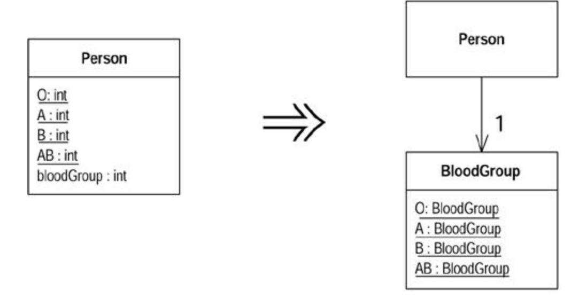

### Motivation

Numeric type codes, or enumerations, are a common feature of C-based languages. With symbolic names they can be quite readable. The problem is that the symbolic name is only an alias; the compiler still sees the underlying number. The compiler type checks using the number not the symbolic name. Any method that takes the type code as an argument expects a number, and there is nothing to force a symbolic name to be used. This can reduce readability and be a source of bugs.

If you replace the number with a class, the compiler can type check on the class. By providing factory methods for the class, you can statically check that only valid instances are created and that those instances are passed on to the correct objects.

Before you do *Replace Type Code with Class,* however, you need to consider the other type code replacements. Replace the type code with a class only if the type code is pure data, that is, it does not cause different behavior inside a switch statement. For a start Java can only switch on an integer, not an arbitrary class, so the replacement will fail. More important than that, any switch has to be removed with Replace Conditional with Polymorphism. In order for that refactoring, the type code first has to be handled with Replace Type Code with Subclasses or Replace Type Code with State/Strategy.

Even if a type code does not cause different behavior depending on its value, there might be behavior that is better placed in the type code class, so be alert to the value of a Move Method or two.

### Mechanics

· Create a new class for the type code.

?rarr; *The class needs a code field that matches the type code and a getting method for this value. It should have static variables for the allowable instances of the class and a static method that returns the appropriate instance from an argument based on the original code.*

· Modify the implementation of the source class to use the new class.

?rarr; *Maintain the old code-based interface, but change the static fields to use new class to generate the codes. Alter the other code-based methods to get the code numbers from the new class.*

· Compile and test.

?rarr; *At this point the new class can do run-time checking of the codes.*

· For each method on the source class that uses the code, create a new method that uses the new class instead.

> ?rarr; *Methods that use the code as an argument need new methods that use an instance of the new class as an argument. Methods that return a code need a new method that returns the code. It is often wise to use* Rename Method *on an old accessor before creating a new one to make the program clearer when it is using an old code.*

- · One by one, change the clients of the source class so that they use the new interface.
- · Compile and test after each client is updated.

?rarr; *You may need to alter several methods before you have enough consistency to compile and test.*

- · Remove the old interface that uses the codes, and remove the static declarations of the codes.
- · Compile and test.

### Example

A person has a blood group modeled with a type code:

```
 class Person {
 public static final int O = 0;
 public static final int A = 1;
 public static final int B = 2;
 public static final int AB = 3;
 private int _bloodGroup;
 public Person (int bloodGroup) {
 _bloodGroup = bloodGroup;
 }
 public void setBloodGroup(int arg) {
 _bloodGroup = arg;
 }
 public int getBloodGroup() {
 return _bloodGroup;
 }
 }
```

I start by creating a new blood group class with instances that contain the type code number:

```
 class BloodGroup {
 public static final BloodGroup O = new BloodGroup(0);
 public static final BloodGroup A = new BloodGroup(1);
 public static final BloodGroup B = new BloodGroup(2);
 public static final BloodGroup AB = new BloodGroup(3);
 private static final BloodGroup[] _values = {O, A, B, AB};
 private final int _code;
 private BloodGroup (int code ) {
 _code = code;
 }
 public int getCode() {
 return _code;
 }
 public static BloodGroup code(int arg) {
```

```
 return _values[arg];
 }
 }
```

I then replace the code in Person with code that uses the new class:

```
 class Person {
 public static final int O = BloodGroup.O.getCode();
 public static final int A = BloodGroup.A.getCode();
 public static final int B = BloodGroup.B.getCode();
 public static final int AB = BloodGroup.AB.getCode();
 private BloodGroup _bloodGroup;
 public Person (int bloodGroup) {
 _bloodGroup = BloodGroup.code(bloodGroup);
 }
 public int getBloodGroup() {
 return _bloodGroup.getCode();
 }
 public void setBloodGroup(int arg) {
 _bloodGroup = BloodGroup.code (arg);
 }
 }
```

At this point I have run-time checking within the blood group class. To really gain from the change I have to alter the users of the person class to use blood group instead of integers.

To begin I use Rename Method on the accessor for the person's blood group to clarify the new state of affairs:

```
 class Person...
 public int getBloodGroupCode() {
 return _bloodGroup.getCode();
 }
```

I then add a new getting method that uses the new class:

```
 public BloodGroup getBloodGroup() {
 return _bloodGroup;
 }
```

I also create a new constructor and setting method that uses the class:

```
 public Person (BloodGroup bloodGroup ) {
 _bloodGroup = bloodGroup;
```

```
 }
 public void setBloodGroup(BloodGroup arg) {
 _bloodGroup = arg;
 }
```

Now I go to work on the clients of Person. The art is to work on one client at a time so that you can take small steps. Each client may need various changes, and that makes it more tricky. Any reference to the static variables needs to be changed. So

```
 Person thePerson = new Person(Person.A)
```

#### becomes

```
 Person thePerson = new Person(BloodGroup.A);
```

References to the getting method need to use the new one, so

```
 thePerson.getBloodGroupCode()
```

#### becomes

```
 thePerson.getBloodGroup().getCode()
```

The same is true for setting methods, so

```
 thePerson.setBloodGroup(Person.AB)
```

#### becomes

```
 thePerson.setBloodGroup(BloodGroup.AB)
```

Once this is done for all clients of Person, I can remove the getting method, constructor, static definitions, and setting methods that use the integer:

```
 class Person ...
 public static final int O = BloodGroup.O.getCode();
 public static final int A = BloodGroup.A.getCode();
 public static final int B = BloodGroup.B.getCode();
 public static final int AB = BloodGroup.AB.getCode();
 public Person (int bloodGroup) {
 _bloodGroup = BloodGroup.code(bloodGroup);
 }
 public int getBloodGroup() {
 return _bloodGroup.getCode();
 }
```

```
 public void setBloodGroup(int arg) {
 _bloodGroup = BloodGroup.code (arg);
 }
```

I can also privatize the methods on blood group that use the code:

```
 class BloodGroup...
 private int getCode() {
 return _code;
 }
 private static BloodGroup code(int arg) {
 return _values[arg];
 }
```

## Replace Type Code with Subclasses

You have an immutable type code that affects the behavior of a class.

*Replace the type code with subclasses.*

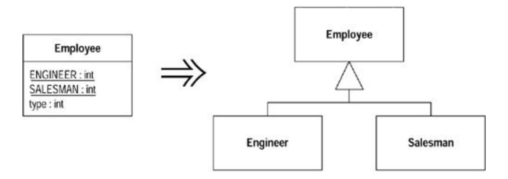

### Motivation

If you have a type code that does not affect behavior, you can use Replace Type Code with Class. However, if the type code affects behavior, the best thing to do is to use polymorphism to handle the variant behavior.

This situation usually is indicated by the presence of case-like conditional statements. These may be switches or if-then-else constructs. In either case they test the value of the type code and then execute different code depending on the value of the type code. Such conditionals need to be refactored with Replace Conditional with Polymorphism. For this refactoring to work, the type code has to be replaced with an inheritance structure that will host the polymorphic behavior. Such an inheritance structure has a class with subclasses for each type code.

The simplest way to establish this structure is *Replace Type Code with Subclasses.* You take the class that has the type code and create a subclass for each type code. However, there are cases in which you can't do this. In the first the value of the type code changes after the object is

created. In the second the class with the type code is already subclassed for another reason. In either of these cases you need to use *Replace Type Code with State/Strategy.*

*Replace Type Code with Subclasses* is primarily a scaffolding move that enables Replace Conditional with Polymorphism. The trigger to use *Replace Type Code with Subclasses* is the presence of conditional statements. If there are no conditional statements, Replace Type Code with Class is the better and less critical move.

Another reason to *Replace Type Code with Subclasses* is the presence of features that are relevant only to objects with certain type codes. Once you've done this refactoring, you can use Push Down Method and Push Down Field to clarify that these features are relevant only in certain cases.

The advantage of *Replace Type Code with Subclasses* is that it moves knowledge of the variant behavior from clients of the class to the class itself. If I add new variants, all I need to do is add a subclass. Without polymorphism I have to find all the conditionals and change those. So this refactoring is particularly valuable when variants keep changing.

### Mechanics

· Self-encapsulate the type code.

?rarr; *If the type code is passed into the constructor, you need to replace the constructor with a factory method.*

· For each value of the type code, create a subclass. Override the getting method of the type code in the subclass to return the relevant value.

> ?rarr; *This value is hard coded into the return (e.g.,* return 1*). This looks messy, but it is a temporary measure until all case statements have been replaced.*

- · Compile and test after replacing each type code value with a subclass.
- · Remove the type code field from the superclass. Declare the accessors for the type code as abstract.
- · Compile and test.

### Example

I use the boring and unrealistic example of employee payment:

```
 class Employee...
 private int _type;
 static final int ENGINEER = 0;
 static final int SALESMAN = 1;
 static final int MANAGER = 2;
 Employee (int type) {
 _type = type;
 }
```

The first step is to use Self Encapsulate Field on the type code:

```
 int getType() {
 return _type;
 }
```

Because the employee's constructor uses a type code as a parameter, I need to replace it with a factory method:

```
 Employee create(int type) {
 return new Employee(type);
 }
 private Employee (int type) {
 _type = type;
 }
```

I can now start with engineer as a subclass. First I create the subclass and the overriding method for the type code:

```
 class Engineer extends Employee {
 int getType() {
 return Employee.ENGINEER;
 }
 }
```

I also need to alter the factory method to create the appropriate object:

```
 class Employee
 static Employee create(int type) {
 if (type == ENGINEER) return new Engineer();
 else return new Employee(type);
 }
```

I continue, one by one, until all the codes are replaced with subclasses. At this point I can get rid of the type code field on employee and make getType an abstract method. At this point the factory method looks like this:

```
 abstract int getType();
 static Employee create(int type) {
 switch (type) {
 case ENGINEER:
 return new Engineer();
 case SALESMAN:
 return new Salesman();
 case MANAGER:
 return new Manager();
 default:
```

```
 throw new IllegalArgumentException("Incorrect type code 
value");
 }
 }
```

Of course this is the kind of switch statement I would prefer to avoid. But there is only one, and it is only used at creation.

Naturally once you have created the subclasses you should use Push Down Method and Push Down Field on any methods and fields that are relevant only for particular types of employee.

### Replace Type Code with State/Strategy

You have a type code that affects the behavior of a class, but you cannot use subclassing.

*Replace the type code with a state object.*

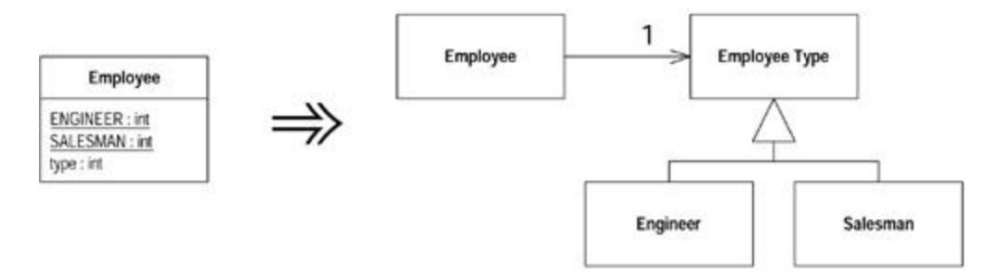

### Motivation

This is similar to Replace Type Code with Subclasses, but can be used if the type code changes during the life of the object or if another reason prevents subclassing. It uses either the state or strategy pattern [Gang of Four].

State and strategy are very similar, so the refactoring is the same whichever you use, and it doesn't really matter. Choose the pattern that better fits the specific circumstances. If you are trying to simplify a single algorithm with Replace Conditional with Polymorphism, strategy is the better term. If you are going to move state-specific data and you think of the object as changing state, use the state pattern.

### Mechanics

- · Self-encapsulate the type code.
- · Create a new class, and name it after the purpose of the type code. This is the state object.
- · Add subclasses of the state object, one for each type code.

?rarr; *It is easier to add the subclasses all at once, rather than one at a time.*

- · Create an abstract query in the state object to return the type code. Create overriding queries of each state object subclass to return the correct type code.
- · Compile.

- · Create a field in the old class for the new state object.
- · Adjust the type code query on the original class to delegate to the state object.
- · Adjust the type code setting methods on the original class to assign an instance of the appropriate state object subclass.
- · Compile and test.

### Example

I again use the tiresome and brainless example of employee payment:

```
 class Employee {
 private int _type;
 static final int ENGINEER = 0;
 static final int SALESMAN = 1;
 static final int MANAGER = 2;
 Employee (int type) {
 _type = type;
 }
```

Here's an example of the kind of conditional behavior that would use these codes:

```
 int payAmount() {
 switch (_type) {
 case ENGINEER:
 return _monthlySalary;
 case SALESMAN:
 return _monthlySalary + _commission;
 case MANAGER:
 return _monthlySalary + _bonus;
 default:
 throw new RuntimeException("Incorrect Employee");
 }
 }
```

I assume this is an exciting and go-ahead company that allows promotion of managers to engineers. Thus the type code is mutable, and I can't use subclassing. My first step, as ever, is to self-encapsulate the type code:

```
 Employee (int type) {
 setType (type);
 }
 int getType() {
 return _type;
 }
 void setType(int arg) {
 _type = arg;
 }
```

```
 int payAmount() {
 switch (getType()) {
 case ENGINEER:
 return _monthlySalary;
 case SALESMAN:
 return _monthlySalary + _commission;
 case MANAGER:
 return _monthlySalary + _bonus;
 default:
 throw new RuntimeException("Incorrect Employee");
 }
 }
```

Now I declare the state class. I declare this as an abstract class and provide an abstract method for returning the type code:

```
 abstract class EmployeeType {
 abstract int getTypeCode();
 }
```

I now create the subclasses:

```
 class Engineer extends EmployeeType {
 int getTypeCode () {
 return Employee.ENGINEER;
 }
 }
class Manager extends EmployeeType {
 int getTypeCode () {
 return Employee.MANAGER;
 }
 }
class Salesman extends EmployeeType {
 int getTypeCode () {
 return Employee.SALESMAN;
 }
 }
```

I compile so far, and it is all so trivial that even for me it compiles easily. Now I actually hook the subclasses into the employee by modifying the accessors for the type code:

```
 class Employee...
 private EmployeeType _type;
 int getType() {
 return _type.getTypeCode();
 }
 void setType(int arg) {
```

```
 switch (arg) {
 case ENGINEER:
 _type = new Engineer();
 break;
 case SALESMAN:
 _type = new Salesman();
 break;
 case MANAGER:
 _type = new Manager();
 break;
 default:
 throw new IllegalArgumentException("Incorrect Employee 
Code");
 }
 }
```

This means I now have a switch statement here. Once I'm finished refactoring, it will be the only one anywhere in the code, and it will be executed only when the type is changed. I can also use Replace Constructor with Factory Method to create factory methods for different cases. I can eliminate all the other case statements with a swift thrust of Replace Conditional with Polymorphism.

I like to finish Replace Type Code with State/Strategy by moving all knowledge of the type codes and subclasses over to the new class. First I copy the type code definitions into the employee type, create a factory method for employee types, and adjust the setting method on employee:

```
 class Employee...
 void setType(int arg) {
 _type = EmployeeType.newType(arg);
 }
class EmployeeType...
 static EmployeeType newType(int code) {
 switch (code) {
 case ENGINEER:
 return new Engineer();
 case SALESMAN:
 return new Salesman();
 case MANAGER:
 return new Manager();
 default:
 throw new IllegalArgumentException("Incorrect Employee 
Code");
 }
 }
 static final int ENGINEER = 0;
 static final int SALESMAN = 1;
 static final int MANAGER = 2;
```

Then I remove the type code definitions from the employee and replace them with references to the employee type:

```
 class Employee...
 int payAmount() {
 switch (getType()) {
 case EmployeeType.ENGINEER:
 return _monthlySalary;
 case EmployeeType.SALESMAN:
 return _monthlySalary + _commission;
 case EmployeeType.MANAGER:
 return _monthlySalary + _bonus;
 default:
 throw new RuntimeException("Incorrect Employee");
 }
 }
```

I'm now ready to use Replace Conditional with Polymorphism on payAmount.

## Replace Subclass with Fields

You have subclasses that vary only in methods that return constant data.

*Change the methods to superclass fields and eliminate the subclasses.*

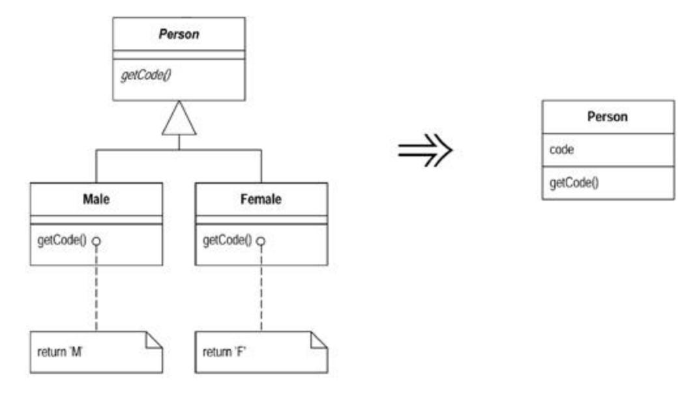

### Motivation

You create subclasses to add features or allow behavior to vary. One form of variant behavior is the constant method [Beck]. A constant method is one that returns a hard-coded value. This can be very useful on subclasses that return different values for an accessor. You define the accessor in the superclass and implement it with different values on the subclass.

Although constant methods are useful, a subclass that consists only of constant methods is not doing enough to be worth existing. You can remove such subclasses completely by putting fields in the superclass. By doing that you remove the extra complexity of the subclasses.

### Mechanics

- · Use Replace Constructor with Factory Method on the subclasses.
- · If any code refers to the subclasses, replace the reference with one to the superclass.
- · Declare final fields for each constant method on the superclass.
- · Declare a protected superclass constructor to initialize the fields.
- · Add or modify subclass constructors to call the new superclass constructor.
- · Compile and test.
- · Implement each constant method in the superclass to return the field and remove the method from the subclasses.
- · Compile and test after each removal.
- · When all the subclass methods have been removed, use Inline Method to inline the constructor into the factory method of the superclass.
- · Compile and test.
- · Remove the subclass.
- · Compile and test.
- · Repeat inlining the constructor and elminating each subclass until they are all gone.

### Example

I begin with a person and sex-oriented subclasses:

```
 abstract class Person {
 abstract boolean isMale();
 abstract char getCode();
 ...
 class Male extends Person {
 boolean isMale() {
 return true;
 }
 char getCode() {
 return 'M';
 }
 }
 class Female extends Person {
 boolean isMale() {
 return false;
 }
 char getCode() {
 return 'F';
 }
 }
```

Here the only difference between the subclasses is that they have implementations of abstract methods that return a hard-coded constant method [Beck]. I remove these lazy subclasses.

First I need to use Replace Constructor with Factory Method. In this case I want a factory method for each subclass:

```
 class Person...
 static Person createMale(){
```

```
 return new Male();
 }
 static Person createFemale() {
 return new Female();
 }
```

I then replace calls of the form

```
 Person kent = new Male();
with
 Person kent = Person.createMale();
```

Once I've replaced all of these calls I shouldn't have any references to the subclasses. I can check this with a text search and check that at least nothing accesses them outside the package by making the classes private.

Now I declare fields for each constant method on the superclass:

```
 class Person...
 private final boolean _isMale;
 private final char _code;
```

I add a protected constructor on the superclass:

```
 class Person...
 protected Person (boolean isMale, char code) {
 _isMale = isMale;
 _code = code;
 }
```

I add constructors that call this new constructor:

```
 class Male...
 Male() {
 super (true, 'M');
 }
 class Female...
 Female() {
 super (false, 'F');
 }
```

With that done I can compile and test. The fields are created and initialized, but so far they aren't being used. I can now start bringing the fields into play by putting accessors on the superclass and eliminating the subclass methods:

```
 class Person...
 boolean isMale() {
 return _isMale;
 }
 class Male...
 boolean isMale() {
 return true;
 }
```

I can do this one field and one subclass at a time or all in one go if I'm feeling lucky.

After all the subclasses are empty, so I remove the abstract marker from the person class and use Inline Method to inline the subclass constructor into the superclass:

```
 class Person
 static Person createMale(){
 return new Person(true, 'M');
 }
```

After compiling and testing I delete the male class and repeat the process for the female class.
