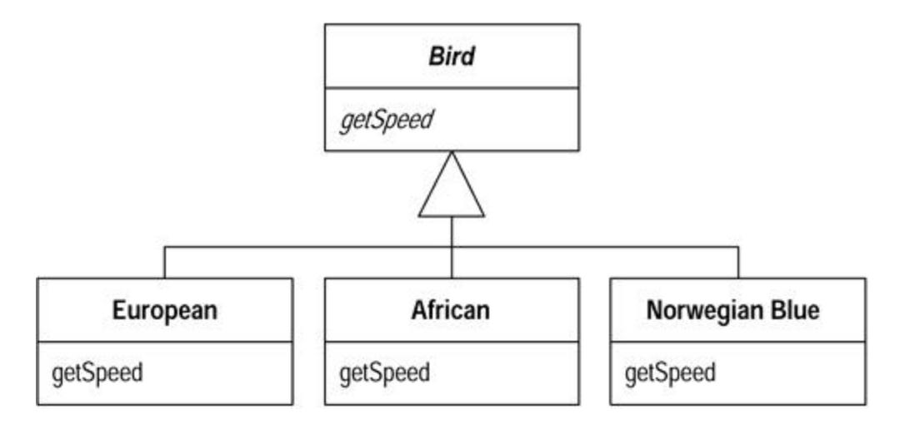
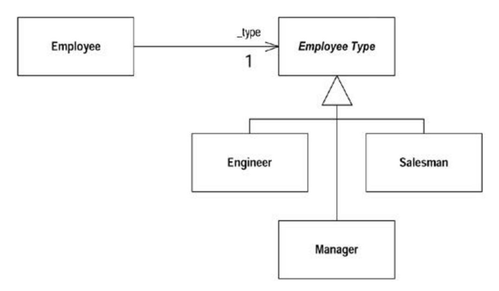
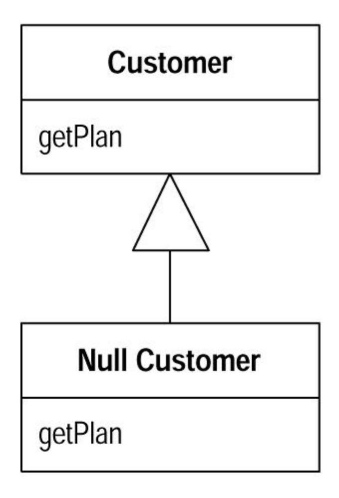

# Chapter 9: Simplifying Conditional Expressions

Conditional logic has a way of getting tricky, so here are a number of refactorings you can use to simplify it. The core refactoring here is Decompose Conditional, which entails breaking a conditional into pieces. It is important because it separates the switching logic from the details of what happens.

The other refactorings in this chapter involve other important cases. Use Consolidate Conditional Expression when you have several tests and all have the same effect. Use Consolidate Duplicate Conditional Fragments to remove any duplication within the conditional code.

If you are working with code developed in a one exit point mentality, you often find control flags that allow the conditions to work with this rule. I don't follow the rule about one exit point from a method. Hence I use Replace Nested Conditional with Guard Clauses to clarify special case conditionals and Remove Control Flag to get rid of the awkward control flags.

Object-oriented programs often have less conditional behavior than procedural programs because much of the conditional behavior is handled by polymorphism. Polymorphism is better because the caller does not need to know about the conditional behavior, and it is thus easier to extend the conditions. As a result, object-oriented programs rarely have switch (case) statements. Any that show up are prime candidates for Replace Conditional with Polymorphism.

One of the most useful, but less obvious, uses of polymorphism is to use Introduce Null Object to remove checks for a null value.

## Decompose Conditional

You have a complicated conditional (if-then-else) statement.

*Extract methods from the condition, then part, and else parts.*

```
 if (date.before (SUMMER_START) || date.after(SUMMER_END))
 charge = quantity * _winterRate + _winterServiceCharge;
 else charge = quantity * _summerRate;
 if (notSummer(date))
 charge = winterCharge(quantity);
 else charge = summerCharge (quantity);
```

### Motivation

One of the most common areas of complexity in a program lies in complex conditional logic. As you write code to test conditions and to do various things depending on various conditions, you quickly end up with a pretty long method. Length of a method is in itself a factor that makes it harder to read, but conditions increase the difficulty. The problem usually lies in the fact that the code, both in the condition checks and in the actions, tells you what happens but can easily obscure why it happens.

As with any large block of code, you can make your intention clearer by decomposing it and replacing chunks of code with a method call named after the intention of that block of code. With conditions you can receive further benefit by doing this for the conditional part and each of the alternatives. This way you highlight the condition and make it clearly what you are branching on. You also highlight the reason for the branching.

### Mechanics

- · Extract the condition into its own method.
- · Extract the then part and the else part into their own methods.

If I find a nested conditional, I usually first look to see whether I should use Replace Nested Conditional with Guard Clauses. If that does not make sense, I decompose each of the conditionals.

### Example

Suppose I'm calculating the charge for something that has separate rates for winter and summer:

```
 if (date.before (SUMMER_START) || date.after(SUMMER_END))
 charge = quantity * _winterRate + _winterServiceCharge;
 else charge = quantity * _summerRate;
```

I extract the conditional and each leg as follows:

```
 if (notSummer(date))
 charge = winterCharge(quantity);
 else charge = summerCharge (quantity);
 private boolean notSummer(Date date) {
 return date.before (SUMMER_START) || date.after(SUMMER_END);
 }
 private double summerCharge(int quantity) {
 return quantity * _summerRate;
 }
 private double winterCharge(int quantity) {
 return quantity * _winterRate + _winterServiceCharge;
 }
```

Here I show the result of the complete refactoring for clarity. In practice, however, I do each extraction separately and compile and test after each one.

Many programmers don't extract the condition parts in situations such as this. The conditions often are quite short, so it hardly seems worth it. Although the condition is often short, there often is a big gap between the intention of the code and its body. Even in this little case, reading notSummer(date) conveys a clearer message to me than does the original code. With the original I have to look at the code and figure out what it is doing. It's not difficult to do that here, but even so the extracted method reads more like a comment.

## Consolidate Conditional Expression

You have a sequence of conditional tests with the same result.

*Combine them into a single conditional expression and extract it.*

```
 double disabilityAmount() {
 if (_seniority < 2) return 0;
 if (_monthsDisabled > 12) return 0;
 if (_isPartTime) return 0;
 // compute the disability amount
 double disabilityAmount() {
 if (isNotEligableForDisability()) return 0;
 // compute the disability amount
```

### Motivation

Sometimes you see a series of conditional checks in which each check is different yet the resulting action is the same. When you see this, you should use ands and ors to consolidate them into a single conditional check with a single result.

Consolidating the conditional code is important for two reasons. First, it makes the check clearer by showing that you are really making a single check that's oring the other checks together. The sequence has the same effect, but it communicates carrying out a sequence of separate checks that just happen to be done together. The second reason for this refactoring is that it often sets you up for Extract Method. Extracting a condition is one of the most useful things you can do to clarify your code. It replaces a statement of what you are doing with why you are doing it.

The reasons in favor of consolidating conditionals also point to reasons for not doing it. If you think the checks are really independent and shouldn't be thought of as a single check, don't do the refactoring. Your code already communicates your intention.

### Mechanics

· Check that none of the conditionals has side effects.

?rarr; *If there are side effects, you won't be able to do this refactoring.*

- · Replace the string of conditionals with a single conditional statement using logical operators.
- · Compile and test.
- · Consider using Extract Method on the condition.

### Example: Ors

The state of the code is along the lines of the following:

```
 double disabilityAmount() {
 if (_seniority < 2) return 0;
 if (_monthsDisabled > 12) return 0;
 if (_isPartTime) return 0;
 // compute the disability amount
 ...
```

Here we see a sequence of conditional checks that all result in the same thing. With sequential code like this, the checks are the equivalent of an or statement:

```
 double disabilityAmount() {
 if ((_seniority < 2) || (_monthsDisabled > 12) || (_isPartTime)) 
return 0;
 // compute the disability amount
 ...
```

Now I can look at the condition and use Extract Method to communicate what the condition is looking for:

```
 double disabilityAmount() {
 if (isNotEligibleForDisability()) return 0;
 // compute the disability amount
 ...
 }
 boolean isNotEligibleForDisability() {
 return ((_seniority < 2) || (_monthsDisabled > 12) || 
(_isPartTime));
 }
```

### Example: Ands

That example showed ors, but I can do the same with ands. Here the set up is something like the following:

```
 if (onVacation())
 if (lengthOfService() > 10)
 return 1;
 return 0.5;
```

This would be changed to

```
 if (onVacation() && lengthOfService() > 10) return 1;
 else return 0.5;
```

You may well find you get a combination of these that yields an expression with ands, ors, and nots. In these cases the conditions may be messy, so I try to use Extract Method on parts of the expression to make it simpler.

If the routine I'm looking at tests only the condition and returns a value, I can turn the routine into a single return statement using the ternary operator. So

```
 if (onVacation() && lengthOfService() > 10) return 1;
 else return 0.5;
```

#### becomes

```
 return (onVacation() && lengthOfService() > 10) ? 1 : 0.5;
```

### Consolidate Duplicate Conditional Fragments

The same fragment of code is in all branches of a conditional expression.

*Move it outside of the expression.*

```
 if (isSpecialDeal()) {
 total = price * 0.95;
 send();
 }
 else {
 total = price * 0.98;
 send();
 }
 if (isSpecialDeal())
 total = price * 0.95;
 else
 total = price * 0.98;
 send();
```

### Motivation

Sometimes you find the same code executed in all legs of a conditional. In that case you should move the code to outside the conditional. This makes clearer what varies and what stays the same.

### Mechanics

- · Identify code that is executed the same way regardless of the condition.
- · If the common code is at the beginning, move it to before the conditional.
- · If the common code is at the end, move it to after the conditional.
- · If the common code is in the middle, look to see whether the code before or after it changes anything. If it does, you can move the common code forward or backward to the ends. You can then move it as described for code at the end or the beginning.
- · If there is more than a single statement, you should extract that code into a method.

### Example

You find this situation with code such as the following:

```
 if (isSpecialDeal()) {
 total = price * 0.95;
 send();
 }
 else {
 total = price * 0.98;
 send();
 }
```

Because the send method is executed in either case, I should move it out of the conditional:

```
 if (isSpecialDeal())
 total = price * 0.95;
 else
 total = price * 0.98;
 send();
```

The same situation can apply to exceptions. If code is repeated after an exception-causing statement in the try block and all the catch blocks, I can move it to the final block.

## Remove Control Flag

You have a variable that is acting as a control flag for a series of boolean expressions.

*Use a break or return instead.*

### Motivation

When you have a series of conditional expressions, you often see a control flag used to determine when to stop looking:

```
 set done to false
 while not done
 if (condition)
 do something
 set done to true
 next step of loop
```

Such control flags are more trouble than they are worth. They come from rules of structured programming that call for routines with one entry and one exit point. I agree with (and modern languages enforce) one entry point, but the one exit point rule leads you to very convoluted conditionals with these awkward flags in the code. This is why languages have break and continue statements to get out of a complex conditional. It is often surprising what you can do when you get rid of a control flag. The real purpose of the conditional becomes so much more clear.

### Mechanics

The obvious way to deal with control flags is to use the break or continue statements present in Java.

- · Find the value of the control flag that gets you out of the logic statement.
- · Replace assignments of the break-out value with a break or continue statement.
- · Compile and test after each replacement.

Another approach, also usable in languages without break and continue, is as follows:

- · Extract the logic into a method.
- · Find the value of the control flag that gets you out of the logic statement.
- · Replace assignments of the break-out value with a return.
- · Compile and test after each replacement.

Even in languages with a break or continue, I usually prefer use of an extraction and of a return. The return clearly signals that no more code in the method is executed. If you have that kind of code, you often need to extract that piece anyway.

Keep an eye on whether the control flag also indicates result information. If it does, you still need the control flag if you use the break, or you can return the value if you have extracted a method.

### Example: Simple Control Flag Replaced with Break

The following function checks to see whether a list of people contains a couple of hard-coded suspicious characters:

```
 void checkSecurity(String[] people) {
 boolean found = false;
 for (int i = 0; i < people.length; i++) {
 if (! found) {
 if (people[i].equals ("Don")){
 sendAlert();
 found = true;
 }
 if (people[i].equals ("John")){
 sendAlert();
 found = true;
 }
 }
 }
 }
```

In a case like this, it is easy to see the control flag. It's the piece that sets the found variable to true. I can introduce the breaks one at a time:

```
 void checkSecurity(String[] people) {
 boolean found = false;
 for (int i = 0; i < people.length; i++) {
 if (! found) {
```

```
 if (people[i].equals ("Don")){
 sendAlert();
 break;
 }
 if (people[i].equals ("John")){
 sendAlert();
 found = true;
 }
 }
 }
 }
```

until I have them all:

```
 void checkSecurity(String[] people) {
 boolean found = false;
 for (int i = 0; i < people.length; i++) {
 if (! found) {
 if (people[i].equals ("Don")){
 sendAlert();
 break;
 }
 if (people[i].equals ("John")){
 sendAlert();
 break;
 }
 }
 }
 }
```

Then I can remove all references to the control flag:

```
 void checkSecurity(String[] people) {
 for (int i = 0; i < people.length; i++) {
 if (people[i].equals ("Don")){
 sendAlert();
 break;
 }
 if (people[i].equals ("John")){
 sendAlert();
 break;
 }
 }
 }
```

## Example: Using Return with a Control Flag Result

The other style of this refactoring uses a return. I illustrate this with a variant that uses the control flag as a result value:

```
 void checkSecurity(String[] people) {
 String found = "";
```

```
 for (int i = 0; i < people.length; i++) {
 if (found.equals("")) {
 if (people[i].equals ("Don")){
 sendAlert();
 found = "Don";
 }
 if (people[i].equals ("John")){
 sendAlert();
 found = "John";
 }
 }
 }
 someLaterCode(found);
 }
```

Here found is doing two things. It is indicating a result and acting as a control flag. When I see this, I like to extract the code that is determining found into its own method:

```
 void checkSecurity(String[] people) {
 String found = foundMiscreant(people);
 someLaterCode(found);
 }
 String foundMiscreant(String[] people){
 String found = "";
 for (int i = 0; i < people.length; i++) {
 if (found.equals("")) {
 if (people[i].equals ("Don")){
 sendAlert();
 found = "Don";
 }
 if (people[i].equals ("John")){
 sendAlert();
 found = "John";
 }
 }
 }
 return found;
 }
```

Then I can replace the control flag with a return:

```
 String foundMiscreant(String[] people){
 String found = "";
 for (int i = 0; i < people.length; i++) {
 if (found.equals("")) {
 if (people[i].equals ("Don")){
 sendAlert();
 return "Don";
 }
 if (people[i].equals ("John")){
 sendAlert();
 found = "John";
 }
```

```
 }
 }
 return found;
 }
```

until I have removed the control flag:

```
 String foundMiscreant(String[] people){
 for (int i = 0; i < people.length; i++) {
 if (people[i].equals ("Don")){
 sendAlert();
 return "Don";
 }
 if (people[i].equals ("John")){
 sendAlert();
 return "John";
 }
 }
 return "";
 }
```

You can also use the return style when you're not returning a value. Just use return without the argument.

Of course this has the problem of a function with side effects. So I want to use Separate Query from Modifier. You'll find this example continued there.

## Replace Nested Conditional with Guard Clauses

A method has conditional behavior that does not make clear the normal path of execution.

*Use guard clauses for all the special cases.*

```
 double getPayAmount() {
 double result;
 if (_isDead) result = deadAmount();
 else {
 if (_isSeparated) result = separatedAmount();
 else {
 if (_isRetired) result = retiredAmount();
 else result = normalPayAmount();
 };
 }
 return result;
 };
 double getPayAmount() {
 if (_isDead) return deadAmount();
 if (_isSeparated) return separatedAmount();
 if (_isRetired) return retiredAmount();
```

```
 return normalPayAmount();
 };
```

### Motivation

I often find that conditional expressions come in two forms. The first form is a check whether either course is part of the normal behavior. The second form is a situation in which one answer from the conditional indicates normal behavior and the other indicates an unusual condition.

These kinds of conditionals have different intentions, and these intentions should come through in the code. If both are part of normal behavior, use a condition with an if and an else leg. If the condition is an unusual condition, check the condition and return if the condition is true. This kind of check is often called a *guard clause* [Beck].

The key point about *Replace Nested Conditional with Guard Clauses* is one of emphasis. If you are using an if-then-else construct you are giving equal weight to the if leg and the else leg. This communicates to the reader that the legs are equally likely and important. Instead the guard clause says, "This is rare, and if it happens, do something and get out."

I often find I use *Replace Nested Conditional with Guard Clauses* when I'm working with a programmer who has been taught to have only one entry point and one exit point from a method. One entry point is enforced by modern languages, and one exit point is really not a useful rule. Clarity is the key principle: if the method is clearer with one exit point, use one exit point; otherwise don't.

### Mechanics

· For each check put in the guard clause.

?rarr; *The guard clause either returns, or throws an exception.*

· Compile and test after each check is replaced with a guard clause.

?rarr; *If all guard clauses yield the same result, use* Consolidate Conditional Expressions.

### Example

Imagine a run of a payroll system in which you have special rules for dead, separated, and retired employees. Such cases are unusual, but they do happen from time to time.

If I see the code like this

```
 double getPayAmount() {
 double result;
 if (_isDead) result = deadAmount();
 else {
 if (_isSeparated) result = separatedAmount();
 else {
 if (_isRetired) result = retiredAmount();
 else result = normalPayAmount();
```

```
 };
 }
 return result;
 };
```

Then the checking is masking the normal course of action behind the checking. So instead it is clearer to use guard clauses. I can introduce these one at a time. I like to start at the top:

```
 double getPayAmount() {
 double result;
 if (_isDead) return deadAmount();
 if (_isSeparated) result = separatedAmount();
 else {
 if (_isRetired) result = retiredAmount();
 else result = normalPayAmount();
 };
 return result;
 };
```

I continue one at a time:

```
 double getPayAmount() {
 double result;
 if (_isDead) return deadAmount();
 if (_isSeparated) return separatedAmount();
 if (_isRetired) result = retiredAmount();
 else result = normalPayAmount();
 return result;
 };
```

and then

```
 double getPayAmount() {
 double result;
 if (_isDead) return deadAmount();
 if (_isSeparated) return separatedAmount();
 if (_isRetired) return retiredAmount();
 result = normalPayAmount();
 return result;
 };
```

By this point the result temp isn't pulling its weight so I nuke it:

```
 double getPayAmount() {
 if (_isDead) return deadAmount();
 if (_isSeparated) return separatedAmount();
 if (_isRetired) return retiredAmount();
 return normalPayAmount();
 };
```

Nested conditional code often is written by programmers who are taught to have one exit point from a method. I've found that is a too simplistic rule. When I have no further interest in a method, I signal my lack of interest by getting out. Directing the reader to look at an empty else block only gets in the way of comprehension.

### Example: Reversing the Conditions

In reviewing the manuscript of this book, Joshua Kerievsky pointed out that you often do *Replace Nested Conditional with Guard Clauses* by reversing the conditional expressions. He kindly came up with an example to save further taxing of my imagination:

```
 public double getAdjustedCapital() {
 double result = 0.0;
 if (_capital > 0.0) {
 if (_intRate > 0.0 && _duration > 0.0) {
 result = (_income / _duration) * ADJ_FACTOR;
 }
 }
 return result;
 }
```

Again I make the replacements one at a time, but this time I reverse the conditional as I put in the guard clause:

```
 public double getAdjustedCapital() {
 double result = 0.0;
 if (_capital <= 0.0) return result;
 if (_intRate > 0.0 && _duration > 0.0) {
 result = (_income / _duration) * ADJ_FACTOR;
 }
 return result;
 }
```

Because the next conditional is a bit more complicated, I can reverse it in two steps. First I add a not:

```
 public double getAdjustedCapital() {
 double result = 0.0;
 if (_capital <= 0.0) return result;
 if (!(_intRate > 0.0 && _duration > 0.0)) return result;
 result = (_income / _duration) * ADJ_FACTOR;
 return result;
 }
```

Leaving nots in a conditional like that twists my mind around at a painful angle, so I simplify it as follows:

```
 public double getAdjustedCapital() {
 double result = 0.0;
 if (_capital <= 0.0) return result;
```

```
 if (_intRate <= 0.0 || _duration <= 0.0) return result;
 result = (_income / _duration) * ADJ_FACTOR;
 return result;
 }
```

In these situations I prefer to put an explicit value on the returns from the guards. That way you can easily see the result of the guard's failing (I would also consider Replace Magic Number with Symbolic Constant here).

```
 public double getAdjustedCapital() {
 double result = 0.0;
 if (_capital <= 0.0) return 0.0;
 if (_intRate <= 0.0 || _duration <= 0.0) return 0.0;
 result = (_income / _duration) * ADJ_FACTOR;
 return result;
 }
```

With that done I can also remove the temp:

```
 public double getAdjustedCapital() {
 if (_capital <= 0.0) return 0.0;
 if (_intRate <= 0.0 || _duration <= 0.0) return 0.0;
 return (_income / _duration) * ADJ_FACTOR;
 }
```

## Replace Conditional with Polymorphism

You have a conditional that chooses different behavior depending on the type of an object.

*Move each leg of the conditional to an overriding method in a subclass. Make the original method abstract.*

```
 double getSpeed() {
 switch (_type) {
 case EUROPEAN:
 return getBaseSpeed();
 case AFRICAN:
 return getBaseSpeed() - getLoadFactor() * 
_numberOfCoconuts;
 case NORWEGIAN_BLUE:
 return (_isNailed) ? 0 : getBaseSpeed(_voltage);
 }
 throw new RuntimeException ("Should be unreachable");
 }
```



### Motivation

One of the grandest sounding words in object jargon is *polymorphism.* The essence of polymorphsim is that it allows you to avoid writing an explicit conditional when you have objects whose behavior varies depending on their types.

As a result you find that switch statements that switch on type codes or if-then-else statements that switch on type strings are much less common in an object-oriented program.

Polymorphism gives you many advantages. The biggest gain occurs when this same set of conditions appears in many places in the program. If you want to add a new type, you have to find and update all the conditionals. But with subclasses you just create a new subclass and provide the appropriate methods. Clients of the class don't need to know about the subclasses, which reduces the dependencies in your system and makes it easier to update.

### Mechanics

Before you can begin with *Replace Conditional with Polymorphism* you need to have the necessary inheritance structure. You may already have this structure from previous refactorings. If you don't have the structure, you need to create it.

To create the inheritance structure you have two options: Replace Type Code with Subclasses and Replace Type Code with State/Strategy. Subclasses are the simplest option, so you should use them if you can. If you update the type code after the object is created, however, you cannot use subclassing and have to use the state/strategy pattern. You also need to use the state/strategy pattern if you are already subclassing this class for another reason. Remember that if several case statements are switching on the same type code, you only need to create one inheritance structure for that type code.

You can now attack the conditional. The code you target may be a switch (case) statement or an if statement.

- · If the conditional statement is one part of a larger method, take apart the conditional statement and use Extract Method.
- · If necessary use Move Method to place the conditional at the top of the inheritance structure.

· Pick one of the subclasses. Create a subclass method that overrides the conditional statement method. Copy the body of that leg of the conditional statement into the subclass method and adjust it to fit.

> ?rarr; *You may need to make some private members of the superclass protected in order to do this.*

- · Compile and test.
- · Remove the copied leg of the conditional statement.
- · Compile and test.
- · Repeat with each leg of the conditional statement until all legs are turned into subclass methods.
- · Make the superclass method abstract.

### Example

I use the tedious and simplistic example of employee payment. I'm using the classes after using Replace Type Code with State/Strategy so the objects look like Figure 9.1 (see the example in Chapter 8 for how we got here).

**Figure 9.1. \_The inheritance structure**



```
 class Employee...
 int payAmount() {
 switch (getType()) {
 case EmployeeType.ENGINEER:
 return _monthlySalary;
 case EmployeeType.SALESMAN:
 return _monthlySalary + _commission;
 case EmployeeType.MANAGER:
 return _monthlySalary + _bonus;
 default:
 throw new RuntimeException("Incorrect Employee");
 }
 }
```

```
 int getType() {
 return _type.getTypeCode();
 }
 private EmployeeType _type;
 abstract class EmployeeType...
 abstract int getTypeCode();
 class Engineer extends EmployeeType...
 int getTypeCode() {
 return Employee.ENGINEER;
 }
 ... and other subclasses
```

The case statement is already nicely extracted, so there is nothing to do there. I do need to move it into the employee type, because that is the class that is being subclassed.

```
 class EmployeeType...
 int payAmount(Employee emp) {
 switch (getTypeCode()) {
 case ENGINEER:
 return emp.getMonthlySalary();
 case SALESMAN:
 return emp.getMonthlySalary() + emp.getCommission();
 case MANAGER:
 return emp.getMonthlySalary() + emp.getBonus();
 default:
 throw new RuntimeException("Incorrect Employee");
 }
 }
```

Because I need data from the employee, I need to pass in the employee as an argument. Some of this data might be moved to the employee type object, but that is an issue for another refactoring.

When this compiles, I change the payAmount method in Employee to delegate to the new class:

```
 class Employee...
 int payAmount() {
 return _type.payAmount(this);
 }
```

Now I can go to work on the case statement. It's rather like the way small boys kill insects—I remove one leg at a time. First I copy the Engineer leg of the case statement onto the Engineer class.

```
 class Engineer...
 int payAmount(Employee emp) {
 return emp.getMonthlySalary();
 }
```

This new method overrides the whole case statement for engineers. Because I'm paranoid, I sometimes put a trap in the case statement:

```
 class EmployeeType...
 int payAmount(Employee emp) {
 switch (getTypeCode()) {
 case ENGINEER:
 throw new RuntimeException ("Should be being 
overridden");
 case SALESMAN:
 return emp.getMonthlySalary() + emp.getCommission();
 case MANAGER:
 return emp.getMonthlySalary() + emp.getBonus();
 default:
 throw new RuntimeException("Incorrect Employee");
 }
 }
```

carry on until all the legs are removed:

```
 class Salesman...
 int payAmount(Employee emp) {
 return emp.getMonthlySalary() + emp.getCommission();
 }
 class Manager...
 int payAmount(Employee emp) {
 return emp.getMonthlySalary() + emp.getBonus();
 }
```

and then declare the superclass method abstract:

```
 class EmployeeType...
 abstract int payAmount(Employee emp);
```

## Introduce Null Object

You have repeated checks for a null value.

*Replace the null value with a null object.*

```
 if (customer == null) plan = BillingPlan.basic();
 else plan = customer.getPlan();
```



### Motivation

The essence of polymorphism is that instead of asking an object what type it is and then invoking some behavior based on the answer, you just invoke the behavior. The object, depending on its type, does the right thing. One of the less intuitive places to do this is where you have a null value in a field. I'll let Ron Jeffries tell the story:

### Ron Jeffries

We first started using the null object pattern when Rich Garzaniti found that lots of code in the system would check objects for presence before sending a message to the object. We might ask an object for its person, then ask the result whether it was null. If the object was present, we would ask it for its rate. We were doing this in several places, and the resulting duplicate code was getting annoying.

So we implemented a missing-person object that answered a zero rate (we call our null objects missing objects). Soon missing person knew a lot of methods, such as rate. Now we have more than 80 null-object classes.

Our most common use of null objects is in the display of information. When we display, for example, a person, the object may or may not have any of perhaps 20 instance variables. If these were allowed to be null, the printing of a person would be very complex. Instead we plug in various null objects, all of which know how to display themselves in an orderly way. This got rid of huge amounts of procedural code.

Our most clever use of null object is the missing Gemstone session. We use the Gemstone database for production, but we prefer to develop without it and push the new code to Gemstone every week or so. There are various points in the code where we have to log in to a Gemstone session. When we are running without Gemstone, we simply plug in a missing Gemstone session. It looks the same as the real thing but allows us to develop and test without realizing the database isn't there.

Another helpful use of null object is the missing bin. A bin is a collection of payroll values that often have to be summed or looped over. If a particular bin doesn't exist, we answer a missing bin, which acts just like an empty bin. The missing bin knows it has zero balance and no values. By using this approach, we eliminate the creation of tens of empty bins for each of our thousands of employees.

An interesting characteristic of using null objects is that things almost never blow up. Because the null object responds to all the same messages as a real one, the system generally behaves normally. This can sometimes make it difficult to detect or find a problem, because nothing ever breaks. Of course, as soon as you begin inspecting the objects, you'll find the null object somewhere where it shouldn't be.

Remember, null objects are always constant: nothing about them ever changes. Accordingly, we implement them using the Singleton pattern [Gang of Four]. Whenever you ask, for example, for a missing person, you always get the single instance of that class.

You can find more details about the null object pattern in Woolf [Woolf].

### Mechanics

· Create a subclass of the source class to act as a null version of the class. Create an isNull operation on the source class and the null class. For the source class it should return false, for the null class it should return true.

> ?rarr; *You may find it useful to create an explicitly nullable interface for the* isNull *method.*

?rarr; *As an alternative you can use a testing interface to test for nullness.*

- · Compile.
- · Find all places that can give out a null when asked for a source object. Replace them to give out a null object instead.
- · Find all places that compare a variable of the source type with null and replace them with a call isNull.

?rarr; *You may be able to do this by replacing one source and its clients at a time and compiling and testing between working on sources.*

?rarr; *A few assertions that check for null in places where you should no longer see it can be useful.*

- · Compile and test.
- · Look for cases in which clients invoke an operation if not null and do some alternative behavior if null.
- · For each of these cases override the operation in the null class with the alternative behavior.
- · Remove the condition check for those that use the overriden behavior, compile, and test.

### Example

A utility company knows about sites: the houses and apartments that use the utility's services. At any time a site has a customer.

```
 class Site...
 Customer getCustomer() {
 return _customer;
 }
 Customer _customer;
```

There are various features of a customer. I look at three of them.

```
 class Customer...
 public String getName() {...}
 public BillingPlan getPlan() {...}
 public PaymentHistory getHistory() {...}
```

The payment history has its own features:

```
 public class PaymentHistory...
 int getWeeksDelinquentInLastYear()
```

The getters I show allow clients to get at this data. However, sometimes I don't have a customer for a site. Someone may have moved out and I don't yet know who has moved in. Because this can happen we have to ensure that any code that uses the customer can handle nulls. Here are a few example fragments:

```
 Customer customer = site.getCustomer();
```

```
 BillingPlan plan;
 if (customer == null) plan = BillingPlan.basic();
 else plan = customer.getPlan();
 ...
 String customerName;
 if (customer == null) customerName = "occupant";
 else customerName = customer.getName();
 ...
 int weeksDelinquent;
 if (customer == null) weeksDelinquent = 0;
 else weeksDelinquent = 
customer.getHistory().getWeeksDelinquentInLastYear();
```

In these situations I may have many clients of site and customer, all of which have to check for nulls and all of which do the same thing when they find one. Sounds like it's time for a null object.

The first step is to create the null customer class and modify the customer class to support a query for a null test:

```
 class NullCustomer extends Customer {
 public boolean isNull() {
 return true;
 }
 }
 class Customer...
 public boolean isNull() {
 return false;
 }
 protected Customer() {} //needed by the NullCustomer
```

If you aren't able to modify the Customer class you can use a testing interface.

If you like, you can signal the use of null object by means of an interface:

```
 interface Nullable {
 boolean isNull();
 }
 class Customer implements Nullable
```

I like to add a factory method to create null customers. That way clients don't have to know about the null class:

```
 class Customer...
 static Customer newNull() {
 return new NullCustomer();
 }
```

Now comes the difficult bit. Now I have to return this new null object whenever I expect a null and replace the tests of the form foo == null with tests of the form foo.isNull(). I find it useful to look for all the places where I ask for a customer and modify them so that they return a null customer rather than null.

```
 class Site...
 Customer getCustomer() {
 return (_customer == null) ?
 Customer.newNull():
 _customer;
 }
```

I also have to alter all uses of this value so that they test with isNull() rather than == null.

```
 Customer customer = site.getCustomer();
 BillingPlan plan;
 if (customer.isNull()) plan = BillingPlan.basic();
 else plan = customer.getPlan();
 ...
 String customerName;
 if (customer.isNull()) customerName = "occupant";
 else customerName = customer.getName();
 ...
 int weeksDelinquent;
 if (customer.isNull()) weeksDelinquent = 0;
 else weeksDelinquent = 
customer.getHistory().getWeeksDelinquentInLastYear();
```

There's no doubt that this is the trickiest part of this refactoring. For each source of a null I replace, I have to find all the times it is tested for nullness and replace them. If the object is widely passed around, these can be hard to track. I have to find every variable of type customer and find everywhere it is used. It is hard to break this process into small steps. Sometimes I find one source that is used in only a few places, and I can replace that source only. But most of the time, however, I have to make many widespread changes. The changes aren't too difficult to back out of, because I can find calls of isNull without too much difficulty, but this is still a messy step.

Once this step is done, and I've compiled and tested, I can smile. Now the fun begins. As it stands I gain nothing from using isNull rather than == null. The gain comes as I move behavior to the null customer and remove conditionals. I can make these moves one at a time. I begin with the name. Currently I have client code that says

```
 String customerName;
 if (customer.isNull()) customerName = "occupant";
 else customerName = customer.getName();
```

I add a suitable name method to the null customer:

```
 class NullCustomer...
 public String getName(){
 return "occupant";
```

}

Now I can make the conditional code go away:

```
 String customerName = customer.getName();
```

I can do the same for any other method in which there is a sensible general response to a query. I can also do appropriate actions for modifiers. So client code such as

```
 if (! customer.isNull())
 customer.setPlan(BillingPlan.special());
```

can be replaced with

```
 customer.setPlan(BillingPlan.special());
 class NullCustomer...
 public void setPlan (BillingPlan arg) {}
```

Remember that this movement of behavior makes sense only when most clients want the same response. Notice that I said *most* not *all.* Any clients who want a different response to the standard one can still test using isNull. You benefit when many clients want to do the same thing; they can simply rely on the default null behavior.

The example contains a slightly different case—client code that uses the result of a call to customer:

```
 if (customer.isNull()) weeksDelinquent = 0;
 else weeksDelinquent = 
customer.getHistory().getWeeksDelinquentInLastYear();
```

I can handle this by creating a null payment history:

```
 class NullPaymentHistory extends PaymentHistory...
 int getWeeksDelinquentInLastYear() {
 return 0;
 }
```

I modify the null customer to return it when asked:

```
 class NullCustomer...
 public PaymentHistory getHistory() {
 return PaymentHistory.newNull();
 }
```

Again I can remove the conditional code:

```
 int weeksDelinquent = 
customer.getHistory().getWeeksDelinquentInLastYear();
```

You often find that null objects return other null objects.

### Example: Testing Interface

The testing interface is an alternative to defining an isNull method. In this approach I create a null interface with no methods defined:

```
 interface Null {}
```

I then implement null in my null objects:

```
 class NullCustomer extends Customer implements Null...
```

I then test for nullness with the instanceof operator:

```
 aCustomer instanceof Null
```

I normally run away screaming from the instanceof operator, but in this case it is okay to use it. It has the particular advantage that I don't need to change the customer class. This allows me to use the null object even when I don't have access to customer's source code.

### Other Special Cases

When carrying out this refactoring, you can have several kinds of null. Often there is a difference between there is no customer (new building and not yet moved in) and there is an unknown customer (we think there is someone there, but we don't know who it is). If that is the case, you can build separate classes for the different null cases. Sometimes null objects actually can carry data, such as usage records for the unknown customer, so that we can bill the customers when we find out who they are.

In essence there is a bigger pattern here, called *special case.* A special case class is a particular instance of a class with special behavior. So UnknownCustomer and NoCustomer would both be special cases of Customer. You often see special cases with numbers. Floating points in Java have special cases for positive and negative infinity and for not a number (NaN). The value of special cases is that they help reduce dealing with errors. Floating point operations don't throw exceptions. Doing any operation with NaN yields another NaN in the same way that accessors on null objects usually result in other null objects.

### Introduce Assertion

A section of code assumes something about the state of the program.

*Make the assumption explicit with an assertion.*

```
 double getExpenseLimit() {
 // should have either expense limit or a primary project
 return (_expenseLimit != NULL_EXPENSE) ?
 _expenseLimit:
 _primaryProject.getMemberExpenseLimit();
 }
 double getExpenseLimit() {
 Assert.isTrue (_expenseLimit != NULL_EXPENSE || _primaryProject 
!= null);
 return (_expenseLimit != NULL_EXPENSE) ?
 _expenseLimit:
 _primaryProject.getMemberExpenseLimit();
 }
```

### Motivation

Often sections of code work only if certain conditions are true. This may be as simple as a square root calculation's working only on a positive input value. With an object it may be assumed that at least one of a group of fields has a value in it.

Such assumptions often are not stated but can only be decoded by looking through an algorithm. Sometimes the assumptions are stated with a comment. A better technique is to make the assumption explicit by writing an assertion.

An assertion is a conditional statement that is assumed to be always true. Failure of an assertion indicates programmer error. As such, assertion failures should always result in unchecked exceptions. Assertions should never be used by other parts of the system. Indeed assertions usually are removed for production code. It is therefore important to signal something is an assertion.

Assertions act as communication and debugging aids. In communication they help the reader understand the assumptions the code is making. In debugging, assertions can help catch bugs closer to their origin. I've noticed the debugging help is less important when I write self-testing code, but I still appreciate the value of assertions in communciation.

### Mechanics

Because assertions should not affect the running of a system, adding one is always behavior preserving.

· *When you see that a condition is assumed to be true, add an assertion to state it.*

?rarr; *Have an assert class that you can use for assertion behavior.*

Beware of overusing assertions. Don't use assertions to check everything that you think is true for a section of code. Use assertions only to check things that *need* to be true. Overusing assertions can lead to duplicate logic that is awkward to maintain. Logic that covers an assumption is good because it forces you to rethink the section of the code. If the code works without the assertion, the assertion is confusing rather than helpful and may hinder modification in the future.

Always ask whether the code still works if an assertion fails. If the code does work, remove the assertion.

Beware of duplicate code in assertions. Duplicate code smells just as bad in assertion checks as it does anywhere else. Use Extract Method liberally to get rid of the duplication.

### Example

Here's a simple tale of expense limits. Employees can be given an individual expense limit. If they are assigned a primary project, they can use the expense limit of that primary project. They don't have to have an expense limit or a primary project, but they must have one or the other. This assumption is taken for granted in the code that uses expense limits:

```
 class Employee...
 private static final double NULL_EXPENSE = -1.0;
 private double _expenseLimit = NULL_EXPENSE;
 private Project _primaryProject;
 double getExpenseLimit() {
 return (_expenseLimit != NULL_EXPENSE) ?
 _expenseLimit:
 _primaryProject.getMemberExpenseLimit();
 }
 boolean withinLimit (double expenseAmount) {
 return (expenseAmount <= getExpenseLimit());
 }
```

This code contains an implicit assumption that the employee has either a project or a personal expense limit. Such an assertion should be clearly stated in the code:

```
 double getExpenseLimit() {
 Assert.isTrue (_expenseLimit != NULL_EXPENSE || _primaryProject 
!= null);
 return (_expenseLimit != NULL_EXPENSE) ?
 _expenseLimit:
 _primaryProject.getMemberExpenseLimit();
 }
```

This assertion does not change any aspect of the behavior of the program. Either way, if the condition is not true, I get a runtime exception: either a null pointer exception in withinLimit or a runtime exception inside Assert.isTrue. In some circumstances the assertion helps find the bug, because it is closer to where things went wrong. Mostly, however, the assertion helps to communicate how the code works and what it assumes.

I often find I use Extract Method on the conditional inside the assertion. I either use it in several places and eliminate duplicate code or use it simply to clarify the intention of the condition.

One of the complications of assertions in Java is that there is no simple mechanism to putting them in. Assertions should be easily removable, so they don't affect performance in production code. Having a utility class, such as Assert, certainly helps. Sadly, any expression inside the assertion parameters executes whatever happens. The only way to stop that is to use code like:

```
 double getExpenseLimit() {
 Assert.isTrue (Assert.ON &&
 (_expenseLimit != NULL_EXPENSE || _primaryProject != null));
 return (_expenseLimit != NULL_EXPENSE) ?
 _expenseLimit:
 _primaryProject.getMemberExpenseLimit();
 }
or
 double getExpenseLimit() {
 if (Assert.ON)
 Assert.isTrue (_expenseLimit != NULL_EXPENSE || 
_primaryProject != null);
 return (_expenseLimit != NULL_EXPENSE) ?
 _expenseLimit:
 _primaryProject.getMemberExpenseLimit();
 }
```

If Assert.ON is a constant, the compiler should detect and eliminate the dead code if it is false. Adding the clause is messy, however, so many programmers prefer the simpler use of Assert and then use a filter to remove any line that uses assert at production time (using perl or the like).

The Assert class should have various methods that are named helpfully. In addition to isTrue, you can have equals, and shouldNeverReachHere.
