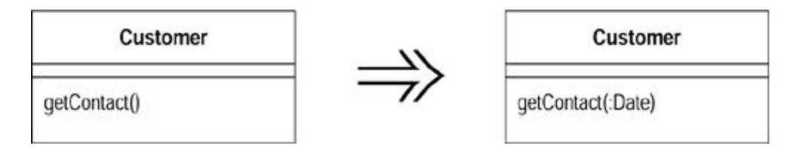
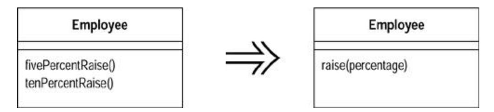
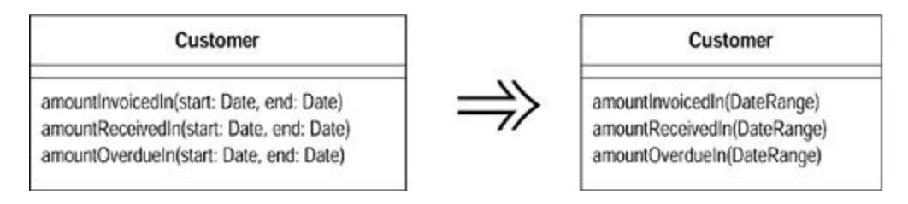
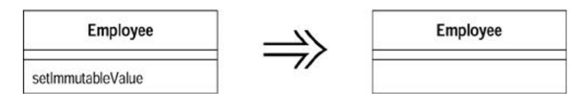
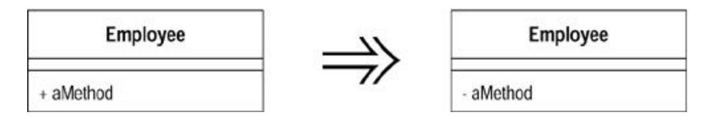

# Chapter 10: Making Method Calls Simpler

Objects are all about interfaces. Coming up with interfaces that are easy to understand and use is a key skill in developing good object-oriented software. This chapter explores refactorings that make interfaces more straightforward.

Often the simplest and most important thing you can do is to change the name of a method. Naming is a key tool in communication. If you understand what a program is doing, you should not be afraid to use Rename Method to pass on that knowledge. You can (and should) also rename variables and classes. On the whole these renamings are fairly simple text replacements, so I haven't added extra refactorings for them.

Parameters themselves have quite a role to play with interfaces. Add Parameter and Remove Parameter are common refactorings. Programmers new to objects often use long parameter lists, which are typical of other development environments. Objects allow you to keep parameter lists short, and several more involved refactorings give you ways to shorten them. If you are passing several values from an object, use Preserve Whole Object to reduce all the values to a single object. If this object does not exist, you can create it with Introduce Parameter Object. If you can get the data from an object to which the method already has access, you can eliminate parameters with Replace Parameter with Method. If you have parameters that are used to determine conditional behavior, you can use Replace Parameter with Explicit Methods. You can combine several similar methods by adding a parameter with Parameterize Method.

Doug Lea gave me a warning about refactorings that reduce parameter lists. Concurrent programming often uses long parameter lists. Typically this occurs so that you can pass in parameters that are immutable, as built-ins and value objects often are. Usually you can replace long parameter lists with immutable objects, but otherwise you need to be cautious about this group of refactorings.

One of the most valuable conventions I've used over the years is to clearly separate methods that change state (modifiers) from those that query state (queries). I don't know how many times I've got myself into trouble, or seen others get into trouble, by mixing these up. So whenever I see them combined, I use Separate Query from Modifier to get rid of them.

Good interfaces show only what they have to and no more. You can improve an interface by hiding things. Of course all data should be hidden (I hope I don't need to tell you to do that), but also any methods that can should be hidden. When refactoring you often need to make things visible for a while and then cover them up with Hide Method and Remove Setting Method.

Constructors are a particularly awkward feature of Java and C++, because they force you to know the class of an object you need to create. Often you don't need to know this. The need to know can be removed with Replace Constructor with Factory Method.

Casting is another bane of the Java programmer's life. As much as possible try to avoid making the user of a class do downcasting if you can contain it elsewhere by using Encapsulate Downcast.

Java, like many modern languages, has an exception-handling mechanism to make error handling easier. Programmers who are not used to this often use error codes to signal trouble. You can use Replace Error Code with Exception to use the new exceptional features. But sometimes exceptions aren't the right answer; you should test first with Replace Exception with Test.

## Rename Method

The name of a method does not reveal its purpose.

*Change the name of the method.*

| Customer     |            | Customer                  |
|--------------|------------|---------------------------|
| getinvcdtlmt | <b>⇒</b> > | getInvoiceableCreditLimit |

### Motivation

An important part of the code style I am advocating is small methods to factor complex processes. Done badly, this can lead you on a merry dance to find out what all the little methods do. The key to avoiding this merry dance is naming the methods. Methods should be named in a way that communicates their intention. A good way to do this is to think what the comment for the method would be and turn that comment into the name of the method.

Life being what it is, you won't get your names right the first time. In this situation you may well be tempted to leave it—after all it's only a name. That is the work of the evil demon *Obfuscatis;* don't listen to him. If you see a badly named method, it is imperative that you change it. Remember your code is for a human first and a computer second. Humans need good names. Take note of when you have spent ages trying to do something that would have been easier if a couple of methods had been better named. Good naming is a skill that requires practice; improving this skill is the key to being a truly skillful programmer. The same applies to other aspects of the signature. If reordering parameters clarifies matters, do it (see Add Parameter and Remove Parameter).

### Mechanics

- · Check to see whether the method signature is implemented by a superclass or subclass. If it is, perform these steps for each implementation.
- · Declare a new method with the new name. Copy the old body of code over to the new name and make any alterations to fit.
- · Compile.
- · Change the body of the old method so that it calls the new one.

?rarr; *If you only have a few references, you can reasonably skip this step.*

- · Compile and test.
- · Find all references to the old method name and change them to refer to the new one. Compile and test after each change.
- · Remove the old method.

?rarr; *If the old method is part of the interface and you cannot remove it, leave it in place and mark it as deprecated.*

· Compile and test.

### Example

I have a method to get a person's telephone number:

```
 public String getTelephoneNumber() {
 return ("(" + _officeAreaCode + ") " + _officeNumber);
 }
```

I want to rename the method to getOfficeTelephoneNumber. I begin by creating the new method and copying the body over to the new method. The old method now changes to call the new one:

```
 class Person...
 public String getTelephoneNumber(){
 return getOfficeTelephoneNumber();
 }
 public String getOfficeTelephoneNumber() {
 return ("(" + _officeAreaCode + ") " + _officeNumber);
 }
```

Now I find the callers of the old method, and switch them to call the new one. When I have switched them all, I can remove the old method.

The procedure is the same if I need to add or remove a parameter.

If there aren't many callers, I change the callers to call the new method without using the old method as a delegating method. If my tests throw a wobbly, I back out and make the changes the slow way.

### Add Parameter

A method needs more information from its caller.

*Add a parameter for an object that can pass on this information.*



### Motivation

*Add Parameter* is a very common refactoring, one that you almost certainly have already done. The motivation is simple. You have to change a method, and the change requires information that wasn't passed in before, so you add a parameter.

Actually most of what I have to say is motivation against doing this refactoring. Often you have other alternatives to adding a parameter. If available, these alternatives are better because they don't lead to increasing the length of parameter lists. Long parameter lists smell bad because they are hard to remember and often involve data clumps.

Look at the existing parameters. Can you ask one of those objects for the information you need? If not, would it make sense to give them a method to provide that information? What are you using the information for? Should that behavior be on another object, the one that has the information? Look at the existing parameters and think about them with the new parameter. Perhaps you should consider Introduce Parameter Object.

I'm not saying that you should never add parameters; I do it frequently, but you need to be aware of the alternatives.

### Mechanics

The mechanics of *Add Parameter* are very similar to those of Rename Method.

- · Check to see whether this method signature is implemented by a superclass or subclass. If it is, carry out these steps for each implementation.
- · Declare a new method with the added parameter. Copy the old body of code over to the new method.

?rarr; *If you need to add more than one parameter, it is easier to add them at the same time.*

- · Compile.
- · Change the body of the old method so that it calls the new one.

?rarr; *If you only have a few references, you can reasonably skip this step.*

?rarr; *You can supply any value for the parameter, but usually you use null for object parameter and a clearly odd value for built-in types. It's often a good idea to use something other than zero for numbers so you can spot this case more easily.*

- · Compile and test.
- · Find all references to the old method and change them to refer to the new one. Compile and test after each change.
- · Remove the old method.

?rarr; *If the old method is part of the interface and you cannot remove it, leave it in place and mark it as deprecated.*

· Compile and test.

### Remove Parameter

A parameter is no longer used by the method body.

*Remove it.*

| Customer          |               | Customer     |
|-------------------|---------------|--------------|
| getContact(:Date) | $\Rightarrow$ | getContact() |

### Motivation

Programmers often add parameters but are reluctant to remove them. After all, a spurious parameter doesn't cause any problems, and you might need it again later.

This is the demon *Obfuscatis* speaking; purge him from your soul! A parameter indicates information that is needed; different values make a difference. Your caller has to worry about what values to pass. By not removing the parameter you are making further work for everyone who uses the method. That's not a good trade-off, especially because removing parameters is an easy refactoring.

The case to be wary of here is a polymorphic method. In this case you may well find that other implementations of the method do use the parameter. In this case you shouldn't remove the parameter. You might choose to add a separate method that can be used in those cases, but you need to examine how your callers use the method to see whether it is worth doing that. If some callers already know they are dealing with a certain subclass and doing extra work to find the parameter or are using knowledge of the class hierarchy to know they can get away with a null, add an extra method without the parameter. If they do not need to know about which class has which method, the callers should be left in blissful ignorance.

### Mechanics

The mechanics of *Remove Parameter* are very similar to those of Rename Method and Add Parameter.

- · Check to see whether this method signature is implemented by a superclass or subclass. Check to see whether the class or superclass uses the parameter. If it does, don't do this refactoring.
- · Declare a new method without the parameter. Copy the old body of code to the new method.

?rarr; *If you need to remove more than one parameter, it is easier to remove them together.*

- · Compile.
- · Change the body of the old method so that it calls the new one.

?rarr; *If you only have a few references, you can reasonably skip this step.*

- · Compile and test.
- · Find all references to the old method and change them to refer to the new one. Compile and test after each change.
- · Remove the old method.

?rarr; *If the old method is part of the interface and you cannot remove it, leave it in place and mark it as deprecated.*

· Compile and test.

Because I'm pretty comfortable with adding and removing parameters, I often do a batch in one go.

## Separate Query from Modifier

You have a method that returns a value but also changes the state of an object.

*Create two methods, one for the query and one for the modification.*

| Customer                                   | 22            | Customer                                    |
|--------------------------------------------|---------------|---------------------------------------------|
| getTotalOutstandingAndSetReadyForSummaries | $\Rightarrow$ | getTotalOutstanding<br>setReadyForSummaries |

### Motivation

When you have a function that gives you a value and has no observable side effects, you have a very valuable thing. You can call this function as often as you like. You can move the call to other places in the method. In short, you have a lot less to worry about.

It is a good idea to clearly signal the difference between methods with side effects and those without. A good rule to follow is to say that any method that returns a value should not have observable side effects. Some programmers treat this as an absolute rule [Meyer]. I'm not 100 percent pure on this (as on anything), but I try to follow it most of the time, and it has served me well.

If you come across a method that returns a value but also has side effects, you should try to separate the query from the modifier.

You'll note I use the phrase *observable* side effects. A common optimization is to cache the value of a query in a field so that repeated calls go quicker. Although this changes the state of the object with the cache, the change is not observable. Any sequence of queries will always return the same results for each query [Meyer].

### Mechanics

· Create a query that returns the same value as the original method.

?rarr; *Look in the original method to see what is returned. If the returned value is a temporary, look at the location of the temp assignment.*

· Modify the original method so that it returns the result of a call to the query.

?rarr; *Every return in the original method should say* return newQuery() *instead of returning anything else.*

?rarr; *If the method used a temp to with a single assignment to capture the return value, you should be able to remove it.*

- · Compile and test.
- · For each call, replace the single call to the original method with a call to the query. Add a call to the original method before the line that calls the query. Compile and test after each change to a calling method.
- · Make the original method have a void return type and remove the return expressions.

### Example

Here is a function that tells me the name of a miscreant for a security system and sends an alert. The rule is that only one alert is sent even if there is more than one miscreant:

```
 String foundMiscreant(String[] people){
 for (int i = 0; i < people.length; i++) {
 if (people[i].equals ("Don")){
 sendAlert();
 return "Don";
 }
 if (people[i].equals ("John")){
 sendAlert();
 return "John";
 }
 }
 return "";
 }
```

It is called by

```
 void checkSecurity(String[] people) {
 String found = foundMiscreant(people);
 someLaterCode(found);
 }
```

To separate the query from the modifier, I first need to create a suitable query that returns the same value as the modifier does but without doing the side effects.

```
 String foundPerson(String[] people){
 for (int i = 0; i < people.length; i++) {
 if (people[i].equals ("Don")){
 return "Don";
 }
 if (people[i].equals ("John")){
 return "John";
 }
 }
 return "";
```

}

Then I replace every return in the original function, one at a time, with calls to the new query. I test after each replacement. When I'm done the original method looks like the following:

```
 String foundMiscreant(String[] people){
 for (int i = 0; i < people.length; i++) {
 if (people[i].equals ("Don")){
 sendAlert();
 return foundPerson(people);
 }
 if (people[i].equals ("John")){
 sendAlert();
 return foundPerson(people);
 }
 }
 return foundPerson(people);
 }
```

Now I alter all the calling methods to do two calls: first to the modifier and then to the query:

```
 void checkSecurity(String[] people) {
 foundMiscreant(people);
 String found = foundPerson(people);
 someLaterCode(found);
 }
```

Once I have done this for all calls, I can alter the modifier to give it a void return type:

```
 void foundMiscreant (String[] people){
 for (int i = 0; i < people.length; i++) {
 if (people[i].equals ("Don")){
 sendAlert();
 return;
 }
 if (people[i].equals ("John")){
 sendAlert();
 return;
 }
 }
 }
```

Now it seems better to change the name of the original:

```
 void sendAlert (String[] people){
 for (int i = 0; i < people.length; i++) {
 if (people[i].equals ("Don")){
 sendAlert();
 return;
```

```
 }
 if (people[i].equals ("John")){
 sendAlert();
 return;
 }
 }
 }
```

Of course in this case I have a lot of code duplication because the modifier uses the body of the query to do its work. I can now use Substitute Algorithm on the modifier to take advantage of this:

```
 void sendAlert(String[] people){
 if (! foundPerson(people).equals(""))
 sendAlert();
 }
```

### Concurrency Issues

If you are working in a multithreaded system, you'll know that doing test and set operations as a single action is an important idiom. Does this conflict with Separate Query from Modifier? I discussed this issue with Doug Lea and concluded that it doesn't, but you need to do some additional things. It is still valuable to have separate query and modifier operations. However, you need to retain a third method that does both. The query-and-modify operation will call the separate query and modify methods and be synchronized. If the query and modify operations are not synchronized, you also might restrict their visibility to package or private level. That way you have a safe, synchronized operation decomposed into two easier-to-understand methods. These lower-level methods then are available for other uses.

## Parameterize Method

Several methods do similar things but with different values contained in the method body.

*Create one method that uses a parameter for the different values.*



### Motivation

You may see a couple of methods that do similar things but vary depending on a few values. In this case you can simplify matters by replacing the separate methods with a single method that handles the variations by parameters. Such a change removes duplicate code and increases flexibility, because you can deal with other variations by adding parameters.

### Mechanics

- · Create a parameterized method that can be substituted for each repetitive method.
- · Compile.
- · Replace one old method with a call to the new method.
- · Compile and test.
- · Repeat for all the methods, testing after each one.

You may find that you cannot do this for the whole method, but you can for a fragment of a method. In this case first extract the fragment into a method, then parameterize that method.

### Example

The simplest case is methods along the following lines:

```
 class Employee {
 void tenPercentRaise () {
 salary *= 1.1;
 }
 void fivePercentRaise () {
 salary *= 1.05;
 }
```

which can be replaced with

```
 void raise (double factor) {
 salary *= (1 + factor);
 }
```

Of course that is so simple that anyone would spot it.

A less obvious case is as follows:

```
 protected Dollars baseCharge() {
 double result = Math.min(lastUsage(),100) * 0.03;
 if (lastUsage() > 100) {
 result += (Math.min (lastUsage(),200) - 100) * 0.05;
 };
 if (lastUsage() > 200) {
 result += (lastUsage() - 200) * 0.07;
 };
 return new Dollars (result);
 }
```

this can be replaced with

```
 protected Dollars baseCharge() {
 double result = usageInRange(0, 100) * 0.03;
 result += usageInRange (100,200) * 0.05;
 result += usageInRange (200, Integer.MAX_VALUE) * 0.07;
```

```
 return new Dollars (result);
 }
 protected int usageInRange(int start, int end) {
 if (lastUsage() > start) return Math.min(lastUsage(),end) -
start;
 else return 0;
 }
```

The trick is to spot code that is repetitive on the basis of a few values that can be passed in as parameters.

## Replace Parameter with Explicit Methods

You have a method that runs different code depending on the values of an enumerated parameter.

*Create a separate method for each value of the parameter.*

```
 void setValue (String name, int value) {
 if (name.equals("height"))
 _height = value;
 if (name.equals("width"))
 _width = value;
 Assert.shouldNeverReachHere();
 }
 void setHeight(int arg) {
 _height = arg;
 }
 void setWidth (int arg) {
 _width = arg;
 }
```

### Motivation

*Replace Parameter with Explicit Methods* is the reverse of Parameterize Method. The usual case for the former is that you have discrete values of a parameter, test for those values in a conditional, and do different things. The caller has to decide what it wants to do by setting the parameter, so you might as well provide different methods and avoid the conditional. You not only avoid the conditional behavior but also gain compile time checking. Furthermore your interface also is clearer. With the parameter, any programmer using the method needs not only to look at the methods on the class but also to determine a valid parameter value. The latter is often poorly documented.

The clarity of the explicit interface can be worthwhile even when the compile time checking isn't an advantage. Switch.beOn() is a lot clearer than Switch.setState(true), even when all you are doing is setting an internal boolean field.

You shouldn't use *Replace Parameter with Explicit Methods* when the parameter values are likely to change a lot. If this happens and you are just setting a field to the passed in parameter, use a simple setter. If you need conditional behavior, you need Replace Conditional with Polymorphism.

### Mechanics

- · Create an explicit method for each value of the parameter.
- · For each leg of the conditional, call the appropriate new method.
- · Compile and test after changing each leg.
- · Replace each caller of the conditional method with a call to the appropriate new method.
- · Compile and test.
- · When all callers are changed, remove the conditional method.

### Example

I want to create a subclass of employee on the basis of a passed in parameter, often the result of Replace Constructor with Factory Method:

```
 static final int ENGINEER = 0;
 static final int SALESMAN = 1;
 static final int MANAGER = 2;
 static Employee create(int type) {
 switch (type) {
 case ENGINEER:
 return new Engineer();
 case SALESMAN:
 return new Salesman();
 case MANAGER:
 return new Manager();
 default:
 throw new IllegalArgumentException("Incorrect type code 
value");
 }
 }
```

Because this is a factory method, I can't use Replace Conditional with Polymorphism, because I haven't created the object yet. I don't expect too many new subclasses, so an explicit interface makes sense. First I create the new methods:

```
 static Employee createEngineer() {
 return new Engineer();
 }
 static Employee createSalesman() {
 return new Salesman();
 }
 static Employee createManager() {
 return new Manager();
 }
```

One by one I replace the cases in the switch statements with calls to the explicit methods:

```
 static Employee create(int type) {
 switch (type) {
 case ENGINEER:
 return Employee.createEngineer();
 case SALESMAN:
 return new Salesman();
 case MANAGER:
 return new Manager();
 default:
 throw new IllegalArgumentException("Incorrect type code 
value");
 }
 }
```

I compile and test after changing each leg, until I've replaced them all:

```
 static Employee create(int type) {
 switch (type) {
 case ENGINEER:
 return Employee.createEngineer();
 case SALESMAN:
 return Employee.createSalesman();
 case MANAGER:
 return Employee.createManager();
 default:
 throw new IllegalArgumentException("Incorrect type code 
value");
 }
 }
```

Now I move on to the callers of the old create method. I change code such as

```
 Employee kent = Employee.create(ENGINEER)
to
 Employee kent = Employee.createEngineer()
```

Once I've done that for all the callers of create, I can remove the create method. I may also be able to get rid of the constants.

## Preserve Whole Object

You are getting several values from an object and passing these values as parameters in a method call.

*Send the whole object instead.*

```
 int low = daysTempRange().getLow();
```

```
 int high = daysTempRange().getHigh();
 withinPlan = plan.withinRange(low, high);
 withinPlan = plan.withinRange(daysTempRange());
```

### Motivation

This type of situation arises when an object passes several data values from a single object as parameters in a method call. The problem with this is that if the called object needs new data values later, you have to find and change all the calls to this method. You can avoid this by passing in the whole object from which the data came. The called object then can ask for whatever it wants from the whole object.

In addition to making the parameter list more robust to changes, *Preserve Whole Object* often makes the code more readable. Long parameter lists can be hard to work with because both caller and callee have to remember which values were there. They also encourage duplicate code because the called object can't take advantage of any other methods on the whole object to calculate intermediate values.

There is a down side. When you pass in values, the called object has a dependency on the values, but there isn't any dependency to the object from which the values were extracted. Passing in the required object causes a dependency between the required object and the called object. If this is going to mess up your dependency structure, don't use *Preserve Whole Object.*

Another reason I have heard for not using *Preserve Whole Object* is that when a calling object need only one value from the required object, it is better to pass in the value than to pass in the whole object. I don't subscribe to that view. One value and one object amount to the same thing when you pass them in, at least for clarity's sake (there may be a performance cost with pass by value parameters). The driving force is the dependency issue.

That a called method uses lots of values from another object is a signal that the called method should really be defined on the object from which the values come. When you are considering *Preserve Whole Object,* consider Move Method as an alternative.

You may not already have the whole object defined. In this case you need Introduce Parameter Object.

A common case is that a calling object passes several of its *own* data values as parameters. In this case you can make the call and pass in this instead of these values, if you have the appropriate getting methods and you don't mind the dependency.

### Mechanics

- · Create a new parameter for the whole object from which the data comes.
- · Compile and test.
- · Determine which parameters should be obtained from the whole object.
- · Take one parameter and replace references to it within the method body by invoking an appropriate method on the whole object parameter.
- · Delete the parameter.
- · Compile and test.
- · Repeat for each parameter that can be got from the whole object.

· Remove the code in the calling method that obtains the deleted parameters.

?rarr; *Unless, of course, the code is using these parameters somewhere else.*

· Compile and test.

### Example

Consider a room object that records high and low temperatures during the day. It needs to compare this range with a range in a predefined heating plan:

```
 class Room...
 boolean withinPlan(HeatingPlan plan) {
 int low = daysTempRange().getLow();
 int high = daysTempRange().getHigh();
 return plan.withinRange(low, high);
 }
 class HeatingPlan...
 boolean withinRange (int low, int high) {
 return (low >= _range.getLow() && high <= _range.getHigh());
 }
 private TempRange _range;
```

Rather than unpack the range information when I pass it, I can pass the whole range object. In this simple case I can do this in one step. When more parameters are involved, I can do it in smaller steps. First I add the whole object to the parameter list:

```
 class HeatingPlan...
 boolean withinRange (TempRange roomRange, int low, int high) {
 return (low >= _range.getLow() && high <= _range.getHigh());
 }
 class Room...
 boolean withinPlan(HeatingPlan plan) {
 int low = daysTempRange().getLow();
 int high = daysTempRange().getHigh();
 return plan.withinRange(daysTempRange(), low, high);
 }
```

Then I use a method on the whole object instead of one of the parameters:

```
 class HeatingPlan...
 boolean withinRange (TempRange roomRange, int high) {
 return (roomRange.getLow() >= _range.getLow() && high <= 
_range.getHigh());
 }
 class Room...
 boolean withinPlan(HeatingPlan plan) {
 int low = daysTempRange().getLow();
```

```
 int high = daysTempRange().getHigh();
 return plan.withinRange(daysTempRange(), high);
 }
```

I continue until I've changed all I need:

```
 class HeatingPlan...
 boolean withinRange (TempRange roomRange) {
 return (roomRange.getLow() >= _range.getLow() && 
roomRange.getHigh() <= _range.getHigh());
 }
 class Room...
 boolean withinPlan(HeatingPlan plan) {
 int low = daysTempRange().getLow();
 int high = daysTempRange().getHigh();
 return plan.withinRange(daysTempRange());
 }
```

Now I don't need the temps anymore:

```
 class Room...
 boolean withinPlan(HeatingPlan plan) {
 int low = daysTempRange().getLow();
 int high = daysTempRange().getHigh();
 return plan.withinRange(daysTempRange());
 }
```

Using whole objects this way soon leads you to realize that you can usefully move behavior into the whole object to make it easier to work with.

```
 class HeatingPlan...
 boolean withinRange (TempRange roomRange) {
 return (_range.includes(roomRange));
 }
 class TempRange...
 boolean includes (TempRange arg) {
 return arg.getLow() >= this.getLow() && arg.getHigh() <= 
this.getHigh();
 }
```

## Replace Parameter with Method

An object invokes a method, then passes the result as a parameter for a method. The receiver can also invoke this method.

*Remove the parameter and let the receiver invoke the method.*

```
 int basePrice = _quantity * _itemPrice;
 discountLevel = getDiscountLevel();
 double finalPrice = discountedPrice (basePrice, discountLevel);
```


```
 int basePrice = _quantity * _itemPrice;
 double finalPrice = discountedPrice (basePrice);
```

### Motivation

If a method can get a value that is passed in as parameter by another means, it should. Long parameter lists are difficult to understand, and we should reduce them as much as possible.

One way of reducing parameter lists is to look to see whether the receiving method can make the same calculation. If an object is calling a method on itself, and the calculation for the parameter does not reference any of the parameters of the calling method, you should be able to remove the parameter by turning the calculation into its own method. This is also true if you are calling a method on a different object that has a reference to the calling object.

You can't remove the parameter if the calculation relies on a parameter of the calling method, because that parameter may change with each call (unless, of course, that parameter can be replaced with a method). You also can't remove the parameter if the receiver does not have a reference to the sender, and you don't want to give it one.

In some cases the parameter may be there for a future parameterization of the method. In this case I would still get rid of it. Deal with the parameterization when you need it; you may find out that you don't have the right parameter anyway. I would make an exception to this rule only when the resulting change in the interface would have painful consequences around the whole program, such as a long build or changing of a lot of embedded code. If this worries you, look into how painful such a change would really be. You should also look to see whether you can reduce the dependencies that cause the change to be so painful. Stable interfaces are good, but freezing a poor interface is a problem.

### Mechanics

- · If necessary, extract the calculation of the parameter into a method.
- · Replace references to the parameter in method bodies with references to the method.
- · Compile and test after each replacement.
- · Use Remove Parameter on the parameter.

### Example

Another unlikely variation on discounting orders is as follows:

```
 public double getPrice() {
 int basePrice = _quantity * _itemPrice;
 int discountLevel;
 if (_quantity > 100) discountLevel = 2;
 else discountLevel = 1;
 double finalPrice = discountedPrice (basePrice, discountLevel);
 return finalPrice;
 }
 private double discountedPrice (int basePrice, int discountLevel) {
```

```
 if (discountLevel == 2) return basePrice * 0.1;
 else return basePrice * 0.05;
 }
```

I can begin by extracting the calculation of the discount level:

```
 public double getPrice() {
 int basePrice = _quantity * _itemPrice;
 int discountLevel = getDiscountLevel();
 double finalPrice = discountedPrice (basePrice, discountLevel);
 return finalPrice;
 }
 private int getDiscountLevel() {
 if (_quantity > 100) return 2;
 else return 1;
 }
```

I then replace references to the parameter in discountedPrice:

```
 private double discountedPrice (int basePrice, int discountLevel) {
 if (getDiscountLevel() == 2) return basePrice * 0.1;
 else return basePrice * 0.05;
 }
```

Then I can use Remove Parameter:

```
 public double getPrice() {
 int basePrice = _quantity * _itemPrice;
 int discountLevel = getDiscountLevel();
 double finalPrice = discountedPrice (basePrice);
 return finalPrice;
 }
 private double discountedPrice (int basePrice) {
 if (getDiscountLevel() == 2) return basePrice * 0.1;
 else return basePrice * 0.05;
 }
```

I can now get rid of the temp:

```
 public double getPrice() {
 int basePrice = _quantity * _itemPrice;
 double finalPrice = discountedPrice (basePrice);
 return finalPrice;
 }
```

Then it's time to get rid of the other parameter and its temp. I am left with

```
 public double getPrice() {
 return discountedPrice ();
 }
 private double discountedPrice () {
 if (getDiscountLevel() == 2) return getBasePrice() * 0.1;
 else return getBasePrice() * 0.05;
 }
 private double getBasePrice() {
 return _quantity * _itemPrice;
 }
```

so I might as well use Inline Method on discountedPrice:

```
 private double getPrice () {
 if (getDiscountLevel() == 2) return getBasePrice() * 0.1;
 else return getBasePrice() * 0.05;
 }
```

### Introduce Parameter Object

You have a group of parameters that naturally go together.

*Replace them with an object.*



### Motivation

Often you see a particular group of parameters that tend to be passed together. Several methods may use this group, either on one class or in several classes. Such a group of classes is a data clump and can be replaced with an object that carries all of this data. It is worthwhile to turn these parameters into objects just to group the data together. This refactoring is useful because it reduces the size of the parameter lists, and long parameter lists are hard to understand. The defined accessors on the new object also make the code more consistent, which again makes it easier to understand and modify.

You get a deeper benefit, however, because once you have clumped together the parameters, you soon see behavior that you can also move into the new class. Often the bodies of the methods have common manipulations of the parameter values. By moving this behavior into the new object, you can remove a lot of duplicated code.

### Mechanics

- · Create a new class to represent the group of parameters you are replacing. Make the class immutable.
- · Compile.
- · Use Add Parameter for the new data clump. Use a null for this parameter in all the callers.

?rarr; *If you have many callers, you can retain the old signature and let it call the new method. Apply the refactoring on the old method first. You can then move the callers over one by one and remove the old method when you're done.*

- · For each parameter in the data clump, remove the parameter from the signature. Modify the callers and method body to use the parameter object for that value.
- · Compile and test after you remove each parameter.
- · When you have removed the parameters, look for behavior that you can move into the parameter object with Move Method.

?rarr; *This may be a whole method or part of a method. If it is part of a method, use* Extract Method *first and then move the new method over.*

### Example

I begin with an account and entries. The entries are simple data holders.

```
 class Entry...
 Entry (double value, Date chargeDate) {
 _value = value;
 _chargeDate = chargeDate;
 }
 Date getDate(){
 return _chargeDate;
 }
 double getValue(){
 return _value;
 }
 private Date _chargeDate;
 private double _value;
```

My focus is on the account, which holds a collection of entries and has a method for determining the flow of the account between two dates:

```
 class Account...
 double getFlowBetween (Date start, Date end) {
 double result = 0;
 Enumeration e = _entries.elements();
 while (e.hasMoreElements()) {
 Entry each = (Entry) e.nextElement();
 if (each.getDate().equals(start) ||
 each.getDate().equals(end) ||
 (each.getDate().after(start) && 
each.getDate().before(end)))
 {
```

```
 result += each.getValue();
 }
 }
 return result;
 }
 private Vector _entries = new Vector();
 client code...
 double flow = anAccount.getFlowBetween(startDate, endDate);
```

I don't know how many times I come across pairs of values that show a range, such as start and end dates and upper and lower numbers. I can understand why this happens, after all I did it all the time myself. But since I saw the range pattern [Fowler, AP] I always try to use ranges instead. My first step is to declare a simple data holder for the range:

```
 class DateRange {
 DateRange (Date start, Date end) {
 _start = start;
 _end = end;
 }
 Date getStart() {
 return _start;
 }
 Date getEnd() {
 return _end;
 }
 private final Date _start;
 private final Date _end;
 }
```

I've made the date range class immutable; that is, all the values for the date range are final and set in the constructor, hence there are no methods for modifying the values. This is a wise move to avoid aliasing bugs. Because Java has pass-by-value parameters, making the class immutable mimics the way Java's parameters work, so this is the right assumption for this refactoring.

Next I add the date range into the parameter list for the getFlowBetween method:

```
 class Account...
 double getFlowBetween (Date start, Date end, DateRange range) {
 double result = 0;
 Enumeration e = _entries.elements();
 while (e.hasMoreElements()) {
 Entry each = (Entry) e.nextElement();
 if (each.getDate().equals(start) ||
 each.getDate().equals(end) ||
 (each.getDate().after(start) && 
each.getDate().before(end)))
 {
 result += each.getValue();
 }
 }
 return result;
 }
```

```
 client code...
 double flow = anAccount.getFlowBetween(startDate, endDate, null);
```

At this point I only need to compile, because I haven't altered any behavior yet.

The next step is to remove one of the parameters and use the new object instead. To do this I delete the start parameter and modify the method and its callers to use the new object instead:

```
 class Account...
 double getFlowBetween (Date end, DateRange range) {
 double result = 0;
 Enumeration e = _entries.elements();
 while (e.hasMoreElements()) {
 Entry each = (Entry) e.nextElement();
 if (each.getDate().equals(range.getStart()) ||
 each.getDate().equals(end) ||
 (each.getDate().after(range.getStart()) && 
each.getDate().before(end)))
 {
 result += each.getValue();
 }
 }
 return result;
 }
 client code...
 double flow = anAccount.getFlowBetween(endDate, new DateRange 
(startDate, null));
```

I then remove the end date:

```
 class Account...
 double getFlowBetween (DateRange range) {
 double result = 0;
 Enumeration e = _entries.elements();
 while (e.hasMoreElements()) {
 Entry each = (Entry) e.nextElement();
 if (each.getDate().equals(range.getStart()) ||
 each.getDate().equals(range.getEnd()) ||
 (each.getDate().after(range.getStart()) && 
each.getDate().before(range.getEnd())))
 {
 result += each.getValue();
 }
 }
 return result;
 }
 client code...
 double flow = anAccount.getFlowBetween(new DateRange 
(startDate, endDate));
```

I have introduced the parameter object; however, I can get more value from this refactoring by moving behavior from other methods to the new object. In this case I can take the code in the condition and use Extract Method and Move Method to get

```
 class Account...
 double getFlowBetween (DateRange range) {
 double result = 0;
 Enumeration e = _entries.elements();
 while (e.hasMoreElements()) {
 Entry each = (Entry) e.nextElement();
 if (range.includes(each.getDate())) {
 result += each.getValue();
 }
 }
 return result;
 }
 class DateRange...
 boolean includes (Date arg) {
 return (arg.equals(_start) ||
 arg.equals(_end) ||
 (arg.after(_start) && arg.before(_end)));
 }
```

I usually do simple extracts and moves such as this in one step. If I run into a bug, I can back out and take the two smaller steps.

## Remove Setting Method

A field should be set at creation time and never altered.

*Remove any setting method for that field.*



### Motivation

Providing a setting method indicates that a field may be changed. If you don't want that field to change once the object is created, then don't provide a setting method (and make the field final). That way your intention is clear and you often remove the very possibility that the field will change.

This situation often occurs when programmers blindly use indirect variable access [Beck]. Such programmers then use setters even in a constructor. I guess there is an argument for consistency but not compared with the confusion that the setting method will cause later on.

### Mechanics

- · Compile and test.
- · Check that the setting method is called only in the constructor, or in a method called by the constructor.
- · Modify the constructor to access the variables directly.

?rarr; *You cannot do this if you have a subclass setting the private fields of a superclass. In this case you should try to provide a protected superclass method (ideally a constructor) to set these values. Whatever you do, don't give the superclass method a name that will confuse it with a setting method.*

- · Compile and test.
- · Remove the setting method and make the field final.
- · Compile.

### Example

A simple example is as follows:

```
 class Account {
 private String _id;
 Account (String id) {
 setId(id);
 }
 void setId (String arg) {
 _id = arg;
 }
```

which can be replaced with

```
 class Account {
 private final String _id;
 Account (String id) {
 _id = id;
 }
```

The problems come in some variations. First is the case in which you are doing computation on the argument:

```
 class Account {
 private String _id;
 Account (String id) {
 setId(id);
 }
```

```
 void setId (String arg) {
 _id = "ZZ" + arg;
 }
```

If the change is simple (as here) and there is only one constructor, I can make the change in the constructor. If the change is complex or I need to call it from separate methods, I need to provide a method. In that case I need to name the method to make its intention clear:

```
 class Account {
 private final String _id;
 Account (String id) {
 initializeId(id);
 }
 void initializeId (String arg) {
 _id = "ZZ" + arg;
 }
```

An awkward case lies with subclasses that initialize private superclass variables:

```
 class InterestAccount extends Account...
 private double _interestRate;
 InterestAccount (String id, double rate) {
 setId(id);
 _interestRate = rate;
 }
```

The problem is that I cannot access id directly to set it. The best solution is to use a superclass constructor:

```
 class InterestAccount...
 InterestAccount (String id, double rate) {
 super(id);
 _interestRate = rate;
 }
```

If that is not possible, a well-named method is the best thing to use:

```
 class InterestAccount...
 InterestAccount (String id, double rate) {
 initializeId(id);
 _interestRate = rate;
 }
```

Another case to consider is setting the value of a collection:

```
 class Person {
 Vector getCourses() {
 return _courses;
 }
 void setCourses(Vector arg) {
 _courses = arg;
 }
 private Vector _courses;
```

Here I want to replace the setter with add and remove operations. I talk about this in Encapsulate Collection.

### Hide Method

A method is not used by any other class.

*Make the method private.*



### Motivation

Refactoring often causes you to change decisions about the visibility of methods. It is easy to spot cases in which you need to make a method more visible: another class needs it and you thus relax the visibility. It is somewhat more difficult to tell when a method is too visible. Ideally a tool should check all methods to see whether they can be hidden. If it doesn't, you should make this check at regular intervals.

A particularly common case is hiding getting and setting methods as you work up a richer interface that provides more behavior. This case is most common when you are starting with a class that is little more than an encapsulated data holder. As more behavior is built into the class, you may find that many of the getting and setting methods are no longer needed publicly, in which case they can be hidden. If you make a getting or setting method private and you are using direct variable access, you can remove the method.

### Mechanics

· Check regularly for opportunities to make a method more private.

?rarr; *Use a lint-style tool, do manual checks every so often, and check when you remove a call to a method in another class.*

?rarr; *Particularly look for cases such as this with setting methods.*

- · Make each method as private as you can.
- · Compile after doing a group of hidings.

?rarr; *The compiler checks this naturally, so you don't need to compile with each change. If one goes wrong, it is easy to spot.*

### Replace Constructor with Factory Method

You want to do more than simple construction when you create an object.

*Replace the constructor with a factory method.*

```
 Employee (int type) {
 _type = type;
 }
static Employee create(int type) {
 return new Employee(type);
 }
```

### Motivation

The most obvious motivation for *Replace Constructor with Factory Method* comes with replacing a type code with subclassing. You have an object that often is created with a type code but now needs subclasses. The exact subclass is based on the type code. However, constructors can only return an instance of the object that is asked for. So you need to replace the constructor with a factory method [Gang of Four].

You can use factory methods for other situations in which constructors are too limited. Factory methods are essential for Change Value to Reference. They also can be used to signal different creation behavior that goes beyond the number and types of parameters.

### Mechanics

- · Create a factory method. Make its body a call to the current constructor.
- · Replace all calls to the constructor with calls to the factory method.
- · Compile and test after each replacement.
- · Declare the constructor private.
- · Compile.

### Example

A quick but wearisome and belabored example is the employee payment system. I have the following employee:

```
 class Employee {
 private int _type;
 static final int ENGINEER = 0;
 static final int SALESMAN = 1;
 static final int MANAGER = 2;
```

```
 Employee (int type) {
 _type = type;
 }
```

I want to make subclasses of Employee to correspond to the type codes. So I need to create a factory method:

```
 static Employee create(int type) {
 return new Employee(type);
 }
```

I then change all callers of the constructor to use this new method and make the constructor private:

```
 client code...
 Employee eng = Employee.create(Employee.ENGINEER);
 class Employee...
 private Employee (int type) {
 _type = type;
 }
```

### Example: Creating Subclasses with a String

So far I do not have a great gain; the advantage comes from the fact that I have separated the receiver of the creation call from the class of object created. If I later apply *Replace Type Code with Subclasses* (Chapter 8) to turn the codes into subclasses of employee, I can hide these subclasses from clients by using the factory method:

```
 static Employee create(int type) {
 switch (type) {
 case ENGINEER:
 return new Engineer();
 case SALESMAN:
 return new Salesman();
 case MANAGER:
 return new Manager();
 default:
 throw new IllegalArgumentException("Incorrect type code 
value");
 }
 }
```

The sad thing about this is that I have a switch. Should I add a new subclass, I have to remember to update this switch statement, and I tend toward forgetfulness.

A good way around this is to use Class.forName. The first thing to do is to change the type of the parameter, essentially a variation on Rename Method. First I create a new method that takes a string as an argument:

```
 static Employee create (String name) {
 try {
 return (Employee) Class.forName(name).newInstance();
 } catch (Exception e) {
 throw new IllegalArgumentException ("Unable to instantiate" 
+ name);
 }
 }
```

I then convert the integer create to use this new method:

```
 class Employee {
 static Employee create(int type) {
 switch (type) {
 case ENGINEER:
 return create("Engineer");
 case SALESMAN:
 return create("Salesman");
 case MANAGER:
 return create("Manager");
 default:
 throw new IllegalArgumentException("Incorrect type code 
value");
 }
 }
```

I can then work on the callers of create to change statements such as

```
 Employee.create(ENGINEER)
to
 Employee.create("Engineer")
```

When I'm done I can remove the integer parameter version of the method.

This approach is nice in that it removes the need to update the create method as I add new subclasses of employee. The approach, however, lacks compile time checking: a spelling mistake leads to a runtime error. If this is important, I use an explicit method (see below), but then I have to add a new method every time I add a subclass. It's a trade-off between flexibility and type safety. Fortunately, if I make the wrong choice, I can use either Parameterize Method or Replace Parameter with Explicit Methods to reverse the decision.

Another reason to be wary of Class.forName is that it exposes subclass names to clients. This is not too bad because you can use other strings and carry out other behavior with the factory method. That's a good reason not to use Inline Method to remove the factory.

### Example: Creating Subclasses with Explicit Methods

I can use a different approach to hide subclasses with explicit methods. This is useful if you have just a few subclasses that don't change. So I may have an abstract Person class with subclasses for Male and Female. I begin by defining a factory method for each subclass on the superclass:

```
 class Person...
 static Person createMale(){
 return new Male();
 }
 static Person createFemale() {
 return new Female();
 }
```

I can then replace calls of the form

```
 Person kent = new Male();
with
 Person kent = Person.createMale();
```

This leaves the superclass knowing about the subclasses. If you want to avoid this, you need a more complex scheme, such as a product trader [Bäumer and Riehle]. Most of the time, however, that complexity isn't needed, and this approach works nicely.

## Encapsulate Downcast

A method returns an object that needs to be downcasted by its callers.

*Move the downcast to within the method.*

```
Object lastReading() {
 return readings.lastElement();
}
Reading lastReading() {
 return (Reading) readings.lastElement();
}
```

### Motivation

Downcasting is one of the most annoying things you have to do with strongly typed OO languages. It is annoying because it feels unnecessary; you are telling the compiler something it ought to be able to figure out itself. But because the figuring out often is rather complicated, you often have to do it yourself. This is particularly prevalent in Java, in which the lack of templates means that you have to downcast whenever you take an object out of a collection.

Downcasting may be a necessary evil, but you should do it as little as possible. If you return a value from a method, and you know the type of what is returned is more specialized than what the method signature says, you are putting unnecessary work on your clients. Rather than forcing them to do the downcasting, you should always provide them with the most specific type you can.

Often you find this situation with methods that return an iterator or collection. Look instead to see what people are using the iterator for and provide the method for that.

### Mechanics

· Look for cases in which you have to downcast the result from calling a method.

?rarr; *These cases often appear with methods that return a collection or iterator.*

· Move the downcast into the method.

?rarr; With methods that return collections, use Encapsulate Collection.

### Example

I have a method called lastReading, which returns the last reading from a vector of readings:

```
 Object lastReading() {
 return readings.lastElement();
 }
```

I should replace this with

```
Reading lastReading() {
 return (Reading) readings.lastElement();
 }
```

A good lead-in to doing this is where I have collection classes. Say this collection of readings is on a Site class and I see code like this:

```
 Reading lastReading = (Reading) theSite.readings().lastElement()
```

I can avoid the downcast and hide which collection is being used with

```
 Reading lastReading = theSite.lastReading();
 class Site...
 Reading lastReading() {
 return (Reading) readings().lastElement();
 }
```

Altering a method to return a subclass alters the signature of the method but does not break existing code because the compiler knows it can substitute a subclass for the superclass. Of course you should ensure that the subclass does not do anything that breaks the contract of the superclass.

### Replace Error Code with Exception

A method returns a special code to indicate an error.

*Throw an exception instead.*

```
 int withdraw(int amount) {
 if (amount > _balance)
 return -1;
 else {
 _balance -= amount;
 return 0;
 }
 }
void withdraw(int amount) throws BalanceException {
 if (amount > _balance) throw new BalanceException();
 _balance -= amount;
 }
```

### Motivation

In computers, as in life, things go wrong occasionally. When things go wrong, you need to do something about it. In the simplest case, you can stop the program with an error code. This is the software equivalent of committing suicide because you miss a flight. (If I did that I wouldn't be alive even if I were a cat.) Despite my glib attempt at humor, there is merit to the software suicide option. If the cost of a program crash is small and the user is tolerant, stopping the program is fine. However, more important programs need more important measures.

The problem is that the part of a program that spots an error isn't always the part that can figure out what to do about it. When such a routine finds an error, it needs to let its caller know, and the caller may pass the error up the chain. In many languages a special output is used to indicate error. Unix and C-based systems traditionally use a return code to signal success or failure of a routine.

Java has a better way: exceptions. Exceptions are better because they clearly separate normal processing from error processing. This makes programs easier to understand, and as I hope you now believe, understandability is next to godliness.

### Mechanics

· Decide whether the exception should be checked or unchecked.

?rarr; *If the caller is responsible for testing the condition before calling, make the exception unchecked.*

?rarr; *If the exception is checked, either create a new exception or use an existing one.*

· Find all the callers and adjust them to use the exception.

?rarr; *If the exception is unchecked, adjust the callers to make the appropriate check before calling the method. Compile and test after each such change.*

?rarr; *If the exception is checked, adjust the callers to call the method in a try block.*

· Change the signature of the method to reflect the new usage.

If you have many callers, this can be too big a change. You can make it more gradual with the following steps:

- · Decide whether the exception should be checked or unchecked.
- · Create a new method that uses the exception.
- · Modify the body of the old method to call the new method.
- · Compile and test.
- · Adjust each caller of the old method to call the new method. Compile and test after each change.
- · Delete the old method.

### Example

Isn't it strange that computer textbooks often assume you can't withdraw more than your balance from an account, although in real life you often can?

```
 class Account...
 int withdraw(int amount) {
 if (amount > _balance)
 return -1;
 else {
 _balance -= amount;
 return 0;
 }
 }
 private int _balance;
```

To change this code to use an exception I first need to decide whether to use a checked or unchecked exception. The decision hinges on whether it is the responsibility of the caller to test the balance before withdrawing or whether it is the responsibility of the withdraw routine to make the check. If testing the balance is the caller's responsibility, it is a programming error to call withdraw with an amount greater than the balance. Because it is a programming error—that is, a bug—I should use an unchecked exception. If testing the balance is the withdraw routine's responsibility, I must declare the exception in the interface. That way I signal the caller to expect the exception and to take appropriate measures.

### Example: Unchecked Exception

Let's take the unchecked case first. Here I expect the caller to do the checking. First I look at the callers. In this case nobody should be using the return code because it is a programmer error to do so. If I see code such as

```
 if (account.withdraw(amount) == -1)
 handleOverdrawn();
 else doTheUsualThing();
```

I need to replace it with code such as

```
 if (!account.canWithdraw(amount))
 handleOverdrawn();
 else {
 account.withdraw(amount);
 doTheUsualThing();
 }
```

I can compile and test after each change.

Now I need to remove the error code and throw an exception for the error case. Because the behavior is (by definition) exceptional, I should use a guard clause for the condition check:

```
 void withdraw(int amount) {
 if (amount > _balance)
 throw new IllegalArgumentException ("Amount too large");
 _balance -= amount;
 }
```

Because it is a programmer error, I should signal even more clearly by using an assertion:

```
 class Account...
 void withdraw(int amount) {
 Assert.isTrue ("amount too large", amount > _balance);
 _balance -= amount;
 }
 class Assert...
 static void isTrue (String comment, boolean test) {
 if (! test) {
 throw new RuntimeException ("Assertion failed: " + comment);
 }
 }
```

### Example: Checked Exception

I handle the checked exception case slightly differently. First I create (or use) an appropriate new exception:

```
 class BalanceException extends Exception {}
```

Then I adjust the callers to look like

```
 try {
 account.withdraw(amount);
 doTheUsualThing();
 } catch (BalanceException e) {
 handleOverdrawn();
 }
```

Now I change the withdraw method to use the exception:

```
 void withdraw(int amount) throws BalanceException {
 if (amount > _balance) throw new BalanceException();
 _balance -= amount;
 }
```

The awkward thing about this procedure is that I have to change all the callers and the called routine in one go. Otherwise the compiler spanks us. If there are a lot of callers, this can be too large a change without the compile and test step.

For these cases I can use a temporary intermediate method. I begin with the same case as before:

```
 if (account.withdraw(amount) == -1)
 handleOverdrawn();
 else doTheUsualThing();
class Account ...
 int withdraw(int amount) {
 if (amount > _balance)
 return -1;
 else {
 _balance -= amount;
 return 0;
 }
 }
```

The first step is to create a new withdraw method that uses the exception:

```
 void newWithdraw(int amount) throws BalanceException {
 if (amount > _balance) throw new BalanceException();
 _balance -= amount;
 }
```

Next I adjust the current withdraw method to use the new one:

```
 int withdraw(int amount) {
 try {
 newWithdraw(amount);
```

```
 return 0;
 } catch (BalanceException e) {
 return -1;
 }
 }
```

With that done, I can compile and test. Now I can replace each of the calls to the old method with a call to the new one:

```
 try {
 account.newWithdraw(amount);
 doTheUsualThing();
 } catch (BalanceException e) {
 handleOverdrawn();
 }
```

With both old and new methods in place, I can compile and test after each change. When I'm finished, I can delete the old method and use Rename Method to give the new method the old name.

### Replace Exception with Test

You are throwing a checked exception on a condition the caller could have checked first.

*Change the caller to make the test first.*

```
 double getValueForPeriod (int periodNumber) {
 try {
 return _values[periodNumber];
 } catch (ArrayIndexOutOfBoundsException e) {
 return 0;
 }
 }
double getValueForPeriod (int periodNumber) {
 if (periodNumber >= _values.length) return 0;
 return _values[periodNumber];
 }
```

### Motivation

Exceptions are an important advance in programming languages. They allow us to avoid complex codes by use of Replace Error Code with Exception. Like so many pleasures, exceptions can be used to excess, and they cease to be pleasurable. (Even I can tire of Aventinus [Jackson].) Exceptions should be used for exceptional behavior—behavior that is an unexpected error. They should not act as a substitute for conditional tests. If you can reasonably expect the caller to check the condition before calling the operation, you should provide a test, and the caller should use it.

### Mechanics

- · Put a test up front and copy the code from the catch block into the appropriate leg of the if statement.
- · Add an assertion to the catch block to notify you whether the catch block is executed.
- · Compile and test.
- · Remove the catch block and the try block if there are no other catch blocks.
- · Compile and test.

### Example

For this example I use an object that manages resources that are expensive to create but can be reused. Database connections are a good example of this. Such a manager has two pools of resources, one that is available for use and one that is allocated. When a client wants a resource, the pool hands it out and transfers it from the available pool to the allocated pool. When a client releases a resource, the manager passes it back. If a client requests a resource and none is available, the manager creates a new one.

The method for giving out resources might look like this:

```
 class ResourcePool
 Resource getResource() {
 Resource result;
 try {
 result = (Resource) _available.pop();
 _allocated.push(result);
 return result;
 } catch (EmptyStackException e) {
 result = new Resource();
 _allocated.push(result);
 return result;
 }
 }
 Stack _available;
 Stack _allocated;
```

In this case running out of resources is not an unexpected occurrence, so I should not use an exception.

To remove the exception I first add an appropriate up-front test and do the empty behavior there:

```
 Resource getResource() {
 Resource result;
 if (_available.isEmpty()) {
 result = new Resource();
 _allocated.push(result);
 return result;
 }
 else {
 try {
 result = (Resource) _available.pop();
 _allocated.push(result);
```

```
 return result;
 } catch (EmptyStackException e) {
 result = new Resource();
 _allocated.push(result);
 return result;
 }
 }
 }
```

With this the exception should never occur. I can add an assertion to check this:

```
 Resource getResource() {
 Resource result;
 if (_available.isEmpty()) {
 result = new Resource();
 _allocated.push(result);
 return result;
 }
 else {
 try {
 result = (Resource) _available.pop();
 _allocated.push(result);
 return result;
 } catch (EmptyStackException e) {
 Assert.shouldNeverReachHere("available was empty on pop");
 result = new Resource();
 _allocated.push(result);
 return result;
 }
 }
 }
 class Assert...
 static void shouldNeverReachHere(String message) {
 throw new RuntimeException (message);
 }
```

Now I can compile and test. If all goes well, I can remove the try block completely:

```
 Resource getResource() {
 Resource result;
 if (_available.isEmpty()) {
 result = new Resource();
 _allocated.push(result);
 return result;
 }
 else {
 result = (Resource) _available.pop();
 _allocated.push(result);
 return result;
 }
 }
```

After this I usually find I can clean up the conditional code. Here I can use Consolidate Duplicate Conditional Fragments:

```
 Resource getResource() {
 Resource result;
 if (_available.isEmpty())
 result = new Resource();
 else
 result = (Resource) _available.pop();
 _allocated.push(result);
 return result;
 }
```
