# Chapter 11: Dealing with Generalization

Generalization produces its own batch of refactorings, mostly dealing with moving methods around a hierarchy of inheritance. Pull Up Field and Pull Up Method both promote function up a hierarchy, and Push Down Method and Push Down Field push function downward. Constructors are a little bit more awkward to pull up, so Pull Up Constructor Body deals with those issues. Rather than pushing down a constructor, it is often useful to use Replace Constructor with Factory Method.

If you have methods that have a similar outline body but vary in details, you can use Form Template Method to separate the differences from the similarities.

In addition to moving function around a hierarchy, you can change the hierarchy by creating new classes. Extract Subclass, Extract Superclass, and Extract Interface all do this by forming new elements out of various points. Extract Interface is particularly important when you want to mark a small amount of function for the type system. If you find yourself with unnecessary classes in your hierarchy, you can use Collapse Hierarchy to remove them.

Sometimes you find that inheritance is not the best way of handling a situation and that you need delegation instead. Replace Inheritance with Delegation helps make this change. Sometimes life is the other way around and you have to use Replace Delegation with Inheritance.

## Pull Up Field

Two subclasses have the same field.

*Move the field to the superclass.*

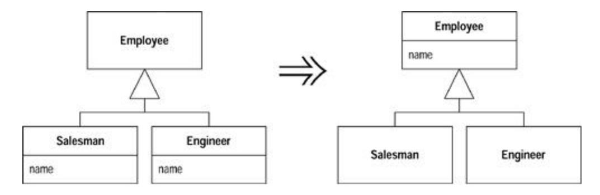

### Motivation

If subclasses are developed independently, or combined through refactoring, you often find that they duplicate features. In particular, certain fields can be duplicates. Such fields sometimes have similar names but not always. The only way to determine what is going on is to look at the fields and see how they are used by other methods. If they are being used in a similar way, you can generalize them.

Doing this reduces duplication in two ways. It removes the duplicate data declaration and allows you to move from the subclasses to the superclass behavior that uses the field.

### Mechanics

- · Inspect all uses of the candidate fields to ensure they are used in the same way.
- · If the fields do not have the same name, rename the fields so that they have the name you want to use for the superclass field.
- · Compile and test.
- · Create a new field in the superclass.

?rarr; *If the fields are private, you will need to protect the superclass field so that the subclasses can refer to it.*

- · Delete the subclass fields.
- · Compile and test.
- · Consider using Self Encapsulate Field on the new field.

### Pull Up Method

You have methods with identical results on subclasses.

*Move them to the superclass.*

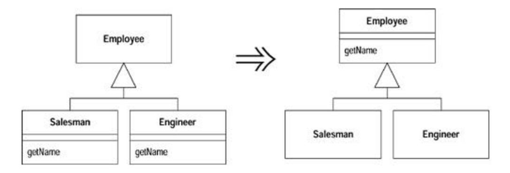

### Motivation

Eliminating duplicate behavior is important. Although two duplicate methods work fine as they are, they are nothing more than a breeding ground for bugs in the future. Whenever there is duplication, you face the risk that an alteration to one will not be made to the other. Usually it is difficult to find the duplicates.

The easiest case of using *Pull Up Method* occurs when the methods have the same body, implying there's been a copy and paste. Of course it's not always as obvious as that. You could just do the refactoring and see if the tests croak, but that puts a lot of reliance on your tests. I usually find it valuable to look for the differences; often they show up behavior that I forgot to test for.

Often *Pull Up Method* comes after other steps. You see two methods in different classes that can be parameterized in such a way that they end up as essentially the same method. In that case the smallest step is to parameterize each method separately and then generalize them. Do it in one go if you feel confident enough.

A special case of the need for *Pull Up Method* occurs when you have a subclass method that overrides a superclass method yet does the same thing.

The most awkward element of *Pull Up Method* is that the body of the methods may refer to features that are on the subclass but not on the superclass. If the feature is a method, you can either generalize the other method or create an abstract method in the superclass. You may need to change a method's signature or create a delegating method to get this to work.

If you have two methods that are similar but not the same, you may be able to use Form Template Method.

### Mechanics

· Inspect the methods to ensure they are identical.

?rarr; *If the methods look like they do the same thing but are not identical, use algorithm substitution on one of them to make them identical.*

- · If the methods have different signatures, change the signatures to the one you want to use in the superclass.
- · Create a new method in the superclass, copy the body of one of the methods to it, adjust, and compile.

?rarr; *If you are in a strongly typed language and the method calls another method that is present on both subclasses but not the superclass, declare an abstract method on the superclass.*

?rarr; *If the method uses a subclass field, use* Pull Up Field *or* Self Encapsulate Field *and declare and use an abstract getting method.*

- · Delete one subclass method.
- · Compile and test.
- · Keep deleting subclass methods and testing until only the superclass method remains.
- · Take a look at the callers of this method to see whether you can change a required type to the superclass.

### Example

Consider a customer with two subclasses: regular customer and preferred customer.

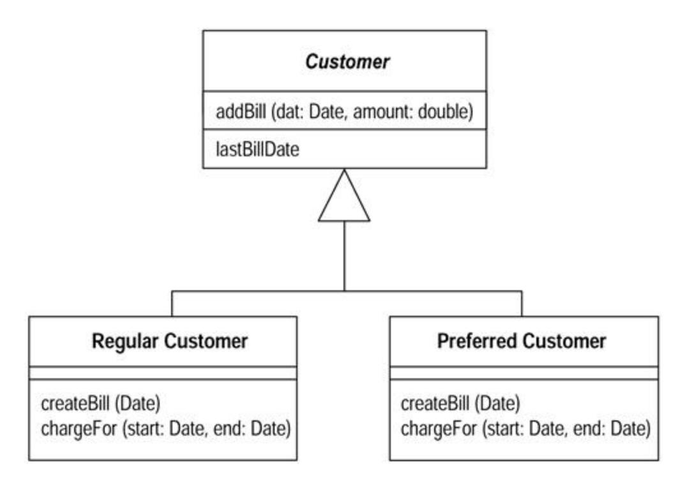

The createBill method is identical for each class:

```
 void createBill (date Date) {
 double chargeAmount = charge (lastBillDate, date);
 addBill (date, charge);
 }
```

I can't move the method up into the superclass, because chargeFor is different on each subclass. First I have to declare it on the superclass as abstract:

```
 class Customer...
 abstract double chargeFor(date start, date end)
```

Then I can copy createBill from one of the subclasses. I compile with that in place and then remove the createBill method from one of the subclasses, compile, and test. I then remove it from the other, compile, and test:

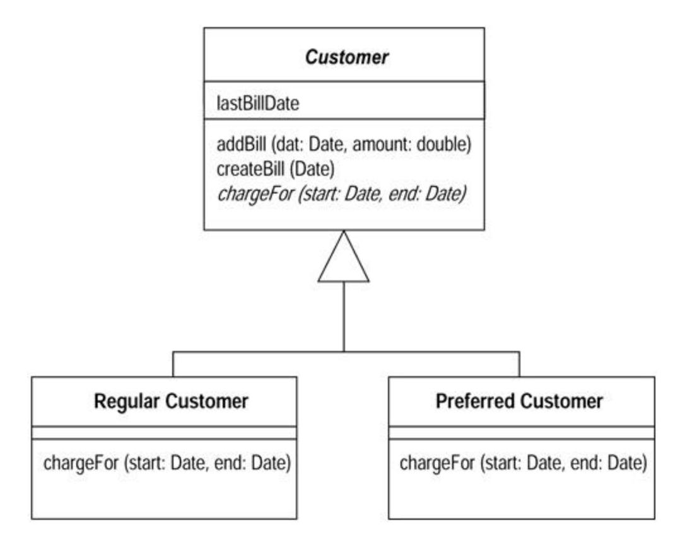

## Pull Up Constructor Body

You have constructors on subclasses with mostly identical bodies.

*Create a superclass constructor; call this from the subclass methods.*

```
 class Manager extends Employee...
 public Manager (String name, String id, int grade) {
 _name = name;
 _id = id;
 _grade = grade;
 }
 public Manager (String name, String id, int grade) {
 super (name, id);
 _grade = grade;
 }
```

### Motivation

Constructors are tricky things. They aren't quite normal methods, so you are more restricted in what you can do with them than you are when you use normal methods.

If you see subclass methods with common behavior, your first thought is to extract the common behavior into a method and pull it up into the superclass. With a constructor, however, the common behavior is often the construction. In this case you need a superclass constructor that is called by subclasses. In many cases this is the whole body of the constructor. You can't use Pull Up Method here, because you can't inherit constructors (don't you just hate that?).

If refactoring becomes complex, you might want to consider Replace Constructor with Factory Method instead.

### Mechanics

- · Define a superclass constructor.
- · Move the common code at the beginning from the subclass to the superclass constructor.

?rarr; *This may be all the code.*

?rarr; *Try to move common code to the beginning of the constructor.*

· Call the superclass constructor as the first step in the subclass constructor.

?rarr; *If all the code is common, this will be the only line of the subclass constructor.*

· Compile and test.

?rarr; *If there is any common code later, use* Extract Method *to factor out common code and use* Pull Up Method to *pull it up.*

### Example

Here are a manager and an employee:

```
 class Employee...
 protected String _name;
 protected String _id;
 class Manager extends Employee...
 public Manager (String name, String id, int grade) {
 _name = name;
 _id = id;
 _grade = grade;
 }
 private int _grade;
```

The fields from Employee should be set in a constructor for Employee. I define one and make it protected to signal that subclasses should call it:

```
 class Employee
 protected Employee (String name, String id) {
 _name = name;
 _id = id;
 }
```

Then I call it from the subclass:

```
 public Manager (String name, String id, int grade) {
 super (name, id);
 _grade = grade;
 }
```

A variation occurs when there is common code later. Say I have the following code:

```
 class Employee...
 boolean isPriviliged() {..}
 void assignCar() {..}
 class Manager...
 public Manager (String name, String id, int grade) {
 super (name, id);
 _grade = grade;
 if (isPriviliged()) assignCar(); //every subclass does this
 }
 boolean isPriviliged() {
 return _grade > 4;
 }
```

I can't move the assignCar behavior into the superclass constructor because it must be executed after grade has been assigned to the field. So I need Extract Method and Pull Up Method.

```
 class Employee...
 void initialize() {
 if (isPriviliged()) assignCar();
 }
 class Manager...
 public Manager (String name, String id, int grade) {
 super (name, id);
 _grade = grade;
 initialize();
 }
```

### Push Down Method

Behavior on a superclass is relevant only for some of its subclasses.

*Move it to those subclasses.*

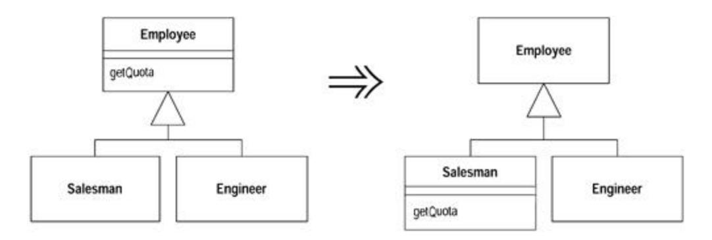

### Motivation

*Pull Down Method* is the opposite of Pull Up Method. I use it when I need to move behavior from a superclass to a specific subclass, usually because it makes sense only there. You often do this when you use Extract Subclass.

### Mechanics

· Declare a method in all subclasses and copy the body into each subclass.

?rarr; *You may need to declare fields as protected for the method to access them. Usually you do this if you intend to push down the field later. Otherwise use an accessor on the superclass. If this accessor is not public, you need to declare it as protected.*

· Remove method from superclass.

?rarr; *You may have to change callers to use the subclass in variable and parameter declarations.*

?rarr; *If it makes sense to access the method through a superclass variable, you don't intend to remove the method from any subclasses, and the superclass is abstract, you can declare the method as abstract, in the superclass.*

- · Compile and test.
- · Remove the method from each subclass that does not need it.
- · Compile and test.

### Push Down Field

A field is used only by some subclasses.

*Move the field to those subclasses.*

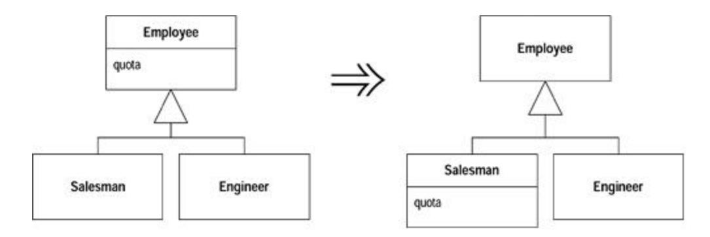

### Motivation

Push Down Field is the opposite of Pull Up Field. Use it when you don't need a field in the superclass but only in a subclass.

### Mechanics

- · Declare the field in all subclasses.
- · Remove the field from the superclass.
- · Compile and test.
- · Remove the field from all subclasses that don't need it.
- · Compile and test.

### Extract Subclass

A class has features that are used only in some instances.

*Create a subclass for that subset of features.*

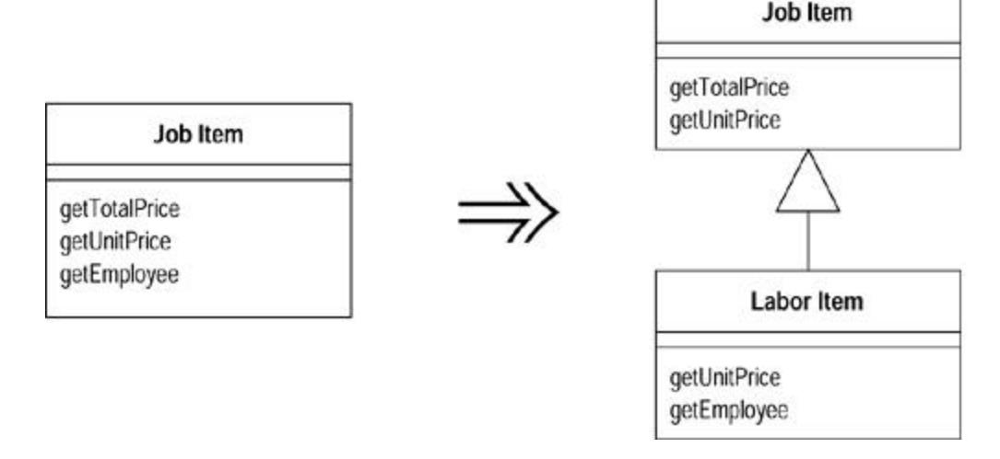

### Motivation

The main trigger for use of *Extract Subclass* is the realization that a class has behavior used for some instances of the class and not for others. Sometimes this is signaled by a type code, in which case you can use Replace Type Code with Subclasses or Replace Type Code with State/Strategy. But you don't have to have a type code to suggest the use for a subclass.

The main alternative to *Extract Subclass* is Extract Class. This is a choice between delegation and inheritance. Extract Subclass is usually simpler to do, but it has limitations. You can't change the class-based behavior of an object once the object is created. You can change the class-based behavior with Extract Class simply by plugging in different components. You can also use only subclasses to represent one set of variations. If you want the class to vary in several different ways, you have to use delegation for all but one of them.

### Mechanics

- · Define a new subclass of the source class.
- · Provide constructors for the new subclass.

?rarr; *In the simple cases, copy the arguments of the superclass and call the superclass constructor with* super *.*

?rarr; *If you want to hide the use of the subclass from clients, you can use* Replace Constructor with Factory Method.

· Find all calls to constructors of the superclass. If they need the subclass, replace with a call to the new constructor.

> ?rarr; *If the subclass constructor needs different arguments, use* Rename Method *to change it. If some of the constructor parameters of the superclass are no longer needed, use* Rename Method *on that too.*

?rarr; *If the superclass can no longer be directly instantiated, declare it abstract.*

· One by one use Push Down Method and Push Down Field to move features onto the subclass.

> ?rarr; *Unlike* Extract Class *it usually is easier to work with the methods first and the data last.*

?rarr; *When a public method is pushed, you may need to redefine a caller's variable or parameter type to call the new method. The compiler will catch these cases.*

· Look for any field that designates information now indicated by the hierarchy (usually a boolean or type code). Eliminate it by using Self Encapsulate Field and replacing the getter with polymorphic constant methods. All users of this field should be refactored with Replace Conditional with Polymorphism.

> ?rarr; *For any methods outside the class that use an accessor, consider using Move Method to move the method into this class; then use* Replace Conditional with Polymorphism.

· Compile and test after each push down.

### Example

I'll start with a job item class that determines prices for items of work at a local garage:

```
 class JobItem ...
 public JobItem (int unitPrice, int quantity, boolean isLabor, 
Employee employee) {
 _unitPrice = unitPrice;
 _quantity = quantity;
 _isLabor = isLabor;
 _employee = employee;
 }
 public int getTotalPrice() {
 return getUnitPrice() * _quantity;
 }
 public int getUnitPrice(){
 return (_isLabor) ?
 _employee.getRate():
 _unitPrice;
 }
 public int getQuantity(){
 return _quantity;
 }
 public Employee getEmployee() {
 return _employee;
 }
 private int _unitPrice;
 private int _quantity;
 private Employee _employee;
 private boolean _isLabor;
 class Employee...
 public Employee (int rate) {
 _rate = rate;
 }
 public int getRate() {
 return _rate;
 }
 private int _rate;
```

I extract a LaborItem subclass from this class because some of the behavior and data are needed only in that case. I begin by creating the new class:

```
 class LaborItem extends JobItem {}
```

The first thing I need is a constructor for the labor item because job item does not have a no-arg constructor. For this I copy the signature of the parent constructor:

```
 public LaborItem (int unitPrice, int quantity, boolean isLabor, 
Employee employee) {
 super (unitPrice, quantity, isLabor, employee);
 }
```

This is enough to get the new subclass to compile. However, the constructor is messy; some arguments are needed by the labor item, and some are not. I deal with that later.

The next step is to look for calls to the constructor of the job item, and to look for cases where the constructor of the labor item should be called instead. So statements like

```
 JobItem j1 = new JobItem (0, 5, true, kent);
```

become

```
 JobItem j1 = new LaborItem (0, 5, true, kent);
```

At this stage I have not changed the type of the variable; I have changed only the type of the constructor. This is because I want to use the new type only where I have to. At this point I have no specific interface for the subclass, so I don't want to declare any variations yet.

Now is a good time to clean up the constructor parameter lists. I use Rename Method on each of them. I work with the superclass first. I create the new constructor and make the old one protected (the subclass still needs it):

```
 class JobItem...
 protected JobItem (int unitPrice, int quantity, boolean isLabor, 
Employee employee) {
 _unitPrice = unitPrice;
 _quantity = quantity;
 _isLabor = isLabor;
 _employee = employee;
 }
 public JobItem (int unitPrice, int quantity) {
 this (unitPrice, quantity, false, null)
 }
```

Calls from outside now use the new constructor:

```
 JobItem j2 = new JobItem (10, 15);
```

Once I've compiled and tested, I use Rename Method on the subclass constructor:

```
 class LaborItem
 public LaborItem (int quantity, Employee employee) {
 super (0, quantity, true, employee);
 }
```

For the moment, I still use the protected superclass constructor.

Now I can start pushing down the features of the job item. I begin with the methods. I start with using Push Down Method on getEmployee:

```
 class LaborItem...
 public Employee getEmployee() {
 return _employee;
 }
 class JobItem...
 protected Employee _employee;
```

Because the employee field will be pushed down later, I declare it as protected for the moment.

Once the employee field is protected, I can clean up the constructors so that employee is set only in the subclass into which it is being pushed down:

```
 class JobItem...
 protected JobItem (int unitPrice, int quantity, boolean isLabor) {
 _unitPrice = unitPrice;
 _quantity = quantity;
 _isLabor = isLabor;
 }
 class LaborItem ...
 public LaborItem (int quantity, Employee employee) {
 super (0, quantity, true);
 _employee = employee;
 }
```

The field \_isLabor is used to indicate information that is now inherent in the hierarchy. So I can remove the field. The best way to do this is to first use Self Encapsulate Field and then change the accessor to use a polymorphic constant method. A polymorphic constant method is one whereby each implementation returns a (different) fixed value:

```
 class JobItem...
```

```
 protected boolean isLabor() {
 return false;
 }
 class LaborItem...
 protected boolean isLabor() {
 return true;
 }
```

Then I can get rid of the isLabor field.

Now I can look at users of the isLabor methods. These should be refactored with Replace Conditional with Polymorphism. I take the method

```
 class JobItem...
 public int getUnitPrice(){
 return (isLabor()) ?
 _employee.getRate():
 _unitPrice;
 }
```

and replace it with

```
 class JobItem...
 public int getUnitPrice(){
 return _unitPrice;
 }
 class LaborItem...
 public int getUnitPrice(){
 return _employee.getRate();
 }
```

Once a group of methods that use some data have been pushed down, I can use Push Down Field on the data. That I can't use it because a method uses the data is a signal for more work on the methods, either with Push Down Method or Replace Conditional with Polymorphism.

Because the unit price is used only by items that are nonlabor (parts job items), I can use Extract Subclass on job item again to create a parts item class. When I've done that, the job item class will be abstract.

## Extract Superclass

You have two classes with similar features.

*Create a superclass and move the common features to the superclass.*

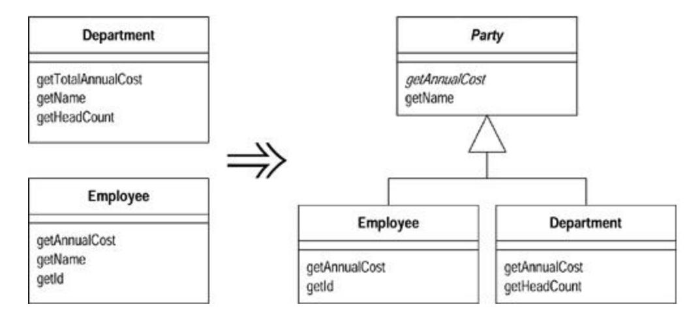

### Motivation

Duplicate code is one of the principal bad things in systems. If you say things in multiple places, then when it comes time to change what you say, you have more things to change than you should.

One form of duplicate code is two classes that do similar things in the same way or similar things in different ways. Objects provide a built-in mechanism to simplify this situation with inheritance. However, you often don't notice the commonalities until you have created some classes, in which case you need to create the inheritance structure later.

An alternative is Extract Class. The choice is essentially between inheritance and delegation. Inheritance is the simpler choice if the two classes share interface as well as behavior. If you make the wrong choice, you can always use Replace Inheritance with Delegation later.

### Mechanics

- · Create a blank abstract superclass; make the original classes subclasses of this superclass.
- · One by one, use Pull Up Field, Pull Up Method, and Pull Up Constructor Body to move common elements to the superclass.

?rarr; *It's usually easier to move the fields first.*

?rarr; *If you have subclass methods that have different signatures but the same purpose, use* Rename Method *to get them to the same name and then use* Pull Up Method.

?rarr; *If you have methods with the same signature but different bodies, declare the common signature as an abstract method on the superclass.*

?rarr; *If you have methods with different bodies that do the same thing, you may try using* Substitute Algorithm *to copy one body into the other. If this works, you can then use* Pull Up Method.

· Compile and test after each pull.

- · Examine the methods left on the subclasses. See if there are common parts, if there are you can use Extract Method followed by Pull Up Method on the common parts. If the overall flow is similar, you may be able to use Form Template Method.
- · After pulling up all the common elements, check each client of the subclasses. If they use only the common interface you can change the required type to the superclass.

### Example

For this case I have an employee and a department:

```
 class Employee...
 public Employee (String name, String id, int annualCost) {
 _name = name;
 _id = id;
 _annualCost = annualCost;
 }
 public int getAnnualCost() {
 return _annualCost;
 }
 public String getId(){
 return _id;
 }
 public String getName() {
 return _name;
 }
 private String _name;
 private int _annualCost;
 private String _id;
 public class Department...
 public Department (String name) {
 _name = name;
 }
 public int getTotalAnnualCost(){
 Enumeration e = getStaff();
 int result = 0;
 while (e.hasMoreElements()) {
 Employee each = (Employee) e.nextElement();
 result += each.getAnnualCost();
 }
 return result;
 }
 public int getHeadCount() {
 return _staff.size();
 }
 public Enumeration getStaff() {
 return _staff.elements();
 }
 public void addStaff(Employee arg) {
 _staff.addElement(arg);
 }
 public String getName() {
 return _name;
 }
```

```
 private String _name;
 private Vector _staff = new Vector();
```

There are a couple of areas of commonality here. First, both employees and departments have names. Second, they both have annual costs, although the methods for calculating them are slightly different. I extract a superclass for both of these features. The first step is to create the new superclass and define the existing superclasses to be subclasses of this superclass:

```
 abstract class Party {}
 class Employee extends Party...
 class Department extends Party...
```

Now I begin to pull up features to the superclass. It is usually easier to use Pull Up Field first:

```
 class Party...
 protected String _name;
```

Then I can use Pull Up Method on the getters:

```
 class Party {
 public String getName() {
 return _name;
 }
```

I like to make the field private. To do this I need to use Pull Up Constructor Body to assign the name:

```
 class Party...
 protected Party (String name) {
 _name = name;
 }
 private String _name;
 class Employee...
 public Employee (String name, String id, int annualCost) {
 super (name);
 _id = id;
 _annualCost = annualCost;
 }
 class Department...
 public Department (String name) {
```

```
 super (name);
 }
```

The methods Department.getTotalAnnualCost and Employee.getAnnualCost, do carry out the same intention, so they should have the same name. I first use Rename Method to get them to the same name:

```
 class Department extends Party {
 public int getAnnualCost(){
 Enumeration e = getStaff();
 int result = 0;
 while (e.hasMoreElements()) {
 Employee each = (Employee) e.nextElement();
 result += each.getAnnualCost();
 }
 return result;
 }
```

Their bodies are still different, so I cannot use Pull Up Method; however, I can declare an abstract method on the superclass:

```
 abstract public int getAnnualCost()
```

Once I've made the obvious changes, I look at the clients of the two classes to see whether I can change any of them to use the new superclass. One client of these classes is the department class itself, which holds a collection of employees. The getAnnualCost method uses only the annual cost method, which is now declared on the party:

```
 class Department...
 public int getAnnualCost(){
 Enumeration e = getStaff();
 int result = 0;
 while (e.hasMoreElements()) {
 Party each = (Party) e.nextElement();
 result += each.getAnnualCost();
 }
 return result;
 }
```

This behavior suggests a new possibility. I could treat department and employee as a *composite* [Gang of Four]. This would allow me to let a department include another department. This would be new functionality, so it is not strictly a refactoring. If a composite were wanted, I would obtain it by changing the name of the staff field to better represent the picture. This change would involve

making a corresponding change in the name addStaff and altering the parameter to be a party. The final change would be to make the headCount method recursive. I could do this by creating a headcount method for employee that just returns 1 and using Substitute Algorithm on the department's headcount to sum the headcounts of the components.

### Extract Interface

Several clients use the same subset of a class's interface, or two classes have part of their interfaces in common.

*Extract the subset into an interface.*

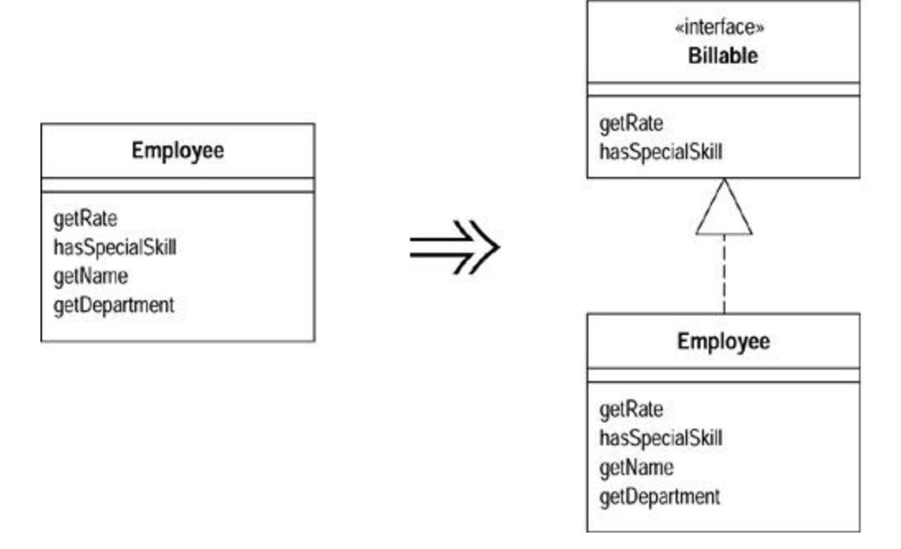

### Motivation

Classes use each other in several ways. Use of a class often means ranging over the whole area of responsibilities of a class. Another case is use of only a particular subset of a class's responsibilities by a group of clients. Another is that a class needs to work with any class that can handle certain requests.

For the second two cases it is often useful to make the subset of responsibilities a thing in its own right, so that it can be made clear in the use of the system. That way it is easier to see how the responsibilities divide. If new classes are needed to support the subset, it is easier to see exactly what fits in the subset.

In many object-oriented languages, this capability is supported by multiple inheritance. You create a class for each segment of behavior and combine them in an implementation. Java has single inheritance but allows you to state and implement this kind of requirement using interfaces. Interfaces have had a big influence on the way programmers design Java programs. Even Smalltalk programmers think interfaces are a step forward!

There is some similarity between Extract Superclass and Extract Interface. Extract Interface can only bring out common interfaces, not common code. Using Extract Interface can lead to smelly duplicate code. You can reduce this problem by using Extract Class to put the behavior into a component and delegating to it. If there is substantial common behavior Extract Superclass is simpler, but you do only get to have one superclass.

Interfaces are good to use whenever a class has distinct roles in different situations. Use Extract Interface for each role. Another useful case is that in which you want to describe the outbound interface of a class, that is, the operations the class makes on its server. If you want to allow other kinds of servers in the future, all they need do is implement the interface.

### Mechanics

- · Create an empty interface.
- · Declare the common operations in the interface.
- · Declare the relevant class(es) as implementing the interface.
- · Adjust client type declarations to use the interface.

### Example

A timesheet class generates charges for employees. In order to do this the timesheet needs to know the employee's rate and whether the employee has a special skill:

```
 double charge(Employee emp, int days) {
 int base = emp.getRate() * days;
 if (emp.hasSpecialSkill())
 return base * 1.05;
 else return base;
 }
```

Employee has many other aspects to it than the charge rate and the special skill information, but those are the only pieces that this application needs. I can highlight the fact that I need only this subset by defining an interface for it:

```
 interface Billable {
 public int getRate();
 public boolean hasSpecialSkill();
 }
```

I then declare the employee as implementing the interface:

```
 class Employee implements Billable ...
```

With that done I can change the declaration of charge to show only this part of the employee's behavior is used:

```
 double charge(Billable emp, int days) {
 int base = emp.getRate() * days;
 if (emp.hasSpecialSkill())
 return base * 1.05;
 else return base;
 }
```

At the moment the gain is a modest gain in documentability. Such a gain would not be worthwhile for one method, but if several classes were to use the billable interface on person, that would be useful. The big gain appears when I want to bill computers too. To make them billable I know that all I have to do is implement the billable interface and I can put computers on timesheets.

### Collapse Hierarchy

A superclass and subclass are not very different.

*Merge them together.*

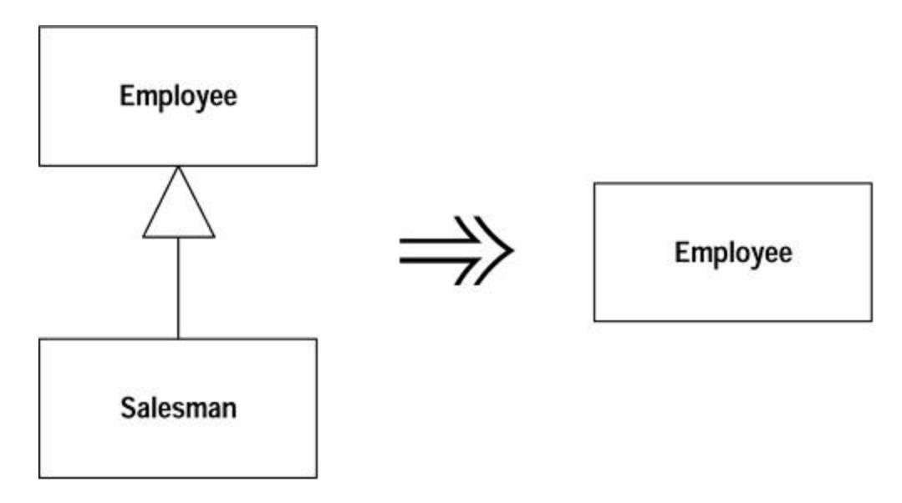

### Motivation

If you have been working for a while with a class hierarchy, it can easily become too tangled for its own good. Refactoring the hierarchy often involves pushing methods and fields up and down the hierarchy. After you've done this you can well find you have a subclass that isn't adding any value, so you need to merge the classes together.

### Mechanics

· Choose which class is going to be removed: the superclass or the subclasses.

- · Use Pull Up Field and Pull Up Method or Push Down Method and Push Down Field to move all the behavior and data of the removed class to the class with which it is being merged.
- · Compile and test with each move.
- · Adjust references to the class that will be removed to use the merged class. This will affect variable declarations, parameter types, and constructors.
- · Remove the empty class.
- · Compile and test.

### Form Template Method

You have two methods in subclasses that perform similar steps in the same order, yet the steps are different.

*Get the steps into methods with the same signature, so that the original methods become the same. Then you can pull them up.*

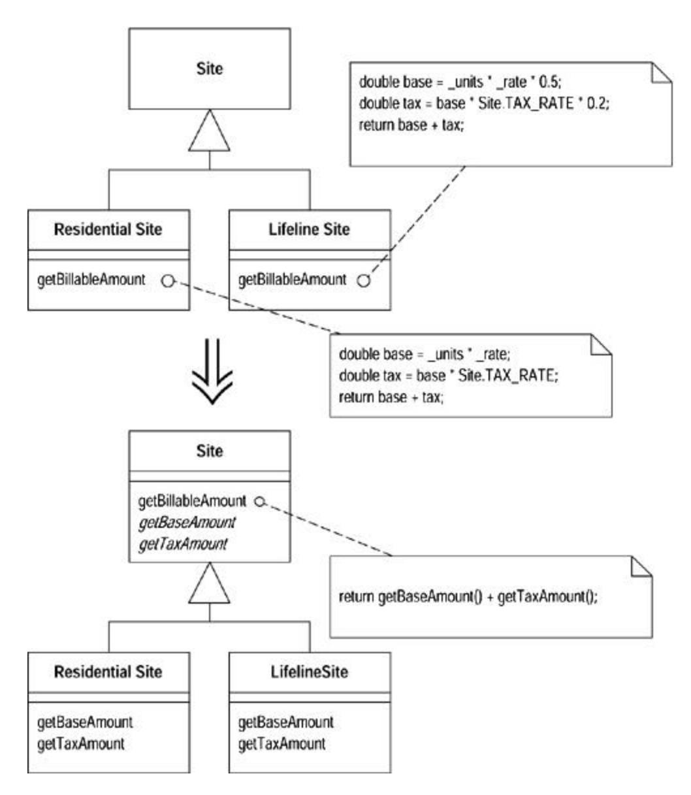

### Motivation

Inheritance is a powerful tool for eliminating duplicate behavior. Whenever we see two similar methods in a subclass, we want to bring them together in a superclass. But what if they are not exactly the same? What do we do then? We still need to eliminate all the duplication we can but keep the essential differences.

A common case is two methods that seem to carry out broadly similar steps in the same sequence, but the steps are not the same. In this case we can move the sequence to the superclass and allow polymorphism to play its role in ensuring the different steps do their things differently. This kind of method is called a *template method* [Gang of Four].

### Mechanics

- · Decompose the methods so that all the extracted methods are either identical or completely different.
- · Use Pull Up Method to pull the identical methods into the superclass.
- · For the different methods use Rename Method so the signatures for all the methods at each step are the same.

?rarr; *This makes the original methods the same in that they all issue the same set of method calls, but the subclasses handle the calls differently.*

- · Compile and test after each signature change.
- · Use Pull Up Method on one of the original methods. Define the signatures of the different methods as abstract methods on the superclass.
- · Compile and test.
- · Remove the other methods, compile, and test after each removal.

### Example

I finish where I left off in Chapter 1. I had a customer class with two methods for printing statements. The statement method prints statements in ASCII:

```
 public String statement() {
 Enumeration rentals = _rentals.elements();
 String result = "Rental Record for " + getName() + "\n";
 while (rentals.hasMoreElements()) {
 Rental each = (Rental) rentals.nextElement();
 //show figures for this rental
 result += "\t" + each.getMovie().getTitle()+ "\t" +
 String.valueOf(each.getCharge()) + "\n";
 }
 //add footer lines
 result += "Amount owed is " + String.valueOf(getTotalCharge()) 
+ "\n";
 result += "You earned " + 
String.valueOf(getTotalFrequentRenterPoints()) +
 " frequent renter points";
 return result;
 }
```

#### while the htmlStatement does them in HTML:

```
 public String htmlStatement() {
 Enumeration rentals = _rentals.elements();
 String result = "<H1>Rentals for <EM>" + getName() + 
"</EM></H1><P>\n";
 while (rentals.hasMoreElements()) {
 Rental each = (Rental) rentals.nextElement();
 //show figures for each rental
 result += each.getMovie().getTitle()+ ": " +
 String.valueOf(each.getCharge()) + "<BR>\n";
 }
 //add footer lines
 result += "<P>You owe <EM>" + String.valueOf(getTotalCharge()) 
+ "</EM><P>\n";
 result += "On this rental you earned <EM>" +
 String.valueOf(getTotalFrequentRenterPoints()) +
 "</EM> frequent renter points<P>";
 return result;
 }
```

Before I can use Form Template Method I need to arrange things so that the two methods are subclasses of some common superclass. I do this by using a method object [Beck] to create a separate strategy hierarchy for printing the statements (Figure 11.1).

**Figure 11.1. Using a strategy for statements**

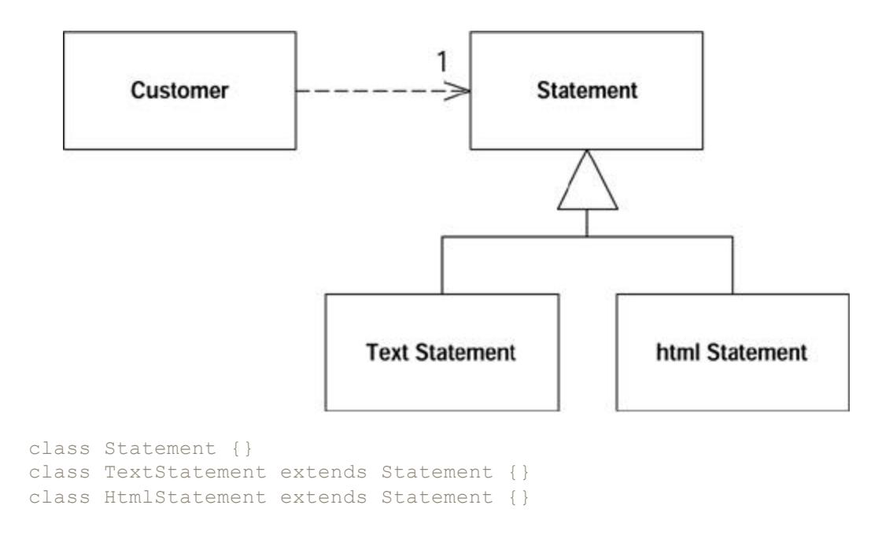

Now I use Move Method to move the two statement methods over to the subclasses:

```
 class Customer...
public String statement() {
 return new TextStatement().value(this);
}
public String htmlStatement() {
 return new HtmlStatement().value(this);
}
 class TextStatement {
 public String value(Customer aCustomer) {
 Enumeration rentals = aCustomer.getRentals();
 String result = "Rental Record for " + aCustomer.getName() + 
"\n";
 while (rentals.hasMoreElements()) {
 Rental each = (Rental) rentals.nextElement();
 //show figures for this rental
 result += "\t" + each.getMovie().getTitle()+ "\t" +
 String.valueOf(each.getCharge()) + "\n";
 }
 //add footer lines
 result += "Amount owed is " + 
String.valueOf(aCustomer.getTotalCharge()) + "\n";
 result += "You earned " + 
String.valueOf(aCustomer.getTotalFrequentRenterPoints()) +
 " frequent renter points";
 return result;
 }
 class HtmlStatement {
 public String value(Customer aCustomer) {
 Enumeration rentals = aCustomer.getRentals();
 String result = "<H1>Rentals for <EM>" + aCustomer.getName() + 
"</EM></H1><P>\n";
 while (rentals.hasMoreElements()) {
 Rental each = (Rental) rentals.nextElement();
 //show figures for each rental
 result += each.getMovie().getTitle()+ ": " +
 String.valueOf(each.getCharge()) + "<BR>\n";
 }
 //add footer lines
 result += "<P>You owe <EM>" + 
String.valueOf(aCustomer.getTotalCharge()) +
 "</EM><P>\n";
 result += "On this rental you earned <EM>"
String.valueOf(aCustomer.getTotalFrequentRenterPoints()) +
 "</EM> frequent renter points<P>";
 return result;
 }
```

As I moved them I renamed the statement methods to better fit the strategy. I gave them the same name because the difference between the two now lies in the class rather than the method. (For those trying this from the example, I also had to add a getRentals method to customer and relax the visibility of getTotalCharge and getTotalFrequentRenterPoints.

With two similar methods on subclasses, I can start to use Form Template Method. The key to this refactoring is to separate the varying code from the similar code by using Extract Method to extract the pieces that are different between the two methods. Each time I extract I create methods with different bodies but the same signature.

The first example is the printing of the header. Both methods use the customer to obtain information, but the resulting string is formatted differently. I can extract the formatting of this string into separate methods with the same signature:

```
 class TextStatement...
 String headerString(Customer aCustomer) {
 return "Rental Record for " + aCustomer.getName() + "\n";
 }
 public String value(Customer aCustomer) {
 Enumeration rentals = aCustomer.getRentals();
 String result =headerString(aCustomer);
 while (rentals.hasMoreElements()) {
 Rental each = (Rental) rentals.nextElement();
 //show figures for this rental
 result += "\t" + each.getMovie().getTitle()+ "\t" +
 String.valueOf(each.getCharge()) + "\n";
 }
 //add footer lines
 result += "Amount owed is " + 
String.valueOf(aCustomer.getTotalCharge()) + "\n";
 result += "You earned " + 
String.valueOf(aCustomer.getTotalFrequentRenterPoints()) +
 " frequent renter points";
 return result;
 }
 class HtmlStatement...
 String headerString(Customer aCustomer) {
 return "<H1>Rentals for <EM>" + aCustomer.getName() + 
"</EM></H1><P>\n";
 }
 public String value(Customer aCustomer) {
 Enumeration rentals = aCustomer.getRentals();
 String result = headerString(aCustomer);
 while (rentals.hasMoreElements()) {
 Rental each = (Rental) rentals.nextElement();
 //show figures for each rental
 result += each.getMovie().getTitle()+ ": " +
 String.valueOf(each.getCharge()) + "<BR>\n";
 }
```

```
 //add footer lines
 result += "<P>You owe <EM>" + 
String.valueOf(aCustomer.getTotalCharge()) + "</ EM><P>\n";
 result += "On this rental you earned <EM>" +
 String.valueOf(aCustomer.getTotalFrequentRenterPoints()) +
 "</EM> frequent renter points<P>";
 return result;
 }
```

I compile and test and then continue with the other elements. I did the steps one at a time. Here is the result:

```
 class TextStatement …
 public String value(Customer aCustomer) {
 Enumeration rentals = aCustomer.getRentals();
 String result = headerString(aCustomer);
 while (rentals.hasMoreElements()) {
 Rental each = (Rental) rentals.nextElement();
 result += eachRentalString(each);
 }
 result += footerString(aCustomer);
 return result;
 }
 String eachRentalString (Rental aRental) {
 return "\t" + aRental.getMovie().getTitle()+ "\t" +
 String.valueOf(aRental.getCharge()) + "\n";
 }
 String footerString (Customer aCustomer) {
 return "Amount owed is " + 
String.valueOf(aCustomer.getTotalCharge()) + "\n" +
 "You earned " + 
String.valueOf(aCustomer.getTotalFrequentRenterPoints()) +
 " frequent renter points";
 }
 class HtmlStatement…
 public String value(Customer aCustomer) {
 Enumeration rentals = aCustomer.getRentals();
 String result = headerString(aCustomer);
 while (rentals.hasMoreElements()) {
 Rental each = (Rental) rentals.nextElement();
 result += eachRentalString(each);
 }
 result += footerString(aCustomer);
 return result;
 }
 String eachRentalString (Rental aRental) {
 return aRental.getMovie().getTitle()+ ": " +
 String.valueOf(aRental.getCharge()) + "<BR>\n";
 }
 String footerString (Customer aCustomer) {
 return "<P>You owe <EM>" + 
String.valueOf(aCustomer.getTotalCharge()) +
 "</EM><P>
```

```
" + "On this rental you earned <EM>" +
 String.valueOf(aCustomer.getTotalFrequentRenterPoints()) +
 "</EM> frequent renter points<P>"; 
 }
```

Once these changes have been made, the two value methods look remarkably similar. So I use Pull Up Method on one of them, picking the text version at random. When I pull up, I need to declare the subclass methods as abstract:

```
 class Statement...
 public String value(Customer aCustomer) {
 Enumeration rentals = aCustomer.getRentals();
 String result = headerString(aCustomer);
 while (rentals.hasMoreElements()) {
 Rental each = (Rental) rentals.nextElement();
 result += eachRentalString(each);
 }
 result += footerString(aCustomer);
 return result;
 }
 abstract String headerString(Customer aCustomer);
 abstract String eachRentalString (Rental aRental);
 abstract String footerString (Customer aCustomer);
```

I remove the value method from text statement, compile, and test. When that works I remove the value method from the HTML statement, compile, and test again. The result is shown in Figure 11.2

**Figure 11.2. Classes after forming the template method**

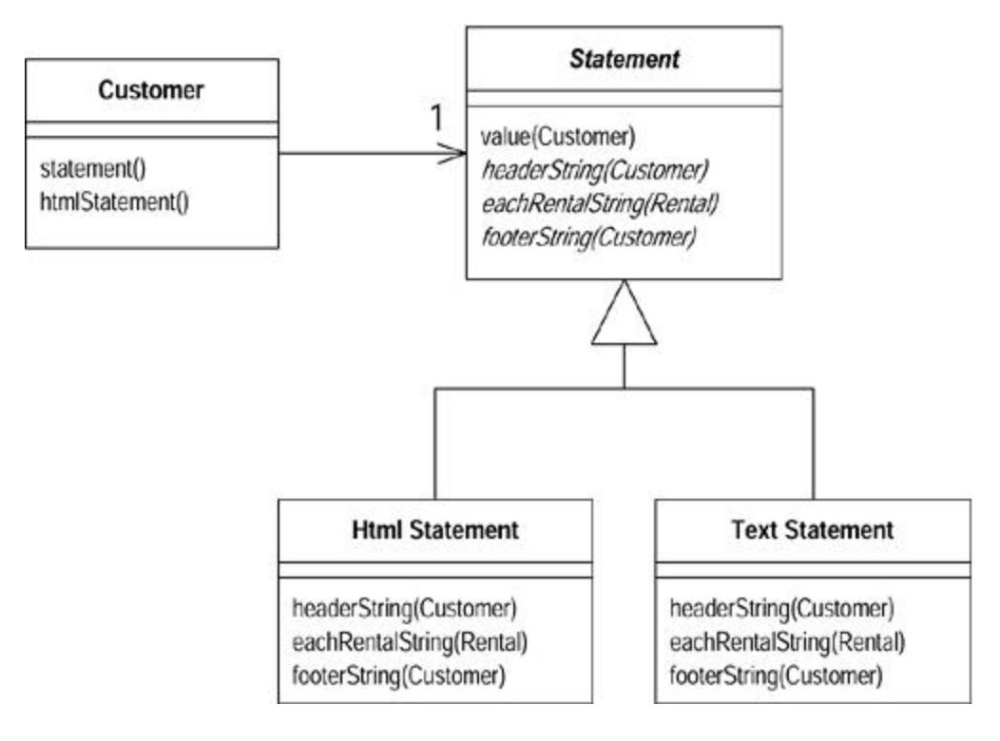

After this refactoring, it is easy to add new kinds of statements. All you have to do is create a subclass of statement that overrides the three abstract methods.

### Replace Inheritance with Delegation

A subclass uses only part of a superclasses interface or does not want to inherit data.

*Create a field for the superclass, adjust methods to delegate to the superclass, and remove the subclassing.*

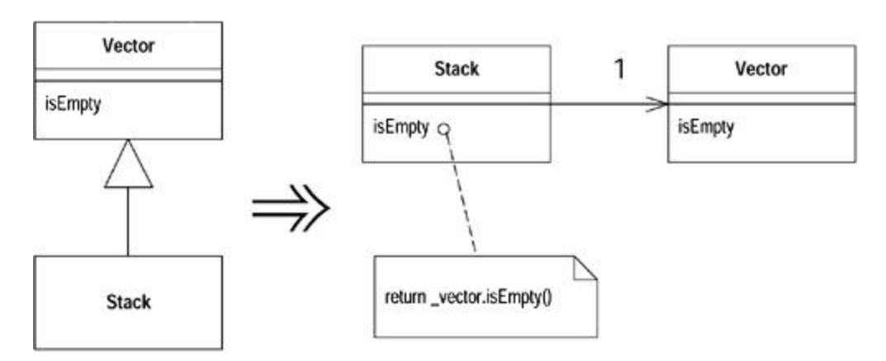

### Motivation

Inheritance is a wonderful thing, but sometimes it isn't what you want. Often you start inheriting from a class but then find that many of the superclass operations aren't really true of the subclass. In this case you have an interface that's not a true reflection of what the class does. Or you may find that you are inheriting a whole load of data that is not appropriate for the subclass. Or you may find that there are protected superclass methods that don't make much sense with the subclass.

You can live with the situation and use convention to say that although it is a subclass, it's using only part of the superclass function. But that results in code that says one thing when your intention is something else—a confusion you should remove.

By using delegation instead, you make it clear that you are making only partial use of the delegated class. You control which aspects of the interface to take and which to ignore. The cost is extra delegating methods that are boring to write but are too simple to go wrong.

### Mechanics

- · Create a field in the subclass that refers to an instance of the superclass. Initialize it to this.
- · Change each method defined in the subclass to use the delegate field. Compile and test after changing each method.

?rarr; *You won't be able to replace any methods that invoke a method on* super *that is defined on the subclass, or they may get into an infinite recurse. These methods can be replaced only after you have broken the inheritance.*

- · Remove the subclass declaration and replace the delegate assignment with an assignment to a new object.
- · For each superclass method used by a client, add a simple delegating method.
- · Compile and test.

### Example

One of the classic examples of inappropriate inheritance is making a stack a subclass of vector. Java 1.1 does this in its utilities (naughty boys!), but in this case I use a simplified form of stack:

```
 class MyStack extends Vector {
 public void push(Object element) {
 insertElementAt(element,0);
 }
 public Object pop() {
 Object result = firstElement();
 removeElementAt(0);
 return result;
 }
 }
```

Looking at the users of the class, I realize that clients do only four things with stack: push, pop, size, and isEmpty. The latter two are inherited from Vector.

I begin the delegation by creating a field for the delegated vector. I link this field to this so that I can mix delegation and inheritance while I carry out the refactoring:

```
 private Vector _vector = this;
```

Now I start replacing methods to get them to use the delegation. I begin with push:

```
 public void push(Object element) {
 _vector.insertElementAt(element,0);
 }
```

I can compile and test here, and everything will still work. Now pop:

```
 public Object pop() {
 Object result = _vector.firstElement();
 _vector.removeElementAt(0);
 return result;
 }
```

Once I've completed these subclass methods, I need to break the link to the superclass:

```
 class MyStack extends Vector
 private Vector _vector = new Vector();
```

I then add simple delegating methods for superclass methods used by clients:

```
 public int size() {
 return _vector.size();
 }
 public boolean isEmpty() {
 return _vector.isEmpty();
 }
```

Now I can compile and test. If I forgot to add a delegating method, the compilation will tell me.

## Replace Delegation with Inheritance

You're using delegation and are often writing many simple delegations for the entire interface.

*Make the delegating class a subclass of the delegate.*

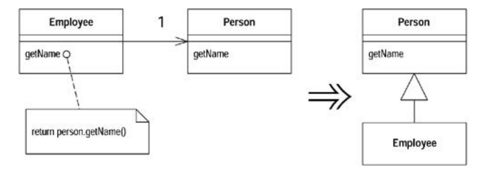

### Motivation

This is the flip side of Replace Delegation with Inheritance. If you find yourself using all the methods of the delegate and are sick of writing all those simple delegating methods, you can switch back to inheritance pretty easily.

There are a couple of caveats to bear in mind. If you aren't using all the methods of the class to which you are delegating, you shouldn't use *Replace Delegation with Inheritance,* because a subclass should always follow the interface of the superclass. If the delegating methods are tiresome, you have other options. You can let the clients call the delegate themselves with Remove Middle Man. You can use Extract Superclass to separate the common interface and then inherit from the new class. You can use Extract Interface in a similar way.

Another situation to beware of is that in which the delegate is shared by more than one object and is mutable. In this case you can't replace the delegate with inheritance because you'll no longer share the data. Data sharing is a responsibility that cannot be transferred back to inheritance. When the object is immutable, data sharing is not a problem, because you can just copy and nobody can tell.

### Mechanics

- · Make the delegating object a subclass of the delegate.
- · Compile.

?rarr; *You may get some method clashes at this point; methods may have the same name but vary in return type, exceptions, or visibility. Use* Rename Method *to fix these.*

- · Set the delegate field to be the object itself.
- · Remove the simple delegation methods.
- · Compile and test.
- · Replace all other delegations with calls to the object itself.
- · Remove the delegate field.

### Example

A simple employee delegates to a simple person:

```
 class Employee {
 Person _person = new Person();
 public String getName() {
 return _person.getName();
 }
 public void setName(String arg) {
 _person.setName(arg);
 }
 public String toString () {
 return "Emp: " + _person.getLastName();
 }
 }
 class Person {
 String _name;
 public String getName() {
 return _name;
 }
 public void setName(String arg) {
 _name = arg;
 }
 public String getLastName() {
 return _name.substring(_name.lastIndexOf(' ')+1);
 }
 }
```

The first step is just to declare the subclass:

```
 class Employee extends Person
```

Compiling at this point alerts me to any method clashes. These occur if methods with the name have different return types or throw different exceptions. Any such problems need to be fixed with Rename Method. This simple example is free of such encumbrances.

The next step is to make the delegate field refer to the object itself. I must remove all simple delegation methods such as getName and setName. If I leave any in, I will get a stack overflow error caused by infinite recursion. In this case this means removing getName and setName from Employee.

Once I've got the class working, I can change the methods that use the delegate methods. I switch them to use calls directly:

```
 public String toString () {
 return "Emp: " + getLastName();
```

}

Once I've got rid of all methods that use delegate methods, I can get rid of the \_person field.
