# Chapter 12: Big Refactorings

*by Kent Beck and Martin Fowler*

The preceding chapters present the individual "moves" of refactoring. What is missing is a sense of the whole "game." You are refactoring to some purpose, not just to avoid making progress (at least usually you are refactoring to some purpose). What does the whole game look like?

## The Nature of the Game

One thing you'll surely notice in what follows is that the steps aren't nearly as carefully spelled out as in the previous refactorings. That's because the situations change so much in the big refactorings. We can't tell you exactly what to do, because we don't know exactly what you'll be seeing when you do it. When you are adding a parameter to a method, the mechanics are clear because the scope is clear. When you are untangling an inheritance mess, every mess is different.

Another thing to realize about these refactorings is that they take time. All the refactorings in Chapters 6 through 11 can be accomplished in a few minutes or an hour at most. We have worked at some of the big refactorings for months or years on running systems. When you have a system and it's in production and you need to add functionality, you'll have a hard time persuading managers that they should stop progress for a couple of months while you tidy up. Instead, you have to make like Hansel and Gretel and nibble around the edges, a little today, a little more tomorrow.

As you do this, you should be guided by your need to do something else. Do the refactorings as you need to add function and fix bugs. You don't have to complete the refactoring when you begin. Do as much as you need to achieve your real task. You can always come back tomorrow.

This philosopy is reflected in the examples. To show you each of the refactorings in this book would easily take a hundred pages each. We know this, because Martin tried it. So we've compressed the examples into a few sketchy diagrams.

Because they can take such a long time, the big refactorings also don't have the instant gratification of the refactorings in the other chapters. You will have to have a little faith that you are making the world a little safer for your program each day.

The big refactorings require a degree of agreement among the entire programming team that isn't needed with the smaller refactorings. The big refactorings set the direction for many, many changes. The whole team has to recognize that one of the big refactorings is "in play" and make their moves accordingly. You don't want to get in the situation of the two guys whose car stops near the top of a hill. They get out to push, one on each end of the car. After a fruitless half-hour the guy in front says, "I never thought pushing a car downhill would be so hard." To which the other guy replies, "What do you mean 'downhill'?"

### Why Big Refactorings Are Important

If the big refactorings lack so many of the qualities that make the little refactorings valuable (predictability, visible progress, instant satisfaction), why are they important enough that we wanted to put them in this book? Because without them you run the risk of investing time and effort into learning to refactor and then actually refactoring and not getting the benefit. That would reflect badly on us. We can't stand that.

Seriously, you refactor not because it is fun but because there are things you expect to be able to do with your programs if you refactor that you just can't do if you don't refactor.

Accumulation of half-understood design decisions eventually chokes a program as a water weed chokes a canal. By refactoring you can ensure that your full understanding of how the program should be designed is always reflected in the program. As a water weed quickly spreads its tendrils, partially understood design decisions quickly spread their effects throughout your program. No one or two or even ten individual actions will be enough to eradicate the problem.

### Four Big Refactorings

In this chapter we describe four examples of big refactorings. These are examples of the kind of thing, rather than any attempt to cover the whole ground. Most of the research and practice on refactoring so far has concentrated on the smaller refactorings. Talking about big refactorings in this way is very new and has come primarily out of Kent's experience, which is greater than anyone's with doing this on a large scale.

Tease Apart Inheritance deals with a tangled inheritance hierarchy that seems to combine several variations in a confusing way. Convert Procedural Design to Objects helps solve the classic problem of what to do with procedural code. A lot of programmers use object-oriented languages without really knowing about objects, so this is a refactoring you often have to do. If you see code written with the classic two-tier approach to user interfaces and databases, you'll find you need Separate Domain from Presentation when you want to isolate business logic from user interface code. Experienced object-oriented developers have learned that this separation is vital to a long-lived and prosperous system. Extract Hierarchy simplifies an overly-complex class by turning it into a group of subclasses.

## Tease Apart Inheritance

You have an inheritance hierarchy that is doing two jobs at once.

*Create two hierarchies and use delegation to invoke one from the other.*

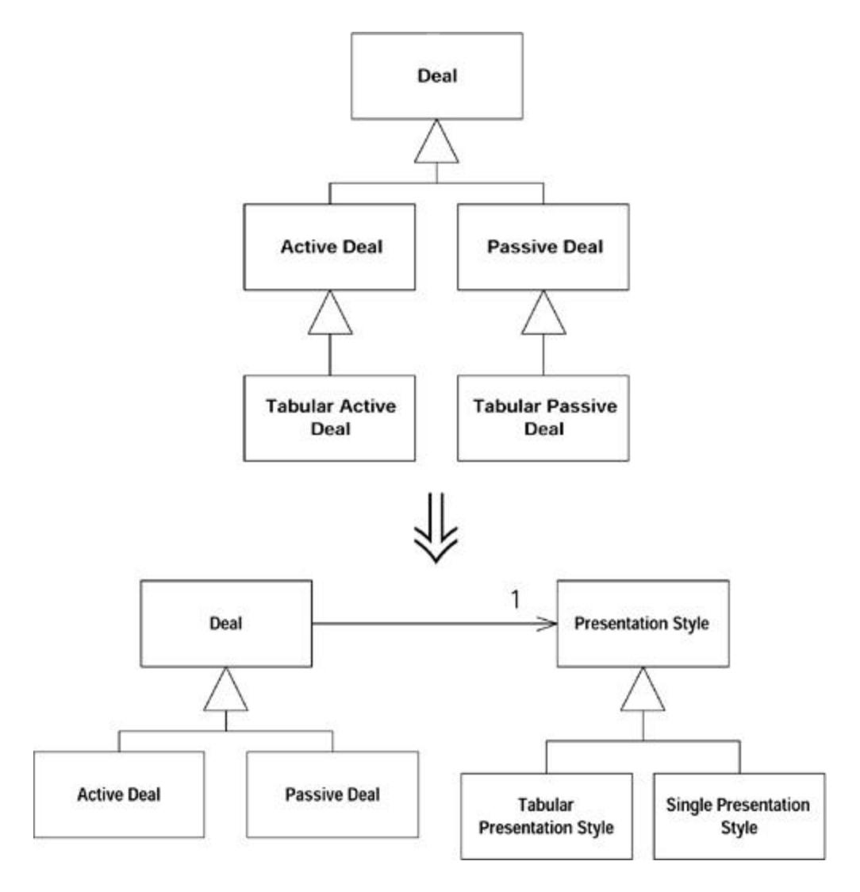

### Motivation

Inheritance is great. It helps you write dramatically "compressed" code in subclasses. A single method can take on importance out of proportion with its size because of where it sits in the hierarchy.

Not surprisingly for such a powerful mechanism, it is easy to misuse inheritance. And the misuse can easily creep up on you. One day you are adding one little subclass to do a little job. The next day you are adding other subclasses to do the same job in other parts of the hierarchy. A week (or month or year) later you are swimming in spaghetti. Without a paddle.

Tangled inheritance is a problem because it leads to code duplication, the bane of the programmer's existence. It makes changes more difficult, because the strategies for solving a certain kind of problem are spread around. Finally, the resulting code is hard to understand. You can't just say, "This hierarchy here, it computes results." You have to say, "Well, it computes results, and there are subclasses for the tabular versions, and each of those has subclasses for each of the countries."

You can easily spot a single inheritance hierarchy that is doing two jobs. If every class at a certain level in the hierarchy has subclasses that begin with the same adjective, you probably are doing two jobs with one hierarchy.

### Mechanics

- · Identify the different jobs being done by the hierarchy. Create a two-dimensional grid (or three- or four-dimensional, if your hierarchy is a real mess and you have some really cool graph paper) and label the axes with the different jobs. We assume two or more dimensions require repeated applications of this refactoring (one at a time, of course).
- · Decide which job is more important and is to be retained in the current hierarchy and which is to be moved to another hierarchy.
- · Use *Extract Class* (Chapter 6) at the common superclass to create an object for the subsidiary job and add an instance variable to hold this object.
- · Create subclasses of the extracted object for each of the subclasses in the original hierarchy. Initialize the instance variable created in the previous step to an instance of this subclass.
- · Use *Move Method* (Chapter 7) in each of the subclasses to move the behavior in the subclass to the extracted object.
- · When the subclass has no more code, eliminate it.
- · Continue until all the subclasses are gone. Look at the new hierarchy for possible further refactorings such as *Pull Up Method* or *Pull Up Field* (Chapter 11).

### Examples

Let's take the example of a tangled hierarchy (Figure 12.1).

**Figure 12.1. A tangled hierarchy**

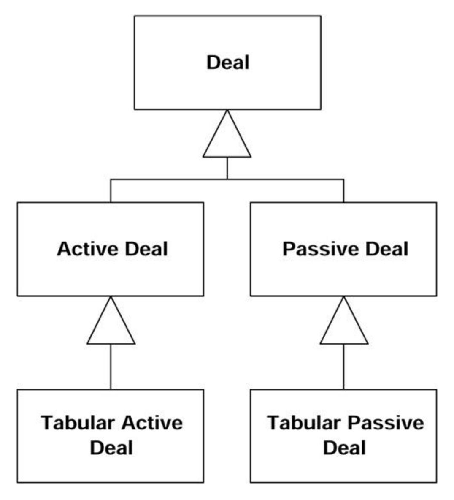

This hierarchy got the way it did because Deal was originally being used only to display a single deal. Then someone got the bright idea of displaying a table of deals. A little experiment with the quick subclass Active Deal shows you can indeed display a table with little work. Oh, you want tables of passive deals, too? No problem, another little subclass and away we go.

Two months later the table code has become complicated but there is no simple place to put it, time is pressing, the usual story. Now adding a new kind of deal is hard, because the deal logic is tangled with the presentation logic.

Following the recipe, the first step is to identify the jobs being done by the hierarchy. One job is capturing variation according to type of deal. Another job is capturing variation according to presentation style. So here's our grid:

| Deal         | Active Deal | Passive Deal |
|--------------|-------------|--------------|
| Tabular Deal |             |              |

The next step tells us to decide which job is more important. The dealness of the object is far more important than the presentation style, so we leave Deal alone and extract the presentation style to its own hierarchy. Practically speaking, we should probably leave alone the job that has the most code associated with it, so there is less code to move.

The next step tells us to use Extract Class to create a presentation style (Figure 12.2).

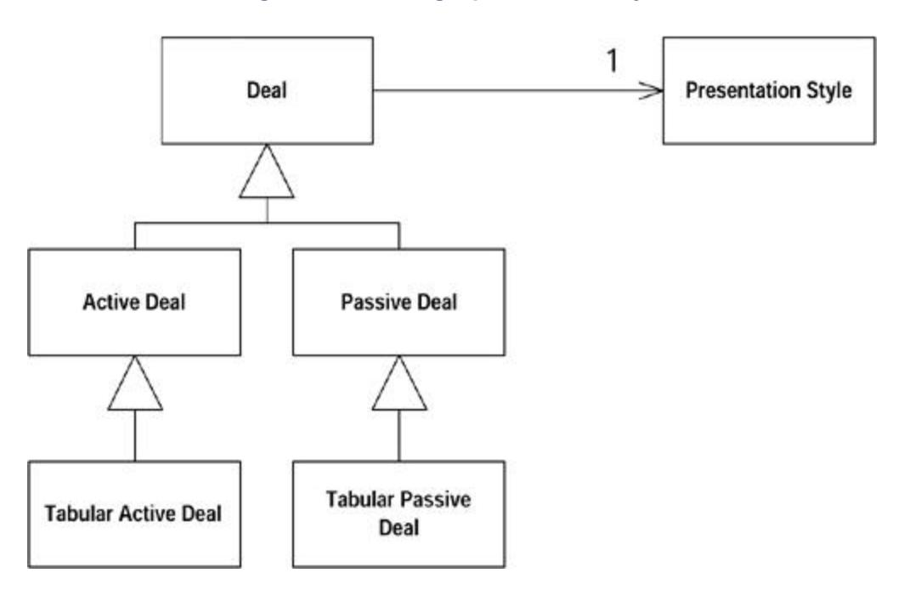

**Figure 12.2. Adding a presentation style**

The next step tells us to create subclasses of the extracted class or for each of the subclasses in the original hierarchy (Figure 12.3) and to initialize the instance variable to the appropriate subclass:

**Figure 12.3. Adding subclasses of presentation style**

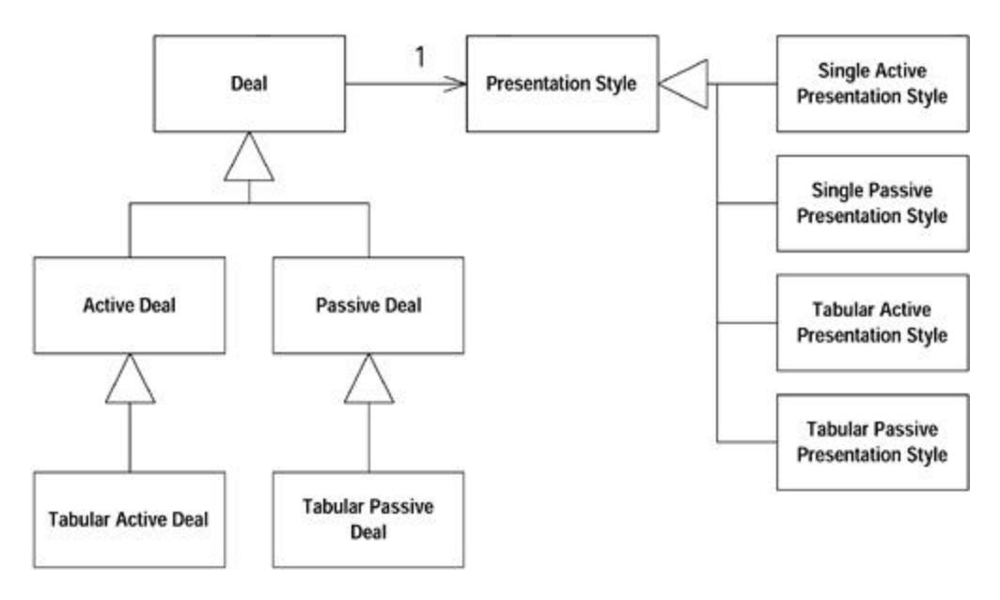

 ActiveDeal constructor ...presentation= new SingleActivePresentationStyle();...

You may well be saying, "Don't we have more classes now than we did before? How is this supposed to make my life better?" It is true that sometimes you have to take a step backward before you can take two steps forward. In cases such as this tangled hierarchy, the hierarchy of the extracted object can almost always be dramatically simplified once the object has been extracted. However, it is safer to take the refactoring one step at a time than to jump ten steps ahead to the already simplified design.

Now we use Move Method and Move Field to move the presentation-related methods and variables of the deal subclasses to the presentation style subclasses. We don't have a good way of simulating this with the example as drawn, so we ask you to imagine it happening. When we're done, though, there should be no code left in the classes Tabular Active Deal and Tabular Passive Deal, so we remove them (Figure 12.4).

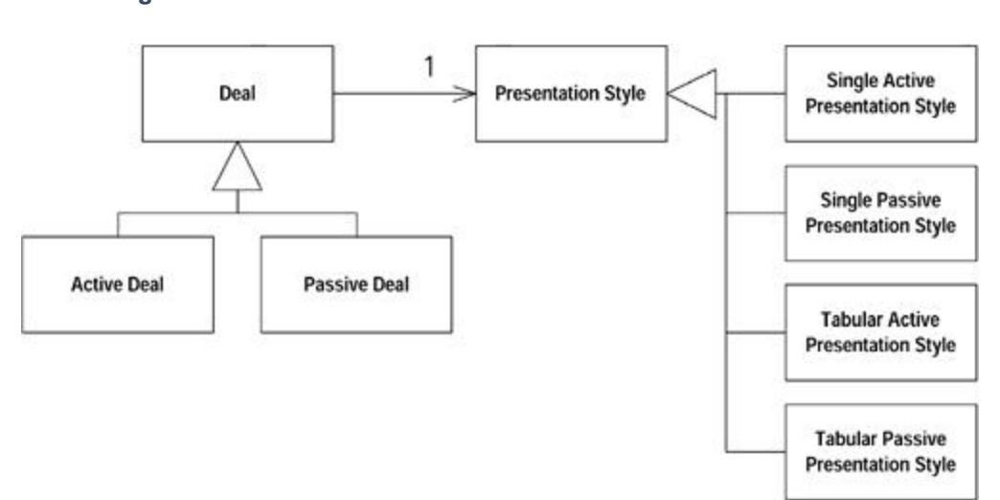

**Figure 12.4. The tabular subclasses of Deal have been removed**

Now that we've separated the two jobs, we can work to simplify each separately. When we've done this refactoring, we've always been able to dramatically simplify the extracted class and often further simplify the original object. The next move will get rid of the active-passive distinction in the presentation style in Figure 12.6.

**Figure 12.6. Presentation differences can be handled with a couple of variables**

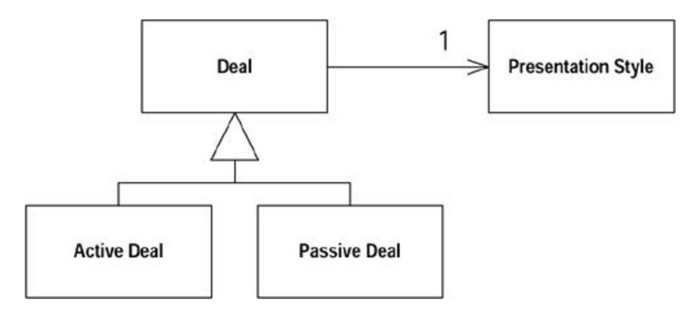

Even the distinction between single and tabular can be captured by the values of a few variables. You don't need subclasses at all (Figure 12.6).

**Figure 12.5. The hierarchies are now separated**

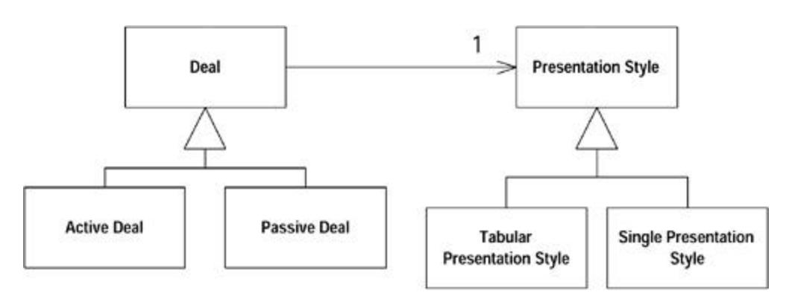

## Convert Procedural Design to Objects

You have code written in a procedural style.

*Turn the data records into objects, break up the behavior, and move the behavior to the objects.*

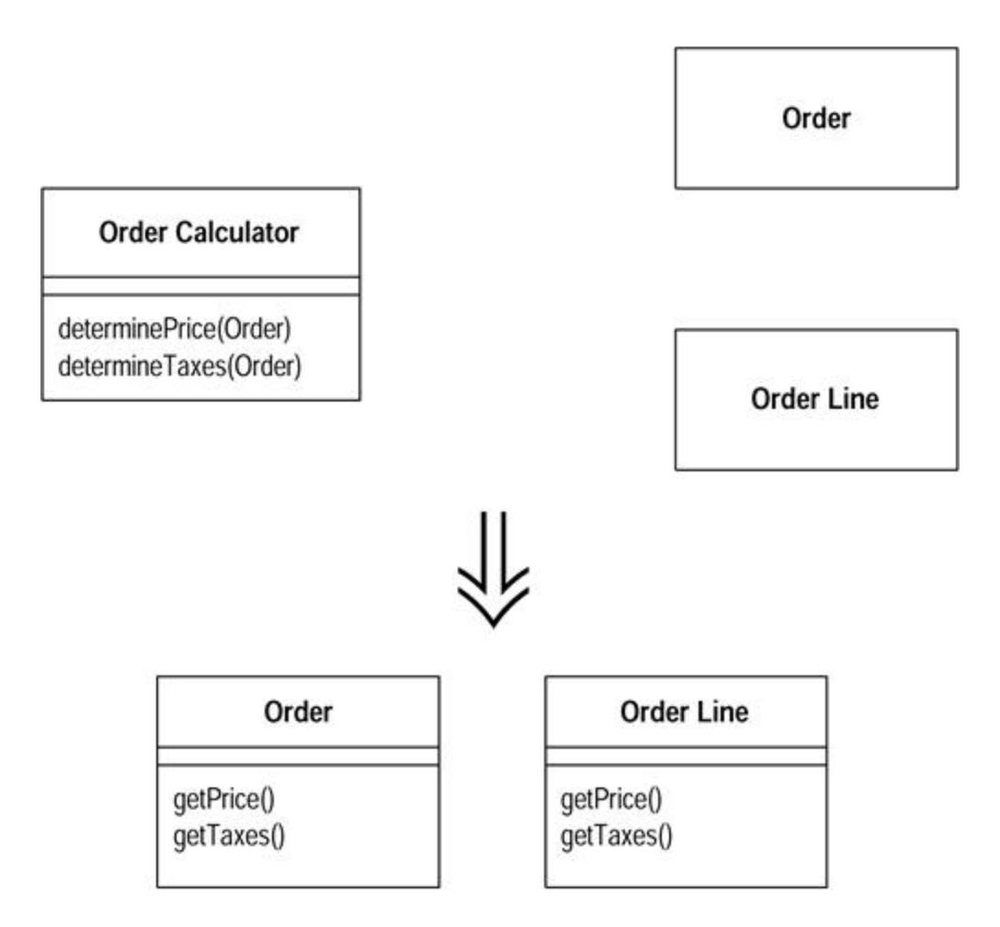

### Motivation

A client of ours once started a project with two absolute principles the developers had to follow: (1) you must use Java, (2) you must not use objects.

We may laugh, but although Java is an object-oriented language, there is more to using objects than calling a constructor. Using objects well takes time to learn. Often you're faced with the problem of procedure-like code that has to be more object oriented. The typical situation is long procedural methods on a class with little data and dumb data objects with nothing more than accessors. If you are converting from a purely procedural program, you may not even have this, but it's a good place to start.

We are not saying that you should never have objects with behavior and little or no data. We often use small strategy objects when we need to vary behavior. However, such procedural objects usually are small and are used when we have a particular need for flexibility.

### Mechanics

· Take each record type and turn it into a dumb data object with accessors.

?rarr; *If you have a relational database, take each table and turn it into a dumb data object.*

· Take all the procedural code and put it into a single class.

?rarr; *You can either make the class a singleton (for ease of reinitialization) or make the methods static.*

- · Take each long procedure and apply Extract Method and the related refactorings to break it down. As you break down the procedures, use Move Method to move each one to the appropriate dumb data class.
- · Continue until you've removed all the behavior away from the original class. If the original class was a purely procedural class, it's very gratifying to delete it.

### Example

The example in Chapter 1 is a good example of the need for *Convert Procedural Design to Objects,* particularly the first stage, in which the statement method is broken up and distributed. When you're finished, you can work on now-intelligent data objects with other refactorings.

### Separate Domain from Presentation

You have GUI classes that contain domain logic.

*Separate the domain logic into separate domain classes*

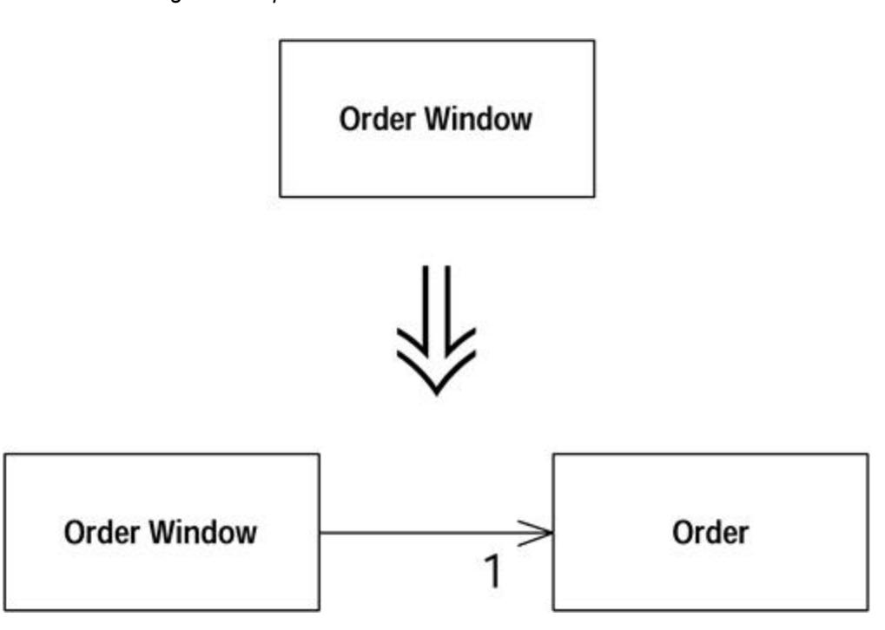

### Motivation

Whenever you hear people talking about objects, you hear about model-view-controller (MVC). This idea underpinned the relationship between the graphical user interface (GUI) and domain objects in Smalltalk-80.

The gold at the heart of MVC is the separation between the user interface code (the *view,* these days often called the *presentation*) and the domain logic (the *model*). The presentation classes contain only the logic needed to deal with the user interface. Domain objects contain no visual code but all the business logic. This separates two complicated parts of the program into pieces that are easier to modify. It also allows multiple presentations of the same business logic. Those experienced in working with objects use this separation instinctively, and it has proved its worth.

But this is not how most people who work with GUIs do their design. Most environments with client-server GUIs use a logical two-tier design: the data sits in the database and the logic sits in the presentation classes. The environment often forces you toward this style of design, making it hard for you to put the logic anywhere else.

Java is a proper object-oriented environment, so you can create nonvisual domain objects that contain business logic. However, you'll often come across code written in the two-tier style.

### Mechanics

- · Create a domain class for each window.
- · If you have a grid, create a class to represent the rows on the grid. Use a collection on the domain class for the window to hold the row domain objects.
- · Examine the data on the window. If it is used only for user interface purposes, leave it on the window. If it is used within the domain logic but is not actually displayed on the window, use Move Method to move it to the domain object. If it is used by both the user interface and the domain logic, use Duplicate Observed Data so that it is in both places and kept in sync.
- · Examine the logic in the presentation class. Use Extract Method to separate logic about the presentation from domain logic. As you isolate the domain logic, use Move Method to move it to the domain object.
- · When you are finished, you will have presentation classes that handle the GUI and domain objects that contain all the business logic. The domain objects will not be well factored, but further refactorings will deal with that.

### Example

A program that allows users to enter and price orders. The GUI looks like Figure 12.7. The presentation class interacts with a relational database laid out like Figure 12.8.

**Figure 12.7. The user interface for a starting program**

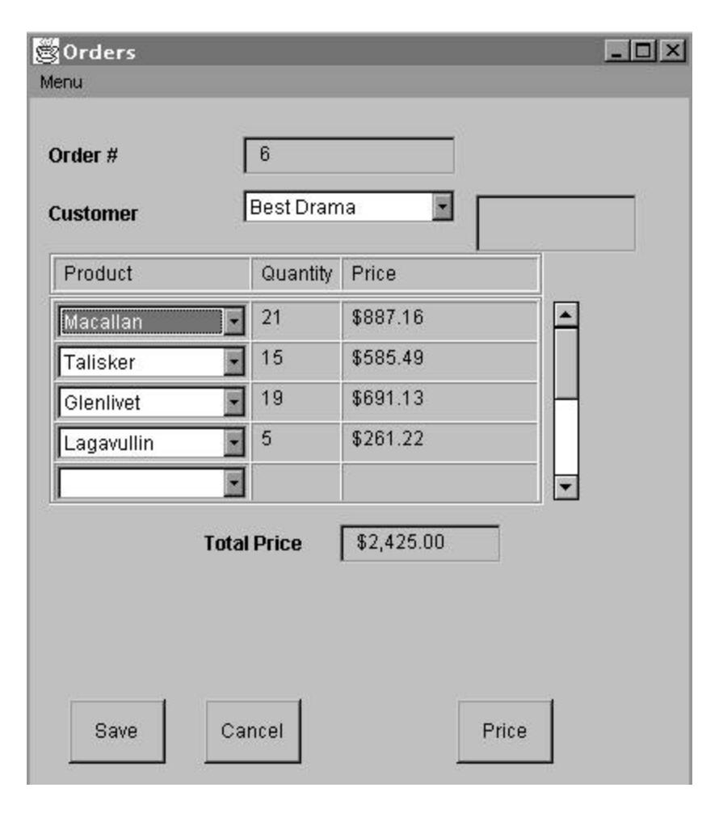

**Figure 12.8. The database for the order program**

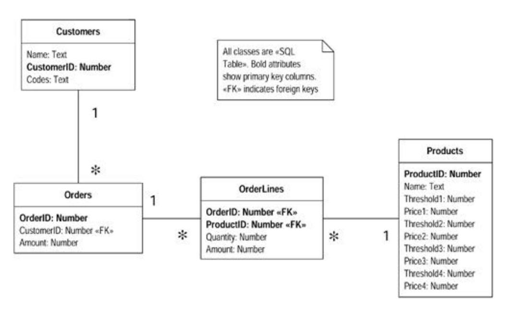

All the behavior, both for the GUI and for pricing the orders, is in a single Order Window class.

We begin by creating a suitable order class. We link this to the order window as in Figure 12.9. Because the window contains a grid to display the order lines, we also create an order line class for the rows of the grid.

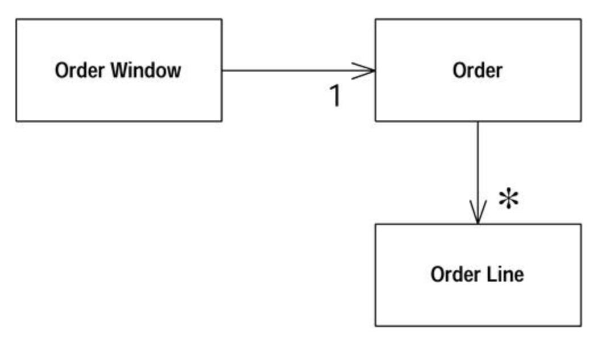

**Figure 12.9. Order Window and Order**

We work from the window rather than the database. Basing an initial domain model on the database is a reasonable strategy, but our biggest risk is mixing presentation and domain logic. So we separate these on the basis of the windows and refactor the rest later.

With this kind of program it's useful to look at the structured query language (SQL) statements embedded in the window. Data pulled back from SQL statements is domain data.

The easiest domain data to deal with is that which isn't directly displayed in the GUI. In the example the database has a codes field in the customers table. The code isn't directly displayed on the GUI; it is converted to a more human-readable phrase. As such the field is a simple class, such as string, rather than an AWT component. We can safely use Move Field to move that field to the domain class.

We aren't so lucky with the other fields. They contain AWT components that are displayed on the window and used in the domain objects. For these we need to use Duplicate Observed Data. This puts a domain field on the order class with a corresponding AWT field on the order window.

This is a slow process, but by the end we can get all the domain logic fields into the domain class. A good way to drive this process is to try to move all the SQL calls to the domain class. You can do this to move the database logic and the domain data to the domain class together. You can get a nice sense of completion by removing the import of java.sql from the order window. This means you do a lot of Extract Method and Move Method.

The resulting classes, as in Figure 12.10, are a long way from being well factored. But this model is enough to separate the domain logic. As you do this refactoring you have to pay attention to where your risk is. If the intermingling of presentation and domain logic is the biggest risk, get them completely separated before you do much else. If other things are more important, such as pricing strategies for the products, get the logic for the important part out of the window and refactor around that logic to create a suitable structure for the area of high risk. Chances are

that most of the domain logic will have to be moved out of the order window. If you can refactor and leave some logic in the window, do so to address your biggest risk first.

**Figure 12.10. Distributing the data to the domain classes**

## Extract Hierarchy

You have a class that is doing too much work, at least in part through many conditional statements.

*Create a hierarchy of classes in which each subclass represents a special case.*

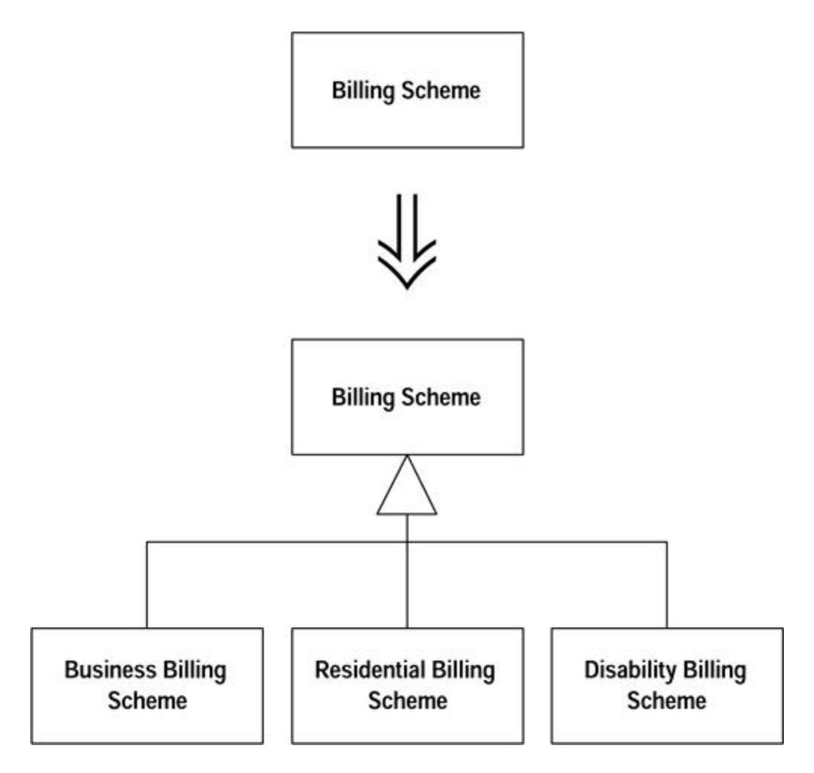

### Motivation

In evolutionary design, it is common to think of a class as implementing one idea and come to realize later that it is really implementing two or three or ten. You create the class simply at first. A few days or weeks later you see that if only you add a flag and a couple of tests, you can use it in a new case. A month later you have another such opportunity. A year later you have a real mess: flags and conditional expressions all over the place.

When you encounter a Swiss-Army-knife class that has grown to open cans, cut down small trees, shine a laser point at reluctant presentation bullet items, and, oh yes, I suppose cut things, you need a strategy for teasing apart the various strands. The strategy here works only if your conditional logic remains static during the life of the object. If not, you may have to use Extract Class before you can begin separating the cases from each other.

Don't be discouraged if *Extract Hierarchy* is a refactoring that you can't finish in a day. It can take weeks or months to untangle a design that has become snarled. Do the steps that are easy and obvious, then take a break. Do some visibly productive work for a few days. When you've learned something, come back and do a few more easy and obvious steps.

### Mechanics

We've put in two sets of mechanics. In the first case you aren't sure what the variations should be. In this case you want to take one step at a time, as follows:

· Identify a variation.

?rarr; *If the variations can change during the life of the object, use* Extract Class *to pull that aspect into a separate class.*

- · Create a subclass for that special case and use Replace Constructor with Factory Method on the original. Alter the factory method to return an instance of the subclass where appropriate.
- · One at a time, copy methods that contain conditional logic to the subclass, then simplify the methods given what you can say for certain about instances of the subclass that you can't say about instances of the superclass.

?rarr; *Use* Extract Method *in the superclass if necessary to isolate the conditional parts of methods from the unconditional parts.*

- · Continue isolating special cases until you can declare the superclass abstract.
- · Delete the bodies of methods in the superclass that are overridden in all subclasses and make the superclass declarations abstract.

When the variations are very clear from the outset, you can use a different strategy, as follows:

- · Create a subclass for each variation.
- · Use Replace Constructor with Factory Method to return the appropriate subclass for each variation.

?rarr; *If the variations are marked with a type code, use* Replace Type Code with Subclasses. *If the variations can change within the life of the class, use* Replace Type Code with State/Strategy.

· Take methods that have conditional logic and apply Replace Conditional with Polymorphism. If the whole method does not vary, isolate the varying part with Extract Method.

### Example

The example is a nonobvious case. You can follow the refactorings for Replace Type Code with Subclasses, Replace Type Code with State/Strategy, and Replace Conditional with Polymorphism to see how the obvious case works.

We start with a program that calculates an electricity bill. The initial objects look like Figure 12.11.

**Figure 12.11. Customer and billing scheme**

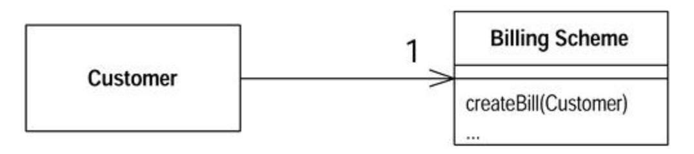

The billing scheme contains a lot of conditional logic for billing in different circumstances. Different charges are used for summer and winter, and different billing plans are used for residential, small business, customers receiving Social Security (lifeline), and those with a disability. The resulting complex logic makes the Billing Scheme class rather complex.

Our first step is to pick a variant aspect that keeps cropping up in the conditional logic. This might be various conditions that depend on whether the customer is on a disability plan. This can be a flag in Customer, Billing Scheme, or somewhere else.

We create a subclass for the variation. To use the subclass we need to make sure it is created and used. So we look at the constructor for Billing Scheme. First we use Replace Constructor with Factory Method. Then we look at the factory method and see how the logic depends on disability. We then create a clause that returns a disability billing scheme when appropriate.

We look at the various methods on Billing Scheme and look for those that contain conditional logic that varies on the basis of disability. CreateBill is one of those methods, so we copy it to the subclass (Figure 12.12).

**Figure 12.12. Adding a subclass for disability**

Now we examine the subclass copy of createBill and simplify it on the basis that we know it is now within the context of a disability scheme. So code that says

if (disabilityScheme()) doSomething

#### can be replaced with

doSomething

If disabilities are exclusive of the business scheme we can eliminate any code that is conditional on the business scheme.

As we do this, we like to ensure that varying code is separated from code that stays the same. We use Extract Method and Decompose Conditional to do that. We continue doing this for various methods of Billing Scheme until we feel we've dealt with most of the disability conditionals. Then we pick another variation, say lifeline, and do the same for that.

As we do the second variation, however, we look at how the variations for lifeline compare with those for disability. We want to identify cases in which we can have methods that have the same intention but carry it out differently in the two separate cases. We might have variation in the calculation of taxes for the two cases. We want to ensure that we have two methods on the subclasses that have the same signature. This may mean altering disability so we can line up the subclasses. Usually we find that as we do more variations, the pattern of similar and varying methods tends to stabilize, making additional variations easier.
