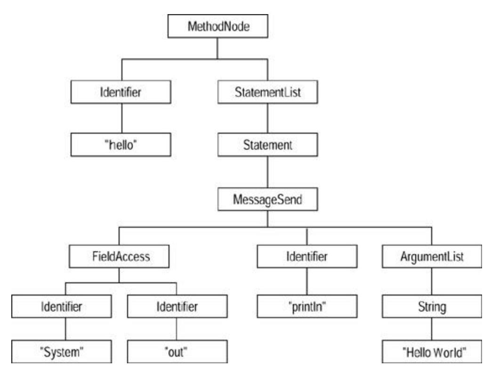

# Chapter 14: Refactoring Tools

*by Don Roberts and John Brant*

One of the largest barriers to refactoring code has been the woeful lack of tool support for it. Languages in which refactoring is part of the culture, such as Smalltalk, usually have powerful environments that support many of the features necessary to refactor code. Even there, the process has been only partially supported until recently, and most of the work is still being done by hand.

## Refactoring with a Tool

Refactoring with automated tool support feels different from manual refactoring. Even with the safety net of a test suite in place, refactoring by hand is time consuming. This simple fact prevents programmers from making refactorings they know they should, simply because refactoring costs too much. By making refactoring as inexpensive as adjusting the format of code, cleanup work can be done in a similar manner to cleaning up the look of code. However, this type of cleanup can have a profound, positive effect on the maintainability, reusability, and understandability of code. Kent Beck says:

### Kent Beck

[The Refactoring Browser] completely changes the way you think about programming. All those niggling little "well, I should change this name but …" thoughts go away, because you just change the name because there is always a single menu item to just change the name.

When I started using this tool, I spent about two hours refactoring at my old pace. I would do a refactoring, then just kind of stare off into space for the five minutes it would have taken me to do the refactoring by hand, then do another and stare into space again. After a while, I caught myself and realized that I had to learn to think bigger refactoring thoughts and think them faster. Now I use probably half refactoring and half entering new code, all at the same speed.

With this level of tool support for refactoring, it becomes less and less a separate activity from programming. Very rarely do we say, "Now I'm programming" and "Now I'm refactoring." We're more likely to say, "Extract this portion of the method, push it up to the superclass, then add a call to the new method in the new subclass that I'm working on." Because I don't have to test after the automated refactorings, the activities flow into each other, and the process of switching hats becomes much less evident, although it is still occurring.

Consider Extract Method, an important refactoring. You have many things to check for when you do it by hand. With the Refactoring Browser, you simply select the text to extract and find the menu item named Extract Method. The tool determines whether the selected text is legal to extract. There are several reasons the selection might be illegal. It could contain only a portion of an identifier, or it might contain assignments to a variable without containing all of the references. You don't have to worry about all of the cases, because the tool deals with them. The tool then computes how many parameters must be passed into the new method. It then prompts you for a name for the new method and allows you to specify the order of the parameters in the call to the

new function. Once this is done, the tool extracts the code from the original method and replaces it with a call. It then creates the new method in the same class as the original method and with the name that the user specified. The entire process takes about 15 seconds. Compare this with the time necessary to perform the steps in Extract Method.

As refactoring becomes less expensive, design mistakes become less costly. Because it is less expensive to fix design mistakes, less design needs to be done up front. Upfront design is a predictive activity because the requirements will be incomplete. Because the code is not available, the correct way to design to simplify the code is not obvious. In the past, we had to live with whatever design we initially created because the cost to change the design was too great. With automatic refactoring tools, we can allow the design to be more fluid because changing it is much less costly. Given this new set of costs, we can design to the level of the current problem knowing that we can inexpensively extend the design to add additional flexibility in the future. No longer do we need to attempt to predict every possible way the system might change in the future. If we find that the current design makes the code awkward with the smells described in Chapter 3, we can quickly change the design to make the code clean and maintainable.

Tool-assisted refactoring affects testing. Much less testing has to occur because many of the refactorings are performed automatically. There will always be refactorings that cannot be automated, so the testing step will never be eliminated. The empirical observation has been that the tests are run the same number of times per day as in environments without automatic testing tools but that more refactoring is done.

As Martin has pointed out, Java needs tools to support this kind of behavior by programmers. We want to point out some of the criteria that such a tool must have to be successful. Although we have included the technical criteria, we believe that the practical criteria are much more important.

## Technical Criteria for a Refactoring Tool

The main purpose of a refactoring tool is to allow the programmer to refactor code without having to retest the program. Testing is time consuming even when automated, and eliminating it can accelerate the refactoring process by a significant factor. This section briefly discusses the technical requirements for a refactoring tool that are necessary to allow it to transform a program while preserving the behavior of the program.

### Program Database

One of the first requirements recognized was the ability to search for various program entities across the entire program, such as with a particular method, finding all calls that can potentially refer to the method in question, or with a particular instance variable, finding all of the methods that read or write it. In tightly integrated environments such as Smalltalk, this information is maintained constantly in a searchable form. This is not a database as traditionally understood, but it *is* a searchable repository. The programmer can perform a search to find cross references to any program element, mainly because of the dynamic compilation of the code. As soon as a change is made to any class, the change is immediately compiled into bytecodes, and the "database" is updated. In more static environments such as Java, programmers enter the code in text files. Updates to the database must be performed by running a program to process these files and extract the relevant information. These updates are similar to compilation of the Java code itself. Some of the more modern environments, such as IBM VisualAge for Java, mimic Smalltalk's dynamic update of the program database.

A naïve approach is to use textual tools such as grep to do the search. This approach breaks down quickly because it cannot differentiate between a variable named *foo* and a function named *foo.* Creating a database requires using semantic analysis (parsing) to determine the "part of speech" of every token in the program. This must done at both the class definition level, to determine instance variable and method definitions, and at the method level, to determine instance variable and method references.

### Parse Trees

Most refactorings have to manipulate portions of the system below the method level. These are usually references to program elements that are being changed. For example, if an instance variable is renamed (simply a definition change), all references within the methods of that class and its subclasses must be updated. Other refactorings are entirely below the method level, such as extracting a portion of a method into its own, stand-alone method. Any update to a method has to be able to manipulate the structure of the method. To do this requires parse trees. A parse tree is a data structure that represents the internal structure of the method itself. As a simple example, consider the following method:

```
 public void hello( ){
 System.out.println("Hello World");
 }
```

The parse tree corresponding to this would look like Figure 14.1.



**Figure 14.1. Parse tree for hello world**

## Accuracy

The refactorings implemented by a tool must reasonably preserve the behavior of programs. Total preservation of behavior is impossible to achieve. For example, what if a refactoring makes a program a few milliseconds faster or slower? This usually would not affect a program, but if the program requirements include hard real-time constraints, this could cause a program to be incorrect.

Even more traditional programs can be broken. For example, if your program constructs a string and uses the Java Reflection API to execute the method that the String names, renaming the method will cause the program to throw an exception that the original did not.

However, refactorings can be made reasonably accurate for most programs. As long as the cases that will break a refactoring are identified, programmers who use those techniques can either avoid the refactoring or manually fix the parts of the program that the refactoring tool cannot fix.

## Practical Criteria for a Refactoring Tool

Tools are created to support a human in a particular task. If a tool does not fit the way a person works, the person will not use it. The most important criteria are the ones that integrate the refactoring process with other tools.

### Speed

The analysis and transformations needed to perform refactorings can be time consuming if they are very sophisticated. The relative costs of time and accuracy always must be considered. If a refactoring takes too long, a programmer will never use the automatic refactoring but will just perform it by hand and live with the consequences. Speed should always be considered. In the process of developing the Refactoring Browser, we had a few refactorings that we did not implement simply because we could not implement them safely in a reasonable amount of time. However, we did a decent job, and most of the refactorings are extremely fast and very accurate. Computer scientists tend to focus on all of the boundary cases that a particular approach will not handle. The fact is that most programs are not boundary cases and that simpler, faster approaches work amazingly well.

An approach to consider if an analysis would be too slow is simply to ask the programmer to provide the information. This puts the responsibility for accuracy back into the hands of the programmer while allowing the analysis to be performed quickly. Quite often the programmer knows the information that is required. Even though this approach is not provably safe because the programmer can make mistakes, the responsibility for error rests on the programmers. Ironically, this makes programmers more likely to use the tool because they are not required to rely on a program's heuristic to find information.

### Undo

Automatic refactoring allows an exploratory approach to design. You can push the code around and see how it looks under the new design. Because a refactoring is supposed to be behavior preserving, the inverse refactoring, which undoes the original, also is a refactoring and is behavior preserving. Earlier versions of the Refactoring Browser did not incorporate the undo feature. This made refactoring a little more tentative because undoing some refactorings, although behavior preserving, was difficult. Quite often we would have to find an old version of the program and start again. This was annoying. With the addition of undo, yet another fetter was thrown off. Now we can explore with impunity, knowing that we can roll back to any prior version.

We can create classes, move methods into them to see how the code will look, and change our minds and go a completely different direction, all very quickly.

### Integrated with Tools

In the past decade the integrated development environment (IDE) has been at the core of most development projects. The IDE integrates the editor, compiler, linker, debugger, and any other tool necessary for developing programs. An early implementation of the Refactoring Browser for Smalltalk was a separate tool from the standard Smalltalk development tools. What we found was that no one used it. We did not even use it ourselves. Once we integrated the refactorings directly into the Smalltalk Browser, we used them extensively. Simply having them at our fingertips made all the difference.

## Wrap Up

We have spent several years developing and using the Refactoring Browser. It is quite common for us to use it to refactor its own code. One of the reasons for its success is that we are programmers and we have tried constantly to make it fit the way we work. If we ran across a refactoring that we had to perform by hand and we felt it was general, we would implement it and add it. If something took too long, we would make it faster. If something wasn't accurate enough, we would improve it.

We believe that automatic refactoring tools are the best way to manage the complexity that arises as a software project evolves. Without tools to deal with this complexity, software becomes bloated, buggy, and brittle. Because Java is much simpler than the language with which it shares syntax, it is much easier to develop tools to refactor it. We hope this will occur and that we can avoid the sins of C++.
