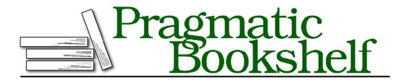

# Release It! Second Edition

Design and Deploy Production-Ready Software

## Early praise for Release It! Second Edition

Mike is one of the software industry's deepest thinkers and clearest communicators. As beautifully written as the original, the second edition of *Release Itl* extends the first with modern techniques—most notably continuous deployment, cloud infrastructure, and chaos engineering—that will help us all build and operate large-scale software systems.

### Randy Shoup

VP Engineering, Stitch Fix

If you are putting any kind of system into production, this is the single most important book you should keep by your side. The author's enormous experience in the area is captured in an easy-to-read, but still very intense, way. In this updated edition, the new ways of developing, orchestrating, securing, and deploying real-world services to different fabrics are well explained in the context of the core resiliency patterns.

### ➤ Michael Hunger

Director of Developer Relations Engineering, Neo4j, Inc.

So much ground is covered here: patterns and antipatterns for application resilience, security, operations, architecture. That breadth would be great in itself, but there's tons of depth too. Don't just read this book—study it.

### ➤ Colin Jones

CTO at 8th Light and Author of Mastering Clojure Macros

Release It! is required reading for anyone who wants to run software to production and still sleep at night. It will help you build with confidence and learn to expect and embrace system failure.

### ➤ Matthew White

Author of Deliver Audacious Web Apps with Ember 2

I would recommend this book to anyone working on a professional software project. Given that this edition has been fully updated to cover technologies and topics that are dealt with daily, I would expect everyone on my team to have a copy of this book to gain awareness of the breadth of topics that must be accounted for in modern-day software development.

### ➤ Andy Keffalas

Software Engineer/Team Lead

A must-read for anyone wanting to build truly robust, scalable systems.

#### ➤ Peter Wood

Software Programmer

## Release It! Second Edition

Design and Deploy Production-Ready Software

Michael T. Nygard

Many of the designations used by manufacturers and sellers to distinguish their products are claimed as trademarks. Where those designations appear in this book, and The Pragmatic Programmers, LLC was aware of a trademark claim, the designations have been printed in initial capital letters or in all capitals. The Pragmatic Starter Kit, The Pragmatic Programmer, Pragmatic Programming, Pragmatic Bookshelf, PragProg and the linking g device are trademarks of The Pragmatic Programmers, LLC.

Every precaution was taken in the preparation of this book. However, the publisher assumes no responsibility for errors or omissions, or for damages that may result from the use of information (including program listings) contained herein.

Our Pragmatic books, screencasts, and audio books can help you and your team create better software and have more fun. Visit us at KWWSV - SUDJSURJ FRP

The team that produced this book includes:

Publisher: Andy Hunt

VP of Operations: Janet Furlow Managing Editor: Brian MacDonald Supervising Editor: Jacquelyn Carter Development Editor: Katharine Dvorak

Copy Editor: Molly McBeath Indexing: Potomac Indexing, LLC

Layout: Gilson Graphics

For sales, volume licensing, and support, please contact VXSSRUW#SUDJSURJ FRP

For international rights, please contact ULJKWV#SUDJSURJ FRP

Copyright © 2018 The Pragmatic Programmers, LLC. All rights reserved.

No part of this publication may be reproduced, stored in a retrieval system, or transmitted, in any form, or by any means, electronic, mechanical, photocopying, recording, or otherwise, without the prior consent of the publisher.

Printed in the United States of America. ISBN-13: 978-1-68050-239-8 Encoded using the finest acid-free high-entropy binary digits. Book version: P1.0—January 2018
