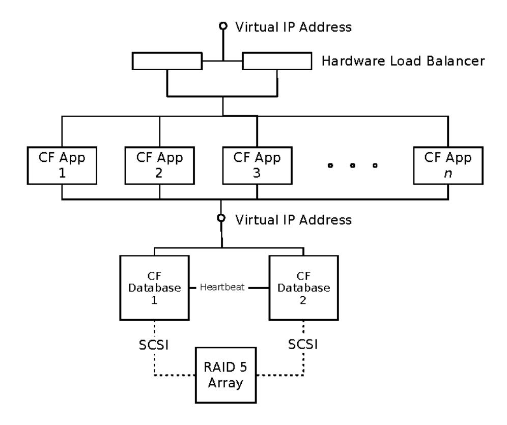
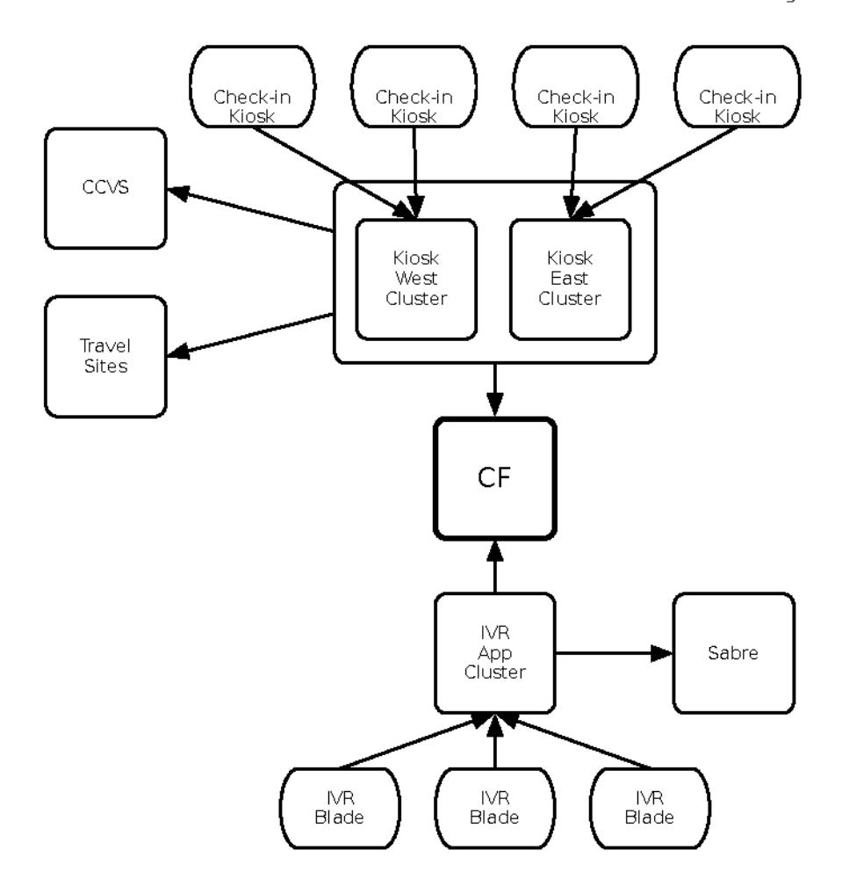

# Chapter 2: Case Study:

## The Exception That Grounded an Airline

Have you ever noticed that the incidents that blow up into the biggest issues start with something very small? A tiny programming error starts the snowball rolling downhill. As it gains momentum, the scale of the problem keeps getting bigger and bigger. A major airline experienced just such an incident. It eventually stranded thousands of passengers and cost the company hundreds of thousands of dollars. Here's how it happened.

As always, all names, places, and dates have been changed to protect the confidentiality of the people and companies involved.

It started with a planned failover on the database cluster that served the core facilities (CF). The airline was moving toward a service-oriented architecture, with the usual goals of increasing reuse, decreasing development time, and decreasing operational costs. At this time, CF was in its first generation. The CF team planned a phased rollout, driven by features. It was a sound plan, and it probably sounds familiar—most large companies have some variation of this project underway now.

CF handled flight searches—a common service for any airline application. Given a date, time, city, airport code, flight number, or any combination thereof, CF could find and return a list of flight details. When this incident happened, the self-service check-in kiosks, phone menus, and "channel partner" applications had been updated to use CF. Channel partner applications generate data feeds for big travel-booking sites. IVR and self-service check-in are both used to put passengers on airplanes—"butts in seats," in the vernacular. The development schedule had plans for new releases of the gate agent and call center applications to transition to CF for flight lookup,

but those had not been rolled out yet. This turned out to be a good thing, as you'll soon see.

The architects of CF were well aware of how critical it would be to the business. They built it for high availability. It ran on a cluster of J2EE application servers with a redundant Oracle 9i database. All the data were stored on a large external RAID array with twice-daily, off-site backups on tape and on-disk replicas in a second chassis that were guaranteed to be five minutes old at most. Everything was on real hardware, no virtualization. Just melted sand, spinning rust, and the operating systems.

The Oracle database server ran on one node of the cluster at a time, with Veritas Cluster Server controlling the database server, assigning the virtual IP address, and mounting or unmounting filesystems from the RAID array. Up front, a pair of redundant hardware load balancers directed incoming traffic to one of the application servers. Client applications like the server for check-in kiosks and the IVR system would connect to the front-end virtual IP address. So far, so good.

The diagram on page 11 probably looks familiar. It's a common high-availability architecture for physical infrastructure, and it's a good one. CF did not suffer from any of the usual single-point-of-failure problems. Every piece of hardware was redundant: CPUs, drives, network cards, power supplies, network switches, even down to the fans. The servers were even split into different racks in case a single rack got damaged or destroyed. In fact, a second location thirty miles away was ready to take over in the event of a fire, flood, bomb, or attack by Godzilla.

## The Change Window

As was the case with most of my large clients, a local team of engineers dedicated to the account operated the airline's infrastructure. In fact, that team had been doing most of the work for more than three years when this happened. On the night the problem started, the local engineers had executed a manual database failover from CF database 1 to CF database 2 (see diagram). They used Veritas to migrate the active database from one host to the other. This allowed them to do some routine maintenance to the first host. Totally routine. They had done this procedure dozens of times in the past.

I will say that this was back in the day when "planned downtime" was a normal thing. That's not the way to operate now.

Veritas Cluster Server was orchestrating the failover. In the space of one minute, it could shut down the Oracle server on database 1, unmount the



filesystems from the RAID array, remount them on database 2, start Oracle there, and reassign the virtual IP address to database 2. The application servers couldn't even tell that anything had changed, because they were configured to connect to the virtual IP address only.

The client scheduled this particular change for a Thursday evening around 11 p.m. Pacific time. One of the engineers from the local team worked with the operations center to execute the change. All went exactly as planned. They migrated the active database from database 1 to database 2 and then updated database 1. After double-checking that database 1 was updated correctly, they migrated the database back to database 1 and applied the same change to database 2. The whole time, routine site monitoring showed that the applications were continuously available. No downtime was planned for this change, and none occurred. At about 12:30 a.m., the crew marked the change as "Completed, Success" and signed off. The local engineer headed for bed, after working a 22-hour shift. There's only so long you can run on double espressos, after all.

Nothing unusual occurred until two hours later.

## The Outage

At about 2:30 a.m., all the check-in kiosks went red on the monitoring console. Every single one, everywhere in the country, stopped servicing requests at the same time. A few minutes later, the IVR servers went red too. Not exactly panic time, but pretty close, because 2:30 a.m. Pacific time is 5:30 a.m. Eastern time, which is prime time for commuter flight check-in on the Eastern seaboard. The operations center immediately opened a Severity 1 case and got the local team on a conference call.

In any incident, my first priority is always to restore service. Restoring service takes precedence over investigation. If I can collect some data for postmortem analysis, that's great—unless it makes the outage longer. When the fur flies, improvisation is not your friend. Fortunately, the team had created scripts long ago to take thread dumps of all the Java applications and snapshots of the databases. This style of automated data collection is the perfect balance. It's not improvised, it does not prolong an outage, yet it aids postmortem analysis. According to procedure, the operations center ran those scripts right away. They also tried restarting one of the kiosks' application servers.

The trick to restoring service is figuring out what to target. You can always "reboot the world" by restarting every single server, layer by layer. That's almost always effective, but it takes a *long* time. Most of the time, you can find one culprit that is really locking things up. In a way, it's like a doctor diagnosing a disease. You could treat a patient for every known disease, but that will be painful, expensive, and slow. Instead, you want to look at the symptoms the patient shows to figure out exactly which disease to treat. The trouble is that individual symptoms aren't specific enough. Sure, once in a while some symptom points you directly at the fundamental problem, but not usually. Most of the time, you get symptoms—like a fever—that tell you nothing by themselves.

Hundreds of diseases can cause fevers. To distinguish between possible causes, you need more information from tests or observations.

In this case, the team was facing two separate sets of applications that were both completely hung. It happened at almost the same time, close enough that the difference could just be latency in the separate monitoring tools that the kiosks and IVR applications used. The most obvious hypothesis was that both sets of applications depended on some third entity that was in trouble. As you can see from the dependency diagram on page 13, that was a big finger pointing at CF, the only common dependency shared by the kiosks and the IVR system. The fact that CF had a database failover three hours before this



problem also made it highly suspect. Monitoring hadn't reported any trouble with CF, though. Log file scraping didn't reveal any problems, and neither did URL probing. As it turns out, the monitoring application was only hitting a status page, so it did not really say much about the real health of the CF application servers. We made a note to fix that error through normal channels later.

Remember, restoring service was the first priority. This outage was approaching the one-hour SLA limit, so the team decided to restart each of the CF application servers. As soon as they restarted the first CF application server, the IVR systems began recovering. Once all CF servers were restarted, IVR was green but the kiosks still showed red. On a hunch, the lead engineer decided to restart the kiosks' own application servers. That did the trick; the kiosks and IVR systems were all showing green on the board.

The total elapsed time for the incident was a little more than three hours.

## Consequences

Three hours might not sound like much, especially when you compare that to some legendary outages. (British Airways' global outage from June 2017—blamed on a power supply failure—comes to mind, for example.) The impact to the airline lasted a lot longer than just three hours, though. Airlines don't staff enough gate agents to check everyone in using the old systems. When the kiosks go down, the airline has to call in agents who are off shift. Some of them are over their 40 hours for the week, incurring union-contract overtime (time and a half). Even the off-shift agents are only human, though. By the time the airline could get more staff on-site, they could deal only with the backlog. That took until nearly 3 p.m.

It took so long to check in the early-morning flights that planes could not push back from their gates. They would've been half-empty. Many travelers were late departing or arriving that day. Thursday happens to be the day that a lot of "nerd-birds" fly: commuter flights returning consultants to their home cities. Since the gates were still occupied, incoming flights had to be switched to other unoccupied gates. So even travelers who were already checked in still were inconvenienced and had to rush from their original gate to the reallocated gate.

The delays were shown on *Good Morning America* (complete with video of pathetically stranded single moms and their babies) and the Weather Channel's travel advisory.

The FAA measures on-time arrivals and departures as part of the airline's annual report card. They also measure customer complaints sent to the FAA about an airline.

The CEO's compensation is partly based on the FAA's annual report card.

You know it's going to be a bad day when you see the CEO stalking around the operations center to find out who cost him his vacation home in St. Thomas.

## Postmortem

At 10:30 a.m. Pacific time, eight hours after the outage started, our account representative, Tom (not his real name) called me to come down for a post-mortem. Because the failure occurred so soon after the database failover and maintenance, suspicion naturally condensed around that action. In operations, "post hoc, ergo propter hoc"—Latin for "you touched it last"—turns out to be a good starting point most of the time. It's not always right, but it certainly provides a place to begin looking. In fact, when Tom called me, he asked me to fly there to find out why the database failover caused this outage.

Once I was airborne, I started reviewing the problem ticket and preliminary incident report on my laptop.

My agenda was simple—conduct a postmortem investigation and answer some questions:

- Did the database failover cause the outage? If not, what did?
- Was the cluster configured correctly?
- Did the operations team conduct the maintenance correctly?
- How could the failure have been detected before it became an outage?
- Most importantly, how do we make sure this never, ever happens again?

Of course, my presence also served to demonstrate to the client that we were serious about responding to this outage. Not to mention, my investigation was meant to allay any fears about the local team whitewashing the incident. They wouldn't do such a thing, of course, but managing perception after a major incident can be as important as managing the incident itself.

A postmortem is like a murder mystery. You have a set of clues. Some are reliable, such as server logs copied from the time of the outage. Some are unreliable, such as statements from people about what they saw. As with real witnesses, people will mix observations with speculation. They will present hypotheses as facts. The postmortem can actually be harder to solve than a murder, because the body goes away. There is no corpse to autopsy, because the servers are back up and running. Whatever state they were in that caused the failure no longer exists. The failure might have left traces in the log files or monitoring data collected from that time, or it might not. The clues can be very hard to see.

As I read the files, I made some notes about data to collect. From the application servers, I needed log files, thread dumps, and configuration files. From the database servers, I needed configuration files for the databases and the cluster server. I also made a note to compare the current configuration files to those from the nightly backup. The backup ran before the outage, so that would tell me whether any configurations were changed between the backup and my investigation. In other words, that would tell me whether someone was trying to cover up a mistake.

By the time I got to my hotel, my body said it was after midnight. All I wanted was a shower and a bed. What I got instead was a meeting with our account executive to brief me on developments while I was incommunicado in the air. My day finally ended around 1 a.m.

## Hunting for Clues

In the morning, fortified with quarts of coffee, I dug into the database cluster and RAID configurations. I was looking for common problems with clusters: not enough heartbeats, heartbeats going through switches that carry production traffic, servers set to use physical IP addresses instead of the virtual address, bad dependencies among managed packages, and so on. At that time, I didn't carry a checklist; these were just problems that I'd seen more than once or heard about through the grapevine. I found nothing wrong. The engineering team had done a great job with the database cluster. Proven, textbook work. In fact, some of the scripts appeared to be taken directly from Veritas's own training materials.

Next, it was time to move on to the application servers' configuration. The local engineers had made copies of all the log files from the kiosk application servers during the outage. I was also able to get log files from the CF application servers. They still had log files from the time of the outage, since it was just the day before. Better still, thread dumps were available in both sets of log files. As a longtime Java programmer, I love Java thread dumps for debugging application hangs.

Armed with a thread dump, the application is an open book, if you know how to read it. You can deduce a great deal about applications for which you've never seen the source code. You can tell:

- · What third-party libraries an application uses
- · What kind of thread pools it has
- How many threads are in each
- What background processing the application uses
- What protocols the application uses (by looking at the classes and methods in each thread's stack trace)

## Getting Thread Dumps

Any Java application will dump the state of every thread in the JVM when you send it a signal 3 (6,\*48)7on UNIX systems or press Ctrl+Break on Windows systems.

To use this on Windows, you must be at the console, with a Command Prompt window running the Java application. Obviously, if you are logging in remotely, this pushes you toward VNC or Remote Desktop.

On UNIX, if the JVM is running directly in a tmux or screen session, you can type Ctrl-\. Most of the time, the process will be detached from the terminal session, though, so you would use NLi@Gend the signal:

NLOO

One catch about the thread dumps triggered at the console: they always come out on "standard out." Many canned startup scripts do not capture standard out, or they send it to GHY QKQQGiles produced with Log4j or MDYD XWL Ccarmbitshow thread dumps. You might have to experiment with your application server's startup scripts to get thread dumps.

If you're allowed to connect to the JVM directly, you can use jcmd to dump the JVM's threads to your terminal:

MFPG 7KWDG SULQW

If you can do that, then you can probably point jconsole at the JVM and browse the threads in a GUI!

Here is a small portion of a thread dump:

```
3URFHVVBDHPBOULR WLG [ D 1?
QLG [ DUFXQQDE-00H I
                     D I FFF@
DWMDYD QHW 30DLQ6RFNHW,PSO VRFNHMWYKRHGSW 1DWLYH
DWMDYD QHW 3ODLQ6RFNHW.PSO DFFHSW 3ODLQ6RFNHW.PSO MDYD
 ORFNHGDF G ! DMDYD QHW 30DLQ6RFNHW,PSO
DWMDYD QHW 6HUYHU6RFNHW LPSO$FFHSW 6HUYHU6RFNHW MDYD
DWMDYD QHW 6HUYHU6RFNHW DFFHSW 6HUYHU6RFNHW MDYD
DWRUJ DSDFKH WRPFDW XWLO QHW 'HIDXOW6HUYHU6RFNHW)DFWRU\ ?
DFFHSW6RFNHW 'HIDXOW6HUYHU6RFNHW)DFWRU\ MDYD
DWRUJ DSDFKH WRPFDW XWLO QHW 3RRO7FS(QGSRLQW ?
DFFHSW6RFNHW 3RRO7FS(QGSRLQW MDYD
DWRUJ DSDFKH WRPFDW XWLO QHW 7FS:RUNHU7KUHDG UXQ,W 3RRO7FS(QGSRLQW MDYD
DWRUJ DSDFKH WRPFDW XWLO WKUHDGV 7KUHDG3RRO &RQWURO5XQQDEOH ?
UXQ 7KUHDG3RRO MDYD
DWMDYD ODQJ 7KUHDG UXQ 7KUHDG MDYD
             3URFHVVBDHPBOULR WLG [ D F?
QLG | DEQ2EMHFW ZDLDV
                             FFF@
DWMDYD ODQJ 2EMHFW ZDQM/WIKDRMCLYH
ZDLWLQQ [DFHGH D?
RUJ DSDFKH WRPFDW XWLO WKUHDGV 7KUHDG3RRO &RQWURO5XQQDEФH
DWMDYD ODQJ 2EMHFW ZDLW 2EMHFW MDYD
DWRUJ DSDFKH WRPFDW XWLO WKUHDGV 7KUHDG3RRO &RQWURO5XQQDEOH ?
UXQ 7KUHDG3RRO MDYD
 ORFNHGDFHGH DRUJ DSDFKH WRPFDW XWLO WKUHDGV 7KUHDG3RRD &RQWURO5XQQD
```

### They do get verbose.

This fragment shows two threads, each named something like http-0.0.0.0-8080-ProcessorN. Number 25 is in a runnable state, whereas thread 24 is blocked in 2EMHFW. ZThis trace clearly indicates that these are members of a thread pool. That some of the classes on the stacks are named 7KHDGRRO & MCONDO DE TRAIGHT also be a clue.

DWMDYD ODQJ 7KUHDG UXQ 7KUHDG MDYD

It did not take long to decide that the problem had to be within CF. The thread dumps for the kiosks' application servers showed exactly what I would expect from the observed behavior during the incident. Out of the forty threads allocated for handling requests from the individual kiosks, all forty were blocked inside 6 R FHNW, QS XNW & WUNHFINED G, a native method inside the internals of Java's socket library. They were trying vainly to read a response that would never come.

The kiosk application server's thread dump also gave me the precise name of the class and method that all forty threads had called: )OLJKWHOHOKBN\&LW\ I was surprised to see references to RMI and EJB methods a few frames higher in the stack. CF had always been described as a "web service." Admittedly, the definition of a web service was pretty loose at that time, but it still seems like a stretch to call a stateless session bean a "web service."

Remote method invocation (RMI) provides EJB with its remote procedure calls. EJB calls can ride over one of two transports: CORBA (dead as disco) or RMI. As much as RMI made cross-machine communication feel like local programming, it can be dangerous because calls cannot be made to time out. As a result, the caller is vulnerable to problems in the remote server.

## The Smoking Gun

At this point, the postmortem analysis agreed with the symptoms from the outage itself: CF appeared to have caused both the IVR and kiosk check-in to hang. The biggest remaining question was still, "What happened to CF?"

The picture got clearer as I investigated the thread dumps from CF. CF's application server used separate pools of threads to handle EJB calls and HTTP requests. That's why CF was always able to respond to the monitoring application, even during the middle of the outage. The HTTP threads were almost entirely idle, which makes sense for an EJB server. The EJB threads, on the other hand, were all completely in use processing calls to <code>)OLJKW6HTWKORBNALWM</code> fact, every single thread on every application server was blocked at exactly the same line of code: attempting to check out a database connection from a resource pool.

It was circumstantial evidence, not a smoking gun. But considering the database failover before the outage, it seemed that I was on the right track.

The next part would be dicey. I needed to look at that code, but the operations center had no access to the source control system. Only binaries were deployed to the production environment. That's usually a good security precaution, but it was a bit inconvenient at the time. When I asked our account executive

how we could get access to the source code, he was reluctant to take that step. Given the scale of the outage, you can imagine that there was plenty of blame floating in the air looking for someone to land on. Relations between Operations and Development—often difficult to start with—were more strained than usual. Everyone was on the defensive, wary of any attempt to point the finger of blame in their direction.

So, with no legitimate access to the source code, I did the only thing I could do. I took the binaries from production and decompiled them. The minute I saw the code for the suspect EJB, I knew I had found the real smoking gun. Here's the actual code:

```
SDFND#RPH[DPSOFHIOLJKWVHDUFK
SXEOLFODV)\OLJKW6HDLLPF3KOHPH6DHWWLRQ%HDQ
 SULYD WIRIQLWRUHG'DW DE BROXOLHEFF-WLRQ3RRO
 SXEOL/EVWORRNXS%\&LW\ WKURB#/([FHSWLBBPRWH([FHSWLRQ
   & R Q Q H F WFIFR00Q Q X Q Q
  6WDWHPWWWQXOO
  W U V
    FROO FROOHFWLROBTMROOOHFWLRO
    VWPWFRQ@UHDWH6WDWHPHQW
      'R WKHORRNXOSRJLF
      U H W X D @ L V WY I U H V X O W V
   'ILQDOO\
    LI VWPW QXOO
      VWPRADRVH
    LI FRQQ QXOO
     FRQGORVH
```

Actually, at first glance, this method looks well constructed. Use of the try...finally block indicates the author's desire to clean up resources. In fact, this very cleanup block has appeared in some Java books on the market. Too bad it contains a fatal flaw.

It turns out that MDYD VTO 6WDWH**earConnection** ([FHSWIIRalmost never does. Oracle's driver does only when it encounters an ,2([FHSWarrenger to close the connection—following a database failover, for instance.

Suppose the JDBC connection was created before the failover. The IP address used to create the connection will have moved from one host to another, but the current state of TCP connections will not carry over to the second database host. Any socket writes will eventually throw an ,2([FHSW[after the operating system and network driver finally decide that the TCP connection is dead). That means every JDBC connection in the resource pool is an accident waiting to happen.

Amazingly, the JDBC connection will still be willing to create statements. To create a statement, the driver's connection object checks only its own internal status. (This might be a quirk peculiar to certain versions of Oracle's JDBC drivers.) If the JDBC connection thinks it's still connected, then it will create the statement. Executing that statement will throw a 64/([FHSWLRQ because the driver will attempt to tell the database server to release resources associated with that statement.

In short, the driver is willing to create a 6 WDWHPHOWHTW cannot be used. You might consider this a bug. Many of the developers at the airline certainly made that accusation. The key lesson to be drawn here, though, is that the JDBC specification allows MDYD VTO 6 WDWHPOHDHOWF DRYH [FHSWISB Your code has to handle it.

In the previous offending code, if closing the statement throws an exception, then the connection does not get closed, resulting in a resource leak. After forty of these calls, the resource pool is exhausted and all future calls will block at FRQQHFWBRQBHW&RQQTTRAYIIS @xactly what I saw in the thread dumps from CF.

The entire globe-spanning, multibillion dollar airline with its hundreds of aircraft and tens of thousands of employees was grounded by one programmer's error: a single uncaught 64/([FHSWLRQ])

## An Ounce of Prevention?

When such staggering costs result from such a small error, the natural response is to say, "This must never happen again." (I've seen ops managers pound their shoes on a table like Nikita Khrushchev while declaring, "This must never happen again.") But how can it be prevented? Would a code review have caught this bug? Only if one of the reviewers knew the internals of Oracle's JDBC driver or the review team spent hours on each method. Would more testing have prevented this bug? Perhaps. Once the problem was identified, the team performed a test in the stress test environment that did

demonstrate the same error. The regular test profile didn't exercise this method enough to show the bug. In other words, once you know where to look, it's simple to make a test that finds it.

Ultimately, it's just fantasy to expect every single bug like this one to be driven out. Bugs will happen. They cannot be eliminated, so they must be survived instead.

The worst problem here is that the bug in one system could propagate to all the other affected systems. A better question to ask is, "How do we prevent bugs in one system from affecting everything else?" Inside every enterprise today is a mesh of interconnected, interdependent systems. They cannot—must not—allow bugs to cause a chain of failures. We're going to look at design patterns that can prevent this type of problem from spreading.
