# Chapter 4: Stability Antipatterns

Delegates to the first NATO Software Engineering Conference coined the term software crisis in 1968. They meant that demand for new software outstripped the capacity of all existing programmers worldwide. If that truly was the start of the software crisis, then it has never ended! (Interestingly, that conference also appears to be the origin of the term software engineering. Some reports say it was named that way so certain attendees would be able to get their travel expenses approved. I guess that problem hasn't changed much either.) Our machines have gotten better by orders of magnitude. So have the languages and libraries. The enormous leverage of open source multiplies our abilities. And of course, something like a million times more programmers are in the world now than there were in 1968. So overall, our ability to create software has had its own kind of Moore's law exponential curve at work. So why are we still in a software crisis? Because we've steadily taken on bigger and bigger challenges.

In those hazy days of the client/server system, we used to think of a hundred active users as a large system; now we think about millions. (And that's up from the first edition of this book, when ten thousand active users was a lot.) We've just seen our first billion-user site. In 2016, Facebook announced that it has 1.13 billion daily active users. An "application" now consists of dozens or hundreds of services, each running continuously while being redeployed continuously. Five nines of reliability for the overall application is nowhere near enough. It would result in thousands of disappointed users every day. Six Sigma quality on Facebook would create 768,000 angry users per day. (200 requests per page, 1.13 billion daily active users, 3.4 defects per million opportunities.)

The breadth of our applications' reach has exploded, too. Everything within the enterprise is interconnected, and then again as we integrate across

L. KWWASHQWIKELDW FRP IDFHERRN SDVVHV ELDDFONLLRACH PARAELLOXH GDLO\

enterprises. Even the boundaries of our applications have become fuzzy as more features are delegated to SaaS services.

Of course, this also means bigger challenges. As we integrate the world, tightly coupled systems are the rule rather than the exception. Big systems serve more users by commanding more resources; but in many failure modes big systems fail faster than small systems. The size and the complexity of these systems push us to what author James R. Chiles calls in <a href="mailto:Inviting Disaster [Chi01]">Inviting Disaster [Chi01]</a> the "technology frontier," where the twin specters of high interactive complexity and tight coupling conspire to turn rapidly moving cracks into full-blown failures.

High interactive complexity arises when systems have enough moving parts and hidden, internal dependencies that most operators' mental models are either incomplete or just plain wrong. In a system exhibiting high interactive complexity, the operator's instinctive actions will have results ranging from ineffective to actively harmful. With the best of intentions, the operator can take an action based on his or her own mental model of how the system functions that triggers a completely unexpected linkage. Such linkages contribute to "problem inflation," turning a minor fault into a major failure. For example, hidden linkages in cooling monitoring and control systems are partly to blame for the Three Mile Island reactor incident, as Chiles outlines in his book. These hidden linkages often appear obvious during the postmortem analysis, but are in fact devilishly difficult to anticipate.

Tight coupling allows cracks in one part of the system to propagate themselves—or multiply themselves—across layer or system boundaries. A failure in one component causes load to be redistributed to its peers and introduces delays and stress to its callers. This increased stress makes it extremely likely that another component in the system will fail. That in turn makes the next failure more likely, eventually resulting in total collapse. In your systems, tight coupling can appear within application code, in calls between systems, or any place a resource has multiple consumers.

In the next chapter, we'll look at some patterns that can alleviate or prevent the antipatterns from harming your system. Before we can get to that good news, though, we need to understand what we're up against.

In this chapter, we'll look at antipatterns that can wreck your system. These are common forces that have contributed to more than one system failure. Each of these antipatterns will create, accelerate, or multiply cracks in the system. These bad behaviors are to be avoided.

Simply avoiding these antipatterns isn't sufficient, though. Everything breaks. Faults are unavoidable. Don't pretend you can eliminate every possible source of them, because either nature or nurture will create bigger disasters to wreck your systems. Assume the worst. Faults will happen. We need to examine what happens *after* the fault creeps in.

## Integration Points

I haven't seen a straight-up "website" project since about 1996. Everything is an integration project with some combination of HTML veneer, front-end app, API, mobile app, or all of the above. The context diagram for these projects will fall into one of two patterns: the butterfly or the spider. A butterfly has a central system with a lot of feeds and connections fanning into it on one side and a large fan out on the other side, as shown in the figure that follows.

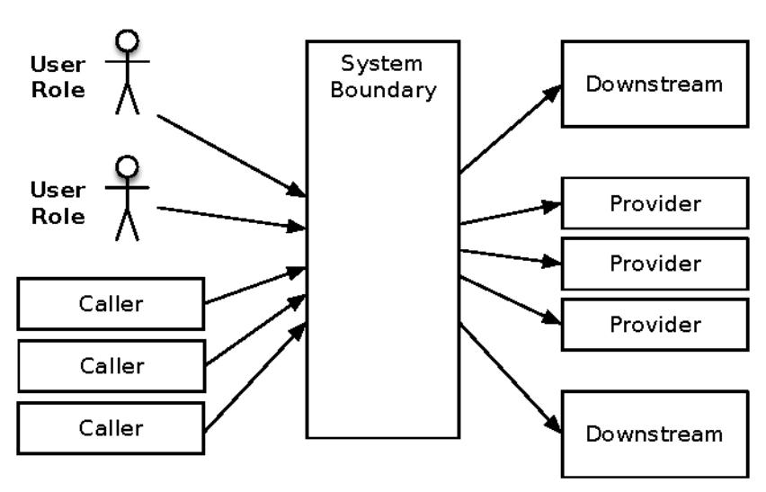

Some people would call this a monolith, but that has negative connotations. It might be a nicely factored system that just has a lot of responsibility.

The other style is the spiderweb, with many boxes and dependencies. If you've been diligent (and maybe a bit lucky), the boxes fall into ranks with calls through tiers, as shown in the first figure on page 34. If not, then the web will be chaotic like that of the black widow, shown in the second figure on page 34. The feature common to all of these is that the connections outnumber the services. A butterfly style has 2N connections, a spiderweb might have up to  $^{1}$ , and yours falls somewhere in between.

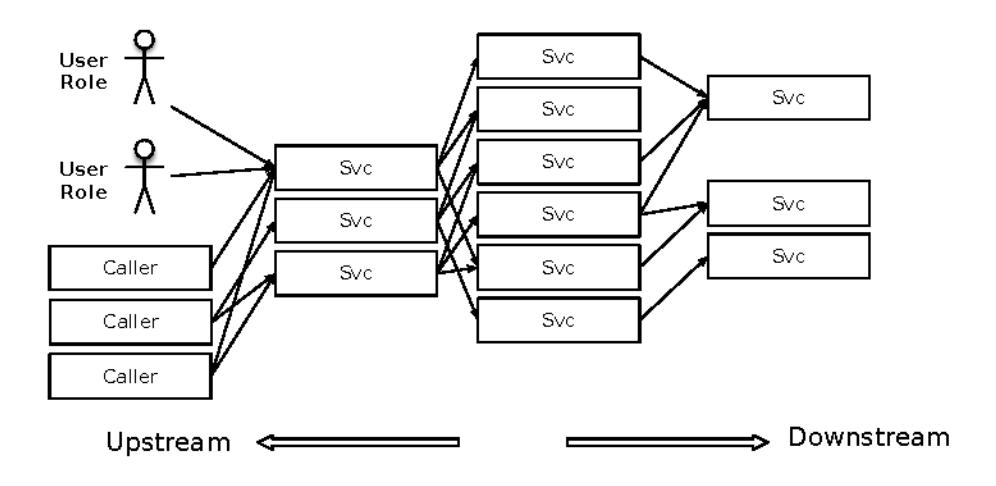

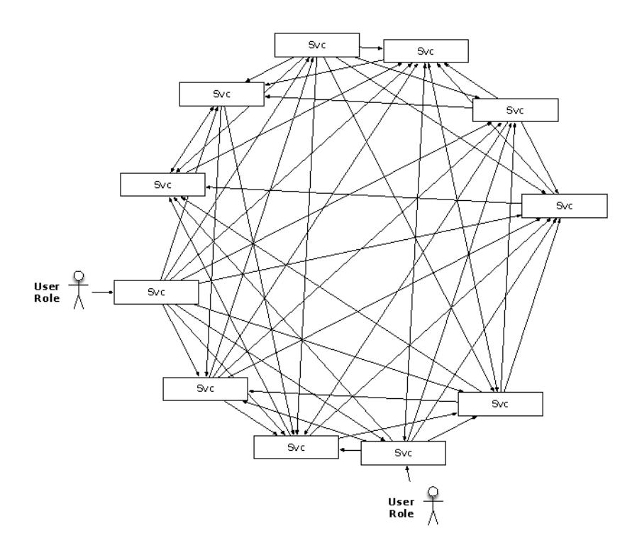

All these connections are integration points, and every single one of them is out to destroy your system. In fact, the more we move toward a large number of smaller services, the more we integrate with SaaS providers, and the more we go API first, the worse this is going to get.

### You Have How Many Feeds?

I was helping launch a replatform/rearchitecture project for a huge retailer. It came time to identify all the production firewall rules so we could open holes in the firewall to allow authorized connections to the production system. We had already gone through the usual suspects: the web servers' connections to the application server, the application server to the database server, the cluster manager to the cluster nodes, and so on.

When it came time to add rules for the feeds in and out of the production environment, we were pointed toward the project manager for enterprise integration. That's right, the site rebuild project had its own project manager dedicated just to integration. That was our second clue that this was not going to be a simple task. (The first clue was that nobody else could tell us what all the feeds were.) The project manager understood exactly what we needed. He pulled up his database of integrations and ran a custom report to give us the connection specifics.

Feeds came in from inventory, pricing, content management, CRM, ERP, MRP, SAP, WAP, BAP, BPO, R2D2, and C3P0. Data extracts flew off toward CRM, fulfillment, booking, authorization, fraud checking, address normalization, scheduling, shipping, and so on.

On the one hand, I was impressed that the project manager had a fully populated database to keep track of the various feeds (synchronous/asynchronous, batch or trickle feed, source system, frequency, volume, cross-reference numbers, business stakeholder, and so on). On the other hand, I was dismayed that he *needed* a database to keep track of it!

It probably comes as no surprise, then, that the site was plagued with stability problems when it launched. It was like having a newborn baby in the house; I was awakened every night at 3 a.m. for the latest crash or crisis. We kept documenting the spots where the app crashed and feeding them back to the maintenance team for correction. I never kept a tally, but I'm sure that every single synchronous integration point caused at least one outage.

Integration points are the number-one killer of systems. Every single one of those feeds presents a stability risk. Every socket, process, pipe, or remote procedure call can and will hang. Even database calls can hang, in ways obvious and subtle. Every feed into the system can hang it, crash it, or generate other impulses at the worst possible time. We'll look at some of the specific ways these integration points can go bad and what you can do about them.

### Socket-Based Protocols

Many higher-level integration protocols run over sockets. In fact, pretty much everything except named pipes and shared-memory IPC is socket-based. The

higher protocols introduce their own failure modes, but they're all susceptible to failures at the socket layer.

The simplest failure mode occurs when the remote system refuses connections. The calling system must deal with connection failures. Usually, this isn't much of a problem, since everything from C to Java to Elm has clear ways to indicate a connection failure—either an exception in languages that have them or a magic return value in ones that don't. Because the API makes it clear that connections don't always work, programmers deal with that case.

One wrinkle to watch out for, though, is that it can take a *long* time to discover that you can't connect. Hang on for a quick dip into the details of TCP/IP networking.

Every architecture diagram ever drawn has boxes and arrows, similar to the ones in the following figure. (A new architect will focus on the boxes; an experienced one is more interested in the arrows.)

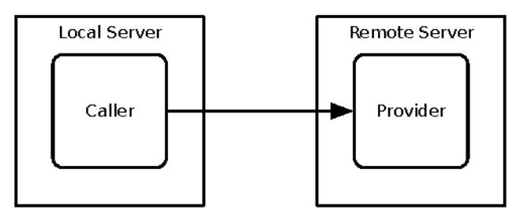

Like a lot of other things we work with, this arrow is an abstraction for a network connection. Really, though, that means it's an abstraction for an abstraction. A network "connection" is a logical construct—an abstraction—in its own right. All you will ever see on the network itself are packets. (Of course, a "packet" is an abstraction, too. On the wire, it's just electrons or photons. Between electrons and a TCP connection are many layers of abstraction. Fortunately, we get to choose whichever level of abstraction is useful at any given point in time.) These packets are the Internet Protocol (IP) part of TCP/IP. Transmission Control Protocol (TCP) is an agreement about how to make something that looks like a continuous connection out of discrete packets. The figure on page 37 shows the "three-way handshake" that TCP defines to open a connection.

The connection starts when the caller (the client in this scenario, even though it is itself a server for other applications) sends a SYN packet to a port on the remote server. If nobody is listening to that port, the remote server immediately sends back a TCP "reset" packet to indicate that nobody's home. The calling application then gets an exception or a bad return value. All this

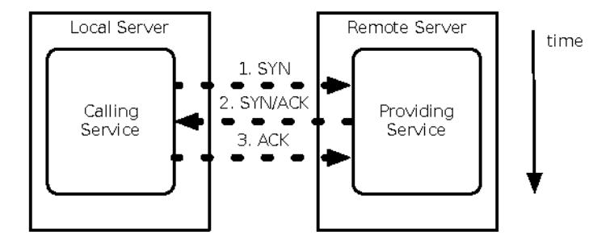

happens very quickly, in less than ten milliseconds if both machines are plugged into the same switch.

If an application is listening to the destination port, then the remote server sends back a SYN/ACK packet indicating its willingness to accept the connection. The caller gets the SYN/ACK and sends back its own ACK. These three packets have now established the "connection," and the applications can send data back and forth. (For what it's worth, TCP also defines the "simultaneous open" handshake, in which both machines send SYN packets to each other before a SYN/ACK. This is relatively rare in systems that are based on client/server interactions.)

Suppose, though, that the remote application is listening to the port but is absolutely hammered with connection requests, until it can no longer service the incoming connections. The port itself has a "listen queue" that defines how many pending connections (SYN sent, but no SYN/ACK replied) are allowed by the network stack. Once that listen queue is full, further connection attempts are refused quickly. The listen queue is the worst place to be. While the socket is in that partially formed state, whichever thread called RSHQs blocked inside the OS kernel until the remote application finally gets around to accepting the connection or until the connection attempt times out. Connection timeouts vary from one operating system to another, but they're usually measured in *minutes!* The calling application's thread could be blocked waiting for the remote server to respond for ten minutes!

Nearly the same thing happens when the caller can connect and send its request but the server takes a long time to read the request and send a response. The UHDG call will just block until the server gets around to responding. Often, the default is to block forever. You have to set the socket timeout if you want to break out of the blocking call. In that case, be prepared for an exception when the timeout occurs.

Network failures can hit you in two ways: fast or slow. Fast network failures cause immediate exceptions in the calling code. "Connection refused" is a very

fast failure; it takes a few milliseconds to come back to the caller. Slow failures, such as a dropped ACK, let threads block for minutes before throwing exceptions. The blocked thread can't process other transactions, so overall capacity is reduced. If all threads end up getting blocked, then for all practical purposes, the server is down. Clearly, a slow response is a lot worse than no response.

### The 5 A.M. Problem

One of the sites I launched developed a nasty pattern of hanging completely at almost exactly 5 a.m. every day. The site was running on around thirty different instances, so something was happening to make all thirty different application server instances hang within a five-minute window (the resolution of our URL pinger). Restarting the application servers always cleared it up, so there was some transient effect that tipped the site over at that time. Unfortunately, that was just when traffic started to ramp up for the day. From midnight to 5 a.m., only about 100 transactions per hour were of interest, but the numbers ramped up quickly once the East Coast started to come online (one hour ahead of us central time folks). Restarting all the application servers just as people started to hit the site in earnest was what you'd call a suboptimal approach.

On the third day that this occurred, I took thread dumps from one of the afflicted application servers. The instance was up and running, but all request-handling threads were blocked inside the Oracle JDBC library, specifically inside of OCI calls. (We were using the thick-client driver for its superior failover features.) In fact, once I eliminated the threads that were just blocked trying to enter a synchronized method, it looked as if the active threads were all in low-level socket read or write calls.

### Packet Capture

Abstractions provide great conciseness of expression. We can go much faster when we talk about fetching a document from a URL than if we have to discuss the tedious details of connection setup, packet framing, acknowledgments, receive windows, and so on. With every abstraction, however, the time comes when you must peel the onion, shed some tears, and see what's really going on—usually when something is going wrong. Whether for a problem diagnosis or performance tuning, packet capture tools are the only way to understand what's really happening on the network.

WFSGX8 a common UNIX tool for capturing packets from a network interface. Running it in "promiscuous" mode instructs the network interface card (NIC) to receive all packets that cross its wire—even those addressed to other computers. Wireshark can sniff packets on the wire, as WFSGXR8s, but it can also show the packets' structure in a GUI.

Wireshark runs on the X Window System. It requires a bunch of libraries that might not even be installed in a Docker container or an AWS instance. So it's best to capture packets noninteractively using WF SG XATASI then move the capture file to a nonproduction environment for analysis.

The following screenshot shows Wireshark (then called "Ethereal") analyzing a capture from my home network. The first packet shows an address routing protocol (ARP) request. This happens to be a question from my wireless bridge to my cable modem. The next packet was a surprise: an HTTP query to Google, asking for a URL called VDIHEZVLQJ XXRN with some query parameters. The next two packets show a DNS query and response for the "michaelnygard.dyndns.org" hostname. Packets 5, 6, and 7 are the three-phase handshake for a TCP connection setup. We can trace the entire conversation between my web browser and server. Note that the pane below the packet trace shows the layers of encapsulation that the TCP/IP stack created around the HTTP request in the second packet. The outermost frame is an Ethernet packet. The Ethernet packet contains an IP packet, which in turn contains a TCP packet. Finally, the payload of the TCP packet is an HTTP request. The exact bytes of the entire packet appear in the third pane.

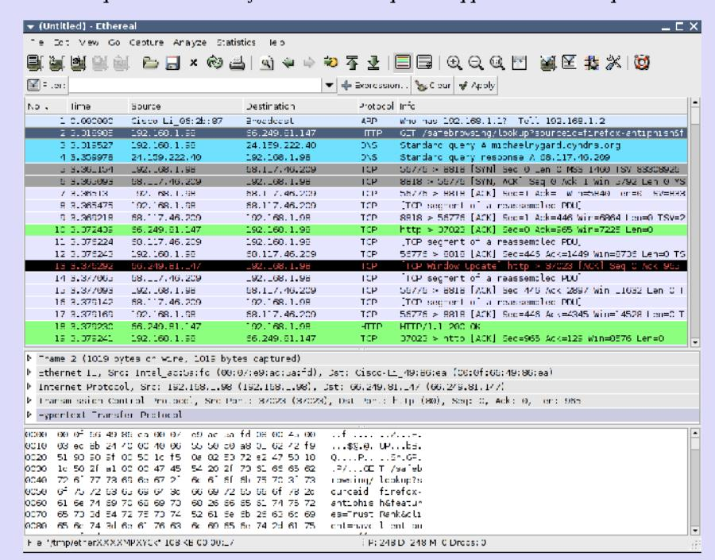

Running packet traces is an educational activity. I strongly recommend it, but I must offer two comments. First, don't do it on a network unless you are specifically granted permission? Second, keep a copy of *The TCP/IP Guide [Koz05]* or *TCP/IP Illustrated [Ste93]* open beside you.

a. ZZZZIHWKDUN RU

The next step was WFSGXERE HWWHD[Now called Wireshark]. The odd thing was how little that showed. A handful of packets were being sent from the application servers to the database servers, but with no replies. Also, nothing was coming from the database to the application servers. Yet monitoring showed that the database was alive and healthy. There were no blocking locks, the run queue was at zero, and the I/O rates were trivial.

By this time, we had to restart the application servers. Our first priority was restoring service. (We do data collection when we can, but not at the risk of breaking an SLA.) Any deeper investigation would have to wait until the issue happened again. None of us doubted that it would happen again.

Sure enough, the pattern repeated itself the next morning. Application servers locked up tight as a drum, with the threads inside the JDBC driver. This time, I was able to look at traffic on the databases' network. Zilch. Nothing at all. The utter absence of traffic on that side of the firewall was like Sherlock Holmes' dog that didn't bark in the night—the absence of activity was the biggest clue. I had a hypothesis. Quick decompilation of the application server's resource pool class confirmed that my hypothesis was plausible.

I said before that socket connections are an abstraction. They exist only as objects in the memory of the computers at the endpoints. Once established, a TCP connection can exist for days *without a single packet* being sent by either side. As long as both computers have that socket state in memory, the "connection" is still valid. Routes can change, and physical links can be severed and reconnected. It doesn't matter; the "connection" persists as long as the two computers at the endpoints think it does.

In the innocent days of DARPAnet and EDUnet, that all worked beautifully well. Pretty soon after AOL connected to the Internet, though, we discovered the need for firewalls. Such paranoid little bastions have broken the philosophy and implementation of the whole Net.

A firewall is nothing but a specialized router. It routes packets from one set of physical ports to another. Inside each firewall, a set of access control lists define the rules about which connections it will allow. The rules say such things as "connections originating from 192.0.2.0/24 to 192.168.1.199 port 80 are allowed." When the firewall sees an incoming SYN packet, it checks it against its rule base. The packet might be allowed (routed to the destination network), rejected (TCP reset packet sent back to origin), or ignored (dropped on the floor with no response at all). If the connection is allowed, then the firewall makes an entry in its own internal table that says something like "192.0.2.98:32770 is connected to 192.168.1.199:80." Then all future packets,

in either direction, that match the endpoints of the connection are routed between the firewall's networks.

So far, so good. How is this related to my 5 a.m. wake-up calls?

The key is that table of established connections inside the firewall. It's finite. Therefore, it does not allow infinite duration connections, even though TCP itself does allow them. Along with the endpoints of the connection, the firewall also keeps a "last packet" time. If too much time elapses without a packet on a connection, the firewall assumes that the endpoints are dead or gone. It just drops the connection from its table, as shown in the following figure. But TCP was never designed for that kind of intelligent device in the middle of a connection. There's no way for a third party to tell the endpoints that their connection is being torn down. The endpoints assume their connection is valid for an indefinite length of time, even if no packets are crossing the wire.

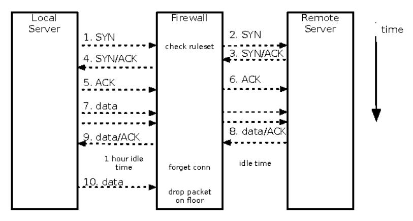

As a router, the firewall could have sent an ICMP reset to indicate the route no longer works. However, it could also have been configured to suppress that kind of ICMP traffic, since those can also be used as network probes by the bad guys. Even though this was an interior firewall, it was configured under the assumption that outer tiers would be compromised. So it dropped those packets instead of informing the sender that the destination host couldn't be reached.

After that point, any attempt to read or write from the socket on either end did *not* result in a TCP reset or an error due to a half-open socket. Instead, the TCP/IP stack sent the packet, waited for an ACK, didn't get one, and retransmitted. The faithful stack tried and tried to reestablish contact, and that firewall just kept dropping the packets on the floor, without so much as an "ICMP destination unreachable" message. My Linux system, running on

a 2.6 series kernel, has its tcp\_retries2 set to the default value of 15, which results in a *twenty-minute* timeout before the TCP/IP stack will inform the socket library that the connection is broken. The HP-UX servers we were using at the time had a thirty-minute timeout. That application's one-line call to write to a socket could block for thirty minutes! The situation for reading from the socket was even worse. It could block forever.

When I decompiled the resource pool class, I saw that it used a last-in, first-out strategy. During the slow overnight times, traffic volume was light enough that a single database connection would get checked out of the pool, used, and checked back in. Then the next request would get the same connection, leaving the thirty-nine others to sit idle until traffic started to ramp up. They were idle well over the one-hour idle connection timeout configured into the firewall.

Once traffic started to ramp up, those thirty-nine connections per application server would get locked up immediately. Even if the one connection was still being used to serve pages, sooner or later it would be checked out by a thread that ended up blocked on a connection from one of the other pools. Then the one good connection would be held by a blocked thread. Total site hang.

Once we understood all the links in that chain of failure, we had to find a solution. The resource pool has the ability to test JDBC connections for validity before checking them out. It checked validity by executing a SQL query like "SELECT SYSDATE FROM DUAL." Well, that would've just make the request-handling thread hang anyway. We could also have had the pool keep track of the idle time of the JDBC connection and discard any that were older than one hour. Unfortunately, that strategy involves sending a packet to the database server to tell it that the session is being torn down. Hang.

We were starting to look at some really hairy complexities, such as creating a "reaper" thread to find connections that were *close* to getting too old and tearing them down before they timed out. Fortunately, a sharp DBA recalled just the thing. Oracle has a feature called *dead connection detection* that you can enable to discover when clients have crashed. When enabled, the database server sends a ping packet to the client at some periodic interval. If the client responds, then the database knows it's still alive. If the client fails to respond after a few retries, the database server assumes the client has crashed and frees up all the resources held by that connection.

We weren't that worried about the client crashing. The ping packet itself, however, was what we needed to reset the firewall's "last packet" time for the connection, keeping the connection alive. Dead connection detection kept the connection alive, which let me sleep through the night.

The main lesson here is that not every problem can be solved at the level of abstraction where it manifests. Sometimes the causes reverberate up and down the layers. You need to know how to drill through at least two layers of abstraction to find the "reality" at that level in order to understand problems.

Next, let's look at problems with HTTP-based protocols.

### HTTP Protocols

REST with JSON over HTTP is the lingua franca for services today. No matter what language or framework you use, it boils down to shipping some chunk of formatted, semantically meaningful text as an HTTP request and waiting for an HTTP response.

Of course, all HTTP-based protocols use sockets, so they are vulnerable to all of the problems described previously. HTTP adds its own set of issues, mainly centered around the various client libraries. Let's consider some of the ways that such an integration point can harm the caller:

- The provider may accept the TCP connection but never respond to the HTTP request.
- The provider may accept the connection but not read the request. If the
  request body is large, it might fill up the provider's TCP window. That
  causes the caller's TCP buffers to fill, which will cause the socket write
  to block. In this case, even *sending* the request will never finish.
- The provider may send back a response status the caller doesn't know how to handle. Like "418 I'm a teapot." Or more likely, "451 Resource censored."
- The provider may send back a response with a content type the caller doesn't expect or know how to handle, such as a generic web server 404 page in HTML instead of a JSON response. (In an especially pernicious example, your ISP may inject an HTML page when your DNS lookup fails.)
- The provider may claim to be sending JSON but actually sending plain text. Or kernel binaries. Or Weird Al Yankovic MP3s.

Use a client library that allows fine-grained control over timeouts—including both the connection timeout and read timeout—and response handling. I recommend you avoid client libraries that try to map responses directly into domain objects. Instead, treat a response as data until you've confirmed it meets your expectations. It's just text in maps (also known as dictionaries) and lists until you decide what to extract. We'll revisit this theme in Chapter 11, Security, on page 215.

### Vendor API Libraries

It would be nice to think that enterprise software vendors *must* have hardened their software against bugs, just because they've sold it and deployed it for lots of clients. That might be true of the server software they sell, but it's rarely true for their client libraries. Usually, software vendors provide client API libraries that have a lot of problems and often have stability risks. These libraries are just code coming from regular developers. They have all the variability in quality, style, and safety that you see from any other random sampling of code.

The worst part about these libraries is that you have so little control over them. If the vendor doesn't publish source to its client library, then the best you can hope for is to decompile the code—if you're in a language where that's even possible—find issues, and report them as bugs. If you have enough clout to apply pressure to the vendor, then you might be able to get a bug fix to its client library, assuming, of course, that you are on the latest version of the vendor's software. I have been known to fix a vendor's bugs and recompile my own version for temporary use while waiting for the official patched version.

The prime stability killer with vendor API libraries is all about blocking. Whether it's an internal resource pool, socket read calls, HTTP connections, or just plain old Java serialization, vendor API libraries are peppered with unsafe coding practices.

Here's a classic example. Whenever you have threads that need to synchronize on multiple resources, you have the potential for deadlock. Thread 1 holds lock A and needs lock B, while thread 2 has lock B and needs lock A. The classic recipe for avoiding this deadlock is to make sure you always acquire the locks in the same order and release them in the reverse order. Of course, this helps only if you *know* that the thread will be acquiring both locks and you can control the order in which they are acquired. Let's take an example in Java. This illustration could be from some kind of message-oriented middleware library:

```
SXEOLYRLOHOG OHVVPDAUH

SXEOLYRLOHOG OHVVPDAUH

SXEOLYRLOHOG OHVVPDAUH

SXEOLYRLOHOG OHVVPDAUH
```

I'm sure this looks quite familiar. Is it safe? I have no idea.

We can't tell what the execution context will be just by looking at the code. You have to know what thread PHVVD.HF5HLY & called on, or else you can't be sure what locks the thread will already hold. It could have a dozen synchronized methods on the stack already. Deadlock minefield.

In fact, even though the <code>8VHU&DOMEGTate</code> does not declare <code>PHVVD.HFHLYHG</code> as synchronized (you can't declare an interface method as synchronized), the implementation might make it synchronized. Depending on the threading model inside the client library and how long your callback method takes, synchronizing the callback method could block threads inside the client library. Like a plugged drain, those blocked threads can cause threads calling <code>VHQGo</code> block. Odds are that means request-handling threads will be tied up. As always, once all the request-handling threads are blocked, your application might as well be down.

## Countering Integration Point Problems

A stand-alone system that doesn't integrate with anything is rare, not to mention being almost useless. What can you do to make integration points safer? The most effective stability patterns to combat integration point failures are Circuit Breaker on page 95 and Decoupling Middleware on page 117.

Testing helps, too. Cynical software should handle violations of form and function, such as badly formed headers or abruptly closed connections. To make sure your software is cynical enough, you should make a test harness—a simulator that provides controllable behavior—for each integration test. (See *Test Harnesses*, on page 113.) Setting the test harness to spit back canned responses facilitates functional testing. It also provides isolation from the target system when you're testing. Finally, each such test harness should also allow you to simulate various kinds of system and network failures.

This test harness will immediately help with functional testing. To test for stability, you also need to flip all the switches on the harness while the system is under considerable load. This load can come from a bunch of workstations or cloud instances, but it definitely requires much more than a handful of testers clicking around on their desktops.

### Remember This

#### Beware this necessary evil.

Every integration point will eventually fail in some way, and you need to be prepared for that failure.

### Prepare for the many forms of failure.

Integration point failures take several forms, ranging from various network errors to semantic errors. You will not get nice error responses delivered through the defined protocol; instead, you'll see some kind of protocol violation, slow response, or outright hang.

### Know when to open up abstractions.

Debugging integration point failures usually requires peeling back a layer of abstraction. Failures are often difficult to debug at the application layer because most of them violate the high-level protocols. Packet sniffers and other network diagnostics can help.

### Failures propagate quickly.

Failure in a remote system quickly becomes your problem, usually as a cascading failure when your code isn't defensive enough.

### Apply patterns to avert integration point problems.

Defensive programming via Circuit Breaker, Timeouts (see *Timeouts*, on page 91), Decoupling Middleware, and Handshaking (see *Handshaking*, on page 111) will all help you avoid the dangers of integration points.

### Chain Reactions

The dominant architectural style today is the horizontally scaled farm of commodity hardware. *Horizontal scaling* means we add capacity by adding more servers. We sometimes call these "farms." The alternative, *vertical scaling*, means building bigger and bigger servers—adding core, memory, and storage to hosts. Vertical scaling has its place, but most of our interactive workload goes to horizontally scaled farms.

If your system scales horizontally, then you will have load-balanced farms or clusters where each server runs the same applications. The multiplicity of machines provides you with fault tolerance through redundancy. A single machine or process can completely bonk while the remainder continues serving transactions.

Still, even though horizontal clusters are not susceptible to single points of failure (except in the case of attacks of self-denial; see <u>Self-Denial Attacks</u>, on page 69), they can exhibit a load-related failure mode. For example, a concurrency bug that causes a race condition shows up more often under high load than low load. When one node in a load-balanced group fails, the other nodes must pick up the slack. For example, in the eight-server farm shown in the figure on page 47, each node handles 12.5 percent of the total load.

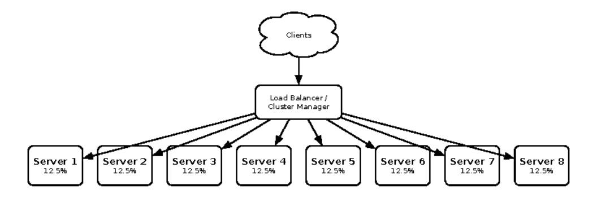

After one server pops off, you have the distribution shown in the following figure. Each of the remaining seven servers must handle about 14.3 percent of the total load. Even though each server has to take only 1.8 percent more of the total workload, that server's load increases by about 15 percent. In the degenerate case of a failure in a two-node cluster, the survivor's workload doubles. It has its original load (50 percent of the total) plus the dead node's load (50 percent of the total).

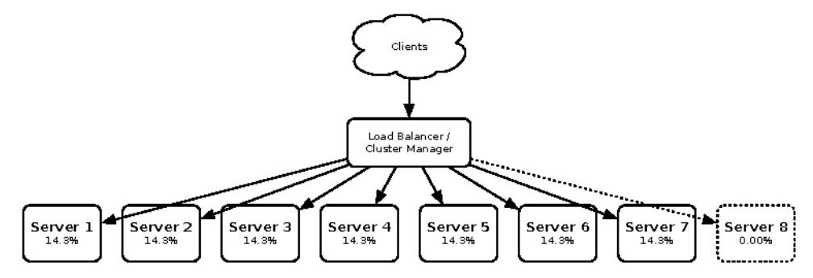

If the first server failed because of some load-related condition, such as a memory leak or intermittent race condition, the surviving nodes become more likely to fail. With each additional server that goes dark, the remaining stalwarts get more and more burdened and therefore are more and more likely to also go dark.

A chain reaction occurs when an application has some defect—usually a resource leak or a load-related crash. We're already talking about a homogeneous layer, so that defect is going to be in each of the servers. That means the only way you can eliminate the chain reaction is to fix the underlying defect. Splitting a layer into multiple pools—as in the Bulkhead pattern on page 98—can sometimes help by splitting a single chain reaction into two separate chain reactions that occur at different rates.

What effect could a chain reaction have on the rest of the system? Well, for one thing, a chain reaction failure in one layer can easily lead to a cascading failure in a calling layer.

Chain reactions are sometimes caused by blocked threads. This happens when all the request-handling threads in an application get blocked and that application stops responding. Incoming requests will get distributed out to the applications on other servers in the same layer, increasing their chance of failure.

### Searching...

I was dealing with a retailer's primary online brand. It had a huge catalog—half a million SKUs in 100 different categories. For that brand, search wasn't just helpful; it was necessary. A dozen search engines sitting behind a hardware load balancer handled holiday traffic. The application servers would connect to a virtual IP address instead of specific search engines (see *Migratory Virtual IP Addresses*, on page 189, for more about load balancing and virtual IP addresses). The load balancer then distributed the application servers' queries out to the search engines. The load balancer also performed health checks to discover which servers were alive and responsive so it could make sure to send queries only to search engines that were alive.

Those health checks turned out to be useful. The search engine had some bug that caused a memory leak. Under regular traffic (not a holiday season), the search engines would start to go dark right around noon. Because each engine had been taking the same proportion of load throughout the morning, they would all crash at about the same time. As each search engine went dark, the load balancer would send their share of the queries to the remaining servers, causing them to run out of memory even faster. When I looked at a chart of their "last response" timestamps, I could very clearly see an accelerating pattern of crashes. The gap between the first crash and the second would be five or six minutes. Between the second and third would be just three or four minutes. The last two would go down within seconds of each other.

This particular system also suffered from cascading failures and blocked threads. Losing the last search server caused the entire front end to lock up completely.

Until we got an effective patch from the vendor (which took months), we had to follow a daily regime of restarts that bracketed the peak hours: 11 a.m., 4 p.m., and 9 p.m.

### Remember This

Recognize that one server down jeopardizes the rest.

A chain reaction happens because the death of one server makes the others pick up the slack. The increased load makes them more likely to fail. A chain reaction will quickly bring an entire layer down. Other layers that depend on it must protect themselves, or they will go down in a cascading failure.

### Hunt for resource leaks.

Most of the time, a chain reaction happens when your application has a memory leak. As one server runs out of memory and goes down, the other servers pick up the dead one's burden. The increased traffic means they leak memory faster.

### Hunt for obscure timing bugs.

Obscure race conditions can also be triggered by traffic. Again, if one server goes down to a deadlock, the increased load on the others makes them more likely to hit the deadlock too.

### Use Autoscaling.

In the cloud, you should create health checks for every autoscaling group. The scaler will shut down instances that fail their health checks and start new ones. As long as the scaler can react faster than the chain reaction propagates, your service will be available.

### Defend with Bulkheads.

Partitioning servers with <u>Bulkheads</u>, on page 98, can prevent chain reactions from taking out the entire service—though they won't help the callers of whichever partition does go down. Use Circuit Breaker on the calling side for that.

## Cascading Failures

System failures start with a crack. That crack comes from some fundamental problem. Maybe there's a latent bug that some environmental factor triggers. Or there could be a memory leak, or some component just gets overloaded. Things to slow or stop the crack are the topics of the next chapter. Absent those mechanisms, the crack can progress and even be amplified by some structural problems. A cascading failure occurs when a crack in one layer triggers a crack in a calling layer.

An obvious example is a database failure. If an entire database cluster goes dark, then any application that calls the database is going to experience problems of some kind. What happens next depends on how the caller is written. If the caller handles it badly, then the caller will also start to fail, resulting in a cascading failure. (Just like we draw trees upside-down with their roots pointing to the sky, our problems cascade upward through the layers.)

Pretty much every enterprise or web system looks like a set of services grouped into distinct farms or clusters, arranged in layers. Outbound calls from one service funnel through a load balancer to reach the provider. Time was, we talked about "three-tier" systems: web server, app server, and database server.

Sometimes search servers were off to the side. Now, we've got dozens or hundreds of interlinked services, each with their own database. Each service is like its own little stack of layers, which are then connected into layers of dependencies beyond that. Every dependency is a chance for a failure to cascade.

Crucial services with a high fan-in—meaning ones with many callers—spread their problems widely, so they are worth extra scrutiny.

Cascading failures require some mechanism to transmit the failure from one layer to another. The failure "jumps the gap" when bad behavior in the calling layer gets triggered by the failure condition in the provider.

Cascading failures often result from resource pools that get drained because of a failure in a lower layer. Integration points without timeouts are a surefire way to create cascading failures.

The layer-jumping mechanism often takes the form of blocked threads, but I've also seen the reverse—an overly aggressive thread. In one case, the calling layer would get a quick error, but because of a historical precedent it would assume that the error was just an irreproducible, transient error in the lower layer. At some point, the lower layer was suffering from a race condition that would make it kick out an error once in a while for no good reason. The upstream developer decided to retry the call when that happened. Unfortunately, the lower layer didn't provide enough detail to distinguish between the transient error and a more serious one. As a result, once the lower layer started to have some real problems (losing packets from the database because of a failed switch), the caller started to pound it more and more. The more the lower layer whined and cried, the more the upper layer yelled, "I'll give you something to cry about!" and hammered it even harder. Ultimately, the calling layer was using 100 percent of its CPU making calls to the lower layer and logging failures in calls to the lower layer. A Circuit Breaker, on page 95, would really have helped here.

Speculative retries also allow failures to jump the gap. A slowdown in the provider will cause the caller to fire more speculative retry requests, tying up even more threads in the caller at a time when the provider is already responding slowly.

Just as integration points are the number-one source of cracks, cascading failures are the number-one crack accelerator. Preventing cascading failures is the very key to resilience. The most effective patterns to combat cascading failures are Circuit Breaker and Timeouts.

### Remember This

### Stop cracks from jumping the gap.

A cascading failure occurs when cracks jump from one system or layer to another, usually because of insufficiently paranoid integration points. A cascading failure can also happen after a chain reaction in a lower layer. Your system surely calls out to other enterprise systems; make sure you can stay up when they go down.

### Scrutinize resource pools.

A cascading failure often results from a resource pool, such as a connection pool, that gets exhausted when none of its calls return. The threads that get the connections block forever; all other threads get blocked waiting for connections. Safe resource pools always limit the time a thread can wait to check out a resource.

### Defend with Timeouts and Circuit Breaker.

A cascading failure happens *after* something else has already gone wrong. Circuit Breaker protects your system by avoiding calls out to the troubled integration point. Using Timeouts ensures that you can come back from a call out to the troubled point.

### Users

Users are a terrible thing. Systems would be much better off with no users.

Obviously, I'm being somewhat tongue-in-cheek. Although users do present numerous risks to stability, they're also the reason our systems exist. Yet the human users of a system have a knack for creative destruction. When your system is teetering on the brink of disaster like a car on a cliff in a movie, some user will be the seagull that lands on the hood. Down she goes! Human users have a gift for doing exactly the worst possible thing at the worst possible time.

Worse yet, other systems that call ours march remorselessly forward like an army of Terminators, utterly unsympathetic about how close we are to crashing.

### Traffic

As traffic grows, it will eventually surpass your capacity. (If traffic isn't growing, then you have other problems to worry about!) Then comes the biggest question: how does your system react to excessive demand?

"Capacity" is the maximum throughput your system can sustain under a given workload while maintaining acceptable performance. When a transaction takes too long to execute, it means that the demand on your system exceeds its capacity. Internal to your system, however, are some harder limits. Passing those limits creates cracks in the system, and cracks always propagate faster under stress.

If you are running in the cloud, then autoscaling is your friend. But beware! It's not hard to run up a huge bill by autoscaling buggy applications.

### Heap Memory

One such hard limit is memory available, particularly in interpreted or managed code languages. Take a look at the following figure. Excess traffic can stress the memory system in several ways. First and foremost, in web app back ends, every user has a session. Assuming you use memory-based sessions (see *Off-Heap Memory*, *Off-Host Memory*, on page 54, for an alternative to in-memory sessions), the session stays resident in memory for a certain length of time after the last request from that user. Every additional user means more memory.

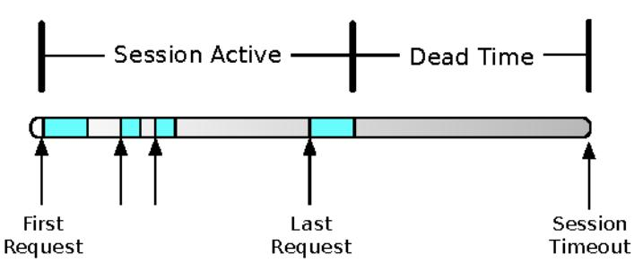

During that dead time, the session still occupies valuable memory. Every object you put into the session sits there in memory, tying up precious bytes that could be serving some other user.

When memory gets short, a large number of surprising things can happen. Probably the least offensive is throwing an out-of-memory exception at the user. If things are really bad, the logging system might not even be able to log the error. If no memory is available to create the log event, then nothing gets logged. (This, by the way, is a great argument for external monitoring in addition to log file scraping.) A supposedly recoverable low-memory situation will rapidly turn into a serious stability problem.

Your best bet is to keep as little in the in-memory session as possible. For example, it's a bad idea to keep an entire set of search results in the session

for pagination. It's better if you requery the search engine for each new page of results. For every bit of data you put in the session, consider that it might never be used again. It could spend the next thirty minutes uselessly taking up memory and putting your system at risk.

It would be wonderful if there was a way to keep things in the session (therefore in memory) when memory is plentiful but automatically be more frugal when memory is tight. Good news! Most language runtimes let you do exactly that with weak references.<sup>2</sup> They're called different things in different libraries, so look for 6\VWHHDNGHQFiM C#, MDYD ODIQBWBIHQFiM Java, ZHDNUn Python, and so on. The basic idea is that a weak reference holds another object, called the payload, but only until the garbage collector needs to reclaim memory. When only soft references to the object are left (as shown in the following figure), it can be collected.

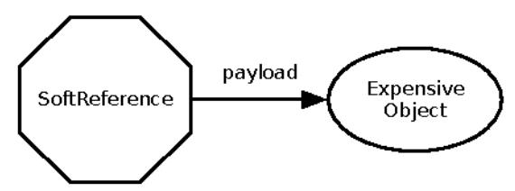

You construct a weak reference with the large or expensive object as the payload. The weak reference object actually is a bag of holding. It keeps the payload for later use.

```
ODJLF%HOXQIH ([SHQVLYH5HVXOW
6RIW5HIHUHUHRHQHZ6RIW5HIHUHQFH KXJH([SHQVLYH5HVXOW
VHVVLR/6W$WWUL(E3X(W6H,9(B%($1B+2/U/6)
```

This is not a transparent change. Accessors must be aware of the indirection. Think about using a third-party or open source caching library that uses weak references to reclaim memory.

What is the point of adding this level of indirection? When memory gets low, the garbage collector is allowed to reclaim any weakly reachable objects. In other words, if there are no hard references to the object, then the payload can be collected. The actual decision about when to reclaim softly reachable objects, how many of them to reclaim, and how many to spare is totally up to the garbage collector. You have to read your runtime's docs very carefully, but usually the only guarantee is that weakly reachable objects will be reclaimed before an out-of-memory error occurs.

<sup>2.</sup> KWW SHQ ZLNLSHIGZIDNEHUD NHBIUHLQFH

In other words, the garbage collector will take advantage of all the help you give it before it gives up. Be careful to note that it is the payload object that gets garbage-collected, not the weak reference itself. Since the garbage collector is allowed to harvest the payload at any time, callers must also be written to behave nicely when the payload is gone. Code that uses the payload object must be prepared to deal with a null. It can choose to recompute the expensive result, redirect the user to some other activity, or take any other protective action.

Weak references are a useful way to respond to changing memory conditions, but they do add complexity. When you can, it's best to just keep things out of the session.

### Off-Heap Memory, Off-Host Memory

Another effective way to deal with per-user memory is to farm it out to a different process. Instead of keeping it inside the heap—that is, inside the address space of your server's process—move it out to some other process. Memcached is a great tool for this.<sup>3</sup> It's essentially an in-memory key-value store that you can put on a different machine or spread across several machines.

Redis is another popular tool for moving memory out of your process.<sup>4</sup> It's a fast "data structure server" that lives in a space between cache and database. Many systems use Redis to hold session data instead of keeping it in memory or in a relational database.

Any of these approaches exercise a trade-off between total addressable memory size and latency to access it. This notion of *memory hierarchy* is ranked by size and distance. Registers are fastest and closest to the CPU, followed by cache, local memory, disk, tape, and so on. On one hand, networks have gotten fast enough that "someone else's memory" can be faster to access than local disk. Your application is better off making a remote call to get a value than reading it from storage. On the other hand, local memory is still faster than remote memory. There's no one-size-fits-all answer.

#### Sockets

You may not spend much time thinking about the number of sockets on your server, but that's another limit you can run into when traffic gets heavy. Every active request corresponds to an open socket. The operating system assigns inbound connections to an "ephemeral" port that represents the receiving

ZZZ PHPFDFKHJG RU

<sup>4.</sup> ZZZ UGLV LR

side of the connection. If you look at the TCP packet format, you'll see that a port number is 16 bits long. It can only go up to 65535. Different OSs use different port ranges for ephemeral sockets, but the IANA recommended range is 49152 to 65535. That gives your server the ability to have at most 16,383 connections open. But your machine is probably dedicated to your service rather than handling, say, user logins. So we can stretch that range to ports 1024–65535, for a maximum of 64,511 connections.

Now I'll tell you that some servers are handling more than a million concurrent connections. Some people are pushing toward ten million connections on a single machine.

If there are only 64,511 ports available for connections, how can a server have a million connections? The secret is virtual IP addresses. The operating system binds additional IP addresses to the same network interface. Each IP address has its own range of port numbers, so we would need a total of 16 IP addresses to handle that many connections.

This is not a trivial thing to tackle. Your application will probably need some changes to listen on multiple IP addresses and handle connections across them all without starving any of the listen queues. A million connections also need a *lot* of kernel buffers. Plan to spend some time learning about your operating system's TCP tuning parameters.

#### Closed Sockets

Not only can open sockets be a problem, but the ones you've already closed can bite you too. After your application code closes a socket, the TCP stack moves it through a couple of terminal states. One of them is the TIME\_WAIT state. TIME\_WAIT is a delay period before the socket can be reused for a new connection. It's there as part of TCP's defense against bogons.

No, really. Bogons. I'm not making this up.

A bogon is a wandering packet that got routed inefficiently and arrives late, possibly out of sequence, and after the connection is closed. If the socket were reused too quickly, then a bogon could arrive with the exact right combination of IP address, destination port number, and TCP sequence number to be accepted as legitimate data for the new connection. In essence a bit of data from the old connection would show up midstream in the new one.

Bogons are a real, though minor, problem on the Internet at large. Within your data center or cloud infrastructure, though, they are less likely to be an issue. You can turn the TIME\_WAIT interval down to get those ports back into use ASAP.

### Expensive to Serve

Some users are way more demanding than others. Ironically, these are usually the ones you want more of. For example, in a retail system, users who browse a couple of pages, maybe do a search, and then go away are both the bulk of users and the easiest to serve. Their content can usually be cached (however, see *Use Caching, Carefully*, on page 67, for important cautions about caching). Serving their pages usually does not involve external integration points. You will likely do some personalization, maybe some clickstream tracking, and that's about it.

But then there's that user who actually wants to buy something. Unless you've licensed the one-click checkout patent, checkout probably takes four or five pages. That's already as many pages as a typical user's entire session. On top of that, checking out can involve several of those troublesome integration points: credit card authorization, sales tax calculation, address standardization, inventory lookups, and shipping. In fact, more buyers don't just increase the stability risk for the front-end system, they can place backend or downstream systems at risk too. (See *Unbalanced Capacities*, on page 75.) Increasing the conversion rate might be good for the profit-and-loss statement, but it's definitely hard on the systems.

There is no effective defense against expensive users. They are not a direct stability risk, but the increased stress they produce increases the likelihood of triggering cracks elsewhere in the system. Still, I don't recommend measures to keep them off the system, since they are usually the ones who generate revenue. So, what should you do?

The best thing you can do about expensive users is test aggressively. Identify whatever your most expensive transactions are and double or triple the proportion of those transactions. If your retail system expects a 2 percent conversion rate (which is about standard for retailers), then your load tests should test for a 4, 6, or 10 percent conversion rate.

If a little is good, then a lot must be better, right? In other words, why not test for a 100 percent conversion rate? As a stability test, that's not a bad idea. I wouldn't use the results to plan capacity for regular production traffic, though. By definition, these are the most expensive transactions. Therefore, the average stress on the system is guaranteed to be less than what this test produces. Build the system to handle nothing but the most expensive transactions and you will spend ten times too much on hardware.

### Unwanted Users

We would all sleep easier if the only users to worry about were the ones handing us their credit card numbers. In keeping with the general theme of "weird, bad things happen in the real world," weird, bad users are definitely out there.

Some of them don't mean to be bad. For example, I've seen badly configured proxy servers start requesting a user's last URL over and over again. I was able to identify the user's session by its cookie and then trace the session back to the registered customer. Logs showed that the user was legitimate. For some reason, fifteen minutes after the user's last request, the request started reappearing in the logs. At first, these requests were coming in every thirty seconds. They kept accelerating, though. Ten minutes later, we were getting four or five requests *every second*. These requests had the user's identifying cookie but not his session cookie. So each request was creating a new session. It strongly resembled a DDoS attack, except that it came from one particular proxy server in one location.

Once again, we see that sessions are the Achilles' heel of web applications. Want to bring down nearly any dynamic web application? Pick a deep link from the site and start requesting it without sending cookies. Don't even wait for the response; just drop the socket connection as soon as you've sent the request. Web servers never tell the application servers that the end user stopped listening for an answer. The application server just keeps on processing the request. It sends the response back to the web server, which funnels it into the bit bucket. In the meantime, the 100 bytes of the HTTP request cause the application server to create a session (which may consume several kilobytes of memory in the application server). Even a desktop machine on a broadband connection can generate hundreds of thousands of sessions on the application servers.

In extreme cases, such as the flood of sessions originating from the single location, you can run into problems worse than just heavy memory consumption. In our case, the business users wanted to know how often their most loyal customers came back. The developers wrote a little interceptor that would update the "last login" time whenever a user's profile got loaded into memory from the database. During these session floods, though, the request presented a user ID cookie but no session cookie. That meant each request was treated like a new login, loading the profile from the database and attempting to update the "last login" time.

## Session Tracking

HTTP is a singularly unlikely protocol. If you were tasked with creating a protocol to facilitate arts, sciences, commerce, free speech, words, pictures, sound, and video, one that could weave the vastness of human knowledge and creativity into a single web, it is unlikely that you would arrive at HTTP. HTTP is stateless, for one thing. To the server, each new requester emerges from the swirling fog and makes some demand like "GET /site/index.jsp." Once answered, they disappear back into the fog without so much as a thank you. Should one of these rude, demanding clients reappear, the server, in perfectly egalitarian ignorance, doesn't recognize that it has seen them before.

Some clever folks at Netscape found a way to graft an extra bit of data into the protocol. Netscape originally conceived this data, called *cookies* (for no compelling reason), as a way to pass state back and forth from client to server and vice versa. Cookies are a clever hack. They allowed all kinds of new applications, such as personalized portals (a big deal back then) and shopping sites. Security-minded application developers quickly realized, however, that unencrypted cookie data was open to manipulation by hostile clients. So, security dictates that the cookie either cannot contain actual data or must be encrypted. At the same time, high-volume sites found that passing real state in cookies uses up lots of expensive bandwidth and CPU time. Encrypting the cookies was right out.

So cookies started being used for smaller pieces of data, just enough to tag a user with a persistent cookie or a temporary cookie to identify a session.

A session is an abstraction that makes building applications easier. All the user really sends are a series of HTTP requests. The web server receives these and, through a series of machinations, returns an HTTP response. There is no "begin a session" request by which the web browser can indicate it is about to start sending requests, and there is no "session finished" request. (The web server could not trust that such an indicator would be sent anyway.)

Sessions are all about caching data in memory. Early CGI applications had no need for a session, since they would fire up a new process (usually a Perl script) for each new request. That worked fine. There's nothing quite as safe as the "fork, run, and die" model. To reach higher volumes, however, developers and vendors turned to long-running application servers, such as Java application servers and long-running Perl processes via mod\_perl. Instead of waiting for a process fork on each request, the server is always running, waiting for requests. With the long-running server, you can cache state from one request to another, reducing the number of hits to the database. Then you need some way to identify a request as part of a session. Cookies work well for this.

Application servers handle all the cookie machinery for you, presenting a nice programmatic interface with some resemblance to a 00 Spr 'LFWLRQBUisual, though, the trouble with invisible machinery is that it can go horribly wrong when misused. When that invisible machinery involves layers of kludges meant to make HTTP look like a real application protocol, it can tip over badly. For example, home-brew shopping bots do not handle session cookies properly. Each request creates a new session, consuming memory for no good reason. If the web server is configured to ask the application server for every URL, not just ones within a mapped context, then sessions can get created by requests for nonexistent pages.

Imagine 100,000 transactions all trying to update the same row of the same table in the same database. Somebody is bound to get deadlocked. Once a single transaction with a lock on the user's profile gets hung (because of the need for a connection from a different resource pool), all the other database transactions on that row get blocked. Pretty soon, every single request-handling thread gets used up with these bogus logins. As soon as that happens, the site is down.

So one group of bad users just blunder around leaving disaster in their wake. More crafty sorts, however, deliberately do abnormal things that just happen to have undesirable effects. The first group isn't deliberately malicious; they do damage inadvertently. This next group belongs in its own category.

An entire parasitic industry exists by consuming resources from other companies' websites. Collectively known as *competitive intelligence* companies, these outfits leech data out of your system one web page at a time.

These companies will argue that their service is no different from a grocery store sending someone into a competing store with a list and a clipboard. There is a big difference, though. Given the rate that they can request pages, it's more like sending a battalion of people into the store with clipboards. They would crowd out the aisles so legitimate shoppers could not get in.

Worse yet, these rapid-fire screen scrapers do not honor session cookies, so if you are not using URL rewriting to track sessions, each new page request will create a new session. Like a flash mob, pretty soon the capacity problem will turn into a stability problem. The battalion of price checkers could actually knock down the store.

Keeping out legitimate robots is fairly easy through the use of the URERW Ville. Wille. The robot has to ask for the file and choose to respect your wishes. It's a social convention—not even a standard—and definitely not enforceable. Some sites also choose to redirect robots and spiders, based on the user-agent header. In the best cases, these agents get redirected to a static copy of the product catalog, or the site generates pages without prices. (The idea is to be searchable by the big search engines but not reveal pricing. That way, you can personalize the prices, run trial offers, partition the country or the audience to conduct market tests, and so on.) In the worst case, the site sends the agent into a dead end.

So the robots most likely to respect URERW Valve [this ones that might actually generate traffic (and revenue) for you, while the leeches ignore it completely.

I've seen only two approaches work.

ZZZZ RIU75 KWPO DSSHQGL[QR&WHV KWPO K

The first is technical. Once you identify a screen scraper, block it from your network. If you're using a content distribution network such as Akamai, it can provide this service for you. Otherwise, you can do it at the outer firewalls. Some of the leeches are honest. Their requests come from legitimate IP addresses with real reverse DNS entries. ARIN is your friend here. 6 Blocking the honest ones is easy. Others stealthily mask their source addresses or make requests from dozens of different addresses. Some of these even go so far as to change their user-agent strings around from one request to the next. (When a single IP address claims to be running Internet Explorer on Windows, Opera on Mac, and Firefox on Linux in the same five-minute window, something is up. Sure, it could be an ISP-level supersquid or somebody running a whole bunch of virtual emulators. When these requests are sequentially spidering an entire product category, it's more likely to be a screen scraper.) You may end up blocking quite a few subnets, so it's a good idea to periodically expire old blocks to keep your firewalls performing well. This is a form of Circuit Breaker.

The second approach is legal. Write some terms of use for your site that say users can view content only for personal or noncommercial purposes. Then, when the screen scrapers start hitting your site, sic the lawyers on them. (Obviously, this requires enough legal firepower to threaten them effectively.) Neither of these is a permanent solution. Consider it pest control—once you stop, the infestation will resume.

### Malicious Users

The final group of undesirable users are the truly malicious. These bottom-feeding mouth breathers just *live* to kill your baby. Nothing excites them more than destroying the very thing you've put blood, sweat, and tears into building. These were the kids who always got their sand castles kicked over when they were little. That deep-seated bitterness compels them to do the same thing to others that was done to them.

Truly talented crackers who can analyze your defenses, develop a customized attack, and infiltrate your systems without being spotted are blessedly rare. This is the so-called "advanced persistent threat." Once you are targeted by such an entity, you will almost certainly be breached. Consult a serious reference on security for help with this. I cannot offer you sound advice beyond that. This gets into deep waters with respect to law enforcement and forensic evidence.

ZZZ DULQ QHW

The overwhelming majority of malicious users are known as "script kiddies." Don't let the diminutive name fool you. Script kiddies are dangerous because of their sheer numbers. Although the odds are low that you will be targeted by a true cracker, your systems are probably being probed by script kiddies right now.

This book is not about information security or online warfare. A robust approach to defense and deterrence is beyond my scope. I will restrict my discussion to the intersection of security and stability as it pertains to system and software architecture. The primary risk to stability is the now-classic distributed denial-of-service (DDoS) attack. The attacker causes many computers, widely distributed across the Net, to start generating load on your site. The load typically comes from a botnet. Botnet hosts are usually compromised Windows PCs, but with the Internet of Things taking off, we can expect to see that population diversify to include thermostats and refrigerators. A daemon on the compromised computer polls some control channel like IRC or even customized DNS queries, through which the botnet master issues commands. Botnets are now big business in the dark Net, with pay-as-you-go service as sophisticated as any cloud.

Nearly all attacks vector in against the applications rather than the network gear. These force you to saturate your own outbound bandwidth, denying service to legitimate users and racking up huge bandwidth charges.

As you have seen before, session management is the most vulnerable point of a server-side web application. Application servers are particularly fragile when hit with a DDoS, so saturating the bandwidth might not even be the worst issue you have to deal with. A specialized Circuit Breaker can help to limit the damage done by any particular host. This also helps protect you from the accidental traffic floods, too.

Network vendors all have products that detect and mitigate DDoS attacks. Proper configuring and monitoring of these products is essential. It's best to run these in "learning" or "baseline" mode for at least a month to understand what your normal, cyclic traffic patterns are.

### Remember This

### Users consume memory.

Each user's session requires some memory. Minimize that memory to improve your capacity. Use a session only for caching so you can purge the session's contents if memory gets tight.

### Users do weird, random things.

Users in the real world do things that you won't predict (or sometimes understand). If there's a weak spot in your application, they'll find it through sheer numbers. Test scripts are useful for functional testing but too predictable for stability testing. Look into fuzzing toolkits, property-based testing, or simulation testing.

### Malicious users are out there.

Become intimate with your network design; it should help avert attacks. Make sure your systems are easy to patch—you'll be doing a lot of it. Keep your frameworks up-to-date, and keep yourself educated.

### Users will gang up on you.

Sometimes they come in really, really big mobs. When Taylor Swift tweets about your site, she's basically pointing a sword at your servers and crying, "Release the legions!" Large mobs can trigger hangs, deadlocks, and obscure race conditions. Run special stress tests to hammer deep links or hot URLs.

### Blocked Threads

Managed runtime languages such as C#, Java, and Ruby almost never really crash. Sure, they get application errors, but it's relatively rare to see the kind of core dump that a C or C++ program would have. I still remember when a rogue pointer in C could reduce the whole machine to a navel-gazing heap. (Anyone else remember Amiga's "Guru Meditation" errors?) Here's the catch about interpreted languages, though. The interpreter can be running, and the application can still be totally deadlocked, doing nothing useful.

As often happens, adding complexity to solve one problem creates the risk of entirely new failure modes. Multithreading makes application servers scalable enough to handle the web's largest sites, but it also introduces the possibility of concurrency errors. The most common failure mode for applications built in these languages is *navel-gazing*—a happily running interpreter with every single thread sitting around waiting for Godot. Multithreading is complex enough that entire books are written about it. (For the Java programmers: the only book on Java you actually need, however, is Brian Goetz's excellent *Java Concurrency in Practice [Goe06]*.) Moving away from the "fork, run, and die" execution model brings you vastly higher capacity but only by introducing a new risk to stability.

The majority of system failures I have dealt with do not involve outright crashes. The process runs and runs but does nothing because every thread available for processing transactions is blocked waiting on some impossible outcome.

I've probably tried a hundred times to explain the distinction between saying "the system crashed" and "the system is hung." I finally gave up when I realized that it's a distinction only an engineer bothers with. It's like a physicist trying to explain where the photon goes in the two-slit experiment from quantum mechanics. Only one observable variable really matters—whether the system is able to process transactions or not. The business sponsor would frame this question as, "Is it generating revenue?"

From the users' perspective, a system they can't use might as well be a smoking crater in the earth. The simple fact that the server process is running doesn't help the user get work done, books bought, flights found, and so on.

That's why I advocate supplementing internal monitors (such as log file scraping, process monitoring, and port monitoring) with external monitoring. A mock client somewhere (not in the same data center) can run synthetic transactions on a regular basis. That client experiences the same view of the system that real users experience. If that client cannot process the synthetic transactions, then there is a problem, whether or not the server process is running.

Metrics can reveal problems quickly too. Counters like "successful logins" or "failed credit cards" will show problems long before an alert goes off.

Blocked threads can happen anytime you check resources out of a connection pool, deal with caches or object registries, or make calls to external systems. If the code is structured properly, a thread will occasionally block whenever two (or more) threads try to access the same critical section at the same time. This is normal. Assuming that the code was written by someone sufficiently skilled in multithreaded programming, then you can always guarantee that the threads will eventually unblock and continue. If this describes you, then you are in a highly skilled minority.

The problem has four parts:

- Error conditions and exceptions create too many permutations to test exhaustively.
- Unexpected interactions can introduce problems in previously safe code.

- Timing is crucial. The probability that the app will hang goes up with the number of concurrent requests.
- Developers never hit their application with 10,000 concurrent requests.

Taken together, these conditions mean that it's very, very hard to find hangs during development. You can't rely on "testing them out of the system." The best way to improve your chances is to carefully craft your code. Use a small set of primitives in known patterns. It's best if you download a well-crafted, proven library.

Incidentally, this is another reason why I oppose anyone rolling their own connection pool class. It's always more difficult than you think to make a reliable, safe, high-performance connection pool. If you've ever tried writing unit tests to prove safe concurrency, you know how hard it is to achieve confidence in the pool. Once you start trying to expose metrics, as I discuss in *Designing for Transparency*, on page 164, rolling your own connection pool goes from a fun Computer Science 101 exercise to a tedious grind.

If you find yourself synchronizing methods on your domain objects, you should probably rethink the design. Find a way that each thread can get its own copy of the object in question. This is important for two reasons. First, if you are synchronizing the methods to ensure data integrity, then your application will break when it runs on more than one server. In-memory coherence doesn't matter if there's another server out there changing the data. Second, your application will scale better if request-handling threads never block each other.

One elegant way to avoid synchronization on domain objects is to make your domain objects immutable. Use them for querying and rendering. When the time comes to alter their state, do it by constructing and issuing a "command object." This style is called "Command Query Responsibility Separation," and it nicely avoids a large number of concurrency issues.

## Spot the Blocking

Can you find the blocking call in the following code?

```
6 W U L ONJH \ 6 W U L O.J U H T JXHHW WD U D P BI$V6H$ 10 B , 7 ( 0 B 6 . 8
$ Y D L O D E L ODLYWO\ J O R E D O 2 E M H F W K£ MENFHK\ H
```

You might suspect that JOREDO2EMHISWALLERPHPlace to find some synchronization. You would be correct, but the point is that nothing in the calling code tells you that one of these calls is blocking and the other is not. In fact,

the interface that JOREDO2EMHENNALDEMENTED didn't say anything about synchronization either.

In Java, it's possible for a subclass to declare a method synchronized that is unsynchronized in its superclass or interface definition. In C#, a subclass can annotate a method as synchronizing on "this." Both of these are frowned on, but I've observed them in the wild. Object theorists will tell you that these examples violate the Liskov substitution principle. They are correct.

In object theory, the Liskov substitution principle (see <u>Family Values: A Behavioral Notion of Subtyping [LW93]</u>) states that any property that is true about objects of a type 7 should also be true for objects of any subtype of 7. In other words, a method without side effects in a base class should also be free of side effects in derived classes. A method that throws the exception ( in base classes should throw only exceptions of type ( (or subtypes of () in derived classes.

Java and C# do not let you get away with other violations of the substitution principle, so I do not know why this one is allowed. Functional behavior composes, but concurrency does not compose. As a result, though, when subclasses add synchronization to methods, you cannot transparently replace an instance of the superclass with the synchronized subclass. This might seem like nit-picking, but it can be vitally important. The basic implementation of the \*OREDO2EMHENWATATEMENT as relatively straightforward object registry:

```
SXEOLVAOFKUROLŽEHMAH FIVEW 6WULGJ^

2EMH FRVEM LWHPJVHWLG

LIREM QXOO^

REM FUHDWH LG

LWHPSVXVLG REM

.

UHWXREM
```

The "synchronized" keyword there should draw your attention. That's a Java keyword that makes that method into a critical section. Only one thread may execute inside the method at a time. While one thread is executing this method, any other callers of the method will be blocked. Synchronizing the method here worked because the test cases all returned quickly. So even if there was some contention between threads trying to get into this method, they should all be served fairly quickly. But like the end of *Back to the Future*, the problem wasn't with this class but its descendants.

Part of the system needed to check the in-store availability of items by making expensive inventory availability queries to a remote system. These external calls took a few seconds to execute. The results were known to be valid for at least fifteen minutes because of the way the inventory system worked. Since nearly 25 percent of the inventory lookups were on the week's "hot items" and there could be as many as 4,000 (worst case) concurrent requests against the undersized, overworked inventory system, the developer decided to cache the resulting \$YDLOD \bar{\textbf{b}}\bar{\textbf{e}}\textbf{e}\forall \lambda\)

The developer decided that the right metaphor was a read-through cache. On a hit, it would return the cached object. On a miss, it would do the query, cache the result, and then return it. Following good object orientation principles, the developer decided to create an extension of \*OREDOZEMH, FOW OF INTERMITED BEDOZEMH, FOW OF INTERMITED BEDOZEMH, FOW OF INTERMITED BEDOZEMH, FOW OF INTERMITED BEDOZEMH, FOW OF INTERMITED BEDOZEMH, FOW OF INTERMITED BEDOZEMH, FOW OF INTERMITED BEDOZEMH, FOW OF INTERMITED BEDOZEMH, FOW OF INTERMITED BEDOZEMH, FOW OF INTERMITED BEDOZEMH, FOW OF INTERMITED BEDOZEMH, FOW OF INTERMITED BEDOZEMH, FOW OF INTERMITED BEDOZEMH, FOW OF INTERMITED BEDOZEMH, FOW OF INTERMITED BEDOZEMH, FOW OF INTERMITED BEDOZEMH, FOW OF INTERMITED BEDOZEMH, FOW OF INTERMITED BEDOZEMH, FOW OF INTERMITED BEDOZEMH, FOW OF INTERMITED BEDOZEMH, FOW OF INTERMITED BEDOZEMH, FOW OF INTERMITED BEDOZEMH, FOW OF INTERMITED BEDOZEMH, FOW OF INTERMITED BEDOZEMH, FOW OF INTERMITED BEDOZEMH, FOW OF INTERMITED BEDOZEMH, FOW OF INTERMITED BEDOZEMH, FOW OF INTERMITED BEDOZEMH, FOW OF INTERMITED BEDOZEMH, FOW OF INTERMITED BEDOZEMH, FOW OF INTERMITED BEDOZEMH, FOW OF INTERMITED BEDOZEMH, FOW OF INTERMITED BEDOZEMH, FOW OF INTERMITED BEDOZEMH, FOW OF INTERMITED BEDOZEMH, FOW OF INTERMITED BEDOZEMH, FOW OF INTERMITED BEDOZEMH, FOW OF INTERMITED BEDOZEMH, FOW OF INTERMITED BEDOZEMH, FOW OF INTERMITED BEDOZEMH, FOW OF INTERMITED BEDOZEMH, FOW OF INTERMITED BEDOZEMH, FOW OF INTERMITED BEDOZEMH, FOW OF INTERMITED BEDOZEMH, FOW OF INTERMITED BEDOZEMH, FOW OF INTERMITED BEDOZEMH, FOW OF INTERMITED BEDOZEMH, FOW OF INTERMITED BEDOZEMH, FOW OF INTERMITED BEDOZEMH, FOW OF INTERMITED BEDOZEMH, FOW OF INTERMITED BEDOZEMH, FOW OF INTERMITED BEDOZEMH, FOW OF INTERMITED BEDOZEMH, FOW OF INTERMITED BEDOZEMH, FOW OF INTERMITED BEDOZEMH, FOW OF INTERMITED BEDOZEMH, FOW OF INTERMITED BEDOZEMH, FOW OF INTERMITED BEDOZEMH, FOW OF INTERMITED BEDOZEMH, FOW OF INTERMITED BEDOZEMH, FOW OF INTERMITED BEDOZEMH, FOW OF INTERMITED BEDOZEMH, FOW OF INTERMIT

The problem with this design had nothing to do with the functional behavior. Functionally, 5HPRWHDLODELOLWASSADFINCH piece of work. In times of stress, however, it had a nasty failure mode. The inventory system was undersized (see *Unbalanced Capacities*, on page 75), so when the front end got busy, the back end would be flooded with requests. Eventually it crashed. At that point, any thread calling 5HPRWHDLODELOLW\&Worklit block, because one single thread was inside the FHDWHall, waiting for a response that would never come. There they sit, Estragon and Vladimir, waiting endlessly for Godot.

This example shows how these antipatterns interact perniciously to accelerate the growth of cracks. The conditions for failure were created by the blocking threads and the unbalanced capacities. The lack of timeouts in the integration points caused the failure in one layer to become a cascading failure. Ultimately, this combination of forces brought down the entire site.

Obviously, the business sponsors would laugh if you asked them, "Should the site crash if it can't check availability for in-store pickup?" If you asked the architects or developers, "Will the site crash if it can't check availability?" they would assert that it would not. Even the developer of 5HPRWHBLODELOLW\&DFKH would not expect the site to hang if the inventory system stopped responding. No one designed this failure mode into the combined system, but no one designed it *out* either.

### Use Caching, Carefully

Caching can be a powerful response to a performance problem. It can reduce the load on the database server and cut response times to a fraction of what they would be without caching. When misused, however, caching can create new problems.

The maximum memory usage of all application-level caches should be configurable. Caches that do not limit maximum memory consumption will eventually eat away at the memory available for the system. When that happens, the garbage collector will spend more and more time attempting to recover enough memory to process requests. By consuming memory needed for other tasks, the cache will actually cause a serious slowdown.

No matter what memory size you set on the cache, you need to monitor hit rates for the cached items to see whether most items are being used from cache. If hit rates are very low, then the cache is not buying any performance gains and might actually be slower than not using the cache. Keeping something in cache is a bet that the cost of generating it once, plus the cost of hashing and lookups, is less than the cost of generating it every time it's needed. If a particular cached object is used only once during the lifetime of a server, then caching it is of no help.

It's also wise to avoid caching things that are cheap to generate. I've seen content caches that had hundreds of cache entries that consisted of a single space character.

Caches should be built using weak references to hold the cached item itself. If memory gets low, the garbage collector is permitted to reap any object that is reachable only via weak references. As a result, caches that use weak references will help the garbage collector reclaim memory instead of preventing it.

Finally, any cache presents a risk of stale data. Every cache should have an invalidation strategy to remove items from cache when its source data changes. The strategy you choose can have a major impact on your system's capacity. For example, a point-to-point notification might work well when there are ten or twelve instances in your service. If there are thousands of instances, then point-to-point unicast is not effective and you need to look at either a message queue or some form of multicast notification. When invalidating, be careful to avoid the Database Dogpile (see *Dogpile*, on page 78.)

### Libraries

Libraries are notorious sources of blocking threads, whether they are opensource packages or vendor code. Many libraries that work as service clients do their own resource pooling inside the library. These often make request threads block forever when a problem occurs. Of course, these never allow you to configure their failure modes, like what to do when all connections are tied up waiting for replies that'll never come. If it's an open source library, then you may have the time, skills, and resources to find and fix such problems. Better still, you might be able to search through the issue log to see if other people have already done the hard work for you.

On the other hand, if it's vendor code, then you may need to exercise it yourself to see how it behaves under normal conditions and under stress. For example, what does it do when all connections are exhausted?

If it breaks easily, you need to protect your request-handling threads. If you can set timeouts, do so. If not, you might have to resort to some complex structure such as wrapping the library with a call that returns a future. Inside the call, you use a pool of your own worker threads. Then when the caller tries to execute the dangerous operation, one of the worker threads starts the real call. If the call makes it through the library in time, then the worker thread delivers its result to the future. If the call does not complete in time, the request-handling thread abandons the call, even though the worker thread might eventually complete. Once you're in this territory, beware. Here there be dragons. Go too far down this path and you'll find you've written a reactive wrapper around the entire client library.

If you're dealing with vendor code, it may also be worth some time beating them up for a better client library.

A blocked thread is often found near an integration point. These blocked threads can quickly lead to chain reactions if the remote end of the integration fails. Blocked threads and slow responses can create a positive feedback loop, amplifying a minor problem into a total failure.

### Remember This

Recall that the Blocked Threads antipattern is the proximate cause of most failures.

Application failures nearly always relate to Blocked Threads in one way or another, including the ever-popular "gradual slowdown" and "hung server." The Blocked Threads antipattern leads to Chain Reactions and Cascading Failures antipatterns.

#### Scrutinize resource pools.

Like Cascading Failures, the Blocked Threads antipattern usually happens around resource pools, particularly database connection pools. A deadlock in the database can cause connections to be lost forever, and so can incorrect exception handling.

### Use proven primitives.

Learn and apply safe primitives. It might seem easy to roll your own producer/consumer queue: it isn't. Any library of concurrency utilities has more testing than your newborn queue.

### Defend with Timeouts.

You cannot prove that your code has no deadlocks in it, but you can make sure that no deadlock lasts forever. Avoid infinite waits in function calls; use a version that takes a timeout parameter. Always use timeouts, even though it means you need more error-handling code.

### Beware the code you cannot see.

All manner of problems can lurk in the shadows of third-party code. Be very wary. Test it yourself. Whenever possible, acquire and investigate the code for surprises and failure modes. You might also prefer open source libraries to closed source for this very reason.

### Self-Denial Attacks

Self-denial is only occasionally a virtue in people and never in systems. A *self-denial attack* describes any situation in which the system—or the extended system that includes humans—conspires against itself.

The classic example of a self-denial attack is the email from marketing to a "select group of users" that contains some privileged information or offer. These things replicate faster than the Anna Kournikova Trojan (or the Morris worm, if you're really old school). Any special offer meant for a group of 10,000 users is guaranteed to attract millions. The community of networked bargain hunters can detect and share a reusable coupon code in milliseconds.

One great instance of self-denial occurred when the Xbox 360 was just becoming available for preorder. It was clear that demand would far outstrip supply in the United States, so when a major electronics retailer sent out an email promoting preorders, it helpfully included the exact date and time that the preorder would open. This email hit FatWallet, TechBargains, and probably other big deal-hunter sites the same day. It also thoughtfully included a deep link that accidentally bypassed Akamai, guaranteeing that every image, JavaScript file, and style sheet would be pulled directly from the origin servers.

One minute before the appointed time, the entire site lit up like a nova, then went dark. It was gone in sixty seconds.

Everyone who has ever worked a retail site has a story like this. Sometimes it's the coupon code that gets reused a thousand times or the pricing error that makes one SKU get ordered as many times as all other products combined. As Paul Lord says, "Good marketing can kill you at any time."

Channel partners can help you attack yourself, too. I've seen a channel partner take a database extract and then start accessing every URL in the database to cache pages.

Not every self-inflicted wound can be blamed on the marketing department (although we sure can try). In a horizontal layer that has some shared resources, it's possible for a single rogue server to damage all the others. For example, in an ATG-based infrastructure, one lock manager always handles distributed lock management to ensure cache coherency. Any server that wants to update a 5HSRVLWR with distributed caching enabled must acquire the lock, update the item, release the lock, and then broadcast a cache invalidation for the item. This lock manager is a singular resource. As the site scales horizontally, the lock manager becomes a bottleneck and then finally a risk. If a popular item is inadvertently modified (because of a programming error, for example), then you can end up with thousands of request-handling threads on hundreds of servers all serialized waiting for a write lock on one item.

### Avoiding Self-Denial

You can avoid machine-induced self-denial by building a "shared-nothing" architecture. ("Shared-nothing" is what you have when each server can run without knowing anything about any other server. The machines don't share databases, cluster managers, or any other resource. It's a hypothetical ideal for horizontal scaling. In reality there's always some amount of contention and coordination among the servers, but we can sometimes approximate shared-nothing.) Where that's impractical, apply decoupling middleware to reduce the impact of excessive demand, or make the shared resource itself horizontally scalable through redundancy and a backside synchronization protocol. You can also design a fallback mode for the system to use when the shared resource is not available or not responding. For example, if a lock manager that provides pessimistic locking is not available, the application can fall back to using optimistic locking.

If you have a little time to prepare and are using hardware load balancing for traffic management, you can either set aside a portion of your infrastructure or provision new cloud resources to handle the promotion or traffic surge. Of

<sup>7.</sup> ZZZRUDFOH FRP DSSOLFDWILST-10JNLIFIQFWIMTHRIP SUBMEW V FREPPSHODPWLQ QKWPO

course, this works only if the extraordinary traffic is directed at a portion of the system. In this case, even if the dedicated portion melts down, at least the rest of the system's regular behavior is available.

Autoscaling can help when the traffic surge does arrive, but watch out for the lag time. Spinning up new virtual machines takes precious minutes. My advice is to "pre-autoscale" by upping the configuration before the marketing event goes out.

As for the human-facilitated attacks, the keys are training, education, and communication. At the very least, if you keep the lines of communication open, you might have a chance to protect the systems from the coming surge. You might even be able to help them achieve their goals without jeopardizing the system.

### Remember This

### Keep the lines of communication open.

Self-denial attacks originate inside your own organization, when people cause self-inflicted wounds by creating their own flash mobs and traffic spikes. You can aid and abet these marketing efforts and protect your system at the same time, but only if you know what's coming. Make sure nobody sends mass emails with deep links. Send mass emails in waves to spread out the peak load. Create static "landing zone" pages for the first click from these offers. Watch out for embedded session IDs in URLs.

#### Protect shared resources.

Programming errors, unexpected scaling effects, and shared resources all create risks when traffic surges. Watch out for *Fight Club* bugs, where increased front-end load causes exponentially increasing back-end processing.

### Expect rapid redistribution of any cool or valuable offer.

Anybody who thinks they'll release a special deal for limited distribution is asking for trouble. There's no such thing as limited distribution. Even if you limit the number of times a fantastic deal can be redeemed, you'll still get crushed with people hoping beyond hope that they, too, can get a PlayStation Twelve for \$99.

## Scaling Effects

In biology, the square-cube law explains why we'll never see elephant-sized spiders. The bug's weight scales with volume, so it goes as  $O(n^3)$ . The strength of the leg scales with the area of the cross section, so it goes as  $O(n^2)$ . If you

make the critter ten times as large, that makes the strength-to-weight ratio one-tenth of the small version, and the legs just can't hold it up.

We run into such scaling effects all the time. Anytime you have a "many-to-one" or "many-to-few" relationship, you can be hit by scaling effects when one side increases. For instance, a database server that holds up just fine when ten machines call it might crash miserably when you add the next fifty machines.

In the development environment, every application runs on one machine. In QA, pretty much every application looks like one or two machines. When you get to production, though, some applications are really, really small, and some are medium, large, or humongous. Because the development and test environments rarely replicate production sizing, it can be hard to see where scaling effects will bite you.

### Point-to-Point Communications

One of the worst places that scaling effects will bite you is with point-to-point communication. Point-to-point communication between machines probably works just fine when only one or two instances are communicating, as in the following figure.

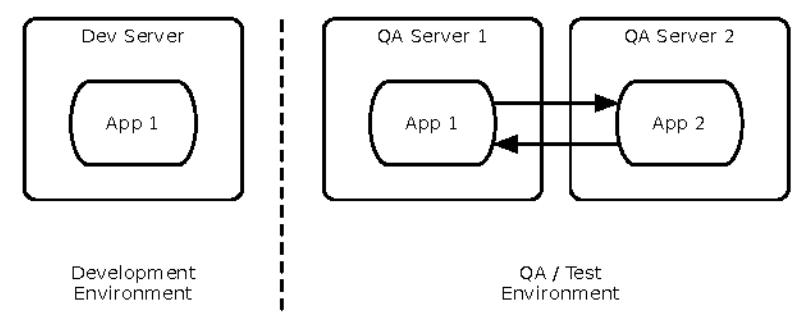

With point-to-point connections, each instance has to talk directly to every other instance, as shown in the next figure.

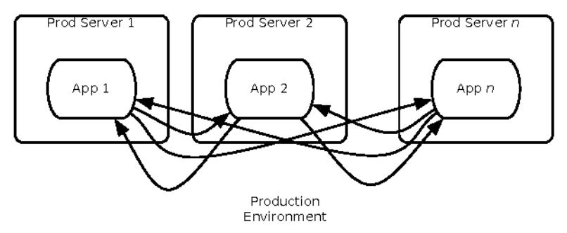

The total number of connections goes up as the square of the number of instances. Scale that up to a hundred instances, and the  $O(n^2)$  scaling becomes quite painful. This is a multiplier effect driven by the number of application instances. Depending on the eventual size of your system,  $O(n^2)$  scaling might be fine. Either way, you should know about this effect before your system hits production.

Be sure to distinguish between point-to-point inside a service versus point-to-point between services. The usual pattern between services is fan-in from my farm of machines to a load balancer in front of your machines. This is a different case. Here we're not talking about having *every* service call every other service.

Unfortunately, unless you are Microsoft or Google, it is unlikely you can build a test farm the same size as your production environment. This type of defect cannot be tested out; it must be designed out.

This is one of those times where there is no "best" choice, just a good choice for a particular set of circumstances. If the application will only ever have two servers, then point-to-point communication is perfectly fine. (As long as the communication is written so it won't block when the other server dies!) As the number of servers grows, then a different communication strategy is needed. Depending on your infrastructure, you can replace point-to-point communication with the following:

- UDP broadcasts
- TCP or UDP multicast
- Publish/subscribe messaging
- Message queues

Broadcasts do the job but aren't bandwidth-efficient. They also cause some additional load on servers that aren't interested in the messages, since the servers' NIC gets the broadcast and must notify the TCP/IP stack. Multicasts are more efficient, since they permit only the interested servers to receive the message. Publish/subscribe messaging is better still, since a server can pick up a message even if it wasn't listening at the precise moment the message was sent. Of course, publish/subscribe messaging often brings in some serious infrastructure cost. This is a great time to apply the XP principle that says, "Do the simplest thing that will work."

### Shared Resources

Another scaling effect that can jeopardize stability is the "shared resource" effect. Commonly seen in the guise of a service-oriented architecture or

"common services" project, the shared resource is some facility that all members of a horizontally scalable layer need to use. With some application servers, the shared resource will be a cluster manager or a lock manager. When the shared resource gets overloaded, it'll become a bottleneck limiting capacity. The following figure should give you an idea of how the callers can put a hurting on the shared resource.

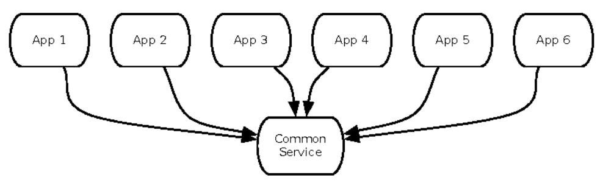

When the shared resource is redundant and nonexclusive—meaning it can service several of its consumers at once—then there's no problem. If it saturates, you can add more, thus scaling the bottleneck.

The most scalable architecture is the *shared-nothing* architecture. Each server operates independently, without need for coordination or calls to any centralized services. In a shared nothing architecture, capacity scales more or less linearly with the number of servers.

The trouble with a shared-nothing architecture is that it might scale better at the cost of failover. For example, consider session failover. A user's session resides in memory on an application server. When that server goes down, the next request from the user will be directed to another server. Obviously, we'd like that transition to be invisible to the user, so the user's session should be loaded into the new application server. That requires some kind of coordination between the original application server and *some* other device. Perhaps the application server sends the user's session to a session backup server after each page request. Maybe it serializes the session into a database table or shares its sessions with another designated application server. There are numerous strategies for session failover, but they all involve getting the user's session off the original server. Most of the time, that implies some level of shared resources.

You can approximate a shared-nothing architecture by reducing the fan-in of shared resources, i.e., cutting down the number of servers calling on the shared resource. In the example of session failover, you could do this by designating pairs of application servers that each act as the failover server for the other.

Too often, though, the shared resource will be allocated for exclusive use while a client is processing some unit of work. In these cases, the probability of contention scales with the number of transactions processed by the layer and the number of clients in that layer. When the shared resource saturates, you get a connection backlog. When the backlog exceeds the listen queue, you get failed transactions. At that point, nearly anything can happen. It depends on what function the caller needs the shared resource to provide. Particularly in the case of cache managers (providing coherency for distributed caches), failed transactions lead to stale data or—worse—loss of data integrity.

### Remember This

### Examine production versus QA environments to spot Scaling Effects.

You get bitten by Scaling Effects when you move from small one-to-one development and test environments to full-sized production environments. Patterns that work fine in small environments or one-to-one environments might slow down or fail completely when you move to production sizes.

### Watch out for point-to-point communication.

Point-to-point communication scales badly, since the number of connections increases as the square of the number of participants. Consider how large your system can grow while still using point-to-point connections—it might be sufficient. Once you're dealing with tens of servers, you will probably need to replace it with some kind of one-to-many communication.

### Watch out for shared resources.

Shared resources can be a bottleneck, a capacity constraint, and a threat to stability. If your system must use some sort of shared resource, stresstest it heavily. Also, be sure its clients will keep working if the shared resource gets slow or locks up.

## Unbalanced Capacities

Whether your resources take months, weeks, or seconds to provision, you can end up with mismatched ratios between different layers. That makes it possible for one tier or service to flood another with requests beyond its capacity. This especially holds when you deal with calls to rate-limited or throttled APIs!

In the <u>illustration on page 76</u>, the front-end service has 3,000 request-handling threads available. During peak usage, the majority of these will be serving product catalog pages or search results. Some smaller number will be in various corporate "telling" pages. A few will be involved in a checkout process.

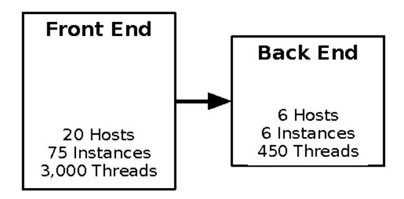

Of the threads serving a checkout-related page, a tiny fraction will be querying the scheduling service to see whether the item can be installed in the customer's home by a local delivery team. You can do some math and science to predict how many threads could be making simultaneous calls to the scheduling system. The math is not hard, though it does rely on both statistics and assumptions—a combination notoriously easy to manipulate. But as long as the scheduling service can handle enough simultaneous requests to meet that demand prediction, you'd think that should be sufficient.

### Not necessarily.

Suppose marketing executes a self-denial attack by offering the free installation of any big-ticket appliance for one day only. Suddenly, instead of a tiny fraction of a fraction of front-end threads involving scheduling queries, you could see two times, four times, or ten times as many. The fact is that the front end always has the ability to overwhelm the back end, because their capacities are not balanced.

It might be impractical to evenly match capacity in each system for a lot of reasons. In this example, it would be a gross misuse of capital to build up every service to the same size just on the off chance that traffic all heads to one service for some reason. The infrastructure would be 99 percent idle except for one day out of five years!

So if you can't build every service large enough to meet the potentially overwhelming demand from the front end, then you must build both callers and providers to be resilient in the face of a tsunami of requests. For the caller, Circuit Breaker will help by relieving the pressure on downstream services when responses get slow or connections get refused. For service providers, use Handshaking and Backpressure to inform callers to throttle back on the requests. Also consider Bulkheads to reserve capacity for high-priority callers of critical services.

### Drive Out Through Testing

Unbalanced capacities are another problem rarely observed during QA. The main reason is that QA for every system is usually scaled down to just two servers. So during integration testing, two servers represent the front-end system and two servers represent the back-end system, resulting in a one-to-one ratio. In production, where the big budget gets allocated, the ratio could be ten to one or worse.

Should you make QA an exact scale replica of the entire enterprise? It would be nice, wouldn't it? Of course, you can't do that. You can apply a test harness, though. (See *Test Harnesses*, on page 113.) By mimicking a back-end system wilting under load, the test harness helps you verify that your front-end system degrades gracefully. (See *Handle Others' Versions*, on page 270, for more ideas for testing.)

On the flip side, if you provide a service, you probably expect a "normal" workload. That is, you reasonably expect that today's distribution of demand and transaction types will closely match yesterday's workload. If all else remains unchanged, then that's a reasonable assumption. Many factors can change the workload coming at your system, though: marketing campaigns, publicity, new code releases in the front-end systems, and especially links on social media and link aggregators. As a service provider, you're even further removed from the marketers who would deliberately cause these traffic changes. Surges in publicity are even less predictable.

So, what can you do if your service serves such unpredictable callers? Be ready for anything. First, use capacity modeling to make sure you're at least in the ballpark. Three thousand threads calling into seventy-five threads is not in the ballpark. Second, don't just test your system with your usual workloads. See what happens if you take the number of calls the front end could possibly make, double it, and direct it all against your most expensive transaction. If your system is resilient, it might slow down—even start to fail fast if it can't process transactions within the allowed time (see <u>Fail Fast</u>, on page 106)—but it should recover once the load goes down. Crashing, hung threads, empty responses, or nonsense replies indicate your system won't survive and might just start a cascading failure. Third, if you can, use autoscaling to react to surging demand. It's not a panacea, since it suffers from lag and can just pass the problem down the line to an overloaded platform service. Also, be sure to impose some kind of financial constraint on your autoscaling as a risk management measure.

### Remember This

### Examine server and thread counts.

In development and QA, your system probably looks like one or two servers, and so do all the QA versions of the other systems you call. In production, the ratio might be more like ten to one instead of one to one. Check the ratio of front-end to back-end servers, along with the number of threads each side can handle in production compared to QA.

### Observe near Scaling Effects and users.

Unbalanced Capacities is a special case of Scaling Effects: one side of a relationship scales up much more than the other side. A change in traffic patterns—seasonal, market-driven, or publicity-driven—can cause a usually benign front-end system to suddenly flood a back-end system, in much the same way as a hot Reddit post or celebrity tweet causes traffic to suddenly flood websites.

### Virtualize QA and scale it up.

Even if your production environment is a fixed size, don't let your QA languish at a measly pair of servers. Scale it up. Try test cases where you scale the caller and provider to different ratios. You should be able to automate this all through your data center automation tools.

### Stress both sides of the interface.

If you provide the back-end system, see what happens if it suddenly gets ten times the highest-ever demand, hitting the most expensive transaction. Does it fail completely? Does it slow down and recover? If you provide the front-end system, see what happens if calls to the back end stop responding or get very slow.

## Dogpile

A large-scale power outage acts a lot like a software failure. It starts with a small event, like a power line grounding out on a tree. Ordinarily that would be no big deal, but under high-stress conditions it can turn into a cascading failure that affects millions of people. We can learn from how power gets restored after an outage. Operators must perform a tricky balancing act between generation, transmission, and demand.

There used to be a common situation where power would be restored and then cut off again in a matter of seconds. The surge of current demand from millions of air conditioners and refrigerators would overload the newly restored supply. It was especially common in large metro areas during heat waves. The increased current load would hit just when supply was low, causing excess demand to trip circuit breakers. Lights out, again.

Smarter appliances and more modern control systems have mitigated that particular failure mode now, but there are still useful lessons for us. For one thing, only the fully assembled system—motors, transmission lines, circuit breakers, generators, and control systems—exhibits that behavior. No smaller subset of components can produce the same outcome. Troubling when you think about QA environments, isn't it?

Another lesson is that the steady-state load on a system might be significantly different than the startup or periodic load. Imagine a farm of app servers booting up. Every single one needs to connect to a database and load some amount of reference or seed data. Every one starts with a cold cache and only gradually gets to a useful working set. Until then, most HTTP requests translate into one or more database queries. That means the transient load on the database is much higher when applications start up than after they've been running for a while.

### Colo Workaround

Craig Andera, developer at Adzerk, relates this story:

I once worked in the IT department of a company in the housing market. I was on the same team as the guys that maintained the servers and was often in and out of the server room, occasionally helping with maintenance tasks. As the server room acquired more and more hardware, we ran into a problem one day when the breaker tripped. When it was reset, all of the computers started up, pulling hard on current. Breaker trips again. There were two fixes for this:

- 1. Bring the machines up one at a time.
- 2. Jam a screwdriver into the breaker handle so it wouldn't trip again.

Number 2 necessitated clamping a fan in place to keep the stressed breaker from overheating.

When a bunch of servers impose this transient load all at once, it's called a *dogpile*. ("Dogpile" is a term from American football in which the ball-carrier gets compressed at the base of a giant pyramid of steroid-infused flesh.)

A dogpile can occur in several different situations:

- · When booting up several servers, such as after a code upgrade and restart
- When a cron job triggers at midnight (or on the hour for any hour, really)
- When the configuration management system pushes out a change

Some configuration management tools allow you to configure a randomized "slew" that will cause servers to pull changes at slightly different times, dispersing the dogpile across several seconds.

Dogpiles can also occur when some external phenomenon causes a synchronized "pulse" of traffic. Imagine a city street with walk/don't walk signs on every corner. When people are allowed to cross a street, they'll move in a clump. People walk at different speeds so they'll disperse to some degree, but the next stoplight will resynchronize them into a clump again. Look out for any place where many threads can get blocked waiting for one thread to complete. When the logiam breaks, the newly freed threads will dogpile any other downstream system.

A pulse can develop during load tests, if the virtual user scripts have fixedtime waits in them. Instead, every pause in a script should have a small random delta applied.

### Remember This

Dogpiles force you to spend too much to handle peak demand.

A dogpile concentrates demand. It requires a higher peak capacity than you'd need if you spread the surge out.

Use random clock slew to diffuse the demand.

Don't set all your cron jobs for midnight or any other on-the-hour time. Mix them up to spread the load out.

Use increasing backoff times to avoid pulsing.

A fixed retry interval will concentrate demand from callers on that period. Instead, use a backoff algorithm so different callers will be at different points in their backoff periods.

## Force Multiplier

Like a lever, automation allows administrators to make large movements with less effort. It's a force multiplier.

## Outage Amplification

On August 11, 2016, link aggregator Reddit.com suffered an outage. It was unavailable for approximately ninety minutes and had degraded service for about another ninety minutes. In their postmortem, Reddit admins described a conflict between deliberate, manual changes and their automation platform:

<sup>8.</sup> ZZZ U GGLW FRP U DQQRXQFHPHQWV FRPPHGGGWWW BZDV BZGKNZBQBRQBDXJB

- 1. First, the admins shut down their autoscaler service so that they could upgrade a ZooKeeper cluster.<sup>9</sup>
- 2. Sometime into the upgrade process, the package management system detected the autoscaler was off and restarted it.
- The autoscaler came back online and read the partially migrated ZooKeeper data. The incomplete ZooKeeper data reflected a much smaller environment than was currently running.
- 4. The autoscaler decided that too many servers were running. It therefore shut down many application and cache servers. This is the start of the downtime.
- 5. Sometime later, the admins identified the autoscaler as the culprit. They overrode the autoscaler and started restoring instances manually. The instances came up, but their caches were empty. They all made requests to the database at the same time, which led to a dogpile on the database. Reddit was up but unusably slow during this time.
- Finally, the caches warmed sufficiently to handle typical traffic. The long nightmare ended and users resumed downvoting everything they disagree with. In other words, normal activity resumed.

The most interesting aspect of this outage is the way it emerged from a conflict between the automation platform's "belief" about the expected state of the system and the administrator's belief about the expected state. When the package management system reactivated the autoscaler, it had no way to know that the autoscaler was *expected* to be down. Likewise, the autoscaler had no way to know that its source of truth (ZooKeeper) was temporarily unable to report the truth. Like HAL 9000, the automation systems were stuck between two conflicting sets of instructions.

A similar condition can occur with service discovery systems. A service discovery service is a distributed system that attempts to report on the state of many distributed systems to other distributed systems. When things are running normally, they work as shown in the figure on page 82.

The nodes of the discovery system gossip among themselves to synchronize their knowledge of the registered services. They run health checks periodically to see if any of the services' nodes should be taken out of rotation. If a single instance of one of the services stops responding, then the discovery service removes that node's IP address. No wonder they can amplify a failure. One

KWWJSRRHNHSHDUSDFKJHRU

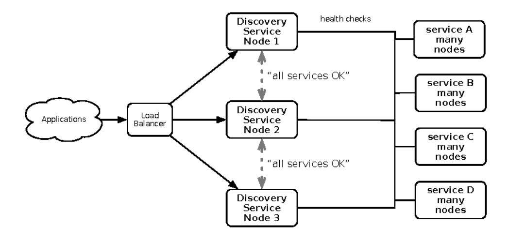

especially challenging failure mode occurs when a service discovery node is itself partitioned away from the rest of the network. As shown in the next figure, node 3 of the discovery service can no longer reach *any* of the managed services. Node 3 kind of panics. It can't tell the difference between "the rest of the universe just disappeared" and "I've got a blindfold on." But if node 3 can still gossip with nodes 1 and 2, then it can propagate its belief to the whole cluster. All at once, service discovery reports that zero services are available. Any application that needs a service gets told, "Sorry, but it looks like a meteor hit the data center. It's a smoking crater."

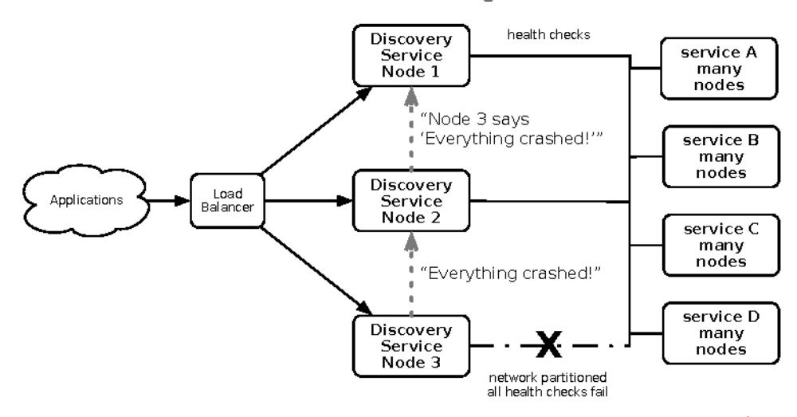

Consider a similar failure, but with a platform management service instead. This service is responsible for starting and stopping machine instances. If it forms a belief that everything is down, then it would necessarily start a new copy of every single service required to run the enterprise.

This situation arises mostly with "control plane" software. The "control plane" refers to software that exists to help manage the infrastructure and applications rather than directly delivering user functionality. Logging, monitoring, schedulers, scalers, load balancers, and configuration management are all parts of the control plane.

The common thread running through these failures is that the automation is not being used to simply enact the will of a human administrator. Rather, it's more like industrial robotics: the control plane senses the current state of the system, compares it to the desired state, and effects changes to bring the current state into the desired state.

In the Reddit failure, ZooKeeper held a representation of the desired state. That representation was (temporarily) incorrect.

In the case of the discovery service, the partitioned node was not able to correctly sense the current state.

A failure can also result when the "desired" state is computed incorrectly and may be impossible or impractical. For example, a naive scheduler might try to run enough instances to drain a queue in a fixed amount of time. Depending on the individual jobs' processing time, the number of instances might be "infinity." That will smart when the Amazon Web Services bill arrives!

## Controls and Safeguards

The United States has a government agency called the Occupational Safety and Health Administration (OSHA). We don't see them too often in the software field, but we can still learn from their safety advice for robots. <sup>10</sup>

Industrial robots have multiple layers of safeguards to prevent damage to people, machines, and facilities. In particular, limiting devices and sensors detect when the robot is not operating in a "normal" condition. For example, suppose a robot arm has a rotating joint. There are limits on how far the arm is allowed to rotate based on the expected operating envelope. These will be much, much smaller than the full range of motion the arm could reach. The rate of rotation will be limited so it doesn't go flinging car doors across an assembly plant if the grip fails. Some joints even detect if they are *not* working

<sup>10.</sup> ZZZ RVKD JRY GWV RVWD RWP RWPBLY RWPBLYB KWPO

against the expected amount of weight or resistance (as might happen when the front falls off).

We can implement similar safeguards in our control plane software:

- If observations report that more than 80 percent of the system is unavailable, it's more likely to be a problem with the observer than the system.
- Apply hysteresis. (See *Governor*, on page 123.) Start machines quickly, but shut them down slowly. Starting new machines is safer than shutting old ones off.
- When the gap between expected state and observed state is large, signal
  for confirmation. This is equivalent to a big yellow rotating warning lamp
  on an industrial robot.
- Systems that consume resources should be stateful enough to detect if they're trying to spin up infinity instances.
- Build in deceleration zones to account for momentum. Suppose your control plane senses excess load every second, but it takes five minutes to start a virtual machine to handle the load. It must make sure not to start 300 virtual machines because the high load persists.

### Remember This

### Ask for help before causing havoc.

Infrastructure management tools can make very large impacts very quickly. Build limiters and safeguards into them so they won't destroy your whole system at once.

### Beware of lag time and momentum.

Actions initiated by automation take time. That time is usually longer than a monitoring interval, so make sure to account for some delay in the system's response to the action.

#### Beware of illusions and superstitions.

Control systems sense the environment, but they can be fooled. They compute an expected state and a "belief" about the current state. Either can be mistaken.

## Slow Responses

As you saw in <u>Socket-Based Protocols</u>, on page 35, generating a slow response is worse than refusing a connection or returning an error, particularly in the context of middle-layer services.

A quick failure allows the calling system to finish processing the transaction rapidly. Whether that is ultimately a success or a failure depends on the application logic. A slow response, on the other hand, ties up resources in the calling system and the called system.

Slow responses usually result from excessive demand. When all available request handlers are already working, there's no slack to accept new requests. Slow responses can also happen as a symptom of some underlying problem. Memory leaks often manifest via Slow Responses as the virtual machine works harder and harder to reclaim enough space to process a transaction. This will appear as a high CPU utilization, but it is all due to garbage collection, not work on the transactions themselves. I have occasionally seen Slow Responses resulting from network congestion. This is relatively rare inside a LAN but can definitely happen across a WAN—especially if the protocol is too chatty. More frequently, however, I see applications letting their sockets' send buffers getting drained and their receive buffers filling up, causing a TCP stall. This usually happens in a hand-rolled, low-level socket protocol, in which the UHD Groutine does not loop until the receive buffer is drained.

Slow responses tend to propagate upward from layer to layer in a gradual form of cascading failure.

You should give your system the ability to monitor its own performance, so it can also tell when it isn't meeting its service-level agreement. Suppose your system is a service provider that's required to respond within one hundred milliseconds. When a moving average over the last twenty transactions exceeds one hundred milliseconds, your system could start refusing requests. This could be at the application layer, in which the system would return an error response within the defined protocol. Or it could be at the connection layer, by refusing new socket connections. Of course, any such refusal to provide service must be well documented and expected by the callers. (Since the developers of that system will surely have read this book, they'll already be prepared for failures, and their system will handle them gracefully.)

### Remember This

Slow Responses trigger Cascading Failures.

Upstream systems experiencing Slow Responses will themselves slow down and might be vulnerable to stability problems when the response times exceed their own timeouts.

### For websites, Slow Responses cause more traffic.

Users waiting for pages frequently hit the Reload button, generating even more traffic to your already overloaded system.

### Consider Fail Fast.

If your system tracks its own responsiveness, then it can tell when it's getting slow. Consider sending an immediate error response when the average response time exceeds the system's allowed time (or at the very least, when the average response time exceeds the caller's timeout!).

### Hunt for memory leaks or resource contention.

Contention for an inadequate supply of database connections produces Slow Responses. Slow Responses also aggravate that contention, leading to a self-reinforcing cycle. Memory leaks cause excessive effort in the garbage collector, resulting in Slow Responses. Inefficient low-level protocols can cause network stalls, also resulting in Slow Responses.

### Unbounded Result Sets

Design with skepticism, and you will achieve resilience. Ask, "What can system X do to hurt me?" and then design a way to dodge whatever wrench your supposed ally throws.

If your application is like most, it probably treats its database server with far too much trust. I'm going to try to convince you that a healthy dose of skepticism will help your application dodge a bullet or two.

A common structure in the code goes like this: send a query to the database and then loop over the result set, processing each row. Often, processing a row means adding a new data object to a collection. What happens when the database suddenly returns five million rows instead of the usual hundred or so? Unless your application explicitly limits the number of results it's willing to process, it can end up exhausting its memory or spinning in a while loop long after the user loses interest.

## Black Monday

Have you ever had a surprising discovery about an old friend? You know, like the most boring guy in the office suddenly tells you he's into BASE jumping? That happened to me about my favorite commerce server. One day, with no warning, every instance in the farm—more than a hundred individual, load-balanced instances—started behaving badly. It seemed almost random. An instance would be fine, but then a few minutes later it would start using 100 percent of the CPU. Three or four minutes later, it would crash with a HotSpot

memory error. The operations team was restarting them as fast as they could, but it took a few minutes to start up and preload cache. Sometimes, they would start crashing before they were even finished starting. We could not keep more than 25 percent of our capacity up and running.

Imagine (or recall, if you've been there) trying to debug a totally novel failure mode while also participating in a  $5\,\mathrm{a.m.}$  (with no coffee) conference call with about twenty people. Some of them are reporting the current status, some are trying to devise a short-term response to restore service, others are digging into root cause, and some of them are just spreading disinformation.

We sent a system admin and a network engineer to go looking for denial-ofservice attacks. Our DBA reported that the database was healthy but under heavy load. That made sense, because at startup, each instance would issue hundreds of queries to warm up its caches before accepting requests. Some of the instances would crash before they started accepting requests, which told me it was not related to incoming requests. The high CPU condition looked like garbage collection to me, so I told the team I would start looking for memory problems. Sure enough, when I watched the "heap available" on one instance, I saw it heading toward zero. Shortly after it hit zero, the JVM got a HotSpot error.

Usually, when a JVM runs out of memory, it throws an 2XW210HPREWILL crashes only if it is executing some native code that doesn't check for NULL after calling PD00RFhe only native code I knew of was in the type 2 JDBC driver. (For those of you who haven't delved the esoterica of Java programming, native code means fully compiled instructions for the host processor. Typically, this is C or C++ code in dynamically linked libraries. Calling into native code makes the JVM just as crashy as any C program.) Type 2 drivers use a thin layer of Java to call out to the database vendor's native API library. Sure enough, dumping the stack showed execution deep inside the database driver.

But what was the server doing with the database? For that, I asked our DBA to trace queries from the application servers. Soon enough, we had another instance crash, so we could see what a doomed server did before it went into the twilight zone. The queries all looked totally innocuous, though. Routine stuff. I didn't see any of the hand-coded SQL monsters that I'd seen elsewhere (eight-way unions with five joins in each subquery, and so on). The last query I saw was just hitting a message table that the server used for its database-backed implementation of JMS. The instances mainly used it to tell each other when to flush their caches. This table should never have more than 1,000 rows, but our DBA saw that it topped the list of most expensive queries.

For some reason, that usually tiny table had more than ten million rows. Because the app server was written to just select all the rows from the table, each instance would try to receive all ten-million-plus messages. This put a lock on the rows, since the app server issued a "select for update" query. As it tried to make objects out of the messages, it would use up all available memory, eventually crashing. Once the app server crashed, the database would roll back the transaction, releasing the lock. Then the next app server would step off the cliff by querying the table. We did an extraordinary amount of hand-holding and manual work to compensate for the lack of a LIMIT clause on the app server's query. By the time we had stabilized the system, Black Monday was done...it was Tuesday.

We did eventually find out why the table had more than ten million messages in it, but that's a different story.

This failure mode can occur when querying databases or calling services. It can also occur when front-end applications call APIs. Because datasets in development tend to be small, the application developers may never experience negative outcomes. After a system is in production for a year, however, even a traversal such as "fetch customer's orders" can return huge result sets. When that happens, you are treating your best, most loyal customers to the very worst performance!

In the abstract, an unbounded result set occurs when the caller allows the other system to dictate terms. It's a failure in handshaking. In any API or protocol, the caller should always indicate how much of a response it's prepared to accept. TCP does this in the "window" header field. Search engine APIs allow the caller to specify how many results to return and what the starting offset should be. There's no standard SQL syntax to specify result set limits. ORMs support query parameters that can limit results returned from a query but do not usually limit results when following an association (such as container to contents). Therefore, beware of any relationship that can accumulate unlimited children, such as orders to order lines or user profiles to site visits. Entities that keep an audit trail of changes are also suspect.

Beware of the way that patterns of relationships can change from QA to production as well. Early social media sites assumed that the number of connections per user would be distributed on something like a bell curve. In fact it's a power law distribution, which behaves totally differently. If you test with bell-curve distributed relationships, you would never expect to load an entity that has a million times more relationships than the average. But that's guaranteed to happen with a power law.

If you're handcrafting your own SQL, use one of these recipes to limit the number of rows to fetch:

```
OLFURVE64W6HUYHU
6(/(&7723 FROVSH5F20WDEOHVSHF
2UDFOMLQFHL
6(/(&7FROVSH5F20WDEOHVSHF
:+(5(URZQXP
0\64/DQG3RVWJUH64/
6(/(&7FROVSH5F20WDEOHVSHF
/,0,7
```

An incomplete solution (but better than nothing) would be to query for the full results but break out of the processing loop after reaching the maximum number of rows. Although this does provide some added stability on the application server, it does so at the expense of wasted database capacity.

Unbounded result sets are a common cause of slow responses. They can result from violation of steady state (see *Steady State*, on page 101).

### Remember This

### Use realistic data volumes.

Typical development and test data sets are too small to exhibit this problem. You need production-sized data sets to see what happens when your query returns a million rows that you turn into objects. As a side benefit, you'll also get better information from your performance testing when you use production-sized test data.

### Paginate at the front end.

Build pagination details into your service call. The request should include a parameter for the first item and the count. The reply should indicate (roughly) how many results there are.

### Don't rely on the data producers.

Even if you think a query will never have more than a handful of results, beware: it could change without warning because of some other part of the system. The only sensible numbers are "zero," "one," and "lots," so unless your query selects exactly one row, it has the potential to return too many. Don't rely on the data producers to create a limited amount of data. Sooner or later, they'll go berserk and fill up a table for no reason, and then where will you be?

### Put limits into other application-level protocols.

Service calls, RMI, DCOM, XML-RPC, and any other kind of request/reply call are vulnerable to returning huge collections of objects, thereby consuming too much memory.

## Wrapping Up

We've covered a lot of dark territory in this chapter. We've looked at many different ways your systems are under threat, both internally and externally. These antipatterns are found in nearly every service and application. Good news! It's time to emerge from this vale of shadows into the light. It's time to talk about the stability patterns you can apply to protect your software.
