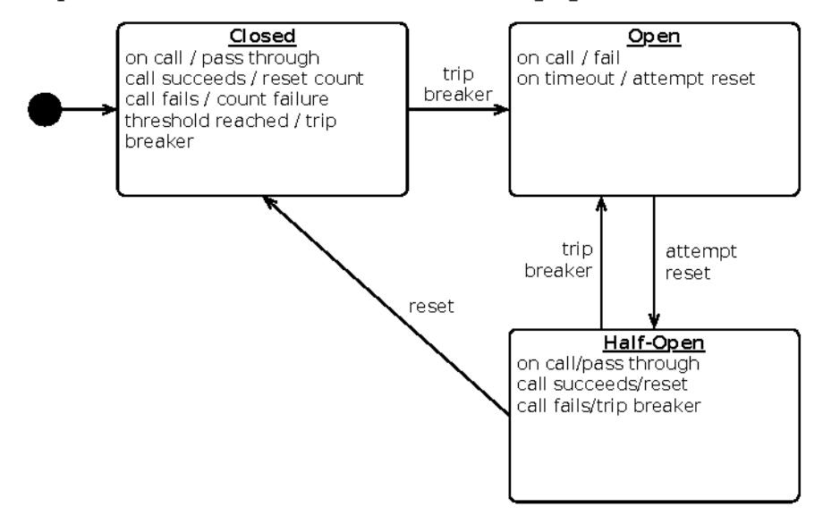
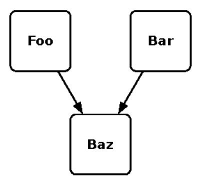
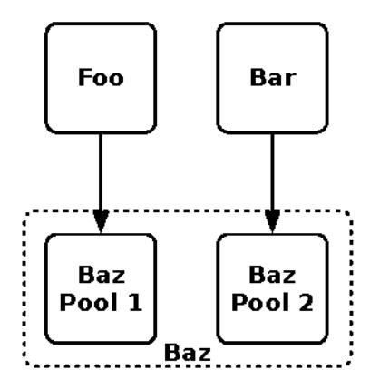
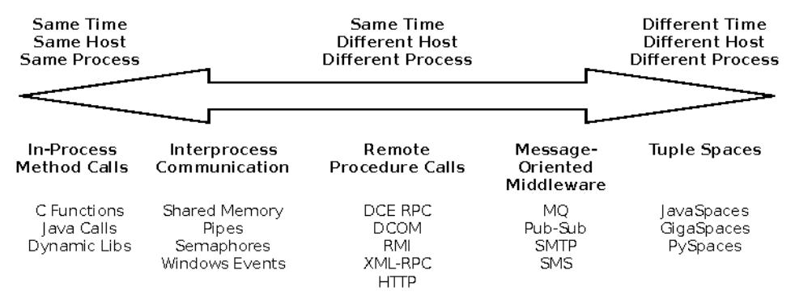

# Chapter 5: Stability Patterns

We have traveled through the vale of shadows. Now it is time to come in to the light. In the last chapter, we saw the antipatterns to avoid. In this chapter, we'll look at the flip side and examine some patterns that are the inverse of the killers from the last chapter. These healthy patterns provide the architecture and design guidance to reduce, eliminate, or mitigate the effects of cracks in the system. Not one of these will help your software pass QA, but they will help you get a full night's sleep, or at least an uninterrupted dinner with your family, once your software launches.

Don't make the mistake of assuming that a system that includes more of these patterns is superior to one with fewer of them. "Count of patterns applied" is never a good quality metric. Instead, I want you to develop a recovery-oriented mind-set. At the risk of sounding like a broken record, I'll say it again: expect failures. Apply these patterns wisely to reduce the damage done by an individual failure.

## Timeouts

In the early days, networking issues affected only programmers working on low-level software: operating systems, network protocols, remote filesystems, and so on. Today, every system is a distributed system. Every application must grapple with the fundamental nature of networks: networks are fallible. The wire could be broken, some switch or router along the way could be broken, or the computer you are addressing could be broken. Your thermostat can't talk to your TV because the microwave is on. Even if you've already established communication, any of these elements could break at any time. When that happens, your code can't just wait forever for a response that might never come; sooner or later, it needs to give up. Hope is not a design method.

The timeout is a simple mechanism allowing you to stop waiting for an answer once you think it won't come. I once had a project to port the BSD sockets library to a mainframe-based UNIX environment. I attacked the project with a stack of RFCs and a dusty pile of source code for UNIX System V Release 4. Two issues nagged at me throughout the entire project. First, heavy use of "#ifdef" blocks for different architectures made it look less like a portable operating system than twenty different operating systems intermingled. Second, the networking code was absolutely riddled with error handling for different flavors of timeouts. By the project's end, I had grown to understand and appreciate the significance of timeouts.

Well-placed timeouts provide fault isolation—a problem in some other service or device does not have to become your problem. Unfortunately, at higher levels of abstraction, further from the dirty world of hardware, good placement of timeouts becomes increasingly rare. Indeed, some high-level APIs have few or no explicit timeout settings. Presumably the designers behind these APIs have never been awakened in the wee hours to recover a crashed system. Many APIs offer both a call with a timeout and a simpler, easier call that blocks forever. It would be better if, instead of overloading a single function, the no-timeout version were labeled "CheckoutAndMaybeKillMySystem."

Commercial software client libraries are notoriously devoid of timeouts. These libraries often do direct socket calls on behalf of the system. By hiding the socket from your code, they also prevent you from setting vital timeouts.

Timeouts can also be relevant within a single service. Any resource pool can be exhausted. Conventional usage dictates that the calling thread should be blocked until one of the resources is checked in. (See <u>Blocked Threads</u>, on page 62.)

It's essential that any resource pool that blocks threads must have a timeout to ensure that calling threads eventually unblock, whether resources become available or not.

Also beware of language-level synchronization or mutexes. Always use the form that takes a timeout argument.

An approach to dealing with pervasive timeouts is to organize long-running operations into a set of primitives that you can reuse in many places. For example, suppose you need to check out a database connection from a resource pool, run a query, turn the result set into objects, and then check the database connection back into the pool. At least three points in that interaction could hang indefinitely. Instead of coding that sequence of interactions dozens of places, with all the associated handling of timeouts (not to mention other kinds

### Is All This Clutter Really Necessary?

You may think, as I did when porting the sockets library, that handling all the possible timeouts creates undue complexity in your code. It certainly adds complexity. You may find that half your code is devoted to error handling instead of providing features. I argue, however, that the essence of aiming for production—instead of aiming for QA—is handling the slings and arrows of outrageous fortune. That error-handling code, if done well, adds resilience. Your users may not thank you for it, because nobody notices when a system doesn't go down, but you will sleep better at night.

of errors), create a query object (see <u>Patterns of Enterprise Application Architecture</u> [Fow03]) to represent the part of the interaction that changes.

Use a generic gateway to provide the template for connection handling, error handling, query execution, and result processing. That way you only need to get it right in one place, and calling code can provide just the essential logic. Collecting this common interaction pattern into a single class also makes it easier to apply the Circuit Breaker pattern.

Make full use of your platform. Infrastructure services like Amazon API Gateway can handle a lot of the dirty details for you. Language runtimes that use callbacks or reactive programming styles also let you specify timeouts more easily.

Timeouts are often found in the company of retries. Under the philosophy of "best effort," the software attempts to repeat an operation that timed out. Immediately retrying an operation after a failure has a number of consequences, but only some of them are beneficial. If the operation failed because of any significant problem, it's likely to fail again if retried immediately. Some kinds of transient failures might be overcome with a retry (for example, dropped packets over a WAN). Within the walls of a data center, however, the failure is probably because of something wrong with the other end of a connection. My experience has been that problems on the network, or with other servers, tend to last for a while. Thus, fast retries are very likely to fail again.

From the client's perspective, making me wait longer is a very bad thing. If you cannot complete an operation because of some timeout, it is better for you to return a result. It can be a failure, a success, or a note that you've queued the work for later execution (if I should care about the distinction). In any case, just come back with an answer. Making me wait while you retry the operation might push your response time past *my* timeout. It certainly keeps my resources busy longer than needed.

On the other hand, queuing the work for a slow retry later is a good thing, making the system more robust. Imagine if every mail server between the sender and receiver had to be online, ready to process your mail, and had to respond within sixty seconds in order for email to make it through. How well would the global email system scale? The store-and-forward approach obviously makes much more sense. In the case of failure in a remote server, queue-and-retry ensures that once the remote server is healthy again, the overall system will recover. Work does not need to be lost completely just because part of the larger system isn't functioning. How fast is fast enough? It depends on your application and your users. For a service behind a web API, "fast enough" is probably between 10 and 100 milliseconds. Beyond that, you'll start to lose capacity and customers.

Timeouts have natural synergy with circuit breakers. A circuit breaker can tabulate timeouts, tripping to the "off" state if too many occur.

The Timeouts pattern and the Fail Fast pattern (which I discus in *Fail Fast*, on page 106) both address latency problems. The Timeouts pattern is useful when you need to protect your system from someone else's failure. Fail Fast is useful when you need to report why you won't be able to process some transaction. Fail Fast applies to incoming requests, whereas the Timeouts pattern applies primarily to outbound requests. They're two sides of the same coin.

Timeouts can also help with unbounded result sets by preventing the client from processing the entire result set, but they aren't the most effective approach to that particular problem. They'd be a stopgap, but not much more than that.

Timeouts apply to a general class of problems. As such, they help systems recover from unanticipated events.

### Remember This

Apply Timeouts to Integration Points, Blocked Threads, and Slow Responses.

The Timeouts pattern prevents calls to Integration Points from becoming Blocked Threads. Thus, timeouts avert Cascading Failures.

Apply Timeouts to recover from unexpected failures.

When an operation is taking too long, sometimes we don't care why...we just need to give up and keep moving. The Timeouts pattern lets us do that.

### Consider delayed retries.

Most of the explanations for a timeout involve problems in the network or the remote system that won't be resolved right away. Immediate retries are liable to hit the same problem and result in another timeout. That just makes the user wait even longer for her error message. Most of the time, you should queue the operation and retry it later.

### Circuit Breaker

Not too long ago, when electrical wiring was first being built into houses, many people fell victim to physics. The unfortunates would plug too many appliances into their circuit. Each appliance drew a certain amount of current. When current is resisted, it produces heat proportional to the square of the current times the resistance (, \( \frac{1}{2} \)). Because houses lacked superconducting home wiring, this hidden coupling between electronic gizmos made the wires in the walls get hot, sometimes hot enough to catch fire. Whoosh. No more house.

The fledgling energy industry found a partial solution to the problem of resistive heating in the form of fuses. The entire purpose of an electrical fuse is to burn up before the house does. It's a component designed to fail first, thereby controlling the overall failure mode. This brilliant device worked well, except for two flaws. First, a fuse is a disposable, one-time use item; therefore, it's possible to run out of them. Second, residential fuses (in the United States) were about the same diameter as copper pennies. Together, these two flaws led many people to conduct experiments with homemade, high-current, low-resistance fuses (that is, a 3/4-inch disk of copper). Whoosh. No more house.

Residential fuses have gone the way of the rotary dial telephone. Now, circuit breakers protect overeager gadget hounds from burning their houses down. The principle is the same: detect excess usage, fail first, and open the circuit. More abstractly, the circuit breaker exists to allow one subsystem (an electrical circuit) to fail (excessive current draw, possibly from a short circuit) without destroying the entire system (the house). Furthermore, once the danger has passed, the circuit breaker can be reset to restore full function to the system.

You can apply the same technique to software by wrapping dangerous operations with a component that can circumvent calls when the system is not healthy. This differs from retries, in that circuit breakers exist to prevent operations rather than reexecute them.

In the normal "closed" state, the circuit breaker executes operations as usual. These can be calls out to another system, or they can be internal operations that are subject to timeout or other execution failure. If the call succeeds, nothing extraordinary happens. If it fails, however, the circuit breaker makes

a note of the failure. Once the number of failures (or the frequency of failures, in more sophisticated cases) exceeds a threshold, the circuit breaker trips and "opens" the circuit, as shown in the following figure.

When the circuit is "open," calls to the circuit breaker fail immediately, without any attempt to execute the real operation. After a suitable amount of time, the circuit breaker decides that the operation has a chance of succeeding, so it goes into the "half-open" state. In this state, the next call to the circuit breaker is allowed to execute the dangerous operation. Should the call succeed, the circuit breaker resets and returns to the "closed" state, ready for more routine operation. If this trial call fails, however, the circuit breaker returns to the open state until another timeout elapses.

Depending on the details of the system, the circuit breaker may track different types of failures separately. For example, you may choose to have a lower threshold for "timeout calling remote system" failures than "connection refused" errors.

When the circuit breaker is open, something has to be done with the calls that come in. The easiest answer would be for the calls to immediately fail, perhaps by throwing an exception (preferably a different exception than an ordinary timeout so that the caller can provide useful feedback). A circuit breaker may also have a "fallback" strategy. Perhaps it returns the last good response or a cached value. It may return a generic answer rather than a personalized one. Or it may even call a secondary service when the primary is not available.

Circuit breakers are a way to automatically degrade functionality when the system is under stress. No matter the fallback strategy, it can have an impact on the business of the system. Therefore, it's essential to involve the system's stakeholders when deciding how to handle calls made when the circuit is open. For example, should a retail system accept an order if it can't confirm availability of the customer's items? What about if it can't verify the customer's credit card or shipping address? Of course, this conversation is not unique to the use of a circuit breaker, but discussing the circuit breaker can be a more effective way of broaching the topic than asking for a requirements document.

There are some interesting implementation details to consider. For one thing, what constitutes "too many failures"? A simple counter adding up all the faults probably isn't that interesting. There's a world of difference between observing five faults spread evenly over five hours versus five faults in the last thirty seconds. We're usually more interested in the fault *density* than the total count. I like the Leaky Bucket pattern from *Pattern Languages of Program Design 2 [VCK96]*. It's a simple counter that you can increment every time you observe a fault. In the background, a thread or timer decrements the counter periodically (down to zero, of course.) If the count exceeds a threshold, then you know that faults are arriving quickly.

The state of the circuit breakers in a system is important to another set of stakeholders: operations. Changes in a circuit breaker's state should always be logged, and the current state should be exposed for querying and monitoring. In fact, the frequency of state changes is a useful metric to chart over time; it is a leading indicator of problems elsewhere in the enterprise. Likewise, Operations needs some way to directly trip or reset the circuit breaker. The circuit breaker is also a convenient place to gather metrics about call volumes and response times.

A circuit breaker should be built at the scope of a single process. That is, the same circuit breaker state affects every thread in a process but is not shared across multiple processes. That does mean some loss of efficiency when multiple instances of the caller each independently discover that the provider is down. However, sharing the circuit breaker state introduces another out-of-process communication. That means the safety mechanism would introduce a new failure mode!

Even when just shared within a process, circuit breakers are subject to the gallery of multithreaded programming terrors. Be sure to avoid accidentally single-threading all calls to a remote system! Open source circuit breaker libraries are available for every language and framework, so it's probably better to start with one of those.

Circuit breakers are effective at guarding against integration points, cascading failures, unbalanced capacities, and slow responses. They work so closely with timeouts that they often track timeout failures separately from execution failures.

### Remember This

### Don't do it if it hurts.

Circuit Breaker is the fundamental pattern for protecting your system from all manner of Integration Points problems. When there's a difficulty with Integration Points, stop calling it!

### Use together with Timeouts.

Circuit Breaker is good at avoiding calls when Integration Points has a problem. The Timeouts pattern indicates that there's a problem in Integration Points.

### Expose, track, and report state changes.

Popping a Circuit Breaker *always* indicates something abnormal. It should be visible to Operations. It should be reported, recorded, trended, and correlated.

### Bulkheads

In a ship, bulkheads are partitions that, when sealed, divide the ship into separate, watertight compartments. With hatches closed, a bulkhead prevents water from moving from one section to another. In this way, a single penetration of the hull does not irrevocably sink the ship. The bulkhead enforces a principle of damage containment.

You can employ the same technique. By partitioning your systems, you can keep a failure in one part of the system from destroying everything. Physical redundancy is the most common form of bulkheads. If there are four independent servers, then a hardware failure in one can't affect the others. Likewise, if there are two application instances running on a server and one crashes, the other will still be running (unless, of course, the first one crashed because of some external influence that would also affect the second).

Redundant virtual machines are not quite as robust as redundant physical machines. Most VM provisioning tools do not allow you to enforce physical isolation, so more than one VM may end up running on the same physical box.

At the largest scale, a mission-critical service might be implemented as several independent farms of servers, with certain farms reserved for use by critical applications and others available for noncritical uses. For example,

a ticketing system could provide dedicated servers for customer check-in. These would not be affected if other, shared servers are overwhelmed with "flight status" queries (as sometimes happens during severe weather). Such a partitioning would have allowed the airline in Chapter 2, Case Study: The Exception That Grounded an Airline, on page 9, to keep checking in passengers at airports, even if channel partners could not look up fares for that day's flights.

In the cloud, you should run instances in different divisions of the service (e.g., across zones and regions in AWS). These are very large-grained chunks with strong partitioning between them. When using functions as a service, basically every function invocation runs in its own compartment.

In the figure that follows, Foo and Bar both use the enterprise service Baz. Because both depend on a common service, each system has some vulnerability to the other. If Foo suddenly gets crushed under user load, goes rogue because of some defect, or triggers a bug in Baz, Bar—and its users—also suffer. This kind of unseen coupling makes diagnosing problems (particularly performance problems) in Bar very difficult. Scheduling maintenance windows for Baz also requires coordination with both Foo and Bar, and it may be difficult to find a window that works for both clients.

Assuming both Foo and Bar are critical systems with strict SLAs, it'd be safer to partition Baz, as shown in this revised figure on page 100. Dedicating some capacity to each critical client removes most of the hidden linkage. They probably still share a database and are, therefore, subject to deadlocks across instances, but that's another antipattern.

Of course, it would be better to preserve all capabilities. Assuming that failures will occur, however, you must consider how to minimize the damage caused by a failure. It is not an easy effort, and one rule cannot apply in every case. Instead, you must examine the impact to the business of each loss of capability and

cross-reference those impacts against the architecture of the systems. The goal is to identify the natural boundaries that let you partition the system in a way that is both technically feasible and financially beneficial. The boundaries of this partitioning may be aligned with the callers, with functionality, or with the topology of the system.

With cloud-based systems and software-defined load balancers, bulkheads do not need to be permanent. With a bit of automation, a cluster of VMs can be carved out and the load balancer can direct traffic from a particular consumer to that cluster. This is similar to A/B testing, but as a protective measure rather than an experiment. Dynamic partitions can be made and destroyed as traffic patterns change.

At smaller scales, process binding is an example of partitioning via bulkheads. Binding a process to a core or group of cores ensures that the operating system schedules that process's threads only on the designated core or cores. Because it reduces the cache bashing that happens when processes migrate from one core to another, process binding is often regarded as a performance tweak. If a process goes berserk and starts using all CPU cycles, it can usually drag down an entire host machine. I've seen eight core servers consumed by a single process. If that process is bound to a core, however, it can use all available cycles only on that one core.

You can partition the threads inside a single process, with separate thread groups dedicated to different functions. For example, it's often helpful to reserve a pool of request-handling threads for administrative use. That way, even if all request-handling threads on the application server are hung, it can still respond to admin requests—perhaps to collect data for postmortem analysis or a request to shut down.

Bulkheads are effective at maintaining service, or partial service, even in the face of failures. They are especially useful in service-oriented architectures, where the loss of a single service could have repercussions throughout the enterprise. In effect, a service inside an SOA represents a single point of failure for the enterprise.

### Remember This

### Save part of the ship.

The Bulkheads pattern partitions capacity to preserve partial functionality when bad things happen.

### Pick a useful granularity.

You can partition thread pools inside an application, CPUs in a server, or servers in a cluster.

### Consider Bulkheads particularly with shared services models.

Failures in service-oriented or microservice architectures can propagate very quickly. If your service goes down because of a Chain Reaction, does the entire company come to a halt? Then you'd better put in some Bulkheads.

## Steady State

The third edition of *Roget's Thesaurus* offers the following definition for the word *fiddling*: "To handle something idly, ignorantly, or destructively." It offers helpful synonyms such as *fool, meddle, tamper, tinker*, and *monkey*. Fiddling is often followed by the "ohnosecond"—that very short moment in time during which you realize that you have pressed the wrong key and brought down a server, deleted vital data, or otherwise damaged the peace and harmony of stable operations.

Every single time a human touches a server is an opportunity for unforced errors. I know of one incident in which an engineer, attempting to be helpful, observed that a server's root disk mirror was out of sync. He executed a command to "resilver" the mirror, bringing the two disks back into synchronization. Unfortunately, he made a typo and synced the good root disk from the new, totally empty drive that had just been swapped in to replace a bad disk, thereby instantly annihilating the operating system on that server.

It's best to keep people off production systems to the greatest extent possible. If the system needs a lot of crank-turning and hand-holding to keep running, then administrators develop the habit of staying logged in all the time. This situation probably indicates that the servers are "pets" rather than "cattle" and inevitably leads to fiddling. To that end, the system should be able to run at least one release cycle without human intervention. The logical extreme on the "no fiddling" scale is immutable infrastructure—it can't be fiddled with! (See <u>Automated Deployments</u>, on page 242, for more about immutable infrastructure.)

"One release cycle" may be pretty tough if the system is deployed once a quarter. On the other hand, a microservice being continuously deployed from version control should be pretty easy to stabilize for a release cycle.

Unless the system is crashing every day (in which case, look for the presence of the stability antipatterns), the most common reason for logging in will probably be cleaning up log files or purging data.

Any mechanism that accumulates resources (whether it's log files in the filesystem, rows in the database, or caches in memory) is like a bucket from a high-school calculus problem. The bucket fills up at a certain rate, based on the accumulation of data. It must be drained at the same rate, or greater, or it will eventually overflow. When this bucket overflows, bad things happen: servers go down, databases get slow or throw errors, response times head for the stars. The Steady State pattern says that for every mechanism that accumulates a resource, some other mechanism must recycle that resource. Let's look at several types of sludge that can accumulate and how to avoid the need for fiddling.

### Data Purging

It certainly seems like a simple enough principle. Computing resources are always finite; therefore, you cannot continually increase consumption without limit. Still, in the rush of excitement about rolling out a new killer application, the next great mission-critical, bet-the-company whatever, data purging always gets the short end of the stick. It certainly doesn't demo as well as...well, anything demos better than purging, really. It sometimes seems that you'll be lucky if the system ever runs at all in the real world. The notion that it'll run long enough to accumulate too much data to handle seems like a "high-class problem"—the kind of problem you'd love to have.

Nevertheless, someday your little database will grow up. When it hits the teenage years—about two in human years—it'll get moody, sullen, and resentful. In the worst case, it'll start undermining the whole system (and it will probably complain that nobody understands it, too).

The most obvious symptom of data growth will be steadily increasing I/O rates on the database servers. You may also see increasing latency at constant loads.

Data purging is nasty, detail-oriented work. Referential integrity constraints in a relational database are half the battle. It can be difficult to cleanly remove

obsolete data without leaving orphaned rows. The other half of the battle is ensuring that applications still work once the data is gone. That takes coding and testing.

There are few general rules here. Much depends on the database and libraries in use. RDBMS plus ORM tends to deal badly with dangling references, for example, whereas a document-oriented database won't even notice.

As a consequence, data purging always gets left until after the first release is out the door. The rationale is, "We've got six months after launch to implement purging." (Somehow, they always say "six months." It's kind of like a programmer's estimate of "two weeks.")

Of course, after launch, there are always emergency releases to fix critical defects or add "must-have" features from marketers tired of waiting for the software to be done. The first six months can slip away pretty quickly, but when that first release launches, a fuse is lit.

Another type of sludge you will commonly encounter is old log files.

### Log Files

One log file is like one pile of cow dung—not very valuable, and you'd rather not dig through it. Collect tons of cow dung and it becomes "fertilizer." Likewise, if you collect enough log files you can discover value.

Left unchecked, however, log files on individual machines are a risk. When log files grow without bound, they'll eventually fill up their containing filesystem. Whether that's a volume set aside for logs, the root disk, or the application installation directory (I hope not), it means trouble. When log files fill up the filesystem, they jeopardize stability. That's because of the different negative effects that can occur when the filesystem is full. On a UNIX system, the last 5–10 percent (depending on the configuration of the filesystem) of space is reserved for root. That means an application will start getting I/O errors when the filesystem is 90 or 95 percent full. Of course, if the application is running as root, then it can consume the very last byte of space. On a Windows system, an application can always use the very last byte. In either case, the operating system will report errors back to the application.

What happens next is anyone's guess. In the best-case scenario, the logging filesystem is separate from any critical data storage (such as transactions), and the application code protects itself well enough that users never realize anything is amiss. Significantly less pleasant, but still tolerable, is a nicely worded error message asking the users to have patience with us and please

come back when we've got our act together. Several rungs down the ladder is serving a stack trace to the user.

Worse yet, the developers in one system I saw had added a "universal exception handler" to the servlet pipeline. This handler would log any kind of exception. It was reentrant, so if an exception occurred while logging an exception, it would log both the original and the new exception. As soon as the filesystem got full, this poor exception handler went nuts, trying to log an ever-increasing stack of exceptions. Because there were multiple threads, each trying to log its own Sisyphean exception, this application server was able to consume eight entire CPUs—for a little while, anyway. The exceptions, multiplying like Leonardo of Pisa's rabbits, rapidly consumed all available memory. This was followed shortly by a crash.

Of course, it's always better to avoid filling up the filesystem in the first place. Log file rotation requires just a few minutes of configuration.

In the case of legacy code, third-party code, or code that doesn't use one of the excellent logging frameworks available, the ORBWDWMHity is ubiquitous on UNIX. For Windows, you can try building ORBWDWMHer Cygwin, or you can hand roll a YEM EDWript to do the job. Logging can be a wonderful aid to transparency. Make sure that all log files will get rotated out and eventually purged, though, or you'll eventually spend time fixing the tool that's supposed to help you fix the system.

## What About Compliance? Don't We Have to Keep All Our Log Files Forever?

You will sometimes hear people talking about logging in terms of compliance requirements. Compliance in all its forms makes many heavy demands on IT infrastructure and operations. The specific demands depend on your industry, but there's always a component about "controls." The Sarbanes–Oxley Act of 2002 (SOX) requires adequate controls on any system that produces financially significant information. The company must be able to demonstrate that nobody can monkey with the financial data. Another common requirement is to record and demonstrate that only authorized users accessed certain data. Many companies also face industry- and country-specific regulations.

These various compliance regimes require you to retain logs for years. Individual machines can't possibly retain logs that long. Most of the machines don't live that long, especially if you're in the cloud! The best thing to do is get logs off of production machines as quickly as possible. Store them on a centralized server and monitor it closely for tampering.

Log files on production systems have a terrible signal-to-noise ratio. It's best to get them off the individual hosts as quickly as possible. Ship the log files to a centralized logging server, such as Logstash, where they can be indexed, searched, and monitored.

Between data in the database and log files on the disk, persistent data can find plenty of ways to clog up your system. Like a jingle from an old commercial, sludge stuck in memory clogs up your application.

### In-Memory Caching

To a long-running server, memory is like oxygen. Cache, left untended, will suck up all the oxygen. Low memory conditions are a threat to both stability and capacity. Therefore, when building any sort of cache, it's vital to ask two questions:

- Is the space of possible keys finite or infinite?
- Do the cached items ever change?

If the number of possible keys has no upper bound, then cache size limits must be enforced and the cache needs some form of cache invalidation. The simplest mechanism is a time-based cache flush. You can also investigate least recently used (LRU) or working-set algorithms, but nine times out of ten, a periodic flush will do.

Improper use of caching is the major cause of memory leaks, which in turn lead to horrors like daily server restarts. Nothing gets administrators in the habit of being logged onto production like daily (or nightly) chores.

Sludge buildup is a major cause of slow responses, so Steady State helps avoid that antipattern. Steady State also encourages better operational discipline by limiting the need for system administrators to log on to the production servers.

### Remember This

#### Avoid fiddling.

Human intervention leads to problems. Eliminate the need for recurring human intervention. Your system should run for at least a typical deployment cycle without manual disk cleanups or nightly restarts.

### Purge data with application logic.

DBAs can create scripts to purge data, but they don't always know how the application behaves when data is removed. Maintaining logical integrity, especially if you use an ORM tool, requires the application to purge its own data.

### Limit caching.

In-memory caching speeds up applications, until it slows them down. Limit the amount of memory a cache can consume.

### Roll the logs.

Don't keep an unlimited amount of log files. Configure log file rotation based on size. If you need to retain them for compliance, do it on a non-production server.

### Fail Fast

If slow responses are worse than no response, the worst must surely be a slow *failure* response. It's like waiting through the interminable line at the DMV, only to be told you need to fill out a different form and go back to the end of the line. Can there be any bigger waste of system resources than burning cycles and clock time only to throw away the result?

If the system can determine in advance that it will fail at an operation, it's always better to fail fast. That way, the caller doesn't have to tie up any of its capacity waiting and can get on with other work.

How can the system tell whether it will fail? Do we need Deep Learning? Don't worry, you won't need to hire a cadre of data scientists.

It's actually much more mundane than that. There's a large class of "resource unavailable" failures. For example, when a load balancer gets a connection request but not one of the servers in its service pool is functioning, it should immediately refuse the connection. Some configurations have the load balancer queue the connection request for a while in the hopes that a server will become available in a short period of time. This violates the Fail Fast pattern.

The application or service can tell from the incoming request or message roughly what database connections and external integration points will be needed. The service can quickly check out the connections it will need and verify the state of the circuit breakers around the integration points. This is sort of the software equivalent of the chef's *mise en place*—gathering all the ingredients needed to perform the request before it begins. If any of the resources are not available, the service can fail immediately, rather than getting partway through the work.

Another way to fail fast in a web application is to perform basic parameter-checking in the servlet or controller that receives the request, before talking to the database. This would be a good reason to move some parameter checking out of domain objects into something like a "Query object."

### "We Got the Fax—It's All Black"

One of my more interesting projects was for a studio photography company. Part of the project involved working on the software that rendered images for high-resolution printing. The previous generation of this software had a problem that generated more work for humans downstream: if color profiles, images, backgrounds, or alpha masks weren't available, it "rendered" a black image full of zero-valued pixels. This black image went into the printing pipeline and was printed, wasting paper, chemicals, and time. Quality checkers would pull the black image and send it back to the people at the beginning of the process for diagnosis, debugging, and correction. Ultimately, they would fix the problem (usually by calling developers to the printing facility) and remake the bad print. Since the order was already late getting out the door, they would expedite the remake—meaning it interrupted the pipeline of work and went to the head of the line.

When my team started on the rendering software, we applied the Fail Fast pattern. As soon as the print job arrived, the renderer checked for the presence of every font (missing fonts caused a similar remake, but not because of black images), image, background, and alpha mask. It preallocated memory, so it couldn't fail an allocation later. The renderer reported any such failure to the job control system immediately, before it wasted several minutes of compute time. Best of all, "broken" orders would be pulled from the pipeline, avoiding the case of having partial orders waiting at the end of the process. Once we launched the new renderer, the software-induced remake rate dropped to zero. Orders could still be remade because of other quality problems—dust in the camera, poor exposure, or bad cropping—but at least our software wasn't the cause.

The only thing we didn't preallocate was disk space for the final image. We violated "steady state" under the direction of the customer, who indicated that he had his own rock-solid purging process. Turns out the "purging process" was one guy who occasionally deleted a bunch of files by hand. Less than one year after we launched, the drives filled up. Sure enough, the one place we broke the Fail Fast principle was the one place our renderer failed to report errors before wasting effort. It would render images—several minutes of compute time—and then throw an exception.

Even when failing fast, be sure to report a system failure (resources not available) differently than an application failure (parameter violations or invalid state). Reporting a generic "error" message may cause an upstream system to trip a circuit breaker just because some user entered bad data and hit Reload three or four times.

The Fail Fast pattern improves overall system stability by avoiding slow responses. Together with timeouts, failing fast can help avert impending cascading failures. It also helps maintain capacity when the system is under stress because of partial failures.

### Remember This

### Avoid Slow Responses and Fail Fast.

If your system cannot meet its SLA, inform callers quickly. Don't make them wait for an error message, and don't make them wait until they time out. That just makes your problem into their problem.

### Reserve resources, verify Integration Points early.

In the theme of "don't do useless work," make sure you'll be able to complete the transaction before you start. If critical resources aren't available—for example, a popped Circuit Breaker on a required callout—then don't waste work by getting to that point. The odds of it changing between the beginning and the middle of the transaction are slim.

### Use for input validation.

Do basic user input validation even before you reserve resources. Don't bother checking out a database connection, fetching domain objects, populating them, and calling YDOLG DWSH to find out that a required parameter wasn't entered.

### Let It Crash

Sometimes the best thing you can do to create system-level stability is to abandon component-level stability. In the Erlang world, this is called the "let it crash" philosophy. We know from <u>Chapter 2</u>, <u>Case Study: The Exception That Grounded an Airline</u>, on page 9, that there is no hope of preventing every possible error. Dimensions proliferate and the state space exponentiates. There's just no way to test everything or predict all the ways a system can break. We must assume that errors will happen.

The key question is, "What do we do with the error?" Most of the time, we try to recover from it. That means getting the system back into a known good state using things like exception handlers to fix the execution stack and try-finally blocks or block-scoped resources to clean up memory leaks. Is that sufficient?

The cleanest state your program can ever have is right after startup. The "let it crash" approach says that error recovery is difficult and unreliable, so our goal should be to get back to that clean startup as rapidly as possible.

For "let it crash" to work, a few things have to be true in our system.

## Limited Granularity

There must be a boundary for the crashiness. We want to crash a component in isolation. The rest of the system must protect itself from a cascading failure.

In Erlang or Elixir, the natural boundary is the actor. The runtime system allows an actor to terminate without taking down the entire operating system process. Other languages have actor libraries, such as Akka for Java and Scala. These overlay the actor model on a runtime that has no idea what an actor is. If you follow the library's rules for resource management and state isolation, you can still get the benefits of "let it crash." You should plan on more code reviews to make sure every developer follows those rules, though!

In a microservices architecture, a whole instance of the service might be the right granularity. This depends largely on how quickly it can be replaced with a clean instance, which brings us to the next key consideration.

### Fast Replacement

We must be able to get back into that clean state and resume normal operation as quickly as possible. Otherwise, we'll see performance degrade when too many of our instances are restarting at the same time. In the limit, we could have loss of service because *all* of our instances are busy restarting.

With in-process components like actors, the restart time is measured in microseconds. Callers are unlikely to really notice that kind of disruption. You'd have to set up a special test case just to measure it.

Service instances are trickier. It depends on how much of the "stack" has to be started up. A few examples will help illustrate that:

- We're running Go binaries in a container. Startup time for a new container and a process in it is measured in milliseconds. Crash the whole container.
- It's a NodeJS service running on a long-running virtual machine in AWS.
   Starting the NodeJS process takes milliseconds, but starting a new VM takes minutes. In this case, just crash the NodeJS process.
- An aging JavaEE application with an API pranged into the front end runs on virtual machines in a data center. Startup time is measured in minutes.
   "Let it crash" is not the right strategy.

## Supervision

When we crash an actor or a process, how does a new one get started? You could write a EDVscript with a ZKLOMoop in it. But what happens when the problem persists across restarts? The script basically fork-bombs the server.

KWWOSNOWLR

Actor systems use a hierarchical tree of supervisors to manage the restarts. Whenever an actor terminates, the runtime notifies the supervisor. The supervisor can then decide to restart the child actor, restart all of its children, or crash itself. If the supervisor crashes, the runtime will terminate all its children and notify the supervisor's supervisor. Ultimately you can get whole branches of the supervision tree to restart with a clean state. The design of the supervision tree is integral to the system design.

It's important to note that the supervisor is *not* the service consumer. Managing the worker is different than requesting work. Systems suffer when they conflate the two.

Supervisors need to keep close track of how often they restart child processes. It may be necessary for the supervisor to crash itself if child restarts happen too densely. This would indicate that either the state isn't sufficiently cleaned up or the whole system is in jeopardy and the supervisor is just masking the underlying problem.

With service instances in a PaaS environment, the platform itself decides to launch a replacement. In a virtualized environment with autoscaling, the autoscaler decides whether and where to launch a replacement. Still, these are not the same as a supervisor because they lack discretion. They will always restart the crashed instance, even if it is just going to crash again immediately. There's also no notion of hierarchical supervision.

## Reintegration

The final element of a "let it crash" strategy is reintegration. After an actor or instance crashes and the supervisor restarts it, the system must resume calling the newly restored provider. If the instance was called directly, then callers should have circuit breakers to automatically reintegrate the instance. If the instance is part of a load-balanced pool, then the instance must be able to join the pool to accept work. A PaaS will take care of this for containers. With statically allocated virtual machines in a data center, the instance should be reintegrated when health checks from the load balancer begin to pass.

### Remember This

Crash components to save systems.

It may seem counterintuitive to create system-level stability through component-level instability. Even so, it may be the best way to get back to a known good state.

### Restart fast and reintegrate.

The key to crashing well is getting back up quickly. Otherwise you risk loss of service when too many components are bouncing. Once a component is back up, it should be reintegrated automatically.

### Isolate components to crash independently.

Use Circuit Breakers to isolate callers from components that crash. Use supervisors to determine what the span of restarts should be. Design your supervision tree so that crashes are isolated and don't affect unrelated functionality.

### Don't crash monoliths.

Large processes with heavy runtimes or long startups are not the right place to apply this pattern. Applications that couple many features into a single process are also a poor choice.

## Handshaking

Handshaking refers to signaling between devices that regulate communication between them. Serial protocols such as EIA-232C (formerly known as RS-232) rely on the receiver to indicate when it's ready to receive data. Analog modems used a form of handshaking to negotiate a speed and a signal encoding that both devices would agree upon. And, as illustrated earlier in the three-phase handshake on page 37, TCP uses a three-phase handshake to establish a socket connection. TCP handshaking also allows the receiver to signal the sender to stop sending data until the receiver is ready. Handshaking is ubiquitous in low-level communications protocols but is almost nonexistent at the application level.

The sad truth is that HTTP isn't good at shaking hands. HTTP-based protocols, such as XML-RPC or WS-I Basic, have few options available for handshaking. HTTP provides a response code of "503 Service Unavailable," which is defined to indicate a temporary condition. Most clients, however, will not distinguish between different response codes. If the code is not a "200 OK," "403 Authentication Required," or "302 Found (redirect)," the client probably treats the response as a fatal error. Many clients even treat other 200 series codes as errors!

Similarly, the protocols beneath every remote procedure call technology (CORBA, DCOM, Java RMI, and so on) are equally bad at signaling their readiness to do business.

2. ZZZZ RJU3RWRFROV UIF UIF VHF KWPO

Handshaking is all about letting the server protect itself by throttling its own workload. Instead of being victim to whatever demands are made upon it, the server should have a way to reject incoming work. The closest approximation I've been able to achieve with HTTP-based servers relies on a partnership between a load balancer and the web or application servers. The web server notifies the load balancer—which is pinging a "health check" page on the web server periodically—that it is busy by returning either an error page [HTTP response code 503 "Not Available" works) or an HTML page with an error message. The load balancer then knows not to send any additional work to that particular web server.

Of course, this helps only for web services and still breaks down if all the web servers are too busy to serve another page.

When there are several services, each can provide a "health check" query for use by load balancers. The load balancer would then check the health of the server before directing a request to that instance. This provides good handshaking at a relatively small expense to the service.

Handshaking can be most valuable when unbalanced capacities are leading to slow responses. If the server can detect that it will not be able to meet its SLAs, then it should have some means to ask the caller to back off. If the servers are sitting behind a load balancer, then they have the binary on/off control of stopping responses to the load balancer, which would in turn take the unresponsive server out of the pool. This is a crude mechanism, though. Your best bet is to build handshaking into any custom protocols that you implement.

Circuit Breaker is a stopgap you can use when calling services that cannot handshake. In that case, instead of asking politely whether the server can handle the request, you just make the call and track whether it works.

Overall, handshaking is an underused technique that could be applied to great advantage in application-layer protocols. It is an effective way to stop cracks from jumping layers, as in the case of a cascading failure.

### Remember This

### Create cooperative demand control.

Handshaking between a client and a server permits demand throttling to serviceable levels. Both the client and the server must be built to perform handshaking. Most common application-level protocols do not perform handshaking.

### Consider health checks.

Use health checks in clustered or load-balanced services as a way for instances to handshake with the load balancer.

### Build handshaking into your own low-level protocols.

If you create your own socket-based protocol, build handshaking into it so that the endpoints can each inform the other when they are not ready to accept work.

### Test Harnesses

As you've seen in previous chapters, distributed systems have failure modes that are difficult to provoke in development or QA environments. To be more thorough about testing various components together, we often resort to an "integration testing" environment. In this environment, our system is fully integrated to all the other systems it interacts with.

Integration testing presents problems of its own, however. What version should we test against? For greatest assurance, we'd like to test against the versions of our dependencies that will be current when we release our system. We could prove by induction that this approach constrains the entire company to testing only one new piece of software at a time. (Naturally, the proof itself is left as an exercise for the reader.) Furthermore, the interdependencies of today's systems create such an interlocking web of systems that an integration testing environment really becomes unitary—one global integration test that duplicates the real production systems of the entire enterprise. Such a unitary environment would need change control just as rigorous—or perhaps more so—than the actual production environments.

There is a more abstract difficulty. Integration test environments can verify only what the system does when its dependencies are working correctly. Although it may be possible to provoke the remote system into returning errors, it's still functioning more or less within specifications. If the specifications say, "The system shall return an error code 14916 unless the request includes the date of the last telephone sanitization," then the caller can force that error condition to occur. Nevertheless, the remote system is still operating within specifications.

The main theme of this book, however, is that every system will eventually end up operating outside of spec; therefore, it's vital to test the local system's behavior when the remote system goes wonky. Unless the designers of the remote system built in modes that simulate the whole range of out-of-spec

failures that can occur naturally in production, there will be behaviors that integration testing does not verify.

A better approach to integration testing would allow you to test most or all of these failure modes. It should preserve or enhance system isolation to avoid the version-locking problem and allow testing in many locations instead of the unitary enterprise-wide integration testing environment I described earlier on page 113.

To do that, you can create test harnesses to emulate the remote system on the other end of each integration point. Hardware and mechanical engineers have used test harnesses for a long time. Software engineers have used test harnesses, but not as maliciously as they should. A good test harness should be devious. It should be as nasty and vicious as real-world systems will be. The test harness should leave scars on the system under test. Its job is to make the system under test cynical.

### Why Not Mock Objects?

Mock objects are a technique commonly applied with unit testing. A *mock object* supplies an alternative implementation—to be used by the object under test—that can be controlled by the unit test itself. For example, suppose an application uses a 'D WD 'D W HO DEC tas a layer façade for the entire persistence layer. The real implementation of 'D WD 'D W HO DEC tas a lot of coupling for a single test, which often results in irreproducible test results or hidden dependencies between tests. A mock object improves the isolation of a unit test by cutting off all the external connections. Mock objects are often used at the boundaries between layers.

Some mock objects can be set up to throw exceptions when the object under test invokes their methods. This does permit the unit test to simulate some kinds of failures, especially those that map to exceptions (assuming that the underlying code in the real implementation would generate exceptions).

A test harness differs from mock objects in that a mock object can only be trained to produce behavior that conforms to the defined interface. A test harness runs as a separate server, so it's not obliged to conform to any interface. It can provoke network errors, protocol errors, or application-level errors. If all low-level errors were guaranteed to be recognized, caught, and thrown as the right type of exception, we would not need test harnesses.

Consider building a test harness that substitutes for the remote end of every web services call. Because the remote call uses the network, the socket connection is susceptible to the following failures:

- It can be refused.
- It can sit in a listen queue until the caller times out.
- The remote end can reply with a SYN/ACK and then never send any data.
- The remote end can send nothing but RESET packets.
- The remote end can report a full receive window and never drain the data.
- The connection can be established, but the remote end never sends a byte
  of data.
- The connection can be established, but packets could be lost, causing retransmit delays.
- The connection can be established, but the remote end never acknowledges receiving a packet, causing endless retransmits.
- The service can accept a request, send response headers (supposing HTTP), and never send the response body.
- The service can send one byte of the response every thirty seconds.
- The service can send a response of HTML instead of the expected XML.
- The service can send megabytes when kilobytes are expected.
- The service can refuse all authentication credentials.

These failures fall into distinct categories: network transport problems, network protocol problems, application protocol problems, and application logic problems. With a little mental exercise, you can find failure modes in every layer of the seven-layer OSI model. It would be costly and bizarre to add switches and flags to applications that would allow them to simulate all of these failures. Who would want to risk turning on a "simulated failure" once the system is promoted into production? Integration testing environments are good at examining failures only in the seventh layer—the application layer—and not even all of those.

A test harness "knows" that it's meant for testing; it has no other role to play. Although the real application wouldn't be written to call the low-level network APIs directly, the test harness can be. Therefore, it's able to send bytes too quickly, or very slowly. It can set up extremely deep listen queues. It can bind to a socket and then never service a single connection attempt. The test harness should act like a little hacker, trying all kinds of bad behavior to break callers.

Many kinds of bad behavior will be similar for different applications and protocols. For example, refusing connections, connecting slowly, and accepting requests without reply would apply to any socket protocol: HTTP, RMI, or RPC. For these, a single test harness can simulate many types of bad network behavior. One trick I like is to have different port numbers indicate different kinds of misbehavior. On port 10200, it would accept connections but never reply. Port 10201 gets a connection and a reply, but the reply will be copied from GHY UDQROFP 10202 will open a connection, then drop it immediately, and so on. That way, I don't need to change modes on the test harness and a single test harness can break many applications. It can even help with functional testing in the development environment by letting multiple developers hit the test harness from their workstations. (Of course, it's also worthwhile to let the developers run their own instances of the killer test harness.)

Bear in mind that your test harness might be really, really good at breaking, even killing applications. It's not a bad idea to have the test harness log requests, in case your application dies without so much as a whimper to indicate what killed it.

A test harness that injects faults will unearth many hidden dependencies. Injecting latency in requests will uncover many more. Reordering TCP packets will uncover more again. The only limit is your imagination.

The test harness can be designed like an application server; it can have pluggable behavior for the tests that are related to the real application. A single framework for the test harness can be subclassed to implement any application-level protocol, or any perversion of the application-level protocol, necessary. Broadly speaking, a test harness leads toward "chaos engineering," which we explore in Chapter 17, *Chaos Engineering*, on page 325.

### Remember This

### Emulate out-of-spec failures.

Calling real applications lets you test only those errors that the real application can deliberately produce. A good test harness lets you simulate all sorts of messy, real-world failure modes.

#### Stress the caller.

The test harness can produce slow responses, no responses, or garbage responses. Then you can see how your application reacts.

### Leverage shared harnesses for common failures.

You don't necessarily need a separate test harness for each integration point. A "killer" server can listen to several ports, creating different failure modes depending on which port you connect to.

### Supplement, don't replace, other testing methods.

The Test Harness pattern augments other testing methods. It does not replace unit tests, acceptance tests, penetration tests, and so on. Each of those techniques help verify functional behavior. A test harness helps verify "nonfunctional" behavior while maintaining isolation from the remote systems.

## Decoupling Middleware

Middleware is a graceless name for tools that inhabit a singularly messy space—integrating systems that were never meant to work together. Rebranded as enterprise application integration, middleware became a hot property for a few years in the early 2000s and then faded back into its shadowy, thankless realm. Middleware occupies the essential interstices between enterprise systems. It is the connective tissue that bridges gaps between different islands of automation. (How's that for a mixed metaphor?)

Often described as "plumbing"—with all the related connotations—middleware will always remain inherently messy, since it must work with different business processes, different technologies, and even different definitions of the same logical concept. This "unsexiness" must be part of the reason why service-oriented architectures are currently stealing attention from the less glamorous, but more necessary, job of middleware.

Done well, middleware simultaneously integrates and decouples systems. It integrates them by passing data and events back and forth between the systems. It decouples them by letting the participating systems remove specific knowledge of and calls to the other systems. Since integration points are the number one cause of instability, this looks like a good thing.

Any kind of synchronous call-and-response or request/reply method forces the calling system to stop what it's doing and wait. In this model, the calling system and the receiving system must both be active at the same time—they are synchronous in time—though they may be in different places. This category covers remote procedure calls (RPCs), HTTP, XML-RPC, RMI, CORBA, DCOM, and any other analog of local method calls. Tightly coupled middleware amplifies shocks to the system. Synchronous calls are particularly vicious amplifiers that facilitate cascading failures. Yes, this includes JSON over HTTP, too.

Less tightly coupled forms of middleware allow the calling and receiving systems to process messages in different places and at different times. The venerable IBM MQseries and any queue-based or publish/subscribe messaging systems fall into this category, as does system-to-system messaging via SMTP or SMS. (These latter two protocols frequently have message brokers implemented with carbon, hydrogen, oxygen, and nitrogen rather than silicon. Latency also tends to be high.) The following figure depicts the spectrum of coupling exhibited by different middleware technologies.

Message-oriented middleware decouples the endpoints in both space and time. Because the requesting system doesn't just sit around waiting for a reply, this form of middleware cannot produce a cascading failure. Messaging systems used to be some of the most expensive infrastructure you would buy. These days, we have very solid open source tools as well.

The main advantage of synchronous (tightly coupled) middleware lies in its logical simplicity. Suppose a customer's proposed credit card purchase needs to be authorized. If this authorization is implemented using a remote procedure call or XML-RPC, the application can clearly decide whether to proceed with the next step of the checkout process or send the user back to the payment methods page. By comparison, if the system just sends a message asking for credit card authorization, without waiting for a reply, then it must somehow decide what to do if the authorization request ultimately fails or, worse, remains unanswered. Designing asynchronous processes is inherently harder. The process must deal with exception queues, late responses, callbacks (computer-to-computer as well as human-to-human), and assumptions. These decisions even involve the business sponsors of the calling system, who will occasionally have to decide what the acceptable level of financial risk is.

You can apply most of the patterns in this chapter without greatly affecting the implementation cost of the system. Middleware decisions are not the

same. The move from synchronous request/reply to asynchronous communication necessitates very different design. That makes the switching cost something to consider.

### Remember This

### Decide at the last responsible moment.

Other stability patterns can be implemented without large-scale changes to the design or architecture. Decoupling middleware is an architecture decision. It ripples into every part of the system. This is one of those nearly irreversible decisions that should be made early rather than late.

### Avoid many failure modes through total decoupling.

The more fully you decouple individual servers, layers, and applications, the fewer problems you will observe with Integration Points, Cascading Failures, Slow Responses, and Blocked Threads. You'll find that decoupled applications are also more adaptable, since you can change any of the participants independently of the others.

### Learn many architectures, and choose among them.

Not every system needs to look like a three-tier application with a relational database. Learn many architectural styles, and select the best architecture for the problem at hand.

### Shed Load

Services, microservices, websites, and open APIs all share one characteristic: they have zero control over their demand. At any moment, more than a billion devices could make a request. No matter how strong your load balancers or how fast you can scale, the world can always make more load than you can handle.

At the network level, TCP copes with a flood of connection attempts via the listen queue. Every incomplete connection goes into a queue per port. It's up to the application to accept the connections. When the queue is full, new connection attempts are rejected with an ICMP RST (reset) packet.

TCP can't save us entirely, though. Services often fall over before the connection queue fills up. When that happens, it's almost always due to contention for a pooled resource. Threads start to slow down, waiting for a resource. Once they have the resource, they run slower because too much RAM and CPU are used by all the extra threads. Sometimes this gets exacerbated by other resource pools that are also exhausted. The net result is lengthening response times until callers start timing out. To an outside observer, there's no difference between "really, really slow" and "down."

Services should model TCP's approach. When load gets too high, start to refuse new requests for work. This is related to Fail Fast.

The ideal way to define "load is too high" is for a service to monitor its own performance relative to its SLA. When requests take longer than the SLA, it's time to shed some load. Failing that, you may choose to keep a semaphore in your application and only allow a certain number of concurrent requests in the system. A queue between accepting connections and processing them would have a similar effect, but at the expense of both complexity and latency.

When a load balancer is in the picture, individual instances can use a 503 status code on their health check pages to tell the load balancer to back off for a while.

Inside the boundaries of a system or enterprise, it's more efficient to use back pressure (see <u>Create Back Pressure</u>, on page 120) to create a balanced throughput of requests across synchronously coupled services. Shed load as a secondary measure in these cases.

### Remember This

### You can't out-scale the world.

No matter how large your infrastructure or how fast you can scale it, the world has more people and devices than you can support. If your service is exposed to uncontrolled demand, then you need to be able to shed load when the world goes crazy on you.

### Avoid slow responses using Shed Load.

Creating slow responses is being a bad citizen. Keep your response times under control rather than getting so slow that callers time out.

#### Use load balancers as shock absorbers.

Individual instances can report HTTP 503 to get some breathing room. Load balancers are good at recycling connections very quickly.

## Create Back Pressure

Every performance problem starts with a queue backing up somewhere. Maybe it's a socket's listen queue. Maybe it's the OS's run queue or the databases I/O queue.

If a queue is unbounded, it can consume all available memory. As the queue grows, the time it takes for a piece of work to get all the way through it grows

too. (See Little's law.3) So as a queue's length reaches toward infinity, response time *also* heads toward infinity. We really don't want unbounded queues in our systems.

On the other hand, if the queue is bounded, we have to decide what to do when it's full and a producer tries to stuff one more thing into it. Even if the object is wafer-thin, the queue has no space.

We really have only a few options:

- Pretend to accept the new item but actually drop it on the floor.
- Actually accept the new item and drop something else from the queue on the floor.
- Refuse the item.
- Block the producer until there is room in the queue.

For some use cases, dropping the item may be the best option. For data whose value decreases rapidly with age, dropping the oldest item in the queue might be the best option.

Blocking the producer is a kind of flow control. It allows the queue to apply "back pressure" upstream. Presumably that back pressure propagates all the way to the ultimate client, who will be throttled down in speed until the queue releases.

TCP uses extra fields in each packet to create back pressure. Once the window is full, senders are not allowed to send anything until released. Back pressure from the TCP window can cause the sender to fill up its transmit buffers, in which case subsequent calls to write to the socket will block. The mechanisms change but the idea is still to slow the producer down until the consumer can catch up.

Obviously back pressure can lead to blocked threads. It's important to distinguish back pressure due to a temporary condition from back pressure because a consumer is just broken. The Back Pressure pattern works best with asynchronous calls and programming. One of the many Rx frameworks can help here, as can actors or channels, if your language supports those.

Back pressure only helps manage load when the pool of consumers is finite. That's because the "upstream" is so diverse that there's no systemic effect on all of them. We can illustrate this with an example. Suppose your system

KWWSHQ ZLNLSHIGZIDNRU'LWWOH VBODZ

provides an API for user-created "tags" at a specific location. It is used by native apps and web apps.

Internally, there's a certain rate at which you can create and index new tags. That's going to be limited by your storage and indexing technology. When the rate of "create tag" calls exceeds the storage engine's limit, what happens? The calls get slower and slower. Without back pressure, this would lead to a progressive slowdown until the API seems to be offline.

Instead, we can create back pressure by use of a blocking queue for "create tag" calls. Let's say each API server is allowed 100 simultaneous calls to the storage engine. When the 101st call arrives at the API server, the calling thread blocks until there is an open slot in the queue. That blocking is the back pressure. The API server cannot make calls any faster than it is allowed.

In this case, a flat limit of 100 calls per server is very crude. It means that one API server may have blocked threads while another has free slots available. We could make this smarter by letting the API servers make as many calls as they want but put the blocking on the receiver's end. In that case, our off-the-shelf storage engine must be wrapped with a service to receive calls, measure response times, and adjust its internal queue size to maximize throughput and protect the engine.

At some point, though, the API server still has a thread waiting on a call. As we saw in *Blocked Threads*, on page 62, blocked threads are a quick path to downtime. At the edge of your system boundary, blocked threads will frustrate a user or provoke a retry loop. As such, back pressure works best within a system boundary. At the edges, you also need load shedding and asynchronous calls.

In our example, the API server should accept calls on one thread pool and then issue the outbound call to storage on another set of threads. That way, when the outbound call blocks, the request-handling thread can time out, unblock, and respond with an HTTP 503. Alternatively, it could drop a "create tag" command in a queue for later indexing. Then an HTTP 202 would be more appropriate.

A consumer inside your system boundary will experience back pressure as a performance problem or as timeouts. In fact, it does indicate a real performance problem—the consumers collectively generated more load than the provider can handler! That doesn't always mean the provider is to blame, though. It might have enough capacity for "normal" traffic, but one consumer went nuts and started eating Cincinnati. It could be due to an attack of self-denial or just organic changes in traffic patterns.

When Back Pressure kicks in, monitoring needs to know about it. That way you can tell whether it's a random fluctuation or a trend.

### Remember This

### Back Pressure creates safety by slowing down consumers.

Consumers will experience slowdowns. The only alternative is to let them crash the provider.

### Apply Back Pressure within a system boundary

Across boundaries, look at load shedding instead. This is especially true when the Internet at large is your user base.

### Queues must be finite for response times to be finite.

You only have a few options when a queue is full. All of them are unpleasant: drop data, refuse work, or block. Consumers must be careful not to block forever.

### Governor

In *Force Multiplier*, on page 80, we looked into an outage that Reddit.com suffered. As a quick reminder, Reddit's configuration management system restarted a part of its infrastructure management that scales server instances up and down. This was in the middle of a ZooKeeper migration, so the autoscaler read a partial configuration and decided to shut down nearly every machine instance in Reddit.

The flip side of that coin is a job scheduler that spins up too many compute instances in order to process a queue before a deadline. The work still can't get done fast enough, and, to add insult to injury, the cloud provider's invoice that month is written in scientific notation.

Automation has no judgment. When it goes wrong, it tends to go wrong really quickly. By the time a human perceives the problem, it's a question of recovery rather than intervention. How can we allow human intervention without putting a human in the loop for everything? We should use automation for things humans are bad at: repetitive tasks and fast response. We should use humans for what automation is bad at: perceiving the whole situation at a higher level.

Believe it or not, we can look to eighteenth-century technology for an answer. Before the era of steam engines, power came from muscles (human or animal). Steam engineers quickly discovered that it is possible to run machines so fast that the metal breaks. Parts fly apart from tension or they seize up under compression. Bad things happen to the machines and to anyone nearby. The solution was the *governor*. A governor limits the speed of an engine. Even if

the source of power could drive it faster, the governor prevents it from running at unsafe RPMs.

We can create governors to slow the rate of actions. Reddit did this with its autoscaler by adding logic that says it can only shut down a certain percentage of instances at a time.

A governor is stateful and time-aware. It knows what actions have been taken over a period of time. It should also be asymmetric. Most actions have a "safe" direction and an "unsafe" one. Shutting down instances is unsafe. Deleting data is unsafe. Blocking client IP addresses is unsafe.

You will often find a tension between definitions of "safe." Shutting down instances is unsafe for availability, while spinning up instances is unsafe for cost. These forces don't cancel each other out. Instead, they define a U-shaped curve where going too far in either direction is bad. That means actions may also be safe within a defined range but unsafe outside the range. Your AWS budget may allow for a thousand EC2 instances, but if the autoscaler starts heading toward two thousand, then it needs to slow down. You can think about this U-shaped curve as defining the response curve for the governor. Inside the safe zone, the actions are fast. Outside the range, the governor applies increasing resistance.

The whole point of a governor is to slow things down enough for humans to get involved. Naturally that means connecting to monitoring both to alert humans that there's a situation and to give them enough visibility to understand what's happening.

### Remember This

### Slow things down to allow intervention.

When things are about to go off the rails, we often find automation tools pushing the throttle to its limit. Humans are better at situational thinking, so we need to create opportunities for us to intervene.

### Apply resistance in the unsafe direction.

Some actions are inherently unsafe. Shutting down, deleting, blocking things...these are all likely to interrupt service. Automation will make them go fast, so you should apply a Governor to provide humans with time to intervene.

### Consider a response curve.

Actions may be safe within a defined range. Outside that range they should encounter increasing "resistance" by slowing down the rate by which they can occur.

## Wrapping Up

In time, even shockingly unlikely combinations of circumstances will eventually occur. If you ever catch yourself saying, "The odds of that happening are astronomical," or some similar utterance, consider this: a single small service might do ten million requests per day over three years, for a total of 10,950,000,000 chances for something to go wrong. That's more than *ten billion* opportunities for bad things to happen. Astronomical observations indicate there are four hundred billion stars in the Milky Way galaxy. Astronomers consider a number "close enough" if it's within a factor of 10. Astronomically unlikely coincidences happen all the time.

Failures are inevitable. Our systems, and those we depend on, will fail in ways large and small. Stability antipatterns amplify transient events. They accelerate cracks in the system. Avoiding the antipatterns does not prevent bad things from happening, but it will help minimize the damage when bad things do occur.

Judiciously applying these stability patterns results in software that stays up, come hell or high water. The key to applying these patterns successfully is judgment. Examine the software's requirements cynically. View other enterprise systems with suspicion and distrust—any of them can stab you in the back. Identify the threats, and apply stability patterns appropriate to each threat. Paranoia is good engineering.

Our production environments don't much resemble just a desktop or laptop computer any more. Everything is different, from network configuration and performance to security restrictions and runtime limits. In the next part of this book, we're going to look at design for production operations.
