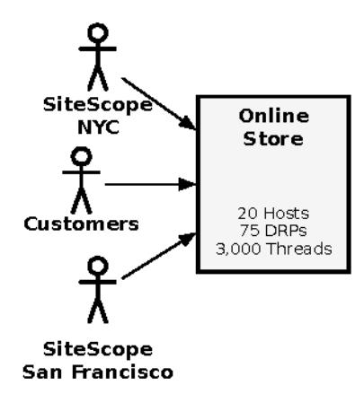
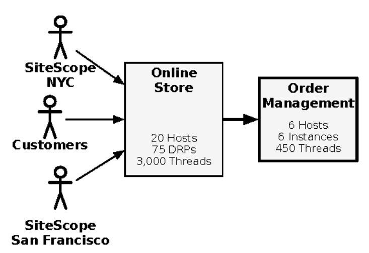
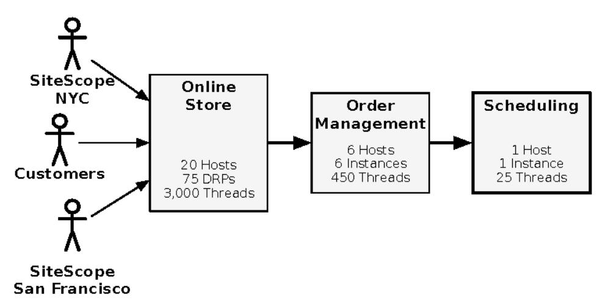

# Chapter 6: Case Study: Phenomenal Cosmic Powers, Itty-Bitty Living Space

In the middle 1500s, a Calabrian doctor named Aloysius Lilius invented a new calendar to fix a bug in the widely used Julian calendar. The Julian calendar had an accumulating drift. After a few hundred years, the official calendar date for the solstice would occur weeks before the actual event. Lilius's calendar used an elaborate system of corrections and countercorrections to keep the official calendar dates for the equinoxes and solstices close to the astronomical events. Over a 400-year cycle, the calendar dates vary by as much as 2.25 days, but they vary predictably and periodically; overall, the error is cyclic, not cumulative. This calendar, decreed by Pope Gregory XIII, became known as the Gregorian calendar rather than the Lilian calendar. (They just use your mind and they never give you credit. It's enough to drive you crazy if you let it.) The Gregorian calendar was eventually adopted by all European nations, although not without struggles, and even by Egypt, China, Korea, and Japan (with modifications for the latter three). Some nations adopted this calendar as early as 1582, while others adopted it only in the 1920s.

It's no wonder that the church decreed the calendar. The Gregorian calendar, like most calendars, was created to mark holy days (that is, holidays). It has since been used to mark useful recurring events in certain other domains that depend on the annual solar cycle, such as agriculture. No business in the world actually lives by the Gregorian calendar, though. The business community uses the dates as a convenient marker for its own internal business cycle.

Each industry has its own internal almanac. For a health insurance company, the year is structured around "open enrollment." All plans take their bearings from the open enrollment period. Florists' thinking is dominated by Valentine's

Day and Mother's Day. Upstream from them, Colombian flower growers center their agricultural year to produce the blossoms for those florists. These landmarks happen to be marked with specific dates on the Gregorian calendar, but in the minds of florists and their entire extended supply chain, those seasons have their own significance beyond the official calendar date.

For retailers, the year begins and ends with the euphemistically named "holiday season." Here we see a correspondence between various religious calendars and the retail calendar. Christmas, Hanukkah, and Kwanzaa all occur relatively close together. Since "Christmahannukwanzaakah" turns out to be difficult to say in meetings with a straight face, they call it the "holiday season" instead. Don't be fooled, though. Retailers' interest in the holiday season is strictly ecumenical—some might even call it cynical. Up to 50 percent of a retailer's entire annual revenue occurs between November 1 and December 31.

In the United States, Thanksgiving—the fourth Thursday in November—is the de facto start of the retail holiday season. By long tradition, this is when consumers start getting serious about gift shopping, because there are usually a little less than 30 days left in the season at that point. Apparently, motivation by deadline crosses religious boundaries. Shopper panic sets in, resulting in a collective phenomenon known as Black Friday. Retailers encourage and reinforce this by changing their assortment, increasing stocks in stores, and advertising wondrous things. Traffic in physical stores can quadruple overnight. Traffic at online stores can increase by 1,000 percent. This is the real load test, the only one that matters.

## Baby's First Christmas

My client had launched a new online store in the summer. The weeks and months following launch proved, time and time again, why launching a new site is like having a baby. You must expect certain things, such as being awakened in the middle of the night and routinely uncovering horrifying discoveries (as in, "Dear God! What have you been feeding this child...orange Play-Doh?" or "What? Why would they parse content during page rendering?") Still, for all the problems we experienced following the launch, we approached the holiday season with cautious optimism.

Our optimism was rooted in several factors. First, we had nearly doubled the number of servers in production. Second, we had hard data showing that the site was stable at current loads. A few burst events (mispriced items, mainly) had given us some traffic spikes to measure. The spikes were large enough to see where page latency started to climb, so we had a good feel for what level of load would cause the site to bog down. The third reason for our optimism

sprang from the confidence that we could handle whatever the site decided to throw at us. Between the inherent capabilities of the application server and the tools we had built around the application server, we had more visibility and control over the online store internals than any other system on which I've worked. This would ultimately prove to be the difference between a difficult but successful Thanksgiving weekend and an unmitigated disaster.

A few of us who had pulled weekend duty through Labor Day had been granted weekend passes. I had a four-day furlough to take my family to my parents' house three states away for Thanksgiving dinner. We had also scheduled a twenty-four-hour onsite presence through the weekend. As I said, we were executing *cautious* optimism. Bear in mind, we were the local engineering team; the main site operations center (SOC)—a facility staffed with highly skilled engineers twenty-four hours a day—was in another city. Ordinarily, they were the ones monitoring and managing sites during the nights and weekends. Local engineering was there to provide backup for the SOC, an escalation path when they encounter problems that have no known solution. Our local team was far too small to be on-site twenty-four hours a day all the time, but we worked out a way to do it for the limited span of the Thanksgiving weekend. Of course, as a former Boy Scout ("Be prepared"), I crammed my laptop into the packed family van, just in case.

## Taking the Pulse

When we arrived on Wednesday night, I immediately set up my laptop in my parents' home office. I can work anywhere I have broadband and a cell phone. Using their 3 MB cable broadband, I used PuTTY to log into our jumphost and start up my sampling scripts.

During the run-up to the launch, I was part of load testing this new site. Most load tests deliver results after the test is done. Since the data come from the load generators rather than inside the systems under test, it is a "black-box" test. To get more information out of the load test, I had started off using the application server's HTML administration GUI to check vitals like latency, free heap memory, active request-handling threads, and active sessions.

If you don't know in advance what you are looking for, then a GUI is a great way to explore the system. If you know exactly what you want, the GUI gets tedious. On the other hand, if you need to look at thirty or forty servers at a time, the GUI gets downright impractical.

To get more out of our load tests, I wrote a collection of Perl modules that would screen-scrape the admin GUI for me, parsing the HTML for values.

These modules would let me get and set property values and invoke methods on the components of the application server—built-in as well as custom. Because the entire admin GUI was HTML-based, the application server never knew the difference between a Perl module or a web browser. Armed with these Perl modules, I was able to create a set of scripts that would sample all the application servers for their vital stats, print out detail and summary results, sleep a while, and loop.

They were simple indicators, but in the time since site launch, all of us had learned the normal rhythm and pulse of the site by watching these stats. We knew, with a single glance, what was normal for noon on Tuesday in July. If session counts went up or down from the usual envelope, if the count of orders placed just looked wrong, we would know. It's really surprising how quickly you can learn to smell problems. Monitoring technology provides a great safety net, pinpointing problems when they occur, but nothing beats the pattern-matching power of the human brain.

## Thanksgiving Day

As soon as I woke up Thanksgiving morning, before I even had a cup of coffee, I hopped into my parents' office to check the stats windows I left running all night. I had to look twice to be sure of what I saw. The session count in the early morning already rivaled peak time of the busiest day in a normal week. The order counts were so high that I called our DBA to verify orders were not being double-submitted. They weren't.

By noon, customers had placed as many orders as in a typical week. Page latency, our summary indicator of response time and overall site performance, was clearly stressed but still nominal. Better still, it was holding steady over time, even as the number of sessions and orders mounted. I was one happy camper over turkey dinner. By evening, we had taken as many orders in one day as in the entire month to date. By midnight, we had taken as many orders as in the entire month of October—and the site held up. It passed the first killer load test.

## Black Friday

The next morning, on Black Friday, I ambled into the office after breakfast to glance at the stats. Orders were trending even higher than the day before. Session counts were up, but page latency was still down around 250 milliseconds, right where we knew it should be. I decided to head out around town with my mom to pick up the ingredients for chicken curry. (It would be

Thanksgiving leftovers for dinner on Friday, but I wanted to make the curry on Saturday, and our favorite Thai market was closed on Saturday.)

Of course, I wouldn't be telling this story if things didn't go horribly wrong. And things wouldn't go horribly wrong until I was well away from my access point. Sure enough, I got the call when I was halfway across town.

"Good morning, Michael. This is Daniel from the site operations center," said Daniel.

"I'm not going to like this, am I, Daniel?" I asked.

"SiteScope is currently showing red on all DRPs. We've been doing rolling restarts of DRPs, but they're failing immediately. David has a conference call going and has asked for you to join the bridge."

In the terse code we've evolved in our hundreds of calls, Daniel was telling me that the site was down, and down hard. SiteScope simulates real customers, as shown in the figure. When SiteScope goes red, we know that customers aren't able to shop and we're losing revenue. In an ATG site, page requests are handled by instances that do nothing but serve pages. The web server calls the application server via the Dynamo Request Protocol (DRP), so it's common to refer to the request-handling instances as DRPs. A red DRP indi-

cates that one of those request-handling instances stopped responding to page requests. "All DRPs red" meant the site was down, losing orders at a rate of about a million dollars an hour. "Rolling restart" meant they were shutting down and restarting the application servers as fast as possible. It takes about ten minutes to bring up all the application servers on a single host. You can do up to four or five hosts at a time, but more than that and the database response time starts to suffer, which makes the start-up process take longer. All together, it meant they were trying to tread water but were still sinking.

"OK. I'll dial in now, but I'm thirty minutes from hands on keyboard," I told him.

Daniel said, "I have the conference bridge and passcode for you."

"Never mind. I've got it memorized," I said.

1. ZZZ RUDFOH FRP DSSOLFDW¶LSFHOUVLIFOGFWINHFIRMLØSKIENM V FFFFPS100LØPWL©LGIKWPO

I dialed in and got a babel of voices. Clearly, a speakerphone in a conference room was dialed into the bridge as well. There's nothing like trying to sort out fifteen different voices in an echoing conference room, especially when other people keep popping in and out of the call from their desks, announcing such helpful information as, "There's a problem with the site." Yes, we know. Thank you and hang up, please.

## Vital Signs

The incident had started about twenty minutes before Daniel called me. The operations center had escalated to the on-site team. David, the operations manager, had made the choice to bring me in as well. Too much was on the line for our client to worry about interrupting a vacation day. Besides, I had told them not to hesitate to call me if I was needed.

We knew a few things at this point, twenty minutes into the incident:

- Session counts were very high, higher than the day before.
- Network bandwidth usage was high but not hitting a limit.
- Application server page latency (response time) was high.
- Web, application, and database CPU usage were low—really low.
- Search servers, our usual culprit, were responding well. System stats looked healthy.
- Request-handling threads were almost all busy. Many of them had been working on their requests for more than five seconds.

In fact, the page latency wasn't just high. Because requests were timing out, it was effectively infinite. The statistics showed us only the average of requests that completed. Response time is always a lagging indicator. You can only measure the response time on requests that are done. So whatever your worst response time may be, you can't measure it until the slowest requests finish.

Requests that didn't complete never got averaged in. Other than the long response time, which we already knew about since SiteScope was failing to complete its synthetic transactions, none of our usual suspects looked guilty.

To get more information, I started taking thread dumps of the application servers that were misbehaving. While I was doing that, I asked Ashok, one of our rockstar engineers who was on-site in the conference room, to check the backend order management system. He saw similar patterns on the back end as on the front end: low CPU usage and most threads busy for a long time.

It was now almost an hour since I got the call, or ninety minutes since the site went down. This means not only lost orders for my client but also that we were coming close to missing our SLA for resolving a high-severity incident. I hate missing an SLA. I take it personally, as do all of my colleagues.

## Diagnostic Tests

The thread dumps on the front-end application servers revealed a similar pattern across all the DRPs. A few threads were busy making a call to the back end, and most of the others were waiting for an available connection to call the back end. The waiting threads were all blocked on a resource pool, one that had no timeout. If the back end stopped responding, then the threads making the calls would never return, and the ones that were blocked would never get their chance to make their calls. In short, every single request-handling thread, all 3,000 of them, were tied up doing nothing, perfectly explaining our observation of low CPU usage: all 100 DRPs were idle, waiting forever for an answer that would never come.

Attention swung to the order management system. Thread dumps on that system revealed that some of its 450 threads were occupied making calls to an external integration point, as shown in the following figure. As you probably have guessed, all other threads were blocked waiting to make calls to that external integration point. That system handles scheduling for home delivery. We immediately paged the operations team for that system. (It's managed by a different group that does not have 24/7 support staff. They pass a pager around on rotation.)

I think it was about this time that my wife brought me a plate of leftover turkey and stuffing for dinner. Between status reports, I muted the phone to take quick bites. By that point, I had used up the battery on my cell phone and was close to draining the cordless phone. (I couldn't use a regular phone because none of them took my headset plug.) I crossed my fingers that my cell phone would get enough of a charge before the cordless phone ran out.

## Call In a Specialist

It felt like half of forever (but was probably only half an hour) when the support engineer dialed in to the bridge. He explained that of the four servers that normally handle scheduling, two were down for maintenance over the holiday weekend and one of the others was malfunctioning for reasons unknown. To this day, I have no idea why they would schedule maintenance for that weekend of all weekends!

That left us with a huge imbalance in the sizes of the systems, as shown in the following figure. The sole scheduling server that remained could handle up to twenty-five concurrent requests before it started to slow down and hang. We estimated that right then the order management system was probably sending it ninety requests. Sure enough, when the on-call engineer checked the lone scheduling server, it was stuck at 100 percent CPU. He had gotten paged a few times about the high CPU condition but had not responded, since that group routinely gets paged for transient spikes in CPU usage that turn out to be false alarms. All the false positives had quite effectively trained them to ignore high CPU conditions.

On the conference call, our business sponsor gravely informed us that marketing had prepared a new insert that hit newspapers Friday morning. The ad offered free home delivery for all online orders placed before Monday. The entire line, with fifteen people in a conference room on speakerphone and a dozen more dialed in from their desks, went silent for the first time in four hours.

So, to recap, we have the front-end system, the online store, with 3,000 threads on 100 servers and a radically changed traffic pattern. It's swamping the order management system, which has 450 threads that are shared between handling requests from the front end and processing orders. The order management system is swamping the scheduling system, which can barely handle twenty-five requests at a time.

And it's going to continue until Monday. It's the nightmare scenario. The site is down, and there's no playbook for this situation. We're in the middle of an incident, and we have to improvise a solution.

## Compare Treatment Options

Brainstorming ensued. Numerous proposals were thrown up and shot down, generally because the application code's behavior under those circumstances was unknown. It quickly became clear that the only answer was to stop making so many requests to check schedule availability. With the weekend's marketing campaign centered around free home delivery, we knew requests from the users were not about to slow down. We had to find a way to throttle the calls. The order management system had no way to do that.

We saw a glimmer of hope when we looked at the code for the store. It used a subclass of the standard resource pool to manage connections to order management. In fact, it had a separate connection pool just for scheduling requests. I'm not sure why the code was designed with a separate connection pool for that, probably an example of Conway's law, but it saved the day—and the retail weekend. Because it had a component just for those connections, we could use that component as our throttle.

If the developers had added an HQDE  $\phi$ H $\phi$ perty, it would have been a simple thing to set that to \ldot DQWHaybe we could do the next best thing, though. A resource pool with a zero maximum is effectively disabled anyway. I asked the developers what would happen if the pool started returning QX $\phi$ cetead of a connection. They replied that the code would handle that and present the user with a polite message stating that delivery scheduling was not available for the time being. Good enough.

## Does the Condition Respond to Treatment?

One of my Perl scripts could set the value of any property on any component. As an experiment, I used the script to set PD[for that resource pool (on just one DRP) to zero, and I set FKHRMW%QLPHMO7zero. Nothing happened. No change in behavior at all. Then I remembered that PD[has an effect only when the pool is starting up.

I used another script, one that could invoke methods on the component, to call its VWRS6HU2ndf WWDUW6HnddfNods. Voila! That DRP started handling requests again! There was much rejoicing.

Of course, because only one DRP was responding, the load manager started sending every single page request to that one DRP. It was crushed like the last open beer stand at a World Cup match. But at least we had a strategy.

### Recovery-Oriented Computing

The Recovery-Oriented Computing (ROC) project was a joint Berkeley and Stanford research project. The project's founding principles are as follows:

- Failures are inevitable, in both hardware and software.
- Modeling and analysis can never be sufficiently complete. A priori prediction of all failure modes is not possible.
- Human action is a major source of system failures.

Their research runs contrary to much of the prior work in system reliability. Whereas most work focuses on eliminating the sources of failure, ROC accepts that failures will inevitably happen—a major theme in this book! Their investigations aim to improve survivability in the face of failures.

The concepts of ROC were ahead of their time in 2005. Now they seem natural in the world of microservices, containers, and elastic scaling.

a. KWWLBFFVEHÐUHNGX

I ran my scripts, this time with the flag that said "all DRPs." They set PD[and FKHRNKW% CLIPHNO Zero and then recycled the service.

The ability to restart components, instead of entire servers, is a key concept of *recovery-oriented computing*. Although we didn't have the level of automation that ROC proposes, we were able to recover service without rebooting the world. If we had needed to change the configuration files and restart all the servers, it would have taken more than six hours under that level of load.

Dynamically reconfiguring and restarting just the connection pool took less than five minutes (once we knew what to do.)

Almost immediately after my scripts finished, we saw user traffic getting through. Page latency started to drop. About ninety seconds later, the DRPs went green in SiteScope. The site was back up and running.

## Winding Down

I wrote a new script that would do all the actions needed to reset that connection pool's maximum. It set the PD[property, stopped the service, and then restarted the service. With one command, an engineer in the operations center or in the "command post" (that is, the conference room) at the client's site could reset the maximum connections to whatever it needed to be. I would later learn that script was used constantly through the weekend. Because setting the max to zero completely disabled home delivery, the business sponsor wanted it increased when load was light and decreased to one (not zero) when load got heavy.

We closed out the call. I hung up and went to tuck my kids into bed. It took a while. They were full of news about going to the park, playing in the sprinkler, and seeing baby rabbits in the backyard. I wanted to hear all about it.
