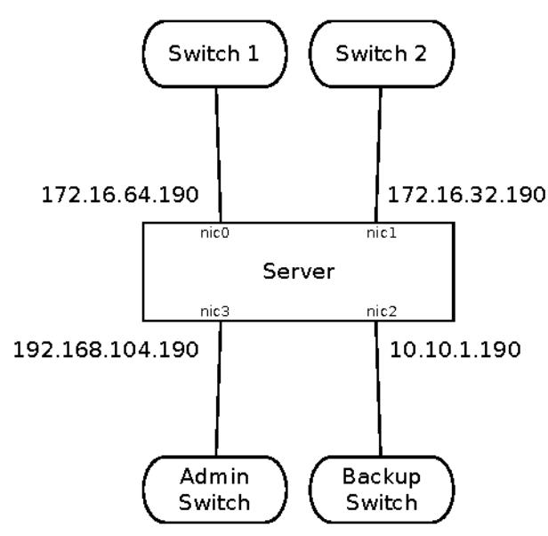

# Chapter 7: Foundations

In the last chapter, the operations team, my client, and I narrowly avoided a financial disaster. It was a difficult situation, and the "solution" was not exactly ideal. All of us would have been happier if it'd never happened. My team couldn't fix the underlying problem—the delivery scheduling servers were outside our control. But I was able to diagnose the problem, and the operations center partially mitigated its effects. That was only possible because we already had good visibility into the running system. There certainly wasn't time to add a bunch of logging calls inside the application. With runtime visibility, though, new logging wasn't necessary. The applications revealed their problems. To apply the solution, we exercised control over the running system. There's no way we could have recovered if we'd had to reboot the servers after every configuration change.

The next few chapters cover those key ingredients, leading us to a concept of "design for production." Design for production means thinking about production issues as first-class concerns. That includes the production network, which might be considerably different from your development environment. It also includes logging and monitoring, runtime control, and security. Design for production also means designing for the people who do operations, whether they are a dedicated ops team or integrated with development. Operators are users, too. They may not be logged in to a beautifully designed front-end application, but they get to interact with your system through its configuration, control, and monitoring interfaces. If your system's front end is Disney World, then operators get to use the secret tunnels beneath the park.

In the next several chapters, we will work through layers of concerns. As you can see in the figure on page 142, everything starts with the physical infrastructure. We'll discuss that in this chapter. The next chapters each zoom out one step at a time to encompass wider, more distributed concerns as we go.

## Operations

Security, availability, capacity, status, communication

### Control Plane

System monitoring, deployment, anomaly detection, features

#### Interconnect

Routing, load balancing, failover, traffic management

#### Instances

Services, processes, components, instance monitoring

### Foundation

Hardware, VMs, IP addresses, physical network

You may notice that the words "as a service" don't appear anywhere in the diagram above. The distinctions between "Infrastructure as a Service" and "Platform as a Service" were never strong to begin with. As vendors have sliced, diced, and triangulated their way across the landscape, those classifications have broken down completely. It's more useful to look at different technology platforms in terms of those layers of responsibility: Which layers do they drive/does the platform drive completely by API? Which responsibilities move from operations to developers, and in which layers? What responsibilities remain application-level concerns and what is moved behind software-driven abstractions?

This chapter starts with the first layer. Operations leads us into design for production considerations by looking at the physical fundamentals of the system: the machines and wires that everything else builds upon. The first order of business is to clear up some things about networks, hostnames, and IP addresses. After that, it's time to talk about the code holders: physical hosts, virtual machines, and containers. Each kind of deployment has its own set of concerns that software designs must account for. Finally, we'll look at some special concerns that arise when a system spans multiple data centers.

## Networking in the Data Center and the Cloud

Networking in the data center and the cloud takes more than opening a socket. These networks incorporate more redundancy and security than desktop networks. Add in a layer or two of virtualization, and applications and services can behave very differently than they do in the safe confines of the IDE. They require some additional work to behave properly in this environment.

### NICs and Names

One of the great misunderstandings in networking is about the hostname of a machine. That's because *hostname* can be defined in two distinct ways. First, a hostname is the name an operating system uses to identify itself. This is what you see when you run the "hostname" command. The administrator of the machine can set that hostname and the "default search domain." Together, the concatenation of the hostname and search domain is called the fully qualified domain name (FQDN.)

The second definition of hostname pertains to the external name of the system. Other computers expect to connect to the target machine using that hostname. When a program tries to connect to a particular hostname, it resolves that name via DNS. DNS resolves the desired name, maybe through a recursive query up to higher authorities, and ultimately returns an IP address.

Did you spot the discrepancy? There's no guarantee that the machine's own FQDN matches the FQDN that DNS has for its IP address. In other words, a machine may have its FQDN set to "spock.example.com" but have a DNS mapping as "mail.example.com" and "www.example.com." The fundamental disconnect is that a machine uses its hostname to identify the whole machine, while a DNS name identifies an IP address. Multiple DNS names can resolve to the same IP address. For load-balanced services, a DNS name can also resolve to multiple IP addresses. That means "DNS name to IP address" is a many-to-many relationship. But the machine still acts as if it has exactly one hostname. Many utilities and programs assume that the machine's self-assigned FQDN is a legitimate DNS name that resolves back to itself. This is largely true for development machines and largely untrue for production services.

There's another many-to-many relationship in the mix as well. A single machine may have multiple network interface controllers (NICs.) If you run "ifconfig" on a Linux or Mac machine, or "ipconfig" on a Windows machine, you'll probably see several NICs listed. Each NIC can be attached to a different network. Each active NIC gets an IP address on its particular network. This is called multihoming. Nearly every server in a data center will be multihomed.

A dev box usually has multiple NICs for the sake of mobility. One will be a wired Ethernet port (for those desktops or laptops that have wired Ethernet). Another NIC will be for Wi-Fi. Both of those have physical hardware handling them. A loopback NIC is a virtual device. It handles good old 127.0.0.1.

Data center machines are multihomed for different purposes. They enforce security by separating administration and monitoring onto a different network. They may improve performance by segmenting high-volume traffic, such as

backups, away from the production traffic. These networks have different security requirements, and an application that is not aware of the multiple network interfaces will easily end up accepting connections from the wrong networks. For example, it could accept administrative connections from the production network or offer production functionality over the backup network.

As shown in the following figure, this single server has four different network interfaces. The Unix convention is to use the driver type followed by a digit. In Linux, these would be HWKhrough HWKFor Solaris, they could be FH through FH or TIH through TIH, depending on the network card and driver version. Windows would give the interfaces incredibly long and unwieldy names by default.



Of the four interfaces, two of them are dedicated to "production" traffic. These handle the application's functionality. If the server is a web server, then these handle the incoming requests and send the replies back. In this example, both interfaces are for production traffic. Because these are running to different switches, the server appears to be configured for high availability. These two interfaces might be load balanced, or they might be set up as a failover pair. As shown, two different IP addresses will get packets to this server. That means there are probably DNS entries for both addresses. In other words, this machine has more than one name! It has its own internal hostname—the string returned by the KRVWQD@ntmand—but from the outside, more than one name reaches this host.

Another common configuration for multiple production interfaces is bonding, or teaming. In this configuration, both interfaces share a common IP address.

The operating system ensures that an individual packet goes out over only one interface. Bonded interfaces can be configured to automatically balance outbound traffic or to prefer one link or the other. Bonded interfaces that connect to different switches require some additional configuration on the switches, or else routing loops can result. You'll certainly be famous if you cause a routing loop in the data center, but not in a good way.

The two additional "back-end" interfaces are dedicated to special-purpose traffic. Because backups transfer huge volumes of data in bursts, they can clog up a production network. Therefore, good network design for the data center partitions the backup traffic onto its own network segment. These are sometimes handled by separate switches and sometimes just by separate VLANs on the production switches. With backup traffic partitioned off from the production network, application users don't necessarily suffer when the backups run. (They might, if the server doesn't have enough I/O bandwidth to process backups and application traffic at the same time. Nevertheless, users of *other* applications don't suffer when this server is being backed up.)

Finally, many data centers have a specific network for administrative access. This is an important security protection, because services such as SSH can be bound only to the administrative interface and are therefore not accessible from the production network. This can help if a firewall gets breached by an attacker or if the server handles an internal application and doesn't sit behind a firewall.

## Programming for Multiple Networks

This multitude of interfaces affects the application software. By default, an application that listens on a socket will listen for connection attempts on any interface. Language libraries always have an "easy" version of listening on a socket. The easy version just opens a socket on every interface on the host. Bad news! Instead, we have to do it the hard way and specify which IP address we are opening the socket for:

```
% D CD S S U R D F K
O Q H U U Q H W / L V W WH EDS

*R R CD S S U R D F K
O Q H U U Q H W / L V W WH EDS V S R F N H [ D P S O H F R P
```

To determine which interfaces to bind to, the application must be told its own name or IP addresses. This is a big difference with multihomed servers. In development, the server can always call its language-specific version of JHWRFDO+RVWbut on a multihomed machine, this simply returns the IP address associated with the server's internal hostname. This could be any of the interfaces,

depending on local naming conventions. Therefore, server applications that need to listen on sockets must add configurable properties to define to which interfaces the server should bind.

### Outbound Connections

Under exceedingly rare conditions, an application also has to specify which interface it wants traffic to *leave from* when connecting to a target IP address. For production systems, I would regard this as a configuration error in the host: it means multiple routes reach the same destination, hooked to different NICs.

The exception is when two NICs connected to two switches are bonded into a single interface. Suppose "en0" and "en1" are connected to different switches, but also bonded as "bond0." Without any additional guidance, an application opening an outbound connection won't know which interface to use. The solution is to ensure that the routing table has a default gateway using "bond0."

With that under our belts, we now have enough networking knowledge to talk about the hosts and the layers of virtualization on them.

## Physical Hosts, Virtual Machines, and Containers

At some level, all machines are the same. Eventually, all our software runs on some piece of precisely patterned silicon. All our data winds up on glass platters of spinning rust or encoded in minute charges on NAND gates. That's where the similarity ends. A bewildering array of deployment options force us to think about the machines' identities and lifespans. These aren't just packaging issues, either. A design that works nicely in a physical data center environment may cost too much or fail utterly in a containerized cloud environment. In this section, we'll look at these deployment options and how they affect software architecture and design for each kind of environment.

## Physical Hosts

The CPU is one place where the data center and the development boxes have converged. Pretty much everything these days runs a multicore Intel or AMD x86 processor running in 64-bit mode. Clock speeds are pretty much the same, too. If anything, development machines tend to be a bit beefier than the average pizza box in the data center these days. That's because the story in the data center is all about expendable hardware.

This is a *huge* shift from just ten years ago. Before the complete victory of commodity pricing and web scale, data center hardware was built for high reliability of the individual box. Our philosophy now is to load-balance services

across enough hosts that the loss of a single host is not catastrophic. In that environment, you want each host to be as cheap as possible.

There are two exceptions to this rule. Some workloads require large amounts of RAM in the box. Think "graph processing" rather than ordinary HTTP request/response applications. The other specialized workload is GPU computing. Some algorithms are "embarrassingly parallel," so it makes sense to run them across thousands of vector-processing cores.

Data center storage still comes in a bewildering variety of forms and sizes. Most of the useful storage won't be directly on the individual hosts. In fact, your development machine probably has more storage than one of your data center hosts will have. The typical data center host has enough storage to hold a bunch of virtual machine images and offer some fast local persistent space. Most of the bulk space will be available either as SAN or NAS. Don't be fooled by the similarity in those acronyms. Bloody trench wars have been fought between the two camps. (It's easier to make trenches in a data center than you might think. Just pop up a few raised floor panels.) To an application running on the host, though, both of them just look like another mount point or drive letter. Your application doesn't need to care too much about what protocol the storage speaks. Just measure the throughput to see what you're dealing with. Bonnie 64 will give you a reasonable view with a minimum of fuss. I

All in all, the picture is much simpler today than it once was. Design for production hardware for most applications just means building to scale horizontally. Look out for those specialized workloads and shift them to their own boxes. For the most part, however, our applications won't be running directly on the hardware. The virtualization wave of the early 2000s left no box behind.

### Virtual Machines in the Data Center

Virtualization promised developers a common hardware appearance across the bewildering array of physical configurations in the data center. It promised data center managers that it would rein in "server sprawl" and pack all those extra web servers running at 5 percent utilization into a high-density, high-utilization, easily managed whole. Guess which story turned out to be more compelling?

On the down side, performance is much less predictable. Many virtual machines can reside on the same physical hosts. It's rare to see VMs move from one host to another, because it's disruptive to the guest. (The "host

KWWSYRXEHIBBUQHWIMSHUFWVERQQLH

operating system" is the one that really runs on hardware. It provides the virtualization features. "Guest operating systems" run in the virtual machines.) Physical hosts are usually oversubscribed. That means the physical host may have 16 cores, but the total number of cores allocated to VMs on the host is 32. That host would be 200 percent subscribed or 100 percent *oversubscribed*. If all those applications receive requests at the same time, just through random chance, then there's not enough CPU to go around.

Almost any resource on the host can be oversubscribed, especially CPU, RAM, and network. Regardless of resource, the result is always the same: contention among VMs and random slowdowns for all. It's virtually impossible for the guest OS to monitor for this.

When designing applications to run in virtual machines (meaning pretty much *all* applications today) you must make sure that they're not sensitive to the loss or slowdown of any one host. That's just a good idea anyway, but it's particularly important here. Here are some things to watch out for:

- Distributed programming techniques that require synchronous responses from the whole cluster for work to proceed
- "Special" machines like cluster managers or lock managers, unless another machine can take over without reconfiguration
- Subtle dependency on request or event ordering—nobody designs this into a system, but it can creep in unexpectedly.

Virtual machines make all the problems with clocks much worse. Most programmers carry a mental model of the clock as being monotonic and sequential. That is, a program that samples the system clock may get the same value twice but it'll never get a value less than a prior response. It turns out that's not even true for a clock on a physical machine. But on a virtual machine it can be much worse. Between two calls to examine the clock, the virtual machine can be suspended for an indefinite span of real time. It might even be migrated to a different physical host that has a clock skew relative to the original host. A clock on a virtual machine is not necessarily monotonic or sequential. The virtualization tools try to paper over this with a little communication from the VM to query the host so the VM can update its OS clock whenever it wakes up. That keeps the VM's OS clock synced with the host's OS clock. From an application perspective, this makes the clock jump around even more. The bottom line is: don't trust the OS clock. If external, human time is important, use an external source like a local NTP server.

### Containers in the Data Center

Containers have invaded the data center, pushed there by developer insistence. Containers promise to deliver the process isolation and packaging of a virtual machine together with a developer-friendly build process. The container hypothesis says, "I'll never again have to ask if production matches QA."

Containers in the data center act a lot like virtual machines in the cloud (see *Virtual Machines in the Cloud*, on page 152). Any individual container only has a short-lived identity. As a result, it should not be configured on a per-instance basis. This can cause interesting effects with older monitoring systems (looking at you, Nagios!) that need to be reconfigured and bounced every time a machine is added or removed.

A container won't have much, if any, local storage, so the application must rely on external storage for files, data, and maybe even cache.

The most challenging part of running containers in the data center is definitely the network. By default, a container doesn't expose any of its ports (on its own virtual interface) on the host machine. You can selectively forward ports from the container to the host, but then you still have to connect them from one host to another. One common pattern that's developing is the *overlay network*. This uses virtual LANs (VLANs)—see *Virtual LANs for Virtual Machines*, on page 150—to create a virtual network just among the containers. The overlay network has its own IP address space and does its own routing with software switches running on the hosts. Within the overlay network, some control plane software manages the whole ensemble of containers, VLANs, IPs, and names.

A close second for "hardest problem in container-world" is making sure enough container instances of the right types are on the right machines. Containers are meant to come and go—part of their appeal is their very fast startup time (think milliseconds rather than minutes). But that means container instances will be like quantum foam burbling across all your hosts. Manually operating containers would be absurd. Instead, we delegate that job to another bit of control plane software. We describe our desired load out of the containers, and the software spreads container meringue across the physical hosts. The control software should know something about the geographic distribution of the hosts as well. That way it can allocate instances regionally for low latency while maintaining availability in case you lose a data center.

It seems natural that the same software should schedule container instances and manage their network settings, right? Solutions for running containers in data centers are emerging. None are dominant at this time, but packages like Kubernetes, Mesos, and Docker Swarm are attacking both the networking

### Virtual LANs for Virtual Machines

As if there weren't enough ways for a packet to hit a pocket on a socket on a port, we've got virtual LANs (VLANs) and virtual *extensible* LANs (VXLANs) to contend with. The idea of a VLAN is to multiplex Ethernet frames on a single wire but let the switch treat them like they came in from totally separate networks. The VLAN tag is a number from 1 to 4,094 that nestles into the physical routing portion of the header. Every network you encounter will support VLANs.

The operating system that runs a NIC can create a virtual device assigned to a virtual LAN. Then all the packets sent by that device will have that VLAN ID in them. That also means the virtual device must have its own IP address in a subnet assigned to that VLAN.

VXLAN takes the same idea but runs it at "layer 3," meaning it's visible to IP on the host. It also uses 24 more bits in the IP header, so a physical network can have more than 16 million VXLANs riding its wires.

At one time this was all the province of network engineers pulling cables around the data center. Virtualization and containers increasingly rely on software switches to handle dynamic updates. It will be common to see software switches running on the hosts, presenting a complete network environment to the containers that does the following:

- · Allows containers to "believe" they're on isolated networks
- Supports load-balancing via virtual IPs
- Uses a firewall as a gateway to the external network

While this technology matures, our container systems have to provide their own loadbalancing and need to be told which IP addresses and ports their peers are on.

and allocation problem. Whichever one solves this problem first will be able to truly claim the title of "operating system for the data center."

When you design an application for containers, keep a few things in mind. First, the whole container image moves from environment to environment, so the image can't hold things like production database credentials. Credentials all have to be supplied to the container. A 12-factor app handles this naturally. If you're not using that style, think about injecting configuration when starting the container. In either case, look into password vaulting.

The second thing to externalize is networking. Container images should not contain hostnames or port numbers. Again, that's because the setting needs to change dynamically while the container image stays the same. Links between containers are all established by the control plane when starting them up.

### The 12-Factor App

Originally created by engineers at Heroku, the 12-factor app is a succinct description of a cloud-native, scalable, deployable application. Even if you're not running in a cloud, it makes a great checklist for application developers.

The "factors" identify different potential impediments to deployment, with recommended solutions for each:

#### Codebase

Track one codebase in revision control. Deploy the same build to every environment.

#### Dependencies

Explicitly declare and isolate dependencies.

### Config

Store config in the environment.

### Backing services

Treat backing services as attached resources.

### Build, release, run

Strictly separate build and run stages.

#### Processes

Execute the app as one or more stateless processes.

#### Port binding

Export services via port binding.

### Concurrency

Scale out via the process model.

### Disposability

Maximize robustness with fast startup and graceful shutdown.

### Dev/prod parity

Keep development, staging, and production as similar as possible.

#### Logs

Treat logs as event streams.

### Admin processes

Run admin/management tasks as one-off processes.

See the website for greater detail on each of these recommendations.

a. KWWSVDFWQHW

Containers are meant to start and stop rapidly. Avoid long startup or initialization sequences. Some production servers take many minutes to load reference data or to warm up caches. These are not suited for containers. Aim for a total startup time of one second.

Finally, it's notoriously hard to debug an application running inside a container. Just getting access to log files can be a challenge. Don't even bother trying to figure out why some socket is being held open for too long. Containerized applications, even more than ordinary ones, need to send their telemetry out to a data collector.

### Virtual Machines in the Cloud

At the time of writing, Amazon Web Services is far and away the dominant cloud platform. Google Cloud is gaining traction thanks to an attractive pricing model, but it has a long way to go before its workload approaches AWS. The world can change pretty quickly, though. While advanced cloud features definitely help with lock-in, compute and storage capacity is more fungible.

It's evident now that traditional applications can run in the cloud. No matter what we say about "lift and shift" efforts, they do run. Despite that, a cloud native system will have better operational characteristics, especially in terms of availability and cost.

Any individual virtual machine in the cloud has worse availability than any individual physical machine (assuming equally skilled data center engineering and operations). If you think about it in terms of "moving parts," you'll see why that has to be the case. A virtual machine in the cloud runs atop a physical host, but with an extra operating system in the middle. It can be started or stopped without notice by the management APIs (in other words, the "control plane" software.) It also shares the physical host with other virtual machines and may contend for resources. If you've been running in AWS for any length of time, you'll have encountered virtual machines that got killed for no apparent reason. If you have long-running virtual machines, you may even have gotten a notice from AWS informing you that the machine has to be restarted (or else!).

Another factor that presents a challenge to traditional applications is the ephemeral nature of machine identity. A machine ID and its IP address are only there as long as the machine keeps running. Most traditional application configurations keep hostnames or IP addresses in config files. But in AWS, a VM's IP address changes on every boot. If your application needs to keep

those addresses in files, then you have to rent Elastic IP addresses from Amazon. That works well enough until you need a lot of them. A basic AWS account has a limit on how many addresses it can procure.

The general rule is that VMs have to "volunteer" to do work, rather than having a controller dole the work out. That means a new VM should be able to start up and join whatever pool of workers handles load. For HTTP requests, autoscaling and load balancers (either elastic load balancers or application load balancers) are the way to go. For asynchronous load, use competing consumers on a queue.

When it comes to network interfaces on those cloud VMs, the default is pretty simple: one NIC with a private IP address. This isn't always what you want, though. There's a limit to how much traffic a single NIC can support, based on the number of sockets available. Socket numbers only range from 1 to 65535, so at best a single NIC can support about 64,000 connections. You may want to set up more production NICs just to handle more simultaneous connections. Another good reason to set up another NIC is for monitoring and management traffic. In particular, it's a bad idea to have SSH ports available on front-end NICs for every server. It's better to set up a single entry point (a "bastion" or "jumphost" server) with strong logging on SSH connections and then use the private network to get from there to other VMs.

Networking these VMs together presents its own set of challenges and solutions.

### Containers in the Cloud

Containers on cloud VMs combine the challenges of both containers and the cloud. The containers have short-lived, ephemeral identities. Connecting them means linking ports across different VMs, possibly in different zones or regions. Designing individual services to run in this kind of deployment is not that much different from designing them to run in containers in the data center. Most of the big challenges arise from building those containers into a whole system. In a sense, using containers pushes some complexity out of the boxes and into the control plane. (We'll look at the control plane in Chapter 10, Control Plane, on page 193.)

## Wrapping Up

The range of deployment environments has widened thanks to cloud computing and platform-as-a-service offers. These environments move the boundary of responsibility back and forth between application development, platform

development, operations, and infrastructure. Despite that, some considerations are common to every kind of environment:

- How is the network structured? Is there just one or are there several? Will a machine have NICs on different networks with different jobs?
- Do machines have long-lasting identities?
- Are machines automatically set up and torn down? If so, how do we manage the images for them?

Finding or building the answer to these questions never appears on a Kanban board or a Jira ticket, but they're essential to making a smooth transition to operations.

Given a stable foundation to build upon, we need to look at how individual machine instances in that environment will behave and how we will control them. We'll look at those issues in the next chapter.
