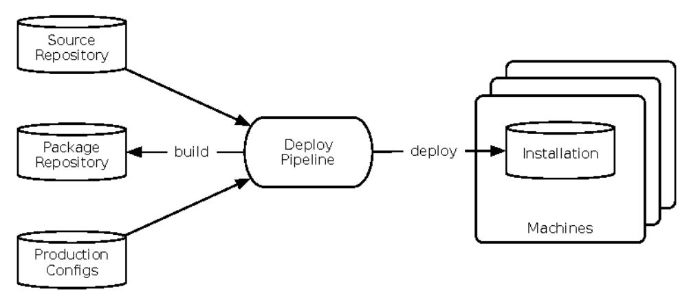
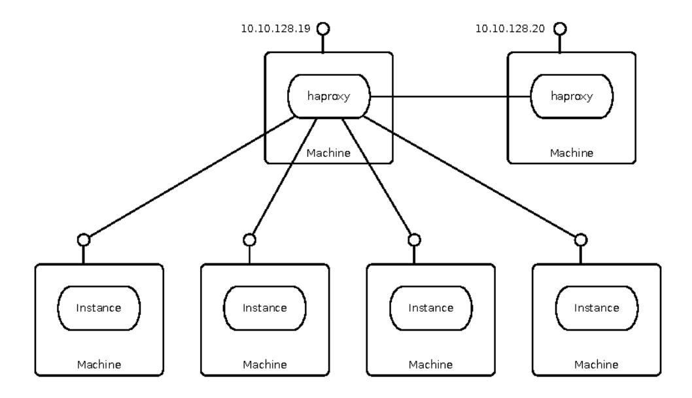
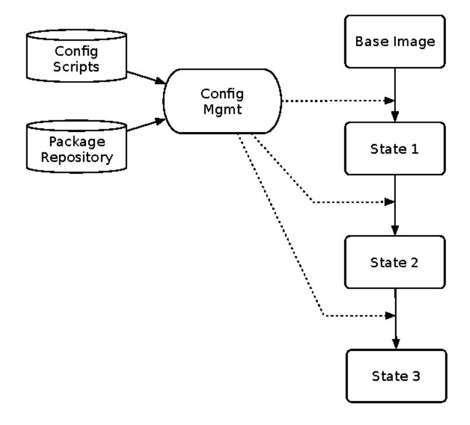
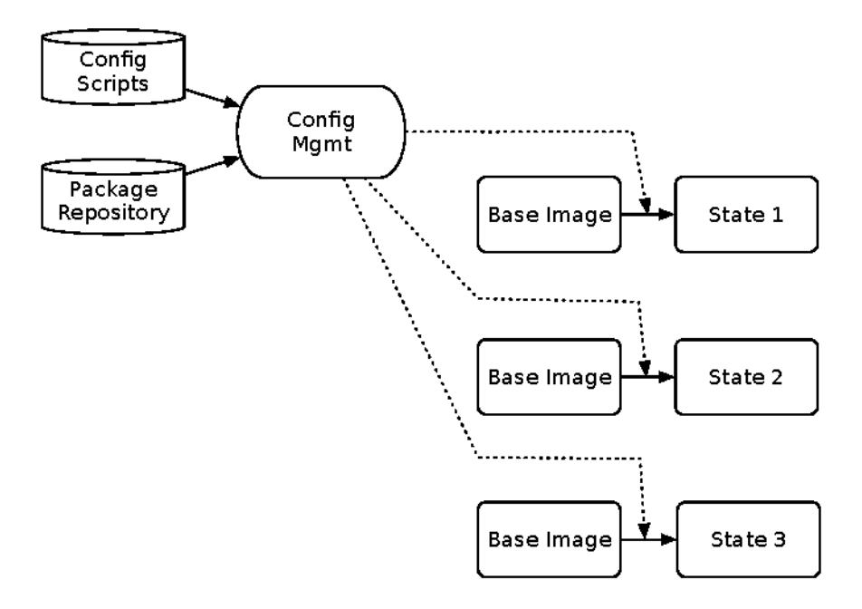

# Chapter 8: Processes on Machines

In the last chapter, we looked at a diverse set of network and physical environments that our software may be deployed into. In this chapter, we're going to focus on the individual instances. They need to be good citizens by providing transparency, accepting control, handling configuration nicely, and managing connections. We'll see some natural overlap with the stability patterns from Chapter 5, Stability Patterns, on page 91, since it's the job of each instance to accept stress and insults with tolerance and grace.

In the car business, they say the engine needs fuel, fire, and air to work. Our version of that is code, config, and connection. Every machine needs the right code, configuration, and network connections. One problem we're going to run into is that our vocabulary hasn't really kept up with our technology. For instance, when some people say "server" they might mean a virtual machine running on a physical host in their data center. Others might mean a process inside an operating system, rather than a whole machine image. Technology like containers blur the lines further. A process in a container is also a process on the operating system that hosts the container. Which one should we call the "server?" At the risk of seeming hopelessly pedantic, we'll try to agree on some terms that may help disambiguate the rest of this section.

Service A collection of processes across machines that work together to deliver a unit of functionality. A service may have processes from multiple executables (for example, application code plus a database). One service may present a single IP address with load balancing behind the scenes. (More on that in Chapter 9, Interconnect, on page 171.) On the other hand, it may have multiple IP addresses using the same DNS name.

Instance An installation on a single machine (container, virtual, or physical) out of a load-balanced array of the same executable. A service can be made of multiple different types of executables, but when we talk about

instances we refer to processes of the same executable, just running in multiple locations.

Executable An artifact that a machine can launch as a process and created by a build process. In a compiled language, this will be a binary, whereas an interpreted language will include sources. For simplicity, "executable" also covers shared libraries that need to be installed before execution.

*Process* An operating system process running on a machine; the runtime image of an executable.

Installation The executable and any attendant directories, configuration files, and other resources as they exist on a machine.

Deployment The act of creating an installation on a machine. Should be automated, with the deployment definition kept in source control.

To make this more concrete, take a look at the "Loan Request" service shown in the following deployment illustration.

In the deployment view, we're concerned about transforming sources into binaries and binaries into deployments. This involves moving files around. The build process compiles the source code into binary executables that go into the package repository. As a build progresses through the deployment pipeline, various stages tag the build as having passed. If the build makes it all the way through the pipeline, the very same tagged binary gets laid down as an installation on each machine. All these files are inert during deployment. Now let's look at the runtime view, shown in the figure on page 157.

In the runtime view, we're more concerned with the processes running on the machines. (By the way, a lot of architectural confusion stems from attempts to cram both static and dynamic views into the same figure.) Each machine runs an instance of the same binary: our compiled service. Those instances

all sit behind an HAProxy load balancer with the address 10.10.128.19 bound to the DNS name loanrequest.example.com.

These definitions may seem persnickety, but teams have been bitten when different people use the same word for different things. Precise communication is especially important when dealing with operations. If you tell someone to "reboot the server," you might not know which server they're about to bounce, and you can't be sure whether they're going to kill a single process or the whole machine. 1

Now we can turn our attention to the code, config, and connection the instances require.

## Code

Even before we get to questions about containers versus VM images, we should look at some things about the code.

## Building the Code

Developers naturally pay a lot of attention to their code. As a result, we have great tools at our disposal to build, house, and deploy code. There are some important rules to follow, though. These are mostly about making sure that you know exactly what goes into the code on the instance. It is vital to establish a strong "chain of custody" that stretches from the developer through

1. KWW SWKHDJLOHDGPLQ FRP ORR VHHOFILS/VLR/QQNQ VOXOLOSJAX BUH

to the production instance. It must be impossible for an unauthorized party to sneak code into your system.

It starts at the desktop. Developers should work on code within a version control system. There's simply no excuse not to use version control today. Only the code goes into version control, though. Version control doesn't handle third-party libraries or dependencies very well.

Developers must be able to build the system, run tests, and run at least a portion of the system locally. That means build tools have to download dependencies from *somewhere* to the dev box. The default would be to download libraries from the Internet. (The standard joke for Maven users is that Maven downloads half of the Internet to run a build.)

Downloading dependencies from the Internet is convenient but not safe. It's far too easy for one of those dependencies to silently be replaced, either though a man-in-the-middle attack or by compromising the upstream repository. Even if you download dependencies from the Net to start with, you should plan on moving to a private repository as soon as possible. Only put libraries into the repository when their digital signatures match published information from the upstream provider.

Don't forget about plugins to the build system, either. A colleague who asked not to be named described an attempt to subvert his company's product in order to attack one of its enterprise customers. That attack was introduced via a compromised Jenkins plugin.

Developers should not do production builds from their own machines. Developer boxes are hopelessly polluted. We install all kinds of junk on these systems. We play games and visit sketchy websites. Our browsers get loaded up with slimy toolbars and bogus "search enhancers" like any other human user does. Only make production builds on a CI server, and have it put the binary into a safe repository that nobody else can write into.

## Immutable and Disposable Infrastructure

Configuration management tools like Chef, Puppet, and Ansible are all about applying changes to running machines. They use scripts, playbooks, or recipes (each has their own jargon) to transition the machine from one state to a new state. After each set of changes, the machine should be fully described by the latest scripts, as shown in the figure on page 159.

The "layers of stucco" approach has two big challenges. First, it's easy for side effects to creep in that are the result of, but not described by, the recipes. For

example, suppose a Chef recipe uses RPM to install version 12.04 of a third-party package. That package has a post-install script that changes some TCP tuning parameters. A month later, Chef installs a newer version of the RPM, but the new RPM's post-install changes a subset of the original parameters. Now the machine has a state that *cannot* be re-created by either the original or the new recipes. That state is the result of the history of the changes.

The second challenge comes from broken machines or scripts that only partially worked. These leave the machine in an undefined state. The configuration management tools put a lot of effort into converging unknown machine states into known machine states, but they aren't always successful.

The DevOps and cloud community say that it's more reliable to always start from a known base image, apply a fixed set of changes, and then never attempt to patch or update that machine. Instead, when a change is needed, create a new image starting from the base again, as shown in the figure on page 160.

This is often described as "immutable infrastructure." Machines don't change once they've been deployed. Take a container as an example. The container's "file system" is a binary image from a repository. It holds the code that runs on the instance. When it's time to deploy new code, we don't patch up the container; we just build a new one instead. We launch it and throw away the old one.

That notion of disposability puts the emphasis in the right place. The important part is that we can throw away the environment, piece by piece or as a whole, and start over.

## Configuration

Every piece of production-class software has scads of configurable properties containing hostnames, port numbers, filesystem locations, ID numbers, magic keys, usernames, passwords, and lottery numbers. Get any of these properties wrong and the system is broken. Even if the system seems to work most of the time, it could break at 1 a.m. when Daylight Saving Time kicks in.

"Configuration" suffers from hidden linkages and high complexity—two of the biggest factors leading to operator error. This puts the system at risk because configuration is part of the system's user interface. It's the interface used by one of its most overlooked constituencies: the developers and operators who support it. Let's look at some design guidelines for handling instance-level configuration.

## Configuration Files

The configuration "starter kit" is a file or set of files the instance reads at startup. Configuration files may be buried deep in the directory structure of

the codebase, possibly in multiple directories. Some of them represent basic application plumbing like API routes. Others need to change per environment.

Because the same software runs on several instances, some configuration properties should probably vary per machine. Keep these properties in separate places so nobody ever has to ask, "Are those supposed to be different?"

We don't want our instance binaries to change per environment, but we do want their properties to change. That means the code should look outside the deployment directory to find per-environment configurations.

These files contain the most sensitive information in the entire enterprise: production database passwords. They need to be protected from tampering and prying eyes. That leads us to another great reason to keep per-environment configuration out of the source tree: version control. Sooner or later, you'll accidentally commit a production password to version control. GitHub currently shows 288,093 commits with the title "Removed password." Tomorrow that number will be higher.

That's not to say you should keep configurations out of version control altogether. Just keep them in a different repository than the source code. Lock it down to only the people who should have access, and make sure you have controls (i.e., processes, procedures, and people following up on them) to grant and revoke access to those configurations.

## Configuration with Disposable Infrastructure

In image-based environments like EC2 or a container platform, configuration files can't change per instance. Frankly, some of the instances will be there and gone so fast that it doesn't make any sense to apply static configs. There we need to find another way to provide a new instance with details about its mission in life. The two approaches are to inject configuration at startup or use a configuration service.

Injecting configuration works by providing environment variables or a text blob. For example, EC2 allows "user data" to be passed to a new virtual machine as a blob of text. To use the user data, some code in the image must already know how to read and parse it (for example, it might be in properties format, but it might be JSON or YAML, too). Heroku prefers environment variables. So the application code does need some awareness of its targeted deployment environment.

The other way to get configuration into an image is via a configuration service. In this form, the instance code reaches out to a well-known location to ask

for its configuration. ZooKeeper and etcd are both popular choices for a configuration service. Because this builds a hard dependency on the config service, any downtime is immediately a "Severity 1" problem. Instances cannot start up when the config service is not available, yet by definition we're in an environment where instances start and stop frequently.

Be very careful here. ZooKeeper and etcd—and any other configuration service, for that matter—are complex pieces of distributed systems software. They must have a well-planned network topology to maximize availability, and they must be managed very carefully for capacity. ZooKeeper is scalable but not elastic, and adding and removing nodes is disruptive. In other words, these services require a high degree of operational maturity and carry some noticeable overhead. It's not worth introducing them to support just one application. Only use them as part of a broader strategy for your organization. Most small teams are better off using injected config.

### Naming Configuration Properties

Property names should be clear enough to help the user avoid "unforced errors." When you see a property called KRVWQ.thow do you know which hostname to fill in? Is that "my hostname," "the name of the authorized caller," or "the host I call during the autumnal solstice?" It's better to name the properties according to their function, not their nature. Don't call it KRVWQ.thet because it is a hostname. That's like naming a variable LQWHbettuse it's an integer or VWUbettause it's a string. It may be true, but it's not helpful. Name it DXWKHQWURTWCTTALCAU, and then the admin knows to look for an LDAP or Active Directory host.

## Transparency

Shipboard engineers can tell when something is about to go wrong by the sound of the giant diesel engines. They've learned, by living with their engines, to recognize normal, nominal, and abnormal. They are constantly surrounded by the sounds and rhythms of their environment. When something is wrong, the engineers' knowledge of the linkages within the engines can lead them to the problem with speed and accuracy—and with just one or two clues—in a way that can seem psychic.

The power plant in a ship radiates information through ambient sounds and vibration, through gauges with quantitative information, and in extreme (usually bad) cases through smell. Our systems aren't so naturally exposed. They run in invisible, faceless, far-distant boxes. We don't see or hear the fans spin. No giant reel-to-reel tape drives whiz back and forth. If we are to get the kind of "environmental awareness" that the shipboard engineers

naturally acquire, we must facilitate that awareness by building *transparency* into our systems.

Transparency refers to the qualities that allow operators, developers, and business sponsors to gain understanding of the system's historical trends, present conditions, instantaneous state, and future projections. Transparent systems communicate, and in communicating, they train their attendant humans.

In debugging the "Black Friday problem" (see Chapter 6, Case Study: Phenomenal Cosmic Powers, Itty-Bitty Living Space, on page 129), we relied on component-level visibility into the system's current behavior. That visibility was no accident. It was the product of enabling technologies implemented with transparency and feedback in mind. Without that level of visibility, we probably could've known that the site was slow (if a disgruntled user called us or someone in the business happened to hit the site) but have no idea why. It would be like having a sick goldfish—nothing you do can help, so you just wait and see whether it lives or dies.

Debugging a transparent system is vastly easier, so transparent systems will mature faster than opaque ones.

When making technical or architectural changes, you are totally dependent on data collected from the existing infrastructure. Good data enables good decision-making. In the absence of trusted data, decisions will be made for you based on somebody's political clout, prejudices, or whoever has the best "executive style" hair.

Finally, a system without transparency cannot survive long in production. If administrators don't know what the system is doing, it can't be tuned and optimized. If developers don't know what works and doesn't work in production, they can't increase its reliability or resilience over time. And if the business sponsors don't know whether they're making money on it, they won't fund future work. Without transparency, the system will drift into decay, functioning a bit worse with each release. Systems can mature well if, and only if, they have some degree of transparency.

This section takes our first slice at transparency. We'll see what machine and service instances must do to create transparency. Later, in Chapter 10, Control Piane, on page 193, we see how to knit instance-level information with other sources to create system-level transparency. That system-level view will provide historical analysis, present state, instantaneous behavior, and future projections. The job of an individual instance is to reveal enough data to enable those perspectives.

### Designing for Transparency

Transparency arises from deliberate design and architecture. "Adding transparency" late in development is about as effective as "adding quality." Maybe it can be done, but only with greater effort and cost than if it'd been built in from the beginning.

Visibility inside one application or server is not enough. Strictly local visibility leads to strictly local optimization. For example, a retailer ran a major project to get items appearing on the site faster. The nightly update was running until 5 or 6 a.m., when it needed to complete closer to midnight. This project optimized the string of batch jobs that fed content to the site. The project met its goals, in that the batch jobs finished two hours earlier. Items still did not appear on the site, however, until a long-running parallel process finished, at 5 or 6 a.m. The local optimization on the batch jobs had no global effect.

Visibility into one application at a time can also mask problems with scaling effects. For instance, observing cache flushes on one application server would not reveal that each server was knocking items out of all the other servers' caches. Every time an item was displayed, it was accidentally being updated, therefore causing a cache invalidation notice to all other servers. As soon as all the caches' statistics appeared on one page, the problem was obvious. Without that visibility, we would've added many servers to reach the necessary capacity—and each server would've made the problem worse.

In designing for transparency, keep a close eye on coupling. It's relatively easy for the monitoring framework to intrude on the internals of the system. The monitoring and reporting systems should be like an exoskeleton built around your system, not woven into it. In particular, decisions about what metrics should trigger alerts, where to set the thresholds, and how to "roll up" state variables into an overall system health status should all be left outside of the instance itself. These are policy decisions that will change at a very different rate than the application code will.

## Enabling Technologies

By its nature, a process running on an instance is totally opaque. Unless you're running a debugger on the process, it reveals practically nothing about itself. It might be working fine, it might be running on its very last thread, or it might be spinning in circles doing nothing. Like Schrödinger's cat, it's impossible to tell whether the process is alive or dead until you look at it.

The very first trick, then, is getting information out of the process. This section examines the most important enabling technologies that reduce the opacity

of that process boundary. You can classify these as either "white-box" or "black-box" technologies.

A black-box technology sits outside the process, examining it through externally observable things. Black-box technologies can be implemented after the system is delivered, usually by operations. Even though black-box technologies are unknown to the system being observed, you can still do helpful things during development to facilitate the use of these tools. Good logging is one example. Instances should log their health and events to a plain old text file. Any log-scraper can collect these without disturbing the server process.

By contrast, white-box technology runs inside the process. This kind of technology often looks like an agent delivered in a language-specific library. These must be integrated during development. White-box technologies necessarily have tighter coupling to the language and framework than black-box technologies.

White-box technology often comes with an API that the application can call directly. This provides a great increase in transparency, because the application can emit very specific, relevant events and metrics. It comes at the cost of coupling to that provider. That coupling is a small price to pay when compared to the degree of clarity it provides.

### Logging

Despite millions of R&D dollars on "enterprise application management" suites and spiffy operations centers with giant plasma monitors showing color-coded network maps, good old log files are still the most reliable, versatile information vehicle. It's worth a chuckle once in a while to realize that here we are, in the twenty-first century, and log files are still one of our most valuable tools.

Logging is certainly a white-box technology; it must be integrated pervasively into the source code. Nevertheless, logging is ubiquitous for a number of good reasons. Log files reflect activity within an application. Therefore, they reveal the instantaneous behavior of that application. They're also persistent, so they can be examined to understand the system's status—though that often requires some "digestion" to trace state transitions into current states.

If you want to avoid tight coupling to a particular monitoring tool or framework, then log files are the way to go. Nothing is more loosely coupled than log files; every framework or tool that exists can scrape log files. This loose coupling means log files are also valuable in development, where you are less likely to find ops tools.

Even in the face of this value, log files are badly abused. Here are some keys to successful logging.

### Log Locations

Despite what all those application templates create for us, a OR Mirectory under the application's install directory is the wrong way to go. Log files can be large. They grow rapidly and consume lots of I/O. For physical machines, it's a good idea to keep them on a separate drive. That lets the machine use more I/O bandwidth in parallel and reduces contention for the busy drives.

Even if your instance runs in a VM, it's still a good idea to separate log files out from application code. The code directory needs to be locked down and have as little write permission as possible (ideally, none).

Apps running in containers usually just emit messages on standard out, since the container itself can capture or redirect that.

If you make the log file locations configurable, then administrators can just set the right property to locate the files. If you don't make the location configurable, then they'll probably relocate the files anyway, but you might not like how it gets done. Odds are it'll involve a lot of symlinks.

On UNIX systems, symlinks are the most common workaround. This involves creating a symbolic link from the OR Wrectory to the actual location of the files. There's a small I/O penalty on each file open, but not much compared to the penalty of contention for a busy drive. I've also seen a separate filesystem dedicated to logs mounted directly underneath the installation directory.

### Logging Levels

As humans read (or even just scan) log files for a new system, they learn what "normal" means for that system. Some applications, particularly young ones, are very noisy; they generate a lot of errors in their logs. Some are quiet, reporting nothing during normal operation. In either case, the applications will train their humans on what's healthy or normal.

Most developers implement logging as though they are the primary consumer of the log files. In fact, administrators and engineers in operations will spend far more time with these log files than developers will. Logging should be aimed at production operations rather than development or testing. One consequence is that anything logged at level "ERROR" or "SEVERE" should be something that requires action on the part of operations. Not every exception needs to be logged as an error. Just because a user entered a bad credit card number and the validation component threw an exception doesn't

mean anything has to be done about it. Log errors in business logic or user input as warnings (if at all). Reserve "ERROR" for a serious system problem. For example, a circuit breaker tripping to "open" is an error. It's something that should not happen under normal circumstances, and it probably means action is required on the other end of the connection. Failure to connect to a database is an error—there's a problem with either the network or the database server. A 1 X ORDAX W HH S[Wish & automatically an error.

### Debug Logs in Production

While I'm on the subject of logging levels, I'll address a pet peeve of mine: "debug" logs in production. This is rarely a good idea and can create so much noise that real issues get buried in tons of method traces or trivial checkpoints. It's easy to leave debug messages turned on in production. All it takes is one wrong commit with debug levels enabled. I recommend adding a step to your build process that automatically removes any configs that enable debug or trace log levels.

#### Human Factors

Above all else, log files are human-readable. That means they constitute a human-computer interface and should be examined in terms of human factors. This might sound trivial—even laughable—but in a stressful situation, such as a Severity 1 incident, human misinterpretation of status information can prolong or aggravate the problem. Operators for the Three Mile Island reactor misinterpreted the meaning of coolant pressure and temperature values, leading them to take exactly the wrong action at every turn. (See *Inviting Disaster [Chi01]*, pages 49–63.) Although most of our systems will not vent radioactive steam when they break, they will expel our money and our reputation. Therefore, it behooves us to ensure that log files convey clear, accurate, and actionable information to the humans who read them.

If log files are a human interface, then they should also be written such that humans can recognize and interpret them as rapidly as possible. The format should be as readable as possible. Formats that break columns and create a ragged left-to-right scanning pattern are not human-readable.

#### Voodoo Operations

As I said before, humans are good at detecting patterns. In fact, we appear to have a natural bias toward detecting patterns, even when they aren't there. In Why People Believe Weird Things [She97], Michael Shermer discusses the evolutionary impact of pattern detection. Early humans who failed to detect a real pattern—such as a pattern of light and shadow that turned out to be

a leopard—were less likely to pass on their genes than those who detected patterns that weren't there and ran away from a clump of bushes that happened to look like a leopard.

In other words, the cost of a false positive—"detecting" a pattern that wasn't —was minimal, whereas the cost of a false negative—failing to detect a pattern that was there—was high. Shermer claims that this evolutionary pressure creates a tendency toward superstitions. I've seen it in action.

Given a system on the verge of failure, administrators in operations have to proceed through observation, analysis, hypothesis, and action very quickly. If that action appears to resolve the issue, it becomes part of the lore, possibly even part of a documented knowledge base. Who says it was the right action, though? What if it's just a coincidence?

I once found a practice in the operations group for one of my early commerce applications that was no better than witchcraft. I happened to be in an administrator's cubicle when her pager went off. On seeing the message, she immediately logged into the production server and started a database failover. Curious, and more than a little alarmed, I asked what was going on. She told me that this one message showed that a database server was about to fail, so they had to fail over to the other node and restart the primary database. When I looked at the actual message, I got cold shivers. It said, "Data channel lifetime limit reached. Reset required."

Naturally, I recognized that message, having written it myself. The thing was, it had nothing at all to do with the database. It was a debug message (see <u>Debug Logs in Production</u>, on page 167) informing me that an encrypted channel to an outside vendor had been up and running long enough that the encryption key would soon be vulnerable to discovery, just because of the amount of encrypted data that the channel served. It happened about once a week.

Part of the problem was the wording of the message. "Reset required" doesn't say *who* has to do the reset. If you looked at the code, it was clear that the application itself reset the channel right after emitting that message—but the consumers of the message didn't have the code. Also, it was a debug message that I had left enabled so I could get an idea of how often it happened at normal volumes. I just forgot to ever turn it off.

I traced the origin of this myth back about six months to a system failure that happened shortly after launch. That "Reset required" message was the last thing logged before the database went down. There was no causal connection, but there was a temporal connection. (There was no advance warning about the database crash—it required a patch from the vendor, which we had

applied shortly after the outage.) That temporal connection, combined with an ambiguous, obscurely worded message, led the administrators to perform weekly database failovers during peak hours for six months.

### Final Notes on Logging

Messages should include an identifier that can be used to trace the steps of a transaction. This might be a user's ID, a session ID, a transaction ID, or even an arbitrary number assigned when the request comes in. When it's time to read ten thousand lines of a log file (after an outage, for example), having a string to June Swill save tons of time.

Interesting state transitions should be logged, even if you plan to use SNMP traps or JMX notifications to inform monitoring about them. Logging the state transitions takes a few seconds of additional coding, but it leaves options open downstream. Besides, the record of state transitions will be important during postmortem investigations.

### Instance Metrics

The instance itself won't be able to tell much about overall system health, but it should emit metrics that can be collected, analyzed, and visualized centrally. This may be as simple as periodically spitting a line of stats into a log file. The stronger your log-scraping tools are, the more attractive this option will be. Within a large organization, this is probably the best choice.

An ever-growing number of systems have outsourced their metrics collection to companies like New Relic and Datadog. In these cases, providers supply plugins to run with different applications and runtime environments. They'll have one for Python apps, one for Ruby apps, one for Oracle, one for Microsoft SQL Server, and so on. Small teams can get going much faster by using one of these services. That way you don't have to devote time to the care and feeding of metrics infrastructure—which can be substantial. Some developers from Netflix have quipped that Netflix is a monitoring system that streams movies as a side effect.

### Health Checks

Metrics can be hard to interpret. It takes some time to learn what "normal" looks like in the metrics. For quicker, easier summary information we can create a health check as part of the instance itself. A health check is just a page or API call that reveals the application's internal view of its own health. It returns data for other systems to read (although that may just be nicely attributed HTML).

Health checks should be more than just "yup, it's running." It should report at least the following:

- · The host IP address or addresses
- The version number of the runtime or interpreter (Ruby, Python, JVM, .Net, Go, and so on)
- · The application version or commit ID
- Whether the instance is accepting work
- The status of connection pools, caches, and circuit breakers

The health check is an important part of traffic management, which we'll examine further in Chapter 9, *Interconnect*, on page 171. Clients of the instance shouldn't look at the health check directly; they should be using a load balancer to reach the service. The load balancer can use the health check to tell if a machine has crashed, but it can also use the health check for the "go live" transition, too. When the health check on a new instance goes from failing to passing, it means the app is done with its startup.

## Wrapping Up

Instances are the basic blocks that make up our system. They're like cobble-stone Minecraft blocks—not that interesting by themselves, but we can make amazing things out of them. If we do a good job of building code to run in instances, then we can make a solid large-scale structure. That means instances should be designed for production. We've seen how to make them deployable, configurable, and monitorable. Now we need to look at how we can connect instances together into a whole system. This "interconnect" layer provides many of our most important mechanisms for availability and security, yet it often gets overlooked. In the next chapter we'll see how to design this important layer for production.
