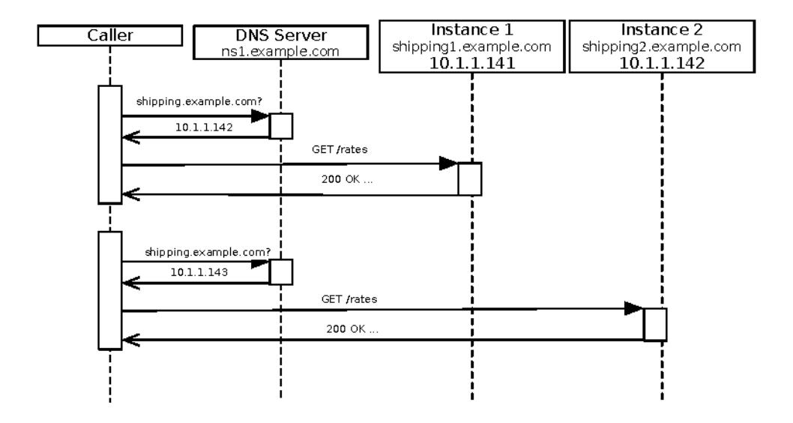
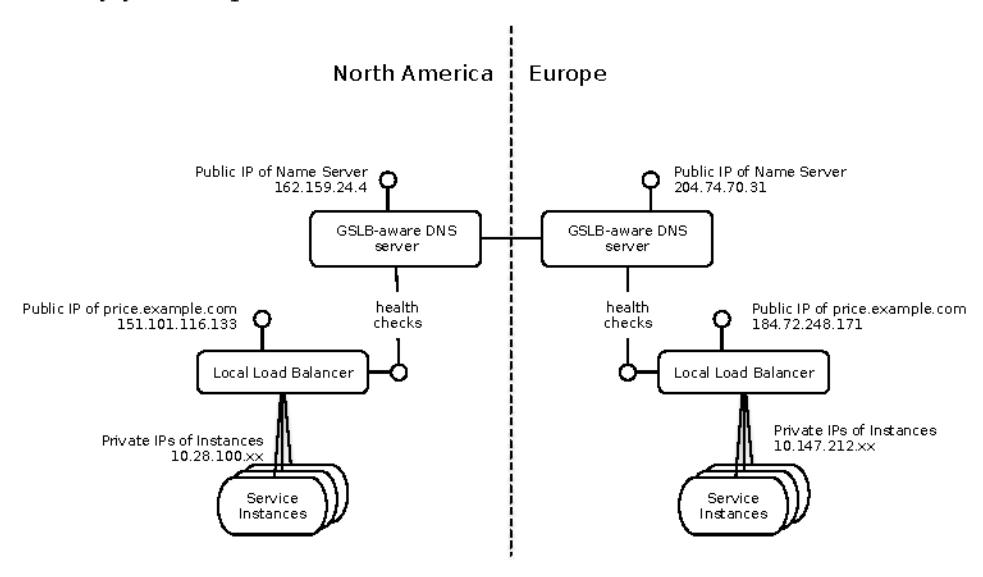
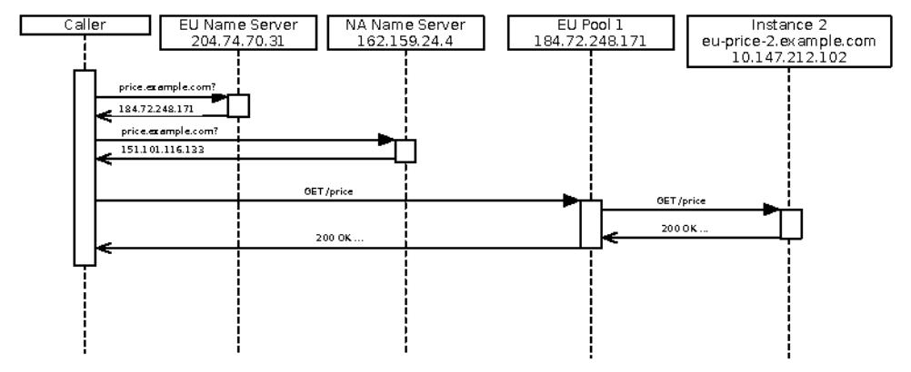
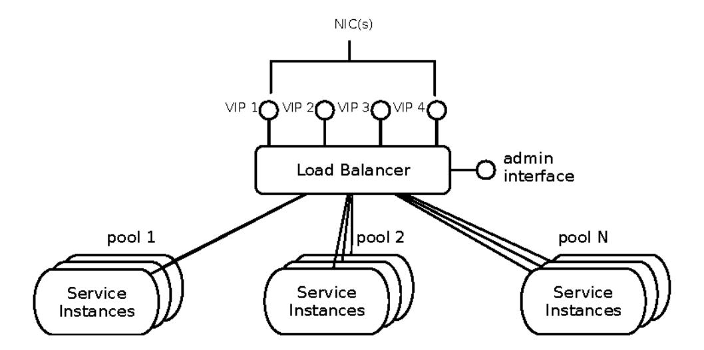
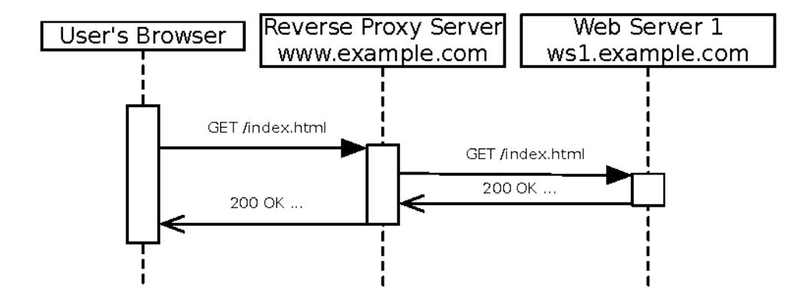
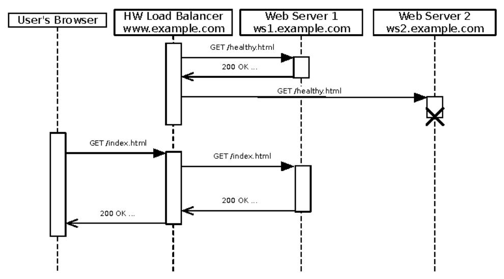
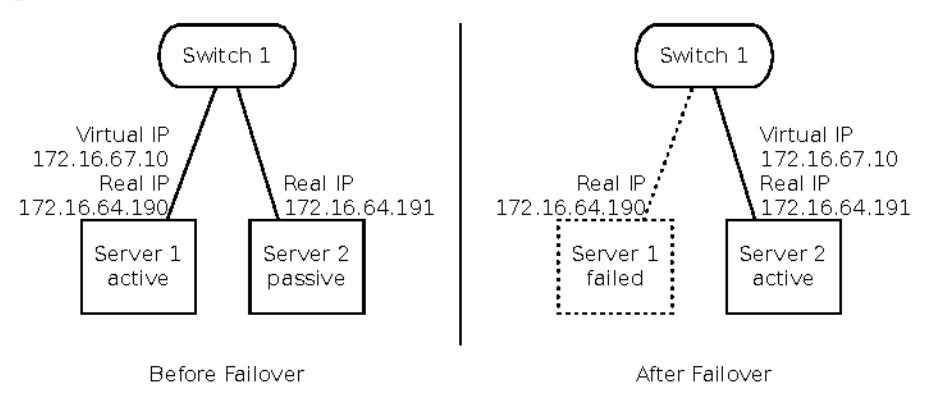

# Chapter 9: Interconnect

In the previous chapter, we looked at instances running on machines. But really, who is interested in a single instance running by itself? A standalone process might as well be on a desert island. We need to connect them together into a system. This chapter continues our iterative zoom-out to look at how the instances work together and find each other, as well as how callers invoke them. It's time to look at the "interconnect" layer from our schematic (shown in the following figure).

## Operations

Security, availability, capacity, status, communication

### Control Plane

System monitoring, deployment, anomaly detection, features

#### Interconnect

Routing, load balancing, failover, traffic management

#### Instances

Services, processes, components, instance monitoring

#### Foundation

Hardware, VMs, IP addresses, physical network

The interconnect layer covers all the mechanisms that knit a bunch of instances together into a cohesive system. That includes traffic management, load balancing, and discovery. The interconnect layer is where we can really create high availability. As with the instance level, we also need to create transparency and control. None of it happens by accident.

### Solutions at Different Scales

In previous chapters, we've dealt with different solutions, depending on your production environment: physical, virtual, cloud, or container. As we move up the stack into interconnect, control plane, and operations, we also need to consider what solution is right for your organization. For instance, some techniques for service discovery and invocation depend on extra pieces of software. A large team or department with hundreds of small services would do well to use Consul or another dynamic discovery service. The cost of running and operating Consul is easily amortized over the number of teams that benefit. Not to mention, the rate of change is going to be high enough to justify something highly dynamic. On the other hand, a small business with just a few developers should probably stick with direct DNS entries. Changes aren't going to be as rapid and the developers can keep services up-to-date.

What is it that makes a discovery service feasible for the large company? For one thing, it can deal with a high rate of change in both the services included and in the location of the instances in those services. When the rate of change is high, it becomes impossible to update static configuration in service consumers. You'd be reconfiguring services several times a day. Also, because service discovery is itself another service, it increases the operational surface area. (Or maybe we should say "service area"?) That's probably acceptable to the large company because a dedicated operations team and even a "platform" or "ecosystem" team probably run such tools. Finally, in a large company, it's unlikely that every developer will be aware of every other developer's changes. It would be unrealistic to believe that service consumers could stay up-to-date with IP address changes in their providers, especially in a highly virtualized, cloud, or container infrastructure.

In the small company, the opposite is true in every aspect: the rate of change is lower because fewer developers are generating changes. There may not be a separate operations team at all, and the developers might all have lunch together.

Having read all that, you must also take it with a grain of salt. The balance point keeps changing as tools get more powerful. Big companies push the boundaries of dynamic platforms and bring us tools like Spinnaker, Kubernetes, Mesos, and Consul. As they create these open-source platforms and ops tools, they put amazing abilities in the reach of even small teams. At one time, monitoring software cost megabucks. Now open source dominates that space, and even the smallest team should (*must*) have monitoring in place. Open-source ops tools democratize these abilities. Open-source PaaS tools are on the upswing as of this writing.

So as we look at the solutions in the rest of this chapter, it will be helpful to consider each in terms of the rate of change or dynamism it supports, how much operational support it requires, and how much global knowledge it requires.

### DNS

Let's start with the basics and look at DNS. For small teams this is likely to be your best choice, particularly in a slowly changing infrastructure. That would include dedicated physical machines and dedicated, long-lived virtual machines. In these environments, IP addresses will remain stable enough for DNS to be useful.

### Service Discovery with DNS

"Service discovery" usually implies some kind of automated query and response, but not in this case. When you use DNS to call another service, discovery is more Sherlock Holmes than Siri. Your team needs to find the service owners and pry the DNS name or names out of them. An exchange of favors may be required, maybe a six-pack of beer in the extreme. Once you've finished the human protocol, you just put the "host" name into a configuration file and forget about it.

When a client calls a service, the provider of that service may only have a single DNS name. That implies the provider is responsible for load balancing and high availability. If the provider has several names, then it's up to the caller to balance among them.

When using DNS, it's important to have a logical service name to call, rather than a physical hostname. Even if that logical name is just an alias to the underlying host, it's still preferable. An alias only needs to be changed in one place (the name server's database) rather than in every consuming application.

## Load Balancing with DNS

DNS *round-robin* load balancing is one of the oldest techniques—dating back to the early days of the web. It operates at the application layer (layer 7) of the OSI stack; but instead of operating during a service request, it operates during address resolution.

DNS round-robin simply associates several IP addresses with the service name. So instead of finding a single IP address for "shipping example.com," a client would get one of several addresses. Each IP address points to a single server. The client therefore connects to one out of a pool of servers, as shown in the figure on page 174.

Although this serves the basic purpose of distributing work across a group of machines, it does poorly on other fronts. For one thing, all the instances in the pool must be directly "routable" from callers. They may sit behind a firewall, but their front-end IP addresses are visible and reachable from clients.

Second, the DNS round-robin approach suffers from putting too much control in the client's hands. Since the client connects directly to one of the servers, there's no opportunity to redirect that traffic if one particular instance is down. The DNS server has no information about the health of the instances, so it can keep vending out IP addresses for instances that are toast. Furthermore, doling out IP addresses in round-robin style does not guarantee that the *load* is distributed evenly, just the initial connections. Some clients consume more resources than others, leading to unbalanced workloads. Again, when one of the instances gets busy, the DNS server has no way to know, so it just keeps sending every eleventh connection (or whatever) to the staggering instance.

DNS round-robin load balancing is also inappropriate whenever the calling system is a long-running enterprise system. Anything using Java's built-in classes will cache the first IP address it receives from DNS, guaranteeing that every future connection targets the same instance and completely defeating load balancing.

### Global Server Load Balancing with DNS

DNS has enough limitations when it comes to load balancing across instances that it's usually worth moving up the stack a bit. However, there's one place where DNS excels: global server load balancing (GSLB).

GSLB tries to route clients across multiple geographic locations (see the figure that follows). This can be for physical data centers of your own or for multiple regions in a cloud infrastructure. We see this most in the context of external clients routing across the public Internet. Clients will get the best performance by routing to a nearby location—bearing in mind that "nearby" in network terms doesn't always match physical geography the way you'd expect.

Each location has one or more pools of load-balanced instances for the service, as shown in the previous illustration. Each pool has an IP address that goes to the load balancer. (See <u>Migratory Virtual IP Addresses</u>, on page 189, for load balancing with virtual IPs.) The job of GSLB is just to get the request to the virtual IP address for a particular pool. GSLB works via specialized DNS servers at each location. Where an ordinary DNS server just has a static database of names and addresses, a GSLB server keeps track of the health and responsiveness of the pools. It offers up the underlying address only if it passes health checks. If the pool is offline, or doesn't have any healthy instance to serve the request, the GSLB server won't even give out the IP address of the pool.

The second trick is that different GSLB servers may give back different IP addresses for the same request. This can be to balance across several local pools, or to provide the closest point of presence for the client. The following figure illustrates this process.

- First the caller queries DNS for the address related to "price.example.com."
- Both GSLB servers might respond. Each one returns a different address for "price.example.com." The European server returns 184.72.248.171, while the North American server returns 151.101.116.113.
- 3. In this example, the client is in Europe, so it probably got the response with 184.72.248.171 first.
- 4. The client now connects directly to 184.72.248.171, which is served by the load balancer. The load balancer directs traffic to the instances just as it normally would.

It's important to keep in mind that this sequence operates at two different levels. At the global level, it's based on DNS and clever schemes for deciding which IP address to offer. After name resolution, it's out of the picture. The load balancer (sometimes called a "local traffic manager") operates as a reverse proxy so the actual call and response pass through it.

This approach also requires that the caller can reach *both* the global traffic managers and the local traffic managers.

This scenario just illustrates the most basic use of GSLB. In practice, the global traffic managers can apply a ton of intelligence to the routing decision. For instance, the previous figure assumed that each GSLB server only knew about its local pools. In a real deployment, each would have all the pools configured but would prefer to send traffic nearby. That allows them to direct traffic to the more distant pool if that's the only one available. They can also

apply weighted distribution and a host of load-balancing algorithms. These can be used as part of a disaster recovery strategy or even part of a rolling deployment process.

### Availability of DNS

DNS relies on servers that can answer queries. What happens when those servers themselves are unavailable? It doesn't matter how great the service's availability is when callers can't find out how to reach it. DNS can become neglected because it's part of the invisible infrastructure. But a DNS outage can have a massive impact.

The main emphasis for DNS servers should be diversity. Don't host them on the same infrastructure as your production systems. Make sure you have more than one DNS provider with servers in different locations. Use a different DNS provider still for your public status page. Make sure there are no failure scenarios that leave you without at least one functioning DNS server.

### Remember This

We covered a lot of ground in this section. It's worth summarizing the uses and limitations of DNS.

- Use DNS to call services when they don't change often.
- DNS round-robin offers a low-cost way to load-balance.
- "Discovery" is a human process. DNS names are supplied in configuration.
- DNS works well for global traffic management in coordination with local load balancers.
- Diversity is crucial in DNS hosts. Don't rely on the same infrastructure for DNS hosts and production services.

## Load Balancing

Almost everything we build today uses horizontally scalable farms of instances that implement request/reply semantics. Horizontal scaling helps with overall capacity and resilience, but it introduces the need for load balancing. Load balancing is all about distributing requests across a pool of instances to serve all requests correctly in the shortest feasible time. In the previous section we looked at DNS round-robin as a means of load balancing. In this section we will consider active load balancing. This involves a piece of hardware or software inline between the caller and provider instances, as illustrated in the figure on page 178.

All types of active load balancers listen on one or more sockets across one or more IP addresses. These IP addresses are commonly called "virtual IPs" or "VIPs." A single physical network port on a load balancer may have dozens of VIPs bound to it, as shown above. Each of these VIPs maps to one or more "pools." A pool defines the IP addresses of the underlying instances along with a lot of policy information:

- The load-balancing algorithm to use
- What health checks to perform on the instances
- What kind of stickiness, if any, to apply to client sessions
- What to do with incoming requests when no pool members are available

To a calling application, the load balancer should be transparent. At least, that's the case when it works. If the client can tell there's a load balancer involved, it's probably broken.

The service provider instances sitting behind the proxy server need to generate URLs with the DNS name of the VIP rather than their own hostnames. (They shouldn't be using their own hostnames anyway!)

Load balancers can be implemented in software or with hardware. Each has its advantages and disadvantages. Let's dig into the software load balancers first.

## Software Load Balancing

Software load balancing is the low-cost approach. It uses an application to listen for requests and dole them out across the pool of instances. This application is basically a reverse proxy server, as shown in the figure on page 179.

A normal proxy multiplexes many outgoing calls into a single source IP address. A reverse proxy server does the opposite: it demultiplexes calls coming into a single IP address and fans them out to multiple addresses. Squid, HAProxy, Apache httpd, and nginx all make great reverse proxy load balancers.

Like DNS round-robin, reverse proxy servers do their magic at the application layer. As such, they aren't fully transparent, but adapting to them isn't onerous. Logging the source address of the request is useless, because it will represent only the proxy server. Well-behaved proxies will add the "X-Forwarded-For" header to incoming HTTP requests, so services can use a custom log format to record that.

In addition to load balancing, you can configure reverse proxy servers to reduce the load on the service instances by caching responses. This provides some benefits in reducing the traffic on the internal network. If the service instances are the capacity constraint in the system, then offloading this traffic improves the system's overall capacity. Of course, if the load balancer itself is the constraint, then this has no effect.

The biggest reverse proxy server "cluster" in the world is Akamai. Akamai's basic service functions exactly like a caching proxy. Akamai has certain advantages over Squid and HAProxy, including a large number of servers located near the end users, but is otherwise logically equivalent.

Because the reverse proxy server is involved in every request, it can get burdened very quickly. Once you start contemplating a layer of load balancing in front of your reverse proxy servers, it's time to look at other options.

ZZZ VTXLG FD#KH RU

2. ZZZKDSURJ

3. KWWWSWWSG DSDFKHRU

KWWSQVILQ[JRU

### Hardware Load Balancing

Hardware load balancers are specialized network devices that serve a similar role to the reverse proxy server. These devices, such as F5's Big-IP products, provide the same kind of interception and redirection capabilities as the reverse proxy software. Because they operate closer to the network, hardware load balancers provide better capacity and throughput, as illustrated in the following figure.

Hardware load balancers are application-aware and can provide switching at layers 4 through 7 of the OSI stack. In practice, this means they can load-balance any connection-oriented protocol, not just HTTP or FTP. I've seen these successfully employed to load-balance a group of search servers that didn't have their own load managers. They can also hand off traffic from one entire site to another, which is particularly useful for diverting traffic to a failover site for disaster recovery. This works well in conjunction with global server load balancing (see *Global Server Load Balancing with DNS*, on page 175).

The big drawback to these machines is—of course—their price. Expect to pay in the five digits for a low-end configuration. High-end configurations easily run into six digits.

### Health Checks

One of the most important services a load balancer can provide is service health checks. The load balancer will not send traffic to an instance that fails a certain number of health checks. Both the frequency and number of failed checks are configurable per pool. Refer back to *Health Checks*, on page 169, for some details about good health checks.

### Stickiness

Load balancers can also attempt to direct repeated requests to the same instance. This helps when you have stateful services, like user session state, in an application server. Directing the same requests to the same instances will provide better response time for the caller because necessary resources will already be in that instance's memory.

A downside of sticky sessions is that they can prevent load from being distributed evenly across machines. You may find a machine running "hot" for a while if it happens to get several long-lived sessions.

Stickiness requires some way to determine how to group "repeated requests" into a logical session. One common approach has the load balancer attach a cookie to the outgoing response to the first request. Subsequent requests are hashed to an instance based on the value of that cookie. Another approach is to just assume that all incoming requests from a particular IP address are the same session. This approach will break badly if you have a reverse-proxy upstream of the load balancer. It also breaks when a large portion of your customer base reaches you through an outbound proxy in their network. (Looking at you, AOL!)

## Partitioning Request Types

Another useful way to employ load balancers is "content-based routing." This approach uses something in the URLs of incoming requests to route traffic to one pool or another. For example, search requests may go to one set of instances, while use-signup requests go elsewhere. A large-scale data provider may direct long-running queries to a subset of machines and cluster fast queries onto a different set. Of course, something in the requests must be evident to the load balancer.

### Remember This

Load balancers are integral to the delivery of your service. We cannot treat them as just part of the network infrastructure any more.

Load balancing plays a part in availability, resilience, and scaling. Because so many application attributes depend on them, it pays to incorporate load-balancing design as you build services and plan deployment. If your organization treats load balancers as "those things over there" that some other team

manages, then you might even think about implementing a layer of software load balancing under your control, entirely behind the hardware load balancers in the network.

- Load balancing creates "virtual IPs" that map to pools of instances.
- Software load balancers work at the application layer. They're low cost and easy to operate.
- Hardware load balancers reach much higher scale than software load balancers. They do require direct network access and specific engineering skills.
- Health checks are a vital part of load balancer configuration. Good health checks ensure that requests can succeed, not just that the service is listening to a socket.
- Session stickiness can help response time for stateful services.
- Consider content-aware load balancing if your service can process workload more efficiently when it is partitioned.

### Demand Control

In the "good old days" of mainframes in glass houses, we could predict what the workload looked like from day to day. Operators would measure how many MIPS (millions of instructions per second...now don't snicker, those machines did the best they could) a given job needed. Those days are long gone. Most of our services are either directly or indirectly exposed to the entire world's population.

Our daily reality is this: the world can crush our systems at any time. There's no natural protection. We have to build it. There are two basic strategies: either refuse work or scale out. For the moment, we'll consider when, where, and how to refuse work.

## How Systems Fail

Every failing system starts with a queue backing up somewhere.

When thinking about request/reply workload, we need to consider the resources being consumed and the queues to get access to those resources. That'll let us decide where to cut off new requests. Each request obviously consumes a socket on each tier it passes through. While the request is active on an instance, that instance has one fewer ephemeral sockets available for new requests. In fact, that socket is consumed for a little while *after* the request completes. (See *TIME\_WAIT* and the Bogons, on page 185.)

There's a relationship between the number of sockets available and the number of requests per second your service can handle. That relationship depends on the duration of the requests. (They are related via "Little's law." The faster your service retires requests, the more throughput it can handle. But we're talking about systems under high levels of load. It's natural to expect your service to slow down under heavy load, but that means fewer and fewer sockets are available to receive requests exactly when the most requests are coming in! We call that "going nonlinear," and we don't mean it in a good way.

The next resource to consider is raw I/O bandwidth through the NICs. No matter how many virtual NICs your machine has, or how many sockets your instance has open, Ethernet is inherently a serial protocol. It takes time to shove packets through the wires. Any packet you want to send while the port is busy just has to get in line. On the flip side, applications only receive packets when they are ready. Anything that arrives on the NIC in the meantime has to be buffered until the application calls some form of UHD 6n the socket. On both the transmit side and the receive side, a finite amount of RAM is allocated to these buffers. Any data that goes into those buffers has to work its way through the queue. When the write buffers are full, the TCP stack won't accept any new writes and ZUL Walls will block. When the read buffers are full, the stack won't accept any new incoming data and the connection will stall. (Eventually, that backs up into the sending application and the ZUL WH call there also blocks.)

When is the application most likely to be slow at reading from TCP buffers? Exactly when it's under high load, another nonlinear effect.

There's another kind of queue involved, which is the "listen queue" on the server's socket. TCP connection requests can get through the three-phase handshake but then have to wait for the application to accept the connection. When the application calls DFFH five server's TCP stack removes the connection from the listen queue and hands it over for reads and writes. (See the "three-way handshake," on page 37, for a refresher.) If a connection request sits in that queue long enough, the client will eventually give up and abandon the connection. If the listen queue is full, clients that attempt to connect will work their way through a series of delayed retries and then ultimately give up.

As requests from the outside world reach further into the system, they activate resources at every tier until the work can be retired. A single request at the network edge may translate into a tree of service requests through many layers of internal structure. Each request means transient load on a provider's

5. KWWSHQ ZLNLSHIGZIDNRU'LWWOH VBODZ

listen queue and persistent load on its sockets and NICs. Under high load those resources are held longer, which further extends response times for the new incoming work. At some point, the response time for one or more services extends past the caller's timeout. The caller will stop waiting for a response on the original request and probably fire a retry at us (exactly when it hurts the worst!).

### Preventing Disaster

With that perspective, we can see that the best thing to do under high load is turn away work we can't complete in time. This is called "load shedding," and it's the most important way to control incoming demand.

Load shedding happens very quickly when a socket's listen queue is full, and a quick rejection is better than a slow timeout.

More generally, we want to shed load as early as possible so we can avoid tying up resources at several tiers before rejecting the request. Load balancers near the network edge are the ideal place. A good health check on the first tier of services can inform the load balancer when response times are too high (in other words, higher than the service's SLA). The load balancer also needs to be configured to send back an HTTP 503 response code when all instances fail their health checks. That's a quick response to the caller that says "too busy, try later."

Services can measure their own response time to help with this. They can also check their own operational state to see if requests will be answered in a timely fashion. For instance, monitoring the degree of contention for a connection pool allows a service to estimate wait times. Likewise, a service can check response times on its own dependencies. If those dependencies are too slow and are required, then the health check should show that this service is unavailable. This provides back pressure through service tiers.

Services should also have relatively short listen queues. Every request spends some time in the listen queue and some time in processing. We call the total of that time the "residence time." If our service needs to respond in 100 milliseconds or less, that's the allowed residence time. Many people go wrong by measuring just their own processing time. That's why the service itself may think all is well while its consumers complain that it's slow. The listen queue is serial while processing is multithreaded, so queuing time ultimately dominates processing time. The queuing math gets a bit hairy here, and Little's law doesn't apply very well when you hit boundaries and maximum queue length. You'll need to know whether the service is exposed directly to the

Internet—an infinite source of demand for all practical purposes—or whether it's internal, where the demand population is finite. (If you want to model this precisely, check out Dr. Neil Gunther's "PDQ" analyzer toolkit. 5) If you want to apply a heuristic, take your maximum wait time divided by mean processing time and add one. Multiply that by the number of request handling threads you have and bump it up by 50 percent. That's a reasonable starting point for your listen queue length.

Because clients retry TCP connections, it can also be useful to run a "listen queue purge" when the service can't keep up with demand. This is a kind of self-awareness that goes along with the idea of a "yellow alert" or "red alert" status. A listen queue purge just looks like a tight loop that accepts connections and then immediately responds with a canned rejection. For example, you can have a string constant that just says

7U\\$JDLQ?U?Q?U?Q

### TIME\_WAIT and the Bogons

A closed socket sits in the 7,0(8\$, %tate for a bit to make sure that any stray packets wandering around the Internet either time out or arrive to be dropped. Suppose there were no such 7,0(8\$, %tate. A server could close socket 32768 and then reallocate it to a new request. Meanwhile, a delayed packet could arrive that's left over from the old connection. Under very rare circumstances, it might even have a sequence number that matches the server's expectations. The server would seem to receive some bizarre data from nowhere. The current client didn't send it, and now the TCP stream is out of sync. Such a packet is called a "bogon," and 7,0(8\$, %s the antibogon protection.

Services that only deal with work inside a data center can set a very low 7,0(B\$,  $\hbar$ o free up those ephemeral sockets. Just be sure to reduce the machine's TCP setting for the default "time to live" on packets accordingly. On Linux, take a look at the WFSBWX Meternel setting.

### Remember This

Unless you built your service in a cave with a box of scraps, it probably has to deal with Internet-scale load. Either it directly handles requests from the world at large, or it serves some other piece of code that does. We have no control over the traffic patterns and mercurial behavior of that population, so our services need to protect themselves when the load gets too heavy.

 Reject work as close to the edge as possible. The further it penetrates into your system, the more resources it ties up.

ZZZSHUIG\QDPLFRIRFOR\P374 KWPO

- Provide health checks that allow load balancers to protect your application code.
- Start rejecting work when your response time is going to provoke retries.

## Network Routing

Because machines in a data center usually have multiple network interfaces, questions will sometimes arise about which interfaces particular kinds of traffic should traverse. For example, it's relatively common to see a machine with a front-end network interface connected to one VLAN for communication to the web servers and a back-end network interface connected to a different VLAN for communication to the database servers. In this case, the server must be told which interface to use in order to reach a particular destination IP address.

In the case of nearby servers, the routes are probably easy; they'll just be based on the subnet addresses. In the example of the application server, the back-end interface probably shares a subnet with the database server, while the front-end interface probably shares a subnet with the web servers. Routing gets a bit more complicated when distant services—perhaps third-party services—are involved.

Modern operating systems strive to make routing automatic and invisible. When a machine brings up its primary NIC (whichever one it happens to *think* is primary, anyway), it uses the main IP address for that NIC as its "default gateway." That becomes the first entry in the routing table for the host. As the host gets cozier with its switches, they gossip about routes and the host updates its routing table. That table tells the operating system which NIC to use to reach a destination address or network. When an application sends a packet, the host checks the destination IP address against the routing table to see if it knows how to move that packet a hop closer to its destination.

Most of the time, this "just works." Occasionally, though, you can run into problems when multiple routes seem plausible to the host but aren't actually equivalent. Consider the case of a service provided by a close business partner. If the integration includes personally identifiable information (PII), then you might set up a VPN rather than send sensitive data straight over the public Internet. Depending on a ton of configuration options that are outside your control, both the VPN and the primary switch may advertise routes that *could* reach the destination address.

In the best case, you'll discover this problem during testing because nothing will reach the partner's service. Your service won't be able to open a socket and will get a "destination unreachable" response. How is that the best case? A consistent error is much better than intermittent success. If the host happens to receive route advertisements in the right order, it might send those sensitive packets over the VPN. If it gets them in the wrong order, it may try to send them over the front-end—in other words, the public—network. Here's hoping the partner is better at networking and won't accept connections. Otherwise, that PII will be sent in cleartext over the public Internet. Worse still, your service will appear to be working normally so you won't even know it's happening.

One solution is static route definitions. Network admins officially frown on static routes, but sometimes they're the only way.

Another increasingly common solution to routing is software-defined networking. This goes hand-in-hand with virtualized infrastructure and container-based infrastructure. Containers and VMs use virtual IP addresses, VLAN tagging, and virtual switches to create a kind of "network on a network." The packets still run over the same wires, but the host machine's IP address is not involved. This lets the virtual switches operate independently of the physical ones. They can assign IPs from private pools, attach DNS names to those IPs to identify services, and dynamically create firewalls and subnets.

### Unreliable Enumeration

In one customer environment, we found that two different machines labeled their network interfaces in different orders. Both machines ran the same version of the same operating system. They were the same hardware model. But somehow, the leftmost network port on one machine appeared as the first network interface, while the leftmost network port on the other machine appeared as the second network interface. Imagine if "eth0" was the primary NIC on one machine but "eth1" was primary on another. Yet both of them had "eth0" connected to the front-end switch.

That means the first machine had its default gateway properly set to the public-facing switch, while the second machine was trying to use an administrative switch to send out all its traffic.

We eventually found a low-level override in the host management controller—similar to the BIOS settings on a PC. For whatever reason, the two machines arrived with slightly different configurations, possibly because they were bought at different times.

7. KWW SIVQ ZLNLSHIGZIDNRUGDHWWHBURROQBYDUHVVDRUWHBUFRO 'HVWLQ-DDWFLKROQBDXHQU

Getting these routing issues right requires paying attention to each and every integration point. Getting them wrong risks reduced availability or, worse, exposure of customer data. For each connection to a remote system, I recommend keeping a record in a spreadsheet or a database with the destination name, address, and desired route. Someday, somebody is going to need that information to write firewall rules anyway.

## Discovering Services

There are two cases where service discovery becomes important. First, your organization may have too many services for DNS management to be practical. Second, you may be in a highly dynamic environment. Container-based environments usually hit both of these criteria, but that's not the only case.

"Service discovery" really has two parts. First, it's a way that instances of a service can announce themselves to begin receiving a load. This replaces statically configured load balancer pools with dynamic pools. Any kind of load balancer—whether done with hardware or software—can do this. It doesn't require a special "cloud aware" load balancer.

The second part is lookup. A caller needs to know at least one IP address to contact for a particular service. The lookup process can appear to be a simple DNS resolution for the caller, even if some super-dynamic service-aware server is supplying the DNS service.

Service discovery is itself another service. It can fail or get overloaded. It's a good idea for clients to cache results for a short time.

It's best not to roll your own service discovery. Like connection pools and crypto libraries, there's a world of difference between writing one that works and writing one that *always* works.

You can build a service discovery mechanism on top of a distributed data store such as Apache ZooKeeper or etcd. S.9 In these cases, you'll wrap the low-level access with a library to make it both easier and more reliable to use these databases. Just as an example, in the terminology of the CAP theorem, CooKeeper is a "CP" system. That means when there's a network partition (and there *will* be a network partition), some nodes won't answer queries or accept writes. Since clients need to be available, they must have a fallback to use other nodes or previously cached results. It's not reasonable to expect

8. KWWJSRRHNHSHOUSDFKJHRU

9. KWWSFANURV FRPHWFG

10. KWW SHQ ZLNLSHIGZIDNRU&\$3 BHWFKHRU

every client to implement this behavior. Pinterest published a good experience report about using ZooKeeper for service discovery. 11

HashiCorp's Consul resembles ZooKeeper in that it operates as a distributed database. 12 However, Consul's architecture places it in the "AP" arena, so it prefers to remain available and risk stale information when a partition occurs. In addition to service discovery it also handles health checks.

Some other service discovery tools integrate directly with the control plane of PaaS platforms. For example, when Docker Swarm starts containers to run service instances, it automatically registers them with the swarm's dynamic DNS and load-balancing mechanism.

This is a rapidly evolving space. As you can see, these tools have different considerations for each. They cover different scope and are subject to divergent behavior in failure cases. In fact, each one could occupy its own chapter, complete with cautions about sharp edges and detailed discussion about the boundary between the tools' features and your applications' responsibilities. Such chapters would probably be outdated by the time this book reaches print, or even epub, for that matter. There's no plug-and-play replaceability. Choosing one is not a simple matter, and replacing one will have wide-reaching consequences. The only real answer here is to do your homework and commit to solving implementation challenges with whichever tool you choose.

## Migratory Virtual IP Addresses

Suppose the server hosting a critical—but not natively clustered—application goes down. The cluster server on its failover node notices the lack of a regular heartbeat from the failed server. This cluster server then decides that the original server has failed. It starts up the application on the secondary server, including mounting any required filesystems. It also takes over the virtual IP address assigned to the clustered network interface.

Unfortunately, the term *virtual IP* is overloaded. Generally speaking, it means an IP address that is not strictly tied to an Ethernet MAC address. Cluster servers use it to migrate ownership of the address between the members of the cluster. Load balancers use virtual IPs to multiplex many services (each with its own IP address) onto a smaller number of physical interfaces. There's some overlap here, since load balancers typically come in pairs, so the virtual IP (as in "service address") can also be a virtual IP (as in "migrating address").

11. KWW 5744 GLXP FRPLOFMINIW B (QJLQHHUHHOS)HUM BONLHQFH DHWWSDQ WCHDFI DE

12. KWWSZZFRQVXO LR

This kind of virtual IP address is just an IP address that can be moved from one NIC to another as needed. At any given time, exactly one server claims the IP address. When the address needs to be moved, the cluster server and the operating systems collaborate to do some funny stuff in the lower layers of the TCP/IP stack. They associate the IP address with a new MAC address (hardware address) and advertise the new route (ARP). The following figure depicts a virtual IP address before and after the active node fails.

This kind of migratory IP address is often used for active/passive database clusters. Clients connect only using the DNS name for the virtual IP address, not to the hostnames of either node in the cluster. That way, no matter which node currently holds the IP address, the client can connect to the same name.

Of course, this approach cannot migrate the in-memory state of the application. As a result, any nonpersistent state about interactions will be lost. For databases, this includes uncommitted transactions. Some database drivers—such as Oracle's JDBC and ODBC drivers—will automatically reexecute queries that are aborted because of a failover. Updates, inserts, or stored procedure calls cannot be automatically repeated. Therefore, any application calling a database through a virtual IP should be prepared to get a 64/([FHSWLRQ when such a failover occurs.

In general, if your application calls any other service through a handoff virtual IP, it must be prepared for the possibility that the next TCP packet isn't going to the same interface as the last packet. This can cause <code>,2([FHSWsliRGstrange])</code> places. The application logic must be prepared to handle that error—and handle it differently than just a "destination unreachable" error. If at all possible, the application should retry its request against the new node (but see <code>Circuit Breaker</code>, on page 95, for some important safety limits on retries).

## Wrapping Up

We looked at the interconnect layer in this chapter, where instances come together to form systems. Load balancing, routing, load shedding, and service discovery are some of the key issues to consider when building this layer. Depending on your organization, you may have existing solutions in place to plug into. That can be a big help, because some of the most powerful tools require operational support that makes them costly to support by a single team.

Next, we continue zooming out to look at control over this whole extended mélange of application instances and infrastructure tools. We will see what it takes to deploy, monitor, and intervene with systems running in production.
