# Chapter 13: Design for Deployment

In the last chapter, we were stuck in a living nightmare, one of many endless deployments that waste countless hours and dollars. Now we turn to sweeter dreams as we contemplate automated deployments and even continuous deployments. In this chapter you learn how to design your applications for easy rollout. Along the way, we look at packaging, integration point versioning, and database schemata.

## So Many Machines

Given the diversity of virtualization and deployment options we have now, words like *server*, *service*, and *host* have gotten muddy. For the rest of this chapter, the word *machine* will be a simple stand-in for *configurable operating system instance*. If you're running on real metal, then it means the physical host. If you're running a virtual machine, container, or unikernel, then that is the unit. When the distinctions matter, the text will call them out. *Service* will refer to a callable interface for others to use. A service is always made up of redundant copies of software running on multiple machines.

So where are we now? We have more ways to run software in production than ever. The net result is that our environments have more machines than ever, mostly virtual. We talk about pets and cattle, but given their ephemeral lifespans, we should call some of them "mayflies." There are machines that operators never touch because they're created by other machines. That means yet more configurations to manage and more configuration management tools to aid us. If we accept this complexity, we should certainly get something back out of it in the form of increased uptime during deployments.

## The Fallacy of Planned Downtime

Throughout this book, our fundamental premise is that version 1.0 is the beginning of the system's life. That means we shouldn't plan for one or a few deployments to production, but many upon many. Once upon a time, we wrote our software, zipped it up, and threw it over the wall to operations so they could deploy it. If they were nice, then maybe we would add in some release notes about whatever new configuration options they should set. Operations would schedule some "planned downtime" to execute the release.

I hate the phrase "planned downtime." Nobody ever clues the users in on the plan. To the users, downtime is downtime. The internal email you sent announcing the downtime doesn't matter a bit to your users. Releases should be like what Agent K says in *Men in Black*: "There's always an Arquillian Battle Cruiser, or Corillian Death Ray, or intergalactic plague, [or a major release to deploy], and the only way users get on with their happy lives is that they do not know about it!"

Most of the time, we design for the state of the system after a release. The trouble is that that assumes the whole system can be changed in some instantaneous quantum jump. It doesn't work that way. The process of updating the system takes time. A typical design requires that the system always sees itself in either the "before" or "after" state, never "during." The users get to see the system in the "during" state. Even so, we want to avoid disrupting their experiences. How do we reconcile these perspectives?

We can pull it off by designing our applications to account for the act of deployment and the time while the release takes place. In other words, we don't just write for the end state and leave it up to operations to figure out how to get the stuff running in production. We treat deployment as a feature. The remainder of this chapter addresses three key concerns: automation, orchestration, and zero-downtime deployment.

## Automated Deployments

Our goal in this chapter is to learn how we need to design our applications so that they're easy to deploy. This section describes the deployment tools themselves to give us a baseline for understanding the design forces they impose. This overview won't be enough for you to pick up Chef and start writing deployment recipes, but it will put Chef and tools like it into context so we know what to do with our ingredients.

The first tool of interest is the build pipeline. It picks up after someone commits a change to version control. (Some teams like to build every commit to master; others require a particular tag to trigger a build.) In some ways, the build pipeline is an overgrown continuous integration (CI) server. (In fact, build pipelines are often implemented with CI servers.) The pipeline spans both development and operations activities. It starts exactly like CI with steps that cover development concerns like unit tests, static code analysis, and compilation. See the figure that follows. Where CI would stop after publishing a test report and an archive, the build pipeline goes on to run a series of steps that culminate in a production deployment. This includes steps to deploy code into a trial environment (either real or virtual, maybe a brand-new virtual environment), run migration scripts, and perform integration tests.

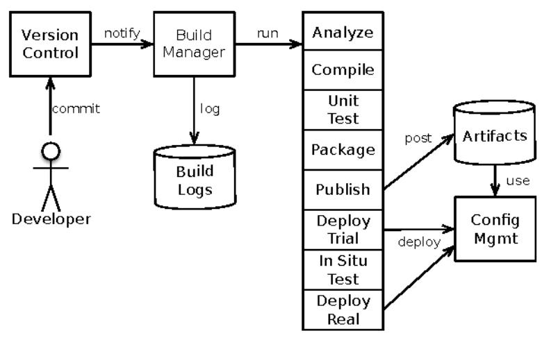

We call it a build pipeline, but it's more like a build funnel. Each stage of a build pipeline is looking for reasons to reject the build. Tests failed? Reject it. Lint complains? Reject it. Build fails integration tests in staging? Reject it. Finished archive smells funny? Reject it.

This figure lumps steps together for clarity. In a real pipeline, you'll probably have a larger number of smaller steps. For example, "deploy trial" will usually encompass the preparation, rollout, and cleanup phases that we'll see later in this chapter.

There are some popular products for making build pipelines. Jenkins is probably the most commonly used today. I also like Thoughtworks' GoCD. A number of new tools are vying for this space, including Netflix's Spinnaker

<sup>1.</sup> KWW SMHQNLQV LR

<sup>2.</sup> ZZZ WKRXJKWZRUNV FRP JR

and Amazon's AWS Code Pipeline.<sup>3,4</sup> And you always have the option to roll your own out-of-shell scripts and post-commit hooks. My advice is to dodge the analysis trap. Don't try to find the best tool, but instead pick one that suffices and get good with it.

At the tail end of the build pipeline, we see the build server interacting with one of the configuration management tools that we first saw in [Chapter 8.](014-chapter-8-processes-on-machines.md#chapter-8-processes-on-machines)
[Processes on Machines](014-chapter-8-processes-on-machines.md#chapter-8-processes-on-machines), on page 155. A plethora of open-source and commercial tools aim at deployments. They all share some attributes. For one thing, you declare your desired configuration in some description that the tool understands. These descriptions live in text files so they can be version-controlled. Instead of describing the specific actions to take, as a shell script would, these files describe a desired end state for the machine or service. The tool's job is to figure out what actions are needed to make the machine match that end state.

Configuration management also means mapping a specific configuration onto a host or virtual machine. This mapping can be done manually by an operator or automatically by the system itself. With manual assignment, the operator tells the tool what each host or virtual machine must do. The tool then lays down the configurations for that role on that host. Refer to the figure that follows.

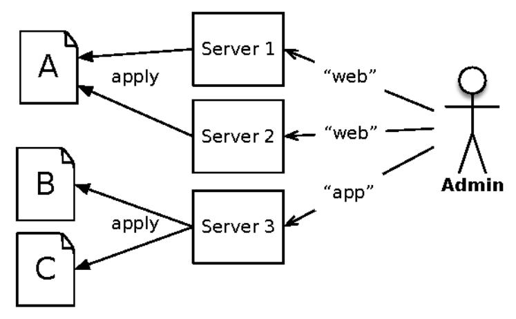

Automatic role assignment means that the operator doesn't pick roles for specific machines. Instead, the operator supplies a configuration that says, "Service X should be running with Y replicas across these locations." This style goes hand-in-hand with a platform-as-a-service infrastructure, as shown in the figure on page 245. It must then deliver on that promise by running the correct number of instances of the service, but the operator doesn't care which

<sup>3.</sup> ZZZ VSLQHQUDR

KWW50VZV DPD]RQ FRP FRGHSLSHOLQH

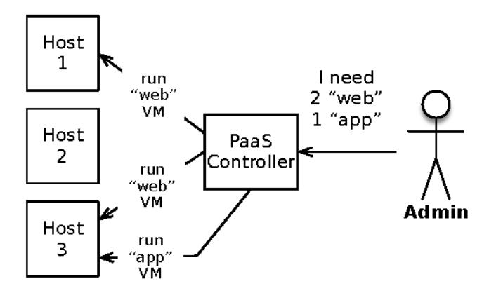

machines handle which services. The platform combines the requested capacity with constraints. It finds hosts with enough CPU, RAM, and disk, but avoids co-locating instances on hosts. Because the services can be running on any number of different machines with different IP addresses, the platform must also configure the network for load balancing and traffic routing.

Along with role mapping, there are also different strategies for packaging and delivering the machines. One approach does all the installation after booting up a minimal image. A set of reusable, parameterizable scripts installs OS packages, creates users, makes directories, and writes files from templates. These scripts also install the designated application build. In this case, the scripts are a deliverable and the packaged application is a deliverable.

This "convergence" approach says the deployment tool must examine the current state of the machine and make a plan to match the desired state you declared. That plan can involve almost anything: copying files, substituting values into templates, creating users, tweaking the network settings, and more. Every tool also has a way to specify dependencies among the different steps. It is the tool's job to run the steps in the right order. Directories must exist before copying files. User accounts must be created before files can be owned by them, and so on.

Under the immutable infrastructure approach that we first encountered in *Immutable and Disposable Infrastructure*, on page 158, the unit of packaging is a virtual machine or container image. This is fully built by the build pipeline and registered with the platform. If the image requires any extra configuration, it must be injected by the environment at startup time. For example, Amazon Machine Images (AMIs) are packaged as virtual machines. A machine instance created from an AMI can interrogate its environment to find out the "user data" supplied at launch time.

People in the immutable infrastructure camp will argue that convergence never works. Suppose a machine has been around a while, a survivor of many deployments. Some resources may be in a state the configuration management tool just doesn't know how to repair. There's no way to get from the current state to the desired state. Another, more subtle issue is that parts of the machine state aren't even included in your configuration recipes. These will be left untouched by the tool, but might be radically different than you expect. Think about things like kernel parameters and TCP timeouts.

Under immutable infrastructure, you always start with a basic OS image. Instead of trying to converge from an unknown state to the desired state, you always start from a known state: the master OS image. This should succeed every time. If not, at least testing and debugging the recipes is straightforward because you only have to account for one initial state rather than the stuccolike appearance of a long-lived machine. When changes are needed, you update the automation scripts and build a new machine. Then the outdated machine can simply be deleted.

Not surprisingly, immutable infrastructure is closely aligned with infrastructure-as-a-service (IaaS), platform-as-a-service (PaaS), and automatic mapping. Convergence is more common in physical deployments and on long-lived virtual machines and manual mapping. In other words, immutable infrastructure is for cattle, convergence is for pets.

## Continuous Deployment

Between the time a developer commits code to the repository and the time it runs in production, code is a pure liability. Undeployed code is unfinished inventory. It has unknown bugs. It may break scaling or cause production downtime. It might be a great implementation of a feature nobody wants. Until you push it to production, you can't be sure. The idea of continuous deployment is to reduce that delay as much as possible to minimize the liability of undeployed code.

A vicious cycle is at play between deployment size and risk, too. Look at the figure on page 247. As the time from check-in to production increases, more changes accumulate in the deployment. A bigger deployment with more change is definitely riskier. When those risks materialize, the most natural reaction is to add review steps as a way to mitigate future risks. But that will lengthen the commit-production delay, which increases risk even further!

There's only one way to break out of this cycle: internalize the motto, "If it hurts, do it more often." In the limit, that statement means, "Do everything

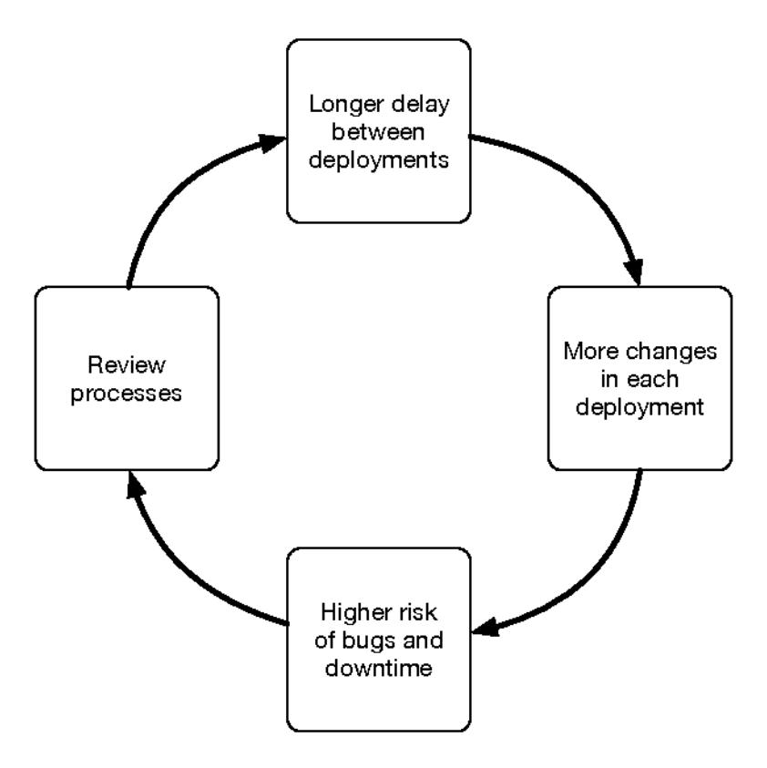

continuously." For deployments, it means run the full build pipeline on every commit.

A place where we see variations is at the very final stages of the build pipeline. Some teams trigger the final production deployment automatically. Others have a "pause" stage, where some human must provide positive affirmation that "yes, this build is good." (Worded another way, it says, "Yes, you may fire me if this fails.") Either approach is valid, and the one you choose depends greatly on your organization's context: if the cost of moving slower exceeds the cost of an error in deployment, then you'll lean toward automatic deployment to production. On the other hand, in a safety-critical or highly regulated environment, the cost of an error may be much larger than the cost of moving slowly relative to the competition. In that case, you'll lean toward a human check before hitting production. You just need to be sure that an authorized button-pusher is available whenever a change needs to happen, even if that's an emergency code change at 2 a.m.

Now that we have a better understanding of what a build pipeline covers, let's look at the phases of a deployment.

## Phases of Deployment

It's no surprise that continuous deployment first arose in companies that use PHP. A deployment in a PHP application can be as simple as copying some files onto a production host. The very next request to that host picks up the new files. The only thing to worry about is a request that comes in while the file is only partially copied.

Near the other end of the spectrum, think about a five-million-line Java application, built into one big EAR file. Or a C# application with a couple hundred assemblies. These applications will take a long time to copy onto the target machine and then a large runtime process to restart. They'll often have in-memory caches and database connection pools to initialize.

We can fill in the middle part of the spectrum as shown in this diagram. Go further to the right, and the degree of packaging increases. At the extreme end of the spectrum, we have applications that are deployed as whole virtual machine images.

| Files                              |                     | Archives             | Whole Machines       |                          |
|------------------------------------|---------------------|----------------------|----------------------|--------------------------|
| T                                  | Ţ                   | T                    | T                    | Ţ                        |
| Static Sites<br>PHP<br>CGI Scripts | .jar<br>.dll<br>gem | .ear<br>.war<br>.exe | .rpm<br>.deb<br>.msi | AMI<br>Container<br>VMDK |

Single files with no runtime process will always be faster than copying archive files and restarting application containers. In turn, those will always be faster than copying gigabyte-sized virtual machine images and booting an operating system.

We can relate that grain size to the time needed to update a single machine. The larger the grain, the longer it takes to apply and activate. We must account for this when rolling a deployment out to many machines. It's no good to plan a rolling deployment over a 30-minute window only to discover that every machine needs 60 minutes to restart!

As we roll out a new version, both the macroscopic and microscopic time scales come into play. The microscopic time scale applies to a single instance (host, virtual machine, or container). The macroscopic scale applies to the whole rollout. This nesting gives us the structure shown here: one large-scale process with many individual processes nested inside (see the diagram on page 249).

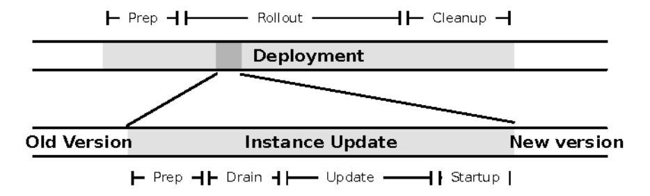

At the microscopic level, it's important to understand four time spans. First, how long does it take to prepare for the switchover? For mutable infrastructure, this is copying files into place so you can quickly update a symbolic link or directory reference. For immutable infrastructure, this is the time needed to deploy a new image.

Second, how long does it take to drain activity after you stop accepting new requests? This may be just a second or two for a stateless microservice. For something like a front-end server with sticky session attachment, it could be a long time—your session timeout plus your maximum session duration. Bear in mind you may not have an upper bound on how long a session can stay active, especially if you can't distinguish bots and crawlers from humans! Any blocked threads in your application will also block up the drain. Those stuck requests will look like valuable work but definitely are not. Either way, you can watch the load until enough has drained that you're comfortable killing the process or you can pick a "good enough" time limit. The larger your scale, the more likely you'll just want the time limit to make the whole process more predictable.

Third, how long does it take to apply the changes? If all it takes is a symlink update, this can be very quick. For disposable infrastructure, there's no "apply the change"; it's about bringing up a new instance on the new version. In that case, this time span overlaps the "drain" period. On the other hand, if your deployment requires you to manually copy archives or edit configuration files, this can take a while. But, hey, at least it'll also be more error-prone!

Finally, once you start the new release on a particular machine, how long is it before that instance is ready to receive load? This is more than just your runtime's startup time. Many applications aren't ready to handle load until they have loaded caches, warmed up the JIT, established database connections, and so on. Send load to a machine that isn't open for business yet, and you'll either see server errors or very long response times for those requests unlucky enough to be the first ones through the door.

The macroscopic time frame wraps around all the microscopic ones, plus some preparatory and cleanup work. Preparation involves all the things you can do without disturbing the current version of the application. During this time the old version is still running everywhere, but it's safe to push out new content and assets (as long as they have new paths or URLs).

Once we think about a deployment as a span of time, we can enlist the application to help with its own deployment. That way, the application can smooth over the things that normally cause us to take downtime for deployments: schema changes and protocol versions.

### Relational Database Schemata

Database changes are one of the driving factors behind "planned downtime," especially schema changes to relational databases. With some thought and preparation, we can eliminate the need for dramatic, discontinuous, downtime-inducing changes.

You probably have a migrations framework in place already. If not, that's definitely the place to start. Instead of running raw SQL scripts against an admin CLI, you should have programmatic control to roll your schema version forward. (It's good for testing to roll it backward as well as forward, too.)

But while a migrations framework like Liquibase helps apply changes to the schema, it doesn't automatically make those changes forward- and backward-compatible. That's when we have to break up the schema changes into expansion and cleanup phases.

Some schema changes are totally safe to apply before rolling out the code:

- · Add a table.
- · Add views.
- Add a nullable column to a table.
- Add aliases or synonyms.
- Add new stored procedures.
- Add triggers.
- Copy existing data into new tables or columns.

All of these involve adding things, so I refer to this as the *expansion* phase of schema changes. (We'll look at cleanup a bit later.) The main criterion is that nothing here will be used by the current application. This is the reason for caution with database triggers. As long as those triggers are nonconditional and cannot throw an error, then it's safe to add them.

We don't see triggers very often in modern application architecture. The main reason I bring them up is because they allow us to create "shims." In carpentry, a shim is a thin piece of wood that fills a gap where two structures meet. In deployments, a shim is a bit of code that helps join the old and new versions of the application. For instance, suppose you have decided to split a table. As shown in the figure that follows, in the preparation phase, you add the new table. Once the rollout begins, some instances will be reading and writing the new table. Others will still be using the old table. This means it's possible for an instance to write data into the old table just before it's shut down. Whatever you copied into the new table during preparation won't include that new entity, so it gets lost.

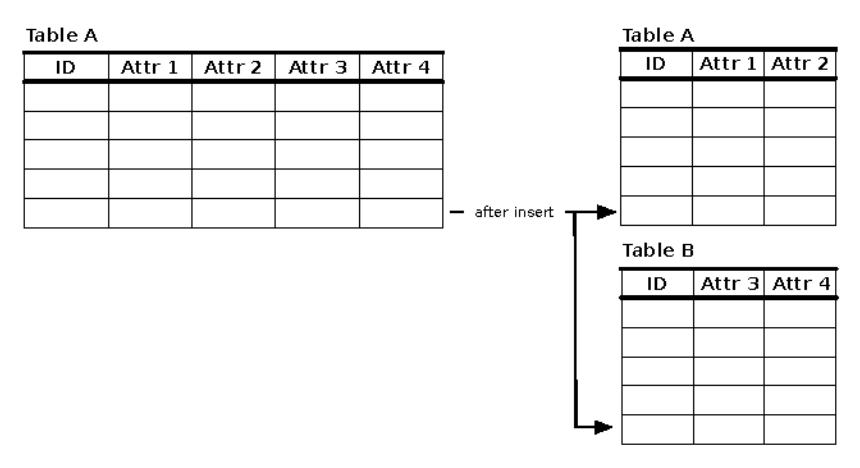

Shims help solve this by bridging between the old and new structures. For instance, an INSERT trigger on the old table can extract the proper fields and also insert them into the new table. Similarly, an UPDATE trigger on the new table can issue an update to the old table as well. You typically need shims to handle insert, update, and delete in both directions. Just be careful not to create an infinite loop, where inserting into the old table triggers an insert into the new table, which triggers an insert into the old table, and so on.

Half a dozen shims for each change seems like a lot of work. It is. That's the price of batching up changes into a release. Later in this chapter, when we talk about the "trickle-then-batch" migration strategy, we'll see how you can accomplish the same job with less effort by doing more, smaller releases.

Don't forget to test them on a realistic sample of data, either. I've seen a lot of migrations fail in production because the test environment only had nice, polite, QA-friendly data. Forget that. You need to test on all the weird data. The stuff that's been around for years. The data that has survived years of

DBA actions, schema changes, and application changes. Absolutely do not rely on what the application currently says is legal! Sure, every new user has to pick three security questions about pets, cars, and sports teams. But you still have some user records from the days before you adopted those questions. There'll be people who haven't logged in for a decade and have a bunch of NULLs for fields you require now. In other words, there'll be data that absolutely cannot be produced by your application as it exists today. That's why you must test on copies of real production data.

That's all well and good for the stodgy old relational databases (twentieth-century technology!). What about the shiny post-SQL databases?

### Schemaless Databases

If you're using something other than a relational database, then you're done. There's absolutely no work you need to do for deployments.

### Just kidding!

A schemaless database is only schemaless as far as the database engine cares. Your application is another story entirely. It expects certain structure in the documents, values, or graph nodes returned by your database. Will all the old documents work on the new version of your application? I mean all the old documents, way back to the very first customer record you ever created. Chances are your application has evolved over time, and old versions of those documents might not even be readable now. Harder still, your database may have a patchwork of documents, all created using different application versions, with some that have been loaded, updated, and stored at different points in time. Some of those documents will have turned into time bombs. If you try to read one today, your application will raise an exception and fail to load it. Whatever that document used to be, it effectively no longer exists.

There are three ways to deal with this. First, write your application so it can read any version ever created. With each new document version, add a new stage to the tail end of a "translation pipeline" like the one shown in the figure on page 253.

In this example, the top-level reader has detected a document written in version 2 of the document schema. It needs to be brought up-to-date, which is why the version 2 reader is configured to inject the document into the pipeline via the "version 2 to version 3 translator." Each translator feeds into the next until the document is completely current. One wrinkle: If the document format has been split at some point in the past, then the pipeline must split as well,

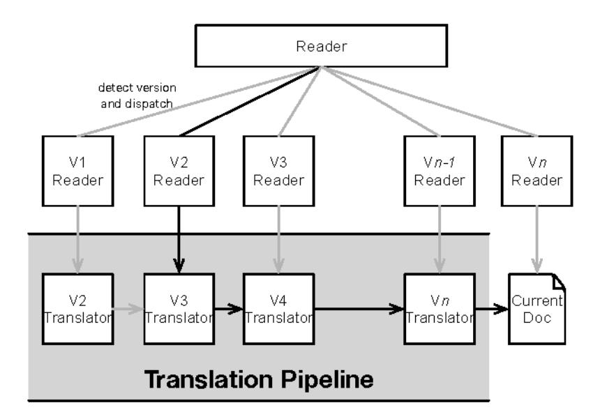

as shown in the figure that follows. It must either produce multiple documents in response to the caller, or it must write all the documents back to the database and then reissue the read. The second read will detect the current version and need zero translations.

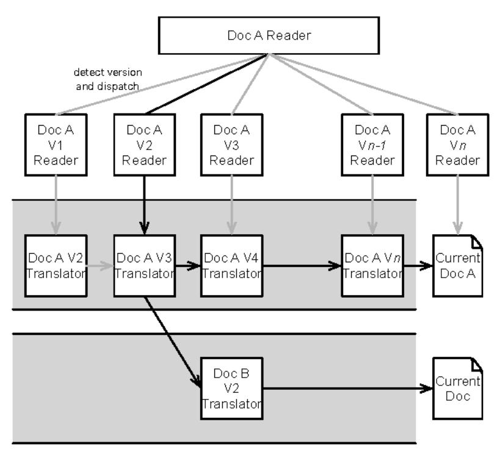

If this sounds like a lot of work, it is. All the version permutations must be covered by tests, which means keeping old documents around as seed data for tests. Also, there's the problem of linearly increasing translation time as the pipeline gets deep.

The second approach is to write a migration routine that you run across your entire database during deployment. That will work well in the early stages, while your data is still small. Later on, though, that migration will take many minutes to hours. There's no way you want to take a couple of hours of downtime to let the migration finish. Instead, the application must be able to read the new document version *and* the old version.

If both the rollout and the data migration ran concurrently, then four scenarios could occur:

- 1. An old instance reads an old document. No problem.
- 2. A new instance reads an old document. No problem.
- 3. A new instance reads a new document. No problem.
- 4. An old instance reads a new document. Uh-oh. Big problem.

For this reason, it would be best to roll out the application version before running the data migration.

The third major approach is the one I like best. I call it "trickle, then batch." In this strategy, we don't apply one massive migration to all documents. Rather, we add some conditional code in the new version that migrates documents as they are touched, as shown in the figure on page 255. This adds a bit of latency to each request, so it basically amortizes the batched migration time across many requests.

What about the documents that don't get touched for a long time? That's where the batch part comes in. After this has run in production for a while, you'll find that the most active documents are updated. Now you can run a batch migration on the remainder. It's safe to run concurrently with production, because no old instances are around. (After all, the deployment finished days or weeks ago.) Once the batch migration is done, you can even push a new deployment that removes the conditional check for the old version.

This approach delivers the best of both worlds. It allows rapid rollout of the new application version, without downtime for data migration. It takes advantage of our ability to deploy code without disruption so that we can remove the migration test once it's no longer needed. The main restriction is that you really shouldn't have two different, overlapping trickle migrations

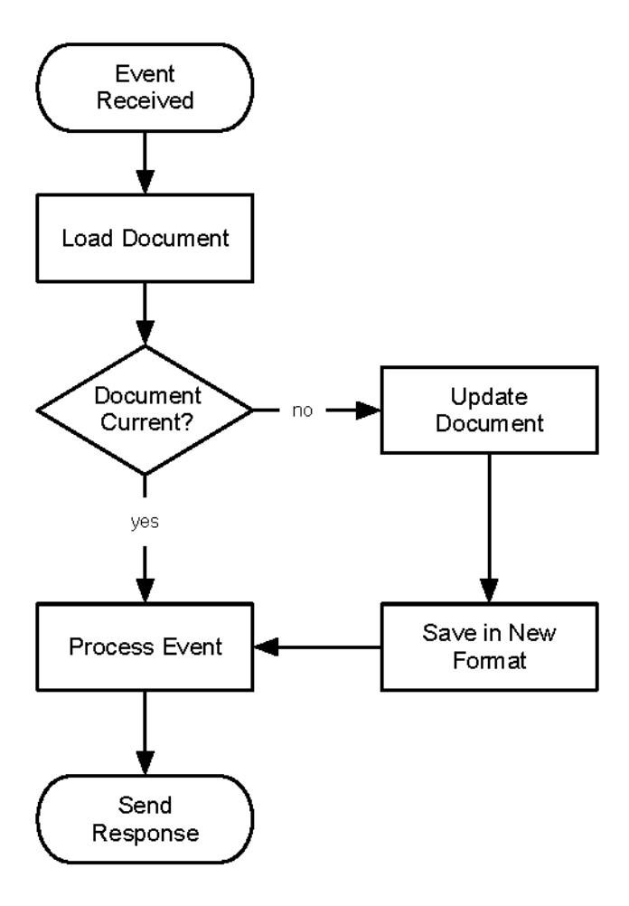

going against the same document type. That might mean you need to break up some larger design changes into multiple releases.

It should be evident that "trickle, then batch" isn't limited to schemaless databases. You can use it for any big migration that would normally take too long to execute during a deployment.

That takes care of the back-end storage systems. The other issue that commonly causes us to take downtime is changes in web assets.

### Web Assets

The database isn't the only place where versions matter. If your application includes any kind of user interface, then you have other assets to worry about: images, style sheets, and JavaScript files. In today's applications, front-end asset versions are very tightly coupled to back-end application changes. It's

vital to ensure that users receive assets that are compatible with the backend instance they will interact with. We must address three major concerns: cache-busting, versioning, and session affinity.

Static assets should always have far-future cache expiration headers. Ten years is a reasonable number. This helps the user, by allowing the user's browser to cache as much as possible. It helps your system, by reducing redundant requests. But when the time comes to deploy an application change, we actually do need the browser to fetch a new version of the script. "Cache busting" refers to any number of techniques to convince the browser—and all the intermediate proxies and cache servers—to fetch the new hotness.

Some cache busting libraries work by adding a query string to the URL, just enough to show a new version. The server-side application emits HTML that updates the URL from this:

```
OLONHOVW\OHVKHKHUWHIVW\OHV DSS FVV"Y EF

to this:
OLONHOVW\OHVKHKHUWHIVW\OHV DSS FVV"Y D ! F I
```

I prefer to just use a git commit SHA for a version identifier. We don't care too much about the specifics of the version. We just need it to match between the HTML and the asset.

```
OLONHOVW\OHVKHKHUWHID FIVW\OHV DSS!FVV
VFULSWWUFD FIMV ORJLOHMWFULSW!
```

Static assets are often served differently than application pages. That's why I like to incorporate the version number into the URL or the filename instead of into a query string. That allows me to have both the old and new versions sitting in different directories. I can also get a quick view into the contents of a single version, since they're all under the same top-level directory.

A word of caution: You'll find advice on the Net to only use version numbers for cache busting, then use rewrite rules to strip out the version portion and have an unadorned path to look up for the actual file. This assumes a big bang deployment and an instantaneous switchover. It won't work in the kind of deployment we want.

What if your application and your assets are coming from the same server? Then you might encounter this issue: The browser gets the main page from an updated instance, but gets load-balanced onto an old instance when it asks for a new asset. The old instance hasn't been updated yet, so it lacks the new assets. In this situation, you have two options that will both work:

- 1. Configure *session affinity* so that all requests from the same user go to the same server. Anyone stuck on an old app keeps using the old assets. Anyone on the new app gets served the new assets.
- Deploy all the assets to every host before you begin activating the new code. This does mean you're not using the "immutable" deployment style, because you have to modify instances that are already running.

In general, it's probably easier to just serve your static assets from a different cluster.

The preparation phase is finally done. It's time to turn our attention to the actual rollout of new code.

### Rollout

The time has come to roll the new code onto the machines. The exact mechanics of this are going to vary wildly depending on your environment and choice of configuration management tool. Let's start by considering a "convergence" style infrastructure with long-lived machines that get changes applied to them.

Right away, we have to decide how many machines to update at a time. The goal is zero downtime, so enough machines have to be up and accepting requests to handle demand throughout the process. Obviously that means we can't update all machines simultaneously. On the flip side, if we do one machine at a time, the rollout may take an unacceptably long time.

Instead, we typically look to update machines in batches. You may choose to divide your machines into equal-sized groups. Suppose we have five groups named Alpha, Bravo, Charlie, Delta, and Foxtrot. Rollout would go like this:

- 1. Instruct Alpha to stop accepting new requests.
- Wait for load to drain from Alpha.
- 3. Run the configuration management tool to update code and config.
- 4. Wait for green health checks on all machines in Alpha.
- 5. Instruct Alpha to start accepting requests.
- 6. Repeat the process for Bravo, Charlie, Delta, and Foxtrot.

Your first group should be the "canary" group. Pause there to evaluate the build before moving on to the next group. Use traffic shaping at your load balancer to gradually ramp up traffic to the canary group while watching monitoring for anomalies in metrics. Is there a big spike in errors logged?

What about a marked increase in latency? Or RAM utilization? Better shut traffic off to that group and investigate before continuing the rollout.

To stop traffic from going to a machine, we could simply remove it from the load balancer pool. That's pretty abrupt, though, and may needlessly disrupt active requests. I prefer to have a robust health check on the machine.

Every application and service should include an end-to-end "health check" route. The load balancer can check that route to see if the instance is accepting work. It's also a useful thing for monitoring and debugging. A good health check page reports the application version, the runtime's version, the host's IP address, and the status of connection pools, caches, and circuit breakers.

With this kind of health check, a simple status change in the application can inform the load balancer not to send any new work to the machine. Existing requests will be allowed to complete. We can use the same flag when starting the service after pushing the code. Often considerable time elapses between when the service starts listening on a socket and when it's really ready to do work. The service should start with the "available" flag set to false so the load balancer doesn't send requests prematurely.

In our example, when the Charlie group is being updated, Alpha and Bravo will be done but Delta and Foxtrot will be waiting. This is the time when all our careful preparation pays off. Both the old and new versions are running at the same time.

Let's now consider an "immutable" infrastructure. To roll code out here, we don't change the old machines. Instead we spin up new machines on the new version of the code. Our key decision is whether to spin them up in the existing cluster or to start a new cluster and switch over. If we start them up in the existing cluster, then we have the situation illustrated in the figure. As the new machines come up and get healthy, they will start taking load. This means that you need session stickiness, or else a single caller could bounce back and forth from the old version on different requests.

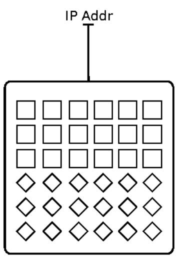

Starting a new cluster is more like the next figure. Here the new machines can be checked for health and well-being before switching the IP address over to the new pool. In this case, we're less worried about session stickiness, but the moment of switching the IP address may be traumatic to unfinished requests.

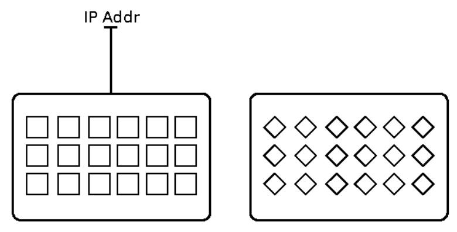

With very frequent deployments, you are better off starting new machines in the existing cluster. That avoids interrupting open connections. It's also the more palatable choice in a virtualized corporate data center, where the network is not as easy to reconfigure as in a cloud environment.

No matter how you roll the code out, it's true under all these models that inmemory session data on the machines will be lost. You must make that transparent to users. In-memory session data should only be a local cache of information available elsewhere. Decouple the process lifetime from the session lifetime.

Every machine should be on the new code now. Wait a bit and keep an eye on your monitoring. Don't swing into cleanup mode until you're sure the new changes are good. Once you're done with that grace period it's time to undo some of our temporary changes.

## Cleanup

I always tell my kids that a job isn't done until the tools are put away. Way back in the preparation phase (probably ten minutes ago in real time, or eighteen hours by the playbook from last chapter), we applied the database expansions and added shims. The time has come to finish that task.

Removing shims is the easy part. Once every instance is on the new code, those triggers are no longer necessary, so you can just delete them. Do put the deletion into a new migration, though.

It's also time now to apply another round of schema changes. This is "contraction," or tightening down the schema:

- Drop old tables.
- Drop old views.
- Drop old columns.
- Drop aliases and synonyms that are no longer used.
- Drop stored procedures that are no longer called.
- Apply NOT NULL constraints on the new columns.
- Apply foreign key constraints.

Most of those are pretty obvious. The exceptions are the two kinds of constraint. We can only add constraints after the rollout. That's because the old application version wouldn't know how to satisfy them. Instances running on the old version would start throwing errors on actions that had been just fine. This breaks our principle of undetectability.

It might be easy for you to split up your schema changes this way. If you use any kind of migrations framework, then you'll have an easier time of it. A migrations framework keeps every individual change around as a version-controlled asset in the codebase. The framework can automatically apply any change sets that are in the codebase but not in the schema. In contrast, the old style of schema change relied on a modeling tool—or sometimes a DBA acting like a modeling tool—to create the whole schema at once. New revisions in the tool would create a single SQL file to apply all the changes at once. In this world, you can still split the changes into phases, but it requires more effort. You must model the expansions explicitly, version the model, then model the contractions and version it again.

Whether you write migrations by hand or generate them from a tool, the timeordered sequence of all schema changes is helpful to keep around. It provides a common way to test those changes in every environment.

For schemaless databases, the cleanup phase is another time to run oneshots. As with the contraction phase for relational databases, this is when you delete documents or keys that are no longer used or remove elements of documents that aren't needed any more.

This cleanup phase is also a great time to review your feature toggles. Any new feature toggles should have been set to "off" by default. The cleanup phase is a good time to review them to see what you want to enable. Also take a look at the existing settings. Are there any toggles that you no longer need? Schedule them for removal.

## Deploy Like the Pros

In those old days of the late 2000s, deployment was a completely different concern than design. Developers built their software, delivered a binary and a readme file, and then operations went to work. No longer. Deployments are frequent and should be seamless. The boundary between operations and development has become fractal. We must design our software to be deployable, just as we design software for production.

But great news! This isn't just an added burden on the already-behind-schedule development team. Designing for deployment gives you the ability to make large changes in small steps.

This all rests on a foundation of automated action and quality checking. Your build pipeline should be able to apply all the accumulated wisdom of your architects, developers, designers, testers, and DBAs. That goes way beyond running tests during the build. For instance, there's a common omission that causes hours of downtime: forgetting an index on a foreign key constraint. If you're not in the relational world, that sentence probably didn't mean much. If you *are* in the relational world, it probably made you scrunch up your face and go, "Ooh, ouch." Why would such an omission reach production? One answer leads to the dark side. If you said, "Because the DBA didn't check the schema changes," then you've taken a step on that gloomy path.

Another way to answer is to say, "Because SQL is hard to parse, so our build pipeline can't catch that." This answer contains the seeds of the solution. If you start from the premise that your build pipeline should be able to catch all mechanical errors like that, then it's obvious that you should start specifying your schema changes in something other than SQL DDL. Whether you use a home-grown DSL or an off-the-shelf migration library doesn't matter that much. The main thing is to turn the schema changes into data so the build pipeline has X-ray vision into the schema changes. Then it can reject every build that defines foreign key constraints without an index. Have the humans define the rules. Have the machines enforce them. Sure it sounds like a recipe for a dystopian sci-fi film, but it'll let your team sleep at night instead of praying to the Polycom.

## Wrapping Up

To be successful, your software will be deployed early and often. That means the act of deployment is an essential part of the system's life. Therefore, it's worth designing the software to be deployed easily. Zero downtime is the objective.

Smaller, easier deployments mean you can make big changes over a series of small steps. That reduces disruption to your users, whether they are humans or other programs.

So far, we've covered the "interior" view of deployments. This includes structuring changes to database schemata and documents, rolling the code to machines, and cleaning up afterward. Now it's time to look at how your software fits in with the rest of the ecosystem. Handling protocol versions gracefully is a key aspect of that, so we'll tackle it next.
