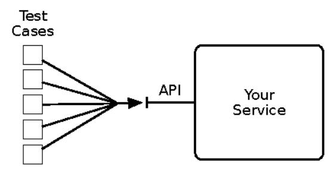
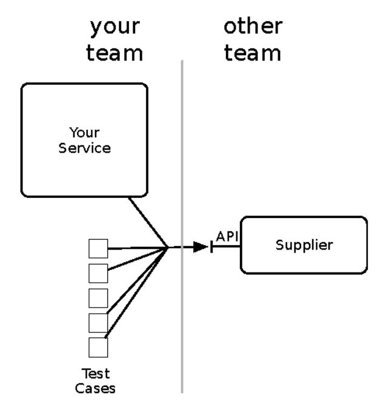
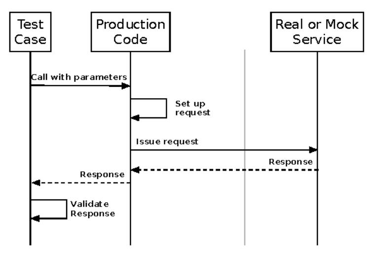
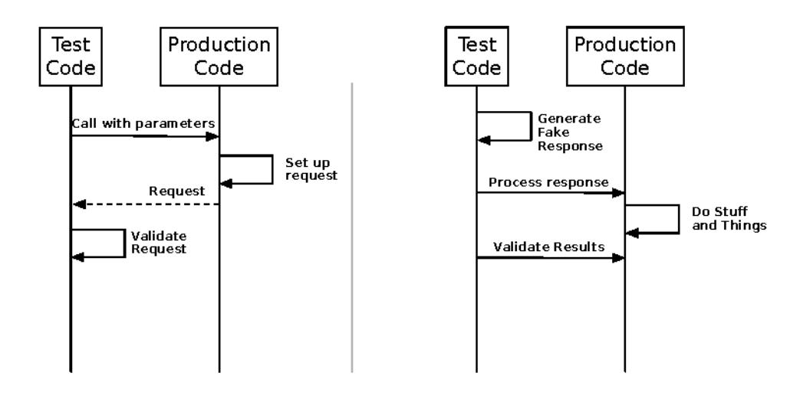

# Chapter 14: Handling Versions

We now know how to design applications so that they can be deployed easily and repeatedly. That means we also have the ability to change the way our software talks with the rest of the world easily and repeatedly. However, as we make changes to add features, we need to be careful not to break consuming applications. Whenever we do that, we force other teams to do more work in order to get running again. Something is definitely wrong if our team creates work for several other teams! It's better for everyone if we do some extra work on our end to maintain compatibility rather than pushing migration costs out onto other teams. This chapter looks at how your software can be a good citizen.

## Help Others Handle Your Versions

It won't come as a surprise to learn that different consumers of your service have different goals and needs. Each consuming application has its own development team that operates on its own schedule. If you want others to respect your autonomy, then you must respect theirs. That means you can't force consumers to match your release schedule. They shouldn't have to make a new release at the same time as yours just so you can change your API. That is trivially true if you provide SaaS services across the Internet, but it also holds within a single organization or across a partner channel. Trying to coordinate consumer and provider deployments doesn't scale. Follow the ripple effect from your deployment and you might find that the whole company has to upgrade at once. That means most new versions of a service should be compatible.

## Nonbreaking API Changes

In the TCP specification, Jon Postel gave us a good principle for building robust systems from disparate providers. Postel's robustness principle says,

"Be conservative in what you do, be liberal in what you accept from others." It has mostly worked out for the Internet as a whole (subject to a lot of caveats from Chapter 11, Security, on page 215,) so let's see if we can apply this principle to protocol versions in our applications.

In order to make compatible API changes, we need to consider what makes for an incompatible change. What we call an "API" is really a layered stack of agreements between pieces of software. Some of the agreements are so fundamental now that we barely talk about them. For example, when was the last time you saw a network running NetBIOS instead of TCP/IP? We can assume a certain amount of commonality: IP, TCP, UDP, and DNS. [Multicast may be allowed within some boundaries in your network, but this should only be used within a closed set of hosts. Never expect it to be routed between different networks.] Above that, we are firmly in "layer 7," the application layer. The consumer and provider must share a number of additional agreements in order to communicate. We can think of these as agreements in the following situations:

- Connection handshaking and duration
- Request framing
- Content encoding
- Message syntax
- Message semantics
- · Authorization and authentication

If you pick the HTTP family (HTTP, HTTPS, HTTP/2) for connection handshaking and duration, then you get some of the other agreements baked in. For example, HTTP's "Content-Type" and "Content-Length" headers help with request framing. ("Framing" is deciding where, in the incoming stream of bytes, a request begins and ends.) Both parties get to negotiate content encoding in the header of the same name.

Is it enough to specify that your API accepts HTTP? Sadly, no. The HTTP specification is vast. (The HTTP/1.1 specification spans five RFCs: RFC7231 to RFC7235.) How many HTTP client libraries handle a "101 Switching Protocols" response? How many distinguish between "Transfer-Encoding" and "Content-Encoding?" When we say our service accepts HTTP or HTTPS, what we usually mean is that it accepts a subset of HTTP, with limitations on the accepted content types and verbs, and responds with a restricted set of status codes and cache control headers. Maybe it allows conditional requests, maybe not. It almost certainly mishandles range requests. In short, the services we build agree to a subset of the standard.

1. KWW SWRROVRJJHKWWIPO UIF VHEW LRQ

With this view of communication as a stack of layered agreements, it's easy to see what makes a breaking change: any unilateral break from a prior agreement. We should be able to make a list of changes that would break agreements:

- Rejecting a network protocol that previously worked
- · Rejecting request framing or content encoding that previously worked
- · Rejecting request syntax that previously worked
- Rejecting request routing (whether URL or queue) that previously worked
- Adding required fields to the request
- Forbidding optional information in the request that was allowed before
- Removing information from the response that was previously guaranteed
- · Requiring an increased level of authorization

You might notice that we handle requests and replies differently. Postel's Robustness Principle creates that asymmetry. You might also think of it in terms of covariant requests and contravariant responses, or the Liskov substitution principle. We can always accept more than we accepted before, but we cannot accept less or require more. We can always return more than we returned before, but we cannot return less.

The flip side is that changes that don't do those things must be safe. In other words, it's okay to require less than before. It's okay to accept more optional information than before. And it's okay to return more than before the change. Another way to think of it is in terms of sets of required and optional parameters. (Thank you to Rich Hickey, inventor of Clojure, for this perspective.) The following changes are always safe:

- · Require a subset of the previously required parameters
- · Accept a superset of the previously accepted parameters
- Return a superset of the previously returned values
- Enforce a subset of the previously required constraints on the parameters

If you have machine-readable specifications for your message formats, you should be able to verify these properties by analyzing the new specification relative to the old spec.

A tough problem arises that we need to address when applying the Robustness Principle, though. There may be a gap between what we say our service accepts and what it really accepts. For instance, suppose a service takes JSON payloads with a "url" field. You discover that the input is not validated as a URL, but just received as a string and stored in the database as a string. You want to add some validation to check that the value is a legitimate URL, maybe with a regular expression. Bad news: the service now rejects requests that it previously accepted. That is a breaking change.

But wait a minute! The documentation said to pass in a URL. Anything else is bad input and the behavior is undefined. It could do absolutely anything. The classic definition of "undefined behavior" for a function means it may decide to format your hard drive. It doesn't matter. As soon as the service went live, its implementation becomes the de facto specification.

It's common to find gaps like these between the documented protocol and what the software actually expects. I like to use generative testing techniques to find these gaps before releasing the software. But once the protocol is live, what should you do? Can you tighten up the implementation to match the documentation? No. The Robustness Principle says we have no choice but to keep accepting the input.

A similar situation arises when a caller passes acceptable input but the service does something unexpected with it. Maybe there's an edge case in your algorithm. Maybe someone passed in an empty collection instead of leaving the collection element out of the input. Whatever the cause, some behavior just happens to work. Again, this isn't part of the specification but an artifact of the implementation. Once again, you aren't free to change that behavior, even if it was something you never intended to support. Once the service is public, a new version cannot reject requests that would've been accepted before. Anything else is a breaking change.

Even with these cautions, you should still publish the message formats via something like Swagger/OpenAPI. That allows other services to consume yours by coding to the specification. It also allows you to apply generated tests that will push the boundaries of the specification. That can help you find those two key classes of gaps: between what your spec says and what you think it says, and between what the spec says and what your implementation does. This is "inbound" testing, as shown in the following figure, where you exercise your API to make sure it does what you think it does.

Those gaps can be large, even when you think you have a strong specification. I also recommend running randomized, generative tests against services you consume. Use their specifications but your own tests to see if your

understanding of the spec is correct. This is "outbound" testing, in which you exercise your dependencies to make them act the way you think they do.

One project of mine had a shared data format used by two geographically separated teams. We discussed, negotiated, and documented a specification that we could all support. But we went a step further. As the consuming group, my team wrote FIT tests that illustrated every case in the specification. We thought of these as contract tests. That suite ran against the staging system from the other team. Just the act of writing the tests uncovered a huge number of edge cases we hadn't thought about. When almost 100 percent of the tests failed on their first run, that's when we really got specific in the spec. Once the tests all passed, we had a lot of confidence in the integration. In fact, our production deployment went very smoothly and we had no operational failures in that integration over the first year. I don't think it would have worked nearly as well if we'd had the implementing team write the tests.

This style of test is shown in the figure that follows. Some people call these "contract tests" because they exercise those parts of the provider's contract that the consumer cares about. As the figure illustrates, such tests are owned by the calling service, so they act as an early warning system if the provider changes.

KWWISWF FRP

After exhausting all other options, you may still find that a breaking change is required. Next we'll look at how to help others when you must do something drastic.

### Breaking API Changes

Nothing else will suffice. A breaking change is on the horizon. There are still things you can do to help consumers of your service.

The very first prerequisite is to actually put a version number in your request and reply message formats. This is the version number of the format itself, not of your application. Any individual consumer is likely to support only one version at a time, so this is not for the consumer to automatically bridge versions. Instead, this version number helps with debugging when something goes wrong.

Unfortunately, after that easy first step, we step right out into shark-infested waters. We have to do *something* with the existing API routes and their behavior. Let's use the following routes from a peer-to-peer lending service (the service that collects a loan application for credit analysis) as a running example. It needs to know some things about the loan and the requester:

| Route                  | Verb | Purpose                                  |
|------------------------|------|------------------------------------------|
| /applications          | POST | Create a new application                 |
| /applications/:id      | GET  | View the state of a specific application |
| /applications?q=query- | GET  | Search for applications that match the   |
| string                 |      | query                                    |
| /borrower              | POST | Create a new borrower                    |
| /borrower/:id          | GET  | View the state of a borrower             |
| /borrower/:id          | PUT  | Update the state of a borrower           |

Table 1—Example Routes

That service is up and running, doing great. It turns out that a successful service needs to be changed more often than a useless one. So, naturally, new requirements come up. For one thing, the representation of the loan request is hopelessly inadequate for more than the original, simple UI. The updated UI needs to display much more information and support multiple languages and currencies. It also turns out that one legal entity can be both a borrower and a lender at different times, but that each one can only operate in certain countries (the ones in which they are incorporated.) So we have breaking changes to deal with in both the data returned with the "/request" routes and a need to replace the "/borrower" routes with something more general.

HTTP gives us several options to deal with these changes. None are beautiful.

- 1. Add a version discriminator to the URL, either as a prefix or a query parameter. This is the most common approach in practice. Advantages: It's easy to route to the correct behavior. URLs can be shared, stored, and emailed without requiring any special handling. You can also query your logs to see how many consumers are using each version over time. For the consumer, a quick glance will confirm which version they are using. Disadvantage: Different representations of the same entity seem like different resources, which is a big no-no in the REST world.
- 2. Use the "Accept" header on GET requests to indicate the desired version. Use the "Content-Type" header on PUT and POST to indicate the version being sent. For example, we can define a media type "application/vnd.lendzit.loan-request.v1" and a new media type "application/vnd.lendzit.loan-request.v2" for our versions. If a client fails to specify a desired version, it gets the default (the first nondeprecated version.) Advantage: Clients can upgrade without changing routes because any URLs stored in databases will continue to work. Disadvantages: The URL alone is no longer enough. Generic media types like "application/json" and "text/xml" are no help at all. The client has to know that the special media types exist at all, and what the range of allowed media types are. Some frameworks support routing based on media type with varying degrees of difficulty.
- 3. Use an application-specific custom header to indicate the desired version. We can define a header like "api-version." Advantages: Complete flexibility, and it's orthogonal to the media type and URL. Disadvantages: You'll need to write routing helpers for your specific framework. This header is another piece of secret knowledge that must be shared with your consumers.
- 4. For PUT and POST only, add a field in the request body to indicate the intended version. Advantages: No routing needed. Easy to implement. Disadvantage: Doesn't cover all the cases we need.

In the end, I usually opt for putting something in the URL. A couple of benefits outweigh the drawbacks for me. First, the URL by itself is enough. A client doesn't need any knowledge beyond that. Second, intermediaries like caches, proxies, and load balancers don't need any special (read: error-prone) configuration. Matching on URL patterns is easy and well understood by everyone in operations. Specifying custom headers or having the devices parse media types to direct traffic one way or another is much more likely to break. This is particularly important to me when the next API revision also entails a language or

framework change, where I'd really like to have the new version running on a separate cluster.

No matter which approach you choose, as the provider, you must support both the old and the new versions for some period of time. When you roll out the new version (with a zero-downtime deployment, of course), both versions should operate side by side. This allows consumers to upgrade as they are able. Be sure to run tests that mix calls to the old API version and the new API version on the same entities. You'll often find that entities created with the new version cause internal server errors when accessed via the old API.

If you do put a version in the URLs, be sure to bump all the routes at the same time. Even if just one route has changed, don't force your consumers to keep track of which version numbers go with which parts of your API.

Once your service receives a request, it has to process it according to either the old or the new API. I'll assume that you don't want to just make a complete copy of all the v1 code to handle v2 requests. Internally, we want to reduce code duplication as much as possible, so long as we can still make future changes. My preference is to handle this in the controller. Methods that handle the new API go directly to the most current version of the business logic. Methods that handle the old API get updated so they convert old objects to the current ones on requests and convert new objects to old ones on responses.

Now you know how to make your service behave like a good citizen. Unfortunately, not every service is as well behaved as yours. We need to look at how to handle input from others.

## Handle Others' Versions

When receiving requests or messages, your application has no control over the format. None, zip, zero, nada, zilch. No matter how well the service's expectations are defined, some joker out there will pass you a bogus message. You're lucky if the message is just missing some required fields. Right now, we're just going to talk about how to design for version changes. (For a more thoroughly chilling discussion about interface definitions, see [Integration Points](009-chapter-4-stability-antipatterns.md#integration-points), on page 33.)

The same goes for calling out to other services. The other endpoint can start rejecting your requests at any time. After all, they may not observe the same safety rules we just described, so a new deployment could change the set of required parameters or apply new constraints. Always be defensive.

Let's look at the loan application service again. As a reminder, from <u>Table 1</u>, <u>Example Routes</u>, on page 268, we have some routes to collect a loan application and data about the borrower.

Now suppose a consumer sends a POST to the /applications route. The POST body represents the requester and the loan information. The details of what happens next vary depending on your language and framework. If you're in an object-oriented language, then each of those routes connects to a method on a controller. In a functional language, they route to functions that close over some state. No matter what, the post request eventually gets dispatched to a function with some arguments. Ultimately the arguments are some kind of data objects that represent the incoming request. To what extent can we expect that the data objects have all the right information in the right fields? About all we can expect is that the fields have the right syntactic type (integer, string, date, and so on), and that's only if we're using an automatic mapping library. If you have to handle raw JSON, you don't even have that guarantee. (Make sure to always wash your hands and clean your work surfaces after handling raw JSON!)

Imagine that our loan service has gotten really popular and some banks want in on the action. They're willing to offer a better rate for borrowers with good credit, but only for loans in certain categories. (One bank in particular wants to avoid mobile homes in Tornado Alley.) So you add a couple of fields. The requester data gets a new numeric field for "creditScore." The loan data gets a new field for "collateralCategory" and a new allowed value for the "riskAdjustments" list. Sounds good.

Here's the bad news. A caller may send you all, some, or none of these new fields and values. In some rare cases, you might just respond with a "bad request" status and drop it. Most of the time, however, your function must be able to accept any combination of those fields. What should you do if the loan request includes the collateral category—and it says "mobile home"—but the risk adjustments list is missing? You can't tell the bank if that thing is going to get opened up like a sardine can in the next big blow. Or what if the credit score is missing? Do you still send the application out to your financial partners? Are they going to do a credit score lookup or will they just throw an error at you?

All these questions need answers. You put some new fields in your request specification, but that doesn't mean you can assume anyone will obey them.

A parallel problem exists with calls that your service sends out to other services. Remember that your suppliers can deploy a new version at any time, too. A request that worked just a second ago may fail now.

These problems are another reason I like the contract testing approach from *Help Others Handle Your Versions*, on page 263. A common failing in integration tests is the desire to overspecify the call to the provider. As shown in the figure, the test does too much. It sets up a request, issues the request, then makes assertions about the response based on the data in the original request. That verifies how the end-to-end loop works *right now*, but it doesn't verify that the caller correctly conforms to the contract, nor that the caller can handle any response the supplier is allowed to send. Consequently, some new release in the provider can change the response in an allowed but unexpected way, and the consumer will break.

In this style of testing, it can be hard to provoke the provider into giving back error responses too. We often need to resort to special flags that mean "always throw an exception when I give you this parameter." You just know that, sooner or later, that test code will reach production.

I prefer a style of testing that has each side check its own conformance to the specification. In the figure on page 273, we can see the usual test being split into two different parts.

The first part just checks that requests are created according to the provider's requirements. The second part checks that the caller is prepared to handle responses from the provider. Notice that neither of these parts invokes the external service. They are strictly about testing how well our code adheres to the contract. We exercised the contract test before with explicit contract tests that ensure the provider does what it claims to do. Separating the tests into these parts helps isolate breakdowns in communication. It also makes our

### Response Side

code more robust because we no longer make unjustified assumptions about how the other party behaves.

As always, your software should remain cynical. Even if your most trusted service provider claims to do zero-downtime deployments every time, don't forget to protect your service. Refer to Chapter 5, Stability Patterns, on page 91, for self-defense techniques.

## Wrapping Up

Like many places where our software intersects with the external environment, versioning is inherently messy. It will always remain a complex topic. I recommend a utilitarian philosophy. The net suffering in your organization is minimized if everyone thinks globally and acts locally. The alternative is an entire organization slowly grinding to a halt as every individual release gets tied down waiting for synchronized upgrades of its clients.

In this chapter, we've seen how to handle our versions to aid others and how to defend ourselves against version changes in our consumers and providers. Next we look at the operations side of the equation—namely, how to build transparency into our systems and how to adapt when transparency reveals a need for change.
