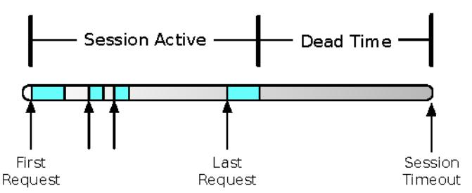
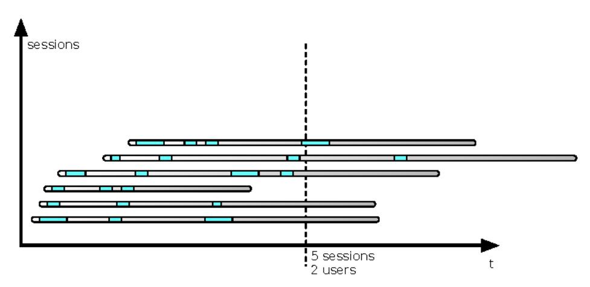

# Chapter 15: Case Study: Trampled by Your Own Customers

After years of work, the day of launch finally arrived. I had joined this huge team (more than three hundred in total) nine months earlier to help build a complete replacement for a retailer's online store, content management, customer service, and order-processing systems. Destined to be the company's backbone for the next ten years, it was already more than a year late when I joined the team. For the previous nine months, I had been in crunch mode: taking lunches at my desk and working late into the night. A Minnesota winter will test your soul even under the best of times. Dawn rises late, and dusk falls early. None of us had seen the sun for months. It often felt like an inescapable Orwellian nightmare. We had crunched through spring, the only season worth living here for. One night I went to sleep in winter, and the next time I looked around, I realized summer had arrived.

After nine months, I was still one of the new guys. Some of the development teams had crunched for more than a year. They had eaten lunches and dinners brought in by the client every day of the week. Even today, some of them still shiver visibly when remembering turkey tacos.

## Countdown and Launch

We'd had at least six different "official" launch dates. Three months of load testing and emergency code changes. Two whole management teams. Three targets for the required user load level (each revised downward).

Today, however, was the day of triumph. All the toil and frustration, the forgotten friends, and the divorces were going to fade away after we launched.

The marketing team—many of whom hadn't been seen since the last of the requirements-gathering meetings two years earlier—gathered in a grand conference room for the launch ceremony, with champagne to follow. The technologists who had turned their vague and ill-specified dreams into reality gathered around a wall full of laptops and monitors that we set up to watch the health of the site.

At 9 a.m., the program manager hit the big red button. (He actually had a big red button, which was wired to an LED in the next room, where a techie clicked Reload on the browser being projected on the big screen.) The new site appeared like magic on the big screen in the grand conference room. Where we lurked in our lair on the other side of the floor, we heard the marketers give a great cheer. Corks popped. The new site was live and in production.

Of course, the real change had been initiated by the content delivery network (CDN). A scheduled update to their metadata was set to roll out across their network at 9 a.m. central time. The change would propagate across the CDN's network of servers, taking about eight minutes to be effective worldwide. We expected to see traffic ramping up on the new servers starting at about 9:05 a.m. (The browser in the conference room was configured to bypass the CDN and hit the site directly, going straight to what the CDN called the "origin servers." Marketing people aren't the only ones who know how to engage in smoke and mirrors.) In fact, we could immediately see the new traffic coming into the site.

By 9:05 a.m., we already had 10,000 sessions active on the servers.

At 9:10 a.m., more than 50,000 sessions were active on the site.

By 9:30 a.m., 250,000 sessions were active on the site. Then the site crashed.

We really put the "bang" in "big bang" release.

## Aiming for Quality Assurance

To understand why the site crashed so badly, so quickly, we must take a brief look back at the three years leading up to that point.

It's rare to see such a greenfield project, for a number of good reasons. For starters, there's no such thing as a website project. Every one is really an enterprise integration project with an HTML interface. Most are an API layer over the top of back-end services. This project was in the heyday of the monolithic "web site" on a commerce suite. It did 100 percent server-side rendering.

When the back end is being developed along with the front end, you might think the result would be a cleaner, better, tighter integration. It's possible that could happen, but it doesn't come automatically; it depends on Conway's law. The more common result is that both sides of the integration end up aiming at a moving target.

### Conway's Law

In a *Datamation* article in 1968, Melvin Conway described a sociological phenomenon: "Organizations which design systems are constrained to produce designs whose structure are copies of the communication structures of these organizations." It is sometimes stated colloquially as, "If you have four teams working on a compiler, you will get a four-pass compiler."

Although this sounds like a Dilbert cartoon, it actually stems from a serious, cogent analysis of a particular dynamic that occurs during software design. For an interface to be built within or between systems, Conway argues, two people must—in some fashion—communicate about the specification for that interface. If the communication does not occur, the interface cannot be built.

Note that Conway refers to the "communication structure" of the organization. This is usually not the same as the formal structure of the organization. If two developers embedded in different departments are able to communicate directly, that communication will be mirrored in one or more interfaces within the system.

I've since found Conway's law useful in a proscriptive mode—creating the communication structure that I wanted the software to embody—and in a descriptive mode—mapping the structure of the software to help understand the real communication structure of the organization.

Conway's original article is available on his website.a

a. ZZZPHOFRQEBPHWHĐKUFRPPLWWHHVKWPO

Replacing the entire commerce stack at once also brings a significant amount of technical risk. If the system is not built with stability patterns, it probably follows a typical tightly coupled architecture. In such a system, the overall probability of system failure is the joint probability that any one component fails.

Even if the system is built with the stability patterns (this one wasn't), a completely new stack means that nobody can be sure how it'll run in production. Capacity, stability, control, and adaptability are all giant question marks.

Early in my time on the project, I realized that the development teams were building everything to pass testing, not to run in production. Across the fifteen applications and more than five hundred integration points, every single configuration file was written for the integration-testing environment. Hostnames, port numbers, database passwords: all were scattered across thousands of configuration files. Worse yet, some of the components in the applications

assumed the QA topology, which we knew would not match the production environment. For example, production would have additional firewalls not present in QA. (This is a common "penny-wise, pound-foolish" decision that saves a few thousand dollars on network gear but costs more in downtime and failed deployments.) Furthermore, in QA, some applications had just one instance that would have several clustered instances in production. In many ways, the testing environment also reflected outdated ideas about the system architecture that everyone "just knew" would be different in production. The barrier to change in the test environment was high enough, however, that most of the development team chose to ignore the discrepancies rather than lose one or two weeks of their daily build-deploy-test cycles.

When I started asking about production configurations, I thought it was just a problem of finding the person or people who had already figured these issues out. I asked the question, "What source control repository are the production configurations checked into?" and "Who can tell me what properties need to be overridden in production?"

Sometimes when you ask questions but don't get answers, it means nobody knows the answers. At other times, though, it means nobody wants to be seen answering the questions. On this project, it was some of both. And sometimes when you ask too many questions, you get tagged to answer them.

I decided to compile a list of properties that looked as if they might need to change for production: hostnames, port numbers, URLs, database connection parameters, log file locations, and so on. Then I hounded developers for answers. A property named "host" is ambiguous, especially when the host in QA has five applications on it. It could mean "my own hostname," it could mean "the host that is allowed to call me," or it could mean "the host I use to launder money." Before I could figure out what it should be in production, I had to know which it was.

Once I had a map of which properties needed to change in production, it was time to start defining the production deployment structure. Thousands of files would need changes to run in production. All of them would be overwritten with each new software release. The idea of manually editing thousands of files, in the middle of the night, for each new release was a nonstarter. In addition, some properties were repeated many, many times. Just changing a database password looked as if it would necessitate editing more than a hundred files across twenty servers, and that problem would only get worse as the site grew.

Faced with an intractable problem, I did what any good developer does: I added a level of indirection. (Even though I was in operations, I had been a developer most of my career so I still tended to approach problems with that perspective.) The key was to create a structure of overrides that would remain separate from the application codebase. The overrides would be structured such that each property that varied from one environment to the next existed in exactly one place. Then each new release could be deployed without overwriting the production configuration. These overrides also had the benefit of keeping production database passwords out of the QA environment (which developers could access) and out of the source control system (which anyone in the company could access), thereby protecting our customers' privacy.

In setting up the production environment, I had inadvertently volunteered to assist with the load test.

## Load Testing

With a new, untried system, the client knew that load testing would be critical to a successful launch. The client had budgeted a full month for load testing, longer than  $\Gamma$ d ever seen. Before the site could launch, marketing had declared that it must support 25,000 concurrent users.

Counting concurrent users is a misleading way of judging the capacity of the system. If 100 percent of the users are viewing the front page and then leaving, your capacity will be much, much higher than if 100 percent of the users are actually buying something.

You can't measure the concurrent users. There's no long-standing connection, just a series of discrete impulses as requests arrive. The servers receive this sequence of requests that they tie together by some identifier. As shown in the following figure, this series of requests gets identified with a session—an abstraction to make programming applications easier.

Notice that the user actually goes away at the start of the dead time. The server can't tell the difference between a user who is never going to click again and one who just hasn't clicked yet. Therefore, the server applies a timeout.

It keeps the session alive for some number of minutes after the user last clicked. That means the session is absolutely guaranteed to last longer than the user. Counting sessions overestimates the number of users, as demonstrated in the next figure.

When you look at all of the active sessions, some of them are destined to expire without another request. The number of active sessions is one of the most important measurements about a web system, but don't confuse it with counting users.

Still, to reach a target of 25,000 active sessions would take some serious work.

Load testing is usually a pretty hands-off process. You define a test plan, create some scripts (or let your vendor create the scripts), configure the load generators and test dispatcher, and fire off a test run during the small hours of the night. The next day, after the test is done, you can analyze all the data collected during the test run. You analyze the results, make some code or configuration changes, and schedule another test run.

We knew that we would need much more rapid turnaround. So, we got a bunch of people on a conference call: the test manager, an engineer from the load test service, an architect from the development team, a DBA to watch database usage, and me (monitoring and analyzing applications and servers).

Load testing is both an art and a science. It is impossible to duplicate real production traffic, so you use traffic analysis, experience, and intuition to achieve as close a simulation of reality as possible. You run in a smaller environment and hope that the scaling factors all work out. Traffic analysis gives you nothing but variables: browsing patterns, number of pages per session, conversion rates,

think time distributions, connection speeds, catalog access patterns, and so on. Experience and intuition help you assign importance to different variables. We expected think time, conversion rate, session duration, and catalog access to be the most important drivers. Our first scripts provided a mix of "grazers," "searchers," and "buyers." More than 90 percent of the scripts would view the home page and one product detail page. These represented bargain hunters who hit the site nearly every day. We optimistically assigned 4 percent of the virtual users to go all the way through checkout. On this site, as with most ecommerce sites, checkout is one of the most expensive things you can do. It involves external integrations (CCVS, address normalization, inventory checks, and available-to-purchase checks) and requires more pages than almost any other session. A user who checks out often accesses twelve pages during the session, whereas a user who just scans the site and goes away typically hits no more than seven pages. We believed our mix of virtual users would be slightly harsher on the systems than real-world traffic.

On the first test run, the test had ramped up to only 1,200 concurrent users when the site got completely locked up. Every single application server had to be restarted. Somehow, we needed to improve capacity by twenty times.

We were on that conference call twelve hours a day for the next three months, with many interesting adventures along the way. During one memorable evening, the engineer from the load-testing vendor saw all the Windows machines in his load farm start to download and install some piece of software. The machines were being hacked while we were on the call using them to generate load! On another occasion, it appeared that we were hitting a bandwidth ceiling. Sure enough, some AT&T engineer had noticed that one particular subnet was using "too much" bandwidth, so he capped the link that was generating 80 percent of our load. But, aside from the potholes and pitfalls, we also made huge improvements to the site. Every day, we found new bottlenecks and capacity limits. We were able to turn configuration changes around during a single day. Code changes took a little longer, but they still got turned around in two or three days.

We even accomplished a few major architecture changes in less than a week.

This early preview of operating the site in production also gave us an opportunity to create scripts, tools, and reports that would soon prove to be vital.

After three months of this testing effort and more than sixty new application builds, we had achieved a tenfold increase in site capacity. The site could handle 12,000 active sessions, which we estimated to represent about 10,000 customers at a time (subject to all the caveats about counting customers).

Furthermore, when stressed over the 12,000 sessions, the site didn't crash anymore, although it did get a little "flaky." During these three months, marketing had also reassessed their target for launch. They decided they would rather have a slow site than no site. Instead of 25,000 concurrent users, they thought 12,000 sessions would suffice for launch during the slow part of the year. Everyone expected that we would need to make major improvements before the holiday season.

## Murder by the Masses

So after all that load testing, what happened on the day of the launch? How could the site crash so badly and *so fast*? Our first thought was that marketing was just way off on their demand estimates. Perhaps the customers had built up anticipation for the new site. That theory died quickly when we found out that customers had never been told the launch date. Maybe there was some misconfiguration or mismatch between production and the test environment?

The session counts led us almost straight to the problem. It was the number of sessions that killed the site. Sessions are the Achilles' heel of every application server. Each session consumes resources, mainly RAM. With session replication enabled (it was), each session gets serialized and transmitted to a session backup server after each page request. That meant the sessions were consuming RAM, CPU, and network bandwidth. Where could all the sessions have come from?

Eventually, we realized that noise was our biggest problem. All of our load testing was done with scripts that mimicked real users with real browsers. They went from one page to another linked page. The scripts all used cookies to track sessions. They were *polite* to the system. In fact, the real world can be rude, crude, and vile.

Things happen in production—bad things that you can't always predict. One of the difficulties we faced came from search engines. Search engines drove something like 40 percent of visits to the site. Unfortunately, on the day of the switch, they drove customers to old-style URLs. The web servers were configured to send all requests for KWROthe application servers (because of the application servers' ability to track and report on sessions). That meant that each customer coming from a search engine was guaranteed to create a session on the app servers, just to serve up a 404 page.

The search engines noticed a change on the site, so they started refetching all the cached pages they had. That made a lot of sessions just for 404 traffic. (That's just one reason not to abandon your old URL structure, of course.

Another good reason is that people put links in reviews, blogs, and social media. It really sucks when those all break at once.) We lost a lot of SEO juice that day.

Another huge issue we found was with search engines spidering the new pages. We found one search engine that was creating up to ten sessions per second. That arose from an application-security team mandate to avoid session cookies and exclusively use query parameters for session IDs. (Refer back to *Broken Authentication and Session Management*, on page 218, for a reminder about why that was a bad decision.)

Then there were the scrapers and shopbots. We found nearly a dozen high-volume page scrapers. Many of these misbehaving bots were industry-specific search engines for competitive analysis. Some of them were very clever about hiding their origins. One in particular sent page requests from a variety of small subnets to disguise the fact that they were all originating at the same source. In fact, even consecutive requests from the same IP address would use different user-agent strings to mask their true origin. You can forget about URERWVFWfWof all, we didn't have one. Second, the shopbots' cloaking efforts meant they would never respect it even if we did.

The American Registry for Internet Numbers (ARIN) can still identify the source IP addresses as belonging to the same entity, though. These commercial scrapers actually sell a subscription service. A retailer wanting to keep track of a competitor's prices can subscribe to a report from one of these outfits. It delivers a weekly or daily report of the competitor's items and prices. That's one reason why some sites won't show you a sale price until you put the item in your cart. Of course, none of these scrapers properly handled cookies, so each of them was creating additional sessions.

Finally, there were the sources that we just called "random weird stuff." (We didn't really use the word "stuff.") For example, one computer on a Navy base would show up as a regular browsing session, and then about fifteen minutes after the last legitimate page request, we'd see the last URL get requested again and again. More sessions. We never did figure out why that happened. We just blocked it. Better to lose that one customer than all the others.

## The Testing Gap

Despite the massive load-testing effort, the system still crashed when it confronted the real world. Two things were missing in our testing.

ZZZ DULQ QHW

First, we tested the application *the way it was meant to be used*. Test scripts would request one URL, wait for the response, and then request another URL that was present on the response page. None of the load-testing scripts tried hitting the same URL, without using cookies, 100 times per second. If they had, we probably would have called the test "unrealistic" and ignored that the servers crashed. Since the site used only cookies for session tracking, not URL rewriting, all of our load test scripts used cookies.

In short, all the test scripts obeyed the rules. It would be like an application tester who only ever clicked buttons in the right order. Testers are really more like that joke that goes around on Twitter every once in a while, "Tester walks into a bar. Orders a beer. Orders 0 beers. Orders 99999 beers. Orders a lizard. Orders -1 beers. Orders a sfdeljknesv." If you tell testers the "happy path" through the application, that's the *last* thing they'll do. It should be the same with load testing. Add noise, create chaos. Noise and chaos might only bleed away some amount of your capacity, but it might also bring your system down.

Second, the application developers did not build in the kind of safety devices that would cut off bad situations. When something went wrong, the application would keep sending threads into the danger zone. Like a car crash on a foggy freeway, the new request threads would just pile up into the ones that were already broken or hung. We saw this from our very first day of load testing, but we didn't understand the significance. We thought it was a problem with the test methodology rather than a serious deficiency in the system's ability to recover from insults.

## Aftermath

The grim march in the days and weeks following launch produced impressive improvements. The CDN's engineers redeemed themselves for their "sneak preview" error before launch. In one day, they used their edge server scripting to help shield the site from some of the worst offenders. They added a gateway page that served three critical capabilities. First, if the requester did not handle cookies properly, the page redirected the browser to a separate page that explained how to enable cookies. Second, we could set a throttle to determine what percentage of new sessions would be allowed. If we set the throttle to 25 percent, then only 25 percent of requests for this gateway page would serve the real home page. The rest of the requests would receive a politely worded message asking them to come back later. Over the next three weeks, we had an engineer watching the session counts at all times, ready to pull back on the throttle anytime the volume appeared to be getting out of hand. If the servers got completely overloaded, it would take nearly an hour

to get back to serving pages, so it was vital to use the throttle to keep them from getting saturated. By the third week, we were able to keep the throttle at 100 percent all day long.

The third critical capability we added was the ability to block specific IP addresses from hitting the site. Whenever we observed one of the shopbots or request floods, we would add them to the blocked list.

All those things could've been done as part of the application, but in the mad scramble following launch, it was easier and faster to have the CDN handle them for us. We had our own set of rapid changes to pursue.

The home page was completely dynamically generated, from the JavaScript for the drop-down category menus to the product details and even to the link on the bottom of the page for "terms of use." One of the application platform's key selling points was personalization. Marketing was extremely keen on that feature but had not decided how to use it. So this home page being generated and served up five million times a day was exactly the same every single time it got served. There wasn't even any A/B testing. It also required more than 1,000 database transactions to build the page. (Even if the data was already cached in memory, a transaction was still created because of the way the platform worked.) The drop-down menus with nice rollover effects required traversal of eighty-odd categories. Also, traffic analysis showed that a significant percentage of visits per day just hit the main page. Most of them didn't present an identification cookie, so personalization wasn't even possible. Still, if the application server got involved in sending the home page, it would take time and create a session that would occupy memory for the next thirty minutes. So we quickly built some scripts that would make a static copy of the home page and serve that for any unidentified customers.

Have you ever looked at the legal conditions posted on most commerce sites? They say wonderful things like, "By viewing this page you have already agreed to the following conditions...." It turns out that those conditions exist for one reason. When the retailer discovers a screen scraper or shopbot, they can sic the lawyers on the offending party. We kept the legal team busy those first few days. After we identified another set of illicit bots hitting the site to scrape content or prices, the lawyers would send cease-and-desist notices; most of the time, the bots would stop. They never stayed away for long, though.

This particular application server's session failover mechanism was based on serialization. The user's session remains bound to the original server instance, so all new requests go back to the instance that already has the user's session in memory. After every page request, the user's session is serialized and sent

over the wire to a "session backup server." The session backup server keeps the sessions in memory. Should the user's original instance go down—deliberately or otherwise—the next request gets directed to a new instance, chosen by the load manager. The new instance then attempts to load the user's session from the session backup server. Normally the session only includes small data, usually just keys such as the user's ID, her shopping cart ID, and maybe some information about her current search. It would not be a good idea to put the entire shopping cart in the session in serialized form, or the entire contents of the user's last search result. Sadly, that's exactly what we found in the sessions. Not only the whole shopping cart, but up to 500 results from the user's last keyword search, too. We had no choice but to turn off session failover.

All these rapid response actions share some common themes. First, nothing is as permanent as a temporary fix. Most of these remained in place for multiple years. (The longest of them—rolling restarts—lasted a decade and kept going through more than 100 percent turnover in the team.) Second, they all cost a tremendous amount of money, mainly in terms of lost revenue. Clearly, customers who get throttled away from the site are less likely to place an order. (At least, they are less likely to place an order at this site.) Without session failover, any user in the middle of checking out would not be able to finish when that instance went down. Instead of getting an order confirmation page, for example, they would get sent back to their shopping cart page. Most customers who got sent back to their cart page, when they'd been partway through the checkout process, just went away. Wouldn't you? The static home page made personalization difficult, even though it'd been one of the original goals of the whole rearchitecture project. The direct cost of doubling the application server hardware is obvious, but it also brought added operational costs in labor and licenses. Finally, there was the opportunity cost of spending the next year in remediation projects instead of rolling out new, revenuegenerating features.

The worst part is that no amount of those losses was necessary. Two years after the site launched, it could handle more than four times the load on fewer servers of the same original model. The software has improved that much. If the site had originally been built the way it is now, the engineers would have been able to join marketing's party and pop a few champagne corks instead of popping fuses.
