# Chapter 16: Adaptation

Change is guaranteed. Survival is not.

You've heard the Silicon Valley mantras: "Software is eating the world." "You're either disrupting the market or you're going to be disrupted." "Move fast and break things." What do they all have in common? A total focus on change, either on the ability to withstand change or, better yet, the ability to create change.

The agile development movement embraced change in response to business conditions. These days, however, the arrow is just as likely to point in the other direction. Software change can create new products and markets. It can open up space for new alliances and new competition, creating surface area between businesses that used to be in different industries—like light bulb manufacturers running server-side software on a retailer's cloud computing infrastructure.

Sometimes the competition isn't another firm but yesterday's version of the product, as in the startup realm. You launch your minimum viable product, hoping to learn fast, release fast, and find that crucial product-market fit before the cash runs out.

In all these cases, we need adaptation. That is the theme we will explore in this chapter. Our path touches people, processes, tools, and designs. And as you might expect, these interrelate. You'll need to introduce them in parallel and incrementally.

## Convex Returns

Not *every* piece of software needs to mutate daily. Some pieces of software truly have no upside potential to rapid change and adaptation. In some industries, every release of software goes through expensive, time-consuming

certification. Avionics and implantable medical devices come to mind. That creates inescapable overhead to cutting a release—a transaction cost. If you have to launch astronauts into orbit armed with a screwdriver and a chippuller, then you have some serious transaction costs to work around.

Of course, you can find exceptions to every rule. JPL deployed a hotfix to the Spirit rover on Mars; <sup>1</sup> and when Curiosity landed on Mars, it didn't even have the software for ground operations. That was loaded after touchdown when all the code for interplanetary flight and landing could be evicted. They were stuck with the hardware they launched, though. No in-flight upgrades to the RAM!

Rapid adaptation works when there's a convex relationship between effort and return. Competitive markets usually exhibit such convexities.

## Process and Organization

To make a change, your company has to go through a decision cycle, as illustrated in the figure that follows. Someone must sense that a need exists. Someone must decide that a feature will fit that need and that it's worth doing...and how quickly it's worth doing. And then someone must act, building the feature and putting it to market. Finally, someone must see whether the change had the expected effect, and then the process starts over. In a small company, this decision loop might involve just one or two people. Communication can be pretty fast, often just the time it takes for neurons to fire across the corpus callosum. In a larger company, those responsibilities get diffused and separated. Sometimes an entire committee fills the role of "observer," "decider," or "doer."

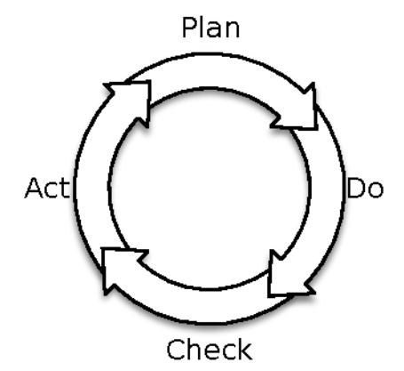

<sup>1.</sup> KW WZSZZLW ZRUOG FRP DUWLFOH LW PODQYDNIZBHEDAN/ BWGKPROYBN NLOOFHYSHROWKPOVSLULW U

The time it takes to go all the way around this cycle, from observation to action, is the key constraint on your company's ability to absorb or create change. You may formalize it as a Deming/Shewhart cycle,<sup>2</sup> as illustrated in the previous figure; or an OODA (observe, orient, decide, act) loop,<sup>3</sup> as shown in the figure that follows; or you might define a series of market experiments and A/B tests. No matter how you do it, getting around the cycle faster makes you more competitive.

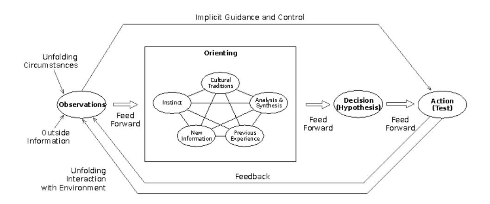

This need for competitive maneuverability drives the "fail fast" motto for startups. (Though it might be better to describe it as "learn fast" or simply "adapt.") It spurs large companies to create innovation labs and incubators.

Speed up your decision loop and you can react faster. But just reacting isn't the goal! Keep accelerating and you'll soon be able to run your decision loop faster than your competitors. That's when you force them to react to you. That's when you've gotten "inside their decision loop."

Agile and lean development methods helped remove delay from the "act" portion of the decision loop. DevOps helps remove even more delay in "act" and offers tons of new tools to help with "observe." But we need to start the timer when the initial observations are made, not when the story lands in the backlog. Much time passes silently before a feature gets that far. The next great frontier is in the "deciding" phase.

KWW \$HQ ZENESHIGZIDNBU3'&\$

KWW \$HQ ZLNLSHJGZIDNRU\$28'ORRS

### The Danger of Thrashing

Thrashing happens when your organization changes direction without taking the time to receive, process, and incorporate feedback. You may recognize it as constantly shifting development priorities or an unending series of crises.

We constantly encourage people to shorten cycle time and reduce the time between sensing and acting. But be careful not to shorten development cycle time so much that it's faster than how quickly you get feedback from the environment.

In aviation, there's an effect officially called "pilot-induced oscillation" and unofficially called "porpoising." Suppose a pilot needs to raise the aircraft's pitch. He pulls back on the stick, but there's a long delay between when he moves the stick and when the plane moves, so he keeps pulling the stick back. Once the plane does change attitude, the nose goes up too far. So the pilot pushes the stick forward, but the same delay provokes him to overcontrol in the other direction. It's called "porpoising" because the plane starts to leap up and dive down like a dolphin at SeaWorld. In our industry, "porpoising" is called thrashing. It happens when the feedback from the environment is slower than the rate of control changes. One effort will be partly completed when a whole new direction appears. It creates team confusion, unfinished work, and lost productivity.

To avoid thrashing, try to create a steady cadence of delivery and feedback. If one runs faster than the other, you *could* slow it down, but I wouldn't recommend it! Instead, use the extra time to find ways to speed up the other process. For example, if development moves faster than feedback, don't use the spare cycles to build dev tools that speed up deployment. Instead, build an experimentation platform to help speed up observation and decisions.

In the sections that follow, we'll look at some ways to change the structure of your organization to speed up the decision loop. We'll also consider some ways to change processes to move from running one giant decision loop to running many of them in parallel. Finally, we'll consider what happens when you push automation and efficiency too far.

### Platform Team

In the olden days, a company kept its developers quarantined in one department. They were well isolated from the serious business of operations. Operations had the people who racked machines, wired networks, and ran the databases and operating systems. Developers worked on applications. Operations worked on the infrastructure.

The boundaries haven't just blurred, they've been erased and redrawn. That began before we even heard the word "DevOps." (See *The Fallacy of the* 

"DevOps Team", on page 294.) The rise of virtualization and cloud computing made infrastructure programmable. Open source ops tools made ops programmable, too. Virtual machine images and, later, containers and unikernels meant that programs became "operating systems."

When we look at the layers from <u>Chapter 7</u>, <u>Foundations</u>, on page 141, we see the need for software development up and down the stack. Likewise, we need operations up and down the stack.

What used to be just infrastructure and operations now rolls in programmable components. It becomes the platform that everything else runs on. Whether you're in the cloud or in your own data center, you need a platform team that views application development as its customer. That team should provide API and command-line provisioning for the common capabilities that applications need, as well as the things we looked at in <a href="#">Chapter 10</a>, <a href="#">Control Plane</a>, on page 193:

- Compute capacity, including high-RAM, high-IO, and high-GPU configurations for specialized purposes (The needs of machine learning and the needs of media servers are very different.)
- Workload management, autoscaling, virtual machine placement, and overlay networking
- Storage, including content addressable storage (for example, "blob stores") and filesystem-structured storage
- Log collection, indexing, and search
- · Metrics collection and visualization
- Message queuing and transport
- Traffic management and network security
- Dynamic DNS registration and resolution
- · Email gateways
- Access control, user, group, and role management

It's a long list, and more will be added over time. Each of these are things that individual teams *could* build themselves, but they aren't valuable in isolation.

One important thing for the platform team is to remember they are implementing mechanisms that allow others to do the real provisioning. In other words, the platform team should not implement all your specific monitoring rules.

Instead, this team provides an API that lets you install your monitoring rules into the monitoring service provided by the platform. Likewise, the platform team doesn't built all your API gateways. It builds the service that builds the API gateways for individual application teams.

You might buy—or more likely download—a capital-*P* Platform from a vendor. That doesn't replace the need for your own platform team, but it does give the team a massive head start.

The platform team must not be held accountable for application availability. That must be on the application teams. Instead, the platform team must be measured on the availability of the platform itself.

The platform team needs a customer-focused orientation. Its customers are the application developers. This is a radical change from the old dev/IT split. In that world, operations was the last line of defense, working as a check against development. Development was more of a suspect than a customer! The best rule of thumb is this: if your developers only use the platform because it's mandatory, then the platform isn't good enough.

### The Fallacy of the "DevOps Team"

It's common these days, typically in larger enterprises, to find a group called the DevOps team. This team sits between development and operations with the goal of moving faster and automating releases into production. This is an antipattern.

First, the idea of DevOps is to bring the two worlds of development and operations together. It should soften the interface between different teams. How can introducing an intermediary achieve that? All that does is create two interfaces where there was one.

Second, DevOps goes deeper than deployment automation. It's a cultural transformation, a shift from ticket- and blame-driven operations with throw-it-over-the-wall releases to one based on open sharing of information and skills, data-driven decision-making about architecture and design, and common values about production availability and responsiveness. Again, isolating these ideas to a single team undermines the whole point.

When a company creates a DevOps team, it has one of two objectives. One possibility is that it's really either a platform team or a tools team. This is a valuable pursuit, but it's better to call it what it is.

The other possibility is that the team is there to promote the adoption of DevOps by others. This is more akin to an agile adoption team or a "transformation" team. In that case, be very explicit that the team's goal is *not* to produce software or a platform. Its focus should be on education and evangelism. Team members need to spread the values and encourage others to adopt the spirit of DevOps.

### Painless Releases

The release process described in Chapter 12, Case Study: Waiting for Godot, on page 237, rivals that of NASA's mission control. It starts in the afternoon and runs until the wee hours of the morning. In the early days, more than twenty people had active roles to play during the release. As you might imagine, any process involving that many people requires detailed planning and coordination. Because each release is arduous, they don't do many a year. Because there are so few releases, each one tends to be unique. That uniqueness requires additional planning with each release, making the release a bit more painful—further discouraging more frequent releases.

Releases should about as big an event as getting a haircut (or compiling a new kernel, for you gray-ponytailed UNIX hackers who don't require haircuts). The literature on agile methods, lean development, continuous delivery, and incremental funding all make a powerful case for frequent releases in terms of user delight and business value. With respect to production operations, however, there's an added benefit of frequent releases. It forces you to get really *good* at doing releases and deployments.

A closed feedback loop is essential to improvement. The faster that feedback loop operates, the more accurate those improvements will be. This demands frequent releases. Frequent releases with incremental functionality also allow your company to outpace its competitors and set the agenda in the marketplace.

As commonly practiced, releases cost too much and introduce too much risk. The kind of manual effort and coordination I described previously is barely sustainable for three or four releases a year. It could never work for twenty a year. One solution—the easy but harmful one—is to slow down the release calendar. Like going to the dentist less frequently because it hurts, this response to the problem can only exacerbate the issue. The right response is to reduce the effort needed, remove people from the process, and make the whole thing more automated and standardized.

In <u>Continuous Delivery [HF10]</u>, Jez Humble and Dave Farley describe a number of ways to deliver software continuously and at low risk. The patterns let us enforce quality even as we crank the release frequency up to 11. A "Canary Deploy" pushes the new code to just one instance, under scrutiny. If it looks good, then the code is cleared for release to the remaining machines. With a "Blue/Green Deploy," machines are divided into two pools. One pool is active in production. The other pool gets the new deployment. That leaves time to test it out before exposing it to customers. Once the new pool looks good, you shift production traffic over to it. [Software-controlled load balancers help

here.) For really large environments, the traffic might be too heavy for a small pool of machines to handle. In that case, deploying in waves lets you manage how fast you expose customers to the new code.

These patterns all have a couple of things in common. First, they all act as governors (see *Governor*, on page 123) to limit the rate of dangerous actions. Second, they all limit the number of customers who might be exposed to a bug, either by restricting the time a bug might be visible or by restricting the number of people who can reach the new code. That helps reduce the impact and cost of anything that slipped past the unit tests.

### Service Extinction

Evolution by natural selection is a brutal, messy process. It wastes resources profligately. It's random, and changes fail more often than they succeed. The key ingredients are repeated iteration of small variations with selection pressure.

On the other hand, evolution does progress by incremental change. It produces organisms that are more and more fit for their environment over time. When the environment changes rapidly, some species disappear while others become more prevalent. So while any individual or species is vulnerable in the extreme, the ecosystem as a whole tends to persist.

We will look at evolutionary architecture in *Evolutionary Architecture*, on page 302. It attempts to capture the adaptive power of incremental change within an organization. The idea is to make your organization antifragile by allowing independent change and variation in small grains. Small units—of technology and of business capability—can succeed or fail on their own.

Paradoxically, the key to making evolutionary architecture work is failure. You have to try different approaches to similar problems and *kill* the ones that are less successful.

Take a look at the figure on page 297. Suppose you have two ideas about promotions that will encourage users to register. You're trying to decide between cross-site tracking bugs to zero in on highly interested users versus a blanket offer to everyone. The big service will accumulate complexity faster than the sum of two smaller services. That's because it must also make decisions about routing and precedence (at a minimum.) Larger codebases are more likely to catch a case of "frameworkitis" and become overgeneralized. There's a vicious cycle that comes into play: more code means it's harder to change, so every piece of code needs to be more generalized, but that leads to more code. Also, a shared database means every change has a higher potential to disrupt. There's little isolation of failure domains here.

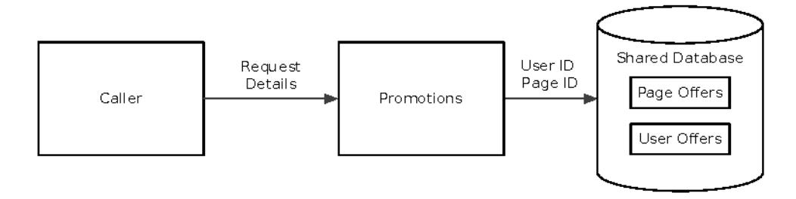

Instead of building a single "promotions service" as before, you could build two services that can each chime in when a new user hits your front end. In the next figure, each service makes a decision based on whatever user information is available.

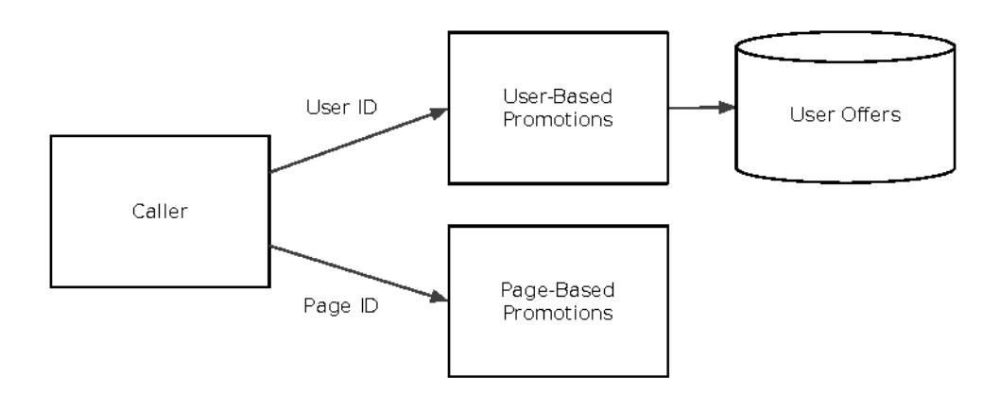

Each promotion service handles just one dimension. The user offers still need a database, but maybe the page-based offers just require a table of page types embedded in the code. After all, if you can deploy code changes in a matter of minutes, do you really need to invest in content management? Just call your source code repo the content management repository.

It's important to note that this doesn't *eliminate* complexity. Some irreducible —even essential—complexity remains. It does portion the complexity into different codebases, though. Each one should be easier to maintain and prune, just as it's easier to prune a bonsai juniper than a hundred-foot oak. Here, instead of making a single call, the consumer has to decide which of the services to call. It may need to issue calls in parallel and decide which response to use (if any arrive at all). One can further subdivide the complexity by adding an application-aware router between the caller and the offer services.

One service will probably outperform the other. (Though you need to define "outperform." Is it based just on the conversion rate? Or is it based on customer acquisition cost versus lifetime profitability estimates?) What should you do with the laggard? There are only five choices you can make:

- 1. Keep running both services, with all their attendant development and operational expenses.
- 2. Take away funding from the successful one and use that money to make the unsuccessful one better.
- Retool the unsuccessful one to work in a different area where it isn't headto-head competing with the better one. Perhaps target a different user segment or a different part of the customer life cycle.
- 4. Delete the unsuccessful one. Aim the developers at someplace where they can do something more valuable.
- 5. Give up, shut down the whole company, and open a hot dog and doughnut shop in Fiji.

The typical corporate approach would be #1 or #2. Starve the successful projects because they're "done" and double down on the efforts that are behind schedule or over budget. Not to mention that in a typical corporation, shutting down a system or service carries a kind of moral stigma. Choice #3 is a better approach. It preserves some value. It's a pivot.

You need to give serious consideration to #4, though. The most important part of evolution is extinction. Shut off the service, delete the code, and reassign the team. That frees up capacity to work on higher value efforts. It reduces dependencies, which is vital to the long-term health of your organization. Kill services in small grains to preserve the larger entity.

As for Fiji, it's a beautiful island with friendly people. Bring sunscreen and grow mangoes.

## Team-Scale Autonomy

You're probably familiar with the concept of the two-pizza team. This is Amazon founder and CEO Jeff Bezos's rule that every team should be sized no bigger than you can feed with two large pizzas. It's an important but misunderstood concept. It's not just about having fewer people on a team. That does have its own benefit for communication.

A self-sufficient two-pizza team also means each team member has to cover more than one discipline. You can't have a two-pizza team if you need a dedicated

DBA, a front-end developer, an infrastructure guru, a back-end developer, a machine-learning expert, a product manager, a GUI designer, and so on.

The two-pizza team is about reducing external dependencies. Every dependency is like one of the Lilliputian's ropes tying Gulliver to the beach. Each dependency thread may be simple to deal with on its own, but a thousand of them will keep you from breaking free.

### No Coordinated Deployments

The price of autonomy is eternal vigilance...or something like that. If you ever find that you need to update both the provider and caller of an service interface at the same time, it's a warning sign that those services are strongly coupled.

If you are the service provider, you are responsible. You can probably rework the interface to be backward-compatible. (See *Nonbreaking API Changes*, on page 263, for strategies to avoid breakage.) If not, consider treating the new interface as a new route in your API. Leave the old one in place for now. You can remove it in a few days or weeks, after your consumers have updated.

Dependencies across teams also create timing and queuing problems. Anytime you have to wait for others to do their work before you can do your work, everyone gets slowed down. If you need a DBA from the enterprise data architecture team to make a schema change before you can write the code, it means you have to wait until that DBA is done with other tasks and is available to work on yours. How high you are on the priority list determines when the DBA will get to your task.

The same goes for downstream review and approval processes. Architecture review boards, release management reviews, change control committees, and the People's Committee for Proper Naming Conventions...each review process adds more and more time.

This is why the concept of the two-pizza team is misunderstood. It's not just about having a handful of *coders* on a project. It's really about having a small group that can be self-sufficient and push things all the way through to production.

Getting down to this team size requires a lot of tooling and infrastructure support. Specialized hardware like firewalls, load balancers, and SANs must have APIs wrapped around them so each team can manage its own configuration without wreaking havoc on everyone else. The platform team I discussed in *Platform Team*, on page 292, has a big part to play in all this. The platform team's objective must be to enable and facilitate this team-scale autonomy.

### Beware Efficiency

"Efficiency" sounds like it could only ever be a good thing, right? Just trying telling your CEO that the company is too efficient and needs to introduce some inefficiency! But efficiency can go wrong in two crucial ways that hurt your adaptability.

Efficiency sometimes translates to "fully utilized." In other words, your company is "efficient" if every developer develops and every designer designs close to 100 percent of the time. This looks good when you watch the people. But if you watch how the *work* moves through the system, you'll see that this is anything but efficient. We've seen this lesson time and time again from *The Goal [Gol04]*, to *Lean Software Development [PP03]*, to *Principles of Product Development Flow [Rei09]*, to *Lean Enterprise [HM014]* and *The DevOps Handbook [KDWH16]*: Keep the people busy all the time and your overall pace slows to a crawl.

A more enlightened view of efficiency looks at the process from the point of view of the work instead of the workers. An efficient value stream has a short cycle time and high throughput. This kind of efficiency is better for the bottom line than high utilization. But there's a subtle trap here: as you make a value stream more efficient, you also make it more specialized to today's tasks. That can make it harder to change for the future.

We can learn from a car manufacturer that improved its cycle time on the production line by building a rig that holds the car from the inside. The new rig turned, lifted, and positioned the car as it moved along the production line, completely replacing the old conveyor belt. It meant that the worker (or robot) could work faster because the work was always positioned right in front of them. Workers didn't need to climb into the trunk to place a bolt from the inside. It reduced cycle time and had a side effect of reducing the space needed for assembly. All good, right? The bad news was that they then needed a custom rig for each specific type of vehicle. Each model required its own rig, and so it became more difficult to redesign the vehicle, or switch from cars to vans or trucks. Efficiency came at the cost of flexibility.

This is a fairly general phenomenon: a two-person sailboat is slow and labor-intensive, but you can stop at any sand bar that strikes your fancy. A container ship carries a lot more stuff, but it can only dock at deep water terminals. The container ship trades efficiency for flexibility.

Does this happen in the software industry? Absolutely. Ask anyone who relies on running builds with Visual Studio out of Team Foundation Server how easily they can move to Jenkins and Git. For that matter, just try to port your

build pipeline from one company to another. All the hidden connections that make it efficient also make it harder to adapt.

Keep these pitfalls in mind any time you build automation and tie into your infrastructure or platform. Shell scripts are crude, but they work everywhere. (Even on that Windows server, now that the "Windows Subsystem for Linux" is out of beta!) Bash scripts are that two-person sailboat. You can go anywhere, just not very quickly. A fully automated build pipeline that delivers containers straight into Kubernetes every time you make a commit and that shows commit tags on the monitoring dashboard will let you move a lot faster, but at the cost of making some serious commitments.

Before you make big commitments, use the grapevine in your company to find out what might be coming down the road. For example, in 2017 many companies are starting to feel uneasy about their level of dependency on Amazon Web Services. They are edging toward multiple clouds or just straightout migrating to a different vendor. If your company is one of them, you'd really like to know about it before you bolt your new platform onto AWS.

### Summary

Adaptability doesn't happen by accident. If there's a natural order to software, it's the Big Ball of Mud.<sup>4</sup> Without close attention, dependencies proliferate and coupling draws disparate systems into one brittle whole.

Let's now turn from the human side of adaptation to the structure of the software itself.

## System Architecture

In <u>The Evolution of Useful Things [Pet92]</u>, Henry Petroski argues that the old dictum "Form follows function" is false. In its place, he offers the rule of design evolution, "Form follows failure." That is, changes in the design of such commonplace things as forks and paper clips are motivated more by the things early designs do poorly than those things they do well. Not even the humble paper clip sprang into existence in its present form. Each new attempt differs from its predecessor mainly in its attempts to correct flaws.

The fledgling system must do some things right, or it would not have been launched, and it might do other things as well as the designers could conceive. Other features might work as built but not as intended, or they might be more difficult than they should be. In essence, there are gaps and protrusions

KWWZSZZODSXWJDE;XFGU

between the shape of the system and the solution space it's meant to occupy. In this section, we'll look at how the system's architecture can make it easier to adapt over time.

### Evolutionary Architecture

In <u>Building Evolutionary Architectures [FPK17]</u>, Neal Ford, Rebecca Parsons, and Patrick Kua define an evolutionary architecture as one that "supports incremental, guided change as a first principle across multiple dimensions." Given that definition, you might reasonably ask why anyone would build a nonevolutionary architecture!

Sadly, it turns out that many of the most basic architecture styles inhibit that incremental, guided change. For example, the typical enterprise application uses a layered architecture something like the one shown in the following illustration. The layers are traditionally separated to allow technology to change on either side of the boundary. How often do we really swap out the database while holding everything else constant? Very seldom. Layers enforce vertical isolation, but they encourage horizontal coupling.

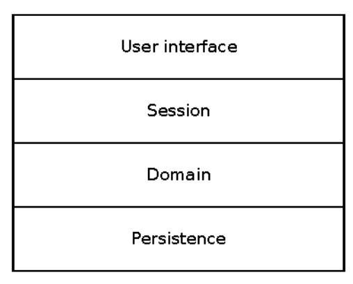

The horizontal coupling is much more likely to be a hindrance. You've probably encountered a system with three or four gigantic domain classes that rule the world. Nothing can change without touching one of those, but any time you change one, you have to contain ripples through the codebase—not to mention retesting the world.

What happens if we rotate the barriers 90 degrees? We get something like component-based architecture. Instead of worrying about how to isolate the domain layer from the database, we isolate components from each other. Components are only allowed narrow, formal interfaces between each other. If you squint, they look like microservice instances that happen to run in the same process.

### Bad Layering

Trouble arises when layers are built: any common change requires a drilling expedition to pierce through several of them. Have you ever checked in a commit that had a bunch of new files like "Foo," "FooController," "FooFragment," "FooMapper," "FooDTO," and so on? That is evidence of bad layering.

It happens when one layer's way of breaking down the problem space dominates the other layers. Here, the domain dominates, so when a new concept enters the domain, it has shadows and reflections in the other layers.

Layers could change independently if each layer expressed the fundamental concepts of that layer. "Foo" is not a persistence concept, but "Table" and "Row" are. "Form" is a GUI concept, as is "Table" (but a different kind of table than the persistence one!) The boundary between each layer should be a matter of translating concepts.

In the UI, a domain object should be atomized into its constituent attributes and constraints. In persistence, it should be atomized into rows in one or more tables (for a relational DB) or one or more linked documents.

What appears as a class in one layer should be mere data to every other layer.

Each component owns its whole stack, from database up through user interface or API. That does mean the eventual human interface needs a way to federate the UI from different components. But that's no problem at all! Components may present HTML pages with hyperlinks to themselves or other components. Or the UI may be served by a front-end app that makes API calls to a gateway or aggregator. Make a few of these component-oriented stacks and you'll arrive at a structure called "self-contained systems." <sup>5</sup>

This is one example of moving toward an evolutionary architecture. In the example we've just worked through, it allows incremental guided change along the dimensions of "business requirements" and "interface technology." You should get comfortable with some of the other architecture styles that lend themselves to evolutionary architecture:

Microservices Very small, disposable units of code. Emphasize scalability, team-scale autonomy. Vulnerable to coupling with platform for monitoring, tracing, and continuous delivery.

Microkernel and plugins In-process, in-memory message passing core with formal interfaces to extensions. Good for incremental change in requirements, combining work from different teams. Vulnerable to language and runtime environment.

KWWVSFVFDKLWHFWDMU

Event-based Prefers asynchronous messages for communication, avoiding direct calls. Good for temporal decoupling. Allows new subscribers without change to publishers. Allows logic change and reconstruction from history. Vulnerable to semantic change in message formats over time.

It may be clear from those descriptions, but every architecture style we've discovered so far has trade-offs. They'll be good in certain dimensions and weak in others. Until we discover the Ur-architecture that evolves in every dimension, we'll have to decide which ones matter most for our organizations. A startup in the hypergrowth stage probably values scaling the tech team much more than it values long-term evolution of the business requirements. An established enterprise that needs to depreciate its capital expenditure over five years needs to evolve along business requirements and also the technology platform.

### A Note on Microservices

Microservices are a technological solution to an organizational problem. As an organization grows, the number of communication pathways grows exponentially. Similarly, as a piece of software grows, the number of possible dependencies within the software grows exponentially.

Classes tend toward a power-law distribution. Most classes have one or a few dependencies, while a very small number have hundreds or thousands. That means any particular change is likely to encounter one of those and incur a large risk of "action at a distance." This makes developers hesitant to touch the problem classes, so necessary refactoring pressure is ignored and the problem gets worse. Eventually, the software degrades to a Big Ball of Mud.

The need for extensive testing grows with the software and the team size. Unforeseen consequences multiply. Developers need a longer ramp-up period before they can work safely in the codebase. (At some point, that ramp-up time exceeds your average developer tenure!)

Microservices promise to break the paralysis by curtailing the size of any piece of software. Ideally it should be no bigger than what fits in one developer's head. I don't mean that metaphorically. When shown on screen, the length of the code should be smaller than the coder's melon. That forces you to either write very small services or hire a very oddly proportioned development staff.

Another subtle issue about microservices that gets lost in the excitement is that they're great when you are scaling *up* your organization. But what happens when you need to downsize? Services can get orphaned easily. Even if they get adopted into a good home, it's easy to get overloaded when you have twice as many services as developers.

Don't pursue microservices just because the Silicon Valley unicorns are doing it. Make sure they address a real problem you're likely to suffer. Otherwise, the operational overhead and debugging difficulty of microservices will outweigh your benefits.

### Loose Clustering

Systems should exhibit loose clustering. In a loose cluster, the loss of an individual instance is no more significant than the fall of a single tree in a forest.

However, this implies that individual servers don't have differentiated roles. At the very least any differentiated roles are present in more than one instance. Ideally, the service wouldn't have any unique instance. But if it does need a unique role, then it should use some form of leader election. That way the service as a whole can survive the loss of the leader without manual intervention to reconfigure the cluster.

The members of a loose cluster can be brought up or down independently of each other. You shouldn't have to start the members in a specific sequence. In addition, the instances in a cluster shouldn't have any specific dependencies on—or even knowledge of—the individual instances of another cluster. They should only depend on a virtual IP address or DNS name that represents the service as a whole. Direct member-to-member dependencies create hard linkages preventing either side from changing independently. Take a look at the following figure for an example. The calling application instances in cluster 1 depend on the DNS name (bound to a load-balanced IP address) cluster 2 serves.

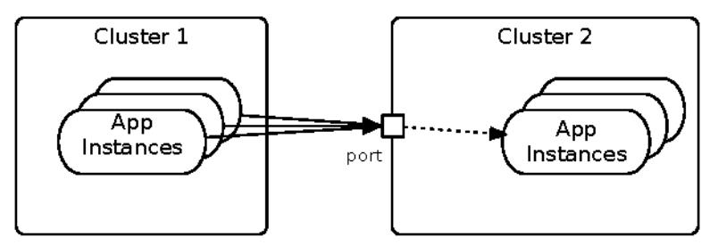

We can extend this "principle of ignorance" further. The members of a cluster should not be configured to know the identities of other members of the cluster. That would make it harder to add or remove members. It can also encourage point-to-point communication, which is a capacity killer.

The nuance behind this rule is that cluster members can *discover* who their colleagues are. That's needed for distributed algorithms like leader election and failure detection. The key is that this is a runtime mechanism that doesn't require static configuration. In other words, one instance can observe others appearing and disappearing in response to failures or scaling.

Loose clustering in this way allows each cluster to scale independently. It allows instances to appear, fail, recover, and disappear as the platform allows and as traffic demands.

### Explicit Context

Suppose your service receives this fragment of JSON inside a request:

^ LWHP '

How much do we know about the item? Is that string the item itself? Or is it an item identifier? Maybe the field would be better named "itemID." Supposing that it is an identifier, our service can't do very much with it. In fact, only four things are possible:

- 1. Pass it through as a token to other services. (This includes returning it to the same caller in the future.)
- Look it up by calling another service.
- Look it up in our own database.
- 4. Discard it.

In the first case, we're just using the "itemID" as a token. We don't care about the internal structure. In this case it would be a mistake to convert it from string to numeric. We'd be imposing a restriction that doesn't add any value and will probably need to be changed—with huge disruption—in the future.

In the second and third cases, we're using the "itemID" as something we can resolve to get more information. But there's a serious problem here. The bare string shown earlier doesn't tell us who has the authoritative information. If the answer isn't in our own database, we need to call another service. Which service?

This issue is so pervasive that it doesn't even look like a problem at first. In order to get item information, your service must already know who to call! That's an implicit dependency.

That implicit dependency limits you to working with just the one service provider. If you need to support items from two different "universes," it's going to be very disruptive.

Suppose instead the initial fragment of JSON looked like this:

```
^ LWHP,' KWWSV H[DPSOH FRP SROLFLHV
```

This URL still works if we just want to use it as an opaque token to pass forward. From one perspective, it's still just a Unicode string.

This URL also still works if we need to resolve it to get more information. But now our service doesn't have to bake in knowledge of the solitary authority. We can support more than one of them.

By the way, using a full URL also makes integration testing easier. We no longer need "test" versions of the other services. We can supply our own test harnesses and use URLs to those instead of the production authorities.

This example is all in the context of interservice communication. But making implicit context into explicit context has big benefits inside services as well. If you've worked on a Ruby on Rails system, you might have run into difficulty when trying to use multiple relational databases from a single service. That's because ActiveRecord uses an *implicit* database connection. This is convenient when there's just one database, but it becomes a hindrance when you need more than one.

Global state is the most insidious form of implicit context. That include configuration parameters. These will slow you down when you need to go from "one" to "more than one" of a collaboration.

### Create Options

Imagine you are an architect—the kind that makes buildings. Now you've been asked to add a new wing to the iconic Sydney Opera House. Where could you possibly expand that building without ruining it? The Australian landmark is finished. It is complete—a full expression of its vision. There is no place to extend it.

Take the same request, but now for the Winchester "Mystery" House in San Jose, California. Here's its description in Wikipedia:

Since its construction in 1884, the property and mansion were claimed by many, including Winchester herself, to be haunted by the ghosts of those killed with Winchester rifles. Under Winchester's day-to-day guidance, its "from-the-ground-up" construction proceeded around the clock, by some accounts, without interruption, until her death on September 5, 1922.<sup>7</sup>

Could you add a wing to this house without destroying the clarity of its vision? Absolutely. In some sense, continuous change is the vision of the house, or it was to its late owner. The Winchester house is not coherent in the way that the Opera House is. Stairways lead to ceilings. Windows look into rooms next door. You might call this "architecture debt." But you have to admit it allows for change.

The reason these differ is mechanical as much as it is artistic. A flat exterior wall on the Winchester house has the *potential* for a door. The smoothly curved

<sup>6.</sup> KWWZSZZZLQFKHPWWWUU\KRXVHFRP

KWWSHQ ZLNLSHIGZIDNELOGFKHVWHUBO\VWHU\B+RXVH

surfaces of Sydney's shells don't. A flat wall creates an option. A future owner can exercise that option to add a room, a hallway, or a stair to nowhere.

Modular systems inherently have more options than monolithic ones. Think about building a PC from parts. The graphics card is a module that you can substitute or replace. It gives you an option to apply a modification.

In <u>Design Rules [BC00]</u>, Carliss Y. Baldwin and Kim B. Clark identify six "modular operators." Their work was in the context of computer hardware, but it applies to distributed service-based systems as well. Every module boundary gives you an option to apply these operators in the future. Let's take a brief look at the operators and how they could apply in a software system.

### Splitting

Splitting breaks a design into modules, or a module into submodules. The following figure shows a system before and after splitting "Module 1" into three parts. This is often done to distribute work. Splitting requires insight into how the features can be decomposed so that cross-dependencies in the new modules are minimized and the extra work of splitting is offset by the increased value of more general modules.

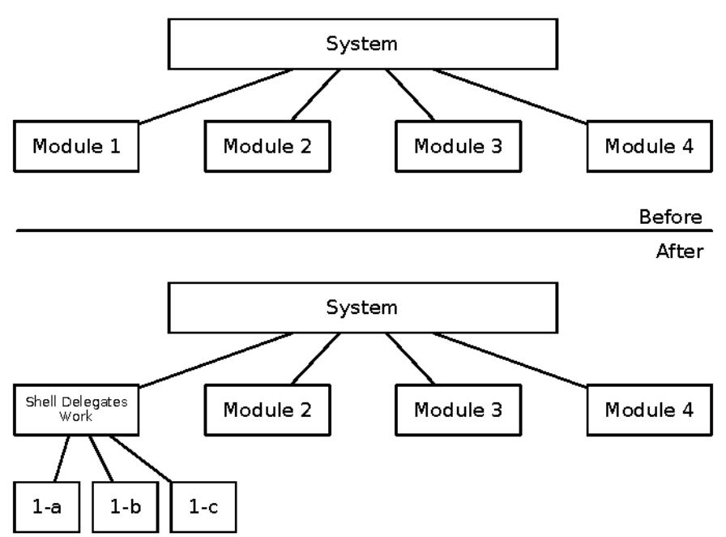

Example: We start with a module that determines how to ship products to a customer. It uses the shipping address to decide how many shipments to send, how much it'll cost, and when the shipments will arrive.

One way to split the module is shown in the next figure. Here, the parent module will invoke the submodules sequentially, using the results from one to pass into the next.

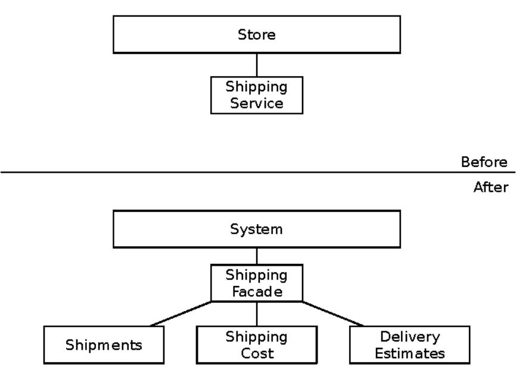

A different way to split the modules might be one per carrier. In that case, the parent could invoke them all in parallel and then decide whether to present the best result or all results to the user. This makes the modules act a bit more like competitors. It also breaks down the sequential dependency from the functional division illustrated in the previous figure. But where this division really shines is failure isolation. In the original decomposition, if just one of the modules is broken, then the whole feature doesn't work. If we divide the work by carrier, as illustrated in the figure on page 310, then one carrier's service may be down or malfunctioning but the others will continue to work. Overall, we can still ship things through the other carriers. Of course, this assumes the parent module makes calls in parallel and times out properly when a module is unresponsive.

The key with splitting is that the interface to the original module is unchanged. Before splitting, it handles the whole thing itself. Afterward, it delegates work to the new modules but supports the same interface.

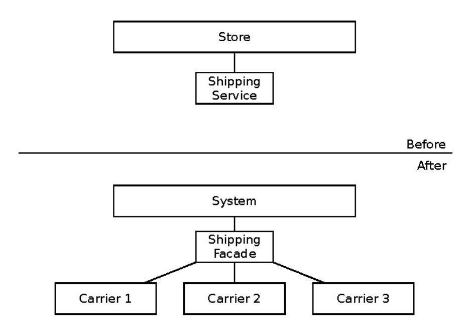

A great paper on splitting is David Parnas's 1971 paper, "On the Criteria to Be Used in Decomposing Systems."

### Substituting

Given a modular design, "substituting" is just replacing one module with another—swapping out an NVidia card for an AMD card or vice versa.

The original module and the substitute need to share a common interface. That's not to say they have identical interfaces, just that the portion of the interface needed by the parent system must be the same. Subtle bugs often creep in with substitutions.

In our running example, we might substitute a logistics module from UPS or FedEx in place of our original home-grown calculator.

#### Augmenting and Excluding

Augmenting is adding a module to a system. Excluding is removing one. Both of these are such common occurrences that we might not even think of them as design-changing operations. However, if you design your parent system to make augmenting and excluding into first-class priorities, then you'll reach a different design.

<sup>8.</sup> KWWUBSRVLWRNM\HGX FJL YLHZFRQWHQW FJL"DWJWFBPOSNFL FRQWH

For example, if you decompose your system along technical lines you might end up with a module that writes to the database, a module that renders HTML, a module that supports an API, and a module that glues them all together. How many of those modules could you exclude? Possibly the API or the HTML, but likely not both. The storage interface might be a candidate for substitution, but not exclusion!

Suppose instead you have a module that recommends related products. The module offers an API and manages its own data. You have another module that displays customer ratings, another that returns the current price, and one that returns the manufacturer's price. Now each of these could be excluded individually without major disruption.

The second decomposition offers more options. You have more places to exclude or augment.

#### Inversion

Inversion works by taking functionality that's distributed in several modules and raising it up higher in the system. It takes a good solution to a general problem, extracts it, and makes it into a first-class concern.

In the following figure, several services have their own way of performing A/B tests. This is a feature that each service built...and probably not in a consistent way. This would be a candidate for inversion. In the figure on page 312, you can see that the "experimentation" service is now lifted up to the top level of the system. Individual services don't need to decide whether to put a user in the control group or the test group. They just need to read a header attached to the request.

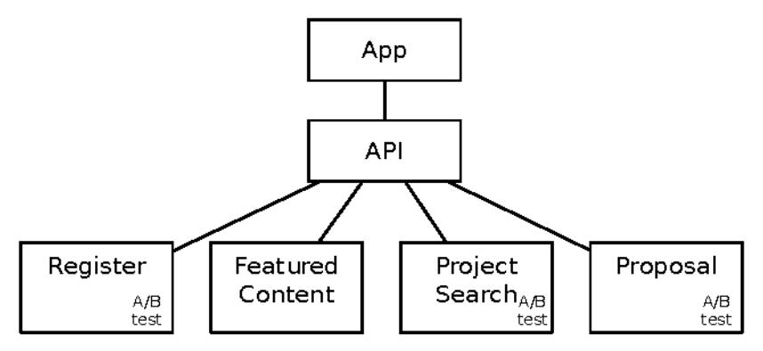

Inversion can be powerful. It creates a new dimension for variation and can reveal a business opportunity...like the entire market for operating systems.

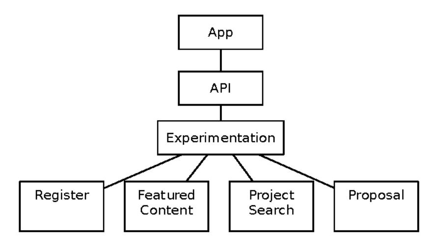

### Porting

Baldwin and Clark look at porting in terms of moving hardware or operating system modules from one CPU to another. We can take a more general view. Porting is really about repurposing a module from a different system. Any time we use a service created by a different project or system, we're "porting" that service to our system, as shown in the following figure.

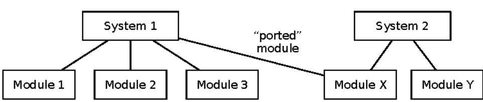

Porting risks adding coupling, though. It clearly means a new dependency, and if the road map of that service diverges from our needs, then we must make a substitution. In the meantime, though, we may still benefit from using it.

This is kind of analogous to porting C sources from one operating system to another. The calling sequences may look the same but have subtle differences that cause errors. The new consumer must be careful to exercise the module thoroughly via the same interface that will be used in production. That doesn't mean the new caller has to replicate all the unit and integration tests that the module itself runs. It's more that the caller should make sure its own calls work as expected.

Another way of "porting" a module into our system is through instantiation. We don't talk about this option very often, but nothing says that a service's code can only run in a single cluster. If we need to fork the code and deploy a new instance, that's also a way to bring the service into our system.

Baldwin and Clark argue that these six operators can create any arbitrarily complex structure of modules. They also show that the economic value of the system increases with the number of options—or boundaries—where you can apply these operators.

Keep these operators in your pocket as thinking tools as well. When you look at a set of features, think of three different ways to split them into modules. Think of how you can make modules that allow exclusion or augmentation. See where an inversion might be lurking.

### Summary

We've looked at a few ways to build your architecture to make it adaptable:

- Loose clusters are a great start.
- Use an evolutionary architecture with microservices, messages, microkernels, or something that doesn't start with m.
- Asynchrony helps here, just as it helps combat the stability antipatterns.
- Be explicit about context so that services can work with many participants instead of having an implied connection to just one.
- · Create options for the future. Make room to apply the modular operations.

There's one last source of inflexibility we need to address. That's in the way we structure, pass, and refer to data.

## Information Architecture

Information architecture is how we structure data. It's the data and metadata we use to describe the things that matter to our systems. We also need to keep in mind that it's *not* reality, or even a picture of reality. It's a set of related models that capture some facets of reality. Our job is to chose which facets to model, what to leave out, and how concrete to be.

When you're embedded in a paradigm, it's hard to see its limits. Many of us got started in the era of relational databases and object-oriented programming, so we tend to view the world in terms of related objects and their states. Relational databases are good at answering, "What is the value of attribute A on entity E right now?" But they're somewhat less good at keeping track of the history of attribute A on entity E. They're pretty awkward with graphs or hierarchies, and they're downright terrible at images, sound, or video.

Other database models are good at other questions.

Take the question, "Who wrote *Hamlet*?" In a relational model, that question has one answer: Shakespeare, William. Your schema might allow coauthors, but it surely wouldn't allow for the theory that Kit Marlowe wrote Shakespeare's plays. That's because the tables in a relational database are meant to represent *facts*. On the other hand, statements in an RDF triple store are assertions rather than facts. Every statement there comes with an implicit, "Oh yeah, who says?" attached to it.

Another perspective: In most databases, the act of changing the database is a momentary operation that has no long-lived reality of its own. In a few, however, the event itself is primary. Events are preserved as a journal or log. The notion of the current state is really to say, "What's the cumulative effect of everything that's ever happened?"

Each of these embeds a way of modeling the world. Each paradigm defines what you can and cannot express. None of them are the whole reality, but each of them can represent some knowledge about reality.

Your job in building systems is to decide what facets of reality matter to your system, how you are going to represent those, and how that representation can survive over time. You also have to decide what concepts will remain local to an application or service, and what concepts can be shared between them. Sharing concepts increases expressive power, but it also creates coupling that can hinder change.

In this section, we'll look at the most important aspects of information architecture as it affects adaptation. This is a small look at a large subject. For much more on the subject, see *Foundations of Databases [AHV94]* and *Data and Reality [Ken98]*.

## Messages, Events, and Commands

In "What Do You Mean by 'Event-Driven'?" Martin Fowler points out the unfortunate overloading of the word "event." He and his colleagues identified three main ways events are used, plus a fourth term that is often conflated with events:

- Event notification: A fire-and-forget, one-way announcement. No response is expected or used.
- Event-carried state transfer: An event that replicates entities or parts of entities so other systems can do their work

<sup>9.</sup> KWWSPOUWLQIFFEROPHOUUWLFOHV HYHQW GULYHQ KWPO

- Event sourcing: When all changes are recorded as events that describe the change
- Command-query responsibility segregation (CQRS): Reading and writing with different structures. Not the same as events, but events are often found on the "command" side.

Event sourcing has gained support thanks to Apache Kafka, <sup>10</sup> which is a persistent event bus. It blends the character of a message queue with that of a distributed log. Events stay in the log forever, or at least until you run out of space. With event sourcing, the events themselves become the authoritative record. But since it can be slow to walk through every event in history to figure out the value of attribute A on entity E, we often keep views to make it fast to answer that question. See the following figure for illustration.

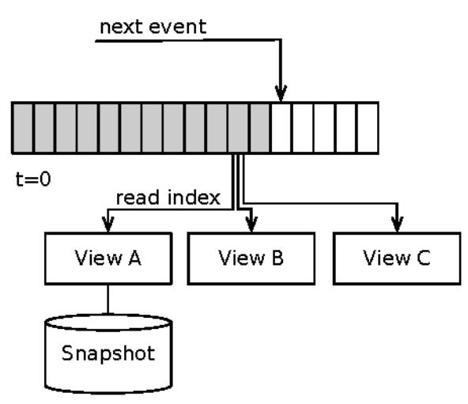

With an event journal, several views can each project things in a different way. None of them is more "true" than others. The event journal is the only truth. The others are caches, optimized to answer a particular kind of question. These views may even store their current state in a database of their own, as shown with the "snapshot" in the previous diagram.

Versioning can be a real challenge with events, especially once you have years' worth of them. Stay away from closed formats like serialized objects. Look toward open formats like JSON or self-describing messages. Avoid frameworks that require code generation based on a schema. Likewise avoid anything that requires you to write a class per message type or use annotation-based

<sup>10.</sup> KWWNDID DSDFKJH RU

mapping. Treat the messages like data instead of objects and you're going to have a better time supporting very old formats.

You'll want to apply some of the versioning principles discussed in <u>Chapter 14</u>, <u>Handling Versions</u>, on page 263. In a sense, a message sender is communicating with a future (possibly not-yet-written) interface. A message reader is receiving a call from the distant past. So data versioning is definitely a concern.

Using messages definitely brings complexity. People tend to express business requirements in an inherently synchronous way. It requires some creative thinking to transform them to be asynchronous.

### Services Control Their Identifiers

Suppose you work for an online retailer and you need to build a "catalog" service. You'll see in *Embrace Plurality*, on page 321, that *one* catalog will never be enough. A catalog service should really handle many catalogs. Given that, how should we identify which catalog goes with which user?

The first, most obvious approach is to assign an owner to each catalog, as shown in the following figure. When a user wants to access a particular catalog, the owner ID is included in the request.

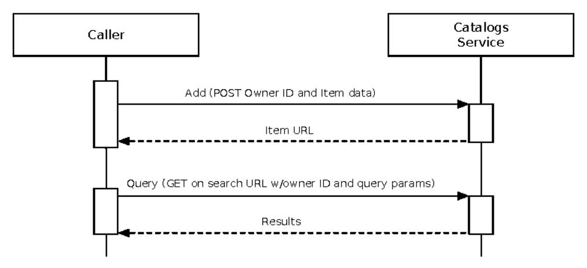

This has two problems:

The catalog service must couple to one particular authority for users. This
means that the caller and the provider have to participate in the same
authentication and authorization protocol. That protocol certainly stops
at the edge of your organization, so it automatically makes it hard to work
with partners. But it also increases the barrier to use of the new service.

2. One owner can only have one catalog. If a consuming application needs more than one catalog, it has to create multiple identities in the authority service (multiple account IDs in Active Directory, for example).

We should remove the idea of ownership from the catalog service altogether. It should be happy to create many, many fine catalogs for anyone who wants one. That means the protocol looks more like the next figure. Any user can create a catalog. The catalog service issues an identifier for that specific catalog. The user provides that catalog ID on subsequent requests. Of course, a catalog URL is a perfectly adequate identifier.

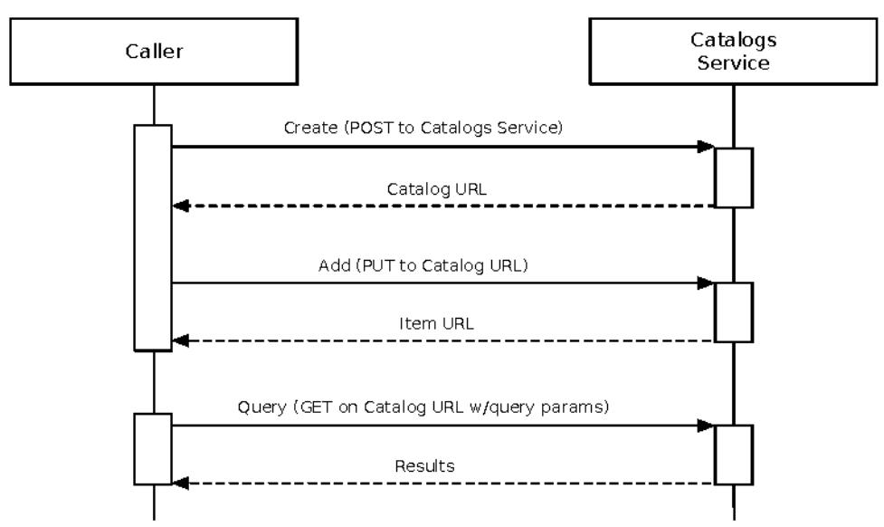

In effect, the catalog service acts like a little standalone SaaS business. It has many customers, and the customers get to decide how they want to use that catalog. Some users will be busy and dynamic. They will change their catalogs all the time. Other users may be limited in time, maybe just building a catalog for a one-time promotion. That's totally okay. Different users may even have different ownership models.

You probably still need to ensure that callers are allowed to access a particular catalog. This is especially true when you open the service up to your business partners. As shown in the figure on page 318, a "policy proxy" can map from a client ID (whether that client is internal or external makes no difference) to a catalog ID. This way, questions of ownership and access control can be factored out of the catalog service itself into a more centrally controlled location.

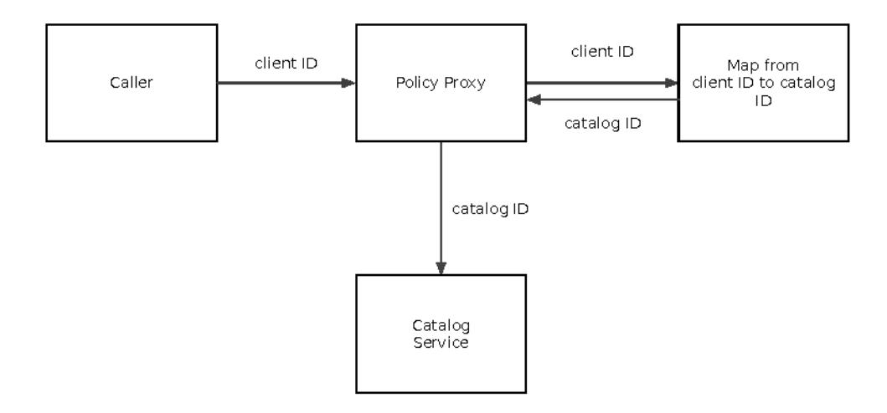

Services should issue their own identifiers. Let the caller keep track of ownership. This makes the service useful in many more contexts.

### URL Dualism

We can use quotation marks when we want to talk about a word, rather than using the word itself. For example, we can say the word "verbose" means "using too many words." It's a bit like the difference between a pointer and a value. We understand that the pointer stands in as a way to refer to the value.

URLs have the same duality. A URL is a reference to a representation of a value. You can exchange the URL for that representation by resolving it—just like dereferencing the point. Like a pointer, you can also pass the URL around as an identifier. A program may receive a URL, store it as a text string, and pass it along without ever attempting to resolve it. Or your program might store the URL as an identifier for some thing or person, to be returned later when a caller presents the same URL.

If we truly make use of this dualism, we can break a lot of dependencies that otherwise seem impossible.

Here's another example drawn from the world of online retail. A retailer has a spiffy site to display items. The typical way to get the item information is shown in the figure on page 319. An incoming request contains an item ID. The front end looks up that ID in the database, gets the item details, and displays them.

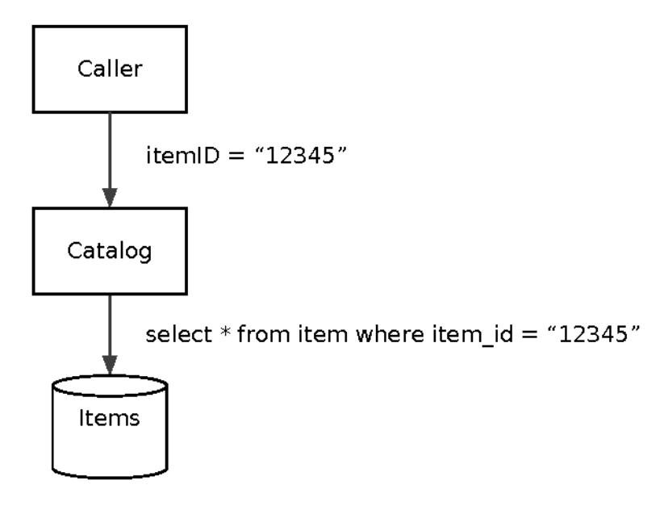

Obviously this works. A lot of business gets done with this model! But consider the chain of events when our retailer acquires another brand. Now we have to get all the retailer's items into our database. That's usually very hard, so we decide to have the front end look at the item ID and decide which database to hit, as shown in the figure that follows.

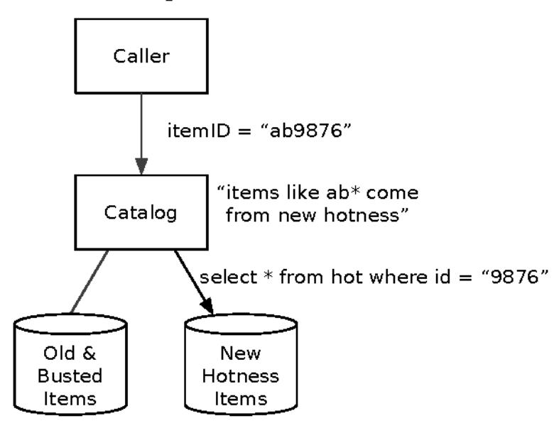

The problem is that we now have exactly two databases of items. In computer systems, "two" is a ridiculous number. The only numbers that make sense are "zero," "one," and "many." We can use URL dualism to support many databases by using URLs as both the item identifier and a resolvable resource. That model is shown in the following figure.

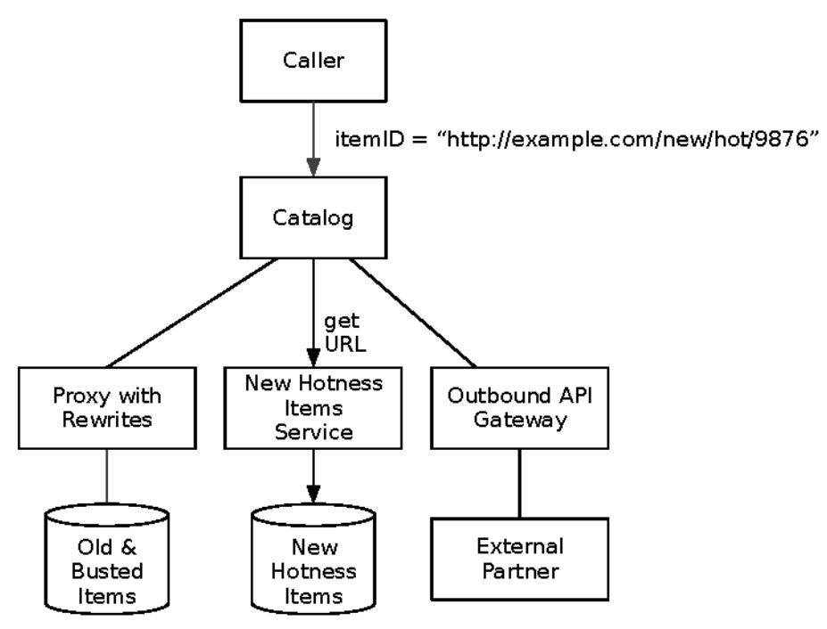

It might seem expensive to resolve every URL to a source system on every call. That's fine; introduce an HTTP cache to reduce latency.

The beautiful part of this approach is that the front end can now use services that didn't even exist when it was created. As long as the new service returns a useful representation of that item, it will work.

And who says the item details have to be served by a dynamic, database-backed service? If you're only ever looking these up by URL, feel free to publish static JSON, HTML, or XML documents to a file server. For that matter, nothing says these item representations even have to come from inside your own company. The item URL could point to an outbound API gateway that proxies a request to a supplier or partner.

You might recognize this as a variation of "Explicit Context." (See *Explicit Context*, on page 306.) We use URLs because they carry along the context we need to fetch the underlying representation. It gives us much more flexibility than plugging item ID numbers into a URL template string for a service call.

You do need to be a bit careful here. Don't go making requests to any arbitrary URL passed in to you by an external user. See Chapter 11, Security, on page 215, for a shocking array of ways attackers could use that against you. In practice, you need to encrypt URLs that you send out to users. That way you can verify that whatever you receive back is something you generated.

### Embrace Plurality

One of the basic enterprise architecture patterns is the "Single System of Record." The idea is that any particular concept should originate in exactly one system, and that system will be the enterprise-wide authority on entities within that concept.

The hard part is getting all parts of the enterprise to agree on what those concepts actually are.

Pick an important noun in your domain, and you'll find a system that should manage every instance of that noun. Customer, order, account, payment, policy, patient, location, and so on. A noun looks simple. It fools us. Across your organization, you'll collect several definitions of every noun. For example:

- A customer is a company with which we have a contractual relationship.
- A customer is someone entitled to call our support line.
- A customer is a person who owes us money or has paid us money in the past.
- A customer is someone I met at a trade show once that might buy something someday in the future.

So which is it? The truth is that a customer is all of these things. Bear with me for a minute while I get into some literary theory. Nouns break down. Being a "customer" isn't the defining trait of a person or company. Nobody wakes up in the morning and says, "I'm happy to be a General Mills customer!" "Customer" describes one facet of that entity. It's about how your organization relates to that entity. To your sales team, a customer is someone who might someday sign another contract. To your support organization, a customer is someone who is allowed to raise a ticket. To your accounting group, a customer is defined by a commercial relationship. Each of those groups is interested in different attributes of the customer. Each applies a different life cycle to the idea of what a customer is. Your support team doesn't want its "search by name" results cluttered up with every prospect your sales team ever pursued. Even the question, "Who is allowed to create a customer instance?" will vary.

This challenge was the bane of enterprise-wide shared object libraries, and it's now the bane of enterprise-wide shared services.

As if those problems weren't enough, there's also the "dark matter" issue. A system of record must pick a model for its entities. Anything that doesn't fit the model can't be represented there. Either it'll go into a different (possibly covert) database or it just won't be represented anywhere.

Instead of creating a single system of record for any given concept, we should think in terms of federated zones of authority. We allow different systems to own their own data, but we emphasize interchange via common formats and representations. Think of this like duck-typing for the enterprise. If you can exchange a URL for a representation that you can use like a customer, then as far as you care, it is a customer service, whether the data came from a database or a static file.

### Avoid Concept Leakage

An electronics retailer was late to the digital music party. But it wanted to start selling tracks on its website. The project presented many challenges to its data model. One of the tough nuts was about pricing. The company's existing systems were set up to price every item individually. But with digital music, the company wanted the ability to price and reprice items in very large groups. Hundreds of thousands of tracks might go from \$0.99 to \$0.89 overnight. None of its product management or merchandising tools could handle that.

Someone created a concept of a "price point" as an entity for the product management database. That way, every track record could have a field for its specific price point. Then all the merchant would need to do is change the "amount" field on the price point and all related tracks would be repriced.

This was an elegant solution that directly matched the users' conceptual model of pricing these new digital tracks. The tough question came when we started talking about all the *other* downstream systems that would need to receive a feed of the price points.

Until this time, items had prices. The basic customer-visible concepts of category, product, and item were very well established. The internal hierarchy of department, class, and subclass were also well understood. Essentially every system that received item data also received these other concepts.

But would they all need to receive the "price point" data as well?

Introducing price point as a global concept across the retailer's entire constellation of systems was a massive change. The ripple effect would be felt for years. Coordinating all the releases needed to introduce that concept would make Rube Goldberg shake his head in sadness. But it looked like that was required because every other system certainly needed to know what price to display, charge, or account for on the tracks.

But price point was not a concept that other systems needed for their own purposes. They just needed it because the item data was now incomplete thanks to an upstream data model change.

That was a concept leaking out across the enterprise. Price point was a concept the upstream system needed for leverage. It was a way to let the humans deal with complexity in that product master database. To every system downstream it was incidental complexity. The retailer would've been just as well served if the upstream system flattened out the price attribute onto the items when it published them.

There's no such thing as a natural data model, there are only choices we make about how to represent things, relationships, and change over time. We need to be careful about exposing internal concepts to other systems. It creates semantic and operational coupling that hinders future change.

### Summary

We don't capture reality, we only model some aspects of it. There's no such thing as a "natural" data model, only choices that we make. Every paradigm for modeling data makes some statements easy, others difficult, and others impossible. It's important to make deliberate choices about when to use relational, document, graph, key-value, or temporal databases.

We always need to think about whether we should record the new state or the change that caused the new state. Traditionally, we built systems to hold the current state because there just wasn't enough disk space in the world. That's not our problem today!

Use and abuse of identifiers causes lots of unnecessary coupling between systems. We can invert the relationship by making our service issue identifiers rather than receiving an "owner ID." And we can take advantage of the dual nature of URLs to both act like an opaque token or an address we can dereference to get an entity.

Finally, we must be careful about exposing concepts to other systems. We may be forcing them to deal with more structure and logic than they need.

## Wrapping Up

Change is the defining characteristic of software. That change—that adaptation—begins with release. Release is the beginning of the software's true life; everything before that release is gestation. Either systems grow over time, adapting to their changing environment, or they decay until their costs outweigh their benefits and then die.

We can make change cost less and hurt less by planning for releases to production as an integral part of our software. That's in contrast to designing for change inside the software but disregarding the act of making that change live in production.
