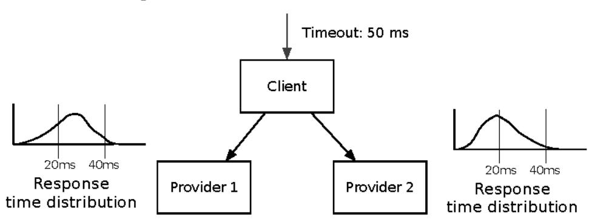
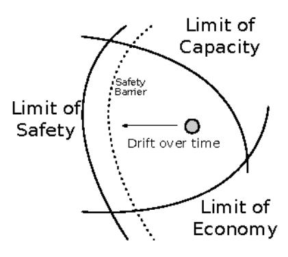

# Chapter 17: Chaos Engineering

Imagine a conversation that starts like this:

"Hey boss, I'm going to log into production and kill some boxes. Just a few here and there. Shouldn't hurt anything," you say.

How do you think the rest of that conversation will go? It might end up with a visit from Human Resources and an order to clean out your desk. Maybe even a visit to the local psychiatric facility! Killing instances turns out to be a radical idea—but not a crazy one. It's one technique in an emerging discipline called "chaos engineering."

## Breaking Things to Make Them Better

According to the principles of chaos engineering, 1 chaos engineering is "the discipline of experimenting on a distributed system in order to build confidence in the system's capability to withstand turbulent conditions in production." That means it's empirical rather than formal. We don't use models to understand what the system *should* do. We run experiments to learn what it *does*.

Chaos engineering deals with distributed systems, frequently large-scale systems. Staging or QA environments aren't much of a guide to the large-scale behavior of systems in production. In <u>Scaling Effects</u>, on page 71, we saw how different ratios of instances can cause qualitatively different behavior in production. That also applies to traffic. Congested networks behave in a qualitatively different way than uncongested ones. Systems that work fine in a low-latency, low-loss network may break badly in a congested network. We also have to think about the economics of staging environments. They're never going to be full-size replicas of production. Are you going to build a

KW WS5U LQFLS OH VRJIFKDR V RU

second Facebook as the staging version of Facebook? Of course not. This all makes it hard to gain understanding of a whole system from a non-production environment.

Why all the emphasis on the full system? Many problems only reveal themselves in the whole system (for example, excessive retries leading to timeouts, cascading failures, dogpiles, slow responses, and single points of failure, to name a few).

We can't simulate these in a nonproduction environment because of the scale problem. We also can't gain confidence by testing components in isolation. It turns out that like concurrency, safety is not a composable property. Two services may each be safe on their own, but the composition of them isn't necessarily safe. For example, consider the system in the following figure. The client enforces a 50-millisecond timeout on its calls. Each of the providers has the response time distribution shown: an average of 20 milliseconds, but an observed 99.9 percentile of 30 milliseconds.

The client can call either of the services with high confidence. But suppose it needs to call *both* of them in sequence. On average, the two calls will still meet the 50-millisecond time budget. A sizable percentage of calls are going to break that window, though. The client now looks unreliable. This is why chaos engineering emphasizes the whole-system perspective. It deals with emergent properties that can't be observed in the individual components.

## Antecedents of Chaos Engineering

Chaos engineering draws from many other fields related to safety, reliability, and control, such as cybernetics, complex adaptive systems, and the study of high-reliability organizations. In particular, the multidisciplinary field of resilience engineering offers a rich area to explore for new directions in chaos.2

2. KWWSZZNLWFKHQVRDS FRP HVLOLHQJFH HQJLQHHULQJ SDUW L

In *Drift into Failure [Sid11]* Sidney Dekker, one of the pioneers in resilience engineering, talks about "drift" as a phenomenon. A system exists in a realm with three key boundaries, as shown in the figure. (In this context, when Dekker talks about *systems*, he means the whole collection of people, technology, and processes, not just the information systems.) Over time, there's pressure to increase the economic return of the system. Human nature also

means people don't want to work at the upper limit of possible productivity. Those forces combine to create a gradient that pushes the whole system closer to the safety boundary and the barriers we create to prevent disasters.

Dekker illustrates this idea using an airliner as an example. Jet aircraft can fly faster at higher altitudes (subject to a trade-off in fuel efficiency). Faster trips mean more turnarounds on the aircraft and thus greater revenue via carrying more passengers. However, at the optimum flight altitude for revenue, the range between the aircraft's stall speed and the speed where the flight surfaces create turbulence are much closer together than where the air is thicker. Consequently, there's less room for error at the economically optimum altitude.

We can see the same effect in a distributed system (using *system* in our usual sense here). In the absence of other forces, we will optimize the system for maximum gain. We'll push throughput up to the limit of what the machines and network can bear. The system will be maximally utilized and maximally profitable...right up until the time a disruption occurs.

Highly efficient systems handle disruption badly. They tend to break all at once.

Chaos engineering provides that balancing force. It springs from the view that says we need to optimize our systems for availability and tolerance to disruption in a hostile, turbulent world rather than aiming for throughput in an idealized environment.

Another thread that led to chaos engineering has to do with the challenge of measuring events that *don't* happen. In *General Principles of Systems Design [Wei88]*, Gerald Weinberg describes the "fundamental regulator paradox" (where *regulator* is used in the sense of a feedback and control component, not in a governmental context):

The task of a regulator is to eliminate variation, but this variation is the ultimate source of information about the quality of its work. Therefore, the better job a regulator does, the less information it gets about how to improve.

This was once paraphrased as, "You don't know how much you depend on your IT staff until they go on vacation."

A related paradox is the "Volkswagen microbus" paradox: You learn how to fix the things that often break. You don't learn how to fix the things that rarely break. But that means when they do break, the situation is likely to be more dire. We want a continuous low level of breakage to make sure our system can handle the big things.

Finally, Nassim Taleb's <u>Antifragile [Tal12]</u> describes systems that improve from stresses. Distributed information systems don't naturally fall into that category! In fact, we expect that disorder will occur, but we want to make sure there's enough of it during normal operation that our systems aren't flummoxed when it does occur. We use chaos engineering the way a weightlifter uses iron: to create tolerable levels of stress and breakage to increase the strength of the system over time.

## The Simian Army

Probably the best known example of chaos engineering is Netflix's "Chaos Monkey." Every once in a while, the monkey wakes up, picks an autoscaling cluster, and kills one of its instances. The cluster should recover automatically. If it doesn't, then there's a problem and the team that owns the service has to fix it.

The Chaos Monkey tool was born during Netflix's migration to Amazon's AWS cloud infrastructure and a microservice architecture. As services proliferated, engineers found that availability could be jeopardized by an increasing number of components. Unless they found a way to make the whole service immune to component failures, they would be doomed. So every cluster needed to autoscale and recover from failure of any instance. But how can you make sure that every deployment of every cluster stays robust when hidden coupling is so easy to introduce?

The company's choice was not an "either/or" between making components more robust versus making the whole system more robust. It was an "and." They would use stability patterns to make individual instances more likely to survive. But there's no amount of code you can put into an instance that keeps AWS from terminating the instance! Instances in AWS get terminated just often enough to be a big problem as you scale, but not so often that every

deployment of every service would get tested. Basically, Netflix needed failures to happen *more often* so that they became totally routine. (This is an example of the agile adage, "If something hurts, do it more often.")

Other monkeys have followed: Latency Monkey, Janitor Monkey, Conformity Monkey, and even Chaos Kong. Netflix has made the "Simian Army" open source.3 From this, the company has learned every new kind of monkey it creates improves its overall availability. Second, as noted by Heather Nakama at the third Chaos Community Day, people really like the word "monkey."

### Opt In or Opt Out?

At Netflix, chaos is an opt-out process. That means every service in production will be subject to Chaos Monkey. A service owner can get a waiver, but it requires sign-off. That isn't just a paper process...exempt services go in a database that Chaos Monkey consults. Being exempt carries a stigma. Engineering management reviews the list periodically and prods service owners to fix their stuff.

Other companies adopting chaos engineering have chosen an opt-in approach. Adoption rates are much lower in opt-in environments than in opt-out. However, that may be the only feasible approach for a mature, entrenched architecture. There may simply be too much fragility to start running chaos tests everywhere.

When you're adding chaos to an organization, consider starting with opting in. That will create much less resistance and allow you to publicize some success stories before moving to an opt-out model. Also, if you start with opt-out, people might not fully understand what they're opting out from. Or rather, they might not realize how serious it could be if they *don't* respond to the opt-out but should have!

## Adopting Your Own Monkey

When Chaos Monkey launched, most developers were surprised by how many vulnerabilities it uncovered. Even services that had been in production for ages turned out to have subtle configuration problems. Some of them had cluster membership rosters that grew without bounds. Old IP addresses would stay on the list, even though the owner would never be seen again. (Or worse, if that IP came back it was as a different service!)

KW W@SHWIOL[JLWKXELR

### Prerequisites

First of all, your chaos engineering efforts can't kill your company or your customers.

In a sense, Netflix had it easy. Customers are familiar with pressing the play button again if it doesn't work the first time. They'll forgive just about anything except cutting off the end of *Stranger Things*. If every single request in your system is irreplaceably valuable, then chaos engineering is not the right approach for you. The whole point of chaos engineering is to disrupt things in order to learn how the system breaks. You must be able to break the system without breaking the bank!

You also want a way to limit the exposure of a chaos test. Some people talk about the "blast radius"...meaning the magnitude of bad experiences both in terms of the sheer number of customers affected and the degree to which they're disrupted. To keep the blast radius under control, you often want to pick "victims" based on a set of criteria. It may be as simple as "every 10,000th request will fail" when you get started, but you'll soon need more sophisticated selections and controls.

You'll need a way to track a user and a request through the tiers of your system, and a way to tell if the whole request was ultimately successful or not. That trace serves two purposes. If the request succeeds, then you've uncovered some redundancy or robustness in the system. The trace will tell you where the redundancy saves the request. If the request fails, the trace will show you where that happened, too.

You also have to know what "healthy" looks like, and from what perspective. Is your monitoring good enough to tell when failure rates go from 0.01 percent to 0.02 percent for users in Europe but not in South America? Be wary that measurements may fail when things get weird, especially if monitoring shares the same network infrastructure as production traffic. Also, as Charity Majors, CEO of Honeycomb.io says, "If you have a wall full of green dashboards, that means your monitoring tools aren't good enough." There's always something weird going on.

Finally, make sure you have a recovery plan. The system may not automatically return to a healthy state when you turn off the chaos. So you will need to know what to restart, disconnect, or otherwise clean up when the test is done.

### Designing the Experiment

Let's say you've got great measurements in place. Your A/B testing system can tag a request as part of a control group or a test group. It's not quite time to randomly kill some boxes yet. First you need to design the experiment, beginning with a hypothesis.

The hypothesis behind Chaos Monkey was, "Clustered services should be unaffected by instance failures." Observations quickly invalidated that hypothesis. Another hypothesis might be, "The application is responsive even under high latency conditions."

As you form the hypothesis, think about it in terms of invariants that you expect the system to uphold even under turbulent conditions. Focus on externally observable behavior, not internals. There should be some healthy steady state that the system maintains as a whole.

Once you have a hypothesis, check to see if you can even tell if the steady state holds now. You might need to go back and tweak measurements. Look for blind spots like a hidden delay in network switches or a lost trace between legacy applications.

Now think about what evidence would cause you to reject the hypothesis. Is a non-zero failure rate on a request type sufficient? Maybe not. If that request starts outside your organization, you probably have some failures due to external network conditions (aborted connections on mobile devices, for example). You might have to dust off those statistics textbooks to see how large a change constitutes sufficient evidence.

## Injecting Chaos

The next step is to apply your knowledge of the system to inject chaos. You know the structure of the system well enough to guess where you can kill an instance, add some latency, or make a service call fail. These are all "injections." Chaos Monkey does one kind of injection: it kills instances.

Killing instances is the most basic and crude kind of injection. It will absolutely find weaknesses in your system, but it's not the end of the story.

Latency Monkey adds latency to calls. This strategy finds two additional kinds of weaknesses. First, some services just time out and report errors when they should have a useful fallback. Second, some services have undetected race conditions that only become apparent when responses arrive in a different order than usual.

When you have deep trees of service calls, your system may be vulnerable to loss of a whole service. Netflix uses failure injection testing (FIT) to inject more subtle failures.4 (Note that this is not the same "FIT" as the "framework for integrated testing" in *Nonbreaking API Changes*, on page 263.) FIT can tag a request at the inbound edge (at an API gateway, for example) with a cookie that says, "Down the line, this request is going to fail when service *G* calls service *H*." Then at the call site where *G* would issue the request to *H*, it looks at the cookie, sees that this call is marked as a failure, and reports it as failed, without even making the request. (Netflix uses a common framework for all its outbound service calls, so it has a way to propagate this cookie and treat it uniformly.)

Now we have three injections that can be applied in various places. We can kill an instance of any autoscaled cluster. We can add latency to any network connection. And we can cause any service-to-service call to fail. But which instances, connections, and calls are *interesting* enough to inject a fault? And where should we inject that fault?

### Introducing Chaos to Your Neighbors

by: Nora Jones, Senior Software Engineer and Coauthor of Chaos Engineering (O'Reilly, 2017)

I was hired as the first and only person working on internal tools and developer productivity at a brand new e-commerce startup during a pivotal time. We had just launched the site, we were releasing code multiple times a day, and not to mention our marketing team was crushing it, so we already had several customers expecting solid performance and availability from the site from day one.

The lightning feature development speed led to a lack of tests and general caution, which ultimately led to precarious situations at times that were not ideal (read: being paged at 4 a.m. on a Saturday). About two weeks into my role at this company, my manager asked me if we could start experimenting with chaos engineering to help detect some of these issues before they became major outages. Given that I was new to the company and didn't know all my colleagues yet, I started this effort by sending an email to all the developers and business owners informing them we were beginning implementation of chaos engineering in QA and if they considered their services "unsafe to chaos" to let me know and they could opt out the first round. I didn't get much response. After a couple weeks of waiting and nagging I assumed the silence implied consent and unleashed my armies of chaos. We ended up taking QA down for a week and I pretty much ended up meeting everyone that worked at the company. Moral of the story: chaos engineering is a quick way to meet your new colleagues, but it's not a great way. Proceed with caution and control yourfailures delicately, especially when it's the first time you're enabling chaos.

4. KWWSPWGLXPFRPQHWIOL[WHFHKE@MHHFWWRRQLWDKWWLQJ G H D EE

### Targeting Chaos

You could certainly use randomness. This is how Chaos Monkey works. It picks a cluster at random, picks an instance at random, and kills it. If you're just getting started with chaos engineering, then random selection is as good a process as any. Most software has so many problems that shooting at random targets will uncover something alarming.

Once the easy stuff is fixed, you'll start to see that this is a search problem. You're looking for faults that lead to failures. Many faults won't cause failures. In fact, on any given day, most faults don't result in failures. (More about that later in this chapter.) When you inject faults into service-to-service calls, you're searching for the crucial calls. As with any search problem, we have to confront the challenge of dimensionality.

Suppose there's a partner data load process that runs every Tuesday. A fault during one part of that process causes bad data in the database. Later, when using that data to present an API response, a service throws an exception and returns a 500 response code. How likely are you to find that problem via random search? Not very likely.

Randomness works well at the beginning because the search space for faults is densely populated. As you progress, the search space becomes more sparse, but not uniform. Some services, some network segments, and some combinations of state and request will still have latent killer bugs. But imagine trying to exhaustively search a  $\ ^{\prime}$  dimensional space, where n is the number of calls from service to service. In the worst case, if you have x services, there could be  $\ ^{\prime}$  possible faults to inject!

At some point, we can't rely just on randomness. We need a way to devise more targeted injections. Humans can do that by thinking about how a successful request works. A top-level request generates a whole tree of calls that support it. Kick out one of the supports, and the request may succeed or it may fail. Either way we learn something. This is why it's important to study all the times when faults happen without failures. The system did something to keep that fault from becoming a failure. We should learn from those happy outcomes, just as we learn from the negative ones.

As humans, we apply our knowledge of the system together with abductive reasoning and pattern matching. Computers aren't great at that, so we still have an edge when picking targets for chaos. (But see *Cunning Malevolent Intelligence*, on page 334, for some developing work.)

## Cunning Malevolent Intelligence

Peter Alvaro, a researcher at the University of California—Santa Cruz, works on principles for learning how to break systems by observing what they do well. It starts by collecting traces of normal workload. That workload will be subject to the usual daily stresses of production operations, but it isn't *deliberately* perturbed by chaos engineering. (At least, not quite yet.)

Using those traces, it's possible to build a database of inferences about what services a request type needs. That looks like a graph, so we can use graph algorithms to find links to cut with an experimentation platform. (See *Automate and Repeat*, on page 334, to read about ChAP, Netflix's experimentation platform.) Once that link is cut, we may find that the request continues to succeed. Maybe there's a secondary service, so we can see a new call that wasn't previously active. That goes into the database, just like we humans would learn about the redundancy. There may not be a secondary call, but we just learn that the link we cut wasn't that crucial after all.

A few iterations of this process can drastically narrow down the search space. Peter calls this building a "cunning malevolent intelligence." It can dramatically reduce the time needed to run productive chaos tests.

### Automate and Repeat

So far, this sounds like an engineering lab course. Shouldn't something called "chaos" be fun and exciting? No! In the best case, it's totally boring because the system just keeps running as usual.

Assuming we did find a vulnerability, things probably got at least a little exciting in the recovery stages. You'll want to do two things once you find a weakness. First, you need to fix that specific instance of weakness. Second, you want to see what other parts of your system are vulnerable to the same class of problem.

With a known class of vulnerability, it's time to find a way to automate testing. Along with automation comes moderation. There's such a thing as too much chaos. If the new injection kills instances, it probably shouldn't kill the last instance in a cluster. If the injection simulates a request failure between service G to service H, then it isn't meaningful to simultaneously fail requests from G to every fallback it uses when H isn't working!

Companies with dedicated chaos engineering teams are all building platforms that let them decide how much chaos to apply, when, to whom, and which services are off-limits. These make sure that one poor customer doesn't get

flagged for all the experiments at once! For example, Netflix calls its the "Chaos Automation Platform" (ChAP).5

The platform makes decisions about what injections to apply and when, but it usually leaves the "how" up to some existing tool. Ansible is a popular choice, since it doesn't require a special agent on the targeted nodes. The platform also needs to report its tests to monitoring systems, so you can correlate the test events with changes in production behavior.

### Disaster Simulations

Chaos isn't always about faults in the software. Things happen to people in our organizations, too. Every single person in your organization is mortal and fallible. People get sick. They break bones. They have family emergencies. Sometimes they just quit without notice. Natural disasters can even make a building or an entire city inaccessible. What happens when your single point of failure goes home every evening?

High-reliability organizations use drills and simulations to find the same kind of systemic weaknesses in their human side as in the software side.

In the large, this may be a "business continuity" exercise, where a large portion of the whole company is involved. It's possible to run these at smaller scales. Basically, you plan a time where some number of people are designated as "incapacitated." Then you see if you can continue business as usual.

You can make this more fun by calling it a "zombie apocalypse simulation." Randomly select 50 percent of your people and tell them they are counted as zombies for the day. They are not required to eat any brains, but they are required to stay away from work and not respond to communication attempts.

As with Chaos Monkey, the first few times you run this simulation, you'll immediately discover some key processes that can't be done when people are out. Maybe there's a system that requires a particular role that only one person has. Or another person holds the crucial information about how to configure a virtual switch. During the simulation, record these as issues.

After the simulation, review the issues, just like you would conduct a postmortem on an outage. Decide how to correct for the gaps by improving documentation, changing roles, or even automating a formerly manual process.

5. KWW \$P#GLXP FRP QHWIOL[ WHFKEORJ FKDS FKPDRM DXWRPDWLRQ SODWIRU

It's probably not a good idea to combine fault injections together with a zombie simulation for your very first run-through. But after you know you can survive a day of normal operations without people, ramp up the system stress by creating an abnormal situation while you're at 20 percent zombiehood.

One final safety note: Be sure you have a way to abort the exercise. Make sure the zombies know a code word you can use to signal "this is not part of the drill," in case a major situation comes up and you go from "learning opportunity" to "existential crisis."

## Wrapping Up

Chaos engineering starts with paradoxes. Stable systems become fragile. Dependencies creep in and failure modes proliferate whenever you turn your back on the software. We need to break things—regularly and in a semicontrolled way—to make the software and the people who build it more resilient.
